# 抽屉的世界：从滑动木盒到 3D 打印模块

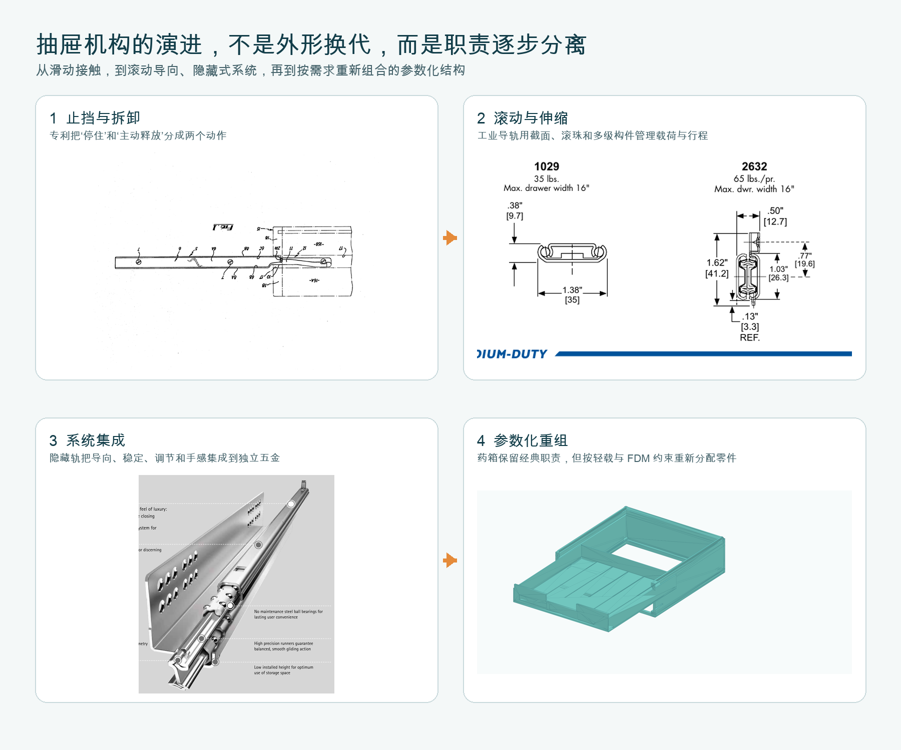

*图 1　抽屉技术的四个关键跃迁。图中机械轮廓不是生成模型想象出来的：前三格分别摘自 [US4212503A 专利](https://patents.google.com/patent/US4212503A/en)、[Accuride 官方截面目录](https://www.accuride.com/media/pdf/accuride-drawer-slide-wood-catalog-2023.pdf) 与 [Hettich Quadro 官方资料](https://www.hettich.com/fileadmin/Media_Center/Catalogue/HAU_Quadro_Runner_15789_en.pdf)，最后一格来自我们的真实药箱 CAD。它表达的是能力分工，不冒充唯一历史年代线。*

> [!summary] 一句话结论
> 抽屉不是一个盒子，而是一个**只允许沿一个方向运动、同时承受偏载，并在终点安全停住且可被有意拆下的机构**。世界上的抽屉看似千变万化，本质都在分配七项职责：承重、导向、侧向约束、抗抬起、行程止挡、主动释放、柜体稳定。

先不要把抽屉想成家具。把它想成一个盒子和一个固定框架：盒子平时只能前后移动；拉到终点必须停；清洁时又必须能通过一个额外动作完整取下。只要这三句话还没有分别对应到具体零件，模型看起来再像抽屉也不算设计完成。

我们已经为了一个药箱试过许多局部结构：导轨、堆叠接口、卡扣、止挡、释放槽、加强筋。几次失败并不是因为“抽屉太难”，而是因为我们曾把成熟产品中的几个职责压缩成一个小凸点或一段截面，希望它同时完成导向、锁止、释放和可打印性。成熟抽屉的智慧恰好相反：**让每个界面只承担少数清楚的任务，再用数学验证它们不会互相堵死。**

这篇文章不追求考证“世界上第一个抽屉”。家具史并不存在一条单线谱系，许多结构也在不同地区重复出现。这里采用更有用的工程演进：从最小可用结构开始，观察每次新增零件究竟解决了哪个瓶颈。

## 1. 先从最简单的抽屉开始

想象一个木盒直接放在柜子的水平隔板上。你拉前脸，盒底与隔板相对滑动。它已经是抽屉，因为柜体限制了盒子的大部分运动，只留下前后平移。

这个最小系统只有三件事：

1. 盒子保存物品；
2. 隔板承受重量；
3. 两侧柜壁粗略限制左右偏移。

它也立即暴露四个问题：接触面积大所以摩擦大；木材湿胀后间隙会变化；偏着拉时容易歪斜卡住；拉到底时可能整盒掉出来。后来的两千种导轨，几乎都可以理解为对这四个问题的不同回答。

### 第一条数学：为什么它拉得动

设抽屉和内容物总重量为 \(W\)，支撑面对抽屉的法向力近似为 \(N=W\)，滑动摩擦系数为 \(\mu\)。匀速拉动时，手至少需要克服：

$$
F_{pull} \geq F_f = \mu N \approx \mu W
$$

这条式子没有说“滚珠一定比塑料好”，但指出三个设计杠杆：减小载荷、降低接触界面的摩擦系数、把滑动摩擦改成滚动接触。蜡过的木导轨、尼龙滚轮、钢珠和可更换低摩擦条，走的是同一条物理路线。

### 第二条数学：为什么偏着拉会卡

若手的拉力没有穿过导向系统的中心，而是横向偏了距离 \(e\)，就产生使抽屉转斜的力矩：

$$
M_{yaw}=F_{pull}\,e
$$

两条导轨间距为 \(b\) 时，左右界面要用一对反力抵抗它，量级约为 \(M_{yaw}/b\)。因此宽抽屉、单手拉角落、左右间隙不一致时更容易“楔住”。解决方法不是无止境放大间隙，而是增加导向长度、拉开左右支撑间距、提高两侧平行度，或让左右导轨同步。

例如拉力为 10 N，手离中心 80 mm，偏航力矩就是 (10\times0.08=0.8\ \mathrm{N\cdot m})。如果左右支撑间距只有 160 mm，两侧需要形成量级约为 (0.8/0.16=5\ \mathrm{N}) 的反力差来抵抗转斜。这个数值例子只说明力如何传递；是否真的卡住，还取决于导向长度、摩擦系数和实际间隙。旧版文章用一张手写动画把“转斜”画成固定轨迹，容易让人误以为它是实测结果，因此这一版将它撤掉。

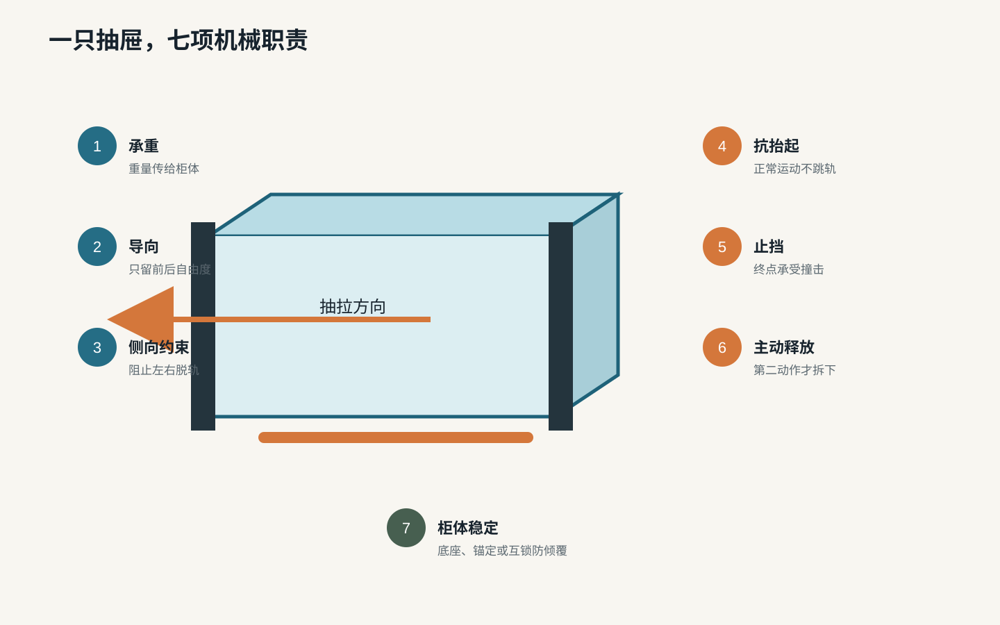

*图 2　抽屉系统的七项职责。这是一张职责清单，不是尺寸图；设计评审时应为每项职责找到真实承担零件。*

## 2. 看懂所有抽屉的统一语言

以后看到任何抽屉，不要先问它属于什么品牌，先问下面七个问题。

| 职责 | 要回答的问题 | 常见承担者 | 失效后的感受 |
|---|---|---|---|
| 承重 | 重量从盒底如何传到柜体？ | 隔板、侧托条、滚轮、滚珠、底装轨 | 下垂、摩擦增大、断裂 |
| 导向 | 为什么只沿前后方向移动？ | 长槽、侧壁、轨道轮廓、滚珠保持架 | 摇摆、斜卡 |
| 侧向约束 | 为什么不会左右脱轨？ | 双侧包络、槽唇、侧滚珠 | 碰壁、单侧脱出 |
| 抗抬起 | 正常抽拉为何不会向上跳出？ | 上唇、反向滚轮、轨道闭合截面 | 翘头、越过止挡 |
| 行程止挡 | 拉到终点如何可靠停下？ | 刚性挡肩、轨端挡块 | 整盒掉落 |
| 主动释放 | 清洁时如何完整取下？ | 抬前端、拨杆、按钮、弹片 | 永久困住，或日常误脱 |
| 柜体稳定 | 抽屉伸出后整柜为何不前翻？ | 柜体自重、宽底座、墙锚、互锁 | 柜体倾覆 |

这里最重要的区别是：**止挡不是释放，卡住也不等于稳定。** 正常拉动只有一个自由度；完全拆卸应要求一个日常动作中不会偶然出现的第二自由度，例如先抬起前端、再继续拉，或同时拨动左右释放杆。

## 3. 先看真实剖面，再认识导轨家族

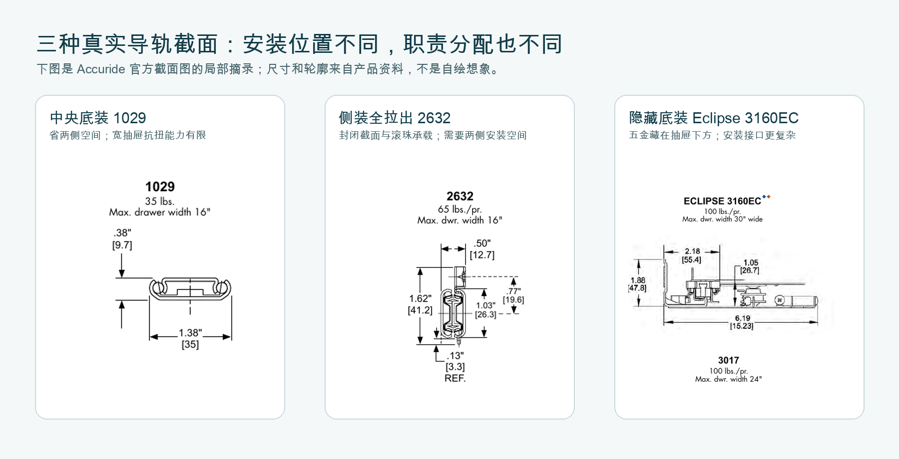

*图 3　三种真实导轨截面。左图的 1029 放在抽屉底部中央；中图的 2632 安装在侧面；右图的 Eclipse 3160EC 隐藏在底部。轮廓、尺寸和额定信息均来自 [Accuride 官方目录第 4 页](https://www.accuride.com/media/pdf/accuride-drawer-slide-wood-catalog-2023.pdf)，本文只做裁剪和中文职责标注。*

这张图先纠正一个常见误解：所谓“导轨类型”不是换一个外观名称，而是决定**重量落在哪里、左右晃动由谁限制、需要让出多少安装空间、能伸出多远**。同样是让抽屉前后移动，三个截面的受力路径已经完全不同。

### 3.1 面接触木滑道：最少零件，最高环境敏感性

抽屉底在隔板上滑，或抽屉侧边搁在木托条上。优点是便宜、安静、容易修；缺点是摩擦和间隙受表面、灰尘、湿度影响。传统木工会顺木纹、留季节性间隙、上蜡，并用较长导向面降低偏转。

它教给 3D 打印的不是“照抄木条”，而是：对轻载药盒，**连续宽托面本身就可以是合格导轨**。我们不必为了看起来高级而打印微型滚珠机构。

### 3.2 中央导向：节省两侧空间，但抗扭弱

单条 T 形或燕尾形轨放在底部中央，可以把侧面完全让给箱体。它对窄而轻的抽屉很好；但宽抽屉在角落受力时，单中心轨抵抗偏航的力臂较短，容易左右摆。燕尾还会同时约束抬起，间隙太小便会大面积摩擦。

### 3.3 双侧滚轮轨：用少量滚动接触换取轻快

常见白色金属轨在柜体和抽屉上各有滚轮，通常结构简单、成本低，并能部分拉出。它不追求轨道完全闭合，而靠滚轮位置和翻边同时承重、导向、抗脱。

代价是滚轮和轨道有明确的前后装配关系；全拉出能力有限；磨损或安装不平行会让左右高度不同。它适合预算敏感、载荷中等、允许部分伸出的家具。

### 3.4 侧装滚珠伸缩轨：把行程拆给多根轨件

两节轨的运动只发生在一对相邻构件之间；三节轨加入中间轨，运动变成“外轨—中轨”和“中轨—内轨”两段相对位移的叠加。钢珠把相邻轨件的滑动改成滚动，保持架负责让钢珠不挤成一团。全拉出因此不是一根轨道被拉长，而是多段有效行程相加。具体各段移动比例由产品内部同步方式决定，不能只凭外观动画假定；旧版三节轨动画因此不再作为证据保留。

这类轨道承重明确、行程大、适合工具柜和设备，但占用抽屉两侧空间，安装平行度和“侧隙”必须满足规格。

Accuride 的选型资料把载荷、柜深、抽屉尺寸、侧向安装空间、行程和拆卸方式列为独立参数。其载荷额定值也来自循环、全伸出静载和冲击止挡测试，而不只是一次静态承重。[Accuride 选型资料](https://www.accuride.com/media/amasty/amfile/attach/5c4b048c4fedc3c9951bc3a1189a1ac5.pdf) · [载荷测试说明](https://www.accuride.com/en-us/blog/diy/how-to-install-drawer-slides/determine-load-rating-for-drawer-slide)

### 3.5 底装隐藏轨：把机械复杂度做成独立系统

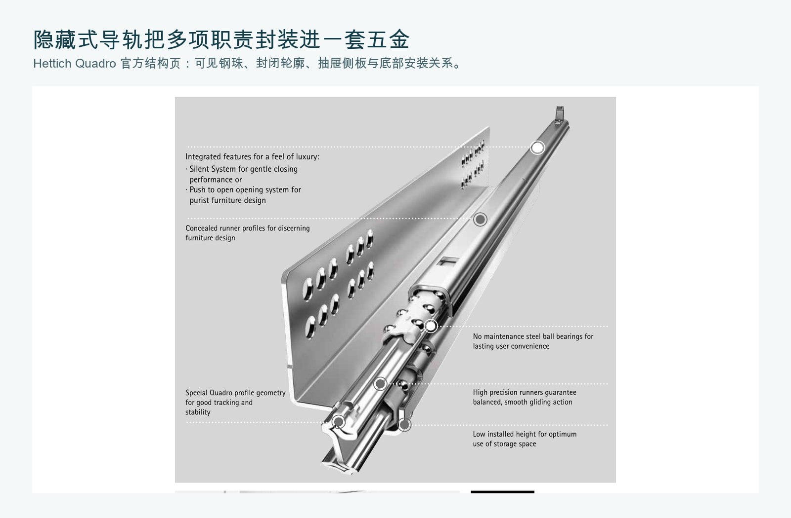

*图 4　Hettich Quadro 的真实产品结构。钢珠位于成形钢轨内部，抽屉侧板和底板包在五金外侧；这就是“隐藏”的含义。图像摘自 [Hettich Quadro 官方 PDF 第 2 页](https://www.hettich.com/fileadmin/Media_Center/Catalogue/HAU_Quadro_Runner_15789_en.pdf)，未重绘机械结构。*

隐藏轨让木抽屉侧面保持干净，并把拆装、调节、缓闭做成独立模块。Blum MOVENTO 使用同步运动、低摩擦滚轮、全拉出和四向调节；Hettich Quadro 用精密钢珠与封闭轮廓同时获得纵向、横向稳定。这说明现代高端导轨的核心已不只是“低摩擦”，而是**把安装误差、左右同步、前脸对缝和运动手感纳入系统设计**。[Blum MOVENTO](https://www.blum.com/us/en/products/runnersystems/movento/overview/) · [Hettich Quadro](https://www.hettich.com/en-ps/products/runner-systems/quadro)

### 3.6 塑料一体抽屉：让形状同时成为轨、挡块和释放机构

零件盒、医用推车和塑料柜常把侧槽、止挡和提起释放直接成型在抽屉上。它们没有金属五金的超长寿命和高载荷，却减少了零件数。1977 年优先权的 LB Plastics 方案已经清楚表达了一个成熟原则：刚性止挡阻止纯平移脱出，而抬起抽屉前端提供第二自由度，使凸起越过止挡。[US4212503A](https://patents.google.com/patent/US4212503A/en)

这正是我们药箱最接近的经典家族。

## 4. “能拉开多少”其实是结构选择

抽屉的行程不是越长越好，它同时决定访问性、弯矩和倾覆风险。

| 行程 | 含义 | 典型用途 | 代价 |
|---|---|---|---|
| 约 2/3～3/4 拉出 | 后部仍留在柜内 | 简单木轨、滚轮轨、小药盒 | 最后方物品不易拿 |
| 全拉出 | 后壁接近柜体前沿 | 厨房、文件、工具 | 导轨更复杂，伸出弯矩更大 |
| 超行程 | 抽屉后部越过柜体前沿 | 台面遮挡、设备维护 | 成本、安装空间和倾覆要求更高 |
| 完全取下 | 抽屉与柜体分离 | 清洁、换模块、补货 | 必须有明确释放动作 |

对于我们 229 mm 深的药箱，当前止挡在抽出 153 mm 时工作，约为抽屉深度的 66.8%；仍有 77 mm、约 33.6% 的导向啮合。它不是“少拉了一截”，而是在**可见度、抗坠落和无需金属伸缩轨**之间做的选择。

## 5. 止挡、保持、锁定、释放不是同一个词

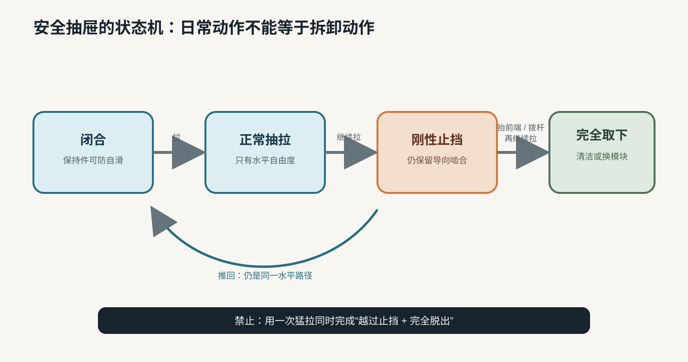

*图 5　抽屉动作的状态机。这是操作逻辑图：它说明动作顺序，不承担几何尺寸证据。*

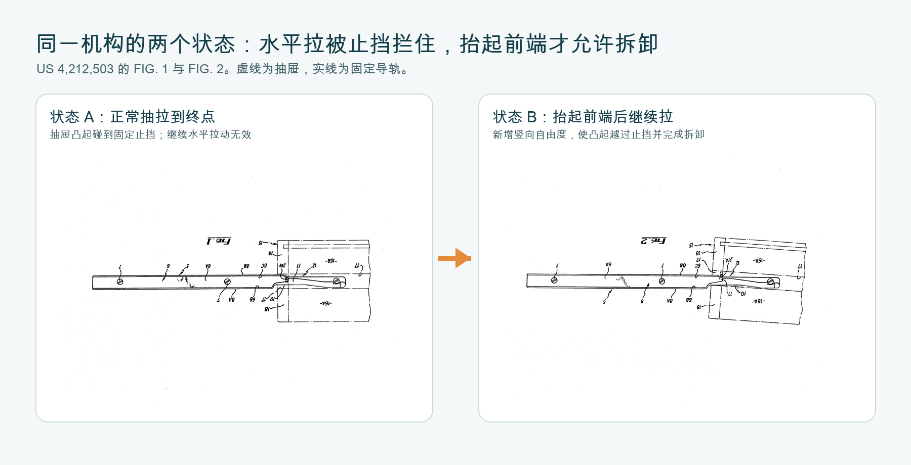

*图 6　US 4,212,503 的两张连续机械状态。FIG. 1 中，抽屉凸起 21A 碰到导轨止挡 11；FIG. 2 中，用户抬起抽屉前端，后部进入凹位 10，凸起才越过止挡。原始图纸与文字说明见[专利全文](https://patents.google.com/patent/US4212503A/en)。*

把动作慢慢拆开，就只有三步：

1. **正常拉**：抽屉只做水平平移，凸起最终撞上止挡，所以不会掉出。
2. **抬前端**：人主动加入一个竖向动作，抽屉绕前端附近转动。
3. **再继续拉**：凸起已经与止挡错开，这时才允许完全取下。

这套机构可靠的原因不是“卡得紧”，而是日常动作和拆卸动作在运动学上不同。正常使用不会偶然同时完成“拉到终点、抬起、继续拉”三步。

- **止挡（stop）**：限定最大行程，必须能承受重复撞击。
- **保持（detent/hold-in）**：用小力阻止抽屉因倾斜或振动自行滑开，允许正常拉力越过。
- **锁定（lock）**：没有钥匙、拨杆或特定动作就不能移动。
- **释放（disconnect/release）**：有意把抽屉与导轨分开。

小凸点适合做保持，不适合冒充安全止挡。我们在 C1B-R2 中经历过“防滑凸起太小、完全卡不住”，又经历过薄卡扣颈在取件时断裂。这并非单纯尺寸问题：柔性小凸点承受的是反复弯曲，刚性梯形肩承受的是面接触压缩，两者的载荷路径不同。

成熟金属导轨也把释放单独设计。Accuride 列出摩擦分离、拨杆分离、按钮分离和整轨分离等类型；高载荷产品常用拨杆，而不是要求用户猛拉越过止挡。[Accuride 拆卸方式](https://www.accuride.com/en-us/blog/diy/how-to-install-drawer-slides/slideology-101-art-disconnect)

## 6. 抽屉为何会让整个柜子翻倒

抽屉拉出后，内部重量的作用点向前移动。设抽屉与药品重量为 \(W_d\)，其重心伸出柜体前支点的水平距离为 \(x\)；柜体剩余重量为 \(W_c\)，重心在支点后方距离为 \(a\)。忽略其他作用时：

$$
M_{tip}=W_d x,\qquad M_{resist}=W_c a + M_{anchor}
$$

要有安全余量，不应只满足两边刚好相等，而应让：

$$
M_{resist} \geq S\,M_{tip}\quad (S>1)
$$

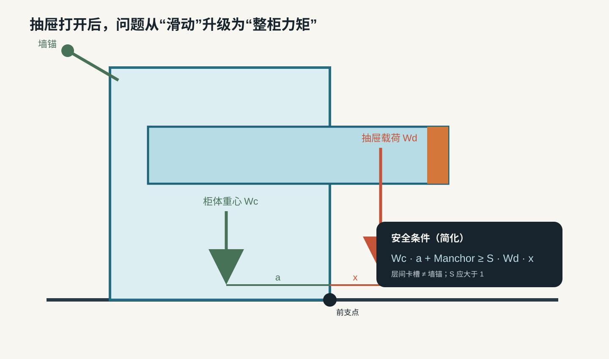

*图 8　抽屉伸出会把载荷重心前移。堆叠接口只能防止层与层分开，不能自动替代柜体抗倾覆与墙体锚定。*

旧版用动画画出了一个会逐渐前翻的柜体，但当时没有输入真实柜重、药品重量、底座尺寸和墙锚能力。那只能表达趋势，不能判断我们的塔是否安全。本版撤掉这张动画：在四个输入被实测前，只保留上面的符号关系，不给虚假的“精确运动”。

这解释了一个容易混淆的事实：乐高式层间连接可以让塔不被“拉散”，却不能保证整塔不翻。高塔仍需要足够宽的底座、与柜壁或墙体的锚定，或“一次只允许一个抽屉打开”的机械互锁。美国消费品安全委员会的家具倾覆测试也直接测量抽屉逐渐打开到何处时柜体开始倾覆。[CPSC 家具倾覆技术材料](https://www.cpsc.gov/s3fs-public/Staff%20Briefing%20Package%20on%20Furniture%20Tipover%20-%20September%2030%202016_0.pdf)

## 7. 抽屉底为什么有筋，而边上为什么可以留空

一块薄平板受载后会弯。对同样材料，抗弯能力与截面的二次矩 \(I\) 有关；矩形截面的简化表达为：

$$
I=\frac{b h^3}{12}
$$

高度 \(h\) 是三次方，所以把少量材料做成“站起来”的浅筋，通常比平均加厚整块底板更有效。我们真实抽屉的 2.4 mm 底板上布置五条 1.2 mm 宽、0.8 mm 高的纵筋，就是在增加局部截面高度、缩短无支撑板跨，同时只增加少量耗材。

筋没有延伸到最边缘，是因为边缘还有别的职责：

- 左右侧需要连续平面与框架导轨配合；
- 成对止挡槽需要贯穿底板并保留运动净空；
- 前脸需要指槽与标签面；
- 筋若撞上导轨或止挡，会把“加强结构”变成“运动干涉”。

所以“边上没凸起”并非忘画了，而是功能分区。加强筋负责底板刚度，侧边连续墙负责围挡和导向，槽负责释放运动。成熟设计的美感常来自这种分工。

## 8. FDM 不只是换一种材料，而是换一种制造物理

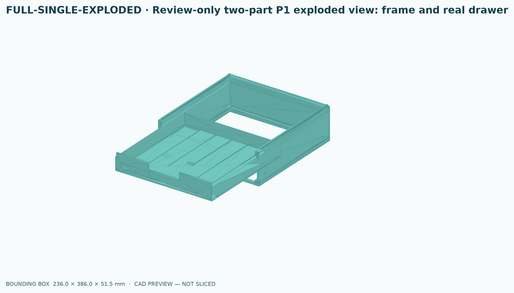

*图 8　P1 真实产品 CAD 爆炸图。前方是带底板、围挡和加强筋的完整抽屉，后方是框架；图像直接由参数化 CadQuery 模型渲染，不是文章插画。*

### 8.1 层间方向决定薄片的脆弱方向

注塑卡扣可以有细长、圆滑、各向同性较好的弹性颈；FDM 薄颈若让弯曲拉应力跨越层间，就容易沿层断。C1B-R2 的中部断点正是这种警告。药箱的主止挡因此改用较厚的刚性斜坡和挡肩，让载荷主要走压缩路径。

### 8.2 永久禁止无支撑的“宽—窄—宽”截面突扩

我们两次遇到同一种错误：墙体先变窄，再在高处突然变宽，上层没有足够承托，于是出现拉丝、分层和裂开。长期规则是：使用同宽连续墙，或给外扩提供足够高的 45° 过渡。它已成为机器可读的 Z 向截面连续性门禁，不再依赖人眼记忆。

### 8.3 向下封闭的槽顶就是桥

槽若被一层水平顶盖封住，切片器必须跨空打印，底面会出现丝状粗糙。我们的释放槽最终贯穿抽屉底板，既满足运动空间，也消除了桥接顶盖。

### 8.4 配合间隙必须由实物标定

CAD 中两个面“刚好不相交”并不等于能装配。喷嘴线宽、挤出、材料收缩、表面纹理和运动长度都会累积误差。当前 Bambu PETG、0.4 mm 喷嘴条件下，我们通过实物循环选择了每侧 0.25 mm 导轨间隙：轻推可入、阻尼轻微且均匀，20 次循环无异样。这个值是当前工艺的测量结果，不是宇宙常数。

## 9. 3D 打印抽屉有哪些可选架构

| 架构 | 打印内容 | 购买件 | 适合 | 主要风险 |
|---|---|---|---|---|
| A. 连续侧托 + 抬起释放 | 抽屉、框架、刚性止挡 | 无 | 轻载药盒、零件盒 | 摩擦、长期磨损、行程有限 |
| B. 可更换滑条 | 抽屉、框架、滑条座 | 低摩擦条可选 | 高频使用但载荷不高 | 滑条固定与材料兼容 |
| C. 打印箱体 + 侧装滚珠轨 | 箱体、支架 | 成品滚珠轨 | 全拉出、重载 | 两侧占宽、成本、安装精度 |
| D. 打印箱体 + 底装隐藏轨 | 抽屉、柜架适配件 | 成品隐藏轨 | 家具级手感与外观 | 规格严格、成本高、深度受限 |
| E. 中央 T 轨 | 抽屉、单中心轨 | 无 | 窄抽屉、两侧要留空间 | 宽抽屉抗扭不足 |
| F. 燕尾全包络轨 | 抽屉、闭合槽轨 | 无 | 需要抗抬起的小模块 | 接触面积大、易卡、打印公差敏感 |
| G. 翻斗盒 | 盒体、枢轴、限位 | 销轴可选 | 一眼可见、小包装 | 容量和密封性较差 |
| H. 一抽一锁互锁塔 | 抽屉、框架、互锁件 | 线缆/金属杆可选 | 高塔和儿童安全增强 | 机构复杂，必须系统验证 |

### 对药箱的当前选择

我们选择 A，而不是因为它“最先进”，而是因为它与需求匹配：药品原包装载荷不高；需要层薄、零件少、可清洁；柜深只有 320 mm；打印床和无支撑打印又限制了五金式长轨的复制价值。

Gridfinity 给我们的主要启发也不是复制 42 mm 网格，而是把稳定接口与容器功能分开：底层规定重复连接，抽屉内部按药盒变化。Gridfinity Rebuilt 的参数化实现允许任意单位尺寸、隔间、堆叠唇和免支撑孔，展示了“固定协议 + 可变内容”的系统价值。[Gridfinity Rebuilt OpenSCAD](https://github.com/kennetek/gridfinity-rebuilt-openscad)

但药箱比桌面小盒多两个责任：抽拉行程止挡，以及高塔抗倾覆。因此我们只迁移模块化原理，不声明尺寸兼容，也不把 Gridfinity 堆叠唇误当作抽屉导轨或安全锚点。

## 10. 一个能运行的参数化思维示例

参数化不是把数字集中到文件顶部，而是把几何关系写成可检查的契约。下面这段 Python 不生成 CAD，只计算一只双侧导向抽屉最基础的宽度链，并拒绝不可能的输入：

```python
from dataclasses import dataclass


@dataclass(frozen=True)
class DrawerFit:
    frame_inner_width: float
    clearance_per_side: float
    drawer_outer_width: float


def solve_drawer_fit(
    frame_inner_width: float,
    clearance_per_side: float,
) -> DrawerFit:
    if frame_inner_width <= 0:
        raise ValueError("frame_inner_width must be positive")
    if not 0 < clearance_per_side < 2:
        raise ValueError("clearance_per_side is outside the coupon range")

    drawer_outer_width = frame_inner_width - 2 * clearance_per_side
    if drawer_outer_width <= 0:
        raise ValueError("clearance consumes the whole drawer")

    return DrawerFit(
        frame_inner_width=frame_inner_width,
        clearance_per_side=clearance_per_side,
        drawer_outer_width=drawer_outer_width,
    )


fit = solve_drawer_fit(frame_inner_width=226.0, clearance_per_side=0.25)
assert fit.drawer_outer_width == 225.5
```

真正的 CAD 还应继续表达：止挡时剩余啮合量、抬起角与止挡净空、壁厚、筋距、打印方向、Z 向截面连续性、板边与首层沉积路径。只画出“看起来像抽屉”的网格，不算完成建模。

## 11. 我们的药箱迭代究竟学到了什么

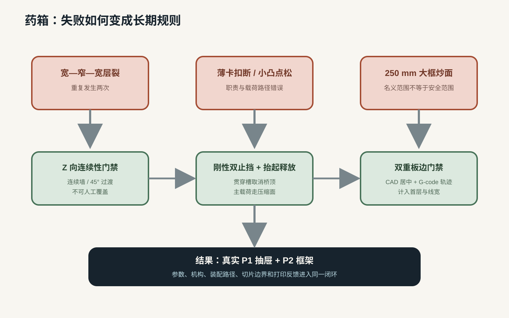

*图 9　药箱项目的关键失败不是绕路，而是把隐藏的设计变量逐一变成可验证约束。这是项目过程图，不承担机械尺寸证据。*

1. **导轨间隙券**把“有点松/有点紧”变成 0.25 mm/侧的工艺事实。
2. **宽—窄—宽层裂**把口头注意事项升级为不可人工覆盖的 Z 向连续性门禁。
3. **桥接槽顶粗糙**促使释放槽贯穿底板，打印方向与机构空间统一。
4. **薄卡扣断裂、小凸点失效**让我们停止依赖柔性小舌片承受主止挡冲击。
5. **数学释放券仍装不进去**说明计算一个局部间隙不等于拥有完整产品装配模型；必须验证真实插入路径的每个状态。
6. **250 mm 大框掉板炒面**证明名义打印范围不等于安全生产范围，最终采用 CAD 居中门禁和 G-code 沉积路径门禁。
7. **真实 P1 抽屉**把底板、围挡、筋、导向槽、止挡释放槽、前脸和标签面放回同一产品 CAD，消除了“测试件会工作、产品却没有盖子”的语义断裂。

当前真实模块的核心参数是：框架 236 × 236 mm，抽屉 225.5 × 229 × 26 mm，底板 2.4 mm；Bambu PETG、左侧 0.4 mm 喷嘴、Textured PEI Plate；每侧运动间隙 0.25 mm。它目前是一层真实可用模块，不自动证明七层塔、层间锁、墙体锚定和长期磨损已经完成。

下面这张动图与旧版概念动画有本质区别。它逐帧加载同一份生产参数和同一套 CadQuery 实体：先从闭合位置拉到 153 mm 止挡点，此时仍保留 77 mm 导向啮合；随后把抽屉前端抬高 6.5 mm，再继续拉出。碰撞检查要求纯水平拉动不能穿过止挡，而抬起后必须获得释放净空。

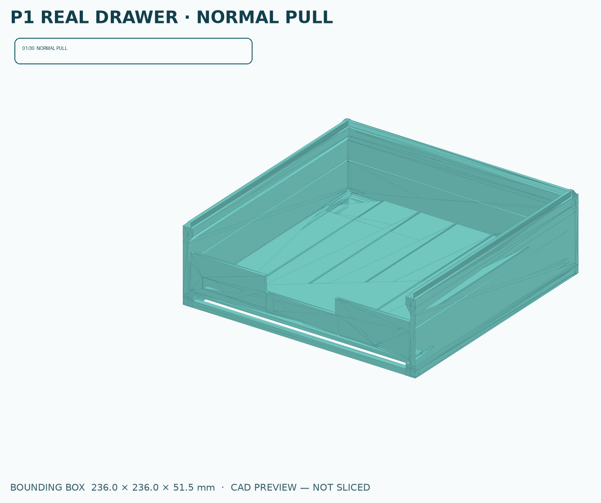

*图 10　P1 真实 CAD 运动验证。它使用 `parameters-v1.0-p1.json` 中的生产尺寸渲染；框架、抽屉、止挡和释放槽都来自实际模型。画面仍是 CAD 运动验证，不等于实物寿命测试，但每一帧都能回到具体几何。*

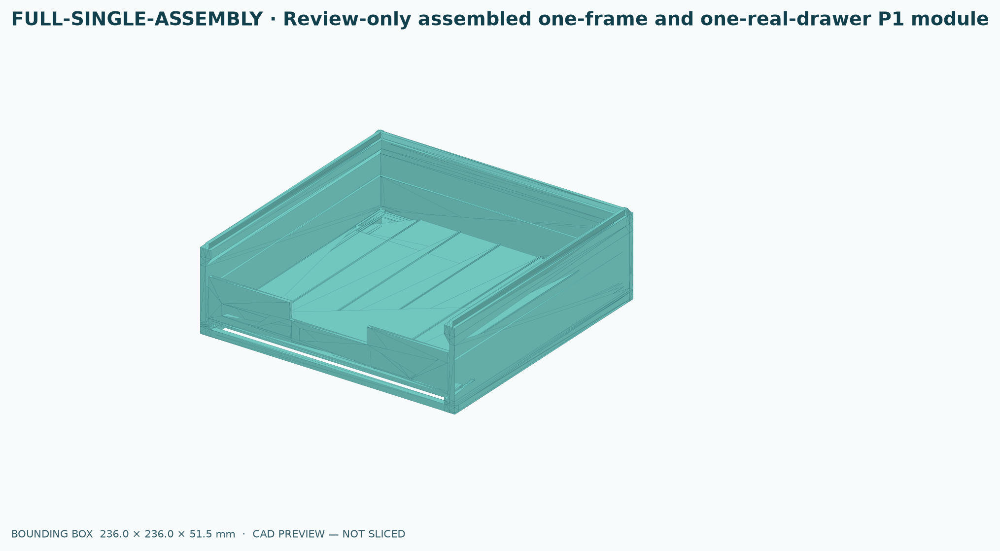

*图 11　同一模型的闭合装配状态。把静态装配图与上方运动图对照，可以看清：抽屉不是在框架上随意滑动，而是始终由左右连续导向面承托。*

## 12. 如何为一个新抽屉选架构

按以下顺序决定，比先画外形可靠：

1. **物品与安全**：装什么、总重多少、是否怕倾倒、儿童能否接触？
2. **访问方式**：只需拉出 2/3，还是必须全拉出或整盒取下？
3. **寿命与手感**：一天一次还是一分钟十次？允许轻微摩擦，还是要家具级缓闭？
4. **空间预算**：左右能否牺牲给侧轨，底部能否留给隐藏轨？
5. **制造选择**：全部打印，还是打印结构、购买成熟导轨？
6. **职责映射**：七项职责分别由哪个实体承担？任何一项不能写“靠摩擦大概可以”。
7. **最危险接口券**：先打印间隙、止挡、拆卸或锁止，不要微缩整个塔来假装验证真实载荷。
8. **产品级运动验证**：检查插入、闭合、正常抽出、止挡、释放、重新装回六个状态，而非只检查单个截面。
9. **柜体级验证**：多层装载、单抽/多抽伸出、层间连接、墙锚与倾覆分开验收。

## 13. 未来值得探索的药箱设计

### 方案一：当前架构的成熟化

保留连续侧托、双侧刚性止挡和抬前端释放；增加可替换磨耗条、前后防晃导向段、塔顶防尘盖和柜体锚定。这条路线零件最少，最适合先完成日常混合塔。

### 方案二：打印件与五金混合

药量增加、单抽变重或明确需要全拉出时，不应打印一个劣化版滚珠轨。购买有载荷和循环规格的短行程成品轨，打印抽屉、框架和适配座，把 FDM 用在定制容积，把精密滚动交给工业件。

### 方案三：可重构内盒

外抽屉保持固定，内部采用 Gridfinity 式可更换药盒托、标签块和竖向分隔。这样药物种类变化不会迫使导轨和塔架重打。注意仍只收纳原包装，不让裸药片接触打印面。

### 方案四：单抽开启互锁

高塔可加入纵向联动杆：一个抽屉打开后，杆件移动并阻止其他层启动。这比单纯加深堆叠卡槽更直接地控制倾覆源，但它是一个新的安全机构，必须经历独立 PRD、经典先例门禁、故障状态分析和真实载荷循环。

### 方案五：抽屉之外的选择

不常用的小药可以用翻斗盒，一眼可见；同规格补充装可用可取下料箱；需要先进先出的消耗品可用重力滑道。理解抽屉原理的终点不是“所有东西都做抽屉”，而是知道什么时候抽屉不是最佳机构。

## 14. 最后把抽屉重新看一遍

一个好抽屉同时是：

- 一根受偏载的移动梁；
- 一套单自由度约束机构；
- 一对需要制造公差的摩擦界面；
- 一个带终点、保持与拆卸语义的状态机；
- 柜体倾覆系统中的移动质量；
- 在 FDM 中由逐层沉积重新解释的几何。

这也是为什么当前抽屉里确实蕴含了许多人类智慧。我们不是从零发明了抽屉，而是在木工、塑料成型、家具五金、工业滑轨、模块化收纳和增材制造之间做翻译。真正属于我们的设计工作，是把这些成熟原理按药箱的载荷、空间、打印机和使用方式重新组合，并把每一条假设变成数字、测试或机器门禁。

## 资料与证据边界

本文是工程原理综述，不是专利自由实施分析，也不宣称给出抽屉的完整全球年代史。历史段落按“瓶颈—机制”组织；产品性能仅采用制造商官方资料；安全部分采用 CPSC 材料；具体药箱结论来自本地已记录的设计与实物反馈。

- [Blum：Runner systems 总览](https://www.blum.com/us/en/products/runnersystems/overview/)
- [Blum：MOVENTO 原理与功能](https://www.blum.com/us/en/products/runnersystems/movento/overview/)
- [Blum：TIP-ON BLUMOTION 机械触碰开启与缓闭](https://www.blum.com/us/en/products/motion-technologies/tip-on-blumotion/movento/overview/)
- [Hettich：Quadro 隐藏式滚珠导轨](https://www.hettich.com/en-ps/products/runner-systems/quadro)
- [Accuride：抽屉轨选型资料](https://www.accuride.com/media/amasty/amfile/attach/5c4b048c4fedc3c9951bc3a1189a1ac5.pdf)
- [Accuride：载荷额定与循环/静载/冲击测试](https://www.accuride.com/en-us/blog/diy/how-to-install-drawer-slides/determine-load-rating-for-drawer-slide)
- [Accuride：四类拆卸方式](https://www.accuride.com/en-us/blog/diy/how-to-install-drawer-slides/slideology-101-art-disconnect)
- [US4212503A：刚性止挡与抬起释放](https://patents.google.com/patent/US4212503A/en)
- [CPSC：家具倾覆技术材料](https://www.cpsc.gov/s3fs-public/Staff%20Briefing%20Package%20on%20Furniture%20Tipover%20-%20September%2030%202016_0.pdf)
- [Gridfinity Rebuilt OpenSCAD](https://github.com/kennetek/gridfinity-rebuilt-openscad)
- 本地项目文档：[[../项目/药箱收纳/药箱收纳总方案-PRD-v1.0]]、[[../项目/药箱收纳/P1-真实单层药箱-设计与生产交付-v1.0]]
