# AI 桌宠市场图谱：从可爱外壳到本地智能体入口

> **核心判断：AI 桌宠不是“给聊天机器人套一张可爱的脸”，而是把原本藏在电脑和云端里的智能体，变成一个可以被看见、打断、授权和信任的本地入口。** 可爱负责让人愿意长期把它留在桌面上；真正决定价值的，是它能否理解当前工作、接入既有生态，并用清楚的界面展示自己正在做什么、还需要什么权限。

今天的技术条件已经开始支持这种变化：自然语言和语音正在替代一部分传统菜单；手机和 IM 可以成为远程指令入口；PC 负责运行 Codex、OpenClaw、本地工具与浏览器，逐渐像一台个人服务器。桌宠最合理的位置，不是再造一台能力受限的小电脑，而是成为这套本地智能体系统的**可视化表盘、语音终端和物理权限开关**。

本文是截至 **2026 年 7 月 18 日** 的市场研究快照。入选样本至少满足一项：已经形成可识别产品、具有持续用户影响、开放硬件或软件供开发者扩展，或以概念机形式直接探索“AI 工作搭子”的下一代交互。厂商宣称、可验证能力与作者判断会尽量分开表达。

> [!note] 图片与发布说明
> 产品图片主要来自官网、官方项目仓库或有署名的现场报道，仅用于产品识别、比较与评论；每张图片均在相邻位置标明来源，相关权利归原权利人所有。第一章的最终设计概念图为本文原创构想，由 OpenAI 图像生成工具辅助绘制。

## 第一章：最终设计——一只会替你戴耳机的本地 Agent Host

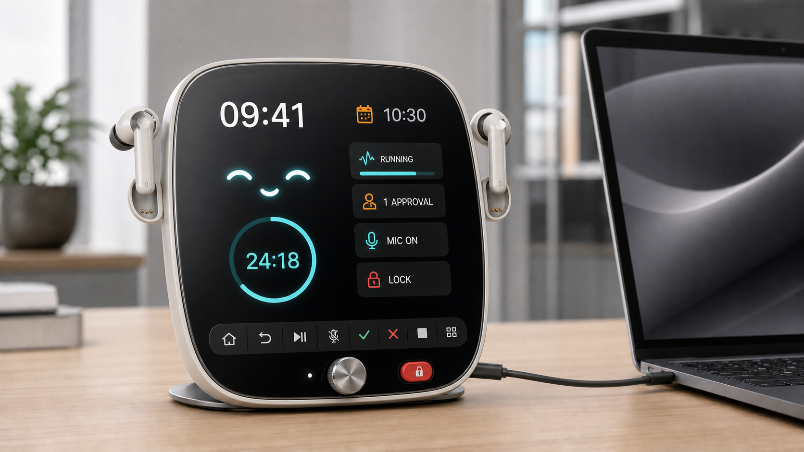

*图：本文原创产品构想，由 OpenAI 图像生成工具辅助绘制；它不是已经上市的商品。*

> **一句话产品定义：它首先是一座耳机坞，其次是一块高信息量的 Agent 表盘，最后才是一只有可爱表情的桌宠。核心软件运行在 PC 上，它通过 USB-C 成为电脑的语音、显示、授权与托管终端。**

### 1.1 耳机不是配件，而是人和 Agent 之间的“会话钥匙”

桌宠平时在机身两侧磁吸着一对真正可供人使用的真无线入耳式耳机。两只耳机像它的小耳朵，耳机柄自然嵌入带充电触点的凹槽；耳机收纳、充电和角色设计因此是同一件事，不再需要额外摆放充电盒。机身也不应该是厚重的方盒子，而是一块略有弧度、屏幕几乎覆盖整个正面的轻薄表盘。

当用户来到办公室，把耳机从桌宠头上取下来并戴上，就主动进入一段持续的全双工会话：

1. **无需唤醒词。** 从桌宠上取下一只或两只耳机并戴上，本身就是清楚的同意动作。耳机的入耳检测开始会话，本地语音活动检测负责判断用户是否在讲话，用户可以像和同事一样随时插话、打断和补充上下文。
2. **对话和工作流不中断。** 用户可以一边阅读、写代码或走动，一边继续向同一个 Agent 追问；Agent 执行耗时任务时，桌宠表盘持续显示进度，不需要把聊天窗口一直置顶。
3. **摘下即结束开放麦克风。** 耳机离耳后，持续收音立即停止；把两只耳机吸回桌宠的“小耳朵”位置，则同时结束会话、开始充电。用户不用猜它此刻是否还在听。
4. **静音入口不只一个。** 耳机柄的按压手势可以静音，桌宠正面也有独立麦克风键和红色隐私锁。耳机静音、桌宠锁定和 PC 端权限状态必须保持一致。

这比“永远开着的远场麦克风 + 唤醒词”更适合开放办公室：它减少误唤醒，也把隐私状态变成一个可感知的动作。桌宠本体仍可保留扬声器与近场按键交互，但无需唤醒的连续交流只在用户明确戴上耳机后开启。

### 1.2 硬件应该简单，把复杂度留在电脑端

| 模块 | 最终设计 | 作用 |
|---|---|---|
| 耳机 | 一对带耳机柄的真无线入耳式耳机，支持入耳检测、按压静音和充电触点 | 用户的连续语音入口；归还后成为桌宠两只“小耳朵” |
| 桌宠本体 | 4—6 英寸防眩光屏，正面屏占比约 82%—88%，采用窄边框、轻薄弧面机身和稳定薄底座 | 表情、表盘、通知、审批与在场感，避免家电式方盒外观 |
| 耳机接口 | 机身左右各一个磁吸凹槽，为单只耳机定位并接触充电，不使用专用充电盒 | 让收纳行为自然完成充电，也形成可识别的角色轮廓 |
| USB-C | 一根线连接 PC，传输电源、数据、音频和控制事件，同时给耳机充电 | 把桌宠变成稳定的电脑外设，而非另一台需要单独维护的电脑 |
| 物理控制 | Home、返回、播放 / 暂停、麦克风静音、批准、拒绝、停止 / 打断、模式 / 工作流八个图标键，另有旋钮和独立红色隐私锁 | 覆盖高频操作，减少每件事都要先说一句话或打开电脑 |
| 计算架构 | PC 运行本地 Agent Host；桌宠只承担 UI、音频桥接、设备控制与安全状态 | 电脑升级时不淘汰桌宠，也避免把账户和业务逻辑锁进固件 |

USB-C 是这套设计的轴心。它让桌宠开机即在线，不需要单独配网；让音频、屏幕状态和物理按键拥有低延迟、可调试的通道；也让桌宠在替用户“戴着两只小耳朵”的同时成为耳机充电座。蓝牙可以用于用户戴上耳机后的短距离音频连接或手机接入，但不应该承担桌宠与主机之间唯一的关键链路。

### 1.3 UI 是“表情 + 表盘组件”，不是缩小的聊天窗口

桌宠可以很可爱，但表情不应永久占满整块屏幕。高屏占比不是为了显示更大的一双眼睛，而是为了让表情和信息组件同时成立：表情承担在场感和状态反馈，剩余空间由可配置的 Complications 承担信息。用户在一两秒内应该能读出：

- 当前时间、下一场会议和日程冲突；
- 番茄钟、倒计时和勿扰状态；
- Codex / OpenClaw 正在执行的任务、当前工作流节点和大致剩余时间；
- 哪个 IM 或应用产生了新任务、是否已有回复草稿；
- 正在等待用户批准的动作及风险等级；
- 麦克风、耳机、屏幕感知、远程连接和电脑托管状态。

它至少需要六种可切换表盘：**在场、日程、专注、工作流、收件箱、隐私**。旋转物理旋钮可以快速浏览，八个高频按键则直接完成返回、暂停、静音、批准、拒绝和紧急打断；完整聊天、长文档和复杂设置仍回到电脑或手机。表情不是 UI 的装饰，而是统一状态语法的一部分：专注时收敛、等待批准时注视用户、阻塞时明确表达失败，但任何动画都不能遮挡隐私和风险指示。

### 1.4 软件核心：它可以托管整台电脑，但不是永久拥有整台电脑

真正的产品不是屏幕和舵机，而是安装在 PC 上的 **Local Agent Host**。它保存身份、记忆、任务状态、权限租约和审计记录，并向上连接 Codex、OpenClaw 与不同模型，向下连接操作系统、浏览器、日历、IM、文档、设计软件和打印机。

桌宠应提供三档电脑控制模式：

| 模式 | 能力范围 | 适用场景 |
|---|---|---|
| 助手 | 读取明确选中的上下文，回答、搜索和展示状态 | 日常问答、查日程、查看任务进度 |
| 协作 | 打开应用、整理文件、生成草稿、准备命令，但重要结果等待确认 | 写代码、准备钉钉回复、整理会议材料 |
| 托管 | 在限定时间、目标、应用和权限内自主操作电脑，遇到风险节点暂停 | 长时间 Codex 任务、批量办公流程、用户离开工位后的继续执行 |

“随时托管整个电脑”不应该等于永久授予 Root 权限。正确做法是为每次托管生成一张可见的**任务级能力租约**：允许哪些应用、能否联网、可以运行多久、哪些动作必须暂停。桌宠表盘始终显示托管中的任务，用户戴着耳机时可以直接打断，离开时也可以通过手机或 IM 查看、追加指令和批准下一步。

生态接入遵循一个简单顺序：**稳定 API / MCP 优先，操作系统自动化其次，Computer Use 兜底。** 例如回复钉钉时，桌宠可以听取口述并生成草稿；小屏只显示收件人、摘要和风险；用户按下确认键或在耳机里确认后才真正发送。打印、上传、发布、购买和系统设置变更采用同样的闭环。

### 1.5 隐私锁是产品正面的一部分

锁定键必须同时锁住两个平面：

- **感知平面**：电气级切断桌宠与耳机麦克风，停止屏幕感知，并让摄像头或其他传感器进入可验证的关闭状态。
- **行动平面**：冻结当前 Agent 的外部写入能力和高风险工具，撤销临时权限租约；已经运行的任务退回只读或等待批准。

屏幕上的 `MIC ON`、远程连接和 `LOCK` 不能被宠物皮肤、全屏动画或第三方组件遮挡。物理锁定键使用与机身明显不同的颜色；长按执行紧急停止；恢复时不自动找回全部权限，而是让用户重新选择助手、协作或托管模式。

这套最终设计的意义在于：**耳机解决连续交流，USB-C 解决稳定连接和充电，表盘解决信息密度，本地 Agent Host 解决软件生态，物理锁解决信任。** 可爱让人愿意把它留在桌上，但无缝接入整个数字工作环境，才让它成为真正的工作搭子。

## 第二章：市场图谱

| 类型 | 产品 | 公司 / 团队 | 当前形态 | 最有代表性的价值 |
|---|---|---|---|---|
| 软件原生 | OpenAI Pets | OpenAI | 已上线的软件功能 | 用宠物状态压缩多个智能体任务的进度 |
| 软件原生 | CodexPet Nest | 社区项目 | 开源早期项目 | 把桌宠扩展为时间、用量、番茄钟和快捷动作表盘 |
| 软件原生 | Buddy | Fiora Studio / 社区 | 开源 MCP 服务 | 跨 Codex、Claude、Cursor、OpenClaw 保留同一个伴侣与记忆 |
| 开放平台 | Stack-chan | ししかわ / M5Stack 社区 | 开源软硬件并商品化 | 极低门槛的可改造桌面机器人底座 |
| 开放平台 | Reachy Mini | Pollen Robotics / Hugging Face | 开源开发平台 | 把模型、Python、传感器和应用分发连接起来 |
| 开放平台 | PixClaw | 社区团队 | 候补 / 早期原型 | 直接为 OpenClaw 状态设计的像素硬件终端 |
| 办公入口 | Loona DeskMate | KEYi Tech | 众筹 / 产品化阶段 | 借助手机屏幕，把桌宠推进到工作流与屏幕上下文 |
| 办公入口 | Lenovo AI Workmate | Lenovo | 概念机 | 以办公任务为中心的具身 AI 交互实验 |
| PC 原生 | LuckyClaw / AI Holostage | MSI | 已发布，交付与生态仍待观察 | 将本地 Agent 与实体显示直接集成进 PC 机箱 |
| 影响样本 | Vector | Anki，后由 Digital Dream Labs 承接 | 存量产品与开发生态 | 展示云依赖风险，也保留 SDK 与本地化改造路径 |
| 影响样本 | EMO | LivingAI | 在售 | 小体积、多传感器、高表情密度的消费级桌宠 |
| 影响样本 | Eilik + AI Station | Energize Lab | 在售 | 用模块化底座为原有情绪桌宠补上 AI 能力 |
| 影响样本 | aibo | Sony | 长期运营产品 | 云端学习、情感关系与订阅式服务的成熟样本 |
| 影响样本 | LOVOT | GROOVE X | 在售 | 以“关系和陪伴”而非效率为第一目标的高端机器人 |
| 影响样本 | Moflin | Casio | 在售 | 几乎没有工具属性，却把情绪反馈做到极致 |

这张图谱其实包含四种完全不同的产品：**宠物皮肤、信息表盘、本地 Agent Host、情感机器人**。它们外观可能相似，却不应该用同一套标准评价。

### 2.1 软件先行：桌宠首先是 Agent 状态界面

#### 1. OpenAI Pets：把智能体进度压缩成一个角色

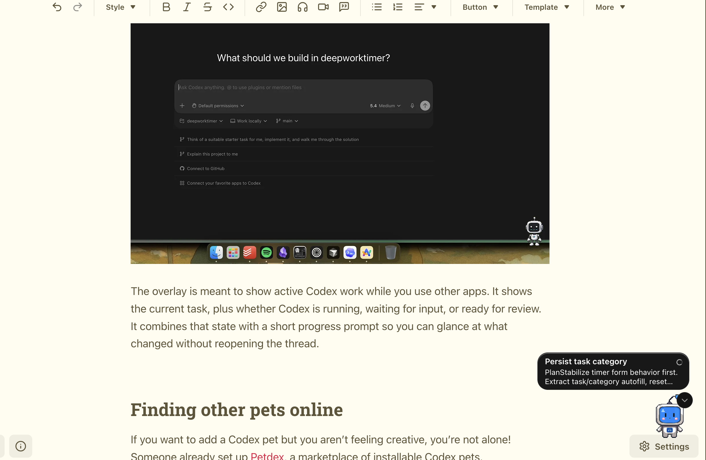

*图：第三方实际使用截图，来源 [The AI-Augmented Engineer](https://www.augmentedswe.com/p/how-to-use-codex-pets)；功能定义以 [OpenAI Pets 文档](https://learn.chatgpt.com/docs/pets) 为准。*

- **公司与状态**：OpenAI；已进入 ChatGPT / Codex 的桌面端、Web 与部分终端界面。
- **设计与 UI**：宠物并不承担主要对话，而是用动作和活动托盘表达 `Running`、`Needs input`、`Ready`、`Blocked` 四类任务状态；多个任务同时活动时，优先展示需要用户输入和阻塞的任务。
- **能力边界**：官方明确说明，选择不同宠物只改变外观，不改变 ChatGPT 完成任务的方式。它是智能体工作的状态投影，不是一个新的执行引擎。
- **生态与权限**：价值来自背后的 Codex、Computer Use、插件和本机工作区。自定义宠物可在本地创建，桌面端宠物也能附着 Computer Use 的画中画窗口；真正的权限仍由宿主任务控制。
- **为什么重要**：它验证了“可爱”可以成为一种低打扰通知协议。相比不断弹出系统通知，一个持续存在、能表达等待和完成状态的角色，更适合长时间运行的智能体任务。

OpenAI Pets 目前仍然偏向“宠物皮肤 + 状态灯”。它最值得继续演化的方向，是把表情旁边的活动托盘升级为可配置的信息表盘：下次会议、倒计时、当前工作流节点、等待批准的动作，以及任务由哪个 Agent、哪台主机执行。

#### 2. CodexPet Nest：桌宠开始长出表盘和组件

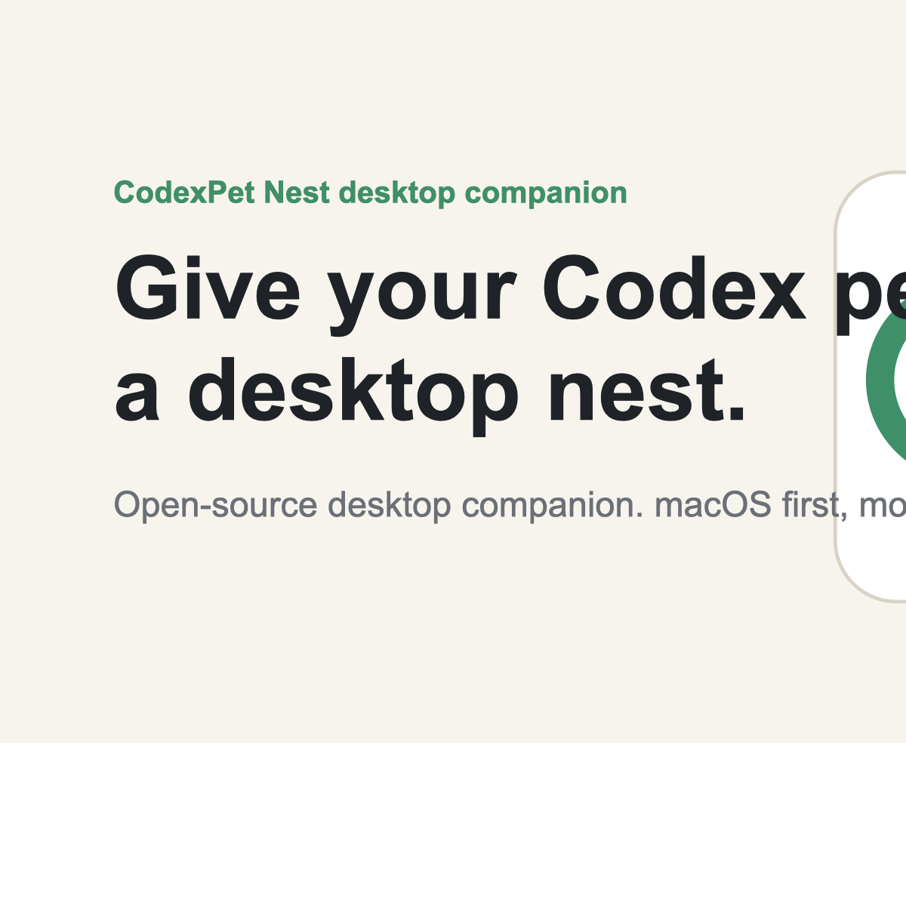

*图源：[CodexPet Nest 官网](https://codexpet.app/)。*

- **公司与状态**：独立社区项目，macOS 优先，当前仍属早期版本；项目明确声明与 OpenAI 无隶属关系。
- **设计与 UI**：把浮动宠物旁边的空间变成一个 Nest，可显示使用量、时间、倒计时、番茄钟和快捷动作。它已经非常接近 Apple Watch 的“表盘 + Complications”思路。
- **能力边界**：核心是轻量信息展示与快捷入口，不是通用自动化引擎。
- **生态与权限**：扩展包以图片、元数据和布局 JSON 为主，不允许脚本和 WebView。这牺牲了任意扩展能力，却显著降低恶意代码进入桌宠层的风险。
- **为什么重要**：它证明桌宠 UI 不必在“只有一张脸”和“缩小版聊天窗口”之间二选一。一个小型、可扫视、可更换的组件系统，可能才是长期使用的正确形态。

#### 3. Buddy：真正可迁移的是身份和协议


*图源：[Buddy GitHub 仓库](https://github.com/fiorastudio/buddy)。*

- **公司与状态**：Fiora Studio 与社区维护的开源项目；以 MCP Server 形式运行。
- **设计与 UI**：主要生活在终端和智能体会话中，通过物种、情绪、经验值、记忆和带性格的反馈建立连续身份。它没有强绑定某一块硬件或某一个客户端。
- **能力边界**：除了陪伴反应，还提供 Guard Mode，尝试识别未经验证的关键假设、过长的无质疑推理链和人机互相附和的回路。它更像“带角色的工作反思层”，不是一个独立编码 Agent。
- **生态与权限**：支持 Codex CLI、Claude Code、Gemini、GitHub Copilot、Cursor 与其他 MCP 客户端，也可借助 OpenClaw 进入 WhatsApp、Telegram 等消息界面。状态与记忆保存在本地 SQLite；项目说明推理片段以明文存储在本机，可查看、清除并自动过期。
- **为什么重要**：桌宠的长期资产不是一套动画，而是跨工具延续的身份、记忆和行为协议。如果更换 Codex、Claude 或 IM 入口就必须重新养一只宠物，这种关系很难真正成立。

### 2.2 开放硬件：可玩性决定社区上限

#### 4. Stack-chan：最接近“桌宠开发板”的开源范式

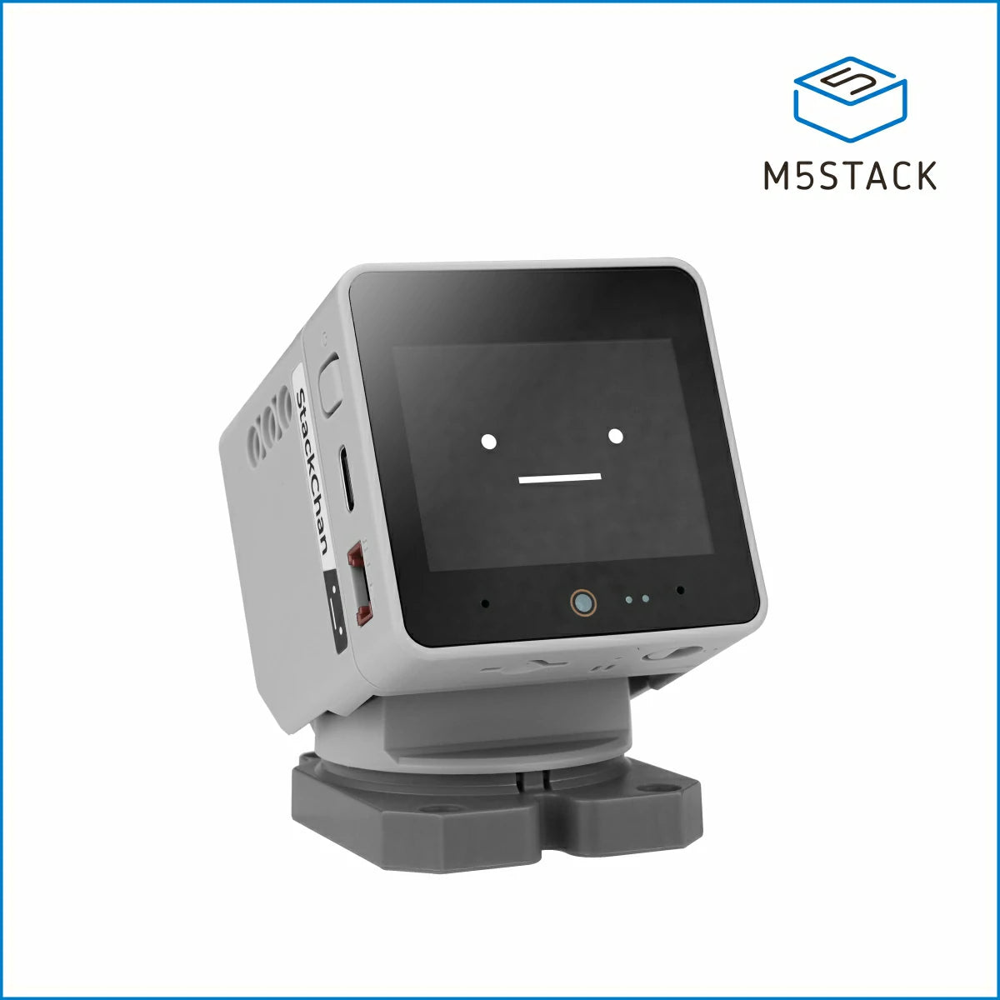

*图源：[M5Stack StackChan 产品页](https://shop.m5stack.com/products/stackchan-kawaii-co-created-open-source-ai-desktop-robot)；原始项目见 [stack-chan GitHub](https://github.com/stack-chan/stack-chan)。*

- **公司与状态**：由日本开发者 ししかわ发起，围绕 M5Stack 生态发展；固件、外壳 STL、原理图和板图公开，后续也出现 M5Stack 共创商品版本。
- **设计与 UI**：小屏幕负责表情，双舵机负责头部姿态，结构简单但足以产生明显的生命感。UI、动作和外壳都可以被社区重写。
- **能力边界**：原始定位是开放机器人平台，而不是一套完整办公 Agent。语音、模型、联网和自动化能力取决于用户选用的模块与软件。
- **生态与权限**：最大优势是软硬件可改、零件生态成熟、开发门槛低；最大风险也在这里——权限、安全更新和云服务完全取决于具体改造方案。
- **为什么重要**：它提供了最大的“可玩性空间”。未来适配 Codex 或 OpenClaw 的桌宠，很可能不是从头造硬件，而是在此类通用底座上增加 Agent Host 协议、状态组件和安全开关。

#### 5. Reachy Mini：从玩具底座走向模型应用平台

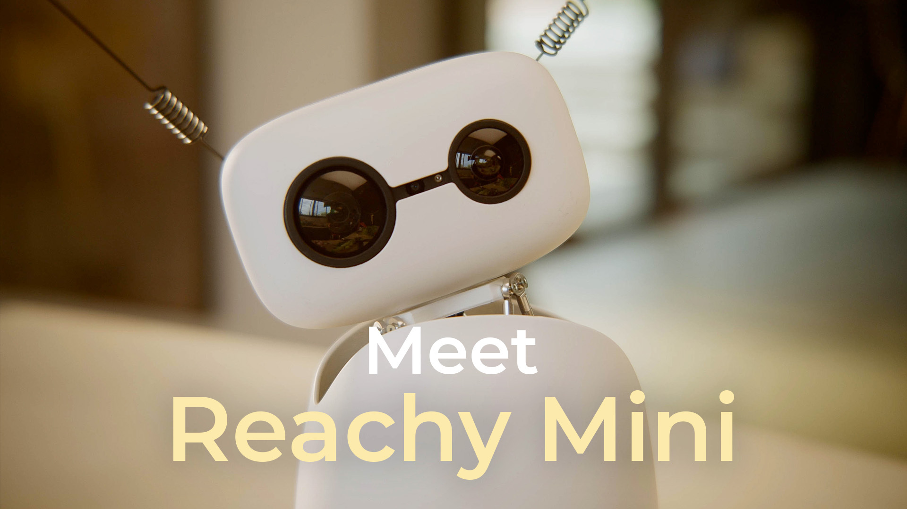

*图源：[Hugging Face 发布介绍](https://huggingface.co/blog/reachy-mini)；开发资料见 [Reachy Mini 文档](https://huggingface.co/docs/reachy_mini/index)。*

- **公司与状态**：由 Pollen Robotics 与 Hugging Face 推进的开源桌面机器人平台。
- **设计与 UI**：没有传统二维表情屏，而是通过头部、身体和天线运动形成表达；配备摄像头、麦克风和扬声器，强调动作可编程性。
- **能力边界**：它提供 Python SDK、传感器与运动控制，模型和业务逻辑仍需开发者安装或编写。Lite 版本依赖外接电脑，Wireless 版本增加板载计算、Wi-Fi 和电池。
- **生态与权限**：可从 Hugging Face Spaces 分发应用，天然连接模型社区、Python 工具链与开源代码。官方说明 Pollen Robotics 与 Hugging Face 不收集或访问机器人上的用户数据，但具体应用仍需要各自承担数据责任。
- **为什么重要**：Reachy Mini 不把“AI”封装为一个固定人格，而是把机器人变成模型应用的运行载体。它更像桌面机器人的 Android，而不是一款只有单一故事线的电子宠物。

#### 6. PixClaw：直接为 OpenClaw 设计的像素终端

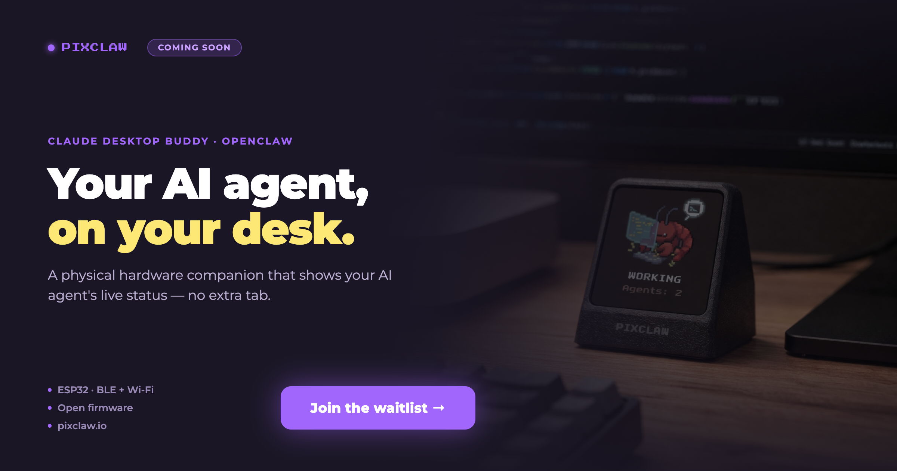

*图源：[PixClaw 官网](https://pixclaw.io/)。*

- **公司与状态**：社区团队的候补 / 早期原型项目，网站展示的仍以渲染图、候补名单和协议设想为主。
- **设计与 UI**：小尺寸像素屏、物理按键、麦克风和扬声器，直接把 OpenClaw 的运行、空闲和等待状态做成桌面角色。
- **能力边界**：网站描述的重点是 OpenClaw over Wi-Fi、Claude over Bluetooth 等连接模式，而不是在设备本体上运行完整模型。
- **生态与权限**：宣称开放固件，这使它有机会成为一个通用 Agent 外设；但在实际交付、SDK 稳定性、隐私实现和长期更新被验证之前，不宜把路线图当成现成功能。
- **为什么重要**：它的形态很接近本文的判断——硬件只负责在场感、语音和物理控制，PC 上的 Agent 才是能力中心。

### 2.3 工作型桌宠：开始争夺屏幕上下文和办公动作

#### 7. Loona DeskMate：手机是屏幕，电脑是工作环境

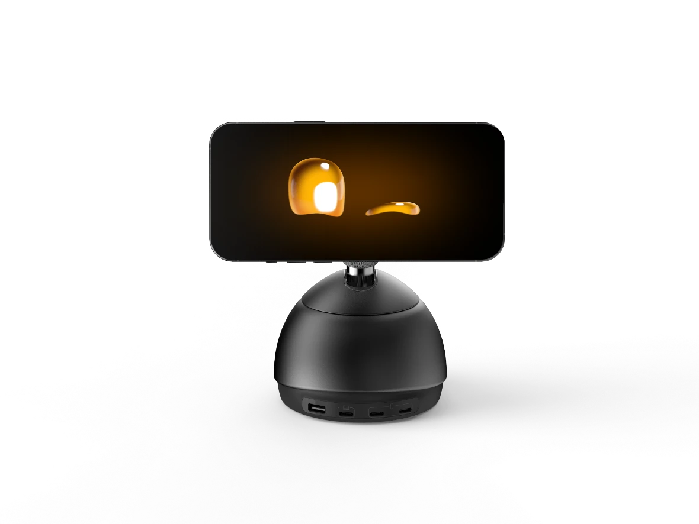

*图源：[Loona DeskMate 产品页](https://keyirobot.com/en-us/products/deskmate)；发布信息见 [KEYi Tech 官方博客](https://keyirobot.com/blogs/news/loona-deskmate-kickstarter-launch)。*

- **公司与状态**：KEYi Tech；2026 年进入众筹和产品化阶段。
- **设计与 UI**：把智能手机安装在可运动底座上，手机同时承担高质量屏幕、算力、摄像头和联网能力。它不需要为一块很快过时的专用屏幕付出全部成本。
- **能力边界**：产品定位不再只是陪聊，而是“AI intern on the desk”。厂商强调屏幕与剪贴板上下文、工作准备以及用户最终决策；具体可接入的办公工具和稳定程度仍需要交付后验证。
- **生态与权限**：厂商提出 Pull-Mode Screen Awareness，即由用户主动拉取而非默认持续观察屏幕。这是正确的问题意识，但其[隐私政策](https://loonadm.com/privacy-policy.html)同时覆盖账户、设备、桌面软件、云服务以及可选的人脸 / 身份特征，用户仍需关注哪些数据在本地处理、哪些会上传。
- **为什么重要**：DeskMate 把“桌宠”推到了真正的工作入口：它能否成功，不取决于表情多可爱，而取决于是否能稳定连接日程、文档、浏览器、IM 和桌面上下文。

#### 8. Lenovo AI Workmate：办公具身智能的概念验证

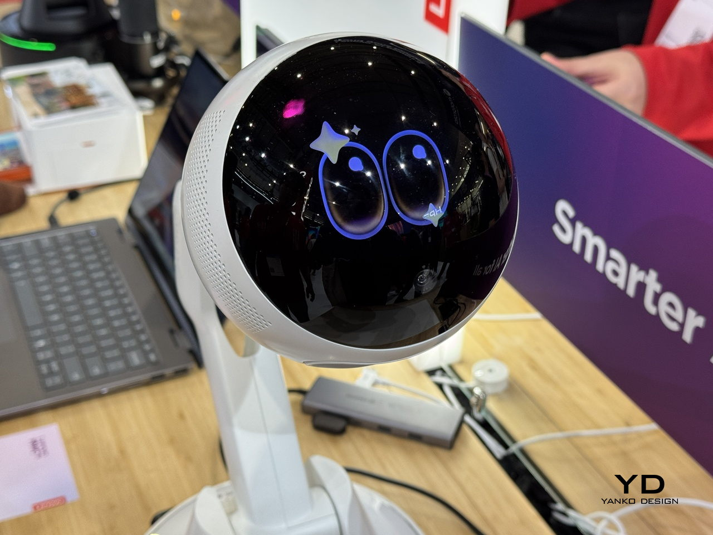

*图：MWC 2026 现场原型，来源 [Yanko Design](https://www.yankodesign.com/2026/03/07/5-wildest-design-trends-at-mwc-2026-nodding-phones-and-tiny-robots/)；产品状态以 [Lenovo 官方 MWC 公告](https://news.lenovo.com/pressroom/press-releases/trusted-ai-powered-business-computing-modular-enterprise-mwc/) 为准。*

- **公司与状态**：Lenovo；明确标注为 AI Workmate Concept，并非已经量产的成熟产品。
- **设计与 UI**：旋转底座、机械臂和球形表情屏让它可以面向用户、电脑或桌面材料。现场原型展示了比静态屏幕更强的视线和姿态表达。
- **能力边界**：Lenovo 的官方表述是以自然交互与情境辅助支持工作流，并强调 human-centric、privacy-conscious。展会报道还描述了文档扫描、整理和演示辅助，但这些应视作概念演示范围，不代表稳定交付承诺。
- **生态与权限**：作为 PC 厂商，Lenovo 的潜在优势不是自己再做一套聊天服务，而是把本地算力、Windows、企业管理、外设和办公流程放在同一安全边界内。现阶段尚无公开开发生态可供评价。
- **为什么重要**：它把问题从“机器人能不能陪聊”改成“机器人能不能成为办公空间的一部分”。如果最终不能接入企业身份、文件权限和审计系统，这类概念很难越过展台。

#### 9. MSI LuckyClaw / AI Holostage：PC 本身开始长出角色

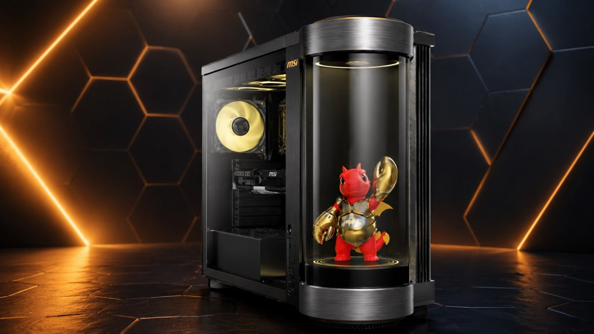

*图源：[Multiplayer.it](https://multiplayer.it/notizie/msi-annuncia-meg-vision-x2-ai-desktop-da-gaming-con-assistente-ia-luckyclaw-e-interfaccia-holostage-integrata.html)；功能信息以 [MSI 官方公告](https://www.msi.com/news/detail/MSI-Introduces-the-MEG-Vision-X2-AI---The-World-s-First-Gaming-Desktop-with-Agentic-AI-Companion-148790) 为准。*

- **公司与状态**：MSI；2026 年发布 MEG Vision X2 AI+，当前更适合看作新产品方向，实际交付和第三方生态仍需观察。
- **设计与 UI**：机箱前部集成圆柱形 AI Holostage，让 LuckyClaw 以实体化头像出现。桌宠不再是电脑旁边的独立设备，而是 PC 机箱的人机界面。
- **能力边界**：MSI 宣称 LuckyClaw 是本地 Agent，可通过自然语音控制性能模式、MSI 显示器设置、RGB 灯效等；未来能力依赖 Skill 更新。
- **生态与权限**：官方提到可承载第三方数字伴侣和自定义头像，但尚未看到足够清晰的开放 SDK、权限模型与分发机制。硬件控制属于高权限场景，必须区分“调灯光”和“改性能 / 固件设置”。
- **为什么重要**：它支持“PC 是服务器”的判断。最稳定的桌宠硬件，或许就是主机自己长出一块始终可见的状态屏，而不是再维护一套独立计算设备。

### 2.4 陪伴机器人给出的长期经验

这些产品不一定能操作 Codex 或钉钉，却已经在情绪表达、长期关系、传感器隐私和云服务依赖上积累了更长时间的经验。它们是下一代工作桌宠不能跳过的样本。

#### 10. Vector：能力越云端化，生命周期风险越大

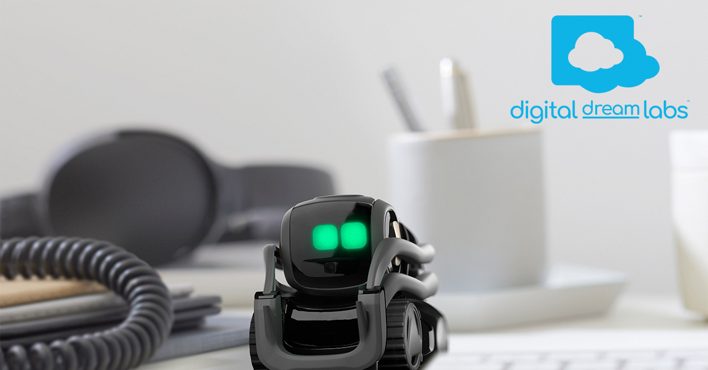

*图源：[Vector 官方产品页](https://anki.bot/vector)。*

- **公司与状态**：最初由 Anki 推出，后由 Digital Dream Labs 承接相关资产和服务。
- **设计与 UI**：轮式底盘、抬升臂、小屏表情、摄像头和麦克风构成了极高的角色密度；它既能自主探索，也能与开发者代码交互。
- **能力边界**：消费功能与云服务关系较深，但仍保留 [Python SDK](https://support.anki.bot/article/109-where-can-i-download-the-vector-sdk)、Go SDK、OSKR 与 Escape Pod 等开发 / 本地化工具。
- **生态与权限**：官方[安全与隐私 FAQ](https://support.anki.bot/article/105-vector-security-privacy-faqs)强调云端传输提示、加密和签名代码；真正的历史教训则是，硬件寿命往往长于公司和云服务周期。
- **为什么重要**：一个售价不低、具备人格和长期记忆的桌宠，不能因为云端业务变化突然失去核心能力。可导出数据、离线基本功能、开放协议和社区接管路径都应该在第一天设计。

#### 11. EMO：小体积也能产生很强的生命感

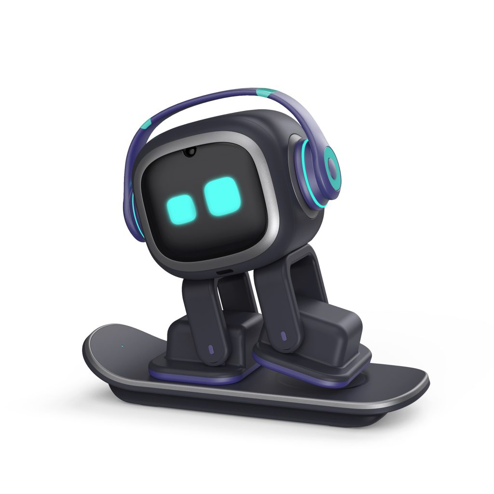

*图源：[LivingAI EMO 产品页](https://living.ai/emo/)。*

- **公司与状态**：LivingAI；在售消费级桌面机器人。
- **设计与 UI**：小屏幕表情、双脚移动、头部触摸、声音定位和桌面边缘检测，让它在很小的空间里保持高频动作反馈。
- **能力边界**：官方介绍包含人脸识别、人物与物体识别、闹钟、智能灯和语音问答等能力，重点仍是情绪互动和轻量生活功能，而非复杂工作流执行。
- **生态与权限**：公开材料主要面向消费者功能，未把通用 SDK 或第三方技能生态作为核心卖点。它的可扩展性因此明显弱于 Stack-chan、Reachy Mini 和 MCP 型项目。
- **为什么重要**：EMO 说明“生命感”并不需要人形身体；动作延迟、注视方向、微表情和环境反应，比堆叠更多聊天功能更能建立在场感。

#### 12. Eilik + AI Station：通过底座给旧硬件补 AI

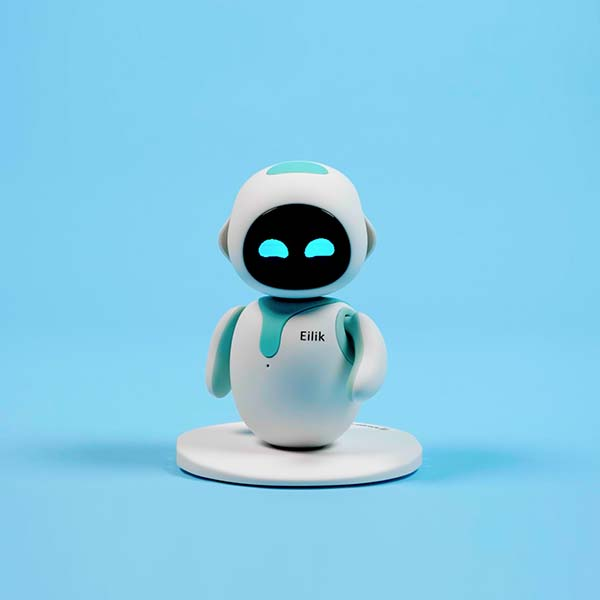

*图源：[Eilik 产品页](https://store.energizelab.com/products/eilik)；AI 扩展见 [AI Station](https://store.energizelab.com/products/ai-station)。*

- **公司与状态**：Energize Lab；Eilik 与 AI Station 均已形成消费产品。
- **设计与 UI**：Eilik 本体是一只固定在桌面的触摸式情绪机器人，多台设备可以彼此互动。AI Station 作为新底座加入摄像头、联网和 AI 对话能力。
- **能力边界**：原版偏向预设情绪和互动；AI Station 增加人脸识别、手势游戏、主动提示与语音聊天。厂商表示核心对话和游戏可离线运行，联网用于更多能力与更新。
- **生态与权限**：模块化升级避免整机淘汰，但仍是相对封闭的消费产品生态。移除 AI Station 后可恢复原始 Eilik，是一种值得保留的降级路径。
- **为什么重要**：未来的桌宠可以把“身体”和“智能”拆开。屏幕、舵机与传感器硬件不必跟随模型快速换代；Agent Host 或扩展底座可以独立升级。

#### 13. Sony aibo：陪伴关系也需要云、App 与长期运营

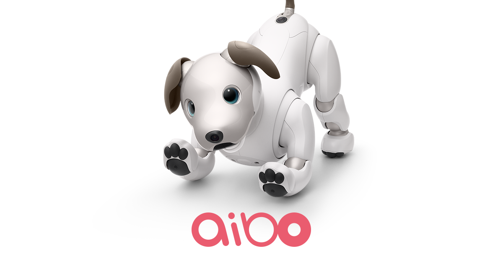

*图源：[Sony aibo 官网](https://us.aibo.com/)。*

- **公司与状态**：Sony；跨越多代、长期运营的高端陪伴机器人产品。
- **设计与 UI**：它没有把信息密度集中在一块屏幕上，而是用全身动作、眼睛、声音和行为学习建立关系。My aibo App 则承担设置、查看和云端服务入口。
- **能力边界**：aibo 的价值是个性成长、家庭互动和长期陪伴，不是办公自动化。官方 FAQ 将部分能力描述为通过 AI Cloud 汇聚学习。
- **生态与权限**：这是典型的厂商闭环：硬件、云、账户、App 与持续更新共同构成体验。Sony 持续维护[隐私条款](https://us.aibo.com/terms/aibo-privacy.html)，但用户依旧需要接受长期云依赖和服务政策变化。
- **为什么重要**：人格化硬件不是一次性销售。模型、账户、数据迁移、售后和数年更新能力，都属于产品本身。

#### 14. LOVOT：不提高效率，也可能有真实价值

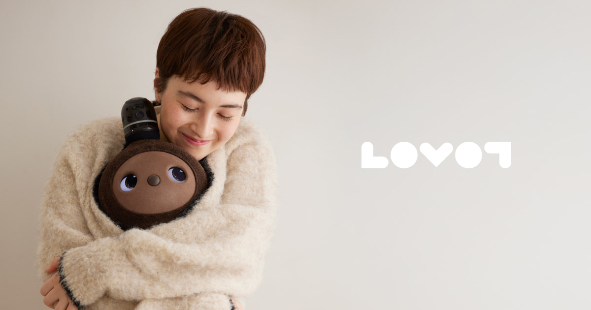

*图源：[LOVOT 官网](https://lovot.life/en/)；传感与安全设计见 [Technology](https://lovot.life/en/technology/)。*

- **公司与状态**：GROOVE X；在售高端陪伴机器人。
- **设计与 UI**：柔软身体、温度、眼神、声音与主动靠近共同构成关系。官方介绍包含超过 50 个传感器、摄像头、麦克风、深度和触摸感知，并通过本地即时判断完成移动与互动。
- **能力边界**：目标不是完成工作，而是形成慢关系、改善情绪与家庭氛围。这种“没有效率产出”的价值不应被误写成办公 Agent。
- **生态与权限**：配套 App 和云端更新承担日记、查看与维护。摄像头指示灯、物理开关和安全开关被写进产品设计，说明高传感器设备必须把状态可见性做成硬件语言。
- **为什么重要**：纯可爱并非天然没有意义；如果产品明确解决孤独、陪伴和情绪调节，可爱就是核心功能。真正没有意义的是，用可爱掩盖一个既不能陪伴、也不能工作的模糊产品。

#### 15. Casio Moflin：极少信息，也能建立情绪回路

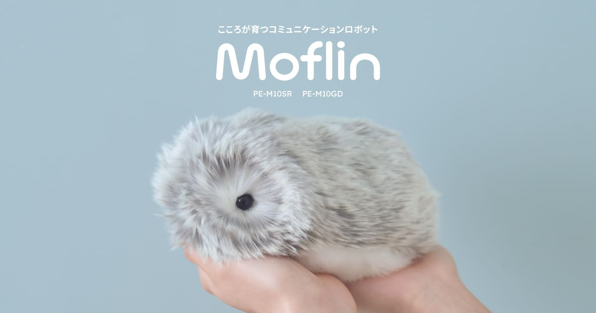

*图源：[Casio Moflin 官网](https://www.casio.com/us/moflin/)。*

- **公司与状态**：Casio；在售情感陪伴机器人。
- **设计与 UI**：没有屏幕、没有拟人化工具栏，主要通过声音、动作和柔软触感反馈。它会根据触摸与声音形成不同性格，并识别主要照顾者的声音。
- **能力边界**：几乎没有工具执行属性，MofLife App 主要用于观察和维护关系状态。
- **生态与权限**：封闭消费生态，传感和数据范围相对工作型桌宠更窄；它不需要获得邮件、文件或打印机权限。
- **为什么重要**：Moflin 提醒我们，桌宠并不必然要变成万能 Agent。产品应该在“深陪伴”和“强执行”之间明确选边；同时追求两者，反而容易让权限和人格都变得含糊。

## 第三章：UI 应该像 Apple Watch 表盘，而不是一张会说话的脸

表情只能告诉用户“它有情绪”，不能回答真正重要的三个问题：**它在做什么、什么时候结束、是否需要我介入。** 下一代工作桌宠最值得借鉴的不是智能音箱，而是 Apple Watch 的表盘与 Complications：有限屏幕只展示最值得一眼看见的信息，复杂操作再回到电脑或手机。

| 表盘 | 默认显示 | 点击 / 语音后的动作 | 隐私默认值 |
|---|---|---|---|
| 在场表盘 | 时间、Agent 状态、当前主机 | 打开对应任务 | 不展示任务正文 |
| 日程表盘 | 下一场会议、空闲时段、地点类型 | 打开日历或加入会议 | 只显示标题缩写，可一键隐藏 |
| 专注表盘 | 番茄钟、倒计时、勿扰状态 | 开始 / 暂停 / 延长专注 | 不采集屏幕内容 |
| 工作流表盘 | 当前节点、已完成步骤、等待输入 | 查看步骤、批准或退回 | 高风险动作只显示摘要 |
| 收件箱表盘 | IM 来源、未读数、待回复草稿 | 在桌宠上口述，去手机 / PC 确认发送 | 默认不显示消息正文 |
| 隐私表盘 | 麦克风、摄像头、屏幕感知、远程连接状态 | 锁定传感器或撤销权限 | 状态必须常驻、不可被皮肤遮挡 |

一套好的 UI 还应该形成统一状态语法：

1. **运行状态**：运行中、等待输入、已完成、阻塞。
2. **时间状态**：预计剩余时间、下一个截止点、是否超时。
3. **责任主体**：哪一个 Agent、哪台 PC、哪一个账号正在行动。
4. **风险状态**：只读、正在起草、即将对外发送、需要明确批准。
5. **结果预览**：不展开完整聊天，只呈现足够用户做决定的摘要。

这比一直显示一双眼睛更有用，也比把完整聊天记录塞进小屏幕更克制。表情可以是状态语法的情绪层，但不能替代信息层。

## 第四章：生态适配才是更深的护城河

更合理的系统结构是：桌宠作为外设，本机软件作为控制中心，云模型只是可替换的一层。

```text
手机 / IM ───────────────┐
                         ▼
                 本地 Agent Host
            身份 · 状态 · 记忆 · 权限 · 审计
                 │       │       │
          MCP / API   OS 自动化   Computer Use
                 │       │       │
          Codex / 日历 / 钉钉 / 文档 / 浏览器 / 打印机
                         ▲
                         │
        桌宠硬件：表盘 · 麦克风 · 扬声器 · 按键 · 传感器
```

这里有几条关键原则：

- **核心软件应当属于本机，而不是蓝牙固件。** 蓝牙低功耗适合传按钮、状态、触摸和传感器事件；音频可以走标准蓝牙音频、USB 或局域网。业务逻辑、账户和权限不应被锁死在设备固件里。
- **直连 API / MCP 优先，Computer Use 作为兜底。** 打开钉钉窗口可以靠桌面自动化，但读取日历、生成草稿、发送消息和管理任务，最好通过稳定接口完成。UI 自动化一旦界面变化就容易失效，也更难做精细授权。
- **同一人格应跨入口存在。** 在桌宠上口述、在钉钉里回复、在手机上批准、在 PC 上查看详细过程，本质上应该属于同一任务和同一审计链，而不是四个彼此失忆的聊天机器人。
- **生态不能只写“支持第三方头像”。** 真正的开放需要设备协议、SDK、MCP / Skill 接口、权限声明、版本兼容、应用分发和可撤销授权。换一张皮肤不是生态。
- **本地优先不等于全部离线。** 本机应保留身份、权限、任务状态、关键记忆和审计；大模型推理可以在本地与云端之间按任务切换。用户要能看见数据将去哪里。

## 第五章：权限应该有多大——锁定键必须同时锁住感知和行动

工作型桌宠会自然获得麦克风、摄像头、屏幕上下文、文件、日历、IM、浏览器和打印机权限。真正危险的不是它“听见一句话”，而是感知、理解和执行被悄悄连成一条没有断点的链。

因此，一个可信的锁定键至少要控制两个平面：

### 5.1 感知平面

- 麦克风和摄像头最好有**电气级断开**，不能只是软件里换一个图标。
- 屏幕感知必须是可见、可暂停、可限定应用的，默认采用拉取式而非持续监控。
- 远程手机或 IM 正在连接本机时，桌宠上应有无法被主题隐藏的常驻指示。

### 5.2 行动平面

- 锁定时应撤销或冻结正在使用的能力租约，而不仅是停止录音。
- 已在后台运行的 Agent 需要进入“只读 / 等待批准”状态，不能继续发送、打印、上传或修改外部系统。
- 解锁不应自动恢复所有高风险权限，而应按任务重新确认。

可以把权限分成四级：

| 等级 | 典型能力 | 默认策略 |
|---|---|---|
| L0：可见 | 时间、倒计时、本地任务状态 | 始终允许，不显示敏感正文 |
| L1：起草 | 读取限定上下文、生成回复或文档草稿 | 自动执行，保留来源与预览 |
| L2：可逆动作 | 打开应用、切换灯光、调整非关键设置 | 可按场景授权，提供撤销 |
| L3：外部影响 | 发送 IM / 邮件、打印、上传、发布、购买、改系统设置 | 每次显示目标、内容和影响，明确确认 |

“直接在 AI 桌宠里回复钉钉”当然有价值，但正确流程不是一句话说完就静默发送，而是：桌宠识别意图 → 本机 Agent 生成草稿 → 小屏显示收件人和摘要 → 用户按键或手机确认 → 发送结果回到同一任务记录。物理设备最独特的价值，恰恰是为这个批准动作提供一个稳定、清楚、不容易误触的入口。

## 结语：最后的一些判断

1. **可爱不是价值本身，而是一种注意力与关系协议。** 它能降低长期共处的心理成本，但必须服务于明确的陪伴或工作目标。
2. **工作型桌宠的核心产品是本地 Agent Host，硬件只是可选的身体。** 先把身份、记忆、权限、状态和生态做通，再决定它需要一块屏幕、两个舵机还是一只毛绒外壳。
3. **UI 会从表情升级为表盘。** 时间、日程、倒计时、工作流、待批准动作和隐私状态，应该像手表 Complications 一样一眼可读。
4. **生态适配比模型参数更难复制。** 谁能长期维护 Codex / OpenClaw、IM、日历、办公套件、浏览器、打印机和企业身份的连接，谁才可能成为真正的入口。
5. **物理锁定键不是附加功能，而是信任界面。** 它要让用户在一秒内确认“现在有没有在听、有没有在看、还能不能行动”。
6. **最终赢家未必是最像宠物的产品。** 更可能是那个最能把不可见的 Agent 工作变得可见、可理解、可中断、可授权的系统。

AI 桌宠真正有意义的未来，不是桌上多了一只会复读大模型答案的玩具，而是我们终于为日益自主的个人智能体，设计出一个合适的身体、一套克制的信息界面，以及一条清楚的权限边界。
