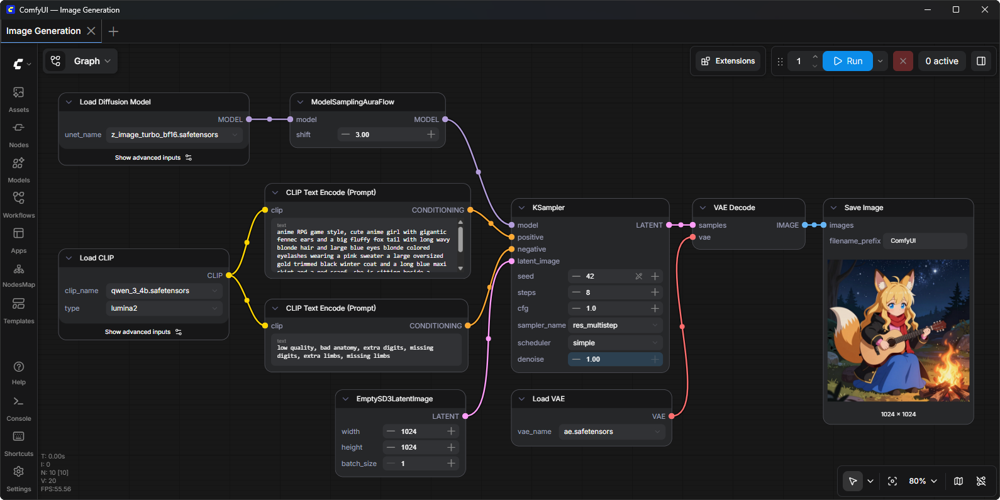
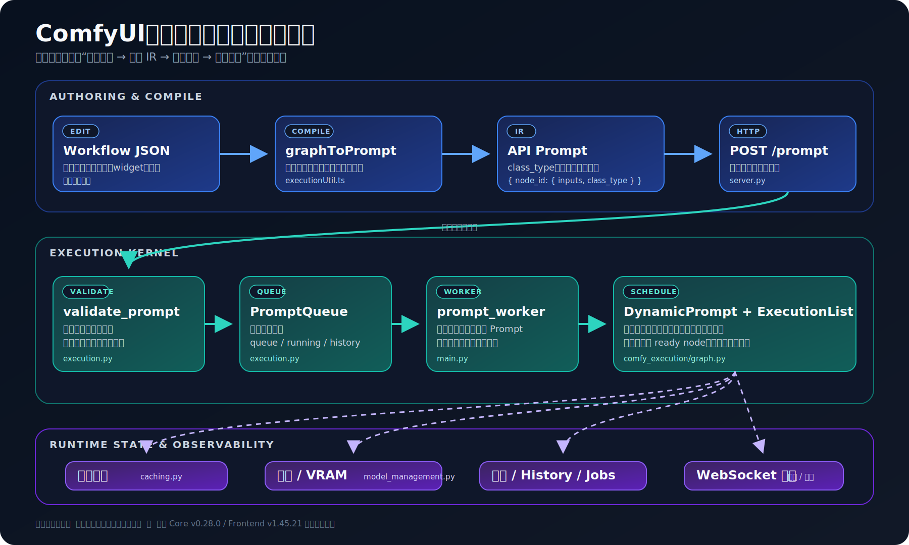
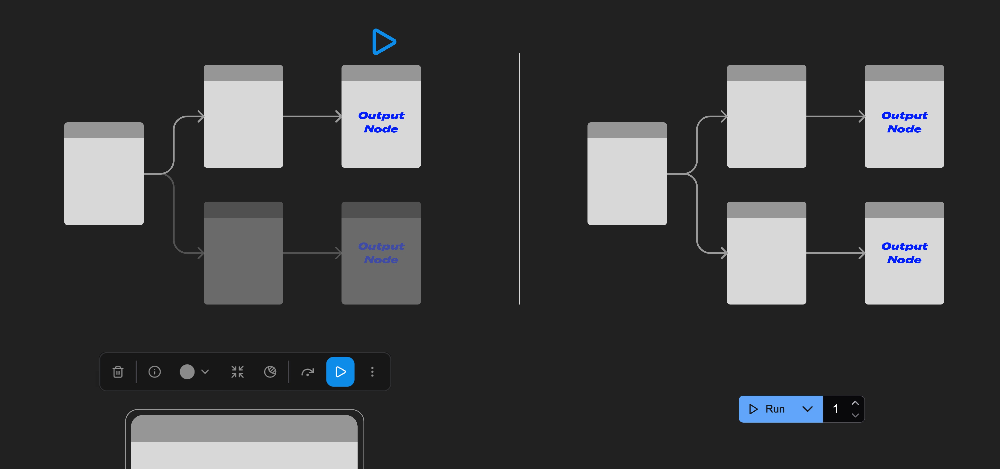
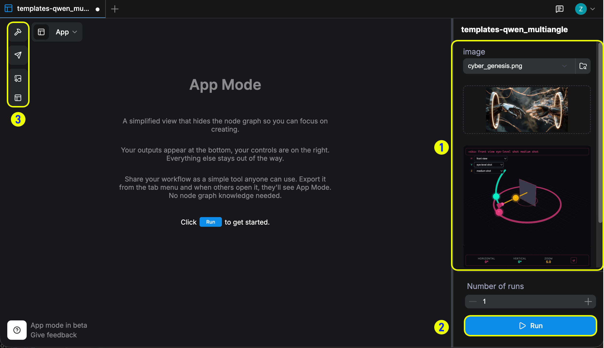

# ComfyUI 深度解析：从可视化节点图到生产级生成执行引擎

> [!abstract] 核心判断
> ComfyUI 的本质不是 Stable Diffusion 的“节点版界面”，而是一套面向生成式模型的 **可视化编程前端、带类型的数据流中间表示、增量 DAG 执行器和异构模型运行时**。画布让人定义程序，API Prompt 是执行 IR，缓存系统决定哪些分支需要重算，模型管理层负责在有限显存中装载、卸载与运行模型。
>
> 这也解释了我们为什么曾经非常深度地使用它：算法同学在画布上完成的复杂生成流程，可以编译成 JSON，通过少量参数注入直接接到生产服务，而不必把验证过的流程重新手写一遍。但它只解决了**单个生成任务内部的计算编排**，没有提供生产系统所需的持久队列、认证、幂等、跨进程恢复、版本治理与多租户隔离。正确的生产形态不是“把 ComfyUI 端口暴露出去”，而是把它放在外部业务网关和耐久任务系统之后，作为一台可版本化的 GPU 执行器。



*图 1：ComfyUI 官方画布。真正被保存和执行的不是一串线性步骤，而是由模型、条件、latent、图像等带类型对象连接起来的生成计算图；节点中的预览又让中间结果与最终资产留在同一调试界面。来源：[ComfyUI 官方仓库 README 固定快照](https://github.com/Comfy-Org/ComfyUI/blob/700821e1364eaab0e8f21c538a2131719fec57bf/README.md#L34)。*

## 一、先看结论

| 维度 | 判断 | 证据 |
|---|---|---|
| 产品本质 | 面向生成式内容的可视化数据流编程与执行引擎 | 前端把画布编译成 API Prompt，后端按图校验、调度和执行 |
| 真正亮点 | 探索界面与执行图共源；只重算变化分支；模型、条件、latent、图像等对象都能成为图上的一等类型 | `graphToPrompt`、`ExecutionList`、输入签名缓存与节点类型契约 |
| 生产价值 | 适合作为图像、视频、音频和 3D 生成能力的 GPU Worker 内核 | `/prompt`、WebSocket、Jobs、History、View 等接口可被外部服务调用 |
| 最大误区 | 把 ComfyUI 的“workflow”当成耐久业务工作流 | 队列、运行态与约 10,000 条历史都在单进程内存中 |
| 最大风险 | 自定义节点是任意 Python 代码；默认安全模型是假设本机访问与可信节点 | 官方 `SECURITY.md` 明确写出这一信任边界 |
| 扩展边界 | 单实例内的任务主要串行；局部异步不等于多任务 GPU 并行 | 主进程只启动一个 `prompt_worker`，异步节点只在任务内部让等待可重叠 |
| 综合评价 | 极强的研发—生产桥梁，但不是完整生成平台 | 生产化必须外置契约、状态、调度、安全、资产与观测层 |

## 二、版本锚点与研读边界

本文固定在 2026 年 7 月 23 日可获得的最新稳定组合，而不是不断变化的 `master`：

| 仓库 | 固定版本 | 完整提交 | 提交时间 | 许可证 |
|---|---|---|---|---|
| ComfyUI Core | `v0.28.0` | [`700821e1364eaab0e8f21c538a2131719fec57bf`](https://github.com/Comfy-Org/ComfyUI/tree/700821e1364eaab0e8f21c538a2131719fec57bf) | 2026-07-15 | GPL-3.0 |
| ComfyUI Frontend | `v1.45.21` | [`3f8dabb756e3428bc3686eccc38b9a2f468c0a2e`](https://github.com/Comfy-Org/ComfyUI_frontend/tree/3f8dabb756e3428bc3686eccc38b9a2f468c0a2e) | 2026-07-15 | GPL-3.0 |

Core 的 [`requirements.txt`](https://github.com/Comfy-Org/ComfyUI/blob/700821e1364eaab0e8f21c538a2131719fec57bf/requirements.txt#L1) 精确锁定 `comfyui-frontend-package==1.45.21`，因此这两个快照确实是同一稳定发行组合。官方说明稳定 Core 约每两周发布一次，标签之间的提交可能不稳定并破坏自定义节点兼容性；生产环境应固定发布标签或镜像摘要，而不是跟随 `master`。

本文使用以下证据标记：

- **[CODE]**：在上述固定源码中确认；
- **[RUN]**：本次在固定快照上实际运行；
- **[DOC]**：官方文档或维护者声明；
- **[INFERENCE]**：由前述代码与运行证据推导出的工程判断。

研读范围覆盖画布到 API Prompt 的编译、服务端队列、校验、执行、缓存、模型与显存管理、自定义节点、安全边界和生产接入。它不评价某一具体模型的画质，也没有在本机下载权重执行 GPU 推理。

## 三、先纠正一个概念：ComfyUI 里的 Workflow 是计算图，不是业务流程

“工作流”这个词容易让人把 ComfyUI 和 Temporal、Airflow、n8n 放在一起。它们都画节点和连线，但语义完全不同。

ComfyUI 的边主要表示**数据依赖**：

```text
MODEL ───────┐
CONDITIONING ├──► KSampler ─► LATENT ─► VAEDecode ─► IMAGE
LATENT ──────┘
```

边上传递的是模型包装器、Tensor、条件向量、latent、图像批次或普通参数。一个任务的目标是把输出节点需要的上游值算出来。它更接近编译器的数据流图、Nuke 的节点合成图或 PyTorch 的计算管线。

耐久业务工作流的边则表示**跨时间的状态转移**：等待订单、重试外部 API、暂停数天等待人工审核、进程重启后从事件历史恢复。ComfyUI 的 `PromptQueue` 只在内存中保存 `queue`、`currently_running` 和 `history`，没有事件日志、持久 checkpoint、Activity 重试或崩溃恢复。[CODE：内存队列](https://github.com/Comfy-Org/ComfyUI/blob/700821e1364eaab0e8f21c538a2131719fec57bf/execution.py#L1244-L1376)

因此，最准确的定位是：

> **ComfyUI 负责一次生成任务内部的模型计算图；外部工作流系统负责这个任务在业务生命周期中的提交、排队、重试、审核、交付与回滚。**

## 四、真实架构：一张图的四次变形

从用户点击 Run 到文件落盘，完整链路如下：



*图 2：依据固定源码重绘的执行主链。蓝色层把可编辑 Workflow 编译为 API Prompt；绿色层完成校验、入队与单 Worker 内的输出驱动调度；紫色层是缓存、显存、结果和 WebSocket 等运行时侧路。对应源码入口见文末“核心代码索引”。*

这条链路可以分成四层：

1. **Authoring Layer**：Vue/LiteGraph 前端负责节点编辑、连线、组件值、分组、子图、禁用与预览；
2. **Execution IR**：API Prompt 只保留执行所需的 `class_type`、输入常量和连接；
3. **Execution Kernel**：服务端负责校验、输出节点选择、拓扑调度、懒输入、动态子图、缓存和异常；
4. **Model Runtime**：节点函数调用模型加载、采样、VAE、ControlNet、LoRA、图像处理和显存调度。

最重要的架构判断是：**画布不是运行时，JSON 也不是唯一一种 JSON。**

## 五、原理一：可编辑 Workflow 与可执行 Prompt 是两种不同的表示

### 5.1 Workflow JSON 保存“怎样编辑”

前端的 Workflow JSON 需要保存节点位置、尺寸、颜色、分组、widget、连线、子图与前端版本。它类似项目文件，目标是下次打开时仍能继续编辑。

### 5.2 API Prompt 保存“怎样计算”

运行前，前端调用 `graphToPrompt`：

1. 先展开虚拟节点与组节点；
2. 序列化完整 Workflow；
3. 遍历可执行节点；
4. 跳过 `NEVER`、`BYPASS` 和虚拟节点；
5. 把 widget 值写成常量输入；
6. 把连线写成 `[上游节点 ID, 输出槽位]`；
7. 输出由节点 ID、`class_type` 和 `inputs` 构成的 API Prompt。

这段编译逻辑集中在 [Frontend `graphToPrompt`](https://github.com/Comfy-Org/ComfyUI_frontend/blob/3f8dabb756e3428bc3686eccc38b9a2f468c0a2e/src/utils/executionUtil.ts#L27-L158)。一个简化后的执行片段是：

```json
{
  "3": {
    "class_type": "KSampler",
    "inputs": {
      "seed": 42,
      "steps": 24,
      "cfg": 6.5,
      "model": ["4", 0],
      "positive": ["6", 0],
      "negative": ["7", 0],
      "latent_image": ["5", 0]
    }
  }
}
```

这里的 `["4", 0]` 不是普通数组，而是“节点 4 的第 0 个输出”。因此前端若要传递真正的数组 widget 值，会包装成 `{"__value__": [...]}`，服务端校验时再解包。[CODE：数组与连线的消歧](https://github.com/Comfy-Org/ComfyUI_frontend/blob/3f8dabb756e3428bc3686eccc38b9a2f468c0a2e/src/utils/executionUtil.ts#L95-L135) 这是自行拼装 API JSON 时很容易遗漏的协议细节。

### 5.3 为什么“两种表示”是生产化的关键

这种设计带来三个价值：

- **同源**：研发在画布上验证的图可以直接成为服务端执行输入；
- **瘦身**：GPU Worker 不需要理解节点坐标、主题、分组等编辑信息；
- **可追溯**：完整 Workflow 仍可放进 `extra_pnginfo.workflow`，随生成图片元数据回传，执行 Prompt 则负责真正计算。

代价也很明确：

- 业务系统不能把可编辑 Workflow JSON 直接当 API Prompt；
- 前端与 Core 的编译协议必须匹配；
- 节点 ID 本身没有业务语义，图一旦重构，硬编码注入点可能失效；
- `_meta.title` 只供诊断，后端忽略，不能当可靠执行契约。

所以生产系统应该把“画布项目”和“已发布执行包”分开管理：前者允许继续编辑，后者由固定 API Prompt、参数绑定表和依赖清单共同组成。

## 六、原理二：执行从输出节点反向展开，而不是从左到右扫画布

### 6.1 输出节点定义任务目标

节点只有设置 `OUTPUT_NODE = True` 才能成为一次执行的目标，例如 `SaveImage`。服务端收到 Prompt 后会：

1. 检查每个 `class_type` 是否存在；
2. 找出全部输出节点，或只保留 `partial_execution_targets` 指定的输出；
3. 从每个输出向上递归检查必填输入、连接格式、返回类型和参数范围；
4. 若至少一个输出分支合法，就把合法输出加入执行列表。

对应实现见 [`validate_prompt`](https://github.com/Comfy-Org/ComfyUI/blob/700821e1364eaab0e8f21c538a2131719fec57bf/execution.py#L1121-L1242)。因此：

- 不通向任何输出的孤立节点不会执行；
- 多输出工作流可以只跑一个分支；
- 某个输出分支无效时，其他合法输出仍可能继续；
- “左边先、右边后”只是画布视觉，真正顺序由依赖关系决定。



*图 3：官方局部执行对比。左侧选择某个输出节点运行时，只有其上游依赖闭包被点亮；右侧普通 Run 会覆盖全部有效输出分支。这张图把“从输出反向展开”从源码语义变成了可见交互。来源：[ComfyUI Partial Execution 官方文档](https://docs.comfy.org/interface/features/partial-execution)。*

### 6.2 调度器执行拓扑消解

`ExecutionList` 维护每个节点的未满足依赖数和它阻塞的下游节点。依赖数归零后节点才可进入执行；完成一个节点后，下游计数递减。若没有可运行节点但仍有未完成节点，则检测依赖环并报错。[CODE：拓扑执行列表](https://github.com/Comfy-Org/ComfyUI/blob/700821e1364eaab0e8f21c538a2131719fec57bf/comfy_execution/graph.py#L193-L315)

它没有简单地取任意可运行节点，还包含面向交互体验的启发式：

- 优先执行输出节点，让 Preview 更早出现；
- 优先启动异步节点，让外部等待与其他计算重叠；
- 优先靠近输出节点的依赖。

这不会改变 DAG 的正确性，但会改变用户感受到的首个结果时间。

### 6.3 图并不完全静态

ComfyUI 当前执行器还支持三种比普通 DAG 更强的语义：

| 语义 | 机制 | 价值 | 风险 |
|---|---|---|---|
| 懒输入 | 节点先通过 `check_lazy_status` 决定真正需要哪些输入，再把相应边提升为强依赖 | 条件分支可避免无用计算 | 自定义节点若声明错误，可能缺输入或误算 |
| 动态子图 | 节点运行时通过 `GraphBuilder` 产生临时节点，加入 `DynamicPrompt` | 循环、展开与运行时结构成为可能 | 调试、缓存键与可视化映射更复杂 |
| 异步节点 | 协程或 Task 被登记为外部 block；等待期间调度其他 ready node | API 节点和 I/O 可以重叠 | 不代表重型 GPU 节点自动并行 |

`DynamicPrompt` 同时保存原始图与运行时生成的 ephemeral node，并维护真实节点、父节点和展示节点之间的映射。[CODE：动态图](https://github.com/Comfy-Org/ComfyUI/blob/700821e1364eaab0e8f21c538a2131719fec57bf/comfy_execution/graph.py#L18-L49)

### 6.4 单实例并发的真实边界

`main.py` 只创建一个 `prompt_worker`。它从队列取出一个 Prompt，调用 `PromptExecutor.execute`，任务结束后才取下一个。[CODE：Worker 主循环](https://github.com/Comfy-Org/ComfyUI/blob/700821e1364eaab0e8f21c538a2131719fec57bf/main.py#L316-L385)

所以本地 Core 的并发语义是：

- 多个任务可以同时**排队**；
- 一个任务内部的异步节点可以让等待重叠；
- 但多个完整 Prompt 不会在同一个 Worker 上并行推进；
- 想获得稳定多任务吞吐，应扩成多个独立 Worker，并按 GPU/显存容量调度。

这其实是合理的默认值。多个模型任务同时争抢一块 GPU 往往不会线性提速，反而更容易抖动或 OOM。问题不在“为什么不并发”，而在于生产平台必须显式决定每个 GPU 允许多少并发，而不能把 HTTP 并发误认为推理并发。

## 七、原理三：它执行的不是整张图，而是“变化闭包”

### 7.1 输入签名决定缓存复用

对节点 $v$，可以把当前缓存键抽象为：

$$
K(v)=N\left(
\text{classType},
\text{fingerprint},
\text{constantInputs},
\text{orderedAncestorSignatures},
\text{linkSlots}
\right)
$$

这里的 $N$ 不是文件哈希，而是把列表、字典和祖先关系规范化成可比较、可哈希的 Python 结构。源码会把当前节点与有序祖先的：

- `class_type`；
- `IS_CHANGED` 或 V3 `fingerprint_inputs` 返回值；
- 常量输入；
- 上游节点相对顺序与输出槽位；

共同放进签名。[CODE：输入签名](https://github.com/Comfy-Org/ComfyUI/blob/700821e1364eaab0e8f21c538a2131719fec57bf/comfy_execution/caching.py#L46-L136)

如果只改正向 Prompt，那么 Checkpoint Loader、VAE Loader 等无关上游结果可以复用，正向条件之后的分支重新计算；如果只改保存文件名前缀，模型采样与 VAE 结果都可能复用。ComfyUI 的交互速度很大程度上来自这种**图级增量计算**，而不只是 PyTorch 快。

### 7.2 `IS_CHANGED` 实际是指纹，不是布尔值

这个名字很容易误导。它的返回值会进入下一次输入签名比较：

- 文件加载节点可以返回文件内容哈希或修改时间；
- 随机节点最好显式接受 seed；
- 永远需要重算时返回 `NaN`，因为 `NaN != NaN`；
- 返回固定 `True` 并不表示“每次变化”，第二次比较仍是相等。

当前 V3 节点 API 已用更准确的 `fingerprint_inputs` 表达这件事；V1 仍保留 `IS_CHANGED` 兼容性。[CODE：指纹选择](https://github.com/Comfy-Org/ComfyUI/blob/700821e1364eaab0e8f21c538a2131719fec57bf/execution.py#L58-L99)

### 7.3 缓存也是最容易被自定义节点破坏的地方

假设一个节点读取网络 URL、数据库、当前时间或目录内容，但输入签名只包含 URL 字符串，那么 URL 不变时 ComfyUI 可能错误复用旧结果。反过来，节点若无条件返回 `NaN`，整条下游都会失去增量收益。

因此自定义节点的指纹应覆盖所有影响结果的外部状态：

```python
@classmethod
def IS_CHANGED(cls, file_path, model_version):
    return {
        "file_sha256": sha256_file(file_path),
        "model_version": model_version,
        "node_impl": "2.3.1",
    }
```

如果外部状态无法稳定指纹化，就应明确禁用该分支缓存，而不是假装可复现。

### 7.4 缓存、模型驻留和结果持久化是三件不同的事

| 层 | 保存什么 | 默认生命周期 | 解决的问题 |
|---|---|---|---|
| 节点输出缓存 | 中间 Tensor、普通对象与 UI 输出 | 当前进程 | 图没变时少算节点 |
| 模型管理 | 当前已加载或部分 offload 的模型 | 当前进程与显存压力 | 在有限 VRAM 中减少重复装载 |
| 文件输出 | PNG、视频、音频等结果 | 文件系统 | 向用户交付资产 |

Core v0.28.0 默认使用 RAM-pressure cache，并可选择 classic、LRU 或完全关闭。[CODE：缓存模式](https://github.com/Comfy-Org/ComfyUI/blob/700821e1364eaab0e8f21c538a2131719fec57bf/execution.py#L107-L147) 进程退出后，前两层状态都不构成耐久恢复点。

## 八、原理四：节点图承载的是生成模型领域对象

ComfyUI 的节点类型不是 UI 标签，而是服务端运行时契约。一个典型图像生成链路大致是：

| 节点 | 输出对象 | 后续用途 |
|---|---|---|
| Checkpoint Loader | `MODEL`、`CLIP`、`VAE` | 分离去噪模型、文本编码器与图像编解码器 |
| CLIP Text Encode | `CONDITIONING` | 把正负文本转成采样条件 |
| Empty Latent / VAE Encode | `LATENT` | 定义生成空间或把输入图编码进 latent |
| LoRA / ControlNet Apply | 修改后的模型或条件 | 注入风格、身份、结构与控制信号 |
| KSampler | `LATENT` | 按 seed、scheduler、steps、CFG 完成去噪 |
| VAE Decode | `IMAGE` | 把 latent 解码到像素空间 |
| Save Image | 输出文件与 UI metadata | 形成可交付结果 |

`KSampler` 本身并不包办所有逻辑。它准备噪声、mask 与回调，然后把模型、正负条件、latent 和采样参数送入更底层采样器。[CODE：KSampler](https://github.com/Comfy-Org/ComfyUI/blob/700821e1364eaab0e8f21c538a2131719fec57bf/nodes.py#L1555-L1609)

可把它抽象成：

$$
z_0=
\operatorname{Sample}\left(
M,\epsilon(\text{seed}),C^+,C^-,
\{\sigma_t\}_{t=1}^{T},
\text{CFG},z_T
\right)
$$

画布把 $M$、$C^+$、$C^-$、$z_T$ 和采样策略都变成可替换输入，所以研究人员可以在不改主程序的情况下交换模型、条件分支、ControlNet、LoRA、采样器、调度器和后处理。

### 8.1 显存管理为什么是 Core 的核心，而不是外围优化

采样前，ComfyUI 会收集主模型以及条件中引用的 ControlNet、GLIGEN 等附加模型，估算推理所需内存，再调用 `load_models_gpu`。[CODE：采样准备](https://github.com/Comfy-Org/ComfyUI/blob/700821e1364eaab0e8f21c538a2131719fec57bf/comfy/sampler_helpers.py#L181-L204)

`load_models_gpu` 会：

- 对模型及其 patch 依赖去重；
- 检查哪些模型已经驻留；
- 估算不同 device 的内存需求；
- 在加载前卸载或部分卸载其他模型；
- 根据 NORMAL/LOW/NO VRAM 状态决定加载多少权重；
- 保留最低推理内存余量。

对应实现见 [模型装载与释放](https://github.com/Comfy-Org/ComfyUI/blob/700821e1364eaab0e8f21c538a2131719fec57bf/comfy/model_management.py#L816-L957)。

这使 ComfyUI 能在不同 GPU、CPU、Apple Silicon 和低显存环境中运行复杂工作流。但“能自动 offload”不等于“没有性能代价”：模型在 CPU 与 GPU 间频繁换入换出会显著增加延迟。生产平台应按工作流和模型族做 Worker 池分组，让高频模型尽量常驻。

## 九、原理五：自定义节点既是生态飞轮，也是最大的信任边界

### 9.1 节点契约为什么足够简单

经典 V1 自定义节点通常只需定义：

```python
class NormalizePrompt:
    @classmethod
    def INPUT_TYPES(cls):
        return {"required": {"text": ("STRING",)}}

    RETURN_TYPES = ("STRING",)
    FUNCTION = "run"
    CATEGORY = "company/text"

    def run(self, text):
        return (" ".join(text.split()),)

NODE_CLASS_MAPPINGS = {"Company.NormalizePrompt.v1": NormalizePrompt}
```

`INPUT_TYPES` 同时驱动前端控件和后端校验；`RETURN_TYPES` 构成连线类型；`FUNCTION` 绑定运行函数；`NODE_CLASS_MAPPINGS` 把稳定节点名注册到 Python 类。需要时还可以声明 `OUTPUT_NODE`、`IS_CHANGED`、`VALIDATE_INPUTS`、列表输入输出和隐藏参数。

它的成功之处在于把接入一个新模型或图像算子压缩成非常小的接口。模型论文一出来，社区只需写 Loader、Conditioning 和 Sampler 等节点，就能接进已有图。

### 9.2 自定义节点不是沙箱插件

Core 在启动时扫描 `custom_nodes`，用 `importlib` 载入模块并执行 `module_spec.loader.exec_module(module)`，随后读取 V1 `NODE_CLASS_MAPPINGS` 或 V3 `comfy_entrypoint`。[CODE：自定义节点加载](https://github.com/Comfy-Org/ComfyUI/blob/700821e1364eaab0e8f21c538a2131719fec57bf/nodes.py#L2223-L2321)

这意味着 `__init__.py` 导入时就能执行任意 Python，权限与 ComfyUI 进程相同。官方安全策略也明确假设：

- 只在 `127.0.0.1` 本地运行；
- 不安装不可信自定义节点；
- 能访问 URL 的人都被视为可信；
- 暴露 `--listen` 后的认证与反向代理由部署者负责。

[DOC/CODE：官方安全模型](https://github.com/Comfy-Org/ComfyUI/blob/700821e1364eaab0e8f21c538a2131719fec57bf/SECURITY.md#L3-L31)

因此生产环境应采用：

1. 自定义节点白名单；
2. 每个节点仓库固定 commit 或不可变制品摘要；
3. 独立虚拟环境或容器，不与系统 Python 混装依赖；
4. 只读模型卷和最小文件权限；
5. 不同信任等级、不同依赖冲突集合放入不同 Worker 镜像；
6. 升级前对代表性 Workflow 做回归，而不是在运行中点击“更新全部”。

## 十、我们为什么曾经深度使用 ComfyUI

此前的内部实践《版权重绘：基于视觉反推与提示词工程的低版权风险生成方案》已经留下了一条很典型的生产接入路径：

| 业务参数 | 当时注入的工作流位置 | 作用 |
|---|---|---|
| 生成数量 | 节点 `87.inputs.amount` | 一次产生多组候选 |
| 输入图片 | 节点 `44.inputs.image` | 绑定本次重绘素材 |
| 重绘幅度 | 节点 `17.inputs.denoise` | 平衡原图结构与变化程度 |
| 随机种子 | 节点 `25.inputs.noise_seed` | 控制候选随机性 |

代码只需要读取固定工作流 JSON、改几个输入，然后调用执行接口。它证明了 ComfyUI 最有价值的闭环：

```text
算法在画布中调试
→ 固化 API Prompt
→ 业务请求注入少量参数
→ GPU Worker 执行
→ 返回生成资产
```

过去若用 Notebook 或散落的 Python 脚本，研发验证完之后往往还要经历一次“生产重写”：重新实现模型加载、条件组合、采样、后处理与显存策略。ComfyUI 把这次翻译压缩成工作流发布，复杂链路可以更快进入业务。

官方后续推出的 App Mode 把这条路径继续向产品端推进：工作流作者从图中选择要暴露的输入与输出，使用者看到的则是输入面板、结果区和 Run 按钮，而不是节点画布。这证明“同一份图同时服务作者和使用者”已经成为产品能力。不过 App Mode 解决的是**交互封装**，不是认证、耐久队列、幂等、租户隔离或跨进程恢复；严肃生产系统仍然需要外置这些控制面。



*图 4：官方 App Mode。右侧只暴露工作流作者选定的输入控件和运行参数，节点图被隐藏，普通使用者无需理解 ComfyUI 图结构。它直观展示了“研发画布 → 可消费工具”的最后一公里，也说明 UI 产品化与后端生产治理是两个不同层次。来源：[ComfyUI App Mode 官方文档](https://docs.comfy.org/interface/app-mode)。*

### 10.1 那套早期实现有效，但还不是生产契约

回头看旧代码，至少有五个需要升级的点：

1. **节点 ID 直接写死。** 只要画布重构或重新导出，`17`、`25`、`44`、`87` 可能指向别的节点；
2. **输入文件名固定。** 多请求同时写 `redraw_v2_input.png` 会产生覆盖竞争，一个任务可能读到另一个任务的图片；
3. **远程下载缺少边界。** 没有超时、大小限制、Content-Type 校验与目标地址策略；若 URL 可由不可信用户控制，还要防 SSRF；
4. **版本身份不完整。** JSON 没有同时绑定 Core、自定义节点、模型文件哈希、Torch/CUDA 与精度策略；
5. **任务状态只依赖 ComfyUI。** 进程退出后，内存队列和 History 不足以支持业务重试、审计与交付。

这些不是否定当时方案，反而说明它完成了最重要的 0→1：证明“复杂画布可以直接进入产品”。下一步只是把实验图提升为受治理的执行制品。

## 十一、从“改 JSON”升级为可发布的 Workflow Package

一个生产执行包至少应包含：

```text
copyright-redraw/
├── workflow_api.json
├── bindings.yaml
├── models.lock
├── custom_nodes.lock
├── runtime.lock
├── fixtures/
│   ├── request.json
│   └── expected-invariants.json
└── manifest.yaml
```

### 11.1 参数绑定表

不要让业务代码到处出现 `"17"` 和 `"25"`。把注入位置放进发布制品：

```yaml
workflowVersion: copyright-redraw-v3
workflowSha256: "sha256:由发布流程生成的工作流摘要"
bindings:
  sourceImage:
    nodeId: "44"
    classType: "LoadImage"
    input: image
  denoise:
    nodeId: "17"
    classType: "KSampler"
    input: denoise
  seed:
    nodeId: "25"
    classType: "RandomNoise"
    input: noise_seed
```

加载时先验证：

- 节点存在；
- `class_type` 与绑定表一致；
- 输入名存在于 `/object_info`；
- 参数类型、范围和枚举合法；
- 所有连接引用的节点与槽位存在；
- 至少有一个被允许的输出节点。

节点 ID 仍是底层寻址，但它被限制在单一发布制品中，并由 `classType + input` 做结构断言。画布变更后必须重新发布，而不是悄悄沿用旧绑定。

### 11.2 一个更稳的编译器边界

业务 API 只接受领域参数：

```python
@dataclass(frozen=True)
class RedrawRequest:
    source_asset_id: str
    denoise: float
    candidate_count: int
    seed: int
```

Workflow Compiler 负责：

1. 深拷贝固定 Prompt；
2. 根据 bindings 注入参数；
3. 校验值域与允许的输出；
4. 生成本次 execution digest；
5. 写入唯一输入路径，例如 `input/{job_id}/source.png`；
6. 把最终 Prompt、manifest 版本与 digest 一起提交。

这样业务契约不再依赖 ComfyUI 节点编号，ComfyUI 也不需要理解业务字段。

## 十二、API 接入：把 ComfyUI 当 GPU Executor，而不是业务后端

### 12.1 本地 Core 的关键接口

稳定版 Core 提供的主链包括：

| 接口 | 作用 |
|---|---|
| `POST /prompt` | 校验 Prompt、创建或接受 UUID `prompt_id`、加入优先队列 |
| `GET /ws?clientId=...` | 接收 `execution_start`、`executing`、`progress`、`executed`、错误等事件 |
| `GET /api/jobs/{job_id}` | 查询单个任务状态与输出 |
| `POST /api/jobs/{job_id}/cancel` | 取消排队任务或中断当前任务 |
| `GET /history/{prompt_id}` | 兼容接口，读取内存 History |
| `GET /view` | 读取输出文件 |
| `GET /object_info` | 获取当前节点类型与输入输出契约 |

`POST /prompt` 会先校验，再把 `(priority, prompt_id, prompt, extra_data, outputs)` 放进堆队列。[CODE：Prompt 路由](https://github.com/Comfy-Org/ComfyUI/blob/700821e1364eaab0e8f21c538a2131719fec57bf/server.py#L1062-L1123)

一个最小提交器可以是：

```python
import copy
import json
import uuid
import requests

def submit(base_url, template, bindings, request_data):
    prompt = copy.deepcopy(template)
    for field, value in request_data.items():
        binding = bindings[field]
        node = prompt[binding["nodeId"]]
        if node["class_type"] != binding["classType"]:
            raise ValueError(f"binding drift: {field}")
        node["inputs"][binding["input"]] = value

    job_id = str(uuid.uuid4())
    response = requests.post(
        f"{base_url}/prompt",
        json={"prompt_id": job_id, "prompt": prompt},
        timeout=(3.05, 30),
    )
    response.raise_for_status()
    return response.json()["prompt_id"]
```

生产代码还需要上传、对象存储、鉴权、重试分类和结果搬运，这里只展示边界。

### 12.2 `prompt_id` 是关联 ID，不是幂等保证

v0.28.0 允许客户端传入规范的 UUID，但 `validate_job_id` 只校验格式，并不检查该 ID 是否已经在运行、排队或历史中。[CODE：ID 校验](https://github.com/Comfy-Org/ComfyUI/blob/700821e1364eaab0e8f21c538a2131719fec57bf/comfy_execution/jobs.py#L34-L50)

同时：

- 队列可以容纳相同 `prompt_id` 的多个项目；
- `history` 是以 `prompt_id` 为 key 的字典，后完成的同 ID 任务会覆盖旧记录。

因此 **[INFERENCE]**：重复 `POST /prompt` 可能重复执行，不能把客户端 UUID 直接当服务端幂等键。正确做法是在外部 Job Store 用唯一约束维护：

```text
idempotency_key → business_job_id → comfy_prompt_id → worker_instance
```

只有外部状态确认“尚未提交”时才调用 ComfyUI；网络超时后先查询外部提交记录和目标 Worker，再决定是否重试。

### 12.3 WebSocket 是观测通道，不是事实来源

WebSocket 很适合展示节点进度与预览，但连接断开、前端刷新或 Worker 重启都可能丢事件。生产系统应：

- 用 WebSocket 更新实时进度；
- 用外部数据库保存任务状态；
- 用 Jobs/History 对账终态；
- 以对象存储中完成上传且校验通过的资产作为交付事实；
- 对“任务成功但资产搬运失败”单独重试，不重新生成。

## 十三、推荐的生产架构

### 13.1 各层责任

| 层 | 责任 | 不应承担 |
|---|---|---|
| API Gateway | 鉴权、限流、参数 schema、租户与幂等 | 模型计算 |
| Durable Job Store / Orchestrator | 状态、重试、超时、取消、审核、回调 | 解释 Comfy 节点 |
| Workflow Registry | 版本、Prompt、bindings、模型与节点锁、回归样例 | 在线改图 |
| Dispatcher | 按模型族、GPU、显存和优先级选 Worker | 业务结果判断 |
| ComfyUI Worker | 校验并执行单个生成图、报告进度 | 跨天业务状态 |
| Asset Service | 输入隔离、对象存储、哈希、生命周期与交付 URL | 工作流调度 |
| Observability | trace、节点耗时、OOM、缓存命中、模型换入换出 | 改变执行结果 |

### 13.2 一块 GPU 一个还是多个 Worker

默认建议一块 GPU 对应一个 ComfyUI 进程与一个模型族池，先用串行任务换稳定性。只有经过测量后才增加并发：

- 小模型、短任务、显存余量大时可实验多进程或多实例；
- 大视频模型、多个 ControlNet、高清批量生成时应严格串行；
- 不同依赖冲突的自定义节点应拆镜像，而不是装进同一环境；
- 高频工作流按模型亲和性路由，减少模型反复换入换出。

核心指标不是 HTTP QPS，而是：

$$
\text{有效吞吐}
=
\frac{\text{通过质量门禁的资产数}}
{\text{GPU 时间}+\text{模型换入换出时间}+\text{失败重试时间}}
$$

### 13.3 可复现需要记录的不只是 seed

至少记录：

- Core tag 与 commit；
- Frontend/导出器版本；
- Workflow SHA-256 与 bindings 版本；
- 自定义节点仓库 commit；
- 模型、LoRA、VAE、ControlNet 文件哈希；
- seed、sampler、scheduler、steps、CFG、denoise、分辨率与 batch；
- Torch、CUDA/ROCm、驱动、GPU 型号、dtype 与 attention backend；
- 输入与输出资产哈希。

同 seed 只能固定随机噪声入口。不同 GPU、算子 backend、精度、模型文件或自定义节点实现仍可能产生差异，所以不要轻率承诺跨机器逐像素一致。

### 13.4 安全门禁

Core 默认只监听 `127.0.0.1:8188`；无参数使用 `--listen` 会改成全网卡监听。[CODE：网络默认值](https://github.com/Comfy-Org/ComfyUI/blob/700821e1364eaab0e8f21c538a2131719fec57bf/comfy/cli_args.py#L38-L43)

生产部署至少需要：

- Worker 只暴露在私有网络，入口统一经过带认证的反向代理；
- 不使用 `Access-Control-Allow-Origin: *`；
- 限制请求体、图片像素、视频时长、batch、steps 与输出数量；
- 下载型节点限制 scheme、域名、重定向、DNS 解析结果、响应大小和超时；
- 输入输出使用 job-scoped 目录，防止文件名竞争与跨租户读取；
- 禁止用户上传任意自定义节点或选择未批准模型；
- 容器使用非 root 用户、最小网络权限和只读模型卷；
- 密钥由 Worker 运行环境注入，不写进 Workflow、图片 metadata 或 History。

`--multi-user` 只是按 header 分隔用户存储，不是认证系统；源码会直接读取 `comfy-user` header 并查表。不能把它当公网多租户安全边界。

## 十四、发布与回归：工作流也要像代码一样过门禁

### 14.1 四级成熟度

| 阶段 | 产物 | 可接受场景 | 主要缺口 |
|---|---|---|---|
| L0 个人画布 | Workflow JSON | 本地探索 | 无固定依赖与契约 |
| L1 API 模板 | `workflow_api.json` + 少量注入代码 | 内部单机工具 | 节点 ID、并发与版本脆弱 |
| L2 版本化执行包 | Prompt + bindings + lock + fixtures | 可控生产试点 | 仍依赖单 Worker 状态 |
| L3 平台化 Worker | L2 + 外部任务系统、GPU 调度、对象存储、观测与安全 | 多业务生产 | 需要持续容量与依赖治理 |

### 14.2 发布门禁

每个 Workflow 版本至少执行：

1. JSON Schema 与连接完整性检查；
2. `/object_info` 节点/输入契约比对；
3. 模型与自定义节点哈希存在性检查；
4. 固定 fixture 的冷启动与热缓存运行；
5. 输出尺寸、格式、数量和非空检查；
6. 感知质量、安全和业务规则评测；
7. 峰值 VRAM、RAM、耗时和模型换入换出记录；
8. 取消、超时、Worker 重启、输出搬运失败演练；
9. 与上一版本的结果差异报告；
10. 一键回滚到上一执行包与 Worker 镜像。

### 14.3 观测字段

建议每次执行生成一条结构化记录：

```json
{
  "business_job_id": "...",
  "comfy_prompt_id": "...",
  "workflow_version": "copyright-redraw-v3",
  "workflow_sha256": "...",
  "worker_image_digest": "...",
  "gpu": "NVIDIA ...",
  "seed": 42,
  "queue_ms": 120,
  "execute_ms": 8420,
  "model_load_ms": 1800,
  "cache_nodes": ["4", "7"],
  "output_sha256": ["..."],
  "status": "succeeded"
}
```

如果只能看到“整次任务耗时”，很难判断变慢来自排队、模型换入、采样、VAE、上传还是缓存失效。

## 十五、ComfyUI 与替代方案如何组合

| 方案 | 最强抽象 | 适合 | 不擅长 |
|---|---|---|---|
| ComfyUI | 可视化、带类型的生成计算图 | 快速组合模型与算子、算法和产品共用流程 | 耐久状态、严格多租户、业务事务 |
| Hugging Face Diffusers | Python 中的模型 Pipeline 与组件 | 代码审查、定制算法、训练/推理一体研发 | 非工程人员可视化组合、复杂图快速试验 |
| 自研推理服务 | 稳定的领域 API | 单一高频能力、极致性能与严格契约 | 新模型和新流程探索速度 |
| Temporal 等耐久执行系统 | 可恢复的业务状态机 | 跨小时/天任务、重试、人工审核、补偿 | Tensor 与 GPU 图内调度 |

它们不是互斥关系。一个成熟组合可以是：

```text
Temporal / 业务任务系统
  └─ Activity：调用某个版本的 ComfyUI Workflow
       └─ 自定义节点内部可复用 Diffusers 或自研 CUDA 算子
```

当某条 ComfyUI 工作流稳定、高频且性能瓶颈清楚后，可以把它逐步下沉为专用推理服务；ComfyUI 继续承担新能力探索与长尾流程。不要在第一天就重写，也不要让探索图永久充当无治理的生产 API。

## 十六、工程质量与本次验证

| 检查 | 结果 | 分类与解释 |
|---|---|---|
| 固定版本与许可证 | 通过 | Core `v0.28.0`、Frontend `v1.45.21`、GPL-3.0 |
| 关键 Python 路径编译 | 通过 | [RUN] Python 3.14.6 执行 `compileall`，覆盖 `main.py`、`server.py`、`execution.py`、`comfy_execution/`、`app/`、`nodes.py` |
| Core pytest | 未执行 | 环境没有 `pytest`；继续导入 focused test 又缺少 `packaging`，未为提高覆盖而修改环境 |
| GPU 端到端推理 | 未执行 | 没有下载模型与自定义节点，也未建立可比较 GPU 环境 |
| 静态主链研读 | 通过 | 前端编译、Prompt 路由、校验、队列、执行、缓存、模型装载与自定义节点均追到固定源码 |
| CI 质量信号 | 有明显边界 | 单元与执行测试覆盖 Linux/Windows/macOS，但两个 Job 都设置 `continue-on-error: true`，不是阻断门禁 |

[CODE：Unit Tests CI](https://github.com/Comfy-Org/ComfyUI/blob/700821e1364eaab0e8f21c538a2131719fec57bf/.github/workflows/test-unit.yml#L9-L30) 与 [Execution Tests CI](https://github.com/Comfy-Org/ComfyUI/blob/700821e1364eaab0e8f21c538a2131719fec57bf/.github/workflows/test-execution.yml#L9-L30) 都在三类 OS 上运行，这是积极信号；但 `continue-on-error: true` 意味着“仓库有测试”不能等价为“测试失败会阻止合并”。Ruff 与针对 `comfy_api_nodes` 的 Pylint 是独立阻断 Job。

## 十七、能力边界与非显然风险

1. **不是耐久执行。** 队列、运行态、History 与缓存主要在内存中，进程崩溃后不能从节点 checkpoint 恢复；
2. **客户端 UUID 不提供幂等。** 相同 ID 可以重复入队，历史还可能覆盖；
3. **自定义节点拥有进程权限。** Registry 与扫描能降低风险，但不能把 Python 模块变成沙箱；
4. **缓存正确性依赖节点作者。** 外部状态未进入指纹会复用陈旧结果，滥用 `NaN` 又会让整个分支失去缓存；
5. **可视化不等于可维护。** 大图仍会产生隐含参数、复制粘贴和节点 ID 漂移，需要子图、版本、bindings 与测试；
6. **局部异步不等于 GPU 并行。** 单 Core Worker 仍逐 Prompt 执行；
7. **seed 不等于完全复现。** runtime、硬件、精度、模型与节点实现都属于结果身份；
8. **多用户不等于认证。** 官方威胁模型仍以 localhost 和可信访问者为前提；
9. **前后端独立发布会产生兼容窗口。** 生产必须固定成对版本，不能只升级一边；
10. **插件依赖会形成环境熵。** 多组自定义节点共享 Python 环境时，依赖升级可能同时破坏多个 Workflow。

## 十八、最终建议

如果目标是快速把复杂生成算法接入生产，ComfyUI 仍然是非常优秀的选择。它最大的价值不是“无需写代码”，而是提供了一个研究、产品、工程都能理解的中间表示：

- 算法人员在图上显式表达模型、条件、latent 与后处理；
- 产品人员能看到控制参数和流程边界；
- 工程人员能把同一张图编译成 API Prompt；
- 运行时能利用拓扑、缓存与显存管理只做必要计算。

采用时建议遵循三条原则：

1. **把 Workflow 当代码发布。** 固定 Prompt、参数绑定、模型、自定义节点和运行时版本，并建立 fixture 回归；
2. **把 ComfyUI 当执行器部署。** 外部系统负责鉴权、幂等、耐久状态、GPU 调度、对象存储与回调；
3. **把自定义节点当供应链代码审计。** 白名单、固定 commit、隔离环境、最小权限，不让在线用户任意安装。

不适合直接使用裸 ComfyUI 的场景包括：

- 接收不可信 Workflow 或插件并要求强隔离；
- 需要跨进程、跨天恢复到中间节点；
- 需要严格租户配额、事务与审计；
- 单一能力已经高频到必须做 kernel fusion、动态 batching 或专用推理服务；
- 对跨硬件逐像素复现有强合规要求。

一句话总结：

> **ComfyUI 把生成模型从“藏在 Python 函数里的流程”变成“可见、可组合、可执行的图”；生产平台要做的，是再把这张图变成有契约、有版本、有状态、有安全边界的执行制品。**

## 核心代码索引

| 阅读目标 | 固定提交链接 | 为什么重要 |
|---|---|---|
| 画布编译成 API Prompt | [`executionUtil.ts`](https://github.com/Comfy-Org/ComfyUI_frontend/blob/3f8dabb756e3428bc3686eccc38b9a2f468c0a2e/src/utils/executionUtil.ts#L27-L158) | 解释两种 JSON、widget、连线、禁用节点与数组包装 |
| Prompt 接收、校验与入队 | [`server.py`](https://github.com/Comfy-Org/ComfyUI/blob/700821e1364eaab0e8f21c538a2131719fec57bf/server.py#L1062-L1123) | API 到执行器的边界 |
| 输出驱动的 Prompt 校验 | [`execution.py`](https://github.com/Comfy-Org/ComfyUI/blob/700821e1364eaab0e8f21c538a2131719fec57bf/execution.py#L1121-L1242) | 决定哪些分支合法、哪些输出执行 |
| Prompt 主执行循环 | [`PromptExecutor`](https://github.com/Comfy-Org/ComfyUI/blob/700821e1364eaab0e8f21c538a2131719fec57bf/execution.py#L724-L850) | 缓存初始化、拓扑调度、成功与错误事件 |
| 拓扑、懒执行与优先策略 | [`graph.py`](https://github.com/Comfy-Org/ComfyUI/blob/700821e1364eaab0e8f21c538a2131719fec57bf/comfy_execution/graph.py#L193-L315) | 真实调度语义 |
| 动态运行时图 | [`DynamicPrompt`](https://github.com/Comfy-Org/ComfyUI/blob/700821e1364eaab0e8f21c538a2131719fec57bf/comfy_execution/graph.py#L18-L49) | 解释运行时子图 |
| 缓存输入签名 | [`caching.py`](https://github.com/Comfy-Org/ComfyUI/blob/700821e1364eaab0e8f21c538a2131719fec57bf/comfy_execution/caching.py#L46-L136) | 增量执行正确性的核心 |
| 单 Worker 与任务终态 | [`main.py`](https://github.com/Comfy-Org/ComfyUI/blob/700821e1364eaab0e8f21c538a2131719fec57bf/main.py#L316-L385) | 判断本地并发和持久化边界 |
| KSampler 节点 | [`nodes.py`](https://github.com/Comfy-Org/ComfyUI/blob/700821e1364eaab0e8f21c538a2131719fec57bf/nodes.py#L1555-L1609) | 从节点契约进入采样主链 |
| 采样前模型准备 | [`sampler_helpers.py`](https://github.com/Comfy-Org/ComfyUI/blob/700821e1364eaab0e8f21c538a2131719fec57bf/comfy/sampler_helpers.py#L181-L204) | 条件模型收集与显存估算 |
| 模型装载与显存释放 | [`model_management.py`](https://github.com/Comfy-Org/ComfyUI/blob/700821e1364eaab0e8f21c538a2131719fec57bf/comfy/model_management.py#L816-L957) | ComfyUI 能适应多种显存条件的根基 |
| 自定义节点动态加载 | [`nodes.py`](https://github.com/Comfy-Org/ComfyUI/blob/700821e1364eaab0e8f21c538a2131719fec57bf/nodes.py#L2223-L2321) | 生态扩展与安全边界 |
| 官方威胁模型 | [`SECURITY.md`](https://github.com/Comfy-Org/ComfyUI/blob/700821e1364eaab0e8f21c538a2131719fec57bf/SECURITY.md#L3-L31) | 说明 localhost、可信节点与可信访问者假设 |

## 参考资料

### 一手资料

- [ComfyUI Core 固定快照](https://github.com/Comfy-Org/ComfyUI/tree/700821e1364eaab0e8f21c538a2131719fec57bf)
- [ComfyUI Frontend 固定快照](https://github.com/Comfy-Org/ComfyUI_frontend/tree/3f8dabb756e3428bc3686eccc38b9a2f468c0a2e)
- [ComfyUI 官方画布截图（Core 固定快照 README）](https://github.com/Comfy-Org/ComfyUI/blob/700821e1364eaab0e8f21c538a2131719fec57bf/README.md#L34)
- [ComfyUI Workflow 核心概念](https://docs.comfy.org/development/core-concepts/workflow)
- [ComfyUI Partial Execution](https://docs.comfy.org/interface/features/partial-execution)
- [ComfyUI App Mode](https://docs.comfy.org/interface/app-mode)
- [ComfyUI Server 路由与 WebSocket](https://docs.comfy.org/development/comfyui-server/comms_routes)
- [Custom Node Properties](https://docs.comfy.org/custom-nodes/backend/server_overview)
- [Custom Node Lifecycle](https://docs.comfy.org/custom-nodes/backend/lifecycle)
- [Comfy Registry 安全标准](https://docs.comfy.org/registry/standards)

### 对照资料

- [Hugging Face Diffusers Pipelines](https://huggingface.co/docs/diffusers/api/pipelines/overview)：对照代码优先的模型 Pipeline 抽象；
- [Temporal Documentation](https://docs.temporal.io/)：对照可恢复、可重放的耐久业务工作流语义；
- 《版权重绘：基于视觉反推与提示词工程的低版权风险生成方案》：我们早期通过工作流 JSON 注入参数接入业务的内部实践证据。
