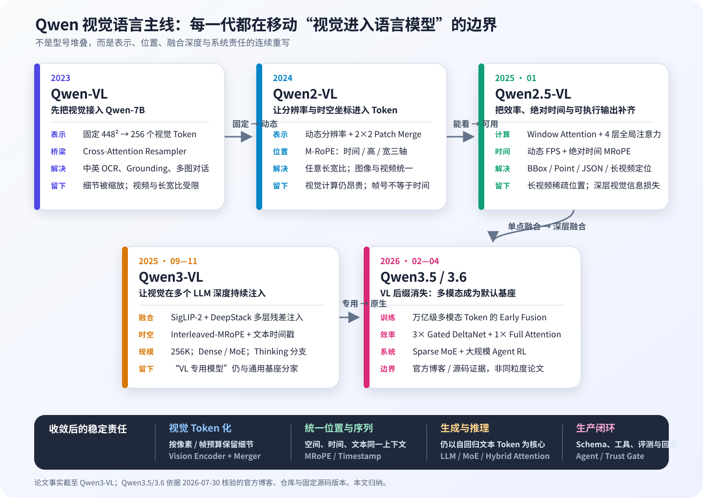
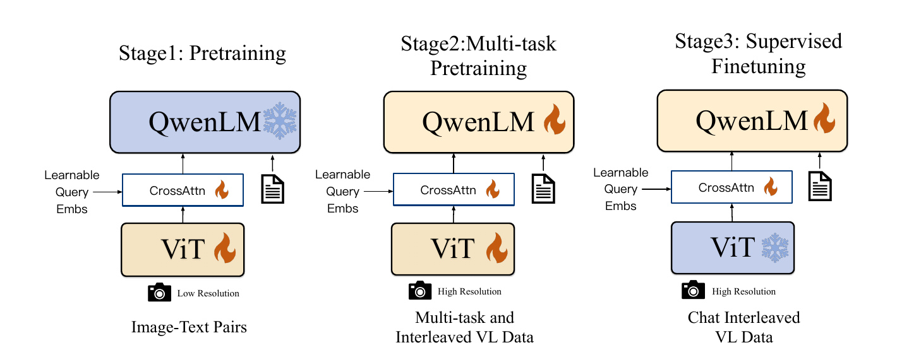
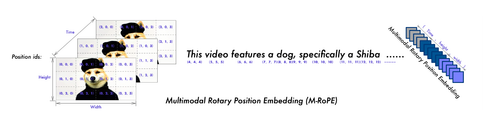
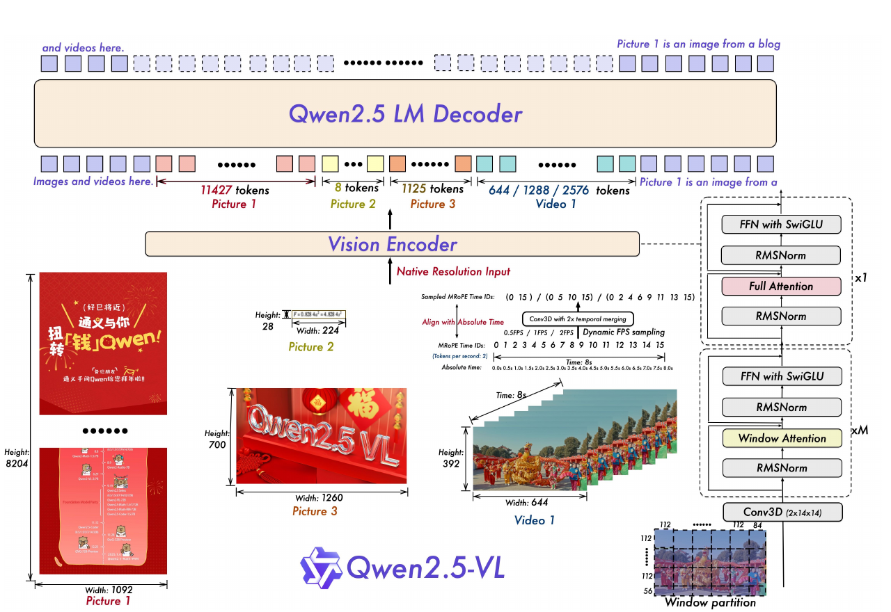
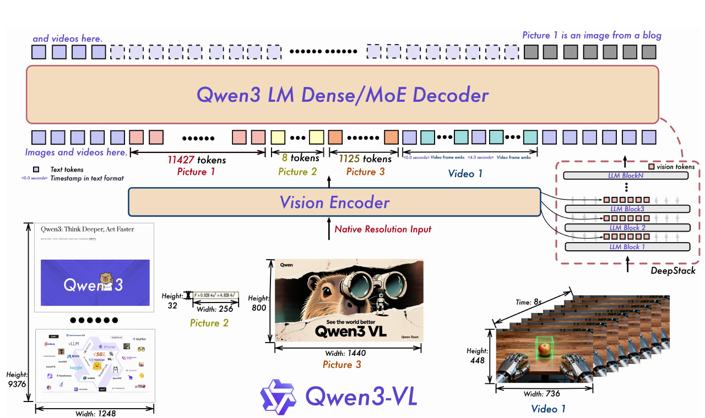
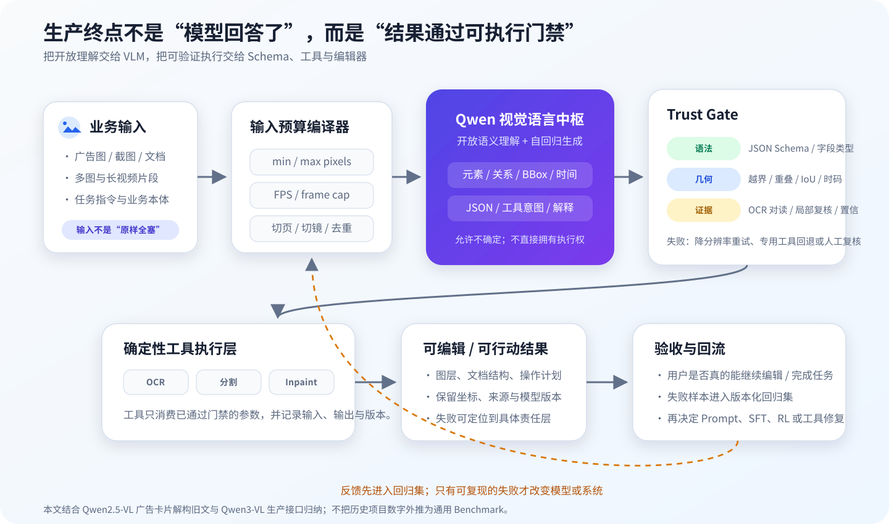

# Qwen-VL 家族演进：从跨模态适配器到原生多模态基座



*图 1　Qwen 视觉语言主线的因果演进。真正连续变化的不是型号，而是视觉表示、时空位置、跨模态融合深度、训练阶段和生产责任。Qwen3.5/3.6 不再使用 “VL” 后缀，但公开模型仍接收图像和视频，因此本文把它们视为这条路线进入原生多模态基座后的下一阶段。本文归纳，依据四份 Qwen-VL 技术报告、[Qwen3.5 官方说明](https://qwen.ai/blog?id=qwen3.5)和[Qwen3.6 官方仓库](https://github.com/QwenLM/Qwen3.6)。*

如果只看模型框图，Qwen-VL 家族几代之间似乎没有根本变化：前面是视觉编码器，中间是投影或合并模块，后面是自回归语言模型。图像先变成视觉特征，再像一串特殊 Token 一样进入语言模型，模型继续预测文本。

但这条概括恰好会遮住最重要的演进。每一代都在重新回答五个问题：

1. 一张图片应该变成固定数量还是可变数量的视觉 Token？
2. 模型怎样同时表示文本顺序、图像二维位置和视频时间？
3. 视觉信息只在 LLM 入口出现一次，还是应该在多个深度持续注入？
4. 训练时先冻结谁、后解冻谁，预训练、SFT、偏好优化和强化学习各自负责什么？
5. 当模型能够输出坐标、JSON 和工具调用时，生产系统应该把多少执行权交给它？

沿这五个问题看，Qwen-VL 家族经历的不是普通的“换更大 LLM”，而是一条清晰的因果链：**先把视觉接入语言模型，再保留更多原始像素与时空位置，随后降低动态视觉计算成本、把视觉注入更深的语言层，最终把多模态训练并入通用基座的默认训练过程。**

> [!note] 证据边界
> - Qwen-VL、Qwen2-VL、Qwen2.5-VL 与 Qwen3-VL 的结构、Token 预算和训练阶段以原论文为准。
> - Qwen3.5/3.6 截至 2026-08-07 主要由官方博客、模型卡、配置和开源实现说明；“VL 后缀消失代表产品线收敛”是本文归纳，不是官方论文结论。
> - 官方论文没有完整披露各代训练的 GPU 型号、卡数、墙钟时间和总成本。文中只写已公开的样本量、Token 预算、上下文长度与参数冻结策略。
> - Vault 中的图生模版项目能说明 Qwen2.5-VL 如何被业务微调和门禁，但其中 SFT→GRPO 是项目路线，不是 Qwen2.5-VL 官方通用模型的训练配方；官方报告写的是 SFT→DPO。

## 一、先建立统一心智模型：视觉最终仍被改写成自回归上下文

### 1.1 三段式骨架为什么长期没有消失

从 Qwen-VL 到 Qwen3.6，理解型视觉语言模型都可以压缩成三段：

1. **视觉编码器**把像素块转换成连续向量；
2. **跨模态桥梁**压缩视觉序列，并把维度投影到语言模型隐藏空间；
3. **语言模型**同时读取视觉向量和文本 Token，自回归生成答案、坐标、JSON 或工具意图。

设处理后的视觉输入为 $x_v$，文本提示为 $x_t$，目标回答 Token 为 $y_1,\ldots,y_n$。几代模型最稳定的训练目标仍是文本位置上的下一 Token 交叉熵：

$$
\mathcal{L}_{\text{AR}}
=
-\sum_{i=1}^{n}
\log p_{\theta}
\left(y_i\mid x_v,x_t,y_{<i}\right)
$$

视觉没有被要求“生成下一个像素”。它成为预测文本时的条件。真正变化的是 $x_v$ 怎样被构造、它带着什么位置、在哪些 LLM 层进入，以及训练时参数集合 $\theta$ 的哪一部分允许更新。

这个统一目标也解释了为什么 OCR、BBox、时间戳和工具调用可以由同一个模型输出：只要把它们定义为稳定的文本表示，坐标或动作最终也是语言模型词表上的 Token 序列。Qwen-VL 第一代已经把归一化 BBox 写成文本；Qwen3-VL 仍延续这种思路，只是数据、表示与推理能力大幅扩展。[Qwen-VL 报告 §2.2](https://arxiv.org/abs/2308.12966)给出了 `<box>`/`<ref>` 接口，[Qwen3-VL 报告 §3.2.4](https://arxiv.org/abs/2511.21631)则把坐标统一到 $[0,1000]$。

### 1.2 动态分辨率把“图像大小”改写成了“上下文预算”

Qwen-VL 第一代无论输入多大，最终都压成 256 个视觉 Token。Qwen2-VL 以后，视觉 Token 数随处理后的时空网格变化。

设视觉处理器返回一个网格 $(T,H_p,W_p)$：$T$ 是经过时间 Patch 后的时间格数，$H_p,W_p$ 是经过空间 Patch 后的高宽格数；空间合并倍率为 $m$。进入 LLM 的视觉 Token 数是：

$$
N_{\text{vision}}
=
\frac{T\,H_p\,W_p}{m^2}
$$

Qwen2-VL、Qwen2.5-VL 与 Qwen3-VL 的常见 $m=2$，因此每相邻 $2\times2$ 个空间 Patch 合成一个 LLM 视觉 Token。Qwen2.5-VL 的 Patch 大小为 $14\times14$，若暂时忽略处理器的缩放与边界补齐，一张图大致每 $28\times28=784$ 个像素对应一个视觉 Token。它比“分辨率越高越好”更准确：**分辨率越高，保留的细节越多，但 LLM 上下文、KV Cache 和首 Token 延迟也一起增加。**

固定版本的 Transformers 实现直接按 `grid_thw.prod(-1) // spatial_merge_size**2` 切分视觉特征，见 [`Qwen2.5-VL` 实现](https://github.com/huggingface/transformers/blob/6034e90c7d1b591e1404596bf1d9617b529a1550/src/transformers/models/qwen2_5_vl/modeling_qwen2_5_vl.py#L1072-L1105)与 [`Qwen3-VL` 实现](https://github.com/huggingface/transformers/blob/6034e90c7d1b591e1404596bf1d9617b529a1550/src/transformers/models/qwen3_vl/modeling_qwen3_vl.py#L1038-L1058)。下面这段最小代码只做模型处理后的 Token 记账，不猜测原图会被处理器缩放到什么尺寸：

```python
from collections.abc import Iterable


def visual_token_count(
    grid_thw: Iterable[tuple[int, int, int]],
    spatial_merge_size: int = 2,
) -> int:
    """Count LLM visual tokens from processor-produced (T, H, W) grids."""
    if spatial_merge_size <= 0:
        raise ValueError("spatial_merge_size must be positive")

    merge_area = spatial_merge_size**2
    total = 0
    for temporal, height, width in grid_thw:
        if min(temporal, height, width) <= 0:
            raise ValueError("all grid dimensions must be positive")
        patches = temporal * height * width
        if patches % merge_area != 0:
            raise ValueError("grid is not divisible by the spatial merge area")
        total += patches // merge_area
    return total


assert visual_token_count([(1, 16, 16)]) == 64
```

这段代码对应的工程结论不是“总能把图片放到最大”，而是每个请求都应该有显式像素、帧数与 Token 预算。

## 二、全家族对照：四次真正改变边界的转折

| 阶段 | 上一代瓶颈 | 结构变化 | 训练变化 | 新能力 | 新暴露的问题 |
|---|---|---|---|---|---|
| Qwen-VL（2023） | 纯文本 Qwen 看不到图像 | OpenCLIP ViT-bigG + 位置感知 Cross-Attention Resampler，把任意 Patch 压成固定 256 Token | ViT/Adapter 对齐 → 全参数多任务预训练 → 冻结 ViT 做 35 万条指令微调 | 中英 OCR、Grounding、多图对话 | 448² 固定输入和 256 Token 压缩损失细节；视频不原生 |
| Qwen2-VL（2024） | 固定尺寸损伤长图、文档与视频 | 动态分辨率、3D Conv、2×2 Patch Merger、M-RoPE | ViT-only 约 600B Token → 全参数再训约 800B → 冻结 ViT 指令微调 | 任意长宽比；图片和视频统一；时空定位 | 视觉计算随像素增长；帧序号还不是真实时间 |
| Qwen2.5-VL（2025-01） | 动态视觉序列太贵；不同 FPS 时间不可比 | 重做 ViT；窗口注意力 + 4 个全局层；动态 FPS；绝对时间 MRoPE | 1.5T/2T/0.6T 三阶段预训练；约 200 万 SFT；冻结 ViT 做 DPO | 文档解析、BBox/Point、长视频定位、GUI Agent | 入口单点融合仍会丢深浅层视觉信息；绝对时间 ID 在长视频变稀疏 |
| Qwen3-VL（2025-09～11） | 视觉只在入口注入；长视频位置频谱不均衡 | SigLIP-2；DeepStack；Interleaved MRoPE；文本时间戳；Dense/MoE | Merger-only 67B → 全参数约 1T/1T/100B，8K→32K→256K；SFT→蒸馏→RL | 长文档、长视频、视觉推理、GUI/搜索/工具智能体 | VL 专用模型仍与通用基座分家；训练与服务链路复杂 |
| Qwen3.5/3.6（2026） | 单独维护 VL 与文本路线，长上下文和 Agent RL 成本高 | 原生视觉语言基座；Gated DeltaNet + 完整注意力混合；Dense/MoE；视觉编码器仍在 | 万亿级多模态 Token 的 Early Fusion；FP8 异构训练；大规模异步多轮 Agent RL | 同一检查点同时承担文本、视觉、推理与 Agent | 独立技术报告尚未补齐；训练 Token、硬件与消融细节披露不足 |

上表最值得保留的一条线是：**视觉桥梁从固定压缩，变成动态 Token，再从入口一次注入变成多层残差注入；训练也从“先对齐视觉插件”变成“多模态就是通用基座预训练的一部分”。**

## 三、Qwen-VL：第一步不是融合得多深，而是先把视觉可靠地接进 Qwen-7B

Qwen-VL 面临的是一个最基础的断点：Qwen-7B 的词嵌入和 OpenCLIP ViT 的图像特征既不在同一维度，也没有共同的 Token 接口。如果直接把上千个 Patch 全塞进 LLM，计算成本太高；如果粗暴池化，Grounding 与 OCR 所需的位置细节又会丢失。

它采用三个模块：

- 1.9B 参数的 OpenCLIP ViT-bigG 视觉编码器；
- 0.08B 参数、单层 Cross-Attention 的位置感知适配器；
- 7.7B 参数的 Qwen 语言模型，总计约 9.6B。

输入统一缩放到固定分辨率。ViT 以步长 14 切 Patch；适配器使用 256 个可学习 Query 去查询整张图的 Patch 特征，并在 Query-Key 中加入二维绝对位置，最终始终输出 256 个视觉 Token。[Qwen-VL 技术报告 §2.1](https://arxiv.org/abs/2308.12966)明确给出了这组结构和参数量。

### 3.1 三阶段训练真正解决的是“先对齐，再共训，最后学会聊天”



*图 2　Qwen-VL 的三阶段训练。雪花表示冻结、火焰表示更新。第一阶段在低分辨率图文对上建立视觉—语言对齐；第二阶段提高到 448² 并全参数学习 OCR、Grounding、VQA 与纯文本；第三阶段冻结 ViT，只更新适配器和语言侧，使模型服从多图、多轮和定位指令。原论文 Figure 3，裁剪自 [Qwen-VL: A Versatile Vision-Language Model](https://arxiv.org/abs/2308.12966)，版权归原作者。*

三阶段不是一种固定仪式，而是对优化难度的分解：

| 阶段 | 可训练部分 | 数据与规模 | 分辨率/目标 | 这一步学什么 |
|---|---|---|---|---|
| Stage 1 图文预训练 | ViT + Adapter；冻结 QwenLM | 从 50 亿图文对清洗到 14 亿；训练 5 万步，约消费 15 亿样本 | 224²；文本交叉熵 | 让视觉特征进入既有语言空间 |
| Stage 2 多任务预训练 | 全参数 | 约 7680 万多任务样本，覆盖 Caption、VQA、Grounding、OCR 与纯文本 | 448²；相同自回归目标 | 同时建立细粒度视觉任务与语言能力 |
| Stage 3 SFT | Adapter + QwenLM；冻结 ViT | 35 万条多模态/纯文本指令 | 多图、多轮、定位对话 | 把潜在能力变成可调用的交互协议 |

第一代最重要的经验是：**冻结策略是在保护已有能力与学习新接口之间分配风险。**Stage 1 不让随机初始化的跨模态接口冲坏 Qwen；Stage 2 必须解冻 LLM，才能把 OCR、坐标和视觉语义真正写进语言表示；Stage 3 冻结视觉塔，是因为此时目标主要从“看懂什么”转向“怎样按指令回答”。

它留下的上限也同样清楚。固定 448² 会压缩超长截图和高分辨率文档；不管图像简单还是复杂都压成 256 Token，会让模型既无法为细节多付预算，也无法为简单图节省预算。下一代首先要拆掉的就是这个固定瓶颈。

## 四、Qwen2-VL：视觉 Token 变成可变长度，位置编码开始同时承载时间、高度和宽度

动态分辨率并不只是“支持大图”。它把视觉表示从固定容量容器改成了按内容尺寸付费的序列：长图保留更多 Patch，小图使用更少 Token，多张不同尺寸图片可以打包到同一个上下文里。

Qwen2-VL 继续保持视觉编码器—合并器—LLM 三段式骨架，但做了四个关键改动：

1. 使用约 675M 参数的 ViT，配合不同规模的 Qwen2 LLM；
2. 删除固定二维绝对位置，使用 2D-RoPE 支持动态分辨率；
3. 用简单 MLP 把相邻 $2\times2$ Patch 合成一个视觉 Token；
4. 用时间深度为 2 的 3D Conv 统一图像与视频，静态图片复制为两帧走同一条视觉路径。

论文给出的例子是 224² 图像：`patch_size=14` 先得到 $16\times16=256$ 个 Patch，再经 $2\times2$ Merger 变成 64 个视觉 Token，加上首尾视觉标记后是 66 个输入 Token。[Qwen2-VL 报告 §2.1](https://arxiv.org/abs/2409.12191)对这一过程有明确说明。

### 4.1 M-RoPE 为什么是动态视觉真正需要的配套结构

普通文本位置只有一个整数 $p$。图像需要二维位置 $(h,w)$，视频还多一个时间位置 $t$。Qwen2-VL 把每个视觉 Token 的位置写成三元组：

$$
\mathbf{p}_j=(t_j,h_j,w_j)
$$

再把 Attention Head 的旋转维度分成时间、高度和宽度三段。若 $R(p)$ 表示 RoPE 在位置 $p$ 上的旋转，三段 Query 可以写成：

$$
\widetilde{\mathbf q}_j
=
R(t_j)\mathbf q_j^{(t)}
\oplus
R(h_j)\mathbf q_j^{(h)}
\oplus
R(w_j)\mathbf q_j^{(w)}
$$

Key 使用相同位置旋转。Attention 内积因此不仅知道两个 Token 在序列上相隔多远，还能感知它们在帧、行和列上的相对关系。对纯文本 Token，三个位置 ID 相同，它就退化成普通一维序列位置。



*图 3　从左向右看 M-RoPE：视频帧中的 Patch 同时携带时间、高度和宽度坐标；进入文本后，三轴位置重新合并为普通递增位置。它让图片、视频和文本可以共享同一个 LLM Attention。原论文 Figure 3，裁剪自 [Qwen2-VL: Enhancing Vision-Language Model's Perception of the World at Any Resolution](https://arxiv.org/abs/2409.12191)，版权归原作者。*

### 4.2 训练从“图文对齐”扩成了真正的混合模态预训练

Qwen2-VL 仍沿用三阶段，但规模与数据结构已经变化：

- 第一阶段只训练 ViT，使用约 600B Token；LLM 从 Qwen2 初始化，ViT 从 DFN 初始化并把固定位置改成 2D-RoPE；
- 第二阶段解冻全部参数，再加入约 800B 与图像相关的 Token，同时混入纯文本，覆盖 OCR、图文交错文档、VQA、视频对话和视觉知识；
- 第三阶段冻结 ViT，只在指令数据上微调语言侧。论文没有披露这一阶段的样本量与偏好优化细节。

这里出现了一个之后越来越重要的训练原则：**多模态训练不能只喂视觉数据。**如果全参数长期只优化视觉问答，LLM 的纯文本能力可能退化；因此第二阶段继续混合纯文本，让同一组语言参数同时维持语言建模和视觉条件生成。

Qwen2-VL 解决了固定分辨率，但也把成本问题显性化了：视觉 Token 与像素、帧数近似线性增长。并且固定 2 FPS 与时间轴上的帧序号只能告诉模型“第几个采样帧”，不能稳定表达不同 FPS 视频中的真实秒数。这两个断点直接推动了 Qwen2.5-VL。

## 五、Qwen2.5-VL：结构重点从“能看任意尺寸”转向“能高效看、知道绝对时间、输出可执行结构”

Qwen2.5-VL 没有推翻动态分辨率和 M-RoPE，而是补齐它们进入文档、长视频和 GUI Agent 后暴露的工程问题。

### 5.1 视觉塔重新设计：大多数层看局部，少数层负责全局



*图 4　Qwen2.5-VL 的结构重点。左侧不同大小图片对应不同视觉 Token 数；中间视频按动态 FPS 采样，并把时间位置对齐到真实秒数；右侧 ViT 大部分层使用 Window Attention，只在第 7、15、23、31 层使用全局注意力。原论文 Figure 1，裁剪自 [Qwen2.5-VL Technical Report](https://arxiv.org/abs/2502.13923)，版权归原作者。*

以 7B 配置为例，视觉塔有 32 层、隐藏维 1280、16 个 Head、Patch Size 14、Window Size 112。第 7、15、23、31 层做全局 Attention，其余层在窗口内计算；Patch Merger 仍把四个相邻 Patch 拼接后经两层 MLP 投影到 LLM 的 3584 维。[官方报告 Table 1](https://arxiv.org/abs/2502.13923)和[固定版本实现](https://github.com/huggingface/transformers/blob/6034e90c7d1b591e1404596bf1d9617b529a1550/src/transformers/models/qwen2_5_vl/modeling_qwen2_5_vl.py#L348-L467)互相吻合。

为什么这是一处关键变化？全局自注意力复杂度随视觉 Patch 数近似二次增长。动态分辨率让 Patch 数可变以后，一张长截图就可能把每层全局 Attention 推到昂贵区间。窗口层先在局部提取文字、边缘和版式，少数全局层再传播跨区域关系，模型因此不必在每一层都支付全局成本。

### 5.2 时间从“采样序号”升级为“绝对秒数”

Qwen2.5-VL 使用动态 FPS，并根据真实时间间隔设置 MRoPE 的时间 ID。两段视频即使采样 FPS 不同，只要事件都发生在第 5 秒附近，模型仍能把它们对齐到相近的时间位置。这让“动作持续了多久”“第几秒出现目标”“不同速度播放的事件是否相同”成为更自然的学习任务。

代价是：长视频中的绝对时间 ID 会越来越大、越来越稀疏；训练还需要覆盖多种 FPS 才能学稳。Qwen3-VL 后来会把时间戳重新显式写回文本，以避免完全依赖位置 ID 承担真实时间语义。

### 5.3 预训练开始同时扩规模、上下文和任务结构

Qwen2.5-VL 把 Qwen2-VL 报告中的约 1.2T 预训练规模扩到约 4.1T Token，并重做视觉塔：

| 阶段 | Token 预算 | 序列长度 | 更新参数 | 主要数据 |
|---|---:|---:|---|---|
| Visual Pre-Training | 1.5T | 8,192 | ViT | Caption、视觉知识、OCR，并混入纯文本 |
| Multimodal Pre-Training | 2T | 8,192 | ViT + LLM | 图文交错、VQA、视频、Grounding、Agent、多模态数学、纯文本 |
| Long-Context Pre-Training | 0.6T | 32,768 | ViT + LLM | 长视频、长 Agent 轨迹、长文档 |

报告还说明：视觉塔先用 DataComp 与内部数据从头训练；动态分辨率样本按 LLM 输入长度进行 Packing，避免不同 GPU 因视觉 Token 数差异而长期等待最慢 Rank。[Qwen2.5-VL 报告 §2.2](https://arxiv.org/abs/2502.13923)给出了阶段、Token 规模和长度。

### 5.4 Post-training 从单纯 SFT 进入偏好优化

官方配方是：

1. 约 200 万条 SFT，其中纯文本与多模态条目各占一半；覆盖单轮、多轮、单图、多图、视频、OCR、文档、Grounding、数学、代码与 Agent；
2. 用规则和模型过滤数据，并通过拒绝采样保留答案正确、视觉证据参与充分的 CoT；
3. 冻结 ViT，在 SFT 后做 DPO；DPO 数据只包含图文与纯文本偏好对。

给定同一个多模态输入 $x$、偏好回答 $y^+$、较差回答 $y^-$、当前策略 $\pi_\theta$ 与参考策略 $\pi_{\text{ref}}$，DPO 的核心比较量可以写成：

$$
\Delta
=
\left[
\log\pi_\theta(y^+\mid x)-\log\pi_{\text{ref}}(y^+\mid x)
\right]
-
\left[
\log\pi_\theta(y^-\mid x)-\log\pi_{\text{ref}}(y^-\mid x)
\right]
$$

$$
\mathcal L_{\text{DPO}}
=
-\log\sigma(\beta\Delta)
$$

$\sigma$ 是 Sigmoid，$\beta$ 控制偏好更新相对参考模型的强度。它优化的是“同一输入下更偏好哪种回答”，不需要在训练内循环中启动环境或在线采样。

这与本地项目的 SFT→GRPO 必须分开：图生模版用可计算的格式和 IoU 奖励优化业务坐标，是在 Qwen2.5-VL 之上的领域后训练；官方 Qwen2.5-VL 报告并没有声称通用模型用 GRPO 训练。项目细节见[图生模版：从多模型工作流到端到端视觉语言模型](图生模版：从多模型工作流到端到端视觉语言模型.md)。

Qwen2.5-VL 把结构化输出和 Agent 数据带进通用训练，但视觉信息仍主要在 LLM 入口被投影一次。浅层纹理、局部文字与深层语义被视觉塔最后一层压到同一组 Token 后，LLM 很难重新找回被末层抽象掉的细节。Qwen3-VL 的 DeepStack 正是对这个单点融合上限的回应。

## 六、Qwen3-VL：视觉不只在入口出现一次，而是在多个 LLM 深度持续注入



*图 5　Qwen3-VL 的责任移动。主视觉序列仍从底部进入 LLM，但右侧 DeepStack 还把视觉塔三个中间层的特征，经专用 Merger 加到前三个 LLM Block 的视觉位置上；顶部 Decoder 可以是 Dense 或 MoE。原论文 Figure 1，裁剪自 [Qwen3-VL Technical Report](https://arxiv.org/abs/2511.21631)，版权归原作者。*

### 6.1 DeepStack 不是增加更多图片 Token，而是给同一批位置补充不同层级的视觉残差

Qwen3-VL 默认使用继续训练后的 SigLIP-2 视觉编码器：较大 LLM 配 SigLIP2-SO-400M，2B/4B 配 SigLIP2-Large 300M。主 Merger 继续压缩 $2\times2$ 视觉特征。差别在于，模型还从视觉塔三个中间深度取出特征，分别投影后加到前三个 LLM 层对应的视觉 Token 位置。

令 $\mathbf h^{(\ell)}$ 是第 $\ell$ 个 LLM 层的隐藏状态，$\mathbf z^{(k_\ell)}$ 是视觉塔第 $k_\ell$ 层的特征，$P_\ell$ 是对应 Merger，$M_v$ 是视觉 Token 的布尔 Mask。DeepStack 可以抽象为：

$$
\mathbf h^{(\ell)}
=
F_\ell\!\left(\mathbf h^{(\ell-1)}\right)
+
M_v\odot P_\ell\!\left(\mathbf z^{(k_\ell)}\right)
$$

只有视觉位置加残差，文本位置不加；Token 数没有增加，所以上下文长度不变。固定版本源码先收集 `deepstack_feature_lists`，再在 LLM 层内执行 `hidden_states[visual_pos_masks] + visual_embeds`，见 [`Qwen3-VL` 视觉侧](https://github.com/huggingface/transformers/blob/6034e90c7d1b591e1404596bf1d9617b529a1550/src/transformers/models/qwen3_vl/modeling_qwen3_vl.py#L691-L728)和[语言侧注入](https://github.com/huggingface/transformers/blob/6034e90c7d1b591e1404596bf1d9617b529a1550/src/transformers/models/qwen3_vl/modeling_qwen3_vl.py#L832-L853)。

这一步解决的是“视觉塔最后一层不是所有任务的最佳表示”。浅层更容易保留纹理、边缘和局部字符，深层更偏语义；多层注入让 LLM 在较早计算阶段同时获得这些层级。论文消融报告 DeepStack 在其内部设置的平均分从 74.7 提到 76.0，但这是作者特定 15B-A2B 模型、200B 预训练 Token 和其验证集上的结果，不能外推成所有模型与任务的固定增益。

### 6.2 Interleaved MRoPE 修复频率分配，文本时间戳接管真实时间

Qwen2 系 M-RoPE 把旋转维度连续切成时间、高度、宽度三块。Qwen3-VL 认为这种分块会使三轴获得的高低频范围不均衡，因此改为在旋转维度中交错分配 $t/h/w$，让三个轴都覆盖低频到高频。源码中的 `apply_interleaved_mrope` 正是在频率维上重新编排三轴，见[固定版本实现](https://github.com/huggingface/transformers/blob/6034e90c7d1b591e1404596bf1d9617b529a1550/src/transformers/models/qwen3_vl/modeling_qwen3_vl.py#L351-L390)。

对视频真实时间，Qwen3-VL 反而不再让绝对时间 MRoPE 独自承担。每组视频 Patch 前会插入类似 `<3.0 seconds>` 的文本时间戳，训练时同时覆盖秒和 `时:分:秒` 格式。这样会多占少量上下文，但“3 秒”成为 LLM 能直接理解和生成的语义对象，长视频也不必依赖巨大稀疏的位置 ID。

### 6.3 预训练从三段扩大为“对齐热身 + 三档上下文课程”

| 阶段 | 更新参数 | Token 预算 | 序列长度 | 目标 |
|---|---|---:|---:|---|
| S0 | 只训 Merger；冻结视觉塔与 LLM | 67B | 8,192 | 用 Caption、视觉知识和 OCR 建立桥梁 |
| S1 | 全参数 | 约 1T | 8,192 | 图文交错、Grounding、VQA、STEM、少量视频与纯文本联合预训练 |
| S2 | 全参数 | 约 1T | 32,768 | 增加长文本、视频与 Agent 指令，建立长上下文能力 |
| S3 | 全参数 | 100B | 262,144 | 用长视频和长文档做超长上下文适配 |

这里与 Qwen-VL 第一代有一个值得注意的反转：第一代 S0 同时训练 ViT 和 Adapter；Qwen3-VL 的视觉塔已经从 SigLIP-2 继续训练完成，S0 只需要训练 Merger。桥梁稳定后，后三阶段全参数共训，视觉、Merger 与 LLM 都可以随长上下文任务一起改变。

训练损失也从按样本平均改成平方根归一化的逐 Token 损失，用来平衡短纯文本样本与视觉 Token 很多的多模态样本。论文没有给出足以独立复现全部混合权重的完整实现，因此这里不进一步补造公式。

### 6.4 Post-training 第一次把“思考、蒸馏、RL 和工具轨迹”写成完整主线

Qwen3-VL 的后训练分三段：

1. **SFT**：先用 32K 上下文训练一轮，再用混合 32K/256K 数据训练第二轮；约 120 万样本，三分之一纯文本、三分之二图文或视频；非思考版与 CoT 思考版使用不同格式。
2. **Strong-to-Weak Distillation**：只用纯文本数据，把更强教师的推理能力迁移到 LLM 主干。它不直接增加视觉感知数据，却能通过共享语言推理主干改善多模态推理。
3. **RL**：拆成 Reasoning RL 与 General RL，覆盖数学、OCR、Grounding、指令跟随，以及带图像搜索、文本搜索和函数调用的多轮工具任务。

这一代的变化已经超出“更会看图”。训练数据开始把视觉证据、推理链、工具调用和环境反馈放进同一个 Agent 行为分布里。Qwen3-VL 因而更接近一个多模态 Agent 基座，但它在产品命名上仍是独立 VL 家族。下一阶段会消除这条命名和训练边界。

## 七、Qwen3.5/3.6：`VL` 后缀消失，但视觉编码器没有消失

截至 2026-08-07，Qwen 官方仓库把 Qwen3.6 称为最新一代，并明确说明 Qwen3.5 建立了 Unified Vision-Language Foundation：在万亿级多模态 Token 上做 Early Fusion，Qwen3.6 则在其上强化稳定性、Agentic Coding 与思考上下文保留。[Qwen3.6 官方仓库](https://github.com/QwenLM/Qwen3.6)和[Qwen3.5 官方发布文](https://qwen.ai/blog?id=qwen3.5)是目前最完整的公开说明。

“原生多模态”容易被误解成像素直接进入语言 Transformer，或者视觉塔已经消失。公开模型配置并不支持这种解读。以 Qwen3.6-27B 为例：

- 模型类型仍是 `Causal Language Model with Vision Encoder`；
- 视觉塔为 27 层、隐藏维 1152、16 Head，使用 `2×16×16` Conv3D PatchEmbed 与 $2\times2$ Patch Merger；
- 语言侧为 64 层 Dense 模型，结构是 16 次重复的“3 层 Gated DeltaNet + 1 层 Gated Full Attention”；
- 上下文原生 262,144 Token，可扩展到约 1M；
- 官方配置的 `deepstack_visual_indexes` 为空，说明至少该检查点没有沿用 Qwen3-VL 的 DeepStack 注入列表。

这些事实可在[Qwen3.6-27B 模型卡](https://huggingface.co/Qwen/Qwen3.6-27B)和[官方 `config.json`](https://huggingface.co/Qwen/Qwen3.6-27B/blob/main/config.json)中核对；固定版本 Transformers 也保留 `Qwen3_5VisionPatchEmbed`、`Qwen3_5VisionPatchMerger` 与独立的 `Qwen3_5VisionModel`，见[实现源码](https://github.com/huggingface/transformers/blob/6034e90c7d1b591e1404596bf1d9617b529a1550/src/transformers/models/qwen3_5/modeling_qwen3_5.py#L845-L1050)。

因此更准确的定义是：

> “原生”主要表示视觉—文本联合数据、模型结构、训练基础设施和后训练环境从基座阶段就统一规划，不再先做一个纯文本旗舰、再单独外挂一条次级 VL 产品线；它不表示视觉前端在物理结构上消失。

### 7.1 结构变化的重心已经从视觉桥梁转向整个 LLM 的效率

Qwen3-VL 主要优化怎样把视觉更深地交给 LLM；Qwen3.5/3.6 同时改造 LLM 主干：用 Gated DeltaNet 线性注意力承担大多数层，只周期性插入完整注意力，在长上下文下降低 KV Cache 和解码成本；大型号再配高稀疏 MoE，只激活少量专家。

这会改变多模态系统的整体瓶颈。图片和视频带来的长视觉序列仍然存在，但不再要求每一个语言层都支付完整 Attention 成本。结构优化开始围绕“一个同时服务文本、视觉、代码与 Agent 的统一长上下文模型”展开，而不是只优化视觉塔。

### 7.2 训练变化的核心是 Early Fusion、异构并行和大规模 Agent RL

Qwen3.5 官方披露了三项方向性变化：

- 在更大规模视觉—文本 Token、STEM、视频和多语言数据上做 Early Fusion 预训练；
- 视觉与语言组件采用不同并行策略，以稀疏激活重叠跨组件计算，并用原生 FP8 覆盖激活、MoE 路由和 GEMM，敏感层保留 BF16；
- 使用训练—推理解耦的异步 RL 框架，支持文本、多模态、多轮 Agent 环境，以及大规模环境编排、动态负载均衡和故障恢复。

官方博客宣称这些基础设施达到接近纯文本训练的多模态吞吐、约 50% 激活显存下降、超过 10% 训练加速和 3～5 倍 RL 端到端加速。这些是厂商在自有系统与设置中的报告，不是不同硬件、模型尺寸和集群都能复现的通用常数。

公开资料尚未给出 Qwen3.5/3.6 像 Qwen3-VL Table 1 那样完整的阶段 Token 预算、每阶段冻结矩阵、GPU 卡数、训练步数和消融。因此，本文可以确认“训练范式已原生多模态化”，但不能确认一个可独立复现的完整训练账单。

## 八、把训练方式的变化压成一张参数更新矩阵

模型训练常被概括成“预训练→SFT→RL”，但 Qwen-VL 家族真正有信息量的是每一阶段更新哪些模块、为什么：

| 代际/阶段 | 视觉编码器 | Merger/Adapter | LLM | 学习信号 | 主要风险 |
|---|---:|---:|---:|---|---|
| Qwen-VL S1 | 训 | 训 | 冻 | 图文下一 Token | 随机桥梁冲击 LLM，因此先冻结语言侧 |
| Qwen-VL S2 | 训 | 训 | 训 | 多任务下一 Token | 视觉任务损伤纯文本，因此混入文本自回归 |
| Qwen-VL SFT | 冻 | 训 | 训 | 指令示范 | 小规模对话数据过拟合视觉塔 |
| Qwen2-VL S1 | 训 | 随主流程 | 冻 | 约 600B Token | 动态位置与新 ViT 先要稳定 |
| Qwen2-VL S2 | 训 | 训 | 训 | 约 800B 混合 Token | 动态视觉 Token 引起负载不均衡 |
| Qwen2.5-VL 三段预训练 | ViT-only → 全训 → 全训 | 随主流程 | 冻 → 训 → 训 | 1.5T→2T→0.6T，8K→32K | 视觉算力与长序列 Packing |
| Qwen2.5-VL SFT/DPO | 冻 | 未单独披露冻结 | 训 | 指令交叉熵 → 离线偏好对 | 偏好不等于事实正确；视觉塔不再适配 |
| Qwen3-VL S0 | 冻 | 训 | 冻 | 67B 对齐 Token | 先校准 SigLIP-2 与 Qwen3 隐空间 |
| Qwen3-VL S1～S3 | 训 | 训 | 训 | 混合 VL/文本逐 Token 损失 | 语言退化、超长序列成本、样本权重失衡 |
| Qwen3-VL Post-training | 随阶段/未完全披露 | 随阶段 | 训 | SFT→文本蒸馏→推理/通用 RL | 工具奖励偏差、长轨迹信用分配 |
| Qwen3.5/3.6 | 联合训练 | 联合训练 | 联合训练 | Early Fusion + 大规模异步 Agent RL | 公开复现细节不足；系统复杂度高 |

从这张表可以得到三个判断。

第一，**早期“冻结 LLM”是为了安全地接入新模态，后期“全参数共训”是为了让视觉真正改变语言推理。**只训练投影层能完成初步对齐，但很难让 LLM 内部形成高质量空间、文档和视频推理。

第二，**越往后，数据课程比单一结构技巧更重要。**Qwen2.5-VL 的 4.1T Token 分阶段加入 OCR、文档、视频、Agent 与长上下文；Qwen3-VL 又把上下文逐步拉到 256K，并增加视觉 CoT、搜索和工具轨迹。模型结构只规定信息能不能流，训练数据决定它学会把这些通路用于什么行为。

第三，**Post-training 从回答风格优化变成了环境行为优化。**第一代 SFT 主要教多轮对话；Qwen2.5-VL 加入 DPO 与拒绝采样；Qwen3-VL 加入思考版、强到弱蒸馏、Reasoning RL 和 General RL；Qwen3.5 把多轮 Agent 环境本身扩到大规模异步系统。

## 九、工程落地：不要把模型能力、微调方法和生产责任混成一件事

知识库中的图生模版路线提供了一个具体例子：Qwen2.5-VL Zero-shot 能理解广告卡片中的标题、Logo、按钮和主视觉，但业务标签、BBox 和 JSON 仍会漂移；项目因此先用 SFT 写入任务协议，再用 GRPO 的格式、集合与 IoU 奖励优化坐标。这个结果说明通用预训练可以提供开放视觉语义，领域后训练可以把它收敛到本体和指标。

但模型变强不等于生产系统应该把执行权全部交给模型。视觉语言模型适合处理开放理解：元素是什么、关系怎样、哪个区域值得复核；Schema、坐标校验、OCR 对读、分割、Inpainting 和编辑器则适合处理确定性执行。



*图 6　生产责任闭环。视觉模型可以表达不确定性，但不能直接拥有不可逆执行权；JSON Schema、坐标范围、IoU、时间码、OCR 对读和局部复核组成 Trust Gate，只有通过门禁的参数才进入确定性工具。本文归纳，结合[图生模版旧文](图生模版：从多模型工作流到端到端视觉语言模型.md)与 Qwen3-VL 的结构化输出、GUI Agent 接口。*

一个最小生产门禁至少应验证 JSON 字段、坐标范围和引用关系。下面的代码不调用任何未核验 SDK，只检查模型已经生成的对象：

```python
from dataclasses import dataclass
from typing import Any


@dataclass(frozen=True)
class Box:
    x1: int
    y1: int
    x2: int
    y2: int

    def validate(self, scale: int = 1000) -> None:
        values = (self.x1, self.y1, self.x2, self.y2)
        if not all(0 <= value <= scale for value in values):
            raise ValueError(f"box is outside [0, {scale}]: {values}")
        if self.x1 >= self.x2 or self.y1 >= self.y2:
            raise ValueError(f"box has non-positive area: {values}")


def validate_grounding_result(payload: dict[str, Any]) -> list[Box]:
    if set(payload) != {"objects"} or not isinstance(payload["objects"], list):
        raise ValueError("payload must contain only an objects list")

    boxes: list[Box] = []
    seen_ids: set[str] = set()
    for item in payload["objects"]:
        if set(item) != {"id", "label", "bbox"}:
            raise ValueError("each object must contain id, label and bbox")
        if not isinstance(item["id"], str) or not item["id"].strip():
            raise ValueError("object id must be a non-empty string")
        if item["id"] in seen_ids:
            raise ValueError(f"duplicate object id: {item['id']}")
        seen_ids.add(item["id"])

        if not isinstance(item["label"], str) or not item["label"].strip():
            raise ValueError("label must be a non-empty string")
        if not isinstance(item["bbox"], list) or len(item["bbox"]) != 4:
            raise ValueError("bbox must be a four-integer list")
        if not all(isinstance(value, int) for value in item["bbox"]):
            raise ValueError("bbox values must be integers")

        box = Box(*item["bbox"])
        box.validate()
        boxes.append(box)
    return boxes
```

这段门禁仍不判断“框得对不对”。生产系统还需要把高风险结果交给 OCR、检测器、局部放大重试、规则或人工复核；失败样本必须连同模型版本、输入预算和工具结果进入回归集，才能判断应该改 Prompt、SFT/RL 数据、模型版本还是确定性工具。

## 十、训练与推理资源：公开信息能支持到哪一步

### 10.1 训练侧

官方披露足以看出 Token 规模和课程长度的演进，却不足以复现成本：

- Qwen-VL 第一代披露了 Stage 1 的 5 万步、Batch 30720、约 15 亿样本；
- Qwen2-VL 披露约 600B + 800B Token，但没有完整硬件账单；
- Qwen2.5-VL 披露 1.5T + 2T + 0.6T 和 8K/32K Packing；
- Qwen3-VL 披露 67B + 约 1T + 约 1T + 100B 和 8K/32K/256K；
- Qwen3.5 官方只给出“万亿级多模态 Token”和训练基础设施的相对吞吐，没有发布可复算的阶段账单。

GPU 型号、单卡显存、卡数、全局 Batch、平均视觉 Token、训练时长和总成本在多数报告中未披露，不能从参数量或 Token 数反推。

### 10.2 推理侧

最低可运行配置不能只由参数量决定。视觉请求的峰值显存还取决于：

- 图像处理后的 `image_grid_thw`；
- 视频帧数、FPS、分辨率和时间 Patch；
- 文本上下文与生成长度；
- 权重量化、Attention 实现、KV Cache 精度和并发数。

从官方开放型号看，Qwen2.5-VL 有 3B/7B/72B，Qwen3-VL 有 2B/4B/8B/32B Dense 与 30B-A3B/235B-A22B MoE，Qwen3.5 进一步下探到 0.8B。**最小型号只是功能入口，不等于任务质量下限；7B/8B 级作为质量—成本平衡点是工程建议，不是论文保证。**

对于真实服务，更稳妥的配置原则是先固定输入预算与任务回归集，再选择能达到门禁通过率的最小模型；部署时按官方建议使用支持当前模型的 Transformers、vLLM 或 SGLang，并核验 Flash Attention、动态分辨率与视频处理器版本。本文没有在当前机器上加载各代权重，因此不提供未经实测的峰值显存、延迟或吞吐数字。

## 十一、最后的判断：Qwen-VL 的主线不是“视觉塔越来越大”

把五代放在一起，最稳定的结构其实一直是“视觉编码器 + 桥梁 + 自回归 LLM”。真正驱动代际跃迁的是以下四条边界移动：

1. **视觉表示边界**：固定 256 Token → 按原生分辨率动态分配 Token → 用窗口注意力控制动态视觉成本。
2. **位置边界**：二维绝对位置 → 时间/高/宽 M-RoPE → 绝对时间 MRoPE → Interleaved MRoPE + 文本时间戳。
3. **融合边界**：入口单次 Cross-Attention/MLP → DeepStack 多层残差注入 → 原生多模态基座中的联合预训练与混合长上下文 LLM。
4. **训练边界**：视觉对齐 + 多任务预训练 + 对话 SFT → 长上下文课程 + 拒绝采样/DPO → 思考蒸馏 + 多模态 RL + 多轮 Agent 环境。

这也解释了为什么只比较参数量很容易看错。Qwen2.5-VL 的关键不是 LLM 从 Qwen2 换成 Qwen2.5，而是 ViT 的窗口/全局计算、动态 FPS、4.1T 多模态课程和 DPO；Qwen3-VL 的关键不是 MoE 本身，而是 DeepStack、Interleaved MRoPE、显式时间戳以及 256K 多模态训练；Qwen3.5/3.6 的关键则是多模态不再作为后加产品线，而进入通用基座、混合注意力和 Agent RL 的统一系统。

对工程团队而言，最耐久的资产也不是绑定某一代 Qwen 的 Prompt。更值得长期维护的是：输入预算编译器、稳定业务本体、结构化 Schema、可验证奖励、Trust Gate、确定性工具接口、版本化回归集和人工验收闭环。模型家族还会继续变化，但这些系统责任不会因下一代视觉塔或 LLM 名称改变而消失。

## 一手资料与固定版本

- [Qwen-VL: A Versatile Vision-Language Model for Understanding, Localization, Text Reading, and Beyond](https://arxiv.org/abs/2308.12966)
- [Qwen-VL 官方仓库，固定提交 `aa00ed0`](https://github.com/QwenLM/Qwen-VL/tree/aa00ed04091eea5fcdd32985e7915f1c53e7d599)
- [Qwen2-VL: Enhancing Vision-Language Model's Perception of the World at Any Resolution](https://arxiv.org/abs/2409.12191)
- [Qwen2.5-VL Technical Report](https://arxiv.org/abs/2502.13923)
- [Qwen2.5-VL 官方发布说明](https://qwenlm.github.io/blog/qwen2.5-vl/)
- [Qwen3-VL Technical Report](https://arxiv.org/abs/2511.21631)
- [Qwen3-VL 官方仓库，固定提交 `9658872`](https://github.com/QwenLM/Qwen3-VL/tree/96588727e44c78b25ba03ea03b8e12f7e64fd0da)
- [Qwen3.5: Towards Native Multimodal Agents](https://qwen.ai/blog?id=qwen3.5)
- [Qwen3.6 官方仓库，固定提交 `0886e34`](https://github.com/QwenLM/Qwen3.6/tree/0886e34d2d6947e631b8338088a1293862243300)
- [Qwen3.6-27B 官方模型卡](https://huggingface.co/Qwen/Qwen3.6-27B)
- [Transformers 中 Qwen2/2.5/3-VL 与 Qwen3.5 实现，固定提交 `6034e90`](https://github.com/huggingface/transformers/tree/6034e90c7d1b591e1404596bf1d9617b529a1550/src/transformers/models)

## 关联笔记

- [图生模版：从多模型工作流到端到端视觉语言模型](图生模版：从多模型工作流到端到端视觉语言模型.md)
- [图生模版端到端：Qwen2.5-VL 广告卡片解构](图生模版端到端：Qwen2.5-VL广告卡片解构.md)
- [大模型与强化学习的协同演进](../基模训练/大模型与强化学习的协同演进：从SFT、PPO到DPO、GRPO与Agentic-RL.md)
