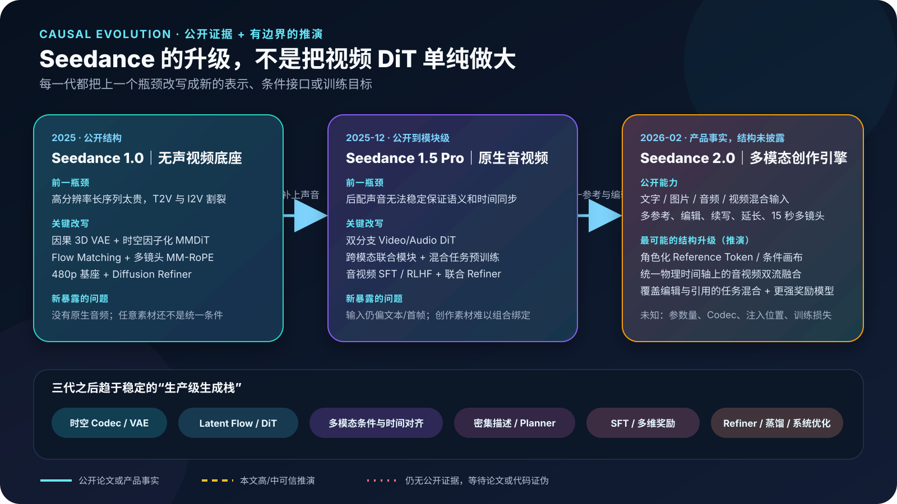
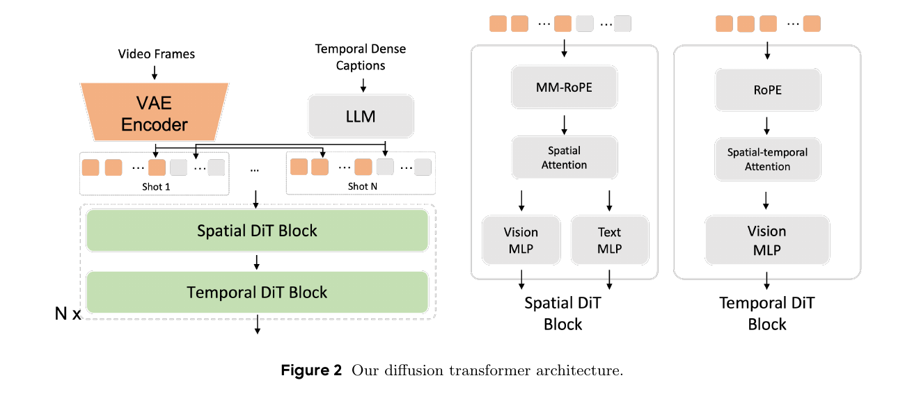
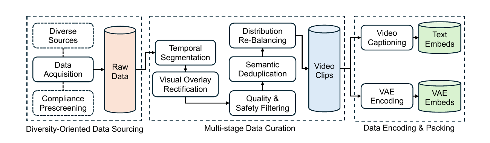
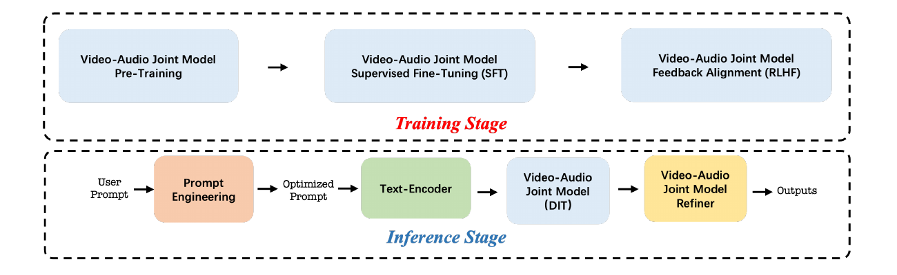
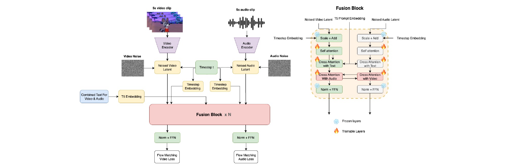
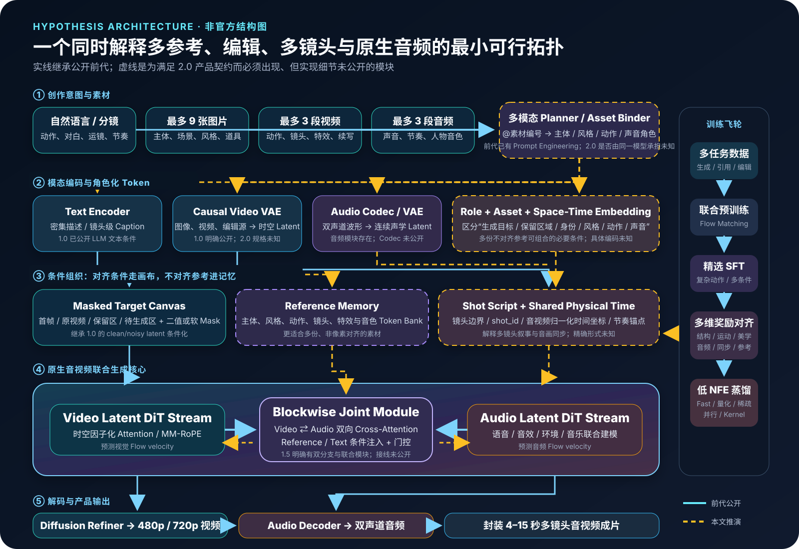
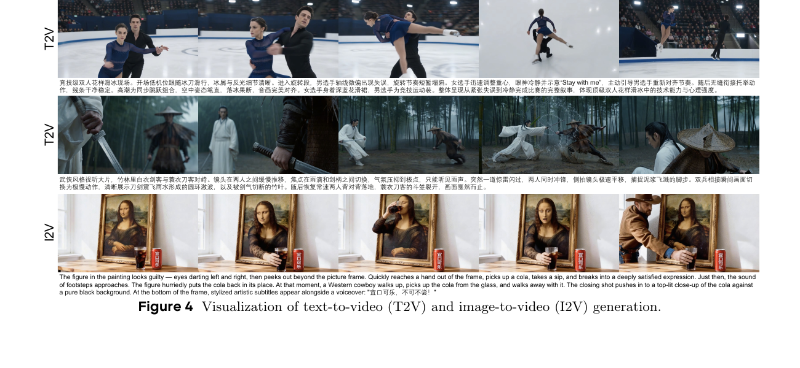

# Seedance 2.0 为什么这么强：从公开证据反推多模态音视频生成架构

给模型九张图片，分别指定人物、服装、道具和场景；再给三段视频，让它参考动作、运镜和特效；最后放入几段声音，要求按照一份分镜脚本生成 15 秒、多镜头、带对白和环境音的成片——Seedance 2.0 最震撼的地方，不是“又把一段视频画得更真”，而是它把原本分散在参考图、动作迁移、视频编辑、音频生成和剪辑里的任务，压进了一个统一的创作接口。

这意味着它的技术升级也不可能只是一句“更大的视频 DiT”。



*图 1　Seedance 三代路线的因果演进。上层说明每一代由什么瓶颈逼出什么结构变化，下层是逐渐稳定的生产级生成栈。蓝色为公开论文或产品事实，黄色为本文推演；依据 [Seedance 1.0](https://arxiv.org/abs/2506.09113)、[Seedance 1.5 Pro](https://arxiv.org/abs/2512.13507) 与 [Seedance 2.0](https://arxiv.org/abs/2604.14148) 技术报告整理。*

## 先给结论

如果把公开证据按时间串起来，我对 Seedance 2.0 的判断是：

1. **视频生成主干大概率没有发生“从 Diffusion 跳到另一种范式”的突变。** 1.0 已经公开因果 3D VAE、时空因子化 MMDiT、Flow Matching、级联 Refiner、奖励对齐和多阶段蒸馏；2.0 更像是在这套成熟底座上扩大模型、数据与任务边界。
2. **原生音频很可能仍由视频、音频两个 Latent 分支共同生成。** 1.5 Pro 已明确披露“双分支 Diffusion Transformer + 跨模态联合模块”。最合理的实现是每隔若干 Block 双向交换语义和时间信息，而不是先生成无声视频再调用一个音效模型。
3. **2.0 真正的新抽象是“素材可成为带角色的条件”。** 多张图、多段视频和多段音频彼此不对齐，单纯把它们沿通道拼接无法解释“图 1 只参考人物、视频 2 只参考运镜、音频 1 只参考节奏”。系统需要素材编号、模态、角色、时间和镜头位置等显式标识，以及一个能把自然语言里的 `@素材` 绑定到这些标识的 Planner。
4. **生成、编辑、续写和延长很可能被改写成同一类 Masked Conditional Generation。** 已知区域作为干净条件，待生成区域作为带噪目标；不同任务主要改变 Mask、条件 Token 和时间坐标，而不是为每个功能训练一个完全独立模型。
5. **“物理感”主要来自数据、规模、密集描述、动作专项数据与多维奖励，不应理解为内置了一个显式物理引擎。** 独立的 AV-Phys Bench 中 Seedance 2.0 总体最好，但研究者仍认为包括它在内的所有模型距离稳健物理理解很远。[^avphys]
6. **Fast 版本大概率来自低 NFE 蒸馏与系统优化。** 1.0 已公开 TSCD、RayFlow、对抗后训练、薄 VAE Decoder、量化、稀疏 Attention 和并行优化；1.5 Pro 也明确声称整条链路超过 10 倍加速。2.0 Fast 没有公开 NFE 和硬件，不能把前代数字直接抄过去。

> [!note] 证据边界
> - Seedance 2.0 于 2026-02-12 发布，技术报告在 2026-04-15 上传。报告用了 26 页详细评测能力，却没有公布参数量、Block 结构、音频 Codec、条件注入方式、训练损失或消融实验。
> - 文中“公开事实”来自官方论文、官方发布页和公开产品规格；“同团队线索”来自 Seedance/Seed/Seaweed 相关论文；“可行参照”来自 Ovi、LTX-2 等公开模型；“本文推演”不代表字节跳动官方实现。
> - 官方报告中的 SeedVideoBench 2.0 由模型团队设计，竞品覆盖范围和功能支持也并不完全对称。Arena 排名是报告记录的 2026-04-08 快照，不能写成永久排名。
> - 本文没有取得 Seedance 2.0 权重、训练日志或内部架构图。任何模块级结论都应接受未来论文、专利、代码或消融实验的证伪。
> - 公开显示日期按 Seedance 2.0 官方发布日归档为 2026-02-12；本文于 2026-07-30 补写并完成资料核验，因此引用了随后发布的 4 月技术报告与 5 月独立评测，不能将这些材料视为 2 月 12 日当时已经公开的信息。

这是一篇长文。只想知道我的判断，可以读本节和第 9 节；想理解主干从哪里来，读第 2、3 节；想深挖多参考与编辑为何要求新条件接口，读第 4、5 节；关心“物理感”、奖励和 Fast 版本，读第 6—8 节。

## 1　先看产品契约：公开了什么，没公开什么

Seedance 2.0 官方同时用了“统一多模态音视频联合生成架构”和“支持文字、图片、音频、视频四种输入”的表述。当前报告给出的产品边界是：直接生成 4—15 秒音视频，原生 480p/720p；一次最多接收 9 张图片、3 段视频、3 段音频；覆盖参考生成、视频编辑、续写和延长，并提供一个面向低延迟的 Fast 版本。[^seedance20][^launch]

这里最重要的不是素材数量，而是**它们能组合**：

| 官方能力 | 对模型结构提出的最低要求 |
|---|---|
| 多图主体、场景、风格、道具参考 | 必须区分素材身份和参考角色；不能把所有图片平均池化成一个向量 |
| 视频动作、镜头、特效参考 | 必须保留参考视频的时间结构，并区分“复制什么”和“不要复制什么” |
| 音频参考与原生声音生成 | 需要音频表示、音画时间对齐和跨模态语义交互 |
| 对指定片段、角色、动作或剧情编辑 | 需要 Source/Target 边界、保留区约束和局部可编辑的条件表达 |
| 多镜头叙事 | 需要镜头边界、镜头级描述和跨镜头主体记忆 |
| 视频续写与延长 | 需要把已有尾段当作时间条件，向未来 Latent 外推 |
| 同一模型覆盖上述组合 | 需要任务混合训练或统一生成目标，而不是一组互不相干的插件 |

反过来，官方**没有**告诉我们：

- 模型有多少参数，是对称双流还是音频小、视频大的非对称双流；
- 图片、视频和音频参考进入哪些 Block，是 Cross-Attention、Self-Attention、通道拼接还是多种路径并用；
- 双声道音频如何编码，是否直接建模左右声道、Mid/Side 表示或其他空间音频 Latent；
- “多轨”是模型内部能同时组织对白、音效、环境和音乐，还是产品真的返回可独立编辑的 Stem；
- 多镜头由独立 Planner 规划，还是只靠密集 Caption 与镜头位置编码涌现；
- 物理改善来自更大模型、数据筛选、专项后训练、推理时筛选，还是这些因素的组合。

因此，正确的问题不是“猜一个隐藏的网络图”，而是：**哪一种最小技术组合，既继承已公开前代，又能满足 2.0 的全部产品契约？**

## 2　Seedance 1.0 已经把视频主干搭完了

### 2.1 因果 3D VAE：先把视频压进可计算的时空 Latent

Seedance 1.0 不在 RGB 像素上直接运行 DiT。它使用时间因果卷积 VAE，把形状

$$
(T'+1,\ H',\ W',\ 3)
$$

的视频压成连续 Latent：

$$
(T+1,\ H,\ W,\ C)
$$

报告披露的下采样率是

$$
(r_t,r_h,r_w)=(4,16,16),\qquad C=48
$$

也就是时间缩短 4 倍、空间两个方向各缩短 16 倍。第一帧采用因果设计，所以当 $T=T'=0$ 时，同一套 VAE 也能处理静态图片。这个细节很关键：图片与视频不是两个完全不同的世界，而是同一时空表示在时间长度上的特例。[^seedance10]

高压缩率减少了 DiT 的 Token 数，但也把生成质量上限交给了 VAE。报告为此同时使用 L1 重建、KL、LPIPS 与对抗损失，并使用兼顾外观和运动的混合判别器。换句话说，很多“高频纹理不闪、运动中脸不糊”的能力，在 Diffusion 开始前就已经被 Codec 决定了一部分。

### 2.2 时空因子化 MMDiT：全局时间、局部空间，不把算力浪费在完整四维 Attention

看下面原图时，重点不是 Block 数，而是职责被拆成了两种：



*图 2　Seedance 1.0 的 Diffusion Transformer。空间 Block 使用 MMDiT 让视觉与文本 Token 交互，时间 Block 只处理视觉 Token，并通过窗口划分获得跨时间的全局感受野。原论文 Figure 2，裁剪自 [Seedance 1.0: Exploring the Boundaries of Video Generation Models](https://arxiv.org/abs/2506.09113)，版权归原作者。*

空间层在每帧内做 Attention，文本 Token 只在空间层参与跨模态交互；时间层则在局部空间窗口内跨帧聚合。这样把完整时空 Self-Attention 的巨大代价拆开，同时保留长时间运动传播。

空间 Block 采用类似 Stable Diffusion 3 的 MMDiT：视觉和文本各自拥有 AdaLN、QKV 投影和 MLP 权重，但在同一多模态 Attention 中交换信息。时间 Block 只看视觉 Token。两处 Q/K 在计算注意力矩阵前归一化，以降低大模型训练不稳定。

这已经解释了 2.0 为什么很可能仍然是 DiT 家族：1.0 的结构不是一个临时 Demo，而是围绕大规模训练、长序列效率和多镜头叙事设计的工业底座。

### 2.3 多镜头不是后期拼接：Shot Caption 与 MM-RoPE 已经进了训练表示

1.0 的视频和文本可以交错组织。每个镜头拥有自己的密集描述，镜头按动作发生顺序排列；视觉 Token 使用三维 RoPE，文本 Token 增加一维位置编码，形成多模态 MM-RoPE。

这使多镜头成为训练分布，而不只是推理时让模型“顺便切个镜”。可以把一个样本抽象为：

$$
[\ c_1,\ v_1,\ c_2,\ v_2,\ldots,c_K,\ v_K\ ]
$$

其中 $c_k$ 是第 $k$ 个镜头的描述，$v_k$ 是对应视觉 Latent Token。镜头边界和顺序进入位置系统后，模型才有机会学习：

- 镜头 2 虽然换了景别，仍然是镜头 1 的同一个人物；
- “随后”“切到”“反打”“推进”等词怎样对应时间和视角变化；
- 一段叙事中，动作和场景怎样跨镜头保持因果连续。

2.0 的“导演级控制”可能比这强很多，但它不需要从零发明多镜头表示；最可能是在 1.0 的镜头级 Caption、位置编码和数据分布上继续扩展。

### 2.4 T2V、I2V 和编辑的共同祖先：带 Mask 的条件画布

1.0 已公开一种非常重要的统一任务形式：把带噪目标与干净条件帧或零填充帧沿通道拼接，再用二值 Mask 标记哪些帧是模型必须遵循的条件。

于是：

- T2I/T2V：条件画布为空，目标区域全部生成；
- I2V：第一帧是干净条件，后续帧生成；
- 视频续写：已有片段是干净条件，未来区域生成；
- 视频编辑：原视频与保留区是条件，Mask 指定改写区域；
- 插帧或桥接：首尾片段固定，中间区域生成。

这不是说 2.0 一定仍只用通道拼接。九张不对齐参考图显然需要更灵活的 Token 记忆。但**“所有任务都能写成已知条件 + 未知目标 + 条件角色”**，很可能仍是统一训练的核心抽象。

### 2.5 Flow Matching 与级联 Refiner：先生成运动，再把高频细节补回来

1.0 明确采用 Flow Matching 和速度预测。用统一符号表示，令干净视频 Latent 为 $z_v$、高斯噪声为 $\epsilon_v$，在时间 $t\in[0,1]$ 上使用线性概率路径：

$$
x_t^v=(1-t)\epsilon_v+t z_v
$$

目标速度为：

$$
u_t^v=\frac{d x_t^v}{dt}=z_v-\epsilon_v
$$

DiT 学习条件速度场：

$$
v_\theta^v(x_t^v,t,c)\approx u_t^v
$$

这里 $c$ 包含文本、条件帧、Mask 和镜头位置。它和 [[努力做一个可以让人记住的Diffusion推导|Diffusion/Flow Matching]] 的一般框架完全一致；[[论文解读：Scalable Diffusion Models with Transformers|DiT]] 只是承担每个 $t$ 上那次最昂贵的函数估计。

高分辨率部分并不全交给基座。1.0 先生成 480p，再由另一个 Diffusion Refiner 条件于上采样后的低分辨率视频，恢复到 720p/1080p。1.5 Pro 的公开流程仍然保留“联合生成模型 → 音视频联合 Refiner”。因此，2.0 报告所谓“原生 480p/720p”很可能仍然包含级联，只是没有公布具体层次。

## 3　真正拉开效果差距的，往往是数据与训练阶段

只看网络图会严重低估 Seedance 的工程量。1.0 的报告把大量篇幅给了数据管线：



*图 3　Seedance 1.0 的视频数据处理流程。它支持一个关键判断：复杂动作和多镜头能力不仅来自主干，还来自镜头级切分、动作/运镜描述、质量过滤与类别再平衡。原论文 Figure 3，裁剪自 [Seedance 1.0 技术报告](https://arxiv.org/abs/2506.09113)，版权归原作者。*

### 3.1 密集 Caption 决定模型能否“看懂”复杂提示

数据先做镜头边界检测，把长视频切成最长 12 秒、可能包含多个连续镜头的片段；再去除或裁切水印、字幕和 Logo，过滤模糊、抖动、低美学、构图差、过度静止及不安全内容；随后按视频语义特征去重，并对主体、场景、动作、风格、时长、分辨率和运动类型再平衡。

Caption 不只写“一个人在滑冰”，还要拆成：

- 静态：人物外观、服装、场景、光线、材质和风格；
- 动态：动作的主体、顺序、幅度、交互和结果；
- 摄影：景别、相机运动、焦点变化、剪辑节奏和镜头转换。

1.0 的 Caption 模型基于 Tarsier2，视觉编码器冻结、语言模型全量微调，并使用中英双语数据。用户 Prompt 与训练 Caption 风格不一致，所以推理前还有一个基于 Qwen2.5-14B 的 Prompt Engineering 模型，经 SFT 和 DPO 学会把短提示改写成训练时熟悉的密集描述。

这条线索对 2.0 很重要：当输入从纯文字扩展到十几份素材时，前端不再只是“润色 Prompt”，而必须做**素材绑定**。它很可能先把“图 1 的脸、图 3 的衣服、视频 2 的镜头、音频 1 的节奏”转换成结构化的镜头与条件角色，再交给生成主干。

### 3.2 渐进训练不是为了好看，而是为了把算力花在正确课程上

1.0 的预训练课程大致是：

1. 先做足量 256px 文生图；
2. 引入 256px 图像/视频联合训练，视频 3—12 秒、12fps；
3. 提升到 640px；
4. 最后训练 24fps，改善流畅度；
5. 视频阶段保留少量图像任务维持语义与画面能力；
6. 预训练中 I2V 占 20%，Continue Training 阶段提高到 40%，专门补强图像条件响应。

高分辨率、长时长样本需要更强噪声才能破坏原信号，所以时间步还做了分辨率/时长相关的 Shift。这说明工业模型训练不是把所有数据一次性混匀，而是沿着“静态语义 → 短视频运动 → 高分辨率 → 高帧率 → 条件跟随”逐层开能力。

Seedance 2.0 多出来的参考、编辑和音频能力，最合理的训练方式也不是在最后接几层 Adapter，而是把课程扩展成：

$$
\text{基础图像/视频}
\rightarrow
\text{音频与配对音视频}
\rightarrow
\text{单参考}
\rightarrow
\text{多参考组合}
\rightarrow
\text{编辑/续写/延长}
\rightarrow
\text{复杂创作 SFT 与奖励对齐}
$$

具体比例未知，但如果没有这类任务课程，模型很容易学会单素材，却在多素材时混淆角色。

## 4　Seedance 1.5 Pro 补上了最难的一块：原生音视频

1.5 Pro 的技术报告很短，没有给出 Block 级结构，却明确公开了三件事：

1. 基于 MMDiT 的**双分支 Diffusion Transformer**；
2. 音频与视频分支之间存在**跨模态联合模块**；
3. 通过大规模混合模态多任务预训练，同时覆盖 T2VA、I2VA、T2V 和 I2V。[^seedance15]



*图 4　Seedance 1.5 Pro 的训练与推理流程。原论文只公开到“联合模型/联合 Refiner”粒度，没有公布音频 Codec、联合模块接线和损失。原论文 Figure 2，裁剪自 [Seedance 1.5 pro: A Native Audio-Visual Joint Generation Foundation Model](https://arxiv.org/abs/2512.13507)，版权归原作者。*

### 4.1 为什么不能把音频 Token 直接塞进视频序列

视频和音频有三个天然不对称：

- 视频 Latent 是时间 × 高 × 宽，音频 Latent 通常是时间 × 频率或一维时间序列；
- 两者 Token 速率不同：一秒视频可能只有若干 Latent 帧，一秒音频却有几十到几百个 Latent Token；
- 视频需要大容量建模空间结构，音频需要更精细的时间相位、音色和声学纹理。

如果把两者粗暴拼成一个序列，同一个 Attention 要同时承担完全不同的局部结构，序列长度也会迅速膨胀。双流结构允许视频和音频各自保留专业主干，只在需要同步的层交换信息。

由于 Seedance 1.5 没有公开结构，我们不能把任意公开模型当作它的实现。但 Ovi 给出了一种与“音视频双分支 + 联合模块”高度吻合的可行参照：



*图 5　公开模型 Ovi 的对称双 DiT。它用共享文本条件、逐 Block 双向 Cross-Attention 和按物理时间缩放的 RoPE 对齐音画。它证明这种拓扑可行，但**不是** Seedance 的架构证据。原论文 Figure 1，裁剪自 [Ovi: Twin Backbone Cross-Modal Fusion for Audio-Video Generation](https://arxiv.org/abs/2510.01284)，版权归原作者。*

LTX-2 也采用 14B 视频流与 5B 音频流组成的非对称双流，并用双向音视频 Cross-Attention、时间位置编码与跨模态 AdaLN 对齐。[^ltx2] 两个独立公开系统都选择双流，说明它已经成为联合音视频生成的一条稳定工程路线。

### 4.2 统一物理时间，而不是强行统一 Token 数

设视频分支有 $N_v$ 个时间位置，音频分支有 $N_a$ 个位置。最简单的对齐不是令 $N_v=N_a$，而是把它们映射到同一个归一化物理时间：

$$
\tau_i^v=\frac{i}{N_v-1},
\qquad
\tau_j^a=\frac{j}{N_a-1}
$$

再用 $\operatorname{RoPE}(\tau)$ 或其他连续时间位置编码进入 Attention。Ovi 的具体做法是按两种 Token 速率之比缩放音频 RoPE；Seedance 是否采用同样实现未知，但任何能稳定生成口型、撞击声与节拍同步的系统，都需要解决这个时间网格映射问题。

在第 $l$ 个联合 Block 中，一个合理的双向更新是：

$$
\tilde h_v^{(l)}
=
h_v^{(l)}
+
g_v^{(l)}
\operatorname{Attn}
\left(
Q_v h_v^{(l)},
K_a h_a^{(l)},
V_a h_a^{(l)}
\right)
$$

$$
\tilde h_a^{(l)}
=
h_a^{(l)}
+
g_a^{(l)}
\operatorname{Attn}
\left(
Q_a h_a^{(l)},
K_v h_v^{(l)},
V_v h_v^{(l)}
\right)
$$

$g_v^{(l)}$ 和 $g_a^{(l)}$ 是可学习门控。视频流从音频流获得“此刻谁在说、何时撞击、音乐何时起伏”，音频流从视频流获得“声源在哪里、动作何时发生、环境是什么”。双向交换比单向 Video-to-Audio 更能解释原生对白和口型同步。

### 4.3 联合 Flow Matching 的最小目标

令音频干净 Latent 为 $z_a$、噪声为 $\epsilon_a$。音视频可以共享同一个 $t$，沿两条路径同时加噪：

$$
x_t^v=(1-t)\epsilon_v+t z_v,
\qquad
x_t^a=(1-t)\epsilon_a+t z_a
$$

联合模型分别预测速度：

$$
(\hat u_v,\hat u_a)
=
F_\theta(x_t^v,x_t^a,t,c,r)
$$

其中 $c$ 是文本/分镜，$r$ 是参考素材。最小训练目标可以写成：

$$
\mathcal L_{\text{joint}}
=
\lambda_v\left\|\hat u_v-(z_v-\epsilon_v)\right\|_2^2
+
\lambda_a\left\|\hat u_a-(z_a-\epsilon_a)\right\|_2^2
$$

跨模态同步不一定需要单独的 Sync Loss：当两条流在每层交换信息、共享物理时间，并用配对音视频数据共同训练时，同步可以直接进入速度场。但工业系统很可能还会加入口型、声画事件、节拍或偏好奖励；Seedance 报告没有公开这些项，所以本文不把它们写进“官方损失”。

下面是与公式对应的**接口伪代码**，用于说明数据流，不是 Seedance 官方实现，也不能直接训练：

```python
def joint_flow_matching_step(model, video_latent, audio_latent, condition):
    """
    Interface pseudocode only.
    video_latent: z_v, [B, T_v, H, W, C_v]
    audio_latent: z_a, [B, T_a, C_a]
    condition: text, reference tokens, masks, roles and time coordinates
    """
    t = sample_shared_timestep(video_latent.shape[0])
    eps_v = randn_like(video_latent)
    eps_a = randn_like(audio_latent)

    x_v = (1.0 - t) * eps_v + t * video_latent
    x_a = (1.0 - t) * eps_a + t * audio_latent
    target_v = video_latent - eps_v
    target_a = audio_latent - eps_a

    pred_v, pred_a = model(
        noisy_video=x_v,
        noisy_audio=x_a,
        timestep=t,
        condition=condition,
    )
    return mse(pred_v, target_v) + mse(pred_a, target_a)
```

真正困难的不是这十几行公式，而是让 `condition` 在数十种任务和十几份素材中始终语义明确。

## 5　2.0 的核心推演：把所有素材变成“有角色的条件”

### 5.1 仅靠 1.0 的通道拼接已经不够

首帧、原视频和待编辑区域具有像素对齐关系，适合条件画布；但以下参考没有：

- 一张人物正脸照，要控制另一场景中的身份；
- 一段舞蹈视频，只想复制动作，不想复制舞者外观；
- 一张水墨图，只想复制风格；
- 一段音频，只想复制节奏或音色；
- 一份分镜截图，只想复制镜头组织。

若全部拼进 Target Latent，模型很难知道它们的职责，序列也会爆炸。更合理的设计是两条条件路径：

1. **Aligned Canvas：** 对首帧、原视频、编辑保留区和续写边界，直接在目标时空画布上放入干净 Latent，并配合 Mask；
2. **Reference Memory：** 对主体、风格、动作、镜头、特效和声音等非对齐参考，编码为上下文 Token，通过 Cross-Attention 或可控 Self-Attention 供目标 Token 查询。

每份参考至少需要：

$$
r_i
=
E_{m_i}(x_i)
+
e_{\text{modality}}
+
e_{\text{role}}
+
e_{\text{asset-id}}
+
e_{\text{space-time}}
$$

其中 $E_{m_i}$ 是该模态编码器，`role` 表示身份/动作/风格/音色等职责，`asset-id` 防止九张图片互相混淆，`space-time` 保留参考内部的空间与时间结构。

### 5.2 Planner 的职责是绑定，不是替生成模型“想象”

1.0 已公开一个把用户短 Prompt 改写成密集 Caption 的 Qwen2.5-14B 模型。到 2.0，它最自然的升级是多模态 Planner：

```text
用户指令：
人物参考图1，服装参考图2，动作参考视频1，
使用音频1的节奏，但对白按脚本生成。

结构化绑定：
shot_1.subject_identity <- image_1
shot_1.costume_style    <- image_2
shot_1.motion_reference <- video_1
global.rhythm_reference <- audio_1
global.dialogue_source  <- generated_from_script
```

Planner 可以输出镜头级密集描述、素材角色、时间区间和保留/可改区域。生成 DiT 仍负责把条件变成像素与声音。这个职责拆分能解释为什么模型既能理解自然语言，又能在复杂素材组合中不那么容易“串素材”。

但必须保留一个替代解释：2.0 也可能把素材 Token 与文本一起送入一个更强的多模态 Encoder，由生成主干端到端学会绑定，而没有显式可见的结构化 Planner。2026 年 5 月字节另一支团队公开的 Lance 使用交错多模态序列、双流 MoE 和模态感知 RoPE，表明“统一理解 + 生成”在内部研究中是现实方向；但 Lance 晚于 Seedance 2.0 发布，不能倒推为其技术来源。[^lance]

### 5.3 我认为最可能的整体拓扑



*图 6　Seedance 2.0 的最小可行技术拓扑，本文推演。实线继承前代已公开机制，虚线表示为满足 2.0 产品契约而高度可能存在、但实现未公开的模块。参考了 Seedance 1.0/1.5 Pro 的直接路线，以及 [Ovi](https://arxiv.org/abs/2510.01284)、[LTX-2](https://arxiv.org/abs/2601.03233) 等公开联合音视频模型；不代表官方结构。*

这张图的核心不是某个层名，而是三种责任：

- **Planner/Encoder 负责理解素材“是什么、用来干什么”；**
- **Condition Canvas/Memory 负责把已知与未知、对齐与非对齐素材组织清楚；**
- **Joint DiT 负责在统一时间轴上同时生成视觉和声音。**

只要这三层缺一层，2.0 的某组能力就很难成立：没有角色绑定会串素材，没有条件画布会破坏编辑保留区，没有音视频联合主干就很难稳定口型和事件声。

## 6　为什么复杂动作和“物理感”提升这么明显

官方样例特意选择双人花样滑冰、双人武侠对打和画中人物伸手拿可乐。这些不是随机炫技：它们分别压力测试身体接触、遮挡、角动量、武器碰撞、镜头切换、跨域材质和“画内—画外”关系。



*图 7　Seedance 2.0 的 T2V/I2V 样例序列。它能证明官方选择这些复杂场景展示能力，也能让读者观察连续关键姿态和主体关系；静态抽帧不能单独证明整段运动无瑕疵，更不能证明模型拥有物理模拟器。原论文 Figure 4，裁剪自 [Seedance 2.0: Advancing Video Generation for World Complexity](https://arxiv.org/abs/2604.14148)，版权归原作者。*

### 6.1 第一来源：训练分布终于覆盖“交互”，而不只是单主体移动

视频模型最容易学的是镜头平移、物体整体位移和单人慢动作；最难的是接触事件，因为它要求多个局部约束同时成立：

- 两个人的肢体必须在正确时间到达接触点；
- 接触前后的速度、姿态和遮挡关系要连续；
- 衣物、头发、道具和背景要随动作响应；
- 声音要在事件发生时出现；
- 镜头变化后，人物身份和事件状态还要延续。

如果训练数据里复杂运动稀缺，模型即使更大也会向“安全的慢动作”回归。1.0 已公开用光流评价器筛选运动更丰富的数据、按动作类别再平衡，并在 Continue Training 阶段提高运动质量与 I2V 比例。2.0 最可能进一步扩充了体育、舞蹈、打斗、多人交互、物理事件与音画同步数据，并用更细 Caption 描述接触前因后果。

### 6.2 第二来源：奖励不再只看美图，而是把运动和可用率写进目标

1.0 已公开三类奖励模型：

- Foundational RM：用视觉语言模型评估图文对齐和结构稳定；
- Motion RM：减少运动伪影，同时提高动作幅度和生动性；
- Aesthetic RM：从关键帧图像评估画面美学。

基座和高分 Refiner 都接受奖励对齐。后续同团队的 RewardDance 又把视觉奖励模型改成生成式 VLM 判别，并展示了模型规模与上下文规模扩展：奖励模型可以读取任务要求、参考样例和推理上下文，不再只是一个固定 CLIP 分数。[^rewarddance]

因此，2.0 的高可用率很可能来自更细的奖励向量：

$$
R
=
w_s R_{\text{structure}}
+w_m R_{\text{motion}}
+w_a R_{\text{aesthetic}}
+w_{av}R_{\text{audio-video}}
+w_rR_{\text{reference}}
+w_eR_{\text{editing}}
+w_iR_{\text{instruction}}
$$

这只是概念分解，不是官方公式。它说明“复杂动作更稳”可能主要发生在后训练：模型先学会世界分布，再用人类偏好和专项评价器把概率质量推向更可用的区域。

### 6.3 第三来源：生成时的候选筛选可能比单样本质量更重要

商业系统通常可以生成多个候选，再用质量、文本一致性、动作、身份和安全模型排序。官方没有说明 Seedance 2.0 产品是否对每次请求做 Best-of-N 或拒绝采样，所以不能把它当事实；但当产品强调“可用率”而不是单一 FVD 时，推理侧候选排序是必须考虑的系统变量。

这也解释了为什么 Demo 质量不能直接等同于任意 Prompt 的一次命中率。模型本身、采样策略、Prompt 扩写、候选数和排序器共同决定用户看到的结果。

### 6.4 “物理感”不等于“学会物理”

独立 AV-Phys Bench 测试稳定状态、事件转场、环境转场和故意反物理的指令。Seedance 2.0 在七个受测模型中总体最好，但所有系统在事件/环境变化上都明显下降，并在 Anti-AV-Physics 提示下失败。[^avphys]

这更支持一个保守判断：

> Seedance 2.0 学到了更强的视觉—声学事件统计规律，能在常见分布上生成更可信的物理外观；它尚未表现出一个能跨反事实稳定守恒、拒绝矛盾指令的通用物理模拟器。

官方报告也主动列出剩余问题：边缘场景运动合理性、细小形变、高频视觉噪声、音频失真与噪声、多人场景口型错误；多主体一致性、文字还原和复杂编辑也仍需改善。[^seedance20]

## 7　多镜头、编辑、续写和延长，可能是一套 Mask 的四种摆法

### 7.1 多镜头：Planner 给结构，DiT 给连续状态

多镜头至少需要两层状态：

- **镜头内状态：** 当前主体、动作、镜头、声音和环境；
- **镜头间状态：** 哪些身份、服装、道具、情绪和事件结果必须继承。

1.0 已有镜头级 Caption 与 MM-RoPE。2.0 很可能增加镜头脚本 Token、素材角色和跨镜头共享身份记忆。它未必是“先用一个 LLM 写完整剧本，再逐镜头自回归生成”；也可能一次性在 15 秒 Latent 中生成多个镜头，只是通过 Shot ID 和 Caption 划分叙事区域。

### 7.2 编辑：Source 是条件，Target 是去噪变量

给定原视频 Latent $z_{\text{src}}$ 和编辑 Mask $M$，一种通用的训练形式是：

$$
x_t
=
M\odot\big((1-t)\epsilon+t z_{\text{target}}\big)
+
(1-M)\odot z_{\text{src}}
$$

$M=1$ 的区域生成，$M=0$ 的区域保留。若编辑是“换人物但保留动作和背景”，人物参考进入 Reference Memory，源视频的运动与背景进入条件画布。若编辑是“只改声音”，视频流可以作为强条件，音频流成为主要去噪目标。

真正的难点是训练样本：互联网视频没有天然的“原片—精确编辑后视频—文字指令”三元组。系统需要用图像/视频分割、重绘、动作/主体替换、合成数据和高质量人工样本构建伪编辑对，再通过 SFT 与偏好对齐消除合成痕迹。

### 7.3 续写与延长：同一接口，不同边界条件

“续写”更偏叙事：已有视频提供人物、事件和风格，模型按新剧情生成后续镜头；“延长”更偏时间连续：模型必须从原视频尾部自然接出下一段。两者都可以写成：

$$
\text{known prefix}
\;+\;
\text{masked future canvas}
$$

但延长比首帧 I2V 难，因为条件边界包含速度、加速度、口型相位、相机运动和音频相位。只要其中一个错位，接缝就会被看见。

Seedance 2.0 报告自己的 R2V 评测也暴露了这个区别：视频编辑的参考对齐与编辑一致性较强，视频续写可用；但在视频延长中，指令跟随得分 1.93，低于对照 Veo 3.1 的 2.78，报告直接把延长称为其最弱的 R2V 任务。[^seedance20] 这与“边界状态比静态首帧更难编码”的技术判断一致。

## 8　Fast 版本大概率怎样做出来

Seedance 2.0 只说提供 Fast 变体，没有公开步数、延迟和硬件。但前代路线已经给出很强的方向证据。

### 8.1 少步采样：先把长 ODE 轨迹教给学生模型

1.0 使用 Trajectory Segmented Consistency Distillation，把完整去噪轨迹切成多个区段，让学生在更少步数下逼近区段端点；报告称这一阶段给 DiT 带来约 4 倍加速。随后又引入 RayFlow 的 Score Distillation，针对不同样本学习更合适的 Flow 轨迹，并用多步对抗训练与人类偏好缓解低 NFE 的纹理损失和伪影。[^rayflow][^apt]

可以把蒸馏目标抽象成：

$$
\mathcal L_{\text{distill}}
=
\left\|
\Phi_{\theta_s}(x_{t_i},t_i\rightarrow t_{i-1})
-
\Phi_{\theta_T}^{(K)}(x_{t_i},t_i\rightarrow t_{i-1})
\right\|_2^2
$$

学生一次跨过一个大区段，教师用 $K$ 个小步给出目标。Fast 版本的关键不是简单删步，而是重新训练一个能在大步长上保持稳定的速度场。

### 8.2 Codec 和系统优化：减少每一步之外的固定成本

1.0 还公开了：

- 缩窄靠近像素空间的 VAE Decoder 通道，在固定 Encoder 下重新训练，报告为 Decoder 带来约 2 倍加速；
- Kernel Fusion 累计提升约 15% 吞吐；
- Attention/GEMM 混合精度量化；
- 利用 DiT 跨 Block 与 Block 内的结构化稀疏；
- 按序列、Head、空间和时间做自适应混合并行。

1.5 Pro 进一步声称多阶段蒸馏、量化和并行带来端到端超过 10 倍加速。2.0 Fast 最可能继承这条组合，而不是只换一张小模型权重。

但数字不能迁移：2.0 同时多了音频分支、更长上下文和多份参考，端到端瓶颈可能已经从 DiT 转向参考编码、音频 Codec、Refiner 或数据传输。没有公开测量前，不能写“2.0 Fast 就是 4 步”或“快 10 倍”。

## 9　把推演变成可证伪的预测

一个好的技术推演必须允许未来被证明错。若 Seedance 2.0 后续公开完整论文或代码，我会优先检查这些预测：

| 预测 | 置信度 | 未来什么证据会证伪 |
|---|---:|---|
| 视频仍采用因果 3D Codec + Latent Flow/DiT | 高 | 官方公开纯自回归离散 Token 或像素生成主干 |
| 音频与视频有独立 Latent 流，并在多层双向融合 | 高 | 官方公开单序列 Joint Self-Attention，且无模态专属主干 |
| 音画用归一化物理时间或缩放 RoPE 对齐 | 中高 | 官方显示只在输出端做后验同步或固定口型模块 |
| 对齐条件走 Target Canvas，非对齐素材走 Reference Memory | 中高 | 官方使用单一条件路径处理全部参考且消融证明足够 |
| 参考 Token 含素材 ID 与角色/模态标识 | 中高 | 官方表明素材只被聚合成一个无区分全局向量 |
| 前端存在 Prompt/Storyboard/Asset Binding 模块 | 中 | 官方证明原始 Prompt 与所有素材直接进入 DiT，无独立理解或改写阶段 |
| 复杂运动提升主要来自数据课程与多维奖励 | 高 | 官方消融显示只扩大主干、不改变数据和后训练就获得主要增益 |
| Fast 主要依赖低 NFE 蒸馏 + 量化/稀疏/并行 | 高 | 官方显示 Fast 只是普通模型的硬件升级或完全独立的小模型预训练 |

还要保留两个竞争性架构：

1. **单流 Joint Transformer。** 类似 JoVA，把音频、视频和参考 Token 全部放入同一 Joint Self-Attention，通过模态专属 MLP/Norm 区分职责。它结构更统一，但长序列成本更高。[^jova]
2. **理解模型 + 生成模型深耦合。** 类似 Lance 或 LoomVideo，使用多模态大模型的多层特征直接控制 DiT；这能强化素材理解和编辑，但训练与推理链更复杂。[^loomvideo]

Seedance 1.5 已明确写“双分支”，所以我把第一种视为 2.0 彻底重构时才会发生的可能，而不是首选判断。

## 10　如果要做一个开源版，应该按什么顺序复现

不要一上来追求“九图三视频三音频”。最稳的工程路线是逐层锁能力。

### 10.1 第一阶段：先得到强而稳定的视频 Flow 底座

- 使用时间因果 3D VAE；
- 使用时空因子化 DiT 或受控稀疏的全时空 Attention；
- 联合图像、T2V、I2V，保留镜头级 Caption；
- 先在低分辨率、低帧率学语义，再逐步提高分辨率和 fps；
- 建立结构稳定、动作幅度、文本一致性和首帧保持的独立评测。

### 10.2 第二阶段：加入音频，但先冻结大部分视频能力

- 单独预训练音频 Flow/DiT，覆盖语音、音效、环境和音乐；
- 用配对音视频数据训练双向融合层；
- 先做共享物理时间与事件同步，再追求音色和音乐美感；
- 专门检查说话人切换、非可见声源、遮挡声、撞击和多人对白。

Ovi 的经验是只训练联合 Self/Cross-Attention 等部分模块，尽量不破坏已学好的单模态流形；这比全量联合训练更适合验证原理，但不一定是最终性能上限。

### 10.3 第三阶段：把参考和编辑统一成任务矩阵

训练 Batch 不应只按“模型功能名”组织，而应按条件缺失模式采样：

```text
目标视频有噪声 / 无噪声
源视频存在 / 缺失
首帧存在 / 缺失
身份参考存在 / 缺失
动作参考存在 / 缺失
风格参考存在 / 缺失
音频参考存在 / 缺失
目标音频生成 / 保留 / 编辑
```

随机遮蔽条件、打乱无关素材、交换角色标签和构造冲突指令，才能逼迫模型真的使用 `role` 与 `asset_id`，而不是靠数据集捷径猜答案。

### 10.4 第四阶段：把“看起来好”改成可上线的质量闸门

至少分开评估：

- 视频结构、身份、动作、镜头和高频闪烁；
- 音频清晰度、语音可懂度、音色、空间感与噪声；
- 口型、动作声、节拍和环境变化的音画同步；
- 参考对齐与未编辑区域保持；
- 多主体遗漏、复制和角色串线；
- 延长边界的色彩、速度、相机和音频相位连续；
- 生成耗时、显存、失败重试与候选筛选成本。

只有这些指标能回答“为什么效果牛，能不能稳定复现”。单个综合分会让模型通过提高画面美学掩盖动作、参考或音频失败。

## 结论：Seedance 2.0 的本质，是把生成器升级成条件化媒体引擎

Seedance 1.0 已经解决了“怎样高效生成高质量、多镜头视频”：因果 3D VAE、时空因子化 MMDiT、Flow Matching、密集 Caption、级联 Refiner、奖励对齐与蒸馏。

Seedance 1.5 Pro 解决了“声音怎样不再是后期外挂”：音频和视频各自在合适的 Latent 空间生成，再通过联合模块在同一时间轴上交换信息。

Seedance 2.0 最可能解决的是第三个问题：

> **怎样让任意文字、图片、视频和音频不只是“输入”，而成为可被自然语言指派职责、可组合、可保留、可编辑的生成条件。**

因此它的效果跃迁，最可信的解释不是某一个神奇层，而是五件事同时成熟：

1. 更强、更高效的时空视频底座；
2. 原生音视频双流与共享时间表示；
3. 多参考素材的角色化 Token 与条件画布；
4. 覆盖生成、编辑、续写、延长的任务混合和数据课程；
5. 从结构、运动、美学扩展到音频、同步、参考和编辑的多维后训练，再叠加低 NFE 蒸馏与系统优化。

它看起来越来越像一个“世界模型”，但更准确的称呼仍是：**在高密度人类视频数据与偏好反馈上训练出来的条件化媒体生成器。** 它对常见真实分布的重建已经非常强，却还没有跨反事实稳定守住物理因果。这个边界既不削弱 Seedance 2.0 的工程成就，也提醒我们：下一轮竞争不会只发生在画质，而会发生在条件理解、长期状态、可验证物理、可编辑中间表示和生成可靠性上。

## 参考资料

[^seedance20]: Team Seedance, [Seedance 2.0: Advancing Video Generation for World Complexity](https://arxiv.org/abs/2604.14148), 2026。规格、能力、评测与局限均以该报告为准。
[^launch]: ByteDance Seed, [Seedance 2.0 Official Launch](https://seed.bytedance.com/en/blog/seedance-2-0-official-launch), 2026-02-12；[模型主页](https://seed.bytedance.com/en/seedance2_0)。
[^seedance10]: Team Seedance et al., [Seedance 1.0: Exploring the Boundaries of Video Generation Models](https://arxiv.org/abs/2506.09113), 2025。
[^seedance15]: Team Seedance et al., [Seedance 1.5 pro: A Native Audio-Visual Joint Generation Foundation Model](https://arxiv.org/abs/2512.13507), 2025。
[^ltx2]: Yoav HaCohen et al., [LTX-2: Efficient Joint Audio-Visual Foundation Model](https://arxiv.org/abs/2601.03233), 2026。
[^rewarddance]: Jie Wu et al., [RewardDance: Reward Scaling in Visual Generation](https://arxiv.org/abs/2509.08826), 2025。
[^avphys]: Zijun Cui et al., [Do Joint Audio-Video Generation Models Understand Physics?](https://arxiv.org/abs/2605.07061), 2026。
[^lance]: Fengyi Fu et al., [Lance: Unified Multimodal Modeling by Multi-Task Synergy](https://arxiv.org/abs/2605.18678), 2026。该工作由字节跳动 Intelligent Creation Lab 发布，晚于 Seedance 2.0，仅作为相邻研究方向，不作为其血缘证据。
[^rayflow]: Huiyang Shao et al., [RayFlow: Instance-Aware Diffusion Acceleration via Adaptive Flow Trajectories](https://arxiv.org/abs/2503.07699), 2025。
[^apt]: Shanchuan Lin et al., [Diffusion Adversarial Post-Training for One-Step Video Generation](https://arxiv.org/abs/2501.08316), 2025。
[^jova]: Xiaohu Huang et al., [JoVA: Unified Multimodal Learning for Joint Video-Audio Generation](https://arxiv.org/abs/2512.13677), 2025。
[^loomvideo]: Jianzong Wu et al., [LoomVideo: Unifying Multimodal Inputs into Video Generation and Editing](https://arxiv.org/abs/2606.06042), 2026。
