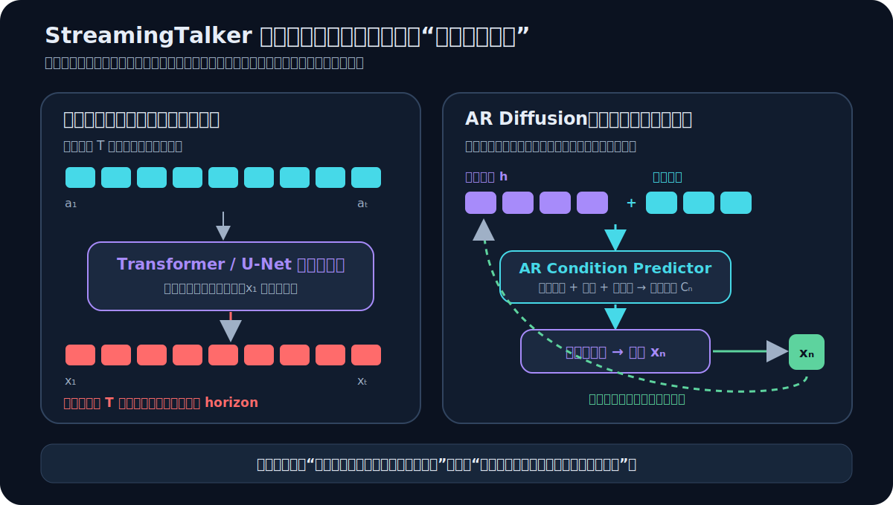
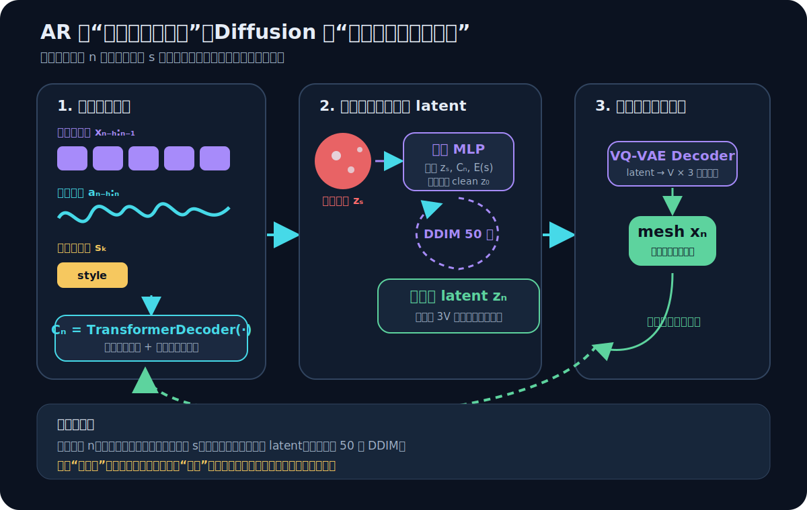
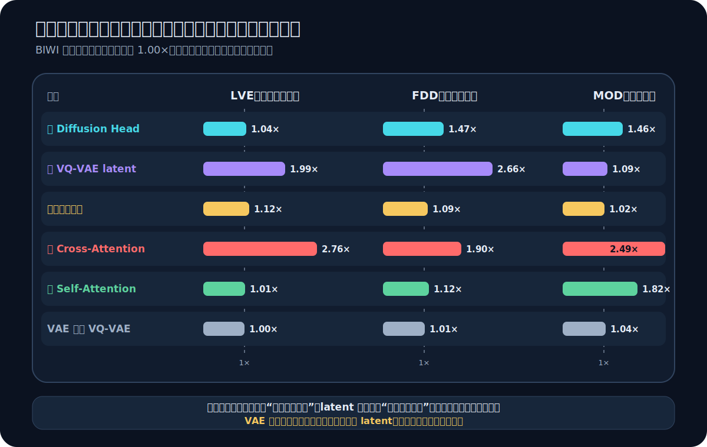
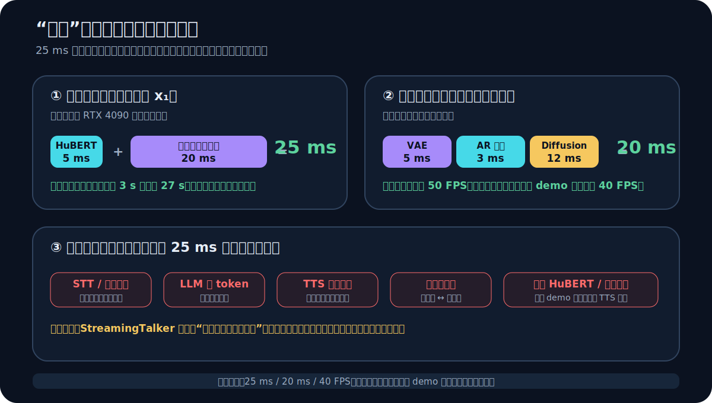

# StreamingTalker：把全序列扩散改造成实时流式 3D 面部动画

> **核心判断：StreamingTalker 没有试图让一个全序列 diffusion 更快地吞下长音频，而是把“整段一次性去噪”改写为“固定历史状态下反复生成下一步”。自回归条件负责跨帧连续，轻量 diffusion 负责局部生成质量。最关键的能力证据是 2000 帧测试与 25 ms 首帧延迟；最关键的机制证据则是固定窗口、cross-attention、latent 编码和 diffusion head 的消融。**

论文：**StreamingTalker: Audio-driven 3D Facial Animation with Autoregressive Diffusion Model**  
作者：Yifan Yang, Zhi Cen, Sida Peng, Xiangwei Chen, Yifu Deng, Xinyu Zhu, **Fan Jia**, Xiaowei Zhou, Hujun Bao  
发表：AAAI 2026 Oral，pp. 11766–11774  
链接：[arXiv:2511.14223](https://arxiv.org/abs/2511.14223)｜[AAAI / DOI](https://doi.org/10.1609/aaai.v40i14.38162)｜[官方代码](https://github.com/zju3dv/StreamingTalker)｜[Demo](https://www.youtube.com/watch?v=7Nnh-iwVRlA)

## 一、先看数字人产品里真正会失败的时刻

设想一个实时数字人刚从 LLM 拿到一段 27 秒的回答。

如果面部动画模型沿用全序列 diffusion，它会先把整段音频编码成条件，再对整段动作序列一起去噪。即使第一个音节的嘴型已经完全确定，第 1 帧也必须等第 27 秒对应的动作一起算完才能交付。

这会同时触发两个问题：

1. **输出屏障**：首帧延迟随音频长度和全序列网络的计算量增长；
2. **长度外推**：模型训练时只见过约 4 秒序列，推理时却被要求一次处理几十秒甚至几千帧，位置编码、注意力范围和去噪分布都离开训练区间。

第二个问题常被误写成“显存不够”，其实更根本。即使显存无限，**模型仍然在测试时解决一个训练时没有见过的序列尺度问题**。

StreamingTalker 的切入点不是继续压缩这个大模型，而是先问：

> 为什么生成第 $n$ 帧时，必须重新面对从第 1 帧到第 $T$ 帧的整段问题？

如果下一帧主要由当前语音、说话人风格和有限的历史面部状态决定，那么长序列可以被改写成一个不断重复的局部条件生成问题。

*图 1：全序列模型把输出权留到整段去噪结束；StreamingTalker 把时序连续性写进固定历史状态，因此每完成一步就能交付一帧。*

## 二、任务契约：论文到底输入什么、输出什么

| 项目 | StreamingTalker 的设定 |
|---|---|
| 外部输入 | 原始语音 $a_{1:T}$、说话人身份 $s_k$ |
| 内部状态 | 已经生成的有限历史面部运动 $x_{T-h:T-1}$ |
| 输出 | 注册到模板拓扑的 3D 面部网格运动序列 $x_{1:T}$ |
| 单帧表示 | $x_t\in\mathbb R^{V\times3}$，即模板上 $V$ 个顶点的三维位移 |
| 监督 | BIWI、VOCASET 中配对的语音与 3D 扫描序列 |
| 说话风格 | 训练身份的 one-hot embedding |
| 部署目标 | 任意总长度、低首帧延迟、可逐帧生成与渲染 |
| 不直接生成 | 纹理、光照、头发、身体、最终照片级人像视频 |
| 关键假设 | 当前嘴型主要由局部语音与有限历史决定；短窗口足以承载需要的运动连续性 |

这里要特别注意：论文输出的是**网格运动**，不是完整渲染视频。它解决的是数字人系统中“语音如何驱动 3D 脸动起来”的中间层。

## 三、先把“实时”和“流式”说准确

这篇论文最容易被一句“实时流式生成”掩盖掉细节。至少要区分三个概念。

### 3.1 首帧延迟

从动画模型拿到音频条件，到第一个面部网格可以交付，需要多久？论文报告 **25 ms**。

### 3.2 稳态吞吐

首帧之后，每一帧能否在播放 deadline 之前算完？论文附录报告 **20 ms / frame**，相当于模型理论吞吐约 50 FPS；包含生成与渲染的 demo 报告最高 40 FPS。

### 3.3 真正的流式输入

麦克风或 TTS 每到一个音频 chunk，模型就增量更新声学特征并生成对应动作，而不是先拿到整段 waveform。

论文最扎实地证明了前两项，尤其是**流式输出**和长度无关的首帧时间。公开 demo 代码则先完成 LLM、gTTS 和整段 HuBERT 特征提取，再逐帧把 mesh 放入渲染队列。因此，更严格的表述是：

> **StreamingTalker 是可逐帧交付的模型级生成器；公开系统尚不能单独证明从 live audio chunk 到 mesh chunk 的端到端全链路 streaming。**

这个区分不削弱论文解决的问题，反而明确了它在数字人系统中的位置：它移除了动画模型自己的输出屏障，但 STT、LLM、TTS、网络和增量声学编码仍需独立优化。

## 四、核心重写：把全序列分布变成固定状态转移

全序列 diffusion 试图直接建模：

$$
p(x_{1:T}\mid a_{1:T},s_k)
$$

StreamingTalker 的方法可以用下面这个分解来理解：

$$
p(x_{1:T}\mid a_{1:T},s_k)
\approx
\prod_{n=1}^{T}
p\!\left(
x_n
\mid
x_{\max(1,n-h):n-1},
a_{\max(1,n-h):n},
s_k
\right)
$$

这不是论文原文直接写出的公式，而是对其固定窗口自回归过程的**推导解释**。它揭示了三个变化：

1. 总时长 $T$ 不再决定单步问题的尺寸；
2. 历史状态长度被固定为 $h$，训练与推理始终面对相似的上下文规模；
3. 每生成一个 $x_n$，就把它反馈到状态，窗口向右移动。

因此，所谓“任意长度”并不是一次建模无限长依赖，而是**同一个有限状态转移可以重复任意多次**。

这和 RNN 能展开任意长序列是同一个逻辑：计算图可以无限展开，但单步记忆仍然有限。

## 五、黑盒总览：AR 与 Diffusion 各做一半

*图 2：动画时间 $n$ 与扩散时间 $s$ 是两个不同循环。AR 负责沿 $n$ 传递状态；每一个 $n$ 内部，再用 50 个 DDIM 步从噪声恢复动作 latent。*

可以先用一句不带公式的话记住整套方法：

> **历史面部运动告诉模型“上一刻是什么状态”，音频告诉模型“现在在说什么”，身份告诉模型“这个人通常怎样说”，AR Transformer 把三者压成条件，轻量 diffusion 再从条件下生成下一步动作。**

为什么不全部交给一个网络？因为这里有两个性质不同的责任：

- **时间责任**：下一帧要接得上上一帧，且总长度不能改变问题规模；
- **分布责任**：同一段语音不只有唯一表情，动作 latent 需要有生成能力，而非只做均值回归。

StreamingTalker 用 AR condition predictor 承担前者，用 diffusion head 承担后者。

## 六、第一层：为什么先把 3D 顶点压进 latent

BIWI 每帧有 23,370 个顶点，直接展开就是 70,110 维；VOCASET 每帧也有 5,023 个顶点。若 diffusion 每一步都在原始顶点空间中去噪，50 次采样的成本会迅速放大。

论文先训练一个 Transformer VQ-VAE：

$$
\hat z=E(x),
\qquad
z_q=\operatorname{quantize}(\hat z)
=\arg\min_{z_j\in\mathcal Z}\|\hat z_i-z_j\|_2,
\qquad
\hat x=D(z_q)
$$

它做了两件事：

1. **压缩几何维度**：diffusion 不再直接处理 $V\times3$ 顶点；
2. **建立动作先验**：latent 空间只需覆盖数据中常见的面部运动模式。

论文把 latent reshape 为 $T'\times H\times C$，并把 $H$ 称为 facial components。公开配置中 VOCASET 使用 16 个 slot、256 个码本条目；BIWI 使用 8 个 slot、512 个条目。这里更稳妥的理解是**可学习的动作 latent slot**，不能从论文直接推断每个 slot 都对应嘴、眉或眼等明确解剖区域。

### 离散码本是不是关键？

消融给出的答案很有意思：

- 完全去掉 VQ-VAE、在原始运动上去噪，BIWI LVE 从 4.2504 恶化到 8.4578，接近翻倍；
- 但用普通连续 VAE 替代 VQ-VAE，LVE 只是 4.2504 → 4.2686，FDD 只是 3.6690 → 3.7010。

因此，论文强力证明的是：

> **稳定、紧凑的运动 latent 很重要；“必须离散量化”本身并没有被同等强度地证明。**

这比“VQ-VAE 是核心创新”更符合数据。

## 七、第二层：固定历史窗口如何生成动态条件

设当前要生成第 $n$ 帧，历史长度为 $h$。过去运动先经过 VQ-VAE encoder：

$$
z_{\mathrm{past}}
=
\operatorname{quantize}\!\left(E(x_{n-h:n-1})\right)
$$

HuBERT 把对应语音窗口编码为 $E_a(a_{n-h:n})$，身份 one-hot 经过线性映射得到 $E_s(s_k)$。条件预测器输出：

$$
C_n
=
\operatorname{TransformerDecoder}\!\left(
z_{\mathrm{past}},
E_a(a_{n-h:n}),
E_s(s_k)
\right)
$$

内部有三条信息路径。

### 7.1 Causal self-attention：保持运动因果性

历史 motion latent 先经过带 ALiBi 的 causal self-attention。第 $i$ 个位置只能访问自己和更早的运动，不能偷看未来真值。

它回答的是：

> 在不看未来的前提下，当前嘴、下颌和上半脸状态怎样延续？

### 7.2 Cross-attention：让运动真正听懂语音

motion query 再与 HuBERT audio feature 做 cross-attention，并使用对齐 mask 限制语音—动作对应范围。

这一层不是装饰。去掉 cross-attention 后，BIWI：

- LVE：4.2504 → 11.7510，增加 176.5%；
- MOD：8.5208 → 21.2168，增加 149.0%；
- FDD：3.6690 → 6.9653，增加 89.8%。

这是整张消融表中最剧烈的破坏，证明音频—运动融合是“口型跟语音走”的主因。不过，这也是一个相对容易通过的消融：删掉模型唯一的音频交互层，本来就应当严重失败。它证明必要性，不等于证明当前 cross-attention 设计已经最优。

### 7.3 Identity embedding：风格来自闭集身份

说话人身份作为 one-hot embedding 注入条件。它能让同一句话呈现不同人物的说话风格，但代价是身份与训练集合绑定。

对未见人物，论文评测不是提取一个新身份表示，而是分别使用训练身份生成多次，再对指标取平均。因此当前结果不能解读成真正的 zero-shot identity generalization。

## 八、固定窗口为什么比“所有历史”更好

论文在 VOCASET 上设 $h=60$，在 BIWI 上设 $h=120$。公开配置将输出帧率设为 30 FPS 与 25 FPS，对应约 2.0 秒和 4.8 秒历史。

直觉上，更多历史似乎总会更好，但论文的 “Use all history motions” 反而略差：

| BIWI 指标 | 固定窗口 | 所有历史 | 相对恶化 |
|---|---:|---:|---:|
| LVE | **4.2504** | 4.7598 | +12.0% |
| FDD | **3.6690** | 4.0141 | +9.4% |
| MOD | **8.5208** | 8.7296 | +2.5% |

论文给出的解释是训练—测试分布不匹配：训练句子平均只有约 4 秒，而测试长序列可达 2000 帧。若推理时把所有历史都塞入 attention，模型就会遇到训练中从未见过的上下文长度。

附录还观察到使用所有历史会让输出过度平滑。可以进一步理解为：过长历史把大量已经不再相关的状态平均进当前条件，局部音素变化反而不够突出。

所以固定窗口不仅是加速技巧，它还定义了一个稳定的统计问题：

> **无论总对话持续 4 秒还是 4 分钟，模型每一步看到的历史尺度基本一致。**

但这也划定了能力边界：如果眉眼表情或情绪依赖十几秒前的语义，当前 $h$ 无法直接记住它。

## 九、第三层：为什么条件后面还要一个 diffusion head

如果 AR Transformer 已经得到了 $C_n$，最简单的方案是用 MLP 直接回归下一帧。论文没有这样做，而是从噪声 $z_s$ 开始，用条件扩散恢复 clean latent。

为避免符号混乱，下面用 $n$ 表示动画帧，用 $s$ 表示 diffusion step。用常见的反向过程记法：

$$
p_\theta(z_{s-1}\mid z_s,C_n)
$$

论文实际让单层 MLP 直接预测 clean sample $z_0$：

$$
\tilde z_0
=
\operatorname{MLP}\!\left(z_s,C_n,E_t(s)\right)
$$

然后通过 decoder 还原网格：

$$
\tilde x_n=D(\tilde z_0)
$$

训练使用 1000 个噪声时间步，推理使用 50 步 DDIM。更完整的 diffusion 推导可参见 [[努力做一个可以让人记住的Diffusion推导]]；理解本篇只需抓住一点：**50 次去噪都发生在一个紧凑动作 latent 中，而且 denoiser 只是单层 MLP。**

### Diffusion head 买到了什么

去掉 diffusion head、直接从条件预测动作后，BIWI：

- LVE 只增加 4.2%；
- FDD 增加 47.0%；
- MOD 增加 46.3%。

这组差异很有信息量。diffusion head 对平均嘴唇位置误差的影响相对小，却明显影响上半脸动态和嘴部开合幅度。更合理的解释是：

> **AR 条件已经决定了大体该说什么；diffusion 主要帮助恢复不容易被确定性回归保留的动态幅度和细节。**

论文把 diffusion 引入的动机写成 one-to-many generation，但实验没有直接报告多样性、同音频多次采样或用户偏好。因此“确实改善动态质量”有量化证据，“完整捕获 one-to-many 分布”仍缺少专门验证。

## 十、训练与推理必须分开理解

### 10.1 Stage 1：先训练动作压缩器

VQ-VAE 使用重建损失和码本量化损失：

$$
\mathcal L_{\mathrm{stage1}}
=
\mathcal L_{\mathrm{rec}}
+
\mathcal L_{\mathrm{quant}}
$$

这一步只回答：网格运动能否被压缩进一个可重建的 latent。

### 10.2 Stage 2：冻结 encoder，再训练 AR + Diffusion

论文用三类监督联合训练：

$$
\mathcal L_{\mathrm{stage2}}
=
\underbrace{\|\tilde z_0-z_q\|_1}_{\text{latent 正确}}
+
\underbrace{\|\tilde x-x\|_2^2}_{\text{顶点正确}}
+
\underbrace{\|\Delta\tilde x-\Delta x\|_2^2}_{\text{速度连续}}
$$

三项权重均为 1。它们分别约束生成空间、几何位置和时间变化。

### 10.3 Teacher forcing 与自回归误差

训练时，历史 motion 来自 ground truth；推理时，历史来自模型自己的输出。这是典型的 exposure bias：一个早期错误可能进入下一步条件并继续传播。

2000 帧实验说明当前模型在该协议下没有出现灾难性漂移，但论文没有比较 scheduled sampling、噪声历史训练或误差重置策略。因此可以说“长 rollout 稳定性较好”，不能说“自回归误差已经被理论消除”。

### 10.4 代码揭示的窗口级实现细节

论文损失的目标区间是 $T-h+1:T$，即历史窗口右移一帧后的窗口。官方 `sample_fixed` 实现也会在每一步对当前窗口生成一组 future latents，再更新窗口；最终新增的最右端 latent 形成新帧。

这比“只预测一个孤立向量”更有意义：模型每一步都可以重新协调近期窗口，而不仅把单帧机械地接到尾部。与此同时，公开实时 demo 的 `streaming_inference` 路径采用逐步 append 最新 latent 的实现。两条路径共同体现了“每步提交一个新端点”，但窗口截断方式并不完全相同，后文会把它列为复现边界。

## 十一、主结果：先问每个指标在验证什么

| 指标 | 主要测什么 | 低分意味着什么 | 不能单独证明什么 |
|---|---|---|---|
| LVE | 预测与真值的嘴唇顶点误差 | 嘴型几何更接近真值 | 不保证音素感知自然，也不覆盖上半脸 |
| FDD | 上半脸运动幅度与真值趋势的偏差 | 眉眼动态统计更接近真值 | 可能忽略具体时刻是否做对动作 |
| MOD | 预测与真值张嘴幅度的平均差 | 开合程度更匹配，减少过平滑 | 不等价于完整唇形或音素同步 |

三个指标都越低越好。它们是互补视角，不应只挑一个冠军值。

### 11.1 短序列：总体质量达到最好，但优势并不平均

| 数据集 / 指标 | StreamingTalker | 最佳相关基线 | 相对变化 |
|---|---:|---:|---:|
| VOCASET LVE | **2.7206** | 3.1352（Imitator） | **降低 13.2%** |
| VOCASET MOD | **3.4987** | 3.5339（DiffSpeaker） | **降低 1.0%** |
| BIWI LVE | **4.2504** | 4.2829（DiffSpeaker） | **降低 0.8%** |
| BIWI FDD | **3.6690** | 3.8066（Imitator） | **降低 3.6%** |
| BIWI MOD | 8.5208 | **8.4091（DiffSpeaker）** | 恶化 1.3% |

准确结论是：StreamingTalker 在 VOCASET 嘴唇误差上有明显优势，在 BIWI LVE/FDD 上小幅领先；但 BIWI 的 MOD 并非最好。

这与方法目标并不冲突。论文的核心不是让每一个短序列指标都大幅跃升，而是在保持质量的同时获得长序列泛化和低延迟。

### 11.2 长序列：真正击中论文问题的能力证据

论文把 BIWI-Test-B 序列拼接为 2000 帧，即超过 60 秒，再与四个代表方法比较：

| 2000 帧指标 | StreamingTalker | 最佳基线 | 绝对改善 | 相对降低 |
|---|---:|---:|---:|---:|
| LVE | **4.4596** | 5.2213（DiffSpeaker） | 0.7617 | **14.6%** |
| FDD | **3.8912** | 4.2674（FaceDiffuser） | 0.3762 | **8.8%** |
| MOD | **8.8017** | 8.9528（DiffSpeaker） | 0.1511 | **1.7%** |

短序列 BIWI LVE 只领先 0.8%，到 2000 帧却领先 14.6%。这正是与方法主张最一致的结果：优势集中在超出训练 horizon 的 regime，而不是只在普通长度刷平均分。

不过要把证据边界说清楚：这 2000 帧来自**拼接的 BIWI-Test-B**，不是原生记录的一分钟连续对话。它能很好地测试数值 rollout、长度外推和嘴型误差是否随长度失控，但不能完整证明模型理解一分钟级话语、情绪或对话语境。

### 11.3 定性结果：论文展示了哪些可见差异

论文重点比较两类发音：

- `a / o / u` 等元音需要更自然、圆润的口型；
- `m / b / p` 等双唇音需要上下唇完全闭合。

StreamingTalker 在 “body / now” 等圆唇音，以及 “ambiguous / parents” 等闭唇音上更接近真值。这里截图只能提供案例证据；若要确认普遍感知优势，还需要盲测用户研究或音素分层统计。

## 十二、消融：不要把所有模块都叫“核心”

*图 3：每个指标除以完整模型的误差。相对恶化揭示组件职责：cross-attention 负责语音条件，latent 负责可生成空间，self-attention 负责动态一致性，diffusion 主要补动态幅度。*

可以把整张消融压缩成四个判断：

1. **没有 audio-motion cross-attention，任务基本失去定义。** LVE 与 MOD 都恶化到 2.5 倍左右；
2. **没有 latent 压缩，模型难以在高维顶点空间稳定去噪。** LVE 约翻倍、FDD 达 2.66 倍；
3. **diffusion head 的价值更集中在动态细节，而非平均嘴唇位置。** FDD/MOD 均恶化约 46%；
4. **离散码本不是唯一答案。** 普通 VAE 几乎追平，证明框架对 latent 类型有鲁棒性。

固定窗口相对所有历史的优势虽然稳定，但数值不如删 cross-attention 或 latent 那么剧烈。因此论文对“固定长度有帮助”给出了因果证据；对“这是唯一或最优的历史策略”还没有穷尽比较，例如 state-space memory、KV cache、摘要状态或分层长短期记忆均未测试。

## 十三、实时证据：25 ms 到底买到了什么

*图 4：必须分开看首帧延迟、逐帧吞吐和端到端对话延迟。论文测量的是动画模型内部时间。*

论文在 RTX 4090 上把模型时间拆为：

| 组件 | 时间 |
|---|---:|
| HuBERT feature extraction | 5 ms |
| VAE encoder + decoder | 5 ms / frame |
| AR condition predictor | 3 ms / frame |
| Diffusion head | 12 ms / frame |
| 首帧总延迟 | **25 ms** |
| 后续每帧 | **20 ms** |

为什么 50 个 DDIM step 还能实时？

- 去噪发生在压缩 latent，不是几万个网格坐标；
- denoiser 是单层 MLP，不是全尺寸 Transformer / U-Net；
- 单步只处理有限历史条件，不需要随完整音频扩大主干网络。

论文的 3–27 秒延迟曲线还有一个比“25 ms”更重要的性质：StreamingTalker 的首帧线近似水平，而全序列 diffusion 随音频增长。**实时系统最需要的不是某一次跑得快，而是延迟预算不被输入总长度打穿。**

但 20 ms / frame 对不同帧率的含义不同：

- BIWI 25 FPS 的帧预算是 40 ms，余量充足；
- 30 FPS 的预算是 33.3 ms，也可满足；
- VOCASET 原始采集为 60 FPS，帧预算只有 16.7 ms，20 ms 并不能原生跟满 60 FPS。

因此论文报告的 40 FPS demo 是合理而重要的系统结果，但不应泛化为“任何目标帧率下都实时”。

## 十四、从数字人项目角度，论文真正建立了哪条系统原则

### 14.1 Time-to-first-motion 应当独立成为指标

离线论文常报告生成一整段需要几秒，产品更关心用户何时第一次看到嘴动。StreamingTalker 把首帧延迟显式定义为从模型收到音频到输出第一个 animation frame 的时间，这是非常正确的工程指标选择。

### 14.2 历史窗口同时是记忆预算和分布控制器

$h$ 不只是算力超参数。它同时决定：

- 模型能使用多少运动惯性；
- 训练和推理上下文是否同分布；
- 单步 attention 与 diffusion 的成本；
- 误差能在状态中保留多久；
- 长期情绪或说话习惯能否被直接记住。

产品化时，$h$ 应与声学 chunk、TTS 首包、目标 FPS 和 renderer 队列一起设计，而不是只在离线验证集上搜索。

### 14.3 生成器的 streaming 不等于系统的 streaming

真正的实时数字人链路至少是：

$$
\text{用户语音}
\rightarrow
\text{STT}
\rightarrow
\text{LLM}
\rightarrow
\text{TTS chunk}
\rightarrow
\text{audio feature chunk}
\rightarrow
\text{mesh frame}
\rightarrow
\text{render}
$$

StreamingTalker 把后半段最关键的 mesh generator 改造成可逐帧交付，但上游若仍等待整句 TTS，用户依然会感到停顿。论文提供了一个必要模块，不是端到端对话延迟的全部答案。

### 14.4 AR 与 Diffusion 的分工比模型名字更值得记住

这篇论文不是简单把 AR 和 diffusion 两个流行词拼在一起。它们分别解决不同矛盾：

- AR 把“任意总长度”变成固定规模的重复状态转移；
- diffusion 避免单步动作完全退化为确定性均值；
- latent 压缩让 50 次采样仍能进入实时预算。

这套分工可以迁移到手势、身体动作和多模态数字人，而不局限于面部网格。

## 十五、证据边界与未回答问题

### 15.1 论文明确承认的限制

1. **数据太短**：BIWI 与 VOCASET 单段约 4–4.67 秒，无法覆盖完整长期面部语境；
2. **缺少情绪条件**：模型主要生成口型与有限上半脸动态，没有显式 emotion control；
3. **身份闭集**：identity embedding 与训练人物绑定，未见身份需要额外适配；
4. **表达仍偏口型**：附录承认丰富表情不足，未来需要 style / expression modeling；
5. **滥用风险**：逼真语音驱动面部动画可能被用于未经授权或欺骗性内容。

### 15.2 由论文流程推导、尚未充分验证

以下是**开放问题**，不是论文已经证明失败的结论：

- **一分钟测试不等于一分钟语境**：2000 帧来自短句拼接，主要证明 rollout 稳定和长度外推；
- **one-to-many 缺少直接指标**：没有多样性、重复采样或感知偏好实验；
- **teacher forcing 的误差反馈没有单独控制**：长序列成功说明问题可控，但不知道噪声历史训练能否更稳；
- **长期状态被固定窗口截断**：情绪、语速或角色状态需要另一条慢变量记忆；
- **没有端到端 live-audio chunk 评测**：应测 TTS 首包、HuBERT 增量编码、队列积压与 A/V drift；
- **指标没有覆盖所有感知维度**：LVE/FDD/MOD 不等价于自然度、身份感和情绪可信度；
- **主表缺少显著性信息**：论文报告 mean，但没有在最终表中给出标准差、置信区间和运行次数。

### 15.3 公开论文与代码之间需要留意的复现细节

截至 2026-07-18，官方仓库已经公开训练、评测、权重下载和 demo，但 Project Page 链接返回 404。结合 arXiv v3 与公开仓库 `main@25b613a`，还有几处实现口径值得复现时逐项确认：

1. 论文正文与附录对训练 “iterations / epochs” 的表述不一致，公开配置的 stage 2 又设为 600 epochs；
2. 论文强调固定历史窗口，验证路径使用 `sample_fixed`，但公开 `streaming_inference` demo 会持续增长 `past_latents`，没有同样的显式截断；
3. 公开 demo 先生成完整 gTTS 音频并一次提取 HuBERT 特征，再逐帧输出 mesh，因此它证明 streaming output，不是严格的 streaming audio input；
4. 论文附录称 RTX 3090 或以上即可部署，README 对 server 的建议则是强于 RTX 4090 且显存超过 12 GB；
5. 公开 test 配置默认 `REPLICATION_TIMES: 1`，若要验证扩散的随机性与指标置信度，应增加独立 seed 并固定完整评测协议。

这些差异不影响论文提出的模型思想，但会影响“固定窗口”“25 ms”和“可复现主表”在具体工程环境中的解释，适合在后续项目迭代时优先统一。

## 十六、一周后应该记住什么

### 1. 真正的瓶颈

全序列 diffusion 的问题不只是慢，而是**第一帧被最后一帧扣住**，同时测试长度会离开训练 horizon。

### 2. 真正的机制

固定历史 motion、当前 audio 和 identity 先产生动态条件；轻量 latent diffusion 在这个条件下生成新动作；新动作回填历史，继续下一步。

### 3. 真正的责任分工

**AR 管时间与长度，cross-attention 管音画同步，latent 管可计算性，diffusion 管动态细节。**

### 4. 真正的证据

2000 帧时 LVE 相对最佳基线降低 14.6%，首帧 25 ms 且对 3–27 秒音频近似恒定；消融则说明 cross-attention 与 latent 是最不能删的部分。

### 5. 真正的边界

它证明了可逐帧交付的 3D 面部动画生成器，不等于已经解决增量 TTS、live audio chunk、长期情绪与开放身份的完整数字人。

如果只保留一句话：

> **StreamingTalker 用固定长度的自回归状态替代全序列等待，再把 diffusion 缩到动作 latent 里，于是长音频不再改变单步问题的大小，面部动画可以边生成边交付。**

## 参考资料

- Yang et al., [StreamingTalker: Audio-driven 3D Facial Animation with Autoregressive Diffusion Model](https://arxiv.org/abs/2511.14223), AAAI 2026 Oral.
- [AAAI Proceedings / DOI: 10.1609/aaai.v40i14.38162](https://doi.org/10.1609/aaai.v40i14.38162).
- [StreamingTalker 官方代码仓库](https://github.com/zju3dv/StreamingTalker).
- Stan et al., [FaceDiffuser: Speech-Driven 3D Facial Animation Synthesis Using Diffusion](https://arxiv.org/abs/2309.12120), 2023.
- Ma et al., [DiffSpeaker: Speech-Driven 3D Facial Animation with Diffusion Transformer](https://arxiv.org/abs/2402.05712), 2024.
- Xing et al., [CodeTalker: Speech-Driven 3D Facial Animation with Discrete Motion Prior](https://arxiv.org/abs/2301.02379), CVPR 2023.
- Fan et al., [FaceFormer: Speech-Driven 3D Facial Animation with Transformers](https://arxiv.org/abs/2112.05329), CVPR 2022.
- Hsu et al., [HuBERT: Self-Supervised Speech Representation Learning by Masked Prediction of Hidden Units](https://arxiv.org/abs/2106.07447), 2021.
- Song et al., [Denoising Diffusion Implicit Models](https://arxiv.org/abs/2010.02502), 2020.
