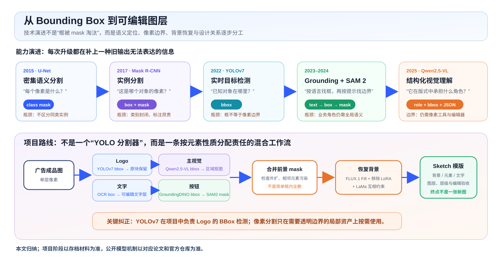
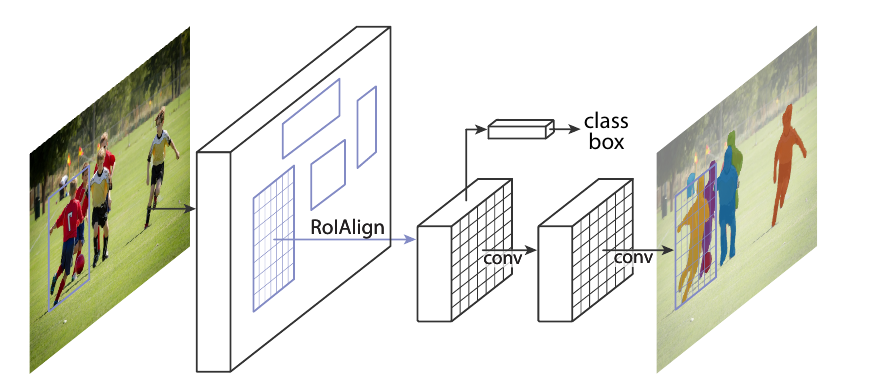
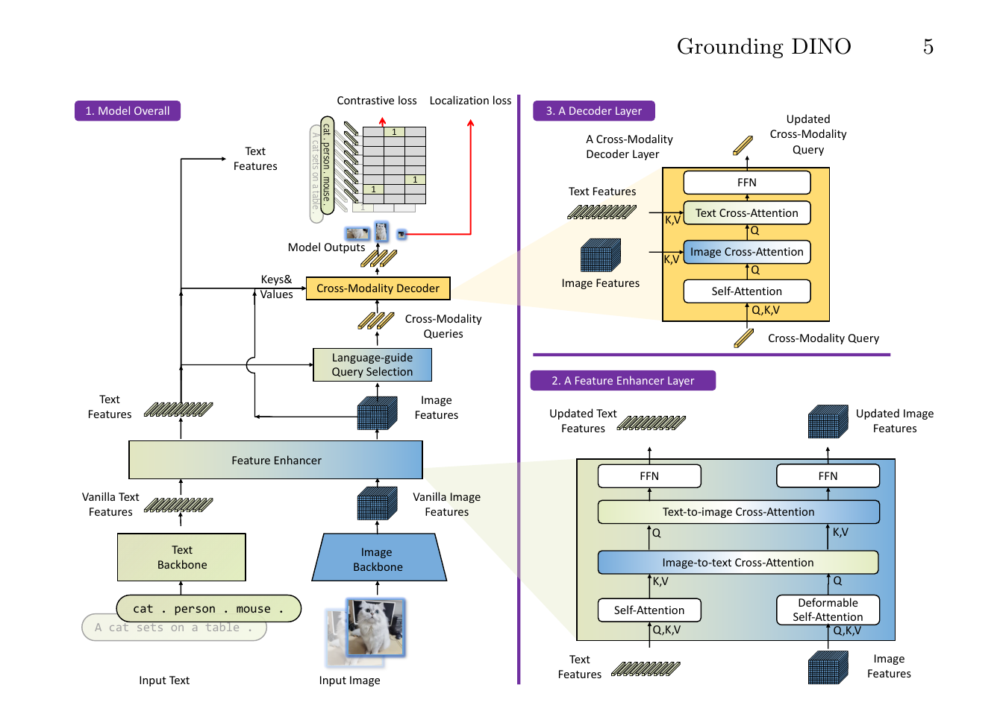
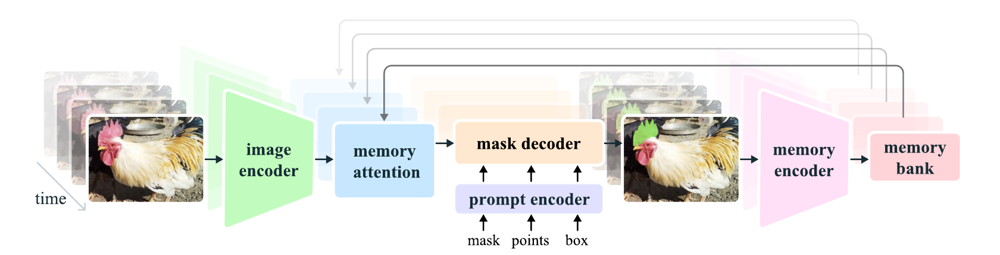
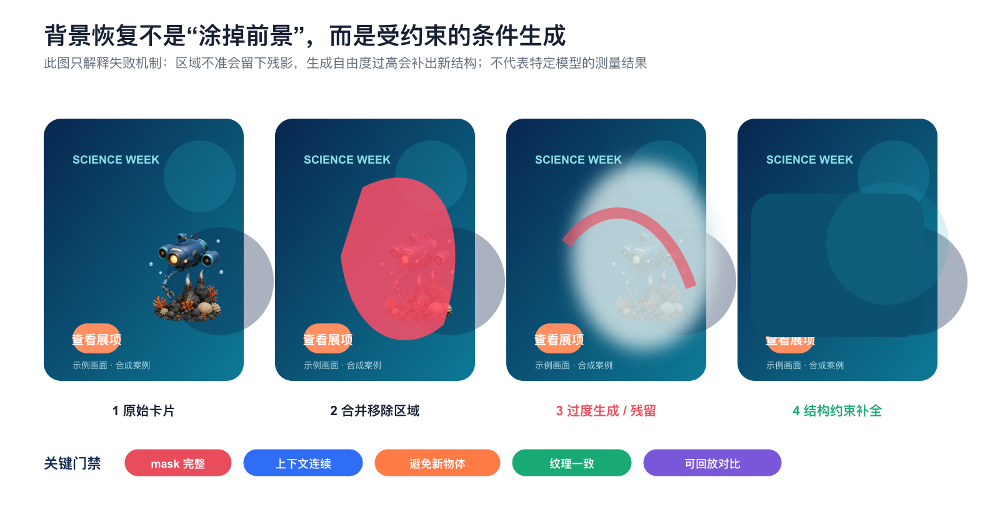

# 从 Bounding Box 到可编辑图层：图像分割技术综述与图生模版实践



*图 1　技术能力与项目路线。上半部分解释不同模型究竟多输出了什么信息；下半部分还原项目的实际责任分配。最重要的纠正是：YOLOv7 在项目中负责 Logo 的 BBox 检测，不是整套图像分割方案。本文归纳。*

## 研究对象与系统边界

图生模版不是单一的图像分割任务，而是从扁平像素图中恢复可编辑设计结构的复合视觉问题。系统既要识别标题、Logo、主视觉、按钮与背景等元素的业务语义，也要确定元素的空间范围和像素边界；在移除前景后，还需要恢复被遮挡的背景，并将提取结果重建为具有层级、样式和约束关系的可编辑图层。目标检测输出的 Bounding Box 只解决几何定位，不能替代像素分割、背景修复或图层结构恢复。

历史方案中的 **YOLOv7** 专门负责 Logo 的矩形区域检测。由于 Logo 常包含小字、复杂字标、描边与阴影，透明抠图容易损伤品牌细节，系统因此保留检测框内的完整图块，以品牌保真换取有限的背景耦合。需要像素级轮廓的按钮采用 **Grounding DINO** 完成语言引导定位，再由 **SAM 2** 根据检测框生成 mask。开放形态的主视觉缺少稳定的局部类别，后续方案转而使用 **Qwen2.5-VL** 结合整张卡片的文字、布局与视觉重心判断其业务角色并输出 BBox，再交由区域抠图工具处理。前景移除产生的背景空洞则由 **FLUX.1 Fill、对象移除 LoRA 与 LaMa** 组成的 Inpainting 链路恢复。

因此，本文研究的不是一种所谓的“YOLO 分割算法”，而是一套按输出契约划分职责的混合视觉工作流：视觉语言模型与检测器负责语义识别和几何定位，可提示分割模型负责像素边界，Inpainting 模型负责背景恢复，Schema 与编辑器负责图层重建和可编辑性验收。全文将沿着这一责任链，依次讨论任务边界、技术演进、项目方案、生产架构与评测门禁。

> [!note] 证据边界
> - 存档明确写出 Logo 使用 YOLO V7；主视觉 v1 只写“小检测模型”，没有原始代码、权重或配置可证明它也是 YOLO。
> - 公开版不披露组织名称、真实业务素材、历史人工良品率或专有接口；因此也不把内部指标冒充为公开 benchmark。
> - 图 6 至图 8 使用原创科学主题卡片和合成编辑器界面解释机制，不是模型评测截图。

### 视觉证据清单

| 图 | 回答的问题 | 来源 |
|---|---|---|
| 图 1、9 | 技术能力如何演进，生产责任如何重新分配？ | 本文依据论文与项目材料重绘 |
| 图 2 | 像素级分割怎样同时利用上下文和高分辨率定位？ | U-Net Figure 1 |
| 图 3 | 经典实例分割怎样把 box 和 mask 合在同一系统？ | Mask R-CNN Figure 1 |
| 图 4 | 文本怎样参与开放词汇目标定位？ | Grounding DINO Figure 3 |
| 图 5 | box、point、mask prompt 怎样进入可提示分割模型？ | SAM 2 Figure 3 |
| 图 6 | 为什么主视觉从局部检测转向全局语义？ | 原创卡片与确定性标注 |
| 图 7 | 为什么分割完成后还需要背景恢复？ | 原创机制示意 |
| 图 8 | 为什么终点必须是可编辑图层？ | 原创合成编辑器界面 |

## 任务边界：Bounding Box、Mask 与可编辑图层的输出契约

给定输入图片：

$$
I \in \mathbb{R}^{H\times W\times 3},
$$

不同任务的输出契约并不相同。

### Bounding Box：提供目标的近似几何范围

一个检测框可以写成：

$$
b_i=(x_1,y_1,x_2,y_2,c_i,s_i),
$$

其中 $c_i$ 是类别，$s_i$ 是置信度。它适合定位、裁剪、计数和给下游模型提供提示，但框内通常同时包含目标、背景、阴影和相邻元素。

### Mask：刻画目标的像素级归属

二值 mask 是：

$$
M_i \in \{0,1\}^{H\times W}.
$$

它可以沿着不规则轮廓贴边，因此适合透明资产、局部编辑和前景擦除。mask 比框精细，但它仍然不告诉系统这个元素是否应该和另一个元素成组、处在哪一层、移动后如何保持对齐。

### Alpha Matte：描述前景与背景的连续混合

头发、半透明玻璃、阴影和抗锯齿边缘不能只用 0/1 表示。抠图通常还需要：

$$
I=\alpha F+(1-\alpha)B,\qquad \alpha\in[0,1].
$$

$F$ 是前景，$B$ 是背景，$\alpha$ 表示混合比例。普通分割 mask 可以作为 trimap 或提示，但不等于高质量 alpha matte。

### 可编辑图层：补齐语义、样式与结构关系

图生模版真正需要恢复的是：

$$
e_i=(c_i,b_i,M_i,t_i,s_i,z_i),
$$

以及元素间关系 $\mathcal{R}$：

- $c_i$：Title、Logo、MainVisual、Button 等业务角色；
- $b_i$：位置和尺寸；
- $M_i$：像素边界；
- $t_i$：可编辑文字；
- $s_i$：字体、颜色、圆角、阴影等样式；
- $z_i$：图层顺序；
- $\mathcal{R}$：分组、对齐、遮挡、蒙版作用范围和响应式约束。

这就是全文最重要的判断：**BBox 只解决可编辑图层契约中的一个字段，mask 也只解决一个字段。**

## 1　六类视觉任务及其输出边界

| 任务 | 典型输出 | 能回答 | 不能单独回答 | 项目中的对应角色 |
|---|---|---|---|---|
| 目标检测 | 类别 + BBox | 哪个对象大致在哪里 | 精确轮廓、透明度、图层关系 | YOLOv7 Logo；Qwen2.5-VL 主视觉定位 |
| 语义分割 | 每像素类别 | 哪些像素属于某类 | 同类实例分别是谁 | 适合背景/前景类别，但不是项目主线 |
| 实例分割 | 每实例 BBox + mask | 哪些像素属于哪个实例 | 开放业务语义、设计关系 | Grounding + SAM2 可近似组合出这一能力 |
| 抠图 / Matting | alpha matte | 半透明边缘怎样混合 | 对象是什么、背景空洞怎样补 | 主视觉区域资产提取 |
| Inpainting | 修复后的像素 | 移除对象后背景应是什么 | 原目标轮廓和业务角色 | FLUX-Fill + LoRA + LaMa |
| 版面 / 场景图解析 | 元素、属性、关系、层级 | 这张图由什么设计结构组成 | 像素边界未必足够精确 | Qwen2.5-VL + Schema + Sketch |

“图像分割”在非严格表述中常被用于概括上述多类任务，但工程系统必须区分各自的输入、输出与评测标准。常见的概念混淆包括：

1. 将目标检测框误判为像素级分割结果；
2. 将视觉上完整的 mask 直接等同于可编辑模版；
3. 仅凭背景修复自然度反推前景定位准确性。

## 2　技术演进：从固定类别的像素到开放语义的可执行契约

图像分割技术的演进并非模型性能榜单的线性更替，而是输出表示随着任务需求持续扩展的过程。

### 2.1 U-Net：让网络一次输出整块像素标签

分类网络只给整张图一个标签，滑窗像素分类又会重复计算。U-Net 用收缩路径获取大范围上下文，用扩张路径恢复空间分辨率，并把同尺度的编码器特征直接拼回解码器。

U-Net 结构的关键不仅是 U 形编码器—解码器轮廓，还包括横向 `copy and crop` 连接：深层特征提供语义与上下文，浅层高分辨率特征补充精确定位所需的空间细节。


*图 2　原论文 Figure 1，来源：[U-Net: Convolutional Networks for Biomedical Image Segmentation](https://arxiv.org/abs/1505.04597)，版权归原作者或权利人。原图定义了密集分割的数据流，但论文没有逐项消融，不能把全部提升归因于某一条横向连接。*

对图生模版来说，U-Net 代表的思想仍然重要：像素边界需要高分辨率证据。但传统语义分割只会把像素归到固定类别，无法自然回答“画面里两个同类图标是不是两个独立资产”，也无法理解“一个抽象插画为何是主视觉”。

Vault 中已有完整论文解读：[论文解读：U-Net: Convolutional Networks for Biomedical Image Segmentation](../算法基础/论文解读：U-Net:%20Convolutional%20Networks%20for%20Biomedical%20Image%20Segmentation.md)。

### 2.2 Mask R-CNN：把“找对象”和“抠轮廓”并行起来

语义分割不区分同类实例，目标检测又只有框。Mask R-CNN 的关键动作很直接：在 Faster R-CNN 的分类和 BBox 分支旁边，增加一个并行 mask 分支，并用 RoIAlign 避免粗糙量化破坏像素对齐。



*图 3　原论文 Figure 1，裁剪自 [Mask R-CNN](https://arxiv.org/abs/1703.06870)，版权归原作者。图中最重要的责任变化是：BBox 和 mask 不再互相替代，而是并行输出。*

这一范式提供了直接的工程启示：**先定位，再在局部区域内执行精细分割**，通常比直接对整图进行开放类别分割更稳定。项目采用的 Grounding DINO + SAM 2 延续了这一责任划分，将“目标区域选择”和“区域内像素归属”拆分为两个阶段，并将类别条件从固定标签扩展为语言提示。

### 2.3 YOLOv7：面向 Logo 的实时 BBox 检测

YOLO 系列把目标检测组织成单次前向的密集预测，适合高吞吐的已知类别定位。YOLOv7 论文研究的是实时**目标检测**；项目存档也明确写的是：

```text
Logo 检测：YOLO V7
输出：Logo BBox
后处理：直接截取区域贴入模版
```

现有项目材料明确区分以下两个事实：

1. YOLOv7 用在 **Logo**，不是所有元素；
2. 项目没有把 Logo 做成透明 mask，而是故意保留整个矩形图块。

这一选择并非源于分割能力缺失，而是由品牌资产的验收标准决定。Logo 常同时包含图形、小字、描边和阴影；像素级抠图一旦破坏笔画或字标，造成的品牌失真通常比引入少量背景更严重。因此，项目确立了如下工程优先级：

> **对 Logo，品牌保真高于资产完全解耦。**

现代工具链中存在带 segmentation head 的 YOLO 变体，但不能据此反推历史项目采用了实例分割版本。现有证据仅能确认 YOLO V7 被用于 Logo 的 BBox 检测。

### 2.4 Grounding DINO：让语言决定“找哪类区域”

闭集检测器要求预先定义类别。广告卡片中的按钮、角标、蒙版和主视觉不断换形态，重训所有类别并不经济。Grounding DINO 把文本和图像特征在特征增强、query 选择和解码阶段融合，输出短语与检测框的对应关系。

从下往上读图：文本 backbone 和图像 backbone 先各自编码，跨模态特征增强后，由语言引导选择 query，再在跨模态 decoder 中输出短语对应的 boxes。



*图 4　原论文 Figure 3，裁剪自 [Grounding DINO](https://arxiv.org/abs/2303.05499)，版权归原作者。该图证明模型如何产生开放词汇检测框，不证明它能直接输出像素 mask。*

项目对按钮的用法很有代表性：

1. 以 `strip` 作为文本提示，先找长条形候选；
2. 用置信度和长宽比过滤；
3. 把剩余 BBox 交给 SAM2 做像素分割。

`strip` 并不是“按钮”这个完整业务概念，而是一种利用视觉形状先缩小搜索空间的工程提示。它适合当时的按钮分布，但也会漏掉圆形、图标式或非高对比按钮。

### 2.5 SAM2：框是提示，mask 才是输出

SAM2 是可提示分割模型。对静态图像，box、正负点或已有 mask 都可以作为 prompt；对视频，它还通过 memory attention 和 memory bank 维持跨帧对象信息。

项目处理单张广告图时，真正相关的是图中央的 prompt encoder 和 mask decoder：GroundingDINO 提供 box，SAM2 在 box 限定的区域里回答哪些像素属于目标。



*图 5　原论文 Figure 3，裁剪自 [SAM 2: Segment Anything in Images and Videos](https://arxiv.org/abs/2408.00714)，版权归原作者。项目只使用静态图提示分割这一侧，不应把视频 memory 机制写成当时的必要链路。*

SAM2 解决的是边界，不负责决定“这块东西是不是按钮”。如果上游框选中了标题背景、邻近装饰或阴影，SAM2 仍可能给出视觉上合理、业务上错误的 mask。因此生产链路必须同时保存：

- 上游提示词和 BBox；
- SAM2 候选 masks 与置信度；
- mask 面积、与 BBox 的覆盖关系；
- 是否触碰文字或其他已知元素；
- 人工修订与回退原因。

### 2.6 Qwen2.5-VL：用全局版式理解业务角色，但仍不是分割模型

主视觉可以是人物、礼盒、盾牌、建筑、医疗器械或抽象插画。局部纹理没有稳定类别，真正稳定的是它在整张卡片中的作用：面积较大、承担叙事、与标题形成视觉平衡。

[Qwen2.5-VL 技术报告](https://arxiv.org/abs/2502.13923)和[官方发布说明](https://qwenlm.github.io/blog/qwen2.5-vl/)明确支持对象的 BBox / point 定位与坐标、属性的结构化 JSON 输出。项目用这一能力同时观察文字、Logo、布局和插画，再判断哪个区域承担 MainIcon 等业务角色。

这里仍要守住边界：

- Qwen2.5-VL 输出的是语义、BBox 和结构化字段；
- 它帮助系统决定“分割谁”；
- 像素边界仍由分割或抠图工具处理；
- 背景空洞仍由 Inpainting 处理；
- 图层关系仍需 Schema 和编辑器校验。

## 3　指标：BBox IoU 不能代替 mask 质量，更不能代替可编辑性

### 3.1 框的 IoU

预测框 $B_p$ 与真值框 $B_g$ 的 IoU 为：

$$
\operatorname{IoU}_{box}
=
\frac{|B_p\cap B_g|}
{|B_p\cup B_g|}.
$$

它能衡量几何重叠，但对小目标很敏感，也不知道框内哪些像素属于目标。

### 3.2 mask IoU 与 Dice

预测 mask $M_p$ 与真值 mask $M_g$ 的指标为：

$$
\operatorname{IoU}_{mask}
=
\frac{|M_p\cap M_g|}
{|M_p\cup M_g|},
$$

$$
\operatorname{Dice}
=
\frac{2|M_p\cap M_g|}
{|M_p|+|M_g|}.
$$

它们衡量区域重叠，但对细长边缘、文字描边和半透明阴影仍不够。高要求资产还要看 boundary F-score、alpha 误差、边缘色溢出和缩放后的锯齿。

### 3.3 面向最终任务的可编辑性指标

图生模版最终要执行编辑动作，因此评测至少分四层：

| 层级 | 关键问题 | 建议指标 |
|---|---|---|
| 语义 | 元素找全了吗，业务角色对吗？ | Precision / Recall / F1，按角色统计 |
| 几何 | BBox 是否切到相邻元素？ | BBox IoU、小目标召回、越界率 |
| 像素 | mask 是否贴边、漏边、带入背景？ | mask IoU、Dice、Boundary F-score |
| 编辑 | 元素能否移动、隐藏、换字和重排？ | 编辑任务成功率、回退率、人工修订时间 |

一个系统即使 BBox IoU 很高，也可能因为少了一层、分组错了或背景残影而不可用。反过来，Logo 的矩形 crop 即使没有 mask，只要品牌保真、位置正确、用户能接受，也可能是更好的业务方案。

## 4　项目方案复盘：模型分工与工程依据

### 4.1 一张表还原责任分配

| 元素 / 阶段 | 项目方案 | 输出 | 为什么这样选 |
|---|---|---|---|
| Logo | YOLO V7 | BBox + 原区域图块 | 小字和复杂字标更怕抠坏，优先品牌保真 |
| 文字 | PaddleOCR + 分类 / 颜色处理 | 文本、行框、类别、颜色、字号近似 | 文字要重建成可编辑文本层，不应保留为位图 |
| 主视觉 v1 | 小检测模型；具体网络未留存 | BBox | 用历史模版关系降低标注成本，但开放类别泛化弱 |
| 主视觉 v2 | Qwen2.5-VL zero-shot | 业务角色 + BBox + 描述 | 主视觉由全局版式作用定义，不是固定外观类别 |
| 按钮 | GroundingDINO `strip` + 长宽比过滤 + SAM2 | BBox + mask | 语言 / 形状负责定位，SAM2 负责贴边 |
| 背景 | 合并前景 masks；FLUX-Fill + 移除 LoRA + LaMa | 干净背景 | 生成式补全和传统大 mask 修复互相约束 |
| 输出 | 图层拼接到 Sketch | 背景、元素、文字和层级 | 终点是继续编辑，而不是重新生成一张平面图 |

这张表也回答了最初的问题：**YOLO 是方案的一部分，但不是“图片分割部分”的总代表。**

### 4.2 主视觉：从局部检测转向全局语义

旧小模型把主视觉当作有限类别目标。新路线让 Qwen-VL 观察整张卡片，按主图标、Logo、文案、蒙版、按钮和风险提示等角色输出位置。


*图 6　局部外观与全局语义的差别。科学主题卡片为原创合成，红框和结构化字段为确定性绘制；它用于解释主视觉任务为什么要从固定类别检测改写为版式角色理解，不代表任何模型的实测结果。*

改进的关键不是“模型更大”四个字，而是任务定义变了：

```text
旧任务：找一个长得像训练类别的区域
新任务：找出在整张广告里承担 MainIcon 角色的区域
```

后者能利用标题、Logo、空白区、左右布局和视觉重心。代价是输出格式与坐标不再像专用 detector 一样天然稳定，所以项目后来又用 SFT 稳定业务标签和 JSON，用 GRPO / IoU 奖励强化坐标。

### 4.3 按钮：为什么必须把定位和分割拆开

按钮同时有两类规律：

- 语义和形状规律：长条、圆角、高对比、常带行动文案；
- 像素规律：真实边缘可能有圆角、描边、阴影和渐变。

GroundingDINO 更适合前者，SAM2 更适合后者。若只保留 BBox，贴回模版时会带入多余背景；若只让 SAM2 在整图自动分割，系统又不知道哪个候选 mask 才是按钮。

这是一条可以推广的设计原则：

> **用 detector / VLM 决定“分割哪个对象”，用 promptable segmenter 决定“对象边界到哪里”。**

### 4.4 背景恢复：分割结束只是 Inpainting 的开始

将 Logo、文字、主视觉和按钮的 masks 合并后，系统会在原图留下一个洞。若 mask 太小，原对象边缘会残留；若 mask 太大，相邻结构会被删除；即便 mask 正确，生成模型仍可能在空洞中创造新物体。

项目的背景恢复经历：

```text
LaMa
→ FLUX-Fill
→ FLUX-Fill + LaMa
→ FLUX-Fill + Object-removal LoRA + LaMa
```



*图 7　背景恢复的三种典型失败。主视觉、mask 与补全结果均为原创合成机制示意，不对应任何模型的实测样本。它强调：最终背景质量同时受 mask 完整度和生成自由度影响，不能只用分割 IoU 解释。*

[LaMa](https://arxiv.org/abs/2109.07161)通过 Fourier Convolution 获得大范围感受野，擅长大 mask 和重复结构；[FLUX.1 Fill 官方仓库](https://github.com/black-forest-labs/flux/blob/main/docs/fill.md)把输入图和黑白 mask 作为条件进行生成式 Inpainting。二者组合的工程意图是让生成自由度与结构保守性互相约束，而不是简单投票。

### 4.5 Sketch：为什么模版才是最终验收


*图 8　可编辑模版的验收终点。界面与素材均为原创合成示意，不对应真实组织、产品或专有工具。左侧图层列表、画布选框和属性面板共同说明：只有当元素能被独立选择、移动和修改时，链路才从像素进入了可编辑资产。*

> [!note] 公开版删减说明
> 历史材料包含真实业务截图和人工良品率，但其场景、样本口径与原始评测记录不适合作为公开 benchmark。公开版保留方案选择、失败机制和评测方法，不公开相关图片与数值。

## 5　为什么多模型工作流后来会撞到上限

把各阶段成功率写成一个仅用于建立直觉的链式表达：

$$
P_{\text{usable}}
\approx
P_{\text{semantic}}
\cdot
P_{\text{box}}
\cdot
P_{\text{mask}}
\cdot
P_{\text{fill}}
\cdot
P_{\text{layer}}.
$$

这些事件并不独立，所以这不是可直接拟合的统计模型。它只揭示一个工程事实：前一阶段的错误会改变后一阶段的输入。

- 主视觉漏检：插画永久烙在背景里；
- BBox 过大：标题或 Logo 一起进入 mask；
- mask 过小：Inpainting 后留下轮廓；
- mask 过大：背景结构被误删，生成模型只能猜；
- 图层顺序错误：抠图和背景都正确，编辑结果仍然穿帮。

多模型方案的价值是每一步都可解释、可替换；上限则是每一步都要单独协调语义和坐标。广告属于开放集合，新版式不断出现，有限 detector 类别很难穷举。

## 6　端到端升级：统一“理解”，没有取消“分割”

项目后续把图片到结构化理解统一到 Qwen2.5-VL：

```text
image
→ roles + content + style + bbox + JSON
→ Schema validation
→ segmentation / matting / inpainting
→ editable layers
```

SFT 让模型学会 MainTitle、SellingPoint、Button、Logo、MainIcon、Risk 等业务本体和严格输出格式；GRPO 把可验证的 BBox IoU 变成奖励信号，继续优化几何。

但“端到端”只统一了**图片到完整解构信息**，没有取消：

- OCR 对文字内容的强校验；
- SAM2 等工具对 mask 的细化；
- Inpainting 对背景的恢复；
- Schema 对越界、重复、顺序和字段完整性的门禁；
- Sketch / 编辑器对图层和可编辑性的验收。

这也是现阶段更稳的收敛方向：**大模型负责开放理解，专用工具负责确定性执行，编辑器负责业务可用性。**

## 7　推荐生产架构：把每一层的证据留下来


*图 9　推荐的混合生产架构。图中不是要求固定使用某个模型，而是规定每层职责、产物和回退证据。本文归纳。*

### 7.1 输入规范化

- 保留原图和哈希；
- 记录画布尺寸、色彩空间、EXIF 旋转；
- 不先把长图强行拉伸成方图；
- 记录模型实际看到的缩放 / padding 变换，方便把坐标映射回原图。

### 7.2 VLM 语义解析

- 输出元素角色、内容描述、BBox、建议分组和层级；
- 保存 Prompt、模型版本和原始响应；
- 不让模型直接覆盖模版，先进入 Schema。

### 7.3 契约门禁

- 检查坐标合法、元素 ID 唯一、必选角色存在；
- 检查 BBox 是否与画布相交、是否异常重叠；
- 把文字、Logo、主视觉、按钮路由到不同工具；
- 低置信或冲突样本进入人工复核，不让后链路“将错就错”。

### 7.4 工具执行

- OCR 强校验文字；
- Grounding / detector 修正局部框；
- SAM2 根据 box / points 生成候选 masks；
- 必要时做 matting，而不是把软边强行二值化；
- Inpainting 前保存合并 mask、外扩策略和修复结果。

### 7.5 模版写入与编辑验收

- 背景、位图资产、文字和蒙版分别写入图层；
- 自动执行改标题、隐藏主视觉、移动按钮、替换卖点和切换版式；
- 检查重排后是否越界、遮挡或破坏层级；
- 保存失败动作，回流到语义、坐标、mask 或背景恢复的对应数据集。

## 8　代码：让框指标、mask 指标和生产门禁使用同一套对象

### 8.1 可直接运行的几何指标

下面只依赖 NumPy，分别计算 BBox IoU、mask IoU 和 Dice。它刻意不把三种指标合成一个分数，因为它们回答不同问题。

```python
from __future__ import annotations

from typing import Sequence
import numpy as np


Box = Sequence[float]  # x1, y1, x2, y2


def box_iou(a: Box, b: Box) -> float:
    ax1, ay1, ax2, ay2 = a
    bx1, by1, bx2, by2 = b

    inter_w = max(0.0, min(ax2, bx2) - max(ax1, bx1))
    inter_h = max(0.0, min(ay2, by2) - max(ay1, by1))
    intersection = inter_w * inter_h

    area_a = max(0.0, ax2 - ax1) * max(0.0, ay2 - ay1)
    area_b = max(0.0, bx2 - bx1) * max(0.0, by2 - by1)
    union = area_a + area_b - intersection
    return intersection / union if union > 0 else 0.0


def mask_iou(pred: np.ndarray, target: np.ndarray) -> float:
    pred_b = pred.astype(bool)
    target_b = target.astype(bool)
    intersection = np.logical_and(pred_b, target_b).sum()
    union = np.logical_or(pred_b, target_b).sum()
    return float(intersection / union) if union else 1.0


def dice_score(pred: np.ndarray, target: np.ndarray) -> float:
    pred_b = pred.astype(bool)
    target_b = target.astype(bool)
    intersection = np.logical_and(pred_b, target_b).sum()
    denominator = pred_b.sum() + target_b.sum()
    return float(2 * intersection / denominator) if denominator else 1.0
```

### 8.2 生产编排骨架

下面的代码不绑定任何厂商 SDK。模型适配器作为函数注入，因此接口可测试，失败也能明确回退到“保留矩形 crop”或“人工复核”。

```python
from __future__ import annotations

from dataclasses import dataclass
from typing import Callable, Literal
import numpy as np


Role = Literal["logo", "text", "main_visual", "button"]


@dataclass(frozen=True)
class Element:
    element_id: str
    role: Role
    bbox: tuple[int, int, int, int]
    confidence: float
    text: str | None = None


@dataclass
class Layer:
    element: Element
    pixels: np.ndarray
    mask: np.ndarray | None
    mode: Literal["crop", "text", "cutout"]
    needs_review: bool = False


Segmenter = Callable[[np.ndarray, tuple[int, int, int, int]], np.ndarray]
Inpainter = Callable[[np.ndarray, np.ndarray], np.ndarray]


def validate_bbox(
    bbox: tuple[int, int, int, int],
    width: int,
    height: int,
) -> bool:
    x1, y1, x2, y2 = bbox
    return 0 <= x1 < x2 <= width and 0 <= y1 < y2 <= height


def crop(image: np.ndarray, bbox: tuple[int, int, int, int]) -> np.ndarray:
    x1, y1, x2, y2 = bbox
    return image[y1:y2, x1:x2].copy()


def build_template_assets(
    image: np.ndarray,
    elements: list[Element],
    segmenter: Segmenter,
    inpainter: Inpainter,
) -> tuple[list[Layer], np.ndarray, list[str]]:
    height, width = image.shape[:2]
    foreground = np.zeros((height, width), dtype=bool)
    layers: list[Layer] = []
    errors: list[str] = []

    for element in elements:
        if not validate_bbox(element.bbox, width, height):
            errors.append(f"{element.element_id}: invalid bbox")
            continue

        if element.role == "text":
            if not element.text:
                errors.append(f"{element.element_id}: missing OCR text")
            layers.append(
                Layer(element, crop(image, element.bbox), None, "text", not element.text)
            )
            continue

        if element.role == "logo":
            # 项目策略：优先保留品牌细节，不强制透明抠图。
            layers.append(Layer(element, crop(image, element.bbox), None, "crop"))
            x1, y1, x2, y2 = element.bbox
            foreground[y1:y2, x1:x2] = True
            continue

        mask = segmenter(image, element.bbox).astype(bool)
        if mask.shape != (height, width) or not mask.any():
            # 可恢复回退：保留 BBox crop，同时标记人工复核。
            layers.append(
                Layer(element, crop(image, element.bbox), None, "crop", True)
            )
            errors.append(f"{element.element_id}: invalid mask; fell back to crop")
            x1, y1, x2, y2 = element.bbox
            foreground[y1:y2, x1:x2] = True
            continue

        rgba = np.dstack([image, (mask * 255).astype(np.uint8)])
        layers.append(Layer(element, rgba, mask, "cutout"))
        foreground |= mask

    background = inpainter(image, foreground)
    if background.shape != image.shape:
        raise ValueError("inpainter returned an unexpected image shape")

    return layers, background, errors
```

这段骨架省略了真实系统必须补齐的内容：模型加载、坐标缩放映射、多个候选 mask 的选择、alpha matting、形态学外扩、内容安全、超时重试、可观测性和 Sketch 写入适配器。它的价值是把责任边界写成可测试接口，而不是假装存在一条万能模型调用。

## 9　工程复用：五项可迁移原则

### 原则一：由最终编辑动作定义分割粒度

用户只会整体替换主视觉时，一个组合资产比拆成十个 mask 更稳；用户要单独隐藏礼盒、时钟和人物时，才值得增加粒度。标注本体必须从编辑动作反推，而不是从模型能分出什么反推。

### 原则二：按元素属性选择资产表示

- Logo 可以是高保真 crop；
- 文字应该是文本层；
- 按钮需要 mask 或矢量重建；
- 半透明装饰需要 alpha；
- 背景需要 Inpainting；
- 蒙版需要明确作用对象，而不只是一个孤立像素层。

统一 Schema 不等于统一处理方式。

### 原则三：分别保存 BBox、mask 与 fill 的过程证据

只保存最终 Sketch，无法判断失败来自语义、框、mask 还是修复。生产系统应保存：

```text
input hash
→ raw semantic JSON
→ validated boxes
→ candidate / chosen masks
→ merged removal mask
→ inpainted background
→ layer operations
→ edit test results
```

### 原则四：将人工修订转化为结构化反馈

“结果不好”没有训练价值。至少要记录：

- 角色错误；
- BBox 漏边 / 吞邻；
- mask 漏边 / 粘连 / 阴影范围；
- 背景残影 / 幻觉 / 结构断裂；
- 分组、层级或对齐错误；
- 哪个自动编辑动作失败。

这样才能把失败样本路由回正确模块。

### 原则五：以自动编辑任务验证最终可用性

最有价值的回归测试不是再看一遍预测图，而是自动执行：

1. 改长标题；
2. 隐藏主视觉；
3. 移动按钮；
4. 替换 Logo；
5. 切换横竖版；
6. 重新导出图片。

如果这些动作完成后版式仍合法，分割和结构化理解才真正服务了产品目标。

## 10　结论

本文对历史方案的技术审计表明，项目确实使用了 Bounding Box 与 YOLO V7，但 YOLO V7 的职责仅限于 Logo 的矩形区域检测，不能据此将整套系统归类为“YOLO 图像分割”。不同元素依据业务属性采用了不同的视觉处理路径：文字由 OCR 恢复为文本层；主视觉由 Qwen2.5-VL 结合全局版式完成语义定位；按钮由 Grounding DINO 生成候选框，再由 SAM 2 提取像素级 mask；前景移除后的背景由 FLUX.1 Fill、对象移除 LoRA 与 LaMa 联合修复；最终结果通过 Sketch 图层结构与真实编辑动作完成验收。

该方案的核心价值不在于模型数量，而在于建立了与任务输出相匹配的责任边界。全局语义模型判断元素的业务角色及其资产粒度，Bounding Box 提供几何搜索范围，mask 与 alpha 描述像素边界和透明度，Inpainting 恢复被遮挡的背景，Schema 与编辑器则负责验证图层关系和后续可编辑性。只有这些环节形成闭环，平面图像解构结果才能转化为可继续生产和维护的设计模版。

## 资料与关联笔记

### 关联笔记

- [图生模版：从多模型工作流到端到端视觉语言模型](图生模版：从多模型工作流到端到端视觉语言模型.md)

### 公开一手资料

- [U-Net: Convolutional Networks for Biomedical Image Segmentation](https://arxiv.org/abs/1505.04597)
- [Mask R-CNN](https://arxiv.org/abs/1703.06870)
- [YOLOv7: Trainable Bag-of-Freebies Sets New State-of-the-Art for Real-Time Object Detectors](https://arxiv.org/abs/2207.02696)
- [Grounding DINO: Marrying DINO with Grounded Pre-Training for Open-Set Object Detection](https://arxiv.org/abs/2303.05499)
- [Segment Anything](https://arxiv.org/abs/2304.02643)
- [SAM 2: Segment Anything in Images and Videos](https://arxiv.org/abs/2408.00714)
- [Qwen2.5-VL Technical Report](https://arxiv.org/abs/2502.13923)
- [Qwen2.5-VL 官方发布说明](https://qwenlm.github.io/blog/qwen2.5-vl/)
- [Resolution-robust Large Mask Inpainting with Fourier Convolutions](https://arxiv.org/abs/2109.07161)
- [FLUX.1 Fill 官方说明](https://github.com/black-forest-labs/flux/blob/main/docs/fill.md)
