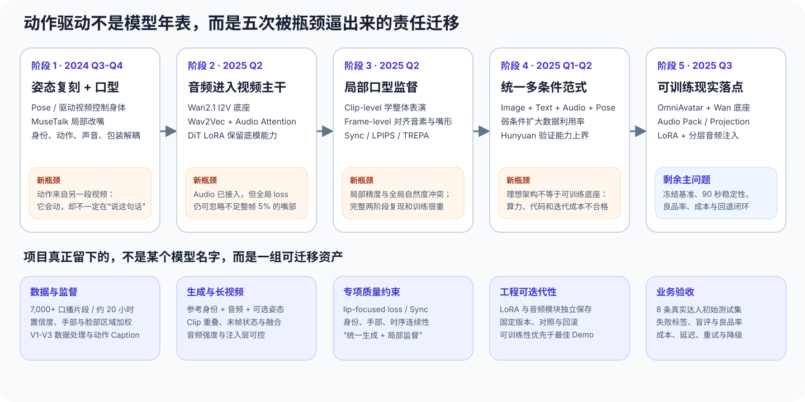
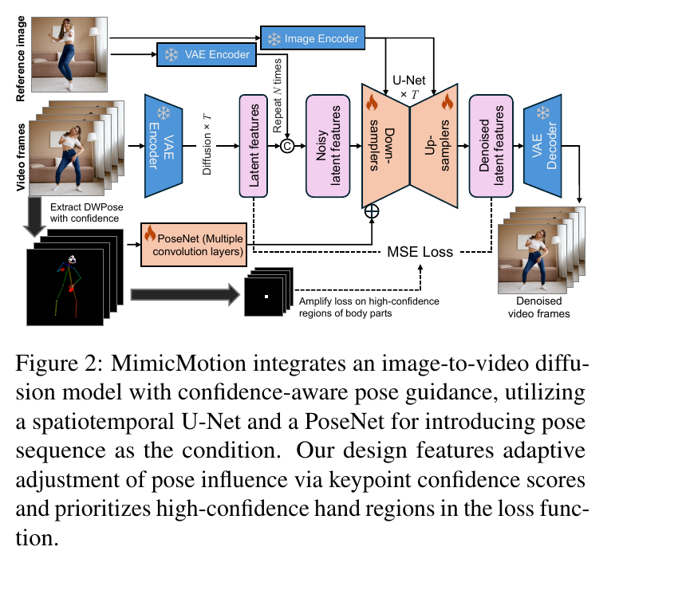
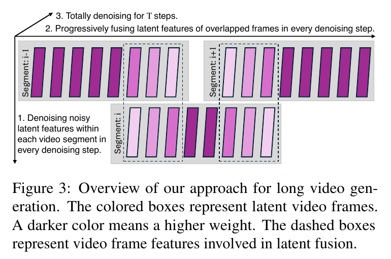
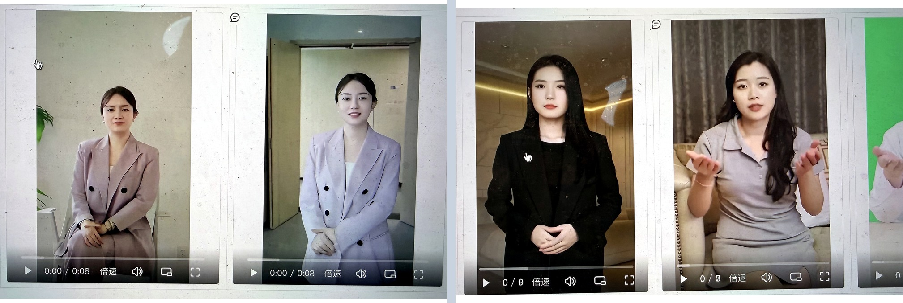
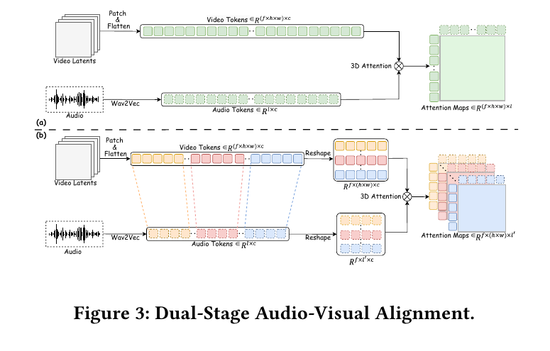
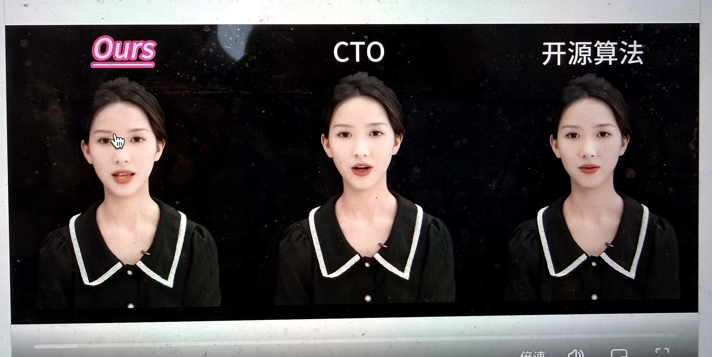
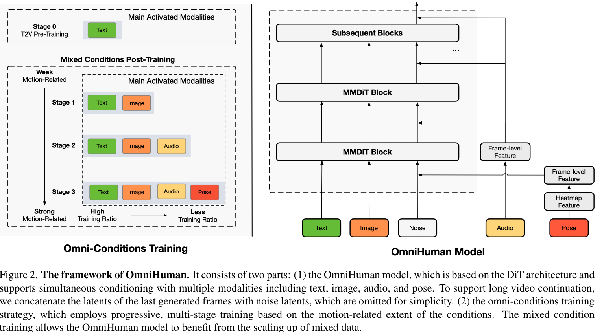
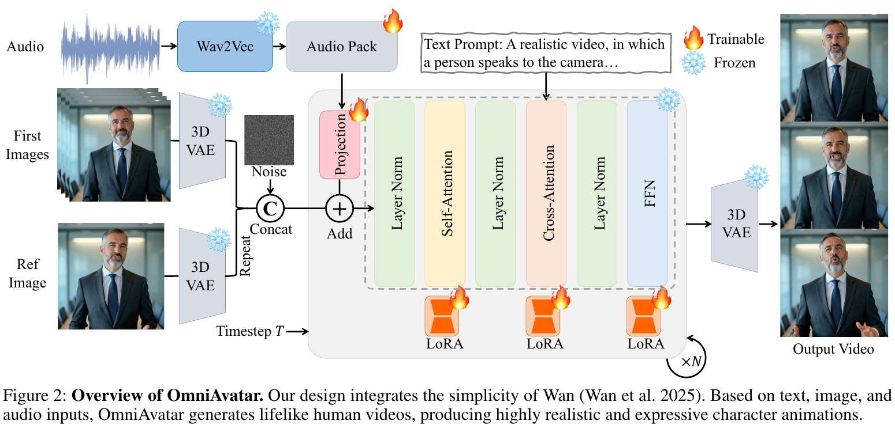
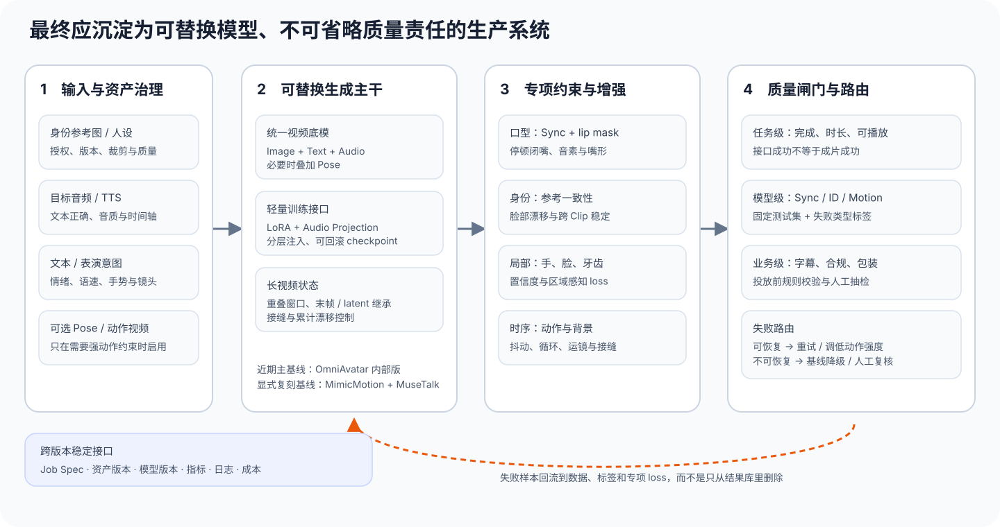

# 动作驱动：从姿态复刻到统一语音驱动，我们如何把数字人做成生产系统

让一张人物图动起来并不难。真正难的是：他说这句话时，嘴形要对，表情要对，手势要像是这句话自然带出来的；身份不能漂，背景不能闪，连续生成一分钟不能在 Clip 接缝处跳一下；最后还要能稳定、低成本地进入投放流水线，而不是只生成三条最好看的 Demo。

这正是我们在动作驱动项目里逐步撞到的问题。

项目最早服务于一个高频、强合规、强投放压力的垂类口播业务。归档材料显示，视频已经是重要的获客渠道，达人口播供给还在快速增长；与此同时，真人与素人拍摄的成本、排期和可复制性都难以支撑持续扩量。公开版不披露具体品牌、订单规模、渠道占比和单条报价，只保留这些数字共同指向的技术约束：**更低成本、更大规模、接近真人的表现力**必须同时成立。



*图 1　动作驱动项目的五次路线转向。上层是每次被前一阶段瓶颈迫出的技术变化，下层是项目真正留下的可迁移资产。本文归纳，依据两份项目归档材料及文末公开论文。*

## 先给结论

这条历史路线不是“旧模型被新模型替代”的线性升级，而是生成责任不断重新分配：

1. **姿态驱动先解决了动作可控，口型后处理先解决了能说话。** 两者拼接让第一条 Vlog 生产链跑通，但身体动作与当前音频没有因果关系。
2. **音频进入视频主干，解决了表演受语音影响的问题，却没有自动解决口型。** 嘴部只占整帧很小区域，全局视频损失可以在嘴形错误时继续下降。
3. **局部口型监督不是另一个独立模型，而是统一生成必须承担的专项质量通道。** 全局表演、逐帧嘴形、身份和时间连续性需要同时优化。
4. **OmniHuman 改变的不是某一层 Attention，而是训练问题的定义。** 动作驱动应被视为强视频底模上的多条件人物后训练，图像、文本、音频与可选姿态共同解释画面运动。
5. **项目最终选择 OmniAvatar，不是因为它在所有维度最好，而是它可训练、可比较、可回滚。** 一个只能运行预训练权重、无法低成本适配内部数据的模型，不能成为长期技术底座。
6. **截至归档材料的最后时点，我们完成了方向收敛和小规模可训练 POC，没有完成生产化闭环。** 90 秒稳定性、统一量化基准、60%+ 良品率和可接受成本都还是目标，不是已经证明的结果。

> [!note] 证据边界
> - 业务规模、渠道占比、订单与报价均已脱敏；技术样本量、模型耗时、主观评分和“效果提升”按历史项目记录呈现，不代表当前线上口径。
> - 归档材料没有包含原始视频、音频、训练日志和统一评测明细。静态帧只能证明可见外观，不能独立证明动作连续性、口型同步或音质。
> - “论文事实”“项目记录”和“本文归纳”在文中分别说明。论文报告的能力不等于内部 POC 已经复现，项目主观结论也不扩展为通用 SOTA 结论。
> - 公开稿已移除内部服务地址、人员、不应公开的链接和可反推业务体量的数据。

## 1　先把问题定义对：动作驱动不是 Pose-to-Video

### 1.1 两条基本路线，解决的是不同问题

“动作驱动”在项目早期其实混合了两类任务：

| 路线 | 典型输入 | 模型主要决定什么 | 优点 | 根本限制 |
|---|---|---|---|---|
| 姿态 / 视频驱动 | 人物图 + 驱动视频、骨架或 DensePose | 复刻参考视频中的身体运动 | 动作强可控，适合舞蹈、指定手势和剧情复刻 | 动作与当前音频的语义、节奏、停顿和情绪没有天然关系 |
| 语音驱动 | 人物图 + 音频，可附文本 | 从语音生成口型、表情、头部和身体运动 | 更符合口播，输入也更容易获得 | 音频对身体和镜头的约束很弱，容易出现“嘴在说、身体随机动” |

Audio + Pose 不是第三条互斥路线，而是把二者合并：音频负责口型、节奏和情绪，姿态在需要时提供强动作约束。问题不再是“选音频还是选姿态”，而是**不同条件应该在哪个尺度、以多强的权重、承担什么责任**。

### 1.2 用户感受到的是表演，不是骨架误差

业务里的“表现力”至少包含三层：

- **亲切感**：自然表情、轻微头部运动、生活化场景和有情感的声音；
- **注意力**：手势、走动、多视角、支线动作和合适的节奏；
- **讲清楚**：口型、停顿、字幕、关键词高亮、贴纸、音效和剪辑共同服务信息传达。

因此动作驱动模型的合理边界不是包办整个成片，而是成为自动化视频生产中的**角色表演层**。它上游接身份、音频、文案和可选动作，下游还要经过口型、字幕、包装、合规和质量闸门。

这一定义直接影响路线判断：能复刻大动作的模型，未必适合自然口播；嘴形很准的局部模型，也未必能生成有感染力的全身表演；单条样片质量高，如果成本是几十分钟一条、无法微调、没有失败回退，也不能成为生产底座。

## 2　第一条有效链路：先把身体、嘴和声音拆开

### 2.1 为什么当时选择姿态驱动

2024 年的工程现实是：文本驱动视频输入最简单，但人物身份、动作和镜头都不够确定；纯音频驱动方向有吸引力，却缺少满足业务要求的可训练方案。动作序列虽然增加了驱动视频或骨架的前置成本，却把最难控制的时序行为变成显式输入。

项目调研的姿态路线并不是同一种结构：

| 代表工作 | 控制表示 | 结构变化 | 当时的工程含义 |
|---|---|---|---|
| DreamPose / DisCo / MagicDance | 关键点或骨架 | 外观、背景和姿态分支逐步解耦 | 身份与姿态可以分别学习，但训练常分阶段 |
| Animate Anyone | 骨架 | ReferenceNet + Pose Guider + 时序模块 | 参考身份与动作控制形成经典组合 |
| MagicAnimate | DensePose | 稠密人体条件 | 形体信息更完整，控制数据也更重 |
| DreamMoving | 骨架 + 深度 | 增加空间形体约束 | 改善空间结构，但上游条件更复杂 |
| Champ | SMPL 深度、法线、语义与骨架 | 多层运动融合 | 条件丰富，系统与数据代价最高 |
| MimicMotion | 骨架 + DWPose 置信度 | 预训练 SVD + PoseNet + 区域损失 | 一阶段训练，能把姿态可靠性直接写进监督 |

项目最终选择 MimicMotion。重要的不是它“又用了扩散模型”，而是它承认姿态检测本身会错：同一帧里，躯干关键点可能可靠，手指和被遮挡区域可能完全不可靠。模型不应把二者当成同质量的监督。

### 2.2 先看清底座：MimicMotion 是给 SVD 增加可置信的姿态控制

MimicMotion 不是从零训练一个 Pose-to-Video 网络。它把 Stable Video Diffusion（SVD）的图生视频先验当作主体，只新增一个很小的 PoseNet，并改造 U-Net 的输入与训练损失。论文训练 4,436 段舞蹈视频，平均时长 20.1 秒；参考图从同一视频独立采样，目标帧按等间隔抽取，姿态逐帧由 DWPose 提取。训练使用 8 张 A100、20 个 epoch、batch size 8、每个 Clip 16 帧，学习率为 $10^{-5}$，warmup 500 step；VAE 固定，U-Net 与 PoseNet 联合训练。

DWPose 在这里对应的是上游 2D 全身姿态估计器：它先检测人体，再为每个人输出身体、脚、脸和双手共 133 个关键点及分数。[[论文解读：Effective Whole-body Pose Estimation with Two-stages Distillation|DWPose 论文解读]]表明，原论文直接验证的是 UBody 增量数据与两阶段蒸馏对 COCO-WholeBody AP 的提升，并没有证明这些分数已经严格校准，也没有评测视频时序稳定性。下面把分数渲染为姿态亮度、筛选高置信手部并写入区域 Loss，属于 MimicMotion 与项目侧对 DWPose 输出的进一步使用；跨 Clip 融合、脸部加权和业务数据微调更超出了 DWPose 论文证据。

> [!info] 与两篇底层论文解读互读
> [[论文解读：Stable Video Diffusion: Scaling Latent Video Diffusion Models to Large Datasets|SVD 论文解读]]说明底座如何通过图像预训练、筛选视频预训练和高质量微调获得运动先验。符号上，SVD 的视频噪声 \(z_t\)、重复到每一帧的参考图 latent \(z_{\mathrm{cond}}\) 与 CLIP 图像条件，对应下文 U-Net 的噪声输入、参考图拼接分支与身份语义分支；FPS、motion bucket 和 cond augmentation 对应附加时间条件 \(m\)。SVD 证明的是 I2V 底座和数据课程，不证明给定骨架能被精确执行。
>
> [[论文解读：MimicMotion: High-Quality Human Motion Video Generation with Confidence-aware Pose Guidance|MimicMotion 论文解读]]逐层审计了最终 ICML 版本、官方提交 `6907bdc` 的关键代码和因果消融。它在 SVD 上新增 PoseNet，论文的参考图 \(I_{\mathrm{ref}}\)、姿态 \(P\) 与窗口 latent \(z_i^j\) 分别对应本项目的人物图、DWPose 序列与分段 Clip 状态。论文验证的是 4,436 段舞蹈视频训练、TikTok 335–340 测试下的置信度姿态、高置信手区 10× loss 和渐进融合；项目的 7,000+ 绿幕口播数据、脸部 2× loss、末帧继承、FreeNoise 与口型改写都是论文之外的系统实践，不能写成论文已经证明的能力。

看图时最值得注意的不是网络层数，而是参考图走了两条不同路径，姿态只在一个位置进入主干：



*图 2　MimicMotion 的置信度感知姿态引导。原论文 Figure 2，裁剪自 [MimicMotion](https://arxiv.org/abs/2406.19680)，版权归原作者。参考图分别提供语义身份与低层外观，置信度姿态图经 PoseNet 只注入 U-Net 的浅层输入。*

设目标视频为 $V$、参考图为 $I_{\text{ref}}$，冻结 VAE 编码器为 $\mathcal E$。干净视频潜变量和参考图潜变量分别是：

$$
z_0=\mathcal E(V),\qquad z_I=\mathcal E(I_{\text{ref}})
$$

扩散时刻 $t$ 的带噪视频潜变量为：

$$
z_t=\alpha_t z_0+\sigma_t\epsilon,\qquad
\epsilon\sim\mathcal N(0,I)
$$

参考图有两条路径：

1. **CLIP 路径**：$e_I=\operatorname{CLIP}(I_{\text{ref}})$，作为每个 U-Net Block 的 Cross-Attention 条件，提供高层身份与语义；
2. **VAE 路径**：$z_I$ 沿时间复制，与 $z_t$ 在通道维拼接，给每一帧提供低层外观、服装和场景锚点。

姿态 $P$ 则先被渲染成置信度感知姿态图 $G_c(P)$。对关键点或肢体像素 $u$，颜色强度由 DWPose 置信度 $c_u$ 调节：

$$
G_c(P)_u=c_u\,G(P)_u
$$

然后由 PoseNet 提取特征：

$$
h_P=s_P f_{\text{pose}}\!\left(G_c(P)\right)
$$

三路信号在 U-Net 入口汇合：

$$
h_0=
\operatorname{Conv}_{\text{in}}
\left([z_t;\operatorname{Repeat}(z_I)]\right)
+h_P
$$

最终噪声预测可统一写为：

$$
\hat\epsilon_\theta
=
\epsilon_\theta(h_0,t,e_I,m)
$$

其中 $m$ 是 SVD 原有的 FPS、motion bucket 与参考图噪声强度等附加时间条件。

这里有一个很容易被复现代码写错的结构选择：**PoseNet 输出不是注入每一个 U-Net Block，而是只加在第一层卷积之后。** 论文给出的理由是，逐帧姿态本身没有做时间交互；如果在所有时空层反复强注入，既可能干扰 U-Net 的时序建模，也可能破坏预训练 SVD 的图生视频先验。

### 2.3 置信度机制其实有两层：软引导与硬筛选

MimicMotion 经常被概括成“用置信度加权 loss”，但这句话会混淆两种不同机制。

第一层是**软引导**：不是只用固定阈值把关键点一刀切，而是把保留下来的姿态用亮度连续编码置信度。公开实现还有一层极低置信过滤：身体肢体任一端低于 0.3 时会被删去，其余肢体按两个端点置信度乘积调暗，单关键点按自身置信度调暗。遮挡、运动模糊或重复检测产生的可疑骨架因此影响更小；模型还能从“这个肢体不确定”本身获得可见性线索。

第二层是**高置信区域的硬筛选**：论文只对手部做区域损失放大，而且只有一只手的全部关键点置信度都超过阈值时，才围绕它们构造带 padding 的矩形区域 $M_h$。因此这不是“越错越加权”，而是先确认监督可靠，再把有限梯度投入手部。

普通扩散噪声损失为：

$$
\mathcal L_{\text{video}}
=
\mathbb E\left[
\left(\epsilon-\hat\epsilon_\theta\right)^2
\right]
$$

论文的手部区域放大可以写为：

$$
W_h=1+(\lambda_h-1)M_h
$$

$$
\mathcal L_{\text{MimicMotion}}
=
\mathbb E\left[
W_h\odot
\left(\epsilon-\hat\epsilon_\theta\right)^2
\right]
$$

论文训练设置中 $\lambda_h=10$。这和“把 DWPose 的整张置信度图直接乘到 loss 上”不同：置信度连续值用于姿态条件，阈值用于挑选可信手部，区域权重才进入 loss。

项目随后增加的脸部矩形 Mask 是**业务扩展**，不是 MimicMotion 论文原项。若脸部权重为 $\lambda_f=2$，项目版可写成：

$$
W_{\text{project}}
=
W_h+(\lambda_f-1)M_f
$$

下面的最小 PyTorch 骨架刻意把“论文手部项”和“项目脸部项”分开；Mask 应在数据预处理阶段根据关键点置信度生成：

```python
from __future__ import annotations

import torch
from torch import Tensor


def mimicmotion_regional_loss(
    prediction: Tensor,
    target: Tensor,
    reliable_hand_mask: Tensor,
    face_mask: Tensor | None = None,
    *,
    hand_weight: float = 10.0,
    face_weight: float = 2.0,
) -> Tensor:
    """Masks are broadcastable to [batch, frames, channels, height, width]."""
    if prediction.shape != target.shape:
        raise ValueError("prediction and target must have identical shapes")
    if hand_weight < 1.0 or face_weight < 1.0:
        raise ValueError("regional weights must be at least 1")

    weight = 1.0 + (hand_weight - 1.0) * reliable_hand_mask.clamp(0.0, 1.0)
    if face_mask is not None:  # project extension, not the paper's original loss
        weight = weight + (face_weight - 1.0) * face_mask.clamp(0.0, 1.0)

    loss = (prediction - target).square() * weight
    if not torch.isfinite(loss).all():
        raise ValueError("loss contains NaN or infinity")
    return loss.mean()
```

### 2.4 论文指标到底证明了什么

论文在 TikTok 数据集的 335-340 序列上评测。由于不同方法输入宽高比不同，作者先分别适配输入，再只比较输出的中心正方形区域。MimicMotion 没有在 TikTok 数据集上训练。指标分成两组：FID-VID 与 FVD 衡量视频分布和时序质量，SSIM 与 PSNR 衡量逐帧重建相似度。

| 方法 | FID-VID ↓ | FVD ↓ | SSIM ↑ | PSNR ↑ |
|---|---:|---:|---:|---:|
| MagicAnymate | 16.2 | 848 | 0.740 | 17.5 |
| MagicPose | 13.3 | 916 | 0.776 | 18.8 |
| Moore-AnimateAnyone | 12.4 | 728 | 0.758 | 18.7 |
| MuseV | 14.6 | 754 | 0.766 | 17.6 |
| **MimicMotion** | **9.3** | **594** | **0.795** | **20.1** |

与每个指标上最强的基线相比，MimicMotion 的 FID-VID 从 12.4 降到 9.3，下降约 25%；FVD 从 728 降到 594，下降约 18.4%；SSIM 提高 0.019；PSNR 提高 1.3 dB。36 名参与者的两两视频偏好测试中，MimicMotion 相对 MagicPose、Moore 和 MuseV 的选择比例分别是 96.3%、98.6% 和 75.5%。

更值得读的是消融，因为它能把“优化了什么”拆到机制：

| 手部区域 | 置信度姿态 | 渐进融合 | FID-VID ↓ | FVD ↓ | SSIM ↑ | PSNR ↑ |
|---:|---:|---:|---:|---:|---:|---:|
|  |  |  | 14.6 | 776 | 0.760 | 18.0 |
|  |  | ✓ | 15.0 | 678 | 0.758 | 17.9 |
|  | ✓ | ✓ | 12.2 | 623 | 0.787 | 18.4 |
| ✓ | ✓ | ✓ | **9.3** | **594** | **0.795** | **20.1** |

这组数字给出三个比“SOTA”更有用的结论：

1. **渐进融合主要解决时序。** 单独加入后，FVD 从 776 降到 678，下降约 12.6%，但 FID-VID、SSIM 和 PSNR 略有退化；它不是普遍提升画质的万能项。
2. **置信度姿态同时修复时序与单帧质量。** 在渐进融合之上，FVD 继续从 678 降到 623，FID-VID 从 15.0 降到 12.2，SSIM 和 PSNR 也回升，说明减弱错误骨架会同时降低闪烁和结构失真。
3. **手部区域放大对感知质量贡献明显。** 在其他两项固定时，FID-VID 从 12.2 降到 9.3，PSNR 从 18.4 提到 20.1；论文 Figure 8 也显示手指错位和形变减少。

但这些指标没有直接测“动作跟随误差”，也没有覆盖口型、身份长时漂移、业务成片率、耗时和成本。中心裁剪还会弱化全画幅背景与构图问题。因此，论文证明的是：在固定公开协议下，**帧质量、视频分布和时序连贯性共同改善**；它不能替代我们的口播业务验收。

### 2.5 长视频不是末帧拼接，而是每一步去噪都共享重叠状态

短视频模型每次只看一个窗口。如果相邻窗口各自从独立噪声开始，边界附近就没有共享状态；只在最后生成完再做像素 Cross-Fade，又无法修复去噪轨迹已经分叉的问题。



*图 3　MimicMotion 的渐进式 latent 融合。原论文 Figure 3，裁剪自 [MimicMotion](https://arxiv.org/abs/2406.19680)，版权归原作者。相邻窗口不是各自生成后再拼接，而是在每一个去噪步骤融合重叠 latent。*

论文把长序列分成每段 $N$ 帧、相邻段重叠 $C$ 帧的窗口，并在每一个去噪步骤做位置相关的融合。以第 $i$ 段开头第 $j$ 个重叠帧为例：

$$
z_i^j
\leftarrow
\frac{j}{C+1}z_i^j
+
\left(1-\frac{j}{C+1}\right)
z_{i-1}^{N-C+j},
\qquad 1\le j\le C
$$

越靠近前一段内部，前一段权重越大；越靠近当前段内部，当前段权重越大。融合发生在全部 $T$ 个去噪步骤里，最后每个窗口只保留非重叠的 $N-C$ 帧。这个设计是 training-free 的，直接改变推理路径。

这里必须区分三个容易被混为一谈的实现层：

1. **论文算法**：在每一步去噪中直接融合重叠 latent；
2. **官方开源推理代码**：在固定窗口内分别预测噪声，用三角权重累加重叠帧的 noise prediction，再除以累计权重；
3. **项目长视频链路**：在更外层把上一 Clip 末帧作为下一 Clip 的参考，并结合 FreeNoise 与重叠 Noise 加权，维持跨任务状态。

它们共享“相邻窗口不能独立”的原则，但不是同一段代码，也不应互相冒充论文结论。

### 2.6 从官方源码能读出的五个工程 Trick

截至 2026-07-30，本文复核了 [MimicMotion 官方仓库](https://github.com/Tencent/MimicMotion/tree/6907bdcc259a6a048d41a365e840d22274f9256c) 的固定提交。除了论文主线，源码还暴露了几个复现时很关键的细节：

1. **PoseNet 最后一层是零初始化。** 新增姿态分支在训练起点输出近似 0，不会突然破坏 SVD；随后通过可学习 scale 逐步取得控制权。
2. **无条件 CFG 分支不注入 Pose。** 有条件分支才带 PoseNet 特征，姿态控制因此进入 CFG 的条件差值；官方代码还让 guidance scale 沿时间从最小值线性增加到最大值。
3. **每个窗口都显式带第 0 帧。** 切窗索引形如 `[0, ...当前时间窗]`，参考首帧成为所有窗口的共同锚点，有助于抑制长序列身份漂移。
4. **重叠区融合的是噪声预测。** 每个窗口内部使用中间高、两端低的三角权重；同一帧收到多个窗口预测后按权重归一化，比末端平均更平滑。
5. **显存策略会影响质量。** VAE 支持 `decode_chunk_size` 分块解码；块越大，时间一致性通常越好但显存更高。代码还按 Image Encoder → U-Net → VAE 顺序做 CPU offload，并按 SVD 约定把输入 FPS 减 1 后送入微条件。

还有一个复现风险：官方仓库主要公开推理链，论文训练细节与开源推理实现并非一一同构。训练时要同时验证 U-Net 与 PoseNet 的参数解包、零初始化分支是否真正收到梯度、Mask 是否在 latent 分辨率正确广播，以及重叠窗口的权重和随机种子是否可复现。只看 loss 下降，无法发现 PoseNet 根本没有生效或被错误骨架带偏。

### 2.7 业务化不等于 Fine-tune 一次

直接使用通用 MimicMotion 时，项目记录了背景与人物连续性不足、手部瑕疵、面部质量差和整体质量偏低。团队的五类改造分别对应数据分布、监督可靠性、局部感知和长时状态：

1. **数据分布迁移**：收集 7,000+ 条、约 20 小时高质量绿幕口播数据，从互联网舞蹈分布转向固定机位、上半身表达和口播手势。
2. **置信度监督**：保留论文的连续亮度编码，减少错误关键点对训练的污染。
3. **手部专项**：只对达到置信阈值的手部区域放大训练，避免错误手部骨架反向教坏模型。
4. **脸部专项**：新增脸部矩形 Mask，把脸部区域损失权重提高到 2 倍；这是项目对口播观看重心的扩展。
5. **长视频连续性**：在论文窗口内融合之外，把前一个 Clip 的末帧传给后一个 Clip，并结合重叠窗口、FreeNoise 和重叠区域 Noise 加权，减少任务级片段边界突变。

项目把固定窗口模型工程化为“有状态的短片生成”：窗口仍然分段计算，但段与段之间共享身份锚点、重叠状态和噪声结构。这个设计比绑定某个模型更耐久，因为任何固定窗口视频模型都会遇到接缝、累积漂移和长时身份一致性问题。

### 2.8 真实结果告诉我们什么，又不能告诉我们什么



*图 4　左侧是项目归档的直接推理结果，右侧是优化后结果。图中可见构图、人物外观和局部质量变化，但并非同人物、同动作的严格 A/B；静态帧不能证明跨帧连续性。来源：项目归档材料。*

项目侧结论是：业务微调与专项优化改善了背景稳定、人物连续性、脸和手部质量。这个结论足以解释当时为什么继续沿用 MimicMotion，却不足以支持“超越某模型”或“提升多少百分比”。真正可复验的基准至少要固定身份、驱动视频、随机种子、分辨率、时长和推理设置，并测量身份漂移、动作误差、手脸局部质量、Clip 接缝与长时背景漂移。

### 2.9 第一条链路为什么能产生业务价值

第一代生产链把人物图、动作驱动、音色克隆、口型改写和视频包装拆成独立模块：

```text
人物图 → 姿态驱动视频 ─┐
                       ├→ 口型改写 → 字幕 / BGM / 高亮 → 合规 → 成片
脚本 → TTS / 音色克隆 ─┘
```

模块化让系统可以逐步替换录制资产：

- 达人原音频 + 录制底板；
- 达人原音频 + AIGC 驱动底板；
- AIGC 音色 + 录制底板；
- AIGC 音色 + AIGC 驱动底板。

这条链路真正完成的是“从必须重新拍摄”到“人物、动作、声音可以分别配置”。它解释了为什么早期系统即使不完美，也能在业务里产生订单。

但拆分也埋下了下一阶段的根本问题：身体来自驱动视频，嘴来自目标音频，表情可能仍来自底板。三个模块各自合理，合在一起却可能不像同一次真实表演。

## 3　第二次转向：音频必须进入视频生成主干

### 3.1 为什么不再满足于“身体 + 嘴”拼接

MimicMotion + MuseTalk 的 Vlog 样例被判断为“基本可用”，同时暴露了三个不可修饰的问题：

- 身体动作来自另一段视频，与当前文案的停顿、重音和情绪不一致；
- MuseTalk 主要改写嘴部，眉眼、头部和肩膀仍可能延续原底板情绪；
- 全局模型处理身体，局部模型处理脸，两个生成分布在接缝、身份和清晰度上需要额外协调。

因此团队转向一个更激进的假设：让音频从一开始就进入视频主干，由同一个模型联合生成口型、表情、手势、身份和背景。

### 3.2 在 Wan2.1 中加入 Audio Cross-Attention

项目选择 Wan2.1 I2V 作为强视频底座。原模型已经能把文本和参考图注入 DiT；新增音频分支的核心是把每一帧对应时间窗的音频特征变成 K/V，让视频 latent 作为 Query：

$$
H'
=
H_{\text{text,image}}
+ s_a\operatorname{Attn}
\left(
Q(H),K(\phi(A)),V(\phi(A))
\right)
$$

其中 $\phi(A)$ 表示 Wav2Vec 与 MLP 产生的帧级音频 token，$s_a$ 是音频条件强度。音频投影层用零初始化，使新分支在训练开始时不改变预训练模型行为，再逐步学会影响视频。

项目完成了 Audio Encoder、训练前数据处理、$(T+I+A)2V$ 训练 Pipeline 和推理 Pipeline，并以 DiT LoRA 为主进行适配。加入音频后，项目观察到人物讲话时的整体表现力增强，说明音频确实影响了 motion。

但口型仍然对不上。

### 3.3 这是一次非常有价值的“失败”

失败不是因为音频没有进入模型，而是训练目标没有要求模型精确地在嘴部利用音频。假设嘴部只占整帧不到 5% 的面积，即使嘴形完全错误，只要背景、人物和整体运动更接近目标，全局视频损失仍然可能下降。

这次实验排除了一个常见误区：

> **条件接入不等于责任接入。**  
> Audio Cross-Attention 只提供了“模型可以看见音频”的通道；只有与局部空间、逐帧时间和可测指标绑定，模型才被迫用音频解决口型。

从这里开始，项目不再把口型看成生成后的修补，也不再相信一个全局 loss 会自动照顾所有用户敏感区域。

## 4　第三次转向：口型是局部时序对齐，不是后处理

### 4.1 全局表演与逐帧嘴形必须分开学

FantasyTalking 给出了非常清楚的两阶段回答：

- **Clip-Level Training** 学习一整段音频与整体视频运动的关系，包括表情、头肩、物体和背景等弱音频相关运动；
- **Frame-Level Training** 把视频 token 和对应时刻音频 token 做一一对齐，并用 lip mask 把损失集中到嘴部。



*图 5　FantasyTalking 的双阶段视听对齐。上半部分在 Clip 级建立全局音视频关系，下半部分把帧级音频与嘴部视觉 token 对齐。原论文 Figure 3，裁剪自 [FantasyTalking](https://arxiv.org/abs/2504.04842)，版权归原作者。*

这两层回答的是不同问题：

```text
Clip 级：这段人物表演，整体上像在讲这段话吗？
Frame 级：此刻的嘴形，是否对应此刻的声音？
```

如果只做 Clip 级，模型能生成“像在讲话”的自然运动，却可能把具体音素说错；如果始终只放大 lip loss，模型又可能压制自然头动、眉眼和背景运动。FantasyTalking 因此用概率机制在局部嘴部约束与整体生成损失之间切换。

### 4.2 局部质量需要多种互补信号

项目进一步吸收了 LatentSync 的损失设计：

- $\mathcal L_{\text{sync}}$：让音频与视觉口型相关；
- $\mathcal L_{\text{LPIPS}}$：改善嘴唇、牙齿和面部毛发等局部视觉质量；
- $\mathcal L_{\text{TREPA}}$：让生成序列的时间表示接近真实视频，约束时序一致性；
- $\mathcal L_{\text{video}}$：维持全局人物、背景和运动生成。

统一写成：

$$
\mathcal L_{\text{total}}
=
\mathcal L_{\text{video}}
+ \lambda_{\text{sync}}\mathcal L_{\text{sync}}
+ \lambda_{\text{lip}}\mathcal L_{\text{LPIPS}}
+ \lambda_{\text{temp}}\mathcal L_{\text{TREPA}}
+ \lambda_{\text{id}}\mathcal L_{\text{id}}
$$

其中身份损失 $\mathcal L_{\text{id}}$ 不是原归档公式里的固定项，但它补足了长视频里“嘴对了、人变了”的风险。不同损失不能只看总和下降，还要单独记录，否则某个大尺度 loss 可能吞掉局部改进。

完整复现 FantasyTalking 的双阶段训练成本很高。项目的现实折中是保留第一阶段 Clip-Level 训练，再引入第二阶段的 lip mask / loss 设计。这不是退回拼接路线，而是保留统一生成主干，同时给嘴部建立独立责任。

### 4.3 早期口型改写仍然有价值



*图 6　项目归档中的口型改写对照帧：自研方案、CTO 与开源算法。原稿据此给出阶段性主观判断；没有原始视频和音频，本文不独立复核动态口型同步，也不延伸原稿的 SOTA 表述。*

第一代 MuseTalk 路线采用局部 Inpaint：裁出人脸，在潜空间只生成需要变化的区域，再贴回原视频。项目还把固定下半脸 Mask 改为基于人脸关键点控制左右与下边界、允许调整上边界的方案。

这套局部重建原则没有过时。即使未来由统一模型直接生成整段视频，局部口型分支仍可作为：

- 生成主干的专项训练信号；
- 成片后的质量检测和有限修复手段；
- 主模型失败时的降级路径；
- 对比基线，判断“统一生成”是否真的优于局部重写。

稳定的工程结论是：**统一生成负责整体表演，局部机制负责用户最敏感的精度。**

## 5　第四次转向：OmniHuman 把问题改写为多条件后训练

### 5.1 单条件路线为什么会碰到数据上限

纯音频训练通常要求人物正面、口型清楚、镜头稳定，否则音频无法解释大量画面变化；纯姿态训练又要求骨架可见、遮挡少、人体结构清晰，否则姿态条件不可靠。为了让单条件任务“干净”，数据过滤会不断删除复杂真实样本。

这会形成悖论：

- 条件越单一，为了可学性，数据越要简单；
- 数据越简单，模型越难学会真实世界里的背景、运镜、遮挡和人与物交互；
- 数据规模和复杂度上不去，人物视频就难以获得通用视频底模的规模化收益。

OmniHuman 的关键贡献是接受条件强弱不一致，而不是强迫所有样本具备同一组控制信号。

### 5.2 三阶段混合条件训练

看图时先看左侧训练日程，再看右侧条件如何进入模型。弱运动条件的数据量大、训练比例高；条件越强，样本越少、采样比例也越低，避免模型只依赖 Pose 而忽略更模糊却更重要的音频。



*图 7　OmniHuman 的多条件模型与混合条件训练。原论文 Figure 2，裁剪自 [OmniHuman-1](https://arxiv.org/abs/2502.01061)，版权归原作者。左侧从 Text/Image 逐步加入 Audio 和 Pose，右侧显示音频按帧进入 MMDiT、姿态以像素对齐特征接入。*

OmniHuman 的条件可以写成：

$$
p_\theta\left(V\mid I,T,A,P_{\text{optional}}\right)
$$

训练分为：

1. Text-to-Video 预训练；
2. Image + Text；
3. Image + Text + Audio；
4. Image + Text + Audio + Pose。

音频通过 Wav2Vec 与 MLP 形成帧级 token，在 MMDiT 中做 frame-wise Cross-Attention；姿态 heatmap 经过 Pose Guider 后与视频 latent 在通道维拼接；参考图和视频 token 共同进入 DiT，通过共享 Self-Attention 保持身份与场景。

两个训练原则尤其重要：

1. 强条件任务可以继承弱条件任务的数据和能力，不必为每个任务单独建一套模型；
2. 条件越强，采样比例越低，迫使模型同时学习音频等弱条件，而不是走姿态捷径。

### 5.3 这次认知升级比换模型更重要

从这一阶段起，“动作驱动”不再被看成从音频预测骨架、再把骨架喂给视频模型的小任务，而是：

> **通用视频底模在身份、文本、音频和可选姿态条件下的人物专项后训练。**

这把长期竞争点从单个网络结构转到六个更持久的模块：

- 强 T2V / I2V 底模；
- 身份参考的高效注入；
- 帧级音频表示与时间对齐；
- 可选姿态的强控制入口；
- 嘴、手、脸、身份和时序的专项损失；
- 能利用复杂真实数据的条件混合与评测体系。

OmniHuman 是理想范式，但它需要的训练规模和底座并不等于当时项目能直接复刻。下一步决策因此不是“是否认同 OmniHuman”，而是“怎样在现有代码、算力和数据下落地它的核心思想”。

## 6　第五次转向：能力上界不等于可持续底座

### 6.1 HunyuanVideo-Avatar：效果有吸引力，工程上却不合格

HunyuanVideo-Avatar 把人物音频驱动推向更高动态和多角色场景。公开论文提出：

- Character Image Injection 在高动态下保持身份；
- Audio Emotion Module 把情绪参考传入音频驱动；
- Face-Aware Audio Adapter 用人脸 Mask 隔离不同角色的音频条件。

项目完成了单人、多人、单卡、双卡与 face mask 扩张 POC：

| 场景 | 输出 | 算力 | 项目记录耗时 |
|---|---|---|---|
| 单角色营火场景 | 768×704，129 帧，25 FPS | 单 A100 | 约 26 分钟 |
| 垂类女性口播 | 512×896，129 帧，25 FPS | 单 A100 | 约 20 分钟 |
| 同一垂类口播 | 512×896，129 帧，25 FPS | 双 A100 | 约 10 分钟 |

多人实验还比较了 1.0、2.0、3.0 和全图 face mask，观察音频驱动区域如何影响目标人物与周边画面。

项目没有继续把它作为主线，不是因为效果没有潜力，而是：

- 公开推理代码缺少可直接使用的训练数据加载链；
- Avatar 与底层 Hunyuan I2V 的训练、推理接口并不一致；
- VAE、Text Encoder、loss 和 dataloader 都要重新适配；
- 单条分钟级到几十分钟级的推理距离规模化生产很远。

这个决策非常关键：**可训练性、迭代速度和单位样本成本，是模型能力的一部分。** 只看最好的公开 Demo，会高估一个系统作为内部底座的价值。

### 6.2 OmniAvatar：在理想范式与现实资源之间折中

OmniAvatar 基于 Wan2.1，把音频条件和轻量训练接口放到同一条可落地路径上。图中的雪花与火焰比结构名更重要：大量视频底模被冻结，只训练 Audio Pack、Projection 和 LoRA。



*图 8　OmniAvatar 的总体结构。原论文 Figure 2，裁剪自 [OmniAvatar](https://arxiv.org/abs/2506.18866)，版权归原作者。音频经 Wav2Vec 与 Audio Pack 后进入视频主干，Projection 和多层 LoRA 提供可训练参数。*

项目选择 OmniAvatar 的现实理由有两点：

1. 主要通过 LoRA 适配，现有算力下可训练；
2. 音频可先做 Projection 并按层注入视频 latent，与底模 Cross-Attention 解耦，训练和回滚更容易。

内部训练实现把音频对齐到视频 VAE 时间结构，为不同深度的 DiT Block 生成音频条件，再保存 LoRA、Audio Projection 和分层条件投影，而不是复制整个 14B 底模：

```python
checkpoint = {
    **lora_state_dict,
    **audio_projection_state_dict,
    **audio_condition_projection_state_dict,
}
```

这看似只是 checkpoint 组织方式，实际改变了研发节奏：内部数据可以小步微调，实验之间可以比较，失败版本可以回滚，模型底座升级时也能明确哪些能力属于项目自身。

### 6.3 POC 真正证明了什么

项目记录包括：

| 项目 | 记录 |
|---|---|
| 输入样例 | 垂类女性口播人物图、音频和表演 Prompt |
| 输出 | 400×720，134 帧，25 FPS |
| `audio_scale` | 对比 3.0 与 4.5 |
| 单 A100 推理 | 约 30 分钟 |
| 训练方式 | LoRA + 音频模块 |
| 数据规模对比 | 原模型、30 量级 LoRA、700 量级 LoRA |

团队跑通了训练代码更新、多卡推理和三组模型对比，并记录“数据加量后主观效果提升”。但没有 Sync、身份、动作自然度和良品率的量化结果。

所以准确结论只能是：

> **OmniAvatar 在内部资源上完成了可训练 POC，且数据加量出现主观改善；改善来自身份记忆、场景拟合还是动作学习，尚未被量化区分。**

这也是项目从“继续找模型”转向“冻结基线、建设评测”的分界点。

## 7　数据工程：从切出片段，到让模型学会表演

模型路线变化很显眼，但决定 OmniAvatar 能否继续提升的，已经变成数据。

### 7.1 三版数据处理的真正变化

| 版本 | 分段 | Caption | 学习目标的变化 |
|---|---|---|---|
| V1 | 长视频经 ASR 分段，目标约 10 秒 | 描述人物、服装、场景、动作和情绪 | 先解决长视频不能直接训练与文本缺失 |
| V2 | 以停顿和标点切分，不足 5 秒向后合并为 5-10 秒 | 缩短文本，只保留表情、情绪和动作 | 从“画面里有什么”转向“人物如何表演” |
| V3 | 同时生产 16 FPS 与 30 FPS 的千级数据，增加人物 ID 和场景 | 延续动作语义 Caption | 支持不同底模帧率，并开始管理身份与场景分布 |

V1 曾做过设计估算：每个长视频可切约 30 段，1,000 个长视频理论上约 3 万段。这只是设计上限，不是最终有效样本量。经过清晰度、字幕、水印、遮挡、手部、身份和口型过滤后，真实留存率才决定训练价值。

### 7.2 Caption 不是场景说明书

早期 Caption 容易写成“一个穿某种衣服的人在某个房间里讲话”。这些信息有助于还原外观，却不能解释为什么此刻抬手、前倾或停顿。

动作驱动需要的 Caption 更接近结构化表演标注：

- 情绪：平静、犹豫、强调、惊讶；
- 语速与停顿：加速、拉长、句末停顿；
- 手势：右手抬起、双手摊开、手指指向；
- 姿态：坐姿、站姿、前倾、转身；
- 注视与头部：看镜头、侧看、点头、摇头；
- 运镜与场景：固定镜头、轻微跟随、背景是否动态。

这不是文本润色，而是在定义模型能否学到“语义—节奏—动作”的映射。

### 7.3 当时的数据风险

归档材料已经暴露出六类风险：

1. 千级内部数据与 OmniHuman 18.7K 小时的公开训练规模不可同日而语；
2. 大量近似的“热情介绍、表情丰富、配合手势”模板会抹平真实动作差异；
3. 静止、自然手势、强手势、走动、坐姿、遮挡等动作分布没有统计；
4. 缺少过滤账本，不知道原始数据经过每个质量规则后还剩多少；
5. 超过 10 秒直接丢弃，会损失高质量连续表演，应二次切分；
6. 训练、验证、测试的人物身份隔离未明确，容易把记住人物误判为泛化。

因此下一阶段最优先的投入不是盲目把 700 条扩成更多条，而是建立**数据版本、身份隔离、动作分层、过滤留存率和失败类型**。没有这些账本，数据加量只能证明“更多”，不能说明模型学会了什么。

## 8　生产系统：模型可替换，质量责任不能消失

到项目后期，系统应该被理解为四层责任，而不是一条推理脚本。



*图 9　动作驱动数字人的生产责任架构。模型可以从 MimicMotion、Hunyuan 或 OmniAvatar 继续替换，但资产版本、局部约束、质量闸门、失败路由和成本日志必须保持稳定。本文归纳。*

### 8.1 业务价值来自整条链，而不是生成接口返回 200

第一代项目已经证明模块化链路可以进入真实投放并带来订单，但这不意味着生成模型单独完成了商业闭环。最终用户看到的是：

```text
身份资产 + 文案 + 音频 + 可选姿态
        ↓
统一人物视频生成
        ↓
口型 / 身份 / 手脸 / 时序专项校验
        ↓
字幕、BGM、特效、合规与包装
        ↓
重试、降级或人工复核
        ↓
可投放成片
```

任何一个环节不稳定，都会把节省的拍摄成本重新变成人工返工成本。所谓“获利”，真正依赖的是成功率、返工率、等待时间和投放效果共同成立，而不是模型偶尔生成一条好视频。

### 8.2 把验收和失败路由写成接口

生产代码不应该把模型分数写死在推理脚本里。下面的纯 Python 示例把阈值作为版本化配置传入，并把输出分为通过、重试和人工复核三条路：

```python
from __future__ import annotations

from dataclasses import dataclass
from enum import Enum


class Route(str, Enum):
    PASS = "pass"
    RETRY = "retry"
    MANUAL_REVIEW = "manual_review"


@dataclass(frozen=True)
class Metrics:
    task_complete: bool
    playable: bool
    sync_confidence: float
    identity_similarity: float
    temporal_stability: float
    artifact_score: float  # higher means more visible defects


@dataclass(frozen=True)
class Limits:
    min_sync_confidence: float
    min_identity_similarity: float
    min_temporal_stability: float
    max_artifact_score: float


def route_result(metrics: Metrics, limits: Limits) -> tuple[Route, list[str]]:
    failures: list[str] = []
    if not metrics.task_complete or not metrics.playable:
        failures.append("task_or_file_incomplete")
    if metrics.sync_confidence < limits.min_sync_confidence:
        failures.append("lip_sync")
    if metrics.identity_similarity < limits.min_identity_similarity:
        failures.append("identity")
    if metrics.temporal_stability < limits.min_temporal_stability:
        failures.append("temporal")
    if metrics.artifact_score > limits.max_artifact_score:
        failures.append("visible_artifact")

    if not failures:
        return Route.PASS, []
    if failures == ["lip_sync"]:
        return Route.RETRY, failures
    return Route.MANUAL_REVIEW, failures
```

真实系统还要补充输入授权、模型版本、数据版本、随机种子、GPU、耗时、重试次数和成片包装结果。失败样本不应只从结果库删除，而要回流到数据、标签、loss 和固定回归集。

## 9　评测：从“看起来不错”到可证明

### 9.1 截至归档时点，哪些已经证明

| 命题 | 阶段结论 | 证据 |
|---|---|---|
| 姿态驱动能复刻明显身体动作 | 已证明 | MimicMotion、UniAnimate 等项目案例 |
| 姿态驱动 + 口型后处理能生成基本可用 Vlog | 初步证明 | MimicMotion + MuseTalk 主观案例与业务使用 |
| 音频接入 Wan 会影响人物整体 motion | 初步证明 | I2V 与 I+A2V 项目对比 |
| 全局音频条件会自动得到准确口型 | 已证伪 | Wan 音频接入后仍口型不准 |
| lip mask / Sync loss 值得进入统一主干 | 方法依据充分，内部未完整证明 | FantasyTalking、LatentSync 与项目方案 |
| HunyuanVideo-Avatar 可运行并支持多人 / 高动态 | 已证明可运行 | 单/双卡、多人物与 mask POC |
| Hunyuan 可作为内部长期训练底座 | 未证明 | 训练链缺失、成本高 |
| OmniAvatar 能在内部数据上训练 | 已证明 | LoRA、音频模块、多卡推理与 checkpoint |
| 700 量级优于 30 量级 | 主观初步证明 | 项目效果记录，无统一量化 |
| 稳定生成 1.5 分钟 | 未证明 | 只有目标，无完整报告 |
| 良品率达到 60%+ | 未证明 | 没有固定分母、失败定义和测试统计 |
| 成本与延迟可被生产接受 | 未证明 | POC 仍是分钟级到几十分钟级 |

最准确的成熟度判断仍然是：

> **方向已收敛，小规模可训练 POC 已完成；质量、时长、良品率、成本和回退尚未闭环。**

### 9.2 四层评测缺一不可

| 层级 | 核心问题 | 典型指标或方法 |
|---|---|---|
| 任务与系统 | 是否完整完成，文件能否播放，耗时和成本多少 | 成功率、P50/P95、GPU 时间、重试率、文件完整性 |
| 局部生成 | 嘴、脸、手和身份是否正确 | Sync-C/Sync-D、身份相似、局部瑕疵标签、停顿闭嘴 |
| 动作与时序 | 动作是否自然、与语音相容，长视频是否稳定 | 动作强度、手势匹配、抖动、循环、接缝、背景漂移 |
| 业务成片 | 用户是否愿意看，是否可直接投放 | 盲评、良品率、人工返工率、合规、字幕与包装完整性 |

测试集至少要覆盖：

- 头肩、半身、全身；
- 坐姿、站姿、走动、手部遮挡；
- 纯背景、室内、户外和复杂动态背景；
- 快慢语速、停顿、强弱情绪、男女声；
- 不同性别、年龄、服装、发型和肤色；
- 静态讲述、自然手势、强手势和复杂交互；
- 高清、低清、轻微遮挡和非正脸；
- 5 秒、15 秒、30 秒和 90 秒。

项目已经建立 8 条真实达人口播的初版测试集，时间窗为 2025-07-01 至 2025-07-14。它完成了从内部录制数字人向真实业务分布迈出的第一步，但样本量和分层都不足以支撑良品率结论。

### 9.3 版本比较必须冻结三样东西

后续每次路线决策，都应同时冻结：

1. **测试集**：同一批人物、音频、Prompt、姿态和时长；
2. **前一版本模型**：保留 checkpoint 与环境，不能只展示新版本最佳案例；
3. **评测协议**：盲评顺序、评分量表、失败定义、阈值和统计分母。

每次实验还要记录数据版本、样本数、LoRA rank、训练步数、学习率、Audio Encoder、时间窗、音频注入层、`audio_scale`、loss 权重、分辨率、FPS、GPU 和耗时。

只有这样，“30 条到 700 条变好”“加入 lip loss 变准”“Audio + Pose 更自然”才会从观感变成可以复现的技术结论。

## 10　最终判断：项目真正讲清楚以后，下一步反而更少

回看整个项目，最有价值的不是跟进了多少热门模型，而是逐步排除了五个错误期待：

1. **能复刻动作，不等于能自然口播。**
2. **音频进入模型，不等于口型自动准确。**
3. **口型准确，不等于整个人物表演自然。**
4. **公开效果上限高，不等于适合作为内部训练底座。**
5. **样例更多，不等于质量已经可证明。**

路线也因此收敛为一条主干和几个稳定责任：

- 近期以可训练的 OmniAvatar 内部版作为主基线；
- MimicMotion + MuseTalk 保留为显式动作复刻与降级基线；
- HunyuanVideo-Avatar 作为能力上界参考，不与主线并行消耗研发；
- 在统一生成主干上补 lip-focused loss、身份、手部和时序专项约束；
- Audio + Pose 只在强动作场景启用，不让 Pose 成为模型忽略音频的捷径；
- 所有路线用同一测试集、同一失败标签和同一成本口径比较。

下一阶段真正需要完成的只有三件事：

1. 建立冻结的业务测试集和量化 / 盲评基准；
2. 在 OmniAvatar 主基线上加入 lip-focused loss，证明口型提升没有以身份和动作退化为代价；
3. 用真实成本验证 30 秒和 90 秒链路，明确重试、降级、人工复核与产品边界。

当这三件事完成后，动作驱动才会从“我们复现过很多模型，也做出过不少好案例”，升级为一项真正可稳定交付的数字人表演能力。

## 公开技术来源

- [MimicMotion: High-Quality Human Motion Video Generation with Confidence-aware Pose Guidance](https://arxiv.org/abs/2406.19680) 与[固定版本官方仓库](https://github.com/Tencent/MimicMotion/tree/6907bdcc259a6a048d41a365e840d22274f9256c)
- [Wan: Open and Advanced Large-Scale Video Generative Models](https://arxiv.org/abs/2503.20314)
- [FantasyTalking: Realistic Talking Portrait Generation via Coherent Motion Synthesis](https://arxiv.org/abs/2504.04842)
- [LatentSync: Audio Conditioned Latent Diffusion Models for Lip Sync](https://arxiv.org/abs/2412.09262)
- [OmniHuman-1: Rethinking the Scaling-Up of One-Stage Conditioned Human Animation Models](https://arxiv.org/abs/2502.01061)
- [HunyuanVideo-Avatar: High-Fidelity Audio-Driven Human Animation for Multiple Characters](https://arxiv.org/abs/2505.20156) 与[官方仓库](https://github.com/Tencent-Hunyuan/HunyuanVideo-Avatar)
- [OmniAvatar: Efficient Audio-Driven Avatar Video Generation with Adaptive Body Animation](https://arxiv.org/abs/2506.18866)
