<style>@page{size:A4;margin:18mm 17mm 20mm 17mm}html{font-size:10.2pt;line-height:1.63}table{font-size:8.1pt;line-height:1.4}th,td{padding:1.8mm 2.2mm}.small{line-height:1.5}</style>

<section class="cover">
  <div class="eyebrow">AIGC · VISUAL DUBBING · DIGITAL HUMAN</div>
  <h1>口型改写技术演进<br>从局部补嘴到视频编辑</h1>
  <div class="subtitle">一条由视素拼接、同步专家、神经渲染、潜空间生成走向 DiT 视频编辑的技术路线，以及平台如何把它变成数字人生产能力</div>
  <div class="rule"></div>
</section>

> [!NOTE] 阅读范围与证据边界
> 本文讨论的“口型改写”主要指 **Video-to-Video visual dubbing**：输入一段已有视频和一条新音频，只改变说话相关区域，尽量保留原人物的身份、头姿、表情、身体动作、背景和镜头运动。它不同于“单图 + 音频生成一段会说话的视频”。后者属于音频驱动肖像动画，本文只在与数字人系统相关时单列说明。
>
> 行业结论来自论文、官方项目页与官方代码仓库，检索截至 **2026-07-23**。平台事实来自去年项目材料；由于没有原始视频、音频、代码和完整测评，文中“超越开源 SOTA”等历史表述只作为项目侧结论记录，不当作本文重新完成的独立测评。
>
> 公开版不包含内部仓库地址、人员名单、未授权样本和业务凭证；项目截图只用于说明技术设计与已记录的生产事实。

## 摘要

口型改写二十多年的技术演进，可以概括为五次“责任迁移”：

1. **规则与样例时代**负责显式回答“这个音素应该对应哪种嘴形”；
2. **SyncNet 与 GAN 时代**让神经网络学会判断“这段嘴形和声音到底同步不同步”；
3. **NeRF、形变网络与分段流水线时代**把身份纹理、三维一致性和高分辨率渲染交给专用表示；
4. **潜空间生成时代**用大规模图像先验补足牙齿、舌头、唇纹等难以手工建模的细节；
5. **DiT 视频编辑时代**开始摆脱固定 Mask 与参考帧，把口型改写升级为保持完整上下文的视频到视频编辑。

这条路线不是简单的“模型越来越大”。真正变化的是：**嘴该怎么动、改哪一块、怎样画清楚、怎样跨帧稳定、哪些内容必须保持不变**，分别由什么模块负责。

去年平台工作的落点正处在第四阶段的工程化拐点。团队没有等待一个端到端模型一次解决所有问题，而是先用 **动作驱动 → LivePortrait 表情迁移 → MuseTalk 局部口型改写**打通生产链路，再以 **Hallo + VFHQ 业务数据**探索语音对嘴部、表情与时序的统一控制。Mask 范围、人脸漏检、头姿坐标、回贴边界和长视频状态这些看似“模型之外”的问题，最终决定了算法能否从 Demo 进入批量生产。

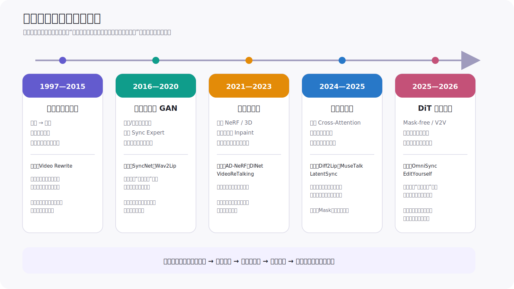

*图 1　本文归纳的五阶段技术路线。箭头表示核心责任从显式规则、同步监督、专用渲染器，逐步迁移到潜空间生成与上下文完整的视频编辑。*

## 1　先把问题定义清楚：口型改写不是“让照片开口”

给定源视频 $V_s$ 和目标音频 $A_t$，狭义口型改写希望生成 $V_o$：

- $V_o$ 的唇部运动与 $A_t$ 对齐；
- 人物身份、头姿、上半脸表情、身体动作、背景与运镜尽量继承 $V_s$；
- 生成区域与原画面无接缝，跨帧不闪烁；
- 推理速度和失败率满足真实生产。

### 1.1 一个统一视角：历代方案到底在替换哪一项

把源视频第 $t$ 帧记为 $v_t$，目标音频窗口记为 $a_{t-k:t+k}$，编辑区域记为软 Mask $m_t\in[0,1]^{H\times W}$，参考身份或几何条件记为 $r_t$。大多数局部口型改写都可以写成：

$$
\hat v_t=(1-m_t)\odot v_t+m_t\odot G_\theta\!\left(v_{t-k:t+k},a_{t-k:t+k},r_t\right)
$$

其中 $G_\theta$ 是生成器，$\odot$ 表示逐像素乘法。Video Rewrite 用样例检索和几何变形实现 $G_\theta$；Wav2Lip 用 CNN；MuseTalk 在 VAE 潜空间用单步 U-Net；LatentSync 用时序潜扩散；OmniSync 则试图把显式 $m_t$ 消掉，直接学习完整视频的条件编辑。

训练目标通常不是单一“重建损失”，而是多种责任的组合：

$$
\mathcal L=
\lambda_{\mathrm{sync}}\mathcal L_{\mathrm{sync}}+
\lambda_{\mathrm{rec}}\mathcal L_{\mathrm{rec}}+
\lambda_{\mathrm{id}}\mathcal L_{\mathrm{id}}+
\lambda_{\mathrm{temp}}\mathcal L_{\mathrm{temp}}
$$

$\mathcal L_{\mathrm{sync}}$ 约束音画对应，$\mathcal L_{\mathrm{rec}}$ 约束可见像素，$\mathcal L_{\mathrm{id}}$ 约束身份，$\mathcal L_{\mathrm{temp}}$ 约束跨帧稳定。历代方法的差异，本质上是选择了不同的 $G_\theta$、$m_t$、条件 $r_t$ 与损失权重。

下面的 NumPy 代码对应第一条公式。它不包含人脸检测和模型推理，只保留任何生产实现都必须守住的合成不变量：Mask 范围合法、尺寸一致、Mask 外像素不被改动。

```python
from __future__ import annotations

import numpy as np


def composite_lips(
    source: np.ndarray,
    generated: np.ndarray,
    soft_mask: np.ndarray,
) -> np.ndarray:
    """Blend a generated face ROI back while preserving pixels outside the mask."""
    if source.shape != generated.shape or source.ndim != 3:
        raise ValueError("source and generated must share shape [H, W, C]")
    if soft_mask.shape != source.shape[:2]:
        raise ValueError("soft_mask must have shape [H, W]")
    if not np.isfinite(soft_mask).all():
        raise ValueError("soft_mask contains NaN or Inf")

    mask = np.clip(soft_mask.astype(np.float32), 0.0, 1.0)[..., None]
    mixed = (1.0 - mask) * source.astype(np.float32)
    mixed += mask * generated.astype(np.float32)
    return np.clip(mixed, 0, 255).astype(np.uint8)
```

这一任务与相邻路线的输入输出约束不同：

| 任务 | 输入 | 模型可以改变什么 | 典型用途 |
|---|---|---|---|
| **视频口型改写 / visual dubbing** | 已有视频 + 新音频 | 原则上只改变语音相关区域 | 多语言配音、改词、数字人复用 |
| 单图说话 / portrait animation | 人像图 + 音频 | 口型、表情、头姿乃至构图都可重新生成 | 虚拟主播、照片复活 |
| 个体化神经头像 | 某人的训练视频 + 音频 | 在专属 3D/NeRF 表示中重渲染头部 | 固定高价值数字人、实时交互 |
| 3D Rig / Blendshape 驱动 | 音频 + 角色绑定 | 输出可编辑的骨骼、控制器或 Blendshape | 游戏、动画、Maya 制作 |

这一区分非常重要。单图说话模型看起来可能更“有表情”，但它不承担“保留原视频每个非口型细节”的约束；反过来，口型改写模型只改嘴部，FID、FVD 等全画面指标天然会受大量未修改像素影响，也不能直接拿来证明模型更会生成全身动作。

对业务而言，一个可用口型改写系统至少要同时守住六条线：

| 约束 | 失败时用户看到什么 |
|---|---|
| 音画同步 | 嘴型早了、晚了，闭口音和圆唇音不匹配 |
| 身份保真 | 嘴改完后像另一个人，胡须、痣、法令纹消失 |
| 局部真实 | 牙齿闪烁、舌头融化、唇边发糊、肤色断层 |
| 时序稳定 | 单帧清楚，但连续播放时嘴部抖动或纹理跳变 |
| 场景鲁棒 | 侧脸、遮挡、漏检、进出画面时突然错位 |
| 系统效率 | 首帧等待长、P95 耗时高、显存和人工返工成本不可控 |

## 2　为什么这件事比“音频映射到嘴形”难

### 2.1 音素与嘴形不是一一对应

同一音素在不同前后文中会受协同发音影响。嘴形不仅取决于当前声音，还取决于前后音素、语速、重音、说话风格和语言。早期 Video Rewrite 已经使用三音素上下文，而现代模型普遍输入一段音频窗口，本质上都在处理同一个问题：**嘴部是一个有时间记忆的系统，不是逐帧查表**。

### 2.2 新音频是弱条件，旧嘴形是强视觉提示

视频中原来的嘴、脸颊与下巴已经暴露了旧发音。若 Mask 太小，模型很容易从原帧“抄答案”而忽略新音频。LatentSync 将其称为 **shortcut learning**；OmniSync 进一步把旧唇形泄漏视为固定 Mask 路线的重要限制。

这也解释了平台实验中的反直觉结果：Mask 缩得更小虽然保留了更多原脸，却可能让模型更依赖旧视觉信息，口型同步反而下降。

### 2.3 生成的是口腔，不只是两条唇线

清晰口型包含嘴唇形变、牙齿遮挡、舌头、口腔阴影、下巴与脸颊牵动。Landmark 能规定大致几何，却不能直接提供这些高频纹理；GAN 容易糊，局部贴图容易出现方框，逐帧扩散又容易闪烁。

### 2.4 “改哪里”与“怎么画”同样重要

脸检测、跟踪、对齐、裁剪、Mask、生成和回贴共同定义最终效果。模型可能在 256×256 面部 ROI 内工作正常，但只要人脸框跳动 2—3 个像素、仿射坐标前后不一致，回到原视频里就会变成明显抖动。

因此，生产系统应把问题拆成四层：

1. **同步层**：目标音频对应什么口型；
2. **生成层**：牙齿、舌头、唇纹怎样重建；
3. **几何层**：人脸如何检测、跟踪、对齐、遮罩和回贴；
4. **系统层**：如何切片、并发、失败回退、质检和批量交付。

## 3　技术演进：五次关键责任迁移

### 3.1 1997：Video Rewrite——从视素表到可运行的视频改写系统

[Video Rewrite: Driving Visual Speech with Audio](https://www2.eecs.berkeley.edu/Research/Projects/CS/vision/human/bregler-sig97.pdf) 先对特定演员的训练视频做音素标注和口型建模，再根据新音频检索合适的嘴部片段，经过几何变换后贴回原视频。它使用三音素而不是孤立音素，显式处理前后文对嘴形的影响。

**突破点**：第一次把“新音频 → 口型片段选择 → 嘴部变形 → 视频合成”组织成完整 visual dubbing 系统，奠定了今天仍然存在的局部编辑范式。

**局限**：素材库和人物强绑定；没见过的发音上下文无法自然合成；身份、光照与头姿变化都依赖采集覆盖。

**代码**：未发现官方公开实现。

### 3.2 2016：SyncNet——先学会判断同步，再训练生成器

[Out of Time: Automated Lip Sync in the Wild](https://doi.org/10.1007/978-3-319-54427-4_19) 用双流网络分别编码声音和连续嘴部图像，在联合嵌入空间中判断音视频偏移。其[官方代码与模型](https://github.com/joonson/syncnet_python)最初用于同步检测、活跃说话人识别和唇读，但后来成为口型生成领域最重要的基础设施之一。

**突破点**：把“是否同步”从手工规则变成可学习、可冻结、可迁移的判别器。此后同一个 Sync Expert 可以承担三种角色：

- 训练时的同步损失；
- 模型选择与回归测试；
- 线上或离线质量筛查。

SyncNet 本身不生成视频，但它改变了生成器的训练目标：模型不再只追求像素接近，而必须通过一个真正理解音画对应关系的“考官”。

### 3.3 2020：Wav2Lip——同步专家成为通用口型生成监督

[A Lip Sync Expert Is All You Need for Speech to Lip Generation in the Wild](https://arxiv.org/abs/2008.10010) 将预训练且冻结的同步专家用于监督生成器，形成 [Wav2Lip 官方实现](https://github.com/Rudrabha/Wav2Lip)。它面向任意身份、语言和动态视频，不要求为每个人单独训练。

读图问题：为什么同步判别器必须先训练好并冻结，而不是与生成器一起变化？

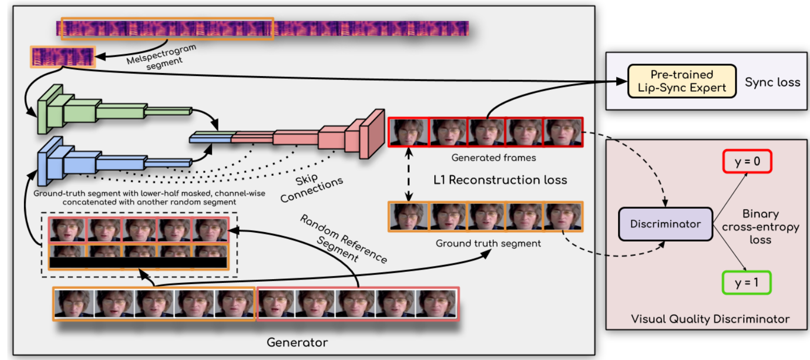

*图 2　Wav2Lip 将冻结的同步专家与视觉质量判别器分工。原论文 Figure 2，裁剪自 [A Lip Sync Expert Is All You Need for Speech to Lip Generation in the Wild](https://arxiv.org/abs/2008.10010)，版权归原作者。*

图中同步专家只判断生成帧和梅尔频谱是否对应，不参与“画得像不像”的竞争；视觉质量判别器负责真实性。这种职责隔离避免了同步标准随生成器一起漂移，也是 Wav2Lip 最重要的可迁移设计。

**突破点**：

- 用更强的冻结 Sync Expert 替代边训边变的同步判别器；
- 将口型同步从特定人物推进到 in-the-wild 泛化；
- 同时公开训练、推理、权重和评测代码，成为长期工程基线。

**工程意义**：Wav2Lip 证明“通用生成器 + 固定同步专家”比单纯像素重建更可靠。LatentSync、MuseTalk 等后续工作仍在延续或修正这套思想。

**局限**：低分辨率嘴部、牙齿和胡须细节容易变糊；裁剪与回贴可能产生局部方框；官方开源版本有非商业使用限制，生产使用必须单独核对许可。

### 3.4 2021—2023：两条分支——个体高保真与通用高分辨率

Wav2Lip 之后，领域分成两类责任分配完全不同的路线。

#### 路线 A：把人物本身学进渲染器

[AD-NeRF](https://openaccess.thecvf.com/content/ICCV2021/html/Guo_AD-NeRF_Audio_Driven_Neural_Radiance_Fields_for_Talking_Head_Synthesis_ICCV_2021_paper.html) 将音频特征直接条件化到动态神经辐射场，并分别建模头部与上半身；[官方代码](https://github.com/YudongGuo/AD-NeRF)需要为目标人物训练专属表示。

后来 [GeneFace++](https://arxiv.org/abs/2305.00787) 将流程拆成通用 audio-to-motion 与个体 motion-to-video：引入音高、说话风格与时序损失改善动作，再用局部线性嵌入抑制运动离群点，并设计快速 NeRF 渲染器；[官方代码](https://github.com/yerfor/GeneFacePlusPlus)支持专属数字人训练。

这条路线的优势是身份细节和 3D 一致性高，适合少量固定、高价值数字人；代价是逐人训练、数据采集和资产维护成本。

#### 路线 B：把口型改写拆成可泛化的视频编辑流水线

[VideoReTalking](https://arxiv.org/abs/2211.14758)把任务分为“统一表情 → 口型同步 → 身份感知人脸增强”三步，[官方代码](https://github.com/OpenTalker/video-retalking)不要求针对人物重新训练。它的核心不是一个更大的生成器，而是先消除源表情干扰，再同步，最后专门修复清晰度。

[DINet](https://ojs.aaai.org/index.php/AAAI/article/view/25464) 不从压缩特征直接生成所有像素，而是将五张参考脸的高频特征先做空间形变，再与源图的头姿和上半脸表情一起 Inpaint；[官方代码](https://github.com/MRzzm/DINet)展示了高分辨率嘴部训练与推理流程。

这条路线更适合多人、多视频的通用配音，但模块越多，检测、仿射、增强和回贴的误差也越容易累积。

### 3.5 2024—2025：扩散先验进入口型改写

GAN 难以同时守住清晰度、泛化和训练稳定性，扩散模型因此进入 visual dubbing。

[Diff2Lip](https://openaccess.thecvf.com/content/WACV2024/html/Mukhopadhyay_Diff2Lip_Audio_Conditioned_Diffusion_Models_for_Lip-Synchronization_WACV_2024_paper.html) 是代表性的像素空间音频条件扩散方案。它利用完整上下文做嘴部扩散重建，在论文和用户研究中改善了视觉质量，但[官方代码](https://github.com/soumik-kanad/diff2lip)明确说明尚未达到实时，并采用非商业许可。

[MuseTalk](https://arxiv.org/abs/2410.10122)把 Mask 后的人脸与参考脸编码到 VAE 潜空间，通过 Stable Diffusion U-Net 风格的网络和音频 Cross-Attention 生成口型。[官方代码](https://github.com/TMElyralab/MuseTalk)的核心生成网络是单步 U-Net，而不是典型的多步扩散采样；因此它能在 V100 上以 256×256 面部 ROI 达到论文报告的 30 FPS。2025 年修订版将其明确为潜空间中的 GAN 式单步生成，并通过参考帧与 Mask 的时空采样改善身份、同步和牙齿清晰度。

读图问题：MuseTalk 为什么既能利用 Stable Diffusion 的 VAE 与 U-Net 表示，又不承担多步扩散的推理成本？

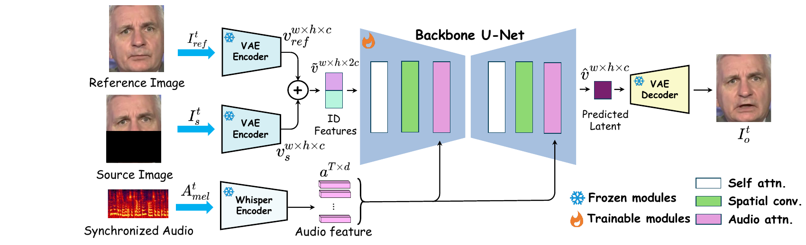

*图 3　MuseTalk 的 VAE、Whisper 与单步 U-Net 数据流。原论文 Figure 2，裁剪自 [MuseTalk: Real-Time High Quality Lip Synchronization with Latent Space Inpainting](https://arxiv.org/abs/2410.10122)，版权归原作者。*

图中冻结的 VAE 负责把像素压到潜空间，冻结的 Whisper 提供音频特征，真正训练的是带 Audio Attention 的 U-Net。它预测一次潜变量后直接解码，没有“从纯噪声反复去噪”的长采样链；这正是平台选择它作为 Fast Path 的根本原因。

[LatentSync](https://arxiv.org/abs/2412.09262)进一步使用真正的音频条件 latent diffusion，直接学习“原视频 + 新音频 → 新口型”，没有 Landmark 等中间运动表示；[官方代码](https://github.com/bytedance/LatentSync)在 2025 年更新到 512×512 的 1.6 版本。

读图问题：当模型改为真正的时序潜扩散后，音频、参考帧、同步监督与时序监督分别在哪里进入？

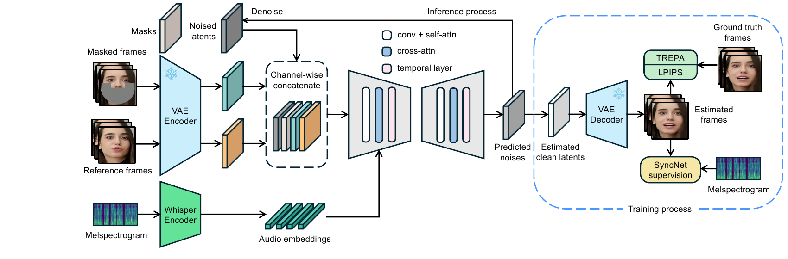

*图 4　LatentSync 的时序潜扩散训练与推理框架。原论文 Figure 3，裁剪自 [LatentSync: Audio Conditioned Latent Diffusion Models for Lip Sync](https://arxiv.org/abs/2412.09262)，版权归原作者。*

左侧 U-Net 同时接收噪声潜变量、Mask、源帧、参考帧和 Whisper 音频嵌入；右侧只在训练时解码估计帧，用 SyncNet 约束音画、用 TREPA/LPIPS 约束时序与感知质量。它比 MuseTalk 更重，但把“同步、细节、跨帧稳定”放进了同一个可训练闭环。

LatentSync 的三个关键贡献具有普遍工程价值：

1. **SyncNet 监督**：证明潜扩散如果没有同步监督，会利用嘴周视觉走捷径而忽略音频；
2. **StableSyncNet 训练经验**：音画对齐、仿射顺序、帧窗、Batch Size 和嵌入维度都会显著影响“考官”是否收敛；
3. **TREPA**：用自监督视频模型的时序表征约束生成序列，减少牙齿、唇纹和胡须闪烁。

论文在 HDTF 上的消融显示：加入像素空间 SyncNet 后，Sync Confidence 从 **4.6** 提升到 **8.9**；加入 TREPA 后，FVD 从 **176.35** 降到 **162.74**。这些数字是论文设置内的因果证据，不应与使用不同预处理和 SyncNet 权重的其他论文横向拼成排行榜。

### 3.6 2025—2026：从 Mask Inpaint 走向上下文完整的视频编辑

[OmniSync](https://arxiv.org/abs/2505.21448)（NeurIPS 2025）开始直接挑战口型改写的经典假设：一定要先检测人脸、遮住嘴、再拿参考帧补洞吗？

它用 DiT 做 Mask-free 视频编辑：

- 训练时用同一视频的不同片段构造伪配对，不显式提供嘴部 Mask；
- 推理时从原帧逐步加噪，而不是完全随机噪声，以保持身份和姿态；
- 用动态时空 CFG 在早期、嘴部附近施加强音频引导，后期逐渐减弱，平衡同步与画质；
- 建立面向 AIGC 视频、风格化角色与遮挡场景的基准。

读图问题：如果去掉显式 Mask，模型靠什么同时保留人物、学习嘴形并利用非严格配对的数据？

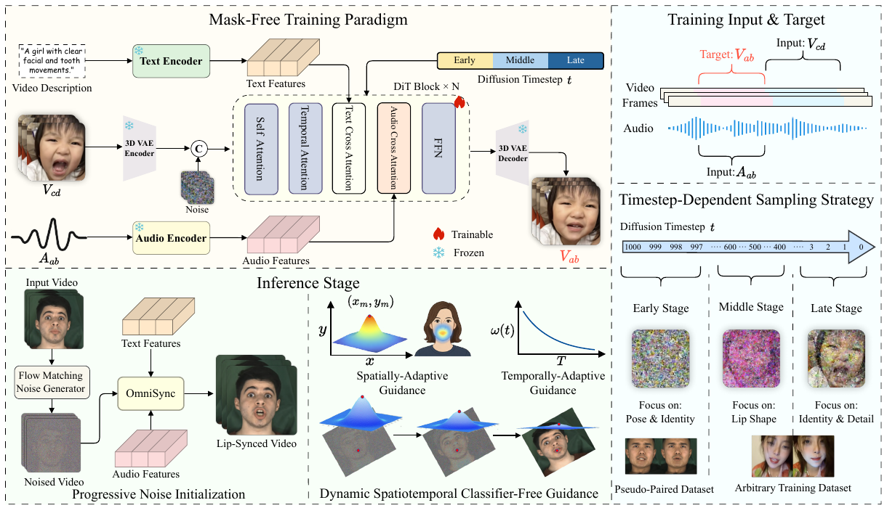

*图 5　OmniSync 的 Mask-free DiT 训练与推理框架。原论文 Figure 2，裁剪自 [OmniSync: Towards Universal Lip Synchronization via Diffusion Transformers](https://arxiv.org/abs/2505.21448)，版权归原作者。*

上半部分按扩散时间步分配学习重点：早期学习姿态与身份，中期学习嘴形，后期补身份与细节；下半部分从源视频逐步加噪，并用空间与时间自适应 CFG 把音频影响聚焦到需要变化的位置。它把原来由检测器、固定 Mask 和参考帧承担的责任，部分移进了视频 DiT。

**突破点**：从“只看裁好的人脸”转向“理解原视频的完整上下文后，只修改语音相关内容”。截至本文检索日期，论文未提供可用的官方代码仓库，因此它更适合作为技术方向，而不是直接替换生产链路。

[EditYourself](https://arxiv.org/abs/2601.22127)（2026 预印本）又把任务从“换一条同长度音频”扩展到基于文本的插入、删除、重定时和局部重渲染。其[官方项目页](https://pipioinc.github.io/edityourself/)展示了 DiT 视频到视频编辑，但页面中的 Code 链接当前未指向可用仓库。

这说明下一阶段的终点不再是一个独立 Lip-sync 模块，而是**能理解脚本、音频、人物与时空上下文的专业视频编辑器**。

## 4　核心方案、论文与代码一览

| 年份 | 方案 | 核心突破 | 核心论文 | 官方代码 / 状态 |
|---:|---|---|---|---|
| 1997 | Video Rewrite | 三音素上下文 + 嘴部样例检索与变形 | [Paper](https://www2.eecs.berkeley.edu/Research/Projects/CS/vision/human/bregler-sig97.pdf) | 未公开 |
| 2016 | SyncNet | 学习音频与连续嘴部图像的联合同步空间 | [Paper](https://doi.org/10.1007/978-3-319-54427-4_19) | [Code](https://github.com/joonson/syncnet_python) |
| 2020 | Wav2Lip | 冻结 Sync Expert 监督通用视频口型生成 | [Paper](https://arxiv.org/abs/2008.10010) | [Code](https://github.com/Rudrabha/Wav2Lip) |
| 2021 | AD-NeRF | 音频条件动态 NeRF，专属人物高保真渲染 | [Paper](https://openaccess.thecvf.com/content/ICCV2021/html/Guo_AD-NeRF_Audio_Driven_Neural_Radiance_Fields_for_Talking_Head_Synthesis_ICCV_2021_paper.html) | [Code](https://github.com/YudongGuo/AD-NeRF) |
| 2022 | VideoReTalking | 统一表情、口型同步、人脸增强三段式编辑 | [Paper](https://arxiv.org/abs/2211.14758) | [Code](https://github.com/OpenTalker/video-retalking) |
| 2023 | DINet | 参考脸特征先形变，再高分辨率 Inpaint | [Paper](https://ojs.aaai.org/index.php/AAAI/article/view/25464) | [Code](https://github.com/MRzzm/DINet) |
| 2023 | GeneFace++ | 通用音频到运动 + 个体实时 NeRF 渲染 | [Paper](https://arxiv.org/abs/2305.00787) | [Code](https://github.com/yerfor/GeneFacePlusPlus) |
| 2024 | Diff2Lip | 像素空间音频条件扩散改写口型 | [Paper](https://openaccess.thecvf.com/content/WACV2024/html/Mukhopadhyay_Diff2Lip_Audio_Conditioned_Diffusion_Models_for_Lip-Synchronization_WACV_2024_paper.html) | [Code](https://github.com/soumik-kanad/diff2lip) |
| 2024/25 | MuseTalk | 潜空间单步 U-Net，高效局部口型生成 | [Paper](https://arxiv.org/abs/2410.10122) | [Code](https://github.com/TMElyralab/MuseTalk) |
| 2024/25 | LatentSync | 端到端潜扩散 + StableSyncNet + TREPA | [Paper](https://arxiv.org/abs/2412.09262) | [Code](https://github.com/bytedance/LatentSync) |
| 2025 | OmniSync | Mask-free DiT 直接视频编辑与动态时空 CFG | [Paper](https://arxiv.org/abs/2505.21448) | 未公开 |
| 2026 | EditYourself | 支持插入、删除、重定时的脚本级 V2V 编辑 | [Paper](https://arxiv.org/abs/2601.22127) | 项目页链接暂不可用 |

> [!WARNING] 代码开源不等于可直接商用
> 权重、训练数据、依赖模型和仓库本身可能使用不同许可证。Wav2Lip、Diff2Lip 等官方仓库对商业使用有明确限制；任何生产选型都应在 PoC 前完成代码、权重、数据与肖像权四层许可审查。

## 5　相邻路线：为什么 LivePortrait、Hallo 和 SadTalker 不能与口型改写混为一谈

平台为了生成“会说话、会表达、会动”的数字人，必然会使用口型改写之外的模型。它们解决的是互补问题：

| 方案 | 任务与突破 | 核心论文 | 官方代码 |
|---|---|---|---|
| SadTalker | 单图 + 音频；用 3DMM 系数显式建模表情和头姿 | [Paper](https://arxiv.org/abs/2211.12194) | [Code](https://github.com/OpenTalker/SadTalker) |
| AniPortrait | 音频先转 3D 表示与 2D Landmark，再用扩散生成肖像视频 | [Paper](https://arxiv.org/abs/2403.17694) | [Code](https://github.com/scutzzj/AniPortrait) |
| LivePortrait | 驱动视频 + 源人物；隐式关键点、拼接与重定向，强调高效可控表情迁移 | [Paper](https://arxiv.org/abs/2407.03168) | [Code](https://github.com/KlingAIResearch/LivePortrait) |
| Hallo | 单图 + 音频；用分层音频条件分别控制 Lip、Face 与 Pose | [Paper](https://arxiv.org/abs/2406.08801) | [Code](https://github.com/fudan-generative-vision/hallo) |

可以把这几类模型的职责记成一句话：

- **LivePortrait** 决定“这个人以什么表情和头姿说”；
- **Hallo** 尝试让音频直接生成整张会动的脸；
- **MuseTalk / LatentSync** 负责“已有视频中的嘴怎样换成新音频”；
- **动作驱动模型**负责身体；
- **资产与生产系统**决定这些能力能否批量组合。

## 6　我们的落点：先局部编辑量产，再探索统一驱动

### 6.1 为什么没有等待一个“大一统模型”

平台面向的不是单次 Demo，而是大批量、低成本、场景化的数字人口播。原始材料记录的传统方案有四类问题：人物呆板、表情僵硬、口型同步差，以及生产仍依赖真人录制。

项目采用两阶段路线：

1. **阶段一：模块化落地。** 动作驱动产生底板，LivePortrait 迁移表情，MuseTalk 根据目标音频局部改嘴；
2. **阶段二：统一模型探索。** 在 Hallo 基础上训练扩散模型，让音频同时影响口型、表情和时序，进一步与全身动作生成结合。

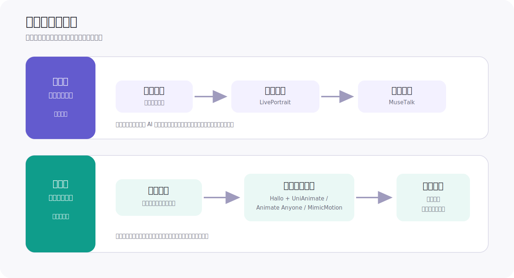

*图 6　平台两阶段架构：先用可替换模块形成生产闭环，再用统一音频驱动模型探索更高上限。本文根据项目材料重绘。*

这不是保守方案，而是把不确定性隔离在可替换模块中：阶段一可以逐项上线、调参和回退，先验证业务价值；阶段二再处理模块串联无法根治的全脸协同与误差累积。

### 6.2 MuseTalk：把生成范围收缩到真正需要变化的像素

平台使用的 MuseTalk 路线先检测并裁出人脸，将参考脸与 Mask 后的人脸编码到 VAE 潜空间；冻结 Whisper 编码目标音频，再通过 U-Net 中的 Audio Cross-Attention 注入口型条件；最后解码并贴回原始帧。

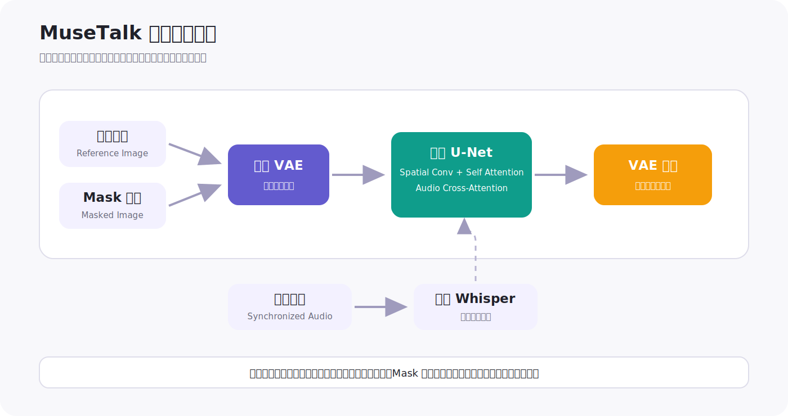

*图 7　平台采用的 MuseTalk 局部编辑链路：检测与对齐、潜空间生成、解码融合、回贴原帧。本文根据开源实现与项目材料重绘。*

这个选择直接对应业务约束：

- 全身画面中的脸只占很小区域，ROI 推理把算力集中到嘴唇、牙齿和下巴；
- 衣服、身体和背景不重新生成，身份与场景漂移更少；
- 单步网络比多步扩散更适合高吞吐；
- 口型模块可以独立升级，不影响动作、音色和包装链路。

### 6.3 Mask 优化：生成范围既是画质参数，也是同步参数

开源代码采用下半张脸 Mask。它给模型充足生成空间，却容易覆盖过多身份纹理。项目尝试过三类方案：

1. **下半脸大 Mask**：同步空间充足，但原脸细节损失更大；
2. **仅嘴部小 Mask**：保留原脸，但与训练分布差异较大，且旧唇形泄漏更明显；
3. **可调 Mask**：按人脸关键点固定左右与下边界，把上边界暴露为服务参数，在同步与身份保真之间调节。

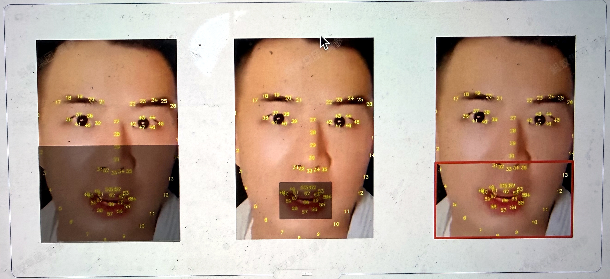

*图 8　项目材料中的三种 Mask 策略。该图能证明参数设计与可见范围，不能单独证明动态同步优劣。*

这项优化与 LatentSync 后来对 shortcut learning 的分析相互印证：Mask 不是越小越好。它同时控制模型能看到多少旧口型、能生成多少下颌运动、要重建多少身份细节。

### 6.4 漏脸帧：真正的生产故障发生在模型输入之前

原始实现遇到检测不到人脸的帧会跳过；人脸再次出现后，新 ROI 可能与历史位置不对齐，形成闪动或跳变。项目材料明确记录了针对漏脸帧的优化，但没有保留最终采用的是插值、跟踪、历史框传播还是重检测，因此本文不补写不存在的实现细节。

从系统设计看，这类问题应由独立的几何状态层处理，而不是让生成模型兜底：

- 维护 face track ID，而不是逐帧独立选最大脸；
- 对中心点、尺度、旋转和关键点做时序滤波；
- 短时漏检使用有上限的历史状态，超过阈值则降级或拒绝；
- 重获人脸后渐进恢复 Mask 和融合权重；
- 把检测置信度、漏检长度和重获抖动写入质量日志。

这里前四项是从问题推导出的推荐架构，不是对平台原代码的事实描述。

### 6.5 LivePortrait：口型正确之后，还要解决“怎么说”

LivePortrait 用外观特征保留人物身份，用隐式关键点表达头姿和表情，再通过 Warping 与 Decoder 生成编辑帧。平台在开源方案上扩展了视频和动物表情编辑，并围绕头部运动平滑与拼接做优化。

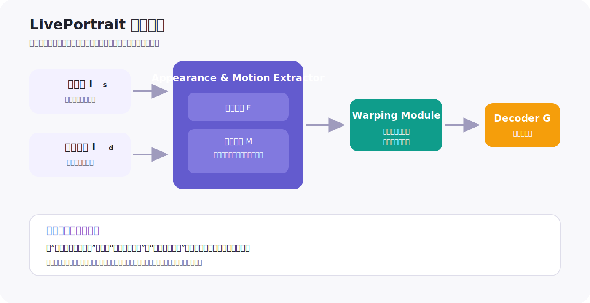

*图 9　LivePortrait 在平台链路中的职责：迁移表情与头姿，同时把人物外观保留给后续口型模块。本文根据论文与项目材料重绘。*

项目同时沉淀了 happy、fear、sad、surprised 等表情库，让不同人物复用同一套表达素材。

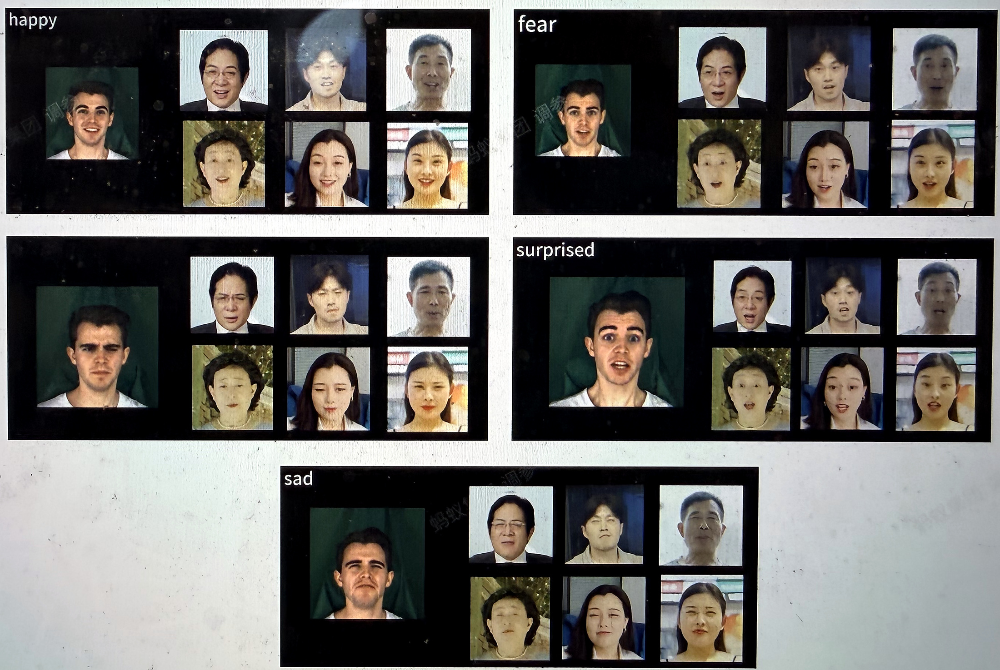

*图 10　项目材料中的表情库样例。静态帧可观察身份和表情类别，无法独立验证进入、保持与退出的动态平滑度。*

这一模块也暴露了串联系统的接口风险：LivePortrait 改变头姿与脸部仿射后，MuseTalk 的裁剪、Mask 和贴回必须处在一致坐标系中。若驱动视频与源视频动作差异过大，即使两个模型单独运行都正常，组合结果仍会出现接缝和口型漂移。

### 6.6 Hallo：让语音从控制嘴部升级为控制整张脸

阶段一的三个模块分别控制身体、表情与嘴部，快速但会累积裁剪、仿射、生成和融合误差。阶段二因此使用 Hallo 探索统一扩散训练。

平台材料记录：

- 使用清洗后的 VFHQ **7718 条**采访与对话视频；
- 逐帧构建 lip、face、background 三种尺度 Mask；
- 第一阶段训练 ReferenceNet 与 Denoising U-Net，先学习身份、外观和基础图像生成；
- 第二阶段冻结图像生成部分，训练 Audio-Attention 与 Temporal-Attention，学习音频对面部的控制与跨帧连续性。

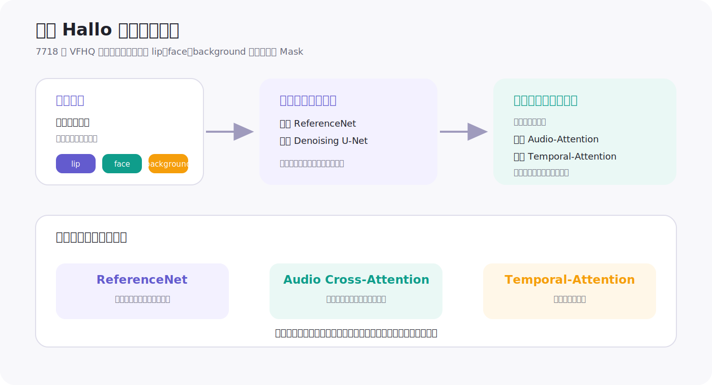

*图 11　平台的 Hallo 训练拆分：先学习身份与图像生成，再学习音频注意力和跨帧状态。本文根据项目材料重绘。*

这条路线的目标不是把嘴张得更大，而是让语音节奏与情绪影响眉眼、脸颊、头姿和跨帧状态。它与狭义口型改写的任务约束不同，因此应单独评测“整脸自然度”和“非嘴部动作是否真的由音频驱动”。

## 7　我们真正完成的不是一个模型，而是一条可组合生产链

平台把人物、动作、声音、表情和背景做成结构化资产，再由脚本与人设矩阵组合：

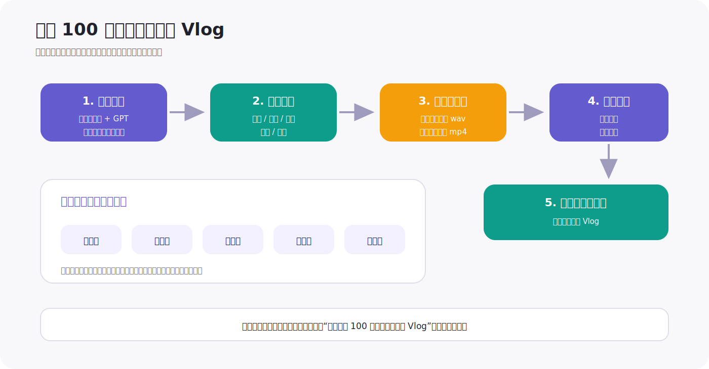

*图 12　数字人 Vlog 生产链：算法模块只有进入资产、编排、质检与包装系统后，才成为可量产能力。本文根据项目材料重绘。*

完整流程是：

1. 从脚本库和人设出发生成剧本；
2. 从人物库、动作库、声音库、表情库和背景库选择资产；
3. 用音色克隆生成目标音频，用动作驱动生成底板；
4. 用 LivePortrait 编辑表情，用 MuseTalk 改写口型；
5. 替换场景、增加字幕与包装，输出最终 Vlog。

与本链路直接相关的两篇内部复盘是：

- 《动作驱动：Vlog 数字人自动化生产与质量优化》：MimicMotion 业务微调、长视频连续性、手脸局部 Loss 与生产编排；
- 《音色克隆算法升级：从 GPT-SoVITS 到 CosyVoice》：音色库、业务词适配，以及 TTS 可用率从不足 60% 到 90%+ 的项目记录。

原稿记录的阶段性业务结果是：构建表情库并落地 100 个数字人业务，每日稳定自动化产出 **20+** 视频，投放后累计出单 **100+**；专项最终目标是一天生产 **100 个**全新形象真人 Vlog。由于材料没有给出统计窗口、样本分母、投放金额和对照组，这些数字只能证明链路进入真实生产，不能单独归因到某个口型算法。

## 8　把我们的工作放回行业坐标

| 行业阶段的核心瓶颈 | 公开方案给出的能力 | 平台实际补上的一层 | 业务价值 |
|---|---|---|---|
| 通用模型改嘴但容易糊 | Wav2Lip / DINet 学习同步和纹理 | 选择 MuseTalk 潜空间局部生成 | 提升清晰度与吞吐 |
| Mask 过大损身份、过小损同步 | MuseTalk 提供局部 Inpaint | 上边界可调的服务级 Mask | 将模型权衡变成可配置参数 |
| 漏脸、框跳、回贴接缝 | 论文多在对齐后人脸上评测 | 识别漏脸帧与几何状态问题 | 提升长视频可用率 |
| 嘴对了但人物仍呆 | Hallo / LivePortrait 扩展表情和头姿 | 建表情库并与口型模块串联 | 提升表达丰富度与资产复用 |
| 单个 Demo 无法量产 | 论文通常止于推理脚本 | 人物、动作、声音、表情、背景资产化 | 支持自动编排与批量产出 |
| 模块串联累积误差 | 端到端音频驱动扩散 | VFHQ 7718 条数据的 Hallo 两阶段训练探索 | 为统一控制建立数据与训练基础 |

因此，这项工作的贡献不应包装成“发明了新的口型基础模型”。更准确的表述是：

> 团队选中适合实时局部编辑的 MuseTalk，把 Mask、几何连续性与服务参数做成可运营能力；再用 LivePortrait、动作驱动、音色克隆和资产编排把口型算法嵌入生产链，同时探索 Hallo 统一扩散训练来解决模块化路线的上限。

这正是从算法 Demo 到平台能力最关键、也最容易在论文叙事中被忽略的一段。

## 9　评测与证据：不要再用一张对比帧判断口型

### 9.1 指标必须覆盖五层

| 层级 | 建议指标 | 关键注意事项 |
|---|---|---|
| 音画同步 | Sync Confidence、LSE-D/LSE-C、音画偏移帧数、音节级盲评 | 必须固定 SyncNet 权重、裁剪和音画对齐预处理 |
| 图像与身份 | LPIPS、FID、ArcFace/人脸特征距离、Mask 外像素差 | FID/SSIM 可能被大量未修改背景主导 |
| 时序稳定 | FVD、嘴部光流连续性、牙齿/胡须闪烁率、帧间感知差 | 单帧清晰不代表连续播放稳定 |
| 系统鲁棒 | 检测召回、track 切换、漏检恢复首 10 帧抖动、任务成功率 | 必须覆盖侧脸、遮挡、进出画面与多人 |
| 生产效率 | 首帧延迟、FPS/RTF、P50/P95 耗时、显存、单分钟成本、首过率 | 实验室平均 FPS 不能替代端到端成本 |

SyncNet 指标尤其容易被误用。不同论文可能使用不同版本的网络、帧窗、对齐方式和数据预处理；一个在自身数据上训练的 SyncNet 也可能偏爱同分布生成结果。正确做法是：

- 固定独立评测模型和预处理；
- 同时报告音画偏移与真实语句盲评；
- 把中文音节、连读、语速和情绪单独分桶；
- 不把单一 Sync 分数当作最终质量。

### 9.2 测试集应按失败机制构造

建议建立四组长期回归集：

1. **发音组**：闭口音、爆破音、圆唇音、连续元音、快语速、唱歌和中英混说；
2. **几何组**：正脸、45°、大侧脸、低头、遮挡、出画再入画、多人交叉；
3. **身份组**：胡须、眼镜、痣、强妆、皱纹、卡通人物与非真人风格；
4. **长度组**：5 秒、30 秒、1 分钟、5 分钟，专门检查累计漂移和切片接缝。

每条样本不仅要保存成片，还应保存：

- 人脸框、关键点、track ID 和置信度；
- Mask、仿射矩阵与融合图；
- 音频窗口与切片边界；
- 模型版本、权重、参数和 GPU 环境；
- 自动指标、人工失败标签和返工原因。

只有这样，模型升级后才能回答“为什么变好或变坏”，而不是再次靠肉眼挑 Demo。

## 10　生产选型：什么场景用哪条路线

| 场景 | 首选思路 | 原因 | 主要风险 |
|---|---|---|---|
| 大批量已有视频换音频、强调吞吐 | MuseTalk + 稳定几何服务 | 单步局部生成、改动范围小、易模块化 | Mask、牙齿细节、漏脸恢复 |
| 高价值成片、允许更高延迟 | LatentSync 或同类潜扩散 | 身份与细节更强，时序约束更完整 | 算力、时延、切片一致性 |
| 少量固定数字人、可逐人训练 | GeneFace++ / NeRF / 3DGS 路线 | 身份细节与 3D 一致性高 | 采集、训练、资产维护 |
| 单张人像生成表达丰富的主播 | Hallo / SadTalker 等肖像动画 | 可生成头姿与表情，不依赖底板视频 | 不保证原视频动作和背景不变 |
| 已有驱动视频，需要复用表情 | LivePortrait + 独立口型模块 | 表情、身份和嘴部职责清晰 | 多次仿射与模块接口误差 |
| 风格化角色、遮挡或 AIGC 视频 | OmniSync 类 Mask-free DiT | 不强依赖标准人脸检测和固定 Mask | 官方代码与生产稳定性不足 |
| 改脚本长度、插入或删除语句 | EditYourself 类 V2V 编辑 | 口型、时长和上下文一起重构 | 前沿方案，开放性和成本待验证 |

对现有平台，最现实的升级不是立即推翻 MuseTalk，而是形成两条服务通道：

- **Fast Path**：MuseTalk，面向批量、低延迟和稳定正脸场景；
- **Quality Path**：LatentSync 类模型，面向重点素材、复杂身份细节和可接受更高成本的场景。

两条通道应复用同一套检测、跟踪、对齐、音画切分、回贴和评测系统。这样更换生成器不会重新制造一次工程问题。

### 10.1 可落地的双通道路由骨架

下面的代码展示生产集成层应固定什么接口：先根据姿态、遮挡和时延预算选路由，再用同一质量门禁检查结果；Fast Path 失败时只允许升级到 Quality Path，避免无边界重试。代码可直接通过 Python 语法检查，但视频解码、人脸跟踪和具体模型后端需要接入平台已有实现。

```python
from __future__ import annotations

from dataclasses import dataclass
from pathlib import Path
from typing import Literal, Protocol

Route = Literal["fast", "quality"]


@dataclass(frozen=True)
class ClipMeta:
    duration_s: float
    max_abs_yaw_deg: float
    occlusion_ratio: float
    face_track_coverage: float
    latency_budget_s: float


@dataclass(frozen=True)
class QualityReport:
    sync_confidence: float
    identity_similarity: float
    temporal_flicker: float
    face_track_coverage: float


@dataclass(frozen=True)
class RenderResult:
    output_video: Path
    report: QualityReport
    route: Route


class LipSyncBackend(Protocol):
    def render(self, video: Path, audio: Path, route: Route) -> RenderResult:
        """Run a configured model backend and return reviewed metrics."""


def choose_route(meta: ClipMeta) -> Route:
    difficult_geometry = (
        meta.max_abs_yaw_deg > 35.0
        or meta.occlusion_ratio > 0.12
        or meta.face_track_coverage < 0.985
    )
    quality_fits_budget = meta.latency_budget_s >= 2.5 * meta.duration_s
    return "quality" if difficult_geometry and quality_fits_budget else "fast"


def passes_gate(report: QualityReport) -> bool:
    return (
        report.sync_confidence >= 7.0
        and report.identity_similarity >= 0.72
        and report.temporal_flicker <= 0.08
        and report.face_track_coverage >= 0.985
    )


def render_with_fallback(
    video: Path,
    audio: Path,
    meta: ClipMeta,
    backend: LipSyncBackend,
) -> RenderResult:
    if not video.is_file() or not audio.is_file():
        raise FileNotFoundError("video and audio must exist")

    route = choose_route(meta)
    result = backend.render(video, audio, route)
    if passes_gate(result.report):
        return result

    if route == "fast":
        upgraded = backend.render(video, audio, "quality")
        if passes_gate(upgraded.report):
            return upgraded

    raise RuntimeError("lip-sync result rejected by the shared quality gate")
```

阈值只是结构示例，不能直接复制到线上；它们必须由固定回归集、人工返工标签与业务成本共同标定。真正应复用的是输入检查、单向升级、统一指标和显式拒绝这四个控制点。

## 11　下一步最值得投入的五件事

1. **把几何层独立成服务。** 人脸跟踪、时序对齐、Mask、仿射和回贴不应散落在各模型脚本中。
2. **建立困难样本数据飞轮。** 将侧脸、遮挡、胡须、快语速、中文音节和漏脸恢复失败自动回流训练与回归集。
3. **双模型路由。** 根据姿态、遮挡、身份纹理和时延预算，在 Fast Path 与 Quality Path 之间自动选择。
4. **让指标对应业务返工。** 优先优化首过率、人工介入率、失败重试、P95 耗时和单分钟成本，而不是追逐跨论文不可比的单项分数。
5. **补齐合规与溯源。** 对人物授权、音色授权、权重许可、生成标识和成片审计建立显式记录，避免技术量产后形成新的风险。

## 12　结论：一周后只需要记住这五层

口型改写的演进可以压缩成一个稳定的心智模型：

- **同步专家**决定“嘴和声音是否对应”；
- **生成器**决定“牙齿、舌头和唇纹怎样画出来”；
- **几何系统**决定“改哪里、怎样跨帧对齐、怎样贴回去”；
- **时序模型**决定“连续播放是否稳定”；
- **生产平台**决定“它能否以可控成本批量交付”。

Video Rewrite 解决了第一版局部改写流程，SyncNet 和 Wav2Lip 把同步变成可学习监督，NeRF 与形变网络补上身份和纹理，MuseTalk 与 LatentSync 把生成先验带入口腔细节，OmniSync 和 EditYourself 则在把任务推向上下文完整的视频编辑。

平台去年的工作处在“潜空间生成开始可量产”的关键位置：用 MuseTalk 只改必须变化的像素，用 LivePortrait 补足表情，用动作与音色模块完成数字人，再把 Mask、漏脸、坐标连续性和资产编排做成系统能力。它最重要的意义不是单点 SOTA，而是证明口型改写已经从论文中的一块嘴，进入了真实数字人生产链。
