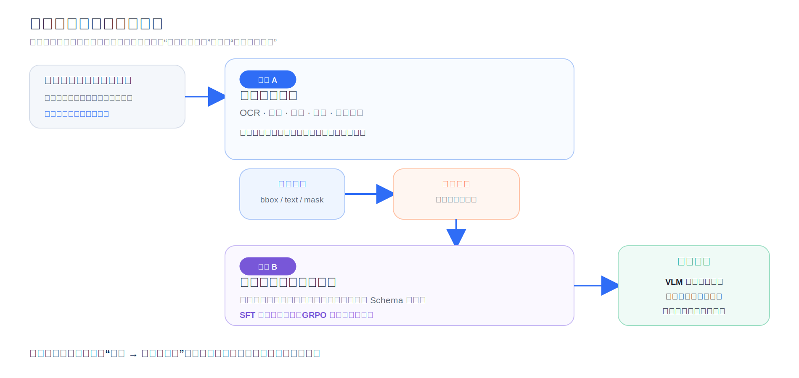
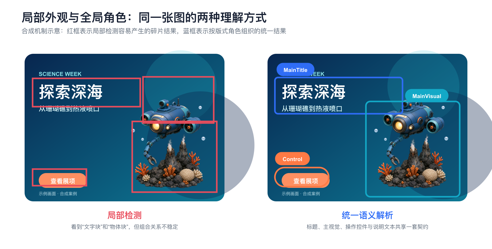
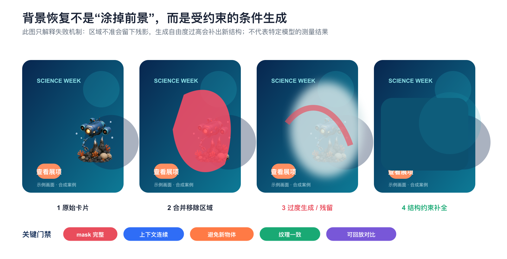
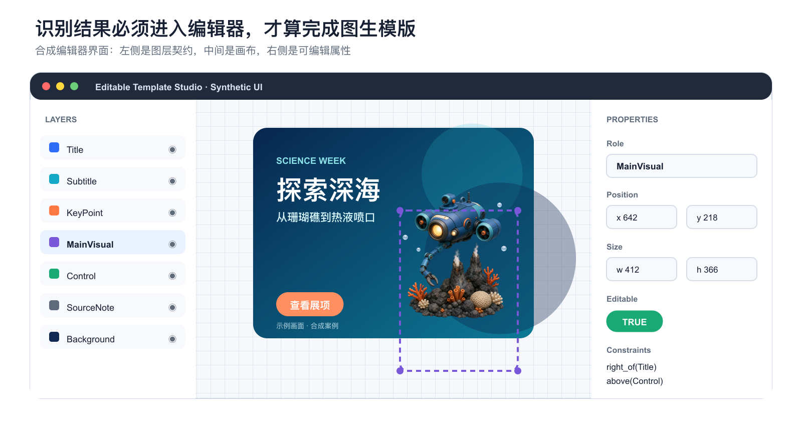
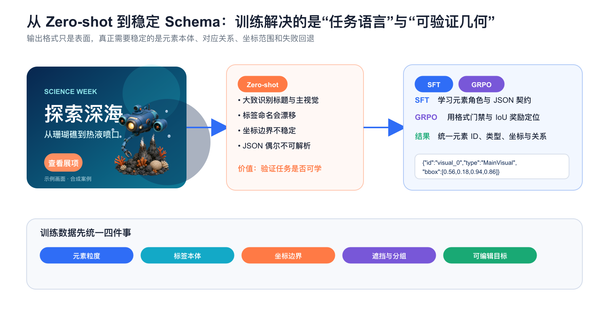
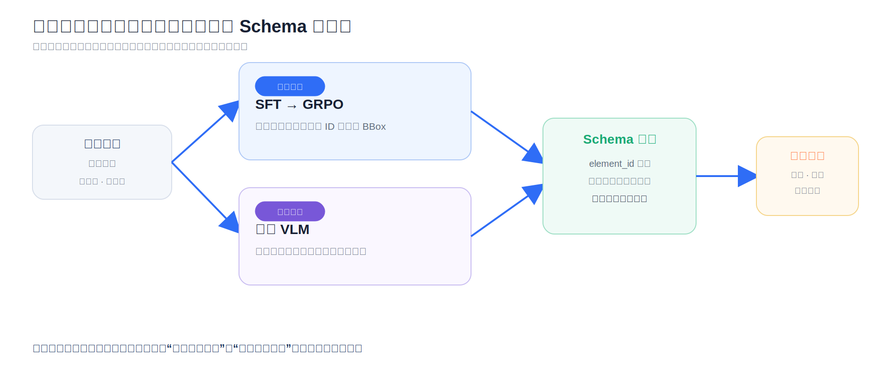
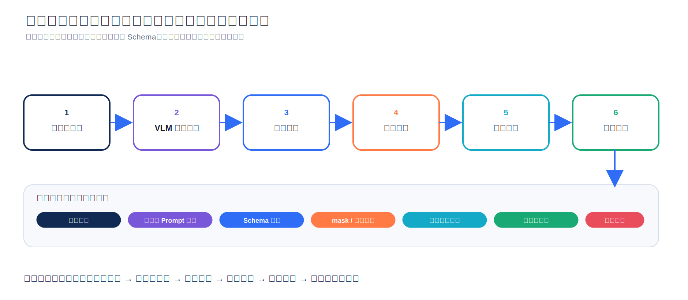

# 图生模版：从多模型工作流到端到端视觉语言模型



*图 1　图生模版的两条技术路线。早期路线先把文字、主视觉、控件、分割和背景恢复拆开；后续路线把元素角色、坐标、内容和关系收敛到统一 Schema。两者最终重新分工，而不是简单替换。本文确定性重绘。*

一张完成排版的视觉卡片，在计算机里通常只剩下一个像素矩阵；但在设计工具里，它原本是一组可以独立移动、改字、换色、隐藏和重排的对象。

“图生模版”要做的，就是把前者逆向恢复成后者。它不是让模型画一张相似图片，而是要回答一组更严格的问题：

- 哪些像素属于标题，哪些属于主视觉，哪些只是背景纹理？
- 同一块视觉资产应该整体保留，还是拆成多个可编辑子图层？
- 元素之间怎样对齐、分组、遮挡和约束？
- 删除前景后，背景怎样恢复，才不会留下残影或凭空长出新物体？
- 当标题变长、画布变窄时，模版还能不能继续编辑？

围绕这个目标，技术路线经历了一个看似矛盾、实际很自然的过程：**先把问题拆开，建立可运行闭环；再把理解任务重新合起来，减少语义冲突；最后把开放理解与确定性执行分层。**

## 阅读路线

- 如果只想理解演进结论，阅读“先说结论”“为什么工作流会遇到结构性上限”和“最后保留什么”。
- 如果关心算法机制，重点阅读场景图表示、Inpainting、SFT、GRPO 与 IoU 奖励。
- 如果准备实现类似系统，重点阅读两个合成案例、生产架构和评测阶梯。

> [!note] 公开重构与证据边界
> - 本文不使用原始材料中的组织名称、行业场景、界面截图、历史指标或专有接口。
> - 图 2 至图 9 使用原创科学主题主视觉与确定性排版构造，用于暴露检测、擦除、分层和重排问题；它们是机制案例，不是模型评测截图。
> - Qwen2.5-VL、Grounding DINO、SAM 2、LaMa、FLUX.1 Fill 与 GRPO 的机制只引用公开论文或官方资料。
> - 文章日期锚定在 2025 年 8 月的技术阶段；公开资料于 2026-07-23 复核。后来的能力不反写成当时已经具备的事实。

### 视觉证据清单

| 图 | 叙事职责 | 来源与处理 |
|---|---|---|
| 图 1、6、10 | 解释路线、双支路和生产责任边界 | 本文依据公开机制确定性重绘 |
| 图 2、5、9 | 解释局部检测、统一 Schema 与跨版式结构 | 原创合成卡片与确定性标注 |
| 图 3 | 解释 mask 错误、残影与生成过度 | 合成机制示意，不表示实测结果 |
| 图 4 | 证明终点是图层编辑器而非平面图片 | 原创合成编辑器界面 |
| 图 7、8 | 验证改字、移动、隐藏、重排和资产粒度 | 主视觉由内置图像生成能力生成，排版与标注确定性绘制 |

## 先说结论：真正升级的是中间表示

多模型工作流通常先得到一组彼此独立的局部结果：

```text
text_boxes + main_visual_bbox + control_bbox + masks + restored_background
```

视觉语言模型路线希望直接得到一份统一的设计契约：

```text
canvas
├── element(type=Title, text=..., bbox=..., style=...)
├── element(type=Subtitle, text=..., bbox=..., style=...)
├── element(type=MainVisual, bbox=..., mask=..., style=...)
├── element(type=Control, text=..., bbox=..., style=...)
├── element(type=SourceNote, text=..., bbox=...)
└── relations(z_order, group, alignment, overlap, mask_scope)
```

前者回答“各模块分别找到了什么”，后者开始回答“这张图由什么设计结构组成”。演进的本质，是把系统从**局部工具结果拼接**推向**统一场景图解析**。

这并不意味着 OCR、分割、背景恢复和图层写入消失了。更准确的分工是：

> 视觉语言模型负责开放语义理解；Schema 把理解变成可执行契约；专用工具负责像素级执行；编辑器负责最终可用性验收。

## 1　先定义任务：从像素恢复可编辑场景图

设输入卡片为：

$$
I \in \mathbb{R}^{H \times W \times 3}
$$

要恢复的模版不是另一张图片，而是一组结构化对象：

$$
\mathcal{T} = (\mathcal{C}, \mathcal{E}, \mathcal{R})
$$

其中：

- $\mathcal{C}$ 表示画布尺寸、背景和全局色调；
- $\mathcal{E}=\{e_i\}_{i=1}^{N}$ 表示元素集合；
- $\mathcal{R}$ 表示分组、对齐、遮挡、蒙版和层级关系。

每个元素可以写成：

$$
e_i=(c_i,b_i,m_i,t_i,s_i,z_i)
$$

- $c_i$：元素角色，例如 Title、MainVisual、Control；
- $b_i$：位置框；
- $m_i$：像素级 mask；
- $t_i$：可编辑文字；
- $s_i$：字体、字号、颜色、圆角、阴影等样式；
- $z_i$：图层顺序。

这个定义解释了为什么“检测框画得准”仍然不等于模版可用。检测通常只恢复 $(c_i,b_i)$；OCR 能补一部分 $t_i$；分割能补 $m_i$；但改字后会不会压住主视觉、两个元素该不该成组、背景能否独立替换，取决于 $s_i$、$z_i$ 和 $\mathcal{R}$。

最容易被忽略的是 $\mathcal{R}$。两个框都正确，不代表它们应该是两个独立资产；一块插画被完整抠出，也不代表原有遮挡关系能在移动后继续成立。图生模版最终是**逆向设计**，不只是逆向识别。

## 2　路线 A：多模型工作流为什么是合理起点

早期系统面对的是一组归纳偏置完全不同的子问题：

| 子任务 | 难点 | 合适的能力 |
|---|---|---|
| 图形标记 | 小、边缘细、形状必须保真 | 检测后保留区域图块 |
| 文字 | 密集、小字号、内容必须精确 | OCR 检测与识别 |
| 主视觉 | 外观开放，角色依赖全图 | 开放词汇检测或 VLM |
| 操作控件 | 长条、圆角、高对比 | 文本定位 + 精细分割 |
| 背景 | 删除前景后仍要纹理连续 | Inpainting / 对象移除 |
| 模版 | 必须恢复图层、顺序和属性 | 编辑器写入与可视化 |

把这些问题拆开有三个现实优势：

1. 每个阶段可以选最匹配的模型；
2. 标注、评测和替换可以按模块进行；
3. 错误更容易定位，系统能较快形成闭环。

这不是落后的架构，而是在不确定性很高时，把一个研究问题切成一组可交付接口。

### 2.1 OCR：识别字符串只是起点

OCR 通常先检测文字区域，再把图像转成字符序列。但模版还要恢复：

- 这是标题、副标题、操作文案还是来源说明；
- 文字框实际覆盖多大范围；
- 颜色、字号、行高和对齐方式是什么；
- 一行中是否混合多种颜色或字号；
- 背景恢复时应该删除哪些文字像素。

颜色估计是一个典型陷阱。对文字 crop 做 K-means 时，背景像素可能占据最大的聚类中心；缩小 crop 会截断笔画，放大 crop 又会引入更多背景。局部像素统计只能给候选答案，元素在整张卡片中的角色才提供更稳定的语义先验。

### 2.2 主视觉：局部外观不足以决定版式角色

主视觉可以是潜水器、望远镜、人物、建筑、器械或抽象插画。它们没有稳定的局部类别，真正稳定的是版式作用：面积较大、承担叙事、与标题形成视觉平衡，并常常跨越多个背景色块。



*图 2　局部外观与全局角色。两侧使用同一张原创合成卡片；红框和蓝框是确定性绘制的机制示意。它说明为何 MainVisual 更像“版式角色”而不是有限物体类别，不构成模型准确率比较。*

Qwen2.5-VL 与这类任务的匹配点，不只是模型规模。其公开资料强调了动态分辨率、不同长宽比输入、文字与页面布局理解、对象定位，以及用结构化格式输出坐标与属性的能力。这些能力与图生模版的输入输出天然接近。[Qwen2.5-VL 技术报告](https://arxiv.org/abs/2502.13923)与[官方发布说明](https://qwenlm.github.io/blog/qwen2.5-vl/)提供了模型侧依据。

### 2.3 操作控件：定位与分割是两个不同问题

圆角长条、胶囊形块和高对比区域可以先由开放词汇检测定位，再在候选框内细化 mask：

- Grounding DINO 把语言与开放集检测结合，回答“哪个区域符合描述”；
- SAM 2 接收框、点等提示，回答“这个区域里哪些像素属于目标”。

它们分别更接近场景图中的 $b_i$ 和 $m_i$。机制可参见 [Grounding DINO](https://arxiv.org/abs/2303.05499) 与 [SAM 2](https://arxiv.org/abs/2408.00714)。

### 2.4 背景恢复：删除前景是条件生成

将文字、主视觉和控件的 mask 合并后，背景恢复可以写成：

$$
\hat I_{\text{bg}}
=(1-M)\odot I+M\odot G(I,M,p)
$$

$M$ 是待移除区域，$G$ 是修复模型，$p$ 是可选条件。失败通常来自两个不同源头：

1. **区域错了**：前景没有覆盖完整，或误删相邻元素；
2. **生成错了**：空洞中出现新物体、色块断裂或纹理方向突变。



*图 3　背景恢复的失败机制。主视觉由内置图像生成能力生成，mask、残影和补全结果由确定性图形构造。此图用于解释区域错误与生成自由度，不代表 LaMa、FLUX.1 Fill 或其他模型的实测对比。*

LaMa 通过快速傅里叶卷积获得更大的有效感受野，并针对大 mask 和周期纹理设计训练方式，更偏向结构连续的背景补全。[LaMa 论文](https://arxiv.org/abs/2109.07161)

FLUX.1 Fill 属于掩码驱动的生成式 Inpainting，更擅长补出语义合理的新内容，但自由度也更高。[FLUX.1 Fill 官方文档](https://docs.us.bfl.ai/flux_tools/flux_1_fill)

工程上不应该先争论“哪个模型绝对更好”，而应先把失败分桶：

- mask 不完整：优先修正检测、分割和外扩策略；
- 大面积纹理断裂：需要更强全局上下文；
- 补出新物体：需要降低生成自由度或增加对象移除约束；
- 颜色与噪声不连续：需要边界融合和结构校验。

### 2.5 终点必须是编辑器

如果系统只输出一张重绘后的平面图片，就没有完成图生模版。真正的闭环是把 Title、Subtitle、MainVisual、Control、SourceNote 和 Background 写入独立图层，并保留位置、尺寸、文本和关系约束。



*图 4　合成编辑器界面。所有界面元素和数据均为本文构造，用来说明“识别演示”与“可编辑模版”之间的距离；不对应任何真实软件。*

到了这一步，系统验收问题才从“框准不准”升级为：

- 标题能否改成两行？
- 主视觉能否单独移动？
- 操作控件隐藏后，背景是否完整？
- 图层顺序调整后，遮挡关系是否仍然合法？
- 切换横竖版时，元素能否依据约束重排？

## 3　为什么工作流会遇到结构性上限

设工作流中第 $i$ 个必要阶段成功的事件为 $A_i$。完整模版可用需要多个事件同时成立：

$$
P(\text{usable})=P\left(\bigcap_{i=1}^{K}A_i\right)
$$

若只为建立直觉，粗略假设各阶段独立：

$$
P(\text{usable})\approx \prod_{i=1}^{K}P(A_i)
$$

这个近似不能直接拿真实单项结果相乘，因为模块错误往往高度相关；但它揭示了系统结构：阶段越多，任一关键阶段失败都可能让整体不可用。

更麻烦的是错误会沿接口传播：

- OCR 框偏大会扩大背景移除区域；
- 主视觉漏检会让插画烙在背景里；
- 主视觉框过大会吞入标题；
- 修复模型补出的新结构可能被下游当成真实元素；
- 多个模块对同一像素给出不同归属时，没有统一裁决者。

因此，上限不只来自模型能力，也来自**系统怎样组织误差**。

多模型路线还有三个长期难题：

1. **开放外观对有限类别**：视觉风格持续变化，新增对象不断推动新数据和新类别；
2. **局部外观对全局角色**：MainVisual、Decoration、Background 等角色依赖整张卡片；
3. **独立框对关系结构**：重叠、组合、层级和编辑约束跨越多个检测结果。

第二条路线于是换了问题：不再逐一追问“怎样让每个检测器更准”，而是先让一个模型对整张卡片形成统一理解，再把专用工具变成按结构执行的能力。

## 4　路线 B：把卡片解构改写为统一视觉语言任务

这里的“端到端”要精确定义：它统一的是**图片到结构化理解**，不是从图片到最终编辑文件的全部步骤。

模型需要一次输出：

- 整张卡片的内容、风格、色调和布局；
- 每个元素的角色、内容、属性和位置；
- 元素之间的分组、对齐、遮挡与层级草案；
- 一份下游可以稳定解析的 JSON。

### 4.1 Zero-shot 的价值是验证任务是否可学

通用 VLM 在不微调时，通常已经能大致指出标题、主视觉和操作区域。这说明预训练中的图文、页面与定位能力可以迁移到卡片解构。

但 Zero-shot 也会暴露两类关键错误：

1. **标签漂移**：同类元素可能被叫作 title、heading、caption 或 text block；
2. **几何漂移**：模型知道对象大致在哪里，但框会切掉边缘、吞入邻居或超出画布。

Prompt 可以减少格式漂移，却很难稳定写入一套严格的元素本体。因此训练通常分成两步：SFT 先教模型“什么是正确回答”，GRPO 再优化“哪种回答在可验证指标上更好”。



*图 5　从 Zero-shot 到稳定 Schema。卡片、示例字段和错误说明均为本文合成。图中只表达训练目标分工，不代表特定训练轮次的实际输出。*

### 4.2 JSON 不是展示格式，而是系统契约

一份最小可用输出可以是：

```json
{
  "canvas": {"width": 1200, "height": 628},
  "elements": [
    {
      "id": "title_0",
      "type": "Title",
      "text": "探索深海",
      "bbox": [58, 91, 578, 203],
      "editable": true
    },
    {
      "id": "visual_0",
      "type": "MainVisual",
      "bbox": [642, 48, 1052, 458],
      "editable": true
    }
  ],
  "relations": [
    {"type": "right_of", "source": "visual_0", "target": "title_0"}
  ]
}
```

坐标最好同时保留原始尺寸和归一化形式：

$$
\tilde b_i=
\left[
\frac{x_1}{W},
\frac{y_1}{H},
\frac{x_2}{W},
\frac{y_2}{H}
\right]
$$

归一化有助于跨分辨率校验，但不能替代响应式约束。横版变竖版时，真正需要的是锚点、间距、对齐和分组，而不是简单按比例缩放绝对坐标。

Schema 还必须明确：

- 重复元素怎样获得稳定 ID；
- BBox 是否包含阴影和外发光；
- 组合主视觉算一个元素还是多个元素；
- 被遮挡对象是否分别标注；
- 文字框按可见像素还是按排版框计算；
- 哪些图层允许移动、改字、隐藏或替换。

如果这些定义不一致，模型学到的不是开放理解，而是标注分歧。

## 5　SFT：让模型学会任务的语言

给定图片 $I$、指令 $q$ 和标准结构序列 $y$，SFT 的核心仍是条件语言建模：

$$
\mathcal{L}_{\text{SFT}}
=-\sum_{t=1}^{|y|}
\log p_\theta(y_t\mid I,q,y_{<t})
$$

在图生模版中，SFT 同时教三件事：

1. **元素本体**：Title、Subtitle、MainVisual、Control、SourceNote 分别指什么；
2. **输出语法**：字段、列表和坐标怎样稳定排列；
3. **图文绑定**：哪段文字、哪个视觉区域对应哪个角色。

所以 SFT 不只是让模型更听指令，它把团队对设计结构的定义写进模型分布。

但 SFT 会忠实学习脏数据。数据量少时，继续堆训练步数不如先固定标注规范：

- 重复要点怎样编号；
- 阴影算样式还是独立图层；
- 主视觉跨过文字区时，框和 mask 怎样定义；
- 横版与竖版是否共享同一套角色；
- 编辑目标是否要求拆分组合资产。

## 6　GRPO：把“位置更准”改写为可验证奖励

位置有明确参考答案，因此可以用 IoU：

$$
\operatorname{IoU}(B,\hat B)
=
\frac{|B\cap \hat B|}{|B\cup \hat B|}
$$

但不能对任意输出直接求 IoU。合理奖励要先经过格式与集合门禁：

$$
r(o)=
\mathbf{1}_{\text{parse}}
\cdot
\mathbf{1}_{\text{count}}
\cdot
\mathbf{1}_{\text{labels}}
\cdot
\frac{1}{N}\sum_{i=1}^{N}
\operatorname{IoU}(B_i,\hat B_i)
$$

只有输出可解析、元素数量一致、元素 ID 与角色对齐，位置奖励才有意义。

GRPO 对同一输入采样一组回答，根据组内相对奖励构造优势。若奖励为 $r_1,\ldots,r_G$，可写成：

$$
\hat A_i=
\frac{r_i-\operatorname{mean}(r)}
{\operatorname{std}(r)+\epsilon}
$$

这种方法不需要单独训练价值模型，并让格式、集合和几何奖励直接推动策略更新。GRPO 的系统介绍可参见 [DeepSeekMath](https://arxiv.org/abs/2402.03300)。

一个强调稳定元素 ID 的奖励骨架如下：

```python
from __future__ import annotations

from dataclasses import dataclass


@dataclass(frozen=True)
class Element:
    element_id: str
    element_type: str
    bbox: tuple[float, float, float, float]


def iou(a: Element, b: Element) -> float:
    ax1, ay1, ax2, ay2 = a.bbox
    bx1, by1, bx2, by2 = b.bbox
    iw = max(0.0, min(ax2, bx2) - max(ax1, bx1))
    ih = max(0.0, min(ay2, by2) - max(ay1, by1))
    intersection = iw * ih
    area_a = max(0.0, ax2 - ax1) * max(0.0, ay2 - ay1)
    area_b = max(0.0, bx2 - bx1) * max(0.0, by2 - by1)
    union = area_a + area_b - intersection
    return 0.0 if union <= 0.0 else intersection / union


def coordinate_reward(
    prediction: list[Element],
    reference: list[Element],
) -> float:
    pred = {item.element_id: item for item in prediction}
    truth = {item.element_id: item for item in reference}

    if pred.keys() != truth.keys():
        return 0.0
    if any(pred[key].element_type != truth[key].element_type for key in truth):
        return 0.0

    return sum(iou(pred[key], truth[key]) for key in truth) / len(truth)
```

仅奖励平均 IoU 仍有四个盲点：

1. 小元素偏几个像素，IoU 就会大幅变化；
2. 大元素可能掩盖多个小元素失败；
3. 框很准但角色错，模版仍不可用；
4. 平均 IoU 无法表达分组、遮挡和层级。

因此，几何奖励应当是质量门禁的一部分，而不是整个系统的唯一目标。

## 7　三种训练路径与双支路

常见训练路径对应三种不同假设：

| 路径 | 学习方式 | 优点 | 风险 |
|---|---|---|---|
| 全 GRPO | 一次输出元素与坐标 | 直接优化完整任务 | 语义错和坐标错共享稀疏奖励 |
| SFT → 同数据 GRPO | 先模仿，再优化几何 | 更容易进入正确输出分布 | 可能继承 SFT 数据偏差 |
| SFT → 分轮 GRPO | 先识别元素，再回归坐标 | 奖励集中，错误更容易归因 | 两轮误差仍会传播 |

如果标签本体尚未稳定，先 SFT 再做几何奖励通常更可解释；如果标注已经干净、格式完全可验证，联合优化才更有机会减少多轮误差。

另一个实用设计是双支路：

- 位置支路用 SFT 与 GRPO 强化角色集合、元素 ID 和精确坐标；
- 内容支路保留通用 VLM 对内容、色调、风格和版式关系的理解；
- 两路在 Schema 层按元素 ID 融合，并通过冲突门禁。



*图 6　双支路机制。开放描述允许多种正确表达，坐标则可用几何奖励验证；两类目标在 Schema 层融合。本文依据公开训练机制确定性重绘。*

双支路并不自动解决问题，它引入了新的契约：

- 两路元素集合不一致时谁优先；
- 同名元素如何用稳定 ID 对齐；
- 坐标冲突怎样裁决；
- 融合失败是否重试或回退；
- 两路版本变化是否进入同一回归测试。

只有这些问题被显式记录，双路才是架构，而不是两段输出字符串的临时拼接。

## 8　两个合成案例：怎样证明模版真的可编辑

案例不应该只展示“框都画出来了”。更有说服力的验证是：对恢复结果执行真实编辑动作，检查其他图层是否保持稳定。

### 8.1 横版卡片：改字、移动与层级保持


*图 7　合成横版案例。潜水器主视觉由内置图像生成能力生成；文字、框选、图层变体由确定性排版生成。案例不对应真实活动。*

这个案例把标题和副标题放在相邻区域，主视觉位于右侧，并让图形越过背景色块边界。它可以验证三个层次：

- **识别层**：是否找出 Title、Subtitle、MainVisual、Control 与 SourceNote；
- **几何层**：框是否吞入邻近文字，圆角控件是否完整；
- **编辑层**：标题变长后是否挤压主视觉，移动主视觉后是否破坏层级。

如果系统只有 BBox，第三层无法通过。只有保留文字属性、相对约束和 z-order，“替换标题”才不是重新生成整张图。

### 8.2 竖版卡片：组合主视觉的资产粒度


*图 8　合成竖版案例。望远镜、月牙、星图球和装饰星由内置图像生成能力生成；卡片与说明为确定性排版。案例不对应真实活动。*

这里最难的不是找框，而是定义资产粒度：

- 望远镜、月牙和星图球应该整体作为一个 MainVisual，还是拆成多个图层？
- 装饰星属于主视觉、背景，还是可复用装饰？
- 如果月牙遮住望远镜支架，mask 和 z-order 怎样表达？

答案取决于后续编辑目标。如果只需要整体替换，合成一个资产更稳；如果需要隐藏月牙或替换星图球，分层更有价值。

因此，**可编辑粒度是系统契约，不是纯视觉真理**。标注规范不能只由“视觉上能否分开”决定，还要由“之后想怎样编辑”决定。

## 9　为什么统一解析更适合开放版式

没有公开、可复算的统一结果时，不应该用合成图宣称准确率提升。但从任务结构可以推导出四条明确因果链。

### 9.1 全局上下文解决角色依赖

标题、操作文案和来源说明都可能只是矩形文字块；MainVisual 和背景装饰也可能采用相同画风。局部检测器看外观，VLM 同时看文字内容、相对位置、视觉权重和整体布局，因此更适合判断版式角色。

### 9.2 统一输出减少跨模块对齐

旧工作流的模块各自维护类别、坐标和置信度定义。统一 JSON 把元素角色、内容、位置和关系放进同一回答，减少重复消歧，也让错误样本能以同一种格式进入回归集。

### 9.3 新版式不再等价于新增物体类别

通用 VLM 已经接触过大量图文、文档、界面和布局。新卡片仍可能失败，但系统不必为每一种主视觉外观创建专属检测类别；训练可以更集中地稳定元素本体和坐标。

### 9.4 更好的责任边界比“全部交给模型”更重要

VLM 仍可能：

- 输出非法 JSON；
- 漏掉极小文字；
- 产生坐标偏移；
- 对组合元素粒度判断不一致；
- 同一图片多次推理出现差异。

因此，统一解析的意义不是取代软件，而是把开放理解集中到一个语义中枢，再由 Schema、OCR、分割、Inpainting、编辑器和质量门禁完成确定性工作。


*图 9　跨版式合成覆盖。四张卡片共享元素角色与关系定义，而坐标、字号、间距和裁切策略随画布改变。图片只说明统一 Schema 的结构价值，不提供准确率结论。*

## 10　生产架构：模型应该放在什么位置



*图 10　推荐生产架构。开放理解、确定性执行和可编辑验收分别由最合适的组件承担；每层都留下版本与回放证据。本文确定性重绘。*

一条稳健链路可以分成六层：

1. **输入规范化**：校验尺寸、方向、色彩空间、清晰度和隐私；
2. **语义解析**：VLM 输出元素角色、内容、位置、样式和关系草案；
3. **契约门禁**：检查 Schema、坐标边界、重复 ID、必选元素和冲突框；
4. **工具执行**：OCR 强校验文字，分割细化 mask，Inpainting 恢复背景；
5. **模版写入**：创建图层、文本属性、分组、蒙版和层级；
6. **编辑验收**：自动回放改字、隐藏、移动、替换和重排操作。

生产代码最重要的不是调用一次模型，而是输出进入工具前的校验：

```python
from __future__ import annotations

from dataclasses import dataclass


@dataclass(frozen=True)
class ParsedElement:
    element_id: str
    element_type: str
    bbox: tuple[int, int, int, int]
    text: str | None = None


REQUIRED_TYPES = {"Title", "MainVisual"}
TEXT_TYPES = {"Title", "Subtitle", "Control", "SourceNote"}


def validate_elements(
    elements: list[ParsedElement],
    width: int,
    height: int,
) -> list[str]:
    errors: list[str] = []
    ids = [item.element_id for item in elements]
    if len(ids) != len(set(ids)):
        errors.append("duplicate element_id")

    present = {item.element_type for item in elements}
    missing = REQUIRED_TYPES - present
    if missing:
        errors.append(f"missing required types: {sorted(missing)}")

    for item in elements:
        x1, y1, x2, y2 = item.bbox
        if not (0 <= x1 < x2 <= width and 0 <= y1 < y2 <= height):
            errors.append(f"{item.element_id}: bbox out of bounds")
        if item.element_type in TEXT_TYPES and not item.text:
            errors.append(f"{item.element_id}: missing text")

    return errors


def route_result(errors: list[str]) -> str:
    if not errors:
        return "continue_to_tools"
    if len(errors) <= 2:
        return "retry_parser_with_feedback"
    return "fallback_or_manual_review"
```

真实系统还应记录模型版本、Prompt 版本、Schema 版本、输入哈希、重试次数、工具输出和最终编辑结果。否则“看起来更好”无法沉淀成可复现的工程结论。

## 11　评测要从 IoU 走到“下一步能否完成”

最合理的评测不是一个总分，而是一座逐层收紧的阶梯：

| 层级 | 核心问题 | 建议指标 |
|---|---|---|
| 结构合法 | 输出能否进入系统 | JSON 解析率、Schema 通过率、字段缺失率 |
| 元素完整 | 应有元素是否齐全 | 分角色 Precision / Recall、重复框率、漏检率 |
| 语义正确 | 元素角色是否标错 | 混淆矩阵、组合元素专项集 |
| 几何准确 | 框与 mask 是否可用 | 分角色 IoU、边界误差、mask IoU、小元素专项 |
| 内容保真 | 文字与数字是否改变 | OCR Exact Match、日期与数值强校验 |
| 图层正确 | 遮挡和组合是否合理 | z-order、group、mask_scope、背景残留 |
| 可编辑 | 修改后能否继续工作 | 隐藏、移动、替换、改字、重排成功率 |
| 系统稳定 | 链路能否可靠运行 | 延迟 P50/P95、重试率、回退率、重复一致性 |

回归集也要按失败机制分桶，而不是只随机抽样：

- 横版、竖版和极端长宽比；
- 纯文字、图文混排和多主视觉；
- 浅色、深色、渐变和纹理背景；
- 小字号密集说明；
- 文字压图、图压文字和复杂蒙版；
- 新插画风格与未见对象；
- 组合主视觉与可拆分装饰。

最后一层验收可以很朴素：自动执行一组编辑动作——改标题、隐藏主视觉、移动控件、替换副标题、切换横竖版——然后检查输出是否仍是一张合法视觉卡片。只有这样，指标才真正对齐“图生模版”。

## 12　最后保留什么

多模型工作流并没有被端到端模型否定。它留下了非常耐用的能力：

1. OCR、检测、分割、Inpainting 和模版写入工具；
2. 可分桶的失败样本与单项评测；
3. 背景恢复、小字处理和边缘保真的经验；
4. 编辑器与真实操作闭环；
5. 统一解析失败时的回退路径。

视觉语言模型路线则建立了新的中枢：

1. 稳定的元素本体；
2. 角色、坐标、内容、样式和关系的统一 Schema；
3. SFT 所需的任务样本格式；
4. GRPO 可使用的格式、集合与几何奖励；
5. 能跨版式积累的统一回归集。

整次演进最值得沉淀的判断是：

> 图生模版的核心，不是拥有多少个检测模型，也不是押中某一个视觉语言模型；而是能否把“不可编辑像素”稳定地转换为“语义明确、几何足够准确、工具可以执行、读者真的能改”的设计契约。

模型会继续变化，Qwen2.5-VL 也不会是最后一个解析中枢。但只要元素本体、Schema、评测阶梯、工具接口和编辑闭环稳定，系统就能替换理解模型，而不必推倒重来。

## 公开资料

- [Qwen2.5-VL Technical Report](https://arxiv.org/abs/2502.13923)
- [Qwen2.5-VL 官方发布说明](https://qwenlm.github.io/blog/qwen2.5-vl/)
- [Grounding DINO: Marrying DINO with Grounded Pre-Training for Open-Set Object Detection](https://arxiv.org/abs/2303.05499)
- [SAM 2: Segment Anything in Images and Videos](https://arxiv.org/abs/2408.00714)
- [Resolution-robust Large Mask Inpainting with Fourier Convolutions](https://arxiv.org/abs/2109.07161)
- [FLUX.1 Fill 官方文档](https://docs.us.bfl.ai/flux_tools/flux_1_fill)
- [DeepSeekMath: Pushing the Limits of Mathematical Reasoning in Open Language Models](https://arxiv.org/abs/2402.03300)
