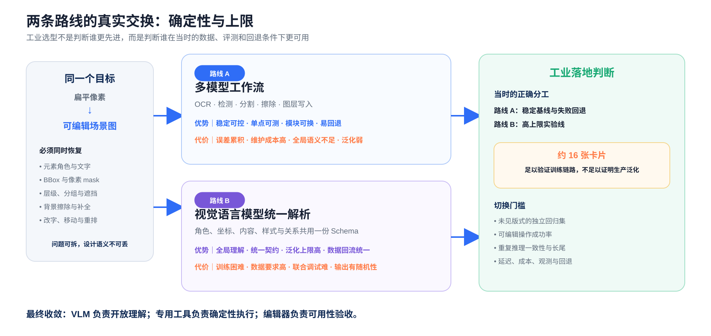
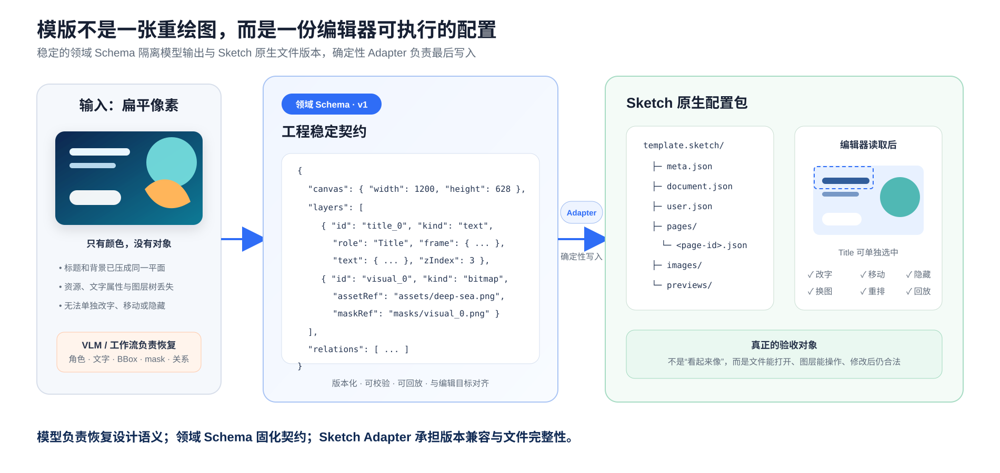
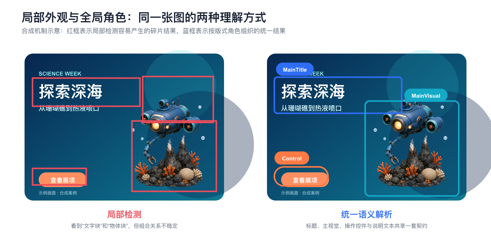
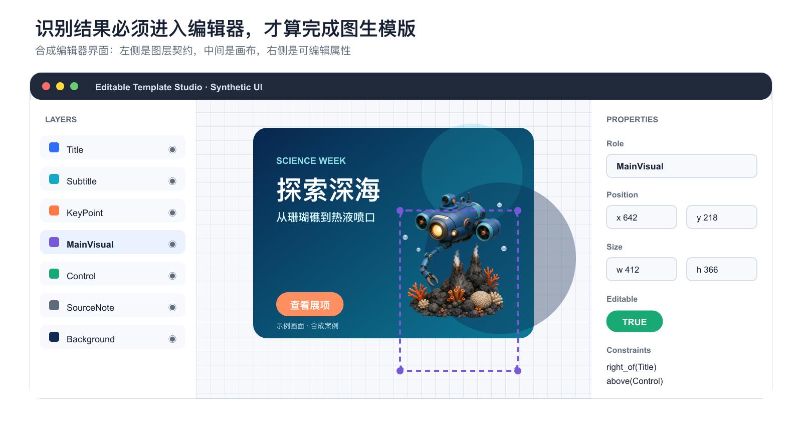
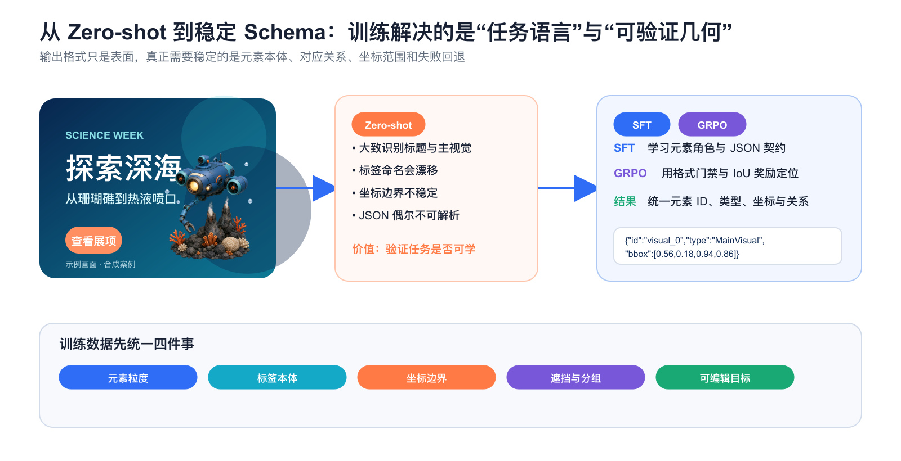
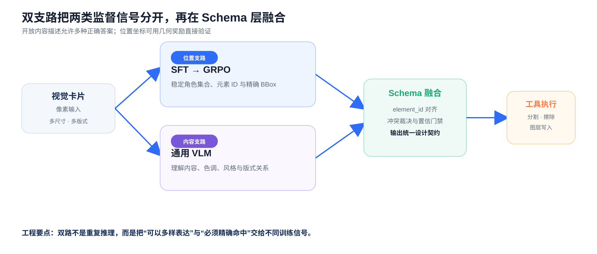
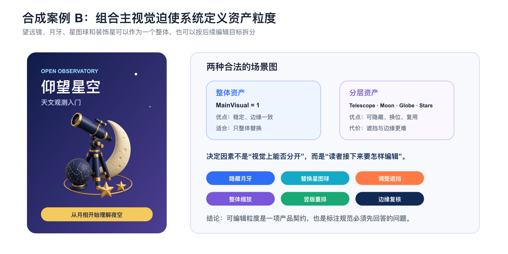
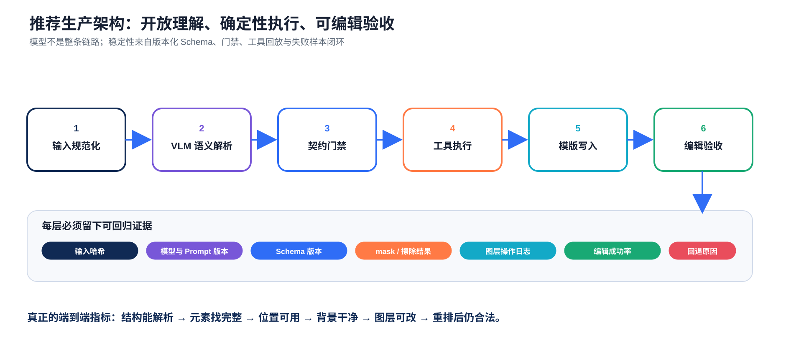
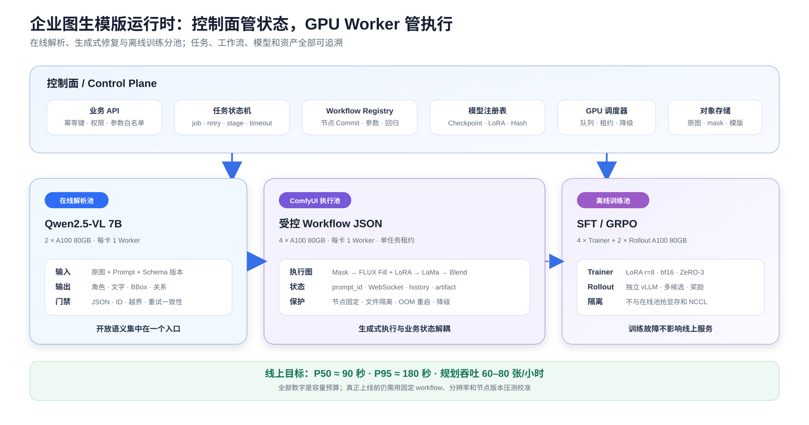

# 图生模版：从多模型工作流到端到端视觉语言模型



*图 1　两条路线交换的是确定性与上限。多模型工作流更容易建立稳定基线，但会累积误差和维护成本；统一解析能利用全图语义，但对数据、契约和评测的要求更高。本文确定性重绘。*

一张完成排版的视觉卡片，在计算机里通常只剩下一个像素矩阵；但在设计工具里，它原本是一组可以独立移动、改字、换色、隐藏和重排的对象。

“图生模版”要做的，就是把前者逆向恢复成后者。它不是让模型画一张相似图片，而是要回答一组更严格的问题：

- 哪些像素属于标题，哪些属于主视觉，哪些只是背景纹理？
- 同一块视觉资产应该整体保留，还是拆成多个可编辑子图层？
- 元素之间怎样对齐、分组、遮挡和约束？
- 删除前景后，背景怎样恢复，才不会留下残影或凭空长出新物体？
- 当标题变长、画布变窄时，模版还能不能继续编辑？

## 模版到底是什么：一份编辑器可以执行的配置包

“恢复成可编辑对象”仍然有些抽象。把验收终点说得更具体：这个项目交付的模版，本质上是一份 **Sketch 可以打开的配置型文件**。它不只保存最后看到的画面，还保存画布、页面、图层树、文本内容、资源引用、位置尺寸、样式、可见性、缩放约束和层级顺序。编辑器读取这份配置，才知道用户点击的是标题而不是一块像素，移动的是主视觉而不是整张图。

Sketch 官方文件格式说明给出了它的物理形态：一个 `.sketch` 文件实际是包含 JSON 与二进制资源的 ZIP 包。典型目录如下：[Sketch File Format](https://developer.sketch.com/file-format/)

```text
template.sketch
├── meta.json                 # 文件格式版本、Sketch 版本、页面与字体元数据
├── document.json             # 跨页面共享样式、资源索引和页面引用
├── user.json                 # 画布视口、缩放、面板等编辑器状态
├── pages/
│   └── <page-id>.json        # 真正的页面与图层树
├── images/
│   └── <asset-id>.png        # 位图原始资源
└── previews/
    └── preview.png           # 文档预览图
```

其中，`pages/<page-id>.json` 才接近人们直觉里的“模版 Schema”。下面不是另造的一套展示 JSON，而是按 Sketch 官方 Schema 的真实字段层级，投影出本任务最关心的文本层与位图层；完整文件还会包含更多公共字段、样式对象与版本信息。

```json
{
  "_class": "page",
  "layers": [
    {
      "_class": "text",
      "do_objectID": "6A62C37E-8B32-4C6C-A96F-FA9A394ACD58",
      "name": "Title",
      "frame": {
        "_class": "rect",
        "x": 58,
        "y": 91,
        "width": 520,
        "height": 112
      },
      "attributedString": {
        "_class": "attributedString",
        "string": "探索深海",
        "attributes": [
          {
            "_class": "stringAttribute",
            "location": 0,
            "length": 4,
            "attributes": {
              "MSAttributedStringFontAttribute": {
                "_class": "fontDescriptor",
                "attributes": {"name": "PingFangSC-Semibold", "size": 64}
              },
              "MSAttributedStringColorAttribute": {
                "_class": "color",
                "alpha": 1,
                "red": 0.92,
                "green": 0.97,
                "blue": 1
              }
            }
          }
        ]
      },
      "resizingConstraint": 45,
      "rotation": 0,
      "isVisible": true
    },
    {
      "_class": "bitmap",
      "do_objectID": "12A9C244-271B-4C82-8964-C8C82951C09A",
      "name": "MainVisual",
      "frame": {
        "_class": "rect",
        "x": 642,
        "y": 48,
        "width": 410,
        "height": 410
      },
      "image": {
        "_class": "MSJSONFileReference",
        "_ref_class": "MSImageData",
        "_ref": "images/deep-sea.png"
      },
      "resizingConstraint": 63,
      "rotation": 0,
      "isVisible": true
    }
  ]
}
```

这份节选已经说明几个关键事实：`frame` 描述图层相对父容器的位置与尺寸；文本不是一张文字截图，而是 `attributedString` 加字体、字号与颜色；位图层不内嵌整张卡片，而是通过 `_ref` 指向独立资源；`layers` 的树形结构、顺序和约束共同决定分组、遮挡与缩放行为。Sketch 还明确规定，图层 frame 使用相对父容器的绝对值，形状内部的点才使用归一化坐标；两种坐标不能混为一谈。[Sketch Coordinate Systems](https://developer.sketch.com/file-format/coordinate-systems)

但是，让 VLM 直接生成整份原生 Sketch JSON 并不是稳健方案。原生格式字段多、冗余大，而且带有明确的文档版本与兼容版本；模型只要漏掉一个必要对象，整个文件就可能无法打开。更合理的系统分成三层：

1. **模型解析结果**：角色、文字、BBox、样式线索和关系草案；
2. **领域模版 Schema**：稳定 ID、画布、图层、资产、约束和关系，是算法与工程共同维护的版本化契约；
3. **Sketch 原生文件**：由确定性 Adapter 把领域 Schema 写成指定版本的 `document.json`、页面 JSON 和资源包。



*图 2　模版的三层形态。模型输出任务相关的最小结构，领域 Schema 隔离业务语义与 Sketch 版本，确定性 Adapter 负责生成编辑器真正消费的配置包。本文依据 Sketch 官方文件格式确定性重绘。*

领域 Schema 可以采用下面这种配置形态。它比模型的原始回答完整，又比 Sketch 原生 JSON 稳定，适合作为两个技术路线共同对齐的交付契约：

```json
{
  "schemaVersion": "image-template/v1",
  "canvas": {"width": 1200, "height": 628, "backgroundAsset": "bg_0"},
  "layers": [
    {
      "id": "title_0",
      "kind": "text",
      "role": "Title",
      "frame": {"x": 58, "y": 91, "width": 520, "height": 112},
      "text": {
        "value": "探索深海",
        "fontFamily": "PingFang SC",
        "fontSize": 64,
        "lineHeight": 72,
        "align": "left"
      },
      "style": {"fills": [{"type": "color", "value": "#EAF7FF"}], "opacity": 1},
      "constraints": {"pin": ["left", "top"], "resize": "fixed"},
      "zIndex": 3
    },
    {
      "id": "visual_0",
      "kind": "bitmap",
      "role": "MainVisual",
      "frame": {"x": 642, "y": 48, "width": 410, "height": 410},
      "assetRef": "assets/deep-sea.png",
      "maskRef": "masks/visual_0.png",
      "constraints": {"pin": ["right", "top"], "resize": "proportional"},
      "zIndex": 2
    }
  ],
  "relations": [
    {"type": "right_of", "source": "visual_0", "target": "title_0"}
  ]
}
```

从这个交付物再回看演进，脉络会自然很多：早期工作流让各模块分别贡献文字、图块、mask 和背景，再拼成这份配置；端到端路线则先统一理解整张图，直接产出更接近领域 Schema 的结构，然后继续调用确定性工具和 Sketch Adapter。

围绕同一份模版交付物，技术路线经历了一个看似矛盾、实际很自然的过程：**先把问题拆开，用专用模型建立可运行闭环；再把理解任务重新合起来，用视觉语言模型提高开放版式的理解上限；最后保留工作流里经过验证的确定性工具。**

## 两条路线的真实权衡：确定性、成本与上限

多模型工作流的“稳定”，不是指它已经能正确处理每一张图，而是指**失败边界比较清楚**：OCR 错了可以单独回归，主视觉漏检可以单独换模型，背景擦除失败可以单独调 mask 或 Inpainting。它把一个高不确定性的视觉问题，工程化成一组可测、可换、可回退的局部问题。在需要尽快建立可编辑闭环时，这是非常实际的优势。

但这种稳定性是用系统复杂度换来的。每一个模块都有自己的数据、标签、模型版本、阈值和运行依赖；模块之间还要对齐坐标、类别、置信度和图像区域。链路越长，误差越容易传给下游，而维护成本会随接口数量增长。更重要的是，当大模型只被当成“某一阶段的更强检测器”时，它对整张图的文字、布局、视觉重心和元素关系并没有被充分利用，有限类别的检测器也难以覆盖持续出现的新版式。

端到端路线做了相反的取舍：它让模型一次看完整张卡片，在同一个 Schema 里联合判断元素角色、文字、坐标和关系。这一路线的上限更高，因为它能复用预训练 VLM 已经学到的图文与版式知识，也能把失败样本统一沉淀成“图片 + 标准结构”。但它的训练更难：元素本体、JSON 语法、BBox、组合粒度和层级关系一旦同时学习，任何一处标注不一致都可能被放大；大模型输出的随机性，也会增加重复性、调试和回归难度。

它带来的工程收益也不只是“少部署几个模型”。旧链路需要分别维护 OCR 分类规则、检测标签、Prompt、阈值、坐标转换、图像裁切和模块间胶水；统一解析后，开放语义判断收敛到一个可版本化的解析器与领域 Schema，失败样本、标注规范和回归集也能共用同一契约。专用像素工具仍然存在，但语义接口的数量大幅减少，因此**工程资源链路的可维护性上限明显提高**：团队可以把资源从反复适配模块接口，转向持续改善同一套数据契约、解析模型和验收体系。

| 工业维度 | 多模型工作流 | 端到端统一解析 |
|---|---|---|
| 主要优势 | 责任清楚；单模块可评测、替换和回退；易建立稳定基线 | 充分利用全图上下文；元素与坐标共享 Schema；对开放版式的上限更高 |
| 主要代价 | 误差累积；数据、模型和接口的维护成本高；全局语义利用不足；泛化弱 | 训练数据和标注契约要求高；语义、格式和几何联合优化难；失败较难定位；输出不完全确定 |
| 可维护性上限 | 单模块可换，但接口、阈值、数据和运行依赖随模块数增长 | 语义判断、失败数据与评测收敛到统一契约；确定性工具通过稳定 Adapter 接入 |
| 更适合的阶段 | 需要快速建立闭环、要求可观测与可回退 | 元素契约已稳定、有独立评测集、有持续失败数据回流 |
| 主要风险 | 局部指标不差，整体模版却因串联失败不可用 | 版式覆盖不足时记住坐标分布，离线奖励很高，未见样本却失败 |

当时最稳妥的工业判断，不是立即用端到端模型替掉整条工作流，而是让两条线分工：**多模型工作流继续作为稳定基线和失败回退；端到端模型作为高上限的理解层，先在离线和影子流程里证明泛化，再逐步接管。**

两条路线当时拥有的证据成熟度也不对称：工作流已经进入编辑器闭环，并在 120 张历史卡片上做过分项验收；端到端材料则仍处于训练与性能调优阶段，没有严格的最终量化结果。前者的优势不是理论上限更高，而是已经积累了更完整的工程证据；后者的价值是提供更高的潜在上限。即使后来端到端路线取得了更好的实际效果，也不能倒推当时直接替换成熟基线是一项低风险决策。

理解层统一之后，并不意味着 OCR、分割、背景恢复和图层写入消失了。更准确的分工是：

> 视觉语言模型负责开放语义理解；Schema 把理解变成可执行契约；专用工具负责像素级执行；编辑器负责最终可用性验收。

## 1　把配置文件抽象为可编辑场景图

上一节先展示了最终文件的真实形态。为了训练模型、定义接口和建立评测，还需要把冗长的 Sketch 原生字段抽象成算法可处理的对象集合。

设输入卡片为：

$$
I \in \mathbb{R}^{H \times W \times 3}
$$

要恢复的模版不是另一张图片，而是一组结构化对象：

$$
\mathcal{T} = (\mathcal{C}, \mathcal{E}, \mathcal{R})
$$

其中：

- $\mathcal{C}$ 表示画布尺寸、背景和全局色调；
- $\mathcal{E}=\{e_i\}_{i=1}^{N}$ 表示元素集合；
- $\mathcal{R}$ 表示分组、对齐、遮挡、蒙版和层级关系。

每个元素可以写成：

$$
e_i=(c_i,b_i,m_i,t_i,s_i,z_i)
$$

- $c_i$：元素角色，例如 Title、MainVisual、Control；
- $b_i$：位置框；
- $m_i$：像素级 mask；
- $t_i$：可编辑文字；
- $s_i$：字体、字号、颜色、圆角、阴影等样式；
- $z_i$：图层顺序。

这个定义解释了为什么“检测框画得准”仍然不等于模版可用。检测通常只恢复 $(c_i,b_i)$；OCR 能补一部分 $t_i$；分割能补 $m_i$；但改字后会不会压住主视觉、两个元素该不该成组、背景能否独立替换，取决于 $s_i$、$z_i$ 和 $\mathcal{R}$。

最容易被忽略的是 $\mathcal{R}$。两个框都正确，不代表它们应该是两个独立资产；一块插画被完整抠出，也不代表原有遮挡关系能在移动后继续成立。图生模版最终是**逆向设计**，不只是逆向识别。

## 2　路线 A：多模型工作流为什么是合理起点

早期系统面对的是一组归纳偏置完全不同的子问题：

| 子任务 | 难点 | 合适的能力 |
|---|---|---|
| 图形标记 | 小、边缘细、形状必须保真 | 检测后保留区域图块 |
| 文字 | 密集、小字号、内容必须精确 | OCR 检测与识别 |
| 主视觉 | 外观开放，角色依赖全图 | 开放词汇检测或 VLM |
| 操作控件 | 长条、圆角、高对比 | 文本定位 + 精细分割 |
| 背景 | 删除前景后仍要纹理连续 | Inpainting / 对象移除 |
| 模版 | 必须恢复图层、顺序和属性 | 编辑器写入与可视化 |

把这些问题拆开有三个现实优势：

1. 每个阶段可以选最匹配的模型；
2. 标注、评测和替换可以按模块进行；
3. 错误更容易定位，系统能较快形成闭环。

这不是落后的架构，而是在不确定性很高时，把一个研究问题切成一组可交付接口。

### 2.1 OCR：识别字符串只是起点

OCR 通常先检测文字区域，再把图像转成字符序列。但模版还要恢复：

- 这是标题、副标题、操作文案还是来源说明；
- 文字框实际覆盖多大范围；
- 颜色、字号、行高和对齐方式是什么；
- 一行中是否混合多种颜色或字号；
- 背景恢复时应该删除哪些文字像素。

颜色估计是一个典型陷阱。对文字 crop 做 K-means 时，背景像素可能占据最大的聚类中心；缩小 crop 会截断笔画，放大 crop 又会引入更多背景。局部像素统计只能给候选答案，元素在整张卡片中的角色才提供更稳定的语义先验。

### 2.2 主视觉：局部外观不足以决定版式角色

主视觉可以是潜水器、望远镜、人物、建筑、器械或抽象插画。它们没有稳定的局部类别，真正稳定的是版式作用：面积较大、承担叙事、与标题形成视觉平衡，并常常跨越多个背景色块。



*图 3　局部外观与全局角色。两侧使用同一张原创合成卡片；红框和蓝框是确定性绘制的机制示意。它说明为何 MainVisual 更像“版式角色”而不是有限物体类别，不构成模型准确率比较。*

Qwen2.5-VL 与这类任务的匹配点，不只是模型规模。其公开资料强调了动态分辨率、不同长宽比输入、文字与页面布局理解、对象定位，以及用结构化格式输出坐标与属性的能力。这些能力与图生模版的输入输出天然接近。[Qwen2.5-VL 技术报告](https://arxiv.org/abs/2502.13923)与[官方发布说明](https://qwenlm.github.io/blog/qwen2.5-vl/)提供了模型侧依据。

### 2.3 操作控件：定位与分割是两个不同问题

圆角长条、胶囊形块和高对比区域可以先由开放词汇检测定位，再在候选框内细化 mask：

- Grounding DINO 把语言与开放集检测结合，回答“哪个区域符合描述”；
- SAM 2 接收框、点等提示，回答“这个区域里哪些像素属于目标”。

它们分别更接近场景图中的 $b_i$ 和 $m_i$。机制可参见 [Grounding DINO](https://arxiv.org/abs/2303.05499) 与 [SAM 2](https://arxiv.org/abs/2408.00714)。

### 2.4 背景恢复：删除前景是条件生成

将文字、主视觉和控件的 mask 合并后，背景恢复可以写成：

$$
\hat I_{\text{bg}}
=(1-M)\odot I+M\odot G(I,M,p)
$$

$M$ 是待移除区域，$G$ 是修复模型，$p$ 是可选条件。失败通常来自两个不同源头：

1. **区域错了**：前景没有覆盖完整，或误删相邻元素；
2. **生成错了**：空洞中出现新物体、色块断裂或纹理方向突变。


*图 4　背景恢复的失败机制。主视觉由内置图像生成能力生成，mask、残影和补全结果由确定性图形构造。此图用于解释区域错误与生成自由度，不代表 LaMa、FLUX.1 Fill 或其他模型的实测对比。*

LaMa 通过快速傅里叶卷积获得更大的有效感受野，并针对大 mask 和周期纹理设计训练方式，更偏向结构连续的背景补全。[LaMa 论文](https://arxiv.org/abs/2109.07161)

FLUX.1 Fill 属于掩码驱动的生成式 Inpainting，更擅长补出语义合理的新内容，但自由度也更高。[FLUX.1 Fill 官方文档](https://docs.us.bfl.ai/flux_tools/flux_1_fill)

工程上不应该先争论“哪个模型绝对更好”，而应先把失败分桶：

- mask 不完整：优先修正检测、分割和外扩策略；
- 大面积纹理断裂：需要更强全局上下文；
- 补出新物体：需要降低生成自由度或增加对象移除约束；
- 颜色与噪声不连续：需要边界融合和结构校验。

### 2.5 终点必须是编辑器

如果系统只输出一张重绘后的平面图片，就没有完成图生模版。真正的闭环是把 Title、Subtitle、MainVisual、Control、SourceNote 和 Background 写入独立图层，并保留位置、尺寸、文本和关系约束。



*图 5　合成编辑器界面。所有界面元素和数据均为本文构造，用来说明“识别演示”与“可编辑模版”之间的距离；不对应任何真实软件。*

到了这一步，系统验收问题才从“框准不准”升级为：

- 标题能否改成两行？
- 主视觉能否单独移动？
- 操作控件隐藏后，背景是否完整？
- 图层顺序调整后，遮挡关系是否仍然合法？
- 切换横竖版时，元素能否依据约束重排？

## 3　为什么工作流会遇到结构性上限

设工作流中第 $i$ 个必要阶段成功的事件为 $A_i$。完整模版可用需要多个事件同时成立：

$$
P(\text{usable})=P\left(\bigcap_{i=1}^{K}A_i\right)
$$

若只为建立直觉，粗略假设各阶段独立：

$$
P(\text{usable})\approx \prod_{i=1}^{K}P(A_i)
$$

这个近似不能直接拿真实单项结果相乘，因为模块错误往往高度相关；但它揭示了系统结构：阶段越多，任一关键阶段失败都可能让整体不可用。

更麻烦的是错误会沿接口传播：

- OCR 框偏大会扩大背景移除区域；
- 主视觉漏检会让插画烙在背景里；
- 主视觉框过大会吞入标题；
- 修复模型补出的新结构可能被下游当成真实元素；
- 多个模块对同一像素给出不同归属时，没有统一裁决者。

因此，上限不只来自模型能力，也来自**系统怎样组织误差**。

多模型路线还有五个长期难题：

1. **开放外观对有限类别**：视觉风格持续变化，新增对象不断推动新数据和新类别；
2. **局部外观对全局角色**：MainVisual、Decoration、Background 等角色依赖整张卡片；
3. **独立框对关系结构**：重叠、组合、层级和编辑约束跨越多个检测结果。
4. **模块可替换对系统难维护**：单个模型容易替换，不代表整条链路容易维护；每次替换都可能改变坐标、阈值、延迟和下游输入分布；
5. **大模型能力对局部调用**：如果 VLM 只负责找主视觉，其他模块仍各自判断文字、控件和背景，模型的全局上下文无法成为冲突裁决者。

第二条路线于是换了问题：不再逐一追问“怎样让每个检测器更准”，而是先让一个模型对整张卡片形成统一理解，再把专用工具变成按结构执行的能力。

## 4　路线 B：把卡片解构改写为统一视觉语言任务

这里的“端到端”要精确定义：它统一的是**图片到结构化理解**，不是从图片到最终编辑文件的全部步骤。

这条路线的上限来自联合理解，而不是“模型数量变少”：同一个模型可以同时看到文字内容、视觉重心、相对位置和画面风格，因此更有机会判断一个区域在设计中的角色。但训练难度也来自同一个“联合”——语义标签、输出格式、坐标精度、元素数量和关系结构互相耦合，只要数据契约尚未稳定，联合训练就可能把标注噪声一起学进去。

模型需要一次输出：

- 整张卡片的内容、风格、色调和布局；
- 每个元素的角色、内容、属性和位置；
- 元素之间的分组、对齐、遮挡与层级草案；
- 一份下游可以稳定解析的 JSON。

### 4.1 Zero-shot 的价值是验证任务是否可学

通用 VLM 在不微调时，通常已经能大致指出标题、主视觉和操作区域。这说明预训练中的图文、页面与定位能力可以迁移到卡片解构。

但 Zero-shot 也会暴露两类关键错误：

1. **标签漂移**：同类元素可能被叫作 title、heading、caption 或 text block；
2. **几何漂移**：模型知道对象大致在哪里，但框会切掉边缘、吞入邻居或超出画布。

Prompt 可以减少格式漂移，却很难稳定写入一套严格的元素本体。因此训练通常分成两步：SFT 先教模型“什么是正确回答”，GRPO 再优化“哪种回答在可验证指标上更好”。



*图 6　从 Zero-shot 到稳定 Schema。卡片、示例字段和错误说明均为本文合成。图中只表达训练目标分工，不代表特定训练轮次的实际输出。*

### 4.2 模型输出的是领域 Schema，不是整份 Sketch 文件

开头已经展示了最终 `.sketch` 配置包与中间的领域 Schema。到了模型这一层，输出还可以更小：只提供需要视觉判断的角色、内容、坐标与关系，不生成 `meta.json`、编辑器状态或完整样式对象。一个最小可用解析结果可以是：

```json
{
  "canvas": {"width": 1200, "height": 628},
  "elements": [
    {
      "id": "title_0",
      "type": "Title",
      "text": "探索深海",
      "bbox": [58, 91, 578, 203],
      "editable": true
    },
    {
      "id": "visual_0",
      "type": "MainVisual",
      "bbox": [642, 48, 1052, 458],
      "editable": true
    }
  ],
  "relations": [
    {"type": "right_of", "source": "visual_0", "target": "title_0"}
  ]
}
```

坐标最好同时保留原始尺寸和归一化形式：

$$
\tilde b_i=
\left[
\frac{x_1}{W},
\frac{y_1}{H},
\frac{x_2}{W},
\frac{y_2}{H}
\right]
$$

归一化有助于跨分辨率校验，但不能替代响应式约束。横版变竖版时，真正需要的是锚点、间距、对齐和分组，而不是简单按比例缩放绝对坐标。

Schema 还必须明确：

- 重复元素怎样获得稳定 ID；
- BBox 是否包含阴影和外发光；
- 组合主视觉算一个元素还是多个元素；
- 被遮挡对象是否分别标注；
- 文字框按可见像素还是按排版框计算；
- 哪些图层允许移动、改字、隐藏或替换。

如果这些定义不一致，模型学到的不是开放理解，而是标注分歧。

## 5　SFT：让模型学会任务的语言

给定图片 $I$、指令 $q$ 和标准结构序列 $y$，SFT 的核心仍是条件语言建模：

$$
\mathcal{L}_{\text{SFT}}
=-\sum_{t=1}^{|y|}
\log p_\theta(y_t\mid I,q,y_{<t})
$$

在图生模版中，SFT 同时教三件事：

1. **元素本体**：Title、Subtitle、MainVisual、Control、SourceNote 分别指什么；
2. **输出语法**：字段、列表和坐标怎样稳定排列；
3. **图文绑定**：哪段文字、哪个视觉区域对应哪个角色。

所以 SFT 不只是让模型更听指令，它把团队对设计结构的定义写进模型分布。

但 SFT 会忠实学习脏数据。标注契约尚未稳定时，继续堆训练步数不如先固定规范：

- 重复要点怎样编号；
- 阴影算样式还是独立图层；
- 主视觉跨过文字区时，框和 mask 怎样定义；
- 横版与竖版是否共享同一套角色；
- 编辑目标是否要求拆分组合资产。

### 5.1　训练收敛不等于跨版式泛化

对于经过大规模预训练的 Qwen2.5-VL，微调不是从零教模型认识文字和版式，而是让它对齐一套新的任务协议。训练首先会改善：

- 元素角色采用哪些固定名称；
- JSON 字段和列表按什么顺序输出；
- BBox 使用什么坐标定义；
- 哪些输出会被格式门禁拒绝；
- IoU 奖励怎样反馈位置偏差。

但这类改善主要证明**协议对齐**，不等于证明**任务泛化**。如果训练与验证数据来自相近模版或视觉风格，JSON 解析率和平均 IoU 可以快速上升，模型却可能只记住常见版式中的位置分布。换色、裁切或生成多个问法能够增加训练序列，却不会自动增加新的遮挡关系、组合粒度和版式结构。

尤其当 SFT、GRPO、Prompt 调整和离线验收反复接触同一批版式时，奖励越容易复算，越需要警惕“可验证”被误当成“可泛化”。

因此，端到端路线能否进入生产，不应该用一个固定样本数拍板，而要看独立覆盖是否成立：

1. 训练集之外是否保留从未参与 SFT、GRPO、Prompt 调整的版式；
2. 横版、竖版、纯文字、图文混排、组合主视觉和复杂遮挡是否分别覆盖；
3. 同一张图重复推理时，元素集合、类型和坐标是否稳定；
4. 输出进入分割、擦除与编辑器后，真实编辑操作能否成功；
5. 在同一回归集上，端到端路线是否至少达到工作流基线，并能解释失败与安全回退。

这些门禁的意义，是让替换决策依赖独立覆盖、编辑成功率和系统稳定性，而不是依赖训练曲线本身。

## 6　GRPO：把“位置更准”改写为可验证奖励

位置有明确参考答案，因此可以用 IoU：

$$
\operatorname{IoU}(B,\hat B)
=
\frac{|B\cap \hat B|}{|B\cup \hat B|}
$$

但不能对任意输出直接求 IoU。合理奖励要先经过格式与集合门禁：

$$
r(o)=
\mathbf{1}_{\text{parse}}
\cdot
\mathbf{1}_{\text{count}}
\cdot
\mathbf{1}_{\text{labels}}
\cdot
\frac{1}{N}\sum_{i=1}^{N}
\operatorname{IoU}(B_i,\hat B_i)
$$

只有输出可解析、元素数量一致、元素 ID 与角色对齐，位置奖励才有意义。

GRPO 对同一输入采样一组回答，根据组内相对奖励构造优势。若奖励为 $r_1,\ldots,r_G$，可写成：

$$
\hat A_i=
\frac{r_i-\operatorname{mean}(r)}
{\operatorname{std}(r)+\epsilon}
$$

这种方法不需要单独训练价值模型，并让格式、集合和几何奖励直接推动策略更新。GRPO 的系统介绍可参见 [DeepSeekMath](https://arxiv.org/abs/2402.03300)。

一个强调稳定元素 ID 的奖励骨架如下：

```python
from __future__ import annotations

from dataclasses import dataclass


@dataclass(frozen=True)
class Element:
    element_id: str
    element_type: str
    bbox: tuple[float, float, float, float]


def iou(a: Element, b: Element) -> float:
    ax1, ay1, ax2, ay2 = a.bbox
    bx1, by1, bx2, by2 = b.bbox
    iw = max(0.0, min(ax2, bx2) - max(ax1, bx1))
    ih = max(0.0, min(ay2, by2) - max(ay1, by1))
    intersection = iw * ih
    area_a = max(0.0, ax2 - ax1) * max(0.0, ay2 - ay1)
    area_b = max(0.0, bx2 - bx1) * max(0.0, by2 - by1)
    union = area_a + area_b - intersection
    return 0.0 if union <= 0.0 else intersection / union


def coordinate_reward(
    prediction: list[Element],
    reference: list[Element],
) -> float:
    pred = {item.element_id: item for item in prediction}
    truth = {item.element_id: item for item in reference}

    if pred.keys() != truth.keys():
        return 0.0
    if any(pred[key].element_type != truth[key].element_type for key in truth):
        return 0.0

    return sum(iou(pred[key], truth[key]) for key in truth) / len(truth)
```

仅奖励平均 IoU 仍有四个盲点：

1. 小元素偏几个像素，IoU 就会大幅变化；
2. 大元素可能掩盖多个小元素失败；
3. 框很准但角色错，模版仍不可用；
4. 平均 IoU 无法表达分组、遮挡和层级。

因此，几何奖励应当是质量门禁的一部分，而不是整个系统的唯一目标。

## 7　三种训练路径与双支路

常见训练路径对应三种不同假设：

| 路径 | 学习方式 | 优点 | 风险 |
|---|---|---|---|
| 全 GRPO | 一次输出元素与坐标 | 直接优化完整任务 | 语义错和坐标错共享稀疏奖励 |
| SFT → 同数据 GRPO | 先模仿，再优化几何 | 更容易进入正确输出分布 | 可能继承 SFT 数据偏差 |
| SFT → 分轮 GRPO | 先识别元素，再回归坐标 | 奖励集中，错误更容易归因 | 两轮误差仍会传播 |

如果标签本体尚未稳定，先 SFT 再做几何奖励通常更可解释；如果标注已经干净、格式完全可验证，联合优化才更有机会减少多轮误差。

另一个实用设计是双支路：

- 位置支路用 SFT 与 GRPO 强化角色集合、元素 ID 和精确坐标；
- 内容支路保留通用 VLM 对内容、色调、风格和版式关系的理解；
- 两路在 Schema 层按元素 ID 融合，并通过冲突门禁。



*图 7　双支路机制。开放描述允许多种正确表达，坐标则可用几何奖励验证；两类目标在 Schema 层融合。本文依据公开训练机制确定性重绘。*

双支路并不自动解决问题，它引入了新的契约：

- 两路元素集合不一致时谁优先；
- 同名元素如何用稳定 ID 对齐；
- 坐标冲突怎样裁决；
- 融合失败是否重试或回退；
- 两路版本变化是否进入同一回归测试。

只有这些问题被显式记录，双路才是架构，而不是两段输出字符串的临时拼接。

## 8　两个合成案例：怎样证明模版真的可编辑

案例不应该只展示“框都画出来了”。更有说服力的验证是：对恢复结果执行真实编辑动作，检查其他图层是否保持稳定。

### 8.1 横版卡片：改字、移动与层级保持


*图 8　合成横版案例。潜水器主视觉由内置图像生成能力生成；文字、框选、图层变体由确定性排版生成。案例不对应真实活动。*

这个案例把标题和副标题放在相邻区域，主视觉位于右侧，并让图形越过背景色块边界。它可以验证三个层次：

- **识别层**：是否找出 Title、Subtitle、MainVisual、Control 与 SourceNote；
- **几何层**：框是否吞入邻近文字，圆角控件是否完整；
- **编辑层**：标题变长后是否挤压主视觉，移动主视觉后是否破坏层级。

如果系统只有 BBox，第三层无法通过。只有保留文字属性、相对约束和 z-order，“替换标题”才不是重新生成整张图。

### 8.2 竖版卡片：组合主视觉的资产粒度



*图 9　合成竖版案例。望远镜、月牙、星图球和装饰星由内置图像生成能力生成；卡片与说明为确定性排版。案例不对应真实活动。*

这里最难的不是找框，而是定义资产粒度：

- 望远镜、月牙和星图球应该整体作为一个 MainVisual，还是拆成多个图层？
- 装饰星属于主视觉、背景，还是可复用装饰？
- 如果月牙遮住望远镜支架，mask 和 z-order 怎样表达？

答案取决于后续编辑目标。如果只需要整体替换，合成一个资产更稳；如果需要隐藏月牙或替换星图球，分层更有价值。

因此，**可编辑粒度是系统契约，不是纯视觉真理**。标注规范不能只由“视觉上能否分开”决定，还要由“之后想怎样编辑”决定。

## 9　为什么统一解析更适合开放版式

没有公开、可复算的统一结果时，不应该用合成图宣称准确率提升。但从任务结构可以推导出四条明确因果链。

### 9.1 全局上下文解决角色依赖

标题、操作文案和来源说明都可能只是矩形文字块；MainVisual 和背景装饰也可能采用相同画风。局部检测器看外观，VLM 同时看文字内容、相对位置、视觉权重和整体布局，因此更适合判断版式角色。

### 9.2 统一输出减少跨模块对齐

旧工作流的模块各自维护类别、坐标和置信度定义。统一 JSON 把元素角色、内容、位置和关系放进同一回答，减少重复消歧，也让错误样本能以同一种格式进入回归集。

### 9.3 新版式不再等价于新增物体类别

通用 VLM 已经接触过大量图文、文档、界面和布局。新卡片仍可能失败，但系统不必为每一种主视觉外观创建专属检测类别；训练可以更集中地稳定元素本体和坐标。

### 9.4 更好的责任边界比“全部交给模型”更重要

VLM 仍可能：

- 输出非法 JSON；
- 漏掉极小文字；
- 产生坐标偏移；
- 对组合元素粒度判断不一致；
- 同一图片多次推理出现差异。

因此，统一解析的意义不是取代软件，而是把开放理解集中到一个语义中枢，再由 Schema、OCR、分割、Inpainting、编辑器和质量门禁完成确定性工作。


*图 10　跨版式合成覆盖。四张卡片共享元素角色与关系定义，而坐标、字号、间距和裁切策略随画布改变。图片只说明统一 Schema 的结构价值，不提供准确率结论。*

## 10　生产架构：模型应该放在什么位置



*图 11　推荐生产架构。开放理解、确定性执行和可编辑验收分别由最合适的组件承担；每层都留下版本与回放证据。本文确定性重绘。*

上图讲清了责任边界，却还没有回答一个工程团队真正会追问的问题：这些模型怎样在企业环境里被调度，为什么单图会跑到分钟级，以及哪一层最容易把显存、队列或结果一致性拖垮。

两份历史材料能够确认以下实现锚点：工作流采用 FLUX.1 Fill、对象移除 LoRA 与 LaMa 组合完成背景擦除，整张图到 Sketch 模版约 2 分钟；端到端试验从 72B 4-bit Mock 验证转到 Qwen2.5-VL 7B，留下了 `max_length=8192`、`lora_rank=8`、`bfloat16` 与 DeepSpeed ZeRO-3 等训练配置。原始部署文档、GPU 卡型、节点版本和显存曲线没有保留下来。下面据此复原一条能实际运行的工程链路；未披露的卡数、峰值显存和吞吐不补成历史数字。

### 10.1　ComfyUI 在企业部署里应该是执行内核，不是产品后端

ComfyUI 适合这条链路，不是因为拖拽界面方便，而是因为它能把 Load Image、Mask 处理、FLUX Fill、LoRA 注入、LaMa 清理、边界融合和 Save Image 固化为一张 JSON 有向图。算法工程师可以在界面里调试节点，线上服务则保存 API Format 的 workflow，通过接口提交完整执行图。

本地 ComfyUI Server 的基本协议很直接：`POST /prompt` 校验 workflow 并返回 `prompt_id`，`/ws` 推送节点执行进度，`/history/{prompt_id}` 查询结果，`/view` 读取产物，`/system_stats` 暴露设备与显存信息，`/free` 触发模型卸载。[ComfyUI Server Routes](https://docs.comfy.org/development/comfyui-server/comms_routes) 官方说明也强调，任务入队时提交的是完整 workflow，入队后的界面修改不会影响正在执行的任务。[ComfyUI Server Overview](https://docs.comfy.org/development/comfyui-server/comms_overview)

但不能把这个本地队列直接暴露给业务调用方。企业服务还需要在它外面包一层控制面：

- **任务表**：保存 `job_id`、输入哈希、Schema 版本、workflow 版本、模型清单、当前阶段、重试次数和最终资产；
- **Workflow Registry**：每个 workflow 固定节点版本、参数默认值与模型文件哈希，发布时做回归，禁止线上静默漂移；
- **外部队列与 GPU 租约**：调度单位是整份生成任务，不是一次短 HTTP 请求；某个 worker 接到任务后，直到 workflow 完成都持有同一块 GPU；
- **对象存储**：原图、mask、中间 crop、修复背景、图层资产和 Sketch 包都用不可冲突的对象键保存，不依赖 ComfyUI 本机临时目录；
- **受控参数注入**：业务 API 只允许修改图片、mask、seed、尺寸和少数审核过的参数，不允许用户提交任意节点图或文件路径。



*图 12　企业运行时复原。ComfyUI 只承担受控像素工作流；外部控制面负责幂等、队列、GPU 租约、版本和产物。VLM 在线解析、生成式修复与训练分别使用隔离资源池，避免显存和故障域互相污染。本文依据历史组件与官方运行接口确定性重绘。*

### 10.2　一张图在线上真正怎样跑完

一条可回放的单图任务至少包含六个状态，每个状态都要产出可检查的中间物，而不是只在日志里打印“success”。

1. **冻结输入**：原图上传后计算内容哈希，记录宽高、方向、色彩空间和 Alpha；后续所有坐标都绑定这份不可变原图。
2. **解析结构**：Qwen2.5-VL 输出元素 ID、角色、文字、BBox 和关系草案；Schema 门禁拒绝越界坐标、重复 ID、必选元素缺失和非法 JSON。
3. **生成像素任务**：OCR 校正文案，检测与分割生成独立资产和 mask；所有 crop 同时记录原图坐标、crop 坐标与模型实际输入尺寸。
4. **执行 ComfyUI workflow**：对待删除区域做 mask 外扩与羽化，FLUX Fill 加载对象移除 LoRA 生成候选背景，LaMa 负责结构更保守的补全或二次清理，最后把 crop 按原始坐标贴回画布。
5. **写入模版**：Adapter 把背景、文本层、位图层、mask、z-order 和约束写进 Sketch 包；素材引用必须落到同一份任务资产清单。
6. **自动验收**：重放改字、隐藏、移动和替换操作，同时检查 OCR 残留、新生显著物体、接缝、图层缺失与 Sketch 打开失败；不通过则回到明确阶段，而不是整条链路盲目重跑。

这里最容易被低估的是第四步。`FLUX Fill + LoRA + LaMa` 不是把三个模型依次调用就结束，而是需要一套裁决逻辑：

- mask 太紧会留下物体边缘，太松会吞掉邻近文字和纹理，因此应保存原始 mask、外扩 mask 和羽化 mask 三份证据；
- FLUX 倾向生成语义上“合理”的新物体，LaMa 更保守，但大结构补全可能不自然，因此需要按残留检测、边界梯度和新显著目标打分选择候选；
- 只在 crop 内修复时，模型看到的上下文不足；crop 过大又会增加图像 Token、扩散分辨率和显存，所以 crop 外扩比例应随目标尺寸分桶，而不是固定若干像素；
- 贴回原图前必须保持同一色彩空间并处理 Alpha 预乘，否则在编辑器深色背景上才会暴露白边。

### 10.3　模型改造的重点不是改 Backbone，而是改训练与坐标契约

原稿记录的 7B、LoRA rank 8、bf16、`max_length=8192` 和 ZeRO-3，说明当时采用的是参数高效微调与分布式显存切分，而不是从头训练视觉语言模型。合理的实现重点有四处。

**第一，先冻结视觉塔和 Aligner，只把 LoRA 加到语言侧线性层。** MS-Swift 对多模态 LoRA 的默认语义正是 `freeze_vit=true`、`freeze_aligner=true`，`target_modules=all-linear` 默认只作用于 LLM 部分；也可以精确指定 `q_proj/k_proj/v_proj`。[MS-Swift 训练参数](https://github.com/modelscope/ms-swift/blob/main/docs/source_en/Instruction/Command-line-parameters.md) 先让模型学会元素本体、字段顺序和输出语法，比一开始就放开视觉塔更稳。只有独立验证集持续出现系统性几何偏差，并且版式覆盖已经充分，才值得以更小学习率逐步解冻 Aligner 或视觉塔顶部。

**第二，图像缩放必须和 BBox 变换绑定。** Qwen2.5-VL 允许通过 `min_pixels` 与 `max_pixels` 控制视觉 Token 数，以交换精度、速度和显存。[Qwen2.5-VL 官方模型卡](https://huggingface.co/Qwen/Qwen2.5-VL-7B-Instruct) 但只限制分辨率还不够：训练预处理把图片 smart-resize 后，GT BBox 必须同步变换；推理结果还要逆变换回原图。MS-Swift 的官方 FAQ 特别指出，训练时会保存缩放前后图片并调整 BBox，但推理时不会替用户自动完成同样处理。[MS-Swift 多模态训练 FAQ](https://github.com/modelscope/ms-swift/blob/main/docs/source_en/Instruction/Frequently-asked-questions.md) 这是最容易制造“离线 IoU 很好、线上框整体漂移”的坑。

**第三，坐标支路和内容支路共享元素 ID，不共享自由文本。** 内容支路可以描述“蓝色渐变、右侧主视觉”，坐标支路只输出固定本体、稳定 ID 和数值框。融合时按 ID 连接，不能依赖列表顺序；否则一次漏检就会让后续所有坐标错配。文本、BBox 和 mask 分别保留各自的置信度与来源，冲突时由门禁重试或回退。

**第四，GRPO 的 Rollout 与训练进程要分开预算。** 对同一图片采样 $G$ 个回答会同时放大图像编码、KV Cache 和生成开销。把 vLLM 与训练模型 colocate 在同一批 GPU 上虽然利用率高，却容易显存争抢；官方 GRPO 文档提供独立 server mode，并明确要求推理服务与 Trainer 使用不同 GPU，避免 NCCL 冲突与 OOM。[Hugging Face TRL GRPO](https://huggingface.co/docs/trl/grpo_trainer) 生产训练应该把 Rollout GPU、反向传播 GPU 和在线推理 GPU 分开。

原稿中的 `batch_size=16` 没有说明是单卡 Batch、全局 Batch 还是梯度累积后的有效 Batch，也没有披露卡数。它只能证明训练配置曾这样记录，不能据此反推硬件规模、训练时长或成本。

### 10.4　GPU 管理要按模型驻留集合分池，而不是按接口分池

这条链路的问题不是“有没有 GPU”，而是同一任务会依次触发完全不同的显存曲线：VLM 受图片 Token 和生成长度影响，FLUX Fill 受分辨率、采样器和模型权重影响，SAM/LaMa 更偏短时像素任务，GRPO 则同时持有训练权重、优化器状态与多个 Rollout。

| 资源池 | 常驻内容 | 调度键 | 主要风险 | 推荐做法 |
|---|---|---|---|---|
| VLM 在线解析池 | Qwen2.5-VL 7B + 当前 LoRA | 图片像素桶、Token 上限、模型版本 | 超长图片挤占 KV Cache；动态尺寸导致尾延迟 | 按 `max_pixels` 分桶；小 Batch；预热 Adapter；记录 resize map |
| ComfyUI 像素执行池 | FLUX Fill、对象移除 LoRA、LaMa 与自定义节点 | workflow 版本、输出尺寸、模型驻留集合 | 权重频繁换入换出；显存碎片；自定义节点泄漏 Tensor | 一块 GPU 一个 worker 进程；任务级租约；相同 workflow 尽量连续调度 |
| 训练 / GRPO 池 | 7B 基座、LoRA、优化器、ZeRO-3、Rollout 服务 | 实验 ID、全局 Batch、采样组大小 | Rollout 与反向传播争显存；NCCL 故障扩大 | 与在线池物理隔离；Rollout server 独立 GPU；检查点可续训 |
| CPU / 对象存储层 | OCR 后处理、Schema、Sketch Adapter、全部中间资产 | `job_id`、内容哈希 | 本地文件冲突；中间物丢失；重复任务产生脏写 | 幂等对象键；任务目录隔离；完成后按策略清理 |

为了把“企业部署”从一句话落到资源量级，可以按 2025 年常见的 A100 80GB 做一套容量规划。它不是遗失监控日志的替代品，而是依据约 2 分钟单图链路反推的可执行预算：

| 资源组 | 规划卡数 | 进程与并发 | 主要职责 |
|---|---:|---|---|
| 在线 VLM 池 | 2 × A100 80GB | 每卡 1 个 Qwen2.5-VL 7B worker；每 worker 1–2 个小 Batch | Schema 解析、重试与影子对照 |
| 在线 ComfyUI 池 | 4 × A100 80GB | 每卡 1 个 ComfyUI worker；单 worker 同时只跑 1 个大 workflow | FLUX Fill + LoRA、LaMa、mask 与边界融合 |
| SFT / GRPO Trainer | 4 × A100 80GB | ZeRO-3；SFT 可用 micro-batch 1、梯度累积 4，形成有效 Batch 16 | LoRA 训练与反向传播 |
| GRPO Rollout | 2 × A100 80GB | 独立 vLLM server；与 Trainer GPU 隔离 | 同图多候选生成与奖励采样 |

在线池长期保留 6 张卡；训练与 Rollout 的 6 张卡属于离线资源，可以按实验窗口申请，不必与在线服务永久同时占用。以 1200×628 单图、一个主要修复区域、VLM 输出不超过 1000 Token、修复 crop 长边约 1024、FLUX 24–28 个采样步、单候选加一次 LaMa 清理为边界，一份合理的延迟预算是：

| 阶段 | P50 预算 | P95 预算 | 主要波动来源 |
|---|---:|---:|---|
| VLM 解析与 Schema 重试 | 8 秒 | 15 秒 | 图片 Token、输出长度、是否重试 |
| OCR / 检测 / SAM 与 mask 处理 | 10 秒 | 20 秒 | 小字数量、候选框数量、分割分辨率 |
| ComfyUI 背景修复 | 55 秒 | 95 秒 | crop 面积、采样步数、模型冷切换、候选重跑 |
| Sketch 写入与编辑验收 | 12 秒 | 25 秒 | 图层数量、字体检查、自动编辑动作 |
| 排队、上传与对象存储 | 5 秒 | 25 秒 | 并发、资产大小与跨机传输 |
| **端到端** | **约 90 秒** | **约 180 秒** | 多 mask、多候选或 OOM 降级会继续拉长 |

按 P95 约 90 秒占用一个 ComfyUI worker、只使用一半理论容量以给冷启动、重试和流量波峰留余量，4 个 worker 的稳态规划吞吐约为 **60–80 张/小时**。这个规模覆盖“每天 100+ 模版”的生产目标仍有充分余量；如果单图包含多个不相交主视觉并需要分别修复，调度器应按 mask 数量计费和占槽，不能仍把它当作一份普通任务。

最低可运行形态可以在一块大显存 GPU 上串行执行 VLM 与 ComfyUI，并依赖权重卸载；它适合离线工程验证，不适合稳定服务，因为每次模型切换都会形成冷启动与内存碎片。推荐形态是至少把 VLM 在线解析、ComfyUI 生成修复和训练三类故障域分开，再按实测峰值显存确定每类 worker 的卡型与并发；历史材料没有披露足够数据支持写死某种 GPU 数量。

ComfyUI 提供 `--cuda-device`、`--reserve-vram`、动态 VRAM、异步 Offload 和 Smart Memory 等开关，但这些只是单进程内的内存策略，不是集群调度器。[ComfyUI CLI 参数](https://github.com/Comfy-Org/ComfyUI/blob/master/comfy/cli_args.py) `--lowvram` 可以用延迟换显存，不能把一张卡安全地承诺给多个并发大 workflow；`torch.cuda.empty_cache()` 也不能修复仍被自定义节点引用的 Tensor。线上应限制每个 worker 的并发，在 OOM 后终止并重建进程，再按更小分辨率或保守 workflow 降级重试。

### 10.5　真正会踩的坑

| 坑 | 表面现象 | 根因 | 工程处理 |
|---|---|---|---|
| Mask 黑白语义反了 | 要保留的区域被擦除 | 不同节点把白色分别解释成 keep 或 inpaint | 每个 workflow 用 16×16 人工 fixture 做单元测试；节点入口显式命名 `inpaint_mask` |
| 坐标在三套空间间漂移 | 框看起来整体偏移或缩放 | 原图、VLM resize、crop 三套坐标未记录变换矩阵 | 每次变换写入 Schema；所有框最终逆映射到原图并做边界断言 |
| Workflow 能打开，服务却跑不起来 | `class_type` 不存在、模型找不到 | 自定义节点版本、Python 依赖或 checkpoint 文件名漂移 | 容器镜像固定节点 Commit；模型按哈希注册；启动时用 `/object_info` 做能力探测 |
| 队列完成但产物串单 | A 请求拿到 B 的图片 | 多任务共用固定输入输出文件名 | 以 `job_id/content_hash` 生成对象键；禁止共享可写临时名 |
| 同图重跑背景不一致 | 评测偶现退化 | seed、采样器、LoRA 权重或 workflow 参数未记录 | 把完整 workflow、seed、模型哈希随结果归档；确定性只作为可回放目标，不承诺逐像素一致 |
| 显存明明够仍然 OOM | 小分配失败、越跑越慢 | 碎片、重复 latent、自定义节点持有 Tensor、并发重叠 | 单 worker 单任务；记录节点级峰值；OOM 后重启进程，不在脏进程上连续重试 |
| FLUX 把物体擦掉后又画回去 | 背景干净但出现新装饰 | 生成模型在空洞中追求语义完整 | 对象移除 LoRA + 负向约束；新显著目标检测；失败时选 LaMa 或人工复核 |
| 文字已经分层，背景仍有字影 | 改文案后露出原字 | OCR mask 只覆盖框或漏掉抗锯齿边缘 | mask 外扩与羽化分开配置；做 OCR residual 检测；小字使用更保守擦除 |
| Sketch 能打开但不能继续编辑 | 字体替换、层级乱、资源缺失 | 只验证文件结构，没有验证编辑动作和字体依赖 | 打包字体依赖清单；自动执行改字、隐藏、移动、换图；失败回退到前一产物 |
| 重试让同一任务生成多份脏资产 | 用户看到多个版本或链接漂移 | 状态机没有幂等键，阶段完成与回调竞态 | 每阶段以输入哈希 + 版本生成幂等键；只有最终验收通过才能发布模版 URL |

一条稳健链路可以分成六层：

1. **输入规范化**：校验尺寸、方向、色彩空间、清晰度和隐私；
2. **语义解析**：VLM 输出元素角色、内容、位置、样式和关系草案；
3. **契约门禁**：检查 Schema、坐标边界、重复 ID、必选元素和冲突框；
4. **工具执行**：OCR 强校验文字，分割细化 mask，Inpainting 恢复背景；
5. **模版写入**：创建图层、文本属性、分组、蒙版和层级；
6. **编辑验收**：自动回放改字、隐藏、移动、替换和重排操作。

工业落地不应从“训练完成”直接跳到“全量替换”，更稳妥的是四阶段接管：

1. **离线链路验证**：固定 Schema、训练、奖励与工具接口，确认完整链路可以稳定复现；
2. **离线对照**：在更大历史样本上同时运行工作流和端到端解析，按失败桶比较，不写入正式模版；
3. **影子与条件路由**：端到端结果只在高置信、Schema 完整、重复推理一致时进入工具层，其他样本继续走工作流或人工复核；
4. **逐步接管理解层**：只有当未见版式、真实编辑成功率、延迟、成本和回退机制同时过门禁，VLM 才成为默认解析器。

这个过程意味着旧工作流不是需要尽快删除的技术债。它既是端到端路线的对照组，也是早期灰度阶段最重要的失败回退。真正应该逐步淘汰的是重复的局部语义判断和脆弱接口，而不是 OCR、分割、Inpainting 等已经证明有确定性价值的工具。

生产代码最重要的不是调用一次模型，而是输出进入工具前的校验：

```python
from __future__ import annotations

from dataclasses import dataclass


@dataclass(frozen=True)
class ParsedElement:
    element_id: str
    element_type: str
    bbox: tuple[int, int, int, int]
    text: str | None = None


REQUIRED_TYPES = {"Title", "MainVisual"}
TEXT_TYPES = {"Title", "Subtitle", "Control", "SourceNote"}


def validate_elements(
    elements: list[ParsedElement],
    width: int,
    height: int,
) -> list[str]:
    errors: list[str] = []
    ids = [item.element_id for item in elements]
    if len(ids) != len(set(ids)):
        errors.append("duplicate element_id")

    present = {item.element_type for item in elements}
    missing = REQUIRED_TYPES - present
    if missing:
        errors.append(f"missing required types: {sorted(missing)}")

    for item in elements:
        x1, y1, x2, y2 = item.bbox
        if not (0 <= x1 < x2 <= width and 0 <= y1 < y2 <= height):
            errors.append(f"{item.element_id}: bbox out of bounds")
        if item.element_type in TEXT_TYPES and not item.text:
            errors.append(f"{item.element_id}: missing text")

    return errors


def route_result(errors: list[str]) -> str:
    if not errors:
        return "continue_to_tools"
    if len(errors) <= 2:
        return "retry_parser_with_feedback"
    return "fallback_or_manual_review"
```

真实系统还应记录模型版本、Prompt 版本、Schema 版本、输入哈希、重试次数、工具输出和最终编辑结果。否则“看起来更好”无法沉淀成可复现的工程结论。

## 11　评测要从 IoU 走到“下一步能否完成”

历史材料里确实保留了多组“良品率”，但它们回答的问题不同。删除会损失演进证据，混在一起又会误导读者，因此应先按阶段和口径拆开：

| 指标组 | 样本与良品定义 | 结果 | 它能说明什么 |
|---|---|---:|---|
| 主视觉识别方案对比 | 39 张；主视觉区域是否正确识别 | 小检测模型 **17/39 = 43.59%**；Qwen-VL **30/39 = 76.92%** | 单个“主视觉定位”模块从有限类别走向全图语义后的改善 |
| 背景擦除迭代 | 28 张已能检测到主视觉位置的图片；背景是否无明显残留与瑕疵 | 初始 LaMa **10/28 = 35.8%**；最终组合 **24/28 = 85.7%** | `FLUX Fill + 对象移除 LoRA + LaMa` 对背景阶段的改善 |
| 早期工作流整体自评 | 120 张；文字、主视觉、按钮、擦除四项中至少三项达到可用 | **约 65%** | 当时工作流已经闭环，但允许一项存在明显缺陷 |
| 最终路线对比 | 最终项目复盘口径；原始样本表未保留 | 多模型工作流 **82%**；端到端统一解析 **89%** | 两条完整方案最终良品率的直接比较，绝对提升 7 个百分点 |

前三组是过程诊断指标，最后一组才是本文用于比较两条技术路线的结果。它们可以同时保留，但不能相互替代，也不能从 43.59%、85.7% 或 65% 推导 82% 与 89%。

最合理的评测不是一个总分，而是一座逐层收紧的阶梯：

| 层级 | 核心问题 | 建议指标 |
|---|---|---|
| 结构合法 | 输出能否进入系统 | JSON 解析率、Schema 通过率、字段缺失率 |
| 元素完整 | 应有元素是否齐全 | 分角色 Precision / Recall、重复框率、漏检率 |
| 语义正确 | 元素角色是否标错 | 混淆矩阵、组合元素专项集 |
| 几何准确 | 框与 mask 是否可用 | 分角色 IoU、边界误差、mask IoU、小元素专项 |
| 内容保真 | 文字与数字是否改变 | OCR Exact Match、日期与数值强校验 |
| 图层正确 | 遮挡和组合是否合理 | z-order、group、mask_scope、背景残留 |
| 可编辑 | 修改后能否继续工作 | 隐藏、移动、替换、改字、重排成功率 |
| 系统稳定 | 链路能否可靠运行 | 延迟 P50/P95、重试率、回退率、重复一致性 |

回归集也要按失败机制分桶，而不是只随机抽样：

- 横版、竖版和极端长宽比；
- 纯文字、图文混排和多主视觉；
- 浅色、深色、渐变和纹理背景；
- 小字号密集说明；
- 文字压图、图压文字和复杂蒙版；
- 新插画风格与未见对象；
- 组合主视觉与可拆分装饰。

最后一层验收可以很朴素：自动执行一组编辑动作——改标题、隐藏主视觉、移动控件、替换副标题、切换横竖版——然后检查输出是否仍是一张合法视觉卡片。只有这样，指标才真正对齐“图生模版”。

## 12　最后保留什么

多模型工作流并没有被端到端模型否定。它留下了非常耐用的能力：

1. OCR、检测、分割、Inpainting 和模版写入工具；
2. 可分桶的失败样本与单项评测；
3. 背景恢复、小字处理和边缘保真的经验；
4. 编辑器与真实操作闭环；
5. 统一解析失败时的回退路径。

视觉语言模型路线则建立了新的中枢：

1. 稳定的元素本体；
2. 角色、坐标、内容、样式和关系的统一 Schema；
3. SFT 所需的任务样本格式；
4. GRPO 可使用的格式、集合与几何奖励；
5. 能跨版式积累的统一回归集。

按最终项目复盘口径，两条路线的整体良品率如下：

| 最终方案 | 整体良品率 | 工程形态 |
|---|---:|---|
| 多模型工作流 | **82%** | 局部能力稳定、可单点优化，但需要长期维护多套模型、数据、阈值和接口 |
| 端到端统一解析 | **89%** | 统一理解整张图，领域 Schema 汇聚数据与评测，确定性工具继续承担像素执行 |

端到端方案带来 **7 个百分点**的绝对提升。这里的 82% 与 89% 是项目最终阶段的复盘口径；前文提到的早期 120 张卡片分项验收与“至少三项通过”的约 65%，来自更早阶段和不同良品定义，不能直接放在同一张实验表中比较。

更重要的收益发生在工程资源链路上。工作流阶段，新增一种元素或替换一个模型，往往会同时触发标注、阈值、坐标、裁切、延迟和下游输入分布的联动修改；统一解析后，开放语义主要收敛到 VLM 与领域 Schema，OCR、分割、Inpainting 和 Sketch 写入则通过稳定接口接入。它没有消灭工程复杂度，却显著减少了需要同时演进的语义链路，让**系统可维护性的上限提高了很多**。

整次演进最值得沉淀的判断是：

> 图生模版的核心，不是拥有多少个检测模型，也不是押中某一个视觉语言模型；而是能否把“不可编辑像素”稳定地转换为“语义明确、几何足够准确、工具可以执行、读者真的能改”的设计契约。

模型会继续变化，Qwen2.5-VL 也不会是最后一个解析中枢。但只要元素本体、Schema、评测阶梯、工具接口和编辑闭环稳定，系统就能替换理解模型，而不必推倒重来。

## 公开资料

- [Sketch File Format：`.sketch` 文件结构](https://developer.sketch.com/file-format/)
- [Sketch Coordinate Systems：图层 frame 与形状点坐标](https://developer.sketch.com/file-format/coordinate-systems)
- [Sketch 官方 JSON Schema 与 TypeScript 类型仓库](https://github.com/sketch-hq/sketch-document)
- [ComfyUI Server Routes：队列、WebSocket、历史与显存接口](https://docs.comfy.org/development/comfyui-server/comms_routes)
- [ComfyUI Server Overview：workflow 入队与执行通信](https://docs.comfy.org/development/comfyui-server/comms_overview)
- [ComfyUI CLI：设备、VRAM 与 Offload 参数](https://github.com/Comfy-Org/ComfyUI/blob/master/comfy/cli_args.py)
- [Qwen2.5-VL 7B 官方模型卡](https://huggingface.co/Qwen/Qwen2.5-VL-7B-Instruct)
- [MS-Swift 多模态 LoRA 参数](https://github.com/modelscope/ms-swift/blob/main/docs/source_en/Instruction/Command-line-parameters.md)
- [MS-Swift 多模态训练 FAQ](https://github.com/modelscope/ms-swift/blob/main/docs/source_en/Instruction/Frequently-asked-questions.md)
- [Hugging Face TRL GRPO Trainer](https://huggingface.co/docs/trl/grpo_trainer)
- [Qwen2.5-VL Technical Report](https://arxiv.org/abs/2502.13923)
- [Qwen2.5-VL 官方发布说明](https://qwenlm.github.io/blog/qwen2.5-vl/)
- [Grounding DINO: Marrying DINO with Grounded Pre-Training for Open-Set Object Detection](https://arxiv.org/abs/2303.05499)
- [SAM 2: Segment Anything in Images and Videos](https://arxiv.org/abs/2408.00714)
- [Resolution-robust Large Mask Inpainting with Fourier Convolutions](https://arxiv.org/abs/2109.07161)
- [FLUX.1 Fill 官方文档](https://docs.us.bfl.ai/flux_tools/flux_1_fill)
- [DeepSeekMath: Pushing the Limits of Mathematical Reasoning in Open Language Models](https://arxiv.org/abs/2402.03300)
