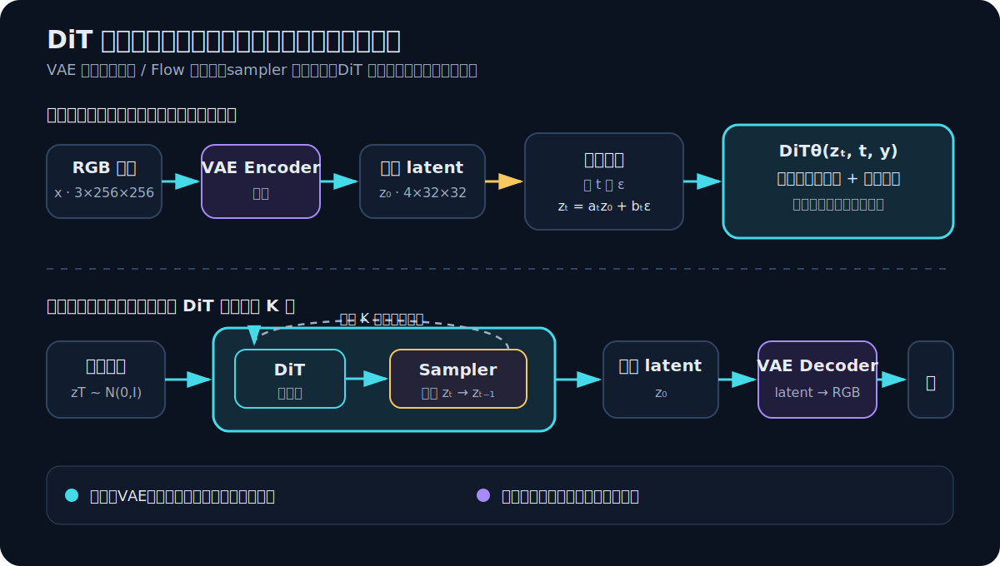
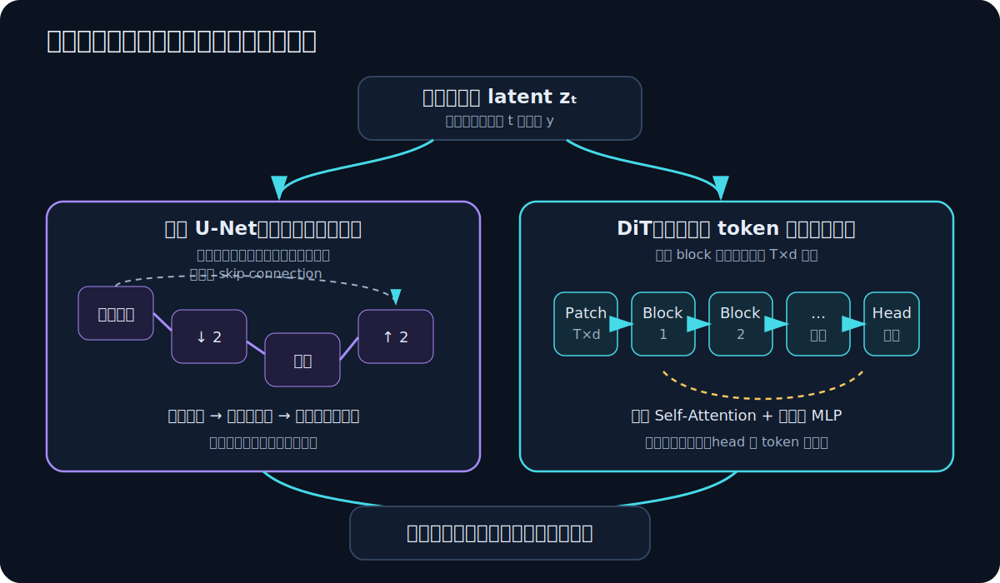
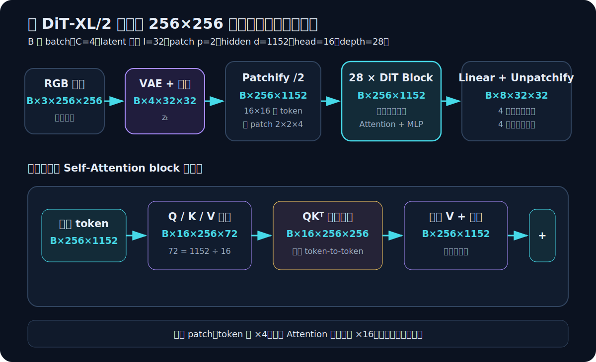
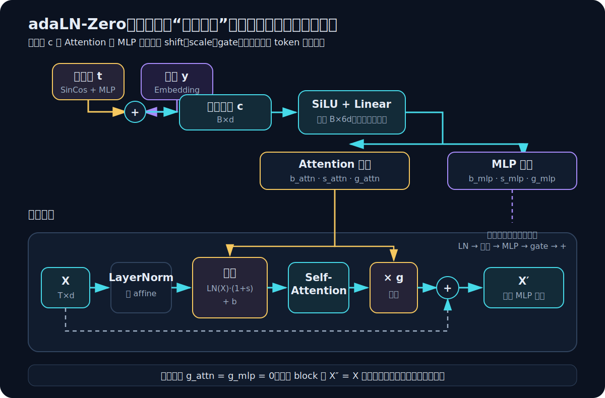
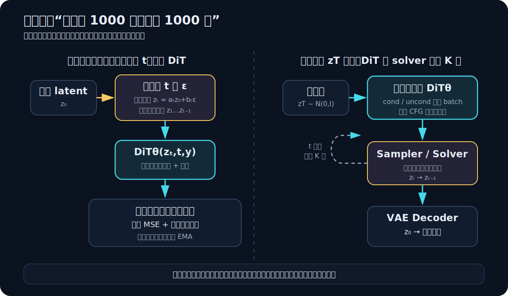
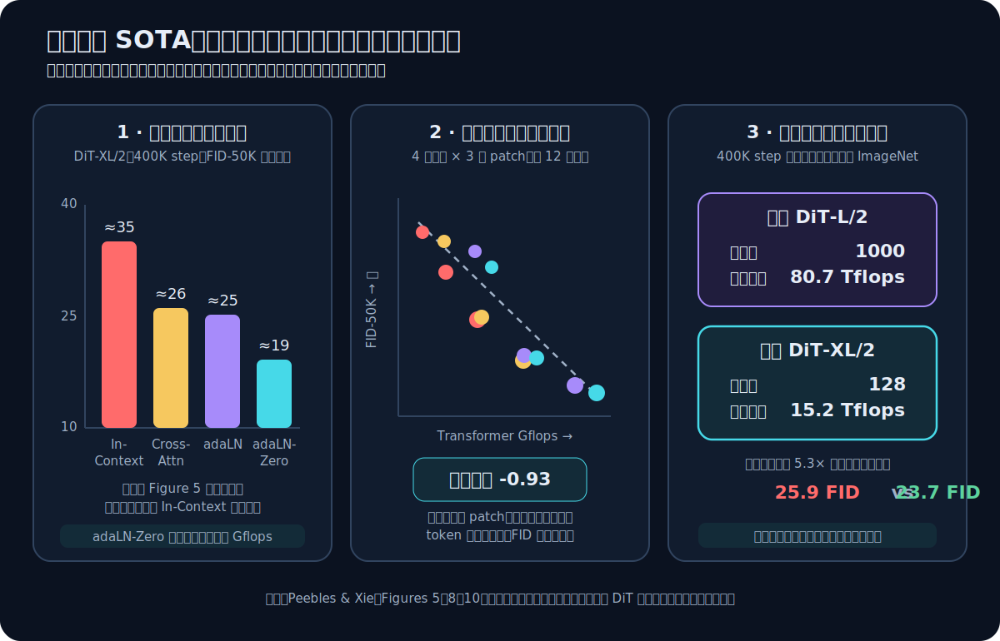

# 彻底搞懂 DiT：它不是一种新的 Diffusion，而是可扩展的去噪主干

> **先记住一句话：Diffusion 规定“怎样把数据变成噪声、再怎样一步步走回来”；DiT 只是负责每一步里那次最昂贵、最关键的函数估计。它把这个函数从卷积 U-Net 换成了处理 latent patch 的 Transformer。**

论文：[Scalable Diffusion Models with Transformers](https://arxiv.org/abs/2212.09748)，William Peebles、Saining Xie，ICCV 2023 Oral。  
官方材料：[CVF 论文](https://openaccess.thecvf.com/content/ICCV2023/html/Peebles_Scalable_Diffusion_Models_with_Transformers_ICCV_2023_paper.html) · [项目页](https://www.wpeebles.com/DiT) · [官方 PyTorch 实现](https://github.com/facebookresearch/DiT)

本文默认读者知道 Transformer 里的 token、Self-Attention、残差连接，也见过扩散前向公式。扩散的概率推导可先看 [[努力做一个可以让人记住的Diffusion推导]]；这里仅保留理解 DiT 必需的部分。

## 先纠正名字带来的三个误解

**误解一：DiT 是“给 Diffusion 加入时序”。**

不是。U-Net 扩散模型同样必须接收噪声时间步 $t$。这里的 $t$ 不是视频帧，也不是语言模型那样的自回归序列位置，而是“当前噪声有多重”的标识。

**误解二：DiT 是一种新的扩散公式。**

也不是。原始 DiT 沿用了 ADM 的 DDPM 设定、噪声日程、损失和采样过程，主要替换的是神经网络主干。现代人口中的“DiT”又常常只是泛指 Transformer 去噪器；它可以配 DDPM，也可以配 Rectified Flow、Flow Matching 或其他概率路径。

**误解三：用了 DiT，就不再需要 VAE。**

原论文恰恰是一个 latent diffusion 系统：图像先经现成 VAE 压缩，DiT 在 latent 上工作，最后仍由 VAE 解码。它是“卷积 VAE + Transformer 去噪器”的混合系统。



上图最重要的是边界：**DiT 不拥有整条生成流水线。** 给定带噪 latent $z_t$、时间步 $t$ 和条件 $y$，原始模型只实现下面这个函数：

$$
(\hat\epsilon_\theta,\hat\Sigma_\theta)
=f_\theta(z_t,t,y)
$$

采样器再使用它的输出，把 $z_t$ 更新为更干净的 $z_{t-1}$。相同的 $f_\theta$ 在全部采样步共享参数、被反复调用。

## 任务契约：DiT 到底吃什么、吐什么

先把原论文的具体版本钉死，避免一开始就把所有现代变体混在一起。

| 项目 | 原始 DiT 的设定 |
|---|---|
| 数据 | ImageNet 256×256 / 512×512，类别条件生成 |
| 图像表示 | Stable Diffusion 的预训练 VAE latent，空间下采样 8 倍 |
| 网络输入 | 带噪 latent $z_t$、扩散步 $t$、类别标签 $y$ |
| 网络输出 | 预测噪声 $\hat\epsilon$ 与反向过程的对角协方差参数 $\hat\Sigma$ |
| 主干 | 基于 ViT 的、恒定 token 分辨率的 Transformer |
| 条件注入 | 最终选用 adaLN-Zero，条件为时间嵌入与类别嵌入之和 |
| 训练目标 | 噪声 MSE，加上学习方差所需的变分项 |
| 推理 | 从高斯 latent 开始，多次调用同一个 DiT；可用 classifier-free guidance |
| 没有解决 | VAE 表示质量、快速采样、长文本对齐、任意分辨率训练 |

这篇论文真正回答的问题不是“Transformer 能否生成图像”——自回归 Transformer 早已能做这件事——而是：

> **在扩散模型中，卷积 U-Net 是不可替代的结构先验，还是可以换成一个更接近通用 Transformer、并随计算量稳定扩展的主干？**

## 先看责任发生了什么变化

U-Net 和 DiT 的外部任务几乎一样：都要根据 $(z_t,t,y)$ 预测反向更新所需的信息。区别在于内部怎样让空间位置交换信息。



| 维度 | 扩散 U-Net | 原始 DiT |
|---|---|---|
| 基本单元 | 二维 feature map | latent patch token 序列 |
| 空间交互 | 局部卷积逐层扩大感受野，部分分辨率可加 Attention | 每个 block 的 Self-Attention 可直接连接全部 token |
| 分辨率路径 | 下采样—瓶颈—上采样，多尺度 skip connection | token 网格尺寸在所有 DiT block 中保持不变 |
| 位置先验 | 卷积天然具有局部性与平移等变倾向 | 需要显式二维位置编码，局部性先验更弱 |
| 条件注入 | 常见做法是时间调制、残差块与 Cross-Attention | 原论文比较四种方式，最终使用 adaLN-Zero |
| 扩展旋钮 | 通道、层数、分辨率、各层 block 数 | 深度 $N$、宽度 $d$、head 数、patch 大小 $p$ |

所以，“DiT 替代 U-Net”并不是把卷积层机械改名为 Attention，而是把空间组织方式从**显式多尺度图像金字塔**改成**固定粒度 token 上的全局信息路由**。

这也解释了两者不同的偏好：U-Net 天然擅长复用局部纹理和多尺度结构；DiT 则更像一块规则、同质、容易堆深堆宽的计算底座。论文真正押注的是后者的可扩展性。

## 第一层：一张图怎样变成 Transformer token

### 1. VAE 先把像素压进 latent

以 256×256 RGB 图像为例，原论文使用下采样因子为 8 的 VAE：

$$
x\in\mathbb R^{B\times3\times256\times256}
\xrightarrow{E}
z_0\in\mathbb R^{B\times4\times32\times32}
$$

训练时官方代码从 VAE 后验采样，并乘以 `0.18215` 做尺度归一化。VAE 在 DiT 训练时冻结。这样做把空间点数从 $256^2$ 降到 $32^2$；否则全局 Self-Attention 的代价会非常高。

### 2. 加噪发生在 latent，不是 token 之后另造一套扩散

随机采样时间步 $t$ 与高斯噪声 $\epsilon$：

$$
z_t=\sqrt{\bar\alpha_t}z_0
+\sqrt{1-\bar\alpha_t}\epsilon,
\qquad \epsilon\sim\mathcal N(0,I)
$$

$z_t$ 仍有 $4\times32\times32$ 的空间形状。DiT 接收的是这个带噪 latent。

### 3. Patchify 把二维网格改写成序列

给定 latent 边长 $I$、patch 边长 $p$，token 数为：

$$
T=\left(\frac{I}{p}\right)^2
$$

每个 $p\times p\times C$ patch 被线性投影到隐藏维度 $d$。官方实现用 `PatchEmbed` 完成它，本质上可看作一个 `kernel_size=p, stride=p` 的卷积：卷积核不重叠地扫过 latent，每个落点生成一个 token。



以 DiT-XL/2 为例：

| 阶段 | 张量形状 | 含义 |
|---|---:|---|
| VAE latent | $B\times4\times32\times32$ | 带噪空间表示 |
| Patchify，$p=2$ | $B\times256\times1152$ | $16\times16=256$ 个 token |
| 单头 $Q,K,V$ | $B\times16\times256\times72$ | 16 个 head，$1152/16=72$ |
| Attention logits | $B\times16\times256\times256$ | 每个 head 的全局 token-to-token 关系 |
| 最终 token 输出 | $B\times256\times32$ | 每 token 输出 $p^2\cdot2C=2^2\cdot8=32$ 个数 |
| Unpatchify | $B\times8\times32\times32$ | 前 4 通道为噪声，后 4 通道为方差参数 |

再往 block 内部多走一步：每个 Attention head 的维度是 $1152/16=72$；pointwise MLP 的中间维度是 $4d=4608$；条件 MLP 的最后一层一次输出 $6d=6912$ 个数，随后切成两组 scale、shift、gate。到这里，`XL/2` 的每一个主要维度都已经能从配置反推出来。

`XL/2` 中的 `/2` 指 **latent 上的 2×2 patch**，不是 RGB 图像上的 2×2 像素。由于 VAE 的几何下采样为 8，它对应图像平面上 16×16 像素的步幅；但 VAE 卷积存在重叠感受野，不能把它理解为严格隔离的 16×16 像素块。

### 4. 为什么还要二维位置编码

Self-Attention 自身对 token 排列是置换等变的：如果只给内容而不告诉位置，模型无法区分左上角和右下角。DiT 给 patch token 加固定的二维 sine-cosine 位置编码：一半维度编码一个坐标轴，另一半编码另一个坐标轴。

原始官方实现把位置编码冻结。于是：

- patch embedding 回答“这个局部 latent 里有什么”；
- position embedding 回答“它在二维网格的哪里”；
- Self-Attention 决定“当前层应该和哪些位置交换什么信息”。

## 第二层：时间和类别怎样进入网络

DiT 的图像 token 是一个序列，但时间步 $t$ 并没有被展开成一串“时间 token”。原始最佳版本先分别做两种嵌入：

$$
e_t=\operatorname{MLP}(\operatorname{SinCos}(t)),
\qquad
e_y=\operatorname{Embedding}(y)
$$

然后直接相加：

$$
c=e_t+e_y\in\mathbb R^{B\times d}
$$

这个全局条件向量 $c$ 会送入每一个 DiT block 的 adaLN-Zero。时间嵌入告诉网络当前应该做“从几乎纯噪声中组织大结构”，还是“在低噪声状态下修细节”；类别嵌入告诉网络生成目标是哪一类。

> **推导性理解，而非论文直接测量：** 因为 $t$ 改变了每层归一化后的尺度、偏移和残差门控，同一组 Attention 与 MLP 权重可以在不同噪声区间表现成不同的有效计算路径。不要把这进一步夸大成“论文证明了早期只画轮廓、后期只画纹理”；原论文没有做这种因果归因实验。

## 第三层：Self-Attention 在一次去噪中做了什么

对某一层输入 $X\in\mathbb R^{B\times T\times d}$，忽略 batch 与多头拆分，标准 Self-Attention 为：

$$
Q=XW_Q,\qquad K=XW_K,\qquad V=XW_V
$$

$$
A=\operatorname{softmax}\left(\frac{QK^\top}{\sqrt{d_h}}\right),
\qquad
\operatorname{Attn}(X)=AV
$$

其中 $A_{ij}$ 表示第 $i$ 个 patch 在当前层从第 $j$ 个 patch 取多少信息。与固定卷积核相比，这个连接权重依赖当前样本、当前噪声状态和条件调制后的 token 内容。

它解决的是一个具体问题：一块已经被严重污染的局部 latent，仅凭近邻未必能判断自己属于“鸟的翅膀”还是“背景纹理”；全局 Attention 允许它直接参考远处与整体类别一致的证据。

但全局性不是免费的。Attention 矩阵大小随 $T^2$ 增长。对 256×256 图像的 DiT-XL/2，$T=256$；对 512×512，$T=1024$。若保持 VAE 下采样 8 和 $p=2$，1024×1024 图像会得到 $T=4096$，单个 head、单个样本的 Attention logits 就有约 1680 万个元素。

因此，DiT 的能力与瓶颈来自同一个设计：**更细的 patch 带来更精细、更昂贵的全局交互。**

## 第四层：真正关键的 adaLN-Zero

如果只把带噪 latent patch 喂给普通 ViT，它并不知道噪声强度和生成条件。原论文比较了四种条件注入方式：

1. 把 $t$、$y$ 当作额外 token 拼进序列；
2. 在 Self-Attention 后增加 Cross-Attention；
3. 用 $t+y$ 预测 LayerNorm 的缩放与平移，即 adaLN；
4. 再为两个残差分支增加零初始化门控，即 adaLN-Zero。

最终胜出的是第四种。



### 1. 普通 LayerNorm 做了什么

对每个 token 的隐藏维度归一化：

$$
\operatorname{LN}(x)=
\frac{x-\mu(x)}{\sqrt{\sigma^2(x)+\varepsilon}}
$$

标准 LayerNorm 再使用一组训练得到、对所有样本相同的仿射参数。adaLN 改成由当前条件 $c$ 动态生成缩放与平移：

$$
\operatorname{adaLN}(x;c)
=\operatorname{LN}(x)\odot(1+s(c))+b(c)
$$

这里的 $1+s$ 很重要：当 $s=0,b=0$ 时就是未调制的 LayerNorm，而不是把激活缩成零。

### 2. 为什么一次产生六个向量

条件 MLP 输出 $6d$ 维，再切成六份：

$$
(b_{\mathrm{attn}},s_{\mathrm{attn}},g_{\mathrm{attn}},
b_{\mathrm{mlp}},s_{\mathrm{mlp}},g_{\mathrm{mlp}})
=\operatorname{MLP}_{\mathrm{cond}}(c)
$$

一个完整 block 是：

$$
X'=X+g_{\mathrm{attn}}\odot
\operatorname{MSA}\!\left(
\operatorname{LN}(X)\odot(1+s_{\mathrm{attn}})+b_{\mathrm{attn}}
\right)
$$

$$
X''=X'+g_{\mathrm{mlp}}\odot
\operatorname{MLP}\!\left(
\operatorname{LN}(X')\odot(1+s_{\mathrm{mlp}})+b_{\mathrm{mlp}}
\right)
$$

六个向量分成三种职责：

- **shift $b$**：把每个隐藏维度的工作点平移到适合当前条件的位置；
- **scale $s$**：改变各隐藏维度在当前条件下的强弱；
- **gate $g$**：控制 Attention 或 MLP 分支应该向残差流写入多少。

这些向量形状都是 $B\times d$，在 token 维度上广播。因此原始 adaLN 对所有空间 token 施加同一套调制函数；空间差异仍由 token 内容、位置编码和 Self-Attention 产生。

### 3. Zero 到底在哪里

官方实现把条件 MLP 的最后一个线性层初始化为零，所以初始时六个向量全为零，特别是：

$$
g_{\mathrm{attn}}=g_{\mathrm{mlp}}=0
$$

每个 DiT block 一开始都近似恒等映射 $X''=X$。最终输出层的条件调制与线性投影也被零初始化，所以模型初始输出为零。

这不是“参数为零所以永远学不动”。最终线性层即使权重为零，仍能从非零输入激活获得非零权重梯度；当输出头与残差门逐渐打开后，梯度继续进入主干。更准确的直觉是：**训练从一个行为简单、残差路径关闭的网络开始，再逐步学会每一层要写入多少修正。**

### 4. 为什么这里不直接得出“Cross-Attention 不好”

原论文的 Cross-Attention 条件序列只有时间和类别两个向量，且增加约 15% Gflops；在这个特定任务里，adaLN-Zero 更好、更省算力。它不能证明 Cross-Attention 不适合长文本。文本包含多个具有局部对应关系的 token，仅把整段文本压成一个全局向量会形成信息瓶颈；后来的 PixArt-α 就在 DiT 中加入 Cross-Attention，MMDiT 则让图像与文本 token 双向交换信息。

## 第五层：输出头为什么有 8 个通道

经过 $N$ 个 DiT block 后，token 形状仍是 $B\times T\times d$。最终层先做一次条件化 LayerNorm，再把每个 token 线性投影成：

$$
p^2\cdot2C
$$

对 $p=2,C=4$，每个 token 输出 32 个数。Unpatchify 把它重新排列成 $B\times8\times32\times32$。

这里的 8 通道不是 8 通道 latent 图像：

- 前 $C=4$ 通道预测噪声 $\hat\epsilon$；
- 后 $C=4$ 通道参数化反向过程的对角方差 $\hat\Sigma$。

官方 `models.py` 默认 `learn_sigma=True`，所以 `out_channels=2*in_channels`。如果改成固定方差，输出才只需 4 通道。严格说，代码中的后 4 通道是 `model_var_values`，不是可以任意取值的协方差本身：`LEARNED_RANGE` 会把它映射到预先规定的最小与最大对数方差之间。论文图和本文用 $\hat\Sigma$ 是对这条方差分支的简写。

## 把一次前向压缩成 14 行伪代码

下面不是可直接训练的完整实现，而是与[官方 `models.py`](https://github.com/facebookresearch/DiT/blob/main/models.py)一一对应的结构骨架：

```python
def dit_forward(z_t, t, y):
    x = patch_embed(z_t) + pos_embed       # [B, T, d]
    c = time_embed(t) + label_embed(y)     # [B, d]

    for block in blocks:
        b1, s1, g1, b2, s2, g2 = cond_mlp(c).chunk(6)
        u = layer_norm(x) * (1 + s1[:, None]) + b1[:, None]
        x = x + g1[:, None] * self_attention(u)
        v = layer_norm(x) * (1 + s2[:, None]) + b2[:, None]
        x = x + g2[:, None] * feed_forward(v)

    x = final_adaln(x, c)
    x = linear(x)                          # [B, T, p*p*2C]
    return unpatchify(x)                   # [B, 2C, I, I]
```

读代码时只要守住三条主线就不容易迷路：

1. $z_t$ 变成 token 后，空间尺寸不再逐级升降；
2. $t$ 和 $y$ 不改变 token 数，而是调制每个 block；
3. 网络最后回到与 $z_t$ 同样的二维网格，供扩散采样器使用。

## 训练：一次只学一个随机噪声等级

训练与推理最容易被画成一张图后混淆。训练并不把一张图片真的连续去噪 1000 次。每个样本只随机抽一个 $t$，构造对应的 $z_t$，完成一次监督学习。



一次训练迭代的逻辑是：

1. 取图片 $x$ 与类别 $y$；
2. 冻结的 VAE 编码出 $z_0$；
3. 均匀抽取 $t\in\{0,\ldots,999\}$ 和 $\epsilon\sim\mathcal N(0,I)$；
4. 闭式构造 $z_t$；
5. DiT 输出 $\hat\epsilon$ 与方差参数；
6. 用噪声 MSE 训练均值分支，用变分下界项训练方差分支；
7. 更新训练模型，同时维护衰减为 0.9999 的 EMA 模型用于评估。

均值分支的核心损失是：

$$
\mathcal L_{\mathrm{simple}}
=\mathbb E_{z_0,t,\epsilon,y}
\left[\lVert\epsilon-epsilon_\theta(z_t,t,y)\rVert_2^2\right]
$$

原始 DiT 并不只有这一项。因为它还学习方差，官方扩散代码把输出拆成 `model_output` 和 `model_var_values`，用变分项训练后者，并对均值预测做 `detach`，避免方差项反向干扰噪声 MSE。这继承自 Improved DDPM 的混合目标。

原论文的关键训练设定包括：AdamW、恒定学习率 $10^{-4}$、无 weight decay、batch size 256、只做随机水平翻转、无 learning-rate warmup，并用 EMA 权重报告结果。论文特意指出这些配置几乎直接继承 ADM，没有为不同 DiT 尺寸单独调参。

### 训练时为什么要随机丢类别

官方默认以 10% 概率把类别替换成一个可学习的 null 类别。这样同一个模型同时学到：

$$
\epsilon_\theta(z_t,t,y)
\quad\text{与}\quad
\epsilon_\theta(z_t,t,\varnothing)
$$

这不是普通正则化的附带效果，而是在为推理时的 classifier-free guidance 准备有条件与无条件两种预测。

## 推理：同一个 DiT 被采样器反复调用

推理从 $z_T\sim\mathcal N(0,I)$ 开始。每一步大致是：

$$
z_t
\xrightarrow{\mathrm{DiT}(\cdot,t,y)}
(\hat\epsilon_t,\hat\Sigma_t)
\xrightarrow{\mathrm{sampler}}
z_{t-1}
$$

直到得到 $z_0$，再经 VAE decoder 还原为像素图像。

### CFG 实际做了什么

有条件与无条件噪声预测按下式外推：

$$
\hat\epsilon_{\mathrm{cfg}}
=\hat\epsilon_{\mathrm{uncond}}
+s\left(
\hat\epsilon_{\mathrm{cond}}-\hat\epsilon_{\mathrm{uncond}}
\right)
$$

$s>1$ 会把更新方向推得更靠近条件。它常提升条件一致性和视觉锐度，但不等价于无代价提高真实分布拟合：原论文 256×256 结果中，DiT-XL/2 从无 guidance 到 `cfg=1.50` 时，Precision 从 0.67 升到 0.83，Recall 却从 0.67 降到 0.57。

一个容易踩坑的实现细节：官方 `forward_with_cfg` 为复现实验，默认只对输出噪声的前三个通道应用 guidance；代码注释同时说明，标准做法是对全部 latent 通道应用。迁移代码时不应把“三通道 CFG”误认为 DiT 的结构定义。

### 把一个生成系统拆成六个独立设计轴

| 轴 | 可选设计 | 回答的问题 |
|---|---|---|
| 表示空间 | 像素、VAE latent、视频 latent、其他连续表示 | 在哪里生成？ |
| 概率路径 / 训练框架 | DDPM、EDM、Rectified Flow、Flow Matching 等 | 数据与噪声怎样连接？ |
| 网络预测目标 | $\epsilon$、$x_0$、$v$、flow velocity 等 | 网络监督信号是什么？ |
| 主干 | U-Net、DiT、混合 Transformer | 谁来估计这个目标？ |
| 条件机制 | adaLN、Cross-Attention、联合图文 Attention 等 | 条件怎样进入？ |
| 求解器 / sampler | DDPM、DDIM、ODE/SDE solver 等 | 推理时怎样沿路径走？ |

这张表能消除很多术语争论：使用 Rectified Flow 的 Transformer 仍可被宽泛地称为 DiT，但它已经不是原论文那套“预测 $\epsilon$ 与方差的 DDPM”了。

## 论文证据：为什么应该相信这个设计



### 证据一：条件注入不是小细节

在相同的 DiT-XL/2 规模下，adaLN-Zero 在全部训练阶段优于 in-context、Cross-Attention 和普通 adaLN。到 400K step，论文正文称它的 FID **接近 in-context 的一半**；从 Figure 5 读图约为 19 对 35。Cross-Attention 还带来约 15% 的额外 Gflops，而 adaLN-Zero 增量可以忽略。

这是论文最直接的因果消融：主干规模不变，只改条件进入 block 的方式，质量出现巨大差异。它说明“把 U-Net 换成 Transformer”还不够，**让 Transformer 以稳定方式感知噪声等级**是成立的关键。

### 证据二：质量更跟实际计算量走，而不只跟参数量走

论文训练了 4 种模型尺寸（S/B/L/XL）× 3 种 patch（8/4/2），共 12 个模型。400K step 时，Transformer 前向 Gflops 与 FID-50K 的相关系数是 **-0.93**。

最有辨识度的控制变量是 patch size：同一模型尺寸下，从 `/8` 改到 `/2` 几乎不增加参数量，却显著增加 token 数和计算量，并持续降低 FID。因此，实验至少支持：

> 对这组 DiT 与训练配置，参数量不能唯一解释质量；让网络在更多 token 上执行更多计算，是改善质量的重要轴。

但不要把相关系数读成自然定律。12 个配置共享架构家族、数据和训练方案，不能证明任何任务上“烧更多 FLOPs”都自动更好，也没有单独隔离“计算量”和“更细空间离散化”各自贡献多少。

### 证据三：采样时多算，补不回主干太小

论文比较 DiT-L/2 用 1000 个采样步与 DiT-XL/2 用 128 步：

| 模型 | 采样步 | 每图计算 | FID-10K |
|---|---:|---:|---:|
| DiT-L/2 | 1000 | 80.7 Tflops | 25.9 |
| DiT-XL/2 | 128 | 15.2 Tflops | 23.7 |

小模型用了约 5.3 倍采样计算，FID 仍更差。这支持一个很实用的工程判断：**反复调用一个能力不足的向量场估计器，并不能等价于使用更强的估计器。**

### 证据四：SOTA 数字里，主干和 CFG 的贡献必须分开看

在 ImageNet 256×256 上：

| 模型 | CFG | FID-50K | Precision | Recall |
|---|---:|---:|---:|---:|
| DiT-XL/2 | 无 | 9.62 | 0.67 | 0.67 |
| DiT-XL/2-G | 1.25 | 3.22 | 0.76 | 0.62 |
| DiT-XL/2-G | 1.50 | 2.27 | 0.83 | 0.57 |
| 此前 LDM-4-G | 1.50 | 3.60 | 0.87 | 0.48 |

2.27 是论文最醒目的结果，但它同时包含大 DiT、长达 7M step 的训练与 CFG。无 guidance 的 9.62 提醒我们：不能把所有提升都归因于 Transformer 主干。另一方面，在相同 `cfg=1.50` 的表格条件下，DiT 相比 LDM 的 FID 从 3.60 降到 2.27，且 Recall 更高，仍是有意义的能力证据。

## DiT 为什么容易扩展

从机制上看，有四个相互配合的原因。

### 1. 计算图规则

所有 block 形状相同，没有 U-Net 中复杂的分辨率切换、通道翻倍、上下采样和同尺度 skip 对齐。工程上更容易规则堆叠、做并行化和复用 Transformer 优化。

### 2. 扩展旋钮清晰

- 增加深度 $N$：做更多轮 token 交互；
- 增加宽度 $d$：扩大每个 token 的表示与 MLP 容量；
- 增加 head：提供更多并行关系子空间；
- 减小 patch $p$：增加 token 数，提高空间计算粒度。

原论文的 XL 配置是 28 层、隐藏维 1152、16 个 head、MLP ratio 4；其 `/2` 模型在 256×256 输入下约 119 Gflops。项目页给出的整个家族范围约为 33M 到 675M 参数。

### 3. Token 是跨模态接口

一旦数据能被编码为“带位置的连续 token”，Transformer 主干就不必只服务二维图片：

- **文本到图像**：PixArt-α 在 DiT 中加入文本 Cross-Attention；
- **图文联合建模**：Stable Diffusion 3 的 MMDiT 为图像和文本使用不同权重，再让两者双向交换信息；
- **视频**：Latte 研究空间与时间维的 Attention 分解；Sora 技术报告把压缩视频切成 spacetime latent patches；
- **其他连续域**：音频谱、3D 表示、动作轨迹都可以定义自己的 patch/token 与位置结构。

这不是说同一份二维 DiT 代码能原封不动处理所有模态。真正可迁移的是接口：**连续状态 → token 化 → 条件化 Transformer → 与输入同构的连续场预测。**

### 4. 主干与生成路径可以解耦

原始 DiT 使用 DDPM；后来的高分辨率图像系统可以把主干保留为 Transformer，同时改用 Rectified Flow、不同 prediction target 与求解器。Transformer 的扩展规律因此不被绑定在某一套扩散离散公式上。

## 它的代价与边界在哪里

### 论文明确展示或承认的边界

1. **实验是类别条件 ImageNet，不是文本到图像。** 1000 类标签可被压成单个全局向量，长文本条件远复杂得多。
2. **FID 对实现细节敏感。** 论文为此统一用 ADM 的 TensorFlow 评估套件；跨论文的小幅差异仍需谨慎。
3. **高质量结果训练很久。** 256×256 的最佳 XL/2 训练了 7M step，512×512 训练了 3M step。
4. **仍依赖卷积 VAE。** DiT 的生成上限会受到 latent 压缩损失、decoder 伪影和 latent 几何的影响。
5. **CFG 改变质量—多样性权衡。** FID 与 Precision 改善时，Recall 下降。

### 从结构推导、原论文没有完全回答的问题

1. **二次 Attention 成本。** 图像边长加倍时，latent token 数约变 4 倍，朴素全局 Attention 的关系矩阵约变 16 倍。视频再增加时间轴后更严峻。
2. **更弱的局部先验需要什么代价补偿？** DiT 可能通过数据与算力学回卷积免费提供的局部性；论文没有给出低数据制度下的系统比较。
3. **Gflops 相关性不等于计算本身是唯一原因。** 更小 patch 同时改变了空间离散粒度；Figure 8 的 -0.93 是家族内部相关，不是独立随机实验。
4. **没有完全配平的 U-Net 因果对照。** 论文证明 DiT 能扩展并达到强结果，但没有在所有参数量、训练计算、数据处理与调参预算都严格相同的条件下证明 Transformer 必然优于 U-Net。
5. **原始 adaLN 的全局瓶颈。** 同一调制施加给所有 token，适合时间与类别；需要词级、区域级对应时，Cross-Attention 或联合 Attention 往往更自然。

## 工程上怎样快速读懂一个“DiT-like”模型

看到任何新的 DiT、视频生成器或 Flow Transformer，按下面顺序检查，通常比先读论文命名更可靠。

### 1. 先看状态空间

- 输入是 RGB、VAE latent，还是时空 latent？
- 编码器下采样多少倍？latent 有多少通道？
- 是否有额外 mask、参考图或控制信号？

### 2. 再算 token 数

$$
T=\prod_k\frac{I_k}{p_k}
$$

图片有两个空间轴，视频还有时间轴。先算 $T$，再判断全局 Attention、显存和分辨率扩展是否现实。

### 3. 找条件走哪条路

- 全局条件是否只进 adaLN？
- 文本是否通过 Cross-Attention？
- 图像与文本是否拼成联合序列？
- 条件在每层都注入，还是只在输入注入？
- CFG 的 null condition 怎样训练？

### 4. 查预测头

- 输出 $\epsilon$、$x_0$、$v$ 还是 flow velocity？
- 是否同时学习方差？
- 输出通道为什么是 $C$、$2C$ 或别的数？
- unpatchify 后是否与被更新的状态严格同形？

### 5. 查初始化与归一化

- Pre-Norm 还是 Post-Norm？
- adaLN、adaLN-Zero、QK-Norm 或其他稳定化方法？
- 哪些 residual gate 和 output head 被零初始化？

### 6. 最后才看 sampler

- 训练时间参数与推理时间参数怎样映射？
- 采样步数、solver、CFG scale 是多少？
- cond/uncond 是两次前向还是 batch 合并？
- 加速来自更少 NFE，还是单次 DiT 更快？

只要这六组问题有答案，模型名字即使换成 MMDiT、SiT、Video DiT 或其他变体，内部逻辑仍然透明。

## 一周后应该记住什么

1. **DiT 是函数逼近器，不是整套扩散过程。** 它把 $(z_t,t,c)$ 映射成噪声、速度或其他连续场预测；scheduler/solver 才负责怎样走下一步。
2. **核心数据流是 patchify → 多个条件化 Transformer block → linear → unpatchify。** 序列只是计算视图，输入输出仍是同形空间状态。
3. **原论文真正关键的局部机制是 adaLN-Zero。** 时间与条件产生 scale、shift、gate，零初始化让残差块从恒等映射开始。
4. **原论文真正关键的宏观证据是计算扩展。** 增大深宽或减小 patch 都改善 FID，Gflops 与 FID 在 12 个配置上相关系数为 -0.93。
5. **现代“DiT”是一个家族名。** Token 化、条件机制、训练路径、预测目标和采样器都可以换；不要把原始 ImageNet DDPM 的细节误当成所有 DiT 的定义。

## 参考资料与证据来源

### 核心一手资料

- Peebles, W. & Xie, S. [Scalable Diffusion Models with Transformers](https://arxiv.org/abs/2212.09748), ICCV 2023。
- 作者[项目页](https://www.wpeebles.com/DiT)：模型规模、Gflops、FID 与 latent walk。
- Meta Research [官方 PyTorch 实现](https://github.com/facebookresearch/DiT)：[`models.py`](https://github.com/facebookresearch/DiT/blob/main/models.py)、[`train.py`](https://github.com/facebookresearch/DiT/blob/main/train.py)、[`diffusion`](https://github.com/facebookresearch/DiT/tree/main/diffusion)。该仓库已于 2025-08-06 归档为只读，但仍是论文实现的直接证据。
- Nichol, A. & Dhariwal, P. [Improved Denoising Diffusion Probabilistic Models](https://arxiv.org/abs/2102.09672)：DiT 所继承的学习方差与混合目标。
- Ho, J. & Salimans, T. [Classifier-Free Diffusion Guidance](https://arxiv.org/abs/2207.12598)：条件 dropout 与 CFG。
- Rombach et al. [High-Resolution Image Synthesis with Latent Diffusion Models](https://arxiv.org/abs/2112.10752)：DiT 使用的 latent diffusion 与 VAE 路径。

### 家族扩展的一手资料

- Chen et al. [PixArt-α: Fast Training of Diffusion Transformer for Photorealistic Text-to-Image Synthesis](https://arxiv.org/abs/2310.00426)：带文本 Cross-Attention 的 DiT。
- Esser et al. [Scaling Rectified Flow Transformers for High-Resolution Image Synthesis](https://arxiv.org/abs/2403.03206)：Rectified Flow 与 MMDiT。
- Ma et al. [Latte: Latent Diffusion Transformer for Video Generation](https://arxiv.org/abs/2401.03048)：时空 token 与视频 Attention 分解。
- OpenAI [Video generation models as world simulators](https://openai.com/index/video-generation-models-as-world-simulators/)：spacetime latent patches；该技术报告未公开完整模型与实现细节，因此只能支持架构层面的陈述。

### 表达方式参考

- Jay Alammar, [The Illustrated Stable Diffusion](https://jalammar.github.io/illustrated-stable-diffusion/)：本文借鉴其“先画系统边界、再逐层打开黑盒”的讲解顺序，不把它作为 DiT 技术事实来源。
