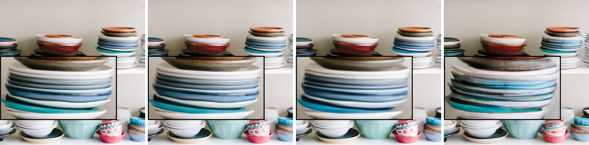
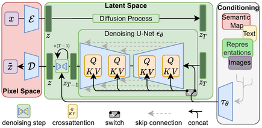
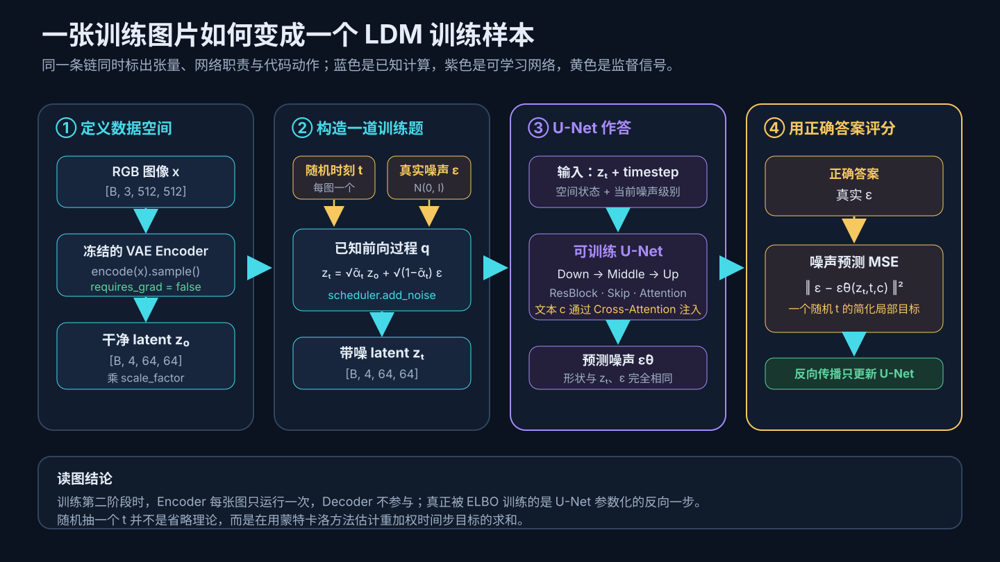
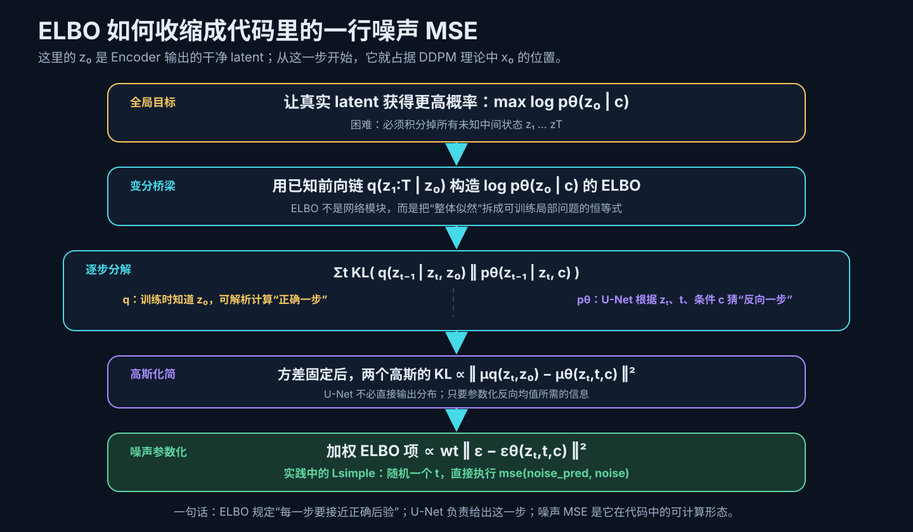
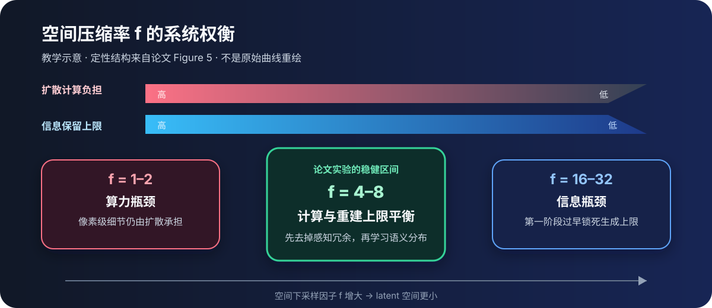
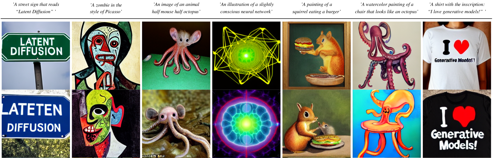

# 论文解读：High-Resolution Image Synthesis with Latent Diffusion Models

> **核心判断：先固定自编码器，令 $z_0=\mathcal E(x)$；从这一刻起，$z_0$ 就占据 DDPM 理论中“数据 $x_0$”的位置。LDM 仍用 Diffusion ELBO 约束 $\log p_\theta(z_0\mid c)$，U-Net 参数化其中每个反向条件分布，代码里的噪声预测误差则是逐步 KL 的可计算、重加权形式。论文真正改变的是这套概率建模发生的状态空间：预训练自编码器先做一次感知压缩，Diffusion 再在二维 latent 上学习语义分布。最关键的证据是 Figure 5：压得太少，训练仍然慢；压得太狠，生成质量上限又被第一阶段锁死。**

论文：Robin Rombach、Andreas Blattmann、Dominik Lorenz、Patrick Esser、Björn Ommer，**High-Resolution Image Synthesis with Latent Diffusion Models**，CVPR 2022 Oral。  
主来源：[CVF 论文页](https://openaccess.thecvf.com/content/CVPR2022/html/Rombach_High-Resolution_Image_Synthesis_With_Latent_Diffusion_Models_CVPR_2022_paper.html)｜[论文 PDF](https://openaccess.thecvf.com/content/CVPR2022/papers/Rombach_High-Resolution_Image_Synthesis_With_Latent_Diffusion_Models_CVPR_2022_paper.pdf)｜[补充材料](https://openaccess.thecvf.com/content/CVPR2022/supplemental/Rombach_High-Resolution_Image_Synthesis_CVPR_2022_supplemental.pdf)｜[arXiv v2](https://arxiv.org/abs/2112.10752v2)｜[官方代码](https://github.com/CompVis/latent-diffusion/tree/a506df5756472e2ebaf9078affdde2c4f1502cd4)

## 一、先纠正一个名字带来的误会：论文模型不等于 SD v1

这篇论文回答的是一个**模型类别**问题：怎样让 Diffusion 不再把绝大多数算力消耗在高分辨率像素上，同时保留图像结构和多种条件接口？它给出的答案叫 **Latent Diffusion Model，LDM**。

Stable Diffusion v1 则是后来沿用这套答案做出的一个具体系统。二者共享：

- 图像先经轻度压缩的自编码器进入二维 latent；
- 在 latent 上执行扩散训练和迭代采样；
- 去噪器采用带多尺度 Skip 的 U-Net；
- 文本 token 通过 Cross-Attention 持续影响每一步去噪；
- 最后只需一次 Decoder 前向，把 latent 还原为 RGB。

但论文中的 1.45B 文生图 LDM 使用 BERT tokenizer 和一个联合训练的 1280 维 Transformer 条件器；Stable Diffusion v1 改成了**冻结的 CLIP ViT-L/14 文本编码器**、768 维上下文和 860M U-Net。论文证明了“这条系统路线可行”，没有替后来的每个 Stable Diffusion 配置逐项背书。

## 二、任务契约：这篇论文到底在优化什么

| 项目 | 内容 |
|---|---|
| 输入 | 训练图像 $x$，以及可选条件 $y$：类别、文本、布局、语义图、低清图或掩码图 |
| 输出 | 无条件或受条件控制的高分辨率图像 $\tilde x$ |
| 监督 | 图像本身；条件任务还需要图像—条件配对 |
| 第一阶段 | 学习 $z=\mathcal E(x)$ 与 $\tilde x=\mathcal D(z)$，丢掉感知上不重要的细节 |
| 第二阶段 | 在固定的 latent 空间学习 $p(z)$ 或 $p(z\mid y)$ |
| 部署假设 | 多次去噪都发生在低维 latent；最后只做一次高分辨率解码 |
| 不解决 | Diffusion 的串行采样本身、严格像素级保真、数据版权与偏见、生产级安全治理 |

一句话读法是：**它优化的不是“怎样少走几个采样步”，而是“让每一步都在更便宜、却仍保留二维结构的空间里走”。**

## 三、旧瓶颈：像素空间让模型为人眼看不见的细节反复付费

像素 Diffusion 的训练和推理都要反复调用 U-Net。若状态一直是 $H\times W\times3$ 的 RGB 张量，每一次前向、反向、注意力和中间激活都承担完整空间尺寸。

论文用“感知压缩”和“语义压缩”拆开这个问题：

1. **感知压缩**：去掉人眼几乎不在意的高频细节，但保留物体、布局和纹理的可重建表示；
2. **语义压缩**：学习自然图像的概念组合与概率分布，这是生成模型真正应该投入容量的地方。

像素 Diffusion 可以通过重加权损失少关心某些细节，但网络和梯度仍必须在每个像素上计算。LDM 的关键责任转移是：**让一个可复用的自编码器先完成感知压缩，Diffusion 专注第二阶段。**

## 四、第一阶段：自编码器不是附属压缩包，而是生成质量上限

给定图像 $x\in\mathbb R^{H\times W\times3}$，编码器和解码器执行：

$$
z=\mathcal E(x),
\qquad
\tilde x=\mathcal D(z),
\qquad
z\in\mathbb R^{h\times w\times c}.
$$

空间下采样因子定义为：

$$
f=\frac{H}{h}=\frac{W}{w}.
$$

这里最容易误解的是“VAE”三个字。论文的第一阶段不是只用像素 MSE 和标准 ELBO 的朴素 VAE，而是沿用 [[论文解读：Taming Transformers for High-Resolution Image Synthesis|VQGAN]] 路线，把**感知损失、Patch 判别器和很轻的 latent 正则**组合起来：

- 感知损失让重建结果保留人眼在意的结构与纹理；
- Patch 对抗目标约束局部结果落在真实图像流形附近，减轻纯 $L_1/L_2$ 的模糊；
- KL-reg 只施加约 $10^{-6}$ 权重的轻微 KL 约束，VQ-reg 则使用高容量码本；
- 训练第二阶段时，第一阶段被固定，不再同时拉扯“重建好”和“先验好”两个目标。

> [!note] “沿用 VQGAN”不等于 Stable Diffusion 使用 VQGAN 的完整生成系统
> VQGAN 论文先把图像量化成离散码本索引，再由自回归 Transformer 逐 token 生成；LDM 真正继承的是“感知损失 + PatchGAN 训练高质量压缩器，再冻结第一阶段”的职责划分。LDM 同时实验 VQ-reg 与连续 KL-reg，Stable Diffusion v1 选择后者，因此没有离散码本；第二阶段也已从自回归 Transformer 换成 latent 上的 Diffusion U-Net。完整前因见 [[论文解读：Taming Transformers for High-Resolution Image Synthesis]]。

先看论文 [Figure 1](https://openaccess.thecvf.com/content/CVPR2022/papers/Rombach_High-Resolution_Image_Synthesis_With_Latent_Diffusion_Models_CVPR_2022_paper.pdf#page=2) 的局部细节：同样观察盘子边缘、人物眼睛和发丝，轻度下采样的 $f=4$ 重建更接近输入；更激进的压缩会把后续生成模型永远无法恢复的信息提前丢掉。下面是作者官方仓库给出的另一组第一阶段重建对照，放大框让这种不可逆损失更容易看见。



*作者官方仓库的第一阶段重建样例；它承担的是“压缩器会留下不可逆痕迹”的直观证据，不替代论文 Figure 1 的受控数值比较。来源：[CompVis/latent-diffusion 固定提交中的 `reconstruction1.png`](https://github.com/CompVis/latent-diffusion/blob/a506df5756472e2ebaf9078affdde2c4f1502cd4/assets/reconstruction1.png)，仓库采用 [MIT License](https://github.com/CompVis/latent-diffusion/blob/a506df5756472e2ebaf9078affdde2c4f1502cd4/LICENSE)。*

图中 LDM 的 $f=4$ 第一阶段报告 PSNR 27.4、R-FID 0.58；DALL-E 的 $f=8$ 与 VQGAN 的 $f=16$ 重建上限更低。它直接支持的是“**压缩器会设定可生成细节的天花板**”，但不能单凭这张图证明 latent 上的 Diffusion 一定训练更快或生成更好；后者要看压缩率控制实验。

> [!important] $f$ 只描述空间边长，不等于总张量缩小倍数
> 以 Stable Diffusion v1 的具体配置为例，$512\times512\times3$ 会变成 $64\times64\times4$。空间位置减少 $8^2=64$ 倍，标量元素从 786,432 减到 16,384，即 48 倍。这个比值有助于建立直觉，但不能直接当成 U-Net FLOPs 或显存的精确缩减倍数，因为通道数、特征层级、Attention 和实现开销也会变化。

## 五、关键桥梁：把论文 Figure 3、ELBO、U-Net 和代码放进同一张图

“把 $x_t$ 换成 $z_t$”在代数上没有错，却很容易让人误以为 ELBO 被留在了像素空间，而 LDM 只是额外套了一个 VAE。真正完整的关系是：**Encoder 先定义新的数据分布 $z_0\sim q_{\mathcal E}(z)$；随后 DDPM 的前向链、ELBO、Score 与反向网络全部在这个分布上重新成立。**

### 5.1 先分清两种 KL：它们属于两个训练阶段

Stable Diffusion 的资料里会同时遇到两种 KL，这正是最容易断线的地方：

| 出现位置 | 约束对象 | 更新谁 | 在系统里的职责 |
|---|---|---|---|
| 第一阶段自编码器的 KL-reg | $q_\phi(z_0\mid x)$ 与简单先验之间的距离 | 训练自编码器时更新 Encoder/Decoder | 让连续 latent 受到轻微正则，便于后续建模 |
| 第二阶段 Diffusion ELBO 的逐步 KL | 正确反向后验 $q(z_{t-1}\mid z_t,z_0)$ 与模型反向分布 $p_\theta(z_{t-1}\mid z_t,c)$ | 训练 LDM 时主要更新 U-Net | 让从噪声回到真实 latent 的每一步都可学习 |

第一阶段还混合感知损失和 PatchGAN，对应的不是一个干净、端到端联合优化的“整套 SD 图像 ELBO”。论文采用的是**分阶段训练**：先得到可重建图像的表示空间并冻结，再在这个空间里训练一个 Diffusion prior。

### 5.2 先读论文 Figure 3：哪些盒子属于哪一阶段

看作者的系统图时先只找四件事：左侧 Encoder 把像素变成 $z_0$；中间 U-Net 接收某个带噪 $z_t$；右侧条件编码器把文本、布局或语义图变成 $c$；最左侧 Decoder 只负责把最终 latent 还原成图像。



*论文原图 Figure 3 的作者官方仓库版本；它保留论文方法图的核心结构。来源：[CompVis/latent-diffusion 固定提交中的 `modelfigure.png`](https://github.com/CompVis/latent-diffusion/blob/a506df5756472e2ebaf9078affdde2c4f1502cd4/assets/modelfigure.png)，仓库采用 [MIT License](https://github.com/CompVis/latent-diffusion/blob/a506df5756472e2ebaf9078affdde2c4f1502cd4/LICENSE)。*

这张图定义了系统职责，却没有展开两件事：$z_t$ 如何由 $z_0$ 构造，以及 U-Net 为什么要预测噪声。下面两张教学图专门打开这两个隐藏层。

### 5.3 一张 512×512 图片在训练代码里到底怎样流动

下面用 Stable Diffusion v1 的典型形状建立具体直觉；论文里的其他 LDM 会因 $f$、输入分辨率和通道数不同而改变形状，但计算关系相同。



*本文根据 LDM 论文 §3.2–3.3、Figure 3 与官方固定源码重绘；它把论文图未展示的张量形状、训练监督和代码动作放到同一条链上，不是论文原图。*

这张图最需要记住的不是尺寸，而是**谁知道答案**：

- 前向过程自己采样了 $\epsilon$，所以训练代码知道正确噪声是什么；
- U-Net 看不到干净 $z_0$ 和真实 $\epsilon$，只看到 $z_t$、时刻 $t$ 与条件 $c$；
- Decoder 不参与第二阶段训练；它不会替 U-Net 提供像素重建误差；
- 反向传播只要求 U-Net 从当前状态中恢复那份被加入的噪声。

### 5.4 ELBO 约束的不是 VAE，而是 U-Net 参数化的反向链

把 Encoder 冻结后，定义：

$$
q(z_{1:T}\mid z_0)
=
\prod_{t=1}^{T}q(z_t\mid z_{t-1}),
$$

$$
p_\theta(z_{0:T}\mid c)
=
p(z_T)\prod_{t=1}^{T}p_\theta(z_{t-1}\mid z_t,c).
$$

这里的 $q$ 是没有可训练参数的前向加噪链；$p_\theta$ 是生成时真正要运行的反向链。我们希望真实 $z_0$ 在条件 $c$ 下获得高概率，但 $\log p_\theta(z_0\mid c)$ 需要积分掉整条未知轨迹。于是使用已知的 $q$ 构造下界：

$$
\log p_\theta(z_0\mid c)
\ge
\underbrace{
\mathbb E_{q(z_{1:T}\mid z_0)}
\left[
\log p_\theta(z_{0:T}\mid c)
-
\log q(z_{1:T}\mid z_0)
\right]
}_{\operatorname{ELBO}(z_0,c)}.
$$

负 ELBO 可以拆成终点项、逐步反向项与最后一步重建项；主要的可训练部分是：

$$
\mathcal L_{t-1}
=
\mathbb E_q
\left[
D_{\mathrm{KL}}
\left(
q(z_{t-1}\mid z_t,z_0)
\,\Vert\,
p_\theta(z_{t-1}\mid z_t,c)
\right)
\right].
$$

这个 KL 可以直接翻译成一道监督题：

- $q(z_{t-1}\mid z_t,z_0)$：训练时知道干净 $z_0$，因此可以解析算出“正确的反向一步”；
- $p_\theta(z_{t-1}\mid z_t,c)$：模型只能根据 $z_t$、$t$ 和条件 $c$ 猜反向一步；
- U-Net 的输出负责参数化第二个分布，因此逐步 KL 最终训练的是 U-Net，而不是已冻结的 Encoder。

ELBO 的作用不是在网络图里新增一个盒子，而是把“提高整张 latent 的生成概率”拆成“每个反向小步都接近正确后验”。如果所有小步都学得足够好，就能从 $z_T\sim\mathcal N(0,I)$ 串回真实 latent 分布。

### 5.5 为什么逐步 KL 最后只剩噪声 MSE

前向后验和模型反向分布都用高斯表示。方差不由 U-Net 自由输出时，高斯之间的 KL 可化为均值误差：

$$
D_{\mathrm{KL}}(q\Vert p_\theta)
\propto
\left\|
\tilde\mu_t(z_t,z_0)
-
\mu_\theta(z_t,t,c)
\right\|_2^2.
$$

再用噪声预测参数化 $\mu_\theta$，每个时间步的 ELBO 项就变成带权噪声误差：

$$
\mathcal L_{t-1}
\propto
w_t
\left\|
\epsilon
-
\epsilon_\theta(z_t,t,c)
\right\|_2^2.
$$

LDM 论文使用与 DDPM 相同的简化、重加权目标，实践中直接优化：

$$
\mathcal L_{\mathrm{LDM}}
=
\mathbb E_{x,c,t,\epsilon}
\left[
\left\|
\epsilon
-
\epsilon_\theta(z_t,t,c)
\right\|_2^2
\right],
\qquad
z_0=\mathcal E(x).
$$



*本文根据 DDPM 论文 §2–3、LDM 论文 §3.2 与官方 `p_losses` 实现重绘；图中把严格带权 ELBO 项与实践使用的简化目标分开标注。*

这也把 Score Matching 接了回来。由

$$
z_t=\alpha_t z_0+\sigma_t\epsilon
$$

可得前向条件分布的 score：

$$
\nabla_{z_t}\log q(z_t\mid z_0)
=
-\frac{\epsilon}{\sigma_t}.
$$

因此同一份 U-Net 输出可以使用三种语言理解：

| 观察角度 | U-Net 在做什么 |
|---|---|
| ELBO | 让模型反向分布接近正确的一步后验 |
| Score Matching | 估计当前带噪 latent 朝高密度区域移动的方向 |
| 训练代码 | 预测加入 $z_0$ 的噪声并计算 MSE |

它们不是三个互相拼接的算法，而是同一个训练信号的概率、几何与工程表述。

### 5.6 最后把公式逐行对回代码

```python
with torch.no_grad():
    z_0 = scale * autoencoder.encode(images).sample()

t = random_timesteps(batch_size)
noise = torch.randn_like(z_0)
z_t = alpha[t] * z_0 + sigma[t] * noise
noise_pred = unet(z_t, t, context=condition_tokens)
loss = mse(noise_pred, noise)
```

| 数学对象 | 代码动作 | 网络结构中的位置 |
|---|---|---|
| $z_0=\mathcal E(x)$ | `autoencoder.encode(images)` | 冻结 VAE Encoder，只定义数据空间 |
| $t\sim U\{1,\ldots,T\}$ | `random_timesteps` | timestep embedding 告诉 U-Net 当前噪声级别 |
| $q(z_t\mid z_0)$ | `alpha*z_0 + sigma*noise` | scheduler 的已知计算，没有可学习参数 |
| $\epsilon_\theta(z_t,t,c)$ | `unet(..., context=...)` | Down/Middle/Up、Skip、ResBlock 与 Cross-Attention 共同实现这个函数 |
| $\|\epsilon-\epsilon_\theta\|^2$ | `mse(noise_pred, noise)` | 一个随机时间步对简化、重加权目标求和的蒙特卡洛估计 |

官方固定源码中的 [`p_losses`](https://github.com/CompVis/latent-diffusion/blob/a506df5756472e2ebaf9078affdde2c4f1502cd4/ldm/models/diffusion/ddpm.py#L1012-L1045) 同时命名了 `loss_simple` 与带时间权重的 `loss_vlb`，并允许用 `original_elbo_weight` 配置二者的组合；这恰好保留了“理论 ELBO—实践简化损失”的工程边界。第一阶段的冻结与 latent 缩放见[同文件对应实现](https://github.com/CompVis/latent-diffusion/blob/a506df5756472e2ebaf9078affdde2c4f1502cd4/ldm/models/diffusion/ddpm.py#L498-L549)。

## 六、训练和推理是两张不同的计算图

### 6.1 训练：随机抽一个 $t$，只学习一道局部反向题

ELBO 看起来对 $T$ 个时间步求和，但训练不需要让同一张图真的走完整条加噪或去噪链。随机抽取 $t$、直接由闭式公式得到 $z_t$，就是对时间步求和的蒙特卡洛估计。

一次训练迭代中：Encoder 每张图运行一次，Decoder 不运行，U-Net 也只运行一次；梯度只更新 U-Net 及论文设定中需要联合训练的条件器。这就是为什么训练代码只有一次 `unet(...)`，而不是一个长度为 $T$ 的循环。

### 6.2 推理：没有 ELBO，也没有输入图像，只有反复调用同一个 U-Net

文生图从高斯噪声开始：

$$
z_T\sim\mathcal N(0,I),
\qquad
\hat\epsilon_t=\epsilon_\theta(z_t,t,c),
\qquad
z_{t-1}=\operatorname{Sampler}(z_t,\hat\epsilon_t,t),
$$

$$
z_T\longrightarrow z_{T-1}\longrightarrow\cdots\longrightarrow z_0
\xrightarrow{\mathcal D}
\tilde x.
$$

推理时没有 `loss`，ELBO 也不会作为模块运行；它已经通过训练塑造了 U-Net。Sampler 读取 U-Net 的输出，按照 DDPM ancestral、DDIM 或其他数值规则更新状态。DDIM 主要改变的是如何复用同一个已训练噪声预测器走反向路径，不会把 Encoder 或 ELBO 塞回推理循环。

真正昂贵的是 U-Net 被采样器反复调用；Decoder 只在最后运行一次。LDM 降低了每次 U-Net 调用的空间成本，但没有消除串行调用，因此论文也明确承认它仍比 GAN 的一次前向慢。

## 七、Cross-Attention：让不同条件共享一个去噪骨架

论文的第二个重要贡献不是“支持文本”这么窄，而是给 U-Net 设计了一个通用条件接口。回看第 5 节的 Figure 3：右侧领域编码器 $\tau_\theta$ 把文本、语义图、图像或其他条件变成表示；条件既可以与 $z_t$ 拼接，也可以通过 Cross-Attention 注入 U-Net。这里的 $c$ 不是 ELBO 之外的附加装饰，它直接进入每一个模型反向分布 $p_\theta(z_{t-1}\mid z_t,c)$。

设 U-Net 第 $i$ 层空间特征展平后为 $\varphi_i(z_t)\in\mathbb R^{N\times d_i}$，条件编码为 $\tau_\theta(y)\in\mathbb R^{M\times d_\tau}$：

$$
Q=\varphi_i(z_t)W_Q^{(i)},
\qquad
K=\tau_\theta(y)W_K^{(i)},
\qquad
V=\tau_\theta(y)W_V^{(i)},
$$

$$
\operatorname{Attention}(Q,K,V)
=
\operatorname{softmax}\left(\frac{QK^\top}{\sqrt d}\right)V.
$$

可以把每个空间 Query 理解成一个问题：“我这个位置现在应该画什么？”文本或布局 token 作为 Key/Value 回答：“哪些条件和你有关，以及应该注入什么信息？”

源码中的 `SpatialTransformer` 先把 `[B,C,H,W]` 变成 `[B,H·W,C]`，依次执行 Self-Attention、Cross-Attention 和前馈层，再还原成二维特征并做残差连接。[源码：CrossAttention 与 SpatialTransformer](https://github.com/CompVis/latent-diffusion/blob/a506df5756472e2ebaf9078affdde2c4f1502cd4/ldm/modules/attention.py#L152-L268)

并非所有条件都适合 token 化：

- 文本、类别、边界框序列适合 Cross-Attention；
- 低清图、掩码图、语义分割图等空间对齐信号可下采样后与 noisy latent 按通道拼接；
- 同一个 U-Net 骨架因此能覆盖文生图、布局生图、超分、Inpainting 和语义图生成，而不是每个任务重造一套生成器。

条件训练目标只是再加上 $y$：

$$
\mathcal L_{\mathrm{cond}}
=
\mathbb E_{x,y,\epsilon,t}
\left[
\left\|
\epsilon-\epsilon_\theta(z_t,t,\tau_\theta(y))
\right\|_2^2
\right].
$$

论文里的 $\tau_\theta$ 与 U-Net 联合优化；Stable Diffusion v1 冻结 CLIP 文本编码器，这是后续工程选择，不能反写成论文原设定。

## 八、最关键的证据：$f$ 不是越大越好，而是存在甜点区

论文 [Figure 5](https://openaccess.thecvf.com/content/CVPR2022/papers/Rombach_High-Resolution_Image_Synthesis_With_Latent_Diffusion_Models_CVPR_2022_paper.pdf#page=5) 比样片重要得多。作者在 ImageNet 类别条件生成上比较 $f\in\{1,2,4,8,16,32\}$；其中 LDM-1 就是像素空间基线。实验在单张 A100 上训练 2M step，模型参数量保持在约 391M–396M 的相近范围。



*本文教学示意，不是 Figure 5 曲线的复刻，也不能据此读取 FID 或 Inception Score；精确曲线与坐标请看上方论文链接。它只把原实验支持的两端瓶颈与中间甜点区压缩成一张阅读地图。*

读图时要看两端：

- **$f=1,2$ 压得太少**：Diffusion 仍承担大量感知压缩，训练进展慢；
- **$f=32$ 压得太狠**：第一阶段已丢失过多信息，生成质量很早停滞；
- **$f=4,8$ 最稳健**：既明显减少计算，又保住足够高的重建上限；论文也把 $f=4$–$16$ 视为有效区间，但最终总结更偏向 $f=4,8$。

论文报告 2M step 后，LDM-1 与 LDM-8 的 FID 相差约 **38**。这支持的不是“latent 天生比像素更会生成”，而是：**在有限计算预算下，把无关细节交给第一阶段，会让第二阶段更快把容量用于语义分布。**

这也不是完美的单变量消融。补充材料显示各模型会选择能稳定训练的不同学习率，Batch Size 也随 latent 尺寸从 7 增加到 112；U-Net 的通道倍率随输入尺寸调整。它更接近“同一块 GPU 上各压缩方案的最佳可行系统比较”，而不是只改变 $f$、其余逐项完全相同的实验。

## 九、证据阶梯：有效、为什么有效、哪里仍不够

### 9.1 能力证据：同一条件接口覆盖多种任务

论文 [Figure 7](https://openaccess.thecvf.com/content/CVPR2022/papers/Rombach_High-Resolution_Image_Synthesis_With_Latent_Diffusion_Models_CVPR_2022_paper.pdf#page=7) 上半展示边界框布局到图像，下半展示文本到图像。它证明 Cross-Attention 条件接口具有任务复用性，但不单独证明 Cross-Attention 比拼接或其他条件机制更好。为避免转载非 CC 的 PDF 页面，下面改用作者官方仓库公开的文生图样例。



*作者官方仓库的文生图样例。来源：[CompVis/latent-diffusion 固定提交中的 `txt2img-preview.png`](https://github.com/CompVis/latent-diffusion/blob/a506df5756472e2ebaf9078affdde2c4f1502cd4/assets/txt2img-preview.png)，仓库采用 [MIT License](https://github.com/CompVis/latent-diffusion/blob/a506df5756472e2ebaf9078affdde2c4f1502cd4/LICENSE)。*

这张图也意外提供了边界证据：模型能生成“像路牌的东西”，却把 `LATENT DIFFUSION` 拼成不同的错误字形。它学会了视觉语义和局部纹理，不等于拥有离散字符级渲染能力。

在 MS-COCO 文生图表格中，未引导的 LDM-KL-8 报告 FID 23.35；加入 scale 1.5 的 Classifier-Free Guidance 后为 12.61。这个巨大差异说明论文 v2 的强结果同时来自 latent 系统与采样期引导，不能把最终分数全部归功于潜空间。

### 9.2 效率证据：训练和推理同时受益，但数字带估算口径

补充材料将 A100 天按“1 张 A100 约等于 2.2 张 V100 的 U-Net 吞吐”换算成 V100-days。以 ImageNet 为例：

| 方法 | 训练计算 | 采样条件 | A100 单卡吞吐 | FID |
|---|---:|---|---:|---:|
| ADM-G | 962 V100-days | 250 步、分类器引导 | 0.07 sample/s | 4.59 |
| LDM-4-G | 271 V100-days | 250 DDIM 步、CFG 1.5 | 0.40 sample/s | 3.60 |

在论文口径下，LDM-4-G 以约 28% 的训练计算和约 5.7 倍吞吐达到更低 FID。这是强系统证据，但仍要注意：训练计算包含硬件换算假设；引导方式、参数量与训练配方不同；FID 也不能独立衡量覆盖、文字准确性或人类偏好。

### 9.3 任务证据：Inpainting 给出了更接近闭环的比较

在固定相近参数量的 Inpainting 实验中，latent 模型相对像素模型至少获得 **2.7 倍**训练/采样加速，同时六个 epoch 后的 FID 至少改善 **1.6 倍**。用户研究中，受试者在 LDM 与 LaMa 的生成结果之间有 68.1% 的选择偏好落到 LDM 一侧。

这组结果比“能生成漂亮图片”更有说服力，因为它同时覆盖吞吐、自动指标与人类偏好；但 LDM 生成多样结果、LaMa 输出单一结果，LPIPS 的解释仍受任务设定影响。

## 十、从论文 LDM 到 Stable Diffusion v1：真正改了什么

下面只比较作者官方材料直接披露的配置，不把后来的 Diffusers、SDXL 或社区实现倒推回 2022 年论文。

| 维度 | 论文 1.45B 文生图 LDM | Stable Diffusion v1 |
|---|---|---|
| 定位 | 验证通用 LDM 与条件接口 | 面向 512×512 文生图的具体公开模型 |
| 第一阶段 | KL-reg，$f=8$，256 输入对应 $32\times32\times4$ | KL Autoencoder，$f=8$，512 输入对应 $64\times64\times4$ |
| 去噪器 | 表格报告 1.45B，U-Net 主通道 320 | 860M U-Net，主通道 320 |
| 文本侧 | BERT tokenizer + 32 层、1280 维可训练 Transformer | 冻结 CLIP ViT-L/14，123M，context dim 768 |
| token 长度 | 77 | 77 |
| latent 缩放 | 源码配置为 0.18215 | 源码配置为 0.18215 |
| 数据 | LAION-400M；部分展示还涉及 Conceptual Captions 微调 | LAION-2B(en)、高分辨率与 aesthetics 子集 |
| CFG | v2 结果加入 CFG | v1-3/v1-4 以 10% 条件丢弃专门支持 CFG |
| 条件编码器训练 | 与 U-Net 联合训练 | 冻结，不随 U-Net 更新 |

论文配置可在 [`txt2img-1p4B-eval.yaml`](https://github.com/CompVis/latent-diffusion/blob/a506df5756472e2ebaf9078affdde2c4f1502cd4/configs/latent-diffusion/txt2img-1p4B-eval.yaml) 中核对；Stable Diffusion v1 可在 [`v1-inference.yaml`](https://github.com/CompVis/stable-diffusion/blob/21f890f9da3cfbeaba8e2ac3c425ee9e998d5229/configs/stable-diffusion/v1-inference.yaml) 与[官方模型卡](https://github.com/CompVis/stable-diffusion/blob/21f890f9da3cfbeaba8e2ac3c425ee9e998d5229/Stable_Diffusion_v1_Model_Card.md)中核对。

Stable Diffusion v1 的训练资源也只能按模型卡描述：硬件为 **32×8 张 A100**，梯度累积 2，全局 Batch 2048，AdamW，学习率在 10k warmup 后保持 $10^{-4}$。排放估算部分写了 150,000 A100-hours 与 A100 PCIe 40GB；它没有给出端到端墙钟时间、利用率、失败实验和数据处理成本，不能把这个数直接当成完整复现预算。

因此最准确的关系是：

> **LDM 论文发明并验证了 Stable Diffusion 的系统骨架；Stable Diffusion v1 把条件器、数据课程、分辨率、CFG 训练和权重发布做成了后来真正流行的产品化研究制品。**

## 十一、工程上最值得带走的六个细节

1. **先确认状态空间。** 同样叫 Diffusion，像素、VAE latent、离散 token 或视频 latent 的算力与误差边界完全不同。
2. **把 `scale_factor` 当模型契约。** 编码后乘缩放，解码前必须除回去；错配会改变 latent 的 SNR，表现为颜色、对比度和采样稳定性异常。
3. **第一阶段冻结不是实现偶然。** 它让重建上限和生成先验解耦，也让多个任务复用同一表示；要联合微调时必须重新处理两类目标的权衡。
4. **Cross-Attention 的方向不能写反。** 图像空间特征给 Query，条件 token 给 Key/Value；对控制分支做改造时，应先明确条件是 token 语义还是空间对齐信号。
5. **训练一次预测，推理重复预测。** 训练随机抽一个 $t$；推理才循环多步。采样器、步数与去噪网络是不同设计轴。
6. **“latent 更省”不等于任意扩大分辨率。** Attention 仍随空间 token 数增长，卷积式外推还会遇到训练分辨率统计、SNR 和全局构图问题。

原始 Stable Diffusion v1 README 声称参考实现可在至少 10GB VRAM 的 GPU 上运行，但这只是 2022 年具体代码与默认参数的最低入口，不是本文实测，也不是现代部署的通用推荐值。论文没有给出低显存优化、并发吞吐或 P95 延迟。生产系统还需要模型常驻、批处理、OOM 降级、输入输出审核、内容来源记录、水印、数据与权重许可证治理；官方参考脚本也专门加入了 Safety Checker 和不可见水印，说明“能采样”从来不等于“可直接上线”。

## 十二、边界条件：这条路线在哪里停止奏效

### 12.1 论文明确承认

- **采样仍然串行。** latent 降低每一步成本，但没有变成 GAN 那样的一次前向。
- **自编码器是有损瓶颈。** 需要严格像素精度的任务会受到限制，论文认为超分已经部分触及这一边界。
- **数据偏见与滥用没有被效率改进解决。** 更低的训练和生成成本也降低了伪造、垃圾内容与有害使用的门槛。
- **训练数据可能被记忆。** 论文把隐私泄露视为尚未充分理解的问题；后来的 SD v1 模型卡进一步说明数据未额外去重，重复样本存在一定记忆现象。

### 12.2 从机制推导、论文没有完全回答

- **重建好不等于 latent 适合生成。** R-FID、PSNR 和最终生成 FID 衡量不同对象；怎样评价“既可重建又易建模”的表示仍不是一个单指标问题。
- **大分辨率卷积式采样不保证全局一致。** 局部卷积可处理更大画布，但训练时未见过的 token 数、长程关系和位置统计可能让构图失控。
- **Cross-Attention 提供接口，不保证组合推理。** Figure 7 的错字已经说明“看起来像某概念”与“满足离散约束”之间有明显距离。
- **Figure 5 隔离的是系统选择，不是纯理论变量。** Batch、学习率和 U-Net 细节随 $f$ 调整，因此它证明的是工程甜点区，而非一个与所有配置无关的普适最优 $f$。

## 十三、它在知识库里的位置

这篇论文把几条已有知识线索接了起来：

- [[努力做一个可以让人记住的Diffusion推导]] 给出像素空间里的完整概率推导；本文进一步说明 $z_0=\mathcal E(x)$ 如何成为新的“数据”，并把 latent 上的 ELBO、逐步 KL、Score、U-Net 与噪声预测代码重新接成同一条链。
- [[论文解读：Attention Is All You Need]] 给出 Q/K/V 的通用机制；本文展示它怎样变成图像空间 Query 读取文本或布局 token 的接口。
- [[论文解读：U-Net: Convolutional Networks for Biomedical Image Segmentation]] 解释多尺度 U 形骨架；LDM 保留这个空间归纳偏置，但内部块已加入 timestep 调制、残差与 Transformer。
- [[论文解读：Scalable Diffusion Models with Transformers]] 继续沿用 VAE latent 和扩散外循环，只把去噪主干从 U-Net 换成 Transformer。
- [[论文解读：Stable Video Diffusion: Scaling Latent Video Diffusion Models to Large Datasets]] 又在这条 latent 管线里加入时间模块与视频数据课程。

## 十四、一周后应该记住什么

1. **Encoder 输出的 $z_0$ 就是 DDPM 理论里的新“数据 $x_0$”；ELBO 没有消失，而是改为约束 $\log p_\theta(z_0\mid c)$。**
2. **逐步 KL、Score 与噪声 MSE 是同一训练信号的三种语言；U-Net 参数化反向一步，Sampler 在推理时反复使用它。**
3. **LDM 的系统创新是把感知压缩与语义生成拆成两个阶段；压缩太轻省不了算力，太重又会毁掉生成上限。**
4. **Cross-Attention 把条件变成通用接口；Stable Diffusion v1 在此骨架上更换了文本编码器、数据与训练配方，它不是论文模型的同义词。**

## 参考资料与固定证据

### 论文与补充材料

- Rombach et al. [High-Resolution Image Synthesis with Latent Diffusion Models](https://arxiv.org/abs/2112.10752v2), CVPR 2022。
- [CVF 论文页面与正式 PDF](https://openaccess.thecvf.com/content/CVPR2022/html/Rombach_High-Resolution_Image_Synthesis_With_Latent_Diffusion_Models_CVPR_2022_paper.html)。
- [CVPR 2022 补充材料](https://openaccess.thecvf.com/content/CVPR2022/supplemental/Rombach_High-Resolution_Image_Synthesis_CVPR_2022_supplemental.pdf)：扩散推导、超参数、计算资源、用户研究与自编码器目标。

### 官方源码与模型资料

- CompVis. [latent-diffusion，固定提交 `a506df5`](https://github.com/CompVis/latent-diffusion/tree/a506df5756472e2ebaf9078affdde2c4f1502cd4)：MIT 许可，包含论文模型、配置与采样脚本。
- CompVis. [stable-diffusion，固定提交 `21f890f`](https://github.com/CompVis/stable-diffusion/tree/21f890f9da3cfbeaba8e2ac3c425ee9e998d5229)：Stable Diffusion v1 配置、模型卡、参考推理与安全组件。
- CompVis. [Stable Diffusion v1 Model Card](https://github.com/CompVis/stable-diffusion/blob/21f890f9da3cfbeaba8e2ac3c425ee9e998d5229/Stable_Diffusion_v1_Model_Card.md)：数据阶段、硬件、Batch、训练步数、限制、偏见与排放估算。

### 文中官方仓库图片的许可声明

文中 `official-ldm-model-figure.png`、`official-ldm-reconstruction.png` 与 `official-ldm-text2img-preview.png` 是作者官方仓库相应资产的未修改副本。版权与许可声明如下；`ldm-compression-sweet-spot.svg`、`ldm-training-tensor-code-flow.svg` 与 `ldm-elbo-to-noise-mse.svg` 为本文自绘，不属于该声明的覆盖范围。

<details>
<summary>MIT License（CompVis/latent-diffusion）</summary>

Copyright (c) 2022 Machine Vision and Learning Group, LMU Munich

Permission is hereby granted, free of charge, to any person obtaining a copy of this software and associated documentation files (the “Software”), to deal in the Software without restriction, including without limitation the rights to use, copy, modify, merge, publish, distribute, sublicense, and/or sell copies of the Software, and to permit persons to whom the Software is furnished to do so, subject to the following conditions:

The above copyright notice and this permission notice shall be included in all copies or substantial portions of the Software.

THE SOFTWARE IS PROVIDED “AS IS”, WITHOUT WARRANTY OF ANY KIND, EXPRESS OR IMPLIED, INCLUDING BUT NOT LIMITED TO THE WARRANTIES OF MERCHANTABILITY, FITNESS FOR A PARTICULAR PURPOSE AND NONINFRINGEMENT. IN NO EVENT SHALL THE AUTHORS OR COPYRIGHT HOLDERS BE LIABLE FOR ANY CLAIM, DAMAGES OR OTHER LIABILITY, WHETHER IN AN ACTION OF CONTRACT, TORT OR OTHERWISE, ARISING FROM, OUT OF OR IN CONNECTION WITH THE SOFTWARE OR THE USE OR OTHER DEALINGS IN THE SOFTWARE.

</details>
