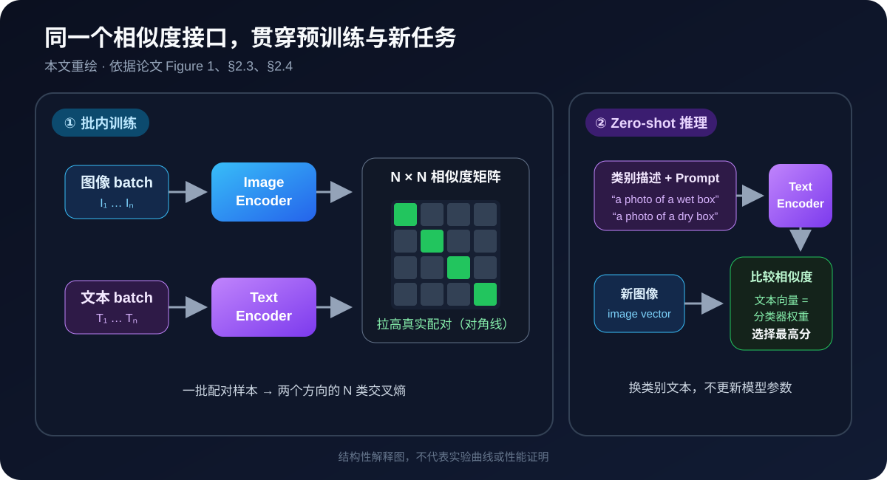
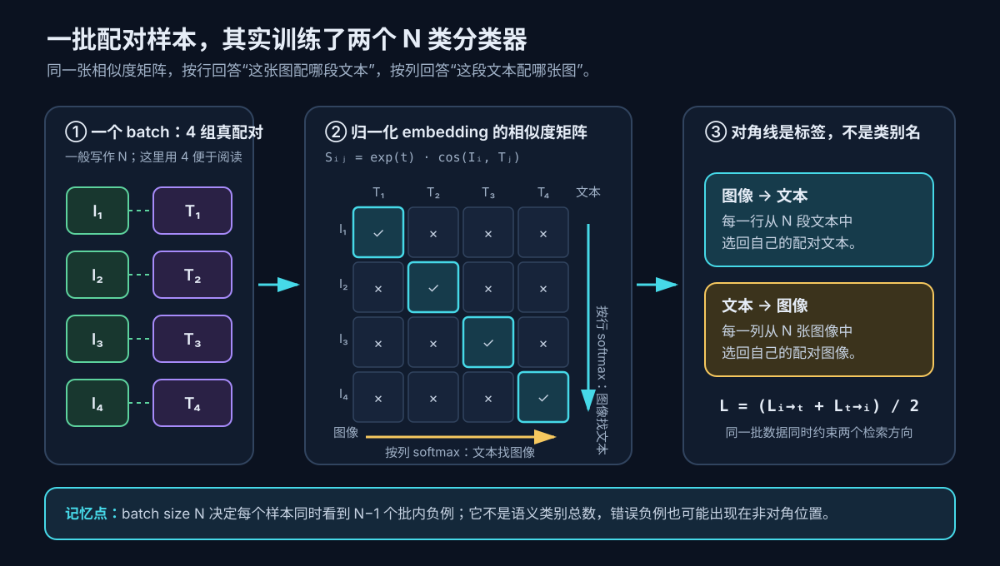
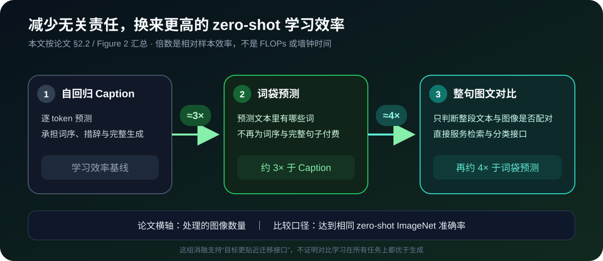
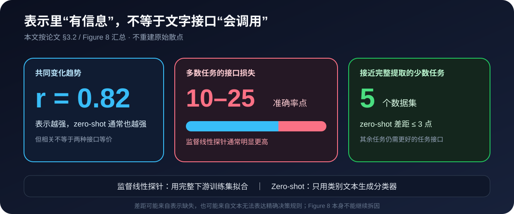

# 论文解读：Learning Transferable Visual Models From Natural Language Supervision

> **核心判断：CLIP 真正转移的不是“图像分类由 CNN 换成 Transformer”，而是任务定义权。传统分类器把类别写死在训练好的输出层里，逐词 Caption 又要求模型解释每一个词；CLIP 改成只判断一批图文中谁和谁配对，让文本编码器在推理时把任意类别描述即时变成线性分类器的权重。最关键的机制证据是 Figure 2：从预测准确文本转向整句配对后，zero-shot ImageNet 的学习效率显著提高；最重要的边界证据是 Figure 8：好的图像表示不等于好的 zero-shot 任务接口，多数数据集仍落后监督线性探针 10–25 个点。**

论文：Alec Radford、Jong Wook Kim、Chris Hallacy、Aditya Ramesh、Gabriel Goh、Sandhini Agarwal、Girish Sastry、Amanda Askell、Pamela Mishkin、Jack Clark、Gretchen Krueger、Ilya Sutskever，**Learning Transferable Visual Models From Natural Language Supervision**，ICML 2021，PMLR 139:8748–8763。  
主来源：[PMLR 论文页](https://proceedings.mlr.press/v139/radford21a.html)｜[论文 PDF](https://proceedings.mlr.press/v139/radford21a/radford21a.pdf)｜[arXiv v1](https://arxiv.org/abs/2103.00020v1)｜[论文源码包](https://arxiv.org/e-print/2103.00020)｜[OpenAI 官方介绍](https://openai.com/index/clip/)｜[官方代码固定提交](https://github.com/openai/CLIP/tree/d05afc436d78f1c48dc0dbf8e5980a9d471f35f6)｜[官方 Model Card](https://github.com/openai/CLIP/blob/d05afc436d78f1c48dc0dbf8e5980a9d471f35f6/model-card.md)

## 一、先看一个旧分类器答不了的问题

假设已经有一个只认识 ImageNet 1000 类的图像模型。今天拿来一批仓库照片，想区分：

- “包装完好的纸箱”；
- “外包装破损的纸箱”；
- “被雨淋湿的纸箱”。

传统分类模型的最后一层是固定权重矩阵。训练时没有这三个类别，推理时就没有这三个输出位置。要加入任务，通常得收集带标签样本，重新训练或至少拟合一个新分类头。

自然语言本来已经把新任务说清楚了。问题是怎样让文字不只是备注，而是真正进入分类器。

一个看似直接的答案是让图像模型生成 Caption：只要它能准确描述图片，就能理解视觉。但一张照片可以有许多同样正确的描述：

> a wet cardboard box；a damaged parcel in the rain；a soaked package outside……

逐词生成要求模型为词序、措辞和所有细节付费，而下游分类真正需要的只是：**哪段文字和这张图最匹配？** CLIP 的关键工程选择，就是不再要求图像解释一整句话，只要求它在候选文本中认出正确配对。

这篇论文的一句话脊柱是：

> **CLIP 用批内图文配对替代固定类别监督与逐词文本预测，把开放概念学习压缩成一个可扩展的检索问题；训练完成后，文本编码器再把类别说明生成成分类器权重。**

## 二、任务契约：CLIP 学了什么，又没有学什么

| 项目 | 论文设定 |
|---|---|
| 训练输入 | 一批配对的互联网图像与自然语言文本，共 400M 对的 WIT 数据 |
| 图像输出 | 一个全局图像 embedding |
| 文本输出 | 一个全局文本 embedding |
| 训练监督 | 只知道哪张图与哪段文本成对；不需要人工整理成固定类别 |
| 训练目标 | 提高真实图文对的余弦相似度，降低同批错误配对的相似度 |
| zero-shot 输入 | 待分类图像，以及由类别名/类别描述生成的一组 Prompt |
| zero-shot 输出 | 在给定候选文本集合上的概率分布 |
| 关键假设 | 互联网图文配对覆盖了足够多的视觉概念；文本能相对明确地描述目标任务 |
| 不直接解决 | 开放式 Caption、目标检测、像素分割、计数、空间定位、任意视觉推理与生产级安全校准 |

这里的 supervision 既不等于 ImageNet 式人工金标签，也不等于“没有监督”。图文是否共同出现，本身就是从互联网获得的弱而有噪声的监督信号。论文因此刻意使用 **natural language supervision**，避免被 supervised / weakly supervised / self-supervised 的命名争论遮住共同点。

## 三、先看完整黑盒：训练时配对，推理时用文字生成分类器

论文 Figure 1 可以按 1→2→3 阅读：训练阶段只要求相似度矩阵的对角线对应真实图文对；推理时把每个类别名填进 Prompt 后编码成文本向量；最后让一张新图与这些向量比较。下面的重绘图保留这条信息主线，但不复刻论文原图版式。

*本文依据论文 Figure 1、§2.3 与 §2.4 重绘；[查看 PMLR 正式论文及原图](https://proceedings.mlr.press/v139/radford21a.html)。它只解释训练与 zero-shot 推理为何共享同一图文相似度接口，不能单独证明学习效率、迁移精度或鲁棒性。*

这张图最容易被“两个 Encoder”吸引注意力，但真正应记住的是右上角：

> **文本 Encoder 不只是产生语义特征；在 zero-shot 分类视角下，它是一个 hypernetwork，根据自然语言生成线性分类器的权重。**

传统分类头的第 $k$ 列权重是训练参数 $w_k$。CLIP 的第 $k$ 列权重则来自：

$$
w_k
=
\frac{g_\phi(\operatorname{prompt}(c_k))}
{\left\|g_\phi(\operatorname{prompt}(c_k))\right\|_2},
$$

其中 $c_k$ 是类别名，$g_\phi$ 是文本编码器。换一组类别描述，就得到另一组分类器权重，不必更新模型参数。

## 四、核心目标：一批样本同时变成两个 N 类分类问题

### 4.1 从图像和文本得到同维向量

给定 batch 中第 $i$ 张图像 $I_i$ 与第 $j$ 段文本 $T_j$，图像与文本 Encoder 先得到特征，再用两个线性投影映射到共同的 $d_e$ 维空间并做 L2 归一化：

$$
u_i
=
\frac{f_\theta(I_i)W_I}
{\left\|f_\theta(I_i)W_I\right\|_2},
\qquad
v_j
=
\frac{g_\phi(T_j)W_T}
{\left\|g_\phi(T_j)W_T\right\|_2}.
$$

因为 $u_i$ 与 $v_j$ 都是单位向量，点积就是余弦相似度。相似度 logit 为：

$$
s_{ij}
=
\alpha u_i^\top v_j,
\qquad
\alpha=\exp(t)=\frac{1}{\tau}.
$$

$\tau$ 是 temperature，代码把它写成可学习的对数尺度 $t$。temperature 小，$\alpha$ 大，softmax 更尖锐；temperature 大，模型对相似度差异更宽容。论文把初始 $\tau$ 设为 0.07，并在训练时把 logit scale 上限裁到 100，防止数值不稳定。

### 4.2 对称交叉熵究竟对称在哪里

如果 batch 中正确配对是 $(I_i,T_i)$，图像到文本方向把每一行当作一个 $N$ 类分类问题：

$$
\mathcal L_{I\rightarrow T}
=
-\frac{1}{N}
\sum_{i=1}^{N}
\log
\frac{\exp(s_{ii})}
{\sum_{j=1}^{N}\exp(s_{ij})}.
$$

文本到图像方向把每一列当作另一个 $N$ 类分类问题：

$$
\mathcal L_{T\rightarrow I}
=
-\frac{1}{N}
\sum_{j=1}^{N}
\log
\frac{\exp(s_{jj})}
{\sum_{i=1}^{N}\exp(s_{ij})}.
$$

最终目标取两者平均：

$$
\mathcal L_{\mathrm{CLIP}}
=
\frac{1}{2}
\left(
\mathcal L_{I\rightarrow T}
+
\mathcal L_{T\rightarrow I}
\right).
$$

下面的教学图只回答一个问题：为什么论文 Figure 3 的两次 cross entropy 不是重复计算。

*本文根据论文 Figure 3 伪代码、§2.3 与官方 `model.py` 重绘。图中 $N=4$ 只为便于阅读；论文实际全局 batch size 为 32,768。*

把它翻译回“湿纸箱”的例子：

1. 图像 $I_1$ 不必复原配套文本的每个词，只需让 $s_{11}$ 高于 $s_{12},s_{13},\ldots$；
2. 文本 $T_1$ 也要从同批所有图像中找回 $I_1$，防止只有图像侧学会投机；
3. 同批其余 $N-1$ 个样本自动成为负例，batch 越大，每个正例同时比较的候选越多；
4. 但“同批未配对”不必然等于语义负例：两张不同狗图、两种等价 Caption 可能被当成负例。这是批内对比学习的隐含噪声，不是公式自动解决的问题。

> [!important] “$N^2-N$ 个错误配对”是训练构造，不是 $N^2-N$ 个可靠人工负标签
> CLIP 只知道数据收集时的配对关系。非对角位置有大量显然错误的组合，也可能包含语义等价、主题相近或一图多描述造成的假负例。规模让这种监督可用，但不会把配对信号自动变成完美语义真值。

## 五、两个 Encoder 里哪些细节真正影响使用

### 5.1 图像侧：Modified ResNet 与 ViT 两条路线

论文训练了 5 个 ResNet 与 3 个 Vision Transformer：

- Modified ResNet 使用三层卷积 stem、anti-aliased 下采样，并用单层 QKV attention pooling 替代全局平均池化；
- ViT 基本沿用原始 Vision Transformer，只在 patch 与位置 embedding 相加后额外加一层 LayerNorm，并调整初始化；
- ResNet 扩展时同时增加深度、宽度与输入分辨率；文本 Transformer 只随视觉主干增加宽度，深度保持 12 层，因为论文发现性能对文本容量不那么敏感；
- 线性探针实验显示 CLIP-ViT 大约比 CLIP-ResNet 有 **3×** 更高的计算效率。这里比较的是 CLIP 内部两类视觉主干，不应泛化成“所有 ViT 都比所有 CNN 快 3×”。

### 5.2 文本侧：“masked attention”不是 BERT 式 MLM

文本 Encoder 是 12 层 Transformer，使用 lower-cased BPE。论文中的 “masked self-attention” 指**因果 Attention mask**，不是随机遮词的 Masked Language Model。作者保留因果 mask，是为了未来能从预训练语言模型初始化或加入语言建模辅助目标；本论文并没有训练文本生成目标。

官方源码可见：

- `build_attention_mask()` 用上三角 $-∞$ 构造因果 mask；
- 文本在 `[EOS]` 位置取最高层 hidden state，LayerNorm 后线性投影；
- 发布代码的 `context_length=77`，含起止 token；超过长度默认报错，只有显式 `truncate=True` 才截断；
- 论文正文写 BPE 词表 49,152，而超参数表与发布权重使用 49,408。实际加载官方 checkpoint 时应服从权重与 tokenizer，而不是仅按正文数字重建。

对应固定源码：[因果 mask、EOT pooling 与相似度计算](https://github.com/openai/CLIP/blob/d05afc436d78f1c48dc0dbf8e5980a9d471f35f6/clip/model.py#L328-L372)；[77 token 的 tokenizer 行为](https://github.com/openai/CLIP/blob/d05afc436d78f1c48dc0dbf8e5980a9d471f35f6/clip/clip.py#L205-L245)。

### 5.3 论文训练描述与公开推理代码不能画等号

论文说训练时把 $α$ 裁到不超过 100。公开 `forward()` 只执行 `self.logit_scale.exp()`，没有 clamp。这个差异不表示论文没有裁剪：官方仓库根本没有发布完整训练循环，推理时加载的是已经训练好的参数。它只说明：

> **不能从推理仓库证明训练门限怎样实现，也不能复制 `forward()` 就声称复现了论文训练。**

同理，公开代码能验证 Encoder 结构、张量路径、预处理和 checkpoint 接口，但不能验证论文所述的半精度 Adam 状态、随机舍入文本权重或分片相似度训练细节。

## 六、zero-shot 分类不是魔法，而是文本生成的归一化线性分类器

### 6.1 推理公式

给定类别集合 $C=\{c_1,\ldots,c_K\}$，先为每个类别生成 Prompt：

$$
p_k=\text{“a photo of a }\{c_k\}\text{.”}
$$

文本 Encoder 产生单位向量 $w_k$，图像 Encoder 产生单位向量 $u$。预测为：

$$
p(y=k\mid I)
=
\frac{\exp(\alpha u^\top w_k)}
{\sum_{m=1}^{K}\exp(\alpha u^\top w_m)}.
$$

它等价于一个满足以下约束的多项逻辑回归：

- 输入与分类权重都 L2 归一化；
- 没有 bias；
- 用共享 temperature 缩放；
- 权重由文本 Encoder 生成，而不是由下游样本梯度拟合。

因此 “zero-shot” 不是“模型自由回答任何视觉问题”，而是**在你给定的候选文本集合中做闭集选择**。类别集合、Prompt 句式与是否加入背景类别，都是分类器定义的一部分。

### 6.2 Prompt 不是包装文案，而是模型参数的生成输入

单独写 `boxer`，文本 Encoder 无法知道它指拳击手还是拳师犬；写成 `a photo of a boxer, a type of pet`，才把词义与任务说清。论文还发现，互联网图文很少只有一个孤立名词，因此 `a photo of a {label}` 能缩小训练文本与评测类别名之间的分布差异。

论文 Figure 4 比较同一个视觉模型在不同文本接口下的表现：模型权重没变，只改变类别文本与 embedding 集成，平均分就出现稳定间隔。下面把论文报告的关键增益重排成可读的证据卡，而不是复刻原始曲线。

*本文依据论文 §3.1 与 Figure 4 重绘；[查看 PMLR 正式论文及原图](https://proceedings.mlr.press/v139/radford21a.html)。ImageNet 的 1.3 与 3.5 点是论文分解，36 个数据集上的平均组合提升接近 5 点；这不证明手工 Prompt 能在所有任务上稳定泛化，因为 Prompt 本身是在验证集反馈中开发的。*

论文给出的 ImageNet 分解更具体：

- 单个默认模板相对只写类别名提升 **1.3** 个准确率点；
- 对 80 个上下文模板的文本 embedding 做集成，再额外提升 **3.5** 点；
- 两者合计接近 **5** 点，而且文本向量可以预计算并缓存，摊到大量图像后几乎不增加单图主干计算。

这也是最早一批清楚展示“Prompt 设计能改变视觉任务性能”的大规模结果。但它同时暴露一个边界：CLIP 的任务接口不是稳定的符号 API，而是对自然语言措辞敏感的连续表示。

### 6.3 论文里的 zero-shot 到底“零”在哪里

论文把 zero-shot 定义得比传统“未见类别”更宽：重点是迁移到**未做下游训练的数据集/任务**。它不保证：

- 类别词从未出现在 400M 预训练文本中；
- 相似图片从未出现在互联网数据中；
- 研究者完全没有看过下游验证集。

恰恰相反，论文限制部分承认，团队反复查询完整验证集来开发 CLIP，并据此调整 Prompt 与评测集合。因此更准确的说法是：

> **没有用下游训练样本更新模型权重，不等于没有使用下游任务知识，也不等于严格的盲测。**

## 七、为什么对比目标能扩展：关键不是更“高级”，而是少承担无关责任

论文早期尝试让图像 CNN 条件化一个 63M 参数文本 Transformer，自回归预测 Caption。这个文本模型的计算量已经约为 ResNet-50 图像 Encoder 的两倍，却在 zero-shot ImageNet 上学习得很慢。

作者随后做了两次责任削减：

1. 从逐 token 自回归 Caption，改成预测文本的 bag-of-words，放弃词序与完整生成，学习效率提高约 **3×**；
2. 从预测有哪些词，改成只判断整段文本是否与图像配对，zero-shot 学习效率再提高约 **4×**。

论文 Figure 2 不能只看最终曲线高低，而要比较达到同一 zero-shot ImageNet 准确率时三种目标各自需要处理多少图像。下面将论文的相对学习效率结论重绘成责任逐步削减的阶梯，不伪造原图未给出的绝对 FLOPs 或耗时。

*本文依据论文 §2.2 与 Figure 2 重绘；[查看 PMLR 正式论文及原图](https://proceedings.mlr.press/v139/radford21a.html)。它是全文最接近因果消融的证据：作者从同一词袋表示基线替换成对比目标，观察到约 4× 的样本效率提升。这里衡量的是处理图像数与 zero-shot ImageNet 准确率，不等同于严格的 FLOPs、墙钟时间或最终多任务质量对照。*

CLIP 赢的不是“对比学习能表达所有语言细节”，而是它选择了一个与目标匹配、容易扩展的代理任务：

> **如果最终需要的是检索、匹配和分类，就没有必要先支付完整生成的成本。**

这份效率也有代价。对比目标只训练相对相似度，不能像 Caption 模型那样产生开放文本。论文自己把“联合对比与生成目标”列为未来方向。

## 八、证据阶梯：有效、为什么有效、还有多少没解决

### 8.1 能力证据：同一表示迁移到广泛任务

论文在 30 多个数据集上评估 OCR、视频动作、地理定位、场景、纹理与细粒度分类。最常引用的结果是：

- 最佳 ViT-L/14@336px 在 ImageNet zero-shot 达到 **76.2% top-1、95% top-5**，匹配原始监督 ResNet-50；
- zero-shot CLIP 在 27 个数据集中，有 **16 个**超过“在 ResNet-50 特征上训练监督逻辑回归”的基线；
- 对 CLIP 表示训练监督线性探针时，最佳 CLIP 在 **21/27** 个数据集上超过 Noisy Student EfficientNet-L2 的特征；
- zero-shot CLIP 的平均表现约等于同一 CLIP 特征上的 **4-shot** 逻辑回归；在 ImageNet 上约等于 **16-shot**。

这些结果支持“自然语言监督能学到宽任务覆盖的视觉表示”，但不能合并成“zero-shot CLIP 已经超过当时所有监督模型”。论文选择的 zero-shot 对照只是经典 ResNet-50 线性基线，许多任务的专用 SOTA 仍明显更强。

### 8.2 机制证据：目标函数效率最清楚，其他因素仍纠缠

Figure 2 对“为什么选择对比目标”给出较直接证据；但 CLIP 最终系统还同时改变了：

- 数据规模与查询式采样；
- 视觉主干与模型规模；
- 文本建模方式；
- 大 batch 与更多负例；
- Prompt 与集成；
- 训练算力。

因此 ImageNet 76.2% 是完整系统能力证据，不能全部归因于 InfoNCE。论文把 Visual N-Grams 从 11.5% 提升到 76.2%，但也坦率说明 CLIP 使用约 10× 数据、近 100× 单次视觉计算，训练总计算很可能超过 1000×；这不是受控方法对比。

### 8.3 边界证据：表示强，不代表文本能把任务说准

论文 Figure 8 的横轴是在冻结 CLIP 图像特征上，用完整下游训练集拟合的监督线性探针；纵轴是纯文本生成的 zero-shot 分类器。虚线 $y=x$ 表示任务文本完全提取出表示中可线性使用的信息。下面把散点图的三个可核验结论提炼成“表示—接口”差距摘要，不重建原始数据点。

*本文依据论文 §3.2 与 Figure 8 重绘；[查看 PMLR 正式论文及原图](https://proceedings.mlr.press/v139/radford21a.html)。二者相关系数为 $r=0.82$，说明底层表示越好，zero-shot 通常也越好；但多数任务仍低 10–25 点，只有 5 个数据集差距不超过 3 点。它直接反驳“有共享 embedding 就等于任务已被语言完整表达”。*

这张图把两个经常混在一起的问题拆开：

1. **Representation learning：** 图像 embedding 是否包含任务需要的信息？
2. **Task learning / task interface：** 类别文本能否把这些信息变成正确决策边界？

CLIP 同时推进了两者，但第二个问题明显没有解决完。CLEVRCounts、KITTI Distance、EuroSAT 等任务的差距尤其大：可能是表示缺信息，也可能是候选文本无法表达精确决策规则，Figure 8 本身不能进一步分因。

### 8.4 鲁棒性证据：少做目标分布适配，反而少过拟合目标分布

论文在 7 个 ImageNet 自然分布偏移数据集上报告，zero-shot CLIP 相对同等 ImageNet 精度的标准模型，最多缩小 **75% robustness gap**。更有解释力的干预是：

- 在 CLIP 特征上用 ImageNet 训练集拟合监督逻辑回归，ImageNet 准确率提高 **9.2** 点到 85.4%；
- 但 7 个分布偏移集的平均准确率略降；ImageNet-R、ObjectNet、ImageNet Sketch、ImageNet-A 分别下降 4.7、3.8、2.8、1.9 点；
- 随着从 zero-shot 增加到 few-shot、full-shot，有效鲁棒性优势逐渐消失。

这支持“目标分布适配会把决策边界拉向目标数据的特殊相关性”。但作者没有证明监督学习本身必然造成鲁棒性差；大规模多样数据、自然语言监督与 zero-shot 协议仍然纠缠。论文也区分 **effective robustness** 与 **relative robustness**：zero-shot 的相对准确率未必最高，只是比同等 in-distribution 精度的模型更少掉点。

### 8.5 数据重叠没有让问题消失，只给出了一个有限审计

作者没有在训练前删除所有未来 benchmark 重复样本，而是训练后用专门近重复检测器把 35 个评测集拆为 `Overlap` 与 `Clean`：

- 中位重叠率 2.2%，平均 3.2%；
- 最大估计总体准确率增益是 Birdsnap 的 0.6%；
- 只有 2 个数据集在 Bonferroni 校正后仍有显著总体提升；
- Country211 重叠率最高为 21.5%，因为它来自 YFCC100M，而 WIT 含过滤后的 YFCC 子集，但估计只增加 0.2 点。

这是值得肯定的污染审计，却不是“证明没有泄漏”。检测器不可能在 400M 样本上证明召回率，`Overlap` 与 `Clean` 也可能难度不同。正确结论是：**被检测到的近重复没有解释主要结果；未检测到的重叠与更广义的语义污染仍是开放问题。**

## 九、数据才是 CLIP 能力边界的另一半

WIT（WebImageText）包含约 400M 图文对。构造方法不是无差别抓取：

1. 先建立约 500,000 个查询，包括英文 Wikipedia 中频次足够高的词、高 PMI 二元短语、热门 Wikipedia 文章名和 WordNet synset；
2. 每个查询最多纳入 20,000 个图文对，近似平衡概念覆盖；
3. 数据来自多种公开互联网来源，文本与图片共同出现，但并非人工验证 Caption；
4. 数据没有公开，论文只给出构造摘要，外部无法完全审计来源、过滤、去重与概念分布。

附录用相同规模的 WIT 子集与过滤后的 YFCC100M 训练同型 RN50。两者在平均 zero-shot 与线性探针上相近，但单任务差异可超过 10 点：YFCC 对鸟与花更强，WIT 对汽车和宠物更强。这个结果很关键：

> **CLIP 不是只靠“总数据量”形成通用能力；某类概念在预训练分布中的密度，会直接决定它在对应任务上的迁移质量。**

论文最有诚实感的失败例是 MNIST。CLIP 的语义 OCR 在数字渲染文本上可用，但 zero-shot MNIST 只有 **88%**，甚至被原始像素上的逻辑回归超过。作者在 WIT 近邻中几乎找不到类似手写数字的图像，因此结论不是“规模解决 OOD”，而是：CLIP 尽量把更多世界吞进 in-distribution；真正缺席的分布仍然脆弱。

## 十、训练与工程实现：论文能复现到哪一步

### 10.1 训练配方与算力

| 项目 | 论文披露 |
|---|---|
| 数据 | WIT，约 400M 图文对；32 epochs |
| 全局 batch | 32,768 |
| 优化器 | AdamW；weight decay 0.2；gain 与 bias 不衰减 |
| 学习率 | 2,000 step warm-up，随后 cosine decay；各模型基础 LR 不同 |
| temperature | 初始 $\tau=0.07$；训练时 logit scale 最大 100 |
| 数据增强 | resize 后 random square crop；论文称仅使用这一种训练增强 |
| 精度与显存 | mixed precision、gradient checkpointing、半精度 Adam 状态、随机舍入的半精度文本权重 |
| 分布式相似度 | similarity 计算分片，每张 GPU 只计算本地所需子集 |
| RN50x64 | 输入 448、embedding 1024、LR $3.6\times10^{-4}$；592 张 V100 训练 18 天 |
| ViT-L/14 | 输入 224、embedding 768、LR $4\times10^{-4}$；256 张 V100 训练 12 天 |
| ViT-L/14@336px | 在 336 分辨率额外训练 1 epoch，LR $2\times10^{-5}$；额外墙钟时间未披露 |

【本文推导】如果把 400M 样本、32 epochs 与全局 batch 32,768 近似按整批相除，总样本曝光约为 12.8B，对应约 390,625 个优化 step：

$$
\frac{400\times10^6\times32}{32768}
\approx
390625.
$$

每个样本概念上同时面对 32,767 个批内负例；完整相似度矩阵约有 $1.07\times10^9$ 个位置。但论文明确使用分片计算，所以不能据此声称单卡物化了十亿元素矩阵。

论文没有披露：

- V100 是 16GB 还是 32GB；
- 数据抓取、解码、存储与带宽成本；
- 每个模型的完整 FLOPs、利用率与失败重跑；
- ViT-L/14@336px 额外 epoch 的卡数与时长；
- 400M 数据的可下载版本和可执行训练脚本。

因此可以复现**目标函数与公开 checkpoint 推理**，不能独立复现原始数据配方和同口径训练结果。

### 10.2 官方推理代码里真正值得注意的细节

固定提交 `d05afc4` 提供 9 个公开模型名及带 SHA-256 路径的 checkpoint 下载地址。预处理为：

1. 按模型输入尺寸 bicubic resize；
2. center crop；
3. 转 RGB；
4. 转 tensor；
5. 用 CLIP 专用 mean/std 归一化。

源码：[官方预处理与 checkpoint 列表](https://github.com/openai/CLIP/blob/d05afc436d78f1c48dc0dbf8e5980a9d471f35f6/clip/clip.py#L30-L86)。把 ImageNet 归一化均值直接套给 CLIP，或忘记使用随 checkpoint 返回的 preprocess，都会造成不可比较的结果。

推理时先分别调用 `encode_image` 与 `encode_text`，再归一化、乘 learned logit scale 并做矩阵乘法。若类别集合固定，应缓存 Prompt 的 text embedding；检索系统也应离线缓存图库 embedding。这样在线路径只需一次视觉前向和向量检索，而不是为每张图重复编码全部类别文本。

### 10.3 最低配置、推荐配置与生产缺口

| 层级 | 可做什么 | 不能据论文声称什么 |
|---|---|---|
| 最低研究配置 | 官方 `clip.load()` 明确支持 CPU，可用 RN50 或 ViT-B/32 做功能验证 | 论文未给 CPU 延迟与内存；“能运行”不等于可服务 |
| 推荐评测配置 | 使用 CUDA GPU、批量编码、缓存文本权重；固定 checkpoint、预处理、Prompt、类别集与随机/数据版本 | 论文未给单卡显存、吞吐、P95 延迟或跨硬件 benchmark |
| 生产系统 | 加入域内校准、拒识/OOD、类别与 Prompt 版本管理、偏见和安全测试、监控、回滚与人工审核 | 官方 Model Card 明确称所有未经充分域内测试的部署均超出原模型预期范围 |

官方 Model Card 还把监控、面部识别与所有部署使用列为 out-of-scope，并建议英文场景限定使用，因为模型没有为其他语言做专门训练或评测。这不是许可证条款的替代，而是能力与风险边界。

## 十一、论文明确承认的限制与风险

### 11.1 它是全局匹配器，不是通用视觉推理器

CLIP 对常见物体、动作、场景与语义 OCR 有较强迁移，但在以下任务明显弱：

- 计数与系统性关系推理；
- 最近车辆距离等抽象、任务专用属性；
- 汽车型号、花卉、飞机型号等细粒度分类；
- 真正脱离互联网预训练分布的图像；
- 小物体检测、目标定位与像素分割；
- 给定候选集合之外的开放文本生成。

论文按当时 scaling 曲线估计，要靠同一路线达到整体 SOTA 可能还需约 **1000×** 训练计算，作者直接判断当时硬件不可行。这个外推只反映论文模型族的经验趋势，不是后续 CLIP 家族的定律。

### 11.2 “多给一张样本”反而可能变差

论文的 few-shot 做法是在 CLIP 特征上从头拟合逻辑回归，没有把 zero-shot 文本权重自然作为先验。结果是 zero-shot 平均等于同特征 4-shot，简单 few-shot 反而可能不如 zero-shot。作者试过用 L2 把 few-shot 权重拉向 zero-shot 权重，但超参搜索经常把最优解推回几乎纯 zero-shot。

这不是“CLIP 天生不需要样本”，而是论文没有解决**怎样把语言先验与少量标注联合起来**。

### 11.3 Prompt 与类别集合会改变偏见怎样显现

论文不是只在结尾笼统写“可能有偏见”，而是用 FairFace 与国会议员图像做探索性 probe。需要同时记住两点：

1. 这些种族、性别与年龄类别本身是有问题且不完备的社会构造；测量它们不代表赞同自动分类人；
2. 结果显示风险不仅来自 embedding，也来自开发者怎样写候选类与阈值。

在包含犯罪词与非人类动物词的候选集合中，论文报告 10,000 张 FairFace 图像有 4.9% 被错分为非人类类别，且不同群体差异显著；加入 `child` 类别后，20 岁以下图像落入伤害性类别的比例大幅变化。模型并没有变，改变的是类别集合。

同样，zero-shot 名人识别在 100 个候选名字时 top-1 为 59.2%，候选扩大到 1000 时降到 43.3%。它不及专业系统，却说明互联网预训练会产生并非显式设计的身份识别能力。论文与 Model Card 都把监控/面部识别视为高风险或超范围场景。

因此生产上的安全边界不能只写一句“模型有 bias”。至少要把以下对象版本化并审计：

- 候选类别全集，而不只是目标类别；
- Prompt 句式、同义词与背景类；
- temperature、阈值与拒识规则；
- 不同人群、场景和图像质量下的错误分布；
- 新增一个类别后，其他类别概率怎样重分配。

### 11.4 数据不可复审，限制了科学复现与治理

WIT 没有公开。读者无法独立核对数据来源、版权状态、个人信息、语言地域分布、过滤与删除机制，也无法复现 query 采样后的具体概念密度。论文展示了污染分析与偏见 probe，但这些都是作者在私有数据上的自审计。

这意味着 CLIP 最强的因果链里有一个不可外部验证的环节：

> **我们能审计目标函数、公开权重和输出行为，却不能完整审计“模型到底从哪些图文共同出现中学到了什么”。**

## 十二、放回知识库：后来系统使用的“CLIP”常常不是论文原始接口

### 12.1 Stable Diffusion 用的是文本 Encoder 的逐 token hidden states

CLIP 原论文做图文相似度时，文本侧最终取 `[EOS]` 的 pooled embedding。Stable Diffusion v1 则把冻结的 CLIP ViT-L/14 文本 Encoder 的**逐 token hidden states**送入 U-Net Cross-Attention，让“红色”“猫”“草地”等词在去噪过程中分别提供条件。见 [[论文解读：High-Resolution Image Synthesis with Latent Diffusion Models]]。

因此“Stable Diffusion 使用 CLIP”不等于“它只拿一个 CLIP pooled vector 做图文分类”，更不等于 CLIP 论文验证了扩散生成质量。

### 12.2 Stable Video Diffusion 把 CLIP 同时当条件器与数据尺子

SVD 的图生视频分支用 CLIP 图像 embedding 提供参考图的高层语义；数据管线又用 CLIP 相似度筛选图文对齐。见 [[论文解读：Stable Video Diffusion: Scaling Latent Video Diffusion Models to Large Datasets]]。

这两种消费都建立在 CLIP embedding 可比较的性质上，但原论文没有证明：

- CLIP 相似度就是生成视频质量；
- CLIP embedding 能精确保持人物身份与局部几何；
- 按 CLIP 过滤数据不会删除文字密集、低照度或文化特定内容。

### 12.3 后来的 VLM 已经越过“只做相似度”

知识库中的 [[图生模版：从多模型工作流到端到端视觉语言模型]]要求模型输出元素类型、坐标和结构化 Schema。CLIP 能回答“哪段文字更像这张图”，不能自回归地产生这份设计契约，也没有 token 级定位头。

把 CLIP 看作今天 VLM 的起点比看作缩小版 VLM 更准确：它证明了自然语言可以定义开放视觉概念，并建立了共享表示接口；后续生成式 VLM 又加入细粒度视觉 token、跨模态融合和文本生成能力。

## 十三、当前综合结论：CLIP 的遗产是接口，不只是 embedding

### 论文直接建立的事实

1. 400M 互联网图文对上的对称对比学习，可以从头训练出覆盖多类视觉任务的表示；
2. 相比逐词 Caption 与词袋预测，整句配对显著提高 zero-shot ImageNet 的学习效率；
3. 类别文本可以生成归一化线性分类器权重，使同一模型无需下游梯度更新就切换候选任务；
4. zero-shot CLIP 在多项 benchmark 与自然分布偏移上很强，但远非普遍最优，且对 Prompt、任务类型和预训练分布高度敏感。

### 本文推导出的工程判断

1. **Prompt、类别全集与 temperature 都属于模型接口版本，不能当作调用参数随意漂移。**
2. **共享 embedding 的价值在于把训练、检索、分类和后续条件控制接到同一相似度接口；它不自动提供生成、定位或可校准置信度。**
3. **大 batch 既是更多负例的来源，也是潜在假负例与分布式通信的工程来源；公式简单不等于训练系统简单。**
4. **生产落地的最低门槛不是跑通 `model(image, text)`，而是域内评测、拒识、类别设计审计和行为监控。**

### 仍未回答的问题

- 在固定数据与算力下，对比目标、batch size、数据查询策略和模型结构分别贡献多少？
- 怎样把文本生成的 zero-shot 权重与少量标注稳定结合，而不是二选一？
- 怎样在不依赖私有超大数据的前提下复现数据覆盖与可审计性？
- 怎样让相似度模型可靠表示计数、空间关系、组合否定和真正的新分布？
- 当类别集合动态变化时，怎样建立可比较、可拒识、对群体公平的概率接口？

## 十四、一周后应该记住什么

1. **CLIP 不生成 Caption；它把一批图文配对变成两个方向的 N 类分类，并学习共同坐标系。**
2. **zero-shot 分类器不是预先训练好的固定头，而是文本 Encoder 根据 Prompt 即时生成的单位向量权重。**
3. **Figure 2 证明对比目标更容易扩展；Figure 8 提醒我们，表示里有信息，不代表语言接口已经把任务说对。**
4. **CLIP 的强大来自数据覆盖、目标效率、模型规模与语言接口共同作用；它的偏见、盲区和部署风险也来自同一组合。**

## 参考资料

1. Alec Radford et al., [Learning Transferable Visual Models From Natural Language Supervision](https://proceedings.mlr.press/v139/radford21a.html), ICML 2021, PMLR 139:8748–8763.
2. OpenAI, [CLIP: Connecting text and images](https://openai.com/index/clip/), 2021-01-05.
3. OpenAI, [CLIP official repository at `d05afc4`](https://github.com/openai/CLIP/tree/d05afc436d78f1c48dc0dbf8e5980a9d471f35f6), verified 2026-08-02.
4. OpenAI, [CLIP Model Card](https://github.com/openai/CLIP/blob/d05afc436d78f1c48dc0dbf8e5980a9d471f35f6/model-card.md), verified 2026-08-02.
5. Aaron van den Oord, Yazhe Li, Oriol Vinyals, [Representation Learning with Contrastive Predictive Coding](https://arxiv.org/abs/1807.03748), 2018. 论文用它追溯 InfoNCE；CLIP 的具体结论仍以原论文为准。
6. Kihyuk Sohn, [Improved Deep Metric Learning with Multi-class N-pair Loss Objective](https://proceedings.neurips.cc/paper/2016/hash/6b180037abbebea991d8b1232f8a8ca9-Abstract.html), NeurIPS 2016. 论文用它追溯批内 N-pair 构造。
