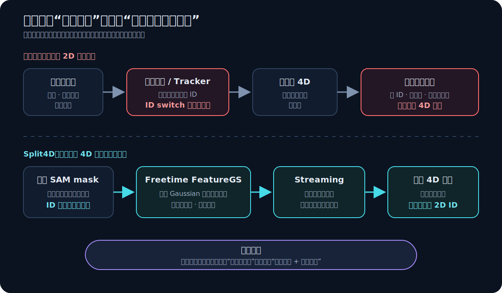
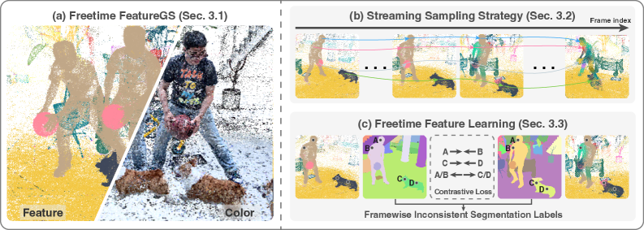
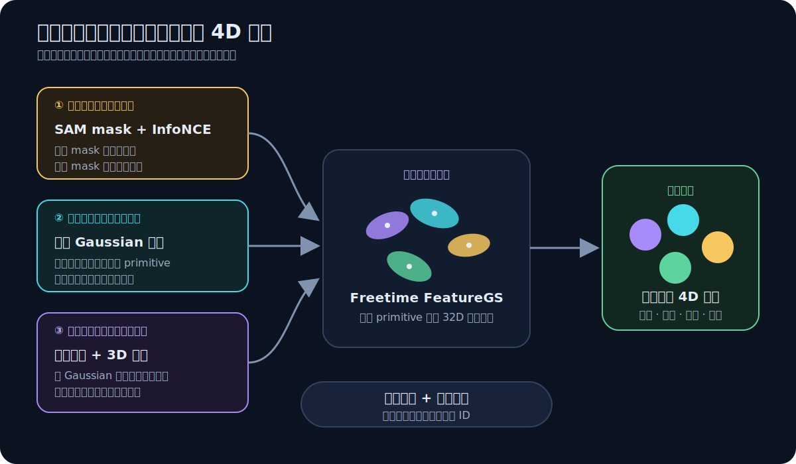
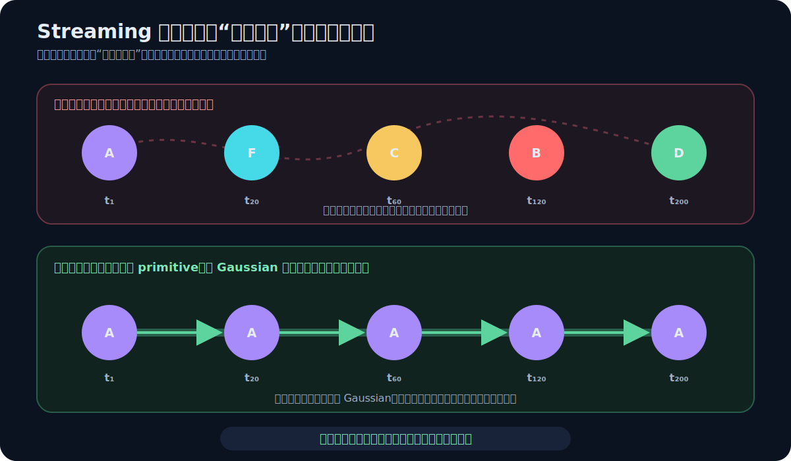
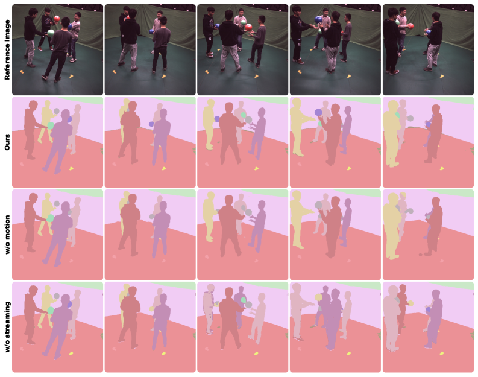
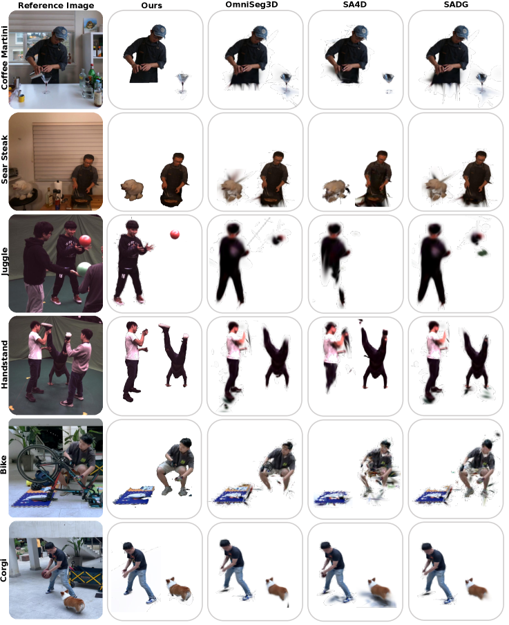
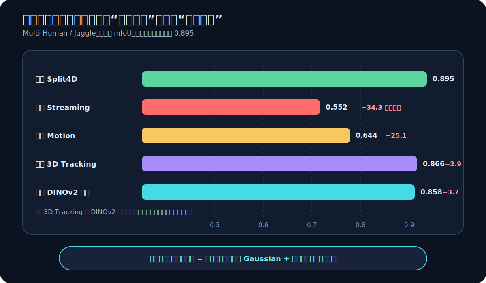

# 论文解读：Split4D: Decomposed 4D Scene Reconstruction Without Video Segmentation

> **核心判断：Split4D 没有消灭时序对应，而是把它从脆弱的 2D 视频标签，迁移到运动 Gaussian 与流式优化中。最关键的证据是：去掉 streaming learning 后，mIoU 从 0.895 降到 0.552。**

论文：**Split4D: Decomposed 4D Scene Reconstruction Without Video Segmentation**  
作者：Yongzhen Hu, Yihui Yang, Haotong Lin, Yifan Wang, Junting Dong, Yifu Deng, Xinyu Zhu, **Fan Jia**, Hujun Bao, Xiaowei Zhou, Sida Peng  
发表：ACM Transactions on Graphics 44(6), Article 215，SIGGRAPH Asia 2025  
链接：[arXiv:2512.22745](https://arxiv.org/abs/2512.22745)｜[DOI: 10.1145/3763343](https://doi.org/10.1145/3763343)

## 一、先看一个会失败的场景

想象一段多人传球视频。

在第 80 帧，球还在 A 手里；第 81 帧，球被手臂遮住；第 82 帧，球出现在 B 手边。单张图像中的 SAM 可以把人、球和背景分开，但视频追踪器还要回答一个更难的问题：

> 第 82 帧重新出现的这团像素，还是不是第 80 帧的那颗球？

如果视频 tracker 在遮挡处换了 ID，传统 4D 分割会把错误标签通过可微渲染提升到 4D。结果不只是某一帧颜色错了，而是同一颗球在时空表示里被切成两个对象。后续执行“删除球”“复制 A”或“只移动 B”时，错误会跨视角、跨时间一起暴露。

多视角还增加了第二种不一致：同一时刻，相机 1 把某个人叫作实例 3，相机 8 可能叫作实例 7。于是，可分解 4D 重建真正困难的不是生成一张 mask，而是同时解决：

1. 同一张图内，哪些像素属于同一个实例；
2. 不同相机里，哪些区域对应同一个 3D 对象；
3. 对象运动、遮挡和交互后，身份如何继续保持。
 

*图 1：传统方法要求 2D 视频标签预先解决全局身份；Split4D 只要求逐图分组，把身份一致性的责任移到 4D 表示和优化路径。*

这张图就是理解全文的入口：**Split4D 降低的不是分割本身，而是监督必须预先提供的对应范围。**

## 二、任务契约：论文到底输入什么、输出什么

| 项目 | Split4D 的设定 |
|---|---|
| 输入 | 同步多视角 RGB 视频、相机信息、由 SAM 生成的逐图实例 mask |
| 基础表示 | 已经训练好的 FreeTimeGS 动态 4D 重建 |
| 学习目标 | 为每个 4D Gaussian 学习实例特征，使同一对象跨视角、跨时间聚在一起 |
| 输出 | 可渲染、可分割、可按实例编辑的 decomposed 4D representation |
| 不要求 | 视频 tracker、跨帧一致 mask ID、跨相机一致 mask ID |
| 关键假设 | 底层重建质量足够好；相邻时刻存在局部运动连续性或可恢复的 3D 交接 |
| 不解决 | 删除后的补全、真实阴影变化、重光照与物理反应 |

### “Without Video Segmentation”究竟是什么意思

这句话最容易被误读。

Split4D **仍然使用 2D 分割**，而且训练 mask 来自 SAM。它去掉的是视频分割器最脆弱的部分：不要求一个外部模型沿整段视频维持稳定 ID，也不要求多个相机共享同一套实例编号。

因此，准确表述是：

> Split4D 使用彼此独立的逐图 mask，只读取一张图内部的“同组/异组”关系，再由 4D 表示建立跨视角、跨时间的一致性。

它也不是“完全无追踪”。论文的 3D tracking regularization 会在相邻帧中为即将消失的 Gaussian 寻找 3D 近邻接替者。区别在于，这是一种**表示内部的局部特征交接**，不是外部视频 tracker 提供的全局对象 ID。

## 三、旧方法卡在哪里：全局对应放错了位置

| 路线 | 身份一致性来自哪里 | 强项 | 在复杂运动中的断点 |
|---|---|---|---|
| SA4D | DEVA 等视频 tracker 的时序 ID | 标签可直接提升到 4D | 遮挡、长序列和多人交互中的 ID switch 会固化进 4D |
| SADG | canonical Gaussian 与 deformation field | 不需要对象追踪 ID | 大幅运动使 canonical deformation 难优化，几何与对应同时受损 |
| Split4D | 自由时空 Gaussian 的短程运动、复用与流式特征传播 | 不需要全局 2D ID，适合复杂大运动 | 局部连续性断裂、重建失败或长遮挡时仍可能失效 |

SA4D 的瓶颈在监督：它先相信视频标签，再把标签写入 4D。SADG 的瓶颈在表示：它先把动态场景压回 canonical space，希望形变场提供时间对应。

Split4D 的改动不是“再换一个特征损失”，而是重新分配责任：

- 逐图 mask 只负责提供局部组别关系；
- 4D Gaussian 负责承载跨视角和短程时间对应；
- streaming learning 负责把短程对应扩展到长时间；
- 3D tracking 与 DINOv2 只在主链不稳定时提供辅助约束。

## 四、先看黑盒：三类局部一致性如何合成一个 4D 身份

先看原论文 pipeline 的三条横向链路：上方是 Freetime FeatureGS 如何把动态场景表示成时空 Gaussian，中间是逐图 mask 如何监督 4D 特征，底部是 streaming sampling 如何让监督按时间传播。不要先陷进每个 loss，先确认“局部 mask → Gaussian 特征 → 长程身份”的责任流。

*论文原图 Figure 2，来源：[Split4D](https://arxiv.org/abs/2512.22745)。这张图直接支持三段式方法结构，以及 mask 监督通过渲染特征回传到 4D Gaussian 的实现关系；它没有单独证明 streaming 或 motion modeling 的必要性，组件贡献要由 Figure 3 的消融判断。*

*图 2：单图 mask、跨视角共享 Gaussian、相邻时间的运动与交接，共同约束同一批实例特征。*

可以把整套方法理解成一张时空约束图：

- **单图正负边**：同一 mask 内靠近，不同 mask 之间分开；
- **跨视角共享边**：不同相机投影到同一个 Gaussian 参数；
- **局部时间边**：运动 Gaussian 在相邻时刻复用，消失时再向新近邻交接。

只要这些局部边把一条对象轨迹连起来，就不需要外部 tracker 一次性回答“第 1 帧和第 200 帧是否是同一对象”。全局身份由局部连通关系逐步涌现。

下面逐层打开这张图。

## 五、第一层：Freetime FeatureGS 让 Gaussian 成为身份载体

### 5.1 为什么不用一个全局形变场

Split4D 建立在 [FreeTimeGS](https://arxiv.org/abs/2506.05348) 上。

Canonical deformation 的思路是：先在一个标准空间里放置 Gaussian，再学习每个时刻如何把它们变形到观测空间。这对小幅、平滑运动很自然，但在多人快速交互、物体交换和大范围位移时，一个全局形变场很难同时解释所有轨迹。

FreeTimeGS 反过来允许 Gaussian 在任意时空位置出现。每个 primitive 有 4D 均值、4D 尺度、透明度、4D 旋转和球谐外观，并额外带一个三维速度。若空间中心是 $\boldsymbol{\mu}_x$、时间中心是 $\mu_t$，则时刻 $t$ 的位置为：

$$
\boldsymbol{\mu}_x(t)
=
\boldsymbol{\mu}_x+\boldsymbol v(t-\mu_t)
$$

关键不在公式复杂，而在它改变了建模单位：**每个 Gaussian 只负责一小段时空。**

一个复杂非线性动作并不是由同一个 Gaussian 从头跟到尾，而是被表示成许多短线性片段：

1. 旧 Gaussian 在局部时间窗中移动；
2. 时间透明度逐渐下降，旧 primitive 消失；
3. 新 Gaussian 在邻近时空位置出现；
4. 相邻片段之间形成重叠或可匹配的交接。

因此，“线性运动”并不等于“只能表示直线动作”。它相当于用一串短切线近似长曲线。真正的前提是：相邻片段不能完全失联。

### 5.2 从重建 primitive 到实例 primitive

Split4D 为每个 Gaussian 增加一个 32 维可学习特征：

$$
\mathbf f_i\in\mathbb R^{32}
$$

颜色与球谐系数回答“这里看起来是什么”，实例特征回答“这里属于谁”。只要一个 Gaussian 在不同视角或邻近时间被复用，它携带的仍是同一个 $\mathbf f_i$。于是 primitive 本身成为身份信息的运输工具。

## 六、第二层：逐图 mask 如何反向塑造 4D 特征

### 6.1 先把 Gaussian 特征渲染到图像

对一个像素，所有可见 Gaussian 按深度排序并做 alpha 合成：

$$
F_s
=
\sum_{i\in\mathcal N}\mathbf f_i\alpha_iT_i,
\qquad
T_i=\prod_{j=1}^{i-1}(1-\alpha_j)
$$

$F_s$ 是像素上的渲染特征，$T_i$ 是到达第 $i$ 个 Gaussian 前的透射率。这样，2D mask 对像素提出的约束就能通过可微渲染回传到 4D primitive。

这一步自动建立跨视角一致性：同一个 Gaussian 从相机 A 和相机 B 被看到时，两边优化的是同一份特征参数。mask ID 即使不同，也不会复制出两套 3D 身份。

### 6.2 对比学习只读取“组内/组间”，不读取 ID 名字

在一张分割图中，对第 $i$ 个实例 mask 均匀采样 $N_s$ 个特征，并求中心 $\bar{\mathbf f}_i$。论文使用实例级 InfoNCE：

$$
\mathcal L_{\mathrm{CC}}
=
-\frac{1}{N_{\mathrm{inst}}N_s}
\sum_{i=1}^{N_{\mathrm{inst}}}
\sum_{j=1}^{N_s}
\log
\frac{
\exp(\mathbf f_i^j\cdot\bar{\mathbf f}_i/\phi_i)
}{
\sum_{k=1}^{N_{\mathrm{inst}}}
\exp(\mathbf f_i^j\cdot\bar{\mathbf f}_k/\phi_k)
}
$$

其中 $\phi_i$ 根据簇内特征离散程度自适应调整温度。逐项翻译：

- 分子把像素特征拉向自己的实例中心；
- 分母把它与当前图里所有实例中心比较；
- 同一个 mask 内形成 must-link；
- 不同 mask 之间形成 cannot-link；
- loss 不关心“这个 mask 的编号是 3 还是 7”。

这比直接蒸馏 DINOv2 更适合实例分割。DINOv2 擅长判断“这是不是人”，却可能把两个不同的人拉到同一个语义簇；Split4D 的主目标要求同图中的两个人必须分开。

## 七、第三层：Streaming Learning 把短程对应接成长程身份

这一层是全文最重要、也最容易被误认为工程细节的部分。

### 7.1 为什么随机抽帧会得到多个正确但不相容的答案

假设第 1 帧和第 200 帧都包含同一个人。只用各自帧内的对比损失时：

- 第 1 帧把这个人的特征聚到方向 A，loss 可以很低；
- 第 200 帧把同一个人的特征聚到方向 F，loss 也可以很低。

对比学习只要求每一帧内部可分，整个特征空间仍存在旋转和簇置换自由度。若远隔帧已经由完全不同的一批 Gaussian 表示，它们就可能各自收敛到不同局部最优。

*图 3：随机训练允许不同时间块各自选择特征簇；流式训练沿相邻帧共享和 primitive 交接，把同一身份逐段锚定。*

### 7.2 按时间优化为何能改变结果

Freetime FeatureGS 只提供局部连续性：

- $t$ 与 $t+1$ 通常共享一部分 Gaussian；
- 时间继续推进，旧 Gaussian 被新 Gaussian 替换；
- $t$ 与 $t+100$ 未必共享任何 primitive。

Split4D 按时间顺序抽取训练数据，让第 $t$ 帧已经形成的特征结构先约束第 $t+1$ 帧，再由 $t+1$ 约束 $t+2$。远隔两帧无需直接对应，只要中间的局部交接链不断，身份就能像接力棒一样传过去。

所以 streaming 的本质不是“DataLoader 设置成不 shuffle”，而是：

> **选择一条让局部时空连通性能够稳定传播的优化路径，从而逐步消除各时间块独立的特征坐标。**

论文做了一个很有价值的控制实验：在同一帧内，随机相机采样与固定相机顺序的 mIoU 分别为 0.9371 和 0.9369，几乎相同。这排除了“相机顺序本身带来收益”的解释，说明关键确实是跨帧传播。

读下面的原始消融时，先看左侧运动建模的可视化差异，再看右侧四组柱状对照：`w/o Streaming` 与 `w/o Motion Modeling` 的跌幅是否显著大于两个正则项，决定了谁是主链、谁是辅助。

*论文原图 Figure 3，来源：[Split4D](https://arxiv.org/abs/2512.22745)。它把 motion modeling 和 streaming learning 的大幅退化放在同一组对照中，支持“局部运动载体 + 时间顺序传播”是主要因果链；但这些消融仍来自论文选定的数据与训练设置，不能证明任意动态场景都按相同比例受益。*

## 八、两个正则项：帮助接力，但不是接力本身

总目标是：

$$
\mathcal L_{\mathrm{total}}
=
\mathcal L_{\mathrm{CC}}
+\lambda_1\mathcal L_{\mathrm{align}}
+\lambda_2\mathcal L_{\mathrm{DINO}}
$$

| 项 | 解决的问题 | 做法 | 地位 |
|---|---|---|---|
| $\mathcal L_{\mathrm{CC}}$ | 单图内实例可分 | mask 内拉近、mask 间推远 | 主目标 |
| $\mathcal L_{\mathrm{align}}$ | 旧 Gaussian 消失后特征断开 | 在下一帧用 kNN 找时空近邻，约束特征一致 | 局部交接保险 |
| $\mathcal L_{\mathrm{DINO}}$ | 训练早期特征空间不稳定 | 用投影后的 DINOv2 mask 中心提供语义坐标 | 早期语义字典 |

### 8.1 3D tracking regularization

论文通过时间透明度识别即将消失的 Gaussian，再在 $t+1$ 中寻找空间—时间近邻，把两者特征对齐。它补的是 primitive replacement 的缝。

这个约束在长遮挡中会变得不可靠：旧对象消失太久，新出现的 Gaussian 不再是简单近邻。论文因此把“重复或长时间遮挡下的 3D 对应稀疏、带噪”列为限制。

### 8.2 DINOv2 alignment

DINOv2 特征经过固定线性投影后，为每个 mask 形成语义中心。它只在训练早期启用，因为后期实例特征需要摆脱通用语义，区分“两个同属人类但身份不同的人”。

默认权重为 $\lambda_1=100,\lambda_2=500$；在 Multi-Human 中，$\lambda_2$ 被降到 10，正是为了避免 DINOv2 把不同人物合并。这一细节说明：**语义一致性与实例一致性不是同一件事。**

## 九、训练与推理必须分开理解

### 9.1 训练：先重建，再冻结几何学习身份

Split4D 不是从零联合优化几何、运动、外观和实例特征。实际流程是：

1. 先训练 FreeTimeGS，得到动态 4D 重建；
2. 冻结几何和外观；
3. 只优化实例特征及其对比/对齐目标。

这不是纯工程取舍。论文尝试联合优化重建与分割后，重建 PSNR 从 32.2 dB 降到 24.3 dB，下降 7.9 dB，分割特征也变差。像素重建要求保留精细外观差异，实例聚类却要求对象内部特征收缩，两类目标直接争夺同一表示自由度会产生任务干扰。

因此，题目中的 decomposed 4D scene reconstruction 更准确地理解为：

> 在一个高质量 4D 重建上学习可分解身份，而不是利用分解目标反向改善重建。

论文配置为 32 维实例特征、约 10,000 次迭代，在 RTX 4090 上每场景约 30 分钟。

### 9.2 推理：特征决定分组，运动只清理异常

推理从第一帧随机采样 2%–10% 的 Gaussian，用 HDBSCAN 聚类并求各簇平均特征。实例特征是主要分组依据；速度和空间位置只在以下三个信号同时异常时过滤 primitive：

1. 速度偏离簇中心超过阈值；
2. 位置偏离簇中心超过阈值；
3. 与簇中心的特征相似度低于 $\tau_{\mathrm{sim}}=0.5$。

这种“特征主判、运动辅判”的设计避免高速运动对象仅因位置变化大就被错误删除。

## 十、实验不是报分：逐层看证据

### 10.1 能否工作：三个动态数据集上的主结果

| 数据集 | 主要难点 | Split4D mIoU | 最佳基线 mIoU | 绝对提升 | Split4D F1 |
|---|---|---:|---:|---:|---:|
| Neural3DV | 厨房单人活动、长序列 | **0.801** | 0.700（OmniSeg3D） | **+10.1 个百分点** | **0.870** |
| Multi-Human | 多人、大幅运动、传球交互 | **0.893** | 0.696（SADG） | **+19.7 个百分点** | **0.932** |
| SelfCap | 宠物、修车、舞蹈与快速动作 | **0.882** | 0.777（OmniSeg3D） | **+10.5 个百分点** | **0.936** |

最大的优势出现在 Multi-Human，而不是相对简单的单人场景。这与论文的机制主张一致：当大运动、遮挡和人—物交换让外部追踪与 canonical deformation 更容易断裂时，局部运动接力的价值最大。

普通 Recall 不能单独看。OmniSeg3D 在 Neural3DV 上 Recall 为 0.948，高于 Split4D 的 0.903，但其 mIoU 与 F1 更低，说明较大的前景区域可以换取召回率。论文额外报告动态区域召回 $\mathrm{Recall}_{\mathrm{dyn}}$；Split4D 在三个数据集上分别为 0.833、0.942、0.926，均为最好。

mAcc 几乎全部接近 1，区分度有限。判断实例分割时，mIoU、F1、动态区域指标和边界可视化比单独的像素准确率更有信息。

定性图要横向读同一个场景：先找快速运动、遮挡或物体交接处，再比较基线是否发生身份粘连、边界泄漏或漏分；最后才看 Split4D 是否更接近最右侧真值。

*论文原图 Figure 4，来源：[Split4D](https://arxiv.org/abs/2512.22745)。图中案例直观展示了复杂动作和交互区域的身份连续性与边界差异，与主表的 mIoU/F1 改善相互印证；但它是作者选择的有限案例，不能替代完整测试集统计，也不能证明伪标签评测完全无偏。*

### 10.2 为什么有效：组件消融给出因果排序

*图 4：完整模型与四个去除组件的变体。Streaming 和 motion modeling 的影响远大于两个正则项。*

这张消融图比主表更接近论文的核心证据：

- 去掉 streaming：0.895 → 0.552，下降 **34.3 个百分点**；
- 去掉 motion modeling：0.895 → 0.644，下降 **25.1 个百分点**；
- 去掉 3D tracking：下降 2.9 个百分点；
- 去掉 DINOv2 alignment：下降 3.7 个百分点。

因果层级很清楚：

1. 运动 Gaussian 是身份传播的载体；
2. 时间顺序是把局部对应扩展成全局身份的路径；
3. 3D tracking 与 DINOv2 改善稳定性，但不是方法成立的主因。

动态对象类内特征方差也支持这个解释：去掉 3D tracking 时为 1.33，去掉 DINOv2 时为 1.28，完整模型降到 1.12。正则项的主要作用是让同一实例在时间上更紧凑。

### 10.3 是否稳健：论文提供了哪些控制

- **帧内相机顺序控制**：随机与固定顺序几乎相同，支持“跨帧传播才是关键”；
- **HDBSCAN 参数扫描**：在下采样率、最小样本数、epsilon 多组配置下，分割结果整体稳定；
- **差标签测试**：把视频 tracker 产生的较差标签喂给 Split4D，仍优于 SA4D，说明表示与学习策略能消化一部分标签噪声；
- **逐帧基线**：每帧重新学习、聚类再传标签的方案约慢 40 倍，而且会级联累积离散聚类错误。

### 10.4 评测边界：这些数字还不能证明什么

Neural3DV、Multi-Human 和 SelfCap 原本没有实例分割真值。论文使用 SAM2 与 Grounded-SAM-2 在测试视角生成跨帧一致 mask，并为每个场景选择 5–20 个动态或静态实例评测。

因此应把主结果理解为：在统一的强伪标签评测下，Split4D 显著优于对照方法。它还不能等价证明：

- 对完整人工逐帧真值同样达到这些绝对分数；
- 对任意长、任意相机数量的开放世界视频仍维持身份；
- 结果完全不受基础 mask 模型的类别和边界偏差影响。

这是论文当前评测协议的边界，不是否定相对比较的价值。

## 十一、什么时候会失效

### 11.1 论文明确承认的限制

1. **删除不等于物理重建**：移除 Gaussian 后，原阴影仍在，被遮挡区域没有自动补全，可能留下空洞；
2. **编辑没有重光照**：复制或移动对象不会自动产生符合新位置的光照和阴影；
3. **交互边界受 primitive 粒度限制**：一个 Gaussian 若同时覆盖两个接触对象，实例特征无法在 primitive 内继续切分；
4. **输入 mask 仍限制边界上限**：快速运动与物体交叉处的 2D mask 错误会影响 4D 边界；
5. **长遮挡破坏 3D 交接**：kNN 对应可能稀疏、错误，论文建议未来加入显式帧间光流；
6. **底层重建是前提**：几何、运动或可见性没有正确重建时，实例特征也失去可靠载体。

### 11.2 从流程推导、但论文未完整回答的问题

以下是基于方法流程的推论，不是论文已经量化的结论：

- 推理从第一帧采样 Gaussian 并建立 HDBSCAN 簇。完全在后续才进入场景的新实例如何稳定加入初始实例字典，正文没有充分展开；
- 用短线性片段近似复杂运动要求相邻时间支撑有足够重叠。极低帧率、瞬时跳变和超长遮挡可能直接切断传播链；
- Streaming 是优化路径依赖的方法。反向时间训练、双向扫描或课程顺序是否能进一步改善长程一致性，论文没有系统比较；
- 主实验是逐场景优化，不应直接解读为跨场景零样本 4D 分割模型。

## 十二、一周后应该记住什么

### 1. 任务的真正难点

不是“每帧能不能分开”，而是“身份能不能跨视角、跨时间保持”。

### 2. 方法的真正创新

让运动 Gaussian 承载局部身份，再用 streaming learning 把局部对应逐段传播成全局 4D 一致性。

### 3. 证据的真正排序

去掉 streaming 和 motion 的损失最大；3D tracking 与 DINOv2 只是帮助主链更稳。也就是说，**表示与优化顺序是骨架，正则项是保险丝。**

如果只保留一句话：

> **Split4D 用 4D 表示内部可传递的局部对应，替代了外部视频标签必须一次性给出的全局身份。**

## 参考资料

- Hu et al., [Split4D: Decomposed 4D Scene Reconstruction Without Video Segmentation](https://arxiv.org/abs/2512.22745), ACM TOG / SIGGRAPH Asia 2025.
- Wang et al., [FreeTimeGS: Free Gaussians at Anytime and Anywhere for Dynamic Scene Reconstruction](https://arxiv.org/abs/2506.05348), 2025.
- Ji et al., [Segment Any 4D Gaussians](https://arxiv.org/abs/2407.04504), 2024.
- Li et al., [SADG: Segment Any Dynamic Gaussian Without Object Trackers](https://arxiv.org/abs/2411.19290), 2024.
