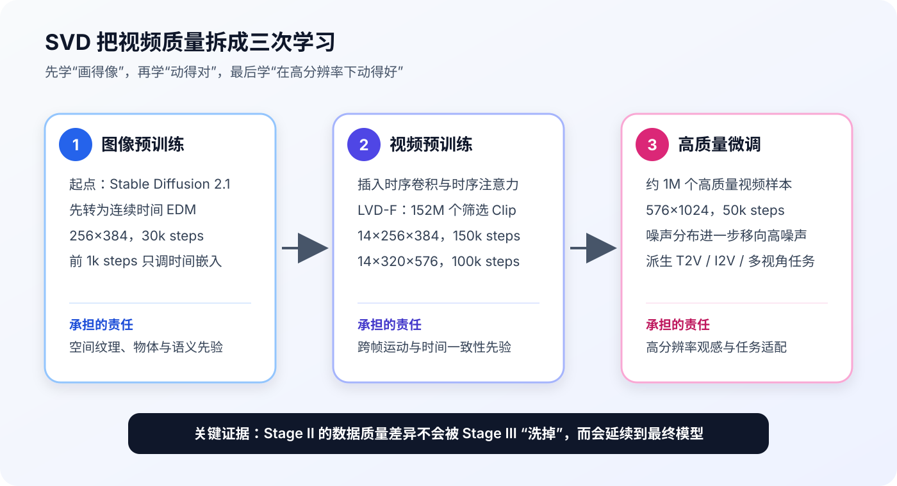
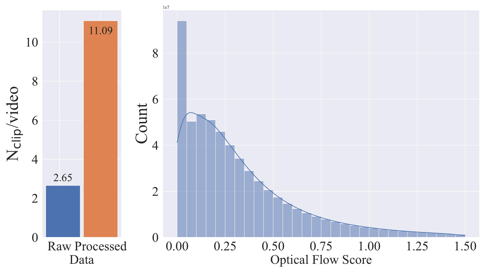
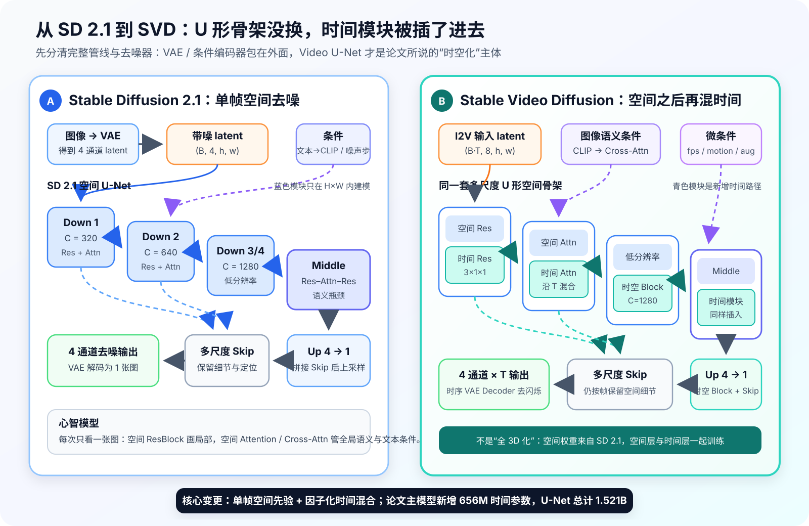
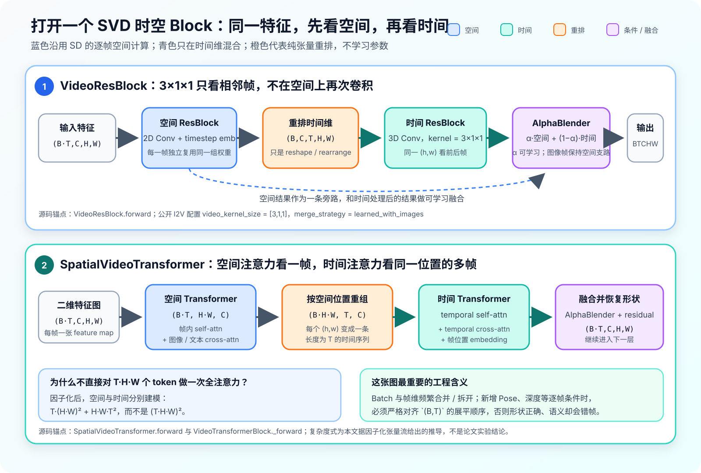
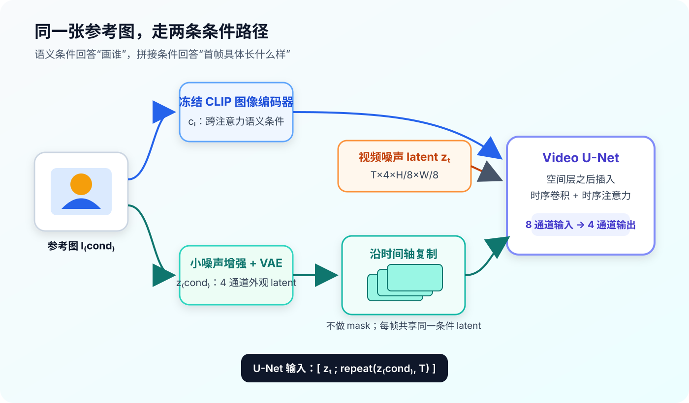
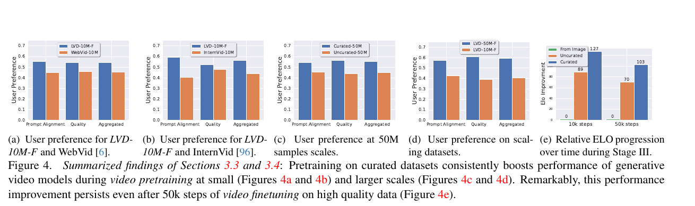
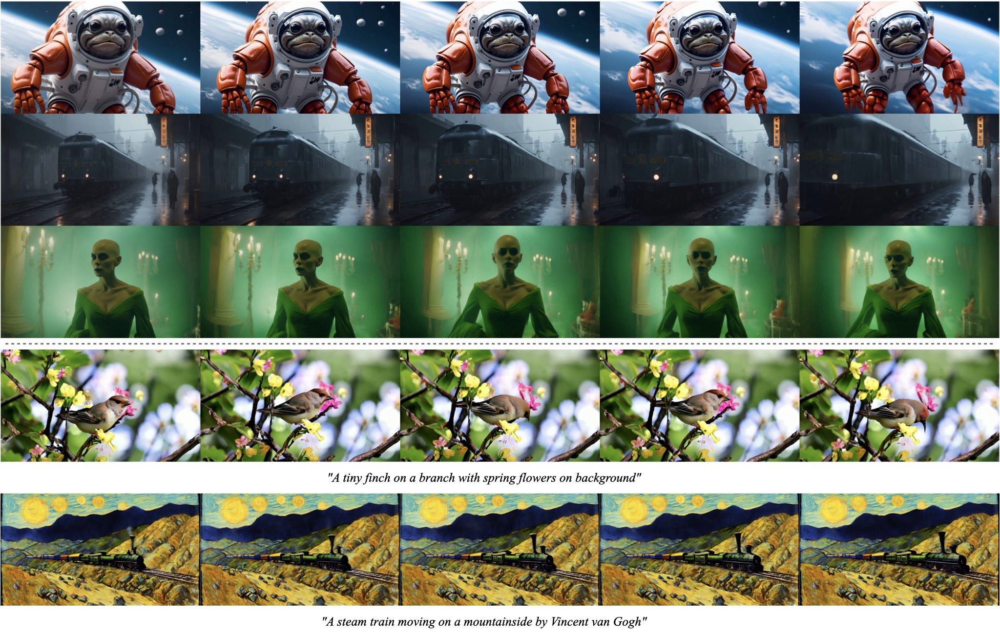
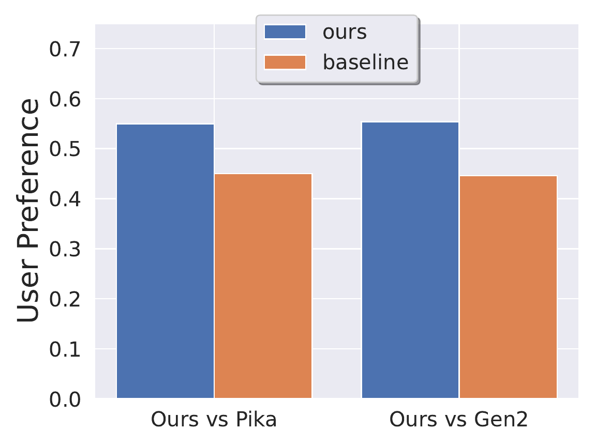

# 论文解读：Stable Video Diffusion: Scaling Latent Video Diffusion Models to Large Datasets

> **核心判断：Stable Video Diffusion 最值得记住的贡献不是发明了一种全新的时序网络，而是把视频质量的责任从“只改模型结构”转移到一条可验证的三阶段路线：先继承图像模型的空间先验，再用大规模、经过筛选的视频学习运动，最后用少量高质量高分辨率视频完成观感微调。最有因果意义的证据是论文 Figure 4：筛选后的训练集即使缩小到原来的约四分之一，训练出的模型仍更受偏好；这种优势在后续 50k 步高质量微调后仍未消失。**

论文：Andreas Blattmann, Tim Dockhorn, Sumith Kulal, Daniel Mendelevitch, Maciej Kilian, Dominik Lorenz, Yam Levi, Zion English, Vikram Voleti, Adam Letts, Varun Jampani, Robin Rombach. **Stable Video Diffusion: Scaling Latent Video Diffusion Models to Large Datasets**. CVPR 2024.  
主来源：[论文页](https://arxiv.org/abs/2311.15127)｜[官方 PDF](https://stability.ai/s/stable_video_diffusion.pdf)｜[论文源码](https://arxiv.org/e-print/2311.15127)｜[官方代码](https://github.com/Stability-AI/generative-models/tree/e8cd657656fa5d61688191730d0e03242bf4ed44)｜[SVD XT 1.1 模型卡](https://huggingface.co/stabilityai/stable-video-diffusion-img2vid-xt-1-1)

> [!note] 版本与证据边界
> - 本文以 **CVPR 2024 论文 / arXiv v1** 为论文事实来源，以官方仓库提交 `e8cd657` 为公开实现锚点。论文讨论的是一个包含文本生视频、图生视频、插帧和多视角适配的模型家族；日常所说的“SVD”却常特指公开的图生视频 checkpoint，两者不能完全画等号。
> - **SVD XT 1.1 是论文之后发布的迭代权重，不是论文实验中的原始 checkpoint。** 模型卡固定训练条件为 6 FPS、motion bucket 127，输出 25 帧；下游项目使用 1.1 时，应按后续权重而非论文原版描述。
> - 论文图像按 arXiv 页面标注的 CC BY 4.0 复用；代码、模型权重与商业使用条件分别受各自许可证约束，不能互相替代。
> - “论文证明”仅指论文直接比较或测量的结论；“源码可见”指公开配置中的实现事实；“本文推论”会显式标注，不把工程经验写成作者已经验证的结论。

## 一、先看一个容易误判的问题：视频脏，是模型不够大吗

把一个成熟的文生图 U-Net 加上时序卷积、时序注意力，再用视频微调，看起来已经具备一条完整的视频生成路线。但原始互联网视频包含几类图像数据没有的“毒性”：

- 一个源视频里藏着多次切镜或渐变转场，模型会把突然跳变也当成可学习的时间规律；
- 大量 Clip 几乎静止，模型最容易学到的策略是“复制首帧”；
- 画面字幕、台标和水印过多，模型会生成不可读文字或固定位置的纹理；
- 图文描述只说静态物体，没有描述动作，文本与时间变化无法对齐；
- 低清、构图差和压缩严重的样本会同时损伤单帧观感与跨帧一致性。

如果只扩大网络，模型只是以更大的容量拟合这些问题。SVD 的研究问题因此不是“如何再设计一种 temporal block”，而是：

> **一个已经具有图像生成能力的 latent diffusion model，应该按什么课程、用什么视频数据，才能学到可迁移的运动先验？**

这也解释了论文标题里的 **Scaling**：重点不只是参数量变大，而是把数据处理、训练阶段和下游适配一起扩展到大规模视频。

## 二、任务契约：论文研究的不是一个单点模型

| 项目 | 论文设定 |
|---|---|
| 起始先验 | Stable Diffusion 2.1 的图像 U-Net 与 VAE |
| 基础任务 | 先训练低分辨率 text-to-video base model |
| 高分辨率任务 | 文本生视频与单图生视频，输出 $576\times1024$ |
| 公开常见版本 | SVD 生成 14 帧；SVD-XT 生成 25 帧 |
| 其他适配 | 视频插帧、相机运动 LoRA、图像到多视角 |
| 核心监督 | 视频 Clip、合成 Caption、帧级质量和图文对齐标注、运动分数 |
| 关键假设 | 图像模型已经学到空间外观；视频训练应集中学习时间变化 |
| 不解决 | 长视频叙事、音频驱动、人体姿态控制、口型同步、实时生成 |

论文最容易被后来产品命名遮蔽：作者先得到的是一个 **text-to-video base model**，再从它微调出高分辨率 T2V、I2V、插帧和多视角版本。今天开源生态最常用的却是 I2V checkpoint。因此，读论文时要把“训练出通用视频先验”与“公开了一个图生视频模型”分开。

在知识库中，它与两篇旧文形成一条清晰链路：

1. 本文解释 **SVD 底座如何获得运动与图生视频先验**；
2. [[论文解读：MimicMotion: High-Quality Human Motion Video Generation with Confidence-aware Pose Guidance|MimicMotion 论文解读]]解释如何在 SVD 上增加置信度姿态控制；
3. [[动作驱动综述与我们的工作|动作驱动生产系统复盘]]解释内部项目如何继续加入业务数据、脸部专项监督、长视频工程、口型与生产质检。

## 三、责任转移：把一次训练拆成三次学习

SVD 的训练路线可以用一句话概括：

> **Stage I 学空间，Stage II 学时间，Stage III 学高分辨率质量与具体任务。**

*图 1　本文根据论文 §3–4 与补充材料自绘。三阶段并不是三个互相独立的模型：每一阶段都继承上一阶段的权重。图中训练规模对应论文主模型；筛选阈值实验另用 8 帧、$256\times256$ 的小模型。*

### 3.1 Stage I：先保护图像模型已有的空间能力

作者从 Stable Diffusion 2.1 出发，但没有立刻插时序层。第一步是把原来的离散噪声设置转成 EDM 的连续噪声预条件。

令干净图像或视频 latent 为 $x$，高斯噪声为 $n$，带噪输入为：

$$
x_\sigma=x+\sigma n
$$

EDM 形式的去噪器写成：

$$
D_\theta(x_\sigma;\sigma)
=
c_{\mathrm{skip}}(\sigma)x_\sigma
+
c_{\mathrm{out}}(\sigma)
F_\theta\!\left(
c_{\mathrm{in}}(\sigma)x_\sigma,
c_{\mathrm{noise}}(\sigma)
\right)
$$

训练目标是按噪声强度加权的重建：

$$
\mathcal L
=
\mathbb E_{x,n,\sigma}
\left[
\lambda(\sigma)
\left\|
D_\theta(x+\sigma n;\sigma)-x
\right\|_2^2
\right]
$$

其中论文设置：

$$
\log \sigma \sim
\mathcal N(P_{\mathrm{mean}},P_{\mathrm{std}}^2),
\qquad
\lambda(\sigma)=\frac{1+\sigma^2}{\sigma^2}
$$

初始 $P_{\mathrm{mean}}=-1.2$、$P_{\mathrm{std}}=1$。作者先在 $512\times512$ 图像上训练 1k 步，只开放时间嵌入，使 SD2.1 适应新的预条件；再在 $256\times384$ 上全量训练 30k 步。这里的设计意图不是增加新能力，而是避免切换噪声参数化时过度破坏原有空间表示。

### 3.2 Stage II：插入时间层，但不是只训练时间层

模型沿用 Video LDM 的基本做法：在每个空间卷积和空间注意力层后，插入相应的时序卷积与时序（交叉）注意力。新增时间模块约 **656M** 参数，使 U-Net 总规模达到 **1.521B**。

关键差异是：SVD **不是只冻结空间层、单独训练 temporal block**，而是微调整个模型。这样做让空间表示可以为视频分布重新调整，但也把“不要遗忘图像先验”的责任交给了 Stage I 初始化与训练数据质量。

视频预训练分两段：

| 阶段 | 帧数与分辨率 | 步数 | 全局 Batch | 学习率 | 其他 |
|---|---:|---:|---:|---:|---|
| 视频预训练 A | 14 帧，$256\times384$ | 150k | 1536 | $10^{-4}$ | AdamW；文本条件 15% dropout |
| 视频预训练 B | 14 帧，$320\times576$ | 100k | 768 | $10^{-4}$ | $P_{\mathrm{mean}}$ 提高到 0 |

随着分辨率升高，噪声分布向更高噪声移动。直觉是：低噪声训练更像局部修补，高噪声训练要求模型在信息更少时恢复整体结构；高分辨率生成如果仍主要看到低噪声，模型容易把能力花在局部纹理而非全局构图与运动。

### 3.3 Stage III：用少量好数据定义最终观感

高分辨率 text-to-video 使用约 1M 个高质量样本，在 $576\times1024$ 上训练 50k 步，Batch 768，学习率 $3\times10^{-5}$，并使用 EMA 0.9999。这里的数据更强调物体运动、稳定的相机运动、Caption 对齐和总体画质。

论文关于“Stage III 数据规模”有两个不同实验语境：

- 为证明 Stage II 的差异能否延续，消融实验使用 250k 个高质量预标注 Clip，在 $512\times512$ 上微调；
- 为训练最终高分辨率模型，主实验使用约 1M 个高质量样本，在 $576\times1024$ 上微调。

两者不能混写成同一套训练配置。

## 四、论文真正的主角：不是 U-Net，而是视频数据管线

原始 Large Video Dataset（LVD）在正文中约写作 **580M** 对，在统计表中是 **577M** 个已标注 Clip，总时长约 212 年。这个数字本身不是成果；作者花了大量工作证明，如何删数据比单纯保留更多数据更重要。

### 4.1 先把“一个视频”切成真正连续的 Clip

作者用三种 FPS 与阈值级联运行 PySceneDetect，同时捕捉突变切镜和较慢的淡入淡出。处理后，每个源视频平均 Clip 数从 2.65 增至 11.09，接近四倍。这说明依赖原始元数据切段，会把大量镜头跳变错误地保留在训练样本中。

*论文原图 Figure 2；来源：[Stable Video Diffusion 原论文](https://arxiv.org/abs/2311.15127)。左图证明原始切段遗漏了大量场景边界；右图证明数据中存在显著的低运动峰。它说明为什么需要数据处理，但不单独证明某个阈值就是最优。*

### 4.2 给每个 Clip 建立五类可筛选信号

数据管线并非只给视频打一个“质量分”，而是从不同失败来源建立标注：

| 信号 | 做法 | 要阻止模型学到什么 |
|---|---|---|
| 运动 | 预训练阶段用 Farnebäck 光流，在 2 FPS 下估计；Stage III 小数据改用 RAFT，分辨率 $800\times450$ | 静止复制、运动不足 |
| Caption | CoCa 描述中间帧；VideoBLIP 描述视频；轻量 LLM 融合两者 | 只描述静态内容或 Caption 错位 |
| 图文对齐 | 首、中、末帧的 CLIP 相似度 | 文本与画面不相关 |
| 美学 | 首、中、末帧的 CLIP embedding 美学分 | 低质量构图与画面 |
| 文字区域 | CRAFT 检测首、中、末帧的文字框 | 字幕、台标和水印污染 |

Caption 消融有一个反直觉结果：只看 Elo，简单的中间帧 CoCa Caption 最强；VideoBLIP 的时间信息没有直接赢得总分。作者没有因此只保留 CoCa，而是在最终训练时以 $0.5/0.25/0.25$ 的概率采样 CoCa、VideoBLIP 和 LLM Caption，在效果与描述多样性之间折中。

### 4.3 阈值不是拍脑袋，而是训练模型来选

作者从 9.8M 的 LVD-10M 开始，对运动、CLIP 对齐、美学和 OCR 分别测试去掉 12.5%、25%、50% 样本，再用相同结构与训练量训练模型。每类实验都根据 64 个固定 Prompt 的人类偏好 Elo 排名选阈值。

最终主要策略是：

- 去掉运动最低的 25%；
- 去掉美学最低的 25%；
- 去掉 CLIP 对齐最低的 50%；
- OCR 消融选择去掉文字最多的 25%，生产版 LVD-F 又明确过滤总文字框面积超过 7% 的 Clip；
- 三种 Caption 都保留，但向 CoCa 倾斜采样。

一个值得保留的细节是：运动消融里“不筛运动”的综合 Elo 其实略高于去掉 25% 静态样本，但后者的视觉质量项更高。作者为了最终生成质量选择了 25%，而不是机械取综合分最大值。这说明筛选目标本身带有产品偏好，不是自然界唯一正确的阈值。

串联所有过滤后，LVD 从约 577M 缩到 **LVD-F 的 152M**。它不是某个单项比例的简单乘积，因为各类低质量样本存在重叠。

## 五、从 SD 2.1 到 SVD：完整网络结构到底改了什么

先纠正一个容易造成误解的说法：**SVD 不是“把 Stable Diffusion 的 2D U-Net 换成一个 3D U-Net”**。它保留 SD2.1 的 latent diffusion 管线和多尺度 U 形空间骨架，再把时间模块插到对应空间模块之后。论文明确说架构沿用前作 [Align Your Latents / Video LDM](https://arxiv.org/abs/2304.08818)；SVD 的结构贡献更多是继承、放大并通过数据课程验证这套做法，而不是重新发明一种视频主干。

还要分清三个经常被混在一起的层次：

1. **完整生成管线**：条件编码器、VAE、去噪器、采样器；
2. **Video U-Net 主干**：Down / Middle / Up、跨尺度 Skip，以及内部的时空模块；
3. **公开 I2V 条件接口**：参考图双路条件、FPS、motion bucket、conditioning augmentation。

### 5.1 一张图先看懂：骨架没换，时间路径被插了进去

*本文据论文补充材料 Appendix D–E、Video LDM 与官方固定源码重绘。左图表达 SD2.1 的心智模型，不是逐层复刻原始配置；右图的 8→4 通道、CLIP 图像条件和微条件专指公开 I2V 配置。论文主模型新增 656M 时间参数、Video U-Net 合计 1.521B；这两个数字不能自动套到所有后续 checkpoint。*

两者的共同点比差异更重要：输入都先进入 latent space，去噪器都使用四级多尺度 Down / Middle / Up 路径，Down 特征仍通过 Skip Connection 送到对称的 Up Block。**所谓从 SD 到 SVD，不是推翻空间生成器，而是在同一分辨率层级上让特征多走一条时间支路。**

| 比较项 | Stable Diffusion 2.1 | Stable Video Diffusion |
|---|---|---|
| 基本对象 | 一次处理一张图的 latent | 实现中常把 Batch 与帧合并，逐帧处理空间特征 |
| 输入输出 | 通常 4 通道带噪 latent → 4 通道预测 | 论文 T2V base 仍以视频 latent 为核心；公开 I2V 为 8 通道输入 → 4 通道输出 |
| ResBlock | 2D 空间卷积 | 空间 ResBlock 后接时间 ResBlock |
| Attention | 帧内 self-attention / cross-attention | 空间 Transformer 后接时间 Transformer |
| U 形路径 | 四级 Down、Middle、四级 Up、Skip | 保留相同多尺度拓扑，每级内部换成时空 Block |
| 条件 | 文本条件、扩散噪声步 | 任务相关的文本或图像条件；公开 I2V 另有 FPS、运动、条件噪声微条件 |
| 解码 | 图像 VAE Decoder | 带时间卷积的 `VideoDecoder`，利用邻帧信息减轻逐帧解码闪烁 |
| 初始化与训练 | 图像模型 | 空间层由 SD2.1 初始化；SVD 随后同时训练空间层和新增时间层 |

> [!important] 这里的“U-Net”不是 2015 年分割模型的原样复用
> SVD 继承的是现代 latent diffusion U-Net：多尺度编码—解码与 Skip 是 U-Net 骨架，内部单元已经是带 timestep 调制的 ResBlock 和 Transformer / Cross-Attention。理解 SVD 时，不能把它想成“经典分割 U-Net 外面再包一层视频模块”。

### 5.2 打开一个 Block：`(B·T,C,H,W)` 怎样真的开始“看时间”

*本文据固定提交中的 [`VideoResBlock`](https://github.com/Stability-AI/generative-models/blob/e8cd657656fa5d61688191730d0e03242bf4ed44/sgm/modules/diffusionmodules/video_model.py#L17-L86)、[`SpatialVideoTransformer`](https://github.com/Stability-AI/generative-models/blob/e8cd657656fa5d61688191730d0e03242bf4ed44/sgm/modules/video_attention.py#L147-L301) 与 [`AlphaBlender`](https://github.com/Stability-AI/generative-models/blob/e8cd657656fa5d61688191730d0e03242bf4ed44/sgm/modules/diffusionmodules/util.py#L342-L399) 重绘。橙色步骤只是张量重排；复杂度式是本文根据张量流给出的推导，不是论文实验结果。*

#### A. 时间卷积：只沿帧轴看邻居

设 U-Net 某层特征为：

$$
x\in\mathbb R^{(B\cdot T)\times C\times H\times W}
$$

`VideoResBlock` 先复用原来的 2D `ResBlock`，此时 $B\cdot T$ 可以理解为“把每一帧当成 Batch 中的一张图”。随后源码执行：

$$
(B\cdot T,C,H,W)
\longrightarrow
(B,C,T,H,W)
$$

再进入 3D `ResBlock`。公开 SVD-XT 1.1 配置的卷积核是 $3\times1\times1$：时间尺寸为 3，空间尺寸都是 1。因此它让同一空间坐标 $(h,w)$ 读取前后帧，但不会在这一支里再次扩大二维空间感受野。可以把职责记成：

- 空间 ResBlock：这一帧的局部纹理应该怎么画；
- 时间 ResBlock：这个位置相邻三帧应该怎样连续变化。

时间结果并非简单加回空间结果，而是由 `AlphaBlender` 融合：

$$
h_{\mathrm{out}}
=
\alpha h_{\mathrm{spatial}}
+
(1-\alpha)h_{\mathrm{temporal}}
$$

公开配置使用 `learned_with_images`。对视频帧，$\alpha$ 由一个可学习标量经 Sigmoid 得到；对 `image_only_indicator` 标记的图像样本，源码令 $\alpha=1$，即只走空间结果。这个细节解释了为什么同一骨架可以联合接收图像与视频样本，又不强迫静态图像产生虚构的时间变化。

#### B. 时间注意力：把“同一位置的多帧”排成一句话

`SpatialVideoTransformer` 的空间支路先把一帧展成 $H\cdot W$ 个 token：

$$
(B\cdot T,C,H,W)
\longrightarrow
(B\cdot T,H\cdot W,C)
$$

空间 Transformer 在每帧内部完成 self-attention 和条件 cross-attention。时间支路随后把张量重组为：

$$
(B\cdot T,H\cdot W,C)
\longrightarrow
(B\cdot H\cdot W,T,C)
$$

现在一条长度为 $T$ 的 token 序列代表“固定空间位置在所有帧中的演化”。`VideoTransformerBlock` 对它做 temporal self-attention，并在未禁用时做 temporal cross-attention；源码还加入帧位置 embedding，使网络知道第 0 帧和第 20 帧不是同一个时间位置。

这叫**因子化时空注意力**：先做帧内空间注意力，再做跨帧时间注意力。若忽略通道常数，直接对全部 $T\cdot H\cdot W$ token 做全注意力的复杂度是：

$$
\mathcal O\!\left((T H W)^2\right)
$$

因子化后的主项变成：

$$
\mathcal O\!\left(T(HW)^2+HW\,T^2\right)
$$

它既保留了“空间看全图、时间看跨帧”的语义分工，也避免一次全时空注意力的巨大开销。代价是空间与时间的交互要经过分步传播，而不是任意两个时空 token 一步直连。

### 5.3 多尺度 Video U-Net 具体长什么样

在官方 SVD-XT 1.1 配置中，`VideoUNet` 的 base channel 是 320，通道倍率为 `[1, 2, 4, 4]`，因此四个尺度的主通道数是 320、640、1280、1280；每级包含 2 个 ResBlock，attention resolutions 为 `[4, 2, 1]`，Middle Block 仍是 Res–Attention–Res。Down 路径保存的特征会在 Up 路径逐级 `cat` 回去，所以时间模块并没有取消 U-Net 对局部边缘、布局和高频细节的多尺度保真。

公开配置把 `SpatialTransformer` 与 `VideoTransformerBlock` 成对组织；把 2D `ResBlock` 与使用 $3\times1\times1$ 核的时间 `ResBlock` 成对组织。论文所说的“在每个空间卷积和注意力层后插入对应时间层”，落到源码里就是这两类可重复的时空单元。

> [!note] 论文事实与公开 checkpoint 配置的边界
> - **论文直接披露**：空间层由 SD2.1 初始化；新增 656M 时间参数，U-Net 合计 1.521B；空间层不冻结，而是与时间层一起训练。
> - **官方源码可见**：公开 SVD-XT 1.1 使用 8→4 通道 `VideoUNet`、`[1,2,4,4]` 通道倍率、`3×1×1` 时间卷积、`learned_with_images` 融合、1024 维图像 context，以及带时间卷积的 VAE Decoder。
> - **不能混写**：论文中的 T2V base、筛选消融小模型、SVD / SVD-XT 与后来的 SVD-XT 1.1 不是同一个配置文件；后者只能帮助打开实现，不能反推所有论文实验逐项相同。

### 5.4 这套结构对二次开发意味着什么

最容易踩错的不是卷积核，而是维度语义。空间模块习惯处理 `(B·T,C,H,W)`，时间模块又要恢复 `(B,C,T,H,W)` 或 `(B·H·W,T,C)`。因此给 SVD 增加 Pose、深度、光流或逐帧 Mask 时，必须先回答：

- 条件是在每帧空间位置注入，还是作为整段视频的时间条件注入？
- Batch 与帧展平时采用什么顺序，条件 tensor 是否使用完全相同的 `rearrange`？
- 条件需要进入 Down、Middle、Up 的哪些尺度，是否跟随 Skip？
- 图像样本和视频样本混训时，`image_only_indicator` 是否正确传到所有 `AlphaBlender`？

这也是后续 MimicMotion 不能只说“在 SVD 上加 Pose”的原因：真正的结构贡献必须落实到**在哪个尺度、哪个分支、什么张量形状、如何与原时空特征融合**。

## 六、图生视频为什么要让参考图走两条路

SVD 的 I2V 不是简单把首帧塞进 U-Net。参考图同时承担两种不同责任：

1. **CLIP 图像 embedding** 经 cross-attention 提供高级语义和身份条件；
2. **VAE latent** 提供颜色、布局、纹理等更贴近像素的低层条件。

*本文根据论文 §4.3、补充材料与官方 `svd_xt_1_1.yaml` 重绘。8 通道输入来自 4 通道视频噪声 latent 与 4 通道参考图 latent 的拼接；CLIP embedding 不在通道维拼接，而是进入 cross-attention。*

训练时，作者先给参考图加入少量噪声：

$$
\log \sigma_{\mathrm{cond}}
\sim
\mathcal N(-3.0,0.5^2)
$$

再取 SD2.1 VAE 编码分布的均值：

$$
z_{\mathrm{cond}}
=
\mathcal E(I_{\mathrm{cond}}+\sigma_{\mathrm{cond}}\epsilon)
$$

它沿时间复制后，与当前视频噪声 latent $z_t$ 按通道拼接：

$$
u_t
=
\left[
z_t\ ;\
\operatorname{repeat}(z_{\mathrm{cond}},T)
\right]
$$

所以公开配置中的通道数是 $4+4=8$，U-Net 预测 4 通道去噪结果。论文特别说明这里**不使用 mask**：参考 latent 不是只放在第 1 帧的位置，而是在所有时间位置都可见。这给模型一个持续的外观锚点，但“后续每帧应该如何动”仍由视频先验、噪声和运动条件共同决定。

## 七、训练与推理不要混在一起

### 7.1 I2V 微调分两级

| 阶段 | 分辨率 | 帧数 | 步数 | Batch | 学习率 | 噪声分布 |
|---|---:|---:|---:|---:|---:|---|
| Base I2V | $320\times576$ | 14 | 50k | 768 | $3\times10^{-5}$ | $P_{\mathrm{mean}}=0.7,P_{\mathrm{std}}=1.6$ |
| HQ I2V | $576\times1024$ | 14 / 25 | 各 50k | 768 | $3\times10^{-5}$ | $P_{\mathrm{mean}}=1.0,P_{\mathrm{std}}=1.6$ |

高分辨率阶段训练两个版本：14 帧的 SVD 和 25 帧的 SVD-XT。二者不是靠推理时“把帧数参数改大”得到，而是分别完成了对应长度的微调。

### 7.2 线性 CFG 是沿帧变化，不是沿扩散步变化

标准 classifier-free guidance 用固定尺度 $w$：

$$
\hat\epsilon
=
\epsilon_{\mathrm{uncond}}
+
w
\left(
\epsilon_{\mathrm{cond}}
-
\epsilon_{\mathrm{uncond}}
\right)
$$

SVD 观察到：固定低 guidance 容易让后续画面偏离参考图，固定高 guidance 又容易过饱和。作者让 guidance 随帧索引 $i$ 线性增大：

$$
w_i
=
w_{\min}
+
\frac{i}{T-1}
\left(
w_{\max}-w_{\min}
\right)
$$

于是每帧使用：

$$
\hat\epsilon_i
=
\epsilon_{\mathrm{uncond},i}
+
w_i
\left(
\epsilon_{\mathrm{cond},i}
-
\epsilon_{\mathrm{uncond},i}
\right)
$$

这不是时间长度扩展算法。它只是让越靠后的帧越强地接受参考条件，以抵抗序列向外观漂移；25 帧之外的长视频一致性仍没有被解决。

### 7.3 FPS、motion bucket 和 cond augmentation 是微条件

模型训练时接收视频 FPS、运动分数和参考图加噪强度，因此推理接口会暴露 `fps_id`、`motion_bucket_id`、`cond_aug`。它们更像对训练分布的索引，而不是物理上精确的控制旋钮：

- motion bucket 提高不等于主体必然做更大的语义动作，也可能增加镜头运动或画面不稳定；
- FPS 条件影响模型对相邻帧时间间隔的解释，不等于输出文件实际播放 FPS；
- 超出训练常见区域时，效果没有保证。

后续 SVD XT 1.1 模型卡明确说训练时固定为 6 FPS、motion bucket 127，因此在这个权重上继续把两个参数大范围扫描，已经属于分布外尝试。

## 八、开源实现与工程资源账单

算法能不能落地，取决于论文表格之外的四件事：开源代码到底执行什么、训练算力是否透明、单次推理是否可接受、低显存方案牺牲了什么。下面严格区分论文、官方源码、官方推理文档和本文未实测项。

### 8.1 官方实现中最值得带走的六个细节

本文复核的代码锚点是 Stability AI 官方仓库提交 [`e8cd657`](https://github.com/Stability-AI/generative-models/tree/e8cd657656fa5d61688191730d0e03242bf4ed44)。对落地最有价值的不是启动 Gradio，而是以下数据流：

1. **版本决定帧数和采样配置。** `svd_xt_1_1` 固定创建 25 帧 latent，官方 Demo 默认 30 个采样步；不能只替换 checkpoint 名而保留另一版本的形状与 guider 配置。
2. **输入尺寸先对齐 64 的倍数。** Demo 对不满足条件的图像向下取整并缩放；若不是训练分辨率 $576\times1024$，源码明确警告质量可能下降。生产接口应在进入模型前固定裁剪策略，避免静默拉伸人物比例。
3. **条件在 Batch 与时间维显式展开。** `crossattn` 和 `concat` 条件先复制到 25 帧，再把 Batch 与时间维合并。做动作控制改造时，Pose 或其他逐帧条件必须与这个展平顺序一致，否则代码能运行，条件帧却会错位。
4. **条件图有“干净”和“加噪”两份。** `cond_frames_without_noise` 送入 CLIP 路径，`cond_frames` 加上 `cond_aug` 噪声后送入 VAE 路径。把两者共用成同一个 tensor 会改变论文设计。
5. **显存峰值不只在 U-Net。** 官方 Demo 把 `decoding_t` 暴露为参数，并直接注明 VAE 一次解码的帧数非常吃显存；OOM 不一定要先砍 U-Net 或帧数，也可以先减小解码 Chunk。
6. **输出链路带水印与安全过滤器。** 官方 Demo 在写 MP4 前调用 watermark 与 filter。把研究脚本封装成服务时，不能只复制去噪循环而遗漏输出治理、异常处理和许可证要求。

这些细节也说明为什么“模型能跑”与“服务能用”之间仍有距离：输入预处理、随机种子、参数越界、OOM 降级、NSFW 处理、编码器失败和输出封装都需要成为明确接口，而不是散落在 Notebook 中。

### 8.2 训练资源：主模型恰恰没有披露卡数

| 训练环节 | 论文披露的规模 | GPU 资源与时长 | 能否核算成本 |
|---|---|---|---|
| 图像 EDM 适配 | 1k + 30k 步；$512^2$ 后转 $256\times384$ | **未披露卡型、卡数、精度和时长** | 不能 |
| 视频预训练 A | 14 帧，$256\times384$，150k 步，全局 Batch 1536 | **未披露卡型、卡数、精度和时长** | 不能 |
| 视频预训练 B | 14 帧，$320\times576$，100k 步，全局 Batch 768 | **未披露卡型、卡数、精度和时长** | 不能 |
| HQ T2V | $576\times1024$，50k 步，全局 Batch 768 | **未披露卡型、卡数、精度和时长** | 不能 |
| Base / HQ I2V | 各 50k 步；HQ 分 14 帧与 25 帧版本；全局 Batch 768 | **未披露卡型、卡数、精度和时长** | 不能 |
| 多视角 SVD-MV | 12k 步，总 Batch 16，学习率 $10^{-5}$ | **8×A100 80GB，约 16 小时** | 可得到 128 A100-GPU-hours，但不含数据处理与失败实验 |

这里最重要的工程诚实是：**全局 Batch 1536 不等于可以可靠反推出多少张 A100。** 梯度累积、数据并行、模型并行、激活重计算、混合精度和集群利用率都没有交代。论文还没有报告 577M Clip 的下载、切镜、三套 Caption、光流、CLIP、美学与 OCR 标注所需的 CPU/GPU、存储和墙钟时间；对完整复现而言，这部分很可能不比模型训练便宜。

因此，本论文只能给出训练配方，不能给出可信的主模型训练预算。若要在项目中立项，至少还需通过缩小版实验实测：

- 单卡在目标帧数和分辨率下的最大 micro-batch；
- 开启混合精度、gradient checkpointing 后的峰值显存；
- 单步耗时、数据加载占比和实际集群利用率；
- 目标总步数对应的 GPU-hours 与存储读带宽；
- 数据筛选、Caption 和光流预计算的独立成本。

### 8.3 推理资源：官方参考是 A100 约 60 秒，低显存路径低于 8GB

官方仓库的 [SVD-XT Demo](https://github.com/Stability-AI/generative-models/blob/e8cd657656fa5d61688191730d0e03242bf4ed44/scripts/demo/gradio_app.py) 给出一个可比的参考点：**单张输入图生成 25 帧、约 4 秒视频，30 个采样步，在一张 A100 上约 60 秒**。但它没有写明 A100 是 40GB 还是 80GB，也没有公布峰值显存、CPU、Batch、热身次数或方差，所以这个数字只能作为官方 Demo 延迟，不能当作任意部署环境的 SLA。

[Hugging Face 官方 Diffusers 文档](https://huggingface.co/docs/diffusers/main/api/pipelines/stable_diffusion/svd)给出另一端的“能跑”配置：FP16 下同时开启 model CPU offload、U-Net forward chunking，并把 `decode_chunk_size` 降到 2，25 帧推理的显存需求可降到 **8GB 以下**。代价也很明确：

- CPU 与 GPU 之间搬运权重会增加延迟；
- feed-forward 分块用循环换显存；
- VAE 解码 Chunk 越小越省显存，但逐帧或小批解码可能增加闪烁；
- 8GB 是官方文档的优化目标，不是本文在特定显卡上的实测峰值。

| 部署档位 | 官方可确认条件 | 适合用途 | 尚需实测 |
|---|---|---|---|
| 最低可运行 | 单卡低于 8GB VRAM；FP16；CPU offload；forward chunking；`decode_chunk_size=2` | 功能验证、离线低频任务 | CPU 内存、实际延迟、PCIe 影响、是否 OOM |
| 官方参考 | 单张 A100；25 帧；30 步；约 60 秒 | 研究 Demo、质量对照 | A100 具体显存、峰值 VRAM、并发吞吐 |
| 生产服务 | 论文与官方仓库没有给出 | 批量生成或在线服务 | Batch 曲线、P50/P95、失败率、单条成本、冷热启动 |

本文当前没有在本地 NVIDIA GPU 上执行基准，因此不填写“推荐 24GB/48GB”这类未经同条件验证的数字。真正上线前，应该固定 checkpoint、精度、$1024\times576$、25 帧、30 步和解码 Chunk，分别测单请求与 Batch 请求的峰值显存、端到端延迟和输出失败率。

### 8.4 从研究 Demo 到生产还缺什么

SVD 的最小落地闭环至少还需要：

- **输入闸门**：主体位置、宽高比、分辨率、多人、文字和人脸质量检测；
- **参数模板**：按内容类型固定 seed、motion、FPS 和 cond augmentation 的安全范围；
- **失败回退**：OOM 时先减解码 Chunk，再降帧数或分辨率；低运动、形变和首帧漂移要能自动重试或拒绝；
- **可观测性**：记录模型版本、参数、GPU、峰值显存、去噪耗时、VAE 解码耗时与输出质检；
- **内容与许可证治理**：保留安全过滤、来源记录和权重许可证检查，商业收入门槛等条件以使用时的最新官方许可证为准；
- **长视频上层**：镜头规划、分段生成、一致性状态、插帧、音频和后期，而不是期待 25 帧模型直接承担整条生产链。

结论很现实：低于 8GB 能跑说明它适合个人原型，不等于它已经具备低成本实时服务能力；A100 约 60 秒说明质量参考可建立，也同时说明并发和单位视频成本必须单独优化。

## 九、实验给出了哪些有效证据

### 9.1 最关键证据：小而干净的数据胜过大而脏

*论文原图 Figure 4；来源：[Stable Video Diffusion 原论文](https://arxiv.org/abs/2311.15127)。从左到右分别比较 LVD-10M-F 与 WebVid-10M、InternVid-10M，50M 筛选与未筛选数据，50M 与 10M 筛选数据，以及不同 Stage II 初始化在 Stage III 的相对 Elo。它支持“筛选有效、规模仍有效、预训练差异不会被后续微调抹平”；它不提供误差条或统计显著性，也不公开 LVD 供独立复现。*

这张图比最终样片更重要，因为它逐层回答了四个问题：

1. **是不是只要数据更多就行？** 不是。约 2.3M 的 LVD-10M-F 虽比 9.8M 的未筛选 LVD-10M 小约四倍，训练模型仍在画质和 Prompt 对齐上更受偏好。
2. **是不是只对自家原始数据有效？** 至少在人类偏好实验中，LVD-10M-F 也胜过规模更大的 WebVid-10M 和 InternVid-10M 子集训练模型。
3. **筛选后还要不要扩规模？** 要。50M 筛选数据优于约 10M 起点得到的筛选数据，说明“质量优先”不等于“规模无用”。
4. **Stage III 会不会洗掉预训练差异？** 没有。高质量微调 10k 和 50k 步后，从筛选视频预训练初始化的模型仍排名更高。

最后一条是整篇论文最强的工程结论：高质量微调不能替代好的大规模预训练。Stage III 更像放大和定型已有能力，而不是重造运动先验。

### 9.2 主结果：SVD 的视频先验可迁移

在 UCF-101 零样本文生视频 FVD 上，论文报告：

| 方法 | FVD ↓ |
|---|---:|
| Video LDM | 550.61 |
| PYOCO | 355.20 |
| **SVD base model** | **242.02** |

这个结果说明 base model 确实学到了可用于动作类别的视频分布。但表中基线数字来自既有文献，并非全部在同一代码与评测流水线重跑，因此更适合证明竞争力，不适合作为严格的训练配方因果消融。

更能证明“视频先验可迁移”的是多视角实验。作者把图像到多个视角看成一种特殊视频：对象大体不变，相机沿轨道运动。相同多视角任务中：

| 初始化 | LPIPS ↓ | PSNR ↑ | CLIP-S ↑ |
|---|---:|---:|---:|
| Scratch-MV | 0.22 | 14.20 | 0.76 |
| SD2.1-MV | 0.18 | 15.06 | 0.83 |
| **SVD-MV** | **0.14** | **16.83** | **0.89** |

SVD-MV 只训练约 12k 步、8 张 A100 80GB、约 16 小时，已经超过图像先验和随机初始化版本。它支持“视频预训练获得了跨视角一致性先验”，但不意味着 SVD 内部显式恢复了 3D 几何。

### 9.3 样片说明能力范围，不说明为什么有效

*论文原图 Figure 5；来源：[Stable Video Diffusion 原论文](https://arxiv.org/abs/2311.15127)。上半部分是以每行最左帧为条件的 I2V 样例，下半部分是带 Prompt 的 T2V 样例，分辨率均为 $576\times1024$。它能说明两条高分辨率分支的视觉上限，却不能隔离数据筛选、时序层或高分辨率微调各自的因果贡献。*

图中最重要的信息不是“样片好看”，而是同一个 Stage II 视频底座能向三类任务分叉。这正是 base model 的价值：下游不需要每次从图像模型重新学习时间结构。

### 9.4 与闭源 I2V 的偏好比较要克制解读

*论文原图 Figure 6；来源：[Stable Video Diffusion 原论文](https://arxiv.org/abs/2311.15127)。SVD 在两组比较中都获得过半偏好。论文为不同服务适配输入，再统一时长、缩放和裁剪；Pika 水印区域在双方视频上同时遮罩。该图没有置信区间，也不是参数量、帧数、提示词接口完全一致的模型对模型审计。*

作者的偏好评测使用 64 个预选 Prompt 或条件图，模型对之间每个任务平均收集 3 票，并随机化任务与模型顺序。这比只挑展示样例可靠，但仍有三点限制：

- Prompt 集合较小，不能代表所有真实分布；
- 闭源服务输入接口和内部版本不可控；
- 图中只给偏好比例，没有报告方差或显著性。

因此更稳妥的结论是：**在作者规定的标准化比较中，SVD 具备与当时闭源 I2V 系统竞争的主观质量**，而不是“SVD 全面击败 Pika 和 Gen-2”。

## 十、SVD、SVD-XT 与 SVD XT 1.1 不要混成一个名字

| 名称 | 与论文关系 | 输出 | 应如何描述 |
|---|---|---:|---|
| SVD base model | 论文 Stage II 的 T2V 基础模型 | 14 帧低分辨率训练为主 | 通用视频与运动先验，不是日常下载的 I2V checkpoint |
| SVD | 论文高分辨率 I2V 分支 | 14 帧，$576\times1024$ | 给单张图续写短视频 |
| SVD-XT | 论文高分辨率 I2V 分支 | 25 帧，$576\times1024$ | 为 25 帧单独微调，不是推理时扩帧 |
| SVD XT 1.1 | 论文后的权重更新 | 25 帧，$1024\times576$ | 固定 6 FPS、motion bucket 127 训练；下游使用时单独注明版本 |

这一区分对代码复现和项目复盘都重要。只写“基于 SVD”会遗漏三个会直接改变行为的条件：具体 checkpoint、训练帧数、微条件分布。

## 十一、边界条件与未回答的问题

### 11.1 论文明确承认的能力边界

- 模型只生成很短的 Clip；用大量关键帧逐段生成长视频计算昂贵，也没有解决跨段叙事一致性。
- 某些输入会得到很少的运动，尤其当参考图本身给出强静态构图时。
- 采样速度慢且显存要求高，不适合实时生成。
- 模型可能产生不自然运动、形变或与参考图不一致的内容。

### 11.2 从证据链看，更大的限制是可复现性

论文最强的结论依赖 LVD 与 LVD-F，但两者没有公开。外部研究者可以复现网络、噪声设置和筛选逻辑，却无法复现原始数据分布、下载时间、去重过程、版权状态与最终人工选择。这意味着：

> 论文可复现的是“方法框架”，不可完整复现的是“让框架成功的训练分布”。

此外，阈值通过一组小模型和 64 个 Prompt 的 Elo 选出，再迁移到 577M 规模。Figure 4 证明这种迁移在作者环境中有效，但没有回答：

- 不同语言、人物视频、动漫或镜头运动分布是否需要重新选阈值；
- CLIP、美学与 OCR 筛选会不会系统性删除某些文化、文字密集或低照度内容；
- 多轮筛选造成的覆盖损失，是否会削弱长尾动作与罕见场景。

### 11.3 “视频先验”不是万能的物理世界模型

多视角实验说明时间注意力能帮助相邻视角一致，但这仍是像素与 latent 分布上的一致性。论文没有证明：

- 显式相机标定与可恢复的三维几何；
- 长时间物体恒常性；
- 接触、碰撞和因果动力学；
- 精确可控的人体姿态或口型。

把 SVD 称为“运动先验”是合适的，把它直接称为“物理世界模型”则超出了证据。

## 十二、它如何成为 MimicMotion 与动作驱动项目的底座

SVD 到 MimicMotion 的关系不是“换了一个模型名”，而是条件责任继续拆分。

| 责任 | SVD | MimicMotion | 项目实践 |
|---|---|---|---|
| 人物外观 | 参考图 CLIP embedding + 重复的 VAE latent | 直接继承 | 业务人物图、绿幕和身份质量控制 |
| 通用运动 | Stage II 学到的视频先验 | 继承 SVD XT 1.1 | 通过业务数据继续适配 |
| 精确身体动作 | 只有 motion bucket，不能给定逐帧骨架 | 新增 PoseNet 与 DWPose 姿态序列 | 强化口播场景与动作数据分布 |
| 不可靠姿态 | 不涉及 | 姿态亮度编码置信度，高置信手区加权 | 进一步增加脸部区域权重 |
| 长视频 | 14/25 帧短 Clip | 重叠窗口在每一步去噪中渐进融合 | 末帧继承、FreeNoise 与生产链路 |
| 音频和口型 | 不涉及 | 不涉及 | 音频主干、口型改写与质检 |

符号也可以直接对应起来。SVD 的 U-Net 输入是视频噪声 $z_t$ 与参考图 latent $z_{\mathrm{cond}}$；MimicMotion 保留这两部分，再把 PoseNet 产生的姿态特征加到 U-Net 第一层卷积之后。CLIP 图像 embedding、FPS、motion bucket 与参考图噪声强度仍由 SVD 条件系统承担。

因此三篇文章的证据边界分别是：

- **SVD 论文证明**：经过三阶段训练和大规模筛选数据，模型能获得强 I2V 与可迁移视频先验；
- **MimicMotion 论文证明**：在这个先验上加入置信度姿态、手部专项损失和渐进式窗口融合，可以改善人体动作驱动；
- **项目材料记录**：7,000+ 绿幕口播数据、脸部 2× loss、末帧继承、FreeNoise、音频与口型链路是业务侧进一步工程化，不属于前两篇论文已经证明的能力。

这条链路也提供一个面试表达框架：不要说“我们用了 SVD 做动作驱动”，而应说清楚 **底座提供什么、论文控制层改变什么、项目又在哪些数据与质量通道上承担了新责任**。

## 十三、一周后应该记住什么

1. **SVD 的核心贡献是三阶段训练与数据筛选，不是某个独占的新 temporal block。**
2. **图生视频参考图走两条路：CLIP embedding 管语义，重复的 VAE latent 管低层外观；它们与运动微条件共同约束 Video U-Net。**
3. **Figure 4 是最重要的证据：更小但筛选过的数据更好，而且 Stage II 的差异会延续到 Stage III。**
4. **SVD-XT 的 25 帧来自单独微调；SVD XT 1.1 又是论文后的权重，复盘项目时必须写明版本。**
5. **SVD 解决短视频运动先验，不解决姿态、音频、口型和长视频生产；这些责任分别由 MimicMotion 和项目系统继续承担。**

## 参考资料

- [Stable Video Diffusion 论文页](https://arxiv.org/abs/2311.15127)
- [Stable Video Diffusion 官方 PDF](https://stability.ai/s/stable_video_diffusion.pdf)
- [Stability AI generative-models 官方仓库固定提交](https://github.com/Stability-AI/generative-models/tree/e8cd657656fa5d61688191730d0e03242bf4ed44)
- [官方 SVD-XT Gradio 推理实现](https://github.com/Stability-AI/generative-models/blob/e8cd657656fa5d61688191730d0e03242bf4ed44/scripts/demo/gradio_app.py)
- [SVD XT 1.1 模型卡](https://huggingface.co/stabilityai/stable-video-diffusion-img2vid-xt-1-1)
- [Hugging Face Diffusers：Stable Video Diffusion 推理与显存优化](https://huggingface.co/docs/diffusers/main/api/pipelines/stable_diffusion/svd)
- [[论文解读：MimicMotion: High-Quality Human Motion Video Generation with Confidence-aware Pose Guidance]]
- [[动作驱动综述与我们的工作]]
