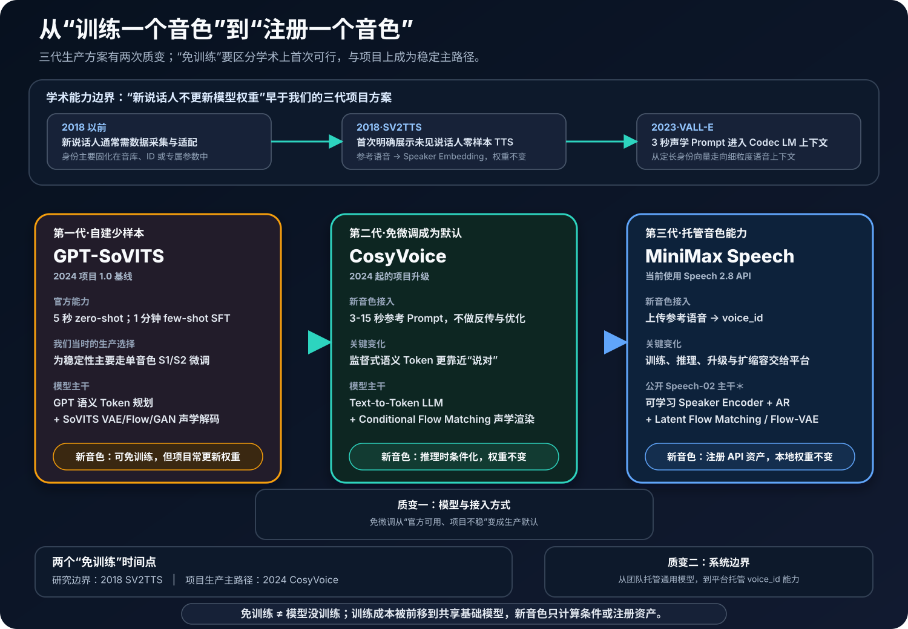
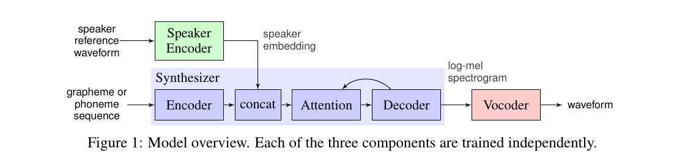
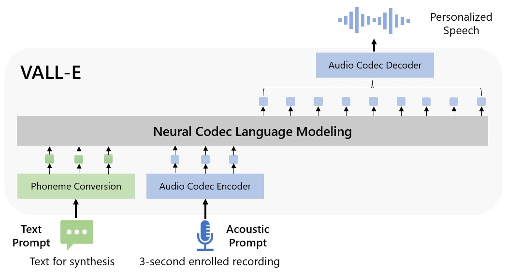
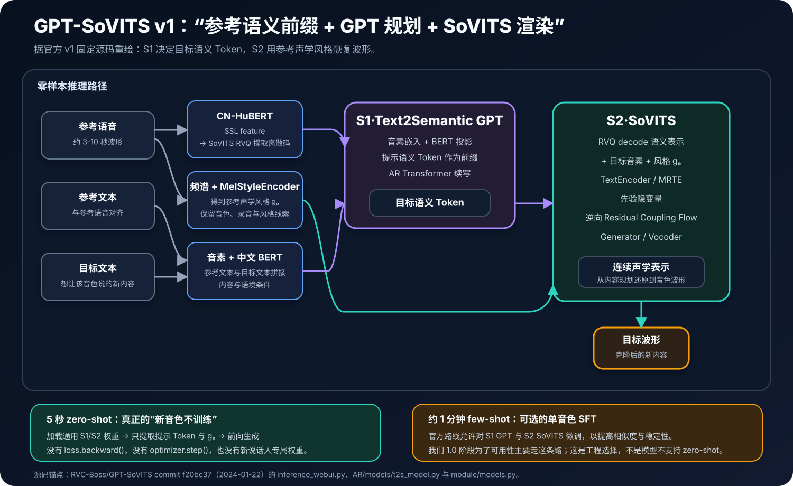
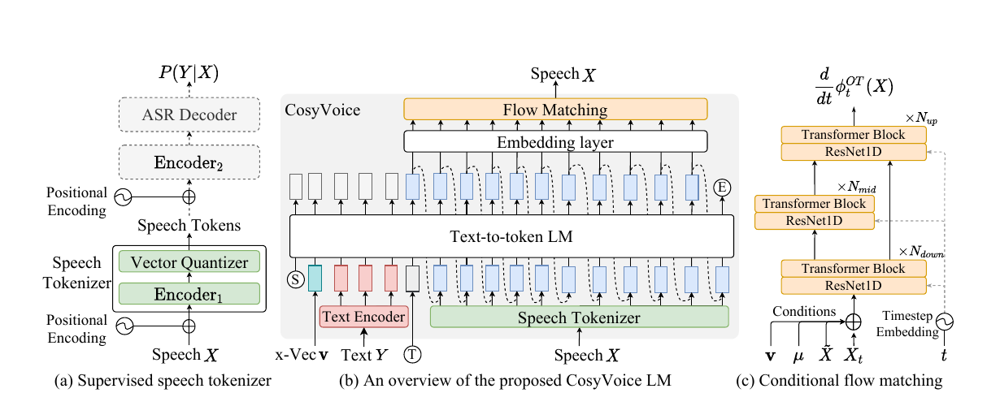
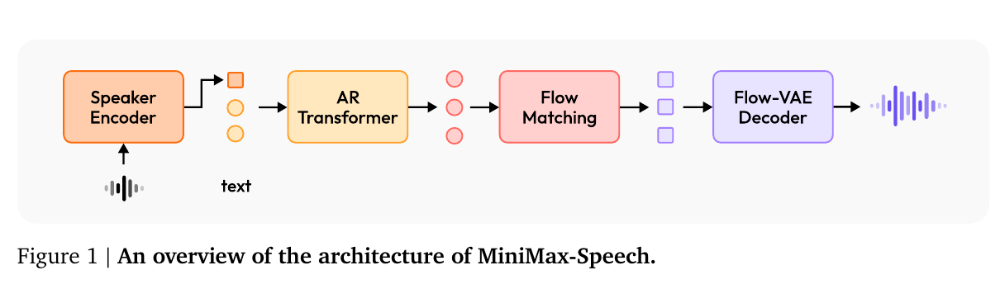
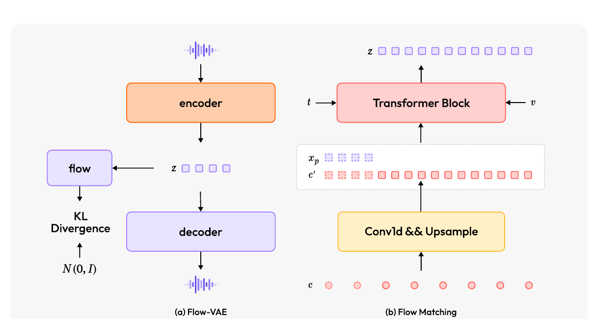
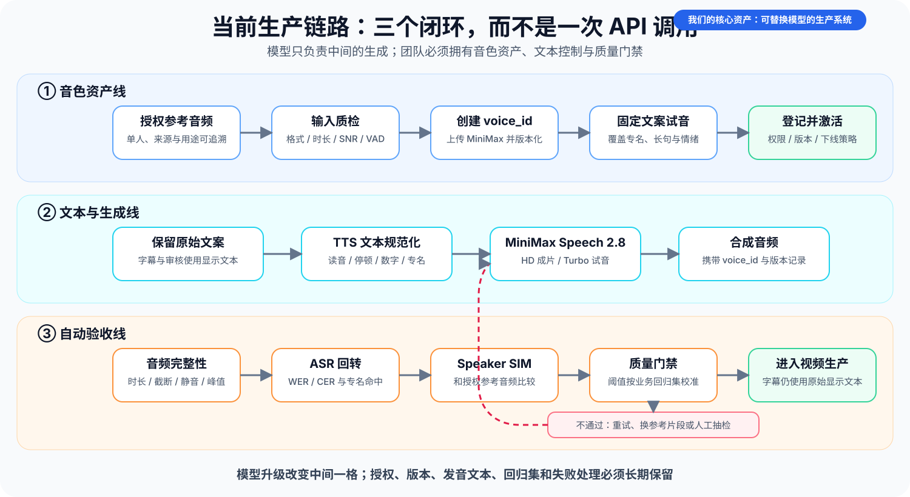

# 音色克隆技术路线：从说话人编码、GPT-SoVITS、CosyVoice到MiniMax Speech 2.8

[](assets/voice-cloning-evolution/01-voice-cloning-macro-evolution.svg)

*图 1　先分清两个“免训练”：2018 年 SV2TTS 已在研究上展示未见说话人的零样本（zero-shot，即不为新说话人更新权重）合成；到项目升级 CosyVoice 时，短参考音频免微调才变成稳定的生产主路径。GPT-SoVITS → CosyVoice 是模型与接入方式的质变；CosyVoice → MiniMax 主要是托管边界的质变。*

## 摘要

音色克隆已经从“为每个人重新训练一个模型”，演进为“给统一的大模型一小段参考语音，让它在推理时复现说话人”。这条路线的核心结构基本收敛为四层：**说话人表征回答谁在说，文本或语音 Token 回答说什么，自回归语言模型或扩散/流模型回答怎么组织时长与韵律，声学解码器回答怎样还原为高保真波形。**

我们的生产路径可以称为三代，但不应误读为三次学术范式重建。**GPT-SoVITS → CosyVoice** 是最关键的模型质变：项目从“官方可 zero-shot，但单音色监督微调（SFT）才更稳”走到“短参考提示（Prompt）不更新权重就是生产默认”，项目历史记录的可用率也由不足 60% 提升到 90% 以上。**CosyVoice → MiniMax Speech 2.8** 的质变主要发生在系统边界：免训练不是 MiniMax 才发明的，新的是上传参考音频就得到可治理的 `voice_id`，训练、扩缩容与底层升级全部交给平台。

本文的判断是：**通用音色复刻的主干技术已经进入工程收敛期，但产品并没有“自动完成”。** 后续模型升级仍会改善尾部口音、跨语言、情绪、低延迟和噪声鲁棒性，却很难再带来从“不能用”到“能用”的同量级跃迁。真正决定生产结果的，越来越不是某个单点模型分数，而是输入质量、行业文本控制、端到端验收、授权和服务降级。

## 1　先把问题说清：克隆的不是一条声纹，而是一组纠缠属性

语音可以粗略拆成四类信息：

| 信息 | 用户感知 | 典型技术载体 |
|---|---|---|
| 语言内容 | 字有没有读对 | 字符、音素、BPE、语义 Speech Token |
| 说话人身份 | 像不像目标人物 | Speaker Embedding、参考声学 Prompt |
| 韵律与风格 | 语速、重音、停顿、情绪像不像 | 自回归上下文、Style Token、情绪条件、参考 Prompt |
| 声学细节 | 音质、气声、混响、底噪 | Mel、连续 Latent、Codec Token、Vocoder |

因此，“音色相似”只是音色克隆的一部分。一个系统可能说话人相似度很高，却读错产品名；也可能内容完全正确，却带着播音腔、错误停顿或电子噪声。项目从 GPT-SoVITS 到 CosyVoice 的升级，实质上正是从只关注“像不像”，转向同时约束**内容正确、音色相似、自然表达、音频洁净和服务可用**。

还要区分三个相邻任务：

- **多说话人 TTS**：从文本生成语音，在训练集中已有的多个音色之间选择。
- **音色克隆 TTS**：给未见过说话人的短参考音频，再朗读任意新文本。
- **Voice Conversion**：输入已有语音，尽量保留它的内容和韵律，只把说话人身份转换成目标音色。

当前项目需要的是第二种。它既不能只做声纹检索，也不能简单地把输入音频“变声”；它必须生成从未说过的新内容。

## 2　一条时间线：新音色从何时开始不需要训练

| 阶段 | 代表路线 | 新音色接入 | 关键变化 | 主要局限 |
|---|---|---|---|---|
| 1990s-2000s | 拼接式、HMM 参数语音 | 采集专属音库，重新适配或训练 | 从录音单元拼接转为声学参数建模 | 数据制作重、表达僵硬、跨人迁移弱 |
| 2016-2018 | WaveNet、Tacotron 2、多说话人 TTS | 通常仍需较多数据或说话人适配 | 神经声学模型与声码器提高自然度 | 多说话人不等于未见说话人免训练 |
| **2018-2021** | **SV2TTS、YourTTS** | **几秒参考可 zero-shot，长尾可选微调** | Speaker Encoder 把身份从专属权重变成推理条件 | 定长向量会丢细粒度风格 |
| 2023 | VALL-E、AudioLM 类 Codec LM | 3 秒声学 Prompt，无权重更新 | 参考语音以 Codec Token 上下文参与生成 | 自回归（AR）错误累积，内容、音色和环境易纠缠 |
| 2024 | GPT-SoVITS | 官方支持 5 秒 zero-shot；约 1 分钟可选 SFT | 开源私有部署与少样本训练降低落地门槛 | 项目为追求稳定仍以逐音色 SFT 为主 |
| **2024-2025** | **CosyVoice 1/2/3** | **3-15 秒 Prompt，项目主路径不更新权重** | 监督语义 Token + LLM + Flow 提高内容与声学分工 | 优化重心转向文本、延迟、长尾语言与生产治理 |
| 2025-2026 | MiniMax Speech-02/2.6/2.8 等商业 API | 上传参考音频并注册 `voice_id`，平台内部处理 | 免训练能力变成托管产品和资产管理接口 | 底层可控性降低，带来供应商、成本、数据与合规依赖 |

第一个需要牢记的结论是：**研究上，2018 年 SV2TTS 就已经实现“新说话人不更新权重”；在我们的项目中，这个能力到 CosyVoice 才从“可用选项”变成“稳定主路径”。** 所以不能把 GPT-SoVITS 写成不支持 zero-shot，也不能把我们当时依赖 SFT 的工程事实抹掉。

### 2.1 三代生产方案，到底变了什么

先统一“参数量”的统计口径：这里列的是该代**公开且实际承担生成的核心模型规模**。GPT-SoVITS 按固定 v1 官方 S1、S2 生成权重逐张量统计；CosyVoice 使用项目对应的官方 `CosyVoice-300M` 型号口径；商业模型没有披露就明确写“未披露”。共享的外部特征提取器、只在训练时使用的判别器，以及 Checkpoint 的磁盘字节数，都不能不加区分地混进来。因此这些数字帮助建立规模感，却不是严格同口径的排行榜。

| 项目代际 | 参数量（公开/固定口径） | 说话人条件 | “说什么”由谁负责 | “怎样还原声音”由谁负责 | 新音色主路径 | 本质变化 |
|---|---|---|---|---|---|---|
| 第一代·GPT-SoVITS | **约 130.3M**：S1 77.5M + S2 52.8M；不含 CN-HuBERT、中文 BERT 和训练期判别器[^gpt-sovits-params] | 参考语义 Token + 频谱风格 | Text2Semantic GPT | SoVITS VAE / Flow / 生成对抗（GAN）Decoder | 项目为稳定主要做 S1/S2 SFT | 少量私有数据就能克隆，但训练仍是音色交付的重要环节 |
| 第二代·CosyVoice | **约 300M**：项目对应 `CosyVoice-300M` 官方型号口径[^cosyvoice-size] | Speaker Embedding + 声学 Prompt | 监督语义 Token + LLM | Conditional Flow Matching + Vocoder | 短 Prompt，不做反传 | **模型质变**：免微调成为生产默认，内容与声学的分工更清晰 |
| 第三代·MiniMax Speech | **未披露**：Speech-02 技术报告与 Speech 2.8 产品资料均未公布总参数量[^minimax-paper][^minimax-28] | API 中由参考音频注册 `voice_id`；公开 Speech-02 为可学习 Speaker Encoder | 公开 Speech-02 为 AR Transformer | 公开 Speech-02 为 Latent Flow Matching + Flow-VAE | 上传、注册、调用 API | **系统质变**：音色成为托管资产，团队不再拥有或运维底层权重 |

参数量也不是三代差异的因果解释。第一代到第二代的关键收益来自表示、训练数据和“语义规划 + 连续声学渲染”的分工，而不只是 130M 变成 300M；第二代到第三代甚至没有可比较的公开数字。把 MiniMax 写成“因为参数更多所以更强”没有证据，能够确认的是它把模型、数据、推理集群和音色资产接口一起封装成了托管系统。

如果问“核心框架变过几次”，需要先说口径。按整个技术史的抽象层次，可以看作三次主干重分工：**专属权重 → 共享模型与说话人条件；连续 Mel 回归 → 离散 Speech Token 语言建模；单一序列生成 → AR 高层规划 + Flow 连续声学渲染。** 但按项目三代来看，GPT-SoVITS 已经有“语义规划 + 声学解码”的混合结构；CosyVoice 是一次明显的模型分工升级，MiniMax 公开主干仍在 AR + Flow 家族内，更大的变化是 Speaker Encoder、Latent 与托管交付。

## 3　统一数学框架：现代音色克隆到底在优化什么

不同论文的模块名称不同，但都可以放进同一个条件生成问题。给定目标文本 $y$、参考语音 $x_r$，生成目标语音 $x$：

$$
p(x \mid y, x_r)
$$

模型需要从 $x_r$ 中抽出与说话人有关、与其恰好说了什么尽量无关的条件，再把 $y$ 映射成目标语音。

### 3.1 从波形到可学习表示

原始波形是高采样率的一维序列。短时傅里叶变换先把局部时间窗映射到频域：

$$
X(m,k)=\sum_n x[n]w[n-mH]e^{-j2\pi kn/N}
$$

其中 $x[n]$ 是第 $n$ 个波形采样点，$w[\cdot]$ 是分析窗，$m$ 是帧索引，$k$ 是频率索引，$H$ 是帧移，$N$ 是傅里叶变换点数。Mel 频谱再用滤波器组压缩频率维度并取对数：

$$
M_{m,b}=\log\left(\epsilon+\sum_k H_{b,k}|X(m,k)|^2\right)
$$

这里 $b$ 是 Mel 频带索引，$H_{b,k}$ 是第 $b$ 个 Mel 滤波器在频点 $k$ 上的权重，$\epsilon$ 是防止对数输入为零的小常数。早期神经 TTS 通常预测 Mel，再由 Vocoder 生成波形。现代系统也可能直接建模神经 Codec Token 或 VAE 连续 Latent，以减轻 Mel 的信息瓶颈。

### 3.2 说话人编码：把“谁在说”压成条件向量

SV2TTS 的代表性做法，是先在说话人验证任务上训练编码器，再把几秒参考语音映射为归一化向量：

$$
e=\frac{f_\phi(x_r)}{\|f_\phi(x_r)\|_2}
$$

$f_\phi$ 是参数为 $\phi$ 的说话人编码器，$x_r$ 是参考语音，$e$ 是单位化的说话人向量。

两个音频是否属于同一说话人，常用余弦相似度衡量：

$$
\operatorname{SIM}(e_r,e_g)=\frac{e_r^\top e_g}{\|e_r\|_2\|e_g\|_2}
$$

固定的说话人验证编码器擅长区分身份，却不一定保留 TTS 最需要的气声、年龄感、发声位置和表达风格。MiniMax-Speech 的公开技术报告把 Speaker Encoder 与自回归 TTS 联合训练，让“什么是有用的说话人信息”直接接受生成任务监督。这是它相对 CosyVoice 1 所用外部 3D-Speaker 表征的重要变化。

### 3.3 语音离散化：把连续声音变成可预测的 Token

VQ 模型先编码声学特征，再寻找最近的码本向量：

$$
z_e=E(M),\qquad k^*=\arg\min_j\|z_e-e_j\|_2^2,\qquad z_q=e_{k^*}
$$

$E$ 是声学编码器，$M$ 是 Mel 特征，$z_e$ 是连续隐表示，$e_j$ 是码本中第 $j$ 个向量，$k^*$ 是距离最近的码本索引，$z_q$ 是量化后表示。

典型损失包含重建、码本与承诺项；若希望 Token 显式携带内容，还会加入 ASR/CTC 监督：

$$
\mathcal L_{tok}=\mathcal L_{rec}
+\|\operatorname{sg}[z_e]-z_q\|_2^2
+\beta\|z_e-\operatorname{sg}[z_q]\|_2^2
+\lambda\mathcal L_{CTC}
$$

`sg` 表示停止梯度；$\beta$ 控制编码表示贴近码本的强度，$\lambda$ 控制连接时序分类（CTC）监督的权重。VALL-E 使用神经 Codec 的离散码；CosyVoice 1 强调由 ASR 监督得到的语义 Token；MiniMax-Speech 报告中的音频 Tokenizer 采用 Encoder-VQ-Decoder、CTC 监督和每秒 25 Token 的压缩率。它们的共同目标都是：**把数万点每秒的波形压成语言模型能够处理、又不丢失关键语义与声学信息的短序列。**

下面是对应数学式的最小 PyTorch 教学实现。它不是任何生产模型的源码，但清楚展示了梯度如何流向编码器与码本：

```python
import torch
import torch.nn.functional as F


def vector_quantize(z_e: torch.Tensor, codebook: torch.Tensor, beta: float = 0.25):
    """z_e: [B, T, D], codebook: [K, D]."""
    distance = (
        z_e.square().sum(dim=-1, keepdim=True)
        - 2 * z_e @ codebook.T
        + codebook.square().sum(dim=-1)
    )
    token_ids = distance.argmin(dim=-1)
    z_q = F.embedding(token_ids, codebook)

    codebook_loss = F.mse_loss(z_q, z_e.detach())
    commitment_loss = beta * F.mse_loss(z_e, z_q.detach())
    z_st = z_e + (z_q - z_e).detach()  # straight-through estimator
    return z_st, token_ids, codebook_loss + commitment_loss
```

### 3.4 自回归语言模型：在文本和音色条件下预测下一个语音 Token

离散化以后，TTS 可以直接写成语言建模：

$$
p(s_{1:T}\mid y,e)=\prod_{t=1}^{T}p(s_t\mid s_{<t},y,e)
$$

训练目标是 Token 交叉熵：

$$
\mathcal L_{AR}=-\sum_{t=1}^{T}\log p_\theta(s_t^*\mid s_{<t}^*,y,e)
$$

$s_t^*$ 是目标语音在第 $t$ 步的正确 Token，$s_{<t}^*$ 是前 $t-1$ 个正确 Token，$T$ 是序列长度，$y$ 是目标文本，$e$ 是说话人条件，$\theta$ 是自回归模型参数。

如果提供参考文本和参考 Speech Token，条件中再加入 $(y_r,s_r)$，这就是 VALL-E、CosyVoice 和许多“零样本”论文所说的声学 Prompt。MiniMax-Speech 使用更严格的术语：只有未转写参考音频、没有配对文本示例时称为 zero-shot；加入参考音频及其转写则称 one-shot。两套命名在文献中同时存在，比较产品时必须先统一口径。

### 3.5 Flow Matching：从噪声连续搬运到目标声学表示

语义 Token 保证“说什么”，但不足以还原全部声学细节。条件流匹配学习一个随时间变化的速度场，把简单分布中的噪声 $x_0$ 搬运到真实声学表示 $x_1$。最简单的直线路径是：

$$
x_t=(1-t)x_0+tx_1,\qquad u_t=x_1-x_0
$$

其中 $t\in[0,1]$ 是连续时间，$x_0$ 是噪声起点，$x_1$ 是真实目标声学表示，$u_t$ 是这条直线路径的真实速度。网络在文本、说话人和语音 Token 条件 $c$ 下拟合速度：

$$
\mathcal L_{FM}=\mathbb E_{t,x_0,x_1}\left[\|v_\theta(x_t,t,c)-u_t\|_2^2\right]
$$

$v_\theta$ 是参数为 $\theta$ 的速度网络，$c$ 汇总文本、说话人与语音 Token 条件。这个平方误差告诉网络：在任意中间时刻和中间状态上，应该朝真实声学目标移动多快。

推理时求解常微分方程：

$$
\frac{dx_t}{dt}=v_\theta(x_t,t,c),\qquad x_0\sim\mathcal N(0,I)
$$

最小训练步骤如下：

```python
def conditional_flow_matching_loss(flow_net, target_latent, condition):
    batch = target_latent.shape[0]
    shape = (batch,) + (1,) * (target_latent.ndim - 1)
    t = torch.rand(shape, device=target_latent.device)
    x0 = torch.randn_like(target_latent)
    xt = (1 - t) * x0 + t * target_latent
    target_velocity = target_latent - x0
    predicted_velocity = flow_net(xt, t, condition)
    return F.mse_loss(predicted_velocity, target_velocity)
```

CosyVoice 用条件流匹配从 Token 条件恢复 Mel。MiniMax-Speech 的公开报告更进一步：Flow Matching 不直接预测 Mel，而是预测由 Flow-VAE 编码的连续语音 Latent，再由联合训练的解码器还原波形。其 KL 约束可写为：

$$
\mathcal L_{KL}=D_{KL}\left(q_\phi(\tilde z\mid x)\;\|\;\mathcal N(0,I)\right)
$$

这里 $q_\phi(\tilde z\mid x)$ 是给定音频 $x$ 后的后验隐变量分布，$\mathcal N(0,I)$ 是标准正态先验，$D_{KL}$ 是 Kullback-Leibler 散度。普通 VAE 把后验限制在简单高斯中；Flow-VAE 用可逆流 $f_\theta$ 变换后验，并通过雅可比行列式修正密度：

$$
\log q_\phi(\tilde z\mid x)
=\log \mathcal N\left(f_\theta(\tilde z);\mu_\phi(x),\sigma_\phi(x)\right)
+\log\left|\det\frac{\partial f_\theta(\tilde z)}{\partial \tilde z}\right|
$$

直觉上，AR 模型负责较低频、离散的内容和韵律规划，Flow/Decoder 负责高频、连续的声学实现。现代强模型虽然模块命名不同，大多在以不同方式完成这次“先规划、再渲染”的分工。

### 3.6 先分清四种动作：预训练、单音色 SFT、RL 后训练和免训练接入

“免训练音色克隆”最容易引起的误会，是以为整个模型没有训练。真实情况正好相反：**前面需要一个用海量说话人数据训好的共享基础模型；“免训练”只是说新录入某个音色时，不再为他执行反向传播和更新权重。** 后文的 RL 是强化学习（reinforcement learning），专指用奖励信号调整共享模型。

| 动作 | 数据 | 是否有 Loss / 反传 | 改变什么 | 对应本文哪一段 |
|---|---|---|---|---|
| 共享基础训练 | 大规模多说话人语音与文本 | 有，通常是交叉熵（CE）、CTC、重建、GAN、KL、Flow Matching 等 | Tokenizer、LLM、Speaker Encoder、声学解码器的共享参数 | 类比“预训练”，但是多任务语音生成训练，不只是 LLM 的下一 Token 预训练 |
| 单音色 SFT / 适配 | 某个人约 1 分钟到更多的语音 | 有 | 整模、局部模块或说话人嵌入 | GPT-SoVITS 项目基线；MiniMax 论文的可选个性化音色克隆（PVC）也属于参数高效适配 |
| 奖励 / RL 后训练 | 共享模型生成的 Token 及内容、情绪等奖励 | 有 | 通用模型的生成偏好 | CosyVoice 3 的 DiffRO；不是新音色录入流程 |
| zero-shot / Prompt / `voice_id` 接入 | 一段新说话人参考语音 | **无** | 只产生 Speaker Embedding、Prompt Token 或平台资产 ID；模型权重不变 | CosyVoice 项目主路径与 MiniMax API |

因此，用 LLM 语言来类比：通用音色模型的大规模多说话人训练类似“预训练”；为单个音色更新权重是 SFT；CosyVoice 3 的奖励优化属于通用模型后训练；新音色只提供参考音频则最像 in-context learning。这四件事可以并存，不是四选一。

### 3.7 为什么新录入的音色可以不训练

先看训练时模型实际看到的一个样本。从同一说话人 $s$ 抽两条不同的语音：参考语音 $x_r^s$ 负责告诉模型“这个人怎么说”；目标文本 $y_t$ 和目标语音 $x_t^s$ 负责告诉模型“这次应该说什么、正确声音是什么”。两条语音内容不同，可以减少模型只会抄参考文字的捷径。

说话人/提示编码器先产生条件：

$$
c^s=E_\psi(x_r^s)
$$

再用该条件、目标文本与目标语音学习共享生成参数：

$$
\mathcal L(\theta,\psi)
=\mathbb E_{s,r,t}\left[
-\log p_\theta\!\left(Q(x_t^s)\mid y_t,c^s\right)
+\lambda\mathcal L_{acoustic}(\hat x_t^s,x_t^s)
\right]
$$

$Q(x_t^s)$ 是目标语音的语义或 Codec Token，$\mathcal L_{acoustic}$ 是 Mel、Latent 或波形层的声学损失。在许多说话人上反复做这件事后，编码器 $E_\psi$ 学会把一段任意语音投影到共享的“说话人/风格条件空间”；生成器则学会如何解读这个空间。

到新说话人 $s^*$ 入库时，只需要前向计算：

$$
c^{s^*}=E_\psi(x_r^{s^*}),\qquad
\hat x=G_\theta(y,c^{s^*})
$$

$\theta$ 和 $\psi$ 都没有更新。这就是“一模万人”的核心：过去把身份写进专属权重，现在把身份编码成通用模型会读的条件。

下面的代码骨架刻意把“基础训练”和“新音色接入”放在一起：

```python
def foundation_train_step(model, speaker_encoder, ref_audio, text, target_audio):
    # ref_audio 与 target_audio 来自同一说话人，但内容不同。
    speaker_condition = speaker_encoder(ref_audio)
    semantic_loss, acoustic_loss = model.loss(
        text=text,
        speaker_condition=speaker_condition,
        target_audio=target_audio,
    )
    loss = semantic_loss + acoustic_loss
    loss.backward()
    optimizer.step()  # 这里才会修改共享模型权重


@torch.no_grad()
def enroll_and_synthesize(model, speaker_encoder, new_ref_audio, text):
    speaker_condition = speaker_encoder(new_ref_audio)
    return model.generate(text=text, speaker_condition=speaker_condition)
    # 没有 loss、backward 或 optimizer.step：这就是免训练接入。
```

这个解释也给出了边界：条件空间不可能完美解耦。新说话人距离训练分布太远，或参考片段夹带噪声、多人、极端情绪和错误转写时，$c^{s^*}$ 依然会混入内容与环境。这就是为什么免训练成立，却仍然需要参考音频 SOP、多候选 Prompt 和回归评测。

### 3.8 三代方案的 Loss 是什么，RL 到底会不会进来

先给答案：**会有 RL 或奖励后训练，但它不是零样本音色克隆成立的必要条件，也不会在每次新音色入库时执行。** GPT-SoVITS v1 与 CosyVoice 1 的主干是监督学习；CosyVoice 3 明确加入可微奖励优化（Differentiable Reward Optimization，DiffRO）后训练；[^cosyvoice3] MiniMax Speech-02 的公开报告没有披露同类 RL 环节，Speech 2.8 又没有对等的公开技术报告，不应猜测。[^minimax-paper]

| 方案 | 公开的核心训练目标 | 这个 Loss 在学什么 | RL 与新音色的关系 |
|---|---|---|---|
| GPT-SoVITS v1 | S1：语义 Token 交叉熵；S2：对抗、特征匹配、Mel L1、VQ 承诺与 KL | S1 学内容与时序续写；S2 学声学真实性、细节和隐空间 | 固定的 v1 训练路径无 RL；5 秒 zero-shot 无 Loss，约 1 分钟 SFT 会再优化这些监督目标 |
| CosyVoice 1 | 监督 Tokenizer 的 ASR 目标；LLM Token CE；OT-CFM 速度场回归 | Token 更接近“说什么”，LLM 学顺序，Flow 学从噪声搬运到 Mel | 论文主干无 RL；zero-shot Prompt 只做前向计算 |
| CosyVoice 3 | 在上述主干上增加 DiffRO：奖励最大化 + 相对参考模型的 KL 约束 | 用 Token2Text、情绪识别等可微奖励优化内容一致性与指令属性 | **有奖励后训练**，但优化共享 LM，不是为每个新说话人跑 RL |
| MiniMax-Speech 公开报告 | Audio Tokenizer 有 CTC 监督；Speaker Encoder 与 AR 联合训练；Flow-VAE 披露 KL 约束 | 学内容压缩、面向 TTS 的说话人条件和可预测的连续 Latent | Speech-02 报告未披露 RL；普通 zero-shot 无微调，论文另有可选的说话人嵌入 PVC |

GPT-SoVITS 的 S1 目标与上文的 AR 公式一致。固定 v1 源码中，S2 生成器可概括为：[^gpt-sovits-v1]

$$
\mathcal L_{G}
=\mathcal L_{adv}
+\mathcal L_{feat}
+45\mathcal L_{mel}
+\mathcal L_{commit}
+\mathcal L_{KL}
$$

$\mathcal L_{adv}$ 让生成波形骗过判别器；$\mathcal L_{feat}$ 让真假音频在判别器中间层的特征靠近；$\mathcal L_{mel}$ 约束频谱重建；$\mathcal L_{commit}$ 让 SSL 表示安定贴近离散码本；$\mathcal L_{KL}$ 整理先验与后验隐空间。源码里的变量 `loss_fm` 在这里是 **GAN feature matching**，不是 CosyVoice 里的 Flow Matching；两者缩写相同，数学对象完全不同。

CosyVoice 1 的 Flow Matching Loss 已在 3.5 节给出。CosyVoice 3 的 DiffRO 则写成：

$$
\max_\theta\;
\mathbb E[R(Y)]
-\beta D_{KL}\!\left(\pi_\theta(\mu\mid Y)\,\|\,\pi_{ref}(\mu\mid Y)\right)
$$

它用 Gumbel-Softmax 让离散语音 Token 采样保持可微，奖励梯度可以直接反传到 LLM，而不必把音频完整渲染后再跑 PPO 式循环。论文将它归为 RL，但更精确的工程理解是“可微奖励后训练”。论文也报告了奖励黑客的边界：WER 可以改善，说话人相似度却可能轻微下降。这再次说明，RL 是通用模型的多目标取舍工具，不是“免训练克隆”的同义词。

## 4　关键范式如何一步步形成

### 4.1 Speaker Encoder：第一次把说话人从模型权重里拿出来

2018 年的 SV2TTS 由三个独立模块组成：说话人验证编码器、以 Speaker Embedding 为条件的 Tacotron 2、WaveNet Vocoder。它证明了编码器可以在无转写的大规模说话人验证数据上学习身份，再把这个能力迁移到从未见过的说话人 TTS。[^sv2tts]

先看下面这张奠基图。最值得注意的不是 Tacotron 或 WaveNet 的具体层数，而是上方绿色的 Speaker Encoder 已经成为独立入口：参考语音被压成一个 Speaker Embedding，再注入所有说话人共享的合成器。**“谁在说”第一次不必固化在每个专属模型的权重里。**

[](assets/voice-cloning-evolution/02-sv2tts-system-architecture.png)

*图 2　SV2TTS 把参考语音编码为固定向量，再与文本编码拼接，最后经合成器和声码器输出波形。原论文 Figure 1，裁剪自 [Transfer Learning from Speaker Verification to Multispeaker Text-To-Speech Synthesis](https://arxiv.org/abs/1806.04558)，版权归原作者。*

这一步的意义不在某个网络层，而在接口抽象：

```text
几秒参考语音 -> 固定维度 Speaker Embedding -> 通用 TTS
```

YourTTS 随后把零样本多说话人能力放进 VITS 框架，并显示不到 1 分钟语音微调仍能进一步提高长尾说话人的相似度。[^yourtts] 这一时期形成了“零样本先用，少量数据再适配”的产品分层。

### 4.2 Codec Language Model：第二次把语音生成变成语言建模

VALL-E 的关键不是“更像 GPT 的名字”，而是把离散神经 Codec 码当作另一种语言。模型用 6 万小时英文语音训练，只需 3 秒未知说话人的录音作为声学 Prompt，就能在上下文中延续音色、情绪乃至录音环境。[^valle]

图 3 要从下往上读：目标文本先变成音素，三秒录音先变成离散 Codec 码；两者一起进入 Neural Codec Language Modeling，模型续写出新的声学 Token，再由 Codec Decoder 还原语音。与图 2 相比，参考音频不再只剩一个定长向量，而是以一串离散声学上下文参与生成。

[](assets/voice-cloning-evolution/03-valle-neural-codec-language-model.png)

*图 3　VALL-E 把 TTS 改写为“在文本与声学 Prompt 条件下续写 Codec Token”。原论文 Figure 1，摘自 [Neural Codec Language Models are Zero-Shot Text to Speech Synthesizers](https://arxiv.org/abs/2301.02111)，版权归原作者。*

这种方案解决了 Speaker Embedding 过度压缩的问题：参考语音不再只有一个向量，还能以 Token 序列保留细粒度信息。但代价是内容、风格与环境声也更容易纠缠，自回归采样会出现重复、漏字和长序列误差累积。此后几年的核心工作，本质上是在提高 Token 语义性、减少自回归负担并改善连续声学解码。

### 4.3 GPT-SoVITS：把研究范式变成可私有部署的项目工具

项目 1.0 初期使用的 GPT-SoVITS，把文本到语义 Token 的 GPT 模块与 SoVITS 声学生成模块组合起来，并借助自监督语音特征、参考文本和参考音频完成少样本克隆。它的产品价值非常直接：开源、可在内部 GPU 环境部署，而且同时给出 **5 秒 zero-shot** 和 **约 1 分钟 few-shot SFT** 两条路。[^gpt-sovits]

[](assets/voice-cloning-evolution/08-gpt-sovits-v1-architecture.svg)

*图 4　GPT-SoVITS v1 的零样本路径。参考语音一路经 CN-HuBERT 与 SoVITS RVQ 变成提示语义 Token，另一路经频谱与 MelStyleEncoder 变成声学风格条件；S1 GPT 续写目标语义 Token，S2 SoVITS 再通过 TextEncoder/MRTE、逆向流与 Generator 恢复波形。本文据官方 v1 固定源码 commit `f20bc37` 重绘，不是原论文图。[^gpt-sovits-v1]*

图中最关键的不是每一层的名字，而是两个阶段的职责：

1. **S1 Text2Semantic GPT 先决定内容时序。** 参考文本和目标文本变成音素与 BERT 特征，参考语音的语义码作为 AR 前缀，模型续写目标语义 Token。
2. **S2 SoVITS 再把语义计划变成该音色的波形。** 它同时读取目标音素、目标语义 Token 和参考频谱风格，经先验隐变量、逆向流和生成器输出波形。

固定源码的推理顺序可以压缩成这段对齐实现的伪代码：

```python
# 1. 参考语音 -> SSL feature -> 提示语义 Token
ssl_feature = cn_hubert(reference_waveform)
prompt_semantic = sovits.extract_latent(ssl_feature)

# 2. 文本条件 + 提示 Token -> S1 目标语义 Token
phones, bert = encode_reference_and_target_text(reference_text, target_text)
target_semantic = text2semantic.infer(phones, bert, prompt_semantic)

# 3. 参考频谱 + 目标音素 + 目标语义 Token -> S2 波形
waveform = sovits.decode(target_semantic, target_phones, reference_spectrogram)
```

这里必须纠正一个看似矛盾的事实：**GPT-SoVITS 本身支持免训练 zero-shot；我们当时仍主要训练每个音色，是因为 5 秒 zero-shot 在相似度、内容稳定性和音频洁净度上还没有达到项目默认门槛。** 这是“能不能”与“是否稳定到可以不训练”的区别。

但项目遇到的三类问题同样具有代表性：

1. 推理多字、漏字、错字，长句需要预分段；
2. 存在电音和杂音，音频不一定能直接进入视频；
3. 每个音色的训练结果强依赖参考音频和训练质量，多次训练不稳定。

这些问题不意味着 GPT-SoVITS 的路线错误。相反，它说明音色克隆已从算法 Demo 进入生产：一旦批量生成，尾部 5%-10% 的坏样本会吞掉大量人工试听与返工成本。需要升级的不是“能不能像”，而是“能否稳定地正确说完”。

下文的项目比较只针对当时采用的早期 GPT-SoVITS 基线，不代表后续版本的能力上限。

### 4.4 CosyVoice：监督式语义 Token 把内容正确性拉回中心

CosyVoice 1 的三段结构非常清晰：

```text
参考语音 -> 监督式语义 Speech Token
文本 + 说话人 + Prompt -> LLM 自回归生成目标 Speech Token
Speech Token + 说话人条件 -> Conditional Flow Matching -> 声学表示 -> 波形
```

它在多语种 ASR 模型中插入向量量化，通过文本监督使离散 Token 与语言内容显式对齐，再用 LLM 做 Text-to-Token、用条件流匹配做 Token-to-Speech。论文实验显示，监督式语义 Token 相比无监督 Token 改善了零样本克隆的内容一致性和说话人相似度。[^cosyvoice]

图 5 把三段职责画在同一张图里：左侧用 ASR 监督训练 Speech Tokenizer，中间的 LLM 只负责把文本与 Prompt 规划成语义 Token，右侧的条件流匹配再把离散规划渲染成连续声学特征。它回答了 GPT-SoVITS 阶段的核心生产问题：**要减少错字漏字，就要让供 LLM 预测的语音 Token 更靠近“内容”，把高频声学细节留给 Flow。**

[](assets/voice-cloning-evolution/04-cosyvoice-overview.png)

*图 5　CosyVoice 1 的完整主干。左：监督式语义 Tokenizer；中：Text-to-Token LLM；右：条件流匹配。原论文 Figure 1，裁剪自 [CosyVoice: A Scalable Multilingual Zero-shot Text-to-speech Synthesizer based on Supervised Semantic Tokens](https://arxiv.org/abs/2407.05407)，版权归原作者。*

CosyVoice 2 进一步用有限标量量化改善码本利用率，并引入 chunk-aware causal flow matching，让同一模型兼容流式与非流式生成。[^cosyvoice2] CosyVoice 3 又把数据从万小时级扩大到百万小时级，模型从 0.5B 扩到 1.5B，并增加多任务语音 Tokenizer 与 DiffRO 可微奖励后训练；其改进重点已经从发明全新主干，转向数据规模、真实分布、文本格式和生成偏好。[^cosyvoice3]

这正是技术收敛的证据：主干仍是 Tokenizer + LLM + Flow，性能提升越来越来自规模、后训练和工程控制。

### 4.5 MiniMax-Speech：把说话人编码器重新放回端到端目标

MiniMax 2025 年公开的 Speech-02-HD 技术报告仍采用熟悉的三段式：音频 Tokenizer、AR Transformer、Latent Flow Matching。它的两个关键差异是：[^minimax-paper]

[](assets/voice-cloning-evolution/05-minimax-speech-overview.png)

*图 6　MiniMax-Speech 的公开主干。参考音频经可学习 Speaker Encoder 形成条件，AR Transformer 规划离散 Token，Flow Matching 生成连续 Latent，Flow-VAE Decoder 直接还原波形。原论文 Figure 1，裁剪自 [MiniMax-Speech: Intrinsic Zero-Shot Text-to-Speech with a Learnable Speaker Encoder](https://arxiv.org/abs/2505.07916)，版权归原作者。*

1. **Learnable Speaker Encoder。** 说话人编码器与 AR Transformer 联合训练，不再完全依赖外部说话人验证目标。参考音频无需转写即可得到固定条件向量，天然适合跨语言和低操作成本的 zero-shot 克隆。
2. **Flow-VAE。** Flow Matching 预测的目标从 Mel 换为由端到端音频编码器学习的连续 Latent，减少 Mel 瓶颈，再由神经解码器直接重建波形。

图 7 是第二个差异的放大图。左半边的 Flow-VAE 学习“波形 ↔ 连续 Latent $z$”，并用可逆 Flow 与 KL 约束整理 Latent 分布；右半边的 Flow Matching 不直接猜波形，而是在 AR Token、Speaker Embedding $v$ 和时间 $t$ 的条件下生成 $z$。因此，离散 AR 层负责低频规划，连续 Flow 层负责高保真声学实现。

[](assets/voice-cloning-evolution/06-minimax-flow-vae.png)

*图 7　MiniMax-Speech 的 Latent Flow Matching：Flow-VAE 定义连续声学空间，Flow Matching 在离散 Token 与说话人条件下生成该空间中的目标。原论文 Figure 3，裁剪自 [MiniMax-Speech 技术报告](https://arxiv.org/abs/2505.07916)，版权归原作者。*

论文在 Seed-TTS-eval 上报告的结果如下。它对应 Speech-02-HD，不是 Speech 2.8；同时属于厂商论文自评，应与项目自己的固定回归集分开看。

| 模型与模式 | 中文 WER↓ | 中文 SIM↑ | 英文 WER↓ | 英文 SIM↑ |
|---|---:|---:|---:|---:|
| CosyVoice 2 one-shot | 1.45 | 0.748 | 2.57 | 0.652 |
| MiniMax-Speech zero-shot | 0.83 | 0.783 | 1.65 | 0.692 |
| MiniMax-Speech one-shot | 0.99 | 0.799 | 1.90 | 0.738 |

这里有一个重要取舍：one-shot Prompt 提高相似度，却可能把参考片段的夸张语速、停顿和情绪一并复制；只用 Speaker Encoder 的 zero-shot 模式让模型有更大空间按目标文本重新组织自然韵律。克隆并不是条件越多越好，而是身份约束与表达自由之间的平衡。

### 4.6 Speech 2.8：最新升级集中在“最后一公里”

MiniMax 于 2026-01-23 发布 Speech 2.8。官方产品说明强调十秒参考音频、高保真克隆、干净音质，以及 `(breath)`、`(chuckle)` 等原生声音标签；API 文档列出 40 种语言、7 类情绪，并提供 HD 与 Turbo 两个版本。[^minimax-28][^minimax-models]

这些变化仍然重要，但已经不是从 Tacotron 到 Codec LM 那种范式跃迁。它们主要在改善：

- 微小呼吸、犹豫和笑声等副语言信息；
- 参考音频中的细粒度音色与语速提取；
- 跨语言口音泄漏、文本规范化和专名读法；
- HD 成片质量与 Turbo 交互延迟的产品分层；
- API 并发、流式返回、字幕时间戳和音色管理。

截至本文撰写时，Speech 2.8 没有与 Speech-02 对等的公开技术报告。可以确认产品能力与接口行为，不能确认其 Tokenizer、AR 或 Flow-VAE 是否原样延续。

## 5　我们的实践：从自训练模型转向托管音色能力

### 5.1 三代项目方案：从训权重、给 Prompt 到注册资产

项目为了访达人 Vlog 视频，先用 GPT-SoVITS 建设训练与推理能力，再升级到 CosyVoice，当前转为 MiniMax Speech 2.8 API。三代并不只是模型名称改了，而是“一个新音色如何进入生产”变了：

| 维度 | 第一代·GPT-SoVITS 基线 | 第二代·CosyVoice 方案 | 第三代·MiniMax Speech 2.8 |
|---|---|---|---|
| 新音色接入 | 官方 5 秒 zero-shot；项目为稳定主要用 1 分钟以上 SFT | 3-10 秒可极速模拟；15 秒 Prompt 更稳定；不更新权重 | 上传参考音频创建 `voice_id`；项目无本地训练 |
| 团队持有的产物 | S1/S2 单音色权重与推理环境 | 通用模型、Prompt 和自建服务 | 参考音频、`voice_id`、评测记录与业务规则 |
| 内容正确性 | 常见漏字、多字、错字；长句需预分段 | 错字显著减少，可处理约 50-80 字长句 | 需在同一业务回归集上重新建立基线，不用产品宣传代替实测 |
| 音频与表达 | 偶有电音、杂音；部分音色有朗读感 | 项目侧评价为干净、自然，仍有断句和语速问题 | 支持 HD/Turbo、情绪和声音标签；仍需防范参考风格污染与尾部错误 |
| 历史项目可用率 | 不足 60% | 90%+ | 新方案应按固定分母、失败分类和模型版本重新统计；本文不虚构新数字 |

CosyVoice 同时推动了服务设计变化：默认音色列表、公有/私有音色库、即时克隆试音被统一到 Maya 服务；用户先用短音频创建音色，用 5 条固定文案试听，通过后再入库。保险产品名则通过业务自定义词典解决错误断句。

这套经验今天仍然有效。模型可以换，**试音、入库、权限、版本、专名和回归集不能消失**。

### 5.2 为什么当前改用 MiniMax API 是合理的

对当前项目而言，继续自建底层模型的边际收益已经低于平台化收益：

| 责任 | 自建 GPT-SoVITS/CosyVoice | MiniMax API |
|---|---|---|
| 训练与版本升级 | 团队维护权重、环境、显存与兼容性 | 平台维护 |
| 新音色接入 | 清洗、训练/Prompt、部署 | 上传参考音频并创建 `voice_id` |
| 推理扩缩容 | 自建 GPU 服务、排队与容灾 | 调用托管接口 |
| 底层可控性 | 高，可改模型与私有部署 | 低，受平台模型和接口约束 |
| 数据与供应商风险 | 数据留在内部，但运维成本高 | 需审查上传、存储、合规、费用和 SLA |
| 团队最有价值的工作 | 容易被底层运维占用 | 可集中在业务文本、评测、资产与成片质量 |

批量视频成片优先使用 `speech-2.8-hd`；低延迟试音或交互预览可以评测 `speech-2.8-turbo`。这是一条建议的产品分层，不是未经测量的项目结论。最终选择应由同一批文本、同一批参考音频上的质量、P95 延迟和单条可用成本决定。

### 5.3 当前生产链路应该长这样

[](assets/voice-cloning-evolution/07-production-quality-loop.svg)

*图 8　当前生产链路的三条线。音色资产线决定“谁可以被复刻以及使用哪个版本”，文本与生成线把显示文本和发音文本分开，自动验收线在音频进入视频前完成完整性、内容与说话人相似度门禁。*

它与 1.0 的三种 Maya 调用模式其实同构：默认音色、库内音色、即时克隆仍然存在，只是底层训练和推理换成外部 API。

## 6　MiniMax Speech 2.8 API：一份可直接改造的实现

官方流程分三步：上传 10 秒至 5 分钟、20 MB 以内的 `mp3/m4a/wav`；调用 `/v1/voice_clone` 创建唯一的 `voice_id`；再把该 `voice_id` 传给 `/v1/t2a_v2`。可选的 `clone_prompt` 使用小于 8 秒的音频及其准确转写，以进一步提高相似度和稳定性。[^minimax-clone][^minimax-tts]

下面的代码刻意做了生产所需的四件事：密钥只从环境变量读取；同时检查 HTTP 与业务状态码；处理 `data` 可能为空；把非流式十六进制音频落盘。

```python
from pathlib import Path
import os
import requests


API_BASE = os.getenv("MINIMAX_API_BASE", "https://api.minimax.io")
credential = os.environ["MINIMAX_API_KEY"]
AUTH_HEADERS = {"Authorization": f"Bearer {credential}"}


def checked_json(response: requests.Response) -> dict:
    response.raise_for_status()
    body = response.json()
    base_resp = body.get("base_resp") or {}
    if base_resp.get("status_code") != 0:
        raise RuntimeError(
            f"MiniMax error: {base_resp}; trace_id={body.get('trace_id')}"
        )
    return body


def upload_audio(path: str, purpose: str) -> int:
    if purpose not in {"voice_clone", "prompt_audio"}:
        raise ValueError("unexpected upload purpose")
    audio_path = Path(path)
    with audio_path.open("rb") as audio_file:
        response = requests.post(
            f"{API_BASE}/v1/files/upload",
            headers=AUTH_HEADERS,
            data={"purpose": purpose},
            files={"file": (audio_path.name, audio_file)},
            timeout=120,
        )
    return int(checked_json(response)["file"]["file_id"])


def clone_voice(
    source_file_id: int,
    voice_id: str,
    prompt_file_id: int | None = None,
    prompt_text: str | None = None,
) -> None:
    payload = {
        "file_id": source_file_id,
        "voice_id": voice_id,
        "need_noise_reduction": False,
        "need_volume_normalization": False,
    }
    if prompt_file_id is not None:
        if not prompt_text:
            raise ValueError("prompt audio requires an exact transcript")
        payload["clone_prompt"] = {
            "prompt_audio": prompt_file_id,
            "prompt_text": prompt_text,
        }

    response = requests.post(
        f"{API_BASE}/v1/voice_clone",
        headers={**AUTH_HEADERS, "Content-Type": "application/json"},
        json=payload,
        timeout=120,
    )
    checked_json(response)


def synthesize(text: str, voice_id: str, output_path: str) -> str | None:
    payload = {
        "model": "speech-2.8-hd",
        "text": text,
        "stream": False,
        "language_boost": "Chinese",
        "output_format": "hex",
        "voice_setting": {
            "voice_id": voice_id,
            "speed": 1.0,
            "vol": 1.0,
            "pitch": 0,
        },
        "audio_setting": {
            "sample_rate": 32000,
            "bitrate": 128000,
            "format": "mp3",
            "channel": 1,
        },
        "subtitle_enable": True,
        "subtitle_type": "sentence",
    }
    response = requests.post(
        f"{API_BASE}/v1/t2a_v2",
        headers={**AUTH_HEADERS, "Content-Type": "application/json"},
        json=payload,
        timeout=180,
    )
    body = checked_json(response)
    audio_hex = (body.get("data") or {}).get("audio")
    if not audio_hex:
        raise RuntimeError(f"empty audio; trace_id={body.get('trace_id')}")
    Path(output_path).write_bytes(bytes.fromhex(audio_hex))
    return body.get("trace_id")


# 首次创建
source_id = upload_audio("reference.wav", "voice_clone")
prompt_id = upload_audio("prompt.wav", "prompt_audio")  # 可选，小于 8 秒
clone_voice(
    source_file_id=source_id,
    voice_id="visitor_baozi_20260723_v1",
    prompt_file_id=prompt_id,
    prompt_text="这里填写与 prompt.wav 完全一致的转写。",
)

# 首次 T2A 会激活该音色；后续只需要 voice_id
synthesize(
    text="这是一条用于音色验收的固定文案。",
    voice_id="visitor_baozi_20260723_v1",
    output_path="preview.mp3",
)
```

接口细节中有几个容易被忽略的生产约束：

- `voice_id` 长度为 8-256，只能包含英文字母、数字、`-`、`_`，且必须全局唯一；删除后也不应假设可以复用。
- 克隆音色若 7 天内未用于 T2A，会被系统删除；创建成功后应在审核通过的流程中及时激活，而不是靠人工记忆。
- 同步 T2A 单次文本少于 10,000 字；超过 3,000 字官方建议流式输出。长视频仍应按语义边界切句，并记录拼接点。
- 非流式可返回 `hex` 或 24 小时有效 URL。生产系统应立即下载并存入自己的对象存储，不能把临时 URL 当永久资产。
- 每次失败都保存 `trace_id`、模型、请求摘要和业务音色版本；不要记录 API Key 或未脱敏的完整敏感文案。

## 7　把 1.0 的业务词典升级为“显示文本 / 发音文本”双轨

CosyVoice 阶段遇到“重疾超能保”“好医保·门诊险”“住院给付金”等保险专名错误断句，当时用业务自定义字典或同音替换处理。MiniMax T2A 已提供三类更直接的控制：

- `<#0.20#>` 一类显式停顿标记；
- 普通话拼音、IPA、粤拼的行内读音覆盖；
- `pronunciation_dict` 的书写形式到朗读形式映射。

但用于字幕的原文不能被拼音或同音字污染。应保留两份文本：

```python
TTS_OVERRIDES = {
    "好医保·门诊险": "好医保门诊险",
    "住院给付金": "住院(ji3)付金",
}


def build_tts_text(display_text: str) -> str:
    tts_text = display_text
    for surface, spoken_markup in TTS_OVERRIDES.items():
        tts_text = tts_text.replace(surface, spoken_markup)
    return tts_text


display_text = "好医保·门诊险支持住院给付金。"
tts_text = build_tts_text(display_text)
# 字幕继续使用 display_text；只有 TTS 请求使用 tts_text。
```

读音规则不能只是一个 Python 字典，还应包含：标准写法、别名、目标读法、适用上下文、正反例、审核人、最后验证的模型版本。平台模型升级后，所有规则都要跑回归，因为旧 workaround 可能变得多余，甚至开始产生副作用。

## 8　参考音频 SOP：十秒并不等于随便截十秒

MiniMax 官方接口接受 10 秒至 5 分钟源音频，但模型的输入下限不是质量标准。参考音频决定了身份条件中混入多少噪声和偶然风格。

建议的入库门槛：

1. **明确授权。** 记录声音所有者、授权用途、期限、可用渠道和撤回方式；不能只保存一条语音文件。
2. **单人、无重叠。** 不含第二说话人、BGM、混响尾音和明显环境声。
3. **稳定但不刻意。** 使用自然中性表达，覆盖不同音高和发音位置；避免全程耳语、喊叫或角色腔，除非目标音色本就如此。
4. **不过度降噪。** 轻量清理可提高信噪比，过强降噪会留下金属伪影并改变音色。应同时 A/B 测试原始与清理版。
5. **准确转写 Prompt。** 若使用 one-shot `clone_prompt`，错一个字都会把内容错配引入条件。
6. **哈希与版本。** 保存源文件 SHA-256、裁剪参数、降噪版本和平台 `voice_id`，保证问题可追溯。

对于核心人物，最好准备三组候选：中性叙述、自然对话、情绪稍强。分别克隆并跑同一回归集，再决定用 zero-shot 的自由表达，还是加入短 Prompt 强化特定语速与风格。

## 9　评测：不要再用“接口成功”冒充“音频可用”

### 9.1 三个最基本的量化指标

#### WER / CER：有没有把文字说对

先用同一个自动语音识别（ASR）模型把生成音频转回文字，再把识别结果与目标文案做最小编辑距离对齐。词错率（Word Error Rate，WER）按“词”计数：

$$
\operatorname{WER}=\frac{S+D+I}{N}
$$

$N$ 是目标文本的词数，$S,D,I$ 分别是替换、删除和插入数，**越低越好，0 表示逐词完全一致**。例如目标是“今天 支付 一百 元”，ASR 识别成“今天 支付 八百 元”，4 个目标词中有 1 个替换，WER 就是 $1/4=25\%$。由于插入数不受 $N$ 限制，极差结果的 WER 也可能超过 100%。

中文字边界没有英文空格那样稳定，所以通常再报告字错率（Character Error Rate，CER）：公式相同，只把统计单位从词换成字。例如“住院给付金”被识别成“住院给附金”，5 个字中替换 1 个，CER 为 20%。WER/CER 测的是**生成音频经过 ASR 后的内容一致性**，其中混合了 TTS 错误和 ASR 自身错误；它不是人耳真值。生产评测应固定同一 ASR 版本，用真人原音或高质量录音测一条识别误差基线，并把产品名、数字、日期和金额单独设硬门槛。一个关键产品名读错，不能被整段低 CER 掩盖。

#### Speaker SIM：独立声纹模型认为“像不像同一个人”

说话人相似度（Speaker Similarity，SIM）先用说话人验证模型，把参考音频和生成音频分别压成向量 $e_r,e_g$，再算余弦相似度：

$$
\operatorname{SIM}(e_r,e_g)=\frac{e_r^\top e_g}{\|e_r\|_2\|e_g\|_2}
$$

**越高通常越像**。有的论文报告 $0.748$，有的把它乘 100 写成 $74.8$；二者数值含义相同。但 SIM 不是“同一个人的概率”，$0.8$ 不能读成“有 80% 概率是本人”。不同声纹模型、语言、音频长度、噪声和测试集会改变分数，所以跨论文、跨评测器直接比较往往没有意义。

更重要的是，SIM 只回答声纹模型捕获到的身份特征是否接近：一段音频可能 SIM 很高，却有漏字、机械感或错误情绪；同一个人跨语言、耳语或强情绪时，SIM 也可能降低。这里必须使用**未参与供应商生成的独立说话人验证模型**，否则容易形成自证循环。阈值应在本项目的同人/异人样本和人工“像/不像”标注上校准，而不是照抄论文。

#### MOS 与业务可用率：听起来自然吗，能不能直接交付

自然度仍需要人听。建议把 MOS 拆成至少四个单项：音色相似、自然度、内容正确、可直接用于成片。最终“可用率”定义为全部硬门槛同时通过：

$$
\operatorname{usable}
=\mathbb 1[\operatorname{CER}\le\tau_c]
\cdot\mathbb 1[\operatorname{SIM}\ge\tau_s]
\cdot\mathbb 1[\operatorname{audio\_valid}]
\cdot\mathbb 1[\operatorname{business\_terms\_correct}]
$$

$\tau_c$ 与 $\tau_s$ 不应从论文照抄，应在项目的人工“可用/不可用”标注上画 ROC 或 Precision-Recall 曲线后确定。

### 9.2 回归集应覆盖项目真正会失败的地方

| 分组 | 示例意图 | 要观察什么 |
|---|---|---|
| 保险专名 | 产品名、险种、机构名 | 连读、重音、多音字 |
| 数字表达 | 金额、百分比、日期、保单号 | 读法和字幕一致性 |
| 长句 | 50-80 字、多层从句 | 漏字、重复、后半段崩坏 |
| 口语表达 | 语气词、疑问、强调 | 是否自然，是否滥用声音标签 |
| 情绪 | 平静、可信、紧迫、温暖 | 音色是否在强情绪下漂移 |
| 跨语言 | 中文夹英文品牌名 | 口音泄漏与切换流畅度 |
| 脏参考 | 轻噪、混响、手机录音 | 克隆鲁棒性与降噪收益 |
| 长视频拼接 | 多段连续旁白 | 音量、语速、底噪和音色一致性 |

模型升级采用固定 Champion/Challenger 流程：旧模型与新模型同时生成；自动指标先过滤明显失败；人工盲评隐藏模型名称；只有关键分组不退化、总体可用成本更优时才切换。不要因为供应商把“latest”写进模型名就直接替换生产别名。

### 9.3 线上监控需要把 API、音频和成片三层分开

| 层级 | 指标 |
|---|---|
| API | 请求成功率、限流率、P50/P95/P99 延迟、重试率、`trace_id` 覆盖率 |
| 音频 | 解码成功、时长异常、静音比例、削波、响度、CER、专名通过率、Speaker SIM |
| 成片 | 音画同步、字幕一致、人工返工率、每条可用音频成本、最终发布成功率 |

旧项目的 90%+ 是一个有价值的方向性记录，但新系统应该把分母、失败分类、统计窗口和模型版本写进看板，才能判断升级是否真的带来收益。

## 10　音色资产不是一个 `voice_id`

最低限度的音色注册表应包含：

| 字段 | 作用 |
|---|---|
| `voice_id` / provider / model | 唯一定位平台资产与生成版本 |
| owner / consent_record / allowed_use | 证明授权和限制用途 |
| source_sha256 / preprocessing_version | 追溯参考音频及处理方式 |
| created_at / activated_at / expires_at | 处理 7 天激活规则与授权期限 |
| eval_set_version / scores / reviewer | 证明该版本通过何种验收 |
| status / replacement_voice_id | 支持草稿、已激活、冻结、撤回和迁移 |
| delete_evidence | 记录供应商删除与内部副本清理结果 |

还要特别防止三类风险：未经授权克隆真人声音；把克隆音色当作身份认证依据；在日志、对象存储或测试环境中无限期保留参考语音。技术越成熟，伪造门槛越低，授权、可追溯和撤回反而越应该成为默认能力。

## 11　为什么说技术路线趋于收敛，但工作还没有结束

### 11.1 已经收敛的部分

无论是 CosyVoice、MiniMax-Speech，还是同时期的 Seed-TTS、F5-TTS、MaskGCT，强模型大多共享以下积木：

1. 大规模、多说话人、多语言预训练；
2. 把内容、身份、韵律和声学细节尽量解耦；
3. 使用离散语音 Token 或低帧率连续 Latent 压缩序列；
4. 用 Transformer/LLM 建模文本、时长和高层韵律；
5. 用 Flow/Diffusion/VAE/Vocoder 恢复连续高保真语音；
6. 用短参考音频完成 zero-shot 或 one-shot 克隆；
7. 通过后训练、奖励模型、流式解码、文本规范化和声音标签补齐产品控制。

竞争仍然激烈，但主要是在同一骨架上重新分配离散与连续建模、自回归（AR）与非自回归（NAR）、自由表达与严格 Prompt 复刻之间的责任。

### 11.2 边际收益为什么会下降

GPT-SoVITS 到 CosyVoice 的项目升级，解决的是内容错误和音频伪影造成的大规模不可用；这类收益可以直接把可用率从不足 60% 拉到 90% 以上。此后的改进面对的是剩余长尾：极端口音、特殊发声、跨语言音素、强情绪、脏录音、超长上下文和毫秒级交互。每个问题都重要，却只影响部分流量，因此单次模型升级对总体业务指标的提升会更小。

同时，模型质量越接近上限，输入和系统误差占比越高：十秒录音带着混响，再强的模型也会误学；产品名没有词典，底层架构再先进也可能读错；生成音频没有自动验收，1% 的尾部失败仍会进入成片。

### 11.3 什么时候不该满足于 API

以下条件出现时，重新评估开源自建或专业音色微调仍然合理：

- 参考语音依法不能离开私有环境；
- 超大调用量使长期 API 成本显著高于自建总成本；
- 需要平台不支持的方言、角色腔、歌唱或精细韵律控制；
- 必须离线运行、固定版本或获得确定性 SLA；
- 核心 IP 音色需要用更多授权数据做 PVC，并对每个版本长期冻结；
- 供应商锁定、删除证明或审计能力不满足合规要求。

除此之外，当前项目继续使用 MiniMax API，把资源投入参考音频 SOP、行业词典、评测集、监控和音色治理，是比追逐每个开源新模型更高收益的路线。

## 12　结论

音色克隆的发展并不是一串彼此无关的模型名。它有一条连续主线：Speaker Encoder 把身份从权重中抽出，神经 Codec 和 Speech Token 把声音变成语言模型可处理的序列，LLM 负责内容与高层韵律，Flow/Diffusion 与神经解码器恢复声学细节。这些模块在训练时仍使用 CE、CTC、重建、GAN、KL 与 Flow Matching 等 Loss，后续也可以加奖励优化；“免训练”只是新音色接入时不做反传，而不是取消基础模型训练。

我们的三代实践也应该用两次质变来记忆：GPT-SoVITS 让私有少样本克隆进入项目；CosyVoice 解决稳定生产的核心瓶颈，让免微调成为主路径；MiniMax Speech 2.8 则把这一能力交付为托管 `voice_id` 和 API。接下来不必再把“换一个模型”当作默认解法。真正值得持续建设的是一套模型无关的音色生产系统：**有授权的参考音频、可版本化的音色资产、显示与发音双轨文本、业务回归集、自动质量门禁、可观测 API 和可执行的下线机制。**

## 参考资料

[^sv2tts]: Ye Jia et al., [Transfer Learning from Speaker Verification to Multispeaker Text-To-Speech Synthesis](https://arxiv.org/abs/1806.04558), 2018.

[^yourtts]: Edresson Casanova et al., [YourTTS: Towards Zero-Shot Multi-Speaker TTS and Zero-Shot Voice Conversion for everyone](https://arxiv.org/abs/2112.02418), 2021.

[^valle]: Chengyi Wang et al., [Neural Codec Language Models are Zero-Shot Text to Speech Synthesizers](https://arxiv.org/abs/2301.02111), 2023.

[^gpt-sovits]: RVC-Boss, [GPT-SoVITS 官方仓库](https://github.com/RVC-Boss/GPT-SoVITS)；其 v1 时期 README 已明确区分 [5 秒 zero-shot 与 1 分钟 few-shot](https://github.com/RVC-Boss/GPT-SoVITS/blob/f20bc37dfedbf739557c6b6574d435cddc607997/README.md).

[^gpt-sovits-v1]: GPT-SoVITS v1 固定修订 [`f20bc37`](https://github.com/RVC-Boss/GPT-SoVITS/tree/f20bc37dfedbf739557c6b6574d435cddc607997)：[推理](https://github.com/RVC-Boss/GPT-SoVITS/blob/f20bc37dfedbf739557c6b6574d435cddc607997/GPT_SoVITS/inference_webui.py)、[S1](https://github.com/RVC-Boss/GPT-SoVITS/blob/f20bc37dfedbf739557c6b6574d435cddc607997/GPT_SoVITS/AR/models/t2s_model.py)。
    S2 与训练损失分别见 [`module/models.py`](https://github.com/RVC-Boss/GPT-SoVITS/blob/f20bc37dfedbf739557c6b6574d435cddc607997/GPT_SoVITS/module/models.py) 和 [`s2_train.py`](https://github.com/RVC-Boss/GPT-SoVITS/blob/f20bc37dfedbf739557c6b6574d435cddc607997/GPT_SoVITS/s2_train.py)。

[^gpt-sovits-params]: 参数量来自官方 v1 基线权重 [`s1bert25hz-2kh-longer-epoch=68e-step=50232.ckpt`](https://huggingface.co/lj1995/GPT-SoVITS/blob/main/s1bert25hz-2kh-longer-epoch%3D68e-step%3D50232.ckpt) 与 [`s2G488k.pth`](https://huggingface.co/lj1995/GPT-SoVITS/blob/main/s2G488k.pth)。
    本文对两个 State Dict 中的参数张量逐项求元素数量，得到 S1 77,493,762、S2 52,846,337，合计 130,340,099；该统计不含推理时另行加载的 CN-HuBERT、中文 BERT，也不含 S2 训练判别器。

[^cosyvoice]: Zhihao Du et al., [CosyVoice: A Scalable Multilingual Zero-shot Text-to-speech Synthesizer based on Supervised Semantic Tokens](https://arxiv.org/abs/2407.05407), 2024.

[^cosyvoice-size]: CosyVoice 1 论文 Table 10 将公开基线标为 `CosyVoice-base-300M` / `CosyVoice-instruct-300M`；对应官方模型仓库为 [`FunAudioLLM/CosyVoice-300M`](https://huggingface.co/FunAudioLLM/CosyVoice-300M/tree/24c40509c3c5ea6fe06b5f8790ff99e3714a6bee)。这里沿用官方型号规模，不把外部 3D-Speaker、语音 Tokenizer 等组件另行相加。

[^cosyvoice2]: Zhihao Du et al., [CosyVoice 2: Scalable Streaming Speech Synthesis with Large Language Models](https://arxiv.org/abs/2412.10117), 2024.

[^cosyvoice3]: Zhihao Du et al., [CosyVoice 3: Towards In-the-wild Speech Generation via Scaling-up and Post-training](https://arxiv.org/abs/2505.17589), 2025.

[^minimax-paper]: Bowen Zhang et al., [MiniMax-Speech: Intrinsic Zero-Shot Text-to-Speech with a Learnable Speaker Encoder](https://arxiv.org/abs/2505.07916), 2025；另见[官方技术报告演示页](https://minimax-ai.github.io/tts_tech_report/)。

[^minimax-28]: MiniMax, [MiniMax Speech 2.8: Breathing life into AI voice](https://www.minimax.io/news/minimax-speech-28), 2026-01-23.

[^minimax-models]: MiniMax API, [Models](https://platform.minimax.io/docs/guides/models-intro), 访问于 2026-08-04.

[^minimax-clone]: MiniMax API, [Voice Clone](https://platform.minimax.io/docs/api-reference/voice-cloning-clone) 与 [Upload Audio for Voice Cloning](https://platform.minimax.io/docs/api-reference/voice-cloning-uploadcloneaudio), 访问于 2026-08-04.

[^minimax-tts]: MiniMax API, [Text to Speech (T2A) HTTP](https://platform.minimax.io/docs/api-reference/speech-t2a-http), 访问于 2026-08-04.
