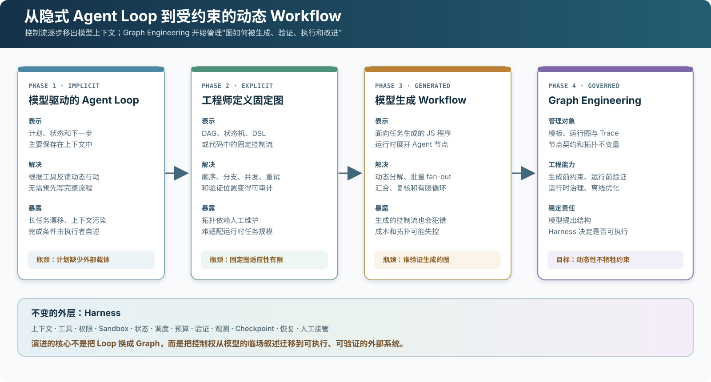
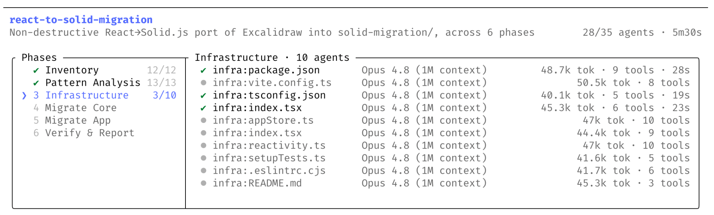
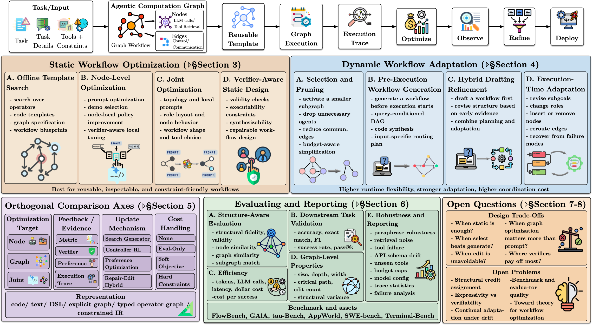
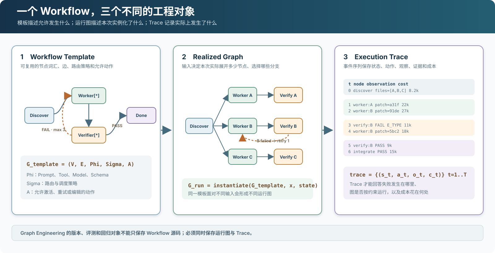
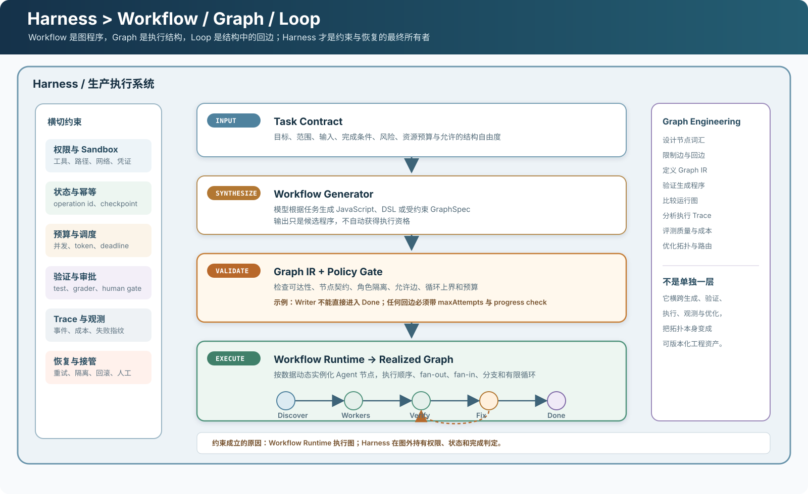
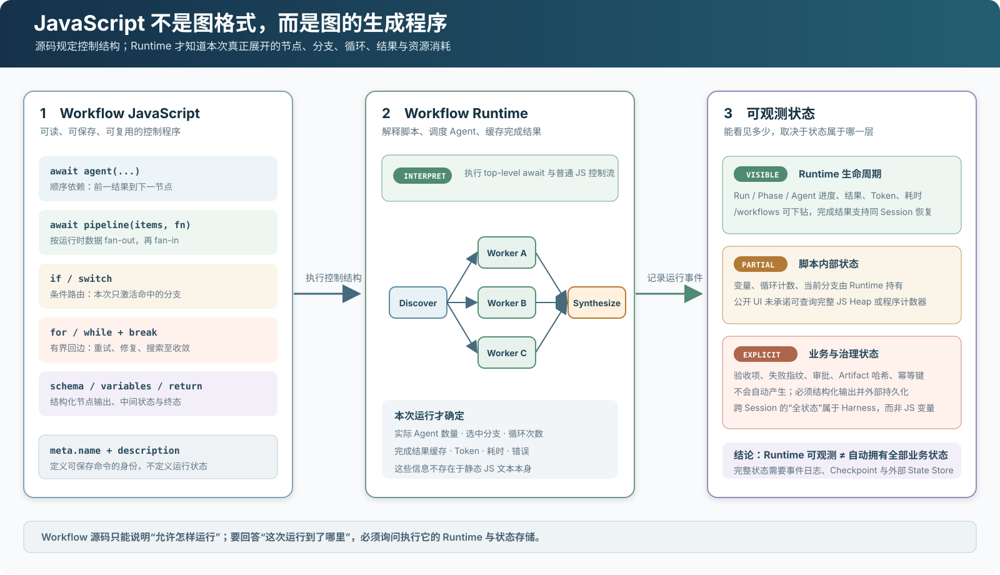
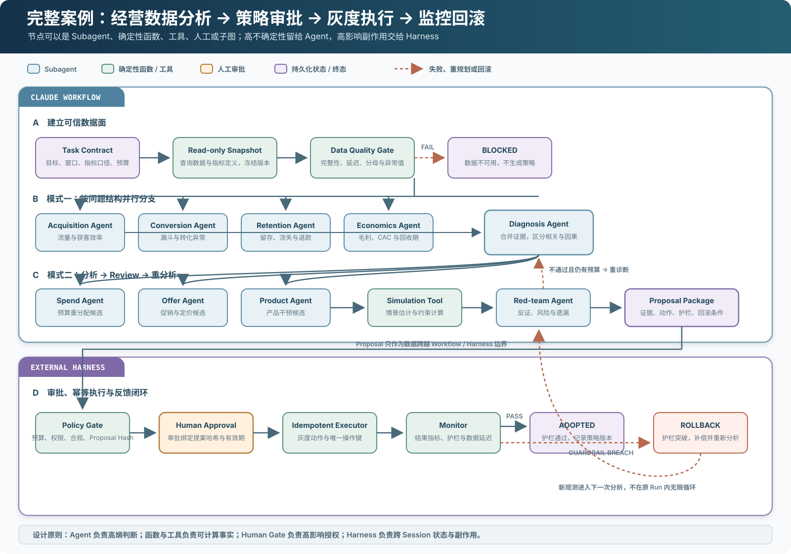

# Graph Engineering 与 Dynamic Workflow：把 Agent 拓扑编译成可执行程序

[](assets/graph-engineering-workflow/01-evolution-route.svg)

*图 1　从隐式 Agent Loop 到受约束的动态 Workflow。演进的重点不是用 Graph 淘汰 Loop，而是让控制流获得模型上下文之外的可执行载体，并进一步验证这个载体。本文归纳，依据 [Anthropic 的 Agent 工作流模式](https://www.anthropic.com/engineering/building-effective-agents)、[Claude Code Dynamic Workflow 文档](https://code.claude.com/docs/en/workflows)和 [Agentic Computation Graphs 综述](https://arxiv.org/abs/2603.22386)。*

Agent 系统最初依赖模型在上下文中临场决定下一步。随后，工程师开始用状态机、DAG 和编排代码固定关键路径。Claude Code 的 Dynamic Workflow 又向前走了一步：模型根据当前任务生成 JavaScript 编排程序，独立 Runtime 再执行这个程序，批量启动 Agent、保存中间结果并完成复核。

这使 Graph Engineering 获得了更具体的工程对象。需要管理的不再只是一张人工设计的图，而是从任务意图生成的 Workflow、单次运行实例化的 Graph，以及执行过程中产生的 Trace。

核心关系可以先压缩成一句话：

> **Workflow 是生成和执行 Graph 的程序；Graph Engineering 负责约束、验证和优化这类程序所表达的拓扑；Harness 负责让它在真实环境中安全、可靠地运行。**

这里的 Harness 指承载权限、状态、预算、验证与恢复的系统级执行包络。Anthropic 也会把单个 Dynamic Workflow 称为“针对当前任务即时生成的 Harness”。两种说法并不矛盾：**系统级 Harness 托管一个由 Workflow 描述的任务级 Harness，后者再实例化具体 Graph。**

> [!note] 证据边界
> - Claude Code Dynamic Workflow 的产品行为以 Anthropic 官方文档为准。
> - 2026 年 3 月 31 日，Claude Code 的 npm 包因 source map 打包错误暴露了内部源码；这是[发布包泄露](https://www.theregister.com/software/2026/03/31/anthropic-accidentally-exposes-claude-code-source-code/5227940)，不是以开源许可证发布。本文不依赖泄露源码，只分析已经公开的产品文档与运行界面。
> - Agentic Computation Graphs 综述目前是 arXiv v1 预印本；本文借用其统一定义，不把综述观点当成已建立的行业标准。
> - 文中的 Graph IR、静态验证器和 Harness 分层属于工程归纳，不是 Anthropic 对 Claude Code 内部实现的完整说明。

## 1. Workflow 不是 Graph，但它是一种图程序

在日常语言里，Workflow 通常只是“先做什么、后做什么”。Claude Code 的 Dynamic Workflow 更严格：它是 Claude 根据任务生成的一段 JavaScript 编排程序，由与主对话分离的 Workflow Runtime 在后台执行。

官方文档给出的最小形态是：

```javascript
export const meta = {
  name: "audit-routes",
  description: "Audit every route handler for missing auth checks",
};

const found = await agent("List every .ts file under src/routes/.", {
  schema: {
    type: "object",
    required: ["files"],
    properties: {
      files: { type: "array", items: { type: "string" } },
    },
  },
});

const audits = await pipeline(found.files, file =>
  agent(`Audit ${file} for missing authentication checks.`, {
    label: file,
  }),
);

return audits.filter(Boolean);
```

`agent()` 产生一个 Agent 节点；`pipeline()` 根据运行时数据展开一组并行节点；`await` 形成数据依赖和汇合点；普通 JavaScript 条件与循环负责路由、重试和终止。中间结果保存在脚本变量中，而不是全部回填主对话上下文。[官方文档](https://code.claude.com/docs/en/workflows)因此用一句很准确的话概括它：**Workflow 把计划移入代码。**

这段代码没有显式声明 `nodes` 和 `edges`，但它仍然会生成图：

- `found → audits` 是数据依赖边；
- 每个文件对应一个动态实例化的 Audit 节点；
- `pipeline()` 表示 fan-out 和 fan-in；
- `filter()` 决定哪些结果进入最终输出；
- 如果增加验证—修复循环，控制流图中就会出现回边。

所以 Workflow 不是图的数据结构，而是**能够实例化执行图的程序**。它和 SQL 查询计划、编译器控制流图的关系类似：源代码是程序，图是程序所表达或运行时形成的结构。

### 1.1 JavaScript 语法怎样对应图

Claude Code Workflow 不是一份 `nodes + edges` 配置，也不是直接交给 Node.js 运行的普通脚本。它是一段带 top-level `await` 的 JavaScript，Runtime 注入 `agent()`、`pipeline()` 和 `args` 等运行环境，并接受顶层 `return` 作为 Workflow 结果。保存后，文件位于项目或个人的 `.claude/workflows/` 目录。

JavaScript 控制结构与图语义的对应关系是：

| JavaScript | 运行图语义 |
|---|---|
| `await agent(...)` | 创建一个 Agent 节点；后续语句等待该节点完成 |
| 连续两个 `await` | 建立顺序依赖边 `A → B` |
| `pipeline(items, fn)` | 根据运行时列表动态展开 N 个节点，并在返回时汇合 |
| `if` / `switch` | 条件路由；未命中的分支不会实例化 |
| `for` / `while` | 回边；循环条件决定继续、退出或进入失败终态 |
| 普通变量 | 保存节点结果、循环计数、失败指纹和中间聚合 |
| `schema` | 约束 Agent 节点输出，使下一节点获得结构化输入 |
| `return` | 产生 Workflow 终态结果 |

这也是为什么静态查看 JavaScript 只能得到**控制流模板**。例如 `pipeline(files, audit)` 在代码里只有一行；只有 Runtime 得到 `files` 的实际值之后，才能知道本次运行究竟展开 3 个还是 300 个 Audit 节点。

## 2. Claude Code 把 Workflow 从模式推进到了 Runtime

Anthropic 在 2024 年区分了 Workflow 与 Agent：Workflow 通过预定义代码路径组织 LLM 和工具，Agent 则由模型动态决定过程。它同时总结了 prompt chaining、routing、parallelization、orchestrator-workers 和 evaluator-optimizer 等模式。[Building effective agents](https://www.anthropic.com/engineering/building-effective-agents)

Orchestrator–Workers 解决的是任务规模在运行前未知的问题。Orchestrator 先分解任务，再动态启动多个 Worker，最后汇总结果。

[](assets/graph-engineering-workflow/02-anthropic-orchestrator-workers.png)

*图 2　Orchestrator–Workers：工作单元不是预先枚举，而是根据输入动态产生。原图来自 [Anthropic《Building effective agents》](https://www.anthropic.com/engineering/building-effective-agents)，版权归 Anthropic。*

Evaluator–Optimizer 则给图增加回边。Generator 产生候选，Evaluator 决定接受还是返回反馈；它已经是一个有明确终止条件的循环图。

[](assets/graph-engineering-workflow/03-anthropic-evaluator-optimizer.png)

*图 3　Evaluator–Optimizer：`Rejected + Feedback` 构成从验证节点回到生成节点的有条件回边。原图来自 [Anthropic《Building effective agents》](https://www.anthropic.com/engineering/building-effective-agents)，版权归 Anthropic。*

这些模式当时主要回答“应该怎样组合 Agent”。Dynamic Workflow 增加的是可执行产品层：

- Claude 为当前任务生成 JavaScript；
- Runtime 在主对话之外执行编排；
- 中间结果保存在脚本变量中；
- Workflow 可以保存为项目级或个人命令；
- 已完成的 Agent 结果在同一 Session 内可以复用；
- Runtime 提供并发数、Agent 总量和成本告警等边界。

2026 年 5 月 28 日，Anthropic [正式发布 Dynamic Workflows](https://claude.com/blog/introducing-dynamic-workflows-in-claude-code)。官方运行界面已经不再只展示一条对话，而是展示 Workflow 名称、阶段、每阶段 Agent 数量、模型、Token、工具调用和运行时间。

[](assets/graph-engineering-workflow/05-claude-dynamic-workflow-ui.png)

*图 4　Claude Code Dynamic Workflow 的官方运行界面。图中一个 React→Solid 迁移被拆成 6 个阶段、35 个 Agent；阶段、节点状态、Token、工具数和耗时均被外显。来源：[Introducing dynamic workflows in Claude Code](https://claude.com/blog/introducing-dynamic-workflows-in-claude-code)，版权归 Anthropic。*

这里真正重要的变化不是 Agent 数量，而是**编排成为独立、可读取、可复用、可观测的运行对象**。

Anthropic 随后在 [A harness for every task](https://claude.com/blog/a-harness-for-every-task%2Ddynamic-workflows-in-claude-code) 中给出更直接的定义：Claude Code 可以按任务即时编写自己的 multi-agent harness。这里生成的不是另一个完整 Runtime，而是由 JavaScript 控制流、Subagent、Worktree、验证策略和预算组成的**任务级 Harness**；它仍运行在 Claude Code 的权限、Sandbox、Session 与工具系统之内。因而 Dynamic Workflow 更准确的定位是：**系统级 Harness 内部的 Harness 生成器。**

## 3. Graph Engineering 把 Workflow 结构本身变成优化对象

Graph Engineering 这个名称较新，实践并不新。LangGraph 很早就用有状态循环图表达 Agent；Anthropic 的五类 Workflow 模式本身也都有拓扑；[Alexey Grigorev](https://alexeyondata.substack.com/p/ai-native-development-specifications)所举的 PM→Engineer→QA 案例，则把角色、交接和失败回路组织成一张多 Agent 图。

更系统的理论框架来自 2026 年的综述 [From Static Templates to Dynamic Runtime Graphs](https://arxiv.org/abs/2603.22386)。论文将 LLM 调用、工具、检索、代码执行、记忆更新和验证统一建模为 Agentic Computation Graph，并把研究对象分为：

- 静态模板搜索；
- 固定拓扑内的节点优化；
- 拓扑与节点参数的联合优化；
- 运行前生成 Workflow；
- 执行中选择、裁剪或编辑 Graph；
- 基于指标、Verifier 和 Trace 的持续优化。

[](assets/graph-engineering-workflow/04-acg-survey-workflow-optimization.png)

*图 5　Workflow Optimization 的整体研究空间。上方是从 Task 到 Graph、Trace、Optimize、Observe、Refine 和 Deploy 的生命周期；下方区分静态模板优化与动态 Workflow 适配。原论文 Figure 1，取自 [From Static Templates to Dynamic Runtime Graphs](https://arxiv.org/abs/2603.22386)，已对照 PDF 第 4 页核验，版权归原作者。*

Claude Code Dynamic Workflow 在这个分类中更接近 **construct-then-execute**：Claude 在执行前生成面向当前任务的程序，Runtime 随后根据数据动态实例化节点。它已经支持运行时分支、循环和数据依赖的 fan-out，但现有公开文档没有表明 Workflow 会在执行过程中任意重写自身程序，因此不应把它直接等同于完全可塑的运行时图编辑器。

这一边界很重要。Graph Engineering 不是给任意多 Agent 编排换一个名称，而是把以下结构性变量变成一等工程对象：

- 允许哪些节点与角色；
- 哪些边可以存在；
- 哪些节点能够并行；
- 验证器放在哪里；
- 哪些失败允许回退；
- 回边可以经过多少次；
- 哪些条件才能进入终态；
- 质量、成本和恢复能力如何随拓扑变化。

## 4. 必须区分模板、运行图与 Trace

把所有东西都叫“Workflow”会掩盖三个不同对象。沿用 ACG 综述的记号，一个可复用模板可以写成：

$$
\bar{\mathcal{G}}
=
(\mathcal{V},\mathcal{E},\Phi,\Sigma,\mathcal{A})
$$

其中，$\mathcal{V}$ 是节点，$\mathcal{E}$ 是边，$\Phi$ 包含 Prompt、Tool、Model、Schema 等节点参数，$\Sigma$ 是路由与调度策略，$\mathcal{A}$ 是允许的激活、重试或编辑动作。

面对输入 $x$ 和运行状态 $s$，模板会实例化为本次真正执行的 Graph：

$$
\mathcal{G}^{\mathrm{run}}
=
\operatorname{instantiate}(\bar{\mathcal{G}},x,s)
$$

执行过程再产生 Trace：

$$
\tau
=
\{(s_t,a_t,o_t,c_t)\}_{t=1}^{T}
$$

这里的 $s_t$、$a_t$、$o_t$ 和 $c_t$ 分别表示状态、动作、观察与成本。

[](assets/graph-engineering-workflow/07-template-run-trace.svg)

*图 6　一个 Workflow 对应三个工程对象。模板规定允许发生什么；运行图说明本次实例化了什么；Trace 记录实际上发生了什么。本文归纳，定义依据 [ACG 综述](https://arxiv.org/abs/2603.22386)，Workflow 行为依据 [Claude Code 文档](https://code.claude.com/docs/en/workflows)。*

这三个对象不能相互替代：

- 只保存模板，无法知道某次运行实际创建了多少 Agent。
- 只保存运行图，无法知道工具失败、重试和成本发生在哪一步。
- 只保存 Trace，无法判断实际路径是否违反模板允许的结构。

Graph Engineering 的版本管理、回归和评测对象因此不能只有 Workflow 源码。模板、运行图、Trace 以及产生它们的 Harness 版本都需要保存。

## 5. 用 Workflow 实现图约束：先生成，再验证，最后执行

用 Workflow 实现图约束是合理的，但不能直接执行模型任意生成的 JavaScript。更稳妥的生产结构是：

1. 任务先进入结构化 Task Contract；
2. 模型生成 Workflow 或 GraphSpec 候选；
3. 静态验证器检查拓扑不变量；
4. Policy Gate 绑定节点权限、Sandbox 和预算；
5. Runtime 实例化运行图；
6. 独立 Verifier 根据外部证据决定转移；
7. Harness 保存状态、Trace 和恢复点。

[](assets/graph-engineering-workflow/06-harness-workflow-graph-stack.svg)

*图 7　Harness、Workflow、Graph 与 Loop 的责任分层。Graph Engineering 横跨生成、验证、执行、观测与优化，而不是独立位于 Harness 之上的新层。本文归纳，依据 [Claude Code 架构文档](https://code.claude.com/docs/en/how-claude-code-works)、[Dynamic Workflow 文档](https://code.claude.com/docs/en/workflows)与 [ACG 综述](https://arxiv.org/abs/2603.22386)。*

### 5.1 用 GraphSpec 限制模型的生成空间

任意 JavaScript 表达力很强，也难以静态验证。生产系统可以先要求模型生成受约束的 GraphSpec，再由确定性编译器生成 Workflow。下面是一份可运行的 TypeScript 骨架：

```typescript
type Role = "pm" | "engineer" | "qa" | "done";

type NodeSpec = {
  id: string;
  role: Role;
  canWrite: boolean;
  canApprove: boolean;
  outputSchema: string;
};

type EdgeSpec = {
  from: string;
  to: string;
  on: "SUCCESS" | "PASS" | "FAIL";
  maxTraversals?: number;
  progressSignal?: string;
};

type GraphSpec = {
  start: string;
  terminals: string[];
  maxConcurrency: number;
  tokenBudget: number;
  nodes: NodeSpec[];
  edges: EdgeSpec[];
};

export function validateGraph(spec: GraphSpec): string[] {
  const errors: string[] = [];
  const byId = new Map(spec.nodes.map(node => [node.id, node]));

  if (!byId.has(spec.start)) errors.push("start node does not exist");
  if (spec.maxConcurrency < 1) errors.push("maxConcurrency must be positive");
  if (spec.tokenBudget < 1) errors.push("tokenBudget must be positive");

  for (const edge of spec.edges) {
    const from = byId.get(edge.from);
    const to = byId.get(edge.to);

    if (!from || !to) {
      errors.push(`dangling edge: ${edge.from} -> ${edge.to}`);
      continue;
    }

    if (to.role === "done" && from.role !== "qa") {
      errors.push(`only QA may enter done: ${edge.from} -> ${edge.to}`);
    }

    if (from.canWrite && from.canApprove) {
      errors.push(`writer may not approve itself: ${from.id}`);
    }
  }

  const color = new Map<string, 0 | 1 | 2>();
  const outgoing = (id: string) =>
    spec.edges.filter(edge => edge.from === id);

  function visit(id: string): void {
    color.set(id, 1);

    for (const edge of outgoing(id)) {
      const nextColor = color.get(edge.to) ?? 0;

      if (nextColor === 1) {
        if (!edge.maxTraversals || !edge.progressSignal) {
          errors.push(
            `cycle edge needs bound and progress signal: ` +
            `${edge.from} -> ${edge.to}`,
          );
        }
        continue;
      }

      if (nextColor === 0) visit(edge.to);
    }

    color.set(id, 2);
  }

  if (byId.has(spec.start)) visit(spec.start);

  for (const node of spec.nodes) {
    if (!color.has(node.id)) errors.push(`unreachable node: ${node.id}`);
  }

  return errors;
}
```

这段验证器固化了四类结构性约束：

- 不能存在悬空边和不可达节点；
- 写代码的角色不能同时批准自己的产物；
- 只有 QA 才能进入 `done`；
- 任意回边必须有次数上限和进展信号。

真实系统还应继续检查：所有非终态是否存在到终态或 `blocked` 的路径、并发写节点是否拥有隔离工作区、输出 Schema 是否兼容下一节点、工具权限是否符合角色，以及总成本是否在任务预算内。

### 5.2 把通过验证的结构编译成 Dynamic Workflow

Alexey 的 PM→Engineer→QA 图可以直接转换成 Workflow。下面的 JavaScript 只使用官方公开的 `agent()`、`pipeline()` 与普通语言控制流；为突出编排，工作区创建、权限绑定和 Git 合并仍由外层 Harness 负责。

```javascript
export const meta = {
  name: "deliver-backlog",
  description: "Groom, implement, and independently verify each issue",
};

const backlog = await agent(
  "List ready issues and their preallocated isolated workspaces.",
  {
    schema: {
      type: "object",
      required: ["issues"],
      properties: {
        issues: {
          type: "array",
          items: {
            type: "object",
            required: ["id", "workspace"],
            properties: {
              id: { type: "string" },
              workspace: { type: "string" },
            },
          },
        },
      },
    },
  },
);

async function deliver(issue) {
  const spec = await agent(
    `Act as PM. Groom ${issue.id}. Do not edit code. ` +
    "Return testable acceptance criteria and explicit scope.",
    { label: `pm:${issue.id}` },
  );

  let feedback = "No previous QA feedback.";
  let previousFailure = null;

  for (let attempt = 1; attempt <= 3; attempt += 1) {
    const implementation = await agent(
      `Act as Engineer in ${issue.workspace}. ` +
      `Implement ${issue.id} against this specification:\n${spec}\n` +
      `QA feedback:\n${feedback}`,
      { label: `engineer:${issue.id}:${attempt}` },
    );

    const qa = await agent(
      `Act as independent QA. Do not modify code. ` +
      `Verify ${issue.id} against the acceptance criteria.\n` +
      `Implementation evidence:\n${implementation}\n` +
      `Return PASS or FAIL, a failure fingerprint, and evidence.`,
      {
        label: `qa:${issue.id}:${attempt}`,
        schema: {
          type: "object",
          required: ["verdict", "fingerprint", "evidence"],
          properties: {
            verdict: { enum: ["PASS", "FAIL"] },
            fingerprint: { type: "string" },
            evidence: { type: "array", items: { type: "string" } },
          },
        },
      },
    );

    if (qa.verdict === "PASS") {
      return { issue: issue.id, status: "DONE", evidence: qa.evidence };
    }

    if (qa.fingerprint === previousFailure) {
      return {
        issue: issue.id,
        status: "BLOCKED",
        reason: "no progress across two verification rounds",
      };
    }

    previousFailure = qa.fingerprint;
    feedback = JSON.stringify(qa);
  }

  return {
    issue: issue.id,
    status: "BLOCKED",
    reason: "retry budget exhausted",
  };
}

return pipeline(backlog.issues, deliver);
```

这段 Workflow 表达了两层拓扑：

- Issue 之间可以并行，形成 `pipeline(backlog.issues, deliver)` 的 fan-out；
- 每个 Issue 内部是 PM→Engineer→QA，QA 失败后最多回到 Engineer 三次。

它还增加了一个比“重试三次”更重要的条件：相同失败指纹连续出现时立即进入 `BLOCKED`。有限循环不仅需要次数上限，还需要判断循环是否取得进展。

### 5.3 五类常用 Workflow 及其 JavaScript 文件

大多数 Workflow 并不需要发明新结构，而是组合五种基本拓扑：

| 模式 | 图结构 | 典型用途 | 对应文件 |
|---|---|---|---|
| Chain | `A → B → C` | 计划、执行、复核 | `01-chain.js` |
| Router | `Classify → A / B / C` | 工单分流、模型或工具选择 | `02-router.js` |
| Fan-out / Fan-in | `Discover → Worker[*] → Synthesize` | 审计、迁移、研究、逐文件 Review | `03-fanout-fanin.js` |
| Evaluator–Optimizer | `Generate ↔ Verify` | 修复直到通过或停止进展 | 前文 `deliver-backlog.js` |
| Until stable | `Search ↺` | 找问题直到新增集合收敛 | `04-until-stable.js` |

下面四段代码都可以直接保存到 `.claude/workflows/`。它们只使用[官方文档](https://code.claude.com/docs/en/workflows)公开的 `meta`、`agent()`、`pipeline()`、`args` 与普通 JavaScript 控制流；文件、Shell 和网络操作仍由 Agent 使用获准工具完成。

#### 文件：`.claude/workflows/01-chain.js`

```javascript
export const meta = {
  name: "plan-build-verify",
  description: "Plan a task, implement it, then verify independently",
};

const task = args?.task ?? "Inspect the current change and make it production-ready.";

const plan = await agent(
  `Plan this task without editing files:\n${task}\n` +
  "Return scope, acceptance criteria, risks, and verification commands.",
  { label: "plan" },
);

const implementation = await agent(
  `Implement the task against this plan:\n${plan}\n` +
  "Run the relevant checks and report changed files.",
  { label: "implement" },
);

const verification = await agent(
  `Independently verify the task. Do not edit files.\n` +
  `Task:\n${task}\nPlan:\n${plan}\nImplementation:\n${implementation}`,
  {
    label: "verify",
    schema: {
      type: "object",
      required: ["verdict", "evidence"],
      properties: {
        verdict: { enum: ["PASS", "FAIL"] },
        evidence: { type: "array", items: { type: "string" } },
      },
    },
  },
);

return { task, plan, implementation, verification };
```

三个 `await` 形成严格串行边。它适合依赖关系明确、并行收益很低，但需要上下游角色隔离的任务。

#### 文件：`.claude/workflows/02-router.js`

```javascript
export const meta = {
  name: "route-request",
  description: "Classify one request and activate exactly one specialist",
};

const request = args?.request ?? "Investigate the reported repository problem.";

const classification = await agent(
  `Classify this request as security, performance, or correctness:\n${request}`,
  {
    label: "classify",
    schema: {
      type: "object",
      required: ["kind", "reason"],
      properties: {
        kind: { enum: ["security", "performance", "correctness"] },
        reason: { type: "string" },
      },
    },
  },
);

let result;

switch (classification.kind) {
  case "security":
    result = await agent(`Perform a security review:\n${request}`, {
      label: "security",
    });
    break;
  case "performance":
    result = await agent(`Profile and explain performance risks:\n${request}`, {
      label: "performance",
    });
    break;
  default:
    result = await agent(`Find correctness defects and evidence:\n${request}`, {
      label: "correctness",
    });
}

return { route: classification, result };
```

`switch` 声明三条允许路径，但一次运行只会创建其中一个 Specialist。Classifier 的 `schema` 使路由值不能退化成难以解析的自然语言。

#### 文件：`.claude/workflows/03-fanout-fanin.js`

```javascript
export const meta = {
  name: "review-and-synthesize",
  description: "Review every target independently, verify, then synthesize",
};

const scope = await agent("List every changed source file that requires review.", {
  label: "discover",
  schema: {
    type: "object",
    required: ["files"],
    properties: {
      files: { type: "array", items: { type: "string" } },
    },
  },
});

const reviewed = await pipeline(scope.files, async file => {
  const finding = await agent(
    `Review ${file} for correctness defects. Return only evidence-backed findings.`,
    { label: `review:${file}` },
  );

  return agent(
    `Adversarially verify these findings for ${file}:\n${finding}\n` +
    "Reject claims without direct code or test evidence.",
    { label: `verify:${file}` },
  );
});

const summary = await agent(
  "Deduplicate and rank the verified findings below. Preserve file evidence.\n" +
  JSON.stringify(reviewed),
  { label: "synthesize" },
);

return { targets: scope.files, reviewed, summary };
```

`pipeline()` 的输入长度决定实际 Worker 数量；回调内部又形成 `Review → Verify` 子图；最后一个 `agent()` 是 fan-in barrier，只有所有文件返回后才会运行。

#### 文件：`.claude/workflows/04-until-stable.js`

```javascript
export const meta = {
  name: "find-until-stable",
  description: "Search in rounds until two rounds add no new findings",
};

const question = args?.question ?? "Find reproducible flaky tests in this repository.";
const seen = new Set();
const rounds = [];
let stableRounds = 0;

for (let round = 1; round <= 6; round += 1) {
  const result = await agent(
    `Round ${round}: ${question}\n` +
    `Already known fingerprints:\n${JSON.stringify([...seen])}\n` +
    "Return only newly reproduced findings with stable fingerprints.",
    {
      label: `search:${round}`,
      schema: {
        type: "object",
        required: ["findings"],
        properties: {
          findings: {
            type: "array",
            items: {
              type: "object",
              required: ["fingerprint", "evidence"],
              properties: {
                fingerprint: { type: "string" },
                evidence: { type: "string" },
              },
            },
          },
        },
      },
    },
  );

  const fresh = result.findings.filter(
    finding => !seen.has(finding.fingerprint),
  );
  fresh.forEach(finding => seen.add(finding.fingerprint));
  rounds.push({ round, newFindings: fresh.length });
  stableRounds = fresh.length === 0 ? stableRounds + 1 : 0;

  if (stableRounds >= 2) {
    return { status: "CONVERGED", fingerprints: [...seen], rounds };
  }
}

return { status: "BUDGET_EXHAUSTED", fingerprints: [...seen], rounds };
```

这不是“固定重试六次”，而是同时设置硬上限与收敛条件：最多六轮，连续两轮没有新增指纹就提前结束。Graph Engineering 关心的正是这种回边语义。

### 5.4 为什么 Claude 能稳定生成这种“模板语言”

首先需要纠正一个直觉：Claude Code 并没有让模型从零学习一门复杂 Workflow DSL。生成物的主体是模型非常熟悉的 JavaScript；公开示例中的专用词汇主要是 `meta`、`agent()`、`pipeline()`、`args` 和 `schema`。顺序、分支、循环、数组处理与异常传播都复用现成语言语义。

因此，这更接近**带少量专用 API 的程序合成**，而不是让模型自由发明图格式。文件看起来高度标准化，主要来自外围 Harness 的约束：

| 可靠性来源 | 作用 | 仍不能保证什么 |
|---|---|---|
| 成熟宿主语言 | 绝大多数控制流是普通 JavaScript | 仍可能出现语法错误或不存在的 API |
| 很小的专用表面 | 核心节点创建与并行语义集中在少量函数 | 不能保证拓扑选择正确 |
| `schema` 输出契约 | 把节点交接从自由文本收紧为结构化数据 | Schema 可以定义错，内容也可能不真实 |
| 运行前审阅 | CLI 可查看 Phase 与 raw script，并允许编辑或拒绝 | Auto、Ultracode 和非交互模式不一定逐次询问 |
| 受限 Runtime | 脚本隔离执行，不能直接操作文件或 Shell | Agent 仍可能在获准工具范围内做错事 |
| 权限与资源边界 | Agent 继承权限检查、Sandbox、allowlist，并受并发与总量上限约束 | 只能限制影响范围，不能证明任务语义正确 |
| 运行后再保存 | 先观察一次 Run，再将有效脚本保存为命令 | 一次成功不代表面对所有输入都正确 |

官方没有公开完整的 Workflow 生成 Prompt 或内部编译流程，因此不能把稳定性归因于某个未公开的“神奇模板”。可以从[公开行为](https://code.claude.com/docs/en/workflows)确认的是：生成脚本可以在运行前查看和编辑；脚本运行在隔离环境中；Subagent 的工具调用继续接受权限与 Sandbox 检查；成功运行后才需要保存为可复用命令。

这里仍然存在三类不同的幻觉：

1. **语法或 API 幻觉**：例如拼错函数名。这类错误通常会在解析或执行时直接暴露。
2. **拓扑幻觉**：JavaScript 完全合法，但漏掉 Verifier、形成无进展循环，或让错误角色进入终态。这需要 GraphSpec、静态验证和预算约束。
3. **语义幻觉**：图执行完整，Agent 却给出错误判断或虚假 `PASS`。这需要独立验证器、外部测试与可追溯证据。

所以真正降低风险的不是“模型生成代码时不再幻觉”，而是：**将开放式幻觉转化为可解析的程序、可检查的拓扑和可验证的运行证据。** Claude Code 已经较好地处理了第一层，并限制了错误的影响范围；Graph Engineering 与 Harness 仍需负责后两层。

## 6. 为什么 Workflow 与 Runtime Observability 必须放在一起

Workflow 文件描述的是**可能怎样运行**，Runtime 才知道**这次实际怎样运行**。原因在于运行图可能依赖前一个 Agent 的输出：`pipeline()` 的节点数、`switch` 命中的分支、循环经过几次，都无法从静态 JavaScript 中提前完全确定。

[](assets/graph-engineering-workflow/08-js-runtime-observability.svg)

*图 8　JavaScript、Runtime 与状态可见性的关系。Runtime 是动态节点创建、调度和结果返回的必经点，因此天然拥有运行级观测；业务状态与跨 Session 状态仍需 Harness 显式建模。本文归纳，产品行为依据 [Claude Code Dynamic Workflow 文档](https://code.claude.com/docs/en/workflows)。*

### 6.1 当前 Claude Code 能看到哪些状态

官方文档明确公开了以下能力：

| 状态层 | 当前可见内容 | 证据与边界 |
|---|---|---|
| Run | Workflow 运行入口、进行中或已停止的 Run | 从 `/workflows` 管理 |
| Phase | 每个阶段的 Agent 数、Token 总量与耗时 | 可从 Run 视图下钻 |
| Agent | 每个 Agent 的进度、Token 与结果 | 可以查看每个 Agent 发现了什么 |
| Resume | 已完成 Agent 的结果缓存 | 同一 Session 暂停后可复用；暂停时仍在运行的 Agent 会重跑 |
| Cost | Agent 数、Token、耗时和大任务告警 | 用于停止异常膨胀的运行 |

Runtime 之所以能提供这些信息，不是因为 JavaScript 天生可观测，而是因为每个 `agent()` 都必须通过 Runtime 创建、调度并返回结果。Runtime 是所有节点生命周期事件的统一入口。

### 6.2 能否找到一个 Workflow 的“所有状态”

如果“所有状态”指 Run、Phase、Agent、结果和成本，当前 `/workflows` 已经覆盖了主要运行状态。如果还包括任意 JavaScript 变量、当前程序计数器、业务对象、审批、Artifact、幂等键和跨 Session 恢复点，答案是否定的。公开文档没有承诺读取完整 JS Heap；退出 Claude Code 后，下一 Session 也会从头启动 Workflow。

这三个状态域必须分开：

1. **Runtime 状态**：Agent 是否已完成、用了多少 Token、结果是否可复用。Runtime 自动产生。
2. **脚本状态**：数组、循环计数、选中分支、失败指纹。Runtime 执行时持有，但不等于全部暴露给 UI。
3. **业务与治理状态**：验收项、审批、部署、Artifact 哈希、幂等键。必须由 Workflow 输出 Schema 与外部 Harness 显式记录。

生产系统若要真正回答“任务现在处于哪个状态、为什么到这里、重启后如何恢复”，应将每次转移写入不可变事件日志，并由事件重建快照：

```typescript
type RunEvent =
  | { type: "NODE_SCHEDULED"; nodeId: string; at: string }
  | { type: "NODE_STARTED"; nodeId: string; at: string }
  | { type: "NODE_SUCCEEDED"; nodeId: string; resultRef: string; at: string }
  | { type: "NODE_FAILED"; nodeId: string; fingerprint: string; at: string }
  | { type: "STATE_CHANGED"; from: string; to: string; evidence: string[] };

type RunSnapshot = {
  runId: string;
  workflowHash: string;
  status: "RUNNING" | "BLOCKED" | "SUCCEEDED" | "FAILED";
  activeNodes: string[];
  completedNodes: string[];
  domainState: Record<string, unknown>;
  tokenUsed: number;
  lastEventAt: string;
};
```

这不是 Claude Code 当前公开的状态 API，而是自建 Harness 应补充的状态模型。其关键不是多做一个 Dashboard，而是让每一次图转移都留下可恢复、可审计的事实。**Observability 是状态机的读取面，Checkpoint 与 Event Log 是状态机的持久化面。**

## 7. 图约束应分成三种强度

Graph 不必把 Agent 固化为一条预设流水线。真正需要固定的是权限边界、证据要求、循环预算和终态条件；问题分解与修正路径仍可由运行状态决定。常见的灵活性有两种。

### 7.1 两种互补的动态模式

| 模式 | 图结构 | 动态性在哪里 | 适合解决什么 |
|---|---|---|---|
| 问题分支 | `分析 → 解法 A / 解法 B / 解法 C` | 分析节点根据结构化结果选择一个分支，或动态展开多个并行分支 | 问题类型、领域数量或工作单元在运行前未知 |
| 评审回路 | `分析 → Review → 分析` | Review 根据证据决定通过、带反馈返回或停止 | 初次分析可能不完整，需要反证和修正 |

第一种不是要求预先知道唯一执行路径。Workflow 只规定**允许出现哪些解法子图**，Runtime 再根据 `problemType`、假设列表或数据分区选择一个或多个分支。第二种也不是让 Agent 无限 ReAct；回边必须携带 Review 反馈，并由 `maxIterations`、失败指纹和进展信号共同约束。

两者可以组合：先将问题展开为多个领域分支，汇合为一次诊断；再让独立 Reviewer 检查证据与策略。如果结构性问题未解决，就返回诊断节点重新分析。图约束限制的是可接受的转移，不是预先写死每次运行的完整路径。

### 7.2 约束必须落到不同执行层

并不是把条件写进 Workflow 就获得了同样强的保证。图约束至少分为三层：

| 约束层 | 典型内容 | 最合适的执行者 |
|---|---|---|
| 拓扑约束 | 顺序、fan-out、fan-in、允许边、循环上限 | Workflow / Graph Runtime |
| 能力约束 | 角色工具、读写范围、网络、凭证、工作区 | Harness Policy 与 Sandbox |
| 完成约束 | 测试、Schema、grader、人工审批、部署观测 | 外部 Verifier 与控制面 |

Workflow 可以规定 Engineer 之后必须经过 QA，却不能仅凭一段 Prompt 保证 QA 没有写权限。它可以返回 `PASS`，却不能证明测试报告真实存在。真正的强约束必须落在模型无法绕过的执行面：

- QA 节点不获得写工具；
- 每个并行 Writer 使用独立 worktree 或环境命名空间；
- `PASS` 必须引用测试报告、退出码和 Artifact 哈希；
- `Done` 转移由 Runtime 根据证据执行，而不是 Agent 自己修改状态；
- 外部副作用使用幂等键、审批和补偿操作；
- 任务状态持久化在 Session 之外。

所以“用 Workflow 做图约束”是合理的，但更准确的实现方式是：**Workflow 提供控制结构，Harness 赋予控制结构强制力。**

## 8. Graph Engineering 需要评测什么

只比较最终答案，无法判断增加 Agent 是否真的有价值。Graph Engineering 的目标可以写成质量与成本之间的约束优化：

$$
\max
\;
\mathbb{E}_{x,\mathcal{G}^{\mathrm{run}},\tau}
\left[
R(\tau;x)-\lambda C(\tau)
\right]
$$

$R$ 是成功率、测试通过率或业务结果，$C$ 包括 Token、工具调用、延迟和费用，$\lambda$ 表示成本权重。实际评测至少应覆盖四组指标：

| 维度 | 指标示例 |
|---|---|
| Outcome | 任务成功率、验收项通过率、生产回滚率 |
| Graph | 节点数、深度、最大宽度、关键路径、回边次数 |
| Runtime | Token、延迟、并发利用率、失败恢复时间、cost per success |
| Governance | 越权调用、无证据转移、重复失败、人工接管率 |

评测单位也应分层：

1. 固定输入下比较不同 Workflow 模板；
2. 同一模板多次运行，测量模型随机性；
3. 比较生成图与实际运行图的偏差；
4. 从 Trace 中定位成本和失败集中在哪些节点；
5. 将有效改动晋级为新模板、节点契约或路由策略。

这时，Graph Engineering 才从“画一张更复杂的图”变成真正的工程循环。

## 9. Claude Code Dynamic Workflow 的边界

截至 2026-07-27，Claude Code Dynamic Workflow 已经具备清晰的编排能力，但不能直接视为通用耐久工作流引擎。官方文档列出了几项重要边界：

- Workflow 脚本本身不能直接访问文件系统或 Shell，实际动作由 Agent 完成；
- 单次运行最多并发 16 个 Agent，总量最多 1000 个；
- 普通用户输入不能在 Workflow 中途插入，阶段性人工审批需要拆成多个 Workflow；
- 暂停后可以在同一 Session 内复用已完成结果；
- 退出 Claude Code 后再次启动，Workflow 会从头开始。

这些限制并不削弱它作为图程序的价值，但说明它目前更适合：

- 大规模只读审计与研究；
- 文件级并行检查；
- 可拆分的大型迁移；
- 多候选生成与交叉验证；
- 有明确预算和终止条件的修复循环。

涉及跨 Session 耐久状态、长时间人工等待、外部事务、Exactly-once Activity 或复杂补偿时，仍需要 Temporal、队列系统、数据库状态机或专门 Agent Runtime 承担底层语义。Claude Workflow 可以作为上层生成和编排入口，而不是替代这些系统。

## 10. 与现有 Harness 实践的关系

[[AI Coding研发中的Harness与Loop构建]] 已经包含四层 Loop、任务状态机、跨系统依赖图、角色隔离、Worktree、Checkpoint、重试预算、Verifier 和人工接管。Dynamic Workflow 不会推翻这套结构，而是补上一个很具体的中间层：

```text
Task Contract
  → Workflow / GraphSpec 生成
  → 静态拓扑验证
  → Runtime 实例化执行图
  → Agent / Tool / Human 节点
  → Trace、Evidence 与 Graph Eval
```

由此可以进一步明确各层职责：

- **Skill** 定义某类节点应该怎样工作；
- **Workflow** 定义节点何时运行、怎样分支、汇合和循环；
- **Graph** 是 Workflow 所表达和实际实例化的执行结构；
- **Loop** 是 Graph 中受终止条件约束的回边；
- **任务级 Harness** 是 Workflow 为当前任务组合出的角色、工作区、验证器与控制流；
- **系统级 Harness** 持有上下文、权限、状态、预算、观测、恢复和接管，并托管任务级 Harness。

因此，Graph Engineering 不是 Harness 之后的新范式，也不是 Loop Engineering 的替代品。它是 Harness 内部关于工作拓扑的工程学；Dynamic Workflow 则使这套工程学从手工编排进入了“模型生成任务级 Harness、系统验证后执行”的阶段。

最终需要建设的不是一张越来越复杂的流程图，而是一条完整的编译与治理链路：

> **把任务意图编译成受约束的 Workflow，验证其拓扑不变量，由 Harness 可靠执行，并用运行图与 Trace 持续优化下一版结构。**

## 11. 完整案例：多 Agent 经营分析与策略执行

下面给出一个假想但可实现的案例：订阅业务的周度净收入与毛利同时恶化，系统需要定位原因、生成干预策略，并在审批后灰度执行。示例中的阈值只是接口字段，不代表真实业务参数。

这个案例同时使用前述两种动态模式：

1. **问题分支**：获客、转化、留存和单位经济模型并行分析；诊断完成后，预算、Offer 和产品干预三个策略分支并行产生候选。
2. **评审回路**：模拟工具计算候选影响，Red-team Agent 检查证据、遗漏和护栏；若发现结构性缺陷且仍有预算，则带反馈返回诊断节点，重新分析，而不是在原答案上继续润色。

[](assets/graph-engineering-workflow/09-multi-agent-strategy-case.svg)

*图 9　完整案例同时包含“分析后按问题结构分支”和“分析—Review—重分析”两种模式。Claude Workflow 只生成有证据的 Proposal；外层 Harness 持有审批、执行凭证、监控和回滚。本文归纳，节点语义依据 [LangGraph Graph API](https://docs.langchain.com/oss/javascript/langgraph/graph-api)，Workflow 能力边界依据 [Claude Code Dynamic Workflow 文档](https://code.claude.com/docs/en/workflows)。*

### 11.1 每个节点都需要是 Subagent 吗

不需要。Graph 节点是一个**可调度、可记录状态的工作单元**，不是 Agent 的同义词。[LangGraph 官方文档](https://docs.langchain.com/oss/javascript/langgraph/graph-api)明确把节点定义为接收状态并返回更新的函数；函数内部可以调用 LLM，也可以执行普通代码。

| 节点类型 | 案例中的节点 | 为什么这样划分 |
|---|---|---|
| Subagent | Acquisition、Retention、Diagnosis、Strategy、Red-team | 需要解释语义、提出假设、综合证据或寻找反例 |
| 确定性函数 / 工具 | Snapshot、Data Quality、Simulation、Policy、Executor、Monitor | 结果应由 SQL、Schema、规则、计算或 API 回执决定 |
| 人工节点 | Human Approval | 高影响策略需要把授权绑定到明确的 Proposal 版本 |
| 状态 / 终态 | BLOCKED、Proposal、ADOPTED、ROLLBACK | 保存可恢复、可审计的业务事实 |
| 子图 | 单个领域分析、一次策略评审 | 可复用的多步过程可以在上层 Graph 中表现为一个节点 |

Claude Workflow 有一个实现细节：脚本本身不能直接调用文件系统、Shell 或业务工具，工具需要由 `agent()` 内的 Subagent 使用。因此下方代码会用一个受限 Agent 包装 Snapshot 或 Simulation Tool。**包装层是 Subagent，不代表计算逻辑应交给模型判断**；数据质量结论仍应来自确定性查询结果，策略执行更不能由 Agent 自行授权。

### 11.2 Claude Workflow：分析、分支与有界复审

下面的 `.claude/workflows/05-growth-strategy.js` 只使用只读工具。它先动态展开领域分析，再动态展开策略候选；Red-team 不通过时，最多重新诊断两次。输出是 `AWAITING_APPROVAL`，不是已经执行的策略。

```javascript
export const meta = {
  name: "growth-strategy-proposal",
  description: "Analyze business metrics and produce a reviewed strategy proposal",
};

const MAX_REVISIONS = 2;
const contract = {
  window: args?.window ?? "latest completed week",
  objective: args?.objective ?? "recover net revenue without violating margin guardrails",
  maxBudgetShiftPct: Number(args?.maxBudgetShiftPct ?? 10),
};

const snapshot = await agent(
  `Use approved read-only analytics tools to freeze the dataset for ${JSON.stringify(contract)}.
Return query/result references and metric definitions; do not recommend or execute actions.`,
  {
    label: "read-only-snapshot",
    schema: {
      type: "object",
      required: ["snapshotRef", "metricDefinitions", "evidenceRefs"],
      properties: {
        snapshotRef: { type: "string" },
        metricDefinitions: { type: "array", items: { type: "string" } },
        evidenceRefs: { type: "array", items: { type: "string" } },
      },
    },
  },
);

const quality = await agent(
  `Run the deterministic data-quality checks for ${snapshot.snapshotRef}.
Check freshness, completeness, denominators and anomalies. Do not infer missing values.`,
  {
    label: "data-quality-gate",
    schema: {
      type: "object",
      required: ["verdict", "blockers", "evidenceRefs"],
      properties: {
        verdict: { type: "string", enum: ["PASS", "BLOCKED"] },
        blockers: { type: "array", items: { type: "string" } },
        evidenceRefs: { type: "array", items: { type: "string" } },
      },
    },
  },
);

if (quality.verdict === "BLOCKED") {
  return { status: "BLOCKED", contract, snapshot, quality };
}

const domains = ["acquisition", "conversion", "retention", "unit_economics"];
const domainAnalyses = await pipeline(domains, domain =>
  agent(
    `Analyze only the ${domain} domain in snapshot ${snapshot.snapshotRef}.
Separate observations, hypotheses and causal claims. Every finding must cite an evidenceRef.`,
    {
      label: `analyze-${domain}`,
      schema: {
        type: "object",
        required: ["domain", "findings", "missingEvidence"],
        properties: {
          domain: { type: "string" },
          findings: { type: "array", items: { type: "object" } },
          missingEvidence: { type: "array", items: { type: "string" } },
        },
      },
    },
  ),
);

let reviewFeedback = [];
let lastReview = null;

for (let revision = 0; revision <= MAX_REVISIONS; revision += 1) {
  const diagnosis = await agent(
    `Synthesize these domain analyses into ranked root-cause hypotheses:
${JSON.stringify(domainAnalyses)}
Revision feedback: ${JSON.stringify(reviewFeedback)}
Do not turn correlation into causation; preserve evidenceRefs.`,
    {
      label: `diagnosis-r${revision}`,
      schema: {
        type: "object",
        required: ["hypotheses", "evidenceRefs"],
        properties: {
          hypotheses: { type: "array", items: { type: "object" } },
          evidenceRefs: { type: "array", items: { type: "string" } },
        },
      },
    },
  );

  const strategyKinds = ["spend_reallocation", "offer", "product_intervention"];
  const candidates = await pipeline(strategyKinds, kind =>
    agent(
      `Create one ${kind} candidate for ${JSON.stringify(contract)} from this diagnosis:
${JSON.stringify(diagnosis)}
Specify actions, assumptions, guardrails and rollback actions. Do not execute anything.`,
      {
        label: `${kind}-r${revision}`,
        schema: {
          type: "object",
          required: ["candidateId", "kind", "actions", "guardrails", "rollbackActions"],
          properties: {
            candidateId: { type: "string" },
            kind: { type: "string" },
            actions: { type: "array", items: { type: "object" } },
            guardrails: { type: "array", items: { type: "object" } },
            rollbackActions: { type: "array", items: { type: "object" } },
          },
        },
      },
    ),
  );

  const simulations = await pipeline(candidates, candidate =>
    agent(
      `Use the approved deterministic scenario tool to evaluate this candidate:
${JSON.stringify(candidate)}
Return scenario outputs and evidenceRefs; never call a write or strategy-execution tool.`,
      {
        label: `simulate-${candidate.candidateId}`,
        schema: {
          type: "object",
          required: ["candidateId", "scenarios", "evidenceRefs"],
          properties: {
            candidateId: { type: "string" },
            scenarios: { type: "array", items: { type: "object" } },
            evidenceRefs: { type: "array", items: { type: "string" } },
          },
        },
      },
    ),
  );

  lastReview = await agent(
    `Independently red-team the diagnosis, candidates and simulations.
Return PASS only when evidence is traceable, actions obey the contract, and rollback is executable.
Diagnosis: ${JSON.stringify(diagnosis)}
Candidates: ${JSON.stringify(candidates)}
Simulations: ${JSON.stringify(simulations)}`,
    {
      label: `red-team-r${revision}`,
      schema: {
        type: "object",
        required: ["verdict", "issues", "selectedCandidateId"],
        properties: {
          verdict: { type: "string", enum: ["PASS", "REVISE", "STOP"] },
          issues: { type: "array", items: { type: "string" } },
          selectedCandidateId: { type: ["string", "null"] },
        },
      },
    },
  );

  if (lastReview.verdict === "PASS") {
    const selected = candidates.find(
      candidate => candidate.candidateId === lastReview.selectedCandidateId,
    );
    const selectedSimulation = simulations.find(
      simulation => simulation.candidateId === lastReview.selectedCandidateId,
    );
    if (!selected || !selectedSimulation) {
      reviewFeedback = ["Reviewer selected an unknown candidate"];
      continue;
    }
    return {
      status: "AWAITING_APPROVAL",
      proposal: {
        strategyId: selected.candidateId,
        actions: selected.actions,
        guardrails: selected.guardrails,
        rollbackActions: selected.rollbackActions,
        evidenceRefs: [
          ...new Set([
            ...snapshot.evidenceRefs,
            ...diagnosis.evidenceRefs,
            ...selectedSimulation.evidenceRefs,
          ]),
        ],
        analysis: {
          contract,
          snapshotRef: snapshot.snapshotRef,
          revision,
          review: lastReview,
        },
      },
    };
  }

  if (lastReview.verdict === "STOP") break;
  reviewFeedback = lastReview.issues;
}

return {
  status: "NO_SAFE_PROPOSAL",
  reason: "Review did not pass within the revision budget",
  review: lastReview,
};
```

这段代码中的两个模式是显式的：`pipeline(domains, ...)` 与 `pipeline(strategyKinds, ...)` 构成问题分支；`for` 循环和 `REVISE` 构成 `Diagnosis → Strategy → Simulation → Review → Diagnosis` 回边。`MAX_REVISIONS` 将回路变成有限状态机，而不是开放式 ReAct。

### 11.3 外层 Harness：审批后执行

Claude Code Workflow 目前不支持普通用户在运行中途插入审批；需要阶段性签字时，应拆成多个 Workflow。更重要的是，生产策略执行需要跨 Session 状态、业务凭证、幂等语义和补偿操作。因此 Proposal 应交给外层控制面。下面的 `strategy-control-plane.ts` 展示最小骨架：

```typescript
import { createHash } from "node:crypto";

type Action = { type: string; target: string; value: unknown };
type Guardrail = { metric: string; operator: string; threshold: number };

type Proposal = {
  strategyId: string;
  actions: Action[];
  guardrails: Guardrail[];
  rollbackActions: Action[];
  evidenceRefs: string[];
  analysis: Record<string, unknown>;
};

type Approval = {
  proposalHash: string;
  approvedBy: string;
  expiresAt: string;
};

type Receipt = { executionId: string; appliedActions: string[] };
type Observation = { breachedGuardrails: string[]; evidenceRefs: string[] };

type Dependencies = {
  policy: { validate(proposal: Proposal): Promise<string[]> };
  approvals: { get(strategyId: string): Promise<Approval | null> };
  executor: {
    apply(actions: Action[], idempotencyKey: string): Promise<Receipt>;
    rollback(receipt: Receipt, actions: Action[], idempotencyKey: string): Promise<void>;
  };
  monitor: {
    evaluate(receipt: Receipt, guardrails: Guardrail[]): Promise<Observation>;
  };
  events: { append(event: Record<string, unknown>): Promise<void> };
};

function canonical(value: unknown): string {
  if (Array.isArray(value)) return `[${value.map(canonical).join(",")}]`;
  if (value && typeof value === "object") {
    return `{${Object.entries(value)
      .sort(([a], [b]) => a.localeCompare(b))
      .map(([key, item]) => `${JSON.stringify(key)}:${canonical(item)}`)
      .join(",")}}`;
  }
  return JSON.stringify(value) ?? "null";
}

function proposalHash(proposal: Proposal): string {
  return createHash("sha256").update(canonical(proposal)).digest("hex");
}

export async function executeApprovedStrategy(
  proposal: Proposal,
  deps: Dependencies,
): Promise<{ status: "ADOPTED" | "ROLLED_BACK"; observation: Observation }> {
  const policyErrors = await deps.policy.validate(proposal);
  if (policyErrors.length > 0) {
    throw new Error(`Policy rejected proposal: ${policyErrors.join("; ")}`);
  }

  const hash = proposalHash(proposal);
  const approval = await deps.approvals.get(proposal.strategyId);
  if (!approval || approval.proposalHash !== hash) {
    throw new Error("Missing approval for this exact proposal version");
  }
  if (Date.parse(approval.expiresAt) <= Date.now()) {
    throw new Error("Approval expired");
  }

  const executionKey = `strategy:${proposal.strategyId}:${hash}`;
  await deps.events.append({
    type: "STRATEGY_APPROVED",
    strategyId: proposal.strategyId,
    proposalHash: hash,
    approvedBy: approval.approvedBy,
  });

  const receipt = await deps.executor.apply(proposal.actions, executionKey);
  await deps.events.append({ type: "STRATEGY_EXECUTED", receipt, proposalHash: hash });

  const observation = await deps.monitor.evaluate(receipt, proposal.guardrails);
  if (observation.breachedGuardrails.length > 0) {
    await deps.executor.rollback(
      receipt,
      proposal.rollbackActions,
      `rollback:${receipt.executionId}`,
    );
    await deps.events.append({
      type: "STRATEGY_ROLLED_BACK",
      receipt,
      observation,
      proposalHash: hash,
    });
    return { status: "ROLLED_BACK", observation };
  }

  await deps.events.append({
    type: "STRATEGY_ADOPTED",
    receipt,
    observation,
    proposalHash: hash,
  });
  return { status: "ADOPTED", observation };
}
```

这里没有 Agent 节点。Policy、Approval、Executor、Monitor 和 Event Store 都是确定性的控制面组件。审批绑定 Proposal Hash，执行绑定幂等键，回滚绑定原始 Receipt；模型既不持有生产凭证，也不能把自己的 `PASS` 当作授权。

因此，Graph 的灵活性不来自“每个节点都是自由行动的 Subagent”，而来自更严格的分工：**Agent 决定值得探索什么，Workflow 决定允许怎样探索，Harness 决定什么可以真实发生。**
