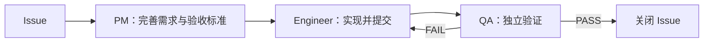

# Graph Engineering：Harness 中的显式工作拓扑

Graph Engineering 可以理解为：把 Agent 工作流表示成显式、可执行的图，并对其结构和运行进行工程化管理。

节点可以是模型调用、Agent、确定性函数、工具或人工审批；边表示依赖、路由和消息传递；外部状态记录任务进度、产物、预算与决策。调度、并行、汇合、重试、终止和幂等共同构成图的执行语义。图不再只是用于说明系统，而是直接约束系统如何运行。

这类实践早已存在。[LangGraph](https://www.blog.langchain.com/mental-health-therapy-as-an-llm-state-machine/)使用有状态循环图构建 Agent，[Anthropic](https://www.anthropic.com/engineering/building-effective-agents)总结的 routing、parallelization、orchestrator-workers 和 evaluator-optimizer 也都具有明确的图结构。2026 年的 [Agentic Computation Graphs 综述](https://arxiv.org/abs/2603.22386)进一步将工作流结构作为独立的优化对象。Graph Engineering 的主要价值，是为这些已有实践提供统一视角，并强调拓扑本身需要被设计、评测和持续优化。

在整体架构中，Harness 的层级高于 Graph 和 Loop。Harness 定义 Agent 工作所需的完整执行系统，包括上下文、工具、环境、权限、状态、验证、观测、恢复和人工接管。Graph 与 Loop 是 Harness 用来组织执行的两类机制：

- Graph 描述任务、Agent、工具和人工节点之间的依赖、路由、并发与控制关系。
- Loop 根据环境反馈重复执行、验证和修正，直到满足终止条件。

图可以包含多个 Loop，也可以只是一条固定依赖链。固定任务适合 DAG；验证—修复、失败恢复和持续运行通常需要有环结构。具体拓扑取决于任务，而不是由 Graph Engineering 预设。

[Alexey Grigorev 在介绍 Graph Engineering 时](https://alexeyondata.substack.com/p/ai-native-development-specifications)给出了一个具体的软件研发案例：

这张图中，PM、Engineer 和 QA 是节点；交接关系以及 `PASS`、`FAIL` 是边；Issue、验收标准、代码提交、测试报告、QA 结论和剩余重试预算构成外部状态。Orchestrator 按图启动不同 Agent，QA 失败时只能回到 Engineer，验证通过后才能关闭 Issue。只有当这些节点、边和状态真正约束 Runtime 时，它才是可执行的 Graph，而不只是一张流程图。整个 Graph 及其运行状态、权限、验证和恢复仍由 Harness 承载。

[[AI Coding研发中的Harness与Loop构建]] 已经包含四层 Loop、任务与交付状态机、跨系统依赖图、角色隔离、检查点、重试预算和人工接管。这些设计已经覆盖 Graph Engineering 的核心实践。该概念带来的补充，是进一步把图模板、单次运行形成的实际路径、执行 Trace，以及节点和路由的评测单独纳入 Harness 管理。

Graph Engineering 因此不是 Harness 之后的新范式，而是 Harness 内部对工作拓扑的显式建模。它强调的核心问题是：如何让多个不确定的 Agent、确定性程序和人工节点，在可验证、可恢复、可观测的结构中协同执行。
