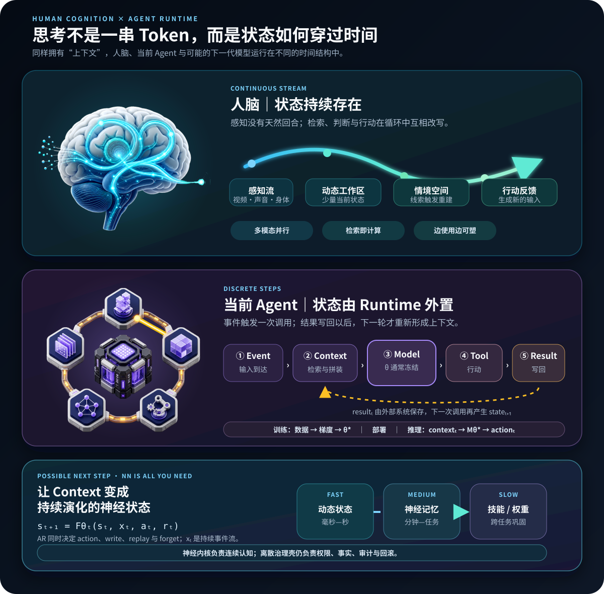

# 持续思考中的上下文长度

只有把思考看成一次有起止的调用，“上下文长度”才像一个窗口。对持续认知，真正的问题不是装下多少 Token，而是不同年龄的信息还能以多大强度影响下一状态。人脑和未来 Agent 都不必保存全部历史；它们需要稳定参考、有限工作状态和可按线索恢复的长期状态。

[Cowan 的综述](https://pubmed.ncbi.nlm.nih.gov/20445769/)给出的基线是：抑制复述和组块后，中央工作记忆约能保持 3–5 个有意义单元；但“单元”会随经验改变。[Hasson 等人的自然电影实验](https://pmc.ncbi.nlm.nih.gov/articles/PMC2556707/)又发现，不同脑区整合信息的时间尺度不同。这些机制不能拼成一个 Token 上限。

回忆带回的也常不是一句话，而是一个可重新进入的**情境空间**：人物、方位、感受和行动可能性同时出现，语言只是事后沿一条路径将它序列化。[Wheeler 等人的实验](https://pubmed.ncbi.nlm.nih.gov/11005879/)发现，回忆图片或声音会选择性重启相应感觉皮层；[Hassabis 等人](https://pubmed.ncbi.nlm.nih.gov/17229836/)则发现，海马损伤者想象新经历时只剩碎片，缺乏连贯的环境空间。“空间”在这里不必是三维地图，更像一个可被线索恢复的多模态关系状态。

更可行的是测“有效上下文长度”：在同一组短故事中，把会改变最终决策的关键事实放在不同距离 \(d\)，并设置保留、删除、打乱和矛盾版本，测量正确率、反应时与置信度：

$$
\Delta(d)=P(\text{答对}\mid\text{关键事实位于距离 }d)-P(\text{答对}\mid\text{关键事实被删除})
$$

定义 \(L_{50}\) 为影响衰减到近距离条件一半时的距离，用秒、词数和事件边界报告，并分开测试无提示整合与有提示检索。结果是一条“距离—影响曲线”。人类可观察行为约 [10 bit/s](https://www.caltech.edu/about/news/thinking-slowly-the-paradoxical-slowness-of-human-behavior) 的估计是输出吞吐率，不能换算为存储窗口。

[[论文解读：Unlimited OCR Works|Unlimited OCR]] 提供了一个工程类比：R-SWA 保留视觉 reference，只让输出工作记忆在 128 个 token 内滑动，使固定输入后的 KV cache 有界。它证明长时程不等于全历史可见。但其 reference 是预先到齐的静态输入；持续视频仍会使参考区增长。持续思考还须对参考本身选择、合并、遗忘和重激活。

[Karpathy](https://x.com/karpathy/status/1937902205765607626)强调给下一步装入恰好的信息；[Hassabis](https://eecs.iisc.ac.in/fireside-chat-sir-demis-hassabis-and-prof-govindan-rangarajan/)则认为百万 Token 仍只是海马体的粗糙近似，真正缺失的是选择、压缩、巩固与遗忘。

*图 1　持续认知、离散 Agent 与未来神经流。结构自绘，图标由 OpenAI 图像模型生成；依据 [ReAct](https://research.google/blog/react-synergizing-reasoning-and-acting-in-language-models)、[Anthropic 的工作空间比较](https://www.anthropic.com/research/global-workspace)及多时间尺度记忆研究，仅比较功能结构。*

## 从 ReAct 到持续认知

[ReAct](https://arxiv.org/abs/2210.03629) 让推理、行动和检索交替发生，但调用仍是离散状态转移：Runtime 编译上下文，冻结模型生成动作，下一轮再重建状态。人脑没有清晰的调用边界；感知、联想与判断持续互相改写。

“持续推理”至少包含三层：[Coconut](https://arxiv.org/abs/2412.06769) 探索连续隐状态；[Continuous Thought Machine](https://pub.sakana.ai/ctm/paper/ctm.pdf) 引入内部时间与循环动力学；持续学习则让经历跨任务改变行为。

近期更现实的是**持久认知运行时**：保存目标和线索，由事件唤醒推理，验证后更新长期资产；但神经模型仍是一段段被调用。

## 畅想：NN is all you need

更激进的模型不再等待 Runtime 把世界装成一包 Token，而是直接消费图像、声音、身体、工具与反馈流。内部状态 \(s_t\) 随事件 \(x_t\) 更新为 \(s_{t+1}\)；沉默时也在预测变化，只在需要行动时输出。Context 成为网络沿时间留下的状态轨迹。

常驻眼镜或机器人不必反复“读回”录像，而是在流中更新人物、地点和目标：线索停留在快速激活中，经历写入较慢的神经记忆，规律再巩固为技能。[The Era of Experience](https://storage.googleapis.com/deepmind-media/Era-of-Experience%20/The%20Era%20of%20Experience%20Paper.pdf)、[Titans](https://arxiv.org/abs/2501.00663) 与 [Nested Learning](https://research.google/blog/introducing-nested-learning-a-new-ml-paradigm-for-continual-learning/)分别从连续经验、测试时记忆和嵌套更新逼近这一点。

## 现阶段的次优路线：Memory × 多 Session × 周期训练

当前主流 Agent 还做不到持续神经状态与训练—推理一体化，现阶段可把连续心智拆成系统级时间尺度。这是次优近似，却未必不可行：大量隔离 Session 用快速模型探索，将反馈与 Outcome 写成 Episode；验证后进入共享 Memory 即时复用；反复成立的规律定期蒸馏进权重，经 holdout、灰度和回滚发布。这近似[互补学习系统](https://pubmed.ncbi.nlm.nih.gov/7624455/)：海马体快记经历，皮层慢提取结构。

并发只增加采样带宽，不等于学习带宽。相关轨迹、伪成功与写入冲突会污染 Memory；[AgentCL](https://arxiv.org/abs/2606.02461) 也观察到负迁移。瓶颈是**可验证的新经验 × 巩固质量**，而非 Session 数量。此路线不复刻人脑，却可能获得足够的功能等价：Memory 快学、周期训练慢学，[[Agent系统构建中的 Mem-OS：让知识与经验形成复利|Mem-OS]] 和 [[Agent Self-Evolution：从反馈闭环到可验证的系统进化|Self-Evolution]] 负责治理。应以跨 Session 迁移与长期增益评价它，而不是以神经实现是否同构判死刑。

## 理想化终局：让 AR 决定什么被固化

更完整的理想架构，是一个常驻多模态 AR 网络同时生成外部行动和内部记忆行动。每一步不仅预测下一个 Token 或动作，还决定哪些隐状态继续留在工作区，哪些提升为长期可见的 reference，哪些应合并、重放或遗忘，以及何时打开更慢的可塑性开关。这样，连“前半截固化内容”也不再是预先提供的静态前缀，而是推理过程自己编辑的神经状态。

普通 next-token loss 无法判断一条记忆在一万步后是否有用。若写入、遗忘和巩固是离散动作，就需要额外的长时程 RL 或 meta-RL：奖励未来任务成功与跨场景迁移，惩罚计算成本、记忆干扰和能力漂移。[RL-Neural-Turing-Machine](https://arxiv.org/abs/1505.00521) 已尝试用 RL 学习离散 memory access，[RL²](https://arxiv.org/abs/1611.02779) 则展示了“慢速 RL 学出快速学习算法”的雏形；Titans 与 Nested Learning 继续补上测试时记忆和多更新速率。

这可能是功能上最接近人脑的 Agent，也是最难落地的一种：奖励归因要跨越极长时间，权重持续变化会令环境非平稳，并发分身还必须保持同一身份与价值边界。前述次优方案因此不是岔路，而是脚手架——先让外部 Memory 和 Harness 安全地产生经验、监督与回滚记录，再逐步把“记什么、忘什么、何时巩固”内化为模型策略。组件已经出现，闭环系统尚不存在。
