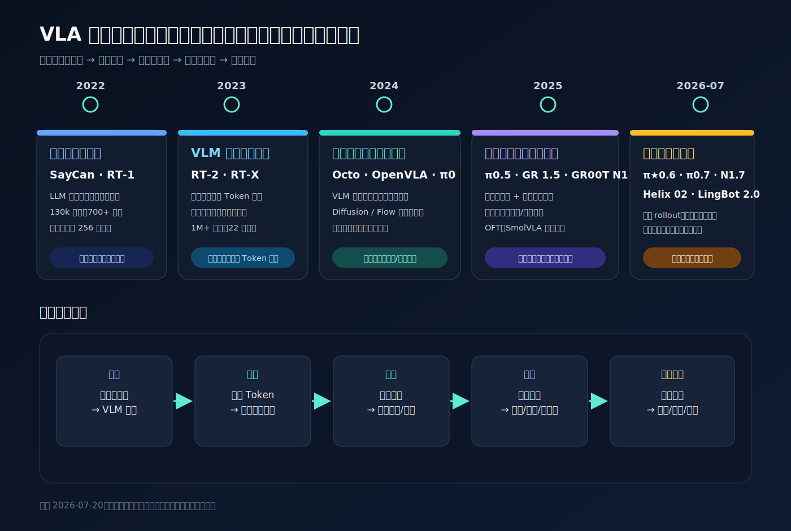
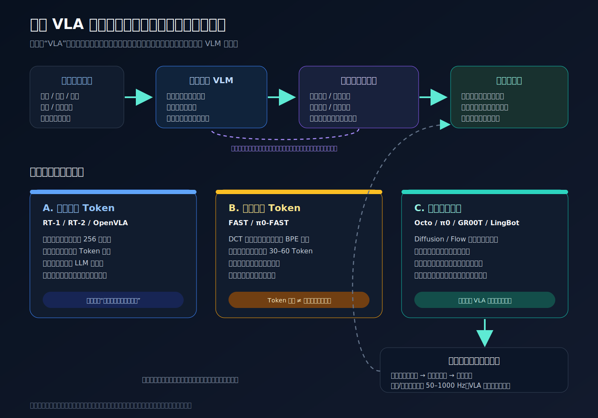

# VLA 技术演进：从动作 Token 到经验驱动的机器人基础模型

> Vision-Language-Action（VLA）的真正跃迁，不是简单地在 VLM 后面多接一个动作头，而是让互联网语义、机器人控制与闭环经验第一次进入同一个可扩展训练体系。

如果只按模型发布时间看，VLA 像是一串不断变大的参数表；如果按技术瓶颈看，它更像五次责任迁移：语义理解从外部技能规划器进入 VLM，动作生成从语言 Token 中拆到连续动作专家，不同机器人的差异被吸收到统一数据接口，长时程行为被拆成高层子任务与低层控制，训练信号则从离线模仿扩展到自主 rollout、人工纠错和奖励反馈。

这也解释了为什么不存在一个对所有机器人、任务和部署条件都“最新最好”的 VLA。截至 **2026-07-20**，至少需要区分四类前沿：

1. **闭源通用前沿**：Physical Intelligence 的 $\pi_{0.7}$、Google DeepMind 的 Gemini Robotics 1.5；
2. **开放权重通用模型**：NVIDIA GR00T N1.7、LingBot-VLA 2.0，以及 openpi 中开放的 $\pi_{0.5}$；
3. **轻量与快速适配路线**：OpenVLA-OFT、SmolVLA；
4. **全身人形系统**：Figure Helix 02，以及 GR00T、LingBot 的多本体/全身分支。

这些模型使用不同机器人、数据、任务、成功判据和推理硬件，不能把各自论文中的成功率直接排成一张通用排行榜。本文的目标不是制造名次，而是回答三个更稳定的问题：**VLA 到底解决了什么、每一代在修复什么瓶颈、最新系统仍然缺什么。**

*图 1：VLA 的历史不是单线的模型升级，而是语义、动作、本体、时间与学习信号的责任重新分配。节点代表技术转折，不代表同一基准上的名次。*

# 一、先给 VLA 一个严格边界

## 1.1 从条件策略看 VLA

把机器人当前及历史观测记为 $o_{\le t}$，语言指令记为 $\ell$，机器人的本体描述或动作空间记为 $e$。现代 VLA 学习的是一个语言条件的闭环策略：

$$
\pi_\theta(A_t\mid o_{\le t},\ell,e)
$$

其中输出通常不是单步动作，而是一段动作块：

$$
A_t=(a_t,a_{t+1},\ldots,a_{t+H-1})
$$

机器人只执行其中一小段，获得新观测后再滚动重规划。输入可以包含 RGB、深度、触觉、力觉、本体感觉、历史帧和机器人类型；输出可以是关节位置、关节速度、末端位姿、夹爪开合、底盘速度或全身控制目标。

因此，一个模型只有“看图 + 听语言”还不是 VLA。分界在于：它是否把视觉语言表征直接接入能闭环控制真实机器人或仿真机器人的动作分布。

## 1.2 VLA 与相邻概念的分工

| 系统 | 典型输入 | 典型输出 | 主要职责 | 是否直接控制机器人 |
|---|---|---|---|---|
| VLM / Embodied VLM | 图像、文本、历史 | 文本、框、点、计划 | 理解场景、推理与任务分解 | 通常不直接控制 |
| 技能规划器 | 指令、技能库、价值或可供性 | 技能序列 | 在有限技能库中选择下一步 | 间接 |
| VLA | 多模态观测、语言、本体状态 | 单步或动作块 | 把语义条件变成闭环动作 | 是 |
| World Model | 历史、候选动作 | 未来状态、图像、价值或风险 | 预测动作后果，支持反事实规划 | 通常通过策略间接控制 |
| 底层控制器 | 目标姿态、轨迹、力矩目标 | 电机/关节指令 | 高频稳定、接触控制与安全约束 | 是 |

这几个模块会被装进同一个产品系统，但不应在概念上混为一谈。比如 [PaLM-E](https://arxiv.org/abs/2303.03378) 将连续传感信息注入语言模型，证明了具身多模态推理的扩展性；它本身更接近 Embodied VLM。2026 年的 [Gemini Robotics-ER 1.6](https://deepmind.google/models/model-cards/gemini-robotics-er-1-6/) 也主要是具身推理模型，而当前直接输出动作的 Gemini Robotics 最新公开版本仍是 1.5。

## 1.3 VLA 为什么比 VLM 难

互联网已经提供了海量图文对，却没有等量的“图像—语言—关节动作”数据。更棘手的是，动作不是跨设备通用的自然语言：同一个“把杯子拿起来”，在双指夹爪、五指灵巧手、单臂、双臂与移动人形机器人上对应完全不同的维度、范围、频率与动力学。

VLA 还同时面对四个工程矛盾：

- **语义时间尺度与控制时间尺度不同**：识别“杯子”可以每秒做几次，稳定接触和全身平衡可能需要 50–1000 Hz；
- **动作是连续且多峰的**：从杯子左侧或右侧抓取都可能成功，均方误差却可能把两种有效模式平均成一种无效动作；
- **真实环境部分可观测**：遮挡、物体滑动、执行延迟意味着单帧图像不足以估计状态；
- **误差会闭环累积**：语言回答错一个词可以重写，机器人抓偏几厘米可能把场景推入训练分布之外。

VLA 的演进，几乎都可以理解为对这四个矛盾的逐步修复。

# 二、技术演进：六个阶段，而不是一条模型时间线

## 2.1 前史：先把“想做什么”和“怎么做”接起来（2022）

[SayCan](https://arxiv.org/abs/2204.01691) 的结构非常清楚：大语言模型根据指令给候选技能打“语义上合理”的分，机器人价值函数给技能打“物理上可执行”的分，两者相乘后选择下一项技能。这不是端到端 VLA，却建立了后来长期保留的层级思想：**慢速语义规划不必与快速运动控制使用同一个时间尺度。**

同年，[RT-1](https://arxiv.org/abs/2212.06817) 把图像、自然语言和机器人动作统一进 Transformer 策略。论文使用约 13 万段真实示范、700 多个任务，由 13 台机器人在 17 个月内采集；每个动作维度被离散为 256 个区间，策略以约 3 Hz 预测动作。RT-1 的关键贡献并不是“首次加入语言”，而是证明了**多任务数据多样性可以让单个闭环策略获得可用的零样本泛化**。其消融还显示：删除任务种类、即使保留绝大多数轨迹，也会明显伤害泛化。这预示了后来机器人基础模型的第一条规律：数据覆盖比单一任务上的重复采样更重要。

与此同时，[ACT / ALOHA](https://arxiv.org/abs/2304.13705) 用 action chunking 减少长序列中的有效决策步数，[Diffusion Policy](https://arxiv.org/abs/2303.04137) 用条件扩散建模多峰连续动作分布，并在其 12 项任务比较中取得平均 46.9% 的提升。它们未必都被命名为 VLA，却奠定了后来 $\pi_0$、GR00T、Octo 等模型的动作专家路线。

## 2.2 第一次范式确立：把动作写进语言模型（2023）

[RT-2](https://arxiv.org/abs/2307.15818) 明确提出 Vision-Language-Action model：把机器人动作编码成特殊 Token，用网页图文预训练过的 PaLI-X 或 PaLM-E 继续训练，使模型像生成文本一样生成动作。一个重要工程技巧是复用词表中 256 个低频 Token 表示动作区间，从而不必重写大模型训练栈。

RT-2 最关键的实验结论不是参数量，而是**机器人数据与网页数据必须共同微调**。只在机器人数据上训练会侵蚀原有语义能力；把网页任务继续混入训练，模型才能把“数字、符号、物体用途、语义关系”等知识迁移到新组合的机器人任务。这里第一次出现了 VLA 的核心承诺：动作能力仍受机器人示范约束，但任务解释能力可以从互联网规模的 VLM 预训练中借来。

代价也同样清晰：大模型逐 Token 生成动作，典型控制频率只有约 1–3 Hz；量化动作牺牲精度；单步生成没有显式利用时间连续性。RT-2 证明了“VLM 可以成为策略”，但没有证明语言 Token 是最好的动作表示。

同年的 [Open X-Embodiment / RT-X](https://arxiv.org/abs/2310.08864) 把问题从单一机器人推进到多本体。该工作汇集 21 家机构、22 类机器人、超过 100 万条轨迹和 527 项技能。RT-1-X 在论文覆盖的多机器人评测中，平均成功率相对原始单数据集方法提高约 50%；RT-2-X 也表现出更强的新技能组合能力。真正的转折是：研究问题从“一个机器人能否做很多事”，变成“不同机器人能否共享可迁移的具身先验”。不过论文也显示正迁移并不均匀，数据量小、动作空间差异大的本体仍可能被大数据域淹没。

## 2.3 开放生态与连续动作专家汇流（2024）

2024 年出现两条互补路线。

第一条是开放通用策略。[Octo](https://arxiv.org/abs/2405.12213) 以约 80 万条 Open X-Embodiment 轨迹训练 93M/27M 模型，使用 Transformer 主干、条件扩散动作头、观测历史和动作块，并通过可替换的传感编码器与动作头适配新机器人。[OpenVLA](https://arxiv.org/abs/2406.09246) 则开放 7B VLA：以 Llama 2 为语言主干，融合 DINOv2 的空间特征与 SigLIP 的语义特征，用约 97 万条真实机器人轨迹训练。它仍采用 256 区间的动作 Token，但把可复现、LoRA 微调和量化部署带入主流 VLA 生态。

第二条是把动作生成从语言主干中拆出来。[Physical Intelligence 的 $\pi_0$](https://www.pi.website/download/pi0.pdf) 由约 3B 的 PaliGemma VLM 与约 300M 的动作专家组成：VLM 负责图像与语言表征，较小的专家用 flow matching 生成连续动作块。模型训练使用 8 类机器人、Open X-Embodiment 以及超过 1 万小时的自有数据，并面向最高 50 Hz 的灵巧任务。这个设计成为此后通用 VLA 的主流模板：

> **大 VLM 提供语义先验，小而快的连续动作专家负责几何精度与控制吞吐。**

这不是简单的模块化回潮。与 SayCan 的离散技能库不同，动作专家仍与 VLM 端到端联合训练，语义表征可以直接条件化连续动作分布。

## 2.4 2025：跨本体、层级推理与部署效率同时推进

[$\pi_{0.5}$](https://www.physicalintelligence.company/download/pi05.pdf) 将多机器人数据、网页数据、物体检测、语言子任务和低层动作共同训练。推理时，模型先生成“打开冰箱门”这样的子任务，再在同一体系内生成动作，从而在未见过的家庭环境中执行 10–15 分钟的清理行为。它揭示了长时程任务的一个现实：端到端并不意味着每一层都必须隐式；把中间子任务显式写进上下文，反而便于人类纠正和跨场景组合。

[Gemini Robotics 1.5](https://storage.googleapis.com/deepmind-media/gemini-robotics/Gemini-Robotics-1-5-Tech-Report.pdf) 则形成一对快慢系统：Gemini Robotics-ER 1.5 负责高层推理、工具调用和成功检测，Gemini Robotics 1.5 直接生成动作。其 “Thinking VLA” 会在动作之间插入自然语言思考，“Motion Transfer” 用多本体数据对齐 ALOHA、Franka 与 Apollo 等机器人。技术报告在 ALOHA 上分别报告了同分布、指令、动作、视觉和任务泛化，但这些仍是内部数据和自定义评测，不能与其他家族的成功率横向等同。

[GR00T N1](https://arxiv.org/abs/2503.14734) 面向人形机器人，把 Eagle-2 VLM 作为 System 2，把 Diffusion Transformer 动作策略作为 System 1，并将真实机器人、仿真轨迹与无动作的人类视频一起训练。无动作视频通过潜动作/逆动力学标注转成训练信号；论文报告用仿真并行生成约 6500 小时轨迹，显示合成数据开始成为 VLA 扩展的常规组成。

同一时期，部署分支开始反向改造架构：[OpenVLA-OFT](https://arxiv.org/abs/2502.19645) 把逐 Token 解码改成并行解码、动作块和连续动作回归；在作者的 A100/LIBERO 设置中，平均成功率从原始 OpenVLA 的 76.5 提升到 97.1，吞吐提高约 26 倍。这个结果不能外推到所有真实机器人，却明确说明 OpenVLA 的主要瓶颈并不都来自 VLM 表征，动作读出方式本身占了很大比重。[SmolVLA](https://arxiv.org/abs/2506.01844) 更进一步把模型缩到 450M，以冻结 VLM、flow-matching 动作专家和异步推理在消费级 GPU 甚至 CPU 上运行，证明“机器人基础模型”并不等同于几十亿参数起步。

## 2.5 从模仿学习进入经验学习（2025 年末）

纯行为克隆只告诉模型“专家做了什么”，没有直接告诉它哪些失败动作更差，也很少覆盖策略自己犯错后的状态。[RECAP / $\pi^{\star}_{0.6}$](https://www.physicalintelligence.company/download/pistar06.pdf) 将专家示范、自主 rollout、人类介入纠错和奖励反馈放进同一离线强化学习管线，通过优势条件训练让模型区分高质量与低质量行为。官方报告称，在最难的任务上吞吐超过翻倍、失败率大致减半，并展示了约 13 小时连续制作浓缩咖啡的运行。

这里的重要变化不是某个百分比，而是数据生成闭环：

$$
\text{部署策略}\rightarrow\text{收集失败与纠错}\rightarrow\text{奖励/优势标注}\rightarrow\text{更新策略}
$$

VLA 从“压缩专家示范”开始转向“从自己的经验中改进”。这条路线也带来新的风险：奖励模型偏差、自动 rollout 的安全边界、错误策略自举以及不同本体之间的离线分布偏移。

## 2.6 2026：记忆、世界模型与全身控制进入统一系统

[${\pi}_{0.7}$](https://www.pi.website/download/pi07.pdf) 是 Physical Intelligence 截至本文日期公开的最新模型。它约 5B 参数，由 Gemma 3 4B VLM、MEM 风格视频历史编码器和 860M flow-matching 动作专家构成。模型上下文不再只有任务指令，还包括详细子任务、质量/速度/策略元数据、控制模态和多视角视觉子目标；高层策略生成子任务，轻量 BAGEL 世界模型生成“下一阶段应当长什么样”的图像，动作专家再执行。训练数据同时包含示范、自主/失败轨迹、人类视频和网页数据。

这意味着 World Model 与 VLA 的关系正在从“二选一”变成协作：World Model 不一定取代策略，也可以只负责稀疏生成视觉子目标，为 VLA 提供比文本更精确的几何目标。更完整的 World Model 讨论见 [[world model综述|具身 World Model 综述]]。

$\pi_{0.7}$ 的论文也给出了值得保留的边界：作者报告，已覆盖任务上的成功率可超过 90%，但真正未见过的任务—机器人组合通常只有约 60%–80%；在超大混合数据中，“未见”本身也很难定义，因为新任务可能只是训练概念的重新组合。这比单个演示更接近当前 VLA 泛化能力的真实刻度。

人形系统把快慢分层做得更彻底。[Figure Helix 02](https://www.figure.ai/news/helix-02) 在语义层 S2、200 Hz 全身视觉运动策略 S1 之外增加 1 kHz 的 10M 参数 S0 全身控制器，并接入视觉、触觉和本体感觉。官方展示了约 4 分钟、61 个动作的洗碗机任务。它说明高层 VLA 不必直接输出每个电机指令，但目前证据主要来自公司演示，没有公开权重和独立统一基准，不能据此断言它优于开放模型。

*图 2：动作 Token、压缩 Token 与连续动作专家不是命名差异，而是对精度、速度、多峰性和训练复用的不同权衡。现代 VLA 越来越倾向让 VLM 管语义、让小型连续专家管动作。*

# 三、动作表示：VLA 架构真正的分水岭

## 3.1 离散 Token：用语言建模复用规模化能力

RT-1、RT-2 与原始 OpenVLA 把连续动作 $a^j$ 按每个维度分桶：

$$
q(a^j)\in\{0,1,\ldots,255\}
$$

训练就可以复用交叉熵目标：

$$
\mathcal L_{\text{token}}
=-
\sum_k\log p_\theta(q(a_k)\mid o,\ell,q(a_{<k}))
$$

它的优势是工程简单、能直接利用成熟的 LLM 基础设施，也让“动作即语言”这一假设得到快速验证。缺点是量化误差、逐 Token 串行延迟，以及各动作维度之间和时间上的连续结构没有被充分利用。

## 3.2 FAST：动作也有自己的“词根”

[FAST](https://www.physicalintelligence.company/download/fast.pdf) 先对动作轨迹做离散余弦变换（DCT），把平滑轨迹的能量集中到少数低频系数，再量化并用 BPE 学习常见动作片段。FAST+ 以约 100 万个一秒动作块学习通用词表，典型动作块可压缩到约 30–60 个 Token；论文报告，自回归 VLA 训练最多可节省约 5 倍计算。

但压缩 Token 没有消除自回归串行性。论文在 RTX 4090 上报告，$\pi_0$ 的 flow 动作专家生成一秒动作块可低于 100 ms，而 $\pi_0$-FAST 仍约需 750 ms，因为后者要让完整约 2B 主干逐 Token 生成。这个对照说明：**Token 数量减少，不等于控制频率问题自然消失。**

## 3.3 Diffusion / Flow：直接学习连续动作分布

连续动作专家把噪声逐步变成整段动作。以 $\pi_0$ 的 flow matching 为例，从高斯噪声 $\epsilon$ 与真实动作块 $A$ 构造中间状态：

$$
A^\tau=\tau A+(1-\tau)\epsilon,\qquad \tau\in[0,1]
$$

目标向量场是 $A-\epsilon$：

$$
\mathcal L_{\text{flow}}
=
\mathbb E_{A,\epsilon,\tau}
\left[
\left\|v_\theta(A^\tau,o,\ell)-\left(A-\epsilon\right)\right\|_2^2
\right]
$$

推理时从噪声出发积分向量场，$\pi_0$ 使用 10 个 Euler 步生成动作块。相比单点 L1/L2 回归，这类生成模型能保留多个有效动作模式；相比逐 Token 生成，动作块可以并行更新。代价是需要额外动作专家、噪声调度和多步去噪，同时必须处理动作归一化、不同本体掩码与实时重规划。

## 3.4 Action chunking：把长任务变成短闭环

动作块不是一次性开放环执行完整任务，而是模型预测未来 $H$ 步，只执行前 $h$ 步（$h<H$），随后用新观测重算：

$$
A_t\sim\pi_\theta(\cdot\mid o_{\le t},\ell),
\quad
\text{execute }a_{t:t+h-1},
\quad
\text{observe }o_{t+h}
$$

较长的 $H$ 提供时间一致性和推理摊销，较小的 $h$ 保持闭环纠错能力。实际部署中的延迟补偿、异步推理与底层插值，往往与模型结构同样重要。SmolVLA 的异步执行实验就是一个直接例子：预测与执行解耦后，在作者的固定时间设置里完成的成功循环由 9 次增加到 19 次。

# 四、数据与训练：规模只是表面，覆盖结构才是核心

## 4.1 机器人数据为什么不能照搬互联网扩展律

VLM 的图文样本大多可以跨模型共享，而机器人轨迹带有强烈的本体和采集协议信息。一个完整训练样本至少隐含：相机位置、控制模式、动作频率、关节定义、坐标系、夹爪语义、传感延迟、任务标注与成功判据。所谓“十万小时”如果来自高度重复的单一行为，未必比覆盖多物体、多空间关系、多失败状态的少量数据更有价值。

因此，数据扩展要同时看四个轴：

| 轴 | 需要覆盖什么 | 缺失时的典型失败 |
|---|---|---|
| 任务 | 目标、对象、关系、步骤组合 | 会做训练动作，不会组合新任务 |
| 场景 | 背景、光照、摆放、遮挡、干扰物 | 依赖纹理或固定初始位 |
| 本体 | 手臂、手、底盘、相机、控制模式 | 换机器人后动作接口失效 |
| 轨迹质量 | 成功、失败、恢复、速度与策略 | 不知道偏离示范后如何回来 |

## 4.2 跨本体统一的三种办法

1. **保留各自动作头**：共享视觉语言主干，每种机器人使用独立编码器/解码器；Octo 的可替换输入输出头属于这一类。
2. **统一动作语义**：把不同机器人映射到末端位姿、夹爪、底盘、腰、头、手等规范维度，再用掩码忽略不存在的自由度。
3. **学习潜在对齐**：使用 embodiment token、Motion Transfer、MoE 专家或逆动力学，把“动作效果相似”而非“关节数相同”的轨迹对齐。

[LingBot-VLA 2.0](https://arxiv.org/abs/2607.06403) 是第三阶段的代表性开放模型。论文报告约 6B 参数、6 万小时预训练数据，其中约 5 万小时来自 20 类机器人配置，1 万小时来自第一人称人类视频；模型以 Qwen3-VL-4B 为基础，使用稀疏 MoE 动作专家和 55 维规范动作/状态空间，并从深度与视频表征模型蒸馏当前/未来的几何和语义信息。作者在 GM-100 双臂任务上报告其进度与成功率高于对照的 $\pi_{0.5}$ 和 GR00T N1.7，但这是作者自建/选定任务与配置下的结果，应视为模型自身证据，而不是全行业排名。

## 4.3 人类视频、仿真与机器人数据各自补什么

- **网页图文/视频**：提供对象、语言、用途和场景常识，但缺少精确动作；
- **第一人称人类视频**：提供手—物交互、长程流程和失败恢复，但人手与机器人动作不对齐；
- **仿真与生成轨迹**：便宜地覆盖稀有状态、扰动和多本体，但存在物理与视觉域差；
- **真实机器人示范**：提供可执行动作与接触动力学，却最昂贵；
- **自主 rollout 与人类介入**：覆盖策略自己的错误分布，是从“会模仿”走向“会恢复”的关键。

最新 VLA 越来越像一个数据混合器：VLM 主干吸收互联网语义，动作专家吸收机器人精度，视频模型提供动态先验，仿真扩大状态覆盖，自主经验提供成败差异。真正困难的部分不再只是收集更多数据，而是让不同来源在同一个策略中互不污染。

# 五、截至 2026-07-20 的最新模型版图

下表的“最新”按模型家族分别定义；数字均为论文或官方仓库自报，不能跨行直接比较。

| 家族 / 最新版本 | 发布日期 | 核心结构与动作路线 | 数据与部署定位 | 开放性 | 最强证据与主要边界 |
|---|---:|---|---|---|---|
| **Physical Intelligence $\pi_{0.7}$** | 2026-04-16 | Gemma 3 4B + MEM 历史 + 860M flow 动作专家；高层策略与 BAGEL 子目标世界模型 | 示范、自主/失败、人类视频、网页；长时程、多本体 | 闭源；openpi 暂只开放到 $\pi_{0.5}$ | 论文展示跨任务/本体组合；真正未见组合约 60%–80%，作者承认“未见”难定义 |
| **NVIDIA GR00T N1.7** | [2026-07-07（GA 公告）](https://developer.nvidia.com/blog/develop-humanoid-robot-policies-end-to-end-with-nvidia-isaac-gr00t/) | 约 3B；Cosmos-Reason2-2B/Qwen3-VL 系 VLM + Diffusion Transformer 动作头 | 官方称约 3.2 万小时真实/人类数据及约 8000 小时仿真；人形与多本体部署 | [代码与权重开放](https://github.com/NVIDIA/Isaac-GR00T) | 官方在 DROID/Bridge/Fractal 等设置相对 N1.6 报告提升；权重许可与 benchmark 口径需单独核对 |
| **LingBot-VLA 2.0** | 2026-07-07 | 6B；Qwen3-VL-4B + 稀疏 MoE 连续动作专家 + 双查询动态蒸馏 | 自报 6 万小时、20 类本体；双臂与移动全身动作空间 | [代码/权重开放](https://github.com/robbyant/lingbot-vla-v2) | GM-100 与长程任务优于其对照；结果主要来自作者评测，尚需跨实验室复现 |
| **Gemini Robotics 1.5** | 2025-09-25 | Thinking VLA；与 ER 1.5 高层推理器协作；Motion Transfer 跨本体 | ALOHA、Franka、Apollo；工具调用、任务分解和成功检测 | 私有预览 | 技术报告提供多种泛化切片；2026 年 ER 1.6 是推理升级，不是新的直接动作版 VLA |
| **Figure Helix 02** | 2026-01-27 | S2 语义层 + 200 Hz S1 全身策略 + 1 kHz S0 控制器 | 全身人形、视觉/触觉/本体感觉；长流程家务 | 闭源 | 61 动作洗碗机等连续演示；缺公开权重和独立统一 benchmark |
| **openpi $\pi_{0.5}$** | 2025 模型，2025-09 开放 | VLM + flow 动作专家 + 显式高层子任务 | 多机器人、家庭长任务；适合研究复现和微调 | [代码/检查点开放](https://github.com/Physical-Intelligence/openpi) | 开放体系中最接近 PI 主线；不包含 $\pi_{0.7}$ 的记忆、世界模型与经验学习升级 |
| **OpenVLA-OFT** | 2025-02 | OpenVLA 7B + 并行解码 + 动作块 + 连续 L1 读出 | 低成本微调、LIBERO 与 ALOHA | 开放 | 作者设置中 26× 吞吐、LIBERO 97.1；L1 对真正多峰示范可能产生中位数动作 |
| **SmolVLA** | 2025-06 | 450M；冻结 VLM + flow 动作专家 + 异步执行 | 单 GPU 训练、消费级 GPU/CPU 部署 | 开放 | LIBERO 平均 87.3、自报社区数据不足 3 万 episodes；规模小、能力上限与复杂长任务仍待验证 |

如果问题是“今天下载哪个”，答案也取决于目标：

- 要研究**最新开放多本体通用栈**：优先看 GR00T N1.7 与 LingBot-VLA 2.0；
- 要复现 **Physical Intelligence 架构**：openpi 的 $\pi_{0.5}$ 是当前开放边界，不能把闭源 $\pi_{0.7}$ 的结果算给它；
- 已在 OpenVLA 生态、重视低成本适配：OpenVLA-OFT 更实际；
- 模型必须在边缘设备运行：SmolVLA 是更合理的起点；
- 目标是评估闭源产品前沿：Gemini Robotics 1.5、$\pi_{0.7}$、Helix 02 应分别按通用操控、长时程多本体和全身人形系统看待。

# 六、为什么现有 benchmark 经常高估 VLA

## 6.1 成功率不是一个可跨论文复用的标量

VLA 评测至少要同时报告：机器人本体、控制频率、动作块长度、初始状态分布、任务是否见过、语言是否改写、场景是否扰动、每项试验次数、失败是否允许恢复、硬件与推理延迟。缺少这些信息时，“95% 成功率”可能只表示模型记住了固定相机下的启动姿态。

[LIBERO-PRO](https://arxiv.org/abs/2510.03827) 对对象、初始状态、指令、任务和环境做受控扰动。作者报告，一些在标准 LIBERO 上超过 90% 的模型，在某些泛化设置中会降到 0%；模型甚至可能在目标物体被替换后仍执行原来的抓取动作。它是预印本，也不能代表全部真实世界，但准确暴露了一个问题：现有 VLA 可能利用背景、初始位姿和指令模板等捷径，而不是学习可组合的语言—视觉—动作因果关系。

机制分析也支持这一警惕。[Not All Features Are Created Equal](https://arxiv.org/abs/2603.19233) 基于超过 39.4 万次 rollout 研究提示：在多个常用基准中，视觉通道往往主导行为；只有当同一场景对应多个语言目标时，语言才真正成为不可替代变量。换句话说，“模型接受语言输入”不等于“模型在因果上使用语言”。

## 6.2 更可靠的证据梯度

评价一个新 VLA 时，应按以下证据梯度逐层提高要求：

1. **能力证据**：在训练分布附近能完成任务；
2. **泛化证据**：对象、背景、指令、初始状态和任务组合分别受控变化；
3. **因果证据**：交换语言、遮挡视觉、修改本体状态后，行为按预期改变；
4. **鲁棒证据**：存在干扰、延迟、传感噪声、抓取滑动时仍能恢复；
5. **系统证据**：长时连续运行、失败统计、推理延迟、算力、人工介入率和安全约束完整披露；
6. **外部证据**：跨实验室、跨硬件复现，而不是只看作者演示。

与其追求一个总分，更实用的评测矩阵是：

| 维度 | 最低应测内容 |
|---|---|
| 语义 | 指令改写、否定、关系、歧义澄清、错误目标 |
| 空间 | 新位置、新相机、遮挡、拥挤、多视角一致性 |
| 动作 | 新速度、接触变化、对象物性、恢复动作、多峰策略 |
| 时间 | 记忆跨度、延迟、长流程、子任务重排、失败后继续 |
| 本体 | 新臂长、相机外参、自由度、控制模式、动作频率 |
| 安全 | 人类进入、碰撞边界、异常检测、停止与降级策略 |

# 七、下一阶段最值得追踪的技术主线

## 7.1 3D 几何必须进入动作头，而不只是进入 VLM

语义特征能告诉模型“这是杯把”，却不保证动作头知道杯把的精确三维位置。2026 年的 [Direct 3D Grounding](https://arxiv.org/abs/2606.27663) 把任务相关 3D 点直接注入动作头，在作者的 LIBERO-PRO 设置中，将 GR00T N1.6 的任务扰动成功率从 31.2 提升到 77.5、位置扰动从 28.1 提升到 60.2。即使具体数字需要更多复现，方向很明确：**空间信息如果只停留在语义主干，可能在到达动作层前被稀释。**

## 7.2 记忆与 World Model 会成为长时程 VLA 的标准组件

$\pi_{0.7}$ 已把历史编码、文本子任务和视觉子目标装进同一个系统。下一步不是让世界模型生成更漂亮的视频，而是让它回答与控制有关的问题：接触后物体会怎样移动、当前失败是否可恢复、哪个子目标更安全、模型对未来是否不确定。VLA 负责快速闭环反应，World Model 负责低频反事实预测，二者按不同时间尺度协作，比要求单个网络隐式完成全部工作更可检验。

## 7.3 奖励与自主经验会逐步替代纯示范扩展

专家示范很难覆盖失败状态，而且越强的策略越难从普通示范中获得新信息。$\pi^{\star}_{0.6}$ 已经展示“示范 + 自主 rollout + 人类纠错 + 奖励”的闭环。后续关键不只是更复杂的 RL 算法，而是三项基础设施：可靠成功检测、可审计的人工介入记录，以及不会被策略钻空子的奖励/安全模型。

## 7.4 多模态全身控制会迫使系统继续分层

灵巧手、双臂、腰、头、底盘与双腿同时工作时，动作维度和频率迅速上升。Helix 02 的 S2/S1/S0、GR00T 的 System 2/System 1，以及 $\pi$ 系列的 VLM/动作专家，本质上都在承认：语义规划、视觉运动策略和稳定控制需要不同带宽。未来的“端到端”更可能指这些层能够联合训练与共享上下文，而不是用一个巨大 Transformer 以 1 kHz 直接输出所有电机力矩。

## 7.5 不确定性与安全必须成为显式输出

当前多数 VLA 只给动作，不给“我是否知道”。真实部署需要模型区分三种状态：任务可执行、需要更多观察、应当请求人类介入。可校准的不确定性、动作可达性、碰撞约束和异常检测如果始终放在模型外部，VLA 的开放世界泛化就很难进入高风险场景。

# 八、一个更稳定的 VLA 心智模型

## 8.1 第一代 VLA 基本没有显式 Thinking

这个判断对 RT-2、原始 OpenVLA 等早期架构基本成立。它们学习的是“当前观测和指令到下一段动作”的条件策略：

$$
\pi_\theta(a_{t:t+H}\mid o_{\le t},\ell)
$$

Transformer 内部当然存在隐式计算，但这与可检验的推理过程不是一回事。这类模型通常没有显式维护：

- 当前任务已经完成到哪一步；
- 接下来有哪些候选方案；
- 每种方案可能导致什么结果；
- 刚才为什么失败，以及应该如何恢复；
- 过去其他 episode 中是否发生过相似情况。

例如 RT-2 把动作编码成语言模型的特殊 Token，证明网页语义能够迁移到机器人动作，但复杂决策主要依赖模型从训练数据中学到的行为组合。它更接近一个**拥有互联网语义先验的行为克隆策略**，而不是一个会持续规划的机器人 Agent。

因此，需要区分三种经常被混用的“思考”：

| 类型 | 含义 | 对复杂任务的实际价值 |
|---|---|---|
| 隐式计算 | 一次前向传播中的隐藏状态变换 | 所有神经策略都有，但不可检查，也不保证形成计划 |
| 显式推理 | 生成文本子任务、候选步骤或中间判断 | 便于任务分解、人类纠错和失败定位 |
| 反事实规划 | 比较不同动作可能产生的未来、价值和风险 | 最接近决策意义上的“思考”，通常需要 World Model 或搜索 |

## 8.2 最新 VLA 已开始加入 Thinking，但路线并不统一

[Gemini Robotics 1.5](https://arxiv.org/abs/2510.03342) 是显式 Thinking VLA 的代表。技术报告称，它在动作之间插入多层自然语言推理：先解释目标，再把长任务拆成较短阶段，必要时根据环境变化重新判断下一步。它还可以把部分推理过程呈现给用户，提高可解释性。

$\pi_{0.5}$ 和 $\pi_{0.7}$ 更强调层级条件。模型先得到“打开冰箱门”这样的中间子任务，再由低层动作专家完成当前阶段。$\pi_{0.7}$ 又加入历史编码器和世界模型生成的多视角视觉子目标，使动作策略不仅知道“要做什么”，还看到“当前阶段完成后场景应该变成什么样”。

这些进展说明，新一代系统正在从单一反射策略变成：

$$
\text{任务目标}
\rightarrow
\text{高层子任务}
\rightarrow
\text{文本/视觉子目标}
\rightarrow
\text{短动作块}
\rightarrow
\text{执行反馈与重规划}
$$

但自然语言 Chain-of-Thought 本身并不等于可靠机器人推理。模型可能把计划说得很合理，却误判空间位置、接触状态或动作可达性；显式文本还会增加推理延迟。真正有用的 Thinking 必须与当前物理状态、成功检测、动作可达性和未来结果预测绑定。

## 8.3 长期记忆仍然是明显缺口

“模型有历史输入”不能自动推出“模型有长期记忆”。机器人至少需要四层不同记忆：

| 记忆层次 | 保存什么 | 当前 VLA 的成熟度 |
|---|---|---|
| 参数记忆 | 训练时学到的物体、语言、技能与场景先验 | 已有，但更新慢，无法记录刚发生的事件 |
| 工作记忆 | 最近图像、动作、本体状态和当前子任务 | 正在成熟，视频历史编码器已较常见 |
| Episode 记忆 | 本次长任务已经完成的步骤、失败、恢复与未完成目标 | 初步具备，但长时间压缩和状态一致性仍不稳定 |
| 跨 Episode 长期记忆 | 用户偏好、房间变化、历史失败、特定物体和机器人的经验 | 基本没有形成通用方案 |

$\pi_{0.7}$ 的 MEM 风格历史编码器可以把较长观测历史压缩成固定数量的 Token，高层策略也能读取过去的子任务指令。但这主要是任务内记忆：模型可以知道“刚才已经打开冰箱”，却未必能在一周后进入同一房间时回忆“这个冰箱门上次从右侧拉更容易”。

$\pi^{\star}_{0.6}$ / RECAP 已开始从自主 rollout、失败、人类介入和奖励中学习，但它的主要形式仍是收集经验后离线训练下一版策略，不是机器人在运行时即时写入、检索并巩固可追溯的长期记忆。

长期记忆还带来三个尚未解决的问题：

1. **写入什么**：原始视频太大，只保存语言摘要又会丢失关键几何和接触细节；
2. **何时检索**：错误记忆可能比没有记忆更危险，需要按环境、本体、对象和任务阶段做可靠匹配；
3. **如何学习而不遗忘**：在线更新必须避免灾难性遗忘、错误经验自举和用户隐私泄漏。

## 8.4 不应让 VLA 在每个控制周期都做长推理

机器人决策天然具有多个时间尺度。物体识别和任务分解可以每秒运行几次，抓取接触和全身平衡却可能需要数百至上千赫兹。如果让一个巨大 VLM 在每个电机周期生成长 Chain-of-Thought，延迟、抖动和幻觉都会进入控制环。

更合理的系统是“慢思考、快行动、持续反馈”：

| 层级 | 典型时间尺度（仅示意） | 主要职责 |
|---|---:|---|
| 长期记忆与经验学习 | 分钟—天 | 保存经历、用户偏好、技能与失败案例 |
| 推理器 / Planner / World Model | 0.1–2 Hz | 检索记忆、分解任务、比较方案、预测后果和监控进度 |
| VLA 动作专家 | 5–100 Hz | 根据当前子目标生成连续动作块 |
| 底层控制器 | 50–1000 Hz | 轨迹跟踪、接触、平衡、碰撞约束与安全停止 |

具体频率取决于机器人、任务、硬件和动作块设计，表中的数量级不能当作统一标准。核心原则是：**慢系统负责思考与记忆，快系统负责反应与稳定控制。**

## 8.5 从 VLA 模型走向机器人 Agent

一个真正面向复杂任务的系统，至少还要在 VLA 周围补齐以下闭环：

1. **状态估计**：把视觉、触觉、本体感觉和动作历史压成一致的 belief state；
2. **高层规划**：将开放目标拆成可验证的阶段，并允许插入工具调用和人类约束；
3. **反事实预测**：用 World Model 比较候选动作的结果、风险和可恢复性；
4. **短程执行**：由 VLA 动作专家生成动作块，只执行一部分后重新观察；
5. **成功与异常检测**：判断子目标是否完成、环境是否变化、是否应重试或求助；
6. **情景记忆**：将重要事件、失败原因和环境变化写入可检索存储；
7. **经验改进**：从 rollout、人工纠错与奖励更新策略，同时控制遗忘和安全风险。

因此，可以把成熟 VLA 系统理解为五个不同时间尺度的环：

1. **互联网语义环**：VLM 提供对象、语言与常识先验；
2. **任务分解环**：高层策略、工具和世界模型产生子任务与视觉子目标；
3. **动作生成环**：连续动作专家在 5–100 Hz 量级生成短动作块；
4. **稳定控制环**：底层控制器以 50–1000 Hz 跟踪轨迹、处理接触与平衡；
5. **经验改进环**：跨 episode 收集失败、纠错和奖励，更新下一版策略。

VLA 的价值不在于消灭所有层，而在于让这些层共享可迁移的表示、数据和训练信号。它更适合作为机器人的**快速视觉运动系统**，而不是单独承担全部智能。它的长期目标也不是“在一个 benchmark 上接近 100%”，而是让机器人面对新对象、新房间、新任务组合和自己的失败时，仍能理解目标、预测后果、执行动作并知道何时求助。

换句话说，复杂具身智能更可能收敛到：

$$
\text{推理模型}
+\text{长期记忆}
+\text{World Model}
+\text{VLA}
+\text{底层控制器}
$$

而不是让一个模型从像素开始，直接包办语义理解、十分钟规划、失败恢复和所有电机控制。

如果用一句话概括演进路线：

> **RT-2 证明了 VLM 可以成为动作策略，$\pi_0$ 证明了动作不必被困在语言 Token 中，RT-X/GR00T/LingBot 把能力扩展到多本体，$\pi_{0.5}$ 与 Gemini Robotics 1.5 把长任务显式分层，$\pi^{\star}_{0.6}$ 与 $\pi_{0.7}$ 则开始把经验、记忆和世界模型放回闭环。**

# 九、主要一手资料

## 早期与范式形成

- [Do As I Can, Not As I Say: Grounding Language in Robotic Affordances / SayCan（2022）](https://arxiv.org/abs/2204.01691)
- [RT-1: Robotics Transformer for Real-World Control at Scale（2022）](https://arxiv.org/abs/2212.06817)
- [PaLM-E: An Embodied Multimodal Language Model（2023）](https://arxiv.org/abs/2303.03378)
- [Diffusion Policy: Visuomotor Policy Learning via Action Diffusion（2023）](https://arxiv.org/abs/2303.04137)
- [Learning Fine-Grained Bimanual Manipulation with Low-Cost Hardware / ACT（2023）](https://arxiv.org/abs/2304.13705)
- [RT-2: Vision-Language-Action Models Transfer Web Knowledge to Robotic Control（2023）](https://arxiv.org/abs/2307.15818)
- [Open X-Embodiment: Robotic Learning Datasets and RT-X Models（2023）](https://arxiv.org/abs/2310.08864)

## 开放模型与动作表示

- [Octo: An Open-Source Generalist Robot Policy（2024）](https://arxiv.org/abs/2405.12213)
- [OpenVLA: An Open-Source Vision-Language-Action Model（2024）](https://arxiv.org/abs/2406.09246)
- [$\pi_0$: A Vision-Language-Action Flow Model for General Robot Control（2024）](https://www.pi.website/download/pi0.pdf)
- [FAST: Efficient Action Tokenization for Vision-Language-Action Models（2025）](https://www.physicalintelligence.company/download/fast.pdf)
- [Fine-Tuning Vision-Language-Action Models: Optimizing Speed and Success / OpenVLA-OFT（2025）](https://arxiv.org/abs/2502.19645)
- [SmolVLA: A Vision-Language-Action Model for Affordable and Efficient Robotics（2025）](https://arxiv.org/abs/2506.01844)

## 通用、经验学习与最新版本

- [$\pi_{0.5}$: a Vision-Language-Action Model with Open-World Generalization（2025）](https://www.physicalintelligence.company/download/pi05.pdf)
- [Gemini Robotics 1.5 Technical Report（2025）](https://storage.googleapis.com/deepmind-media/gemini-robotics/Gemini-Robotics-1-5-Tech-Report.pdf)
- [GR00T N1: An Open Foundation Model for Generalist Humanoid Robots（2025）](https://arxiv.org/abs/2503.14734)
- [RECAP: Improving Generalist Robot Policies with Experience and Advantage Conditioning / $\pi^{\star}_{0.6}$（2025）](https://www.physicalintelligence.company/download/pistar06.pdf)
- [Helix 02: Full-Body Autonomy（2026）](https://www.figure.ai/news/helix-02)
- [$\pi_{0.7}$: a Vision-Language-Action Model for Generalist Robot Control（2026）](https://www.pi.website/download/pi07.pdf)
- [Isaac GR00T N1.7 官方仓库与模型说明（2026）](https://github.com/NVIDIA/Isaac-GR00T)
- [NVIDIA Isaac GR00T N1.7 GA 公告（2026）](https://developer.nvidia.com/blog/develop-humanoid-robot-policies-end-to-end-with-nvidia-isaac-gr00t/)
- [LingBot-VLA 2.0: Scaling Vision-Language-Action Models（2026）](https://arxiv.org/abs/2607.06403)

## 评测与边界

- [LIBERO-PRO: Towards Robust and Generalizable Evaluation of Vision-Language-Action Models（2025/2026）](https://arxiv.org/abs/2510.03827)
- [Not All Features Are Created Equal: Discovering How Vision-Language-Action Models Work（2026）](https://arxiv.org/abs/2603.19233)
- [Direct 3D Grounding in VLA Policies（2026）](https://arxiv.org/abs/2606.27663)

> [!note] 证据口径
> 本文优先使用论文、技术报告、模型卡和官方仓库。公司演示只证明“在展示条件下完成过”，不自动证明统计鲁棒性；作者自建 benchmark 只用于说明该论文的内部对照，不与其他论文的成功率直接横比。所有“最新”判断以 2026-07-20 为截止日期。
