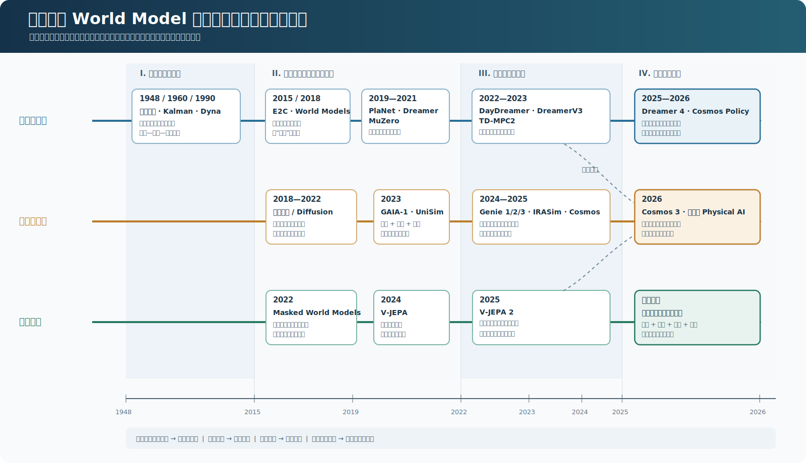
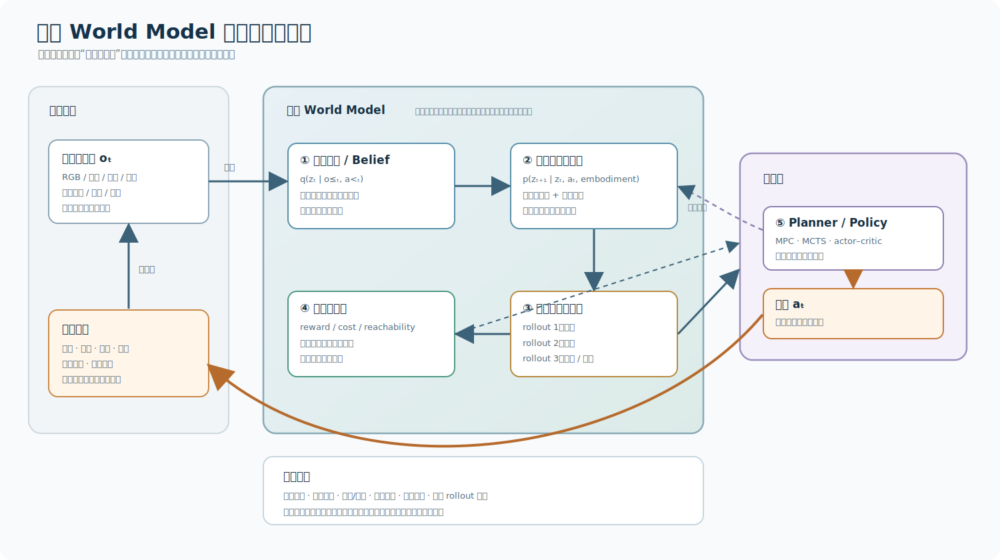
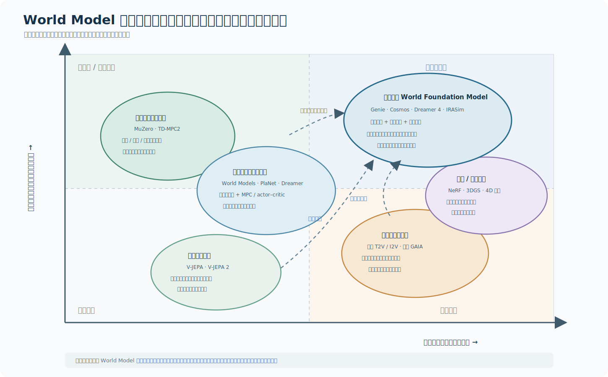

# 具身智能中的 World Model：从潜空间预测到可交互世界模拟器

> World Model 的核心不是“生成一段看起来合理的视频”，而是回答一个干预问题：**如果处在当前状态，并采取动作 $a$，世界接下来会怎样变化？**

具身智能之所以难，不只是因为机器人需要看懂环境，更因为它必须在行动之前估计后果。大语言模型可以在文本空间里试错，真实机器人却面对碰撞、磨损、延迟、遮挡以及不可逆的安全代价。World Model 的价值，正是把一部分昂贵的现实试错搬进内部模拟：先在“想象”中展开多个未来，再选择值得在现实中执行的动作。

但“World Model”已经成为一个外延很宽的词。它可以指控制系统里的状态转移模型，也可以指强化学习里的潜空间动力学，还可以指生成未来视频的基础模型，甚至被用来描述可漫游的三维世界生成器。要看清其演进，不能只按模型发布时间排队，而要同时追踪四条主线：

1. **状态表征**：从人工定义的状态，走向从视觉、触觉、语言中自监督学习潜状态。
2. **时间动力学**：从线性、确定性转移，走向随机、多模态、长时程预测。
3. **行动闭环**：从被动预测下一帧，走向显式建模动作、接触与反事实结果。
4. **使用方式**：从模型预测控制，走向潜空间策略学习、合成数据、策略评测与通用交互环境。

*图 1：World Model 不是一条单线历史，而是控制与决策、生成式模拟、预测表征三条支流逐渐汇合的过程。*

# 一、先给出一个严格定义

## 1.1 从 POMDP 看 World Model

真实具身环境通常不是完全可观测的。机器人只看到图像、深度、力觉或本体感觉 $o_t$，真实状态 $s_t$ 被遮挡，因而更合适的形式是部分可观测马尔可夫决策过程：

$$
s_{t+1}\sim p(s_{t+1}\mid s_t,a_t),\qquad
o_t\sim p(o_t\mid s_t)
$$

一个现代 World Model 通常学习下列近似：

$$
z_t\sim q_\phi(z_t\mid o_{\le t},a_{<t})
$$

$$
\hat z_{t+1}\sim p_\theta(z_{t+1}\mid z_t,a_t)
$$

以及面向任务的预测头：

$$
\hat o_t\sim p_\theta(o_t\mid z_t),\qquad
\hat r_t,\hat c_t,\hat d_t=f_\theta(z_t,a_t)
$$

其中：

- $z_t$ 是对历史观测压缩后的内部状态；
- $p_\theta(z_{t+1}\mid z_t,a_t)$ 是动作条件动力学；
- $\hat r_t$、$\hat c_t$、$\hat d_t$ 分别可以表示奖励、成本或约束、终止概率；
- 观测解码器不是必需的。只要内部状态保留了规划所需的信息，模型未必需要还原每一个像素。

规划器对候选动作序列做反事实展开：

$$
a_{t:t+H-1}^{*}
=
\arg\max_{a_{t:t+H-1}}
\mathbb E_{\hat p_\theta}
\left[
\sum_{k=0}^{H-1}\gamma^k
\big(\hat r_{t+k}-\lambda \hat c_{t+k}\big)
+\gamma^H \hat V(\hat z_{t+H})
\right]
$$

这条公式揭示了 World Model 与普通视频模型的分界：关键不是输出长得像不像，而是**换一个动作，预测是否随之发生正确、稳定、可校准的变化**。

## 1.2 最小闭环

*图 2：一个可用于具身决策的 World Model 至少要连接“感知—状态—反事实未来—价值/约束—行动—新观测”闭环。*

可以把合格的具身 World Model 看成五个最小部件：

1. **状态估计器**：把多模态历史压成可用于未来预测的 belief state。
2. **动作条件动力学**：区分“世界自己变化”和“机器人动作导致的变化”。
3. **多未来建模**：面对不确定性时输出分布，而不是一条貌似确定的未来。
4. **任务接口**：把预测转化为价值、目标距离、安全成本或可达性。
5. **闭环校正**：每执行一步就用新观测修正内部状态，避免把一次想象滚动到底。

因此，以下三类模型不能自动等同于 World Model：

- 只做图像识别的视觉编码器，知道“是什么”，却不知道“做了什么之后会怎样”；
- 只根据文本生成视频的模型，能制造视觉连续性，却未必响应精确动作；
- 直接从观测映射到动作的 VLA 策略，能行动，却未必存在可查询、可展开的显式未来模型。

# 二、演进历程：四次关键跃迁

## 2.1 前史：先有“内部模型”，后有神经网络（1948—2014）

World Model 的思想远早于深度学习。

1948 年，Tolman 在“认知地图”实验中提出，动物学到的并非简单的刺激—反应链，而是环境关系的内部表征。这给出了认知层面的原型：智能体需要一张能支持绕路与替代路径的内部地图。1960 年，Kalman 用状态空间和递归滤波把“不可见状态 + 带噪观测 + 动力学预测”写成可计算系统。此后，状态估计、系统辨识和模型预测控制长期构成机器人控制的主干。

1990 年，Sutton 的 Dyna 架构把学习、规划与行动统一起来：智能体一边从真实经验更新模型，一边从模型生成的模拟经验更新策略。今天所谓“在想象中训练”，在结构上仍然延续 Dyna 的思想。

这一阶段已经具备 World Model 的核心环路，但它有三个边界：

- 状态多由工程师设计，而不是从原始视觉中学习；
- 模型通常假设低维、平滑、近似线性；
- 对开放世界中的遮挡、语义和多模态未来缺乏表达力。

2015 年的 E2C 是一个重要过渡：它用 VAE 把图像编码到潜空间，并约束潜空间动力学局部线性，从而让最优控制第一次较自然地接上“从像素学状态”。这一步把经典控制论的结构带入深度表征学习。

## 2.2 第一次跃迁：把世界压进潜空间，在梦里训练策略（2018）

Ha 与 Schmidhuber 的 [World Models](https://arxiv.org/abs/1803.10122) 让这个词进入深度学习主流视野。系统被拆成三个模块：

$$
\text{VAE（空间压缩）}
\rightarrow
\text{MDN-RNN（时间预测）}
\rightarrow
\text{Controller（决策）}
$$

VAE 把图像压成潜变量 $z_t$，MDN-RNN 根据 $z_t$ 和动作 $a_t$ 预测下一个潜变量分布，控制器只看压缩状态和 RNN 隐状态。最有冲击力的结果不是画面生成，而是策略能够在模型构造的“梦境”中训练，再迁移回真实环境。

这项工作的历史意义在于完成了三个概念组合：

- 原始像素可以被压缩成可预测状态；
- 动力学可以在低维潜空间中学习；
- 学到的模型可以作为策略训练环境，而不只是辅助预测器。

但它仍是模块化、离线和较窄域的：VAE 的重建目标未必保留任务相关细节；长时滚动会积累误差；控制器还可能利用模型漏洞，学会只在“梦里”有效的行为。

## 2.3 第二次跃迁：从重建世界到为决策保留世界（2019—2021）

2019 年之后，研究重点从“能否生成未来”转向“怎样学到对控制真正有用的未来”。

### PlaNet：RSSM 与潜空间在线规划

[PlaNet](https://arxiv.org/abs/1811.04551) 提出 Recurrent State-Space Model（RSSM），把状态拆成确定性记忆 $h_t$ 与随机状态 $z_t$：

$$
h_t=f_\theta(h_{t-1},z_{t-1},a_{t-1})
$$

$$
z_t\sim p_\theta(z_t\mid h_t),\qquad
z_t\sim q_\phi(z_t\mid h_t,o_t)
$$

确定性路径负责记忆，随机变量负责表达不可预测部分。PlaNet 在潜空间里用 CEM 搜索动作序列，是“表征学习 + 随机动力学 + MPC”的经典范式。

### Dreamer：不再每次搜索，而是在想象轨迹上学策略

[Dreamer](https://arxiv.org/abs/1912.01603) 沿用潜空间动力学，却把使用方式从在线动作搜索变成 actor–critic：World Model 先想象大量轨迹，策略和价值网络通过这些轨迹更新。于是模型不仅回答当前这一步“应该选哪个动作”，还成为可反复采样的内部训练场。

PlaNet 与 Dreamer 的差别可以概括为：

$$
\text{PlaNet：模型 + 决策时规划}
$$

$$
\text{Dreamer：模型 + 想象中的策略学习}
$$

### MuZero：不必还原世界，只需保留决策等价性

[MuZero](https://www.nature.com/articles/s41586-020-03051-4) 走向另一条极具影响力的路线。它不预测像素，而学习对树搜索足够的隐状态、奖励、策略和价值：

$$
o_{\le t}\xrightarrow{h_\theta}s_t,\qquad
(s_t,a_t)\xrightarrow{g_\theta}(r_{t+1},s_{t+1}),\qquad
s_t\xrightarrow{f_\theta}(v_t,\pi_t)
$$

这带来一个深刻结论：

> 好的 World Model 不需要复制世界全部细节；它需要保存对当前决策查询足够的因果差异。

MuZero 的模型在任务意义上强，却未必能解释或可视化。这形成了延续至今的两种哲学：

- **生成式充分性**：尽量预测观测本身，获得可检查、可复用的环境模拟。
- **决策充分性**：只保留价值与规划所需信息，牺牲视觉还原以换取效率。

## 2.4 第三次跃迁：稳定、扩展，并真正走上物理机器人（2021—2023）

这一阶段的目标不是发明 World Model，而是让它从“漂亮的少数任务结果”变成更稳定的通用控制算法。

- [DreamerV3](https://arxiv.org/abs/2301.04104) 通过归一化、分布变换与平衡技巧，让同一组超参数覆盖 150 多个任务，并从零在 Minecraft 中获得钻石，说明潜空间想象可以跨越视觉控制、离散动作与长时稀疏奖励。
- [TD-MPC2](https://arxiv.org/abs/2310.16828) 使用无解码器的隐式 World Model，在潜空间做局部轨迹优化；其单一 317M 参数智能体覆盖 80 个任务、不同 embodiment 与动作空间，显示“模型与数据规模”也能提升控制能力。
- [Masked World Models](https://arxiv.org/abs/2206.14244) 把视觉表征与动力学学习适度解耦，缓解小物体交互细节在端到端训练中被忽略的问题。
- [DayDreamer](https://arxiv.org/abs/2206.14176) 把 Dreamer 直接用于四类真实机器人，展示了四足起身行走、机械臂抓放和轮式导航等在线学习，说明 World Model 的样本效率在物理环境中并非只是一项模拟器指标。

这一阶段也暴露出一个现实：用于控制的紧凑潜空间模型很高效，却很难凭互联网视频获得开放世界知识；高保真生成模型拥有海量数据，却常常缺少动作接口和实时闭环。下一阶段正是两者的汇合。

## 2.5 第四次跃迁：从单任务动力学到 World Foundation Model（2023—2026）

### 2023：视频生成开始成为可控模拟

[GAIA-1](https://arxiv.org/abs/2309.17080) 把驾驶视频、文本和车辆动作离散化为 token，再进行序列预测。它说明面向特定具身域的大规模生成模型不仅能预测画面，还能通过动作控制自车行为，并合成复杂驾驶场景。

[UniSim](https://arxiv.org/abs/2310.06114) 则将多种来源的数据编排到一个生成式交互模拟器中：图像提供物体多样性，机器人数据提供细粒度动作，导航数据提供运动范围。它把 World Model 的用途从策略内部动力学扩展到“可供不同智能体训练的通用模拟器”。

### 2024：无动作视频也能启动世界学习

[Genie](https://deepmind.google/research/publications/60474/) 从无动作标注的互联网视频学习可交互 2D 环境。其关键不只是视频 token 化，而是潜动作模型：先从相邻帧推断可能造成变化的 latent action，再训练动作条件动力学。这为稀缺的机器人动作数据提供了一个思路——先从海量被动视频获得世界先验，再用少量动作数据把先验接到 embodiment 上。

[V-JEPA](https://ai.meta.com/research/vjepa/) 代表另一种路线：不在像素空间重建被遮挡区域，而在表征空间预测。像素里有大量不可预测、与任务无关的细节；联合嵌入预测希望把容量集中在物体、运动和语义结构上。

[Genie 2](https://deepmind.google/blog/genie-2-a-large-scale-foundation-world-model/) 进一步从单张图像生成可行动控制的 3D 环境，把模型定位为训练和评测具身智能体的基础世界模型。

### 2025：预测表征与机器人规划、视频生成与动作控制开始接通

[V-JEPA 2](https://ai.meta.com/blog/v-jepa-2-world-model-benchmarks/) 采用两阶段训练：先从大规模无动作视频获得物理表征，再用不到 62 小时的机器人视频训练 action-conditioned predictor，并以目标图像为条件在新环境中进行零样本规划。这是“通用视频先验 + 少量机器人动作适配”的代表性样本。

[Cosmos](https://research.nvidia.com/publication/2025-01_cosmos-world-foundation-model-platform-physical-ai) 把 World Foundation Model 明确做成 Physical AI 平台，包括视频数据清洗、tokenizer、预训练模型和下游后训练流程。它强调基础模型不是直接替代专用模拟器，而是可被适配成驾驶、机器人等领域的定制世界模型。

[IRASim](https://openaccess.thecvf.com/content/ICCV2025/html/Zhu_IRASim_A_Fine-Grained_World_Model_for_Robot_Manipulation_ICCV_2025_paper.html) 把 frame-level action conditioning 注入 diffusion transformer，专门强化机械臂动作与视频帧的细粒度对齐，并展示策略评测和规划用途。这类工作提醒我们：对机器人而言，动作跟随度通常比短视频的审美质量更重要。

[Dreamer 4](https://arxiv.org/abs/2509.24527) 则从另一侧推进汇合：可扩展视频 World Model 从大量无标注视频学习，再用少量动作数据获得条件控制；智能体完全在高速模型内部通过强化学习训练，并在纯离线数据条件下完成 Minecraft 获取钻石的长时任务。

[Genie 3](https://deepmind.google/blog/genie-3-a-new-frontier-for-world-models/) 把交互生成推进到实时：官方报告的系统可在 720p 下以 20–24 FPS 响应动作，并在数分钟内维持环境一致性，还能用提示触发天气、对象等世界事件。但其有限动作空间、多智能体交互和真实地点精度也说明，可漫游且逼真的世界仍不等于已通过机器人闭环验证的物理模拟器。

### 2026：理解、生成、模拟与动作开始共享一个骨干

[Cosmos 3](https://arxiv.org/abs/2606.02800) 把语言、图像、视频、音频和动作统一到 mixture-of-transformers 架构中，可在同一个模型中覆盖物理推理、视频生成、前向动力学、逆动力学与机器人策略。它代表的并非“视频模型更大了”这么简单，而是 World Model 正从一个独立预测模块转向具身系统的多模态骨干。

与此同时，评测研究开始反击“视觉逼真即理解物理”的假设。[WorldBench](https://arxiv.org/abs/2601.21282) 将物体恒存、尺度与透视、摩擦、黏度等物理因素拆开诊断，发现被测模型仍缺乏可靠真实交互所需的物理一致性。前沿因此出现一个重要转向：**从展示生成能力，转向证明干预有效性、闭环可用性与物理可校准性。**

# 三、方法全景：不是谁替代谁，而是五种设计取舍

*图 3：横轴表示对观测世界的显式生成与空间保真，纵轴表示动作闭环与决策可用性。位置是概念性比较，不是统一基准下的精确排名。*

## 3.1 重建式潜空间动力学

代表：World Models、PlaNet、Dreamer 系列。

它们通常包含编码器、随机动力学、观测解码器、奖励与终止预测器。优点是训练目标完整、模型可生成、容易在潜空间想象；缺点是像素重建可能浪费容量，细微接触和长尾对象又可能被压缩掉。

适合场景：在线强化学习、样本受限控制、可以频繁闭环校正的任务。

## 3.2 决策中心的隐式动力学

代表：MuZero、TD-MPC/TD-MPC2。

它们不追求恢复全部观测，而让潜状态对奖励、价值和策略保持充分。其优势是高效、目标明确、规划性能强；其风险是表示被当前任务“窄化”，难以迁移到未在训练目标里出现的新查询，也不容易用视觉检查模型究竟错在哪里。

适合场景：奖励定义明确、决策时延敏感、任务边界相对稳定。

## 3.3 联合嵌入预测

代表：I-JEPA、V-JEPA、V-JEPA 2。

它们预测未来或被遮挡区域的抽象表征，而非每个像素。优势是忽略纹理噪声、聚焦稳定语义和运动结构；难点在于表征空间“预测正确”是否真的对应接触、几何与动力学正确，仍需要通过动作条件规划和真实执行证明。

适合场景：大规模无标注视频预训练，再用少量机器人数据适配。

## 3.4 生成式视频 World Model

代表：GAIA、UniSim、Genie、Cosmos、IRASim。

它们使用 autoregressive transformer、diffusion 或二者组合，直接生成高维未来观测。优势是可视、数据规模大、能制造训练与评测场景；难点是采样慢、长时一致性弱、动作可能被忽略，以及“视觉上合理但物理上错误”。

适合场景：合成数据、策略评测、闭环传感器模拟、低频高层规划。

## 3.5 显式几何与数字孪生

代表：神经辐射场、Gaussian Splatting、占据场、对象中心 3D/4D 表征与传统物理引擎的混合系统。

这类方法强调持久空间、可重访性、多视角一致性和碰撞几何。它们在导航、自动驾驶传感器模拟和场景编辑上有优势，但真实世界并非只有几何：材料、摩擦、可形变物体、他人意图和语言语义仍然需要学习。

适合场景：需要空间持久性、精确视角控制、可验证碰撞约束的系统。

## 3.6 五类方法的核心对照

| 路线 | 主要预测对象 | 最大优势 | 主要盲点 | 常见使用方式 |
|---|---|---|---|---|
| 重建式潜模型 | 潜状态、像素、奖励 | 样本效率与端到端想象 | 重建负担、累积误差 | actor–critic、MPC |
| 决策隐式模型 | 奖励、价值、策略相关状态 | 规划高效 | 可解释性与跨任务复用弱 | MCTS、latent MPC |
| 联合嵌入预测 | 抽象表征 | 可利用海量无标注视频 | 表征正确不等于物理正确 | 目标图像规划、适配 |
| 生成式视频模型 | 高维未来观测 | 可视、高保真、可造数据 | 慢、动作泄漏、物理幻觉 | 模拟、评测、数据增强 |
| 几何/数字孪生 | 3D/4D 场景与传感器 | 空间持久、多视角一致 | 难覆盖开放世界语义与复杂动力学 | 导航、驾驶、仿真 |

# 四、为什么具身智能把问题变难了

## 4.1 动作不是一个抽象 token

在 Atari 中，“向左”只有一种语义；在机器人中，同一末端位姿增量会因关节结构、负载、控制频率、柔顺性和夹爪形态产生不同结果。World Model 必须区分：

$$
\text{意图动作}
\neq
\text{控制指令}
\neq
\text{实际执行运动}
$$

这意味着通用世界先验与 embodiment-specific dynamics 很可能需要分层：共享对物体与场景的理解，再通过小型适配器绑定具体机器人。

## 4.2 接触是稀疏但决定性的

大部分视频帧只包含平滑运动，真正决定抓取成败的却是少数接触瞬间：夹爪是否包住物体、法向力是否足够、物体是否滑落。以平均像素误差训练，模型很容易优先学会背景和相机运动，却忽略这些低占比、高价值事件。

所以机器人 World Model 往往需要额外的动作—帧对齐、力觉、接触标签、对象级状态或任务损失。

## 4.3 未来天然多模态

一个杯子被碰到后可能不动、滑动、倾倒或碎裂。用单一 MSE 预测未来会得到“平均未来”，而平均未来往往既不真实也不能用于风险判断。合理模型应学习：

$$
p(z_{t+1:t+H}\mid z_t,a_{t:t+H-1})
$$

并将 epistemic uncertainty（模型不知道）与 aleatoric uncertainty（环境本身随机）尽量分开。安全规划关心的不只是期望回报，还包括尾部风险：

$$
\max_a\;\mathbb E[R(a)]-\beta\operatorname{Risk}(C(a))
$$

## 4.4 长时任务需要多时间尺度

低层接触动力学以毫秒到秒为尺度，高层任务如“整理桌面”可能持续数分钟。让单一逐帧模型滚动数千步既昂贵又不稳定。更合理的形态是分层世界模型：

- 快模型预测局部运动、碰撞和接触；
- 中层模型预测对象状态与技能结果；
- 慢模型预测任务阶段、可达性与他人行为。

这与人类思考相似：拿杯子时不会逐像素想象未来一分钟，而是用“抓住—移动—放下”等可复用事件组织计划。

## 4.5 被动视频不能自动给出因果模型

互联网视频主要展示人类选择执行过的动作，而没有展示大量反事实：“如果从另一侧推会怎样”“如果力度更大是否会碎”。观察分布中的相关性不等于干预分布：

$$
p(o_{t+1}\mid a_t,o_t)
\neq
p(o_{t+1}\mid \operatorname{do}(a_t),o_t)
$$

动作数据、主动探索、随机化实验和物理先验仍不可替代。视频预训练解决的是广度，不自动解决因果可辨识性。

# 五、World Model、VLA、模拟器与数字孪生的边界

| 系统 | 输入输出 | 是否显式展开未来 | 主要目的 | 典型失败 |
|---|---|---:|---|---|
| VLA 策略 | 观测/语言 $\rightarrow$ 动作 | 通常否 | 直接完成任务 | 行为不可解释，分布外脆弱 |
| World Model | 状态/动作 $\rightarrow$ 未来分布 | 是 | 预测、规划、训练、评测 | 模型偏差被策略利用 |
| 物理模拟器 | 规则/参数/状态 $\rightarrow$ 下一状态 | 是 | 精确可控仿真 | 建模成本高，现实差距大 |
| 数字孪生 | 特定真实系统的同步虚拟副本 | 是 | 监控、预测、运维 | 难泛化到新环境 |
| 生成式视频模型 | 文本/图像 $\rightarrow$ 视频 | 有时 | 内容生成、视觉先验 | 动作不忠实、物理幻觉 |

它们不是互斥关系。一个成熟具身系统可能采用：

$$
\text{VLA 提议动作}
\rightarrow
\text{World Model 展开后果}
\rightarrow
\text{安全约束筛选}
\rightarrow
\text{真实执行}
$$

同时用物理引擎提供硬约束、生成模型补足视觉多样性、数字孪生校准特定设备。这种混合系统比“一个模型包办全部世界”更可能先落地。

# 六、如何评价 World Model：从像不像到能不能用

## 6.1 五层评测阶梯

### 第一层：表征是否保留状态

考察物体身份、姿态、速度、遮挡后恒存、空间关系和任务阶段。常用 linear probe 或下游识别，但探针性能只能说明信息“存在”，不说明模型会正确使用。

### 第二层：开放环预测是否合理

考察短期画质、时间一致性、多视角一致性和长时记忆。FVD、LPIPS、PSNR 可以作为感知指标，却不能证明动作因果与物理真实性。

### 第三层：反事实是否正确

固定初始状态，只改变动作，检查未来差异是否符合控制与物理规律。这里要特别检查：

- 动作敏感度：不同动作是否真的得到不同结果；
- 动作忠实度：变化的方向、幅度、时序是否正确；
- 校准度：多个未来的概率是否与现实频率一致；
- 组合泛化：新物体、新动作和新环境组合能否成立。

### 第四层：规划是否受益

把模型放进 MPC、MCTS 或 goal-conditioned planning，评估真实或高保真环境中的成功率、回报、安全违规和数据效率。这比视频指标更接近最终用途。

### 第五层：策略排名与现实是否一致

若 World Model 用于策略评测，最重要的不是生成质量，而是它给不同策略的排序能否与真实机器人一致。[WorldEval](https://arxiv.org/abs/2505.19017) 与 IRASim 等工作都把这一点作为核心验证。对部署团队而言，这通常比单个视频分数更有业务意义。

## 6.2 一张实用评测表

| 维度 | 应问的问题 | 不充分的替代指标 |
|---|---|---|
| 观测保真 | 外观和传感器统计是否接近现实？ | 只看主观“好看” |
| 空间持久 | 离开视野再返回，物体是否仍在？ | 单段短视频 FVD |
| 动作可控 | 小幅动作变化是否产生正确差异？ | 文本提示跟随 |
| 物理一致 | 接触、重力、摩擦、遮挡是否守恒？ | VLM 打分单独使用 |
| 不确定性 | 模型何时知道自己不知道？ | 只报告均值误差 |
| 规划效用 | 用模型选动作，真实成功率是否提高？ | 只做 open-loop rollout |
| 策略评测 | 模型中的策略排名是否与现实一致？ | 只比较生成视频质量 |
| 实时性 | 延迟是否满足控制频率？ | 离线吞吐量 |

# 七、当前瓶颈：World Model 为什么还没有成为机器人“大脑”

## 7.1 复合误差与模型利用

单步误差很小，不代表长时展开可靠：

$$
\epsilon_{1:H}
\not\approx
\sum_{t=1}^{H}\epsilon_t
$$

因为后续输入来自模型自己的预测，分布会逐步偏离训练数据。规划器又会主动搜索模型最乐观的区域，从而放大微小漏洞。这是 model exploitation：策略找到的可能不是现实中的高回报动作，而是模型最容易被骗的动作。

可行缓解包括短时滚动与频繁重规划、模型集成、不确定性惩罚、现实数据回流，以及对规划器访问范围施加支持集约束。

## 7.2 视觉逼真与物理真实并不单调相关

生成模型擅长补出人眼熟悉的纹理，却可能让物体瞬移、穿透、质量改变或接触不同步。更高分辨率甚至会掩盖动力学错误。World Model 的容量需要在两类信息之间分配：

$$
\text{rendering detail}
\quad\text{vs.}\quad
\text{decision-relevant dynamics}
$$

对具身智能而言，后者通常优先。

## 7.3 数据规模大，但动作数据仍然小

自然视频数量巨大，机器人轨迹却昂贵、异构且难以统一。不同平台的动作空间、相机位置、控制频率和安全策略都不同。潜动作学习可以从视频发现运动因素，却不能保证这些因素可被真实机器人执行。

未来数据工程的重点不是简单“更多视频”，而是：

- 时间同步的多视角、力觉和本体感觉；
- 明确的控制指令与实际执行轨迹；
- 失败、恢复和安全边界附近的数据；
- 可跨 embodiment 对齐的对象级与技能级事件。

## 7.4 实时闭环仍是硬约束

高保真 diffusion rollout 可能无法满足 20–100 Hz 的低层控制。一个现实架构很可能是“双系统”：

- 快速、紧凑的 latent dynamics 负责每个控制周期；
- 较慢、高保真的生成式模型负责场景扩展、长时规划、异常复盘和数据合成。

## 7.5 缺少统一的“正确世界”

不同用途需要不同充分性：抓取要求毫米级接触，导航更关心米级拓扑，社交机器人还需预测人的意图。不存在对所有查询都最优的世界表示。2026 年关于 [physically viable world model](https://arxiv.org/abs/2605.30542) 的讨论进一步强调：**正确抽象不是最详细的模型，而是保留当前干预查询所需差异的最简单模型。**

# 八、全局判断：下一代具身 World Model 会长什么样

## 8.1 从单体模型走向分层、可查询的世界底座

未来系统更可能把世界知识分成四层：

1. **持久空间层**：对象、几何、地图、遮挡与记忆；
2. **物理动力层**：接触、材料、运动与多主体交互；
3. **语义事件层**：技能结果、任务阶段、因果关系；
4. **价值约束层**：目标、安全、能耗、社会规则。

规划器根据问题选择精度，而不是每次都生成完整高清视频。例如避障只查询可达性和碰撞概率，精细抓取才调用局部接触模型。

## 8.2 通用先验与 embodiment adapter 分离

大规模视频模型提供“世界一般如何变化”的先验；具体机器人的少量轨迹负责回答“这个身体怎样改变世界”。这可以写成：

$$
p(z_{t+1}\mid z_t,a_t,e)
$$

其中 $e$ 是 embodiment、控制频率、工具和传感器配置的条件。V-JEPA 2、Genie、Dreamer 4 与 Cosmos 系列都从不同角度指向“广泛无动作预训练 + 少量动作适配”。

## 8.3 生成、理解与行动会共享表示，但保留不同解码头

Cosmos 3 所代表的 omnimodal 路线表明，语言推理、视频生成、前向动力学、逆动力学和策略可以共享骨干。但共享不等于所有任务只用一个损失。具身系统仍需要：

- 用表征预测保证抽象稳定；
- 用生成损失保持可观察与可合成；
- 用控制损失保证动作忠实；
- 用不确定性和约束损失保证安全。

## 8.4 World Model 将成为策略的训练器、评委与安全沙箱

其角色会从“策略内部的辅助模块”扩大为：

- **训练器**：生成交互轨迹和困难场景；
- **规划器**：在执行前比较多个未来；
- **评委**：低成本筛选策略版本；
- **安全沙箱**：在危险动作触达现实前做压力测试；
- **经验压缩器**：把跨机器人经验沉淀成可复用动态先验。

这也意味着一个新的风险：如果训练、评测和安全判断都依赖同一个 World Model，其系统性偏差会同时污染三条链路。真实世界审计与独立验证集不能被模型内部自洽所替代。

## 8.5 真正的里程碑不是“生成无限世界”，而是“闭环纠错”

一个强 World Model 不应假装永远正确，而应具备三种能力：

1. 对自己的不确定性进行校准；
2. 主动选择能消除歧义的观察或动作；
3. 在真实反馈与预测冲突时迅速修正 belief。

从这个角度看，World Model 的终点不是一个完美离线模拟器，而是一个持续和世界对话、会提出实验并更新自身的认知系统。

# 九、读一篇 World Model 论文时，应该追问什么

为了避免被演示视频带偏，可以固定问十个问题：

1. 它预测的是像素、潜状态、对象、奖励，还是价值？
2. 动作是显式条件、潜动作，还是根本没有动作？
3. 训练数据是被动视频、专家轨迹、随机探索，还是在线交互？
4. 模型是否处理部分可观测与长时记忆？
5. 随机未来如何表示，概率是否校准？
6. 长时 rollout 是否使用自己的输出作为输入？
7. 是否真正进入闭环规划，还是只展示开放环视频？
8. 评测是否改变动作并验证反事实？
9. 规划器会不会利用模型的分布外漏洞？
10. 最终提升是否在真实机器人或独立环境中得到验证？

如果一篇工作只能回答“视频看起来更真”，它更接近生成模型；如果能回答“不同动作带来正确分叉，且这种分叉改善了真实决策”，它才更接近具身智能所需的 World Model。

# 十、结论

回顾这条历史，可以把 World Model 的演进压缩成四次跃迁：

1. **从反应到内部状态**：认知地图、状态空间、Kalman、MPC 与 Dyna 建立“估计—预测—规划”范式。
2. **从人工状态到潜空间想象**：World Models、PlaNet、Dreamer 证明像素可以被压缩成可用于内部试错的动力学。
3. **从还原世界到保留决策差异**：MuZero、TD-MPC 等表明模型不必复制全部现实，只需对目标查询充分。
4. **从单任务模型到世界基础模型**：Genie、V-JEPA 2、Cosmos、Dreamer 4 等开始汇合视频先验、动作适配、生成式模拟与策略学习。

全局来看，World Model 的竞争不会只有一条“规模化视频生成”路线。决定具身价值的，是一个模型能否同时做到：

$$
\boxed{
\text{可感知}
+\text{可干预}
+\text{可展开}
+\text{可校准}
+\text{可闭环}
}
$$

当这五件事被真正接起来，机器人才能从“看到以后直接行动”走向“先在内部比较未来，再谨慎地改变现实”。

# 参考文献与延伸阅读

1. Tolman, E. C. [Cognitive maps in rats and men](https://pubmed.ncbi.nlm.nih.gov/18870876/), 1948.
2. Kalman, R. E. [A New Approach to Linear Filtering and Prediction Problems](https://doi.org/10.1115/1.3662552), 1960.
3. Sutton, R. S. [Integrated Architectures for Learning, Planning, and Reacting Based on Approximating Dynamic Programming](https://doi.org/10.1016/B978-1-55860-141-3.50030-4), 1990.
4. Watter et al. [Embed to Control: A Locally Linear Latent Dynamics Model for Control from Raw Images](https://proceedings.neurips.cc/paper_files/paper/2015/hash/a1afc58c6ca9540d057299ec3016d726-Abstract.html), NeurIPS 2015.
5. Ha & Schmidhuber. [World Models](https://arxiv.org/abs/1803.10122), 2018.
6. Hafner et al. [Learning Latent Dynamics for Planning from Pixels](https://arxiv.org/abs/1811.04551), ICML 2019.
7. Hafner et al. [Dream to Control: Learning Behaviors by Latent Imagination](https://arxiv.org/abs/1912.01603), ICLR 2020.
8. Schrittwieser et al. [Mastering Atari, Go, Chess and Shogi by Planning with a Learned Model](https://www.nature.com/articles/s41586-020-03051-4), Nature 2020.
9. Wu et al. [DayDreamer: World Models for Physical Robot Learning](https://arxiv.org/abs/2206.14176), CoRL 2022.
10. Seo et al. [Masked World Models for Visual Control](https://arxiv.org/abs/2206.14244), CoRL 2022.
11. Hafner et al. [Mastering Diverse Domains through World Models](https://arxiv.org/abs/2301.04104), 2023 / Nature 2025.
12. Hansen et al. [TD-MPC2: Scalable, Robust World Models for Continuous Control](https://arxiv.org/abs/2310.16828), ICLR 2024.
13. Hu et al. [GAIA-1: A Generative World Model for Autonomous Driving](https://arxiv.org/abs/2309.17080), 2023.
14. Yang et al. [Learning Interactive Real-World Simulators](https://arxiv.org/abs/2310.06114), ICLR 2024.
15. Bruce et al. [Genie: Generative Interactive Environments](https://deepmind.google/research/publications/60474/), ICML 2024.
16. Bardes et al. [V-JEPA: Latent Video Prediction for Visual Representation Learning](https://arxiv.org/abs/2404.08471), 2024.
17. Google DeepMind. [Genie 2: A Large-Scale Foundation World Model](https://deepmind.google/blog/genie-2-a-large-scale-foundation-world-model/), 2024.
18. Assran et al. [V-JEPA 2: Self-Supervised Video Models Enable Understanding, Prediction and Planning](https://ai.meta.com/research/publications/v-jepa-2-self-supervised-video-models-enable-understanding-prediction-and-planning/), 2025.
19. NVIDIA et al. [Cosmos World Foundation Model Platform for Physical AI](https://research.nvidia.com/publication/2025-01_cosmos-world-foundation-model-platform-physical-ai), 2025.
20. Zhu et al. [IRASim: A Fine-Grained World Model for Robot Manipulation](https://openaccess.thecvf.com/content/ICCV2025/html/Zhu_IRASim_A_Fine-Grained_World_Model_for_Robot_Manipulation_ICCV_2025_paper.html), ICCV 2025.
21. Hafner et al. [Training Agents Inside of Scalable World Models](https://arxiv.org/abs/2509.24527), 2025.
22. Li et al. [WorldEval: World Model as Real-World Robot Policies Evaluator](https://arxiv.org/abs/2505.19017), 2025.
23. Google DeepMind. [Genie 3: A New Frontier for World Models](https://deepmind.google/blog/genie-3-a-new-frontier-for-world-models/), 2025.
24. NVIDIA et al. [Cosmos 3: Omnimodal World Models for Physical AI](https://arxiv.org/abs/2606.02800), 2026.
25. Upadhyay et al. [WorldBench: Disambiguating Physics for Diagnostic Evaluation of World Models](https://arxiv.org/abs/2601.21282), 2026.
26. [Physically Viable World Models: A Case for Query-Conditioned Embodied AI](https://arxiv.org/abs/2605.30542), 2026.

> 本文资料更新截至 2026-06-30。前沿模型的官方命名与能力边界变化很快，后续更新应优先核对论文、技术报告和闭环实机结果，而不是只采用产品演示。
