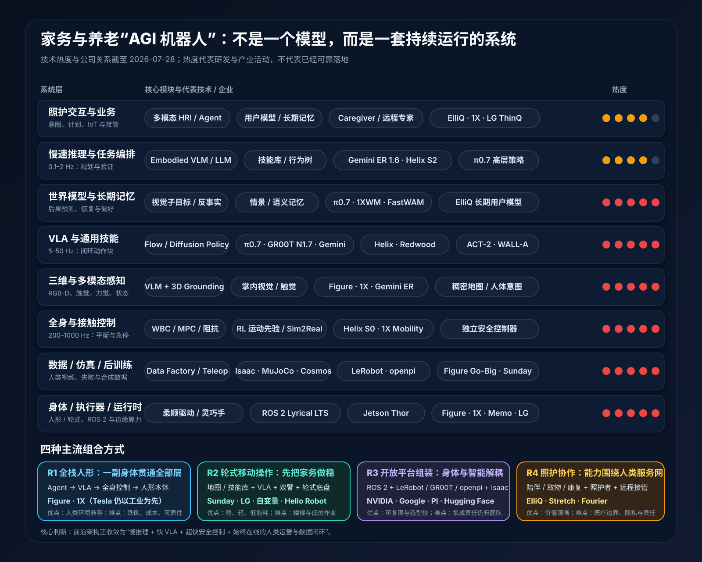
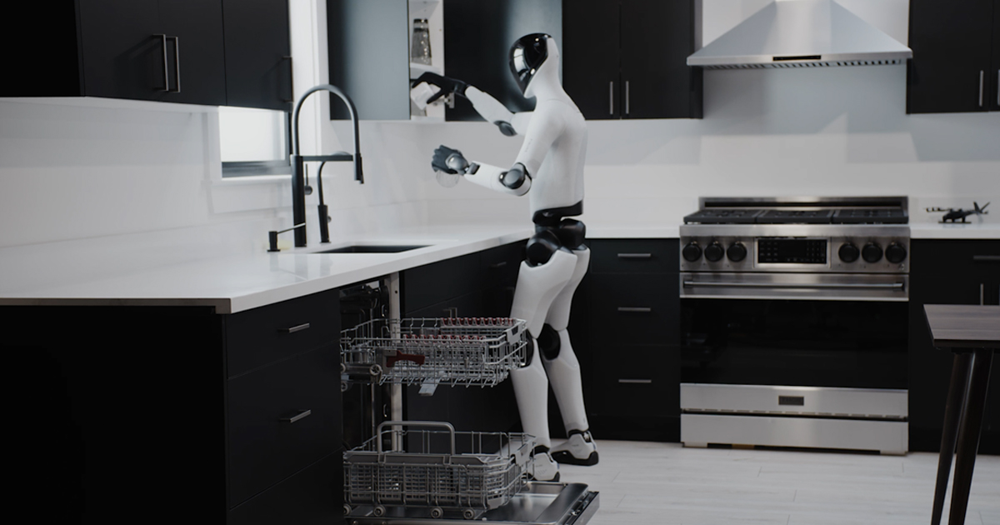
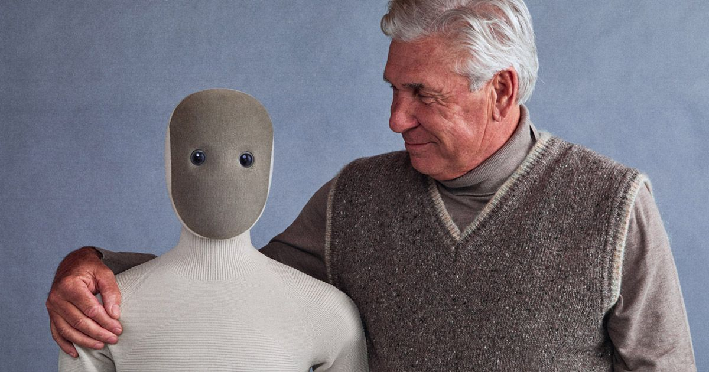
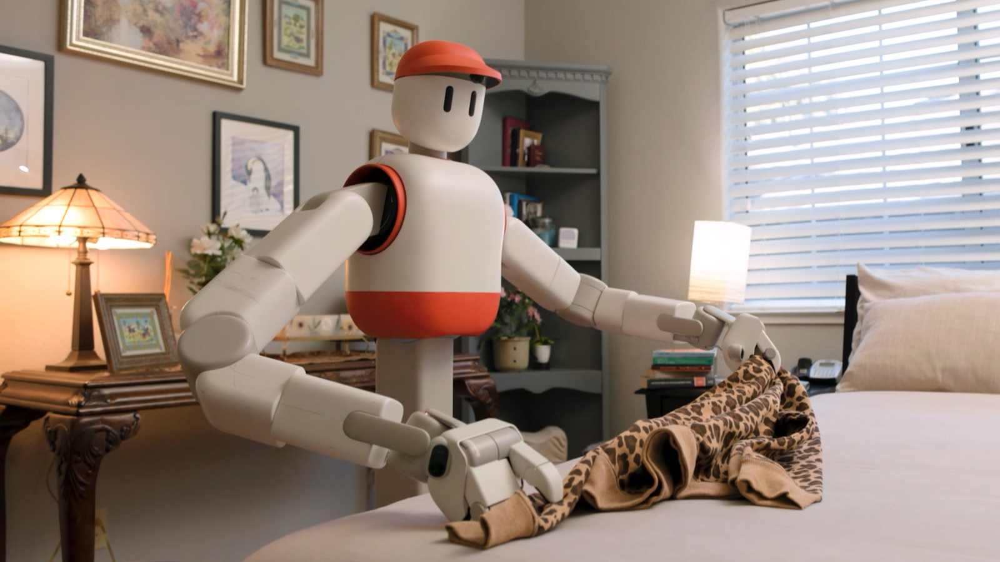
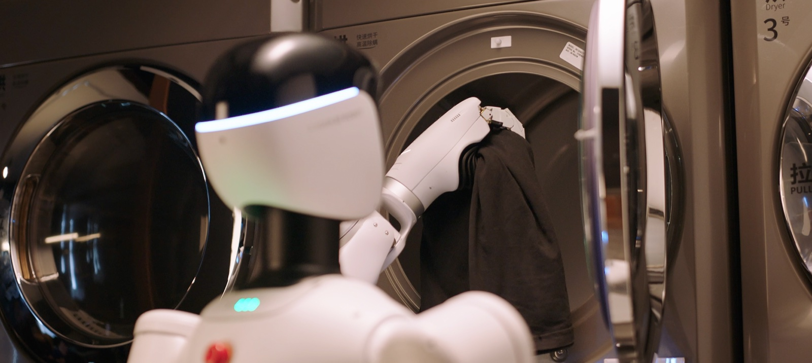
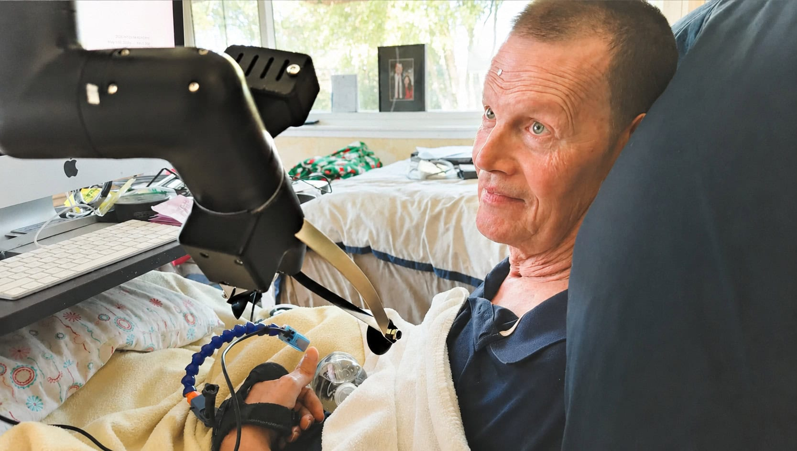
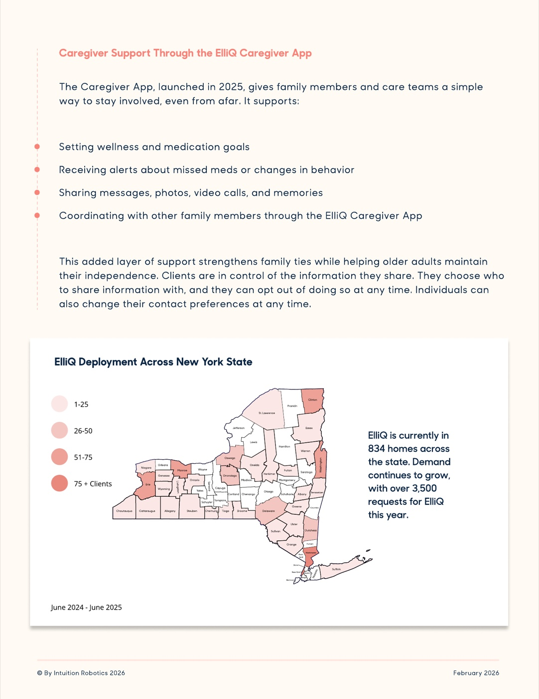
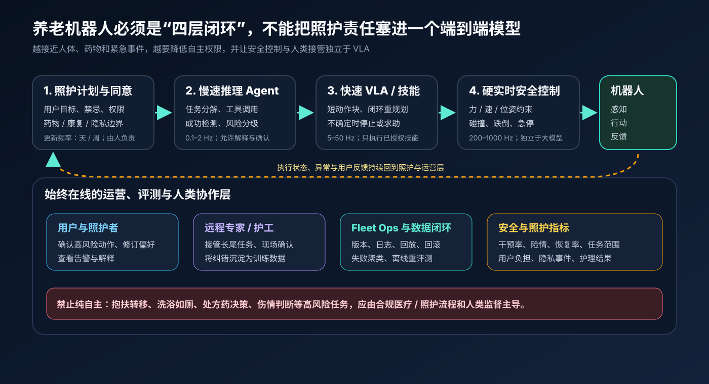

# 家务与养老 AGI 机器人技术栈全景：从 VLA 到安全运营

*图 1　家务与养老通用机器人的八层技术栈、截至 2026-07-28 的热度，以及四种主流组合路线与代表企业。红色五点表示热度 5/5，橙色四点表示 4/5；热度反映研发与产业活动，不等于成熟度。本文归纳，依据文末一手资料。*

先说一个不太讨喜、却能避免大部分误判的结论：**截至 2026 年 7 月，没有一家公开证明了“任意家庭、任意家务、长期无人看管”的 AGI 机器人。**“AGI 机器人”仍是产品愿景，不是已经通过统一测试的技术等级。

但变化也确实发生了。Figure Helix 02 已把视觉、触觉、全身运动和多分钟家务接入同一套分层网络；Sunday ACT-2 开始按未见家庭、物品范围、适配成本和数百次尝试报告单项家务可靠性；1X、Sunday 与自变量则把机器人直接送进早期用户或服务现场。前沿问题已从“能不能演示一次”，转向“能否跨家庭复现、失败后恢复，并把人工接管变成学习数据”。

本文的核心判断是：

1. **主流架构正在收敛为多时间尺度混合系统**：慢速推理 Agent + 快速 VLA + 超快全身/安全控制，外面再包一层人类运营与数据闭环。
2. **家务与养老不是同一产品**：家务最难的是开放世界操作；养老还多出用户状态、照护计划、知情同意、医疗边界和紧急升级。
3. **近期更可能胜出的身体不是唯一的**：双足人形覆盖楼梯和人类工具，轮式移动操作则更稳定、安静、省电，也更容易先形成服务。
4. **真正的壁垒正在从单一模型移向数据与运营**：谁能低成本收集长尾家庭数据、定义可靠性、处理失败并安全更新舰队，谁才更接近可持续产品。

## 一、先定义目标：不是会聊天的机械臂，而是长期服务系统

家庭把机器人问题一次性推到最难：空间不断变化，物体种类无穷，布料、液体和食物会变形，儿童、宠物和老人随时闯入工作区。一次“收拾餐桌”已经同时要求导航、双臂操作、抓取易碎品、识别垃圾、操作洗碗机和失败恢复。

养老又在家务之上增加了风险梯度：

| 任务层级 | 例子 | 近期合理自主度 |
|---|---|---|
| 低风险、高频 | 提醒、陪伴、取水、递物、巡检、联系家属 | 可高度自主，但要允许拒绝、纠错和退出 |
| 中风险、可确认 | 整理房间、备餐辅助、康复动作引导、用药提醒 | 机器人执行，用户或照护者确认关键步骤 |
| 高接触风险 | 搀扶、转移、穿脱衣、洗浴、如厕 | 以专用器械和人类监督为主 |
| 医疗决策 | 处方药调整、伤情判断、紧急处置 | 不应交给通用 VLA 独立决定 |

所以系统边界不应画在机器人外壳上，而应包括：机器人、智能家居、用户与照护档案、远程专家、家属/护工、舰队运营和事故追溯。真正的“通用”不是模型会多少动作，而是系统能否在不知道时停下来、求助，再把这次长尾情况变成下一版能力。

## 二、技术栈热度：最热的恰恰不等于最成熟

本文的热度是方向性证据评分，而非市场规模。把过去 18 个月的前沿发布密度记为 \(R\)，代表企业采用记为 \(I\)，开放生态活跃度记为 \(O\)，标准与基础设施进展记为 \(S\)，均按 1–5 归一化：

$$
H=0.4R+0.3I+0.2O+0.1S
$$

评分只用于回答“资源正在涌向哪里”。“落地度”另列：1 是论文/演示，3 是受控试点或早期客户，5 是可规模复制的长期服务。

| 技术层 | 热度 | 落地度 | 为什么热 / 还缺什么 |
|---|---:|---:|---|
| 身体、柔顺执行器、灵巧手 | 5/5 | 3/5 | Figure、1X、Sunday、LG 等都在自研身体；仍受成本、寿命、噪声、跌倒与维护约束 |
| RGB-D、触觉、力觉、三维状态 | 5/5 | 3/5 | Figure 03/Helix 02 接入掌内视觉与指尖触觉，1X 2026 年发布 25 DoF 腱驱手；触觉数据和标定仍稀缺 |
| 全身控制、接触控制、Sim2Real | 5/5 | 3/5 | Helix S0、1X Mobility 都用 RL 运动先验承接高频稳定；家中软物体与人机接触仍是长尾 |
| VLA / 通用技能策略 | 5/5 | 2/5 | \(\pi_{0.7}\)、GR00T N1.7、Helix 02、ACT-2、Gemini Robotics 集中发布；跨厂商统一实机评测仍缺失 |
| 慢速具身推理与 Agent 编排 | 4/5 | 2/5 | Gemini Robotics-ER 1.6 已能调用 VLA/工具并做成功检测；推理正确不等于动作安全 |
| World Model、记忆、用户模型 | 5/5 | 1/5 | \(\pi_{0.7}\)、1XWM、LeRobot 0.6 都把预测未来拉回闭环；物理一致性和不确定性尚不足以单独兜底 |
| 数据工厂、跨本体、人类视频 | 5/5 | 3/5 | Figure Go-Big、Sunday 手套、GR00T 人类视频预训练都在争夺低成本数据；数据权利与质量治理变成核心问题 |
| 仿真、合成数据、后训练 | 5/5 | 3/5 | Isaac/GR00T、LeRobot 0.6 正把 rollout、奖励模型、仿真评测接成闭环；Sim2Real 仍需真机纠偏 |
| ROS 2、边缘算力、部署运行时 | 4/5 | 4/5 | ROS 2 Lyrical 是 2026 LTS；Jetson Thor 可在 40–130W 提供 128GB 端侧内存，但实时与大模型仍需分区 |
| 安全、隐私、可靠性工程 | 4/5 | 2/5 | ISO 13482 仍是个人照护机器人基线且正在修订；生成式策略如何认证、回滚和追责尚未形成成熟范式 |
| 人机交互、照护工作流、IoT | 4/5 | 3/5 | ElliQ 已形成照护者应用和公共项目部署，LG 把机器人接入 ThinQ；物理照护与临床闭环远未成熟 |
| 远程接管、Fleet Ops、持续评测 | 4/5 | 4/5 | 1X Expert Mode、自变量“人+机器人”服务已把人工放进产品；成本、隐私与接管时延决定商业上限 |

最值得警惕的是 **World Model 与 VLA 的热度远高于落地度**。它们是决定上限的研究前沿，却不能替代机械可靠性、硬实时控制、权限系统和现场运营。更完整的模型演进见 [[VLA技术演进与最新模型版图|VLA 技术演进]] 与 [[world model综述|具身 World Model 综述]]。

## 三、八层技术栈：每一层都在替上一层收拾长尾

### 3.1 身体、感知与控制：先保证“不会伤人”

身体路线主要有三种：

- **双足全人形**：可走楼梯、使用按人体设计的工具和家具，数据也更容易与人类视频对齐；代价是跌倒能量、续航、噪声和控制复杂度。
- **轮式双臂移动操作**：低重心、长续航、成本较低，在单层住宅和养老机构更实际；代价是楼梯、门槛、地面取物和狭窄空间。
- **专用照护器械**：取物、移乘、康复、陪伴各用不同设备，通用性弱，却更容易验证安全和经济账。

Figure Helix 02 展示了当前全身路线的典型分层：S2 负责语义目标，S1 以 200 Hz 把视觉、触觉和本体感觉变成全身关节目标，10M 参数的 S0 以 1 kHz 维持平衡与接触。官方披露的洗碗机任务持续约 4 分钟、包含 61 个动作，但证据仍是公司视频，不是开放权重或独立家庭试验。

*图 2　Figure 03 搭载 Helix 02 在完整厨房中操作洗碗机。它说明人形路线为何需要把语义、视觉运动与 1 kHz 稳定控制分层。来源：[Figure《Introducing Helix 02》](https://www.figure.ai/news/helix-02)，官方画面，版权归 Figure。*

1X 走的是另一种家庭人形：轻量、软包覆、腱驱和较低能量。其 Redwood 是约 160M 参数的端侧 VLA，官方称约 5 Hz 运行，以 diffusion policy 同时输出导航、双臂和全身目标；但 2026 早期交付明确保留 Expert Mode，陌生任务可由远程人员接管。这个设计更诚实地揭示了近期产品形态：**自主系统 + 人类长尾处理器**，而不是“买回家即全能”。

*图 3　1X NEO 用软表面和低能量腱驱降低进入家庭的物理与心理门槛，但柔和外观不等于自主能力成熟。来源：[1X NEO 官方页](https://www.1x.tech/neo)，官方画面，版权归 1X。*

### 3.2 感知、VLA、推理与记忆：不同频率，不同责任

一个可用系统至少有四个认知环：

1. **状态估计环**：融合 RGB-D、触觉、力觉、本体感觉和地图，维护“人、物、机器人现在在哪里”。
2. **动作环**：VLA 根据短历史和子目标生成一段连续动作，只执行前几步就重新观察。
3. **任务环**：Embodied VLM/LLM 做分解、工具调用、成功检测和异常解释。Google 的 [Gemini Robotics-ER 1.6](https://deepmind.google/blog/gemini-robotics-er-1-6/) 已公开把 VLA 与第三方函数作为工具调用，但它本身不是直接动作模型。
4. **记忆与预测环**：保存任务进度、家庭布局、用户偏好和失败历史；World Model 生成视觉子目标或离线预测动作后果。

这解释了为什么“端到端”不会消灭系统分层。语义推理每秒做几次即可，动作策略需要 5–50 Hz，接触和跌倒保护需要 200–1000 Hz。让一个大模型直接以 1 kHz 输出电机力矩，既昂贵，也很难证明安全。

### 3.3 数据与学习：2026 年真正最拥挤的主战场

机器人没有现成的“动作互联网”。现在的主流解法分成四类：真机遥操作、可穿戴人类动作采集、仿真/合成 rollout，以及部署后的失败与纠错。

Figure 的 Project Go-Big 借助住宅场景采集第一视角人类视频；NVIDIA 称 GR00T N1.7 预训练使用约 3.2 万小时真实/人类数据和约 8000 小时仿真；Sunday 则让 Skill Capture Glove 与机器人手共享几何和传感接口，把人类动作转换为机器人数据。后者最新的 ACT-2 在公司预先声明的衣物范围内，对 785 次未见家庭尝试报告 99.1% 折叠成功率，成功样本中位耗时 2 分 13 秒。这个结果仍是单公司、单技能自评，却比剪辑演示多给出了范围、样本量、质量和适配成本，方向上更接近生产评测。

*图 4　Sunday Memo 的轮式双臂形态能通过移动、升降和前倾扩大工作区；ACT-2 把“大规模人类数据预训练 + 少量内部后训练 + 未见家庭评测”作为可靠性路线。来源：[Sunday《ACT-2 Preview》](https://www.sunday.ai/blog/act-2-preview)，官方画面，版权归 Sunday Robotics。*

开放生态也在快速补齐闭环。[LeRobot 0.6](https://huggingface.co/blog/lerobot-release-v060) 于 2026-07-07 加入 World Model policy、奖励模型接口、DAgger 式人类纠错和统一仿真评测；GitHub 仓库在核验日约 2.58 万星。[GR00T N1.7](https://developer.nvidia.com/blog/develop-humanoid-robot-policies-end-to-end-with-nvidia-isaac-gr00t/) 则把数据、Isaac 仿真、微调、TensorRT 部署连成参考工作流。开源栈降低了入门成本，但不会替团队承担动作空间映射、安全壳、真机数据质量和上线责任。

### 3.4 运行时、边缘与运营：模型之外才是产品

2026 年的稳妥底座是 **ROS 2 + 独立实时控制域 + 端侧推理 + 云端训练/运营**。[ROS 2 Lyrical Luth](https://docs.ros.org/en/humble/Releases.html) 于 2026-05-22 发布并支持至 2031 年；[Jetson Thor](https://www.nvidia.com/en-us/autonomous-machines/embedded-systems/jetson-thor/) 提供最高 128GB 内存、40–130W 功耗档，使较大的 VLM/VLA、传感处理和本地隐私策略能驻留端侧。但刹车、关节限位和碰撞保护仍应运行在独立、可验证的控制链上。

运营层至少要有：任务日志、视频/传感回放、模型与技能版本、灰度发布、快速回滚、接管台、失败聚类、离线重评测和事故审计。自变量与 58 到家的 2026 家庭清洁服务很有代表性：消费者买到的不是一台孤立机器人，而是“保洁人员 + 机器人”的协同服务。机器人承担擦拭、整理和收集等较结构化工作，人处理判断密集的细节；真实家庭由此变成数据与商业闭环。

*图 5　自变量官方家庭服务画面。其与 58 到家的服务把人类员工保留在现场，代表“先用人机协作穿过 70%→90%→99% 自主度”的商业路线。来源：[X Square 官方站](https://x2robot.com/en) 与 [2026-04-02 服务说明](https://www.prnewswire.com/news-releases/real-home-robot-maids-are-here-how-x-square-robot-merges-automation-with-human-partnership-302732960.html)，官方画面，版权归自变量机器人。*

## 四、六种企业路线：它们争夺的不是同一个入口

| 路线 | 代表企业/平台 | 技术组合 | 2026-07 状态 | 最强证据与主要缺口 |
|---|---|---|---|---|
| 全栈双足人形 | Figure | Figure 03 + Helix S2/S1/S0 + 触觉/掌内视觉 + 自有数据 | 工厂部署、家庭任务演示 | 全身长程能力突出；家庭商业部署与独立 benchmark 未公开 |
| 软体家庭人形 | 1X | NEO + Redwood + RL Mobility + World Model + Expert Mode | 美国 2026 早期交付，官方价 $20,000 或 $499/月 | 产品与远程运营闭环清楚；基础自主能力边界仍较窄 |
| 轮式家务机器人 | Sunday | Memo + ACT-2 + Skill Capture Glove + Skill Library | 2026 年末家庭 beta | 衣物折叠开始报告范围化可靠性；其他技能尚未达到同等证据 |
| 家电生态机器人 | LG | CLOiD 轮式双臂 + 生成式交互 + ThinQ 家电 | CES 2026 演示，官方称为 2028 商业化打基础 | 家电接口和渠道强；通用操作与真实家庭数据尚少 |
| 人机协作服务 | 自变量 + 58 到家 | 轮式/双臂本体 + WALL 系列模型 + 人类保洁 + 服务平台 | 深圳、北京等家庭服务试运行 | 已跨出实验室；仍依赖现场人员，公开稳定性和经济账有限 |
| 开放开发平台 | NVIDIA、Google、Physical Intelligence、Hugging Face、ROS | GR00T / Gemini / openpi / LeRobot + Isaac + ROS 2 | 模型、权重或工具逐步开放 | 适合研发选型；不是开箱即用的家庭产品 |

Tesla Optimus、Boston Dynamics Atlas、Agility Digit、优必选、宇树等在硬件或工业场景很重要，但截至核验日，公开证据仍主要指向工厂、物流或开发平台，不能因为人形热度高就直接算作家务/养老产品。

## 五、养老不是“家务机器人 + 对话模型”

养老真正优先解决的是独立生活能力和照护者负担，而不一定是完成最炫的动作。Hello Robot 的 Stretch 4 是一个反例式启发：它不是仿人双足，而是轻量轮式底盘、升降立柱和伸缩臂。官方 2026 售价 $29,950，已进入行动障碍人士的协作式家庭试点；这种形态不覆盖所有家务，却能稳定完成递水、够取、观察和远程协作。

*图 6　Stretch 4 在真实用户床边的辅助场景。轻量、低能量、可远程操作的移动机械臂，可能比重型全人形更早进入高价值照护任务。来源：[Hello Robot Assist](https://hello-robot.com/assist/)，官方画面，版权归 Hello Robot。*

另一条已落地路线甚至没有机械臂。ElliQ 把长期对话、提醒、健康目标、家属应用和照护机构连接起来。纽约州老龄办公室 2026 报告称，项目覆盖 834 户、平均每日 41 次互动；这些结果说明“照护关系与工作流”本身可以成为产品，但报告中的孤独感和满意度主要是参与者自报，不能据此推断医疗疗效。

*图 7　ElliQ 的照护者应用支持目标、漏服药提醒和家人协作；报告称截至统计期覆盖纽约州 834 户。原报告第 5 页，渲染自 [NYSOFA《Transforming Care for Older Adults》](https://aging.ny.gov/system/files/documents/2026/02/nysofa-elliq-project-update-2026.pdf)，版权归原作者。*

因此，一个养老机器人应额外增加四层约束：

1. **照护计划与知情同意**：用户是谁、能做什么、禁忌是什么、谁有权查看数据；
2. **风险分级与确认**：同一句“帮我拿药”，可以是取药盒，也可能被误解为决定剂量；
3. **照护者与专业人员闭环**：异常不是只写日志，而要触发家属、护工或急救流程；
4. **护理结果评估**：除了任务成功率，还要看跌倒、漏服、康复依从性、用户负担和照护者时间。

*图 8　养老机器人的四层安全闭环。大模型可以提出计划，VLA 可以执行短动作，但高频安全控制、权限、医疗边界和人类升级必须独立存在。本文归纳。*

合规上至少要区分三条边界：[ISO 13482:2014](https://www.iso.org/standard/53820.html) 仍覆盖移动服务、身体辅助和载人型个人照护机器人，当前状态为待修订；[IEC 80601-2-78](https://webstore.iec.ch/en/publication/33594) 适用于与患者身体交互的康复/辅助医疗机器人；2026 年新发布的 [ISO 25557:2026](https://www.iso.org/standard/85085.html) 则把居家和机构养老质量放在人本、自主、安全与照护服务体系中。一个产品一旦从“生活辅助”跨到“医疗用途”，验证、风险管理和责任主体都会改变。

## 六、如果今天开始做：两套更现实的参考栈

### 6.1 家务机器人

建议以轮式双臂或轻量人形起步：柔顺执行器 + RGB-D/腕部相机/触觉 + ROS 2 Lyrical + 独立实时安全控制 + Jetson Thor/Orin 端侧推理。上层用 Embodied VLM 做分解，用 GR00T/openpi/LeRobot 生态的 VLA 做短程动作，把 World Model 暂时用于子目标与离线评测，而不是安全裁判。每个新家庭先建图、校验可达区与禁区，陌生任务默认远程接管。

产品路线不要一开始追求“会一百件事”，而应选择 3–5 个高频、低风险、可形成数据飞轮的任务，例如收台面、衣物搬运、取递物、垃圾收集和家电操作。Sunday 的“单项 Solve”思想值得借鉴：同时声明成功率、速度、物体与环境范围，以及每户需要多少演示或人工。

### 6.2 养老机器人

先组合“照护 Agent + 智能家居/可穿戴 + 轻量移动操作 + 照护者平台”，把提醒、陪伴、巡检、取递和远程沟通做稳。涉及身体承重时优先用经过专门设计的移乘/康复设备，不让通用机械臂自由发挥。个人化记忆采用可查看、可删除、分权限的数据模型；摄像头默认端侧处理，上传必须最小化并可审计。

上线指标至少包括：

- **能力**：任务成功率、范围、速度、跨家庭适配成本；
- **可靠性**：每小时人工干预、失败恢复率、无效重复、离线与断网表现；
- **安全**：碰撞/夹伤/跌倒险情、急停、越权动作、错误用药相关事件；
- **运营**：接管时延、每单人力、故障修复时间、版本回滚成功率；
- **照护价值**：用户主动使用、照护者时间、ADL/IADL 改善与退出率；
- **隐私**：原始视频留存、访问审计、误唤醒、数据删除时效。

## 结论：真正的 AGI 机器人，会先长成一套“会求助的服务”

2026 年的前沿已经越过了“看见物体并抓起来”，正在攻克全身移动操作、未见家庭泛化、记忆、世界模型和失败恢复。但离长期无人看管仍差三件事：可声明边界的可靠性、可认证的安全壳，以及能处理长尾的服务网络。

家务场景会继续推动 VLA、灵巧手和数据工厂；养老场景则会迫使行业补上用户模型、权限、照护工作流和责任闭环。最有可能先落地的，不是一台假装无所不知的全能人形，而是一套**知道自己会什么、不会什么，能够安全停下并把人类叫进来**的系统。等这种系统在真实家庭里持续学习，AGI 才不再只是机器人的营销前缀。

## 主要一手资料

- [Figure：Helix 02（2026-01-27）](https://www.figure.ai/news/helix-02)
- [Figure：Helix 02 Bedroom Tidy（2026-05-08）](https://www.figure.ai/news/helix-02-bedroom-tidy)
- [1X：NEO Home Robot 与 2026 交付信息](https://www.1x.tech/order)
- [1X：Redwood AI](https://www.1x.tech/discover/redwood-ai)
- [1X：NEO 25 DoF Hands（2026-07-09）](https://www.1x.tech/discover/neos-hands)
- [Sunday：ACT-2 Preview（2026-07-17）](https://www.sunday.ai/blog/act-2-preview)
- [Physical Intelligence：π0.7（2026-04-16）](https://www.pi.website/blog/pi07)
- [Google DeepMind：Gemini Robotics-ER 1.6（2026-04-14）](https://deepmind.google/blog/gemini-robotics-er-1-6/)
- [NVIDIA：Isaac GR00T N1.7（2026-07-07）](https://developer.nvidia.com/blog/develop-humanoid-robot-policies-end-to-end-with-nvidia-isaac-gr00t/)
- [Hugging Face：LeRobot 0.6（2026-07-07）](https://huggingface.co/blog/lerobot-release-v060)
- [LG：CLOiD Home Robot（2026-01-04）](https://www.lg.com/global/newsroom/news/home-appliance-solution/lg-electronics-presents-lg-cloid-home-robot-to-demonstrate-zero-labor-home-at-ces-2026/)
- [Hello Robot：Stretch 4 Assist](https://hello-robot.com/assist/)
- [X Square：家庭服务与 WALL 系列](https://x2robot.com/en)
- [NYSOFA：ElliQ 2026 项目更新](https://aging.ny.gov/system/files/documents/2026/02/nysofa-elliq-project-update-2026.pdf)
- [ROS 2：Lyrical Luth 发行与支持周期](https://docs.ros.org/en/humble/Releases.html)
- [ISO 13482、IEC 80601-2-78、ISO 25557:2026](https://www.iso.org/standard/53820.html)
