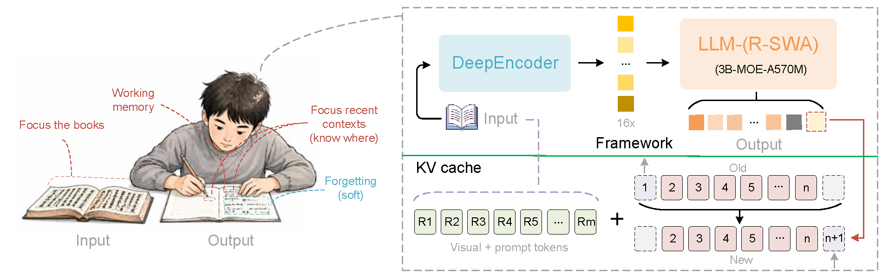
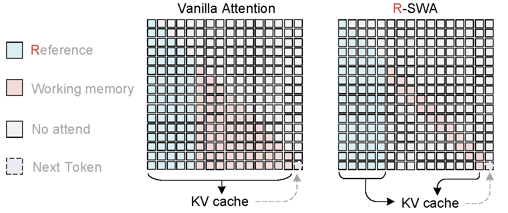
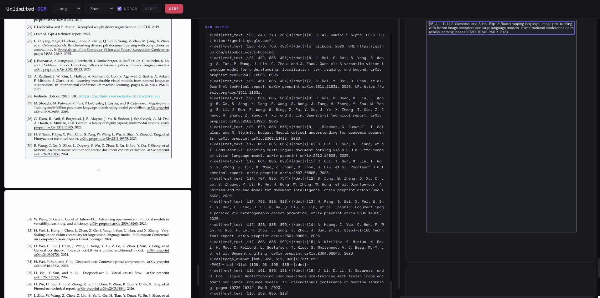
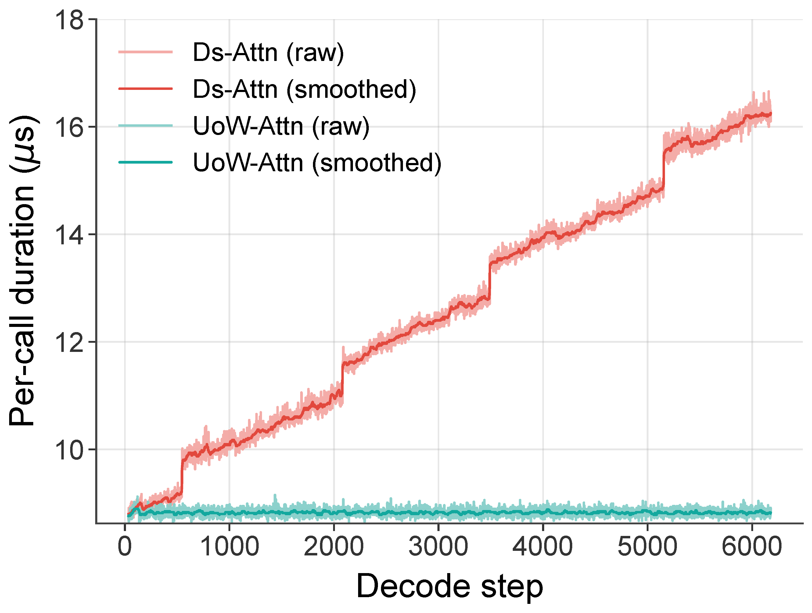

# 论文解读：Unlimited OCR Works

> **核心判断：Unlimited OCR 真正重要的不是“多识别了几页 PDF”，而是把长时程解析拆成了两种性质不同的记忆——始终可见的参考信息，与只保留最近 128 个输出 token 的工作记忆。它证明了长时程感知不必等于保存全部历史；但它还没有解决具身场景中持续到来的视觉流。**

想象一个机器人在仓库里行走。它先看到货架编号，转身后看到包装上的批次，再靠近读取保质期；同一行文字会在几十帧里经历远近变化、运动模糊、遮挡和反光。若每帧都独立 OCR，系统会重复计算、输出互相矛盾的字符串，也无法回答“这次读到的文字是否属于刚才那个箱子”。若把全部帧和全部识别历史都塞进上下文，显存与延迟又会随时间增长。

这正是 Unlimited OCR 值得放进具身智能而不只是文档 AI 分类的原因。它触及了一个比 OCR 更普遍的问题：**持续感知系统应该记住什么，又应该忘掉什么？**

不过，先把结论说严谨。百度的 [Unlimited OCR Works](https://arxiv.org/abs/2606.23050) 研究的是静态单页与多页文档，不是摄像头视频流。近期围绕 Yann LeCun 转发的[社区二次传播](https://xclaw.info/en/kol?days=7&group=cn)让它再次受到关注，GitHub 与 Hugging Face 的传播数据也很亮眼；这些说明问题选得有共鸣，却不是模型能力的实验依据。本文会把三件事分开：

1. **论文事实**：作者在文档 OCR 上实际做了什么、测到了什么；
2. **源码复核**：开源实现怎样管理 KV cache，多页接口到底如何工作；
3. **具身推演**：R-SWA 对持续动态视觉可能有什么价值，以及哪些能力尚未被验证。

论文与代码锚点：

- 论文：Youyang Yin 等，*Unlimited OCR Works: Welcome the Era of One-shot Long-horizon Parsing*，2026-06-22；
- 官方仓库：[`baidu/Unlimited-OCR@4ba2ea3`](https://github.com/baidu/Unlimited-OCR/tree/4ba2ea3eb384757710bc7f7678922b0b61045448)；
- 模型代码与配置：[`baidu/Unlimited-OCR@27a5997`](https://huggingface.co/baidu/Unlimited-OCR/tree/27a5997fa0524f9adcf9e2f3d5e7d3f784434fa5)；
- 论文尚是 arXiv 技术报告，本文未发现独立复现实验。

## 一、先给一句人话解释：把原件钉在桌上，只保留刚写过的一小段

人抄一本书时，不会在写下每个字之前重新阅读已经抄完的全部内容。更接近真实的过程是：

- 原书一直摆在眼前；
- 刚写完的一小段留在工作记忆里，用于知道抄到哪里；
- 更早的输出逐渐淡出；
- 下一笔仍可回看原书，而不必依赖完整抄写历史。

Unlimited OCR 把这个分工直接写进注意力结构：

- **Reference**：视觉 token 与 prompt，整个解码期间始终可见；
- **Working memory**：最近 $n$ 个输出 token，论文默认 $n=128$；
- **Forgotten history**：更早的输出 KV 被循环覆盖。

先看作者自己的总图。左半边是“抄书”的认知类比，右半边才是可执行结构：DeepEncoder 把页面压成视觉 token，MoE-LLM 的所有注意力层换成 R-SWA，KV cache 由固定参考区与循环工作区组成。



*论文原图 Figure 2；来源：[论文与 arXiv source](https://arxiv.org/abs/2606.23050)，按 CC BY 4.0 转载，本文重述图意。图中能看见视觉参考 R1…Rm 一直保留，而旧输出槽位被新 token 覆盖。*

这张图支持的是**作者确实把视觉前缀与输出历史分开管理**。它本身不能证明精度提高，也不能证明方法适用于视频或机器人；那些需要单独的实验。

## 二、任务契约：它做的是长文档解析，不是流式视频 OCR

| 项目 | 论文与开源实现中的真实设定 |
|---|---|
| 输入 | 单张文档图，或在生成开始前一次性提供的多页图像 |
| 输出 | 带检测框、文本、公式、表格和页面分隔符的自回归序列 |
| 视觉编码 | 继承 [DeepSeek-OCR](https://arxiv.org/abs/2510.18234) 的 DeepEncoder；多页 Base 模式把每张 $1024\times1024$ 图像压到约 256 个视觉 token |
| 解码器 | 约 3B 总参数、约 0.5B—0.57B 激活的 MoE-LLM；12 层、隐藏维 1280、10 个注意力头 |
| 上下文 | 配置上限 32,768；R-SWA 输出滑窗为 128 |
| 训练数据 | 约 200 万文档样本，单页与多页为 9:1；多页数据由单页合成，约 20 万条、每条 2—50 页 |
| 训练方式 | 从 DeepSeek-OCR 继续训练 4,000 步；冻结 DeepEncoder，只训练 LLM；全局 batch 256，使用 $8\times16$ 张 A800 |
| 论文没有解决 | 视频帧持续到达、跨帧文字跟踪、相机运动、主动靠近、读数置信度更新、视觉记忆淘汰、感知—动作闭环 |

这里的 “one-shot” 也容易被误解。它不是非自回归的一次前向计算，而是：**多页视觉信息只 prefill 一次，随后在一次连续的自回归生成会话中输出全部结果**。生成仍然是一 token 一 token 地进行。

同样，“32K”在 Hugging Face `generate(max_length=32768)` 里是输入与输出合计上限，不是额外赠送 32K 输出。页面越多，视觉前缀占用越多，能留给文本输出的长度越少。

## 三、旧方法为什么越抄越慢

### 3.1 标准全注意力：输出历史不断进入 KV cache

设视觉与 prompt 前缀长度为 $L_m$，已经生成 $T$ 个 token。标准多头注意力需要保存：

$$
C_{\mathrm{MHA}}(T)=L_m+T
$$

每多生成一个 token，后续每一步都多一份需要读取的 K/V。于是：

- KV cache 随 $T$ 线性增长；
- 单步 attention 需要扫描的历史越来越长；
- 生成越到后面越慢；
- 长文档还没识别完，显存或上下文上限可能先耗尽。

传统工程会把 PDF 拆成单页循环调用。这很实用，但代价是页间状态被清空：跨页表格、页眉续接、阅读顺序和重复区域需要外部调度器重新拼接。论文把这种做法称为“for-loop workaround”。更准确地说，它不是错误方案，而是把长时程一致性的责任从模型内部转移给了外部流水线。

### 3.2 普通滑窗也不够：视觉参考会被一起滑走

若简单对整个序列使用 Sliding Window Attention，早期的视觉 token 也会离开窗口。对 OCR 而言，这相当于抄到后面时原件已经被拿走，只能根据自己刚写的几句话继续猜。若使用线性注意力把视觉信息反复压进递归状态，又可能让原始细节在多次状态更新中逐渐模糊。

R-SWA 的关键不是“有滑窗”，而是**只让输出历史滑动，参考前缀永不滑走**。

## 四、R-SWA：固定参考区与循环工作区

作者用 Figure 1 直接对比了两种注意力图。左侧全注意力的粉色输出区域会不断扩张；右侧 R-SWA 的蓝色参考列固定保留，粉色输出区域始终只有一条有限宽度的对角带。



*论文原图 Figure 1；来源：[论文与 arXiv source](https://arxiv.org/abs/2606.23050)，按 CC BY 4.0 转载。它说明注意力拓扑与缓存边界，不是准确率证据。*

### 4.1 每个新 token 到底能看见什么

把参考前缀记作：

$$
\mathcal{P}=\{1,\ldots,L_m\}
$$

对第 $t$ 个生成 token，只保留最近 $n$ 个解码位置：

$$
\mathcal{D}_n(t)=
\left\{
j\mid
\max(L_m+1,L_m+t-n)\le j\le L_m+t-1
\right\}
$$

它的可见集合是：

$$
\mathcal{N}(t)=\mathcal{P}\cup\mathcal{D}_n(t)
$$

标准缩放点积注意力只在这个集合上归一化：

$$
\alpha_{tj}
=
\frac{
\exp\left(\mathbf q_t^\top\mathbf k_j/\sqrt{d_k}\right)
}{
\sum_{i\in\mathcal N(t)}
\exp\left(\mathbf q_t^\top\mathbf k_i/\sqrt{d_k}\right)
},
\qquad j\in\mathcal N(t)
$$

$$
\mathbf o_t
=
\sum_{j\in\mathcal N(t)}\alpha_{tj}\mathbf v_j
$$

翻译回“机器人读标签”的例子：模型生成下一个字符时，可以回看本次任务开始前提供的全部图像，也能看最近输出的短文本；更早的输出不能被直接检索。长期状态不是靠一条永不丢失的完整日志，而是由相邻窗口逐步接力。

这能维持“我读到哪里了”，不等于能精确回忆很早以前输出过的任意字符串。R-SWA 适合**参考信息始终可回看、输出主要依赖局部连续性**的解析任务；需要跨很远距离做任意内容比较的任务未必适合。

### 4.2 KV cache 为什么变成有界

R-SWA 始终保存 $L_m$ 个参考 token，只保存最近 $n$ 个输出 token：

$$
C_{\mathrm{R\text{-}SWA}}(T)
=
L_m+\min(n,T)
\le L_m+n
$$

相对于全注意力：

$$
\rho(T)=
\frac{L_m+\min(n,T)}{L_m+T}
$$

当输入固定、$T$ 持续增长时，分母增长而分子封顶。这就是论文所谓 “constant KV cache” 的准确含义：**对解码长度 $T$ 有界，而不是对输入页面数 $L_m$ 恒定。**

这一区别对具身视觉至关重要。若相机每秒继续增加新帧，而所有新帧都被追加到参考前缀，$L_m$ 仍会随时间增长，Unlimited OCR 的“恒定 cache”就不再恒定。

### 4.3 源码不是抽象概念，而是一个环形缓冲区

开源实现中的 [`SlidingWindowLlamaAttention`](https://huggingface.co/baidu/Unlimited-OCR/blob/27a5997fa0524f9adcf9e2f3d5e7d3f784434fa5/modeling_deepseekv2.py#L1232-L1377) 先记录 `prefill_len`，填满 128 个输出槽位后，每生成一个 token 就覆盖最老槽位：

```python
slot = prefill_len + ring_pos
kcache[:, :, slot:slot + 1, :] = key_states
vcache[:, :, slot:slot + 1, :] = value_states
ring_pos = (ring_pos + 1) % W
```

视觉图像只在 prefill 阶段传入模型；后续解码步骤不再重新编码图像。配置文件把 `sliding_window_size` 设为 128，而代码用 `_ring_window` 保存它，避免通用 `DynamicCache` 错把静态视觉前缀也截断。

这套实现说明 R-SWA 不是提示词技巧，而是对每层注意力 cache 生命周期的修改。

## 五、DeepEncoder 为什么同样关键

只给输出侧减负还不够。R-SWA 的上界仍包含 $L_m$，所以视觉前缀必须足够短。

Unlimited OCR 继承 DeepSeek-OCR 的 DeepEncoder：先用 SAM-ViT 的局部窗口处理高分辨率图像，再经 16 倍 token 压缩后交给 CLIP-ViT 的全局注意力。论文称一张 $1024\times1024$ 页面在 Base 模式下可压到约 256 个视觉 token。40 页因此仍约需一万级视觉 token，远非免费。

这也揭示了系统真正的两段式分工：

1. **DeepEncoder 压缩空间维度**：尽量少的视觉 token 保留足够文字细节；
2. **R-SWA 压缩时间维度**：不让已生成文本的 KV 永久累积。

前者如果压得过狠，小字会丢失；后者如果窗口太短，生成进度可能漂移。论文把 40+ 页错误主要归因于多页只能使用 $1024\times1024$ Base 模式、细字难辨，但没有给出窗口宽度消融来完全排除 R-SWA 的影响。

## 六、实验到底证明了多少

### 6.1 单页文档能力：结果强，但不是纯 R-SWA 消融

论文在 OmniDocBench v1.5 上报告：

| 模型 | 总分 ↑ | 文本编辑距离 ↓ | 公式 CDM ↑ | 表格 TEDS ↑ | 阅读顺序编辑距离 ↓ |
|---|---:|---:|---:|---:|---:|
| DeepSeek-OCR | 87.01 | 0.073 | 83.37 | 84.97 | 0.086 |
| Unlimited OCR | **93.23** | **0.038** | **92.61** | **90.93** | **0.045** |
| 绝对变化 | **+6.22** | **−0.035** | **+9.24** | **+5.96** | **−0.041** |

在 v1.6 上，Unlimited OCR 总分为 93.92，略高于 Qianfan-OCR 的 93.90 与 Logics-Parsing-v2 的 93.33。但它不是每个子项都第一：例如文本编辑距离 0.042，弱于 FireRed-OCR 的 0.037；阅读顺序 0.129 与多个对手接近。

这些结果足以说明 Unlimited OCR 是很强的端到端文档解析模型，却不足以把全部增益归因于 R-SWA。原因是模型还在约 200 万文档样本上继续训练了 4,000 步，而论文没有报告以下关键对照：

- 同样数据与训练预算下的全注意力 DeepSeek-OCR；
- 普通 SWA 与 R-SWA；
- $n=64/128/256/512$ 的窗口宽度消融；
- 是否仅靠额外文档数据也能得到大部分提升。

因此，“模型有效”是强证据；“R-SWA 导致 +6.22”仍是未隔离的解释。

### 6.2 长时程能力：40+ 页可用，但证据还是内部小样本

论文的内部多页测试集每个页数组不少于 10 本书，报告：

| 页数 | 2 | 5 | 10 | 15 | 20 | 40+ |
|---|---:|---:|---:|---:|---:|---:|
| Distinct-35 ↑ | 99.87% | 99.98% | 99.83% | 99.99% | 99.89% | 96.90% |
| 编辑距离 ↓ | 0.0362 | 0.0452 | 0.0526 | 0.0787 | 0.0572 | 0.1069 |

40+ 页编辑距离仍低于 0.11，说明模型没有立即崩溃；Distinct-35 为 96.90%，说明输出没有大面积陷入长 n-gram 循环。官方演示也展示了连续页面、原始检测标记与可视化框同步生成：



*官方仓库演示 GIF 的 12 秒完整帧；来源：[`baidu/Unlimited-OCR@4ba2ea3`](https://github.com/baidu/Unlimited-OCR/tree/4ba2ea3eb384757710bc7f7678922b0b61045448)。它展示了系统工作流，不是独立复现或精度证明。*

但还要看到四个限制：

1. 测试集未公开，样本量只给出“不少于 10”，难以复核难度与分布；
2. 长时程表没有同条件基线，不能量化 R-SWA 相对全注意力或逐页流程的净收益；
3. Distinct-n 主要检测重复退化，高 distinct 不等于文字正确；
4. 编辑距离并未随页数单调变化，说明样本内容难度可能大于页数本身。

### 6.3 效率：解码单步变平，但端到端成本仍含 prefill

论文 Figure 3 是最直接的机制证据。横轴是解码步数，纵轴是 Flash Attention v3 内核单次调用时延。DeepSeek-OCR 的曲线随步数上升并在对齐边界处跳变；Unlimited OCR 基本保持水平。



*论文原图 Figure 3；来源：[论文与 arXiv source](https://arxiv.org/abs/2606.23050)，按 CC BY 4.0 转载。它支持“固定输入下，单步解码注意力开销不随输出历史增长”；它没有测量多页图像编码和 prefill 的总延迟。*

论文的理想并发 TPS 表中，6,144 输出步时 Unlimited OCR 为 7,847.71 TPS，DeepSeek-OCR 为 5,822.87 TPS，前者约高 34.8%。但该实验把 prefill 长度固定为 10，测的是解码上限，不是 40 页文档的端到端时延。

所以更准确的工程结论是：

- 固定输入后，R-SWA 能让解码侧吞吐和 KV cache 不再随输出长度恶化；
- 页面越多，视觉编码与 prefill 仍然更贵；
- 论文没有给出端到端延迟、峰值显存曲线、能耗或边缘设备测试；
- “长输出稳定”已经得到较强支持，“整个系统无论多少页都恒定”没有得到支持。

## 七、部署时最容易踩的坑：多页一次解析与 PDF 并发不是一回事

截至固定版本，官方开源代码提供了两条容易混淆的路径。

### 7.1 Transformers `infer_multi`：接近论文的 one-shot

[`infer_multi`](https://huggingface.co/baidu/Unlimited-OCR/blob/27a5997fa0524f9adcf9e2f3d5e7d3f784434fa5/modeling_unlimitedocr.py#L1139-L1257) 会：

1. 一次载入所有页面；
2. 把每页视觉 token 串接到同一个 `<image>` 位置；
3. 一次完成 prefill；
4. 在同一生成序列中用 `<PAGE>` 分隔各页输出；
5. 多页只支持 Base 模式，不支持动态 crop。

这才复现了论文讨论的“多页共同参考前缀 + 连续输出工作记忆”。

### 7.2 仓库 `infer.py --pdf`：逐页并发批处理

仓库附带的 [SGLang `infer.py`](https://github.com/baidu/Unlimited-OCR/blob/4ba2ea3eb384757710bc7f7678922b0b61045448/infer.py#L240-L280) 会先把 PDF 转成图片，再为每一页建立独立 job，通过线程池并发请求。每个请求只含一张图，页面之间没有共享 R-SWA 状态。

它适合高吞吐 PDF 批处理，却不是论文意义上的 one-shot long-horizon parsing。若只跑这个脚本并观察到多页输出文件，不能据此声称复现了跨页连续解析。

此外，官方示例为抑制长生成循环，在多页模式使用 35-gram、窗口 1,024 的重复屏蔽器。这是 logits 后处理，不是 R-SWA 本身；部署评测时应保留并单独记录，否则可能把解码策略差异误认为模型差异。

## 八、为什么这仍然是一个具身智能问题

### 8.1 价值不在 OCR，而在“记忆责任”的重新分配

具身智能面对的不是一次问答，而是持续运行：

$$
o_1,a_1,o_2,a_2,\ldots,o_t,a_t
$$

若所有观测、识别结果与动作都永久保留，任何 Transformer 都会遇到上下文、显存和延迟的增长。Unlimited OCR 提供了一个很有价值的反例：**只要任务的原始参考仍可访问，历史输出不一定需要被完整直接注意；局部状态接力可能足够完成长时程过程。**

这与 [[world model综述|World Model]] 不同。R-SWA 不预测动作之后世界如何变化，也不学习环境动力学；它更像一个低成本的**感知工作记忆**。它与 [[VLA技术演进与最新模型版图|VLA]] 的关系也不是直接生成机器人动作，而是给策略提供更稳定的文字信念，例如：

- “刚才那个红色阀门标着 CLOSED”；
- “同一箱体的批次号在更清晰的新视角下被修正”；
- “路牌已经读取过，不必每帧重新生成完整文本”；
- “本次任务只需保留危险标识，广告文字可以忘记”。

### 8.2 论文还没有处理视觉流本身

Unlimited OCR 的参考视觉在生成开始前已经全部到齐，并在解码中保持静态。具身相机却不断产生新观测。真正的持续动态 OCR 至少还需要：

1. **帧选择**：何时读，何时跳过重复帧，何时等待更清晰视角；
2. **文字实例跟踪**：跨帧判断是不是同一块牌、同一个包装或同一屏幕区域；
3. **跨帧证据融合**：利用多帧弥补模糊、遮挡、低分辨率与反光；
4. **有界视觉参考池**：不能把每帧都钉在 reference 区，需要按对象、位置、任务价值进行压缩、检索和淘汰；
5. **可修正信念**：后续清晰帧应能推翻早期错误，而不是只追加新字符串；
6. **主动感知闭环**：识别不确定时，机器人可以靠近、转头、补光或改变抓取姿态。

视频文字识别研究本身也表明，仅靠逐帧 OCR 不够。[TransDETR](https://arxiv.org/abs/2203.10539) 把检测、跟踪与识别统一到跨帧 text query；2026 年的 [TraRA](https://arxiv.org/abs/2606.07161) 则强调沿文字轨迹聚合多帧视觉与语言证据，以应对运动模糊、遮挡和尺度变化。Unlimited OCR 解决的是另一条轴：**当输出本身很长时，如何不让解码历史拖垮系统。**


*本文教学示意图，不是论文原图。关键边界是：R-SWA 约束了解码历史，却没有自动约束持续增长的视觉参考。*

### 8.3 一个更完整的具身 OCR 架构应该长什么样

如果沿 Unlimited OCR 的思想继续走，合理的系统不应把摄像头视频直接当成无限多页 PDF，而应分层管理：

$$
\text{camera stream}
\rightarrow
\text{quality/novelty gate}
\rightarrow
\text{text tracks}
\rightarrow
\text{bounded reference pool}
\rightarrow
\text{R-SWA decoder}
\rightarrow
\text{scene memory / policy}
$$

- **quality/novelty gate** 只保留更清晰、更新或任务相关的帧；
- **text tracks** 把同一文字实例跨帧绑定，积累多视角证据；
- **bounded reference pool** 保存少量关键帧、对象级特征与位姿，而不是所有原始帧；
- **R-SWA decoder** 用有限输出工作记忆持续转写、纠错和结构化；
- **scene memory / policy** 把“字符串”绑定到对象、位置、时间与动作意义。

此时 R-SWA 仍是重要模块，但它只负责最后一段。真正让系统“无限运行”的，是视觉参考池也具备写入、合并、检索、淘汰和回访机制。论文在未来工作中提出 “prefill pool” 与自动取回 KV chunk，恰好触及了这一步，却尚未实现或评测。

## 九、局限、边界条件与未回答的问题

把前面的结果压成一张证据表，可以更清楚地区分论文已经证明的能力、作者尚未隔离的因果解释，以及面向具身智能的开放问题。

| 判断 | 类型 | 证据强度 | 依据与缺口 |
|---|---|---|---|
| R-SWA 让固定输入下的解码 KV cache 对输出长度有界 | 论文事实 + 源码事实 | 强 | 公式、ring buffer 与 kernel 曲线一致 |
| Unlimited OCR 是强单页文档解析模型 | 论文事实 | 强 | OmniDocBench v1.5/v1.6 总分领先或并列前沿 |
| R-SWA 单独带来 v1.5 的 +6.22 | 作者解释 | 弱—中 | 额外训练数据与预算未控制，无同预算消融 |
| 40+ 页能在一次连续生成中保持可用精度 | 论文事实 | 中 | 内部小样本、无公开集、无同条件基线 |
| 模型是真正 “Unlimited” | 营销式命名 | 不成立 | 仍受 32K 总长度与视觉 prefill 限制 |
| R-SWA 可直接用于具身动态 OCR | 推导 | 未验证 | 没有视频流、跟踪、主动视角或机器人实验 |
| R-SWA 是具身长期感知值得借鉴的工作记忆原语 | 本文解释 | 中 | 机制匹配，但需额外解决视觉参考增长与对象绑定 |

## 十、如果要把具身价值真正验证出来

下一篇真正面向具身 OCR 的工作，至少应补齐以下实验：

1. **公开流式基准**：在 RoadText、BOVText、ArTVideo 等视频文字数据上测检测、跟踪、识别与延迟；
2. **持续时间曲线**：运行 1 分钟、10 分钟、1 小时，报告显存、TPS、端到端延迟与错误累积；
3. **视觉记忆消融**：全帧保留、关键帧、轨迹聚合、检索式 reference pool 的公平比较；
4. **纠错能力**：早期模糊帧读错后，后续清晰帧能否更新已有对象的文字信念；
5. **主动感知**：比较固定相机与“靠近/转头/补看”的成功率、动作成本和安全性；
6. **真正的因果消融**：同数据、同训练预算比较 MHA、普通 SWA、R-SWA，以及不同窗口宽度；
7. **边缘部署**：在 Jetson 或机器人计算平台上报告峰值显存、功耗与帧率，而不仅是 A800 上的理想并发 TPS。

这些实验通过之后，才可以说 Unlimited OCR 的思想从“长文档工作记忆”跨到了“具身持续视觉工作记忆”。

## 十一、一周后应该记住什么

1. **R-SWA 的本质不是滑窗，而是固定参考、滑动输出。** 原始视觉始终可见，只有更早的生成历史被忘掉。
2. **“恒定 KV cache”只对固定输入后的解码长度成立。** 页面或视频帧继续增加，视觉前缀仍会增长；32K 也包含输入。
3. **论文已经证明长文档解析可用，却没有证明动态具身 OCR。** 真正的下一步是把帧选择、文字轨迹、视觉 reference pool、可修正信念和主动感知接到 R-SWA 前后。

Unlimited OCR 最值得保留的心智模型不是“一个能读 40 页 PDF 的 3B 模型”，而是：**长时程智能不需要保存一切；它需要知道哪些信息应作为稳定参考，哪些只应短暂驻留在工作记忆，哪些必须被压缩成可检索的长期状态。** 这正是具身系统要学会的遗忘方式。

## 参考资料

1. Youyang Yin et al., [Unlimited OCR Works](https://arxiv.org/abs/2606.23050), 2026.
2. Baidu, [Unlimited-OCR official repository](https://github.com/baidu/Unlimited-OCR), MIT License.
3. Baidu, [Unlimited-OCR model card, config and remote code](https://huggingface.co/baidu/Unlimited-OCR).
4. DeepSeek-AI, [DeepSeek-OCR: Contexts Optical Compression](https://arxiv.org/abs/2510.18234), 2025.
5. Weijia Wu et al., [End-to-End Video Text Spotting with Transformer](https://arxiv.org/abs/2203.10539), 2022.
6. Duc Tri Tran et al., [TraRA: Trajectory-level Recognition Aggregation for Video Text Spotting in Urban Surveillance](https://arxiv.org/abs/2606.07161), 2026.
7. 百度智能云, [Unlimited-OCR 企业级服务发布说明](https://ai.baidu.com/support/news?action=detail&id=3274), 2026.
