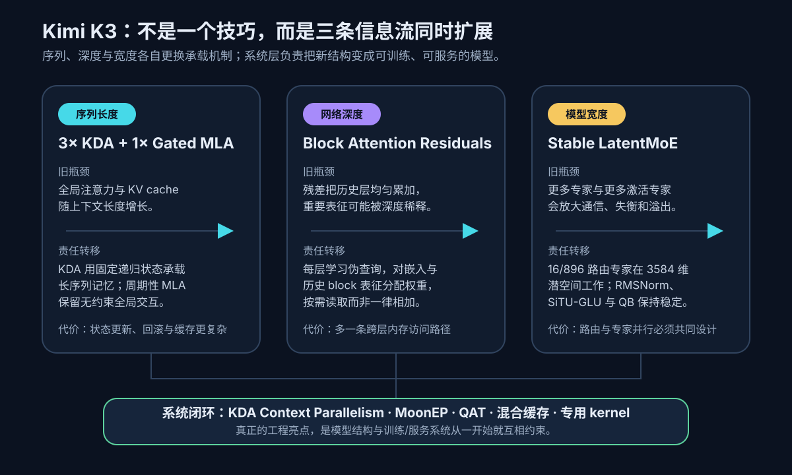
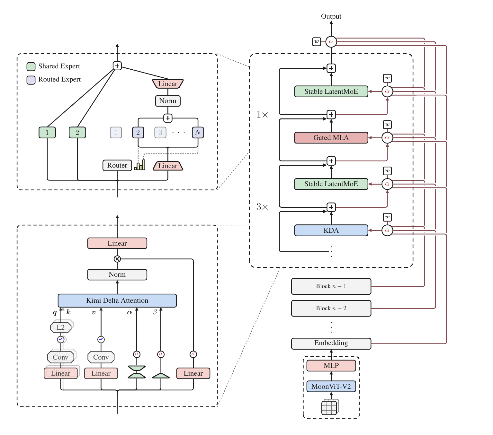
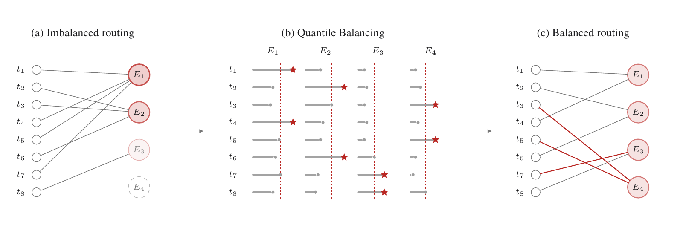
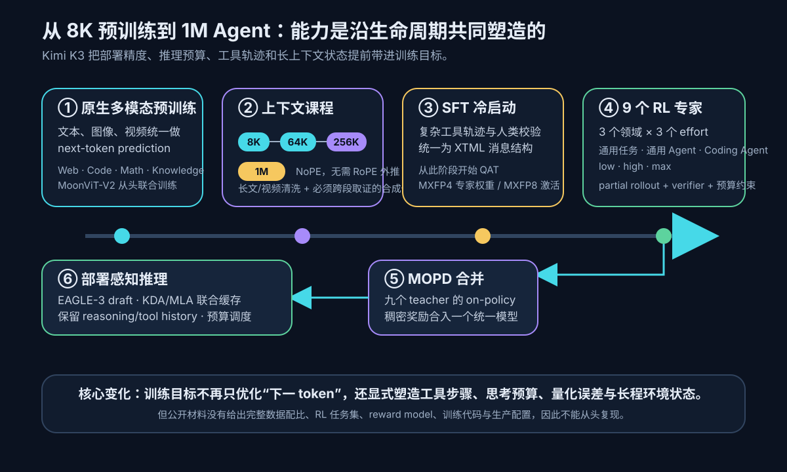
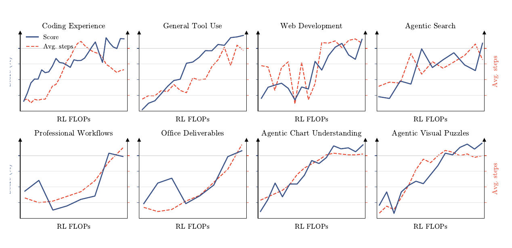
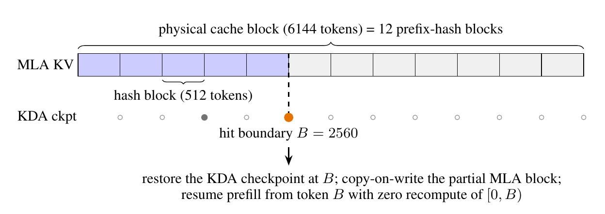
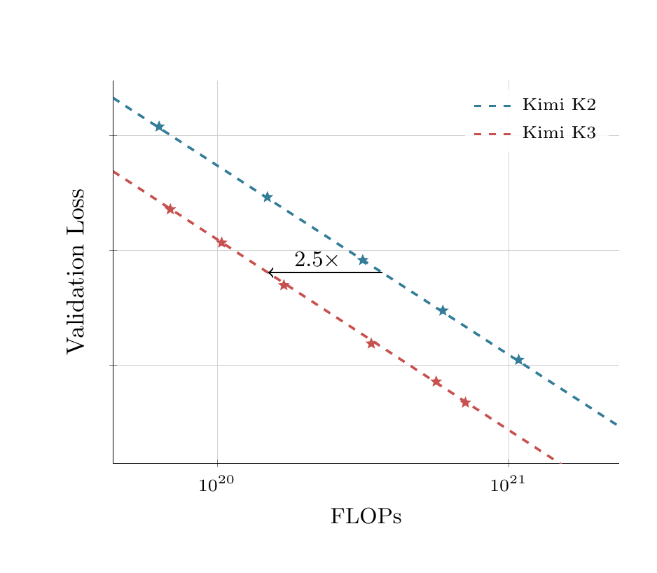

# Kimi K3 核心技术解析：三维信息流、百万上下文与长程 Agent 训练

Kimi K3 最值得理解的，不是“2.8T 参数”“1M 上下文”或某一张榜单，而是一个更完整的工程判断：

> **当模型同时扩大序列长度、网络深度和专家宽度时，旧 Transformer 的三条信息通路会分别碰到成本、可访问性和训练稳定性瓶颈。K3 没有用一个万能技巧解决它们，而是分别改造序列、深度、宽度的信息流，再让预训练、RL 和推理系统共同承担这些新结构带来的代价。**

因此，K3 不是简单的“大 MoE + 线性注意力”。它更像一次从模型结构到生产系统的协同设计：

- 序列方向用 **3× Kimi Delta Attention（KDA）+ 1× Gated MLA**，让大部分 token 通过固定大小的递归状态传递，只周期性付出全局注意力成本；
- 深度方向用 **Attention Residuals（AttnRes）**，让当前层学习“应该读取哪个历史 block”，而非无差别累加所有残差；
- 宽度方向用 **Stable LatentMoE**，把 16-of-896 的专家计算放进较窄潜空间，并用一组稳定化机制约束极稀疏路由；
- 训练和服务方向则从一开始就纳入 **百万上下文、量化、长程 Agent 轨迹、暂停/恢复环境与混合缓存**。

这篇文章回答两个问题：**K3 真正新增了什么？这些增量中，哪些有公开实现或实验证据，哪些仍只是官方报告中的方法描述与厂商自报结果？**

## 阅读路线

- **3 分钟抓主线：**看“任务契约”、三维信息流图和最后的“一周后还应记住什么”。
- **10 分钟懂架构：**阅读 KDA、AttnRes、Stable LatentMoE 三节。
- **20 分钟做技术判断：**继续看后训练、系统闭环、证据审计与开放边界。

## 先建立任务契约：K3 究竟在优化什么

| 维度 | K3 的目标 | 约束 |
|---|---|---|
| 输入 | 文本、图像、视频、工具返回和超长交互历史 | 原生多模态；上下文最长 1,048,576 token |
| 输出 | 自然语言、代码、工具调用、网页与其他 Agent 产物 | 不只回答问题，还要在环境中连续行动 |
| 监督 | 多模态 next-token 预训练 → SFT → 多域多预算 RL → 蒸馏 | 需要同时保留通用、编程和 Agent 能力 |
| 部署 | 数据中心级专家并行、专用 kernel、状态/缓存复用 | 2.8T 总参数、104B 激活参数不能按稠密模型部署 |
| 记忆 | 既要低成本维护长序列，又不能完全失去精确全局检索 | KDA 固定状态与 MLA 增长缓存并存 |

官方给出的主模型规模为：**2.8T 总参数、每 token 激活 104B 参数、93 层、896 个 routed experts、每 token 激活 16 个 routed experts，另有 2 个 shared experts**。注意力层由 69 个 KDA 和 24 个 Gated MLA 组成，视觉编码器 MoonViT-V2 约 401M 参数。

*自绘解释图：K3 的三条信息流及其系统责任。它支持本文的核心判断——架构创新不能与训练、并行和缓存系统分开理解。依据：[Kimi K3 技术报告](https://github.com/MoonshotAI/Kimi-K3/blob/main/k3_tech_report.pdf)、[Kimi-Linear](https://github.com/MoonshotAI/Kimi-Linear) 与 [Attention Residuals](https://github.com/MoonshotAI/Attention-Residuals)。*

## 总体结构：每个新模块都在偿还一种扩展成本

*论文原图 Figure 2。图中可以看见 KDA 与 Gated MLA 的周期性交替、跨层残差注意力，以及潜空间中的稀疏专家路由；它是本文“三维信息流”解释的直接结构证据。来源：[官方技术报告](https://github.com/MoonshotAI/Kimi-K3/blob/main/k3_tech_report.pdf)，仅裁去页面无关内容。*

这张图容易被看成几个新模块的堆叠，但更有用的读法是逐项追问：

1. **序列越长，为什么 KV cache 不能继续线性增长？**
2. **模型越深，为什么最重要的早期表征要经过几十次均匀残差相加才能抵达后层？**
3. **专家越多、路由越稀疏，为什么负载平衡与激活爆炸会迅速恶化？**

K3 的答案分别是 KDA、AttnRes 和 Stable LatentMoE。它们之间不是严格的数学依赖，但在 3T 级、百万上下文模型里构成工程上的互补。

## 序列信息流：KDA 承担记忆，MLA 周期性恢复全局交互

### 旧瓶颈：全局注意力的缓存随上下文增长

标准 causal attention 在自回归推理时必须保留历史 key/value。即使 MLA 已经大幅压缩 KV，缓存仍会随序列长度增长；当上下文来到百万 token，首 token 延迟、显存占用和跨卡通信都会变成一等问题。

KDA 把历史压进一个固定大小的递归状态。技术报告给出的核心更新可写为：

$$
S_t =
\left(I-\beta_t k_tk_t^\top\right)
\operatorname{Diag}(\alpha_t)S_{t-1}
+\beta_t k_tv_t^\top,
$$

$$
o_t=S_t^\top q_t.
$$

更直观地理解：

- $S_{t-1}$ 是已经压缩的历史；
- $\alpha_t$ 控制旧状态按通道衰减；
- $\beta_t$ 控制当前 token 对记忆的写入强度；
- $k_tk_t^\top$ 先针对当前 key 的方向修正旧记忆，再写入 $k_tv_t^\top$；
- 查询 $q_t$ 不再扫描全部历史 KV，而是读取更新后的 $S_t$。

这让 KDA 的推理状态不随上下文线性增长，但也带来根本性的表达损失：**固定状态不可能无损保存任意长历史中的每个细节。**因此 K3 没有采用纯线性注意力，而是让每四个注意力块形成 **3 个 KDA + 1 个 Gated MLA** 的混合节奏。KDA 负责高频、廉价的状态更新；MLA 周期性提供内容相关的全局 token-to-token 交互。

这是 K3 在线性注意力上的第一个关键增量：**不把“固定状态”和“精确全局读取”当成二选一，而是让它们承担不同频率的记忆责任。**

K3 还对 KDA 的衰减门作了两项调整：给衰减设置下界（报告记为 $g_{\min}=-5$），防止有效记忆过快消失；用 full-rank gate 代替表达能力更弱的门控。训练侧则配套 [FlashKDA](https://github.com/MoonshotAI/FlashKDA) kernel 和 KDA Context Parallelism，否则递归状态的扫描与跨卡传递会吞掉理论上的复杂度收益。

### 这一设计解决了什么，没有解决什么

它明显改善的是长序列的**状态规模与并行形态**，并不等于模型因此拥有完美的百万 token 召回。长上下文能力仍依赖：

- MLA 层是否足以找回离散细节；
- 训练数据是否真正要求跨长距离整合；
- 长度课程是否稳定；
- 服务端是否同时命中 KDA 状态和 MLA 缓存；
- Agent 是否保留了需要的 reasoning/tool history。

所以“支持 1M context”是一个模型、数据和服务共同成立的条件句，不是单一架构属性。

## 深度信息流：Attention Residuals 把残差连接变成可检索的历史

标准 Transformer 的残差流可以粗略看成：

$$
h_l=h_{l-1}+F_l(h_{l-1}).
$$

它的优点是简单稳定，缺点是所有历史变换在同一条残差河流中逐层累积。对 93 层模型来说，当前层若真正需要较早 block 的某种表征，只能从已经被多次混合的 $h_{l-1}$ 中恢复。

AttnRes 改写了这条路径：当前层生成一个 pseudo-query，对此前保留的层或 block 表征计算 softmax 权重，再把它们加权合成当前输入。概念上可写为：

$$
\alpha_{l,i}=
\operatorname{softmax}_i(q_l^\top k_i),\qquad
\tilde h_l=\sum_{i<l}\alpha_{l,i}v_i.
$$

它不是给序列 token 再做一次 self-attention，而是**在深度轴上检索历史表征**。这改变了深层网络的归纳偏置：旧残差连接默认“所有历史一律累加”，AttnRes 则允许不同 token、不同层按需选择更早的信息。

完整版本需要保存每一层表征，内存随层数增长。K3 使用 block 版本：**8 个 block，每个 block 12 层**，再加 embedding 表征，共保留 9 份可访问表示。这样把跨层访问的粒度从 layer 降到 block，换取可控的显存和通信成本。

这项技术真正的价值不在“多了一层 attention”，而在于把深度方向从被动传递改为主动路由。不过公开材料仍缺少 K3 规模下的完整隔离实验：我们能看到 [Attention Residuals 独立论文与代码](https://github.com/MoonshotAI/Attention-Residuals)，也能确认 K3 使用了该模块，但无法从公开结果精确回答它独立贡献了多少 benchmark 增益。

## 宽度信息流：Stable LatentMoE 让 896 专家既稀疏又可训练

K3 的 routed experts 数量达到 896，每个 token 只选择 16 个，稀疏度为 56:1；另有 2 个始终激活的 shared experts。单纯扩大专家数会同时放大三个问题：

- 专家计算如果在完整 hidden width 上展开，激活与通信成本过高；
- 极稀疏 top-k 路由容易让少数专家过热、其他专家闲置；
- 深层、大规模训练中的激活值和梯度更容易失控。

Stable LatentMoE 的基本做法是先把 token 从模型宽度投影到 **3584 维潜空间**，在较窄空间中执行 16-of-896 的专家计算，再投影回主干宽度。容量继续增长，但每次激活的专家工作在更便宜的内部表示上。

它并不是只有一个 latent bottleneck，而是把多项稳定化机制绑在一起：

1. **RMSNorm before up-projection：**在回到主干宽度前约束专家输出尺度。
2. **SiTU-GLU：**对门控分支和数值分支设置有界变换，报告给出 $\beta_1=4,\ \beta_2=25$，降低极端激活扩散。
3. **Quantile Balancing（QB）：**根据各专家路由分数的分位数调节路由 bias，使不同专家更接近均匀负载。
4. **Per-head Muon：**对 Q/K/V 的优化器动量按 head 分别做正交化，避免多头参数被统一矩阵操作错误耦合。

*论文原图 Figure 5。左侧是未经平衡的专家分数分布，右侧加入 QB bias 后，不同专家进入 Top-k 的概率更接近；该偏置只影响路由选择，不直接改写专家混合权重，并在推理时冻结。来源：[官方技术报告](https://github.com/MoonshotAI/Kimi-K3/blob/main/k3_tech_report.pdf)，仅裁去页面无关内容。*

QB 的思路比传统“给热门专家加惩罚”更细：它估计的是每个专家分数分布进入 top-k 所需的阈值，再据此平移路由 bias。这样可以在不把辅助负载均衡 loss 强行混入主目标的情况下，修正不同专家天然不同的分数尺度。它解决的是**路由概率偏置**，并不能单独解决专家语义坍缩、跨卡容量或通信拥塞，因此仍需 MoonEP 的部署层配合。

## 原生多模态与上下文课程：不是最后外挂视觉塔

K3 使用约 401M 参数、27 层的 MoonViT-V2，并从预训练起把文本、图像和视频放进同一个 next-token prediction 目标，而不是先训练纯文本主干、后接一个已有视觉编码器。图像经过 2×2 pixel shuffle 压缩视觉 token，最高支持 3584×3584 分辨率；图像和视频共享视觉参数。

官方 Figure 6 报告称，从头训练的 MoonViT-V2 相比 SigLIP 初始化基线具有更低、更平稳的梯度范数。这个结果至少说明“原生多模态”不是只停留在接口层，但它仍是厂商报告中的内部对照，不等同于公开数据和脚本可复现的独立结论。

上下文长度也不是一步拉到 1M：

1. 预训练阶段从 **8K 扩展到 64K**；
2. cooldown 阶段继续从 **256K 扩展到 1M**；
3. 使用 NoPE，因此不需要在长度扩展时处理 RoPE 外推或重缩放；
4. 同时清洗长文本、长视频，并合成必须跨越远距离搜集证据的任务。

这条课程反映了一个重要判断：上下文窗口的“长度”容易改配置，真正困难的是让梯度、数据分布和任务目标都迫使模型使用远端信息。

## 从预训练到 Agent：能力是沿生命周期共同塑造的

*自绘解释图：K3 的训练目标逐步从 next-token prediction 转向工具步骤、思考预算、量化误差与长程环境状态；最下方同时标出当前公开材料无法支持端到端复现。依据：[官方技术报告](https://github.com/MoonshotAI/Kimi-K3/blob/main/k3_tech_report.pdf) §3–5。*

### 预训练公开了方法类别，没有公开完整配方

官方把文本数据分为 Web Text、Code、Mathematics、Knowledge，并描述了规则/分类器过滤、去重、重写以及视觉 caption、图文交错、OCR、感知、视频和 visual coding 数据。优化层面披露 cosine learning rate、1% warmup、0.1 weight decay 等选择。

这些信息足够理解训练哲学，却不足以复现：报告没有给出可审计的完整数据源、各域混合比例、总 token 数、过滤器、去重阈值、训练 checkpoint 和 optimizer state。换句话说，**K3 公开了 recipe 的轮廓，没有公开厨房。**

### 后训练不是“SFT-only”，而是九个 RL 专家再合并

官方技术报告给出的后训练主线是：

1. **SFT 冷启动：**吸收已有 Kimi 专家模型数据，通过自动验证和 HITL 过滤，统一成 XTML 工具消息格式；
2. **九个 RL 专家：**三个任务域——通用任务、通用 Agent、Coding Agent——各自训练 low/high/max 三种 reasoning effort，共 $3\times3=9$ 个策略；
3. **MOPD 合并：**Multi-teacher On-Policy Distillation 把九个 teacher 的行为合入一个统一模型。

长程 Agent RL 的难点并不是最后答案有没有得分，而是一次 rollout 可能包含大量工具步骤、不同预算和可暂停环境。K3 报告的几个方法值得单独记住：

- **Partial rollout：**当一批轨迹中已有比例 $\lambda$ 完成时，先更新模型，未完成轨迹保存后续继续；用 per-token regularization 缓解轨迹陈旧；
- **Reasoning-effort RL：**用预算倍率 $\tau$ 控制 low/high/max 档，超预算轨迹直接记为 -1 reward；
- **Agentic GRM：**用 rubric tournament 选择评分标准，并显式加入 verbosity budget；
- **统一白盒环境：**把 tool schema、system prompt、context management、skills、memories 和 subagents 作为可组合变量，避免只对某一个 harness 过拟合；
- **MOPD：**用各 teacher 的逐 token log-ratio 构成稠密奖励，让 student 在自己的 on-policy 轨迹上吸收多个专家，而不是离线模仿固定样本。

*论文原图 Figure 8。左图对应多项公开与内部评测的平均得分趋势，右图对应 Agent 轨迹平均步数；它支持“更多 RL 计算伴随更强结果和更长轨迹”的方向性判断，但坐标缺少可独立审计的具体数值，不能据此估算收益幅度。来源：[官方技术报告](https://github.com/MoonshotAI/Kimi-K3/blob/main/k3_tech_report.pdf)，仅裁去页面无关内容。*

这里必须特别澄清：Vault 中早期重建的匿名材料《国内大模型蒸馏风波的来龙去脉》曾称“K3 没有 RL、采用 SFT→SFT”。该材料自己已声明没有独立核验；而 K3 官方报告明确记录了上述 SFT→RL experts→MOPD 流程。官方报告也不是内部训练日志或第三方审计，但在现有证据等级下，**“没有 RL”不能再作为已核验事实，至少与公开的一手技术文档直接冲突。**

### QAT 与推测解码：部署约束提前进入训练

K3 从 SFT 到 RL 持续执行 QAT，目标格式为专家权重 MXFP4、激活 MXFP8，并让 rollout 与训练使用相同量化行为。这不是部署后再做一次压缩，而是让策略在强化学习阶段就适应实际推理误差。

推测解码则采用 EAGLE-3 风格 draft model，并微调 MTP 层；报告中的 LK loss 直接面向 speculative acceptance，而非只优化 draft token 的语言模型准确率。两者共同体现同一个原则：**训练目标要包含最终服务时真正决定吞吐和质量的约束。**

## 系统闭环：1M 上下文和 896 专家首先是基础设施问题

如果只读模型公式，会漏掉 K3 最明显的工程增量。三种新信息流都改变了系统形态：

### KDA Context Parallelism：传固定状态，而不是搬不断增长的历史

标准上下文并行通常需要交换分段 KV；KDA 的递归结构允许每个分段先计算可组合的状态转移，再通过 prefix scan 合成全局前缀。跨卡交换的是固定大小的 transition/state fragment，而不是随序列长度增长的完整 KV block。

这使 million-context 训练具备更好的通信上界，但也增加了 kernel、扫描数值稳定性和 KDA/MLA 混合调度的复杂度。

### MoonEP：专家并行必须把动态路由变成可预测的静态形状

MoE 的每个 token 都可能选择不同专家，单纯 all-to-all 容易产生热点 rank。MoonEP 使用动态 redundant experts，把热门专家复制到其他 rank；官方给出的构造保证每个 rank 完全平衡，同时冗余专家数不超过 $E/R$。其目的不是改变模型语义，而是把不可预测的路由负载转化为适合静态 shape、零拷贝通信和专用 kernel 的执行计划。

### AgentENV：长程 RL 需要“可暂停的世界”

Agent rollout 可能等待网页、代码执行或模拟 SaaS 返回。AgentENV 使用 Firecracker microVM 提供暂停、恢复、fork 与 snapshot；报告自报 133 ms checkpoint、49 ms resume、6.5× 内存超配，并累计运行 51,219,741 个 sandbox、覆盖 1,505,678 个镜像。

这些是厂商系统测量，不是本文独立复测。但它们揭示了一个容易忽略的瓶颈：**长程 Agent RL 的稀缺资源不只是 GPU FLOPs，还包括可以大规模保存、恢复和验证的环境状态。**

### 混合缓存：KDA state 和 MLA KV 必须在同一边界同时命中

*论文原图 Figure 12。它显示 KDA state、稀疏 KDA checkpoints 与 MLA KV pages 如何共同参与前缀复用；只有二者在同一 prefix boundary 都存在，缓存命中才有效。来源：[官方技术报告](https://github.com/MoonshotAI/Kimi-K3/blob/main/k3_tech_report.pdf)，仅裁去页面无关内容。*

KDA 的固定状态不能取代所有 MLA KV，因此 K3 服务端维护联合缓存：较细的逻辑 hash block 映射到更大的物理块，KDA 状态只在稀疏边界保留；需要时从最近 checkpoint replay。推测解码也必须重放 KDA 状态，不能只追加候选 token 的 KV。

这说明 KDA 的真实收益不是“KV cache 消失”，而是**大部分层从增长型缓存变成固定状态，少部分 MLA 层继续为精确全局访问付费**。缓存协议因此比纯 attention 模型更复杂。

## 证据审计：哪些亮点已经站得住，哪些仍需保留判断

*论文原图 Figure 7。曲线支持“组合配方相对 K2 发生整体 scaling-law 位移”的厂商结论；但图中没有可独立读取的实际 validation loss 数值，也没有把架构、数据和训练改动逐项隔离，因此不能把 2.5× 归因给某一个模块。来源：[官方技术报告](https://github.com/MoonshotAI/Kimi-K3/blob/main/k3_tech_report.pdf)，仅裁去页面无关内容。*

官方称 K3 相比 K2 获得 **2.5× scaling efficiency**。这个表述应精确理解为：在报告内部的 aggregate scaling-law 对照中，K3 的整套配方以更少训练计算达到相似 loss。它不是“推理便宜 2.5×”，也不是“KDA 单独提升 2.5×”。

| 主张 | 当前最强公开证据 | 能说明什么 | 不能说明什么 |
|---|---|---|---|
| 三维信息流确实进入 K3 | 官方结构图、配置与建模代码、组件仓库 | 结构存在且可检查 | 各模块在 K3 规模的独立增益 |
| KDA/MLA 适合长上下文 | 递推公式、kernel/KCP 设计、联合缓存方案 | 状态规模与系统路径成立 | 任意 1M 输入都能稳定召回 |
| Stable LatentMoE 可训练 | QB 图、稳定化配方、专家并行方案 | 极稀疏路由有成套约束 | 896 专家是否都学到互补语义 |
| 综合配方效率更高 | Figure 7 内部 scaling-law | 组合方案存在方向性改善 | 2.5× 的外部复测与因果分解 |
| RL 提升并延长轨迹 | Figure 8 趋势与方法描述 | 训练计算、分数和步数同向变化 | 每个任务的具体收益、奖励偏差 |
| Agent benchmark 较强 | 官方评测表与模型卡 | 在指定 harness 上的能力边界 | 跨 harness、硬件和 fallback 的纯模型比较 |

官方评测表也不应被直接当作模型能力排行榜。不同项目使用 Kimi Code、Claude Code 或 Codex 等不同 harness，部分测试使用 H20、部分使用 H100，还存在 fallback、guard 与上下文管理差异。对 Agent 模型而言，harness 本来就是能力的一部分；但若问题是“哪个 base model 更强”，这些差异会构成混杂变量。

报告自身也承认 K3 在 Humanity's Last Exam、CritPt、research reasoning 以及某些 agent/cyber hard targets 上仍弱于最佳闭源系统。技术亮点与能力边界可以同时成立。

## 开放程度：开源权重不等于完整公开训练技术

K3 不是只有 API。官方在 Hugging Face 发布了约 **1.56 TB** 的分片权重、配置、tokenizer/processor 以及 `modeling_kimi_k3.py`、`modeling_kimi_linear.py` 等推理/建模代码；Kimi-Linear、Attention Residuals、MoonEP、FlashKDA、AgentENV 等组件也分别开源。这比只发模型卡或 API 的透明度高得多。

但“能下载权重”和“能从头复现模型”是两件事：

| 层级 | K3 的公开程度 | 判断 |
|---|---|---|
| 最终权重 | 已公开，约 1.56 TB | **是** |
| 架构配置与推理建模代码 | Hugging Face 仓库可检查 | **基本公开** |
| 单项算法/系统组件 | Kimi-Linear、AttnRes、MoonEP、FlashKDA、AgentENV 等独立仓库 | **部分公开** |
| 预训练方法 | 数据类别、部分超参数、长度课程和并行思路 | **方法级披露** |
| 后训练方法 | SFT、九个 RL 专家、MOPD、QAT、环境设计 | **方法级披露** |
| 完整数据与比例 | 未给出完整语料清单、token 数、domain mix、过滤/去重阈值 | **未公开** |
| 奖励与任务资产 | 未给出 RL 任务全集、reward model 权重、verifier 细节 | **未公开** |
| 端到端训练代码与状态 | 未给出完整 pipeline、生产配置、optimizer state 与中间 checkpoint | **未公开** |
| 精确复现 | 现有材料不足以从头得到同一模型 | **不能** |

许可证也不是 Apache-2.0 或 MIT。Kimi K3 使用自定义模型许可证：部分超大规模产品或 MaaS 商业使用需要附加协议或品牌展示，内部使用有不同豁免条件。使用权重前应直接检查[官方许可证](https://github.com/MoonshotAI/Kimi-K3/blob/main/LICENSE)，不能把“open weights”自动等同于无条件开源软件。

所以最准确的描述是：

> **Kimi K3 是公开权重、公开核心架构与一批关键组件的模型，但不是公开完整数据、训练流水线与生产配置的可复现开源训练项目。**

## 一周后还应该记住什么

1. **三条信息流：**KDA/MLA 管序列，AttnRes 管深度，Stable LatentMoE 管宽度。
2. **混合而非纯线性：**KDA 用固定状态压缩历史，MLA 周期性保留精确全局交互；1M 上下文并不意味着无损记忆。
3. **稳定化是一等设计：**896 专家的亮点不只是数量，而是 latent space、RMSNorm、SiTU-GLU、QB、Per-head Muon 与 MoonEP 的整套约束。
4. **后训练不是 SFT-only：**官方披露的是九个 RL 专家，再通过 MOPD 合并到一个统一模型。
5. **系统就是模型的一部分：**KCP、混合缓存、AgentENV、QAT 和推测解码决定新架构能否真正训练和服务。
6. **证据有边界：**2.5× scaling efficiency 与 RL 曲线是厂商内部证据；公开材料还不能做端到端复现或完整因果归因。

## 一手资料

- Moonshot AI：[Kimi K3 官方仓库与模型卡](https://github.com/MoonshotAI/Kimi-K3)
- Moonshot AI：[Kimi K3 技术报告](https://github.com/MoonshotAI/Kimi-K3/blob/main/k3_tech_report.pdf)
- Hugging Face：[Kimi K3 权重、配置与 modeling code](https://huggingface.co/moonshotai/Kimi-K3/tree/main)
- Moonshot AI：[Kimi-Linear](https://github.com/MoonshotAI/Kimi-Linear)
- Moonshot AI：[Attention Residuals](https://github.com/MoonshotAI/Attention-Residuals)
- Moonshot AI：[MoonEP](https://github.com/MoonshotAI/MoonEP)
- Moonshot AI：[FlashKDA](https://github.com/MoonshotAI/FlashKDA)
- kvcache-ai：[AgentENV](https://github.com/kvcache-ai/AgentENV)

## 研究口径

本文以 2026-07-28 可访问的一手材料为准。模型规模、训练流程和内部系统数字来自官方技术报告；“意义”“责任转移”“系统闭环”等表述是基于公开机制的解释性判断。凡是缺乏独立复测、完整数值坐标或隔离实验的结论，正文均按厂商自报或方向性证据处理。
