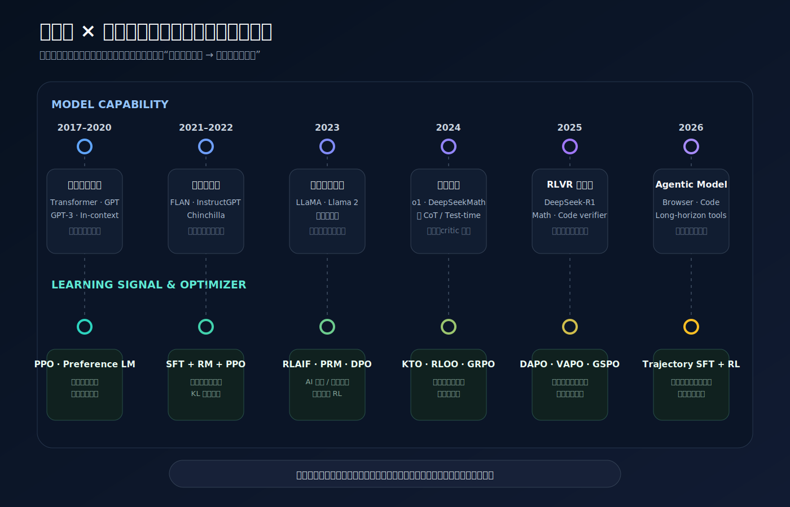
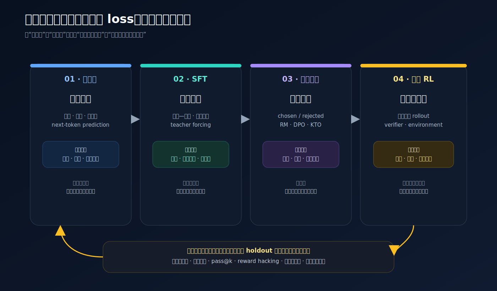
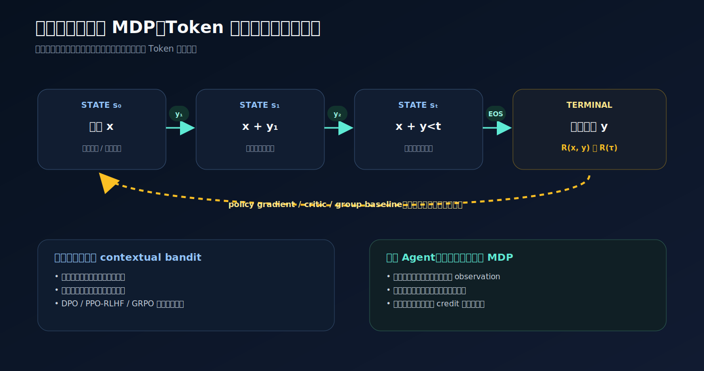
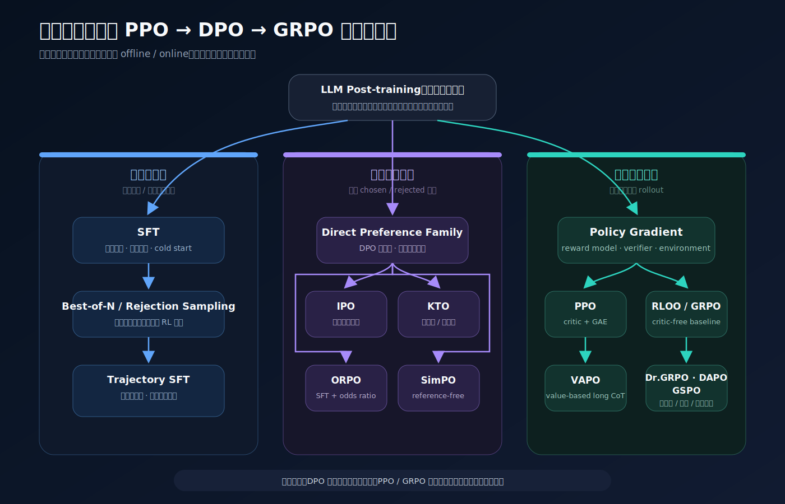
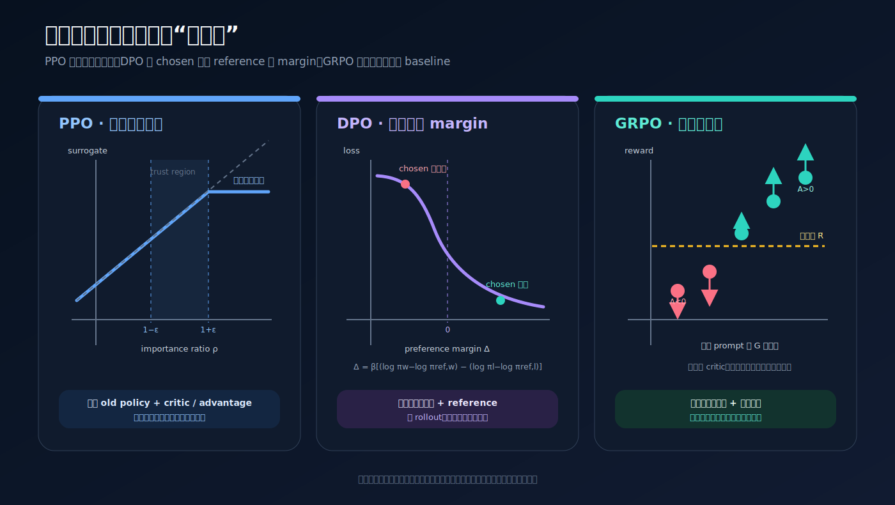
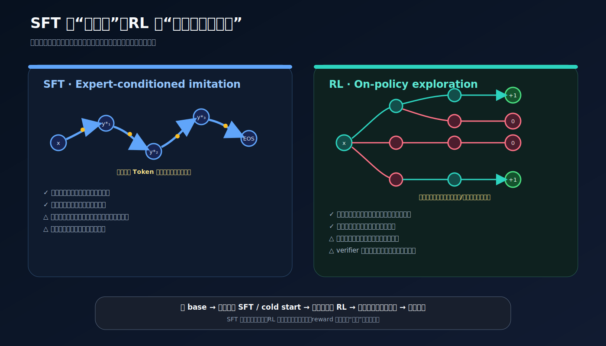

# 大模型与强化学习的协同演进：从 SFT、PPO 到 DPO、GRPO 与 Agentic RL

> 大模型与强化学习并不是两条后来偶然相交的时间线。预训练把“可能会做什么”压进参数，SFT 把这些潜在能力组织成可调用的接口，偏好学习决定“哪种回答更合适”，在线 RL 则让模型在自己的采样分布里持续试错。PPO、DPO、GRPO 的更替，实质上是反馈形态、模型规模、任务可验证性和训练成本一起变化的结果。

截至 **2026-07-16**，如果只把后训练历史概括成“PPO 被 DPO 替代，DPO 又被 GRPO 替代”，几乎一定会理解错。三个算法并不是同一个旋钮的连续版本：

- **PPO** 是带 actor、critic 和旧策略约束的在线策略梯度方法，解决“怎样稳定地用模型自己生成的新样本优化期望奖励”；
- **DPO** 从 KL 正则化 RLHF 推导出一个离线成对分类损失，解决“已有偏好对时，怎样绕过独立奖励模型和在线 RL”；
- **GRPO** 是 PPO 的 critic-free 分支，用同一道题的多条回答互相构造 baseline，解决“可验证推理任务里，critic 太贵、终局奖励稀疏，但可以并行采样很多答案”的问题。

所以，算法选择不应从名字出发，而应从四个问题出发：

1. 需要注入的是新知识、标准行为，还是只需要在已有行为中做选择？
2. 反馈是标准答案、成对偏好、标量奖励，还是可交互环境中的延迟回报？
3. 数据是固定的离线数据，还是允许当前策略持续 rollout？
4. 奖励能否被可靠验证，信用应该分配到整段回答、推理步骤，还是多轮工具轨迹？



*图 1：LLM 与 RL 的双时间线。算法并非按年份互相淘汰；模型规模、反馈成本、任务可验证性和轨迹长度共同决定哪类方法成为当时的主线。作者绘制。*

# 一、先把大模型训练拆成四层

一切生成式大模型都可以写成自回归策略：

$$
\pi_\theta(y\mid x)=\prod_{t=1}^{T}\pi_\theta(y_t\mid x,y_{<t})
$$

但同一个概率模型，在不同训练阶段承担的责任完全不同。

| 层次 | 典型目标 | 主要数据 | 真正在学什么 | 不擅长什么 |
|---|---|---|---|---|
| 预训练 / 持续预训练 | next-token prediction | 海量文本、代码、多模态数据 | 知识、语言、表征、广泛技能先验 | 精确服从用户意图、稳定输出格式 |
| SFT / instruction tuning | 模仿目标回答 | 指令—答案、专家轨迹、工具调用示范 | 任务接口、格式、风格、标准解法与新知识 | 比较多个可行答案、从自己犯的错中学习 |
| 偏好优化 | 提高 preferred、压低 rejected | 人类/AI 偏好、好坏标签 | 有用性、安全性、表达偏好、回答排序 | 超出固定数据分布持续探索 |
| 在线 RL / 环境 RL | 最大化 rollout 回报 | 当前策略采样、验证器、工具或环境反馈 | 搜索策略、长程决策、奖励下的行为重分配 | 在没有可靠奖励时凭空创造正确目标 |



*图 2：预训练、SFT、偏好优化和在线 RL 的责任边界。它们不是四种互斥方案，而是从能力、接口、价值排序到探索逐层叠加。作者绘制。*

这四层不是互斥的。一个现代模型可能先做通用预训练，再做领域持续预训练、通用 SFT、长思维链 SFT、偏好优化、可验证奖励 RL，最后再做安全对齐。真正重要的是：**每一阶段必须承担它最适合的学习责任。**

## 1.1 把语言模型写成强化学习问题

给定提示 $x$，生成到第 $t$ 个 Token 时：

- 状态 $s_t=(x,y_{<t})$；
- 动作 $a_t=y_t$；
- 环境转移是把新 Token 拼回上下文；
- 策略是 $\pi_\theta(a_t\mid s_t)$；
- 大部分任务只在回答结束时得到奖励 $R(x,y)$。



*图 3：语言模型的 Token 级 MDP。单轮问答更接近终局奖励的 contextual bandit；工具调用会引入外部 observation，形成真正改变环境的长程 MDP。作者绘制。*

如果只有一次提示和一次完整回答，它在任务层面很像 **contextual bandit**；从 Token 生成看，又是一个稀疏终局奖励的长序列决策过程。进入工具调用和多轮 Agent 后，环境会真正改变，状态不再只是模型自己写出的前缀，此时 MDP 的含义才更完整。

现代 LLM RL 的公共母目标通常是：

$$
\max_\theta\ \mathbb{E}_{x\sim D,\,y\sim\pi_\theta(\cdot\mid x)}
\left[R(x,y)-\beta\log\frac{\pi_\theta(y\mid x)}{\pi_{\mathrm{ref}}(y\mid x)}\right]
$$

第一项把概率推向高奖励回答，第二项限制模型不要离参考策略太远。$\beta$ 太大，模型几乎不学习；$\beta$ 太小，模型容易奖励黑客、语言退化或遗忘原能力。后面看似不同的 PPO、DPO、GRPO，大多都可以放回这个目标中理解。

# 二、两条时间线是怎样咬合起来的

## 2.1 2017—2020：先有可扩展的生成策略，再谈偏好优化

[Transformer](https://arxiv.org/abs/1706.03762) 在 2017 年提供了可并行扩展的序列建模骨架；同年的 [PPO](https://arxiv.org/abs/1707.06347) 则是为 Atari、机器人控制等通用 RL 场景提出的策略优化算法。它不是因大模型而生，只是后来恰好适合稳定微调一个高维生成策略。

2018 年，[GPT-1](https://cdn.openai.com/research-covers/language-unsupervised/language_understanding_paper.pdf) 确立“生成式预训练 + 任务微调”；2020 年，[GPT-3](https://arxiv.org/abs/2005.14165) 用规模化预训练展示 in-context learning。模型已经会生成大量看似合理的内容，但“在互联网上预测下一个词”与“按照用户意图给出有帮助、诚实且安全的回答”不是同一个目标。

这时 RL 的入口出现了：有些质量标准很难写成唯一标准答案，却可以让人比较两个回答。2019 年的 [Fine-Tuning Language Models from Human Preferences](https://arxiv.org/abs/1909.08593) 已经把人类比较训练成奖励模型，再用 RL 优化语言模型；2020 年的摘要偏好工作进一步验证了这条路线。

对应关系是：

> **预训练扩大了策略空间，人类偏好提供了 next-token loss 没有表达的方向，PPO 负责在这个巨大策略空间里谨慎移动。**

## 2.2 2021—2022：从“会续写”到“会当助手”，SFT + RM + PPO 定型

规模继续扩大后，瓶颈从“语言是否流畅”转向“模型是否理解指令与人类意图”。[FLAN](https://arxiv.org/abs/2210.11416) 等 instruction tuning 工作证明，把许多任务统一写成自然语言指令做 SFT，可以显著改善未见任务上的可用性。[Chinchilla](https://arxiv.org/abs/2203.15556) 又说明，在固定计算量下不能只堆参数，训练 Token 数也必须同步扩展。更强的 base model 为后训练提供了更宽的能力底座。

[InstructGPT](https://arxiv.org/abs/2203.02155) 把产业界熟悉的三阶段 RLHF 管线明确下来：

1. 人类写高质量回答，做 SFT；
2. 对同一提示采样多个回答，人类排序，训练奖励模型 RM；
3. 从 SFT 模型初始化策略，用 PPO 最大化 RM 分数，并对偏离 SFT 参考模型施加 KL 惩罚。

其后训练目标还混入预训练梯度，形成 PPO-ptx，以减轻部分通用能力回退：

$$
\mathbb{E}[R_\phi(x,y)-\beta\operatorname{KL}(\pi_\theta\|\pi_{\mathrm{SFT}})]
+\gamma\,\mathbb{E}_{z\sim D_{\mathrm{pretrain}}}\log\pi_\theta(z)
$$

[Helpful and Harmless Assistant](https://arxiv.org/abs/2204.05862) 还展示了迭代式在线数据闭环：策略升级后重新采样，再收集新偏好、更新奖励模型和策略。RLHF 从一次性训练步骤变成持续的数据飞轮。

这一阶段的根本变化不是 PPO 突然变强，而是三种基础设施成熟了：

- 足够强的预训练模型，能生成有比较价值的候选；
- 成规模的人类示范与偏好标注；
- 同时承载 policy、reference、reward model、value model 的分布式训练系统。

## 2.3 2022—2023：人类反馈太贵，RLAIF、过程监督与拒绝采样分流

人类偏好的带宽很快成为瓶颈。[Constitutional AI](https://arxiv.org/abs/2212.08073) 让模型依据一组原则自我批评、修订，再由 AI 比较候选回答并训练偏好模型，形成 RLAIF。变化的主要是**反馈来源**，后端仍可以使用奖励模型和在线 RL。

与此同时，推理任务暴露出“只看最终答案”与“监督每一步”的差异：[Let's Verify Step by Step](https://cdn.openai.com/improving-mathematical-reasoning-with-process-supervision/Lets_Verify_Step_by_Step.pdf) 区分了：

- Outcome Reward Model（ORM）：只判断最终结果；
- Process Reward Model（PRM）：逐步判断中间推理是否正确。

PRM 信号密、信用分配好，也更容易发现“过程错但碰巧答对”；代价是步骤标注昂贵，且过强地监督可见推理可能把模型推向标注者偏爱的固定写法。ORM 或规则验证器便宜、客观，但更容易奖励钻空子的错误过程。

[Llama 2](https://arxiv.org/abs/2307.09288) 的公开技术报告则显示，真实后训练并不必在 PPO 与监督学习之间二选一：它结合 SFT、迭代奖励建模、rejection sampling 和 PPO。先从多个候选中挑最好答案回训，再做在线策略优化，是至今仍然有效的强基线。

## 2.4 2023：开放模型普及，DPO 回答“能不能不养四个模型”

[LLaMA](https://arxiv.org/abs/2302.13971) 等开放权重模型把后训练扩散到更多团队，但经典 PPO-RLHF 往往同时需要：

1. 当前 policy；
2. 冻结 reference policy；
3. reward model；
4. value/critic model。

再加上在线生成、KV cache 和跨模型调度，工程成本远高于普通 SFT。[RRHF](https://arxiv.org/abs/2304.05302) 等工作先尝试直接学习候选排序；[DPO](https://arxiv.org/abs/2305.18290) 则给出最有影响力的答案：在特定的 Bradley–Terry 偏好模型和 KL 正则化 RLHF 假设下，可以消掉显式奖励模型，直接用 chosen/rejected 对训练 policy。

DPO 的成功对应了当时的大模型生态：

- 大量团队拿得到 7B–70B 开放模型，却没有 PPO 集群；
- 社区容易共享固定偏好数据集；
- 单轮对话的 helpfulness/style 可以用成对比较表达；
- 大家需要一个像交叉熵一样稳定、可用 LoRA 训练的对齐目标。

因此 DPO 并非“比 PPO 更新的 RL 算法”，而是**把在线 RL 问题压缩为离线偏好分类问题**。它省掉了 rollout、RM 和 critic，也失去了根据当前策略分布持续探索与补数的能力。

## 2.5 2024：偏好优化百花齐放，但真正的转折是可验证推理

DPO 之后出现许多直接偏好优化变体，名字很多，但主要只在解决几类具体问题：

| 方法 | 需要的数据 | 主要修改 | 适合解决的问题 |
|---|---|---|---|
| DPO | $(x,y_w,y_l)$ 成对偏好 | policy 相对 reference 的隐式奖励差 | 标准离线偏好对齐 |
| [IPO](https://arxiv.org/abs/2310.12036) | 成对偏好 | 改变偏好拟合目标，减轻 DPO 对确定性偏好的过拟合 | 标签有噪声、偏好强度有限 |
| [KTO](https://arxiv.org/abs/2402.01306) | 单条 desirable / undesirable | 基于前景理论式效用，不要求严格成对 | 只有点赞/点踩等二元反馈 |
| [ORPO](https://arxiv.org/abs/2403.07691) | 成对偏好 | 把 chosen 的 SFT 与 chosen/rejected odds ratio 合成一次训练 | 希望 SFT 与偏好阶段合并 |
| [SimPO](https://arxiv.org/abs/2405.14734) | 成对偏好 | 用平均序列 log-prob 作为隐式奖励，去掉 reference，并加目标 margin | 显存紧、希望 reference-free |
| [RLOO](https://arxiv.org/abs/2402.14740) | 在线 rollout + 标量奖励 | REINFORCE + leave-one-out baseline | 想保留在线 RL，又不想训练 critic |

KTO、ORPO、SimPO 不能简单看成“DPO 2.0/3.0”。它们是在改变数据要求、reference 成本、长度偏置和训练阶段组织方式。

更大的范式转折来自推理模型。数学和代码具备天然验证器：最终答案可以做 exact match，程序可以编译和跑测试，形式证明可以交给 proof checker。这类反馈不必让人逐条打分，噪声远小于“这段话是否更有帮助”。2024 年的 [DeepSeekMath](https://arxiv.org/abs/2402.03300) 提出 GRPO；同年 [OpenAI o1](https://openai.com/index/learning-to-reason-with-llms/) 公开展示性能同时随 train-time RL compute 与 test-time thinking compute 提升，但没有披露具体策略优化算法，因此**不能把 o1 写成使用 GRPO**。

这一代变化可以概括为：

> RL 的主要角色从“让聊天回答更讨人喜欢”，扩展成“让模型在可验证问题上分配更多计算、搜索更长轨迹、学会检查与改路”。

## 2.6 2025：DeepSeek-R1 把 RLVR 公开化，GRPO 开始暴露工程偏差

[DeepSeek-R1](https://arxiv.org/abs/2501.12948) 提供了两个关键对照：

- R1-Zero 直接从 base model 做大规模 RL，没有先做 SFT，出现自我检查、反思和更长推理，但也出现语言混杂与可读性问题；
- R1 使用少量 cold-start 长 CoT 数据起步，再做推理 RL、rejection sampling + SFT 和面向全场景的第二阶段 RL。

这恰好说明 SFT 与 RL 的分工：**纯 RL 可以把正确率推起来，却不保证人类可读、语言一致和产品形态；SFT 能快速规定接口与先验，RL 再在这个行为流形上搜索。**

GRPO 成为开源 reasoning RL 的默认起点后，问题也更具体：组内全对或全错时优势为零；按回答长度平均 Token loss 会引入长度偏置；截断样本、稀疏奖励、旧策略漂移和 MoE 路由都会让训练失稳。于是出现一批针对性分支：

| 方法 | 它真正修了什么 | 仍然依赖什么 |
|---|---|---|
| [Dr. GRPO](https://arxiv.org/abs/2503.20783) | 去掉 response-length 与组内 reward-std 归一化，修复回答长度和题目难度偏置 | 组内采样和可区分奖励 |
| [DAPO](https://arxiv.org/abs/2503.14476) | 非对称 clip、动态采样、Token 级 loss 聚合、超长样本软惩罚 | critic-free 的组相对优势 |
| [VAPO](https://arxiv.org/abs/2504.05118) | 回到 value-based PPO，针对 value bias、长短序列混合和稀疏奖励做稳定化 | 额外 value model 和更复杂系统 |
| [ProRL](https://arxiv.org/abs/2505.24864) | 延长 RL、重置 reference、扩大任务多样性，以维持探索和突破能力边界 | 高质量任务分布与更长训练预算 |
| [GSPO](https://arxiv.org/abs/2507.18071) | 把 importance ratio 和 clipping 从 Token 级提升到长度归一化的序列级，改善 MoE RL 稳定性 | 序列级奖励与同题多采样 |

这不是“GRPO 后每月一个新缩写”，而是 reasoning RL 进入了误差分析阶段：研究者不再只问“RL 能否涨分”，而是问**梯度究竟偏向长度、熵、格式还是正确策略，提升是否能跨题、跨模型、跨采样预算保留**。

## 2.7 2025—2026：从单轮答案进入 Agentic RL

当模型开始搜索网页、写代码、操作终端和调用工具时，一条轨迹变成：

$$
\tau=(s_0,a_0,o_1,a_1,o_2,\ldots,a_T),\qquad R=R(\tau)
$$

工具返回会改变环境，早期错误可能几十步后才显现，单轮 GRPO 的“同一题采样几个文本答案”不再充分。训练需要处理：

- 多轮状态和工具 observation；
- 轨迹级、步骤级和安全约束的多重奖励；
- 失败轨迹中的信用分配；
- 超长 rollout 的推理成本与异步执行；
- 随模型能力变化而变化的任务难度与 verifier；
- 环境污染、投机调用、越权和 reward hacking。

[OpenAI deep research](https://openai.com/index/introducing-deep-research/) 公开说明，它使用与 o1 同源的 RL 方法在真实浏览器与 Python 工具任务上训练。到 2026 年，代表性开放工作如 [KLong](https://arxiv.org/abs/2602.17547) 已开始组合“轨迹切分 SFT + 逐步延长 timeout 的 progressive RL”。这不是一个已经统一的标准算法，而是下一阶段的方向：**先用 SFT 教会动作语法和基本轨迹，再让 RL 在真实环境反馈下学习预算分配、恢复、验证与长程策略。**

## 2.8 从 REINFORCE 到 GRPO：算法谱系并不是凭空跳出来的

如果只从大模型论文开始读，会误以为 PPO、GRPO 是一组专门为文本设计的新损失。它们实际共享同一个 policy gradient 根：

$$
\nabla_\theta J(\theta)
=\mathbb{E}_{\tau\sim\pi_\theta}
\left[\sum_t \nabla_\theta\log\pi_\theta(a_t\mid s_t)\,\hat A_t\right]
$$

其中 $\hat A_t$ 回答的是：“这个动作比当前状态下的通常水平好多少？”算法演进很大程度上就是在改进这个 baseline，并限制一次更新不要把策略推得太远。

| 算法脉络 | 优势 / baseline 从哪里来 | 怎样限制策略更新 | 在 LLM 中的意义 |
|---|---|---|---|
| REINFORCE | 整条 Monte Carlo return，可减去常数或移动平均 | 通常没有显式 trust region | 实现简单但方差大；RLOO 又回到这条路线 |
| Actor-Critic | 学习 $V_\psi(s_t)$ 或 $Q_\psi(s_t,a_t)$ | 取决于具体算法 | 用 critic 做逐状态信用分配 |
| [GAE](https://arxiv.org/abs/1506.02438) | 多步 TD residual 的指数加权 | 本身不是 trust region | PPO 中平衡 advantage 的 bias / variance |
| [TRPO](https://arxiv.org/abs/1502.05477) | 常与 critic / GAE 组合 | 显式约束新旧策略的 KL，需二阶近似 | 理论清楚但对大模型过重 |
| PPO | critic / GAE | 一阶优化 + ratio clipping | 经典 RLHF 的稳定工程折中 |
| RLOO | 同一输入多条 rollout 的 leave-one-out 平均奖励 | 常配 KL 或 clipping | 去掉 critic，保留在线采样 |
| GRPO | 同题整组奖励的均值 / 标准差 | PPO 式 token ratio clipping | 为可验证推理定制的 critic-free 近端更新 |
| DAPO / Dr. GRPO / GSPO | 仍以组相对信号为主 | 改变归一化、采样、聚合或 clipping 单位 | 修复长 CoT 与 MoE 规模化后的具体偏差 |

RLOO 与 GRPO 的关系尤其容易混淆。若第 $i$ 条回答用其余 $G-1$ 条的平均奖励作 baseline：

$$
b_i=\frac{1}{G-1}\sum_{j\ne i}R_j,\qquad \hat A_i=R_i-b_i
$$

这就是 leave-one-out；GRPO 则通常用全组均值并做组内标准差归一化，再套 PPO clipping。两者都不训练 critic，但方差、偏差、更新约束和实现细节不同。



*图 4：按数据来源重排算法族谱。DPO、KTO、ORPO、SimPO 属于固定数据上的直接偏好优化；PPO、RLOO、GRPO 及其后续分支消费当前策略 rollout；SFT 与 rejection sampling 则构成重要的非 RL 基线。作者绘制。*

# 三、PPO：为什么经典 RLHF 需要四个模型

## 3.1 先训练奖励模型

给同一提示 $x$ 的 preferred response $y_w$ 和 rejected response $y_l$，常用 Bradley–Terry 模型表示偏好概率：

$$
P(y_w\succ y_l\mid x)=\sigma\left(r_\phi(x,y_w)-r_\phi(x,y_l)\right)
$$

奖励模型损失为：

$$
\mathcal{L}_{\mathrm{RM}}
=-\mathbb{E}\log\sigma\left(r_\phi(x,y_w)-r_\phi(x,y_l)\right)
$$

最小 PyTorch 实现：

```python
import torch.nn.functional as F

def reward_model_loss(chosen_reward, rejected_reward):
    """chosen_reward/rejected_reward: [batch]"""
    return -F.logsigmoid(chosen_reward - rejected_reward).mean()
```

奖励模型只保证排序差，不天然校准绝对分数。它还可能学到长度、排版、礼貌套话等标注捷径。后续策略越用力优化代理奖励，越可能触发 Goodhart 定律。[Reward Model Overoptimization](https://arxiv.org/abs/2210.10760) 的实验说明，proxy reward 持续上升时，真实目标可能先升后降；所以 KL、early stopping、独立评测和对抗性红队不是可选附件。

## 3.2 PPO 的 clipped surrogate

策略先用旧参数 $\theta_{\mathrm{old}}$ 采样，更新时计算每个 Token 的 importance ratio：

$$
\rho_t(\theta)=
\frac{\pi_\theta(a_t\mid s_t)}
{\pi_{\theta_{\mathrm{old}}}(a_t\mid s_t)}
=\exp\left(\log\pi_\theta-\log\pi_{\mathrm{old}}\right)
$$

PPO-Clip 的策略目标为：

$$
\mathcal{L}_{\mathrm{PPO}}
=-\mathbb{E}_t\left[
\min\left(
\rho_t\hat A_t,
\operatorname{clip}(\rho_t,1-\epsilon,1+\epsilon)\hat A_t
\right)
\right]
$$

critic $V_\psi(s_t)$ 预测未来回报，常用 GAE 构造优势：

$$
\delta_t=r_t+\gamma V(s_{t+1})-V(s_t),\qquad
\hat A_t=\sum_{l\ge 0}(\gamma\lambda)^l\delta_{t+l}
$$

PPO 核心代码并不长：

```python
import torch

def masked_mean(x, mask, eps=1e-8):
    return (x * mask).sum() / mask.sum().clamp_min(eps)

def ppo_policy_loss(new_logp, old_logp, advantage, mask, eps=0.2):
    """All tensors are [batch, response_tokens]."""
    advantage = advantage.detach()
    log_ratio = new_logp - old_logp
    ratio = log_ratio.exp()
    unclipped = ratio * advantage
    clipped = ratio.clamp(1.0 - eps, 1.0 + eps) * advantage
    return -masked_mean(torch.minimum(unclipped, clipped), mask)

def value_loss(value, old_value, returns, mask, eps=0.2):
    value_clipped = old_value + (value - old_value).clamp(-eps, eps)
    loss_1 = (value - returns).square()
    loss_2 = (value_clipped - returns).square()
    return 0.5 * masked_mean(torch.maximum(loss_1, loss_2), mask)
```

LLM RLHF 通常把终局 RM 分数放在最后一个 Token，同时加入逐 Token 的采样 KL 惩罚：

```python
def shaped_token_rewards(policy_logp, ref_logp, terminal_score, mask, beta):
    """Inputs contain response positions only; responses are right-padded."""
    # sampled approximation of -beta * KL(policy || reference)
    rewards = -beta * (policy_logp - ref_logp) * mask
    last_index = mask.sum(dim=-1).long() - 1
    batch_index = torch.arange(mask.size(0), device=mask.device)
    rewards[batch_index, last_index] += terminal_score
    return rewards
```

真正困难的是代码之外的系统：同步采样策略和训练策略、避免 stale rollouts、正确 mask prompt/padding/EOS、白化 advantage、控制 KL、平衡 policy/value loss、调度四个模型，以及持续监控 entropy、clip fraction、response length 和 reward hacking。

## 3.3 PPO 什么时候仍然是正确选择

PPO 没有被 DPO 或 GRPO 淘汰。下列条件下，critic 的成本可能是值得的：

- 奖励不只在序列末尾，而是多轮环境中逐步到来；
- 同一 prompt 无法廉价采样足够大的 group；
- 轨迹长度差异大，需要状态相关 value 做信用分配；
- 希望让当前策略持续探索、收集新型失败并更新奖励模型；
- 多个奖励与约束需要更精细的 advantage estimation。

# 四、DPO：怎样从 RLHF 目标消掉奖励模型

## 4.1 闭式最优策略

对固定提示 $x$，KL 正则化奖励最大化的最优策略满足：

$$
\pi^*(y\mid x)
=\frac{1}{Z(x)}\pi_{\mathrm{ref}}(y\mid x)
\exp\left(\frac{1}{\beta}r^*(x,y)\right)
$$

反解奖励：

$$
r^*(x,y)
=\beta\log\frac{\pi^*(y\mid x)}{\pi_{\mathrm{ref}}(y\mid x)}
+\beta\log Z(x)
$$

把它代回 Bradley–Terry 偏好概率，同一 $x$ 下的 $\log Z(x)$ 在 chosen/rejected 差分中消掉。于是 DPO 损失为：

$$
\mathcal{L}_{\mathrm{DPO}}
=-\mathbb{E}_{(x,y_w,y_l)}
\log\sigma\left(
\beta\left[
\log\frac{\pi_\theta(y_w\mid x)}{\pi_{\mathrm{ref}}(y_w\mid x)}
-\log\frac{\pi_\theta(y_l\mid x)}{\pi_{\mathrm{ref}}(y_l\mid x)}
\right]
\right)
$$

## 4.2 最小实现

先得到 response 部分的序列 log-probability：

```python
import torch.nn.functional as F

def sequence_logp(logits, labels, response_mask):
    """
    logits: [batch, time, vocab], already shifted against labels
    labels: [batch, time]
    response_mask: 1 only on completion tokens
    """
    token_logp = F.log_softmax(logits, dim=-1)
    token_logp = token_logp.gather(-1, labels.unsqueeze(-1)).squeeze(-1)
    return (token_logp * response_mask).sum(dim=-1)

def dpo_loss(pi_chosen, pi_rejected, ref_chosen, ref_rejected, beta=0.1):
    pi_margin = pi_chosen - pi_rejected
    ref_margin = ref_chosen - ref_rejected
    preference_logit = beta * (pi_margin - ref_margin)
    loss = -F.logsigmoid(preference_logit).mean()
    accuracy = (preference_logit > 0).float().mean()
    return loss, accuracy
```

代码简单不等于数据简单。DPO 的主要失败模式通常来自：

- chosen/rejected 本身都很差，模型只学“相对没那么差”；
- 偏好对由过旧策略生成，与当前 policy 分布错位；
- 标签把长度、奉承或模板化表达误当成质量；
- $\beta$、训练轮数和数据噪声导致过优化；
- 对二者共有的事实错误没有任何惩罚；
- 固定 pair 无法展示当前模型最新出现的 reward hacking。

[DPO overoptimization](https://arxiv.org/abs/2406.02900) 的研究表明，没有显式 RM 不等于没有代理目标过拟合；直接偏好算法同样可能在一个 epoch 以内开始退化。

## 4.3 DPO 到底算不算强化学习

严格说应分两层回答：

- **理论来源上**：DPO 解的是一个 KL 正则化 RLHF 问题，并把 policy 与隐式 reward 绑定，因此属于广义的 preference-based policy optimization；
- **训练过程上**：它在固定数据集上做监督式二分类，不与环境交互、不从当前策略 rollout、没有显式 credit assignment，通常不被视为经典在线 RL。

所以“DPO 不用 RL”与“DPO 来自 RLHF”可以同时成立，只是指代层次不同。

# 五、GRPO：没有 critic，优势从哪里来

## 5.1 组相对 baseline

对同一个 prompt $x$，旧策略采样 $G$ 个回答：

$$
y_1,\ldots,y_G\sim\pi_{\mathrm{old}}(\cdot\mid x)
$$

每个回答得到奖励 $R_i$。GRPO 不训练 value model，而用同组均值和标准差构造优势：

$$
\hat A_i=
\frac{R_i-\operatorname{mean}(R_1,\ldots,R_G)}
{\operatorname{std}(R_1,\ldots,R_G)+\varepsilon}
$$

再把同一个序列级优势广播给回答中的所有 Token，并使用 PPO 式 ratio clipping。直觉是：难题的绝对奖励可能整体很低，容易题整体很高；组内相对排名能把题目难度从 baseline 中抵消。

```python
import torch

def grpo_loss(new_logp, old_logp, rewards, response_mask, eps=0.2):
    """
    new_logp/old_logp/mask: [batch, group, response_tokens]
    rewards: [batch, group]
    """
    mean = rewards.mean(dim=1, keepdim=True)
    std = rewards.std(dim=1, keepdim=True, unbiased=False)
    group_adv = ((rewards - mean) / (std + 1e-6)).detach()

    ratio = (new_logp - old_logp).exp()
    adv = group_adv.unsqueeze(-1)
    surrogate_1 = ratio * adv
    surrogate_2 = ratio.clamp(1.0 - eps, 1.0 + eps) * adv
    token_objective = torch.minimum(surrogate_1, surrogate_2)

    # Original-style per-response token average, then group/batch average.
    per_response = (token_objective * response_mask).sum(-1)
    per_response /= response_mask.sum(-1).clamp_min(1)
    return -per_response.mean()
```

实际实现还会加入 reference KL、entropy 监控、clip ratio、截断处理和奖励分项。上面的代码是算法骨架，不是可直接扩展到集群的训练器。



*图 5：三个目标的经典几何直觉。PPO 用 ratio clipping 限制单次在线更新；DPO 最小化偏好 margin 的 logistic loss；GRPO 用同题多回答的组内相对奖励替代 critic。作者绘制。*

## 5.2 GRPO 为什么与 reasoning model 同时爆发

GRPO 恰好匹配 2024—2025 年推理训练的五个条件：

1. **可验证**：数学答案、代码测试能便宜地产生相对可靠的终局奖励；
2. **多解**：同一道题可以采样多条思路，group baseline 天然存在；
3. **critic 太贵**：长 CoT value model 占显存、易有偏差，还要逐 Token 输出；
4. **训练即搜索**：模型需要在自己的回答分布里发现反思、回溯和不同解法；
5. **推理算力可并行**：vLLM 等系统让一题多采样比过去更可承受。

它也有明确边界：

- 如果一组全对或全错，$R_i-\bar R=0$，没有学习信号；
- group 越大，baseline 越稳，但 rollout 成本线性增加；
- 只有终局 reward 时，每个 Token 得到同一 advantage，信用分配仍然粗糙；
- 标准差归一化会让低方差组的微小差异被放大；
- 可验证结果不等于正确过程，模型可能猜答案、利用测试漏洞或输出不可读推理；
- base model 完全采样不到正确轨迹时，组相对学习无米下锅。

## 5.3 Dr. GRPO：长 CoT 增长不一定都是能力涌现

标准 GRPO 的两个归一化项会改变样本权重：

- 每条回答除以自身长度 $|y_i|$：正优势的短答案被更强奖励，负优势的长答案被更弱惩罚，可能让错误回答越写越长；
- 每道题的奖励除以组内标准差：低方差组的微小差异会被过度放大，形成 question difficulty bias。

Dr. GRPO 去掉 reward standard-deviation normalization，并把可变的 response-length denominator 换成全局固定生成预算 $T_{\max}$：

$$
\hat A_i=R_i-\bar R,\qquad
\mathcal{L}_{\mathrm{Dr.GRPO}}
=-\frac{1}{G T_{\max}}
\sum_{i=1}^{G}\sum_{t=1}^{|y_i|}
\min(\rho_{i,t}\hat A_i,\operatorname{clip}(\rho_{i,t})\hat A_i)
$$

对应的核心差异只有几行：

```python
def dr_grpo_loss(new_logp, old_logp, rewards, response_mask, max_tokens, eps=0.2):
    adv = (rewards - rewards.mean(dim=1, keepdim=True)).detach()
    ratio = (new_logp - old_logp).exp()
    unclipped = ratio * adv.unsqueeze(-1)
    clipped = ratio.clamp(1.0 - eps, 1.0 + eps) * adv.unsqueeze(-1)
    objective = torch.minimum(unclipped, clipped) * response_mask
    # Fixed denominator, rather than dividing each response by its own length.
    return -objective.sum() / (rewards.numel() * max_tokens)
```

它提醒我们：观察到 RL 后回答变长、自我反思词变多，并不能直接证明模型涌现了更强推理；必须先排除 loss normalization 自己制造的长度激励。

## 5.4 DAPO：把 GRPO 的工程偏差显式修掉

DAPO 的四个代表性改动可以直接落到代码：

```python
def dapo_loss(
    new_logp, old_logp, rewards, response_mask,
    eps_low=0.20, eps_high=0.28
):
    """Shapes follow grpo_loss."""
    # Dynamic sampling: all-correct/all-wrong groups have no relative signal.
    active = rewards.var(dim=1, unbiased=False) > 0
    new_logp = new_logp[active]
    old_logp = old_logp[active]
    rewards = rewards[active]
    response_mask = response_mask[active]

    adv = rewards - rewards.mean(dim=1, keepdim=True)
    adv = (adv / (rewards.std(dim=1, keepdim=True, unbiased=False) + 1e-6)).detach()

    ratio = (new_logp - old_logp).exp()
    unclipped = ratio * adv.unsqueeze(-1)
    # Clip-higher: give probability increases a slightly wider trust region.
    clipped_ratio = ratio.clamp(1.0 - eps_low, 1.0 + eps_high)
    clipped = clipped_ratio * adv.unsqueeze(-1)
    objective = torch.minimum(unclipped, clipped)

    # Token-level aggregation: do not give every response equal weight
    # regardless of how many valid training tokens it contains.
    return -(objective * response_mask).sum() / response_mask.sum().clamp_min(1)
```

- **Clip-Higher**：上界比下界更宽，为低概率但正确的探索轨迹留下增概率空间；
- **Dynamic Sampling**：持续补充组内有对有错的 prompt，避免算力浪费在零方差组；
- **Token-level Policy Gradient Loss**：跨 batch 的有效 Token 统一聚合，改变原先每条回答等权带来的长度偏差；
- **Overlong Reward Shaping**：对接近最大长度和被截断样本逐渐施加软惩罚，而不是突然把奖励打成零。

## 5.5 GSPO：把裁剪单位从 Token 变成序列

GRPO 的 token-level ratio 可能让同一回答内不同 Token 的权重剧烈分叉，MoE 的路由变化还会放大这种不稳定。GSPO 使用长度归一化的序列 likelihood ratio：

$$
\rho_i^{\mathrm{seq}}
=\exp\left[
\frac{1}{|y_i|}\sum_t
\left(\log\pi_\theta(y_{i,t}\mid s_{i,t})
-\log\pi_{\mathrm{old}}(y_{i,t}\mid s_{i,t})\right)
\right]
$$

最小骨架为：

```python
def gspo_loss(
    new_logp, old_logp, group_adv, response_mask,
    eps_low=3e-4, eps_high=4e-4,
):
    length = response_mask.sum(-1).clamp_min(1)
    mean_log_ratio = ((new_logp - old_logp) * response_mask).sum(-1) / length
    seq_ratio = mean_log_ratio.exp()
    unclipped = seq_ratio * group_adv.detach()
    clipped_ratio = seq_ratio.clamp(1.0 - eps_low, 1.0 + eps_high)
    clipped = clipped_ratio * group_adv.detach()
    return -torch.minimum(unclipped, clipped).mean()
```

GSPO 论文实验中的序列级 clip 范围约为 $10^{-4}$ 量级，与 GRPO 常见的 $0.2$ 左右相差多个数量级，不能直接复制超参数。这里重要的也不是少写几行代码，而是**让 importance sampling、奖励和裁剪使用同一个序列级优化单位**。

# 六、别再按缩写选算法：按反馈结构选

## 6.1 先辨认你手中的监督信号

| 反馈 | 示例 | 最自然的训练方法 | 最大风险 |
|---|---|---|---|
| 单个标准答案 / 专家轨迹 | 标准客服回答、工具调用范例 | SFT | 模仿错误、覆盖不足 |
| chosen / rejected pair | 两个回答哪个更好 | DPO、IPO、SimPO、RM | 偏好噪声、长度捷径 |
| 单条好/坏标签 | 点赞、点踩、合规/不合规 | KTO、二元 RM | 标签尺度不一致 |
| 标量人类/AI 评分 | helpfulness 1–7 | RM + PPO/RLOO | judge 偏差、reward hacking |
| 最终答案验证 | 数学 exact match、代码测试 | GRPO、DAPO、GSPO、PPO | 稀疏奖励、测试投机 |
| 逐步过程标签 | 每一步推理对错 | PRM + search/RL | 标注贵、过程风格固化 |
| 多轮环境回报 | Agent 完成任务、机器人成功 | PPO/actor-critic、trajectory RL | 长程信用、环境不稳定 |

## 6.2 一个实用决策表

| 你的真实问题 | 首选 | 为什么 | 何时升级 |
|---|---|---|---|
| 模型不知道领域事实或专业术语 | 领域持续预训练或高质量 SFT | 需要把新信息直接放进目标序列 | 有可靠正确性评测后再做 RL |
| 不会按格式回答、不会调用工具 | SFT | 示范比稀疏奖励高效得多 | 格式会但任务成功率低时做 RL |
| 已有大量固定偏好对，算力有限 | DPO | 单 policy + reference，工程简单 | 当前模型分布已偏离数据时做在线补数 |
| 只有点赞/点踩，没有成对数据 | KTO 或训练绝对 RM | 数据接口匹配 | 标签可校准并允许 rollout 时用在线 RL |
| 只想从 N 个答案中选优再回训 | rejection sampling / RAFT | 强且简单的非 RL 基线 | 正样本稀少或想利用负样本时上 GRPO |
| 数学/代码，有可靠自动验证器 | GRPO 或 DAPO | 不需 critic，同题多采样有自然 baseline | 长轨迹/稀疏信号难学时考虑 PRM 或 VAPO |
| MoE reasoning RL 不稳定 | GSPO | 序列级 ratio 与裁剪更一致 | 仍需检查路由漂移与 entropy collapse |
| 多轮搜索、编码、操作工具 | 轨迹 SFT + 在线 actor-critic/RL | 要从自身状态分布与延迟回报学习 | 先构建可重放环境和轨迹级评测 |
| 目标只能说“感觉更好” | 先改评测与标注协议 | 没有可靠目标，换优化器也只会更快过拟合 | 建立独立 holdout judge 后再训练 |

## 6.3 最值得保留的 baseline 顺序

不要一上来就搭最复杂的 RL 系统。一个稳健的实验顺序通常是：

1. base model / 当前模型零训练评测；
2. 高质量 SFT；
3. best-of-$N$ 或 rejection sampling；
4. 离线 DPO / KTO；
5. critic-free 在线 RLOO / GRPO；
6. PPO / VAPO 或真正的多轮环境 RL。

每次升级必须回答：前一个方法缺少的是探索、负样本利用、信用分配，还是仅仅缺更好的数据？如果数据和 reward 错了，更复杂的优化只会更有效地学错。

# 七、SFT 和 RL 到底分别学到了什么

## 7.1 从目标函数看：SFT 在拟合答案，RL 在重排轨迹

SFT 的目标是：

$$
\mathcal{L}_{\mathrm{SFT}}
=-\mathbb{E}_{(x,y^*)\sim D}\sum_t
\log\pi_\theta(y_t^*\mid x,y_{<t}^*)
$$

如果把示范数据看成分布 $q(y\mid x)$，它等价于最小化前向 KL：

$$
\operatorname{KL}(q\|\pi_\theta)
$$

核心实现就是只在 assistant response Token 上计算交叉熵：

```python
import torch.nn.functional as F

def sft_loss(logits, labels, response_mask):
    """logits and labels are already shifted by one token."""
    token_nll = F.cross_entropy(
        logits.flatten(0, 1),
        labels.flatten(),
        reduction="none",
    ).view_as(labels)
    return (token_nll * response_mask).sum() / response_mask.sum().clamp_min(1)
```

它会努力覆盖数据中出现的模式，逐 Token 告诉模型“在专家前缀下下一步应写什么”。因此 SFT 特别擅长：

- 注入示范中明确出现的知识、术语和标准步骤；
- 建立 chat template、JSON schema、工具调用语法；
- 规定语言、口吻、可读性和安全拒答范式；
- 用少量高质量轨迹激活 base model 已有能力；
- 为后续探索提供一个不会到处乱跑的初始策略。

但 teacher forcing 始终让模型站在专家前缀上。模型自己生成错误前缀后如何恢复，SFT 数据若没有展示，它就没有直接学过；同一问题的多种有效解法也会被单一目标答案压成模仿任务。

RL 则优化：

$$
\max_\theta\mathbb{E}_{y\sim\pi_\theta}[R(x,y)]
$$

数据来自模型自己的 rollout。它不要求复现某条标准答案，只要最终拿到高奖励即可。因此 RL 更擅长：

- 在多种可能回答中提高更有效策略的概率；
- 从失败、比较和环境结果中学习，而非只看专家正例；
- 为可验证任务搜索未被示范逐字覆盖的新轨迹；
- 学习反思、回退、验证、工具预算和长程动作选择；
- 直接优化不可微的任务指标，如测试通过率和人类偏好。

但 RL 的梯度只知道“什么得分高”，不自动知道“为什么这是正确知识”。如果 verifier 有漏洞，模型学会的是利用漏洞；如果 base model 几乎采样不到成功，policy gradient 也没有有效信号。



*图 6：SFT 沿专家轨迹提供逐 Token 稠密监督；RL 从模型自己的多条 rollout 及其结果中重排策略。两者最常见的生产关系是先 SFT 建立行为流形，再用 RL 探索。作者绘制。*

## 7.2 “SFT 记忆，RL 泛化”只能当条件命题

[SFT Memorizes, RL Generalizes](https://arxiv.org/abs/2501.17161) 在规则变体和视觉导航实验中观察到 outcome-reward RL 比 SFT 更能泛化，而 SFT 对稳定输出格式又是后续 RL 成功的重要前提。这支持一个很有用的直觉：SFT 给解题示范，RL 根据结果自行寻找策略，后者可能更少依赖示范表面形式。

但不能把它升级成普遍定律。2025 年关于 RLVR 能力边界出现了相反证据：

- [Does RL Really Incentivize Reasoning Capacity Beyond the Base Model?](https://arxiv.org/abs/2504.13837) 发现许多 RLVR 提升主要把 base model 已能采样到的正确路径推到更高概率，pass@1 上升但大 $k$ 下能力边界未必扩张；
- [ProRL](https://arxiv.org/abs/2505.24864) 则报告，足够长的训练、KL 控制、reference 重置和多样任务可以解出 base model 大量采样仍未解决的问题。

两者并不必然矛盾。更准确的结论是：

> **短程、强 KL、窄任务分布的 RL 往往主要做能力 elicitation 和概率重排；有足够探索、训练时长、任务多样性与可靠奖励时，RL 才更可能把策略推进到原采样难以到达的区域。**

所以判断 RL 是否“学会新能力”，不能只看 pass@1。至少还要看：

- base 与 RL model 的 pass@$k$ 曲线；
- 未见任务和规则变体；
- 采样多样性、entropy 与 mode collapse；
- 相同 test-time compute 下的比较；
- 去除格式奖励、长度奖励后的消融；
- 是否真正解决 base 大规模采样从未解决的题目。

## 7.3 最终分工：什么优化用在什么问题上

可以把训练选择压缩成五句话：

1. **缺知识，先改预训练数据或做 SFT。** 不要期待一个只返回对错的 reward 稳定写入大量新事实。
2. **缺接口，做 SFT。** 格式、工具 schema、语言和基本行为用示范学习最省样本。
3. **有静态偏好，做 DPO/KTO 一类离线优化。** 目标是 chosen 胜过 rejected，不需要为在线系统付费。
4. **有可靠结果反馈且需要探索，做在线 RL。** 数学、代码、博弈、工具任务更适合 GRPO/PPO 族。
5. **有长时环境和延迟结果，SFT 打底、actor-critic 或轨迹 RL 收尾。** 先教会合法动作，再让模型从自己造成的状态中学会完成任务。

最成熟的配方通常不是 SFT **或** RL，而是：

$$
\text{强 base}
\rightarrow\text{少而准的 SFT / cold start}
\rightarrow\text{可验证或可校准的 RL}
\rightarrow\text{rejection sampling 回收成功轨迹}
\rightarrow\text{通用与安全 SFT / preference mixing}
\rightarrow\text{独立评测}
$$

SFT 决定模型先站在哪里，RL 决定它沿哪个方向探索；奖励与评测决定所谓“进步”究竟是不是我们真正想要的进步。

# 八、结论：算法演进其实是监督瓶颈的迁移

把两条历史真正对应起来，会看到一条比缩写列表更稳定的主线：

| 大模型阶段 | 当时最突出的问题 | 对应的训练突破 |
|---|---|---|
| Transformer / GPT 预训练 | 如何获得通用生成与迁移能力 | next-token 预训练、规模化 |
| GPT-3 级 few-shot 模型 | 会续写但不稳定服从意图 | instruction SFT、早期偏好 RL |
| Chat assistant | helpful / honest / harmless 难写成标签 | RM + PPO 的 RLHF |
| 大规模反馈 | 人类标注昂贵、过程错误难发现 | RLAIF、PRM、rejection sampling |
| 开放模型生态 | PPO 四模型系统太贵 | DPO、RRHF、KTO、ORPO、SimPO |
| reasoning model | 需要长思考、最终结果可验证、critic 太贵 | RLVR、GRPO |
| reasoning RL 规模化 | 零方差组、长度偏差、截断、MoE 不稳 | DAPO、Dr. GRPO、VAPO、GSPO |
| Agentic model | 多轮工具环境、延迟回报、超长轨迹 | trajectory SFT + progressive / actor-critic RL |

未来不太可能由某一个“PPO 终结者”统一所有后训练。开放式对话偏好、数学证明、代码 Agent、网页研究和机器人控制拥有完全不同的反馈密度、动作空间与信用长度。真正会长期保留的是一个组合式框架：**预训练负责能力底座，SFT 负责接口和先验，偏好学习负责价值排序，在线 RL 负责探索与长程结果，而验证系统负责阻止优化器把错误目标做得越来越好。**
