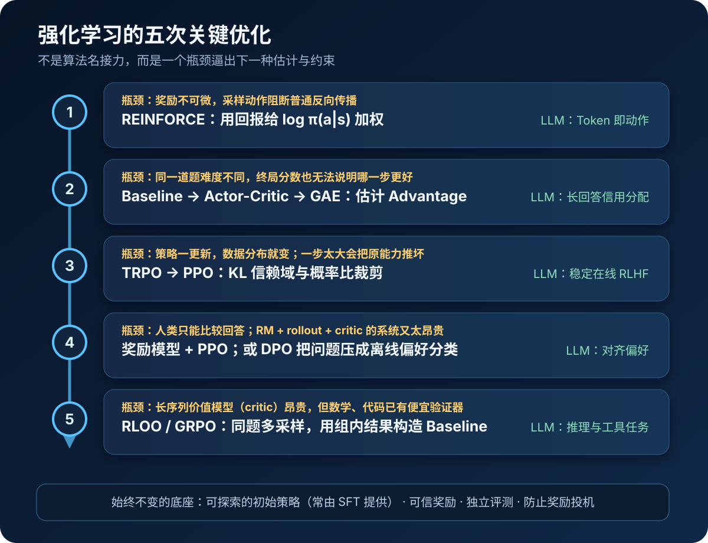
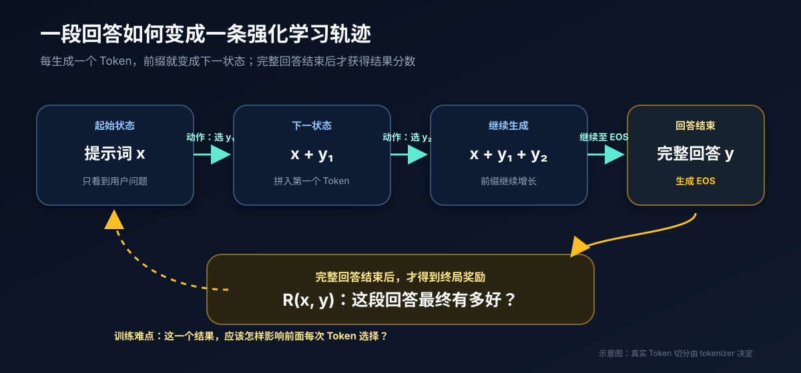
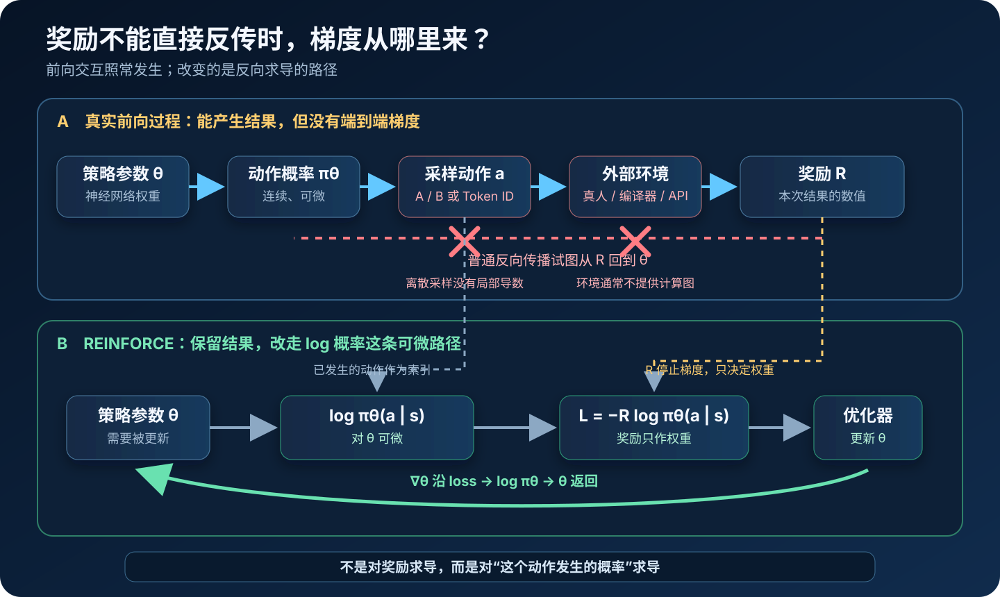
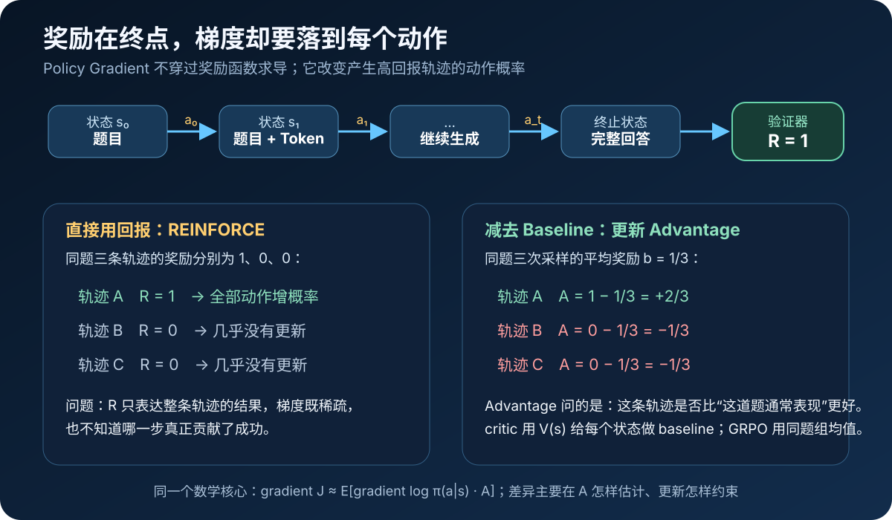
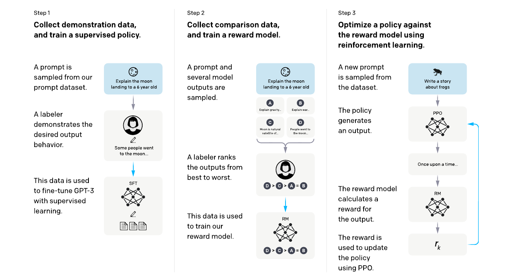
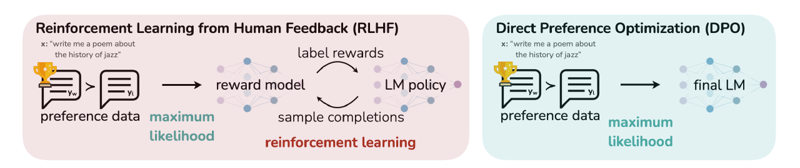
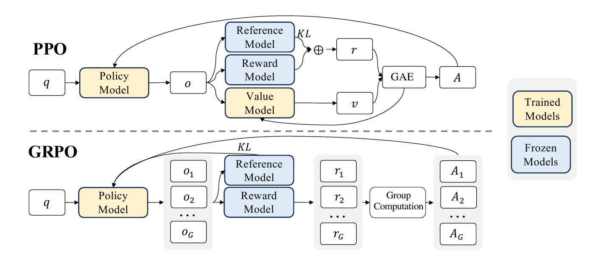
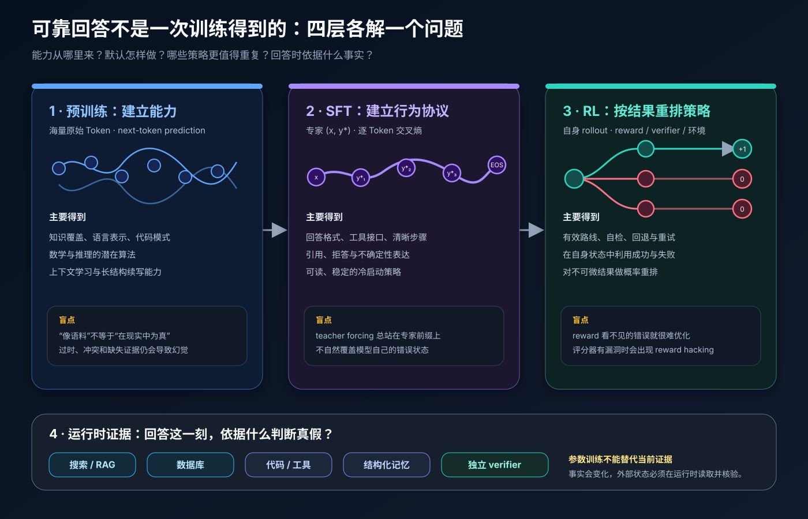

# 大模型与强化学习的协同演进



*图 1　强化学习的五次关键优化。这里的术语不是阅读前提，后文会从“什么是强化学习”逐步推出它们。主线不是缩写换代，而是无法沿采样结果直接反传、梯度高方差、策略更新失稳、反馈昂贵和 critic 昂贵依次逼出了新的估计与约束。本文归纳，依据 [REINFORCE](https://link.springer.com/article/10.1007/BF00992696)、[GAE](https://arxiv.org/abs/1506.02438)、[TRPO](https://arxiv.org/abs/1502.05477)、[PPO](https://arxiv.org/abs/1707.06347)、[DPO](https://arxiv.org/abs/2305.18290) 与 [DeepSeekMath](https://arxiv.org/abs/2402.03300)。*

先不要考虑 PPO、DPO 或 GRPO。只看一个更小的问题：

> 一个系统做出选择后，只收到“这次结果得了几分”。它怎样调整自己，让下次更可能得到高分？

这就是强化学习最核心的学习闭环。大模型做数学题、代码生成和工具调用，只是把“一次选择”扩展成了几百个 Token 或几十次工具动作。文章后面的所有算法，都在修理这个闭环中的某一个具体困难。

# 一、从零开始：强化学习是什么，梯度又从哪里来

## 1.1 强化学习不是一种网络，而是一种学习问题

先想象一个只有两个按钮的游戏。

- 屏幕亮起时，玩家必须按按钮 A 或按钮 B；
- 按完以后，机器吐出一个分数；
- 玩家看不到机器内部规则，只能多玩几次，根据结果改变下一次的选择。

这个小游戏已经包含强化学习最基本的五个角色：

| 名称 | 在按钮游戏里是什么 | 作用 |
|---|---|---|
| 智能体（agent） | 玩家 | 做决定的系统 |
| 状态（state）$s$ | 当前看到的屏幕 | 做决定时已经知道的信息 |
| 动作（action）$a$ | 按 A 或按 B | 智能体真正执行的选择 |
| 环境（environment） | 按钮机 | 接收动作并产生后果 |
| 奖励（reward）$r$ | 机器吐出的分数 | 对这次结果的即时评价 |

玩家还需要一套选择规则。例如“以 $70\%$ 的概率按 A，以 $30\%$ 的概率按 B”。这套规则叫**策略**：

$$
\pi_\theta(a\mid s)
=
\text{在状态 }s\text{ 下选择动作 }a\text{ 的概率}
$$

$\pi$ 读作 pi；$\theta$ 表示决定这些概率的全部参数。对神经网络来说，$\theta$ 就是网络权重。

强化学习可以用一句不带公式的话定义：

> 智能体反复观察状态、选择动作、接收奖励，再调整策略，使未来获得的总奖励更高。

它不是某一种神经网络，也不等于 PPO。PPO、DPO、GRPO 是不同的训练方法；强化学习是它们试图解决的上位问题。经典定义与记号可对照 Sutton 与 Barto 的 [Reinforcement Learning: An Introduction](https://mitpress.mit.edu/9780262039246/reinforcement-learning/)。

## 1.2 它和监督学习究竟差在哪里

监督学习的数据通常直接告诉模型正确答案：

$$
(x,y^*)\quad\text{题目与标准答案}
$$

例如输入 $x$ 是“法国首都是什么”，标签 $y^*$ 是“巴黎”。训练时，模型不需要先猜一次才知道正确答案；损失函数可以直接读取“巴黎”的概率，并把它调高。

强化学习只保证系统能看到自己动作造成的结果：

$$
(s,a,r)\quad\text{状态、自己选择的动作、结果分数}
$$

按钮游戏里，玩家若按了 A 并得到 $1$ 分，只知道“这次按 A 得了 $1$ 分”。它不一定知道：

- 如果刚才改按 B 会得几分；
- A 是一直更好，还是这次碰巧走运；
- 多步任务中，究竟是哪一步造成最终成功。

两者最重要的差别不是有没有神经网络，而是**监督信号出现在哪里**：

| 问题 | 监督学习 | 强化学习 |
|---|---|---|
| 训练前是否给出目标动作 | 通常给出 $y^*$ | 通常不给 |
| 数据由谁产生 | 固定数据集或教师 | 策略与环境交互产生 |
| 反馈描述什么 | 这个位置应该输出什么 | 整个结果有多好 |
| 是否需要探索 | 通常不需要 | 经常需要尝试不同动作 |

因此，强化学习不是“更高级的监督学习”。它处理的是另一种信息结构：**没有逐步标准答案，但可以评价行动后果。**

## 1.3 模型逐 Token 生成，为什么最后却只有一个总分

先只看没有工具调用的普通问答。用户输入：

> 法国首都是什么？

模型不会一次性写出完整回答，而是反复做同一件事：根据“问题 + 已经写出的内容”，为下一个 Token 计算概率，再从中选择一个。为便于说明，假设回答被切成 $y_1,y_2,\ldots$；真实切分由 tokenizer 决定。

$$
x
\xrightarrow{\text{选择 }y_1}
(x,y_1)
\xrightarrow{\text{选择 }y_2}
(x,y_1,y_2)
\longrightarrow\cdots\longrightarrow y
$$

现在再把强化学习的名称贴上去：

- **状态**：当前可见的全部上下文，也就是提示词与已生成前缀；
- **动作**：模型这一步选出的下一个 Token；
- **策略**：语言模型给所有候选 Token 的概率分布；
- **状态转移**：把刚选出的 Token 拼到前缀末尾；
- **奖励**：完整回答结束后得到的结果分数，例如是否答对、代码是否通过测试，或奖励模型是否偏好这段回答。



*图 2　只看单轮回答内部：模型每生成一个 Token，前缀就变成下一状态；通常要等完整回答结束，环境或奖励模型才给出一个终局分数。图中的 Token 切分仅为示意。本文归纳。*

把从问题到完整回答的全过程记为一条**轨迹** $\tau$：

$$
\tau=(s_0,a_0,r_0,s_1,a_1,r_1,\ldots,s_T)
$$

$\tau$ 读作 tau。第 $t$ 步里，模型在状态 $s_t$ 选择动作 $a_t$，随后进入状态 $s_{t+1}$ 并收到奖励 $r_t$。普通问答经常是前面没有即时奖励，回答结束时才出现终局奖励：

$$
r_0=r_1=\cdots=r_{T-1}=0,
\qquad
r_T=R(x,y)
$$

从第 $t$ 步向后累计能得到的奖励叫**回报**：

$$
G_t
=r_t+\gamma r_{t+1}+\gamma^2r_{t+2}+\cdots
=\sum_{k=t}^{T}\gamma^{k-t}r_k
$$

$\gamma\in[0,1]$ 叫折扣因子。若 $\gamma=1$，并且一个 $800$ Token 的回答只在最后因正确获得 $1$ 分，那么这条轨迹中每一步向后看的回报都是 $1$。

但这只说明整段生成最终成功了，并没有告诉我们第几个 Token 真正起了作用。**如何把一个终局结果合理地分配给前面的许多动作，就是信用分配问题。**后面的策略梯度、baseline、PPO 与 GRPO，都会围绕这个问题逐步出现。

## 1.4 在谈“不可微”之前，先复习梯度是什么

训练神经网络，本质上是在调很多旋钮。先只看一个参数 $\theta$，假设损失为：

$$
L(\theta)=(\theta-3)^2
$$

导数告诉我们：把旋钮 $\theta$ 轻微向右拨一点，损失会怎样变化：

$$
\frac{dL}{d\theta}=2(\theta-3)
$$

若当前 $\theta=1$，导数是 $-4$。梯度下降执行：

$$
\theta_{\text{new}}
=
\theta_{\text{old}}-\eta\frac{dL}{d\theta}
$$

只要学习率 $\eta>0$ 足够小，$\theta$ 就会从 $1$ 向最优点 $3$ 移动。

神经网络只是把一条导数变成了许多层链式法则。以分类监督学习为例，计算路径是：

$$
\theta
\longrightarrow
\text{logits}
\longrightarrow
p_\theta(y\mid x)
\longrightarrow
-\log p_\theta(y^*\mid x)
\longrightarrow
L
$$

每个箭头都由可微的张量运算构成，所以反向传播能从 $L$ 一路算回 $\theta$。标准答案 $y^*$ 本身不需要求导；它只负责指出“应该读取哪一个类别的 log-probability”。

当 $\theta$ 只有一个数时写 $dL/d\theta$；真实模型的 $\theta$ 是一个巨大参数向量，通常写 $\nabla_\theta L$。$\nabla_\theta$ 表示“对 $\theta$ 中每个参数分别求偏导后组成的梯度向量”，思想没有变化。

## 1.5 为什么不能从强化学习的结果直接反传

先写出按钮游戏的前向过程：

$$
\theta
\longrightarrow
p_\theta
\longrightarrow
\operatorname{sample}(p_\theta)
\longrightarrow
a
\longrightarrow
\operatorname{environment}(a)
\longrightarrow
r
$$

问题出在中间的**离散采样**与外部环境，而不是“奖励”这两个字天然不可微。

假设策略按下面的方法采样：

1. 先生成随机数 $u\sim\operatorname{Uniform}(0,1)$；
2. 若 $u<p_\theta$，选择 A；
3. 否则选择 B。

固定一次随机数 $u=0.63$。当 $p_\theta$ 从 $0.20$ 缓慢增加到 $0.62$ 时，动作一直是 B；刚越过 $0.63$，动作突然跳成 A。动作关于概率是一条阶跃函数：

$$
a(p_\theta)=
\begin{cases}
\mathrm{A}, & p_\theta>0.63,\\
\mathrm{B}, & p_\theta\le 0.63.
\end{cases}
$$

它在绝大多数位置的局部变化都是零，在跳变点又没有普通导数。A 和 B 是两个离散符号，不存在“$0.01$ 个 A”这种可以沿链式法则传播的小变化。

即使动作是连续的，环境也可能是编译器、真人、网页、机器人或远程 API。这些系统通常不在 PyTorch 计算图里，也不会返回 $\partial r/\partial a$。因此，下面这条**直接路径**往往断掉：

$$
\frac{\partial r}{\partial\theta}
=
\frac{\partial r}{\partial a}
\cdot
\frac{\partial a}{\partial p_\theta}
\cdot
\frac{\partial p_\theta}{\partial\theta}
$$

更准确的说法是：

> 在通用的无模型强化学习里，我们不假设能够沿“参数—采样动作—环境—奖励”这条路径直接反向传播。

如果动作、环境和奖励都连续可微，并且采样能够重参数化，确实可以使用 pathwise gradient；这不是本文这里讨论的离散 Token 场景。PyTorch 官方文档也把可重参数化采样与用于离散策略的 REINFORCE 分开说明：[torch.distributions](https://docs.pytorch.org/docs/stable/distributions.html)。



*图 3　梯度路径到底在哪里断、又从哪里接回。奖励作为外部观测值不需要求导；REINFORCE 把它当作权重，梯度沿 $\log\pi_\theta(a\mid s)$ 回到策略参数。本文归纳。*

## 1.6 梯度不是来自奖励，而是来自“动作概率怎样随参数变化”

仍然只看两个按钮。令：

$$
\pi_\theta(\mathrm{A})=p_\theta,\qquad
\pi_\theta(\mathrm{B})=1-p_\theta
$$

假设按 A 得 $1$ 分，按 B 得 $0$ 分。一次实际游戏的结果有随机性，但在重复无数次以后，平均分是：

$$
\begin{aligned}
J(\theta)
&=p_\theta R(\mathrm{A})+(1-p_\theta)R(\mathrm{B})\\
&=p_\theta\cdot1+(1-p_\theta)\cdot0\\
&=p_\theta.
\end{aligned}
$$

$J(\theta)$ 叫期望回报，是强化学习真正要最大化的目标。注意：我们没有对 $R(\mathrm{A})$ 或 $R(\mathrm{B})$ 求导。奖励只是两个常数。可求导的是“参数改变以后，选到 A 的概率会怎样变化”：

$$
\nabla_\theta J(\theta)=\nabla_\theta p_\theta
$$

若 $p_\theta=\sigma(\theta)$，其中 sigmoid

$$
\sigma(\theta)=\frac{1}{1+e^{-\theta}}
$$

把任意实数映射到 $(0,1)$，那么：

$$
\nabla_\theta J(\theta)
=p_\theta(1-p_\theta)
$$

当 $p_\theta=0.5$ 时，梯度为 $0.25$。做梯度上升会增大 $\theta$，于是 $p_\theta$ 增大，策略将更经常选择高奖励的 A。

把两个奖励写成任意常数 $R_A$ 和 $R_B$，还能更清楚地看到方向：

$$
\nabla_\theta J(\theta)
=(R_A-R_B)p_\theta(1-p_\theta)
$$

- 若 $R_A>R_B$，梯度推动 A 的概率上升；
- 若 $R_A<R_B$，梯度推动 A 的概率下降；
- 若两者奖励相同，改变选择概率没有意义，梯度为零。

这就是整个策略梯度思想最小、最完整的版本：**不穿过采样结果求导，而是对每种结果发生的概率求导。**

## 1.7 从枚举两个动作，到只采样一次

两个按钮可以直接枚举。大模型的词表可能有十万多个 Token，而一段 $800$ Token 回答的可能序列数量近似为 $|\mathcal V|^{800}$，无法逐条求和。

先对单步动作写出期望：

$$
J(\theta)=\sum_a\pi_\theta(a\mid s)R(a)
$$

第一步，直接求导：

$$
\nabla_\theta J(\theta)
=
\sum_a R(a)\nabla_\theta\pi_\theta(a\mid s)
$$

第二步，使用一个恒等式。因为：

$$
\nabla_\theta\log\pi_\theta(a\mid s)
=
\frac{\nabla_\theta\pi_\theta(a\mid s)}
{\pi_\theta(a\mid s)}
$$

所以：

$$
\nabla_\theta\pi_\theta(a\mid s)
=
\pi_\theta(a\mid s)
\nabla_\theta\log\pi_\theta(a\mid s)
$$

第三步，把它代回去：

$$
\begin{aligned}
\nabla_\theta J(\theta)
&=
\sum_a
\pi_\theta(a\mid s)R(a)
\nabla_\theta\log\pi_\theta(a\mid s)\\
&=
\mathbb E_{a\sim\pi_\theta}
\left[
R(a)\nabla_\theta\log\pi_\theta(a\mid s)
\right].
\end{aligned}
$$

最后一行把“对所有动作求和”改写成了“从当前策略采样时的期望”。于是可以只采样 $K$ 次来估计：

$$
\nabla_\theta J(\theta)
\approx
\frac{1}{K}
\sum_{i=1}^{K}
R(a^{(i)})
\nabla_\theta\log\pi_\theta(a^{(i)}\mid s)
$$

这叫 **likelihood-ratio estimator** 或 **score-function estimator**。Williams 1992 年的 [REINFORCE](https://link.springer.com/article/10.1007/BF00992696) 把它系统化为连接主义强化学习算法。

一次采样里，动作已经变成离散常量，确实不能对动作求导；但神经网络仍然知道自己当时给这个动作分配了多大概率。$\log\pi_\theta(a\mid s)$ 对 $\theta$ 可微，奖励 $R(a)$ 只负责决定这次 log-probability 应被多大权重地强化。

## 1.8 从一次动作推到一整条 Token 轨迹

一条轨迹的概率可以分解成：

$$
p_\theta(\tau)
=
\rho(s_0)
\prod_{t=0}^{T-1}
\pi_\theta(a_t\mid s_t)
P(s_{t+1}\mid s_t,a_t)
$$

$\rho(s_0)$ 是初始状态分布，$P$ 是环境转移。标准设定中，环境不会随着策略参数 $\theta$ 一起求导，因此只有策略项包含 $\theta$。取对数以后，乘积变成求和：

$$
\nabla_\theta\log p_\theta(\tau)
=
\sum_{t=0}^{T-1}
\nabla_\theta\log\pi_\theta(a_t\mid s_t)
$$

现在对轨迹期望回报求导：

$$
\begin{aligned}
\nabla_\theta J(\theta)
&=\nabla_\theta\sum_\tau p_\theta(\tau)R(\tau)\\
&=\sum_\tau R(\tau)\nabla_\theta p_\theta(\tau)\\
&=\sum_\tau p_\theta(\tau)R(\tau)
\nabla_\theta\log p_\theta(\tau)\\
&=\mathbb E_{\tau\sim\pi_\theta}
\left[
R(\tau)
\sum_{t=0}^{T-1}
\nabla_\theta\log\pi_\theta(a_t\mid s_t)
\right].
\end{aligned}
$$

这就是文章后面所有 on-policy 策略优化方法的地基。**On-policy** 表示“用来学习的数据由当前或非常接近当前的策略生成”。一条策略在环境中从开始运行到结束所得到的轨迹，工程上常叫一次 **rollout**。

公式对应五个操作：

1. 先用当前模型生成一条回答；
2. 用验证器、人类或环境得到这条回答的分数；
3. 重新计算回答中每个已采样 Token 的 log-probability；
4. 用回报给这些 log-probability 加权；
5. 反向传播时，梯度沿 log-probability 回到模型参数。

它没有告诉我们哪一个 Token 真正造成了成功。若只有终局奖励，整条回答里的动作会暂时共享同一个回报权重。这正是下一章要解决的困难。

## 1.9 用 PyTorch 看见实际的梯度路径

下面先实现只有两个动作的一步 REINFORCE。logit 是 softmax 之前尚未归一化的动作分数，PyTorch 的 Categorical 分布会把两个 logits 转成概率。为了让程序无论采到 A 还是 B 都能打印出非零梯度，示例把 B 的奖励设为 $-1$；这不改变梯度路径：

```python
import torch


torch.manual_seed(7)

# 两个可训练 logits 就是最小策略参数。
logits = torch.nn.Parameter(torch.tensor([0.0, 0.0]))
reward_table = torch.tensor([1.0, -1.0])  # A 得 1 分，B 得 -1 分

distribution = torch.distributions.Categorical(logits=logits)
action = distribution.sample()              # 离散采样：action 本身没有梯度
reward = reward_table[action]               # 外部结果：把它视为常量
chosen_logp = distribution.log_prob(action) # 对 logits 可微

loss = -reward.detach() * chosen_logp        # 最大化回报，所以加负号做梯度下降
loss.backward()

print("sampled action:", action.item())
print("reward:", reward.item())
print("gradient on logits:", logits.grad)
```

关键不在代码短，而在计算图：

- `distribution.sample()` 决定这次做了哪个动作，但不承担反传；
- `distribution.log_prob(action)` 把这个已发生的动作重新接回可微策略；
- `reward.detach()` 明确奖励只是权重；
- `loss.backward()` 沿 `chosen_logp → logits → θ` 计算梯度。

PyTorch 官方文档给出的 REINFORCE 最小形式也是 `-log_prob(action) * reward`。对大模型，把单个动作 log-probability 换成回答 Token 的 masked sum 即可：

```python
def masked_mean(x: torch.Tensor, mask: torch.Tensor) -> torch.Tensor:
    return (x * mask).sum() / mask.sum().clamp_min(1)


def reinforce_loss(
    token_logp: torch.Tensor,
    trajectory_return: torch.Tensor,
    response_mask: torch.Tensor,
) -> torch.Tensor:
    """
    token_logp/response_mask: [batch, response_tokens]
    trajectory_return: [batch], one return per sampled response
    """
    weight = trajectory_return.detach().unsqueeze(-1)
    return -masked_mean(token_logp * weight, response_mask)
```

这里的 `response_mask` 只让回答 Token 参与 loss，排除 prompt、padding 与其他无效位置。

到这里，第一个问题才真正回答完：

> 梯度不是从奖励函数里冒出来的。它来自“参数变化会怎样改变已采样动作的 log-probability”；奖励只告诉这个变化应该被放大、缩小还是反向。

但 REINFORCE 仍然很粗糙。若奖励只有 $0$ 和 $1$，一次失败样本的权重为 $0$，它甚至不会主动压低失败动作；同一个 $1$ 分也可能来自好策略或偶然走运。为得到“比通常表现更好还是更差”的信号，下一步必须引入 baseline 与 advantage。

# 二、优化点二：用 Baseline 和 Advantage 降低方差

## 2.1 “得了 1 分”不等于“每一步都做得好”

REINFORCE 用一次随机轨迹估计一个期望梯度：

$$
\hat g=R(\tau)\nabla_\theta\log p_\theta(\tau)
$$

帽子 $\hat g$ 表示“根据有限样本算出的估计值”，不是精确期望。重新采样一次，动作、回报和 $\hat g$ 都可能变化。若这些估计值忽大忽小，甚至方向相反，就称梯度估计的**方差很大**。

回到两个按钮，仍令 $p_\theta=0.5$、A 奖励为 $1$、B 奖励为 $0$。对 sigmoid 策略：

$$
\nabla_\theta\log\pi_\theta(\mathrm A)=1-p_\theta=0.5
$$

$$
\nabla_\theta\log\pi_\theta(\mathrm B)=-p_\theta=-0.5
$$

若这次采到 A，REINFORCE 梯度样本是：

$$
\hat g_{\mathrm A}=1\times0.5=0.5
$$

若这次采到 B：

$$
\hat g_{\mathrm B}=0\times(-0.5)=0
$$

两种样本的平均值是正确梯度 $0.25$，但单次估计会在 $0$ 和 $0.5$ 之间跳。真实任务还叠加了题目难度、环境噪声和长序列偶然性，波动会大得多。

一个关键改进是：不要用绝对回报 $R$ 加权，而是先减去“通常能得到多少分”的 **baseline** $b$：

$$
\hat g=(R-b)\nabla_\theta\log\pi_\theta(a\mid s)
$$

仍取 $b=0.5$：

$$
\hat g_{\mathrm A}
=(1-0.5)\times0.5
=0.25
$$

$$
\hat g_{\mathrm B}
=(0-0.5)\times(-0.5)
=0.25
$$

在这个极简例子中，两种采样恰好都给出 $0.25$。更重要的是，失败的 B 现在获得负权重 $R-b=-0.5$；梯度上升会降低 B 的概率，而不是像原始 $0$ 奖励那样完全不更新。

为什么随便减掉一个 baseline，不会偷偷改变目标方向？只要 $b(s)$ 可以依赖状态、但不依赖本次选择的动作：

$$
\begin{aligned}
\mathbb E_{a\sim\pi_\theta}
\left[
b(s)\nabla_\theta\log\pi_\theta(a\mid s)
\right]
&=
b(s)\sum_a
\pi_\theta(a\mid s)
\nabla_\theta\log\pi_\theta(a\mid s)\\
&=
b(s)\sum_a\nabla_\theta\pi_\theta(a\mid s)\\
&=
b(s)\nabla_\theta\sum_a\pi_\theta(a\mid s)\\
&=
b(s)\nabla_\theta 1\\
&=0.
\end{aligned}
$$

减 baseline 只去掉均值为零的噪声项，不改变期望梯度。

多步任务里，“通常水平”会随状态改变。面对一道简单题和一道极难题，同样的 $1$ 分含义不同；回答已经走到正确证明的最后一步，和刚生成第一个 Token 时，未来成功率也不同。

于是定义两个期望：

$$
V^\pi(s)
=
\mathbb E_\pi[G_t\mid s_t=s]
$$

$V^\pi(s)$ 叫**状态价值**：处于状态 $s$，以后继续按当前策略行动，通常能得到多少回报。

$$
Q^\pi(s,a)
=
\mathbb E_\pi[G_t\mid s_t=s,a_t=a]
$$

$Q^\pi(s,a)$ 叫**动作价值**：在状态 $s$ 先强制做动作 $a$，之后再按当前策略行动，通常能得到多少回报。

两者相减得到优势：

> 在当前状态下，这个动作比通常能做到的水平好多少？

$$
A^\pi(s,a)=Q^\pi(s,a)-V^\pi(s)
$$

$A^\pi(s,a)>0$ 表示这个动作好于当前策略的通常水平；$A^\pi(s,a)<0$ 表示更差。策略梯度真正需要的，正是这种相对信号。



*图 4　从回报到优势。同题三条轨迹的平均奖励可以作为最简单的 baseline；Actor-Critic 学习状态价值 $V(s)$，GRPO 则直接用同题多回答的组内统计。示例数字仅用于解释，不是实验结果。*

## 2.2 Actor-Critic：让一个模型学习“通常水平”

问题是：真实的 $V^\pi(s)$ 并没有标签。Actor-Critic 增加一个可学习的价值模型来估计它：

- **Actor** 是策略 $\pi_\theta$，负责选择动作；
- **Critic** 是价值模型 $V_\psi(s)$，负责预测当前状态的通常未来回报；
- $\theta$ 与 $\psi$ 是两套参数，二者承担不同目标。

一条轨迹结束后，可以用实际回报 $G_t$ 监督 critic：

$$
\mathcal L_V(\psi)
=
\left(V_\psi(s_t)-G_t\right)^2
$$

但等整条轨迹结束再更新，会有很高方差。另一种办法是只向前看一步：当前状态的价值，应该接近“眼前奖励 + 下一状态的折扣价值”：

$$
\underbrace{r_t+\gamma V_\psi(s_{t+1})}_{\text{一步 bootstrap 目标}}
$$

预测目标与当前预测之差叫时序差分误差：

$$
\delta_t=r_t+\gamma V_\psi(s_{t+1})-V_\psi(s_t)
$$

若 $\delta_t>0$，刚才发生的转移比 critic 原先预期更好；若 $\delta_t<0$，结果更差。它因此可以充当一步 advantage 的近似。

这里先停一下。这个公式里只有 $\gamma$，还没有 $\lambda$：

- $\gamma$ 来自回报 $G_t=r_t+\gamma r_{t+1}+\gamma^2r_{t+2}+\cdots$ 的定义，表示未来奖励回到当前时刻时怎样折扣；
- $\lambda$ 要到“把不同步数的 advantage 估计混合起来”时才会出现。

### 从一步 TD 到多步 advantage：先看清 $\gamma$ 从哪里来

只向前看一步时，advantage 估计就是：

$$
\hat A_t^{(1)}
=r_t+\gamma V_\psi(s_{t+1})-V_\psi(s_t)
=\delta_t
$$

上标 $(1)$ 表示只使用一步真实奖励，之后的未来交给 critic 估计。若向前看两步，先使用 $r_t$ 和 $r_{t+1}$，再从 $s_{t+2}$ 开始使用 critic：

$$
\hat A_t^{(2)}
=r_t+\gamma r_{t+1}+\gamma^2V_\psi(s_{t+2})-V_\psi(s_t)
$$

它也可以写成两个 TD 误差。把右边完整展开：

$$
\begin{aligned}
\delta_t+\gamma\delta_{t+1}
={}&r_t+\gamma V_\psi(s_{t+1})-V_\psi(s_t)\\
&+\gamma\left[r_{t+1}+\gamma V_\psi(s_{t+2})-V_\psi(s_{t+1})\right]\\
={}&r_t+\gamma V_\psi(s_{t+1})-V_\psi(s_t)\\
&+\gamma r_{t+1}+\gamma^2V_\psi(s_{t+2})-\gamma V_\psi(s_{t+1})\\
={}&r_t+\gamma r_{t+1}+\gamma^2V_\psi(s_{t+2})-V_\psi(s_t)\\
={}&\hat A_t^{(2)}.
\end{aligned}
$$

第三行中，$+\gamma V_\psi(s_{t+1})$ 与 $-\gamma V_\psi(s_{t+1})$ 抵消了。$\delta_{t+1}$ 之所以乘 $\gamma$，不是 GAE 额外规定的，而是因为它位于未来一步；不乘 $\gamma$，这两个中间价值项就无法抵消，也不再等于两步回报。

向前看三步时，三个 TD 误差继续首尾抵消：

$$
\begin{aligned}
\hat A_t^{(3)}
={}&\delta_t+\gamma\delta_{t+1}+\gamma^2\delta_{t+2}\\
={}&r_t+\gamma r_{t+1}+\gamma^2r_{t+2}
+\gamma^3V_\psi(s_{t+3})-V_\psi(s_t).
\end{aligned}
$$

因此，一步、两步和三步估计分别是：

$$
\begin{aligned}
\hat A_t^{(1)}&=\delta_t,\\
\hat A_t^{(2)}&=\delta_t+\gamma\delta_{t+1},\\
\hat A_t^{(3)}&=\delta_t+\gamma\delta_{t+1}+\gamma^2\delta_{t+2}.
\end{aligned}
$$

刚才只证明了一件事：**未来第 $l$ 步的 TD 误差搬回时刻 $t$，必须乘 $\gamma^l$。** 现在还剩下另一个问题：究竟应该相信一步、两步，还是三步估计？

### GAE 为什么再引入 $\lambda$

这里出现一个取舍：

- 只看一步的 $\delta_t$，等待时间短、方差较小，却会继承 critic 的估计偏差；
- 直接使用一条真实轨迹直到结束的完整回报 $G_t$，也叫 Monte Carlo return；它不依赖下一状态预测，却会吸收整条随机轨迹的噪声；
- 需要一种连续旋钮，在二者之间选择。

GAE（Generalized Advantage Estimation，广义优势估计）不强迫我们只选一个步数，而是用 $\lambda\in[0,1]$ 混合不同步数的 advantage。先假设从 $t$ 开始只剩三步，GAE 使用下面三个权重：

$$
\hat A_t^{\mathrm{GAE}}
=(1-\lambda)\hat A_t^{(1)}
+(1-\lambda)\lambda\hat A_t^{(2)}
+\lambda^2\hat A_t^{(3)}
$$

这三个权重的和是：

$$
(1-\lambda)+(1-\lambda)\lambda+\lambda^2=1
$$

也就是说，这不是把三个估计无节制地相加，而是在它们之间分配总共为 $1$ 的权重。每多向前看一步，估计权重就多乘一个 $\lambda$；最后的三步估计拿走尚未分配的 $\lambda^2$，保证有限轨迹上的权重仍然加起来等于 $1$。

把刚才得到的三个多步 advantage 代入：

$$
\begin{aligned}
\hat A_t^{\mathrm{GAE}}
={}&(1-\lambda)\delta_t\\
&+(1-\lambda)\lambda
  (\delta_t+\gamma\delta_{t+1})\\
&+\lambda^2
  (\delta_t+\gamma\delta_{t+1}+\gamma^2\delta_{t+2}).
\end{aligned}
$$

现在逐项收集系数。$\delta_t$ 的系数是：

$$
(1-\lambda)+(1-\lambda)\lambda+\lambda^2=1
$$

$\delta_{t+1}$ 的系数是：

$$
\gamma\left[(1-\lambda)\lambda+\lambda^2\right]
=\gamma\lambda
$$

$\delta_{t+2}$ 的系数是：

$$
\gamma^2\lambda^2
$$

于是得到：

$$
\hat A_t^{\mathrm{GAE}}
=\delta_t
+\gamma\lambda\delta_{t+1}
+(\gamma\lambda)^2\delta_{t+2}
$$

一般化到一条长度为 $T$ 的轨迹：

$$
\hat A_t^{\mathrm{GAE}}
=\sum_{l=0}^{T-t-1}(\gamma\lambda)^l\delta_{t+l}
$$

现在 $\gamma\lambda$ 的来源就清楚了。未来第 $l$ 步的 TD 误差要同时经过两种衰减：

| TD 误差 | 距离当前 | 回报的时间折扣 | 多步估计的混合权重 | 最终权重 |
|---|---:|---:|---:|---:|
| $\delta_t$ | $0$ 步 | $1$ | $1$ | $1$ |
| $\delta_{t+1}$ | $1$ 步 | $\gamma$ | $\lambda$ | $\gamma\lambda$ |
| $\delta_{t+2}$ | $2$ 步 | $\gamma^2$ | $\lambda^2$ | $(\gamma\lambda)^2$ |
| $\delta_{t+3}$ | $3$ 步 | $\gamma^3$ | $\lambda^3$ | $(\gamma\lambda)^3$ |

两者不能混为同一个“折扣因子”：

- $\gamma$ 属于任务的回报定义，回答“未来奖励折算到现在还值多少”；
- $\lambda$ 属于 advantage 估计器，回答“为了降低 critic 偏差，我们愿意纳入多长的真实轨迹”。

例如取 $\gamma=0.9$、$\lambda=0.8$，连续 TD 误差的权重依次为：

$$
1,\quad 0.72,\quad 0.72^2=0.5184,\quad 0.72^3=0.373248,\ldots
$$

未来误差逐渐变轻，同时包含两个原因：它离现在更远，而且估计器对更长轨迹分配的权重更小。

三个边界情况也能帮助检查理解：

- $\lambda=0$：只剩 $\delta_t$，就是一步 TD；
- $\lambda=1$：保留直到终点的全部 TD 误差，价值项首尾抵消后得到 $G_t-V_\psi(s_t)$，即 Monte Carlo advantage；
- $\gamma=0$：任务只关心眼前奖励，未来 TD 误差不会传回当前时刻。

因此，$\lambda$ 是偏差—方差旋钮，不是普适常数。工程中常见 $\lambda=0.95$；当语言模型训练把一整段回答视为短回合并取 $\gamma=1$ 时，权重会简化成 $\lambda^l$，但一般公式仍然保留 $\gamma$。

这里的“偏差”指估计器的长期平均值系统性偏离真实 advantage；“方差”指换一批随机轨迹后估计值大幅波动。GAE 用 $\lambda$ 在两种误差之间交换。

最后，求和形式可以改写成从后向前的递推：

$$
\hat A_t^{\mathrm{GAE}}
=\delta_t+\gamma\lambda\hat A_{t+1}^{\mathrm{GAE}}
$$

这就是下面代码中 `delta + gamma * lam * last_advantage` 的来源。代码从序列末尾向前扫描，`last_advantage` 保存的正是下一时刻已经算好的 $\hat A_{t+1}^{\mathrm{GAE}}$：

```python
@torch.no_grad()
def generalized_advantage_estimation(
    rewards: torch.Tensor,
    values: torch.Tensor,
    mask: torch.Tensor,
    gamma: float = 1.0,
    lam: float = 0.95,
) -> tuple[torch.Tensor, torch.Tensor]:
    """All tensors are [batch, time]; terminal V(s_{T+1}) is zero."""
    advantages = torch.zeros_like(rewards)
    last_advantage = torch.zeros(rewards.size(0), device=rewards.device)
    next_value = torch.zeros_like(last_advantage)

    for t in reversed(range(rewards.size(1))):
        valid = mask[:, t]
        delta = rewards[:, t] + gamma * next_value - values[:, t]
        # A_t = delta_t + gamma * lambda * A_{t+1}
        last_advantage = (delta + gamma * lam * last_advantage) * valid
        advantages[:, t] = last_advantage
        next_value = values[:, t] * valid

    returns = advantages + values
    return advantages, returns
```

对大模型而言，这一步的代价也被放大了：critic 通常要读取完整前缀并逐 Token 输出价值，规模可能接近 policy。长回答、稀疏终局奖励又让价值估计非常难学。后面的 RLOO 和 GRPO，本质上都会重新追问：**能否找到一个便宜 baseline，而不训练大 critic？**

# 三、优化点三：用 TRPO/PPO 限制一次更新的破坏力

## 3.1 策略梯度为什么容易“学崩”

前两章得到的梯度有一个隐藏前提：轨迹必须来自公式中的当前策略 $\pi_\theta$。但训练时不可能每做一次很小的参数更新，就立刻丢掉整批回答再重新生成。常见流程是：

1. 冻结一份策略 $\pi_{\mathrm{old}}$；
2. 用它生成一批 rollout，并保存动作、旧 log-probability 和 advantage；
3. 在这批数据上做若干次梯度更新，得到新策略 $\pi_\theta$；
4. 再用新策略采下一批数据。

问题是：数据由 $\pi_{\mathrm{old}}$ 采出，目标却正在更新 $\pi_\theta$。如果二者差异很大，旧数据就不能直接代表新策略。

先对一个状态写出新策略下的期望目标：

$$
\mathbb E_{a\sim\pi_\theta}[\hat A(a)]
=
\sum_a\pi_\theta(a\mid s)\hat A(a)
$$

在每项中乘除旧策略概率：

$$
\begin{aligned}
\sum_a\pi_\theta(a\mid s)\hat A(a)
&=
\sum_a
\pi_{\mathrm{old}}(a\mid s)
\frac{\pi_\theta(a\mid s)}
{\pi_{\mathrm{old}}(a\mid s)}
\hat A(a)\\
&=
\mathbb E_{a\sim\pi_{\mathrm{old}}}
\left[\rho_t(\theta)\hat A_t\right]
\end{aligned}
$$

其中：

$$
\rho_t(\theta)=
\frac{\pi_\theta(a_t\mid s_t)}
{\pi_{\mathrm{old}}(a_t\mid s_t)}
$$

$\rho_t$ 叫 importance ratio，它回答“新策略比采样时的旧策略更可能选择这个动作多少倍”：

- $\rho_t=1$：概率没变；
- $\rho_t=1.5$：新策略选择该动作的概率是旧策略的 $1.5$ 倍；
- $\rho_t=0.2$：新策略只剩旧策略的五分之一。

这个改写本身是精确的，但 ratio 太大或太小时，少数旧样本会获得极端权重，估计方差迅速上升。更根本地说，若新策略已走到旧策略几乎不会访问的区域，旧 rollout 根本没有覆盖那里。

TRPO 因此不只修正样本权重，还要求新旧策略的整体 KL 距离不能太大。离散分布的 KL 可以写成：

$$
D_{\mathrm{KL}}(p\|q)
=
\sum_a p(a)\log\frac{p(a)}{q(a)}
$$

两个分布完全相同时 KL 为 $0$；差异越大，KL 通常越大。TRPO 的信赖域目标是：

$$
\max_\theta\;
\mathbb{E}_t\left[\rho_t(\theta)\hat A_t\right]
\quad\text{s.t.}\quad
\mathbb{E}_t\left[D_{\mathrm{KL}}(
\pi_{\theta_{\mathrm{old}}}\|\pi_\theta)
\right]\le\delta
$$

$\delta$ 是允许的平均 KL 上限。直觉上，它允许策略沿可靠方向前进，却不允许一步跳出旧数据仍然可信的邻域。TRPO 的约束清楚，但二阶近似和共轭梯度实现较重。

PPO 保留“不要一步走太远”的精神，却改用容易实现的 ratio clipping：

$$
\mathcal{L}_{\mathrm{PPO}}
=-\mathbb{E}_t\left[
\min\left(
\rho_t\hat A_t,
\operatorname{clip}(\rho_t,1-\epsilon,1+\epsilon)\hat A_t
\right)
\right]
$$

这里先看括号内要最大化的 surrogate objective。若 $\epsilon=0.2$，裁剪区间是 $[0.8,1.2]$：

| Advantage | 策略想做什么 | 超过边界后发生什么 |
|---|---|---|
| $\hat A_t>0$，动作比通常水平好 | 增大该动作概率，使 $\rho_t>1$ | 当 $\rho_t>1.2$，继续增大的收益被截住 |
| $\hat A_t<0$，动作比通常水平差 | 降低该动作概率，使 $\rho_t<1$ | 当 $\rho_t<0.8$，继续降低的收益被截住 |

外层负号只是因为深度学习优化器默认最小化 loss，而我们想最大化括号内目标。

```python
def ppo_clip_loss(
    new_logp: torch.Tensor,
    old_logp: torch.Tensor,
    advantage: torch.Tensor,
    response_mask: torch.Tensor,
    epsilon: float = 0.2,
) -> torch.Tensor:
    ratio = (new_logp - old_logp).exp()
    unclipped = ratio * advantage.detach()
    clipped = ratio.clamp(1 - epsilon, 1 + epsilon) * advantage.detach()
    return -masked_mean(torch.minimum(unclipped, clipped), response_mask)
```

代码中的 log-probability 差经过指数后正好得到概率比：

$$
\exp\left(
\log\pi_\theta(a_t\mid s_t)
-\log\pi_{\mathrm{old}}(a_t\mid s_t)
\right)
=
\rho_t(\theta)
$$

PPO 不是保证策略绝不移动，也不等于严格执行 KL 约束。它做的是一件更局部的事：**某个已采样动作的概率比越过近端范围后，不再让这个样本继续奖励同方向的激进更新。**

## 3.2 两个经常混淆的“旧模型”

LLM RLHF 通常同时出现 $\pi_{\mathrm{old}}$ 和 $\pi_{\mathrm{ref}}$。它们名字都像“旧模型”，却解决两个时间尺度不同的问题：

| 模型 | 作用 | 是否随训练更新 |
|---|---|---|
| old policy $\pi_{\mathrm{old}}$ | 记录这批 rollout 由谁采出，并作为 PPO importance ratio 分母 | 每轮采样后刷新 |
| reference policy $\pi_{\mathrm{ref}}$ | 作为长期行为锚点，防止模型为了奖励远离原有语言能力 | 通常冻结，也可能按策略同步 |

PPO clipping 约束的是**相邻策略更新**；reference KL 约束的是**与行为锚点的长期距离**。把两者混为一个 KL，是理解 RLHF 时最常见的错误之一。

## 3.3 为什么 PPO 会进入大模型 RLHF

人类对开放式回答往往写不出唯一标准答案，却能比较两个回答哪个更好。InstructGPT 把这件事组织成 SFT、奖励建模和 PPO 三阶段。



*图 5　从左到右看：示范给出可用初始策略；比较数据把人类判断压缩成奖励模型；PPO 再在新提示上采样并优化该奖励。原论文 Figure 2，[Training language models to follow instructions with human feedback](https://arxiv.org/abs/2203.02155)，裁剪自原 PDF，版权归原作者。*

一条偏好数据可以写成 $(x,y_w,y_l)$：

- $x$ 是提示词；
- $y_w$ 是人类更喜欢的 winner；
- $y_l$ 是相对较差的 loser；
- 奖励模型 $r_\phi(x,y)$ 把一整段回答压成一个标量。

Bradley-Terry 模型假设：两段回答的奖励差越大，人类选择 $y_w$ 的概率越高：

$$
P(y_w\succ y_l\mid x)
=\sigma\left(r_\phi(x,y_w)-r_\phi(x,y_l)\right)
$$

对应的奖励模型损失为：

$$
\mathcal L_{\mathrm{RM}}(\phi)
=
-\log\sigma\left(
r_\phi(x,y_w)-r_\phi(x,y_l)
\right)
$$

训练好奖励模型以后，它可以给当前策略新生成的回答打分。但只追求 $r_\phi$ 会鼓励 policy 寻找评分器漏洞，所以目标还要惩罚策略偏离参考模型：

$$
\max_\theta\;
\mathbb{E}_{y\sim\pi_\theta(\cdot\mid x)}
\left[r_\phi(x,y)
-\beta\log\frac{\pi_\theta(y\mid x)}{\pi_{\mathrm{ref}}(y\mid x)}\right]
$$

第一项鼓励高奖励回答；第二项是相对 $\pi_{\mathrm{ref}}$ 的 log-ratio 惩罚；$\beta>0$ 控制“追奖励”与“守住原行为”的权衡。PPO 负责用在线 rollout 近似优化这个目标。

PPO 被采用并不是因为它为语言而生，而是因为它同时满足三件事：支持离散随机策略、能复用 rollout 多个 minibatch、又能限制高维生成策略的一次更新。

代价也很清楚：经典实现同时维护 policy、old/reference、reward model 和 value model，还要持续生成新回答。更危险的是，policy 会主动寻找奖励模型的漏洞。proxy reward 上升不等于真实质量持续上升，这也是 [reward model overoptimization](https://arxiv.org/abs/2210.10760) 必须用独立评测、KL、早停和红队约束的原因。

# 四、优化点四：把昂贵反馈变成可训练目标

## 4.1 奖励模型解决“不会写标签”，却引入一套在线系统

偏好比较比绝对打分更容易收集，但 RM + PPO 的系统成本很高。到开放权重模型普及时，许多团队拥有 chosen/rejected 数据，却没有持续 rollout 和四模型训练集群。

DPO 回答的问题不是“怎样做更好的在线 RL”，而是：

> 在固定偏好对已经存在时，能不能直接求出符合这些偏好的策略？



*图 6　左侧 RLHF 把偏好先变成显式奖励，再运行在线 RL；右侧 DPO 直接用最大似然式分类目标训练最终 policy。原论文 Figure 1，[Direct Preference Optimization](https://arxiv.org/abs/2305.18290)，裁剪自原 PDF，版权归原作者。*

## 4.2 DPO 怎样消掉显式奖励模型

“消掉奖励模型”不是魔法替换，而是从上一节的 KL 正则化目标逐行反解。

先固定一个提示词 $x$。暂时不考虑神经网络参数，只把每个回答 $y$ 的概率 $\pi(y\mid x)$ 当作待优化变量：

$$
\mathcal F(\pi)
=
\sum_y\pi(y\mid x)
\left[
r(x,y)
-\beta\log
\frac{\pi(y\mid x)}
{\pi_{\mathrm{ref}}(y\mid x)}
\right]
$$

概率必须满足 $\sum_y\pi(y\mid x)=1$。加入拉格朗日乘子 $\lambda$：

$$
\widetilde{\mathcal F}
=
\mathcal F(\pi)
+\lambda\left(
\sum_y\pi(y\mid x)-1
\right)
$$

对每个 $\pi(y\mid x)$ 求偏导并令其为零：

$$
r(x,y)
-\beta
\left[
\log\frac{\pi(y\mid x)}
{\pi_{\mathrm{ref}}(y\mid x)}
+1
\right]
+\lambda
=0
$$

整理与 $y$ 有关的部分：

$$
\log\frac{\pi^*(y\mid x)}
{\pi_{\mathrm{ref}}(y\mid x)}
=
\frac{r(x,y)}{\beta}+C(x)
$$

$C(x)$ 对同一个提示下的所有回答都相同。指数化并用概率和为 $1$ 归一化，得到：

$$
\pi^*(y\mid x)
=\frac{1}{Z(x)}
\pi_{\mathrm{ref}}(y\mid x)
\exp\left(\frac{r^*(x,y)}{\beta}\right)
$$

其中：

$$
Z(x)
=
\sum_y
\pi_{\mathrm{ref}}(y\mid x)
\exp\left(\frac{r^*(x,y)}{\beta}\right)
$$

现在反解奖励：

$$
r^*(x,y)
=
\beta\log
\frac{\pi^*(y\mid x)}
{\pi_{\mathrm{ref}}(y\mid x)}
+\beta\log Z(x)
$$

Bradley-Terry 只关心同一提示下 winner 与 loser 的奖励差。两项相减时，公共的 $\beta\log Z(x)$ 自动消失：

$$
\begin{aligned}
r^*(x,y_w)-r^*(x,y_l)
=\beta\Bigg[
&\log\frac{\pi^*(y_w\mid x)}
{\pi_{\mathrm{ref}}(y_w\mid x)}\\
-&\log\frac{\pi^*(y_l\mid x)}
{\pi_{\mathrm{ref}}(y_l\mid x)}
\Bigg].
\end{aligned}
$$

最后用待训练策略 $\pi_\theta$ 近似未知的最优策略 $\pi^*$，再代回偏好分类损失：

$$
\mathcal{L}_{\mathrm{DPO}}
=-\mathbb{E}\log\sigma\left(
\beta\left[
\log\frac{\pi_\theta(y_w\mid x)}{\pi_{\mathrm{ref}}(y_w\mid x)}
-\log\frac{\pi_\theta(y_l\mid x)}{\pi_{\mathrm{ref}}(y_l\mid x)}
\right]\right)
$$

因此，DPO 的 logit 可以逐项理解为：

1. policy 相对 reference 提高 winner 的程度；
2. 减去 policy 相对 reference 提高 loser 的程度；
3. 若前者更大，偏好概率上升；
4. $\beta$ 控制偏离 reference 的尺度。

这里的 $\log\pi_\theta(y\mid x)$ 是回答部分各 Token log-probability 的和；prompt、padding 和被截断的无效位置不能混进去。

```python
import torch.nn.functional as F


def dpo_loss(
    pi_chosen_logp: torch.Tensor,
    pi_rejected_logp: torch.Tensor,
    ref_chosen_logp: torch.Tensor,
    ref_rejected_logp: torch.Tensor,
    beta: float = 0.1,
) -> torch.Tensor:
    policy_margin = pi_chosen_logp - pi_rejected_logp
    reference_margin = ref_chosen_logp - ref_rejected_logp
    preference_logit = beta * (policy_margin - reference_margin)
    return -F.logsigmoid(preference_logit).mean()
```

DPO 的训练过程像监督学习：固定数据、没有环境交互、没有当前策略 rollout，也没有显式信用分配。因此更准确的说法是：

- 它的**理论来源**是 KL 正则化 RLHF；
- 它的**训练过程**是离线直接偏好优化，不是经典在线 RL。

它省掉显式 RM、critic 和在线采样，也相应失去探索能力。若偏好对来自很旧的模型，当前 policy 新出现的失败和 reward hacking 不会自动进入数据。DPO 最适合“反馈已经变成高质量固定 pair”的场景，而不是所有 RLHF 场景的普遍替代品。

# 五、优化点五：不用 Critic，也能构造 Advantage

## 5.1 从 RLOO 到 GRPO：让同题多条回答互相做 Baseline

数学、代码和结构化输出有一个重要变化：奖励可以由 exact match、编译器、单元测试或几何规则自动给出。对同一道题采样多条回答后，不再一定需要 value model 预测每个 Token 的未来价值。

### 图里的 Frozen Reward Models 是什么

先把 reward model 与 critic 分开。reward model 像**判卷器**，回答“这条完整回答得几分”；critic 像**考生做题途中的估分器**，回答“写到当前 Token 时，预计最后能得几分”。GRPO 去掉的是第二个角色，不是第一个角色。

`Frozen Reward Models` 表示奖励系统在当前一轮强化学习中只打分、不更新。若它是带参数的神经网络，可写成：

$$
R_i=r_\phi(x,y_i),\qquad \phi\ \text{固定},\quad \theta\ \text{更新}
$$

$x$ 是题目，$y_i$ 是当前策略 $\pi_\theta$ 生成的第 $i$ 条回答，$r_\phi$ 把完整回答压成标量奖励 $R_i$。反向传播更新 policy 参数 $\theta$，不会把梯度传进奖励模型参数 $\phi$。这样训练始终使用同一把尺子；否则 policy 与判卷器在同一个内循环中一起变化，分数上涨可能只是判卷器变得更宽松。

这里的 “model” 是功能称呼，不一定真是神经网络：

| 现实任务 | 固定奖励系统 | 它怎样打分 |
|---|---|---|
| 数学题 | 答案解析器与 exact-match verifier | 最终答案正确记 $1$，错误记 $0$ |
| 代码题 | 编译器、沙箱和单元测试 | 按编译结果与测试通过率给分 |
| 开放式问答 | 预先用人类偏好对训练的神经 reward model | 对 helpfulness、safety 等维度打分 |
| 多约束任务 | 多个固定判卷器的组合 | 汇总正确性、格式、安全与长度等分项 |

“冻结”也不表示这个判卷器永远不再训练。工程上可以在一轮训练结束后，收集 reward hacking 与新失败样本，离线更新 reward model，再冻结一个新版本进入下一轮。冻结的是**policy 更新的内循环**。

把 GRPO 训练时的几个模型放在一起看：

| 组件 | 职责 | GRPO 内循环中的状态 |
|---|---|---|
| policy $\pi_\theta$ | 生成回答 | 更新 |
| reward model / verifier $r_\phi$ | 给完整回答判分 | 冻结 |
| critic / value model $V_\psi$ | 预测中间状态的未来得分 | 不需要 |
| reference policy $\pi_{\mathrm{ref}}$ | 约束 policy 不要偏移过远 | 通常冻结 |

这也说明 DPO 与 GRPO 省掉的不是同一个东西：DPO 用固定 winner/loser 数据直接训练，因此训练环节可以没有显式 reward model；GRPO 要给当前 policy 新采样的回答判分，因此仍需要 reward model、规则或 verifier，但用组内统计代替了 critic baseline。

设同一道题一共采样 $G$ 条回答，奖励为 $R_1,\ldots,R_G$。它们共享题目难度，因此可以互相估计“这道题上的通常水平”。

RLOO（REINFORCE Leave-One-Out）给第 $i$ 条回答计算 baseline 时，只平均其余 $G-1$ 条：

$$
b_i=\frac{1}{G-1}\sum_{j\ne i}R_j,\qquad
\hat A_i=R_i-b_i
$$

这样，第 $i$ 条回答不会把自己的奖励同时放进目标和 baseline。

GRPO 通常直接计算整组均值与标准差，再把奖励标准化：

$$
\hat A_i=
\frac{R_i-\operatorname{mean}(R_1,\ldots,R_G)}
{\operatorname{std}(R_1,\ldots,R_G)+\varepsilon}
$$

看一个现实中的四回答例子。题目是“解方程 $3x+5=20$”，policy 分别生成最终答案 $5,5,15,3$。固定的答案检查器对前两条判为正确、后两条判为错误，于是：

$$
(R_1,R_2,R_3,R_4)=(1,1,0,0)
$$

组均值为 $0.5$，按总体标准差计算也为 $0.5$，所以：

$$
(\hat A_1,\hat A_2,\hat A_3,\hat A_4)
=(1,1,-1,-1)
$$

两条正确回答获得正优势，训练会提高其中已采样 Token 的概率；两条错误回答获得负优势，训练会降低其概率。它使用的仍然是第一章推导出的 log-probability 梯度，只是把原始回报 $R$ 换成了组相对 advantage $\hat A$。

若四条回答全对或全错，组内标准差为零，每条回答都无法比同组更好，优势会退化为零。这不是数值实现的小毛病，而是“当前策略没有在这道题上产生可比较差异”。

得到序列级 advantage 后，最简单的实现会把同一个 $\hat A_i$ 广播到该回答的所有有效 Token，再使用 PPO 式概率比和裁剪。GRPO 由此省掉 critic，却没有凭空获得逐 Token 的正确答案。



*图 7　先看上方 Frozen Reward Models：它们是固定的判卷器，可以是神经 reward model，也可以是答案检查器、编译器或单元测试。再看黄色 value model：PPO 需要训练它并经 GAE 得到 $A$，GRPO 则把同题多个输出的奖励送入 Group Computation，直接得到组相对优势，因此省掉的是 value model，而不是奖励来源。原论文 Figure 4，[DeepSeekMath](https://arxiv.org/abs/2402.03300)，裁剪自原 PDF，版权归原作者。*

```python
def grpo_loss(
    new_logp: torch.Tensor,
    old_logp: torch.Tensor,
    rewards: torch.Tensor,
    response_mask: torch.Tensor,
    epsilon: float = 0.2,
) -> torch.Tensor:
    """
    new_logp/old_logp/response_mask: [batch, group, tokens]
    rewards: [batch, group]
    """
    mean = rewards.mean(dim=1, keepdim=True)
    std = rewards.std(dim=1, keepdim=True, unbiased=False)
    advantage = ((rewards - mean) / (std + 1e-6)).detach()

    ratio = (new_logp - old_logp).exp()
    unclipped = ratio * advantage.unsqueeze(-1)
    clipped = ratio.clamp(1 - epsilon, 1 + epsilon) * advantage.unsqueeze(-1)
    token_objective = torch.minimum(unclipped, clipped)

    per_response = (token_objective * response_mask).sum(-1)
    per_response /= response_mask.sum(-1).clamp_min(1)
    return -per_response.mean()
```

这段代码只是机制骨架。真实训练还要处理 reference KL、EOS、截断样本、生成与训练引擎 log-prob 不一致、分布式组统计、奖励缺失和多目标聚合。

## 5.2 为什么 GRPO 会与大模型推理同时流行

它恰好匹配四个条件：

1. **结果可验证**：数学答案和代码测试比开放式 helpfulness 更客观；
2. **同题可多采样**：不同思路天然组成 group；
3. **critic 太贵**：长 CoT 的 value model 占用显存，还很难逐 Token 估准；
4. **需要在自身分布中搜索**：模型必须生成、失败、重试，而不是只模仿一条标准推理。

但 GRPO 没有解决所有信用分配问题：一条回答里的所有 Token 仍常共享同一终局 advantage。组内全对或全错时，优势也会退化为零。模型若完全采样不到成功轨迹，再漂亮的相对优化也没有正样本可学。

## 5.3 后续算法主要在修“优化器偷偷偏向了什么”

GRPO 之后的缩写很多，不必逐个背。它们主要对应三种具体偏差：

| 偏差 | 代表修正 | 核心变化 |
|---|---|---|
| 长度与题目难度改变样本权重 | [Dr. GRPO](https://arxiv.org/abs/2503.20783) | 去掉组内 reward-std 缩放，并用固定生成预算代替每条回答自身长度归一化 |
| 零方差组、截断与 loss 聚合浪费训练 | [DAPO](https://arxiv.org/abs/2503.14476) | 动态采样、非对称 clip、Token 级聚合、超长软惩罚 |
| Token 级 ratio 与序列级奖励不一致 | [GSPO](https://arxiv.org/abs/2507.18071) | 用长度归一化的序列 likelihood ratio 做序列级裁剪 |

这张表的重点不是新名字，而是一个审计方法：**发现 RL 后回答变长、模板词增多或 MoE 失稳时，先查 advantage、normalization、aggregation 和 clipping 的单位，再谈“能力涌现”。**

# 六、当回答变成多轮环境，Critic 又可能重新有价值

单轮数学题常只有一个 prompt、若干回答和终局验证。Agent 则会搜索网页、调用工具、执行代码并读取 observation：

$$
\tau=(s_0,a_0,o_1,a_1,o_2,\ldots,a_T),\qquad R=R(\tau)
$$

此时早期一次错误搜索可能几十步后才暴露；轨迹长度不同；工具状态会真正改变；失败也可能来自环境超时而非策略。只用同题完整轨迹的组相对终局分数，信用分配往往太粗。

因此算法选择会重新分叉：

- 能给步骤级反馈、轨迹很长时，actor-critic / value-based 方法可能值得额外成本；
- 能并行采样完整轨迹、只关心最终成功时，RLOO/GRPO 类方法仍可作为强基线；
- 环境昂贵或不可重放时，先做 trajectory SFT、rejection sampling 和离线偏好学习，通常比直接在线 RL 更现实；
- 无论使用什么优化器，都要把超时、工具错误、安全违规和任务失败分开记录，不能压成一个含义不明的 `0`。

知识库里的两个应用能说明反馈结构为什么比算法名称更重要：

- 在[[图生模版：从多模型工作流到端到端视觉语言模型|图生模版]]中，元素集合、格式和坐标 IoU 可以自动验证，所以适合在 SFT 后加入 GRPO；但平均 IoU 不能表达角色错配、遮挡和层级，奖励必须先过解析与集合门禁。
- 在[[VLA技术演进与最新模型版图|VLA]]中，自主 rollout 会进入策略自己造成的状态，机器人成功、人工介入和失败轨迹构成经验闭环；这里的长程状态价值比单轮文本答案更重要。

## 6.1 奖励函数必须是可审计接口

真实系统不应只返回一个 float。下面的骨架把解析失败、正确性与安全门禁分开，便于监控 reward hacking：

```python
from __future__ import annotations

from dataclasses import dataclass
from typing import Any, Protocol


class Verifier(Protocol):
    def parse(self, text: str) -> Any: ...
    def is_correct(self, parsed: Any, target: Any) -> bool: ...
    def is_safe(self, parsed: Any) -> bool: ...


@dataclass(frozen=True)
class RewardResult:
    total: float
    valid: bool
    correct: bool
    safe: bool
    reason: str


def score_rollout(
    answer: str,
    target: Any,
    verifier: Verifier,
    max_chars: int = 20_000,
) -> RewardResult:
    if not answer.strip():
        return RewardResult(0.0, False, False, True, "empty")
    if len(answer) > max_chars:
        return RewardResult(0.0, False, False, True, "overlong")

    try:
        parsed = verifier.parse(answer)
    except (TypeError, ValueError) as exc:
        return RewardResult(0.0, False, False, True, f"parse:{type(exc).__name__}")

    safe = verifier.is_safe(parsed)
    correct = safe and verifier.is_correct(parsed, target)
    total = 1.0 if correct else 0.0
    return RewardResult(total, True, correct, safe, "ok" if correct else "wrong")
```

训练日志至少应分别记录 `valid_rate`、`correct_rate`、`safe_rate`、长度分布、每个 reward component、零方差 group 比例和 holdout verifier 表现。否则 reward 上升时，我们无法判断模型是在解决任务，还是更擅长绕过评分器。

# 七、SFT 与 RL 分别学到了什么

## 7.1 SFT 学“目标动作长什么样”

SFT 最小化专家答案的负对数似然：

$$
\mathcal{L}_{\mathrm{SFT}}
=-\mathbb{E}_{(x,y^*)\sim D}
\sum_t\log\pi_\theta(y_t^*\mid x,y_{<t}^*)
$$

它在专家前缀上逐 Token 给出稠密监督，擅长：

- 注入明确知识、术语和标准步骤；
- 学习 JSON、工具 schema、语言风格和拒答格式；
- 用示范建立一个不会到处乱跑的初始策略；
- 快速教会模型“合法动作是什么”。

它的盲点是 teacher forcing：训练时总站在正确前缀上。模型自己生成错误前缀后如何恢复，如果示范没覆盖，它就没有直接学过。

## 7.2 RL 学“哪些自身轨迹更值得重复”

RL 优化的是模型自己采样轨迹的期望结果：

$$
\max_\theta\;\mathbb{E}_{y\sim\pi_\theta}[R(x,y)]
$$

它擅长：

- 在多种可行答案中重新分配概率；
- 利用失败、比较和环境结果，而不只学习专家正例；
- 优化不可微指标，如测试通过率、任务成功率和人类偏好；
- 学习重试、验证、预算分配和错误恢复。

它的盲点同样明确：reward 只说“得分高不高”，不自动提供正确知识。base model 几乎采样不到成功轨迹时，policy gradient 无米下锅；verifier 有漏洞时，RL 会把漏洞利用得越来越熟练。



*图 8　SFT 与 RL 的数据分布不同。SFT 规定起点、接口和示范；RL 在当前策略造成的状态与轨迹中做结果驱动的概率重排。生产中更常见的关系是先 SFT 建立行为流形，再用 RL 探索，而不是二选一。本文归纳。*

## 7.3 症状决定优化方式

| 真实症状 | 首先应该优化什么 | 原因 |
|---|---|---|
| 不知道领域事实、术语或标准步骤 | 持续预训练或高质量 SFT | 需要直接写入目标内容，稀疏 reward 不适合承担知识注入 |
| 不会按格式输出、不会合法调用工具 | SFT | 示范给逐 Token 稠密信号，样本效率最高 |
| 已有固定 chosen/rejected 对，只需改善偏好 | DPO / IPO / KTO 等离线偏好优化 | 数据接口匹配，不必支付在线 rollout 与 critic 成本 |
| 数学、代码、结构化输出且验证器可靠 | SFT 打底后用 GRPO/RLOO；必要时 PPO | 结果可自动打分，同题多采样有自然 baseline |
| 多轮搜索、工具和机器人控制 | trajectory SFT + 在线 actor-critic / trajectory RL | 需要学习策略自己造成的状态和延迟回报 |
| reward 只能说“感觉更好” | 先改标注协议与评测 | 没有可信目标，换更强优化器只会更快过拟合 |

一个稳健的实验顺序通常是：

$$
\text{Base 评测}
\rightarrow\text{SFT}
\rightarrow\text{Best-of-}N/\text{Rejection Sampling}
\rightarrow\text{DPO}
\rightarrow\text{RLOO/GRPO}
\rightarrow\text{PPO/长程环境 RL}
$$

每次升级都应回答：前一个方法缺的是探索、负样本、信用分配，还是仅仅缺更好的数据？

# 八、从教学代码到真实训练系统

本文的代码展示目标函数，不是可直接扩展到集群的训练器。为核对工程边界，我固定检查了 [Hugging Face TRL 提交 `bb455b8`](https://github.com/huggingface/trl/tree/bb455b8f7a7af289e8fd3f507923209ccf815ea6)：

- [PPOTrainer](https://github.com/huggingface/trl/blob/bb455b8f7a7af289e8fd3f507923209ccf815ea6/trl/experimental/ppo/ppo_trainer.py) 位于 experimental 路径，显式维护 policy、reference、reward 和 value model；
- [DPOTrainer](https://github.com/huggingface/trl/blob/bb455b8f7a7af289e8fd3f507923209ccf815ea6/trl/trainer/dpo_trainer.py) 对 completion Token 单独做 mask，并允许预计算冻结 reference 的 log-prob，从而不必训练时常驻 reference；
- [GRPOTrainer](https://github.com/huggingface/trl/blob/bb455b8f7a7af289e8fd3f507923209ccf815ea6/trl/trainer/grpo_trainer.py) 区分 group/batch/none reward scaling、Token/序列级 importance sampling、不同 loss normalization，并处理截断样本、缺失奖励和 vLLM 生成—训练概率不一致。

这说明生产成本主要不在损失函数本身，而在 rollout、模型副本、KV cache、mask、分布式组统计和策略版本同步。

## 8.1 资源边界：哪些是公开事实，哪些没有披露

| 级别 | 可确认的公开条件 | 不能据此推出什么 |
|---|---|---|
| 机制验证 | 本文四段损失代码可在 CPU 小张量上运行 | 不能说明真实模型会收敛 |
| DPO 快速示例 | 固定 TRL 文档以 Qwen3-0.6B + UltraFeedback 演示 | 文档未给统一 GPU、显存和耗时，不能写成单卡性能结论 |
| GRPO 快速示例 | 固定 TRL 文档以 Qwen2.5-0.5B + DeepMath-103K 演示；8 GPU 约 1 天 | GPU 型号、单卡显存和完整吞吐口径未披露，不能换算通用成本 |
| 论文级 GRPO | DeepSeekMath 训练 7B 模型，并报告 120B 数学相关继续预训练 Token | 论文没有给出足以复现全部阶段成本的统一硬件账单 |
| 大模型 PPO | 至少要容纳或分片 policy、reference、reward、value 及 rollout 状态 | 参数量不能直接换算卡数；序列长度、精度、ZeRO/FSDP 与 KV cache 都会改变峰值显存 |

最低可运行配置不是“某张卡”，而是先缩小问题：小模型、短 completion、小 group、参数高效微调和可重复 verifier。推荐的可用配置则应把生成与训练资源分离或明确共置策略，并记录模型版本、精度、最大长度、group size、每设备 batch、梯度累积、生成引擎和 reward 各分项。

从研究 Demo 走向生产，还缺三类能力：

1. **评测隔离**：训练 verifier 与 holdout verifier 分开，防止针对固定测试集投机；
2. **数据闭环**：保留失败类型、环境版本和策略版本，支持回放与回滚；
3. **运行治理**：监控 KL、entropy、clip fraction、长度、零方差组、超时、安全违规和单位成功成本。

# 九、结论：算法演进就是不断改进“怎样相信一次结果”

回到开头那道只在最后得分的数学题，强化学习的演进可以重新读一遍：

- REINFORCE 证明终局结果也能给随机策略提供梯度；
- baseline、Actor-Critic 和 GAE 试图从结果里分离动作贡献；
- TRPO/PPO 约束更新幅度，避免策略在自己的非平稳数据上学崩；
- 奖励模型把人类比较变成可优化信号，DPO 又在固定偏好数据上省掉在线 RL；
- RLOO/GRPO 用同题多采样替代昂贵 critic，让可验证推理成为新的在线 RL 主场；
- Dr. GRPO、DAPO、GSPO 则提醒我们，归一化和聚合方式本身也会制造“看起来像能力”的偏差。

因此，大模型不是让强化学习从头发明了一遍，而是改变了各项成本的比例：策略变得极大，动作变成长序列，critic 变贵，rollout 变慢；与此同时，代码测试、数学验证器和工具环境又提供了过去难以获得的反馈。

最终选择仍然很朴素：**需要直接教会模型什么，就用 SFT；需要模型在自己的行为里根据结果做选择、探索和恢复，就用 RL；而在优化任何 reward 之前，先证明这个 reward 值得被优化。**
