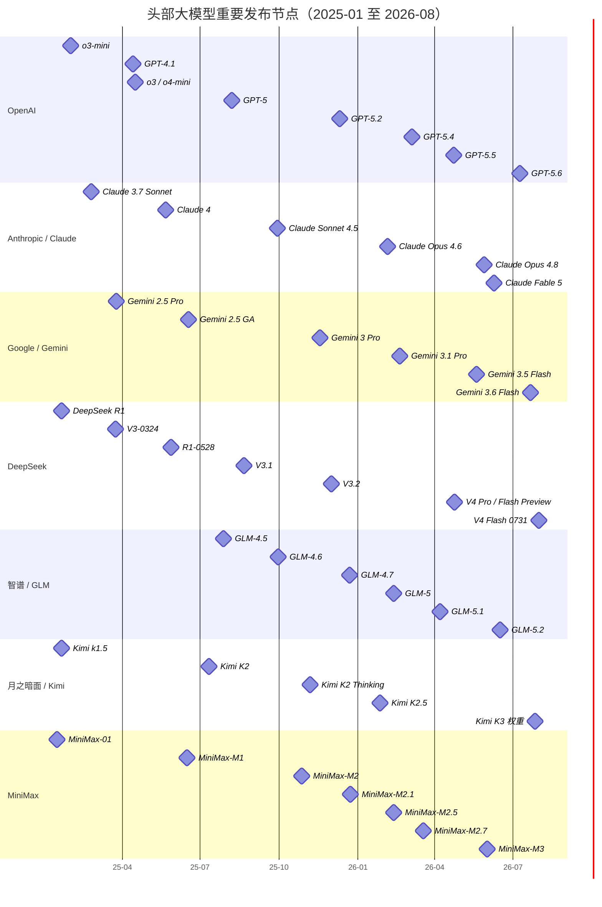

# 头部大模型进展追踪：发布节点、优化主线与外部反馈

这不是一张“谁最强”的总榜，而是一套持续回答三个问题的本地情报库：

1. **什么时候发生了真正改变产品或技术路线的发布？**
2. **这次发布相对上一代到底优化了什么，而不是罗列了哪些同类标配？**
3. **官方主张之外，独立评测、开发者实测和社区讨论分别如何反应？**

追踪对象按公司统一为：**OpenAI、Anthropic（Claude）、Google DeepMind（Gemini）、DeepSeek、智谱 AI / Z.ai（GLM）、月之暗面 / Moonshot AI（Kimi）、MiniMax**。首版详细事件以 2026 年 6—7 月的当前主线模型为种子，2025 年以来的节点先作为稀疏历史基线；后续每次重要发布新增一条独立事件笔记。

> [!important] 口径
> “优化重点”表示本次发布相对其自身基线的投入方向，不表示跨公司的绝对能力高低。“外部反馈”必须标明证据层级；没有足够样本时写“未形成稳定共识”，不写“全网好评/差评”。

## 当前一屏总览

| 公司 / 当前事件 | 发布节点 | 相对上一代的真实增量 | 外部反馈（截至 2026-08-03） | 最值得继续验证 |
|---|---:|---|---|---|
| [[2026-07-09 OpenAI GPT-5.6]] | 2026-07-09 | Sol / Terra / Luna 三档；更强长程 Agent、电脑操作与成品交付；Programmatic Tool Calling、多 Agent 与更明确的缓存契约 | 独立综合评测认可能力前沿；同时指出 Sol 价格高、最大努力档慢且略冗长 | “更少 token 完成任务”能否在自有工作流持续降低总成本，而非只在官方伙伴评测成立 |
| [[2026-06-09 Anthropic Claude Fable 5]] | 2026-06-09；07-01 恢复全球服务 | 从 Opus 级进入 Mythos 级的长程自主工作；以 Fable 安全配置和 Opus 4.8 fallback 控制高风险能力 | 能力评价很强，但 $10/$50 的价格、fallback 混入评测、短暂停服及更严格分类器的误拒绝成为同等重要的话题 | 把 fallback、拒绝率和成本固定后，纯模型的长程成功率还剩多少 |
| [[2026-07-21 Google Gemini 3.6 Flash]] | 2026-07-21 | 把前沿能力进一步压进 Flash 档；官方强调比 3.5 Flash 少用 17% 输出 token，继续覆盖原生多模态与 1M 上下文 | 外部评测的核心印象是“快、相对省、能力足够强”，而非最高上限；输出吞吐很高 | 首 token 等待、长上下文真实召回与复杂 Agent 成功率是否匹配高吞吐 |
| [[2026-07-31 DeepSeek V4 Flash 0731]] | 2026-07-31 | 架构和规模不变，只做再后训练；重点补 Agent、Responses API 与 Codex 适配 | 价格/吞吐/能力比获得明显正面反馈；代价是最大努力档输出极其冗长，且当前只升级 Flash API | 低单价是否会被高 token 消耗抵消；V4-Pro 正式版是否保持同一路线 |
| [[2026-06-16 智谱 GLM-5.2]] | 2026-06-16 | 1M 上下文、项目级 Coding 与长程任务稳定性；延续开放权重路线 | 独立评测显示开源模型中能力和速度都强；但在同体量开放模型里 API 较贵、输出很冗长 | 1M“无损”上下文和工程规范遵循需要第三方长任务重放验证 |
| [[2026-07-27 月之暗面 Kimi K3]] | 2026-07-27（完整权重） | KDA / MLA、Attention Residuals、Stable LatentMoE 三条信息流协同；原生多模态、1M 上下文、长程 Agent RL 与量化感知部署 | 独立综合评测将其放在开放权重前沿；主要保留意见是 API 慢且贵、输出冗长、2.8T 权重部署门槛极高 | 架构效率能否转化为可复现的服务成本；不同 harness 下的长程能力是否稳定 |
| [[2026-06-01 MiniMax M3]] | 2026-06-01 | MiniMax Sparse Attention、1M 上下文、原生图像/视频与电脑操作合并到一个开放权重模型 | 外部评测认可价格、速度和相对简洁；绝对综合能力仍低于最强闭源档，发布期套餐变化也分散了技术关注 | 权重开放后的真实部署效率，以及 1M 上下文下的召回与 Agent 可靠性 |

## 当前综合判断

1. **竞争单位已经从“回答一次问题”迁移到“在环境里持续工作并交付成品”。** 七家公司最近一代的共同关键词不再只是推理和 Coding，而是长程 Agent、工具调用、电脑操作、上下文压缩/缓存、并行子 Agent 与可验证交付。
2. **1M context 正在成为发布标配，但“窗口长度”仍不是“有效记忆”。** 当前七条事件里除个别文本模型外，1M 已高度普及；真正差异转向稀疏/线性注意力、缓存协议、上下文压缩、训练任务和长程稳定性。
3. **能力上限与单位经济性分成两条战线。** Fable 5、GPT-5.6 Sol 争夺最高能力和复杂工作；Gemini Flash、DeepSeek Flash、GLM、MiniMax 与 Kimi 则在开放性、吞吐、价格和部署自由度上施压。低 token 单价不等于低任务成本，仍要同时看成功率、重试、输出 token 和端到端耗时。
4. **模型与 harness 已无法干净分开。** Programmatic Tool Calling、Responses API、Codex/Claude Code/Kimi Code 适配、context compaction、subagents 都会显著改变结果。任何跨模型 Agent 榜单都必须记录 harness、effort、工具、fallback、硬件和预算。

## 2025—2026 稀疏时间轴

这张图只保留会改变代际判断的节点；API 小修、单一模态模型和纯产品活动默认不进入。早期节点用于建立比较基线，详细舆论尚未全部回填。

## 本轮发布在优化什么

符号表示**本次发布的叙事和技术投入强度**：`◎` 核心增量，`○` 次要增量，`—` 不是本次主线。它不是能力评分。

| 事件 | 推理 | Coding | Agent / 工具 | 多模态 | 长上下文 | 效率 / 成本 | 开放权重 | 安全 / 治理 |
|---|:---:|:---:|:---:|:---:|:---:|:---:|:---:|:---:|
| GPT-5.6 | ○ | ◎ | ◎ | ○ | ○ | ◎ | — | ◎ |
| Claude Fable 5 | ◎ | ◎ | ◎ | ○ | ◎ | ○ | — | ◎ |
| Gemini 3.6 Flash | ○ | ○ | ○ | ◎ | ◎ | ◎ | — | ○ |
| DeepSeek V4 Flash 0731 | ○ | ◎ | ◎ | — | ○ | ◎ | ◎ | — |
| GLM-5.2 | ○ | ◎ | ◎ | — | ◎ | ○ | ◎ | — |
| Kimi K3 | ◎ | ◎ | ◎ | ◎ | ◎ | ◎ | ◎ | ○ |
| MiniMax M3 | ○ | ◎ | ◎ | ◎ | ◎ | ◎ | ◎ | ○ |

## 怎样记录“舆论反应”

舆论不是一个分数，而是四层证据：

| 层级 | 记录内容 | 能说明什么 | 不能说明什么 |
|---|---|---|---|
| A：独立评测 | 固定版本、价格、速度、任务设置与结果 | 在明确条件下的能力/效率位置 | 所有真实工作流的体验 |
| B：开发者实测 | 可复现任务、日志、代码或成品 | 某类任务中的稳定行为与失败模式 | 整体用户群的看法 |
| C：媒体与从业者评论 | 有署名、有基线的分析或客户评测 | 市场关注点和采用信号 | 纯模型因果；客户引语也可能带合作偏差 |
| D：社区样本 | Reddit、Hacker News、知乎、GitHub Issues 等 | 新问题线索与争议方向 | 总体舆情比例或事实本身 |

每条事件最终只使用六种反馈标签：`正面`、`正面但有保留`、`分歧`、`负面`、`未形成`、`待核验`。标签只概括证据状态，不能替代来源与测试条件。

## 与既有知识库的连接

- [[Kimi K3 核心技术解析：三维信息流、百万上下文与长程 Agent 训练]]：K3 的结构、训练、推理系统和证据边界；本追踪页只保留跨公司可比较的摘要。
- [[大模型与强化学习的协同演进：从SFT、PPO到DPO、GRPO与Agentic-RL]]：解释为什么厂商从答案级偏好优化转向可验证任务、长轨迹和 Agentic RL。
- [[AR与KV-cache]]：解释 1M context、prefix cache、context compaction 与实际服务成本之间的差异。

## 固定资料入口

- OpenAI：[Research releases](https://openai.com/research/index/release/)；当前代际 [GPT-5.6](https://openai.com/index/gpt-5-6/)
- Anthropic：[Newsroom](https://www.anthropic.com/news)；当前代际 [Claude Fable 5 / Mythos 5](https://www.anthropic.com/news/claude-fable-5-mythos-5)
- Google：[Gemini API release notes](https://ai.google.dev/gemini-api/docs/changelog)；当前 [Gemini 3.6 Flash](https://deepmind.google/models/gemini/flash/)
- DeepSeek：[API Change Log](https://api-docs.deepseek.com/updates/)
- 智谱：[新品发布](https://docs.bigmodel.cn/cn/update/new-releases)
- 月之暗面：[Kimi 技术博客](https://www.kimi.com/blog)；当前 [Kimi K3](https://www.kimi.com/blog/kimi-k3)
- MiniMax：[模型发布](https://www.minimax.io/blog)；当前 [MiniMax M3](https://www.minimax.io/blog/minimax-m3)
- 跨模型独立基线：[Artificial Analysis](https://artificialanalysis.ai/)

## 下一轮更新优先级

1. 回填 2025 年关键节点的详细事件笔记，优先补 GPT-5、Claude 4、Gemini 2.5、DeepSeek R1、GLM-4.5、Kimi K2、MiniMax M2。
2. 为七家公司建立一套相同的本地任务切片：代码修复、网页/文档成品、长文档召回、搜索型 Agent、成本与耗时。
3. 每月只保留“判断变化”：新模型、价格/可用性变化、独立复现、严重回归、采用证据或官方修正；不重复抄发布文案。
