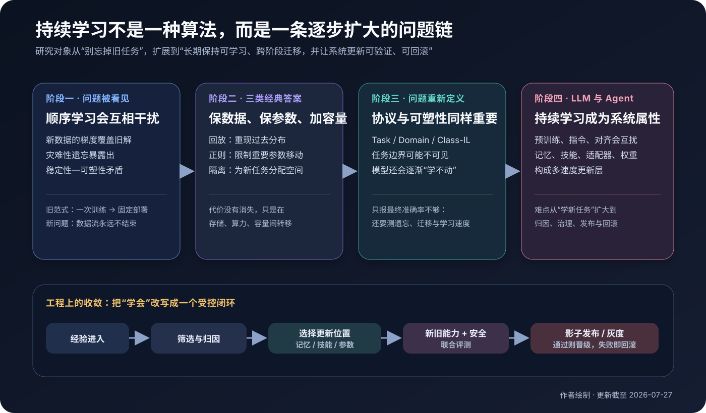
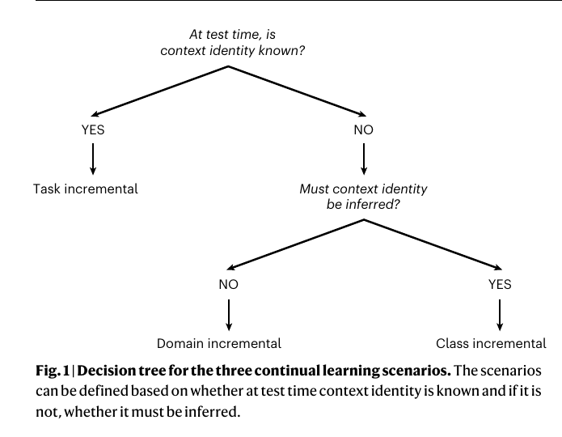
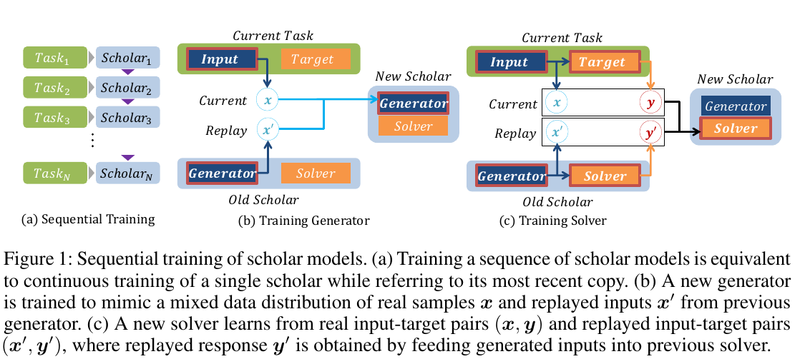
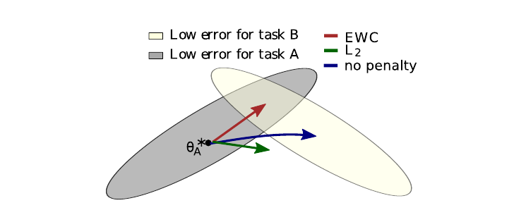
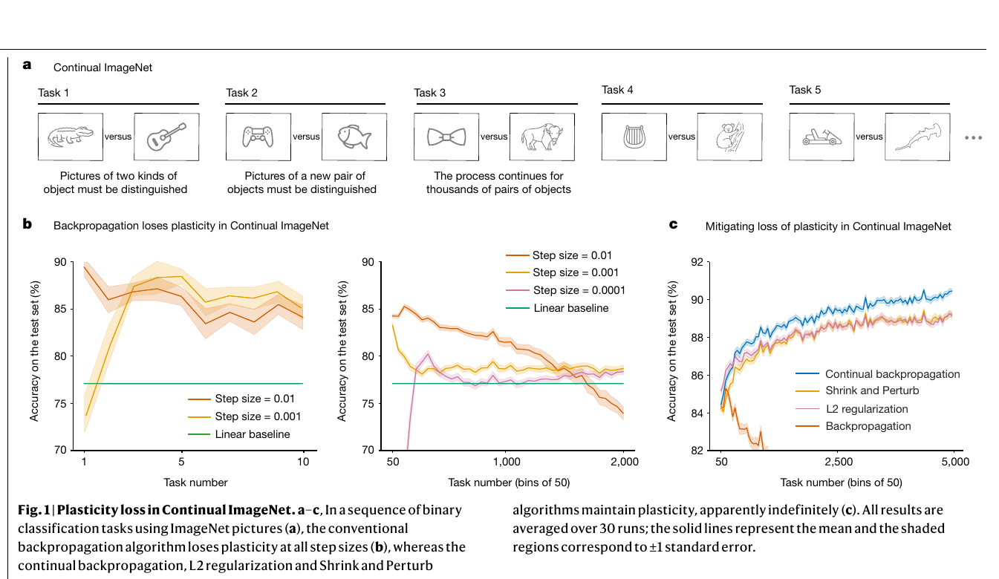
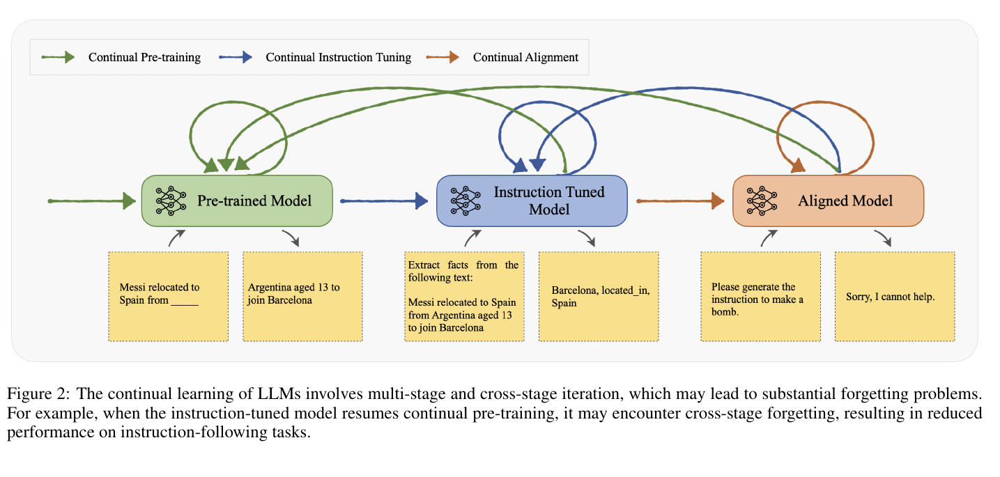
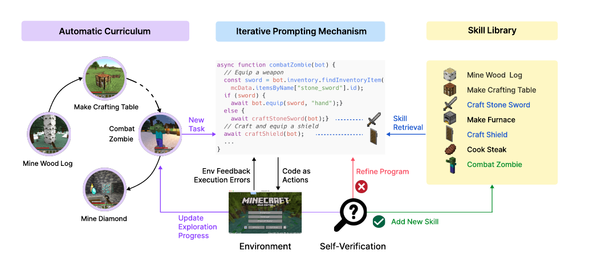
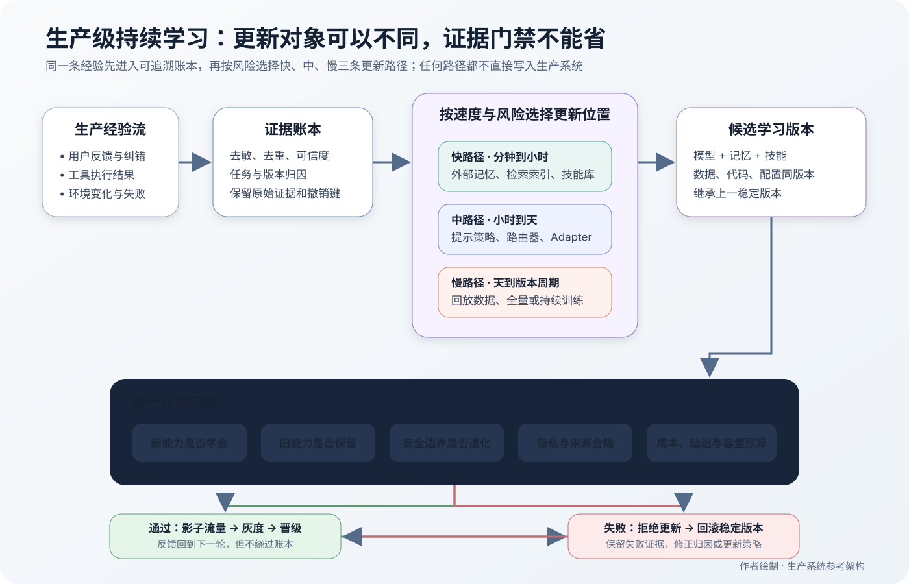

# 持续学习：从灾难性遗忘到会积累经验的 Agent



*图 1 持续学习的技术演进。它不是某个算法名称，而是一条不断扩大的问题链：先是不忘旧任务，继而要分清学习协议、长期保持可塑性，最终还要让记忆、技能、参数更新与生产治理形成闭环。作者绘制。*

## 0. 为什么此刻重新看“持续学习”：梁文锋把它放在 Agent 之后

我开始系统追这个问题，直接契机是梁文锋的一次发言。

2026 年 7 月 23 日，《每日经济新闻》刊出一份闭门交流实录。报道说，交流发生在 2026 年 5 月，实录经参投机构核实；截至发稿，DeepSeek 没有正式回应。按照这份**经媒体转述、但并非 DeepSeek 官方技术文档**的材料，梁文锋把 Agent 之后的关键问题指向“持续学习”：今天的 Agent 还不能像员工一样，在一次次工作中积累经验；人类不得不反复交代背景、方法与要求。他还说，“学习可能不是一项技术，而是一个问题”，需要很多算法与工程技术共同解决。[闭门会实录整理](https://www.nbd.com.cn/articles/2026-07-23/4504670.html)

这段话值得重视，不是因为它宣布了一个已经实现的产品路线，而是因为它把问题问对了：

> 一个系统完成了今天的任务，明天究竟留下了什么？  
> 是聊天记录，是可检索的案例，是一段可靠技能，是更好的策略，还是已经改变的模型参数？

如果什么也没留下，那么 Agent 只是“这一次做得不错”。如果新经验直接写进系统，却破坏了旧能力、安全边界或其他用户的数据，那么它不是学习，而是一次没有回归测试的线上修改。

梁文锋所说的持续学习，比机器学习论文中的 Continual Learning 更宽。学术研究通常先问：模型顺序接收数据或任务时，怎样学新而不忘旧？“员工式成长”还要多问三层：哪些经历值得学、应该写到哪里、如何证明更新可以安全进入生产。因此，本文会从严格定义开始，但最终回到这个更大的系统问题。

> [!abstract] 先给结论
> **持续学习不是让 AI 拥有更长上下文，也不是每晚自动微调一次。它是系统在非平稳经验流中吸收可复用变化，同时保留旧能力、保持未来的可学习性，并让每次更新都可评测、可追溯、可回滚。**

---

## 1. 先建立心智模型：在一条永不结束的数据流上学习

传统监督学习偷偷假设了一个终点：

1. 收集一份固定数据集；
2. 训练模型；
3. 在独立测试集上评测；
4. 固定参数并部署。

持续学习撤掉了这个终点。模型依次经历

$$
\mathcal{E}_1,\mathcal{E}_2,\ldots,\mathcal{E}_T,\ldots
$$

其中每段经验 $\mathcal{E}_t$ 可以包含数据 $D_t$、任务上下文 $c_t$ 和反馈 $r_t$。它们来自随时间变化的分布：

$$
(x,y)\sim p_t(x,y),\qquad p_t\neq p_{t+1}.
$$

模型在第 $t$ 段经验后从 $\theta_{t-1}$ 更新为 $\theta_t$。目标不只是让 $\theta_t$ 在 $D_t$ 上变好，还要：

- **可塑性（plasticity）**：足够快地学会新知识和新技能；
- **稳定性（stability）**：不无缘无故破坏过去仍然有效的能力；
- **迁移（transfer）**：旧经验最好能帮助新任务，新经验也可能反过来改善旧任务；
- **资源可持续**：存储、训练算力和模型容量不能随时间无限增长；
- **更新可治理**：知道为何更新、更新了什么，出问题时能撤销。

前两项构成著名的**稳定性—可塑性困境**。把参数完全锁死，模型稳定但学不会；只盯着新数据更新，模型可塑却可能遗忘。

### 1.1 持续学习不等于哪些相邻概念

这些技术经常一起出现，但它们回答的是不同问题：

| 技术 | 它改变什么 | 主要解决什么 | 为什么不自动等于持续学习 |
|---|---|---|---|
| 长上下文 | 本次推理可见的 Token | “这次能看见多少” | 会话结束后模型和系统未必留下可复用变化 |
| RAG / 外部知识库 | 推理时可检索的信息 | “过去信息能否找回” | 检索到不代表已内化、会组合或改变策略 |
| 长期记忆 | 跨会话保存的状态或事件 | 个性化与经历延续 | 未验证的记忆可能错误、过时或污染行为 |
| 模型编辑 | 少量局部事实或关联 | 快速修补一个知识点 | 常不覆盖长期序列、跨任务迁移与持续可塑性 |
| 在线学习 | 数据逐条或小批到达时更新 | 更新时机与数据访问方式 | 可以在线学习却不断遗忘；也可以离线周期性做持续学习 |
| 周期性微调 | 定期改变参数 | 适配新数据 | 如果不评测旧能力和安全边界，只是版本迭代 |
| 持续学习 | 未来行为中的可保留变化 | 学新、保旧、迁移、长期可学 | 它是一组目标与协议，不限定更新必须写入权重 |

一个简单判据是：

> 下一次遇到相关问题时，系统是否因为这次经历而稳定地做得更好；这种改善是否经过了新旧任务和安全评测？

只把对话塞进向量库，通常只能证明“能找回”；要证明“学会”，还要观察行为变化、跨情境迁移和副作用。

---

## 2. 不先声明学习协议，算法比较就没有意义

“连续做十个任务”听起来很明确，其实至少有三种不同难度。关键差别是：测试时，模型是否知道当前处于哪个上下文，以及输出空间是否不断扩张。



*图 2 三种增量学习协议的判别路径。先问推理时是否需要上下文，再问上下文是否给定，便得到 Task-、Domain- 与 Class-Incremental Learning。原论文 Fig. 1；来源：[Three types of incremental learning](https://www.nature.com/articles/s42256-022-00568-3)，版权归原作者。*

### 2.1 Task-Incremental Learning：任务身份已知

模型先学识别猫狗，再学识别汽车卡车；测试时外部系统明确告诉它当前是哪项任务。模型可以使用不同输出头或任务专属模块：

$$
\hat y=f_{\theta,c_t}(x).
$$

这是三类中相对容易的一类，因为任务路由问题由外部解决了。很多“几乎没有遗忘”的结果，都隐含了测试时提供 task ID 这一强假设。

### 2.2 Domain-Incremental Learning：输入分布变了，任务没变

例如同样做情感分类，数据依次来自电影、餐饮和社交媒体；或机器人在不同光照、相机和场景中执行同一动作。标签含义和输出空间不变，推理时不需要任务 ID：

$$
p_t(x)\ \text{变化},\qquad p(y\mid x)\ \text{的语义目标基本不变}.
$$

真实产品中的季节变化、语言风格变化和传感器漂移常接近这个协议，但边界通常不像实验室数据那样整齐。

### 2.3 Class-Incremental Learning：类别不断增加，测试时不告诉任务

模型先认识猫狗，再认识汽车卡车；最终测试时面对所有类别，必须在一个统一输出空间里判断。它不仅要保留旧分类边界，还要隐式判断输入来自哪部分知识：

$$
\hat y\in \mathcal Y_1\cup\mathcal Y_2\cup\cdots\cup\mathcal Y_t.
$$

这是经典三类中最难的一类。只保住每个任务内部的区分还不够，新旧类别的分数必须可比较。

### 2.4 真实世界还多了三层困难

- **Task-free**：任务何时切换没有明确边界，系统需要自己检测变化。
- **Open-world**：不仅分布变化，还会出现未知类别、全新工具和从未定义的目标。
- **Multi-user**：不同用户的经验可能冲突，个性化学习不能污染全局模型。

所以读任何持续学习论文，先找四行实验设定：任务边界是否可见、测试时是否给 task ID、旧数据能保留多少、输出空间是否增长。缺少这四项，单看最终准确率很容易误判。

---

## 3. 灾难性遗忘为何发生：新梯度可能在拆旧房子

假设模型在旧经验上的损失为 $\mathcal L_{\text{old}}$，新经验的梯度为

$$
g_{\text{new}}=\nabla_\theta \mathcal L_{\text{new}}(\theta).
$$

一次普通梯度更新是

$$
\theta'=\theta-\eta g_{\text{new}}.
$$

在旧损失附近做二阶展开：

$$
\mathcal L_{\text{old}}(\theta')
\approx
\mathcal L_{\text{old}}(\theta)
-\eta g_{\text{old}}^\top g_{\text{new}}
+\frac{\eta^2}{2}g_{\text{new}}^\top H_{\text{old}}g_{\text{new}}.
$$

如果 $g_{\text{old}}^\top g_{\text{new}}<0$，学习新任务所需的方向与旧任务相冲突，旧损失会在一阶项上增加。即使点积为正，步长过大或旧解处曲率很高，二阶项也会造成破坏。

这给出三个直觉：

1. **遗忘不是模型“存储满了”才发生。** 一次不合适的更新就可能移动关键决策边界。
2. **参数多不等于自动不遗忘。** 过参数化提供了更多可能解，却没有告诉优化器哪条路径既学新又保旧。
3. **只看新数据无法知道哪些旧能力被破坏。** 优化器需要旧数据、参数重要度、独立模块或其他保留信号。

如果所有历史数据都能永久保存，把新旧数据混合起来联合训练通常是很强的上界。但现实中，原始数据可能受隐私、版权、存储和时效约束；而且模型规模越大，反复全量重训越昂贵。持续学习研究的本质，就是在“不能每次从头联合训练”的约束下近似它。

---

## 4. 三条经典路线：重放过去、保护参数、隔离容量

大多数方法都可写成一个母目标：

$$
\mathcal L_t(\theta)=
\mathcal L_{\text{new}}(\theta;D_t)
+\lambda\mathcal L_{\text{retain}}(\theta;M_{<t})
+\beta\Omega(\theta,\theta_{t-1}).
$$

$D_t$ 是新数据，$M_{<t}$ 是过去经验的某种表示，$\mathcal L_{\text{retain}}$ 用行为重放保旧，$\Omega$ 用参数或表示约束保旧。不同算法的区别，是“过去以什么形式存在”。

### 4.1 Replay：让旧经验重新参与梯度

最直接的办法是保留一小部分旧样本，与新数据混合训练：

$$
\mathcal L_{\text{replay}}
=
\rho\,\mathbb E_{(x,y)\sim D_t}\ell(f_\theta(x),y)
+(1-\rho)\,\mathbb E_{(x,y)\sim M_{<t}}\ell(f_\theta(x),y).
$$

回放之所以常成为强基线，是因为它直接修复了问题根源：优化器再次看见旧分布。缓存可用 reservoir sampling 保持对历史流的近似均匀采样，也可按类别、难度、梯度多样性或业务风险选择。

如果不能保存原始数据，可以训练生成模型产生“伪历史”。[Deep Generative Replay](https://arxiv.org/abs/1705.08690) 把系统拆成 generator 与 solver：旧 generator 生成过去输入，旧 solver 给出目标，再与新数据联合训练新的两部分。



*图 3 Deep Generative Replay 的数据流。箭头表明旧模型不只是初始化新模型，还负责生成训练约束；因此它能否接近联合训练，取决于生成分布和旧目标的保真度。原论文 Fig. 1；来源：[Continual Learning with Deep Generative Replay](https://arxiv.org/abs/1705.08690)，版权归原作者。*

回放不是免费午餐：

- 原样本回放有隐私、版权和存储风险；
- 小缓存会低估长尾与少数群体；
- 生成回放可能逐代漂移，把生成器的偏差当成历史事实；
- LLM 的完整预训练分布极其庞大，少量 replay 很难完整代表旧能力。

### 4.2 Regularization：重要参数少动，不重要参数多学

[Elastic Weight Consolidation（EWC）](https://arxiv.org/abs/1612.00796) 从贝叶斯更新出发：

$$
p(\theta\mid D_{\le t})
\propto
p(D_t\mid\theta)\,p(\theta\mid D_{<t}).
$$

旧数据不再可用时，用旧任务最优点 $\theta^*_{t-1}$ 附近的二次函数近似后验。对角 Fisher 信息 $F_i$ 近似参数 $\theta_i$ 对旧任务的重要度：

$$
\mathcal L_{\text{EWC}}
=
\mathcal L_t
+\frac{\lambda}{2}\sum_i
F_i(\theta_i-\theta^*_{t-1,i})^2.
$$

$F_i$ 大，参数稍微移动就受重罚；$F_i$ 小，新任务可以更多使用这部分自由度。



*图 4 EWC 的参数空间直觉。蓝色区域代表旧任务，灰色区域代表新任务；只优化新任务会走向灰色中心，EWC 用旧任务的局部曲率形成约束，在两者之间寻找折中。原论文 Fig. 1；来源：[Overcoming catastrophic forgetting in neural networks](https://arxiv.org/abs/1612.00796)，版权归原作者。*

EWC 的优点是无需保存大量旧样本，附加状态也相对清楚；局限同样来自它的近似：

- 对角 Fisher 忽略参数之间的相关性；
- 只在旧解附近做局部二次近似，任务差异大时可能失真；
- 多任务累积约束后，模型可能越来越难移动；
- “参数重要”不等于“某项行为一定被保住”，最终仍需行为回归测试。

知识蒸馏、Learning without Forgetting、表示一致性等方法也属于广义正则路线：它们不一定固定参数，而是要求新模型在旧输入或代理输入上模仿旧模型的输出或中间表示。

### 4.3 Parameter isolation：给新任务新的空间

[Progressive Neural Networks](https://arxiv.org/abs/1606.04671) 为每项新任务增加一列网络，冻结旧列，再用 lateral connection 读取旧表征。旧参数不被改写，因此从结构上避免遗忘。

后续方法把“整列网络”改成：

- task-specific adapter 或 LoRA；
- 可路由的 expert；
- mask 或子网络；
- 必要时动态扩容。

这条路线把干扰换成了容量与路由问题。任务越来越多，模块可能无限增长；task ID 不可见时，系统还必须判断调用哪个模块。不同模块的输出是否处在可比较尺度，也是 Class-Incremental 场景的难点。

### 4.4 三条路线不是替代关系

| 路线 | 过去以什么形式存在 | 最强优势 | 主要代价 | 更适合 |
|---|---|---|---|---|
| Replay | 原样本、特征或生成样本 | 直接约束旧行为，通常是强基线 | 存储、隐私、采样偏差 | 允许保留代表性历史数据 |
| Regularization | 参数重要度、旧 logits、旧表示 | 不必保存大量原始数据 | 近似误差、约束逐渐僵化 | 任务相近、存储严格受限 |
| Isolation | 冻结模块、Adapter、Expert | 干扰小，版本边界清晰 | 容量增长、路由复杂 | 任务边界清楚或多租户场景 |
| Hybrid | 上述多种表示 | 在保留与可塑性间更稳 | 系统和调参复杂 | 真实大模型与生产系统 |

现实系统经常混合使用：小型高价值回放集 + 参数高效适配器 + 蒸馏约束。问题不在于押中某个算法，而是知道每一种保留信号覆盖了什么盲区。

### 4.5 一个最小的 Replay + EWC 训练步骤

下面的 PyTorch 代码展示机制，而不是完整框架。`anchor` 和 `fisher` 应在上一阶段训练完成后估计并冻结；`replay_batch` 来自有版本记录、经过隐私审查的缓存。

```python
from collections.abc import Mapping

import torch
import torch.nn.functional as F


def ewc_penalty(
    model: torch.nn.Module,
    anchor: Mapping[str, torch.Tensor],
    fisher: Mapping[str, torch.Tensor],
) -> torch.Tensor:
    penalty = torch.zeros((), device=next(model.parameters()).device)
    for name, parameter in model.named_parameters():
        if name in anchor and name in fisher:
            penalty = penalty + (
                fisher[name] * (parameter - anchor[name]).pow(2)
            ).sum()
    return penalty


def continual_step(
    model: torch.nn.Module,
    optimizer: torch.optim.Optimizer,
    current_batch: tuple[torch.Tensor, torch.Tensor],
    replay_batch: tuple[torch.Tensor, torch.Tensor] | None,
    anchor: Mapping[str, torch.Tensor],
    fisher: Mapping[str, torch.Tensor],
    replay_weight: float = 0.3,
    ewc_weight: float = 1_000.0,
) -> dict[str, float]:
    current_x, current_y = current_batch
    current_loss = F.cross_entropy(model(current_x), current_y)

    replay_loss = torch.zeros_like(current_loss)
    if replay_batch is not None:
        replay_x, replay_y = replay_batch
        replay_loss = F.cross_entropy(model(replay_x), replay_y)
        data_loss = (
            (1.0 - replay_weight) * current_loss
            + replay_weight * replay_loss
        )
    else:
        data_loss = current_loss

    retain = ewc_penalty(model, anchor, fisher)
    loss = data_loss + 0.5 * ewc_weight * retain

    optimizer.zero_grad(set_to_none=True)
    loss.backward()
    optimizer.step()
    return {
        "loss": float(loss.detach()),
        "current_loss": float(current_loss.detach()),
        "replay_loss": float(replay_loss.detach()),
        "ewc_penalty": float(retain.detach()),
    }
```

读代码时要看到三股力：`current_loss` 提供可塑性，`replay_loss` 直接守住旧行为，`ewc_penalty` 限制重要参数漂移。权重没有理论上通用的最佳值，必须根据新任务学习速度、旧任务遗忘和资源预算共同选择。

---

## 5. 比“忘记旧知识”更隐蔽的问题：模型会逐渐失去可塑性

假设模型没有明显忘记任务 1，但到了任务 500，它已经无法像最初那样快速学会新任务。这是**可塑性丧失（loss of plasticity）**，与灾难性遗忘不同：

- 灾难性遗忘问：过去会做的事，现在还会吗？
- 可塑性丧失问：面对同等难度的新事物，现在还能学得动吗？

2024 年的 Nature 论文 [Loss of plasticity in deep continual learning](https://www.nature.com/articles/s41586-024-07711-7) 构造 Continual ImageNet：模型连续学习成千上万个由 ImageNet 类别组成的二分类任务。普通反向传播在后期新任务上的学习能力持续下降；论文提出的 continual backprop 会持续替换低效用特征，使模型在该基准上长期保持学习能力。



*图 5 可塑性丧失不是旧任务准确率下降，而是同类新任务越来越学不好。图 b 中普通反向传播的后期表现下降；图 c 展示 continual backprop 等干预在该实验设置中的效果。原论文 Fig. 1；来源：[Loss of plasticity in deep continual learning](https://www.nature.com/articles/s41586-024-07711-7)，版权归原作者。*

论文观察到的相关机制包括：长期训练后特征多样性下降、部分单元不再活跃、权重规模增长，以及优化路径逐渐僵化。它不意味着“随机重置几个神经元”已经解决所有大模型持续学习，而是纠正了评测目标：

> 一个真正长期学习的系统，不仅要保存昨天的能力，还要保存明天继续学习的能力。

这也揭示 EWC 一类保护方法的张力。约束越来越多，旧能力可能更稳定，但参数自由度可能越来越少。最好的保留分数，不一定对应最好的长期生命力。

---

## 6. 怎样判断真的学会了：用准确率矩阵而不是一个总分

设模型依次学习 $T$ 项经验。$a_{i,j}$ 表示模型完成第 $i$ 项训练后，在第 $j$ 项任务上的得分。把所有结果排成矩阵：

$$
A=
\begin{bmatrix}
a_{1,1} & - & - & \cdots \\
a_{2,1} & a_{2,2} & - & \cdots \\
\vdots & \vdots & \ddots & \\
a_{T,1} & a_{T,2} & \cdots & a_{T,T}
\end{bmatrix}.
$$

这张矩阵比最终平均分信息丰富得多。

### 6.1 最终平均准确率

$$
\operatorname{AvgAcc}_T=\frac{1}{T}\sum_{j=1}^{T}a_{T,j}.
$$

它回答最终整体能力多强，但无法区分“旧任务忘得少”和“新任务根本没学会”。一个把参数完全冻结的模型可能低遗忘，却有极差可塑性。

### 6.2 平均遗忘

$$
\operatorname{Forgetting}_T
=
\frac{1}{T-1}
\sum_{j=1}^{T-1}
\left(
\max_{k\in\{j,\ldots,T-1\}} a_{k,j}
-a_{T,j}
\right).
$$

它比较旧任务历史最好成绩与最终成绩。值越小通常越好，但如果任务从没学会，遗忘也会看起来很小，所以必须与初次学习分数一起报告。

### 6.3 后向迁移 BWT

$$
\operatorname{BWT}_T
=
\frac{1}{T-1}
\sum_{j=1}^{T-1}(a_{T,j}-a_{j,j}).
$$

BWT 为负表示后来学习损害旧任务；为正表示新经验反而改善旧任务。它比“遗忘”更直接表达更新的净影响。

### 6.4 前向迁移 FWT

在学习任务 $j$ 之前，用模型得分 $a_{j-1,j}$ 与随机初始化或不使用旧经验的基线 $b_j$ 比较：

$$
\operatorname{FWT}
=
\frac{1}{T-1}\sum_{j=2}^{T}(a_{j-1,j}-b_j).
$$

FWT 衡量过去经验是否让新任务更容易。如果持续学习只是把各任务互不干扰地存起来，BWT 可能很好，FWT 却未必为正。

### 6.5 可塑性怎样量化：测“固定预算内填平了多少能力缺口”

遗忘有相对成熟的 Forgetting 与 BWT，可塑性却没有一个脱离实验协议的通用标量。原因是当前任务得分同时混合了三件事：

1. 任务本身有多难；
2. 旧经验是否已经带来前向迁移；
3. 模型在看到新数据后还能以多快速度改变。

[Loss of plasticity in deep continual learning](https://www.nature.com/articles/s41586-024-07711-7) 的做法是一种操作化测量：让模型连续面对难度分布保持稳定的新任务，每项任务使用相同训练预算，再观察当前任务的测试准确率是否随任务序号下降。在 Class-Incremental CIFAR-100 实验中，论文还把增量训练模型与同任务从头训练的模型比较。也就是说，可塑性不是直接从参数中读出的内在属性，而是**在控制任务与学习预算后，通过新任务学习曲线测出的能力**。

下面给出本文采用的一套操作性定义；它用于让实验可比较，不代表领域已经形成统一标准。

设：

- $S_t(k)$：连续模型在任务 $t$ 上更新 $k$ 步后的测试得分；
- $S_t(0)$：学习任务 $t$ 之前的得分；
- $S_t^\star$：相同模型从头充分训练或联合训练得到的参考上限；
- $K$：每个任务统一允许的更新步数、样本数或 Token 数；
- $\epsilon$：避免分母为零的极小常数。

先定义**终点可塑性**：

$$
P_t^{\text{end}}
=
\frac{S_t(K)-S_t(0)}
{S_t^\star-S_t(0)+\epsilon}.
$$

它衡量固定预算结束时，模型填平了多少剩余能力缺口：

- $P_t^{\text{end}}\approx1$：基本达到参考上限；
- $0<P_t^{\text{end}}<1$：学会了一部分，但没有完全适应；
- $P_t^{\text{end}}\approx0$：看到新数据后几乎没有改善；
- $P_t^{\text{end}}<0$：更新反而损害当前任务；
- $P_t^{\text{end}}>1$：超过所选参考上限，应检查参考模型是否训练充分。

终点相同的两个模型可能一个很快、一个很慢。因此还要计算**学习曲线可塑性**：

$$
P_t^{\text{AUC}}
=
\frac{1}{K}
\sum_{k=1}^{K}
\frac{S_t(k)-S_t(0)}
{S_t^\star-S_t(0)+\epsilon}.
$$

$P_t^{\text{AUC}}$ 是训练过程中平均填平的能力缺口，更敏感于学习速度与样本效率。如果更新成本很高，AUC 往往比最终成绩更有意义。

但任务 $t$ 可能天然比任务 $t-1$ 更难。为控制任务难度，应再训练一个相同架构、相同数据和相同预算的 **fresh model**，计算它的 $P_{t,\text{fresh}}^{\text{AUC}}$，并定义相对可塑性：

$$
R_t^{\text{plasticity}}
=
\frac{P_t^{\text{AUC}}}
{P_{t,\text{fresh}}^{\text{AUC}}+\epsilon}.
$$

- $R_t^{\text{plasticity}}\approx1$：连续模型仍保有与新模型相当的学习能力；
- $R_t^{\text{plasticity}}<1$：出现可塑性丧失；
- $R_t^{\text{plasticity}}>1$：旧表征帮助了新任务，可能存在正迁移。

对一条长度为 $T$ 的经验流，可以汇总为平均可塑性损失：

$$
\operatorname{LoP}_T
=
\frac{1}{T}
\sum_{t=1}^{T}
\max\left(0,\ 1-R_t^{\text{plasticity}}\right).
$$

值越大，表示连续模型相对 fresh model 的学习能力损失越严重。为了让“慢多少”更直观，还可以定义填平比例 $\tau$ 所需的训练预算：

$$
N_t(\tau)
=
\min\left\{
k:
S_t(k)\ge
S_t(0)+\tau\left(S_t^\star-S_t(0)\right)
\right\}.
$$

例如 $N_t(0.8)$ 表示填平 80% 能力缺口需要多少样本或更新步；越小越好。若在预算 $K$ 内从未达到阈值，应报告为 censored result，而不是擅自写成 $K$。

这套指标仍有三个边界：

- 如果 $S_t(0)$ 已经接近 $S_t^\star$，说明前向迁移很好，但剩余缺口太小，归一化指标会不稳定；这类任务应单独报告 $S_t(0)$，不参与可塑性平均。
- $S_t^\star$ 不是绝对真理，而是实验参考上限；必须说明它来自从头训练、联合训练还是更大预算。
- 模型结构、数据顺序、增强方式、优化器、学习率协议和预算 $K$ 必须固定，否则测到的是训练配置差异，不只是模型状态的可塑性。

因此，完整报告至少同时给出 $S_t(0)$、$P_t^{\text{end}}$、$P_t^{\text{AUC}}$、$R_t^{\text{plasticity}}$ 和 $N_t(\tau)$。不能只报一个可塑性总分。

把稳定性与可塑性放在两个轴上，四种系统状态就很清楚：

| 稳定性 | 可塑性 | 系统状态 |
|---|---|---|
| 高 | 高 | 理想：保留旧能力，也能快速学习 |
| 高 | 低 | “知识化石”：不遗忘，但越来越学不动 |
| 低 | 高 | “短期记忆”：新任务学得快，旧能力掉得也快 |
| 低 | 低 | 既保不住旧能力，也无法有效适应 |

### 6.6 生产评测还要补上四类指标

| 维度 | 要问的问题 | 可观测量 |
|---|---|---|
| 可塑性 | 新知识学得多快、样本效率是否下降 | $P^{\text{end}}$、$P^{\text{AUC}}$、$R^{\text{plasticity}}$、$N(\tau)$ |
| 校准与边界 | 不知道时会不会承认，旧事实更新后会不会混答 | ECE、拒答准确率、旧新事实冲突集 |
| 安全与隐私 | 更新是否削弱拒答、泄露训练样本或跨用户污染 | 安全回归、成员推断、删除请求、租户隔离 |
| 资源 | 每学一轮要付出多少 | 训练 FLOPs、缓存大小、延迟、模型增量、能耗 |

一份可信实验至少应包含四个参照：

1. **Naive sequential fine-tuning**：最容易遗忘的下界；
2. **Joint training**：可访问全部数据时的上界；
3. **No-update / frozen**：确认提升真的来自学习；
4. **From-scratch on new task**：检查长期模型是否已经失去可塑性。

还要报告多种任务顺序和随机种子。持续学习对顺序高度敏感，只挑一个顺序可能把偶然正迁移写成算法能力。

---

## 7. 大模型让问题变大：三个训练阶段会跨阶段互相遗忘

LLM 的持续学习不能只理解成“不断追加预训练语料”。[Continual Learning of Large Language Models: A Comprehensive Survey](https://arxiv.org/abs/2402.01364) 把它拆成三个阶段：

1. **Continual Pre-training（CPT）**：持续吸收新事实、领域、语言与数据分布；
2. **Continual Instruction Tuning（CIT）**：不断学习新任务、指令形式和工具；
3. **Continual Alignment（CA）**：随人类偏好、政策和社会规范更新行为边界。



*图 6 LLM 持续学习的三阶段框架。图中的跨阶段箭头很关键：新领域预训练可能破坏指令跟随，学习新工具可能改变安全行为，对齐更新也可能压低原本有用的能力。原论文 Fig. 2；来源：[Continual Learning of Large Language Models: A Comprehensive Survey](https://arxiv.org/abs/2402.01364)，版权归原作者。*

### 7.1 Continual pre-training：吸收新世界，但不要丢掉语言与推理底座

持续预训练适合更新大规模领域分布，例如新代码生态、医学文本或新语言。工程上常用：

- 新旧语料混合 replay；
- 学习率 re-warm 后重新衰减；
- 按领域控制采样比例；
- 在通用能力、领域能力和安全集上同时回归。

困难在于新语料的 Token 目标只告诉模型“怎样预测这批文本”，不保证它仍会遵循指令、调用工具或拒绝危险请求。预训练 loss 下降不能代表产品能力净提升。

### 7.2 Continual instruction tuning：不断学工具，也可能丢掉通用指令能力

[TRACE](https://openreview.net/forum?id=3qa4YLkcEw) 用八个跨领域、跨语言、代码与数学任务构造顺序指令学习基准。论文报告，直接顺序微调会显著破坏先前任务与通用能力；其中一个特定实验里，Llama-2-chat-13B 的 GSM8K 成绩从 43.14% 降到 2.12%。这个数字只属于该模型、任务顺序与评测配置，不能推广成所有 LLM 的固定遗忘率，但它说明“参数大”没有消除梯度干扰。

对 LLM，参数隔离格外有吸引力：每个领域使用 LoRA/Adapter，底座保持稳定。但系统随即面对路由、模块组合和版本爆炸。两个单独有效的 Adapter 叠加后，也未必保留各自行为。

### 7.3 Continual alignment：旧偏好不是永恒真理，新规则也不能破坏底线

偏好、安全政策和文化规范都会变化。持续对齐必须同时处理：

- 新规则替代旧规则时，哪些旧行为应被主动遗忘；
- 新偏好只适用于某租户还是全局；
- 安全拒答是否被新任务微调削弱；
- 过度保护旧对齐是否阻碍正当能力。

所以“零遗忘”不是绝对目标。持续学习要保留的是**仍然有效且应当保留的知识**，同时允许有依据的纠错、撤销和删除。机器遗忘（machine unlearning）与持续学习在这里相遇：系统既要会加，也要会改、会删。

### 7.4 RAG、模型编辑与参数学习应该分层协作

更新并不总该写入权重：

- 明天可能变化的价格、库存、法规：优先检索；
- 一个明确错误、影响范围可定位的事实：可考虑模型编辑或小型 Adapter；
- 跨场景稳定出现的新技能：进入技能库、训练集或参数化学习候选；
- 基础语言、表征和广泛策略变化：才值得承担全量训练风险。

[MEMORYLLM](https://arxiv.org/abs/2402.04624) 等工作探索固定大小的潜在记忆池，让模型在不进行常规全量微调的情况下更新内部状态。这类研究模糊了“外部记忆”和“参数记忆”的边界，但仍需回答长期容量、干扰、可解释删除和跨任务组合问题。

截至 2026-07-27，[ImprintBench](https://openreview.net/forum?id=QIJgTW3Qd2) 进一步把“学会新信息”拆成获取、时序更新、指代解析、知识组合、隐含相关性与边界意识。检索式和训练式方法都存在系统性缺口：能复述一条新事实，不代表能在不同表述中正确引用、与旧知识组合，或在证据不足时克制。这正是“写进去”与“真正学会”的差别。

---

## 8. Agent 的持续学习：不改模型权重，也可以让系统积累技能

Agent 把持续学习从训练算法问题扩展成运行时问题。一次任务产生的不只是文本，还包括：

- 环境状态和工具观察；
- 成功或失败的执行轨迹；
- 可验证的代码与操作步骤；
- 用户纠正；
- 哪种策略在什么条件下有效。

[Voyager](https://arxiv.org/abs/2305.16291) 是一个清晰案例。它在 Minecraft 中用自动课程选择目标，依据环境反馈、执行错误与自我验证反复改写程序；成功的程序被存入可检索、可组合的技能库。



*图 7 Voyager 的三部分系统。自动课程决定接下来探索什么，迭代提示机制把环境反馈变成修正，技能库把通过验证的程序保留下来。底层 GPT-4 权重未在线更新，因此它证明的是外部技能驱动的系统级持续学习。原论文 Fig. 2；来源：[Voyager](https://arxiv.org/abs/2305.16291)，版权归原作者。*

Voyager 真正重要的不是 Minecraft 成绩，而是它给出一个最小闭环：

$$
\text{目标选择}
\rightarrow
\text{尝试}
\rightarrow
\text{环境验证}
\rightarrow
\text{修正}
\rightarrow
\text{技能入库}
\rightarrow
\text{后续组合}.
$$

注意“环境验证”在技能入库之前。若 Agent 只总结自己刚才做了什么，再把总结写入记忆，它会把幻觉、偶然成功和错误归因永久化。

### 8.1 系统里至少有六种不同速度的“记忆”

| 层级 | 保存内容 | 持久性 | 更新速度 | 主要风险 |
|---|---|---:|---:|---|
| 工作上下文 | 当前目标、计划、观察 | 单次任务 | 秒 | 上下文污染、压缩丢约束 |
| 情景记忆 | 某次经历与结果 | 跨任务 | 分钟 | 错误归因、隐私泄露 |
| 语义记忆 / RAG | 事实、文档、规则 | 可撤销 | 分钟到小时 | 过时、检索错配 |
| 程序性技能 | 代码、工具流程、策略模板 | 跨任务复用 | 小时 | 环境变化、权限扩大 |
| Adapter / 路由策略 | 某领域行为偏置 | 版本级 | 小时到天 | 模块冲突、路由错误 |
| 基础权重 | 广泛表征与默认策略 | 模型级 | 天到月 | 高成本、全局遗忘、安全退化 |

更底层还可以有**学习机制本身**：系统是否越来越会选数据、设计实验、分配更新位置。这接近 meta-learning 或“learn to learn”，比保存事实和技能更难验证。

这里与 [[论文解读：Towards Long-Horizon Agents: A Survey]] 的 H3 形成连接：长程 Agent 不只要在单条轨迹里保持目标，还要跨任务把经过验证的经验内化。前者主要是运行时状态管理，后者才进入持续学习。

### 8.2 回答梁文锋的“员工类比”

员工成长不是把所有会议录音背下来。它通常包含：

1. 记住组织事实和个体偏好；
2. 把反复成功的方法抽象成流程；
3. 从错误中修正判断；
4. 知道哪些旧规则已经失效；
5. 面对新任务仍能学习；
6. 在高风险操作前接受审核。

因此，一个“会成长的 Agent”也不应只有一个无限扩张的 memory。它需要多速度存储、外部反馈、证据等级、权限边界和更新门禁。持续学习最终成为模型、Harness、数据管线和治理共同形成的系统属性。

---

## 9. 生产级闭环：不是“自动训练”，而是“受控改变”

把用户纠正直接写进全局记忆，或者让 Agent 成功一次就改权重，都很危险。生产系统更合理的结构如下。



*图 8 生产级持续学习闭环。更新对象可以是外部记忆、技能、Adapter 或基础权重，但任何路径都先生成候选版本，再经过新能力、旧能力、安全、隐私和资源门禁。作者绘制。*

### 9.1 第一步：记录可复现的经验，而不是只存模型总结

一次经验至少要绑定：

- 输入与环境版本；
- 模型、提示、工具和权限版本；
- 实际动作与外部结果；
- 用户或验证器反馈；
- 数据来源、租户和保留期限；
- 可用于撤销的 experience ID。

模型写的“这次之所以成功，是因为……”只能算假设。外部测试、用户确认或环境状态才是较强证据。

### 9.2 第二步：过滤、去敏和归因

需要区分：

- 一次偶然失败，还是稳定模式；
- 用户个人偏好，还是所有用户都适用的规则；
- 模型策略错误，还是工具故障、权限不足、数据过时；
- 应当学习的真实反馈，还是提示注入与数据投毒。

归因错了，后续算法越强，错误固化得越快。

### 9.3 第三步：选择最小风险的更新位置

遵循“可撤销层优先”：

1. 能用结构化规则或检索解决，不急着改参数；
2. 能写成经过测试的技能，不急着改变通用策略；
3. 能用隔离 Adapter 解决，不急着动全局权重；
4. 只有广泛、稳定、可复现的变化，才进入持续训练。

这不是说参数学习不重要，而是让更新半径与证据强度匹配。

### 9.4 第四步：候选版本必须包含整个学习状态

版本对象不应只是一份模型权重，还应包括：

$$
V_t=
(\theta_t,\ M_t,\ S_t,\ R_t,\ D_t,\ C_t),
$$

分别代表参数、记忆、技能、路由、训练数据版本和配置。否则出现回归时，只回滚权重也无法恢复旧行为。

### 9.5 第五步：统一门禁，而不是新任务过线就发布

下面的标准库代码把发布决策写成可审计规则。它故意只返回 `CANARY`，不让离线评测直接把候选版本晋级为生产版本。

```python
from dataclasses import dataclass


@dataclass(frozen=True)
class LearningReport:
    candidate_version: str
    rollback_version: str
    dataset_version: str
    new_capability_score: float
    average_forgetting: float
    safety_delta: float
    privacy_violations: int
    extra_cost_ratio: float


@dataclass(frozen=True)
class Gates:
    min_new_capability: float = 0.80
    max_average_forgetting: float = 0.02
    min_safety_delta: float = -0.005
    max_extra_cost_ratio: float = 0.15


def decide(report: LearningReport, gates: Gates) -> tuple[str, list[str]]:
    reasons: list[str] = []
    required_ids = (
        report.candidate_version,
        report.rollback_version,
        report.dataset_version,
    )
    if not all(value.strip() for value in required_ids):
        reasons.append("模型、回滚或数据版本不完整")
    if report.new_capability_score < gates.min_new_capability:
        reasons.append("新能力未达到门槛")
    if report.average_forgetting > gates.max_average_forgetting:
        reasons.append("旧能力遗忘超限")
    if report.safety_delta < gates.min_safety_delta:
        reasons.append("安全能力回归")
    if report.privacy_violations > 0:
        reasons.append("存在隐私违规")
    if report.extra_cost_ratio > gates.max_extra_cost_ratio:
        reasons.append("资源成本超限")

    if reasons:
        return "REJECT_AND_ROLL_BACK", reasons
    return "CANARY", ["离线门禁通过，进入影子流量与灰度验证"]
```

真实系统还应按风险分层：安全与隐私是硬门禁；一般能力回归可按业务权重判断；成本可通过容量计划协调。门槛必须来自业务基线和历史方差，不能照抄示例数字。

### 9.6 第六步：影子流量、灰度和回滚

离线测试很难覆盖真实调用分布。候选版本应依次经历：

1. shadow traffic：接收真实输入但不影响用户；
2. canary：只服务小比例、低风险流量；
3. 分群评测：检查长尾、语言、租户与工具差异；
4. 自动回滚：触发安全、错误率或延迟阈值即退回稳定版本；
5. 晋级后继续监测：持续学习的回归可能延迟出现。

闭环的最后一条纪律是：**生产反馈可以成为下一轮证据，但不能绕过证据账本直接改写生产状态。**

---

## 10. 从零做一个持续学习实验：先把问题缩小

要真正掌握这个概念，最有效的练习不是立刻训练 LLM，而是在一个可控序列上亲眼看见遗忘。

### 10.1 推荐实验：Split MNIST 的 Class-Incremental 设置

把十个数字分成五段：

$$
(0,1)\rightarrow(2,3)\rightarrow(4,5)\rightarrow(6,7)\rightarrow(8,9).
$$

模型每轮只看到当前两个数字，最终输出头始终是十类；测试时不给 task ID。依次实现：

1. naive fine-tuning；
2. 固定容量 replay buffer；
3. EWC；
4. replay + EWC；
5. joint training 上界。

每学完一段，测试所有已经见过的数字，填入 $a_{i,j}$ 矩阵。不要只画最终柱状图，要画：

- 各旧任务随时间的准确率曲线；
- AvgAcc、Forgetting、BWT；
- 连续模型与 fresh model 在新任务上的固定预算学习曲线；
- $P^{\text{end}}$、$P^{\text{AUC}}$、$R^{\text{plasticity}}$ 和 $N(0.8)$；
- 缓存大小或附加参数量。

### 10.2 控制变量

- 所有方法使用相同 backbone、总训练步数与优化器；
- replay 方法把当前与历史样本消耗的计算计入预算；
- 至少更换五种任务顺序和随机种子；
- EWC 的 Fisher 估计样本量、$\lambda$ 单独记录；
- 每项任务都使用相同预算训练一个 fresh-model 参照，并记录参考上限 $S_t^\star$ 的训练方式；
- 报告均值与方差；
- 明确旧样本是否允许保存。

你会看到一个关键现象：增大 $\lambda$ 往往减少遗忘，却可能让新任务学得更慢；扩大 replay buffer 往往改善保留，却增加存储和训练开销。这条 trade-off 曲线比“某方法第一名”更接近持续学习的本质。

### 10.3 再升级到 LLM / Agent

掌握基础实验后，把“任务”替换成三类序列：

- **知识更新**：旧事实 → 新事实 → 两者冲突与时间条件；
- **工具学习**：工具 A → 工具 B → 组合 A+B；
- **行为边界**：通用指令 → 领域指令 → 安全与拒答回归。

Agent 实验还应比较三种更新位置：

1. 只加 RAG 文档；
2. 把成功轨迹编译成可测试技能；
3. 用 Adapter 或微调改变参数。

在同一套新能力、旧能力、组合能力与安全集上比较，才知道是哪一层真正产生了可复用变化。

---

## 11. 方法选择：先问五个问题，再选算法

### 11.1 变化会持续多久？

- 分钟级、随时会变：检索或结构化状态；
- 周月级、可验证的流程：技能库或 Adapter；
- 长期稳定、影响广泛：持续预训练或参数更新候选。

### 11.2 旧数据能否保留？

- 可以保留：先把 replay 做成强基线；
- 只能保留特征或 logits：蒸馏与表示回放；
- 完全不能保留：正则、隔离模块，但要承认保留信号更弱。

### 11.3 测试时任务身份是否已知？

- 已知：Adapter、专家和独立输出头更容易；
- 未知：必须同时解决任务发现、路由与统一校准；
- 边界也未知：需要漂移检测和 task-free 评测。

### 11.4 允许增长多少容量？

- 容量固定：replay、正则、参数复用；
- 允许缓慢增长：Adapter / expert；
- 每个任务可独立部署：参数隔离最清晰，但不是统一学习者。

### 11.5 失败的代价是什么？

- 低风险个性化：可以更快在外部记忆层试验；
- 高风险医疗、金融、权限操作：必须人工审核、硬门禁和可撤销更新；
- 全局模型：证据门槛最高，禁止单用户反馈直接进入参数。

最后得到的通常不是一个算法名，而是一个组合：

> 快速、可撤销的外部记忆负责新鲜事实；经过测试的技能库负责程序性经验；Adapter 负责隔离的领域行为；replay 与正则保护参数更新；统一评测和灰度系统决定候选版本能否进入生产。

---

## 12. 仍未解决的前沿：为什么它还不是“自我进化”

### 12.1 任务从哪里来

实验室通常把任务边界和目标交给模型。开放世界系统要自己判断什么值得学、何时发生分布变化、哪条反馈可信。课程选择错误，会把优化能力用在错误目标上。

### 12.2 反馈如何归因

一条 Agent 轨迹可能有数百步。最终失败究竟源于规划、检索、工具、权限、环境变化，还是评测器本身？没有因果归因，系统只能把相关性写成经验。

### 12.3 新知识如何组合

记住事实 A 和技能 B，不代表会在新场景里组合 A+B。ImprintBench 把 composition 单列出来，正因为局部更新容易，系统性重组困难。

### 12.4 谁来保护评测器

自我改进系统若同时改变生成策略、验证器和数据选择器，可能学会让自己的考试变简单。评测集需要独立版本、保密样本、外部验证和不可由被测模型单方面修改的硬约束。

### 12.5 如何同时做到删除与保留

隐私删除、错误事实纠正和政策变化要求系统主动忘记；业务连续性又要求保留其他能力。选择性遗忘比统一加固或统一重训更难。

### 12.6 如何证明长期仍可学习

短序列上的低遗忘不足以证明终身学习。需要更长时间尺度、持续新颖任务、固定资源预算，以及“与同龄从头模型相比还能学多快”的可塑性测试。

因此，持续学习不会自动推出自我迭代，更不会自动推出 AGI。完整的自我改进至少还需要：

$$
\text{持续学习}
+\text{可靠目标}
+\text{因果归因}
+\text{外部验证}
+\text{安全治理}.
$$

缺少任何一项，系统都可能只是更高效地积累错误。

---

## 结论：持续学习的单位，不是一次梯度更新，而是一次经验证的能力变化

现在可以重新回答开头的问题。

梁文锋说 Agent 之后要看持续学习，重要之处不在于预测了下一个产品名，而在于指出当前 Agent 的断层：它们可以完成一次复杂任务，却很难把这次经历稳定转化成未来能力。

学术上的 Continual Learning 给出底层语言：

- 新旧梯度为何冲突；
- replay、regularization 与 parameter isolation 怎样缓解遗忘；
- Task、Domain、Class-Incremental 协议为何不能混用；
- 为什么还必须测迁移与长期可塑性。

大模型和 Agent 又把问题推进一层：经验可以写入上下文、外部记忆、技能、Adapter 或权重；不同位置有不同速度、容量和风险。真正的持续学习系统必须完成：

$$
\boxed{
\text{经验}
\rightarrow
\text{证据与归因}
\rightarrow
\text{选择更新位置}
\rightarrow
\text{新旧能力联合评测}
\rightarrow
\text{灰度或回滚}
}
$$

所以，判断一个系统是否真的具备持续学习，不要问“它会不会自动训练”，而要问四件事：

1. 这次经历是否让下一次行为可复现地改善？
2. 仍然有效的旧能力和安全边界是否保住了？
3. 面对未来新任务，它是否仍然学得动？
4. 这次改变是否有证据、有版本、可撤销？

四个问题同时有答案，AI 才开始从“每次重新交代的工具”，变成“能够积累经验的协作者”。截至 2026 年中，我们已经拥有许多局部机制和受限系统案例，但离开放世界、长期自主、可证明安全的持续学习仍有明显距离。这正是梁文锋那句话最准确的部分：**学习不是一项孤立技术，而是一个需要整套系统共同回答的问题。**

## 延伸阅读

- [Three types of incremental learning](https://www.nature.com/articles/s42256-022-00568-3)：先弄清 Task、Domain、Class-Incremental 三种协议。
- [Overcoming catastrophic forgetting in neural networks](https://arxiv.org/abs/1612.00796)：EWC 的经典来源。
- [Continual Learning with Deep Generative Replay](https://arxiv.org/abs/1705.08690)：生成回放如何近似历史数据。
- [Loss of plasticity in deep continual learning](https://www.nature.com/articles/s41586-024-07711-7)：为何长期学习不仅要防遗忘，还要防“学不动”。
- [Continual Learning of Large Language Models: A Comprehensive Survey](https://arxiv.org/abs/2402.01364)：LLM 三阶段持续学习地图。
- [TRACE](https://openreview.net/forum?id=3qa4YLkcEw)：顺序指令微调中的遗忘评测。
- [Voyager](https://arxiv.org/abs/2305.16291)：通过外部技能库形成系统级持续学习的案例。
- [ImprintBench](https://openreview.net/forum?id=QIJgTW3Qd2)：检验新信息是否被真正获取、更新、组合和正确约束。
