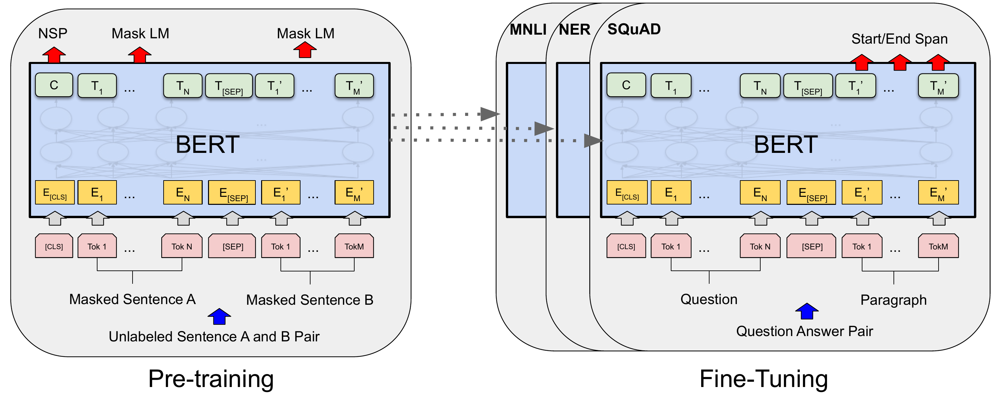
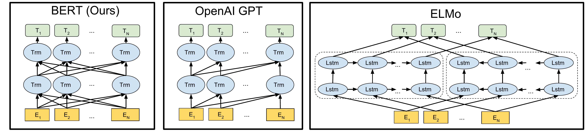
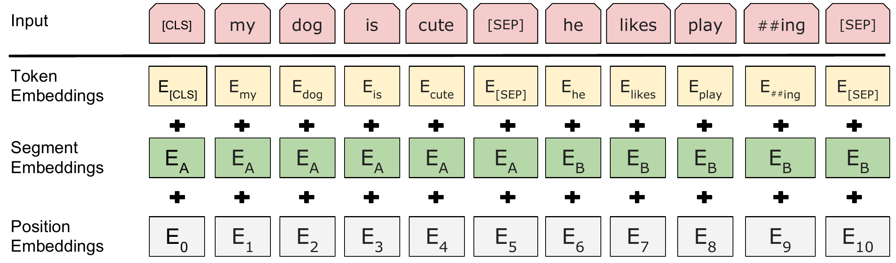
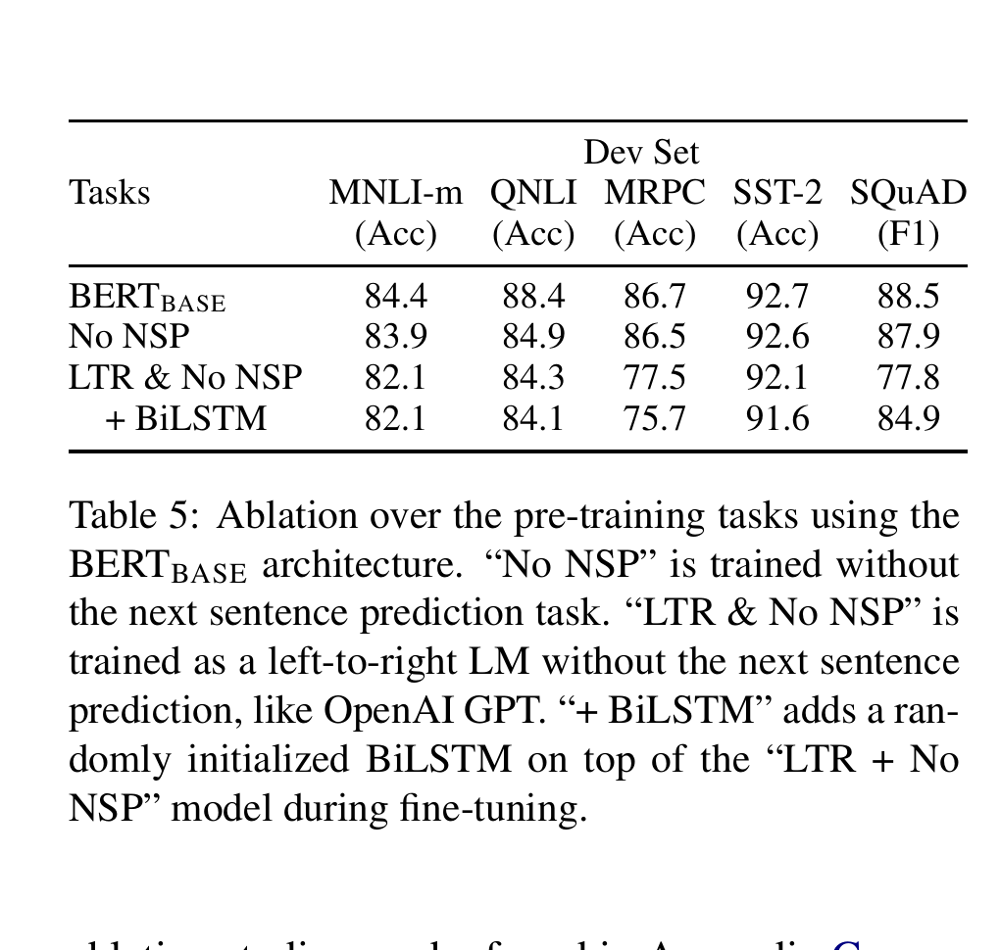
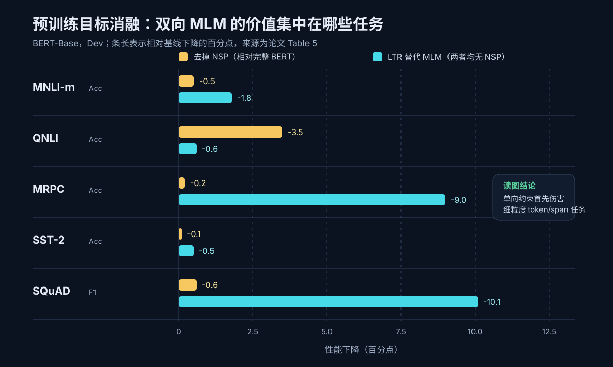

# 论文解读：BERT: Pre-training of Deep Bidirectional Transformers for Language Understanding

> **核心判断：BERT 没有发明新的 Transformer block。它解决的是一个训练目标冲突：如果每个 token 在所有层都能读取左右上下文，标准语言模型会直接看见答案；BERT 把“禁止看答案”的责任从单向 Attention mask 移到输入破坏，用 Masked Language Model（MLM）遮住少量目标，再让完整双向 Encoder 恢复它们。最关键证据不是排行榜，而是 Table 5：在同样不使用 NSP 时，把 MLM 换回左到右语言模型，SQuAD F1 下降 10.1、MRPC 准确率下降 9.0 个点。**

论文：Jacob Devlin、Ming-Wei Chang、Kenton Lee、Kristina Toutanova，**BERT: Pre-training of Deep Bidirectional Transformers for Language Understanding**，NAACL-HLT 2019。  
原始材料：[ACL Anthology](https://aclanthology.org/N19-1423/) · [论文 PDF](https://aclanthology.org/N19-1423.pdf) · [arXiv](https://arxiv.org/abs/1810.04805) · [Google 官方实现](https://github.com/google-research/bert) · [本文审计的初始公开代码版本](https://github.com/google-research/bert/tree/fe354751d7de010f60d362ae8d9343849ec39456)

**时间说明：** 论文于 2018 年 10 月提交 arXiv，2019 年 6 月发表于 NAACL；本笔记按知识库编排放在 **2023-03-01**，论文、源码与后续反证于 **2026-07-30** 重新核验。不要把归档日期误读为论文发表时间或当年的实践时间。

**图表复用说明：** ACL Anthology 对 2016 年及以后材料采用 [CC BY 4.0](https://aclanthology.org/faq/copyright/)。下文论文原图来自官方 arXiv source 或 ACL PDF，仅转为 PNG 或裁去无关页面区域；每处都保留 Figure/Table 编号、来源与证据边界。教学图会明确标为“本文重绘”。

本文面向已经知道 token、矩阵乘法、softmax 和基本 Transformer 结构的读者。Self-Attention、Q/K/V、残差与 FFN 的完整推导可先看 [[论文解读：Attention Is All You Need]]。阅读路线：

1. 只想抓住直觉：读第一、二、八、十一节；
2. 想真正理解 MLM：读第三、四节；
3. 想复现原始配方：读五、六、九节；
4. 想判断论文证据强弱：读七、八、十节。

## 一、先看真正的矛盾：双向网络为什么会“泄题”

假设输入是：

> I made a bank deposit.

要让 `bank` 的表示区分“银行”而不是“河岸”，右侧的 `deposit` 很有帮助。对问答更明显：

> Question: Where did Alice go?  
> Passage: After lunch, Alice went to **the library** to return a book.

预测答案 span 时，`library` 的表示需要同时读取左侧问题、左侧局部上下文和右侧 `to return a book`。只允许看左边，会把一个本来已经完整给出的理解任务，强行改成半盲预测。

但把标准左到右语言模型直接改成“双向”又会出问题。自回归语言模型训练的是：

$$
p(x_{1:n})
=
\prod_{i=1}^{n}
p(x_i\mid x_{<i}).
$$

位置 $i$ 的输入里不能包含 $x_i$ 本身，否则最简单的策略不是理解上下文，而是沿残差连接或 Self-Attention 把答案复制到输出。右到左模型同理，只是条件换成 $x_{>i}$。

在 BERT 之前，两条典型路线各有代价：

- **OpenAI GPT 式微调：** 用左到右 Transformer 预训练，再端到端微调。训练目标干净，但每层 token 表示只能读取左侧上下文；
- **ELMo 式特征：** 分别训练左到右和右到左语言模型，在顶层拼接两边表示。它能同时拿到左右信息，但两个方向在深层计算过程中并不相互作用，而且下游主要把它作为特征接入专用网络。

BERT 的问题因此不是“Encoder 能不能双向 Attention”。原始 Transformer Encoder 本来就能。真正的问题是：

> **怎样给一个所有层都双向可见的 Encoder 构造自监督标签，同时不把标签本身留在输入里？**

MLM 的答案是：先把少量位置破坏，再让网络恢复原 token。被选中的位置看不到原答案，但可以读取左右所有未被破坏的上下文；没有被选中的位置继续作为上下文参与计算。

这就是 BERT 的责任迁移：

```text
左到右 LM：固定因果 mask 决定每个位置永远不能看未来
BERT MLM ：全局双向通信不受限，只在本批随机隐藏监督目标
```

## 二、任务契约：BERT 训练了什么，又没有训练什么

| 项目 | 原始 BERT |
|---|---|
| 预训练输入 | 一段或两段无标注英文文本，WordPiece 化后不超过 512 token |
| 主干 | 只使用 Transformer Encoder；所有非 padding 位置双向可见 |
| 自监督目标 1 | 恢复被选中的 15% WordPiece token，即 MLM |
| 自监督目标 2 | 判断 B 是否为 A 的真实后续片段，即 NSP |
| 预训练输出 | 一套通用 Encoder 参数；MLM/NSP 输出头随后丢弃 |
| 下游监督 | 每个任务各自的有标注数据 |
| 下游适配 | 加一个很小的任务输出头，并端到端微调全部 BERT 参数 |
| 推理 | 一次读入完整输入并输出 token/序列表示，不做逐 token 生成 |
| 不解决 | 开放式文本生成、长于 512 token 的原生上下文、零样本指令跟随、统一多任务服务 |

先看 Figure 1 的两处：左侧预训练时，MLM 从 token 表示 $T_i$ 预测词，NSP 从聚合表示 $C$ 预测句对关系；右侧微调时，蓝色 BERT 主干保留，只有顶部输出接口随任务变化。虚线箭头表示同一套预训练参数分别初始化不同任务模型。



*论文原图 Figure 1，来源：[BERT 官方论文](https://aclanthology.org/N19-1423/)。它直接支持“预训练主干与下游主干基本一致、不同任务只更换输出接口并微调全部参数”；它不表示 MNLI、NER、SQuAD 在一个共享的多任务 checkpoint 中同时训练或同时服务。*

论文的一句话脊柱可以写成：

> BERT 用**随机遮蔽目标**替代**固定单向可见性**，使同一深层 Encoder 可以在预训练时联合使用左右上下文；再用极少的任务专用参数验证这种表示能否跨句级、token 级和 span 级任务迁移。

## 三、MLM：遮住答案，但不封死信息流

设原始 token 序列为：

$$
x=(x_1,\ldots,x_n),
$$

从可预测位置中随机选择集合 $M$，得到被破坏后的输入 $\tilde x$。BERT Encoder 输出：

$$
H
=
\operatorname{BERT}(\tilde x)
\in
\mathbb R^{n\times H},
$$

其中第 $i$ 个位置的最后一层表示记为 $h_i$。MLM 只在 $i\in M$ 的位置计算词表交叉熵：

$$
\mathcal L_{\rm MLM}
=
-\frac{1}{|M|}
\sum_{i\in M}
\log p_\theta(x_i\mid \tilde x).
$$

这里最关键的不是公式，而是条件分布：

- 对被遮蔽的 `bank`，模型可以读 `I made a` 和右侧 `deposit`；
- 它不能读原始 `bank`，因为该位置已被 `[MASK]`、随机词或特定情况下的原词替代；
- 所有层都没有 causal mask，因此左、右上下文可以从第一层起反复交互；
- loss 只落在约 15% 位置，但整条序列仍要经过 12 或 24 层 Encoder。

这解释了“deeply bidirectional”的精确含义：**不是顶层把两个单向向量拼起来，而是每一层、每个非 padding token 都可以读取左右两边，并把融合后的表示继续送往下一层。**

Figure 3 要从连线方向读。BERT 左图每层的每个位置都连接整条序列；GPT 中间图只有从左向右的合法边；ELMo 右图有两条相反方向的 LSTM，但直到输出特征才汇合。



*论文原图 Figure 3，来源：[BERT 官方论文](https://aclanthology.org/N19-1423/)。它支持三种预训练信息路径的结构差异；它本身不证明双向信息一定带来更高下游分数，Table 5 的受控消融才是因果证据。*

### 3.1 MLM 头不是直接拿 $h_i$ 乘词表

官方初始实现先收集被选中位置：

$$
H_M
\in
\mathbb R^{(B\cdot m)\times H},
$$

其中 $B$ 是 batch size，$m$ 是每条样本最多预测的位置数。然后经过一层 $H\rightarrow H$ 的 dense、GELU 与 LayerNorm，再与输入词嵌入矩阵共享权重做词表分类：

$$
z_i
=
\operatorname{LN}
\left(
\operatorname{GELU}(h_iW+b)
\right),
$$

$$
p(x_i\mid\tilde x)
=
\operatorname{softmax}
\left(
z_iE_{\rm token}^{\top}+b_{\rm vocab}
\right).
$$

这有两个工程含义：

1. 只对被选中的位置计算大词表 logits，避免对所有 $n$ 个位置都做 $V$ 类分类；
2. 输入 token embedding 与输出词表权重绑定，减少参数并把输入/输出词空间对齐。

固定源码证据见初始公开版本的 [`get_masked_lm_output`](https://github.com/google-research/bert/blob/fe354751d7de010f60d362ae8d9343849ec39456/run_pretraining.py#L241-L284) 与 [`gather_indexes`](https://github.com/google-research/bert/blob/fe354751d7de010f60d362ae8d9343849ec39456/run_pretraining.py#L307-L324)。

## 四、15% 不是都换成 `[MASK]`：80/10/10 到底在解决什么

原始 BERT 先均匀选择约 15% 的 **WordPiece 位置**作为预测目标。对每个被选中位置：

| 替换方式 | 在被选中位置中 | 占全部 token 的期望比例 | 作用 |
|---|---:|---:|---|
| 换成 `[MASK]` | 80% | 12% | 真正移除该位置的词身份 |
| 换成随机 token | 10% | 1.5% | 迫使模型处理输入中可能出现的错误词 |
| 保持原 token | 10% | 1.5% | 缩小预训练有 `[MASK]`、微调没有 `[MASK]` 的分布差异 |

例如原句：

```text
my dog is hairy
```

若 `hairy` 被选中，训练输入可能是：

```text
my dog is [MASK]    # 80%
my dog is apple     # 10%
my dog is hairy     # 10%
```

标签始终是 `hairy`。

### 4.1 “保持原词”会不会泄题

会让这 10% 子样本更容易，但不是整个目标失效。模型不知道哪些可见 token 被选中计算 loss；对未被选中的 85% 位置根本没有 MLM 标签，对“保持原词”的 1.5% 位置则确实可以依赖词身份。这部分的目的不是制造最难的语义恢复任务，而是让预训练表示偶尔在真实输入 token 上也接受输出约束。

原论文 Appendix C.2 的消融说明，**80/10/10 不是一个被严格证明的唯一最优比例**：

- 100% `[MASK]` 的 MNLI 是 84.3，甚至略高于 80/10/10 的 84.2；
- 但在不允许继续微调 BERT 的 feature-based NER 中，100% `[MASK]` 只有 94.0，低于 80/10/10 的 94.9；
- 全部随机替换的 MNLI 为 83.6，说明完全放弃 `[MASK]` 也有代价。

更克制的结论是：**微调能修复相当一部分预训练/下游分布差异；80/10/10 对冻结特征更重要，但论文没有证明这组比例跨模型、跨数据都最优。**

### 4.2 原始实现是 WordPiece 级、离线静态遮蔽

论文使用 30,000 词表的 WordPiece，并明确说 15% 遮蔽在 WordPiece 化之后进行，对一个词拆出的多个 piece 不做整体保护。后来官方仓库加入 Whole Word Masking，但那不是原论文配方。

初始公开代码在生成 TFRecord 时就固定 `masked_lm_positions` 和 `masked_lm_ids`，默认 `dupe_factor=10`，即把同一原始材料用不同随机 mask 复制十次；训练时不会每次前向重新采样。见 [`create_pretraining_data.py`](https://github.com/google-research/bert/blob/fe354751d7de010f60d362ae8d9343849ec39456/create_pretraining_data.py#L46-L62)。

后来的 [RoBERTa](https://arxiv.org/abs/1907.11692) 把它称为 static masking，并显示动态遮蔽在其复现实验中相当或略好。这里要分清：

- **论文事实：** BERT 的离线数据生成器创建固定 mask，并通过重复数据增加 mask 变化；
- **后续证据：** 动态 mask 是更灵活的工程替代；
- **不能倒推：** 原论文没有比较 static 与 dynamic，也没有声称 static 是关键创新。

## 五、输入不是“一个句子”：token、片段与位置怎样合成

BERT 把单段文本或文本对统一编码成：

```text
[CLS] tokens of A [SEP] tokens of B [SEP]
```

论文中的 “sentence” 可以是任意连续文本片段，不要求是语法意义上的一句话。每个位置的输入向量是三项相加：

$$
e_i
=
e_i^{\rm token}
+
e_i^{\rm segment}
+
e_i^{\rm position}.
$$

Figure 2 显示：

- `play ##ing` 是两个 WordPiece；
- A、B 两段各有一个可学习的 segment embedding；
- `[CLS]`、`[SEP]` 也有普通 token embedding；
- position embedding 是学习得到的绝对位置表，原始模型上限 512。



*论文原图 Figure 2，来源：[BERT 官方论文](https://aclanthology.org/N19-1423/)。它支持输入表示的三项分解与 WordPiece/特殊 token 接线；它不证明 A/B segment embedding 或 `[CLS]` 是所有后续 Encoder 模型都必须保留的设计。*

设 batch size 为 $B$，序列长度为 $S$，隐藏宽度为 $H$：

$$
\texttt{input\_ids},
\texttt{input\_mask},
\texttt{segment\_ids}
\in
\mathbb Z^{B\times S},
$$

$$
\texttt{sequence\_output}
\in
\mathbb R^{B\times S\times H}.
$$

官方代码只把 padding mask 扩成 $B\times S\times S$；它没有 causal 三角 mask。因此 A、B 两段拼在同一序列后，Self-Attention 天然形成双向的跨段交互：问题 token 可以读段落，段落 token 也可以读问题。

### 5.1 `[CLS]` 不是天然的句向量

最后一层第一个位置记为：

$$
C
=
h_{\texttt{[CLS]}}
\in
\mathbb R^H.
$$

官方实现还经过一个 $H\rightarrow H$ 的 dense 与 $\tanh$ 得到 `pooled_output`。NSP 和句级分类使用它；token 标注、MLM 与抽取式问答则使用各自的 $T_i=h_i$。

论文脚注明确提醒：未经下游微调的 $C$ **不是天然有意义的通用句向量**，因为它主要由 NSP 目标训练。把任意原始 BERT `[CLS]` 直接当成余弦相似度 embedding，超出了论文证据。

## 六、NSP：论文中的第二个目标，也是最不耐久的配方

Next Sentence Prediction 构造一对片段 A、B：

- 50%：B 是语料中紧接 A 的后续片段，标签 `IsNext`；
- 50%：B 从另一篇随机文档抽取，标签 `NotNext`。

NSP 使用聚合表示 $C$ 做二分类：

$$
\mathcal L_{\rm NSP}
=
-\log p_\theta(y_{\rm NSP}\mid C).
$$

总预训练损失是两个均值损失直接相加：

$$
\mathcal L
=
\mathcal L_{\rm MLM}
+
\mathcal L_{\rm NSP}.
$$

源码见 [`total_loss = masked_lm_loss + next_sentence_loss`](https://github.com/google-research/bert/blob/fe354751d7de010f60d362ae8d9343849ec39456/run_pretraining.py#L139-L148)。

论文动机是给问答、自然语言推断等句对任务预训练“片段关系”。模型在 NSP 上达到 97%–98% 准确率，听起来很强，但这个数字本身也暴露了风险：

- 随机负例通常来自另一篇文档，主题差异可能远大于真正的篇章顺序差异；
- 因此高准确率可能部分来自主题一致性，而不是精细的“下一句”推理；
- A、B 常是多句片段，不是严格的一句接一句；
- 任务没有区分“同文档但顺序错误”“同主题但不相邻”等更难负例。

原论文 Table 5 确实显示去掉 NSP 会伤害部分任务；但 [RoBERTa](https://arxiv.org/abs/1907.11692) 在更长训练、更多数据和不同 segment 构造下发现，移除 NSP 并不会妨碍取得更好结果。两者并不逻辑矛盾：

> **BERT 的消融支持“NSP 在原始配方中有条件价值”，不支持“任何双向 Encoder 都必须训练 NSP”。**

## 七、训练配方：四天、多少算力、多少 token

### 7.1 模型规模

| 模型 | 层数 $L$ | 隐藏宽度 $H$ | heads $A$ | FFN 宽度 | 参数量 |
|---|---:|---:|---:|---:|---:|
| BERT-Base | 12 | 768 | 12 | 3072 | 110M |
| BERT-Large | 24 | 1024 | 16 | 4096 | 340M |

BERT-Base 被刻意设成与当时 OpenAI GPT 接近的规模，以便比较信息方向和预训练目标。它继承原始 Transformer Encoder 的 Multi-Head Self-Attention、FFN、残差与 post-LayerNorm，但使用 learned absolute position embedding、GELU，并去掉整个 Decoder 与 Cross-Attention。

### 7.2 数据与优化

| 项目 | 原论文设置 |
|---|---|
| 数据 | BooksCorpus 约 800M words + 英文 Wikipedia 约 2,500M words |
| Wikipedia 处理 | 只保留正文段落，忽略列表、表格与标题 |
| 词表 | 30,000 WordPiece |
| batch | 256 sequences |
| 训练步数 | 1,000,000 |
| 序列长度 | 前 90% steps 用 128，后 10% steps 用 512 |
| 优化器 | 论文称 Adam；$\beta_1=0.9,\beta_2=0.999$ |
| 初始学习率 | $10^{-4}$ |
| warmup | 前 10,000 steps |
| 衰减 | 线性衰减到 0 |
| weight decay | 0.01 |
| dropout | 0.1 |
| 激活 | GELU |
| BERT-Base 预训练 | 4 个 Cloud TPU，16 TPU chips，4 天 |
| BERT-Large 预训练 | 16 个 Cloud TPU，64 TPU chips，4 天 |

论文没有披露 TPU 代际、单芯片内存、数值精度、实测吞吐、峰值内存、能耗或费用，因此不能把“四天”外推成现代 GPU 的普遍训练时长。

### 7.3 “40 epochs” 与长度日程无法按字面完全对齐

附录同时给出：

1. batch 为 256 sequences，若长度 512，则是 128,000 token positions/batch；
2. 共 1M steps，约等于对 3.3B-word 语料训练 40 epochs；
3. 但 90% steps 实际长度 128，只有最后 10% 用 512。

若按长度日程直接计算 padded token positions：

$$
900{,}000\times256\times128
+
100{,}000\times256\times512
\approx
42.6\text{B}.
$$

若全部 1M steps 都按 512 计算才是约 131B positions，接近 $3.3\text{B}\times40$。因此“40 epochs”更像用最大长度给出的粗略数据遍历量，而不是可与长度日程严格对账的实际 token 吞吐。再加上 `words`、WordPiece、padding、截断与重复 mask 的口径不同，原文不足以恢复唯一的精确训练 token 数。

这是一个**推导性审计结论**，不是作者明确承认的错误。工程上应把“1M steps + batch 256 + 90/10 长度日程”视为更可执行的配方，把“40 epochs”视为近似描述。

## 八、证据阶梯：BERT 有效、为什么有效、哪一项没有被证明

### 8.1 能力证据：同一预训练主干覆盖四类输出

论文在 11 个 NLP 任务上报告结果，覆盖：

- 句级分类：SST-2、CoLA；
- 句对分类：MNLI、QQP、QNLI、STS-B、MRPC、RTE、SWAG；
- token 级标注：CoNLL-2003 NER；
- span 级预测：SQuAD v1.1/v2.0。

GLUE Table 1 中，为避免把不同官方口径混在一起，先看论文自己的 8 项平均：

| 系统 | 论文 Table 1 平均 |
|---|---:|
| Pre-OpenAI SOTA | 74.0 |
| BiLSTM + ELMo + Attention | 71.0 |
| OpenAI GPT | 75.1 |
| BERT-Base | 79.6 |
| BERT-Large | **82.1** |

BERT-Large 相对 OpenAI GPT 高 **7.0** 个平均点。论文摘要另报官方 GLUE score 80.5 对 72.8；它与 Table 1 的 82.1/75.1 不是同一聚合口径，不能混成一张表。

这组结果最有价值的地方不是“拿到当时 SOTA”，而是：

> **同一个预训练 Encoder，只通过输入打包和极小输出头，就能覆盖句级、token 级与 span 级任务。**

但主结果不是纯粹的“双向 vs 单向”受控实验。论文附录自己列出 BERT 与 GPT 还存在：

- BERT 多用了 Wikipedia；
- BERT 每步词量约为 GPT 的 4 倍；
- `[CLS]`、`[SEP]` 与 A/B embedding 在 BERT 预训练时就出现；
- BERT 为各任务搜索微调学习率，GPT 使用统一学习率。

所以排行榜证明完整系统强，不足以把全部增益归因于 MLM。

### 8.2 不要只引用“93.2 SQuAD”

摘要中的 SQuAD v1.1 Test F1 **93.2** 来自：

- 7 个系统的 ensemble；
- 不同预训练 checkpoint 与微调随机种子；
- 先额外在 TriviaQA-Wiki 上微调，再微调 SQuAD。

更接近“单模型、无额外 TriviaQA”的结果是 BERT-Large Dev F1 90.9；使用 TriviaQA 的单模型 Test F1 是 91.8。93.2 当然是论文真实结果，但它不是最干净的主干能力比较。

SQuAD v2.0 的 83.1 Test F1 是 BERT-Large single model，对论文列出的此前最佳 78.0 高 5.1；这里的比较更直接。SWAG 上 BERT-Large 86.3，OpenAI GPT 78.0；表中的 human expert 85.0 只测了 100 个样本，不能据此得出“BERT 普遍超过人类常识”。

### 8.3 微调选择也会影响排行榜

GLUE 实验统一训练 3 epochs、batch 32，并在 $\{5,4,3,2\}\times10^{-5}$ 中按 Dev 选择学习率。BERT-Large 在小数据集上不稳定，作者运行多个随机重启并选择 Dev 最优模型。

这说明：

- 主结果包含合理但真实存在的 hyperparameter/seed selection；
- 小数据集上的单次微调方差不应被忽略；
- Table 6 的模型规模消融报告 5 次随机重启平均，比“挑最优”更适合判断规模趋势；
- 论文只对 BERT-Base/Large 各提交一次 GLUE Test，降低了直接对测试集反复调参的风险。

## 九、Table 5：论文最硬的因果证据

先看原表的三行：

1. `BERT-Base`：MLM + NSP；
2. `No NSP`：保留双向 MLM，只移除 NSP；
3. `LTR & No NSP`：改为左到右 LM，同时不使用 NSP。



*论文原表 Table 5，来源：[BERT 官方论文 PDF](https://aclanthology.org/N19-1423.pdf)。裁剪保留完整表格与说明。它是本文判断“深层双向预训练是否重要”的主要受控证据；它只覆盖 BERT-Base、五个 Dev 指标与原始训练配方。*

为看清效果量，下面把原表换成两组差值：

- 黄色：`BERT-Base - No NSP`，即去掉 NSP 的下降；
- 蓝色：`No NSP - LTR & No NSP`，即在都没有 NSP 时把双向 MLM 改为左到右 LM 的下降。



*本文重绘 A：数值来自论文 Table 5；不同任务分别使用 Accuracy 或 F1，条长表示同一任务内的绝对点差，不能跨指标解释为统一效用。*

### 9.1 双向 MLM 的证据比 NSP 更强

`No NSP` 与 `LTR & No NSP` 使用同一数据、输入格式、微调方案和 BERT-Base 规模，且都不使用 NSP。差值为：

| 任务 | 双向 MLM 改为 LTR 的下降 |
|---|---:|
| MNLI-m | -1.8 Acc |
| QNLI | -0.6 Acc |
| MRPC | -9.0 Acc |
| SST-2 | -0.5 Acc |
| SQuAD | **-10.1 F1** |

SQuAD 的模式与机制高度一致：答案 token 的表示若看不到右侧上下文，span 预测受损最大。给 LTR 模型顶部再加随机初始化 BiLSTM，SQuAD 从 77.8 回升到 84.9，但仍低于双向 `No NSP` 的 87.9；而 MRPC 反而从 77.5 降到 75.7。

这支持：

1. 深层双向上下文不是排行榜装饰，对 token/span 任务尤其关键；
2. 在下游临时加一层双向网络，不能完全补回预训练期间缺失的深层双向交互；
3. 收益并不均匀：SST-2 只差 0.5，不能说所有任务同样依赖右侧上下文。

它仍没有证明：

1. MLM 是训练双向 Encoder 的唯一办法；
2. 15% 和 80/10/10 是最优；
3. 更大的训练数据、batch 与微调搜索完全没有贡献；
4. Attention 权重本身就是可解释语言结构。

### 9.2 NSP 的证据是配方条件下成立

完整 BERT 与 `No NSP` 的差值：

| 任务 | 去掉 NSP 的下降 |
|---|---:|
| MNLI-m | -0.5 Acc |
| QNLI | **-3.5 Acc** |
| MRPC | -0.2 Acc |
| SST-2 | -0.1 Acc |
| SQuAD | -0.6 F1 |

NSP 的收益主要集中在 QNLI，其他任务较小。原论文据此说 NSP 对 QA/NLI 有益，在它的实验设置中成立；但效果并不普遍，且后续 RoBERTa 表明输入组织、训练时长和数据规模改变后可以丢弃 NSP。

因此，一周后应保留的机制是 **MLM 解开深层双向预训练**，而不是把 NSP 当成 BERT 永久不可分割的组成。

### 9.3 模型规模与训练时长：能力还没有饱和

Table 6 从 3 层/768 到 24 层/1024，MLM perplexity 从 5.84 降到 3.23，MNLI 从 77.9 升到 86.6，MRPC 从 79.8 升到 87.8，SST-2 从 88.4 升到 93.7。每个更大配置都更好，支持“充分预训练后，小样本任务也能从更大表示模型受益”。

但层数、宽度、head 数和参数量多次一起变化，因此这不是某一维度的单变量消融。

Appendix Figure 5 还显示：

- MLM 在很早期就超过 LTR；
- 500k 到 1M steps，BERT-Base 的 MNLI 仍提高约 1 个点；
- MLM 因只预测 15% 位置，收敛略慢，但最终明显更高。

这说明原始 BERT 并非训练到明显饱和，也给后来“更长训练能继续提高 BERT 配方”留下了空间。

## 十、从源码看原论文没有写透的工程细节

本文固定审计 Google 官方仓库的 **2018-10-31 Initial BERT release**，提交 `fe354751d7de010f60d362ae8d9343849ec39456`。后续 Whole Word Masking、小模型和 README 更新不倒灌进原始配方。

### 10.1 数据管线实际写入七组特征

每条 TFRecord 包含：

```text
input_ids
input_mask
segment_ids
masked_lm_positions
masked_lm_ids
masked_lm_weights
next_sentence_labels
```

`masked_lm_positions/ids/weights` 会 pad 到固定 `max_predictions_per_seq`；权重为 0 的 pad 项不进入 loss。`next_sentence_label=0` 表示真实后续，`1` 表示随机片段。

### 10.2 `pooled_output` 不是平均池化

源码直接取最后一层第 0 个 token：

```text
first_token_tensor = sequence_output[:, 0, :]
pooled_output = tanh(first_token_tensor @ W + b)
```

因此“BERT pooler”不是 mean pooling，也不是 attention pooling。更换池化方式属于后续实践。

### 10.3 论文写 Adam，代码更接近无 bias correction 的 AdamW

初始 [`optimization.py`](https://github.com/google-research/bert/blob/fe354751d7de010f60d362ae8d9343849ec39456/optimization.py) 的重要细节：

- warmup 后线性衰减；
- weight decay 直接加到参数更新，LayerNorm 与 bias 排除；
- 全局梯度裁剪为 1.0；
- 更新里没有标准 Adam 的 $1-\beta_1^t$、$1-\beta_2^t$ bias correction；
- checkpoint 初始化时不恢复 Adam 的 $m/v$ 状态。

所以复现时只写“Adam，lr=$10^{-4}$”不够。优化器实现、epsilon、decoupled weight decay、排除项和 bias correction 都会改变结果。

### 10.4 最低运行与原论文复现不是一回事

**忠实从头预训练：** 论文只给出 TPU Pod 配置，未给出等价 GPU 最低配置；缺少同一 BooksCorpus/Wikipedia 快照、完整数据清洗、精确吞吐和硬件代际，不能承诺按文字完全复现。

**原始 BERT-Base 微调：** 初始官方 README 说示例通常需要至少 12GB GPU；BERT-Large 的论文多数结果当时无法在 12–16GB GPU 上用相同 batch 复现。论文报告单 Cloud TPU 上最多 1 小时、GPU 数小时，SQuAD 约 30 分钟达到 Dev F1 91.0，但未披露 GPU 型号、显存峰值和完整延迟条件。

**推理：** 原论文没有报告 batch、序列长度、硬件、p50/p99 延迟、吞吐或显存，因此不存在可直接引用的“BERT 推理速度”。Encoder 一次处理完整序列，没有自回归 KV cache；计算与 Attention 内存仍随长度近似 $O(S^2)$。

**走向生产还缺：**

- 数据与 tokenizer 版本锁定；
- 领域漂移与 OOV/WordPiece 碎片率监控；
- 微调 seed 稳定性和小样本回归集；
- 长文本切片或长上下文替代方案；
- batch、量化、蒸馏与延迟/成本基准；
- 任务 checkpoint 的版本、回滚和安全评测；
- 训练语料版权、隐私与偏差治理。

这些是从部署流程推导的工程要求，不是 BERT 论文完成过的实验。

## 十一、边界、后续修正与今天真正应该保留的结论

### 11.1 论文明确或直接暴露的边界

**MLM 监督稀疏。** 每个 batch 只对约 15% token 计算词预测，整条序列却都经过 Encoder。论文自己观察到 MLM 比 LTR 收敛略慢；后来的 [ELECTRA](https://arxiv.org/abs/2003.10555) 正是针对这种样本效率提出每个位置的 replaced-token detection。

**预训练/微调存在 `[MASK]` 分布差异。** 80/10/10 只能缓解，不能消除。

**最长 512 token。** learned position table 与二次 Attention 都限制了直接外推到长文档。

**它不是生成模型。** BERT 学的是双向 Encoder 表示，不能像 causal Decoder 那样直接定义从左到右的开放式生成分布。

**英语与数据范围有限。** 原始实验使用英文 BooksCorpus 和 Wikipedia；跨语言、跨领域能力不在论文主证据中。

**“理解”由监督下游任务代理。** 论文没有测试零样本指令、分布外鲁棒性、事实一致性、公平性或安全性。

### 11.2 后续证据修正了配方，不是否定核心机制

[RoBERTa](https://arxiv.org/abs/1907.11692) 的复现说明：

- 原始 BERT 仍然 undertrained；
- 更长训练、更大 batch、更多数据可以继续提高；
- dynamic masking 是可行替代；
- NSP 可以移除。

[ELECTRA](https://arxiv.org/abs/2003.10555) 则说明 MLM 不是训练双向 Encoder 的唯一目标，也不是计算效率最高的目标。

这些工作削弱的是“NSP、static masking、15% MLM 就是最终配方”，没有削弱 BERT 最耐久的贡献：

> **先在大规模无标注文本上训练一套深层上下文 Encoder，再用极少的任务结构和少量有标注数据端到端迁移。**

### 11.3 与原始 Transformer 的边界

把两篇论文的符号对齐：

| 2017 Transformer | BERT |
|---|---|
| Encoder 输入 $X$ | token + segment + position 的 $E$ |
| Encoder 输出 $H$ | 每个 token 的上下文表示 $T_i$ |
| Encoder Self-Attention | 保留，取消任何 causal mask |
| Decoder Self-Attention | 删除 |
| Encoder–Decoder Cross-Attention | 删除 |
| 翻译监督与自回归解码 | 换成 MLM + NSP 预训练和任务微调 |

`Attention Is All You Need` 证明的是 Encoder–Decoder Transformer 在机器翻译中的质量、并行性与结构可行性；BERT 证明的是同一 Encoder 骨架经过自监督预训练后，可迁移到广泛理解任务。WordPiece、`[CLS]/[SEP]`、A/B segment、MLM 80/10/10、NSP 与“每个任务端到端微调”都属于 BERT 的系统设计，不能记到 2017 年论文名下。

## 十二、一周后应该记住什么

1. **BERT 的起点是一个训练目标矛盾：双向 Encoder 如果直接预测自己的输入会泄题。**
2. **MLM 的本质是把答案从少量输入位置拿走，同时保留所有层的双向通信。**
3. **“深层双向”不是两个单向模型在顶层拼接，而是左右上下文从第一层起反复交互。**
4. **一个预训练 checkpoint 会分别初始化多个任务模型；原论文不是一个模型同时完成所有任务。**
5. **最硬的证据是 Table 5：单向约束主要伤害 MRPC 与 SQuAD，去掉 NSP 的影响小得多且不均匀。**
6. **最耐久的是“预训练 Encoder + 轻量任务头 + 全参数微调”；NSP、static masking 与 80/10/10 都只是后来可替换的具体配方。**

## 参考资料

1. Jacob Devlin et al., [BERT: Pre-training of Deep Bidirectional Transformers for Language Understanding](https://aclanthology.org/N19-1423/), NAACL-HLT 2019.
2. Google Research, [BERT official implementation, initial public release `fe354751`](https://github.com/google-research/bert/tree/fe354751d7de010f60d362ae8d9343849ec39456), 2018-10-31.
3. Ashish Vaswani et al., [Attention Is All You Need](https://arxiv.org/abs/1706.03762), 2017；知识库解读见 [[论文解读：Attention Is All You Need]]。
4. Yinhan Liu et al., [RoBERTa: A Robustly Optimized BERT Pretraining Approach](https://arxiv.org/abs/1907.11692), 2019.
5. Kevin Clark et al., [ELECTRA: Pre-training Text Encoders as Discriminators Rather Than Generators](https://arxiv.org/abs/2003.10555), 2020.
