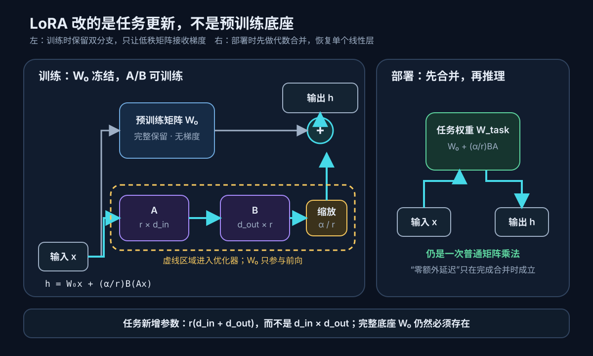

# 论文解读：LoRA: Low-Rank Adaptation of Large Language Models

> **核心判断：LoRA 压缩的不是预训练模型，而是“为一个新任务允许写入的权重变化”。它冻结原矩阵 $W_0$，只学习 $\Delta W=\frac{\alpha}{r}BA$，把一个 $d_{\text{out}}\times d_{\text{in}}$ 的自由更新限制在至多 $r$ 维的子空间里；这里的 rank 可以先理解为更新能独立表达的方向数。论文最关键的证据不是 10,000 倍这个醒目的数字，而是两组消融：在 GPT‑3 175B 的固定参数预算下，把容量分给多个 Attention 投影通常比把更高 rank 堆在单个投影上更有效；在 WikiSQL 与 MultiNLI 上，$r=1$ 到 $64$ 并未带来单调收益。这支持“部分下游更新可低秩表达”，但没有证明所有模型、任务、模态都只需要很小的 rank。**

论文：Edward J. Hu、Yelong Shen、Phillip Wallis、Zeyuan Allen-Zhu、Yuanzhi Li、Shean Wang、Lu Wang、Weizhu Chen，**LoRA: Low-Rank Adaptation of Large Language Models**，ICLR 2022。  
主来源：[OpenReview 正式论文](https://openreview.net/forum?id=nZeVKeeFYf9)｜[arXiv v2](https://arxiv.org/abs/2106.09685v2)｜[论文 PDF](https://arxiv.org/pdf/2106.09685v2)｜[微软官方代码固定提交](https://github.com/microsoft/LoRA/tree/c4593f060e6a368d7bb5af5273b8e42810cdef90)

本文假设读者见过线性层的矩阵乘法与 Transformer Attention 的 Q/K/V，但不要求预先掌握参数高效微调；理解正文只需要把 rank 看成“矩阵能独立表达多少个方向”，奇异值实验则只解释它回答了什么，不要求读者推导分解算法。

## 一、先看真正昂贵的部分：不是训练一次，而是为每个任务复制一次

假设已经有一个预训练模型，现在需要分别服务客服问答、SQL 生成和对话摘要。全量微调会为每个任务产生一套与底座同样大的权重：

```text
共享预训练模型 W0
├─ 客服任务：W0 + ΔW客服，保存一整套模型
├─ SQL 任务：W0 + ΔW_SQL，保存一整套模型
└─ 摘要任务：W0 + ΔW摘要，保存一整套模型
```

模型越大，成本越在三处同时放大：

1. **训练显存**：除了权重，还要保存梯度和 Adam 的一阶、二阶状态；
2. **任务存储**：每个下游任务都要保存接近底座大小的参数副本；
3. **服务切换**：多任务部署要装载、复制或路由多套大模型。

冻结部分层、只训练 Bias、给 Transformer 插 Adapter，或者在输入中学习 Prefix，都能减少可训练参数，但它们改变系统的位置不同。Adapter 在原网络层之间增加新的串行模块；Prefix 占用输入或每层的虚拟 Token；LoRA 则问了一个更直接的问题：

> 如果下游任务真正需要的不是任意形状的 $\Delta W$，而只是少数几个有用方向，为什么要为整张矩阵保留自由度？

这篇论文的一句话脊柱是：

> **LoRA 把任务适配的责任从“重写整张预训练权重”移到“学习一条可合并的低秩增量分支”；决定性证据是小 rank 在多组语言任务上接近或超过全量微调，而固定预算消融显示容量应优先分布到合适的权重矩阵。**

## 二、任务契约：原论文做了什么，又没有做什么

| 项目 | 原论文设定 |
|---|---|
| 起点 | 已经预训练好的 RoBERTa、DeBERTa、GPT‑2 或 GPT‑3 |
| 下游输入输出 | GLUE 自然语言理解、结构化数据到文本、自然语言到 SQL、对话摘要 |
| 训练监督 | 各下游数据集原有的有监督目标；LoRA 不改变任务损失 |
| 冻结部分 | 预训练权重 $W_0$，实验还冻结了 MLP |
| 可训练部分 | Attention 权重旁路中的低秩矩阵 $A,B$；部分设定也训练 Bias |
| 主要实验位置 | Transformer Self-Attention 的 $W_q,W_k,W_v,W_o$，主配方常用 $W_q,W_v$ |
| 推理 | 可把 $BA$ 合并进 $W_0$，继续执行普通线性层 |
| 核心假设 | 下游适配所需的权重更新具有较低的“内在 rank” |
| 没有验证 | 图像生成、Diffusion、Flow Matching、指令微调、RLHF、量化、多 LoRA 合并与生产级路由 |

最后一行很重要。今天人们在 Stable Diffusion、FLUX、视频 DiT 和多模态模型里广泛使用 LoRA，并不等于 2021 年这篇论文已经实验验证了这些场景。原论文只说低秩更新的原则可以用于一般稠密层，实证主体仍是语言 Transformer。

## 三、先把一个误解拿掉：LoRA 不是把 $W_0$ 做低秩分解

给定一个预训练线性层：

$$
h=W_0x,
\qquad
W_0\in\mathbb R^{d_{\text{out}}\times d_{\text{in}}}.
$$

全量微调允许 $W_0$ 的每个元素独立变化：

$$
h=(W_0+\Delta W)x.
$$

LoRA 不要求 $W_0$ 本身低秩，也不把它近似成两个小矩阵。它保留完整的 $W_0$，只约束任务增量：

$$
\Delta W
=\frac{\alpha}{r}BA,
\qquad
A\in\mathbb R^{r\times d_{\text{in}}},
\qquad
B\in\mathbb R^{d_{\text{out}}\times r},
\qquad
r\ll\min(d_{\text{in}},d_{\text{out}}).
$$

前向传播因此变成：

$$
h
=W_0x+\frac{\alpha}{r}B(Ax).
$$

先看 $A$ 和 $B$ 各自的职责：

- $A$ 把 $d_{\text{in}}$ 维输入压到 $r$ 维，选出任务需要观察的少数方向；
- $B$ 再把这 $r$ 维信号写回 $d_{\text{out}}$ 维输出；
- $W_0$ 保留预训练模型已有的通用能力；
- $\alpha/r$ 控制低秩分支相对底座的尺度。

因为矩阵乘积的 rank 满足：

$$
\operatorname{rank}(BA)
\le
\min\bigl(\operatorname{rank}(B),\operatorname{rank}(A)\bigr)
\le r,
$$

所以无论怎样训练，$\Delta W$ 都不可能拥有超过 $r$ 个独立方向。这不是训练后偶然出现的压缩，而是模型参数化在训练前就写下的约束。

下面这张图只回答两个问题：梯度写到哪里，以及为什么部署时可以不增加一层。



*本文依据论文 §4、Figure 1 与微软 `loralib` 固定提交重绘。原论文页面使用 arXiv 非独占分发许可，本文不复制原图版式；[可在论文 PDF 第 1 页查看 Figure 1](https://arxiv.org/pdf/2106.09685v2)。这张教学图解释参数流与代数合并，不单独证明性能或显存收益。*

### 3.1 一个数值例子：rank 只有在大矩阵上才真正便宜

若线性层输入、输出维度都是 4096，任意全量更新需要：

$$
4096\times4096
=16{,}777{,}216
$$

个可训练参数。若使用 $r=8$ 的 LoRA，只需要：

$$
8\times4096+4096\times8
=65{,}536,
$$

恰好减少到 $1/256$。

一般地，全量更新与 LoRA 参数量分别是：

$$
N_{\text{full}}
=d_{\text{out}}d_{\text{in}},
\qquad
N_{\text{LoRA}}
=r(d_{\text{in}}+d_{\text{out}}).
$$

但这不意味着部署只需要 65,536 个参数。推理仍要持有完整的 $W_0$；减少的是**每个任务新增的参数**，以及训练时与这些可训练参数对应的梯度和优化器状态。

## 四、初始化与缩放：为什么训练第 0 步必须等于底座

论文把 $A$ 初始化为随机高斯矩阵，把 $B$ 初始化为零，因此：

$$
\Delta W_0=B_0A_0=0.
$$

训练开始时，模型函数与预训练底座完全相同，不会因为插入一条随机分支就突然改变输出。令 $s=\alpha/r$，并把损失对 $\Delta W=sBA$ 的梯度记为 $G$，则：

$$
\frac{\partial\mathcal L}{\partial B}
=sGA^\top,
\qquad
\frac{\partial\mathcal L}{\partial A}
=sB^\top G.
$$

因此在 $B_0=0$ 时，第一步 $A$ 的梯度为零，而 $B$ 可以先沿着随机 $A$ 选出的子空间更新；从后续步骤起，$A$ 也开始接收梯度。这是由参数化直接推出的训练动力学，不是论文单独做过的消融。

这里还有一个容易被教程抹平的源码差异。论文写的是“$A$ 随机、$B$ 为零”；2021 年仓库快照里的 GPT‑2 实现确实把第一层权重做正态初始化、第二层置零。当前官方 `loralib.Linear` 在另一固定提交中改用 Kaiming 初始化 $A$、把 $B$ 置零，仍保持 $\Delta W_0=0$。源码注释明确说初始化细节与论文描述不同，但预期不影响性能；`Embedding` 类则把另一侧置零。真正必须守住的不变量不是“哪个字母一定随机”，而是：

> **插入 LoRA 的初始函数必须等于未适配底座，且不能把两个因子同时初始化为零。**

两个因子都为零时，上面两条梯度也同时为零，训练永远无法启动。

论文还把低秩分支乘以 $\alpha/r$。作者在实验中把 $\alpha$ 设为第一次尝试的 rank，并未为每个 rank 单独调节。它的目的不是凭空增加表达能力，而是在改变 $r$ 时让更新尺度不至于随参数数量直接漂移。今天框架里的 `lora_alpha`、Adapter 权重和用户界面中的“LoRA strength”可能分别作用在不同阶段，不能只因为都叫 scale 就假定数值等价。

## 五、LoRA 应该插在哪里：原论文支持的是局部结论

一个标准 Transformer Attention 包含：

$$
Q=XW_q,\quad
K=XW_k,\quad
V=XW_v,\quad
O=\operatorname{Attention}(Q,K,V)W_o.
$$

原论文只系统研究了 Attention 的四类投影，没有实验 MLP、LayerNorm 等位置。GPT‑3 175B 的固定预算实验把可训练参数控制在约 18M，然后改变目标矩阵与 rank：

| 适配位置 | 每个矩阵的 rank | WikiSQL 验证准确率 | MultiNLI-m 验证准确率 |
|---|---:|---:|---:|
| $W_q$ | 8 | 70.4 | 91.0 |
| $W_k$ | 8 | 70.0 | 90.8 |
| $W_v$ | 8 | 73.0 | 91.0 |
| $W_o$ | 8 | 73.2 | 91.3 |
| $W_q,W_k$ | 4 | 71.4 | 91.3 |
| $W_q,W_v$ | 4 | 73.7 | 91.3 |
| $W_q,W_k,W_v,W_o$ | 2 | 73.7 | 91.7 |

*数据重排自论文 Table 5；WikiSQL 的典型随机波动约 ±0.5，MultiNLI 约 ±0.1。*

这张表支持两点：

1. 在相同参数预算下，**覆盖多个合适投影**往往比把更高 rank 集中在单个投影更有效；
2. $W_q,W_v$ 是论文实验里的稳健简化，而不是跨模型、跨任务的宇宙最优配置。

它不支持“以后所有模型都只训 Q/V”。现代 LLM 的 GQA/MQA、融合 QKV、门控 MLP，多模态投影器，以及 Diffusion Transformer 的双流/单流结构都改变了矩阵职责。目标层必须成为实验配置的一部分。

官方 GPT‑2 实现也体现了这个边界：一个线性层同时产生 Q/K/V 时，`MergedLinear` 用 `enable_lora=[True, False, True]` 只对 Q 和 V 启用低秩更新，而不是先把三块不加区分地视为一张更新矩阵。

## 六、rank 越大越好吗：论文恰恰没有看到单调关系

论文在 GPT‑3 175B 上固定适配位置，比较不同 $r$：

| 任务 / 目标矩阵 | $r=1$ | $r=2$ | $r=4$ | $r=8$ | $r=64$ |
|---|---:|---:|---:|---:|---:|
| WikiSQL，$W_q,W_v$ | 73.4 | 73.3 | 73.7 | 73.8 | 73.5 |
| MultiNLI，$W_q,W_v$ | 91.3 | 91.4 | 91.3 | 91.6 | 91.4 |
| WikiSQL，四个投影 | 74.1 | 73.7 | 74.0 | 74.0 | 73.9 |
| MultiNLI，四个投影 | 91.2 | 91.7 | 91.7 | 91.5 | 91.4 |

*数据来自论文 Table 6；同样要结合约 ±0.5 / ±0.1 的波动阅读。*

在这两个任务上，从 $r=1$ 增大到 64 没有稳定单调收益。作者进一步比较 $r=8$ 与 $r=64$ 学到的奇异向量子空间，发现最主要方向高度重合，而更高 rank 新增的很多方向并不稳定。这是“少数方向已经承载主要适配信号”的经验依据。

但更强的说法会越过证据：

- 低 rank **不是**所有任务都够用；论文脚注明确举出跨语言等分布变化更大的任务作为反例直觉；
- GPT‑2 Medium 的 E2E NLG 补充实验中，验证损失在 $r=16$ 附近最好，BLEU 在 $r=4$ 最好，而且部分超参数只为 $r=4$ 调过；
- 因为 $\Delta W=BA$ 天生至多 rank $r$，真正被实验支持的是“小 $r$ 仍能完成这些任务”，而不是“训练自由地发现了一个低秩矩阵”；
- 子空间相似性来自特定模型、层、任务和随机种子，属于机制线索，不是普遍定理。

更稳妥的工程结论是：

> **rank 是容量预算，不是质量旋钮。先选正确的目标层，再在独立验证集上找最小够用 rank；不要预设越大越好，也不要把 $r=1$ 当成论文给出的默认值。**

## 七、训练与推理不是同一张计算图

### 7.1 训练：省掉的是可训练权重相关状态，不是全部显存

训练时 $W_0$ 仍参与前向，也要把输入传给低秩分支：

$$
h=W_0x+\frac{\alpha}{r}B(Ax).
$$

但 $W_0$ 不需要梯度和 Adam 状态。论文在 GPT‑3 175B 上报告：

| 指标 | 全量微调 | LoRA | 论文口径 |
|---|---:|---:|---|
| 训练显存 | 约 1.2 TB | 约 350 GB | 只调 Q/V、低 rank |
| 单任务 checkpoint | 约 350 GB | 约 35 MB | $r=4$，只存任务增量 |
| 训练吞吐 | 32.5 token/s/V100 | 43.1 token/s/V100 | 相同模型并行权重分片数 |

论文把吞吐变化概括为约 25% 加速；按表述中的 32.5 到 43.1 直接计算，LoRA 相对全量微调约高 32.6%，而全量微调比 LoRA 约慢 24.6%。百分比口径不同，不能只摘一个整数而不保留原始数值。

同样不能把“训练参数少 10,000 倍”翻译成“训练显存也少 10,000 倍”。底座权重、前向激活、Attention 中间张量和低秩分支激活仍然存在。LoRA 主要减少：

- 底座参数的梯度；
- 底座参数的优化器状态；
- 每个任务要保存和传输的新增权重。

它通常不直接消除：

- 主干前向所需的权重显存；
- 由 Batch、序列长度或图像分辨率决定的激活显存；
- Attention 随上下文长度增长的中间开销；
- 数据加载、通信、检查点恢复和评测成本。

这也是 [[努力做一个可以让人记住的Diffusion推导|Diffusion 推导与工程实践]] 把 LoRA 与混合精度、Gradient Checkpointing、Memory-Efficient Attention 分开的原因：它们压缩的是不同显存项。

### 7.2 推理：先合并，才有“零额外延迟”

由分配律：

$$
W_0x+\frac{\alpha}{r}B(Ax)
=
\left(W_0+\frac{\alpha}{r}BA\right)x.
$$

所以部署前可以计算：

$$
W_{\text{task}}
=W_0+\frac{\alpha}{r}BA,
$$

推理仍然只执行一次普通线性层。这就是论文“无额外推理延迟”的准确前提：**Adapter 已经合并进权重，且比较的是同形状线性层。**

官方 `loralib.Linear` 在未合并时显式执行低秩分支；切到 `eval()` 且 `merge_weights=True` 时，把 $BA$ 加进底座权重，切回训练再减掉。代码还用 `fan_in_fan_out` 处理 GPT‑2 `Conv1D` 与普通 `nn.Linear` 的权重转置差异。

论文也直接承认合并带来的限制：如果一个 Batch 中每个样本需要不同任务的 $A,B$，单一的合并权重无法同时满足。可以选择不合并并动态路由 Adapter，但此时就不能继续宣称“按构造零额外延迟”。多租户服务还要额外解决 Adapter 缓存、批处理聚合、版本与热切换。

## 八、论文效果证据到底有多强

### 8.1 能力证据：少量参数在多种语言任务上接近或超过全量微调

原论文覆盖三档模型与不同任务形态：

- RoBERTa base/large、DeBERTa XXL：GLUE 理解任务；
- GPT‑2 Medium/Large：E2E、DART、WebNLG 数据到文本；
- GPT‑3 175B：WikiSQL、MultiNLI、SAMSum。

几个有代表性的对照是：

| 模型与任务 | 全量微调 | LoRA | 可训练参数变化 |
|---|---:|---:|---:|
| RoBERTa base，GLUE 平均 | 86.4 | 87.2 | 125M → 0.3M |
| RoBERTa large，GLUE 平均 | 88.9 | 89.0 | 355M → 0.8M |
| DeBERTa XXL，GLUE 平均 | 91.1 | 91.3 | 1.5B → 4.7M |
| GPT‑2 Medium，E2E BLEU | 68.2 | 70.4±0.1 | 354.92M → 0.35M |

GPT‑3 175B 上，37.7M 参数的 LoRA 在 WikiSQL 得到 74.0，而全量微调为 73.8；4.7M 参数的 LoRA 在 MultiNLI 为 91.7、SAMSum ROUGE‑1/2/L 为 53.8/29.8/45.9，对应全量微调是 89.5 与 52.0/28.0/44.5。

这些结果说明 LoRA 并非只在一个模型或一种任务上成立。但“超过全量微调”不应被解释成低秩约束天然更聪明。可能因素包括任务数据规模、正则化效果、学习率与可训练容量不同；论文没有做足以区分这些因果的全面实验。

### 8.2 比较边界：表格不是所有方法在完全同一配方下重跑

论文为了覆盖更多基线，部分数字直接引用前作，部分由作者复现；RoBERTa 还专门调整 Batch、序列长度和初始化起点来贴近 Adapter 设定。GPT‑3 因成本太高，只报告任务级典型随机波动，而不是每个单元格的独立标准差。

因此最可信的结论是：

> 在论文覆盖的模型和任务上，LoRA 以数量级更少的可训练参数达到了与强基线相当或更好的结果。

不应扩大成：

> 任意模型、任意数据量、任意目标层、任意 rank 的 LoRA 都优于全量微调。

### 8.3 因果证据：目标层与 rank 消融比排行榜更重要

Table 5 回答“相同预算放在哪里”，Table 6 回答“容量增加是否带来单调收益”，Figure 3/4 与补充材料再检查不同 rank、随机种子和层之间的子空间重合。它们共同支持：

1. 下游更新的有效方向可能很少；
2. 目标矩阵的选择与覆盖范围至少和 rank 同样重要；
3. 大 rank 新增的方向未必稳定、未必有用。

但论文没有逐组件移除 $\alpha/r$、零初始化、权重合并等设计，也没有比较相同现代训练配方下的量化或不同精度。因此后续关于 QLoRA、DoRA、rsLoRA、AdaLoRA 的收益不能回写成原论文已经证明的事实。

## 九、对照固定源码：最小实现真正需要哪些边界

下面是与官方实现等价的最小线性层逻辑，省略了 Dropout、转置和状态切换：

```python
class LoRALinear(nn.Module):
    def __init__(self, base, r, alpha):
        super().__init__()
        self.base = base
        self.base.weight.requires_grad = False
        self.A = nn.Parameter(torch.empty(r, base.in_features))
        self.B = nn.Parameter(torch.zeros(base.out_features, r))
        nn.init.kaiming_uniform_(self.A, a=math.sqrt(5))
        self.scale = alpha / r

    def forward(self, x):
        return self.base(x) + (x @ self.A.T @ self.B.T) * self.scale
```

真正落地时还要守住五件事：

1. **矩阵方向**：确认框架保存的是 $(d_{\text{out}},d_{\text{in}})$ 还是转置布局；
2. **目标层**：融合 QKV 时要独立选择 Q/K/V，不能只靠模块名猜；
3. **可训练参数审计**：官方 `mark_only_lora_as_trainable` 按名称冻结非 `lora_` 参数，生产代码应打印并核对总量；
4. **Checkpoint 契约**：只保存 LoRA 权重时，加载必须先有匹配的底座并使用非严格模式；
5. **合并状态**：避免重复 merge/unmerge，量化权重还要确认合并精度与可逆性。

官方仓库固定提交实现了 `Linear`、`Embedding`、`MergedLinear` 和卷积包装，并在 README 中把 Q/V 作为简单默认。它没有替现代 PEFT 框架定义统一的 Adapter 配置标准，也没有覆盖今天所有模型的模块命名。

## 十、从语言模型迁移到 Diffusion：哪些是同一件事，哪些不是

LoRA 能迁移到 Diffusion 和 FLUX，不是因为它偷偷学会了生成图片，而是因为这些模型也包含大量线性投影。若去噪器或 Flow Transformer 中某个投影仍写成：

$$
h=W_0x,
$$

同样可以改成：

$$
h=W_0x+\frac{\alpha}{r}B(Ax).
$$

保持不变的是**参数化方式**；完全不同的是训练任务：

| 层面 | 语言模型原论文 | Diffusion / Flow 工程 |
|---|---|---|
| 底座函数 | Transformer 语言表示或生成 | U‑Net / DiT 的噪声、速度或数据预测 |
| 监督 | GLUE、文本生成、SQL、摘要 | 噪声回归、$v$-prediction、Flow Matching 等 |
| 输入结构 | Token 序列 | 图像 / 视频 latent、时间步、文本或其他条件 |
| 常见目标层 | 原论文重点研究 Q/V | 可扩到 Attention、MLP、卷积或多模态投影 |
| 原论文是否验证 | 是 | 否 |

因此 [[图生模版：从多模型工作流到端到端视觉语言模型|图生模版生产系统]] 中：

$$
W'=W+\frac{\alpha}{r}BA
$$

与 LoRA 原论文共享同一低秩增量；而 FLUX 双流/单流 Block、`q/k/v/o` 全投影、对象移除数据、Mask 条件与 Flow Matching 损失，都是后来的模型和项目设计。LoRA 只决定“哪些参数可被训练”，不决定“模型应该学习什么目标”。

这个区分能避免一个常见误诊：如果对象移除 LoRA 生成了新主体，问题可能来自数据配对、Prompt、Mask、Flow 目标或目标层选择，不能因为 Adapter 文件很小就把所有失败归因于 rank。

## 十一、资源与生产边界：论文没有给出一张“某显卡即可”的通行证

论文说明全部实验使用 NVIDIA Tesla V100，并报告了 GPT‑3 的聚合显存与每 V100 吞吐；它没有披露每个实验的 GPU 数量、单卡显存版本、完整训练时长、功耗或费用。由 350GB 训练显存不能反推“需要几张卡”，更不能把 2021 年系统吞吐当成现代硬件基准。

对工程落地，更准确的三问是：

**最低可运行配置是什么？**  
取决于底座是否能放进设备、序列长度或分辨率产生多少激活，以及训练精度。LoRA 不会让一个连前向都放不下的底座自动可训练；量化、CPU Offload、分片和 Checkpointing 是另一组手段。

**推荐的可用配置是什么？**  
不是先指定 rank，而是先固定底座版本、目标模块、任务数据、独立验证集、精度、Batch/梯度累积和显存日志，再寻找最小够用容量。必须同时报告峰值显存、吞吐、训练时长、Adapter 大小和完整评测，而不是只报“可训练参数占比”。

**从 Demo 到生产还缺什么？**  
至少包括底座哈希、Adapter 配置与权重版本、合并/未合并状态、租户路由、热加载缓存、批处理策略、回归集、回滚机制，以及多个 Adapter 叠加时的冲突测试。原论文只指出了异任务 Batch 与合并权重的矛盾，没有解决这些系统问题。

## 十二、论文留下的边界与开放问题

### 论文明确承认的限制

- 合并权重后，一个 Batch 难以让不同样本选择不同任务 Adapter；
- 不合并可以动态选择 Adapter，但会放弃“零额外推理延迟”的强结论；
- 小 rank 不保证适用于所有数据分布和任务；
- MLP、LayerNorm、Bias 等位置的系统研究被留给未来。

### 论文没有回答、但今天部署必须回答的问题

- 多个 LoRA 直接相加是否冲突，怎样路由或组合；
- 量化底座上训练与合并是否保真；
- rank 与目标层怎样自动分配；
- Adapter 是否产生新的安全、隐私或版权风险；
- 同一 Adapter 继续训练是否遗忘旧域；
- 跨模态、视频和超长上下文中，有效更新是否仍然低秩；
- 低秩约束带来的正则化何时有益，何时限制任务上限。

最强反方观点是：全量微调允许每个方向独立更新，面对与预训练分布差异极大的任务，它有更高的表达上限。LoRA 的成功依赖一个经验假设——有用更新集中在少数方向——而原论文只在一组 NLP 任务上验证了这个假设。只要任务需要重写大量底层表示，或者训练数据足以支撑高自由度更新，低 rank 就可能成为瓶颈。

## 十三、最后只记住四句话

1. **LoRA 不压缩底座 $W_0$，只压缩任务更新 $\Delta W$。**
2. **$A$ 负责选低维方向，$B$ 负责写回输出；$\operatorname{rank}(BA)\le r$。**
3. **零额外推理延迟来自先合并 $W_0+\frac{\alpha}{r}BA$，不是低秩分支天然免费。**
4. **原论文证明“小 rank 在若干语言任务上够用”，没有证明所有模型都应使用同一个 rank 或同一组目标层。**

如果一周后只剩一个心智模型，可以把 LoRA 想成：

> **底座是一张不能改写的大地图；每个任务只保存几条新的坐标轴，以及沿这些坐标轴应该把地图推多远。**

## 参考资料与固定证据

### 论文与正式页面

- Hu et al. [LoRA: Low-Rank Adaptation of Large Language Models](https://openreview.net/forum?id=nZeVKeeFYf9)，ICLR 2022。
- [arXiv:2106.09685v2](https://arxiv.org/abs/2106.09685v2)；本文的公式、表格、实验与限制均按 v2 核对。
- [ICLR 2022 论文 PDF](https://openreview.net/pdf?id=nZeVKeeFYf9)。

### 官方实现

- [microsoft/LoRA](https://github.com/microsoft/LoRA)。
- [论文时期仓库快照 `6dbeef6`](https://github.com/microsoft/LoRA/tree/6dbeef6e1ef3b6a4b7901826399c348de83717cc) 与其中的 [GPT‑2 Q/V 低秩分支](https://github.com/microsoft/LoRA/blob/6dbeef6e1ef3b6a4b7901826399c348de83717cc/src/model.py)。
- [本文固定审计提交 `c4593f0`](https://github.com/microsoft/LoRA/tree/c4593f060e6a368d7bb5af5273b8e42810cdef90)。
- [`loralib/layers.py`](https://github.com/microsoft/LoRA/blob/c4593f060e6a368d7bb5af5273b8e42810cdef90/loralib/layers.py)：矩阵形状、缩放、初始化、前向与 merge/unmerge。
- [`loralib/utils.py`](https://github.com/microsoft/LoRA/blob/c4593f060e6a368d7bb5af5273b8e42810cdef90/loralib/utils.py)：冻结非 LoRA 参数与仅保存 Adapter state dict。
- [GPT‑2 `MergedLinear` 用法](https://github.com/microsoft/LoRA/blob/c4593f060e6a368d7bb5af5273b8e42810cdef90/examples/NLG/src/model.py)：融合 QKV 时只启用 Q/V。
