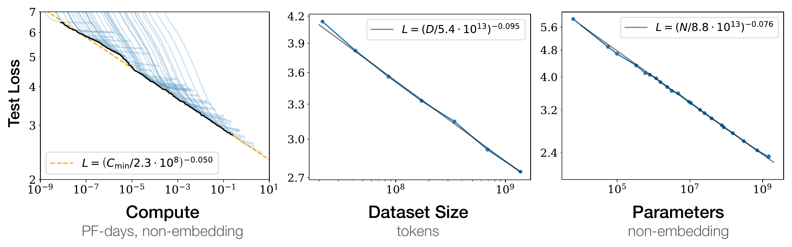
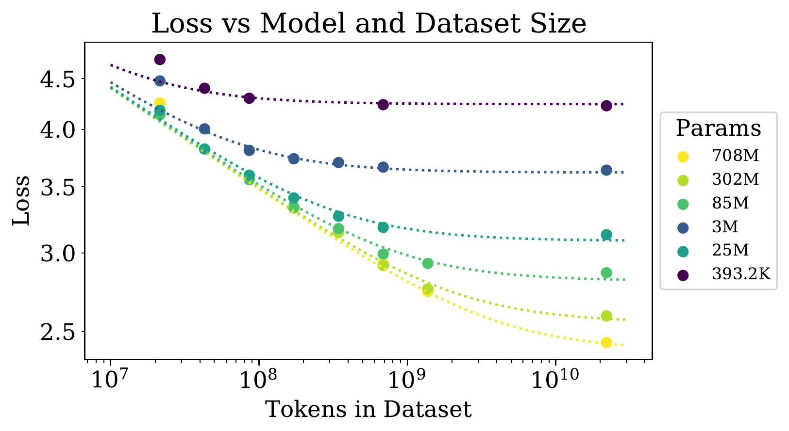
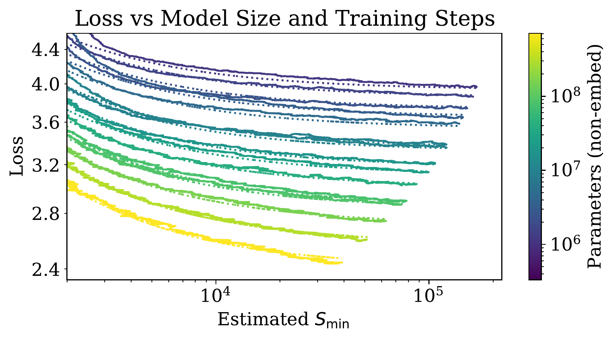
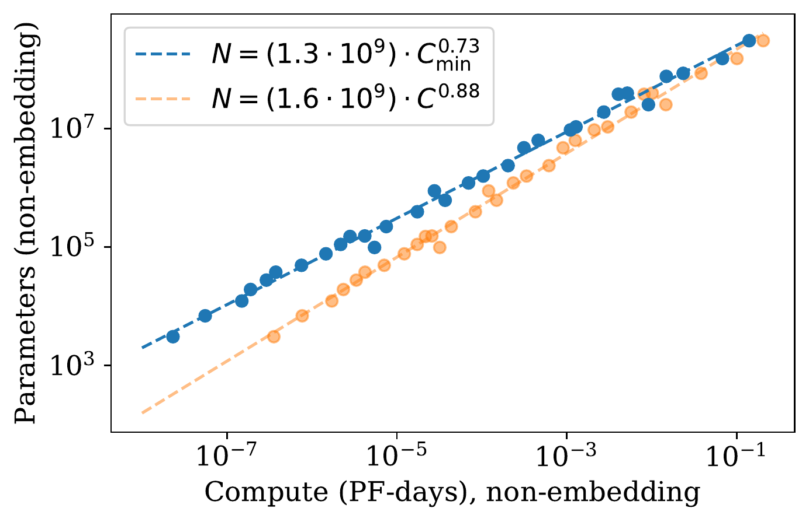
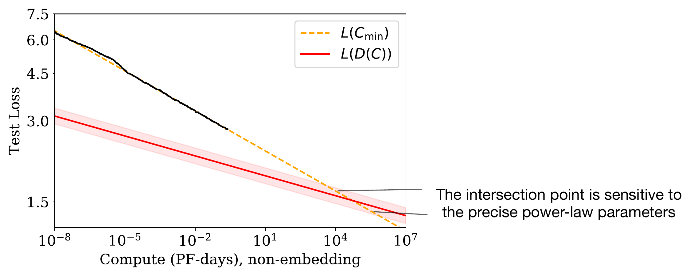

# 论文解读：Scaling Laws for Neural Language Models

> **核心判断：这篇论文最重要的贡献不是“证明模型越大越好”，而是把一次昂贵的大模型训练从经验下注，改写成了一个可以用小模型实验拟合的资源分配问题。它最强的遗产是方法，最不该被当作常数背诵的是那组具体指数。**

论文：[Scaling Laws for Neural Language Models](https://arxiv.org/abs/2001.08361)，Jared Kaplan、Sam McCandlish、Tom Henighan、Tom B. Brown 等，2020。  
官方材料：[OpenAI 论文页](https://openai.com/index/scaling-laws-for-neural-language-models/) · [论文 PDF](https://arxiv.org/pdf/2001.08361) · [arXiv 源码包](https://export.arxiv.org/e-print/2001.08361)

本文面向知道 Transformer、交叉熵和梯度下降基本概念的读者，不要求统计物理或大规模训练经验。文中的判断分成三类：

- **论文事实**：论文直接测量、拟合或明确陈述的结果；
- **推导性理解**：由论文公式推出、但不是作者单独做过的实验；
- **开放问题**：原论文没有回答，或后续证据已经要求重新校准的问题。

## 先看一个真正昂贵的问题

假设你拿到原来 **10 倍**的训练算力。应该怎样花？

1. 把模型参数增大 10 倍，数据量不变；
2. 模型不变，多训练 10 倍 Token；
3. 参数和 Token 各增大约 $\sqrt{10}$ 倍；
4. 先训一批小模型，再从它们的曲线预测最优组合。

前三个答案都像合理经验，第四个才是这篇论文带来的方法论变化。

大模型训练的特殊之处在于，最大的那次实验通常无法重来。等 100B 模型训练结束才发现学习率日程、模型大小或数据量分配错了，复盘再正确也无法追回已经消耗的算力。Kaplan 等人真正要回答的是：

> **能否从一组便宜得多的训练实验中，拟合出损失关于模型规模、数据和算力的稳定规律，再用它决定那次最昂贵训练应该选多大的模型、看多少数据、何时停下？**

这个问题直到今天仍然成立。变化的是拟合对象、训练配方和可用数据，不能原样照搬的是 2020 年那组指数。

## 一、任务契约：论文究竟测量了什么

Scaling law 很容易被说成一条关于“智能”的定律，但原论文的实验对象要窄得多。

| 项目 | 原论文设定 |
|---|---|
| 模型 | 以 decoder-only Transformer 为主，另有 LSTM 和 Universal Transformer 对照 |
| 参数范围 | 768 到 15 亿个**非嵌入参数** |
| 数据 | WebText2，共约 229 亿 Token；子集最小约 2200 万 Token |
| Tokenizer | 50,257 词表的 BPE |
| 上下文 | 大多数实验为 1024 Token |
| 训练目标 | 自回归 next-token 交叉熵 |
| 主指标 | WebText2 测试集上的 nats/token |
| 计算估计 | $C\approx 6NBS$，忽略嵌入及部分上下文相关开销 |
| 没有直接测量 | 指令遵循、推理正确率、事实性、安全性、人类偏好、推理成本 |

令语言序列为 $x_1,\ldots,x_T$，论文的损失是：

$$
L
=-\frac{1}{T}\sum_{t=1}^{T}
\log p_\theta(x_t\mid x_{<t})
$$

单位是 nats/token，对应的困惑度为：

$$
\operatorname{PPL}=e^L
$$

所以，论文测量的是模型给真实下一个 Token 分配概率的平均质量，不是“模型是否会数学证明”或“是否能当一个好助手”。后面所有外推都应先守住这条证据边界。

### 先把四个容易混淆的量分开

原论文的符号在不同推导中会靠得很近。为了避免把“数据集大小”和“实际看过的 Token”混为一谈，本文额外引入 $T_{\rm train}$：

| 符号 | 含义 |
|---|---|
| $N$ | 非嵌入参数量 |
| $D$ | 可用的**唯一数据集**大小，单位为 Token |
| $B$ | 每个参数更新处理的 Token 数 |
| $S$ | 参数更新次数 |
| $T_{\rm train}=BS$ | 训练实际处理的 Token 总数；若重复数据，它可以大于 $D$ |
| $C\approx6NBS=6NT_{\rm train}$ | 论文估计的非嵌入训练 FLOPs |
| $C_{\min}$ | 若 batch 远小于临界 batch，为达到某一损失所需的理想最小算力估计 |

这里的 6 近似来自每个参数、每个 Token 的前向和反向计算。它不是所有 Transformer 在任何上下文长度下都严格成立的物理常数。论文自己也承认，当上下文相关计算不可忽略时，这个估计会失真。

## 二、幂律究竟说了什么

最简单的幂律写成：

$$
L(X)=\left(\frac{X_c}{X}\right)^\alpha
$$

其中 $X$ 可以是参数、数据或算力。两边取对数：

$$
\log L
=-\alpha\log X+\alpha\log X_c
$$

于是，在双对数坐标中，幂律就是一条斜率为 $-\alpha$ 的直线。它的工程意义不是曲线好看，而是允许我们用较小尺度上的直线外推更大尺度。

先看论文最著名的原图时，注意三件事：三个横轴不是同一个量；纵轴始终是测试交叉熵；直线成立都有“没有被另外两个因素卡住”的条件。

*论文原图 Figure 1；从[官方 arXiv 源码包](https://export.arxiv.org/e-print/2001.08361)中的矢量图渲染，仅裁去空白。左图的浅蓝线是不同模型的学习曲线，黑色包络近似表示每个算力预算下的最佳结果；中、右图分别拟合数据和参数受限的结果。它支持“测量区间内存在平滑幂律”，不能证明指数跨数据、架构和训练配方普适。*

论文给出的三个基本拟合是：

$$
L(N)
=\left(\frac{8.8\times10^{13}}{N}\right)^{0.076}
$$

$$
L(D)
=\left(\frac{5.4\times10^{13}}{D}\right)^{0.095}
$$

$$
L(C_{\min})
=\left(\frac{3.1\times10^{8}}{C_{\min}}\right)^{0.050}
$$

最后一个式子的 $C_{\min}$ 以 PF-days 计；一个 PF-day 是 $8.64\times10^{19}$ 次浮点运算。

原论文在这里留下了一个小但可见的版本差异：Figure 1 图例写的是 $2.3\times10^8$，正文公式和附录汇总表写的是 $3.1\times10^8$。本文采用后者；两处的关键指数都是 0.050。作者也明确说明，这类尺度常数会受 Tokenizer 和拟合方式影响，没有基本物理含义。

### 小指数不等于小影响

以参数幂律为例，参数翻倍后：

$$
\frac{L(2N)}{L(N)}
=2^{-0.076}
\approx0.949
$$

也就是在参数受限、数据和训练都充分的条件下，测试损失约下降 5.1%。若原来 $L=3$，这个比例把损失降到约 2.85；困惑度则从 $e^3\approx20.1$ 降到 $e^{2.85}\approx17.3$。

但幂律同时意味着**边际收益递减**。要让损失持续下降相同的相对比例，需要不断按倍数增加资源。Scaling 不是免费午餐，它只是让昂贵投入的回报变得较可预测。

## 三、三条直线还不够：真正关键的是联合的 $L(N,D)$

单看 $L(N)$ 容易得出“模型一直加大”的结论，单看 $L(D)$ 又容易得出“数据一直增加”的结论。现实中二者会互相卡住：

- 模型太小，再多数据也装不下更多规律；
- 数据太少，再大模型也会很快进入收益递减和过拟合区。

论文提出的联合经验式是：

$$
L(N,D)
=\left[
\left(\frac{N_c}{N}\right)^{\frac{\alpha_N}{\alpha_D}}
+\frac{D_c}{D}
\right]^{\alpha_D}
$$

这条式子值得逐层读：

1. 第一项代表模型容量瓶颈；
2. 第二项代表有限数据瓶颈；
3. 两项相加意味着任何一个瓶颈很大，最终损失都下不去；
4. 当 $D\to\infty$ 时，它退化为 $L(N)$；
5. 当 $N\to\infty$ 时，它退化为 $L(D)$。

它不是从 Transformer 理论推出来的。作者先提出满足极限条件和 $1/D$ 展开的函数形状，再用实验检验。论文明确说，第三个解析性假设比前两个更弱。因此应把它称为**被数据支持的经验 ansatz**，而不是已经证明的自然定律。

看 Figure 4 左图时，横轴是唯一数据集 Token 数，颜色是模型参数量。每条曲线向右先下降、后变平；模型越大，平台越低，但也需要更多数据才能进入平台区。

*论文原图 Figure 4 左面板；来源同上。点是实验，虚线是联合 $L(N,D)$ 拟合。除最小的约 2200 万 Token 数据区外，简单公式能够描述多种模型—数据组合。它提供的是联合拟合证据，不是这个函数形式的因果理论。*

由联合式还可以得到一个很有影响力的比值：

$$
\frac{N^{\alpha_N/\alpha_D}}{D}
\approx
\frac{N^{0.74}}{D}
$$

在论文设定下，为了让过拟合惩罚保持相近，数据量大致应满足：

$$
D\propto N^{0.74}
$$

所以模型参数增大 8 倍时，唯一数据量只需增加：

$$
8^{0.74}\approx4.7
$$

这就是论文所说“约 5 倍数据”的来源。请注意，这个结论已经同时依赖两个拟合指数；任何一个指数的轻微变化都会在大规模外推时被放大。

## 四、训练多久：把容量上限和优化进度拆开

固定模型大小后，损失不是立刻落到 $L(N)$，而是沿学习曲线逐渐逼近。论文用另一条联合式描述它：

$$
L(N,S_{\min})
=
\left(\frac{N_c}{N}\right)^{\alpha_N}
+
\left(\frac{S_c}{S_{\min}}\right)^{\alpha_S}
$$

其中：

$$
\alpha_S\approx0.76,
\qquad
S_c\approx2.1\times10^3
$$

第一项是这个规模模型最终难以突破的容量项，第二项是还没训练够的优化项。$S_{\min}$ 不是日志里的原始 step，而是作者根据临界 batch 修正出的理想最少更新次数。

Figure 4 右图里，实线是不同参数量模型的训练曲线，虚线是同一个函数形式的拟合。应重点看“不同颜色是否保持相近形状”，而不是只看最下面的大模型。

*论文原图 Figure 4 右面板；来源同上。它支持“越过训练初期瞬态后，许多模型的学习曲线可以被共同形式描述”。论文也明确指出，训练很早期的拟合较差，因此不能拿这条式子解释 warm-up 内的动态。*

这一拆分带来一个关键直觉：

> **更小模型训练很久，后期主要在逼近较高的容量下限；更大模型即使训练较短，也可能更早穿过相同损失。**

这就是“更大模型更样本高效”的精确含义。它不等于更大模型每个训练 Token 更便宜，也不等于部署时更高效。

## 五、固定算力怎样推导最优解

### 1. 先用一个教学版推导看懂机制

暂时忽略 batch 细节，把损失近似写成模型项与训练数据项：

$$
L(N,T_{\rm train})
=aN^{-\alpha}+bT_{\rm train}^{-\beta}
$$

训练算力约束为：

$$
C\approx6NT_{\rm train}
$$

固定 $C$ 后：

$$
T_{\rm train}=\frac{C}{6N}
$$

代回损失：

$$
L(N\mid C)
=aN^{-\alpha}
+b\left(\frac{6N}{C}\right)^\beta
$$

把它对 $N$ 求导并令导数为零，得到最优点满足：

$$
\alpha aN^{-\alpha}
=
\beta bT_{\rm train}^{-\beta}
$$

这句话比具体指数更重要：**在最优前沿上，继续增加模型和继续增加训练 Token 的边际收益必须平衡。** 若一边的边际收益明显更高，就应该把预算从另一边移过来。

相应的增长形式是：

$$
N_{\rm opt}\propto C^{\frac{\beta}{\alpha+\beta}},
\qquad
T_{\mathrm{train,opt}}\propto C^{\frac{\alpha}{\alpha+\beta}}
$$

原论文的正式推导还把临界 batch 和优化步数单独建模，因此不能直接拿这个教学式替代论文完整结果；但它已经解释了最优前沿为什么必然是一种“模型—数据平衡”，而不是单独放大一个旋钮。

### 2. Kaplan 论文给出的正式结果

结合模型、训练 step 和临界 batch 的拟合，论文得到：

$$
N_{\rm opt}\propto C_{\min}^{0.73}
$$

$$
B_{\rm crit}\propto C_{\min}^{0.24}
$$

$$
S_{\min}\propto C_{\min}^{0.03}
$$

因此实际处理的训练 Token 大约按：

$$
T_{\rm train}=B_{\rm crit}S_{\min}
\propto C_{\min}^{0.27}
$$

增长。若算力增加 10 倍：

$$
N_{\rm opt}\ \text{增加}\ 10^{0.73}\approx5.37\ \text{倍}
$$

$$
T_{\mathrm{train,opt}}\ \text{增加}\ 10^{0.27}\approx1.86\ \text{倍}
$$

论文 Figure 14 左图展示了参数最优值随算力预算的拟合。蓝色是考虑临界 batch 修正后的 $C_{\min}^{0.73}$ 趋势，橙色是未做同样修正的经验趋势。

*论文原图 Figure 14 左面板；来源同上。它直接支持该实验族中的 $N_{\rm opt}\propto C_{\min}^{0.73}$ 拟合。它不证明 0.73 是跨训练日程和数据分布不变的指数；Chinchilla 后来正是在这个位置给出不同结论。*

### 3. “大模型、少训练、早停”到底有多早

论文附录推导出，在其经验模型中，计算最优训练应停在比该模型完全收敛损失高一个固定比例的位置：

$$
\frac{\alpha_N}{\alpha_S}
\approx
\frac{0.076}{0.76}
\approx10\%
$$

作者用一个接近收敛、只高 2% 的常见方案作对照，估算计算最优方案可以：

- 使用约 2.7 倍大的模型；
- 只用约 $1/7.7$ 的参数更新次数；
- 以约 35% 的训练算力达到相同损失。

这些数字是拟合模型内的比较，不是普适训练配方。更重要的边界是：这里优化的是**一次预训练达到目标损失所需的算力**。它没有把模型上线后的每次推理、微调、显存占用和服务年限计入总成本。

## 六、Chinchilla 为什么改写了答案，却没有推翻方法

2022 年的 [Training Compute-Optimal Large Language Models](https://arxiv.org/abs/2203.15556) 重新研究了同一个问题。它训练了 400 多个语言模型，规模从 7000 万到 160 多亿参数，训练量覆盖约 50 亿到 5000 亿 Token。

Chinchilla 论文同意 Kaplan 的一个核心结论：**计算最优的大模型不应被训练到各自的最低可能损失。** 分歧在于究竟应该多早停、多少预算给参数、多少预算给数据。

它的三种方法得到：

| 方法 | $N_{\rm opt}\propto C^a$ | $D_{\rm opt}\propto C^b$ |
|---|---:|---:|
| 训练曲线最小值 | $a=0.50$ | $b=0.50$ |
| IsoFLOP 剖面 | $a=0.49$ | $b=0.51$ |
| 参数化损失模型 | $a=0.46$ | $b=0.54$ |
| Kaplan 2020 | $a=0.73$ | $b=0.27$ |

也就是说，Chinchilla 的结论接近“参数和训练 Token 等比例扩展”。以最直观的 0.5/0.5 为例，算力增加 10 倍时，两者各增加约 $\sqrt{10}=3.16$ 倍。

*本文重绘。Kaplan 数值来自原论文计算最优表；Chinchilla 使用其第一种方法的 0.50/0.50 作为代表，并在图中保留三种方法范围。来源：[Kaplan et al., 2020](https://arxiv.org/abs/2001.08361) 与 [Hoffmann et al., 2022](https://arxiv.org/abs/2203.15556)。*

Chinchilla 论文提出两个重要解释：

1. Kaplan 的许多实验让不同模型共享固定训练 Token 数和学习率日程，再从中间 checkpoint 读取损失；而 Chinchilla 发现，让学习率日程与目标训练长度匹配会改变最终损失估计。
2. Chinchilla 的拟合包含更多较大模型，并观察到算力—损失前沿存在轻微曲率；主要由更小模型拟合再远距离外推，可能得到不同最优点。

它还做了两个很强的验证：

- 在 $10^{21}$ FLOPs 的小规模正面对照中，预测最优的 28 亿参数模型优于 Kaplan 预测的约 47 亿参数模型；
- 在接近 Gopher 训练算力下，用 700 亿参数、1.4 万亿 Token 训练 Chinchilla，对比 2800 亿参数、约 3000 亿 Token 的 Gopher，并在大量下游任务上取得更好结果。

这里最值得保留的不是“Kaplan 错、Chinchilla 对”这么简单的叙事，而是：

> **Scaling law 的实验范式经受住了后续检验；具体指数则暴露出对模型区间、学习率日程、数据和拟合方法的依赖。**

这正说明它更像一张需要随训练配方重测的地图，而不是万年历。

## 七、原论文其实已经画出了自己的失效边界

只看前三条幂律，会觉得论文在无限外推。但作者在 Figure 15 中主动指出了一个矛盾：

- 为了控制过拟合，唯一数据量应按 $D\propto N^{0.74}$ 增长；
- 又因为 $N_{\rm opt}\propto C_{\min}^{0.73}$，所以所需唯一数据大约按 $C_{\min}^{0.54}$ 增长；
- 但按计算最优方案、只训练一轮时，实际可处理的新数据只按约 $C_{\min}^{0.26}$ 增长。

于是，算力幂律预测的损失迟早会低于有限数据允许达到的损失。两条外推必然相交，至少一条必须先失效。

*论文原图 Figure 15；来源同上。橙色虚线是计算最优损失外推，红线是由可用数据增长推得的限制。作者标注交点对幂律参数极其敏感。它证明的是两组外推不可同时无限成立，不证明交点就是语言熵或模型能力的终极上限。*

论文粗略估计交点在：

$$
C^*\sim10^4\ {\rm PF\text{-}days},
\qquad
N^*\sim10^{12}
$$

$$
D^*\sim10^{12}\ {\rm tokens},
\qquad
L^*\sim1.7\ {\rm nats/token}
$$

作者同时强调，这些值可能向任一方向变化一个数量级。后来 Chinchilla 对指数的修正进一步说明，不能把这个交点当作兑现过的预言。

### 论文明确承认的限制

原论文的 caveats 比许多二手解读更谨慎：

- 没有能推出这些幂律的坚实理论，尤其不理解模型和数据指数为何是这些值；
- 最小数据区的拟合较差，且没有系统研究正则化和数据增强；
- 临界 batch 在远距离外推下不可靠；
- $C\approx6NBS$ 忽略上下文相关计算，长上下文时可能严重失真；
- 学习率与目标训练长度有关，短训练的最佳学习率未被充分搜索；
- 交叉熵继续平滑下降，是否会稳定转化为相关语言任务能力，论文没有验证。

最后一点尤其重要。作者在讨论中已经提出：平滑的量变可能隐藏具体能力上的质变，但这只是问题意识，不是本文的实验结论。

## 八、读完论文后的五点思考

### 思考一：Scaling law 首先是一种控制系统，不是一种未来学

**推导性理解：** 真正有用的工作流是：

$$
\text{pilot runs}
\rightarrow
\text{fit}
\rightarrow
\text{holdout validation}
\rightarrow
\text{iso-compute frontier}
\rightarrow
\text{one expensive run}
$$

它把组织的训练决策从“谁的经验更强”变成“哪组预测在留出的训练 run 上更准”。最重要的产物不是一条漂亮直线，而是：

- 适用的模型族和数据版本；
- 拟合区间；
- 参数置信区间；
- 留出点误差；
- 对最终模型大小和 Token 数的敏感性。

一条没有版本、区间和残差的 scaling law，工程价值接近一句口号。

### 思考二：Token 数不是数据量，真正稀缺的是有效信息

**论文事实：** Kaplan 用 WebText2 的唯一 Token 数研究数据瓶颈，Chinchilla 用训练中见过的 Token 数重新估计计算最优前沿。

**后续证据：** [Scaling Data-Constrained Language Models](https://arxiv.org/abs/2305.16264) 在其模型和数据区间内发现，有限数据重复到约 4 个 epoch，与同量唯一数据相比对损失影响很小；继续重复后，新增算力的价值逐渐衰减。它不是“重复四轮永远安全”的规则，而是证明原始 Token 计数不足以描述数据价值。

[DeepSeek LLM](https://arxiv.org/abs/2401.02954) 也报告 scaling 行为与数据质量有关，并把不同研究得出不同最优分配部分归因于数据差异。

**推导性理解：** 下一步更合理的变量不只是 $D$，而是“有效数据量”：

$$
D_{\rm eff}
=
\sum_i
w_i\cdot
\operatorname{novelty}_i\cdot
\operatorname{learnability}_i
$$

这不是已有统一公式，而是一种研究方向：去重、质量、领域混合、难度日程和模型当前已会什么，都在改变一个 Token 的边际价值。

### 思考三：平滑 loss 与突现能力并不矛盾

**论文事实：** Kaplan 测量的是连续、稠密、逐 Token 平均的交叉熵。

下游能力往往用非线性指标测量。例如一道题只有完全答对才记 1 分，模型把正确答案概率从 1% 提高到 40% 仍然可能连续多次得 0；跨过某个阈值后，准确率才突然上升。

[Are Emergent Abilities of Large Language Models a Mirage?](https://arxiv.org/abs/2304.15004) 进一步展示，非连续指标可以制造表面上的突现，而更连续的指标会呈现平滑趋势。这不能排除所有真实的能力相变，但足以说明：

> **预训练 loss 的平滑可预测性，不自动推出任一下游能力也能按同一条幂律预测。**

因此，现代 scaling 实验至少需要两层模型：

1. 资源 $\rightarrow$ 预训练 loss；
2. 预训练 loss $\rightarrow$ 目标能力或产品指标。

第二层往往比第一层更难、更任务相关。

### 思考四：训练最优不等于生命周期最优

Kaplan 的目标函数只关心达到给定训练 loss 的算力。一个更大的模型训练较短，可能在预训练账本上最优，却会在数十亿次推理中反复支付更高成本。

如果把模型整个生命周期纳入，目标应更接近：

$$
C_{\rm total}
=C_{\rm pretrain}
+C_{\rm posttrain}
+Q\cdot C_{\rm inference}
+C_{\rm serving}
$$

其中 $Q$ 是预计请求量。Chinchilla 的重要现实意义正在这里：更小但训练更充分的模型不仅 loss 更低，也显著降低后续微调与推理成本。

这意味着“最佳预训练模型”和“最佳产品模型”可能不是同一个点。蒸馏、稀疏化、量化、路由和大小模型协同，本质上都在把优化目标从一次训练扩展到整个生命周期。

### 思考五：今天的 scaling 已经不止一条轴

原论文只讨论 base model 的预训练。现代系统还会把资源分给：

- 数据治理和合成数据；
- SFT、偏好优化与可验证奖励 RL；
- 检索、工具和长期记忆；
- 推理时采样、搜索与验证；
- 更长上下文和外部计算。

这些资源未必都能折算为同一种训练 FLOP。关于后训练各阶段的责任边界，可对照 [[大模型与强化学习的协同演进：从SFT、PPO到DPO、GRPO与Agentic-RL]]。

**开放问题：** 如果总预算固定，下一单位计算应该给预训练参数、更多高质量 Token、在线 RL rollout，还是推理时搜索？这会是比“模型参数还能不能继续增大”更接近下一代 scaling law 的问题。

## 九、如果今天要做一次 scaling 实验

下面这套清单比复用 0.73 或 0.50 更可靠。

### 1. 先锁定预测对象

明确要预测的是验证集交叉熵、代码 loss、数学数据 loss，还是某个下游能力。不要用一个 aggregate loss 代替所有产品目标。

### 2. 锁定模型族和训练配方

架构、Tokenizer、数据混合、优化器、学习率日程、上下文长度和精度策略发生实质变化后，应视为一张新地图。不要把旧指数跨代平移。

### 3. 在 log 空间布置 pilot grid

同时改变 $N$ 和 $T_{\rm train}$，覆盖多个 isoFLOP 预算；每个预算不能只训练一个模型，否则看不到前沿。

### 4. 让学习率日程匹配训练 horizon

不要只从一个长日程的中间 checkpoint 读取所有短训练结果。Chinchilla 已说明，这会系统性改变损失估计和最优分配。

### 5. 留出整条训练 run 做外推验证

拟合误差小不等于预测误差小。至少留出若干模型大小和算力预算，检查外推而非插值。

### 6. 报告前沿的宽度，不只报单点

Kaplan 附录已经显示，模型大小偏离预测最优点一定范围，算力惩罚可能并不大。若最优谷很平，硬追求一个精确参数值没有意义；应该优先考虑硬件效率、推理成本和训练稳定性。

### 7. 做指数敏感性分析

计算当指数落在置信区间两端时，目标大模型的 $N_{\rm opt}$ 和 Token 数会变化多少。外推跨越多个数量级后，小指数误差会变成巨大的资源差异。

### 8. 最后加入部署账本

若模型会被高频调用，就把推理、显存、延迟、微调和蒸馏成本加入目标。计算最优前沿只是决策输入，不是最终答案。

## 一周后应该记住什么

1. **Scaling law 是资源到损失的经验地图，不是“规模自动产生智能”的因果理论。**
2. **Kaplan 最重要的发现是可以从小规模实验拟合计算最优前沿；0.73/0.27 只是其数据和训练配方下的坐标。**
3. **Chinchilla 继承了方法，却把参数—Token 分配修正到接近 0.5/0.5，证明指数必须随配方重新校准。**
4. **平滑的预训练 loss 不能直接替代下游能力、部署成本或安全指标。**
5. **真正成熟的 scaling 决策，优化的应是模型整个生命周期，而不只是那一次预训练。**

## 参考资料

1. Jared Kaplan et al., [Scaling Laws for Neural Language Models](https://arxiv.org/abs/2001.08361), 2020.
2. OpenAI, [Scaling laws for neural language models](https://openai.com/index/scaling-laws-for-neural-language-models/), 2020.
3. Sam McCandlish et al., [An Empirical Model of Large-Batch Training](https://arxiv.org/abs/1812.06162), 2018.
4. Jordan Hoffmann et al., [Training Compute-Optimal Large Language Models](https://arxiv.org/abs/2203.15556), 2022.
5. Niklas Muennighoff et al., [Scaling Data-Constrained Language Models](https://arxiv.org/abs/2305.16264), 2023.
6. Rylan Schaeffer, Brando Miranda, Sanmi Koyejo, [Are Emergent Abilities of Large Language Models a Mirage?](https://arxiv.org/abs/2304.15004), 2023.
7. DeepSeek-AI, [DeepSeek LLM: Scaling Open-Source Language Models with Longtermism](https://arxiv.org/abs/2401.02954), 2024.
