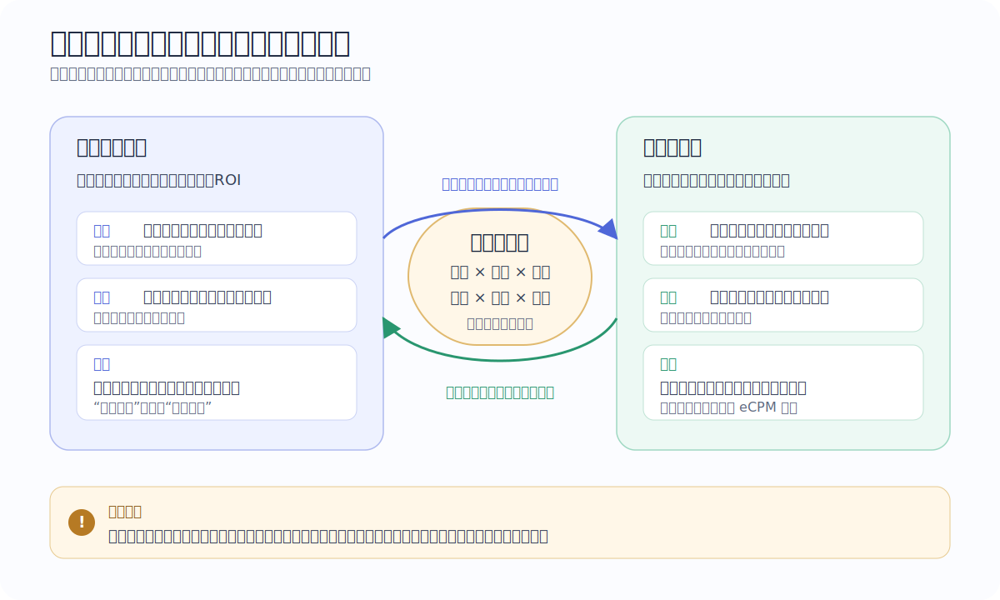
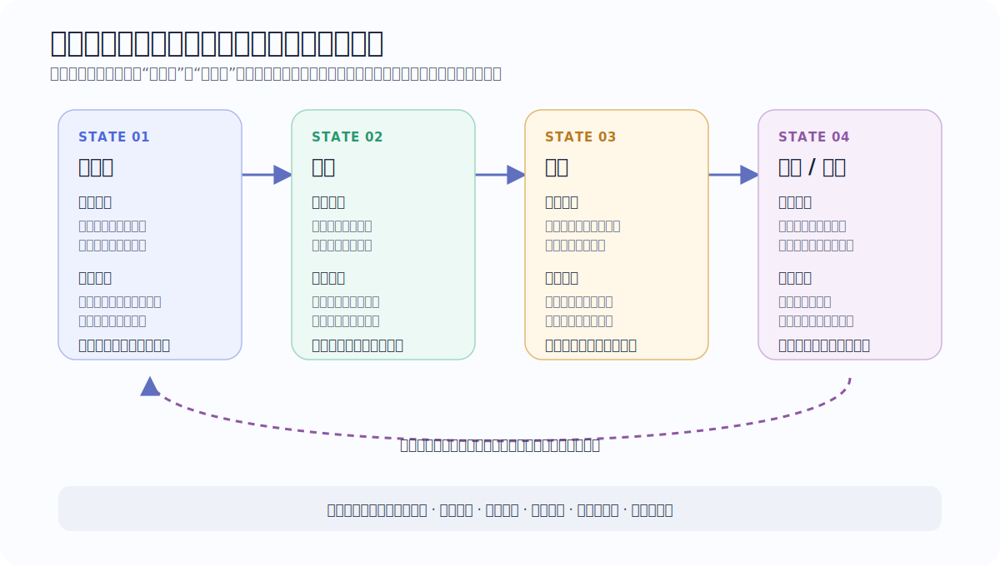
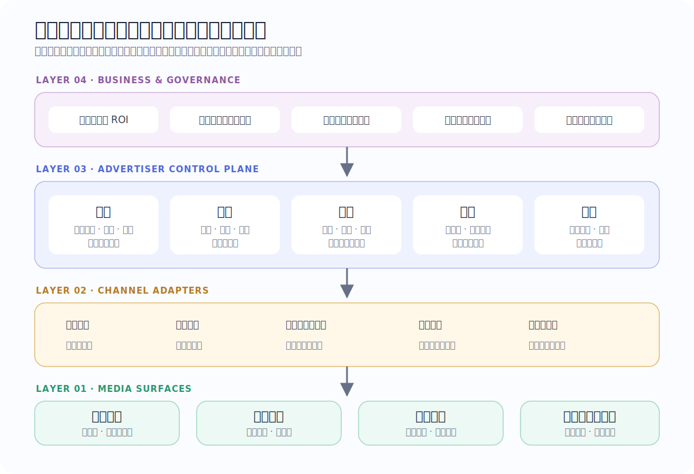

> **公开说明** 本文来自多年广告主侧实践的抽象总结。为保护相关主体，文中已移除或泛化公司、产品、媒体、账户、预算、规模、实验参数、时间、组织和供应商信息；所有示意仅用于解释机制，不代表任何主体的经营数据。事件回传只讨论平台允许、用户授权、真实且可审计的行为，不包含伪造数据或规避平台规则。

过去谈广告系统，我们很容易站在媒体一侧：有多少库存，怎样预估点击率和转化率，如何排序，怎样让每次展示获得更高收益。这个视角当然重要，但它只解释了交易的一半。

我过去几年站在广告主一侧，做过高客单、长链路、强监管行业的广告投放。换到这一侧，最强烈的感受不是“媒体模型又黑又复杂”，而是：**投放是一场目标相关但不相同、数据相连但不对称、能力互补但持续博弈的长期协作。**

广告主付出的也远不止预算。每进入一个新渠道，都要重新理解库存、版位、素材语法、账户学习、事件口径、反馈速度和合作链路；与此同时，还要处理代理商、资金、结算、合规、实验、复盘和后端承接。很多媒体正在用产品化降低直客与销售的人力成本，广告主侧的人力却不会因此自动消失，只会从“操作账户”转向“理解差异、补足信息与管理系统”。

这篇文章试着回答三个问题：广告主与媒体究竟在合作什么、博弈什么？为什么投放如此依赖人力？广告主应该沉淀怎样一套不被单一渠道绑定的能力？

## 一、一次展示背后，其实有两个目标函数

媒体常用一个近似的排序框架理解广告竞争力：

$$
\operatorname{RankScore} \approx \operatorname{Bid} \times \widehat{pCTR} \times \widehat{pCVR} \times \alpha
$$

其中，`Bid` 是出价，$\widehat{pCTR}$ 和 $\widehat{pCVR}$ 是媒体对点击率与转化率的预估，$\alpha$ 则汇集了质量、节奏、探索、生态和规则等难以从外部完整观察的因素。这个式子帮助我们思考，却不是所有媒体逐次竞价时都会机械执行的物理定律。

广告主真正关心的则更接近：

$$
V_{imp}=P(\text{真实转化}\mid\text{曝光})\times LTV_{inc}-C_{service}-C_{risk}
$$

这里的 $LTV_{inc}$ 是由广告带来的增量长期价值，$C_{service}$ 是履约与运营成本，$C_{risk}$ 则包括退款、投诉、欺诈、逆选择和合规风险。媒体通常无法完整看到这些后链路结果；广告主也无法完整看到媒体内部的库存、竞争和排序状态。

于是，同一次曝光对双方有不同含义：媒体看到的是一次可分配库存及其预估收益，广告主看到的是一个尚未完成、可能很久以后才知道质量的业务机会。

这解释了一个容易被忽略的事实：**利益相关，不等于利益相同。**

- 双方都希望转化预测更准，因为更准通常意味着更少浪费。
- 媒体还要同时考虑库存收益、用户体验、广告生态与交付稳定性。
- 广告主则要为后端质量、长期价值、现金流与监管责任负责。
- 媒体希望以标准产品服务更多广告主；成熟广告主却需要保留理解和干预自身业务的能力。

所以最健康的关系既不是把媒体当作纯粹对手，也不是把自己的业务判断完全交给媒体。它更像两套控制系统通过有限接口协作：媒体决定流量怎样分，广告主决定什么信号代表价值、愿意为它付多少钱，以及结果是否值得继续。

## 二、成熟度差异：媒体之间很大，广告主之间更大

不同媒体的成熟度确实差异明显。有的媒体拥有稳定的预估、丰富的优化目标、清晰的实验工具和较快的反馈；有的媒体仍高度依赖人工运营、白名单、销售协调或不透明的流量干预。

但广告主的差异往往更大。

最初级的广告主只会给预算、看平台报表和追求表面转化成本；再往上，会建设归因、事件回传、素材生产和账户自动化；更成熟的广告主还会拥有后链路价值模型、增量实验、渠道适配层、供应链治理和策略记忆。

这形成了一个结构性张力：

- 媒体倾向于把复杂能力封装成标准化产品，希望广告主多回传数据、少理解内部机制。
- 广告主如果只使用标准目标，媒体就只能优化一个被压缩过的代理指标，而不是真实业务价值。
- 广告主参与过深，又会提高对接成本、破坏媒体产品的一致性，甚至让双方在短期流量分配上相互试探。

真正的分界不在于“懂不懂投放术语”，而在于广告主有没有能力回答：**平台收到的这个事件，是否仍然代表我的真实价值？**

## 三、为什么广告主侧投放极度重人力

很多人把投放理解为“充钱、建计划、传素材、调出价”。在规模化业务里，这只是最表面的一层。广告主实际经营的是四条同时变化的生产线：

| 生产线 | 日常工作 | 为什么难以直接复用 |
|---|---|---|
| 流量与策略 | 账户结构、目标选择、出价、人群、节奏、冷启动、稳态控制 | 媒体模型、反馈速度和库存状态不同 |
| 内容与素材 | 选题、脚本、创意、审核、首投、复投、衍生、疲劳判断 | 每个渠道有自己的内容语法与用户预期 |
| 经营与供应链 | 代理商管理、直客协作、预算、充值、余额、结算、合同 | 资金链路和责任边界高度渠道化 |
| 测量与复盘 | 事件口径、归因、KPI、质量、实验、异常、知识沉淀 | 每个渠道缺失的信息和延迟都不同 |

接口打通并不等于能力打通。即使所有平台都提供 API，“转化”在各平台的学习含义仍可能不同；相同素材在不同内容环境中也可能代表完全不同的用户意图。一个平台上有效的账户结构，迁移到另一个平台后可能只剩形式。

更麻烦的是，很多工作具有强烈的长尾性：某个账户为何突然不消耗、某次审核为何改变分发、某批资金为何没有及时到账、某个素材为何在一个版位有效而在另一个版位失效。这些问题单个看都不大，却会共同吞噬团队的大量时间。

因此，所谓“降低人力”不能只理解成自动点击后台按钮。真正应该被产品化的是：

1. 把重复操作变成可靠执行；
2. 把异常变成可分级的诊断；
3. 把策略变成带前提、动作、护栏和退出条件的策略卡；
4. 把一次复盘变成下一次可以检索的组织记忆。

## 四、回传不是对账，而是训练信号与控制信号

在 OCPX 一类系统中，广告主回传的事件至少有三重作用：

1. **事实记录：** 告诉平台发生了什么；
2. **训练样本：** 帮助平台判断什么用户更可能完成目标；
3. **控制反馈：** 影响账户所处的学习状态、流量探索和交付节奏。

这也是广告主不能把“数据回传成功率”当作终点的原因。接口百分之百可用，并不意味着事件定义正确；事件数量增加，也不意味着信息量增加。一个过浅、过宽的事件虽然发生频繁，却可能把模型带向大量低意愿用户；一个过深、过稀疏的事件虽然接近最终价值，又可能让模型长期学不到东西。

可以把事件选择理解为一个偏差与方差的权衡：

$$
\text{有效信号} \approx \text{业务相关性} \times \text{发生频率} \times \text{及时性} \times \text{可辨识度}
$$

越接近最终价值，业务相关性通常越强，但频率更低、延迟更长；越靠近漏斗上游，样本更多、更及时，却更容易引入代理偏差。好的回传体系不是选择唯一事件，而是在平台规则允许的范围内，用真实事件建立层次，并持续检查前端代理指标与后端价值是否脱钩。

### 1. 稳定比峰值更值钱

稳定的转化率与计费口径关系，通常优于剧烈波动但均值相同的结果。

原因不只是业务喜欢可预测。对于持续学习的系统，波动会同时增加媒体模型的估计误差和广告主的判断误差：媒体不知道变化来自人群、素材、竞争还是回传；广告主也不知道流量变化来自策略效果还是平台探索。频繁的大幅动作还会叠加控制延迟，形成“看见下降就加码、加码生效时又撤回”的振荡。

稳态不是不变化，而是让关键变量进入可解释的窄带：变化有原因，动作有上限，结果有等待窗口，异常可以回滚。

### 2. 模型准时，接近真实价值出价；模型不准时，先补信息

这里把 **True Bidding** 定义为：出价尽量接近一次真实增量转化对广告主的价值，而不是为了短期跑量随意拍一个数。

当媒体的转化预估已经较准，接近真实价值出价能让排序更有效，广告主也不必用过多外围动作修正模型。反过来，当媒体模型明显失准时，单纯提高出价常常只是更贵地买入同一种错误流量。此时更重要的是：

- 检查事件口径、归因延迟和样本选择；
- 用合规的高信息量事件补足学习；
- 分离素材、人群和版位，定位偏差来源；
- 在得到足够证据后，再逐步恢复价值出价。

**模型准，价格是主要杠杆；模型不准，信息才是主要杠杆。**

### 3. 相同竞争力下，高转化率通常优于高出价

假设两组流量拥有近似的排序竞争力，一组主要依靠较高转化率，另一组主要依靠较高出价。前者通常更健康：它能产生更多真实样本，降低对持续高价的依赖，也更容易形成正向学习。

但高转化率不是越高越好。极窄人群可能制造漂亮的 CVR，却失去规模；过浅目标也可能抬高平台看到的转化率，却没有带来后端价值。广告主真正要优化的是 **样本质量、样本密度与可扩展性之间的均衡**，而不是孤立追求某一个率。

## 五、找人，很多时候就是持续排除“不该要的人”

投放团队常说“找到目标用户”，听起来像要从海量人群中精准命中一个正向集合。实际工作中，更可行的路径往往是负向学习：不断识别哪些流量虽然便宜、量大或容易转化，却不产生长期价值。

这类排除只有在带来信息增益时才有效。简单地删掉所有短期低效人群，可能把仍在探索的新用户一并杀死；按照历史均值过度收窄，也会把模型锁进越来越小的舒适区。

一个可靠的排除动作至少要回答四个问题：

1. 低效是由用户、人群包、素材、版位还是承接链路造成的？
2. 结论来自足够样本，还是一次流量波动？
3. 排除后释放的预算会流向哪里？
4. 是否保留小比例探索流量，用来发现分布变化？

### 小人群的意义是灵活，不是天然精准

小人群可以快速完成差异化的单点验证：把一种人群假设、一个素材叙事和一个出价策略绑定，短时间内判断方向。它特别适合验证被大盘平均值掩盖的细分机会。

但小人群只是实验探针，不是规模终点。它可能因为偶然性看起来很好，也可能被频控、库存和重叠迅速耗尽。正确用法是：**小范围爆破获得因果线索，复验后再逐层放宽边界。**

## 六、优质媒体的标准：让好内容更容易获得对的流量

从广告主视角，媒体质量不能只看流量规模和表面转化成本。更重要的是，它有没有建立一种正向选择：好的内容吸引合适的用户，合适的用户产生真实价值，真实价值又让好的内容获得更多分发。

反过来，如果一种投放模式主要依赖误导、强诱导或低成本的浅层动作，它很容易形成逆向选择：最容易被“转化”的用户未必最需要产品，最会制造点击的内容未必最能完成履约。短期报表可能很好，长期却会出现留存、退款、投诉、品牌和模型样本同时恶化。

所以我更愿意用三个问题判断媒体：

- 优质内容能否在合理成本下穿过冷启动，而不是长期输给刺激性内容？
- 媒体是否提供足够透明的实验、分层和诊断能力？
- 当广告主把后端质量纳入目标后，规模是否仍能持续？

能让“内容质量—用户意愿—业务价值”同向增长的媒体，才是优质媒体。建立在诱导之上的增长，更像一剂延迟发作的毒药。

## 七、账户有生命周期，策略也必须有状态

同一账户在冷启动、扩量、稳态和衰退阶段面对的主要矛盾不同。冷启动缺信息，扩量担心边际质量，稳态需要控制波动，衰退则要区分素材疲劳、库存变化和历史学习的路径依赖。

这带来两个重要结论。

第一，短期有效的动作不能无限续期。为冷启动设计的高强度探索，如果持续到稳态，可能放大成本和波动；为稳态设计的严格控制，如果提前用在冷启动，又可能让账户永远没有足够样本。

第二，策略必须带退出条件。任何自动化动作都应该写清：它适用于什么状态，观察什么指标，最大动作幅度是多少，等待多久，何时停止，失败后回到哪里。否则自动化只是在更快地重复人工误判。

## 八、基建的价值不在数量，而在获得有效信息的速度

广告主很容易把“多建账户、多建计划、多传素材”当作努力的证明。基建当然重要，但它的边际价值差异巨大。我对优先级的总结是：

> **优质基建的快速有效迭代 > 有明确差异的规模化基建 > 重复基建 > 完全没有有效交付的基建**

这里的“优质”不是事后看谁跑出来，而是事前能够形成可辨识实验：它与已有单元究竟在哪个维度不同，成功或失败后能学到什么。若一次同时改变出价、人群、素材、版位和目标，即使跑出了量，也很难知道为什么。

衡量基建团队，不妨少看“新建多少条”，多看四个指标：

- 首个有效反馈所需时间；
- 单次实验可以排除多少假设；
- 结论被复验和复用的比例；
- 因重复、冲突和无人管理造成的浪费。

高质量基建的本质，是更快地把钱换成可靠信息，再把可靠信息换成稳定规模。

## 九、别迷信严格的 eCPM 公式

排序公式很重要，因为它提供了一个可以讨论的骨架。但真实媒体不会只按照 `出价 × 预估点击率 × 预估转化率` 无条件排序。常见的额外因素还包括：

- 预算与消耗节奏；
- 新计划探索和旧计划稳定性；
- 素材质量、重复度、负反馈与审核状态；
- 版位、时段和库存供需；
- 广告主信用、交付风险与生态治理；
- 用户体验、频控和商业内容比例；
- 合约、保量和平台阶段性经营目标。

这些因素可以被抽象进 $\alpha$，却不能因此假装它们不存在。广告主需要做的不是猜出媒体的全部源码，而是通过受控实验识别：**在当前渠道、当前状态下，哪些外部可观察变量稳定地改变了结果。**

这也是渠道经验难以直接复制的根本原因。媒体之间不同的不是几个 API 字段，而是反馈函数、控制延迟和内容生态。

## 十、广告主真正需要的是一套自己的投放操作系统

跨渠道投放的正确架构，不是要求所有媒体行为一致，而是把能力分成两层：

- **通用控制面：** 业务价值、测量、实验、决策、记忆、资金和治理；
- **渠道适配层：** 事件映射、反馈时延、账户语义、素材语法、库存和节奏。

### 1. 测量层：先统一“发生了什么”

建立事件字典、归因窗口、延迟分布和前后链路对账。平台报表、广告主日志与财务结果出现差异时，先解释口径，不要急着解释策略。

### 2. 实验层：回答“是不是策略造成的”

每次实验先写假设、主指标、质量护栏、最小观察窗口和停止条件。离线模型提升不等于线上价值提升，表面成本下降也不等于增量收益增加。关键策略需要对照、复验和跨周期观察。

### 3. 决策层：把专家经验变成受控动作

将账户状态、异常类型和可用动作结构化。系统给出的不应只有“涨价”或“降价”，还应包含证据、幅度、预期、风险、等待时间和回滚方案。

### 4. 记忆层：记录结论的适用边界

投放知识不能只记录“某策略有效”。还要记录它在哪个媒体、版位、产品阶段、素材类型、竞争环境和样本规模下有效，失败过什么，哪些变量没有被控制。没有边界的经验，迁移后就是偏见。

### 5. 执行与治理层：把隐形劳动显性化

代理商协作、充值、余额、结算、审核、任务跟进和异常升级并非策略之外的杂事，而是投放系统的一部分。资金不到位、责任不清或执行延迟，都足以让一个正确策略得到错误结论。

## 十一、KPI 必须同时看四层

单看平台转化成本，会把广告主重新拉回媒体视角。一个更完整的指标体系至少包含四层：

| 层级 | 典型问题 | 指标示例 |
|---|---|---|
| 交付层 | 有没有买到流量和前端行为？ | 展示、点击、消耗、前端转化、交付率 |
| 效率层 | 单位预算换回多少真实结果？ | 后端转化成本、增量 ROI、边际成本 |
| 质量层 | 这些结果长期是否有价值？ | 留存、复购、退款、投诉、风险、长期价值 |
| 运营层 | 这套能力能否稳定运行？ | 波动、异常恢复时间、人工介入率、资金闲置、复验率 |

好的投放不是某一天成本最低，而是在质量护栏内获得可持续规模，并且随着运行不断降低不确定性和人工依赖。

## 十二、我对投放底层逻辑的最终总结

把前面的论述压缩成一组可以长期检查的判断：

1. **稳定优先于虚高的峰值。** 稳定的转化率、计费关系和样本分布，让双方模型都更可控。
2. **相同竞争力下，高质量转化优于单纯高出价。** 但要同时守住规模，避免用极窄人群制造虚假的高 CVR。
3. **模型准确时按真实价值出价；模型失准时先补信息。** 不要用更贵的价格购买同一种错误。
4. **小人群适合单点爆破。** 它是验证人群与素材组合的灵活探针，不是天然准确，也不是规模终点。
5. **找人常常从排除错误流量开始。** 但排除必须有信息增益，并为分布变化保留探索空间。
6. **能让优质内容获得合适流量的媒体，才是优质媒体。** 依赖诱导获得的短期增长会污染样本、用户质量与品牌。
7. **基建重质量与迭代速度，不重重复数量。** 每一份预算都应该同时购买结果和知识。
8. **媒体排序不是严格公式。** 质量、节奏、库存、体验、治理和经营目标都会改变流量分配。
9. **通用能力与渠道差异必须同时保留。** 统一的是测量、实验、决策和治理，不是强迫所有媒体使用同一套账户玩法。
10. **回传是一份数据契约。** 只使用真实、授权、合规、可审计的事件，并持续验证代理指标没有偏离最终价值。

广告投放的终局，不是广告主“战胜”媒体模型，也不是媒体替广告主做完所有决策。更理想的状态是：媒体越来越擅长分配流量，广告主越来越擅长定义价值；双方通过可信信号协作，又各自保留对自身目标负责的能力。

从这个角度看，广告主最重要的资产从来不只是预算、素材或某个渠道上的历史账户，而是 **一套能够持续获得信息、形成判断、受控执行并沉淀记忆的系统**。它决定了广告主是在一次次购买流量，还是在长期经营自己的增长能力。
