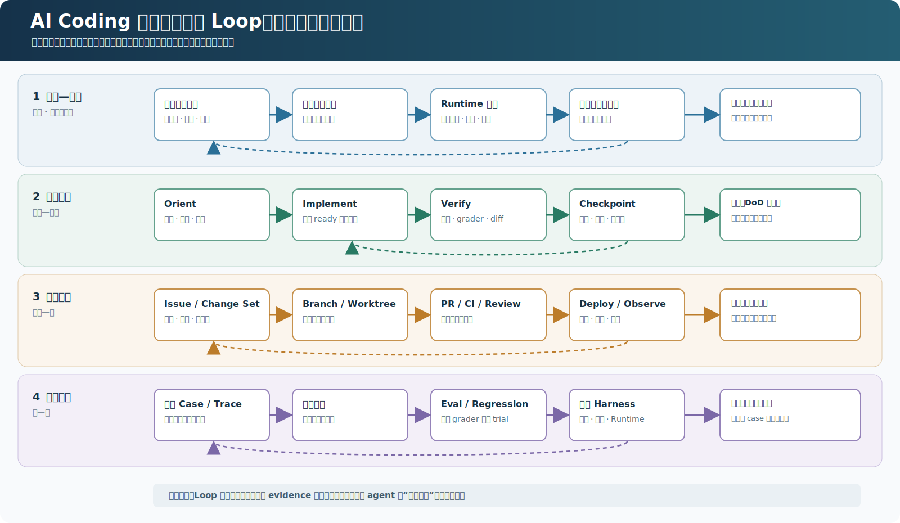
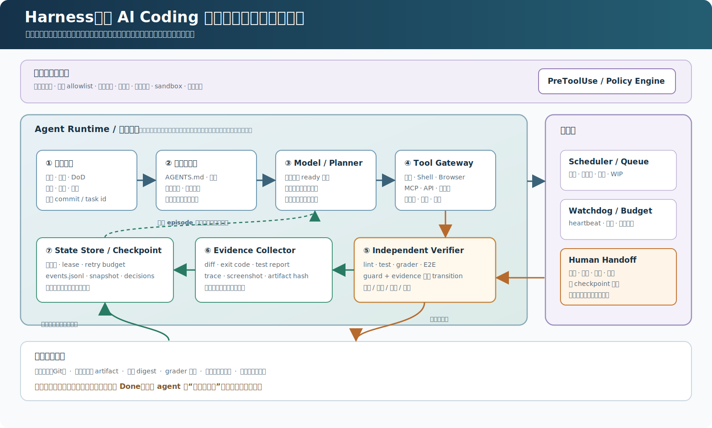
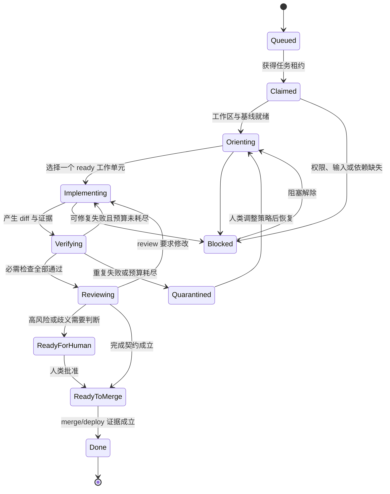
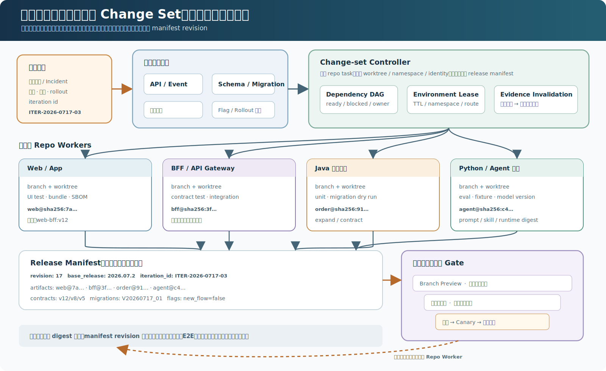
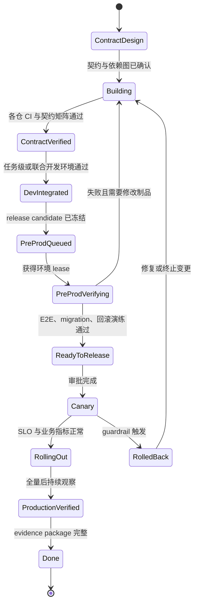

AI Coding 最容易被高估的是模型，最容易被低估的是模型外面的系统。

一个模型能够写出不错的函数，不等于它能够在真实代码库中连续工作数小时，更不等于它能够安全地修改生产系统。两者之间缺少的部分，就是 **Harness**：它为模型提供可理解的代码库、受控的执行环境、持久状态、工具、权限、反馈、验证、恢复能力和人类接管机制。与之配套的 **Loop**，则负责把每次行动产生的证据重新变成下一次决策，并且只在外部可验证的完成条件成立时终止。

可以用一个非严格但很有用的乘法模型理解它：

$$
\text{Agentic R\&D Effectiveness}
= \text{Model Capability}
\times \text{Context Quality}
\times \text{Action Reliability}
\times \text{Verification Coverage}
\times \text{Recovery Capability}
$$

这五项不是彼此替代的。模型更强，并不能补偿错误的仓库说明、失控的权限、不可重复的测试或丢失的任务状态。长任务中，任何一项接近零，整体可靠性都会迅速坍塌。

2026 年初以来，行业讨论明显从“怎样写一个更好的 prompt”转向“怎样构造一个让 agent 持续产生正确工作的系统”。OpenAI 将其称为 [Harness Engineering](https://openai.com/index/harness-engineering/)；Anthropic 总结了[长时间运行 agent 的 harness](https://www.anthropic.com/engineering/effective-harnesses-for-long-running-agents)；Andrej Karpathy 的 [AutoResearch](https://github.com/karpathy/autoresearch) 则把这种思想压缩成了一个极简实验循环：限制可修改面、固定预算、运行实验、读取客观指标、保留或回滚，再继续下一轮。

本文讨论的不是某一个产品的用法，而是一套适用于日常研发和 agent 系统研发的工程方法。

## 0. 先区分四层 Loop

“让 agent 循环起来”这句话过于含糊。真实研发中至少存在四个时间尺度不同、终止条件不同的 loop：

1. **模型—工具 Loop，秒级**：模型生成工具调用，runtime 执行并返回结果，结果进入上下文，直到模型输出本轮答复。OpenAI 对 [Codex agent loop](https://openai.com/index/unrolling-the-codex-agent-loop/) 的拆解基本属于这一层。
2. **工程任务 Loop，分钟到小时级**：理解任务、选择一个工作单元、修改、测试、记录证据、修复失败、检查点恢复。
3. **软件交付 Loop，小时到天级**：Issue、worktree、分支、PR、CI、review、merge、deploy、rollback。
4. **系统改进 Loop，天到周级**：线上用户 case 与 trace 进入失败聚类，转化为 eval，进而修改 prompt、skill、工具、runtime 或产品代码，再经过回归和灰度验证。

[](assets/ai-coding-four-loops.svg)

*图 1：四层 Loop 共享证据，却有不同的时间尺度与终止条件。外层不是让内层无限运行，而是用生产反馈、交付结果和独立验证不断重设下一轮任务。*

如果只实现最内层，得到的是会不停调用工具的模型；四层都闭环，才得到一套研发系统。

近期常被简称为 **Ralph loop** 的模式，可以理解为在单次上下文之外反复启动有限 episode，把测试、reviewer 和上一轮留下的持久证据重新送入下一轮。[OpenAI 的 Harness Engineering 实践](https://openai.com/index/harness-engineering/)也采用了“实现—agent review—修正”的外层循环。它真正有价值的部分不是永不停止，而是新鲜上下文、持久状态和独立完成条件；如果终止仍由执行 agent 自我宣布，Ralph 只会把一次不可靠运行放大成很多次。

## 1. Harness 的核心要点

Harness 不是一条超长 system prompt，也不是给 agent 安装尽可能多的工具。它是模型外部的执行系统，至少包含以下部分：

- **知识与上下文**：仓库地图、架构边界、运行手册、设计决策、当前任务和历史证据。
- **工作环境**：可复现的依赖、sandbox、worktree、测试数据、服务和外部资源命名空间。
- **行动接口**：文件、Shell、浏览器、数据库、MCP、内部 API，以及每个工具明确的输入输出契约。
- **策略与权限**：允许什么、禁止什么、何时需要审批、凭证如何按任务临时授予。
- **状态与恢复**：任务状态机、事件日志、检查点、租约、重试预算和幂等语义。
- **验证系统**：lint、类型、单测、集成测试、端到端测试、grader、人工验收和上线监控。
- **可观测性**：trace、log、metric、artifact、成本、等待时间、失败类型和决策依据。
- **控制面**：排队、依赖、并发、优先级、暂停、取消、接管、合并和回滚。

[](assets/ai-coding-harness-control-loop.svg)

*图 2：Harness 把上下文、工具、权限、状态、证据和 verifier 组织成一个可恢复闭环。执行 agent 提议动作，但完成判定、权限边界与任务终止位于 agent 外部。*

其中最关键的设计原则是：

### 1.1 把意图写成契约，把正确性写成可执行反馈

“请遵守架构”“请充分测试”都只是软提示。更可靠的做法是把架构边界编码成依赖检查，把 API 约束编码成 schema，把完成条件编码成测试和 grader，把安全边界编码成 sandbox 与权限。

2026 年 7 月的一篇预印本把这一趋势概括为[从 prompts 走向 contracts](https://arxiv.org/abs/2607.08028)：确定性要求应尽可能进入代码、manifest、schema 和验证器，模型只处理真正需要判断的部分。这个结论与传统软件工程并不冲突，反而说明 AI 研发最终仍要回到可执行规范。

### 1.2 中央约束，局部自治

全局统一规定安全边界、架构依赖、证据格式和 Definition of Done；在这些边界内，让 agent 自主选择搜索、实现和修复路径。OpenAI 的 Harness Engineering 实践也强调了这种“边界集中、局部自治”的结构。

如果每一步都等人批准，agent 只是昂贵的代码补全；如果没有边界地完全自治，偶然一次错误就可能污染仓库、数据或生产环境。

### 1.3 证据优先，而不是叙述优先

“我已经修复了问题”不是完成证据。可接受的证据应包括：变更 diff、基线和当前测试结果、失败日志、构建产物、grader 输出、必要的页面截图或录像、风险和未覆盖项。

Agent 的自然语言总结可以作为索引，但不能替代原始、可重放、可校验的 artifact。

### 1.4 失败必须改变系统

每个逃逸到 review 或生产的重复性失败，最终应该沉淀为以下至少一种资产：回归测试、lint 规则、hook、架构测试、eval case、runbook 或更清晰的仓库说明。

但不要把所有教训都继续堆进 `AGENTS.md`。可机械判断的规则应进入代码，可变任务状态应进入结构化存储，只有需要模型理解和权衡的知识才留在说明文档中。

## 2. 架构与流程约束：从 AGENTS.md 到 Worktree

### 2.1 AGENTS.md 应该是地图，不是百科全书

OpenAI 在 Harness Engineering 中给出的一个重要经验是：`AGENTS.md` 应保持简短，像目录一样指向真正的事实来源，而不是复制整个工程手册。Codex 的 [`AGENTS.md` 规则](https://learn.chatgpt.com/docs/agent-configuration/agents-md) 还支持从全局到仓库根目录、再到子目录逐级叠加和局部覆盖。这很适合 monorepo，但前提是每一层职责清楚。

一个可用的根 `AGENTS.md` 通常只需要回答：

```markdown
# Mission and scope
这个仓库做什么；agent 当前可以修改什么。

# Sources of truth
架构、API、产品规则、运行手册分别在哪里。

# Repository map
关键目录及其所有权；局部 AGENTS.md 在哪里。

# Canonical commands
唯一可信的 bootstrap、test、lint、build、dev 命令。

# Architecture invariants
最重要且不能跨越的依赖和数据边界，并链接到可执行检查。

# Change protocol
任务状态、计划、证据和设计决策应写到哪里。

# Definition of done
必须通过哪些检查；交付物有哪些。

# Safety and escalation
禁止项、需要审批的动作，以及何时停止重试并请求人类输入。
```

好的规则应该同时回答三个问题：为什么存在、怎样验证、失败后去哪里修。纯风格偏好很快会变成上下文噪声；可机械执行的规则不应该只写在文档里。

Karpathy 在 2026 年 3 月的 [No Priors 访谈](https://www.youtube.com/watch?v=kwSVtQ7dziU)中把新的能力瓶颈描述为意图表达、任务编排以及工具与记忆环境的构建。他的观点不是“代码不重要”，而是工程师的杠杆开始上移：从亲自完成每个微观动作，转向设计能让多个 agent 稳定工作的宏观动作。`AGENTS.md` 正是这种环境的一部分，但它绝不是环境的全部。

### 2.2 Codebase 必须对 agent 可读

Agent 友好的代码库与新人友好的代码库高度重合：

- 有一条可复制的冷启动路径，不能依赖“某位同事机器上的状态”。
- 架构边界清楚，模块依赖可以被工具检查。
- 命令统一且非交互，测试失败能给出可操作的信息。
- 文档有 owner、更新时间和事实来源，生成文档与手写文档有明确边界。
- 关键流程可以在隔离环境中重放，外部依赖可模拟或使用临时实例。
- 代码和配置尽量显式，避免运行时魔法与隐含全局状态。

OpenAI 的实践中，agent 会直接读取应用日志、指标、浏览器状态和代码，而不是等待人把错误重新描述一遍。这里的目标不是塞给模型更多 token，而是让事实以低成本、可查询的方式靠近任务。

### 2.3 一个任务对应一个隔离工作空间

Git worktree 允许多个工作目录共享同一仓库对象库，同时各自拥有独立的 `HEAD`、index 和工作区；这是并行 agent 的一个自然隔离单元，具体语义可参考 [Git 官方文档](https://git-scm.com/docs/git-worktree)。建议采用稳定映射：

$$
\text{task id} \leftrightarrow \text{branch} \leftrightarrow \text{worktree} \leftrightarrow \text{runtime namespace}
$$

创建 worktree 时记录基线 commit，并为端口、数据库 schema、队列、缓存、对象存储前缀和临时凭证分配任务级命名空间。因为 worktree 只隔离文件，并不会隔离这些共享外部资源。

还要接受一个事实：并行度不是越高越好。Worktree 能避免两个 agent 同时改写同一工作目录，却不能消除架构依赖、语义冲突和 review 注意力。只有依赖图中真正独立的工作才适合并行；其余任务需要显式依赖、ownership、合并队列或专门的 integration 阶段。

### 2.4 文件是证据，但状态不应全是 Markdown

将计划和进度写入文件，能够跨上下文窗口、跨 agent、跨机器恢复，这是长任务的基础。不过“文件作为 evidence”不等于“把一切写进一篇不断膨胀的 Markdown”。一个更稳妥的事实分层是：

| 信息 | 推荐事实来源 | 原因 |
|---|---|---|
| 架构、意图、决策、runbook | 版本化 Markdown | 适合人和模型共同阅读 |
| 当前任务状态、依赖、租约、重试次数 | JSON、SQLite 或 Issue 系统 | 可校验、可查询、可原子更新 |
| 行动历史 | append-only JSONL 或 trace store | 可审计、可重放 |
| 代码状态 | Git commit、diff、branch | 原生版本与合并语义 |
| 测试、截图、构建产物 | artifact store，仓库内保存索引和哈希 | 避免仓库膨胀，并保证可验证 |
| 密钥与令牌 | 临时凭证 broker | 永远不应进入任务文件或 Git |

[Beads](https://steve-yegge.medium.com/introducing-beads-a-coding-agent-memory-system-637d7d92514a) 这类实践的价值，不在于一定要采用某个工具，而在于暴露了一个常见问题：大量散落的计划 Markdown 很快会失去 ready、blocked、依赖、owner 和历史变更等可查询语义。

仓库内可以采用类似下面的结构：

```text
AGENTS.md
ARCHITECTURE.md
docs/
  decisions/
  runbooks/
  exec-plans/active/
  exec-plans/completed/
.agent/
  workflow.yaml
  schemas/
  hooks/
  tasks/<task-id>/state.json
  tasks/<task-id>/events.jsonl
  tasks/<task-id>/evidence/
evals/
  cases/
  fixtures/
  graders/
  reports/
```

### 2.5 用状态机管理流程，而不是用一句“继续”



每条 transition 都必须有 guard 和 evidence。比如 `Verifying -> Reviewing` 不是模型说“测试通过”，而是指定测试报告、退出码、环境版本和 diff 哈希共同成立。相同失败指纹连续出现、心跳中断或预算耗尽时，系统应转入 `Blocked`/`Quarantined`，不能无限重试。

### 2.6 企业多系统开发：管理的单位不是仓库，而是变更集合

真实企业研发很少只有一个代码库。一条看似简单的用户需求，往往会同时穿过：

[](assets/ai-coding-enterprise-change-set.svg)

*图 3：企业研发的最小交付单元不是一个仓库，而是一组由契约、不可变制品、数据库迁移和 Feature Flag 共同绑定的 Change Set；环境与测试证据必须引用同一个 manifest revision。*

这些系统可能位于不同仓库，使用不同语言、构建工具、发布频率和 owner。此时“一任务一 worktree”仍然成立，但任务的最小交付单元已经不是单个 worktree，而是一个跨仓库的 **change set**：

$$
\text{business change}
\leftrightarrow
\{\text{repo ref},\ \text{artifact},\ \text{contract},\ \text{migration},\ \text{flag}\}_{1..n}
$$

每个参与系统有自己的 branch、worktree 和测试证据；上层 delivery harness 维护一份唯一的 release manifest，描述“这一轮联调和发布究竟由哪些版本组成”。例如：

```yaml
iteration_id: ITER-2026-0717-03
base_release: release-2026.07.2
services:
  web:
    repo: web-portal
    ref: feature/ITER-2026-0717-03
    artifact: web@sha256:...
  bff:
    repo: customer-bff
    ref: feature/ITER-2026-0717-03
    artifact: bff@sha256:...
  order_service:
    repo: order-java
    ref: feature/ITER-2026-0717-03
    artifact: order@sha256:...
  recommendation_service:
    repo: recommendation-python
    ref: feature/ITER-2026-0717-03
    artifact: recommendation@sha256:...
contracts:
  - web-bff:v12
  - bff-order:v8
  - bff-recommendation:v5
database_migrations:
  - order:V20260717_01
feature_flags:
  - new_checkout_flow=false
compatibility_window: "release-2026.07.2..release-2026.07.4"
```

Manifest 中记录的应该是不可变制品 digest，而不只是容易移动的 branch 名或 `latest` tag。环境部署、测试报告、审批和回滚都引用同一个 iteration id。这样才能回答企业联调中最常见、也最容易被忽略的问题：**刚才测试通过的，到底是哪一组前端、BFF、Java、Python、配置和数据库版本？**

#### 2.6.1 先确定跨系统契约，再让各仓并行

跨系统开发最昂贵的等待，通常不是写代码，而是上下游对接口、字段、错误码、事件顺序和兼容窗口理解不一致。Harness 应先生成并验证契约，再创建各仓任务：

- 前端与 BFF：OpenAPI、GraphQL schema、错误码、空值语义和权限行为。
- BFF 与后端：请求/响应 schema、超时、重试、幂等、降级和聚合规则。
- Java/Python 服务之间：HTTP/RPC 契约、序列化精度、批次大小和模型版本。
- 异步链路：event schema、partition key、顺序、重复消费、dead letter 和回放策略。
- 数据库：migration 顺序、读写兼容期、回滚路径和数据修复脚本。

[Pact](https://docs.pact.io/) 所代表的 consumer-driven contract testing 很适合在这里充当快速反馈：consumer 把自己真正依赖的交互固化为契约，provider 在不启动完整联合环境时就可以验证是否兼容。它不能替代端到端联调，但能把大量“字段改名、枚举缺失、状态码变化”提前拦在各仓 CI 中。

对于数据库变更，默认采用 **expand/contract**：先增加新字段或新接口，让新旧版本同时可用；待所有 consumer 完成迁移后，再删除旧能力。BFF、Java 服务和 Python 服务必须在兼容窗口内允许相邻版本交叉运行，因为滚动发布和回滚期间本来就会出现多版本共存。

#### 2.6.2 不追求所有环境资源相同，而追求运行语义一致

“开发环境与预发环境一致”经常被理解成复制一套同等规模的基础设施，这既昂贵也做不到。真正需要保持的是：

- **同一制品**：同一镜像或前端 bundle 在开发、预发和生产之间晋级，不按环境重新 build。
- **同一运行时**：JDK、Python、Node、系统库、启动参数和依赖 lockfile 一致。
- **同一拓扑语义**：开发环境可以缩容，但服务发现、队列、缓存、数据库类型和调用路径不应换成完全不同的技术。
- **同一配置 schema**：值可以不同，键、类型、默认行为和必填规则必须一致。
- **同一基础设施定义**：由同一 IaC/Helm/Kustomize 模板生成，仅通过受控 overlay 表达环境差异。
- **同一 migration 路径**：开发和预发都从可支持的生产基线执行同一组 migration，而不是直接导入最终 schema。
- **可代表的数据**：使用脱敏快照、合成数据和固定边界 case，不能为了“像生产”而复制敏感生产数据。

这延续了 [Twelve-Factor App 的 dev/prod parity](https://12factor.net/dev-prod-parity) 思想，但企业多系统需要把 parity 从单应用扩展到**制品组合、契约和基础设施模板**。资源数量、真实凭证、流量和数据规模可以不同；会改变程序行为的版本和配置语义不能悄悄漂移。

Runtime 应在每次部署前生成 environment manifest，并自动比较开发、预发和生产基线：

| 对比项 | 需要记录的证据 | 漂移处理 |
|---|---|---|
| 应用制品 | image/bundle digest、SBOM | 非预期 digest 直接阻断 |
| Runtime | JDK/Python/Node/OS 版本 | 超出支持矩阵则阻断 |
| 配置 | schema 版本、关键 flag、差异白名单 | 未声明差异阻断 |
| 数据库 | engine、schema、migration head | 先补 migration 或重建环境 |
| 依赖服务 | service/version/contract | 不兼容则回到契约阶段 |
| 基础设施 | IaC revision、策略和网络拓扑 | 输出 drift report 并审批 |
| 测试数据 | fixture/snapshot 版本与脱敏证明 | 过期或不合规则替换 |

#### 2.6.3 用环境分层减少对稀缺预发的占用

预发资源紧张时，最差的模式是所有问题都到预发才第一次暴露，然后团队在共享环境里一边调试一边覆盖彼此版本。更合理的环境漏斗是：

| 环境 | 主要目的 | 进入条件 | 应发现的问题 |
|---|---|---|---|
| 本地/单仓 CI | 快速实现反馈 | 任意开发分支 | 编译、单测、静态分析、局部契约 |
| Branch Preview | 单系统可部署性 | 制品与基础检查通过 | UI、API、配置、migration 启动问题 |
| 任务级临时环境 | 小范围跨系统联调 | release manifest 已生成 | 前端—BFF—后端的契约与主路径 |
| 联合开发环境 | 多团队联合迭代 | 各系统独立验证通过 | 多变更组合、异步链路与共享依赖 |
| 共享预发 | 生产前最终组合验证 | 全部自动 gate 通过 | 生产拓扑差异、关键 E2E、容量与发布流程 |
| 生产灰度 | 真实流量下验证 | 发布审批与回滚就绪 | 真实分布、长尾和未知未知 |

Branch Preview 或任务级临时环境不一定要复制所有服务。可以只部署本次变化的前端/BFF/后端，其余依赖指向稳定基线、service virtualization 或可重放 stub。关键在于 stub 由版本化 contract 生成，并保存真实但已脱敏的响应形状；手写一个永远返回 200 的 mock 只会制造虚假信心。

共享预发应采用明确的 admission policy：

- release manifest 完整且所有 artifact 已构建，不能在预发机器上临时编译。
- 单仓测试、契约测试、migration dry run 和任务级主链路已经通过。
- 预约一个带 TTL 的环境 lease，超时自动释放和回收 namespace。
- 每个 iteration 使用独立版本路由、namespace 或租户，避免无意覆盖他人。
- 部署后先自动 smoke；失败立即回滚并释放，不占着环境现场修低级问题。
- 测试结束保存 manifest、trace、报告和环境 drift，再自动清理数据与资源。

换句话说，**预发是验证已经具备发布候选资格的组合，不是第一个可以运行代码的地方**。将问题发现前移，才能在保持环境一致性的同时减少预发占用。

#### 2.6.4 联合迭代与快速分支发布是两种不同状态机

企业常见的两种模式不应共用一套含糊流程。

**快速分支发布**适合向后兼容、影响面可隔离的改动：

```text
contract confirmed
→ per-repo branch/worktree
→ independent CI + contract verification
→ branch preview / task environment
→ merge and produce immutable artifact
→ deploy behind feature flag
→ canary + observe
→ enable flag gradually
```

它依赖三个前提：接口向后兼容、数据库可以 expand/contract、行为可以通过 feature flag 或版本路由隔离。Feature Flag 本身也应通过统一接口和治理管理；[OpenFeature](https://openfeature.dev/specification/)提供了一个 vendor-neutral 的规范参考。Flag 必须有 owner、默认值、适用环境、到期时间和删除任务，否则它会成为另一种永久分支。

**联合迭代**适合协议不兼容、大范围业务流程、多个系统必须同步切换的改动：

```text
change set approved
→ contracts and rollout order frozen
→ all systems build independently
→ contract matrix green
→ joint dev environment
→ release candidate manifest frozen
→ scheduled pre-production window
→ cross-system E2E / performance / rollback drill
→ coordinated canary
→ production verification
```

联合迭代不是让所有团队长期共享一条 feature branch。每个仓库仍独立提交和产生制品，上层 release manifest 冻结经过验证的组合。任何一个系统重新构建，manifest revision 都要变化，受影响的测试证据随之失效并按依赖图重跑。

如果是紧急修复，则应从当前生产基线切出最小 hotfix，只修改必要系统，运行受影响回归并单独灰度；不要把尚未完成的联合迭代顺便带入生产。修复合入后，还要回灌到主干和仍活跃的 release branch，避免下一次发布把问题重新带回来。

#### 2.6.5 跨系统状态机需要兼容性和发布证据

多系统任务可以在工程任务状态机之上增加一层 delivery state：



发布顺序也是契约的一部分。例如先部署兼容新旧字段的 provider，再部署 consumer，最后清理旧字段；回滚顺序往往与发布顺序不同。Harness 应由依赖图计算允许的顺序，而不是让 agent 根据仓库列表猜测。

生产阶段应采用 canary、blue-green 或渐进式流量，并让指标分析成为自动 gate。以 [Argo Rollouts](https://argo-rollouts.readthedocs.io/en/stable/) 为例，渐进式交付可以把流量步骤与 analysis 绑定；在更一般的系统中，也应至少设置技术 SLO、业务 guardrail、错误预算、自动暂停和一键回滚。Feature Flag 关闭、流量回切和制品回滚是三种不同动作，需要分别演练。

#### 2.6.6 Agent Runtime 要理解跨仓和跨环境身份

在这种场景中，单仓 coding agent 不应直接决定整条链路已经完成。更合理的分工是：

- **Change-set controller**：维护依赖图、release manifest、环境 lease 和总状态机。
- **Repo worker**：只在自己的 worktree 中实现改动，输出制品、契约和测试证据。
- **Integration verifier**：按 manifest 部署组合，执行跨系统 E2E、trace 和 drift 检查。
- **Release controller**：执行有审批的预发、灰度、扩量或回滚，不修改源代码。

不同角色使用不同身份和权限。Repo worker 可以构建但不能生产发布；integration verifier 可以读取环境和运行测试但不能静默改代码；release controller 只能发布已经签名并写入 manifest 的不可变制品。这样即使某个 agent 判断错误，影响也被限制在自己的职责边界内。

跨系统观测需要统一 correlation id，从浏览器请求穿过前端、BFF、Java/Python 服务、消息队列和数据库操作，并关联 iteration id、artifact digest 与 feature flag variant。任务失败时，runtime 才能判断是前端 bundle 错误、BFF 聚合超时、Java migration 不兼容、Python 模型版本漂移，还是共享环境被其他迭代污染。

监控大盘还应显示环境池和发布组合：谁占用了哪个预发 namespace、lease 何时过期、当前部署 manifest revision、哪些系统与候选组合不一致、谁在等待哪个契约，以及修改一个制品后哪些证据需要失效重跑。这才是企业多系统场景中真正有用的 PM 视图。

## 3. 硬约束与 Hooks：让系统不再只是玩具

Hooks 的价值经常被低估，因为它们看起来只是“命令前后运行一段脚本”。实际上，hook 是把确定性组织政策注入 agent 生命周期的关键位置：

- `SessionStart`：检查环境、记录版本、恢复任务状态。
- `UserPromptSubmit`：扫描敏感输入、规范化任务元数据。
- `PreToolUse`：在副作用发生前拒绝、改写或要求审批。
- `PostToolUse`：采集结果、更新 trace、运行局部验证。
- `PreCompact`：在上下文压缩前把目标、进度、决策和失败外部化。
- `Stop`：检查完成契约；证据不足时拒绝结束并给出缺失项。
- `SubagentStart/Stop`：分配独立身份、预算、工作区并汇总产物。

Codex 的 [Hooks 文档](https://developers.openai.com/codex/hooks) 已覆盖上述生命周期事件，同时明确提醒：`PreToolUse` 是 guardrail，不是完整安全边界，且拦截面可能不完整；`PostToolUse` 更不可能撤销已经发生的副作用。这一点非常重要。

约束应按强度分层：

1. **软约束**：prompt、`AGENTS.md`、skill，适合解释意图和启发式判断。
2. **流程约束**：hooks、schema、lint、architecture test、审批工作流，适合确定性检查和状态转换。
3. **硬边界**：OS/container sandbox、最小权限、网络 allowlist、临时凭证、保护分支、required checks、数据库权限和不可变审计日志。

一个危险命令可以同时被 `AGENTS.md` 提醒、被 hook 拒绝、再被 sandbox 从系统层阻断。三层并不重复：前者帮助模型选择，后两者限制错误的实际后果。

高质量 hook 应当快速、确定、幂等、版本化，并输出机器可读的错误码和人可读的修复建议。安全 gate 应默认 fail closed；纯观测 hook 可以 fail open，但必须报警。不要让另一个不稳定的模型充当唯一的安全 hook，也不要在 hook 里塞入耗时数分钟的全量测试——它会让每次行动都变慢，最后被团队绕过。

尤其需要审批的通常不是“模型不确定的动作”，而是**不可逆、高影响或权限提升的动作**：生产写入、数据删除、发送外部消息、付费、发布、修改权限、接触密钥和合并到保护分支。能力与权限必须解耦：模型变强不等于应该得到更大 authority。

## 4. 自动化测试、评测闭环与 Agent Runtime

### 4.1 验证应从便宜、稳定的 oracle 开始

完全依赖 computer use，会把每次验证变成截图、视觉理解、点击、等待、再截图的长链路。它不仅消耗更多 token 和墙钟时间，还更容易受到动画、网络、焦点、窗口尺寸和页面微小变化影响。

更合理的验证阶梯是：

1. 格式、schema、静态分析、类型、依赖边界、secret scan。
2. 单元测试、property-based test、契约测试。
3. 临时服务与数据库上的集成测试。
4. API、DOM、accessibility tree 等语义级端到端断言。
5. 少量关键用户旅程的 browser/computer use，以及视觉回归。
6. 高歧义、高风险结果的人工验收。

Computer use 适合验证“只有真实界面才能观察到的最后一公里”，不适合替代所有可编程 oracle。OpenAI 在 Harness Engineering 中让 agent 同时读取浏览器、应用日志和 metrics，正体现了多通道验证，而不是只看屏幕。

每个状态转换应生成一个 evidence manifest，例如：

```json
{
  "task_id": "ENG-142",
  "base_sha": "...",
  "head_sha": "...",
  "environment_digest": "...",
  "checks": [
    {"name": "unit", "status": "passed", "artifact": "..."},
    {"name": "architecture", "status": "passed", "artifact": "..."}
  ],
  "known_gaps": [],
  "generated_at": "...",
  "harness_version": "..."
}
```

### 4.2 Runtime 是长任务的“操作系统”

Agent runtime 不只是把模型 API 包一层。一个生产级 runtime 至少需要：

- scheduler、任务队列、依赖图和并发控制；
- workspace/worktree/sandbox 生命周期管理；
- state store、checkpoint、snapshot 与恢复；
- tool gateway、权限引擎、secret broker 和网络策略；
- event bus、trace/log/metric、artifact store；
- token、成本、墙钟时间、工具调用和重试预算；
- heartbeat、lease、watchdog、cancel、幂等键和 circuit breaker；
- evaluator、approval queue 和 human handoff。

OpenAI 对新一代 [Agents SDK runtime](https://openai.com/index/the-next-evolution-of-the-agents-sdk/) 的设计，把 harness 与 compute 分离，并用 workspace manifest、持久状态和 snapshot 支持 sandbox 故障后的恢复。这是一个重要方向：模型会话可以短暂，任务状态必须持久；计算环境可以销毁，证据和决策链不能丢失。

Runtime 的事件模型应结构化，而不是只有一份巨大的聊天记录。推荐的 trace 层级是：

```text
task
  episode / checkpoint
    model turn
      tool call
      tool result
    verifier run
    state transition
  human approval / handoff
```

每个 span 至少关联 task、worktree、model、prompt/skill/harness 版本、权限身份、成本、耗时和结果。可参考 [OpenTelemetry 的 GenAI 语义约定](https://opentelemetry.io/docs/specs/semconv/gen-ai/) 建立可迁移的数据模型。观测数据必须做 secret 和个人信息脱敏，不应默认永久保存完整 prompt 与工具返回。

## 5. Long-horizon 任务：持久状态、有限 Episode 与可证明终止

长任务不是把 `while true` 留给 agent，也不是不断压缩同一个对话。Anthropic 把跨上下文工作类比为不同工程师轮班：如果下一班只得到一句模糊总结，它很容易重复工作、破坏已有功能，或者因为看到了一些完成痕迹而过早宣布结束。

其[长任务 harness 实践](https://www.anthropic.com/engineering/effective-harnesses-for-long-running-agents)采用了几项朴素但有效的办法：初始化 agent 建立运行脚本、进度文件和初始提交；将功能清单结构化，并让每项初始为失败；后续 agent 每次只完成一个增量，运行端到端验证，留下干净 commit 和进度记录。核心不是某个文件名，而是让下一轮可以通过 Git、结构化状态和可执行测试重新建立事实。

长链路的可靠性会乘法衰减。仅作说明，假设 20 个关键阶段各自有 95% 概率正确且近似独立，则整条链一次成功的概率只有：

$$
0.95^{20} \approx 0.36
$$

因此，长任务需要被切成有验证门的有限 episode，而不是期待一次推理贯穿到底。METR 的 [Time Horizon 1.1](https://metr.org/blog/2026-1-29-time-horizon-1-1/) 仍观察到 frontier model 可完成任务的人类等价时长在快速增长，但“time horizon”是特定任务集上达到给定成功率的人类任务时长，不等于 agent 可以无监督稳定运行同样久。Scaffold、任务组成和验证方式都会显著影响结果。

一个通用 loop 可以写成：

```text
while task is not terminal:
  acquire_or_renew_lease()
  state = load_structured_state()
  orient_from(repo, git, evidence, decisions)
  unit = choose_one_ready_work_unit(state.dependencies)
  act_within(unit.budget, unit.permissions)
  result = verify(unit.completion_contract)
  append_event_and_checkpoint(result)

  if result.passed:
      advance_state()
  elif result.retryable and retry_budget_remaining:
      revise_strategy()
  elif missing_input_or_permission:
      block_and_request_specific_input()
  else:
      quarantine_and_handoff()
```

这里有五个不能省略的机制：

- **完成条件在 loop 外部**：不能让执行 agent 自己决定自己是否成功。
- **每轮预算有限**：时间、token、成本、工具调用和相同错误重试均有上限。
- **进度单调可验证**：完成一个工作单元后，其测试和证据仍然保留；不能通过删除测试“取得进展”。
- **随时可恢复**：重启只依赖持久状态、Git 和 artifact，不依赖上一会话仍在内存。
- **必要时可以回滚**：错误实验不会污染已验证基线。

Karpathy 的 AutoResearch 是这个模式的极简样本：人编写 `program.md` 规定研究方向，`prepare.py` 和固定时间预算提供不可变边界，agent 只修改 `train.py`，以同一指标比较实验，改善则保留、退化则回滚。值得学习的不是“无限跑实验”，而是**受限行动面 + 可比较指标 + keep/revert + 实验日志**。

但目标函数也会制造 Goodhart 问题。真实研发不能只优化一个 benchmark；至少要同时设置质量、成本、安全、可维护性和用户结果 guardrail。递归 subagent、更多并发和更长上下文也都只是可选策略，只有当分解收益大于沟通、合并和观测成本时才值得使用。

## 6. 研发 Agent 系统时，需要一套专属 Harness

用 agent 开发普通软件，主要验证代码产物；开发 agent 系统，还必须验证模型、prompt、工具、runtime、数据和 grader 的组合行为。最大的实验错误，是同时改变所有变量，看到分数变化后却不知道原因。

每次实验应有不可变 manifest，至少记录：

- model、采样参数与服务版本；
- system prompt、`AGENTS.md`、skill 和 tool schema 版本；
- runtime、sandbox、权限和网络策略版本；
- 数据集、fixture、grader、阈值和随机种子；
- token、成本、时间、重试和并发预算；
- 代码 commit、依赖 lockfile 与环境 digest。

Agent 专属 harness 还需要以下能力：

### 6.1 可重放与故障注入

保存结构化 trace，对确定性工具返回进行 replay，或在 sandbox 中模拟超时、429、权限拒绝、依赖中断、上下文压缩和进程重启。一个 agent 在理想路径上成功，不代表它能在真实 runtime 中恢复。

### 6.2 评测器与被测 agent 权限隔离

被测 agent 不能修改隐藏测试、golden answer、grader 或完成标记；否则系统会把“改掉评分标准”误判成能力提升。AutoResearch 中把评测准备文件设为不可修改，以及 Anthropic 将功能清单初始状态固定为失败，本质上都在保护 verifier 的独立性。

### 6.3 从生产 evidence 反哺 harness

OpenAI 在[税务 agent 的自改进实践](https://openai.com/index/building-self-improving-tax-agents-with-codex/)中保存了从来源、字段提取、provenance、提交到专家修正的完整链路，再把反复出现的修正模式转换成 eval target。这个 flywheel 很适合所有专业 agent：

```text
真实用户任务
→ 结果、trace、工具证据与人工修正
→ 失败聚类
→ 最小可复现 eval
→ 定向修改 agent / harness / 产品代码
→ 回归、灰度与生产监控
```

人类不应永远在最内层逐行审查 agent。更高杠杆的位置是 **on the loop**：审查失败模式，修改产生坏结果的 harness，并决定哪些判断可以升级为自动验证。Martin Fowler 站点上的[软件工程 loops 分析](https://www.martinfowler.com/articles/exploring-gen-ai/humans-and-agents.html)也强调了这种从修 artifact 转向修生产 artifact 的系统的变化。

### 6.4 Harness 的自动进化需要三层可观测性

2026 年 4 月的研究预印本 [Agentic Harness Engineering](https://arxiv.org/abs/2604.25850)进一步提出，让 agent 修改 harness 本身时，需要同时保留三类证据：每个可编辑组件的 **component observability**、从长轨迹中提炼经验的 **experience observability**，以及记录“为什么做这次修改、预期改善什么、下一轮是否证实”的 **decision observability**。

这是值得关注的研究方向，但目前更适合受控实验，而不是让生产 agent 任意改写自己的权限、grader 和安全策略。自改进 loop 必须把可修改面限制在白名单内，所有变更可 diff、可回滚，并由下一轮独立 eval 验证；安全边界和 evaluator 仍由更高权限层掌握。

## 7. 基于用户 Case 与 Runtime 的 Agent 评测

Agent eval 不是给最终文本打一个“看起来不错”的分数。Anthropic 的 [Agent Evals 指南](https://www.anthropic.com/engineering/demystifying-evals-for-ai-agents)把一次评测拆成 task、trial、grader、transcript/trace 和 outcome；对研发 agent 来说，至少要同时检查结果、轨迹和系统行为。

一个真实用户 case 应被固化为下面的评测包：

```yaml
case_id: support-refund-017
user_intent: "..."
initial_environment: "fixture-v3"
allowed_tools: ["search_order", "draft_refund"]
permissions: "read-and-propose"
hidden_constraints: "grader-owned"
success_outcome: "machine-checkable assertions"
forbidden_outcomes: ["send_without_approval", "expose_pii"]
budget:
  wall_time_seconds: 300
  max_cost_usd: 1.5
graders: ["code", "model", "human-sampled"]
```

建议把指标分成五组：

| 维度 | 典型指标 |
|---|---|
| 结果 | task success、断言通过率、业务 outcome、首次通过率 |
| 可靠性 | 多次 trial 成功率、恢复成功率、重复失败率、回归数 |
| 安全 | 越权行动率、禁止工具调用、敏感信息泄露、审批绕过 |
| 效率 | wall time、model time、tool time、token、cost、cache hit、人工分钟数 |
| 过程 | 证据完整率、无效工具调用、上下文压缩次数、handoff 质量 |

由于 agent 有随机性，关键 case 应运行多个 trial。能力 eval 用来探索“现在能做到什么”，回归 eval 用来保证已具备能力不丢失；两者的数据分布和通过策略不应混为一谈。Code-based grader 负责确定性规则，model-based grader 处理语义质量，人类抽检负责校准模型 grader 和发现未知失败，生产监控则覆盖离线数据没有包含的世界。

评测集本身也需要被评测。OpenAI 在 2026 年 7 月对 [SWE-Bench Pro 的审计](https://openai.com/index/separating-signal-from-noise-coding-evaluations/) 中报告，抽查后发现约 30% 任务存在问题，包括测试过度绑定特定实现、任务描述不足、覆盖率低和提示误导。这个结果提醒我们：当 agent 不断失败时，不应立刻假设模型弱；可能是 case、fixture、grader 或任务说明坏了。评测必须有数据质量审查、争议处理、版本和退役机制。

最终最重要的北极星指标不是“调用了多少 token”，而是：

$$
\text{Cost per accepted, safe outcome}
$$

也就是每个被用户或下游系统接受、且没有违反安全边界的结果，需要多少机器成本、墙钟时间和人类注意力。

## 8. 监控大盘与任务管理：把 Harness 变成研发控制面

当 agent 数量从一个变成几十个，聊天列表就不再是管理工具。需要一个像 PM、调度器和 SRE 控制台结合体的任务控制面。

[OpenAI Symphony](https://github.com/openai/symphony) 展示了一个值得参考的形态：持续读取 Issue tracker，为每个任务创建隔离 workspace，调度 coding agent，并让 workflow policy 留在仓库中。它最有价值的思想不是“全自动关单”，而是把 Issue、工作区、agent session、证据和人类 review 连接成可重复、可观察的 daemon 流程；成功终态也可以是 `Human Review`，不必伪装成完全自治。

监控大盘至少应有四个视图：

### 8.1 Portfolio / PM 视图

- 各状态 WIP、队列长度、吞吐量和 cycle time；
- 依赖图、critical path、owner、优先级和 blocker age；
- 首次通过率、重开率、回滚率、每个 accepted task 的成本；
- 每个任务消耗的人类 review/接管分钟数。

### 8.2 单任务时间线

- 原始需求、基线 commit、worktree、当前状态和完成契约；
- 每次状态转换、模型与 harness 版本、关键工具调用；
- diff、测试、grader、截图、日志和审批证据；
- 剩余预算、重试原因、未解决风险和下一步动作。

### 8.3 质量与安全视图

- eval 趋势、回归、grader 分歧和线上失败聚类；
- denied tool、异常网络访问、secret 命中、权限提升和审批积压；
- merge 后故障、revert、用户修正与逃逸缺陷。

### 8.4 Runtime 健康视图

- heartbeat、lease 过期、stuck fingerprint、retry storm；
- model/tool/verifier 分段耗时，token 和成本异常；
- sandbox 启动失败、环境漂移、队列饥饿与资源利用率。

大盘必须是控制面，而不只是漂亮的 log viewer。操作者要能暂停、取消、从 checkpoint 重试、请求指定输入、调整优先级、重新分配、批准高风险动作、隔离异常 agent 和触发回滚。

告警也应围绕状态机不变量，而不是简单的“任务运行超过一小时”：无 heartbeat、状态停留超阈值、相同失败重复、证据迟迟不完整、成本斜率异常、评测回归、未经批准触发高风险工具，才是更有行动价值的信号。

## 9. 容易漏掉的几个问题

### 9.1 Context 经济学

上下文不是越多越好。稳定、短小、层次化的入口可以提高 prompt cache 命中并减少干扰；细节应通过搜索和链接按需加载。上下文压缩只是容量管理，不是持久记忆。需要跨 session 保留的事实必须写入外部状态和 evidence。

### 9.2 文档和规则也会产生熵

Harness 会不断吸收失败经验，最终也可能变成一团互相矛盾的规则。需要定期删除过期说明、合并重复 hooks、标记文档 owner、运行链接和命令检查，并将已经由代码强制的长篇提醒从 `AGENTS.md` 移除。

### 9.3 模型升级也是一次系统变更

模型、prompt、tool schema、sandbox 或 grader 任一变化都可能改变行为。它们需要像依赖升级一样经过版本化 eval、canary 和 rollback，不能只在某个配置面板中静默切换。

### 9.4 Prompt injection 与供应链

网页、Issue、依赖 README、测试日志和代码注释都可能成为不可信输入。工具结果不能自动获得 system instruction 的权威；外部内容需要标记来源和信任等级。安装依赖、执行仓库脚本、访问网络和读取密钥都应通过明确策略与隔离环境。

### 9.5 人类接管必须是一等路径

Agent 的“求助”不应只是输出“我无法完成”。高质量 handoff 要包含阻塞类型、已尝试路径、证据、最小待决问题、可选方案及其风险，并把状态停在一个可恢复 checkpoint。人类解决问题后，系统应从该状态继续，而不是重新开始整段对话。

## 10. 一套可落地的最小 Harness

不必一开始就建设庞大平台。可以按以下顺序逐步落地：

1. **仓库可读**：短 `AGENTS.md`、事实来源、唯一 bootstrap/test/build 命令和架构边界。
2. **任务可恢复**：一任务一 branch/worktree，结构化 `state.json`、append-only event 和 Git checkpoint。
3. **完成可验证**：明确 Definition of Done，先接入快速确定性测试，再增加少量 E2E 与人工 gate。
4. **动作可约束**：关键 lifecycle hooks、sandbox、最小权限、网络策略、保护分支和审批。
5. **执行可观察**：统一 task id，贯通模型、工具、verifier、状态转换、成本和 artifact trace。
6. **质量可回归**：从 20～50 个真实失败 case 起步，建立 capability/regression eval，并运行多 trial。
7. **运行可管理**：状态机大盘、依赖与 WIP、告警、暂停/恢复/接管/回滚控制。
8. **系统可进化**：线上 trace 与人工修正进入失败聚类，再转为 eval 和 harness 改进。

最终，优秀的 AI Coding 研发系统不是“agent 永远不停地写代码”，而是：它知道自己处于什么状态，只拿完成当前工作所需的权限，每次行动都留下证据，失败后能恢复或升级给人，成功则由独立 verifier 证明；而人类可以在控制面上理解、干预并持续改进整个系统。

模型决定能力上限，Harness 决定能力能否稳定兑现，Loop 决定系统能否在时间中持续改进。

## 参考资料

- OpenAI, [Harness engineering: leveraging Codex in an agent-first world](https://openai.com/index/harness-engineering/), 2026-02-11.
- OpenAI, [Unrolling the Codex agent loop](https://openai.com/index/unrolling-the-codex-agent-loop/), 2026-01-23.
- OpenAI, [The next evolution of the Agents SDK: a full-stack platform for building agents](https://openai.com/index/the-next-evolution-of-the-agents-sdk/), 2026-04-15.
- OpenAI, [Building self-improving tax agents with Codex](https://openai.com/index/building-self-improving-tax-agents-with-codex/), 2026-05-27.
- OpenAI, [Separating signal from noise in coding evaluations](https://openai.com/index/separating-signal-from-noise-coding-evaluations/), 2026-07-08.
- OpenAI, [Symphony](https://github.com/openai/symphony), 2026.
- Anthropic, [Effective harnesses for long-running agents](https://www.anthropic.com/engineering/effective-harnesses-for-long-running-agents), 2025-11-26.
- Anthropic, [Demystifying evals for AI agents](https://www.anthropic.com/engineering/demystifying-evals-for-ai-agents), 2026-01-09.
- Andrej Karpathy, [autoresearch](https://github.com/karpathy/autoresearch), 2026-03.
- No Priors, [Andrej Karpathy on Code Agents, AutoResearch, and the Loopy Era of AI](https://www.youtube.com/watch?v=kwSVtQ7dziU), 2026-03-20.
- METR, [Measuring AI Ability to Complete Long Tasks: Time Horizon 1.1](https://metr.org/blog/2026-1-29-time-horizon-1-1/), 2026-01-29.
- Martin Fowler, [Humans and Agents in Software Engineering Loops](https://www.martinfowler.com/articles/exploring-gen-ai/humans-and-agents.html), 2026-03-04.
- Git, [git-worktree documentation](https://git-scm.com/docs/git-worktree).
- Pact, [Pact Documentation](https://docs.pact.io/).
- The Twelve-Factor App, [Dev/prod parity](https://12factor.net/dev-prod-parity).
- OpenFeature, [OpenFeature Specification](https://openfeature.dev/specification/).
- Argo Rollouts, [Kubernetes Progressive Delivery Controller](https://argo-rollouts.readthedocs.io/en/stable/).
- OpenTelemetry, [Semantic conventions for generative AI systems](https://opentelemetry.io/docs/specs/semconv/gen-ai/).
- arXiv, [Agentic Harness Engineering: Observability-Driven Automatic Evolution of Coding-Agent Harnesses](https://arxiv.org/abs/2604.25850), 2026-04-28，预印本。
- arXiv, [From Prompts to Contracts: Reimagining AI Coding Agents for Production Software Delivery](https://arxiv.org/abs/2607.08028), 2026-07-09，预印本。
