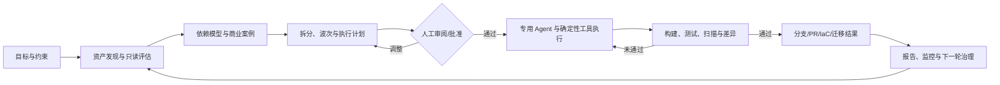
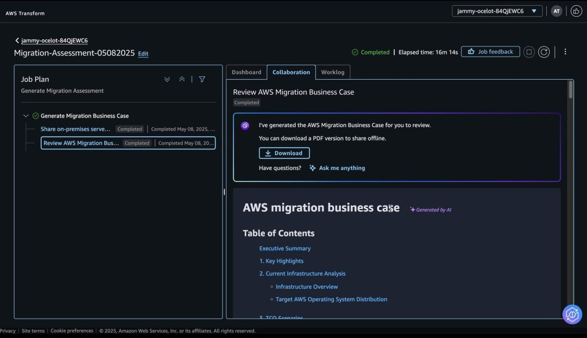
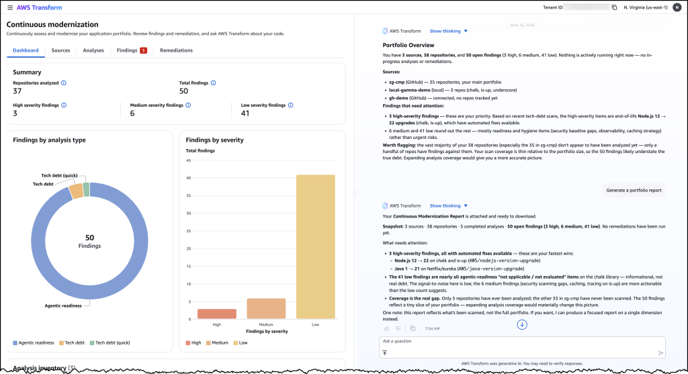
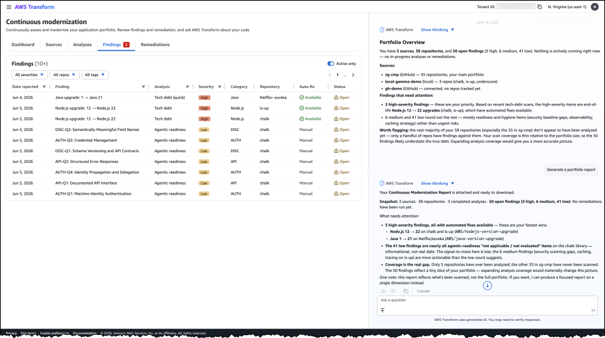
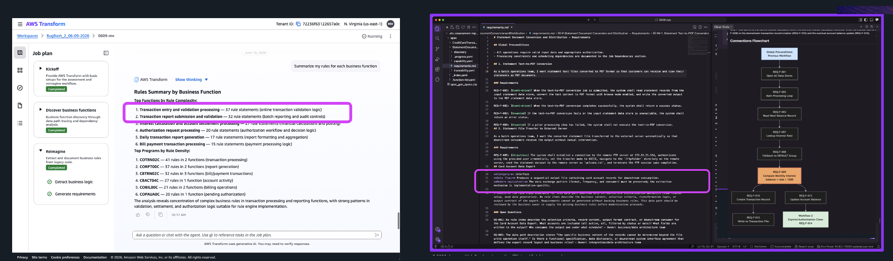
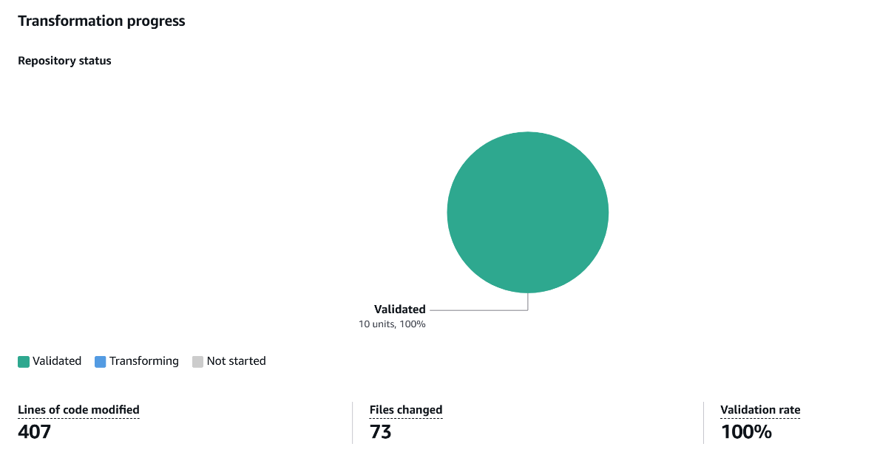
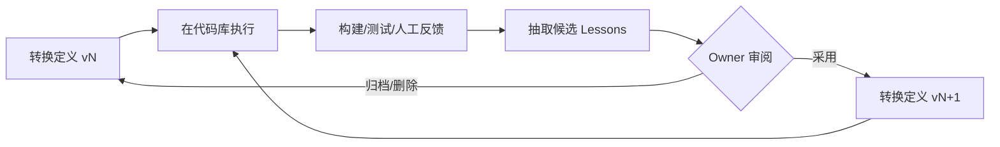
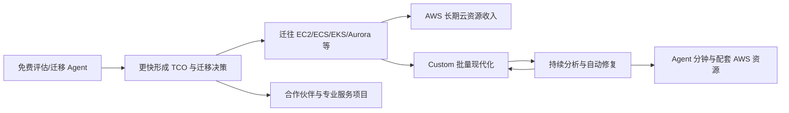

# AWS Transform：从迁移工具到企业现代化智能体平台

> 研究基线：2026-08-25。本文优先使用 AWS 产品页、定价、用户指南、技术博客和客户案例。AWS 披露的效果数据均标记为“厂商/客户案例口径”，未将其视为独立评测结果。

## 一、结论先行

AWS Transform 不是一个面向单个开发者的通用 Coding Agent，而是一套**面向企业存量资产的现代化工作台** ：它把资产发现、系统分析、商业评估、迁移规划、代码转换、批量执行、测试验证、人工审批和持续治理组织成长期可运营的流程，底层再调用专用 Agent、确定性工具和云资源完成工作。

它最值得 LLaP 研究的不是某个模型能力，而是以下产品判断：

1. **从高价值、边界清晰的任务切入。** Windows、Mainframe、VMware、语言/框架升级都有明确输入、目标状态和验证方式，比“完成任意研发需求”更容易形成首个可信闭环。
2. **对话只是控制面，不是全部产品。** 用户用自然语言设定目标、补充约束和审批决策，但资产清单、依赖关系、计划、任务状态、代码分支、测试结果和报告都是结构化、可追踪的对象。
3. **先定义可复用的转换，再规模化执行。** AWS Transform custom 将一次成功经验沉淀为版本化的 Transformation Definition，再以 Campaign 批量应用到多个代码库。
4. **验证是 Agent Loop 的硬反馈。** 构建、测试、代码审查和试部署不只是末端报告，也用于驱动修复与后续学习。
5. **商业模式与 AWS 云迁移高度耦合。** 大型机、Windows、VMware 等核心迁移 Agent 当前免费，真正的收入来自迁移后的 AWS 资源消耗、配套服务与合作伙伴项目；通用转换和持续治理则按 Agent 分钟直接收费。

对 LLaP 而言，AWS Transform 证明了“企业级 Agent = 模型 + 领域方法 + 确定性工具 + 工作流状态 + 验证证据 + 规模化运营”。但它尚未证明能覆盖日常业务需求从需求理解到线上结果的任意复杂交付，这正是 LLaP 更宽、也更难的边界。

## 二、产品边界与演进

AWS 在 re:Invent 2024 先以 Amazon Q Developer 的转换能力预览，2025 年 5 月将 AWS Transform 正式 GA，首批聚焦 .NET、Mainframe 和 VMware。到 2026 年，产品已经扩展为五组能力：

| 产品线 | 主要输入 | 主要产出 | 当前直接收费 |
|---|---|---|---|
| Assessment / Migrations | 服务器、网络、数据库与依赖清单 | TCO、商业案例、迁移波次、Landing Zone、网络与迁移任务 | 免费 |
| Windows modernization | .NET、SQL Server、依赖包 | 跨平台 .NET、Aurora PostgreSQL、容器与新分支 | 免费 |
| Mainframe modernization | COBOL、JCL、CICS、DB2、业务资料 | 代码分析、业务规则、领域拆分、Java、测试与 IaC | 免费 |
| Transform custom | 代码、文档、样例、转换目标 | 可版本化转换定义、批量执行结果 | $0.035 / Agent 分钟 |
| Continuous modernization | GitHub、GitLab、Bitbucket 或本地仓库 | Findings、修复分支/PR、组合报告、周期扫描 | 按分析与修复的 Agent 分钟计费 |

这条演进路线说明，它正在从“一次性迁移项目工具”变成“企业软件资产持续现代化平台”：先处理确定性较强的大型迁移，再开放自定义转换，最后对整个代码组合进行持续分析和修复。[产品 FAQ](https://aws.amazon.com/transform/faq/)｜[用户指南更新历史](https://docs.aws.amazon.com/transform/latest/userguide/doc-history.html)

## 三、产品设计：目标驱动，但用可审计对象完成交付

### 3.1 产品主循环



这个循环没有把聊天记录当成唯一状态。AWS Transform 将“自然语言协作”和“工作对象”分开：

- **对话层** ：设定目标、解释现状、追问缺失信息、调整计划、请求审批和查询状态。
- **资产层** ：代码仓库、服务器、数据库、网络、业务规则、依赖与固定输入版本。
- **计划层** ：应用分组、迁移波次、目标架构、Transformation Definition 和执行配置。
- **执行层** ：Job、Campaign、Repository/Finding/Remediation、并发状态与失败重试。
- **证据层** ：源码坐标、构建日志、测试结果、PR、IaC、迁移状态与报告。

因此它更像“Agent 驱动的现代化项目操作系统”，而不是一个问答式顾问。

### 3.2 两类典型产品形态

**复杂迁移工作台。** 面向项目经理、架构师、开发、安全和合作伙伴，先统一资产与依赖，再生成 TCO、波次和目标环境；用户可以编辑、排序、批准计划，并在同一视图追踪服务器、网络、Landing Zone、测试和切换状态。产品支持第一方 Agent、合作伙伴 Agent 和自带 Agent，工作台负责保持一张共享的迁移全景。[AWS Transform for migrations](https://aws.amazon.com/transform/migrations/)



*图 1：迁移评估不是一次聊天，而是围绕 Job Plan、阶段状态、协作记录和可下载商业案例组织的工作台。来源：[AWS 官方迁移评估介绍](https://aws.amazon.com/blogs/migration-and-modernization/accelerate-migration-planning-with-assessments-in-aws-transform/)*

**代码组合治理台。** Continuous modernization 先连接一个组织或工作区，自动发现多个仓库，再进行 Analysis → Finding → Remediation → PR。Finding 有严重级别与 open/dismissed/obsolete 状态，人工驳回必须保留理由；重新分析后已消失的问题自动转为 obsolete，形成可审计历史。[Continuous modernization 用户指南](https://docs.aws.amazon.com/transform/latest/userguide/continuous-modernization.html)



*图 2：管理者先看组合级覆盖与风险分布，右侧 Agent 再用自然语言解释当前组合状态并生成报告。来源：[AWS 官方 Continuous modernization 发布介绍](https://aws.amazon.com/blogs/aws/proactively-reduce-tech-debt-autonomously-with-aws-transform-continuous-modernization-preview/)*

下钻后，Finding 不是一段泛化建议，而是带分析类型、严重级别、类别、仓库、自动修复可用性和生命周期状态的结构化对象：



*图 3：Finding 列表把技术债从“团队自报进度”变成可筛选、可执行、可持续复查的事实清单。来源同上。*

这两种形态共同体现了一个重要原则：**企业 Agent 的最小管理单元不是一次对话，而是一个有输入版本、状态、权限、证据和交付物的工作对象。**

### 3.3 低摩擦入口：先给答案，再要求改造

AWS Transform 正在强化只读 Assessment。代码侧的 Agentic Readiness Analysis 与 Modernization Analysis 对单仓库进行只读扫描，通常 5—30 分钟，官方示例中约 1—2 美元即可得到架构、身份、状态、可观测性及现代化机会评估。迁移侧则从现有资产清单生成依赖、TCO 和商业案例。

这是一个成熟的 ToB 入口设计：用户不必先授权 Agent 改代码，就能先看到资产全貌、风险和收益；评估结果又天然成为后续执行的上下文与销售线索。[代码现代化与 Agent 就绪度分析](https://aws.amazon.com/blogs/migration-and-modernization/new-in-aws-transform-analyze-your-code-for-modernization-and-agentic-readiness/)

## 四、技术亮点：不是“让大模型读完代码”

### 4.1 专用 Agent 与确定性系统混合

AWS 对外明确披露，系统组合使用基础模型/LLM、机器学习、图神经网络、自动推理、专用 Agent 与既有迁移工具。合理的技术分工是：

| 问题 | 更适合的机制 |
|---|---|
| 解析库存、编译依赖、执行构建、迁移服务器 | 确定性程序与 AWS 服务 |
| 从杂乱输入归一化资产、补充语义、生成解释 | 模型与 Agent |
| 分析跨系统依赖、形成应用组和迁移波次 | 图关系、规则、优化与模型协作 |
| 在多种可行路径间制定和调整计划 | 规划 Agent + 人工约束 |
| 代码转换、调试和局部修复 | Coding/Debugging Agent + 工具调用 |
| 质量确认 | 构建、测试、扫描、人工审查与试部署 |

这避免了两种极端：既不是用固定脚本硬编码所有项目差异，也不是把企业系统全部塞进上下文后让模型自由发挥。

### 4.2 先构建资产与依赖模型，再让 Agent 工作

迁移产品会把来源各异的资产数据归一为 canonical format，再用图可达性和推理建立应用、服务器、网络与数据库依赖，随后生成波次计划。Mainframe 场景会识别重复/缺失文件、复杂度、入口、文件依赖、业务规则和领域边界。

尤其值得注意的是 Mainframe 的 traceability：业务规则关联到原始文件和行号，生成的需求继续保留该关联，最终现代代码也延续这条证据链。它把“代码是唯一真相”落实为**从源代码事实到业务解释、需求和新代码的可追溯派生链** ，而不只是生成一篇代码摘要。[Mainframe FAQ](https://aws.amazon.com/transform/faq/#mainframe)



*图 4：左侧 Web 工作台抽取并汇总业务规则，右侧 Coding Agent 使用带来源证据的需求继续生成和验证现代代码。来源：[AWS Transform 从迁移到持续现代化](https://aws.amazon.com/blogs/migration-and-modernization/aws-transform-from-migration-to-continuous-modernization/)*

### 4.3 把领域经验封装为可执行 Skill

AWS Transform custom 的 Transformation Definition 本质上就是一个受约束的 Skill 包：

```text
transformation-definition/
├── SKILL.md       # 目标、规则、步骤与执行约束
├── references/    # API 文档、迁移指南、代码样例，按需加载
└── scripts/       # 确定性分析、转换或验证脚本
```

它具有 Draft/Published 状态、版本、账户级 Registry 和组织内共享能力。团队先在少量代码库上试点并校准，再发布后批量执行。这里的核心资产不是 Prompt，而是**指令、参考知识、脚本、验证方式和运行经验的版本化组合** 。[Custom 用户指南](https://docs.aws.amazon.com/transform/latest/userguide/custom.html)



*图 5：Transformation Definition 进入 Campaign 后，平台按仓库汇总执行状态、改动规模和验证率，使一次转换经验可以被规模化运营。来源：[AWS 官方 Lambda 批量升级实践](https://aws.amazon.com/blogs/compute/upgrading-lambda-function-runtimes-at-scale-with-aws-transform-custom/)*

### 4.4 有边界的持续学习

系统将知识区分为两类：

- References：用户事先提供的文档、规范、API 与样例；
- Lessons：从执行轨迹、调试问题、开发者反馈和代码修正中抽取的经验。

Lessons 只对当前 Transformation 生效，不跨客户、也不默认跨 Transformation 共享；Owner 可以查看使用次数、归档、恢复或永久删除。这种设计比“全局自动学习”更克制：先限定适用域，再由人管理有效性，降低错误经验扩散的风险。

同时，AWS 强调必须提供能返回失败信息的 build/validation command。验证失败不是只生成一个红灯，而是进入 Agent 的调试上下文，并可能沉淀为下一次执行的 lesson。这里真正的学习闭环是：



### 4.5 组合级并行，而非把一个 Agent 无限做大

Continuous modernization 的远程分析按“一个仓库一个容器”并行，修复按“一个 Finding 一个容器”展开，可运行在 AWS Batch/Fargate 或 EC2；Custom Campaign 则把同一转换定义应用到多个仓库。AWS 官方多 Agent 示例进一步把代码检查、转换匹配、转换定义生成和批量执行拆成不同 Agent，由编排器管理状态和错误。

这种架构把规模化问题转化为大量**边界清晰、可重试、可单独验收的工作单元** ，而不是依赖一个超长上下文 Agent 串行处理整个企业代码库。[多 Agent 现代化参考架构](https://aws.amazon.com/blogs/devops/use-generative-ai-agents-for-application-modernization-at-scale-with-strands-amazon-transform-custom-and-amazon-bedrock-agentcore/)

### 4.6 安全、权限与现实边界

- Web 端使用 IAM Identity Center，可对接 Okta 或 Microsoft Entra；执行权限通过 IAM 与服务角色控制。
- 传输使用 TLS 1.2+；代码、文档、对话、Job Objective、中间产物和聊天知识索引会存入 S3、DynamoDB 或 OpenSearch，并默认加密，可叠加客户 KMS Key。[数据加密文档](https://docs.aws.amazon.com/transform/latest/userguide/data-encryption.html)
- Continuous modernization 可在本机或客户 AWS 账户内运行；远程分析也可使用 AWS 托管计算。修复需要仓库写权限，并创建分支/PR。
- Custom CLI 提供工具/命令信任清单；完全无人值守模式会绕过多数交互式安全确认，AWS 明确提示生产环境谨慎使用。
- **必须显式配置数据退出。** AWS FAQ 写明，若未 opt out，部分内容可能用于服务改进甚至基础模型质量改进；企业接入前必须完成 Organizations AI Services Opt-out Policy、IDE 设置、数据驻留和法务审查。[AWS Transform 隐私 FAQ](https://aws.amazon.com/transform/faq/#privacy)

## 五、商业模式：免费 Agent 是云迁移入口，付费能力是持续治理

### 5.1 已披露的收费方式

Custom 与 Continuous modernization 按 Agent minute 收费，单价 $0.035/分钟；多个 Agent 并行时分钟数累加，所以计费时间可能大于墙钟时间。用户等待、本地文件读取、本地构建与测试不计费，但 Transformation Definition 的生成、执行和内置转换都会计费。即使最终没有生成可构建代码，已消耗的 Agent 分钟仍然收费。[AWS Transform Pricing](https://aws.amazon.com/transform/pricing/)

AWS 给出的当前示例成本很低：约 3,000 行 Node.js SDK 升级为 $0.70，17,000 行 Java 版本升级为 $2.52，4,000 行 Python 运行时升级为 $1.30。这里不能简单推断企业项目总价同样低，因为真实成本还包括代码准备、依赖补齐、测试、审查、部署、AWS 计算资源、迁移服务和人工项目交付。

### 5.2 商业飞轮（分析推断）



这不是 AWS 公开披露的内部收入拆分，而是由定价和产品目标推导出的商业逻辑：

1. **免费核心 Agent 降低迁移决策成本。** Windows、Mainframe、VMware 迁移本身免费，但产出明确指向 EC2、ECS/EKS、Aurora、S3、Control Tower、MGN 等长期消费。
2. **按使用量收费承接通用需求。** Custom 和持续治理不必绑定单次大迁移，形成更接近软件产品的经常性收入。
3. **合作伙伴放大覆盖面。** AWS 允许 GSI、ISV 和迁移伙伴把自己的 Agent、知识库、工具和方法接入同一工作台；AWS 提供身份、编排、数据交换与分发，伙伴保留垂直交付能力。[AWS Transform Partners](https://aws.amazon.com/transform/partners/)
4. **“评估—试点—规模化”同时也是销售漏斗。** 只读评估给出风险与商业案例；小批试点建立成功率与预算基线；Campaign 扩展到整个组合；Continuous modernization 再把一次性项目转为长期治理。

### 5.3 为什么企业愿意付费

客户购买的并不是代码生成 Token，而是四类经济价值：

- 把多年、多人协作的高风险项目拆成可审查的标准流程；
- 复用稀缺的 Mainframe、迁移和平台工程经验；
- 在数百、数千仓库上获得一致执行与统一进度；
- 将迁移时间提前带来的许可证、机房、人力和云消费收益兑现。

因此 AWS Transform 的真实竞争对象不只是 Copilot、Codex 或 Claude Code，还包括大型系统集成商的迁移工厂、专业服务团队和企业内部平台工程部门。

## 六、公开案例能证明什么

| 客户 | 场景 | 公开结果 | 能支持的结论 |
|---|---|---|---|
| Experian | 7 个遗留 .NET 应用升级到 .NET 8 | 687,600 行自动转换；约 300 工程日；开发投入降低约 40% | 有计划、并行和复核的批量升级可产生显著收益 |
| Air Canada | 数千 Lambda 的 Node.js 16→20 等升级 | 首批数日部署；90% efficacy；预计时间与成本降低 80% | 重复、同构任务最适合 Transformation Definition + Campaign |
| Twitch | 913 个仓库的 AWS SDK Go v1→v2 | 单应用平均加速 70%；预计节省 2,876 开发日 | 组合级批量执行是独立于单次编码体验的产品价值 |
| Coupang | 700+ Java 应用升级，首批 70+ | 5 人、2 个月完成首批；称项目周期降低约 90% | 领域配置、依赖补齐和小团队运营仍是成功必要条件 |
| CSL | 29 个数据中心、1,072 个应用的迁移规划 | 应用发现加速 12 倍；节省 10.5 周波次规划；运营成本降低 30% | 资产模型、依赖与波次规划本身就能创造高价值 |

以上均来自 AWS 页面或客户引语，证明的是“在特定客户、选定任务与 AWS 协作条件下可行”，不能等价为普遍成功率。公开材料仍缺少：失败项目比例、人工返工分布、端到端生产缺陷、长期维护成本以及与强基线团队的独立对照实验。[Experian 案例](https://aws.amazon.com/solutions/case-studies/experian-agenticai/)｜[AWS Transform custom 客户案例](https://aws.amazon.com/transform/custom/)｜[CSL 迁移介绍](https://aws.amazon.com/transform/migrations/)

## 七、护城河与局限

### 7.1 护城河

1. **领域方法与数据积累。** 近二十年的 AWS 迁移经验可转化为资产模型、规则、目标映射、故障模式和验证流程。
2. **确定性执行能力。** Control Tower、MGN、EC2、ECS/EKS、Aurora、S3、CloudFormation/CDK 等是能真正改变基础设施状态的工具链，不只是知识库。
3. **规模化控制面。** 组织身份、权限、Campaign、并发任务、进度、成本、失败恢复和审计共同构成企业门槛。
4. **Transformation Registry 与学习资产。** 定义一次、跨仓执行、持续吸收反馈，使组织经验逐渐从个人迁移到平台。
5. **分发和生态。** AWS 客户、Account Team、MAP、专业服务及伙伴网络能把产品嵌入现有预算和迁移项目。

所以它的护城河主要是 **Harness、领域资产、执行网络与渠道** ，并非某个不可替代的大模型。

### 7.2 局限与风险

- **目标云偏置明显。** 迁移输出天然导向 AWS，免费策略与云消耗绑定；需要多云或本地目标的客户会面临锁定风险。
- **擅长模式化现代化，不等于任意需求交付。** 版本升级、语言转换和迁移具有重复模式；业务需求常包含口头规则、跨团队决策、线上行为和无法由构建测试覆盖的验收条件。
- **验证仍由客户定义。** 没有可靠测试与验收标准，Agent 只能证明“能构建”或“给定测试通过”，不能证明业务正确。
- **公开效果证据偏厂商口径。** 成功案例多、失败分布与长期质量数据少，应通过企业自己的试点建立基线。
- **费用与结果不完全对齐。** 按 Agent 分钟计费便于度量算力，但失败也收费，并行 Agent 增加计费分钟；它不是按可验收结果付费。
- **企业数据边界需主动配置。** 代码、聊天和知识索引会进入 AWS 服务；默认不 opt out 时还存在服务/模型改进用途，不能把“加密”误解为“数据不离开企业控制域”。

## 八、与 LLaP 的关系

| 维度 | AWS Transform | LLaP 目标 |
|---|---|---|
| 核心任务 | 迁移、框架升级、技术债治理等现代化项目 | 持续发生的企业复杂系统研发交付 |
| 需求形态 | 目标状态相对明确，可复用转换模式 | 业务需求常不完整，需要业务知识与多轮澄清 |
| 工作对象 | Project、Job、Campaign、Repository、Finding、Remediation | 交付需求、阶段契约、执行任务、验收报告与线上观察 |
| 系统理解 | 资产清单、代码/基础设施依赖、业务规则与 traceability | 代码版本知识 + 公司业务知识 + 运行事实 + 历史交付证据 |
| 执行方式 | 专用 Agent、确定性迁移工具、批量并行 | 可替换 Coding Agent + 多角色 Subagent + 企业工具链 |
| 验证终点 | 构建、测试、PR、IaC、迁移/部署结果 | 需求验收、预发验证、上线与业务结果闭环 |
| 商业绑定 | AWS 云迁移与持续 AWS 消费 | 对内研发效率，未来形成跨环境 ToB 产品 |

### 8.1 应直接借鉴

- **把只读系统评估做成首个所见即所得的产品入口。** 先交付可引用的系统版本报告、依赖与风险，而不是要求用户先相信全自动交付。
- **把成功交付沉淀为版本化 Skill/Transformation。** 指令、知识、脚本、验证和适用范围必须作为一体管理。
- **产品上同时保留工作台与 CLI/Agent 接口。** 工作台承接跨角色协作、批量运营和审计；CLI/IDE 保留研发自由度。
- **以明确状态和证据组织进度。** 对话可以发起和解释动作，但不能替代契约、代码版本、测试、审批与交付物。
- **从试点到批量扩张。** 先用少量同类项目测成功率、人工介入与成本，再扩大到整个系统组合。
- **限制自优化的作用域。** 经验先绑定具体任务模式，经过评测和人工治理后再扩大，不做无边界的全局自学习。

### 8.2 不应直接照搬

- 不把 LLaP 收窄成代码版本升级平台；保险业务交付的核心价值仍是理解业务并对结果负责。
- 不把 AWS 的云迁移补贴模式当成 LLaP 的直接定价模板；LLaP 若不能通过后续云消费回收成本，需要设计平台订阅、按系统/任务收费或结果型交付。
- 不把构建与单元测试通过当成最终验收；需要在需求澄清阶段明确验收契约，并扩展到回归、端到端、预发及线上指标。
- 不让知识只存在于某个转换 Skill。业务知识、系统版本知识、个人反馈和全局知识需要分别治理，并保留来源、新鲜度与适用范围。

## 九、对 LLaP 原型与商业化的具体启示

1. **首页应该先呈现交付组合，而不是聊天。** 展示每个需求当前阶段、阻塞、需要人工决定的事项、证据完整度和预计交付，不以代码行数作为价值。
2. **需求详情页右侧对话就是执行过程。** 对话用于追问、解释、审批和 Handoff；左侧/主区域持续呈现契约、Agent 状态、引用证据与交付物。
3. **“项目系统”应是所有需求共享的资产底座。** 每个系统版本形成稳定代码事实，需求只读取相关切片并留下版本引用，不能每次全量重读。
4. **增加“模式化任务 Campaign”作为未来能力，而不是首版主入口。** 当同一规则已在一个系统验证后，才允许批量应用到多个仓库/系统并统一追踪。
5. **商业化先从可量化的窄任务进入。** 候选入口包括跨系统影响分析、框架/依赖升级、重复接口对接、系统文档恢复和测试补齐；再逐步扩大到完整需求交付。
6. **评测至少记录四个成本。** 端到端完成率、人工介入/返工、业务缺陷与总交付成本；模型调用量只能解释成本，不能代表价值。

一个可验证的首轮竞品对标实验是：选择 10—20 个历史同类任务，分别记录 AWS Transform 风格的“先定义模式再批量执行”和当前自由 Coding Agent 流程，在成功率、人工介入、回归缺陷、交付周期和可复用资产上比较。若 LLaP 不能在“业务知识 + 多系统影响 + 验收闭环”上形成显著增量，就还没有建立与 AWS Transform 的有效差异。

## 十、仍需验证的问题

- AWS Transform Web 工作台的 Job/Campaign 细粒度信息架构、审批动作和多人权限体验，公开文档无法完全替代真实试用。
- Mainframe traceability 在大规模代码上的准确率、证据坐标稳定性与人工修正方式没有公开独立评测。
- Continual learning 生成 Lesson 的评测门槛、版本回滚和错误经验污染率缺少量化数据。
- 持续治理目前主要围绕技术债、安全与现代化机会，尚不等于业务需求的持续交付。
- 中国区可用性、数据驻留、模型与功能差异需要在正式采购或试点前单独核验。

## 主要一手资料

- [AWS Transform 产品与 FAQ](https://aws.amazon.com/transform/faq/)
- [AWS Transform 定价](https://aws.amazon.com/transform/pricing/)
- [AWS Transform for migrations](https://aws.amazon.com/transform/migrations/)
- [AWS Transform custom](https://aws.amazon.com/transform/custom/)
- [AWS Transform custom 用户指南](https://docs.aws.amazon.com/transform/latest/userguide/custom.html)
- [Continuous modernization 用户指南](https://docs.aws.amazon.com/transform/latest/userguide/continuous-modernization.html)
- [AWS Transform 安全说明](https://docs.aws.amazon.com/transform/latest/userguide/security.html)
- [AWS Transform 数据加密](https://docs.aws.amazon.com/transform/latest/userguide/data-encryption.html)
- [AWS Transform Partners](https://aws.amazon.com/transform/partners/)
- [AWS Transform GA 发布说明](https://aws.amazon.com/blogs/migration-and-modernization/aws-transform-generally-available/)
- [多 Agent 现代化参考架构](https://aws.amazon.com/blogs/devops/use-generative-ai-agents-for-application-modernization-at-scale-with-strands-amazon-transform-custom-and-amazon-bedrock-agentcore/)
- [Experian .NET 现代化案例](https://aws.amazon.com/solutions/case-studies/experian-agenticai/)
