# Agent OS：把 Agent Core 变成可持续工作的生产系统

> [!abstract] 核心判断
> Agent Core 解决的是：模型如何读取上下文、调用 Tool，并在一个 Loop 中继续推理。Agent OS 解决的是：这个不确定的执行体如何在真实业务里长期、受控、可恢复地承担工作。
>
> 二者的边界不在“有没有 Session、Subagent 或 Sandbox”，而在**谁拥有策略**。Core 提供机制；OS 决定什么时候用、谁能用、在哪里用、失败后怎么办、怎样才算真的完成。
>
> 因此 Agent OS 一定比 Agent Core 更贴近业务，也远比 Agent Core 复杂。不存在脱离场景的唯一 Agent OS：7×24 小时持续运营系统与项目制素材生产系统，需要不同的任务拓扑、托管方式、并发策略、状态模型和完成判据。真正可以共享的，是可靠性内核，而不是一套“大一统主 Agent Prompt”。

## 0. 为什么 Agent Loop 跑通之后，真正困难的工作才刚开始

一个最小 Agent Core 可以非常短：

```python
async def run_agent(model, tools, messages, max_turns=20):
    for _ in range(max_turns):
        response = await model.generate(messages=messages, tools=tools)
        messages.append(response.message)

        if response.tool_calls:
            results = await execute_tools(response.tool_calls)
            messages.extend(results)
            continue

        return response.final_text

    raise MaxTurnsExceeded(max_turns)
```

这段代码回答了“一个 Agent 如何工作”，却没有回答：

- API 服务重启后，任务和上下文在哪里？
- Tool 已经改变真实世界，但保存结果前进程崩溃，重试会不会产生第二次副作用？
- 两个 Worker 同时拿到同一个任务，谁有权写最终结果？
- 用户第二天才回复，系统如何回到准确的等待点？
- 子 Agent 又委派了子任务，根任务什么时候结束？
- 模型自然停止输出，是否等于业务已经完成？
- 连接还在发送 Ping，是否代表业务仍在取得进展？
- 有 Shell Tool，是否意味着 Agent 可以读取宿主机密钥、访问生产网络？
- 一次任务失败，究竟是路由、权限、数据、Tool、Runtime、模型还是业务规则的问题？
- 今天调好的 Prompt，怎样证明明天上线后没有让另一类任务退化？

这些问题不是 Agent Loop 内再加几个 `if` 能解决的。它们共同组成了 Agent OS。

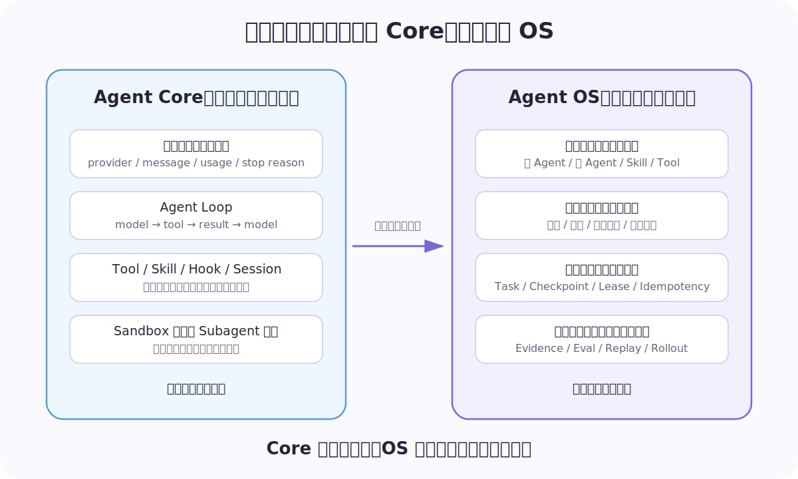

本文使用的定义是：

```text
Agent Core
= Model Protocol + Agent Loop + Tool Contract
+ Session/Harness + 基础执行与隔离接口

Agent OS
= Business Profile + Trust Policy + Control Plane
+ Durable Runtime + State Plane + Observability/Evolution
```

这里的“OS”不是要模仿 Linux 的所有抽象，而是强调三件事：

1. 它管理稀缺资源和执行权；
2. 它把不可信、易失败的执行体包进确定性边界；
3. 它为上层业务提供稳定对象，而不是暴露某个模型 SDK 的偶然细节。

`pi-agent` 已经是一个边界非常清楚的 Agent Core：模型协议、Agent Loop、Tool Contract、事件归约、Session、Compaction 和 Harness 各就其位。本文不重复它的内部实现，相关源码分析见 [[pi-mono源码深度解析：pi-agent的极简Agent Core]]。本文关心的是：**当它成为系统底层之后，上面还必须补什么。**

## 1. Core 提供机制，OS 拥有策略

同一个名词可以同时出现在 Core 和 OS，但责任完全不同：

| 能力 | Agent Core 提供的机制 | Agent OS 拥有的策略 |
|---|---|---|
| 模型 | Provider、消息、流式事件、Usage | 模型路由、降级、成本与延迟预算 |
| Agent Loop | LLM → Tool → Result → LLM | 最大步数、暂停恢复、失败分类、完成判据 |
| Tool | Schema、调用、返回值、取消接口 | 能力授权、审批、幂等、隔离、审计、熔断 |
| Skill | 发现、加载、渐进披露 | 适用范围、版本发布、质量门禁、回滚 |
| Subagent | 启动独立 Agent 的原语 | 是否需要新 Agent、委派给谁、深度与预算、怎样归并 |
| Session | 追加上下文、压缩、恢复 | 所有权、保留期、跨 Agent 共享、隐私范围 |
| Sandbox | 文件、进程、网络的隔离能力 | 哪类任务必须隔离、隔离等级、凭证和销毁策略 |
| Streaming | 输出 Runtime Event | 重连、游标、背压、过期、最终一致性 |
| 并发 | 协程、并行 Tool、异步调用 | 资源键、公平性、互斥、限流和超卖保护 |

一个细节需要特别讲清：**Sandbox 的基础能力可以由 Core 适配层提供，但“什么时候启用什么等级的 Sandbox”必须由 OS 决定。**

如果模型能够自己选择关闭隔离，Sandbox 就不是安全边界。反过来，如果所有任务一律启动最高等级的 VM，又会产生不可接受的冷启动和成本。OS 必须综合 AgentSpec、Tool、参数、租户、数据敏感度和副作用等级做出决定。

2026 年 Anthropic 在 Managed Agents 的工程实践中把“brain、hands、session”拆成独立接口，核心原因也是让 Session 可恢复、执行环境可替换、凭证不进入不可信沙箱。这个方向与 Agent Core / Agent OS 的边界是一致的：接口可以通用，策略必须由外层系统拥有。[官方工程文章](https://www.anthropic.com/engineering/managed-agents)

## 2. 为什么不存在唯一的 Agent OS

架构不是从“要几个 Agent”开始，而是从工作本身开始：

- 工作是持续控制一个不断变化的系统，还是完成一个有明确产物的项目？
- 主要风险来自错误写入，还是来自资产被并发修改、链路不可恢复？
- 用户希望系统长期托管，还是在关键节点参与共创？
- 任务的真相在外部平台状态里，还是在逐步形成的 Artifact Graph 里？
- 并发收益来自跨账户巡检，还是来自独立素材生成？

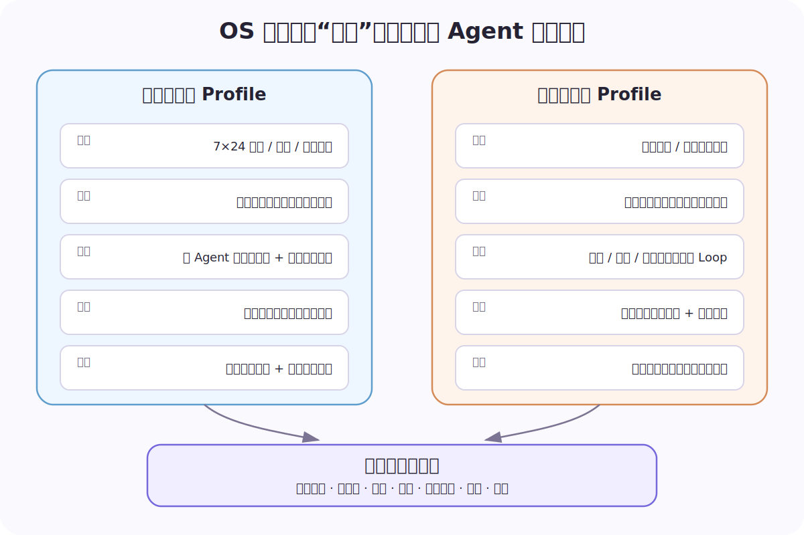

两类系统可以共享 Task、Run、Event、租约、幂等和 Trace，却不应该共享同一张 Agent 图。

| 维度 | 持续运营型智能体 | 素材生产型智能体 |
|---|---|---|
| 时间形态 | 7×24 小时，定时与事件不断触发 | 一次项目跨多轮，可暂停等待人或外部生成 |
| 任务方向 | 潜在方向灵活，但都属于运营问题 | 围绕明确项目与生产目标展开 |
| 主工作对象 | 账户、计划、指标、策略、线上配置 | 脚本、分镜、图片、视频、审核意见 |
| 主控方式 | 强意图主 Agent 管理任务与分发 | 导演/协调角色组织专业生产 Loop |
| 多 Agent 价值 | 读写隔离、专业诊断、缩小错误半径 | 专业工序、独立上下文、项目资产接力 |
| 托管模式 | 无人在线也要持续、有限自治地工作 | 用户任务或定时计划驱动，支持跨天等待 |
| 并发单位 | 跨账户/计划只读分析；同资源写入互斥 | 跨项目并发；同项目共享资产受控并发 |
| 完成定义 | 外部配置回读、业务指标进入观察窗口 | 产物存在、可读取、血缘完整、审核通过 |

多 Agent 也不是天然更先进。Anthropic 对生产多 Agent 研究系统的总结很直接：它适合大量独立、可并行、超过单一上下文的工作，但会显著增加 Token、协调、状态一致性和错误传播成本；高度共享上下文或强顺序依赖的任务并不适合默认拆成多个 Agent。[多 Agent 工程实践](https://www.anthropic.com/engineering/multi-agent-research-system)

## 3. Agent OS 的六个平面

一个成熟系统至少由六个平面组成。它们不是组织架构，而是六组必须有明确 Owner 的系统责任。

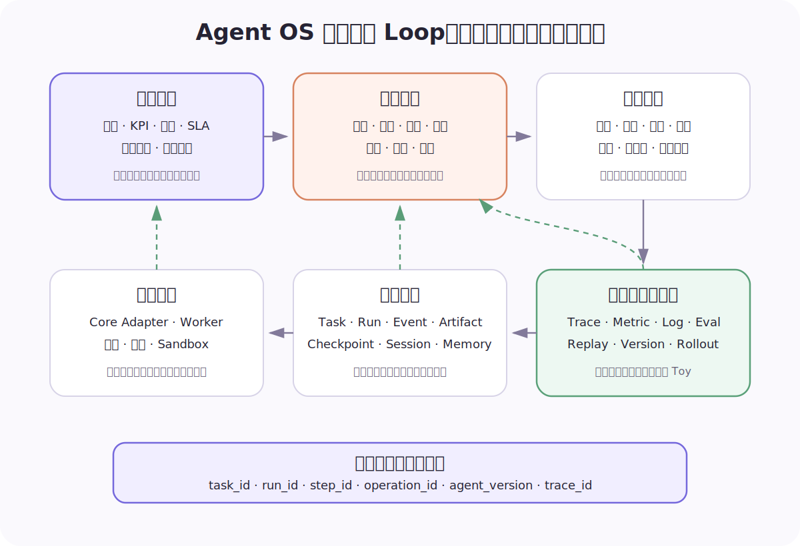

### 3.1 业务平面：先定义“工作”，再定义 Agent

业务平面必须把模糊目标翻译成可执行合同：

```python
@dataclass(frozen=True)
class TaskType:
    name: str
    objective_schema: dict
    required_artifacts: tuple[str, ...]
    completion_contract: str
    risk_level: str
    default_budget: "Budget"
    sla: "SLA"
```

它至少回答：

- 用户真正想要的业务结果是什么？
- 哪些约束不能被 Agent 自行改写？
- 哪些产物是必需的，谁最终负责？
- 何时需要追问，何时可以安全采用默认值？
- 任务完成后是否还要进入效果观察窗口？
- 一个任务失败后，业务上允许重试、降级、补偿还是必须转人工？

业务平面做不好，系统可能“非常 Agentic”，但不会解决业务问题。

### 3.2 信任平面：把错误半径写进结构

信任平面不只是一个 permission 弹窗。它包含：

- 身份：用户、Agent、Worker、Tool、外部系统分别是谁；
- 能力：能读什么、能写什么、能否委派、能否访问网络；
- 作用域：只针对哪个账户、项目、资产和时间窗口；
- 风险：只读、可逆写入、不可逆动作的门禁不同；
- 隔离：是否需要进程、容器、VM 或外部托管 Sandbox；
- 凭证：凭证不进入 Prompt、Session 和不可信执行环境；
- 审计：谁在什么版本下批准和执行了什么；
- 副作用：稳定幂等键、补偿和不确定结果的人工核验。

真正的 Tool 调用路径应该是：

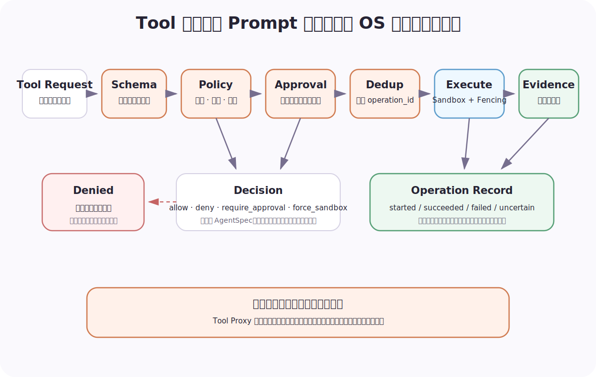

这意味着 Tool 权限永远不能只写在 System Prompt 里。Prompt 可以帮助模型选择正确 Tool，但不能约束已经生成的 Tool Call。

### 3.3 控制平面：决定谁在什么时候做什么

控制平面负责：

- 准入与任务分类；
- 主 Agent、Skill、Tool 和 Subagent 的选择；
- 计划、调度、优先级和截止时间；
- 委派深度、宽度、Token、时间和成本预算；
- 跨任务公平性、租户配额和外部 API QPS；
- 同一业务资源的互斥与并发；
- 取消、抢占、降级和转人工。

控制平面最容易犯的错误，是把“模型会规划”误认为“系统已经有调度”。模型可以提出计划，但队列公平、资源锁、租约、并发上限和取消传播必须由确定性控制器实现。

### 3.4 运行平面：承载 Core，但不把进程当 Agent

运行平面包含：

- Agent Core Adapter；
- Worker、进程、协程和线程；
- Runtime 常驻池或按请求拉起；
- Sandbox、Tool Proxy 与外部 AIGC Tool；
- 心跳、超时、取消和资源计量；
- Node、Worker、Runtime、Run 四级监督与恢复。

需要长期保存的是 Agent 的**逻辑身份和业务状态**，不是某个 PID。进程只是可替换的故障域。一次进程崩溃不应让 Task 消失；一个进程长期存活也不代表 Task 可以恢复。

### 3.5 状态平面：Session 不是任务数据库

至少要区分：

- `Task`：用户或系统希望完成的工作；
- `Run`：Task 的一次执行尝试；
- `Step`：一次模型、Tool、委派、人工或补偿动作；
- `Event`：只追加、不可变的发生事实；
- `Artifact`：报告、策略、脚本、图片、视频、配置快照；
- `Checkpoint`：可恢复位置与未确认副作用；
- `Session`：对话和 Core 事件历史；
- `Memory`：有来源、作用域、置信度和版本的长期事实。

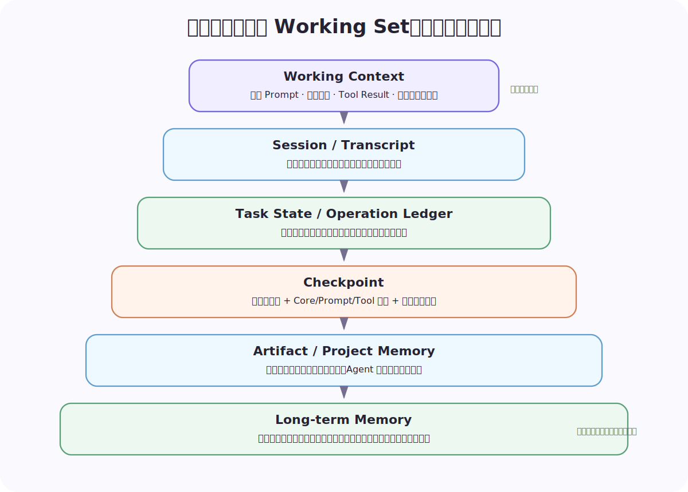

### 3.6 观测与进化平面：让系统从 Toy 变成可经营产品

观测解决“发生了什么、为什么”；进化解决“怎样证明下一版更好”。二者必须共享 Task/Run/Step、Agent 版本、Tool 操作和业务结果。

如果只有模型 Token 和耗时，就无法判断：

- 路由是否选错了专业单元；
- Tool 是调用失败还是被 Policy 拒绝；
- 重试是否产生重复副作用；
- 任务表面完成但业务回读失败；
- 新 Prompt 提高了通过率，却让成本、风险或人工修改轮次恶化。

## 4. Profile A：持续运营型 Agent OS

这类系统面对的是持续变化的业务环境。它不是完成一次对话，而是不断观察当前状态，推动它接近期望状态。这个思路与 Kubernetes Controller 的 Reconcile Loop 很接近：控制器读取 Desired State 与 Current State，执行有限动作，再回读状态，而不是假设一次脚本会永久成功。[Kubernetes Controller](https://kubernetes.io/docs/concepts/architecture/controller/)

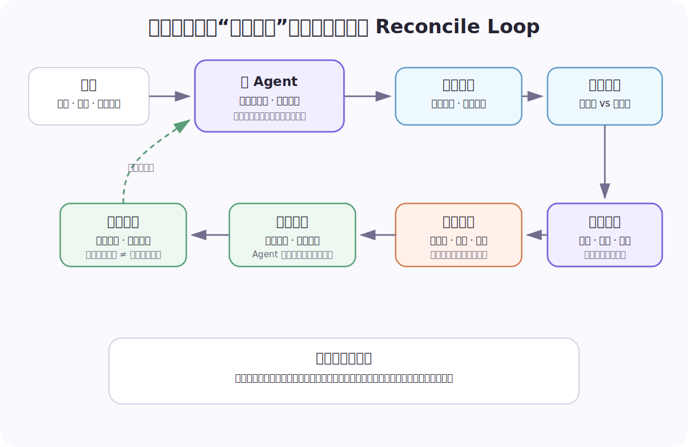

### 4.1 为什么需要一个强意图主 Agent

持续运营场景的用户入口很开放：日报、诊断、复盘、预算、配置核验、执行、异常排查都可能出现。一个主 Agent 负责意图理解、任务管理与分发，对使用者最清晰：

```yaml
coordinator:
  responsibility: intent-routing-and-task-ownership
  delegate_to: [analysis_unit, execution_unit]
  recursion_depth: 1

analysis_unit:
  side_effect_level: read
  tools: [metrics_read, report_read, knowledge_search]
  disallowed_tools: [production_write, delegate_agent]

execution_unit:
  side_effect_level: write
  tools: [config_read, config_dry_run, production_write, rollback]
  requires_evidence_from: analysis_unit
  approval_policy: risk-based
```

这里保留的是内部系统的机制，名称和目录已经泛化。关键不是三个角色叫什么，而是：

1. 主 Agent 对用户目标和最终交付负责；
2. 事实分析与真实写入拥有不同能力面；
3. 子 Agent 不能任意递归委派；
4. “给建议”不会因为模型热心而自动升级成生产写入；
5. 同时需要诊断和执行时，事实证据先于写操作。

### 4.2 定时能力的核心不是 Cron，而是幂等运行

Scheduler 只负责“什么时候叫醒”。Agent OS 还要回答“这个时间点是否已经成功执行”。

```python
def schedule_operation_id(subscription_id: str, expected_fire_time: str) -> str:
    return f"{subscription_id}:{expected_fire_time}"


async def execute_once(operation_id: str, action):
    inserted = await operation_store.try_start(operation_id)
    if not inserted:
        return await operation_store.result(operation_id)

    try:
        result = await action(idempotency_key=operation_id)
        await operation_store.succeed(operation_id, result)
        return result
    except Exception as exc:
        await operation_store.fail_or_mark_uncertain(operation_id, exc)
        raise
```

生产实现必须由数据库唯一约束或原子 Compare-and-Set 保护，不能“先查询、再写入”。如果外部系统不支持幂等键，OS 还要在超时后执行回读，区分 `failed` 与 `uncertain`；后者不能盲目重试。

### 4.3 托管不等于无限自治

7×24 小时工作需要一组明确的托管等级：

| 等级 | 系统可以做什么 | 典型门禁 |
|---|---|---|
| Observe | 读取、诊断、生成报告 | 数据权限与频率预算 |
| Recommend | 形成方案，不写真实系统 | 证据完整性与置信度 |
| Act with Approval | 生成可执行变更，等待批准 | diff、影响范围、回滚计划 |
| Bounded Autonomy | 在预授权额度与资源范围内免逐次审批，自动执行可逆动作 | 累计额度、资源白名单、变更窗口、异常熔断 |
| Emergency Stop | 停止进一步动作并保留现场 | 任何高风险告警可触发 |

当前更准确的托管策略是：**不是所有写操作都必须逐次审批，也不是 Agent 可以自行决定免审。**用户或业务负责人先签发一份可审计的预授权；单次动作与累计消耗都落在授权额度、资源范围、动作类型和有效时间内时，OS 可以免去本次人工审批。任何一项越界，任务自动进入 `WAITING_APPROVAL`，不能通过拆小操作规避累计额度。

```python
@dataclass(frozen=True)
class DelegatedAuthority:
    authority_id: str
    owner_id: str
    allowed_actions: frozenset[str]
    resource_patterns: tuple[str, ...]
    per_operation_limit: Decimal
    cumulative_limit: Decimal
    valid_from: datetime
    valid_until: datetime


async def authorize_operation(task, call, authority):
    checks = await policy_engine.check_scope(task, call, authority)
    spent = await authority_ledger.sum_committed(authority.authority_id)

    if not checks.action_allowed or not checks.resource_allowed:
        return Decision.require_approval("outside_delegated_scope")
    if call.amount > authority.per_operation_limit:
        return Decision.require_approval("per_operation_limit_exceeded")
    if spent + call.amount > authority.cumulative_limit:
        return Decision.require_approval("cumulative_limit_exceeded")
    if not authority.valid_from <= utcnow() <= authority.valid_until:
        return Decision.require_approval("authority_expired")

    return Decision.allow(authority_id=authority.authority_id)
```

额度账本需要在 Tool 执行前原子预占、执行成功后确认、明确失败后释放；结果不确定时继续占用，直到外部回读或人工核验。否则并发任务可能各自通过检查，合计却突破授权上限。每次免审操作还必须记录 `authority_id`，让事后审计能回答“依据哪一份授权自动执行”。

“无人在线仍能工作”必须同时意味着：人可以随时看见、暂停、接管、回滚和追责；预授权也必须可以随时撤销，撤销后尚未开始的操作立即失去免审资格。

### 4.4 完成一次动作后，任务可能仍未结束

对持续运营任务，完成合同通常包含两层：

1. **动作完成**：配置写入成功并回读一致；
2. **业务闭环**：进入观察窗口，指标没有触发回滚或升级条件。

因此 `COMPLETED` 不一定紧跟 Tool 成功。系统可以进入 `MONITORING`，在约定窗口后由新的 Reconcile Run 给出终局判断。

## 5. Profile B：素材生产型 Agent OS

素材生产的核心对象不是聊天，而是逐步形成的项目资产。脚本、分镜、图片、视频、字幕、音乐、产品信息和审核意见之间存在依赖与血缘；专业角色可能反复接力，也可能因为用户修改目标回到前面的节点。

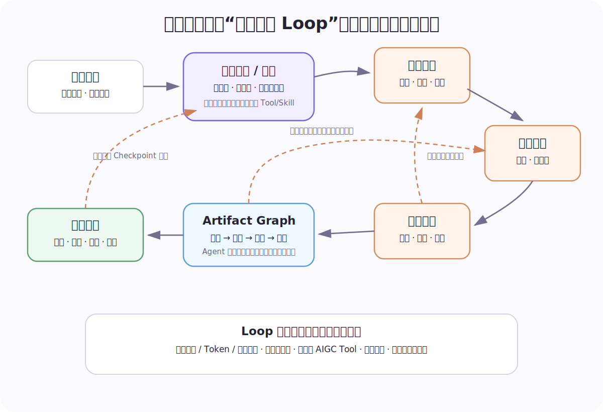

### 5.1 Loop 要保持灵活，但必须有骨架

固定 DAG 容易在创意返工时失效；完全自由委派又容易无限循环。一个可落地的折中是：

- 由项目协调/导演单元拥有全局目标和 Root Task；
- 编剧、视觉、视频等专业单元拥有独立 Tool、上下文与产物责任；
- 资产之间形成显式 Artifact Graph；
- 角色可以循环接力，但每次委派都创建子 Task；
- 深度、宽度、Token、时间、Tool 次数和重复路径都有预算；
- 同一项目的共享写集合默认串行；独立生成节点才并发；
- 人工补参、选择、审核和验收是正式状态，不是普通 Tool Result。

### 5.2 Task 先于 Agent，项目资产先于对话

下面是从内部运行时泛化出的最小 Task：

```python
@dataclass
class AgentTask:
    project_id: str
    owner_id: str
    agent_id: str
    objective: str
    task_id: str = field(default_factory=new_id)
    root_task_id: str | None = None
    parent_task_id: str | None = None
    artifact_refs: tuple[str, ...] = ()

    @property
    def event_target(self) -> str:
        return self.root_task_id or self.task_id

    @property
    def scheduling_key(self) -> str:
        return f"project:{self.project_id}"
```

三个不变量很重要：

- `root_task_id` 把整条角色链的事件、取消和最终责任归到同一工作；
- `parent_task_id` 保留直接委派关系，支持循环检测和预算统计；
- `artifact_refs` 传递资产引用，避免在 Agent 间复制整段上下文和二进制结果。

### 5.3 委派是任务所有权转移，不是函数调用

```python
async def delegate(parent: AgentTask, target: str, objective: str):
    await delegation_budget.consume(parent.root_task_id or parent.task_id)
    await policy.ensure_allowed(parent.agent_id, target)
    await cycle_guard.check(parent, target)

    child = await task_store.create_child(
        parent=parent,
        target_agent=target,
        objective=objective,
        artifact_refs=parent.artifact_refs,
    )
    await task_store.transition(parent.task_id, "waiting_child")
    await outbox.publish("task.queued", child)
    return child.task_id
```

创建子 Task 后，它可以跨进程、跨机器排队，也可以被单独取消、重试和审计。父任务不能在子任务仍运行时直接写成 Completed。

### 5.4 AIGC Tool 是运行平面的一级资源

图片与视频生成往往具有：

- 长耗时；
- 外部配额和高成本；
- 回调或轮询；
- 结果文件大；
- 同一请求重复提交会重复计费；
- 失败后可能需要更换模型、参数或降级路线。

因此不能把它当作普通 HTTP Tool。OS 至少要管理：

```python
@dataclass(frozen=True)
class MediaJob:
    operation_id: str
    provider: str
    model: str
    input_artifacts: tuple[str, ...]
    output_contract: dict
    cost_budget: float
    deadline: datetime
    callback_token_ref: str
```

`operation_id` 去重真实提交；`output_contract` 验证分辨率、时长、格式和可读取性；回调凭证只存在 Tool Proxy；生成结果写入对象存储并产生 Artifact Event，而不是塞回 Session 文本。

### 5.5 人工输入是一种耐久等待

```python
async def wait_for_human(run, request):
    await human_request_store.insert(request)
    checkpoint = await runtime.checkpoint(run.handle)
    await checkpoint_store.save(checkpoint)
    await task_store.transition(run.task_id, "waiting_input")
    raise SuspendRun(checkpoint.id)


async def answer(request_id, answer, actor):
    request = await human_request_store.complete(request_id, answer, actor)
    await queue.submit(ResumeTask(request.task_id, resume_input=answer))
```

系统重启、SSE 断线或用户第二天回复，都不应让等待点消失。授权、缺参、创作选择和最终验收也要用不同类型的 Human Request，因为它们有不同的过期、责任和审计语义。

## 6. 共享可靠性内核：统一协议，不统一业务策略

两种 Profile 上层不同，底层可以共享：

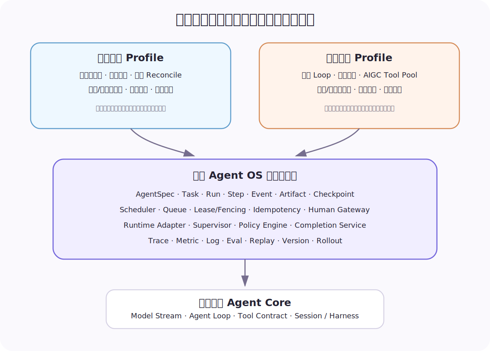

共享内核的稳定对象建议至少包括：

```python
@dataclass(frozen=True)
class AgentSpec:
    agent_id: str
    version: str
    runtime: str
    tools: tuple[str, ...]
    skills: tuple[str, ...]
    delegate_to: tuple[str, ...]
    side_effect_level: Literal["read", "write", "irreversible"]
    sandbox_profile: str
    budget_profile: str


@dataclass
class Task:
    task_id: str
    task_type: str
    objective: str
    owner_id: str
    status: str
    root_task_id: str
    parent_task_id: str | None
    scheduling_key: str
    version: int


@dataclass
class Run:
    run_id: str
    task_id: str
    attempt: int
    agent_id: str
    agent_version: str
    runtime: str
    worker_id: str | None
    lease_epoch: int | None
    checkpoint_id: str | None
```

### 6.1 Runtime Adapter 隔离 Agent Core

OS 不应该在 Orchestrator 里出现某个 SDK 独有的消息类型：

```python
class AgentRuntimeAdapter(Protocol):
    async def start(self, spec: RunSpec) -> RuntimeHandle: ...
    async def stream(
        self, handle: RuntimeHandle, cursor: str | None = None
    ) -> AsyncIterator[RuntimeEvent]: ...
    async def checkpoint(self, handle: RuntimeHandle) -> CheckpointRef: ...
    async def resume(
        self, checkpoint: CheckpointRef, resume_input=None
    ) -> RuntimeHandle: ...
    async def cancel(self, handle: RuntimeHandle) -> None: ...
    async def health(self, handle: RuntimeHandle) -> RuntimeHealth: ...
```

`pi-agent`、其他 Agent SDK、自研 Loop 都可以实现这层协议。OS 只消费统一 Runtime Event，并根据业务状态机决定下一步。

### 6.2 状态机是代码，不是装饰图

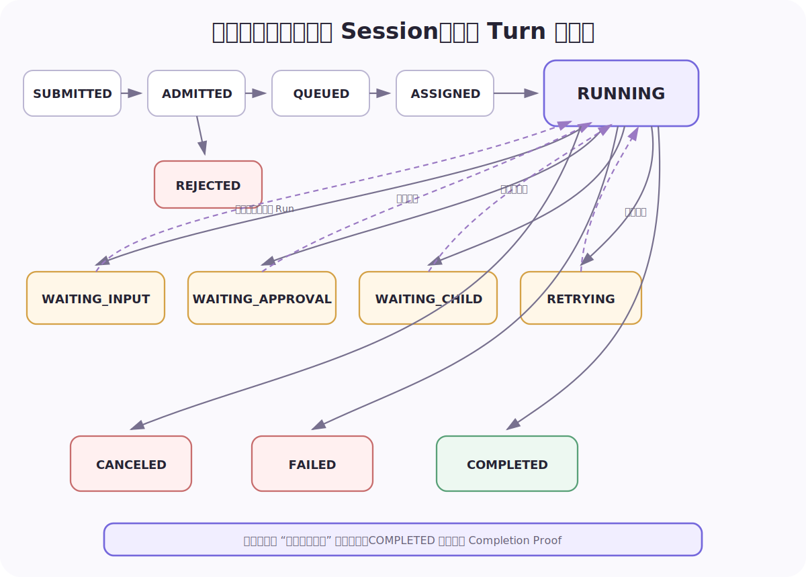

所有状态迁移要集中校验，并与 Event、Outbox 同事务提交：

```python
async def transition(task_id, expected_version, target, payload):
    async with db.transaction() as tx:
        task = await tx.get_for_update("tasks", task_id)
        if task.version != expected_version:
            raise ConcurrentModification(task_id)

        ensure_transition_allowed(task.status, target)
        previous = task.status
        task.status = target
        task.version += 1
        await tx.update("tasks", task)

        event = Event(
            task_id=task_id,
            sequence=await tx.next_sequence(task_id),
            event_type="task.status_changed",
            payload={"from": previous, "to": target, **payload},
        )
        await tx.insert("task_events", event)
        await tx.insert("outbox", OutboxRecord.from_event(event))
        return task, event
```

消息系统短暂不可用时，业务状态仍然可以提交；Outbox Relay 稍后投递事件。Consumer 使用 Inbox/Dedup 去重，系统默认接受“至少一次投递”，不幻想端到端 Exactly Once。

## 7. 一个最小但可运行的耐久执行内核

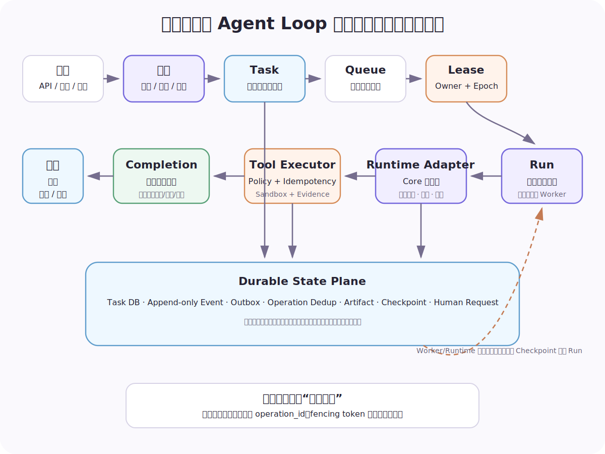

### 7.1 Lease 与 Fencing Token

只有分布式锁或 TTL 不够。Worker 发生长暂停或网络分区后，旧持有者可能复活并覆盖新结果。每次租约转移都要增加 Epoch：

```python
async def acquire_lease(resource_key, worker_id, ttl):
    async with db.transaction() as tx:
        current = await tx.get_for_update("leases", resource_key)
        now = utcnow()
        if current and current.expires_at > now:
            return None

        epoch = 1 if current is None else current.epoch + 1
        lease = Lease(resource_key, worker_id, epoch, now + ttl)
        await tx.upsert("leases", lease)
        return lease


async def save_artifact(artifact, lease):
    current = await lease_store.get(lease.resource_key)
    if current.owner_id != lease.owner_id or current.epoch != lease.epoch:
        raise StaleWorker()
    await artifact_store.put(artifact, fencing_token=lease.epoch)
```

锁回答“现在谁看起来持有”；Fencing Token 回答“存储层是否仍接受这个持有者的写入”。

### 7.2 Worker 主循环

```python
async def worker_loop(worker_id):
    while True:
        envelope = await queue.receive(visibility_timeout=60)
        if envelope is None:
            continue

        task = await task_store.get(envelope.task_id)
        lease = await acquire_lease(task.scheduling_key, worker_id, ttl=30)
        if lease is None:
            await queue.release(envelope, delay=1)
            continue

        try:
            run = await run_store.start_attempt(task, worker_id, lease.epoch)
            await execute_run(task, run, lease)
            await queue.ack(envelope)
        except RetryableError as exc:
            await run_store.record_failure(run, exc)
            await queue.retry(envelope, backoff=retry_policy.delay(run.attempt))
        except Exception as exc:
            await run_store.record_failure(run, exc)
            await task_store.fail(task.task_id, reason=classify_error(exc))
            await queue.ack(envelope)
        finally:
            await lease_store.release_if_owner(lease)
```

Ack 前崩溃，消息会再次出现。正确性来自稳定 `operation_id`、Lease、Fencing 和状态版本，不来自“队列最好不要重复”。

### 7.3 Run 执行器

```python
async def execute_run(task, run, lease):
    checkpoint = await checkpoint_store.latest_for_task(task.task_id)
    handle = (
        await runtime.resume(checkpoint)
        if checkpoint
        else await runtime.start(build_run_spec(task, run))
    )

    async for raw in runtime.stream(handle):
        event = normalize_runtime_event(task, run, raw)
        await event_store.append(event)

        if event.type == "tool.requested":
            await execute_tool_step(task, run, event, lease)
        elif event.type == "agent.delegation_requested":
            await suspend_for_child(task, run, event, handle)
            return
        elif event.type == "human.input_requested":
            await suspend_for_human(task, run, event, handle)
            return
        elif event.type == "runtime.finished":
            proof = await completion_service.verify(task, run)
            if proof.valid:
                await task_store.complete(task.task_id, proof)
                return
            raise IncompleteRun(proof.missing_evidence)
```

### 7.4 Tool 的幂等键来自逻辑 Step

```python
async def execute_tool_step(task, run, event, lease):
    call = ToolCall.from_event(event)
    decision = await policy_engine.evaluate(run.agent_id, call, task)

    if decision.deny:
        return await runtime.send_tool_error(call.id, decision.reason)
    if decision.require_approval:
        await suspend_for_approval(task, run, call)
        return

    step = await step_store.get_or_create(
        logical_key=event.logical_step_key,
        operation_id=stable_hash(task.task_id, event.logical_step_key),
    )
    prior = await operation_store.get(step.operation_id)
    if prior and prior.status == "succeeded":
        return await runtime.send_tool_result(call.id, prior.result)

    result = await tool_registry.execute(
        call.tool_name,
        call.arguments,
        sandbox=decision.sandbox_profile,
        idempotency_key=step.operation_id,
        fencing_token=lease.epoch,
    )
    await operation_store.succeed(step.operation_id, result, result.evidence)
    await runtime.send_tool_result(call.id, result)
```

不要使用 `run_id`、PID 或 Runtime 随机生成的 Tool Call ID 作为业务幂等键；这些值在恢复后会改变。同一逻辑 Step 的所有执行尝试必须复用同一个 `operation_id`。

耐久工作流系统已经在传统分布式系统里验证了“状态持久化、失败重放、Activity 重试、Signal/Human-in-the-loop”等能力。是否采用 Temporal 取决于团队和基础设施，但这些语义不能缺席。[Temporal Durable Execution](https://temporal.io/)

## 8. 什么时候应该新建 Subagent

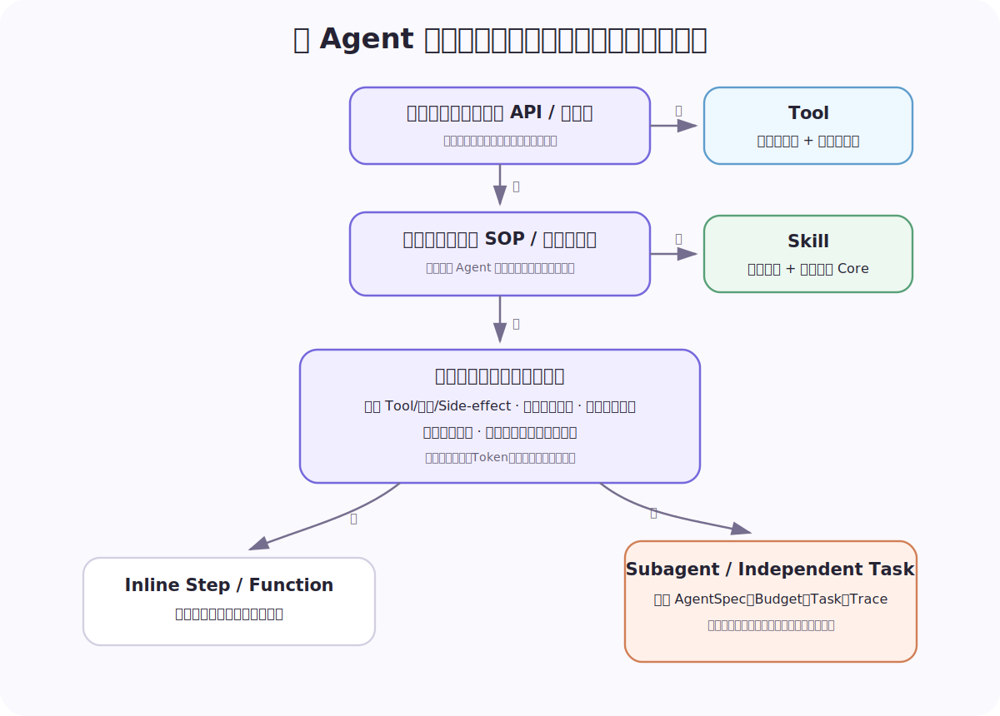

判断的关键不是“这个步骤听起来像一个职业”，而是是否存在硬边界：

```python
def choose_execution_unit(subtask, parent):
    if subtask.is_deterministic_api_call:
        return ToolCall(subtask.tool)

    if subtask.is_reusable_sop and subtask.reuses_parent_context:
        return SkillInvocation(subtask.skill)

    hard_boundary = any([
        subtask.capabilities != parent.capabilities,
        subtask.side_effect_level != parent.side_effect_level,
        subtask.sandbox_profile != parent.sandbox_profile,
        subtask.needs_independent_lifecycle,
        subtask.needs_independent_audit,
        subtask.has_large_independent_context,
        subtask.is_parallelizable_with_low_merge_cost,
    ])
    return SpawnAgent(subtask.agent_spec) if hard_boundary else InlineStep(subtask)
```

新 Agent 必须同时获得独立的 `AgentSpec`、`Task/Run`、预算、Trace 和完成责任。如果只是换了一个人格名称，却没有独立权限、上下文、生命周期或责任，它通常应该是 Skill、Tool 或普通函数。

## 9. “彻底可观测”到底要观测什么

Runtime 的彻底可观测性是所有 Agent OS 的共同底线。模型调用只是其中一个 Span。

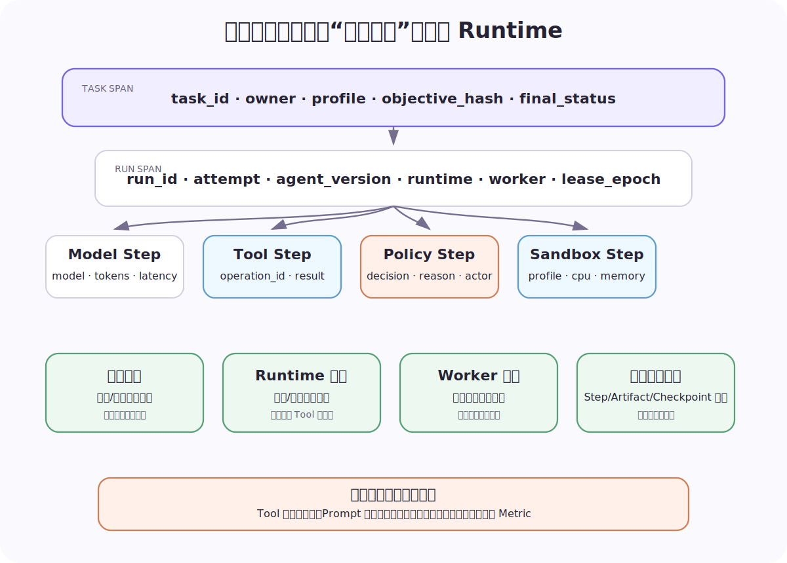

### 9.1 Trace 的最小关联字段

建议每个事件和 Span 都能关联：

```text
task_id / root_task_id / parent_task_id
run_id / attempt / step_id / operation_id
agent_id / agent_version / runtime / model
worker_id / sandbox_id / lease_epoch
tool_name / policy_decision / artifact_id
trace_id / span_id / event_sequence
```

OpenTelemetry 已经为 Trace、Metric、Log 提供统一语义，并持续扩展 GenAI 相关约定；但 Tool 参数、结果和用户内容可能包含敏感信息，不应默认完整写入 Span。[OpenTelemetry Semantic Conventions](https://opentelemetry.io/docs/specs/semconv/) / [GenAI 属性注册表](https://opentelemetry.io/docs/specs/semconv/registry/attributes/gen-ai/)

### 9.2 四类心跳不能混为一个 `last_seen`

| 心跳 | 证明什么 | 不能证明什么 | 超时动作 |
|---|---|---|---|
| Transport | SSE/WebSocket/事件流还活着 | 任务有进展 | 允许客户端重连，不直接杀任务 |
| Runtime | 模型或子进程读取循环有响应 | 外部 Tool 没死锁 | 中断或回收 Runtime |
| Worker | 执行容器最近上报 | 业务结果正确 | 撤销租约，从 Checkpoint 重分配 |
| Task Progress | 新 Step、Artifact、Checkpoint 或外部状态推进 | 最终一定成功 | 诊断、降级或升级人工 |

```python
async def evaluate_health(run_id):
    hb = await health_store.latest(run_id)

    if hb.worker_age > 75:
        return Health("worker_lost", action="reassign_from_checkpoint")
    if hb.runtime_age > 20:
        return Health("runtime_unresponsive", action="recycle_runtime")
    if hb.progress_age > 600:
        return Health("no_business_progress", action="diagnose_or_escalate")
    if hb.transport_age > 30:
        return Health("client_disconnected", action="keep_task_running")
    return Health("healthy")
```

顺序也很重要：客户端断线不等于后台任务应该取消；Worker 丢失却必须撤销执行权。

### 9.3 指标必须覆盖业务结果与系统不变量

建议至少分四层：

- **基础设施**：Worker 饱和度、队列延迟、租约冲突、Runtime 重启；
- **Agent 执行**：模型延迟、Token、Tool 成功率、委派深度、重试原因；
- **可靠性**：重复副作用、恢复成功率、Checkpoint 年龄、人工等待时长；
- **业务**：动作正确率、回滚率、素材一次通过率、人工修改轮次、任务周期和真实 KPI。

只优化 Agent 执行层，常常会得到一个“回答更快但业务更差”的系统。

## 10. 完成证明：系统如何知道任务真的完成

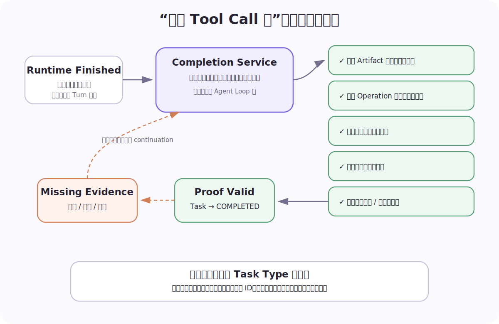

每个 Task Type 都应该绑定版本化 `CompletionContract`：

```python
@dataclass(frozen=True)
class CompletionContract:
    required_artifacts: frozenset[str]
    required_operations: frozenset[str]
    require_external_readback: bool
    require_human_approval: bool
    max_open_risk_level: str


def prove_completion(evidence, contract):
    return (
        contract.required_artifacts <= evidence.artifact_types
        and contract.required_operations <= evidence.succeeded_operations
        and (not contract.require_external_readback or evidence.readback_matches)
        and (not contract.require_human_approval or evidence.approved)
        and evidence.open_risk_level <= contract.max_open_risk_level
    )
```

持续运营任务可以检查：

- 指定时间窗的数据是否完整；
- 必需诊断 Tool 是否成功；
- 写入是否使用正确 Operation ID；
- 外部配置是否回读一致；
- 是否进入效果观察或满足回滚条件。

素材生产任务可以检查：

- 脚本、分镜、图片、视频等必需 Artifact 是否存在；
- 链接能否打开、格式和元信息是否匹配；
- 产物血缘和使用的输入版本是否完整；
- 合规检查和人工验收是否通过；
- 是否仍有未完成子 Task 或未处理修改意见。

模型最终文本只是对证据的解释，不能成为唯一证据。

## 11. 状态、记忆与上下文：先保存事实，再构建 Prompt

状态平面的最低原则是：

1. Event 不可被摘要覆盖；
2. Artifact 不通过聊天全文搬运；
3. Checkpoint 不等于上下文摘要；
4. Memory 必须有 Provenance；
5. Context Builder 是有预算的查询器。

```python
async def build_context(task, token_budget):
    sections = [
        await prompt_store.get(task.agent_version),
        await task_store.objective_and_constraints(task.task_id),
        await artifact_store.relevant_refs(task.task_id),
    ]

    remaining = token_budget - estimate_tokens(sections)
    memories = await memory_store.search(
        owner_scope=task.owner_id,
        query=task.objective,
        limit_tokens=max(0, remaining // 2),
    )
    events = await event_store.recent_semantic_events(
        task.root_task_id,
        limit_tokens=max(0, remaining // 2),
    )
    return render_context(sections, memories, events)
```

这种设计允许 Core 按模型特点做任意 Compaction，而不破坏可恢复事实。未来模型窗口变大时，Context 策略可以替换；Task、Event 和 Artifact 不需要迁移。

## 12. 进化平面：让系统越用越好，但不把线上变成试验场

进化不是让 Agent 自动修改自己的 Prompt 并立即上线，而是一套软件发布过程：

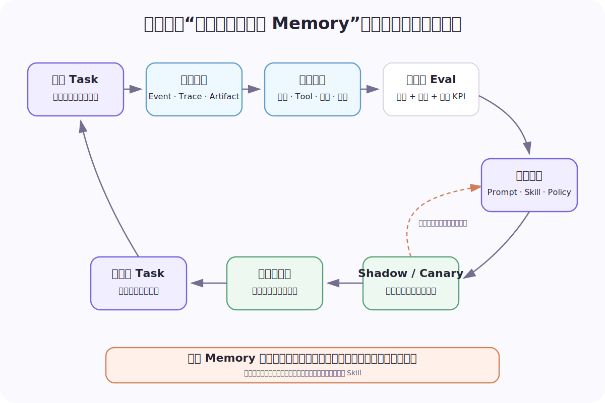

建议闭环是：

```text
真实任务与证据
→ 失败分类与数据清洗
→ 固定版本回放
→ 结果、过程、成本和风险多维 Eval
→ 产生 Prompt / Skill / Policy / AgentSpec 候选
→ Shadow / Canary / A-B
→ 达标后发布，退化则回滚
```

评测不能假设每次执行都走同一路径。Agent 可能用不同 Tool 顺序得到同样正确的结果，因此要同时评估：

- **End State**：外部状态和 Artifact 是否正确；
- **Process Invariant**：是否越权、重复写入、漏审批、超预算；
- **Efficiency**：延迟、Token、Tool 次数和外部成本；
- **Human Load**：追问次数、等待时长、人工修改轮次；
- **Business Impact**：真实运营指标或素材可用性。

线上任务写入 Eval 集之前还要做脱敏、去重、代表性采样和权限检查。单次成功轨迹不应自动进入长期 Memory，更不能直接升级成全局 Skill。

## 13. 一条现实的实施路线

不要从重写两个业务系统开始。更稳妥的路线是抽取协议和不变量，让现有 Runtime 逐步接入。

### 阶段 0：统一词汇和观测语义

- 固化 AgentSpec、Task、Run、Step、Event、Artifact、Checkpoint、Lease、Budget；
- 所有日志补齐 `task_id/run_id/step_id/operation_id/agent_version/lease_epoch`；
- 区分四类心跳；
- 建立错误分类：路由、数据、Tool、权限、Runtime、恢复、完成证明、业务质量。

### 阶段 1：抽出 Runtime Adapter 与 AgentSpec

- 将 `pi-agent` 和其他现有 Runtime 统一为 Runtime Event；
- AgentSpec 显式声明 Tool、Skill、委派白名单、副作用、Sandbox 与预算；
- 保留现有 Prompt 和业务路由，不先改 Agent 图。

### 阶段 2：建立耐久 Task 内核

- 先覆盖跨分钟、跨进程、有人审或有真实副作用的任务；
- 引入状态版本、Event Log、Outbox/Inbox、Operation Dedup、Checkpoint；
- 把用户输入、定时触发和外部事件收敛到同一 Task 入口。

### 阶段 3：补齐 Lease、监督与资源治理

- 业务资源键驱动互斥；
- 租约转移使用 Fencing Token；
- Worker 自动补位，Run 按错误类型恢复；
- 管理模型并发、Token、CPU、内存、外部 QPS 和媒体生成槽位。

### 阶段 4：深化两个业务 Profile

持续运营 Profile：

- Desired/Current/Reconcile 状态；
- 读写能力双通道；
- 高风险审批、变更窗口、回滚与效果回读；
- 账户/计划级 Operation 和资源锁。

素材生产 Profile：

- Artifact Graph 成为跨 Agent 协作主通道；
- 委派预算、循环检测与父子任务归并；
- 人工等待跨天持久化；
- AIGC Tool Pool、产物血缘、项目锁与可恢复编辑 Checkpoint。

### 阶段 5：评测驱动发布

- 固定 Prompt、Skill、AgentSpec、Tool 和 Policy 版本；
- 支持历史任务回放与候选版本对照；
- 用业务结果、系统不变量和成本共同做门禁；
- Shadow、Canary、回滚成为标准发布路径。

## 14. 成熟 Agent OS 必须能回答的 30 个问题

### 业务与控制

1. 这是什么 Task Type，谁对最终结果负责？
2. 用户目标、约束、默认值和完成合同是什么？
3. 该用 Tool、Skill、Inline Step 还是 Subagent？
4. 是否需要主 Agent；它管理什么，不管理什么？
5. 任务的调度资源键是什么？哪些读可以并行，哪些写必须串行？
6. 委派深度、宽度、Token、时间和成本上限是多少？

### 信任

7. Agent 的能力白名单由谁签发、何时失效？
8. 哪些动作只读、可逆、不可逆？
9. 哪些动作可以在预授权额度与资源范围内免审；单次、累计和并发消耗如何核算？
10. Sandbox 等级如何选择，凭证在哪里？
11. Tool 超时后如何判断“失败”还是“结果不确定”？
12. 重试、补偿和回滚各由谁触发？

### 运行与状态

13. Task、Run、Step、Session、Process 是否真正分离？
14. 进程随时被杀，系统能否从 Checkpoint 恢复？
15. 两个 Worker 抢同一资源时，旧 Worker 是否会被 Fencing 拒绝？
16. 队列重复投递会不会造成第二次真实副作用？
17. 用户第二天回复，Human Request 和原任务还在吗？
18. 取消是否穿透根任务、子任务、Runtime、Tool 与补偿链？
19. 父任务是否可能在子任务仍运行时提前完成？
20. Artifact、Event、Memory 和 Context 分别保存在哪里、保留多久？

### 完成、观测与进化

21. 模型说完成时，系统检查哪些独立证据？
22. 外部回读失败时是续跑、重试、等待还是失败？
23. Transport、Runtime、Worker 和业务进展心跳是否分开？
24. 一次失败能否定位到具体 Task/Run/Step/Operation 和版本？
25. 观测数据是否可能泄露 Prompt、Tool 参数、用户内容或凭证？
26. 任务恢复率、重复副作用和人工等待是否有指标？
27. 历史任务如何脱敏、采样并进入 Eval？
28. 候选 Prompt/Skill/Policy 如何 Shadow、Canary 和回滚？
29. 是否同时评估结果、过程不变量、成本、风险和业务指标？
30. 替换 Agent Core 后，Task 状态、审计记录和业务语义是否仍然成立？

如果这些问题没有确定答案，系统拥有的只是一个更复杂的 Agent Demo，而不是 Agent OS。

## 结语：Core 决定 Agent 能不能工作，OS 决定它能不能承担工作

`pi-agent` 之所以适合作为底层，不是因为它试图包办一切，而是因为它把 Agent Core 的窄腰做得足够清楚。越干净的 Core，越适合被不同 Agent OS Profile 复用。

真正困难的部分留在上层：业务目标、信任、调度、耐久状态、恢复、完成证明、全 Runtime 观测和安全进化。持续运营与素材生产会长出不同的 Agent 图、托管方式和状态机，这是正确的；它们只需要共享同一组可靠性不变量。

最终可以把判断标准压缩为一句话：

> Agent Core 让模型在一次 Loop 中调用工具；Agent OS 让这次调用成为长期业务系统里可约束、可恢复、可证明、可经营的一步。

## 参考资料

- [Building effective agents - Anthropic](https://www.anthropic.com/engineering/building-effective-agents)
- [How we built our multi-agent research system - Anthropic](https://www.anthropic.com/engineering/multi-agent-research-system)
- [Scaling Managed Agents: Decoupling the brain from the hands - Anthropic](https://www.anthropic.com/engineering/managed-agents)
- [Controllers - Kubernetes](https://kubernetes.io/docs/concepts/architecture/controller/)
- [Temporal Durable Execution](https://temporal.io/)
- [OpenTelemetry Semantic Conventions](https://opentelemetry.io/docs/specs/semconv/)
- [OpenTelemetry GenAI Attribute Registry](https://opentelemetry.io/docs/specs/semconv/registry/attributes/gen-ai/)
