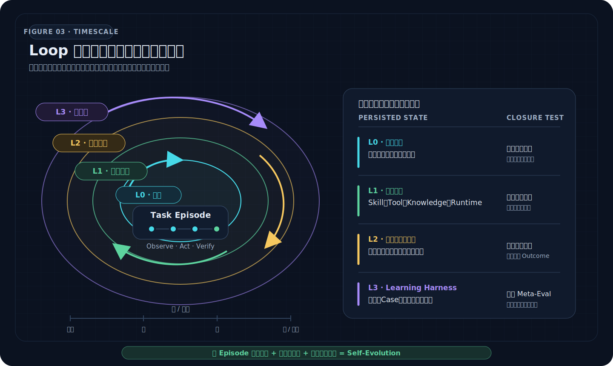
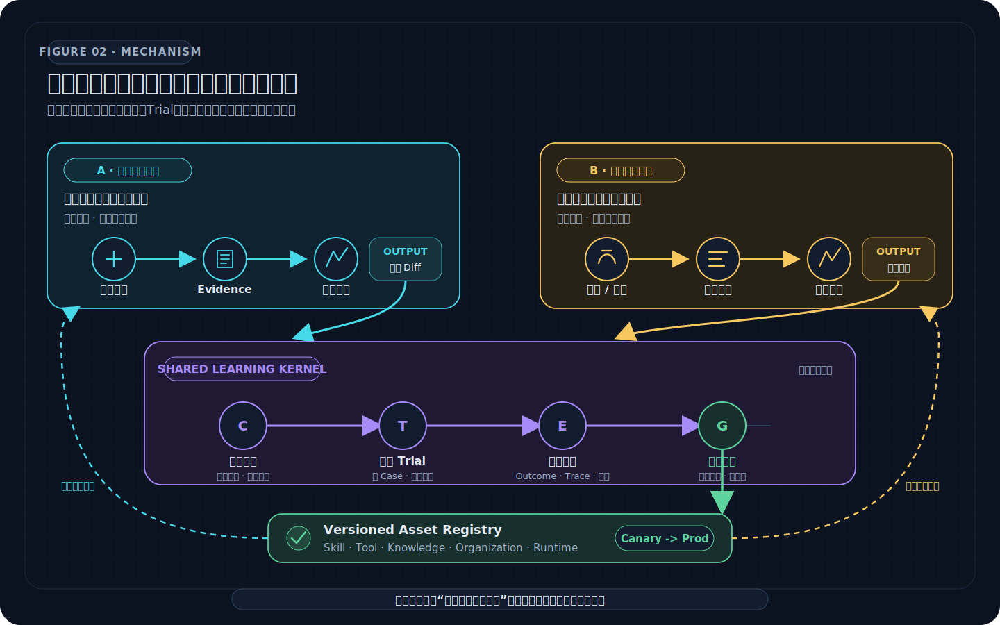
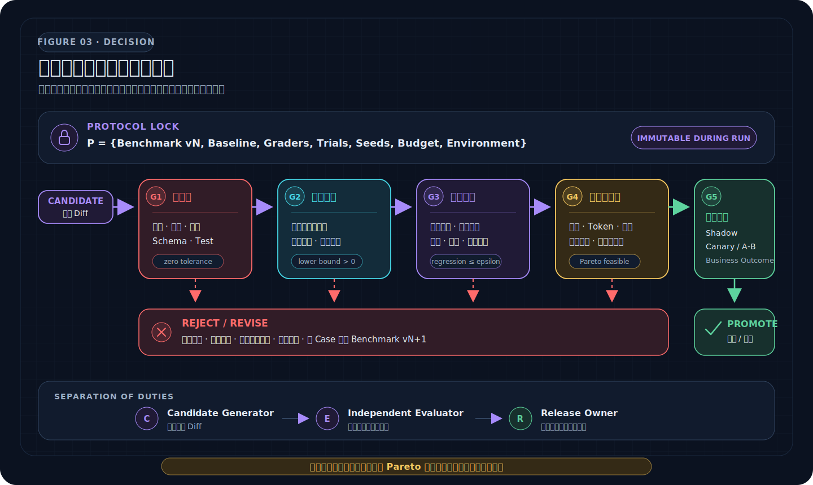

# Agent Self-Evolution：从反馈闭环到可验证的系统进化

假设一个生产 Agent 最近收到了三类反馈：用户纠正了它的做法，运营提出了一套更好的流程，线上某个版本的业务指标也突然变好。最常见的反应是让模型总结经验、改写 Prompt 或生成一个新 Skill，然后宣布系统“学会了”。

问题是：用户纠正可能只适用于当前 Case；业务指标可能来自流量结构而不是 Agent；新 Skill 可能修好一个问题却破坏十个旧任务；负责生成改动的模型也可能只是更擅长说服负责打分的模型。

所以，**反馈、改动和学习不是一回事**。本文对 Agent Self-Evolution 的定义是：

> Agent 系统把真实使用与有效提案转化为可重放证据，针对明确的失败机制或能力假设产生版本化候选，通过独立评测和发布门禁选择更优版本，再让生产结果回到下一轮学习。

它至少同时包含三个条件：

1. 改动跨越单次对话，持久进入 Skill、Tool、知识、控制策略或其他系统资产；
2. “变好”由独立于候选生成器的证据和评测确认，不由 Agent 自我宣布；
3. 离线收益回到真实环境接受检验，结果继续成为下一轮输入。

因此，Self-Evolution 不是一个神秘的“自我修改模块”，而是一套**评测驱动的受控发布系统**。最高效的主流程可以先压缩成一句话：

```text
真实信号 -> Evidence Bundle -> 失败簇或能力假设 -> 选择最小改动面
-> 生成少量可区分候选 -> 冻结评测协议 -> 配对多次 Trial
-> 硬约束与多目标门禁 -> Shadow / Canary -> 生产结果回流
```

真正困难的通常不是生成候选，而是决定**应该改什么、凭什么相信它更好、谁有权让它生效**。

## 1. Agent 从一开始就是 Loop，但 Loop 不等于 Self-Evolution

ReAct 把语言模型的推理与行动交错起来：模型根据当前上下文产生 Thought 与 Action，环境返回 Observation，Observation 再更新后续计划。它建立了最经典的 Agent 执行闭环。[ReAct 论文](https://arxiv.org/abs/2210.03629)

若用 $x_t$ 表示任务状态，$a_t$ 表示动作，$o_{t+1}$ 表示环境反馈，那么单次任务中的状态更新可以写成：

$$
x_{t+1}=F(x_t,a_t,o_{t+1})
$$

这个 Loop 能让 Agent 在当前任务里纠错，却默认没有改变下一次任务所用的长期资产。对话结束、上下文消失，系统可能再次犯同样的错。Self-Evolution 需要再包一层跨 Episode 的更新：

$$
\theta_{n+1}=\operatorname{Select}\left(
\left\{\theta_n,\operatorname{Mutate}(\theta_n,E_n)\right\},
\operatorname{Eval}(D_{n}^{\text{holdout}})
\right)
$$

其中，$\theta_n$ 是第 $n$ 版 Agent 系统配置，$E_n$ 是从真实运行中得到的证据，$D_n^{\text{holdout}}$ 是候选生成过程不可见的评测数据。`Mutate` 可以由人、Agent、搜索算法或多者共同完成；决定系统是否真的学习的，是后面的独立选择与持久更新。

[](assets/agent-self-evolution/01-four-loop-timescales.svg)

*图 1：同一个 Agent 系统里至少存在四个时间尺度。L0 只改变当前轨迹；L1、L2 开始持久改变跨任务资产；L3 才把“怎样进行优化”本身作为优化对象。*

可以据此区分四层 Loop：

| 层级 | 时间尺度 | 反馈来源 | 改变什么 | 何时闭合 |
|---|---:|---|---|---|
| 执行 Loop | 秒到分钟 | Tool、环境、中间结果 | 当前计划与上下文 | 当前任务完成或终止 |
| 质量学习 Loop | 小时到天 | Badcase、用户修正、告警、失败 Trace | 现有能力资产 | 修复通过回归与生产验证 |
| 价值学习 Loop | 天到周 | 有效提案、真实使用、业务 Outcome | 新能力与业务做法 | 新能力产生可重复增量价值 |
| 元进化 Loop | 周到月 | 完整 Optimization Episode | Learning Harness 的搜索、评测与控制策略 | 新 Harness 在隐藏任务上更会优化 |

互联网产品常说的“闭环”只是因果链重新回到起点。对 Self-Evolution 来说，闭环还必须回答两个更严格的问题：**回来的信号能否归因到某个版本，下一轮究竟持久改变了什么？** 如果没有版本绑定、独立验证和资产提交，系统得到的只是反馈，不是学习。

## 2. 固定模型以后，Agent 的可优化面其实有限

近期一篇系统综述把现代 Agent 表示为“基础模型 + Prompt、Memory、Tool 与控制逻辑构成的 Scaffold”，并把 Self-Improvement 定义为对模型参数或 Scaffold 组件的持久更新。这篇 2026 年 7 月的文章仍是预印本，但其系统边界很实用：[Self-Improvements in Modern Agentic Systems](https://arxiv.org/abs/2607.13104)。

如果暂时不训练模型，可以把生产 Agent 写成：

$$
\mathcal{A}_{\theta}=M\oplus
\{P,S,T,K,O,R,U\}
$$

其中 $M$ 是固定模型，外部配置 $\theta$ 由以下可枚举资产组成：

| 记号 | 优化对象 | 典型内容 |
|---|---|---|
| $P$ | Prompt 与 Context Policy | 系统指令、任务契约、上下文选择、压缩与注入策略 |
| $S$ | Skill | 可复用 SOP、诊断法、写作或执行程序、触发条件 |
| $T$ | Tool | Tool Schema、描述、选择策略、参数约束、实现与错误语义 |
| $K$ | Knowledge / Memory | 事实、规则、偏好、经验、索引、检索与知识晋升协议 |
| $O$ | Organization | Subagent 角色、路由、委派、串并行关系、协作与合并协议 |
| $R$ | Runtime / Harness | 状态机、预算、重试、权限、Sandbox、检查点、验证与恢复 |
| $U$ | Product Interface | 输入表单、澄清流程、人审节点、结果呈现与人工接管 |

这张表有两个重要含义。

第一，Agent 工程不是无限搜索。多数失败可以被定位到少数控制面，真正需要做的是根据证据缩小候选空间。第二，很多问题根本不该通过“让模型更聪明”解决：输入契约模糊应该改产品接口，工具返回不稳定应该改 Tool，完成条件不可验证应该改 Harness，组织决策冲突应该改责任与门禁。

这也解释了为什么评测与自优化必须是一套系统。优化负责提出 $\theta'$，评测负责在同一任务分布下比较 $\theta'$ 与 $\theta$；两者之间的失败归因又决定下一轮要打开哪个参数面。

## 3. Self-Evolution 是一个受约束的多目标优化问题

对业务 Loop $L$，设真实任务分布为 $D_L$，候选版本为 $\theta'$，随机性与环境扰动为 $\xi$。一次 Trial 产生的不是一个分数，而是一个结果向量：

$$
Y(\theta';c,\xi)=
\left(Q,Rel,Risk,Cost,Human,Biz\right)
$$

它分别表示任务质量、可靠性、风险、机器成本、人类注意力和业务结果。候选选择可以形式化为：

$$
\theta^*\in\arg\max_{\theta'\in\mathcal{C}(E_L)}
\mathbb{E}_{c\sim D_L,\xi}[U(Y)]
$$

同时满足：

$$
g_{\text{security}}(\theta')=0,\quad
g_{\text{compliance}}(\theta')=0,\quad
\Delta_{\text{core-regression}}\geq-\epsilon
$$

但工业系统不应急着把六个维度压成一个加权总分。权重一旦写错，优化器就会忠实地扩大错误。更稳妥的是**约束优先、分层晋级、Pareto 选择**：

1. 先检查安全、合规、权限和确定性正确性；
2. 再确认目标失败簇是否改善；
3. 再检查核心回归、长尾风险和跨 Trial 稳定性；
4. 在可行候选中比较成本、延迟、人类负担与复杂度；
5. 最后用 Shadow、Canary 或 A/B 验证真实业务价值。

一个平均分更高但最坏切片退化、成本翻倍或难以维护的候选，通常不是生产最优解。

## 4. 两条学习环：问题驱动的自进化与价值驱动的共进化

生产系统同时面对两类完全不同的学习任务。

Silver 与 Sutton 在《Welcome to the Era of Experience》中提出，下一阶段的智能系统会更多依赖持续经验流、与环境的真实交互和由现实后果支撑的反馈，而不只依赖静态人类数据。[Welcome to the Era of Experience](https://storage.googleapis.com/deepmind-media/Era-of-Experience%20/The%20Era%20of%20Experience%20Paper.pdf) 对工业 Agent 的直接启发不是立刻进行在线模型训练，而是先把“谁在什么版本上采取了什么行动，环境和用户随后发生了什么”保存为可靠经验，再把经验证的经验编译到模型外部资产中。

**问题驱动内环**从已经发生的偏差出发：用户纠正、失败任务、质量告警、权限拒绝、重复人工接管。它的目标相对明确，适合高频运行，主要提高现有能力的可信下限。

**价值驱动外环**从尚未具备的能力和真实效果出发：用户提案、专家方法、新场景需求、某类结果在生产中表现更好。它面对更高不确定性，主要探索能力上限，并判断一种新做法是否值得成为长期资产。

[](assets/agent-self-evolution/02-dual-loop-learning-system.svg)

*图 2：两条环的信号、节奏和目标不同，但共享同一个 Learning Harness。统一的不是业务流程，而是证据、候选、Trial、评测、版本和发布协议。*

| 维度 | 问题驱动内环 | 价值驱动外环 |
|---|---|---|
| 起点 | 已知失败、偏差、投诉与风险 | 提案、机会、优秀结果与新需求 |
| 核心问题 | 为什么没有达到已知目标？ | 还能创造什么能力与价值？ |
| 候选 | 修复假设与最小 Diff | 能力假设、业务做法与迁移假设 |
| 主要证据 | Trace、Outcome、规则命中、人工修正 | 版本化生产对象、使用上下文、业务效果、对照切片 |
| 成功标准 | 修复稳定、无不可接受回退 | 能力可用、安全，并产生可重复增量价值 |
| 主要产出 | 回归 Case、稳定性提升、失败知识 | 新 Skill、Tool、知识、工作流或能力版本 |

两条环可以互相转化：一个问题反复出现且局部修复无效，说明它已升级为能力缺口，应进入外环；一个新能力通过验证并发布后，就必须获得明确的质量目标、回归 Case 和稳定性治理，转入内环。

### 4.1 为什么外环必须做两次验证

外环通常跨越两个证据域：离线任务能否完成，以及真实业务是否因此变好。

第一次验证回答“新能力能不能可靠工作”；随后把它作为版本化对象投入受控生产。生产效果只负责发现值得解释的信号，不能直接决定资产沉淀。系统还要提出“什么机制可能有效、适用于谁、迁移到哪里、用什么指标证伪”的假设，再进行第二次受控研发验证。

```text
探索提案 -> 离线能力验证 -> 版本化发布 -> 真实效果观测
-> 稳定优势识别 -> 可证伪迁移假设 -> 第二次研发验证 -> 长期资产
```

这一步很关键。线上相关性发现若直接写入 Skill 或知识库，流量偏差、季节性、渠道、人群和产品差异都会被错误固化为“经验”。

## 5. 第一步不是优化，而是把反馈变成 Evidence

用户使用是最宝贵的信号源，也是最容易误读的数据源。

- 用户继续使用，可能代表满意，也可能只是没有替代品；
- 用户重新生成，可能代表失败，也可能是在探索更多方案；
- 用户手动修改，可能是纠错，也可能只是风格偏好；
- 业务指标上涨，可能来自 Agent，也可能来自渠道、价格或人群变化；
- 专家提案有很高信息量，但在转成可观测目标以前仍不是研发任务。

所以，反馈进入优化器之前要先形成可追溯的 **Evidence Bundle**。最小数据模型应保留：

```yaml
episode_id: "ep-20260722-0142"
task_contract: "目标、约束与允许的行动"
input_snapshot: "fixture-support-v4"
agent_manifest:
  model: "model-api-v7"
  prompt: "support-prompt-3.4.1"
  skills: ["support-resolution@2.1"]
  tools: ["search-order@1.6", "draft-refund@1.2"]
  knowledge_snapshot: "support-kb-2026-07-21"
  organization: "single-agent-with-review@1"
  runtime: "agent-runtime-5.2"
trace_refs: ["模型轮次、工具事件、中间产物、审批"]
outcome:
  environment_state: "refund-draft-created"
  user_acceptance: "accepted-with-edit"
  business_events: ["ticket-resolved"]
feedback:
  correction: "退款原因需要引用订单状态"
  reason: "原结果缺少可审计依据"
  confidence: "expert-confirmed"
privacy_and_permissions: "pii-redacted; reuse-approved-for-eval"
```

Agent 评测需要同时看 Trace 与 Outcome。一个 Agent 可以说“订单已创建”，但数据库里没有订单；也可以通过一条不合规路径得到正确结果。Anthropic 的 Agent Evals 方法把 Task、Trial、Grader、Transcript/Trace、Outcome 与 Evaluation Harness 明确区分，正是为了避免只给最终文本打分。[Demystifying evals for AI agents](https://www.anthropic.com/engineering/demystifying-evals-for-ai-agents)

证据处理还要经过五道数据门：

1. **身份与版本对齐**：任务、用户反馈、生产对象、Agent 资产版本和业务事件能够连接；
2. **脱敏与权限**：个人信息、密钥、内部地址和不允许复用的内容不能进入学习资产；
3. **可复现性**：保存足够的 fixture、环境与依赖，使失败可以重放；
4. **去重与分层采样**：既保留主流分布，也保留低频高风险长尾；
5. **来源与置信度**：明确是环境事实、用户判断、Judge 评分还是推断。

任何评分、归因和门禁结论都应能回到具体证据位置。没有引用链的“失败总结”，只是另一段可能出错的模型文本。

## 6. 从失败机制选择优化面，而不是默认改 Prompt

最高效的自优化不是扩大搜索空间，而是用 Trace、Outcome 和对照实验把问题压缩到一个最可能的控制面。

| 观察到的失败 | 需要补的证据 | 优先候选面 | 不应先做什么 |
|---|---|---|---|
| 目标理解持续偏差 | 用户意图、澄清轮次、约束遗漏位置 | 输入契约、Prompt、产品交互 | 直接增加 Subagent |
| 已知 SOP 每次重新推理 | 成功与失败轨迹、重复步骤、触发条件 | Skill | 把整段历史塞进 Memory |
| 选错 Tool 或参数 | Tool 选择混淆矩阵、Schema、错误返回 | Tool 描述、参数契约、路由 | 重写全部系统 Prompt |
| Tool 选对但执行不可靠 | 超时、幂等、错误码、外部状态 | Tool 实现、Runtime、重试与补偿 | 让模型“更谨慎” |
| 缺少事实或规则 | 检索命中、来源、时效与冲突 | Knowledge、Memory、索引与准入 | 将一次回答永久记忆 |
| 长任务遗忘目标 | Checkpoint、压缩损失、状态恢复 | Context Builder、状态机、Harness | 盲目扩上下文窗口 |
| 多角色各自正确但整体失败 | 委派、等待、重复工作、合并冲突 | Subagent 角色与控制拓扑 | 增加更多并行 Agent |
| 结果正确但成本过高 | Token、Tool 次数、延迟、人类分钟数 | 路由、缓存、模型选择、Skill、组织 | 只优化回答长度 |
| 评测长期不公平或不稳定 | 参考解、Grader 分歧、争议 Case | Case、Fixture、Rubric、Grader | 根据候选表现临时改标准 |

一个实用的修复假设应写成：

```text
在场景 S 中，失败 F 主要由机制 M 导致；
若仅修改资产 A 的范围 R，指标 Q 应改善至少 delta，
同时核心回归 G、安全约束 H 与成本 C 不得越界。
```

这比“优化一下 Agent”更有价值，因为它同时决定了候选生成、评测切片和停止条件。

### 6.1 Skill、Tool、Knowledge 与组织结构分别在学习什么

- **Skill 学的是方法**：把多次可验证成功的程序压缩成可触发、可执行、可评测的 SOP。
- **Tool 学的是行动接口**：让 Agent 更准确地选择能力，并让参数、错误、副作用和权限可被系统约束。
- **Knowledge 学的是事实与适用条件**：保留来源、时间、范围和冲突，而不是堆积自然语言结论。
- **Subagent 学的是责任分解**：只有当并行、隔离上下文或专业边界的收益大于沟通与合并成本时才成立。
- **Organization 学的是控制拓扑**：谁提出、谁执行、谁否决、何时并行、失败回到哪里、预算怎样分配。
- **Harness 学的是如何完成一次可靠优化**：Case 怎样选、候选怎样搜、Trial 怎样分配、何时停止。

最后两项往往已经超出单个 Agent 的能力问题，进入系统架构与组织管理问题。

## 7. 候选搜索：从人工假设到自动演化

候选生成可以非常“数学”，也可以完全依赖专家判断。关键不在算法名称，而在实验是否可归因。

### 7.1 每轮只改变足以验证假设的最小 Diff

候选 $\alpha$、$\beta$、$\gamma$ 应围绕同一个修复目标，但采用可区分的做法。模型、Prompt、Skill、Tool、知识快照、Subagent 组织和预算若同时变化，任何收益都无法归因，失败也无法指导下一轮。

实验前冻结：

- 基线与候选版本；
- Case、数据切片与 Holdout；
- Grader、Rubric、阈值和硬门禁；
- Trial 次数、随机种子或配对条件；
- 模型、环境、依赖、权限和预算；
- 允许改动与禁止改动的文件或资产。

对于随机 Agent，同一个 Case 应运行多次 Trial。候选与基线尽量在相同 Case、相同环境、相同随机条件下配对，这通常比简单增加样本更能降低比较噪声。

### 7.2 什么时候用什么搜索方法

| 方法 | 适用条件 | 优点 | 主要风险 |
|---|---|---|---|
| 专家诊断 + 人工 Diff | Case 少、风险高、机制清楚 | 可解释、启动快 | 依赖专家经验，探索有限 |
| 模型反思 + 少量候选 | 有 Trace 和 Rubric，文本资产可改 | 成本低、可读 | 自我确认、Prompt 膨胀 |
| A/B、因子实验 | 能控制变量，有稳定流量 | 因果更清楚 | 组合空间快速增长 |
| Bandit / 贝叶斯优化 | 在线或昂贵实验，指标可量化 | 预算利用率高 | 奖励定义错误会被放大 |
| 演化搜索 / Pareto 搜索 | 文本或代码候选多，目标多维 | 能保留互补方案 | 容易过拟合评测与增加复杂度 |
| 组织评审 | 目标冲突、风险或价值难量化 | 能处理规范性判断 | 决策慢，可能受权力与叙事影响 |

很多工业问题最终确实是组织管理问题：产品负责人决定价值目标，领域专家定义不可牺牲项，评测负责人保护 Holdout，安全负责人拥有否决权，发布负责人承担生产风险。算法能排序候选，不能替组织决定什么值得优化。

### 7.3 几个先进实践真正证明了什么

**Karpathy 的 AutoResearch** 把自治研究压缩到极小控制面：固定只读的评测与数据准备文件、固定五分钟预算，Agent 只改一个训练文件；每轮提交、运行、读取指标，改善则保留，退化则回滚。[AutoResearch](https://github.com/karpathy/autoresearch)

它最值得迁移到 Agent 系统的不是“无限 Loop”，而是：

```text
固定评价函数 + 固定物理预算 + 白名单改动面
+ 基线 + keep / discard + Git 血缘 + 实验账本
```

它也暴露了边界：单一 `val_bpb` 很适合受控训练实验，却不足以代表生产 Agent 的安全、成本、用户价值和长尾稳定性。

**Voyager** 在 Minecraft 中使用环境反馈、执行错误和自验证迭代生成程序，并把验证后的程序提交到可检索 Skill Library。论文证明了在一个反馈丰富的模拟环境里，不更新模型参数也能通过课程、可执行 Skill 和跨 Episode 复用获得持续能力增长。[Voyager](https://arxiv.org/abs/2305.16291)

但它的完成判断仍大量依赖另一个 GPT-4 自验证器。工业系统应优先使用环境状态、测试和规则作为 Oracle，把模型 Judge 放在无法确定性编码的语义层。

**GEPA** 从完整执行轨迹中生成自然语言反思，提出 Prompt 候选，并通过 Genetic-Pareto 搜索保留不同目标上的互补解。论文在六类任务上报告了相对 GRPO 更少 Rollout 的收益，说明富文本 Trace 可以成为比稀疏标量更高带宽的优化信号；但这些结果不能自动外推到任意业务任务。[GEPA](https://arxiv.org/abs/2507.19457)

**Hermes Agent Self-Evolution** 进一步把 Skill、Tool 描述、System Prompt 和代码列为分级优化对象，用执行 Trace 生成针对性变异，并设置测试、长度、语义保持、Holdout 和 PR 人审门禁。它是一个很贴近工程现实的设计样本。[项目仓库](https://github.com/NousResearch/hermes-agent-self-evolution)

需要准确理解它当前的证据边界：截至 2026 年 7 月，仓库说明中已实现的是 Skill 演化；Tool 描述、System Prompt、代码与持续改进流水线仍标为计划阶段。主 Hermes Agent 的 Skill 系统已经允许 Agent 创建和修改程序性记忆，并提供写入审批门，但“能写 Skill”本身不等于“该 Skill 已证明让系统变好”。[Hermes Skills 文档](https://hermes-agent.nousresearch.com/docs/user-guide/features/skills/)

这些实践共同指向同一个结构：**把可改资产显式化，把评价函数隔离，把每次尝试版本化，让失败安全、廉价且能提供下一轮信息。**

## 8. Agent Eval 不是旁路，而是 Self-Evolution 的选择器

评测的对象不是裸模型，而是：

$$
\text{System Under Test}=M\times\theta\times Environment
$$

模型、Prompt、Skill、Tool、知识、权限、Runtime 和环境任一变化，都可能改变结果。没有完整 Manifest 的分数不可比较。

### 8.1 一条 Case 必须包含什么

```yaml
case_id: "support-017"
source: "production-cluster-2026-07"
task: "用户真正要完成的任务"
initial_environment: "fixture-v4"
allowed_tools: ["search_order", "draft_refund"]
permissions: "read-and-propose"
target_outcomes: ["可机器验证的最终状态"]
forbidden_outcomes: ["越权、泄露、未审批副作用"]
rubric: ["无法完全机器化的质量维度"]
budget:
  wall_time_seconds: 300
  max_cost_usd: 1.5
graders: ["code", "model", "human-sampled"]
```

高质量 Case 还需要一个已知可行的参考解，证明任务本身可完成、Fixture 正确、Grader 没有互相冲突。若大量 Trial 的 `pass@100` 仍为零，首先应该审查任务与评测器，而不是立即判断 Agent 没能力。Anthropic 也特别强调了这个排错顺序。

### 8.2 评测要覆盖结果、过程和系统行为

| 维度 | 典型指标 |
|---|---|
| Outcome | 任务成功率、外部状态断言、业务结果、首次通过率 |
| Quality | 正确性、完整性、相关性、用户或专家接受率 |
| Reliability | 多 Trial 成功率、方差、尾部失败、恢复率、最坏切片 |
| Safety | 越权率、禁止工具、敏感信息、审批绕过、不可逆错误 |
| Efficiency | 墙钟时间、Token、Tool 次数、成本、缓存命中、重试 |
| Human Load | 澄清轮次、人工修改、接管分钟数、审批积压 |
| Process | 证据完整率、计划漂移、重复调用、无效 Loop、Handoff 质量 |
| Business | 转化、留存、解决率、产出采用率，以及相应反指标 |

一个实用的北极星指标是：

$$
\text{Cost per accepted, safe outcome}
$$

即每一个被用户或下游系统接受、且没有违反安全边界的结果，需要多少机器成本与人类注意力。

### 8.3 Grader 应像“瑞士奶酪”一样分层

- **Code-based Grader**：Schema、单测、静态分析、状态断言、权限和预算；便宜、稳定、优先使用。
- **Model-based Grader**：语义质量、风格、覆盖度与复杂 Rubric；必须与专家校准并允许返回“不确定”。
- **Human Review**：高风险决策、规范性判断、Judge 校准、未知失败与争议 Case。
- **Production Monitoring**：验证离线数据没有覆盖的真实分布、长期影响和业务结果。

高风险硬门禁不能只由 LLM Judge 决定；同一个模型家族也不应既产生候选、又生成 Case、又独立打分、再批准上线。

### 8.4 Benchmark 也会进化，但不能在本轮移动球门

新 Badcase 应经过脱敏、去重、可复现性和质量审核后进入候选 Case 池。Benchmark Registry 要记录来源、切片、评分标准与版本。

关键规则是：**本轮评测协议一旦冻结，新增 Case 只能进入下一版本。** 否则团队会根据候选表现临时改题，既无法比较，也会把目标漂移包装成进步。

[](assets/agent-self-evolution/03-evaluation-and-promotion-gates.svg)

*图 3：发布不是比较一个总分，而是逐层获得资格。候选生成器不能修改隐藏 Case、Grader、成功标准，也不能批准自己。*

## 9. Learning Harness：把评测、优化和发布组织成一台机器

一套可落地的 Learning Harness 至少包含八个子系统：

1. **Signal Ingestion**：接入用户反馈、Trace、Outcome、业务事件和专家提案；
2. **Evidence Store**：保存脱敏、版本化、可引用和可重放的 Evidence Bundle；
3. **Case Factory & Benchmark Registry**：从失败与覆盖缺口生成候选 Case，维护 Train、Validation、Holdout 与回归集；
4. **Diagnosis Engine**：进行轨迹切分、失败聚类、根因假设和优化面路由；
5. **Candidate Workspace**：在隔离分支或版本空间中生成最小 Diff，并记录完整 Manifest；
6. **Sandbox Trial Runner**：用冻结 Case 和配对条件并行运行基线与候选；
7. **Grader & Decision Service**：聚合确定性规则、Judge 与人工审核，执行分层门禁；
8. **Asset Registry & Release Control**：管理 Skill、Tool、Knowledge、组织和 Harness 版本，支持 Shadow、Canary、回滚与生产观测。

核心循环可以写成：

```python
while budget_remaining() and not target_gate_passed():
    evidence = build_evidence_bundle(real_signals)
    cluster = diagnose_failure_or_opportunity(evidence)
    hypothesis = write_falsifiable_hypothesis(cluster)
    surface = choose_smallest_plausible_surface(hypothesis)

    protocol = freeze_eval_protocol(
        baseline=current_version,
        cases=target_plus_regression_plus_risk_slices,
        graders=independent_graders,
        trials=paired_repetitions,
        budget=fixed_budget,
    )

    candidates = generate_minimal_diffs(surface, hypothesis)
    results = run_isolated_trials(protocol, candidates)
    winner = promote_only_if_all_gates_pass(results)

    if winner:
        canary(winner)
        observe_real_outcomes_or_rollback(winner)
    else:
        update_hypothesis_from_failed_evidence(results)
```

这里的停止条件由门禁、预算和边际信息增益共同决定，而不是“Agent 还想不想继续”。没有新的可证伪假设、候选差异已经小于噪声、预算用尽或风险上升时，都应该停止并交给人。

### 9.1 Optimization Episode 是元进化的经验单位

若未来要优化 Learning Harness 本身，不能只保存“哪个候选赢了”。完整的 Optimization Episode 至少包括：

```text
问题与原始证据
-> 失败归因与置信度
-> 选择了哪个优化面以及为什么
-> 候选 Diff 与搜索策略
-> Case、Trial、预算和成本
-> 接受或拒绝的原因
-> 上线后的真实结果与回滚
```

Meta-Harness 可以从这些 Episode 中学习：某类失败应该怎样选证据、用哪种搜索、分配多少 Trial、何时停止、哪个控制拓扑更有效。但它只能提出新的 Harness 候选，不能同时修改隐藏任务、评价协议和晋级规则。

Weco 在 AIDE² 实验中把递归自改进表述为双层优化：外环改写内环优化 Agent，再用固定预算与私有 Holdout 比较新旧版本。其 2026 年 7 月报告认为当前证据支持的是 Level 1“相对公平人工基线产生净正收益”，尚未宣称达到 Level 2“改进能力本身点火”。这是理解 Meta-Evolution 证据强度时很有用的克制。[AIDE² 报告](https://www.weco.ai/blog/first-evidence-of-recursive-self-improvement)

## 10. 组织结构就是算法的一部分

当目标、反馈和风险来自真实业务时，Self-Evolution 不可能只由一个优化 Agent 闭合。最小职责分离如下：

| 角色 | 负责 | 不应同时拥有 |
|---|---|---|
| Product / Domain Owner | 目标、价值、不可牺牲项、提案有效性 | 隐藏评测的逐题答案 |
| Evidence Owner | 数据对齐、脱敏、来源、重放与质量 | 候选收益结论 |
| Candidate Generator | 失败假设、优化面选择、候选实现 | 修改 Grader 与批准发布 |
| Evaluation Owner | Case、Fixture、Rubric、Holdout、Judge 校准 | 根据候选表现临时改标准 |
| Safety / Compliance | 硬约束、权限、否决与审计 | 用平均业务收益抵消红线 |
| Release Owner | Shadow、Canary、观察窗口、晋级与回滚 | 隐藏失败或绕过门禁 |

最重要的组织原则有三条：

1. **提案权、评价权、发布权分离**；
2. **确定性硬约束位于优化器权限之外**；
3. **人从 in the loop 逐步移动到 on the loop**：不逐条修 Agent 产物，而是审查失败模式、修改 Harness、定义门禁和处理异常。

这不是为了增加流程，而是为了防止自我确认。没有职责隔离的“全自动进化”，通常只是把同一套偏差从生成端复制到评测端。

## 11. 一条最高效的落地路线

不要从“让 Agent 自动改写自己”开始。最短路径是先选择一个高频、Outcome 清楚、风险可控的真实业务 Loop，只开放一个可优化面。

### 阶段 0：先获得可比较基线

- 定义一个 `accepted, safe outcome`；
- 给所有运行补齐 Task、Trace、Outcome 和资产版本；
- 从真实使用中整理首批代表性 Case 与高风险长尾；
- 建立参考解、确定性检查和人工 Rubric；
- 固定当前版本运行多次 Trial，测出均值、方差、失败簇和成本。

交付物不是自动优化器，而是一条可信的基线。

### 阶段 1：人工诊断，机器化评测

- 人工选择一个失败簇；
- 只修改一个 Skill、Tool 描述或知识策略；
- 运行配对 Trial 与回归门禁；
- 用 Git 或资产 Registry 保存候选、证据、接受与拒绝原因；
- 通过后先 Shadow 或小流量 Canary。

这是投入产出比最高的阶段。团队会先学会“怎样证明改动有效”，再自动化“怎样产生改动”。

### 阶段 2：机器辅助诊断与候选搜索

- 自动做 Trace 切分、失败聚类和相似历史 Episode 检索；
- 让模型生成结构化修复假设与少量最小 Diff；
- 对文本资产使用反思、GEPA 或其他搜索；
- 对连续参数使用 Bandit、贝叶斯优化或实验设计；
- 保持评测协议、硬门禁和发布权独立。

### 阶段 3：双环闭合

- 内环持续吸收 Badcase 与用户修正；
- 外环把有效提案和真实业务结果转成能力与迁移假设；
- 两条环共享 Case、Trial、资产和门禁协议；
- 生产效果具有版本血缘，能够回到具体能力与资产。

### 阶段 4：Meta-Harness 受控演进

- 积累足够多的 Optimization Episode；
- 把证据选择、候选搜索、Trial 预算和控制拓扑版本化；
- 用异构隐藏任务、固定预算和多随机种子比较 Harness；
- 只有在跨任务、跨代、真实生产上持续净正，才讨论递归改进。

每一阶段都应能独立创造价值。没有可靠 Stage 1，直接建设 Stage 4 只会自动化噪声。

## 12. 最常见的伪闭环

### 12.1 把用户行为直接当 Reward

点击、重试、停留和采纳都需要语境。必须先做版本绑定、反事实思考、分层对照和稳定性复核，再把它们解释为效果证据。

### 12.2 让模型同时当选手、裁判和赛事组织者

自评可以产生诊断线索，不能单独决定高风险发布。至少保留环境 Oracle、确定性检查、独立 Judge 或人工抽检中的一种外部约束。

### 12.3 一次成功就写入共享 Skill 或长期记忆

一次成功轨迹只说明“可能有一个方法”。要经过重复成功、反例、适用条件、Fresh-context/Holdout 和回归验证，才能从 Episode 晋升为 Procedure，再决定是否编译成 Skill。

### 12.4 同时修改所有资产

Prompt、Tool、Skill、Knowledge、Subagent 和模型一起变，得到的只是版本差异，不是学习。最小 Diff 是因果归因的成本控制工具。

### 12.5 只优化平均分

生产可靠性经常由尾部决定。必须看最坏切片、波动、越权、成本和人工负担。单一指标越重要，越容易成为 Goodhart 目标。

### 12.6 把生产当无限探索沙箱

探索先在隔离环境完成；真实生产负责最终验证和发现分布外问题。任何可造成外部副作用的候选都要有权限边界、观察窗口和回滚点。

### 12.7 用更多 Subagent 代替清晰的组织设计

多 Agent 只在并行度、专业性或上下文隔离收益大于委派、沟通、等待和合并成本时有效。否则组织规模本身就是需要优化的负担。

## 13. 一周后应该记住什么

1. **ReAct 式执行 Loop 让 Agent 在一次任务中适应；Self-Evolution 要让经验跨 Episode 变成版本化资产。**
2. **评测不是优化之后的验收，而是决定哪个候选能存活的选择机制。**
3. **固定模型后，可优化面主要是 Prompt、Skill、Tool、Knowledge、Subagent 组织、Runtime 与产品接口；先诊断，再打开最小搜索空间。**
4. **真实用户反馈和业务指标是证据源，不是天然 Reward；必须有版本血缘、对照与因果边界。**
5. **最高效的流程是 Evidence First、Eval Frozen、Minimal Diff、Paired Trials、Constraint First、Canary Last。**
6. **成熟的自进化不是 Agent 获得无限自改权限，而是系统让每次改进都可证伪、可回滚、可审计。**

归根结底，Agent Self-Evolution 的“Self”不是指一个模型独自完成所有工作，而是指系统已经把**经验获取、假设生成、候选实验、独立评测、资产晋级和生产反馈**闭合成了稳定机制。模型可以提出下一步；只有 Learning Harness、真实环境和组织治理共同确认以后，那一步才有资格成为系统的新能力。

## 参考资料

- Shunyu Yao et al., [ReAct: Synergizing Reasoning and Acting in Language Models](https://arxiv.org/abs/2210.03629), 2022/2023.
- David Silver, Richard S. Sutton, [Welcome to the Era of Experience](https://storage.googleapis.com/deepmind-media/Era-of-Experience%20/The%20Era%20of%20Experience%20Paper.pdf), 2025.
- Guanzhi Wang et al., [Voyager: An Open-Ended Embodied Agent with Large Language Models](https://arxiv.org/abs/2305.16291), 2023.
- Lakshya A Agrawal et al., [GEPA: Reflective Prompt Evolution Can Outperform Reinforcement Learning](https://arxiv.org/abs/2507.19457), ICLR 2026.
- Zhe Ren et al., [Self-Improvements in Modern Agentic Systems: A Survey](https://arxiv.org/abs/2607.13104), preprint, 2026.
- Anthropic, [Demystifying evals for AI agents](https://www.anthropic.com/engineering/demystifying-evals-for-ai-agents), 2026.
- Andrej Karpathy, [AutoResearch](https://github.com/karpathy/autoresearch), 2026.
- Nous Research, [Hermes Agent Self-Evolution](https://github.com/NousResearch/hermes-agent-self-evolution), 2026.
- Weco AI, [AIDE²: The First Evidence of Recursive Self-Improvement](https://www.weco.ai/blog/first-evidence-of-recursive-self-improvement), 2026.
