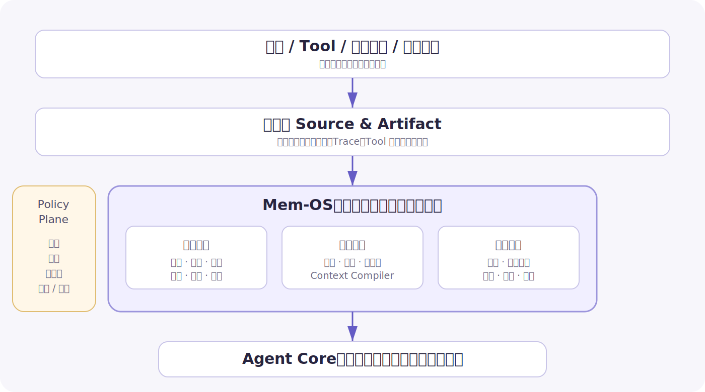
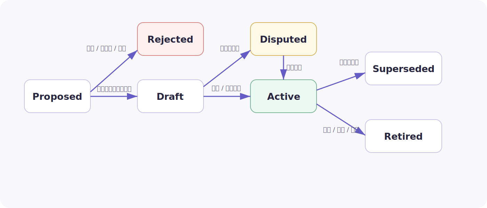
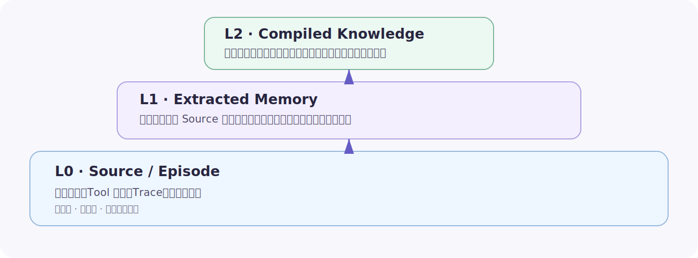
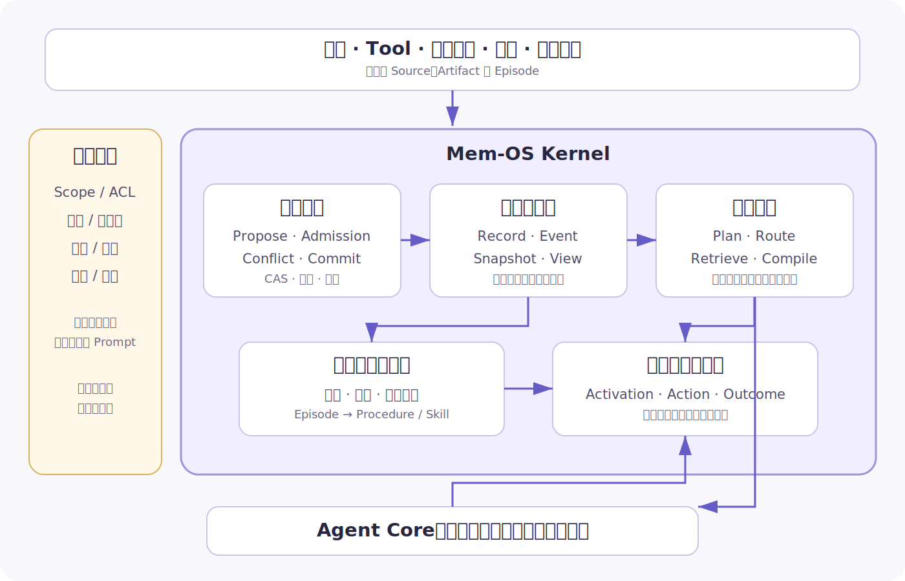

# Agent 系统构建中的 Mem-OS：让知识与经验形成复利

> [!abstract] 核心判断
> Agent Core 决定系统今天能不能完成任务，Mem-OS 决定系统半年后是否比今天更懂业务。
>
> Mem-OS 不是聊天记录、向量数据库或一个 `memory` Tool，而是知识与经验的生命周期内核：它把对话、文档、执行轨迹与反馈转成有来源、有范围、有时间、有版本的记忆；在任务发生时，把正确的少量内容编译进上下文；在结果出现后，再决定哪些经验应该修订、晋升为方法或退出系统。
>
> 它最重要的边界可以浓缩成一句话：**模型负责提出语义，确定性系统负责承诺状态。**

本文以《Mem-OS：真正构成 Agent 壁垒的知识与经验系统》PDF 中的源码研究和业务经验为底稿，但不复述其中大量产品目录、代码片段与业务名词，而是将它们抽象为三类普遍场景：受监管内容生产、个人工作助理和持续运营复盘。外部部分更新到 2026 年 7 月，主要采用官方文档、官方仓库和论文原文。

## 0. 为什么 Memory 需要成为一套 OS

很多 Agent 的“长期记忆”只有两行接口：

```python
memory.add(text)
memory.search(query, top_k=5)
```

它可以保存和召回文本，却没有回答生产系统真正困难的问题：

- 什么值得长期保存，什么只是一次性上下文和噪声？
- 保存的是事实、偏好、规则、经历，还是尚未验证的推断？
- 它对谁、在什么业务范围和时间范围内有效？
- 新旧信息冲突时，是覆盖、并存、降级、拒绝，还是等待人工确认？
- 哪些内容可以让模型总结，哪些必须逐字读取和确定性执行？
- 这条记忆后来是否真的改善了行动，还是只增加了上下文污染？
- 来源被纠正或删除时，它派生出的摘要、索引、向量和 Skill 怎样同步失效？

这些问题已经超出“存储 + 相似度检索”，进入了状态管理、权限、事务、编译、调度和评测。称它为 Mem-OS，不是为了再造一个宏大名词，而是为了强调：**Memory 是一种会变化、会冲突、会产生副作用的系统资源。**

### 0.1 先把六个容易混淆的对象分开

| 对象 | 回答的问题 | 生命周期 | 主要归属 |
|---|---|---|---|
| Context | 这一轮模型能看到什么 | 单次推理，随时重编译 | Context Compiler |
| Working State | 当前任务做到哪里 | 单个 Run，可检查点恢复 | Agent Runtime / Agent OS |
| Artifact | 一次工作产生了什么 | 原件长期保存、版本化 | Artifact Store |
| Knowledge | 当前可以被当作依据的事实与规则 | 有范围、时间与版本 | Mem-OS |
| Memory | 哪些历史状态和经历可能影响未来行动 | 选择性保留、持续修订 | Mem-OS |
| Skill / Procedure | 下次遇到相似情况应怎样做 | 经验证后发布，可回滚 | Mem-OS → Agent OS |

聊天消息不是天然的长期记忆；一次执行成功也不是天然的方法；上下文更不是权威存储。**Context 是 Mem-OS 面向某次决策编译出来的运行时产品。**

### 0.2 Memory 的价值不是“记得多”，而是“下一次做得更好”

一套知识与经验系统的实际价值，可以用一个非严格的乘法模型理解：

```text
Memory Value
= Truthfulness
× Activation Precision
× Reusability
× Learning Velocity
× Governance Trust
− Staleness
− Context Pollution
− Privacy & Compliance Risk
```

其中最容易被忽略的是 `Activation Precision`。一条内容本身完全正确，如果在错误用户、错误产品、错误渠道或已经过期的时间点被激活，Agent 仍然会做错。因而 Mem-OS 的北极星指标不是保存量、向量命中率甚至问答正确率，而是：

> 有证据的历史经验，能否在恰当时刻以恰当形式改变 Agent 的行动，并且这种改变能够被验证。

## 1. Mem-OS 在 Agent 系统中的位置

2025 年以后，行业讨论从 Prompt Engineering 转向 Context Engineering。Anthropic 将其定义为：每一次推理都从不断变化的信息宇宙里，选择最小而高信号的一组 Token；长任务则依赖 just-in-time 检索、压缩和结构化笔记，而不是把所有历史预先塞进 Prompt。[Anthropic 的 Context Engineering 实践](https://www.anthropic.com/engineering/effective-context-engineering-for-ai-agents)恰好说明了 Mem-OS 的输出边界：它最终要服务的不是搜索结果页，而是下一次模型决策。



可以把三层系统的职责划开：

- **Agent Core**：模型协议、Tool Calling 与最小 Agent Loop，负责一次次推理和行动。
- **Agent OS**：Task、Run、Step、权限、Worker、检查点、重试、恢复与完成判定，负责让工作持续、受控地运行。
- **Mem-OS**：Source、Episode、知识记录、版本、检索计划、上下文编译、归并、遗忘与评测，负责让系统跨任务积累可用经验。

三者通过 `task_id / run_id / agent_id / subject_id / knowledge_snapshot_id` 关联，但不要互相替代。运行到一半的步骤、未完成 Tool Call 和等待审批状态首先属于 Agent OS；任务结束后可复用的事实、坑点、偏好和操作方法才进入 Mem-OS 的候选区。把运行状态全部倒进长期记忆，会让系统充满半成品；把长期知识只藏在 Run checkpoint 里，则无法跨任务复用和治理。

一个实用定义是：

```text
Mem-OS
= Source & Episode Registry
+ Typed Memory Records
+ Write / Admission / Conflict / Commit
+ Retrieval Planner & Context Compiler
+ Consolidation & Procedure Compiler
+ Governance, Snapshot & Evaluation
```

这一定义与 2025 年 MemOS 论文“把记忆提升为一等系统资源”的方向一致，但工程落地无需先采用论文中的全部参数记忆、激活记忆和 MemCube 设计。更稳妥的顺序是先把明文知识和业务经验的来源、版本、写读协议做对，再依据评测决定是否引入更复杂的专用引擎。[MemOS 论文](https://arxiv.org/abs/2507.03724)

## 2. 不要统一存储“文本”，要统一管理不同真值类型

业务知识库最常见的根源性错误，是把所有内容都叫作 `memory`，再统一切块、Embedding 和 top-K。可落地的 Mem-OS 至少需要区分以下对象：

| 类型 | 含义 | 推荐不变量 | 典型例子 |
|---|---|---|---|
| Source / Artifact | 原始证据与业务产物 | 内容寻址、不可原地改写、可定位 | 文档、截图、Tool 返回、报告 |
| Episode | 一次真实观察或执行经历 | 只追加；摘要不能覆盖原始轨迹 | 一次诊断、创作、投放或故障处理 |
| Claim / Fact | 对世界的可验证陈述 | 带来源与双时间；冲突显式处理 | 产品状态、账户状态、环境事实 |
| Preference | 某个主体的主观选择 | 绑定主体与范围；确认优先 | 用户偏好、团队工作习惯 |
| Policy | 必须服从的约束 | 权威发布、强版本、确定性执行 | 审核规则、法务原文、权限边界 |
| Procedure | 可重复执行的方法 | 有触发条件、前置条件和独立评测 | SOP、诊断流程、创作检查清单 |
| Summary / Index | 为读取效率生成的派生视图 | 可重建，不能成为唯一事实源 | 项目摘要、README、向量、图边 |
| Belief / Hypothesis | 尚未证实的推断 | 与事实隔离，必须显示置信度 | “某类时段可能更适合转化” |

这个分类不是文档标签，而是行为契约：

- Policy 不能被一次 Episode 或一个 Belief 覆盖；
- Preference 不能因为多个用户碰巧相同，就自动变成组织事实；
- Procedure 不能因为一次成功，就直接变成所有 Agent 必须遵循的 Skill；
- Summary 可以删掉重建，Source 却必须保留血缘；
- Index 失效时可以重放事件重建，不能反过来用索引内容覆盖权威记录。

PDF 里的三个业务实践正好给出互补证据：

1. 受监管内容系统证明，领域目录、实体消歧、规则优先级和逐字合规执行，比“更智能的相似度检索”更重要。
2. 个人工作知识库证明，写前读取、旧版本哈希、原子替换、备份、账本和回滚，比 `save(text)` 更接近真正的长期记忆。
3. 运营复盘证明，业务真正需要的不是一份更长总结，而是带 `trigger / scope / confidence / evidence` 的决策法则。

因此，Mem-OS 可以共用底层协议，却不应该抹平领域 Schema。保险产品、软件仓库、广告账户、个人偏好和客服政策需要不同的实体、优先级和准入规则；所谓“通用 Memory 平台”，通用的是生命周期内核，不是业务知识的形状。

## 3. 写入内核：把“记住”设计成受控提交

错误信息进入短期 Context，只会伤害一次运行；错误信息进入长期层，会在未来反复激活。因此，长期记忆通常应优先优化 **Write Precision**，而不是追求“什么都别漏掉”。

### 3.1 不是保存，而是状态机



一次完整写入至少经过：

```text
Observe
→ Propose
→ Admission
→ Conflict Resolution
→ Validate / Review
→ Commit
→ Index
→ Snapshot
```

关键原则是 **Agent proposes, controller commits**：

| LLM / Agent 适合做 | 确定性 Controller 必须做 |
|---|---|
| 理解对话和轨迹语义 | 验身份、权限与目标路径 |
| 找出候选事实、偏好和方法 | 验 Schema、范围、时间与敏感性 |
| 提出 create / merge / supersede 建议 | 做 CAS、幂等、原子提交与 Outbox |
| 生成候选完整内容 | 维护事件账本、索引、备份和回滚点 |
| 给出来源和理由 | 执行审核门禁与删除传播 |

模型可以犯语义判断错误，但它不应该有机会把一次不稳定输出直接变成不可追踪的长期事实。

### 3.2 一条可影响行动的记录，至少要带这些字段

```yaml
memory_id: mem_01J...
kind: procedure                 # episode / claim / preference / policy / ...
subject_id: project_42
scope: team                     # personal / project / team / global
status: active                  # draft / disputed / superseded / retired
content: ...
triggers:
  - task_type == incident_review
preconditions:
  - repository_resolved
confidence: 0.88
authority: team_reviewed
valid_from: 2026-07-01T00:00:00+08:00
valid_to: null
recorded_at: 2026-07-21T14:30:00+08:00
evidence:
  - source_id: run_123
    locator: step=18/tool=result
    content_hash: sha256:...
supersedes: []
revision: 3
expected_revision: 2
sensitivity: internal
```

字段越多不一定越好，但以下信息不能靠正文暗示：`kind`、`subject`、`scope`、`status`、`evidence`、`time`、`revision`。它们决定了系统能否正确合并和激活。

### 3.3 在线写入与后台归并承担不同职责

[LangGraph 的 Memory 概念](https://docs.langchain.com/oss/python/concepts/memory)把长期记忆分为 semantic、episodic、procedural，并区分 hot path 与 background 两种形成方式。这一划分已经足够指导工程决策：

| 路径 | 适合写入 | 不适合写入 |
|---|---|---|
| 在线 Hot Path | 用户明确要求记住、刚确认的配置、明确纠错、必须立即生效的偏好 | 跨大量历史的归纳、复杂冲突消解、自动生成新 Skill |
| 后台 Consolidation | 重复模式、阶段总结、冲突检查、候选 Procedure、压缩与去重 | 需要立即生效但用户不可见的关键状态 |

后台任务不能只是“夜里再调用一次 LLM”。它仍需要输入快照、幂等键、重试分类、审核策略和与在线写入相同的 Commit 协议。否则同一批对话重跑两次，就可能制造两套互相冲突的长期记忆。

### 3.4 冲突不是覆盖字符串，而是裁决状态

只用 `updated_at` 无法回答“这条事实什么时候有效”和“系统什么时候得知”。实际系统至少要区分：

- `valid_from / valid_to`：事实在业务世界中的有效时间；
- `recorded_at / superseded_at`：系统知道、替代它的时间；
- `authority`：用户明确确认、权威文件、Tool 观测还是模型推断；
- `relation`：`supersedes / contradicts / coexists_with / derived_from`。

冲突裁决可遵循一个简单顺序：先比主体与范围，再比权威等级，再比业务有效时间，最后才比记录时间和置信度。无法确定时进入 `disputed`，不要让模型在回答阶段临时猜谁更新。

2026 年的 [STALE](https://arxiv.org/abs/2605.06527) 进一步暴露了“隐式冲突”：后来的生活或环境变化并没有逐字否定旧记忆，却已使旧状态失效；即使系统取回了新证据，模型也可能继续接受问题中夹带的旧前提。这说明 freshness 不能完全交给生成模型，写入时应做显式状态裁决，读取时还要做 premise check。

更进一步，来源被删除或修正时，不能只删除一条向量。摘要、缓存结论、图边、Procedure 和 Skill 都可能是它的后代。2026 年 [MemoRepair](https://arxiv.org/abs/2605.07242) 所研究的 cascade repair，提示生产系统需要维护 `derived_from` 血缘，并先阻断失效后代的可见性，再重建和重新发布，而不是容忍修复窗口里继续使用旧知识。

## 4. 读取内核：Retrieval 的终点是 Context Compiler

“用户问题 → 向量检索 → top-K”只适合无强约束的资料问答。Agent 的行动会改变真实世界，读取过程必须同时理解任务、实体、权限、时间、知识类型和风险。

### 4.1 先生成 Retrieval Plan，再访问索引

一个成熟的读取计划至少包含：

```text
task_type / task_stage
subject_ids
allowed_scopes / allowed_kinds
valid_at / knowledge_snapshot_id
precedence / confidence floor
exactness / verbatim requirement
retrieval channels
token budget / latency budget
abstention policy
```

推荐的检索顺序是：

1. 先做 tenant、ACL、scope 和 sensitivity 过滤；
2. 解析用户、项目、产品、仓库、账户等实体；
3. 过滤 `status`、有效时间和知识快照；
4. 按 Policy、Fact、Preference、Procedure 等优先级选择通道；
5. 用目录或元数据做确定性导航；
6. 用 BM25 处理名称、ID、错误码和精确短语；
7. 用向量处理近义表达和探索性召回；
8. 只有多跳关系确实成为瓶颈时再进入图检索；
9. 做时间冲突、来源完整性、diversity 和风险重排；
10. 按知识类型编译成上下文块，而不是直接拼接原文。

向量检索在这里是一条通道，不是系统架构。

### 4.2 “裁决”与“研究”必须分成两条路

| 任务 | 首选方式 | 原因 |
|---|---|---|
| 产品 ID、配置项、政策优先级、法务原文 | 确定性实体与元数据检索 | 需要唯一命中、版本与拒答能力 |
| 开放研究、案例类比、跨文档归纳 | BM25 + Vector + 多查询探索 | 可以扩大召回，再由证据综合 |
| 历史状态查询 | 时间索引 + 版本快照 | “当时正确”不等于“现在有效” |
| 经验方法选择 | Trigger + Preconditions + Episode 相似性 | 相似主题不等于相同执行条件 |

受监管内容系统中的“产品级规则命中即停止”“合规原文不得改写”，并不是特殊业务技巧，而是普遍的检索优先级和执行权限设计。把产品特例、行业规则和通用规范全部丢给模型，等于把本应确定的 Policy Resolution 重新变成概率问题。

### 4.3 Context Compiler 决定“以什么形式记起”

同一条记录进入模型时，不应只有一段 `text`：

- **Policy** → `VerbatimBlock`：逐字、版本锁定、不可改写；
- **Fact / Claim** → `EvidenceBlock`：内容、有效时间、权威性和引用；
- **Preference** → `PreferenceBlock`：主体、范围、确认状态，不能表述成事实；
- **Procedure** → `InstructionBlock`：触发器、前置条件、步骤、失败模式；
- **Episode** → `ExampleBlock`：作为类比证据，不直接升级为规则；
- **Belief** → `HypothesisBlock`：显式置信度，并要求不得当作事实陈述。

然后按任务目标和 Token 预算选择分辨率：

| 驻留层 | 放什么 | 何时使用 |
|---|---|---|
| Core | 当前身份、任务、硬权限、快照 ID | 始终可见，但必须很小 |
| Working | 当前步骤、最近 Tool 结果、待确认项 | 当前 Run 内维护 |
| Retrieved | 少量匹配的事实、规则、偏好和方法 | 每次推理按计划装配 |
| Source | 原文、完整轨迹、截图、报告 | 需要核证或深入研究时展开 |

这与 just-in-time context 的思路一致：系统常驻的是路径、ID、索引和最小状态，Agent 在需要时才读取高分辨率材料。2026 年 [LongMemEval-V2](https://arxiv.org/abs/2605.12493) 中，基于文件组织历史轨迹、再让 coding agent 在 sandbox 内收集证据的方法优于论文中的强 RAG baseline，但代价是更高延迟。它支持的不是“文件一定胜过向量库”，而是一个更稳健的结论：**可导航结构和主动取证本身就是检索能力；在线系统应把低延迟确定性路径与高成本探索路径分开。**

## 5. 生长内核：从经历到能力，而不是从对话到摘要

如果系统每天只生成更多总结，它会越来越像一间堆满会议纪要的仓库。真正的学习发生在三层之间：



- **L0 Source / Episode**：保留原始证据和完整轨迹，不可变、可审计；
- **L1 Extracted Memory**：从一条或少量来源提取事实、偏好、候选规则，始终带血缘；
- **L2 Compiled Knowledge**：跨经历去重、解决冲突、验证后形成画像、Policy、Procedure 和索引。

没有 L0，系统无法解释和修复 L2；只有 L0，Agent 每次都要重新阅读海量历史。Mem-OS 的主要工作，就是安全、可逆地把 L0 编译成 L1 和 L2。

### 5.1 非破坏性归并

传统总结会产生不可逆信息损失：新摘要覆盖旧摘要，一旦模型遗漏细节，证据就消失了。更稳妥的方式是：

- 原始 Episode 永不因归并被改写；
- Summary、主题聚类和图连接都是可重建派生物；
- merge / split / update 作用于可见组织结构，不作用于原始证据；
- 任何编译知识都能沿 `derived_from` 回到来源；
- Token 紧张时收缩“可见表面”，需要时再向归档证据有界展开。

2026 年 [All-Mem](https://arxiv.org/abs/2603.19595) 将这一思路实现为在线可见表面与离线拓扑整理，并强调保留不可变证据。其论文结果不能直接外推到具体业务，但“非破坏性归并 + 有界展开”是很好的系统不变量。

### 5.2 程序性知识才是经验复利的关键跃迁

“上次发生了什么”是 Episode；“下次在什么条件下，按什么步骤做，遇到什么现象应停止”才是 Procedure。

一条可发布 Procedure 至少要有：

```yaml
name: 线上故障初步诊断
scope: team
triggers:
  - alert_type == latency_spike
preconditions:
  - deployment_version_resolved
steps:
  - pin current run and knowledge snapshot
  - compare deploy timeline with metric inflection
  - inspect dependency errors before scaling workers
failure_modes:
  - telemetry_missing
  - concurrent_rollout
evidence:
  successful_runs: [run_123, run_456]
  failed_runs: [run_388]
validation:
  holdout_pass_rate: 0.91
  last_evaluated_at: 2026-07-18
status: active
```

推荐的晋升链路是：

```text
多个 Episode
→ 发现重复策略或坑点
→ 生成候选 Procedure
→ 去隐私与限定 Scope
→ fresh-context / holdout 评测
→ 人工或 Policy 审核
→ 发布为 Procedure / Skill / 规则代码
→ 记录 Activation → Action → Outcome
→ 修订、降级或退役
```

这里 `fresh-context` 很重要：如果评测时仍把原始成功轨迹全部给模型，测到的只是复述，不是方法在新任务中的迁移能力。

### 5.3 跨主体晋升必须比个人学习更谨慎

个人或单项目经验不能自动变成团队知识。一个较安全的晋升漏斗是：

```text
personal / run
→ repeated candidate
→ anonymized cluster
→ project candidate
→ multi-case validation
→ team review
→ team procedure
→ organization policy（极少）
```

每次扩大 Scope，都意味着潜在影响面和隐私风险增大，因而应提高证据数量、场景多样性和审核等级。所谓“组织记忆”，不是把所有人的记忆放进同一个 Namespace，而是让经过脱敏、验证和授权的知识获得更广的可见范围。

## 6. 一套可落地的参考架构



架构中的关键组件并不要求一次全部建设，也不绑定某个数据库：

1. **Source & Episode Registry**：保存对话、文档、Tool 结果、Trace、反馈和 Artifact 的不可变引用、哈希与定位信息。
2. **Write Kernel**：接收 Memory Proposal，执行准入、Schema、隐私、冲突、审核、CAS、幂等和提交。
3. **Knowledge State Layer**：事件账本是权威历史，Record View 是当前状态，Snapshot 固定一次任务所见版本。
4. **Index Adapters**：目录、元数据、BM25、Vector、Graph、Temporal 都是可重建的读取加速结构。
5. **Retrieval Planner & Context Compiler**：按任务、实体、权限、时间和风险选择知识，并编译为类型化 Context Block。
6. **Consolidator & Procedure Compiler**：后台执行去重、压缩、时间冲突处理、候选方法提炼和 Scope 晋升。
7. **Memory Bench & Outcome Ledger**：记录哪条知识被候选、淘汰、注入、采用以及结果怎样，为评测和修订提供依据。
8. **Governance Plane**：统一身份、ACL、敏感性、保留期、审批、审计、删除与发布策略。

### 6.1 最小 API 不需要很多

```python
propose(memory_proposal) -> proposal_id
review(proposal_id, decision)
commit(proposal_id, expected_revision) -> memory_revision
query(retrieval_plan) -> retrieval_result
get_source(evidence_ref) -> artifact
record_usage(memory_usage_event)
record_feedback(memory_feedback)
supersede(memory_id, proposal)
forget(subject_id, scope, reason)
build_snapshot(scope) -> knowledge_snapshot
```

最容易被省略、却最重要的是 `record_usage`。如果系统只记录“写了什么”，不记录“在哪次任务被激活、是否进入上下文、模型是否采用、最终结果如何”，就无法区分无用记忆、错误激活和真正有效的经验。

### 6.2 Markdown、数据库和图不是互斥选项

文件系统非常适合作为人和 Agent 都能阅读的 Published View：目录表达领域结构，README 提供渐进导航，Git 提供差异和审核，全文搜索处理精确文本。LangChain 目前的 [Deep Agents Memory](https://docs.langchain.com/oss/python/deepagents/memory) 也直接采用文件式持久记忆，并把 Skill 视为按需加载的程序性记忆。

但文件不应该独自承担并发事务、事件账本、ACL、后台 Job 和使用归因；向量库也不应该成为权威事实源。一个务实组合通常是：

```text
Object Storage / Git     保存原始 Source 与可读 Published View
SQL / Event Log          保存记录、版本、关系、事务和审计
BM25 / Vector / Graph    保存可重建索引
Queue / Worker           执行解析、归并、Embedding 和评测
```

技术选型应服从对象和不变量，而不是反过来让所有知识迁就某个“Memory 数据库”的 Schema。

## 7. 治理：可信比“自动学习”更重要

当前托管产品正在收敛一些基础能力。AWS AgentCore Memory 已把原始事件与长期提取记录分开，提供 semantic、preference、summarization、episodic 等策略和分层 Namespace；Google Vertex AI Memory Bank 也以不可变 Scope 约束生成和检索。这些产品说明 Scope、Namespace、结构化元数据与 CRUD 已成为基础设施能力，但并不替代业务自己的真值类型和准入规则。[AWS AgentCore Memory](https://docs.aws.amazon.com/bedrock-agentcore/latest/devguide/memory-terminology.html)；[Google Vertex AI Memory Bank](https://cloud.google.com/vertex-ai/generative-ai/docs/agent-engine/memory-bank/fetch-memories)

生产系统还应守住几条硬边界：

- **最小可见性**：默认不把个人记忆注入无关任务；跨用户、项目、团队必须先过 Scope 和 ACL。
- **高风险确定性**：Policy、金额、配置和法务原文由结构化字段或确定性代码执行；模型可以解释，不能擅自改写。
- **知识快照**：每个 Run 固定 `knowledge_snapshot_id`，否则同一任务无法复现，长任务还可能前后使用不同版本。
- **索引可重建**：向量、摘要和图边属于派生数据，索引漂移要能检测和重放修复。
- **完整删除语义**：`expire` 是停止用于当前决策，`supersede` 是被新版本替代，`forget` 是连同派生数据删除，`compact` 是保留来源并重建短表示。
- **来源可核证**：重要结论至少能回到 `source_id + version + locator + content_hash`，而不是只显示一个相似文档标题。
- **可回滚发布**：新 Procedure、Policy 和大范围知识晋升应像代码一样经过候选、评测、审核、灰度和回滚。

自动学习系统最危险的不是“不够聪明”，而是悄悄改变行为且无法解释。用户信任来自可见的记忆、明确的作用域、可纠正的状态和真正有效的删除，而不是来自“我们会记住你的一切”。

## 8. 评测：会回答历史问题，不等于会从经验中工作

近两年的评测明显从静态记忆问答转向 Memory-Agent-Environment 闭环：

- [MemoryAgentBench](https://arxiv.org/abs/2507.05257) 把检索、测试时学习、长程理解和冲突/选择性遗忘拆开评估；
- [MemoryArena](https://arxiv.org/abs/2602.16313) 让多 Session 子任务相互依赖，要求 Agent 从早期行动和反馈中提炼经验，再用于后续决策；
- LongMemEval-V2 不只问用户说过什么，而是检查 Agent 是否记住环境静态状态、动态变化、工作流、反复踩坑点和问题前提；
- [WorldMemArena](https://arxiv.org/abs/2605.29341) 将写入、维护、检索和使用拆成可观察阶段，并发现“写得好、存得好”并不保证最终会正确使用多模态经验。

这带来一个直接结论：Mem-OS 必须分阶段评测，而不是只测 Recall@K。

| 阶段 | 关键问题 | 推荐指标 |
|---|---|---|
| Write | 该记的是否记了，不该记的是否挡住 | Write Precision / Recall、重复率、越权写入率 |
| Maintain | 新旧事实能否正确演化 | Conflict Resolution、Stale Escape、Provenance Coverage |
| Retrieve | 是否在正确场景激活正确内容 | Activation Precision / Recall、Near-miss Silence、延迟与 Token |
| Compile | 是否以正确权限和形式进入上下文 | Policy Verbatim Rate、Source Coverage、Context Pollution |
| Use | Agent 是否真正采用且做对 | Action Uplift、Task Success、Negative Transfer |
| Evolve | 错误能否修订、回滚和遗忘 | Rollback Success、Cascade Repair、Deletion Completeness |

其中两个最高层指标是：

```text
Action Uplift
= Task Success(with memory) − Task Success(without memory)

Negative Transfer
= Failures caused by activated memory / Tasks using memory
```

一套最小业务 Memory Bench 应覆盖：

1. 同名实体、别名和不同版本能否正确消歧；
2. 用户、项目、渠道或租户之间是否严格隔离；
3. 高优先级规则命中后是否停止加载低优先级冲突规则；
4. 过期知识、隐式冲突和问题中的错误前提能否被识别；
5. Trigger 相似但不满足条件的 near-miss 场景是否保持沉默；
6. 两个并发更新能否阻止丢失写入，同一后台任务重跑是否幂等；
7. 删除 Source 后，摘要、索引、图边和 Procedure 是否同步失效；
8. 候选 Procedure 在新鲜上下文和 holdout Case 上是否真的提升成功率；
9. 错误记忆注入时，系统是否能够拒答、降级或回到原始证据；
10. 使用记忆的收益是否超过额外延迟、Token 和维护成本。

评测时必须固定模型、Prompt、Tool、知识快照与预算。不同论文或厂商的宣传分数如果模型、数据和上下文预算不同，不能拼在一起做技术选型。

## 9. 建设路线：先补控制面，再追求复杂检索

### P0：先得到一套不会失控的 Memory Store

第一阶段不需要图数据库，也不需要自动生成 Skill：

1. 定义 `Source / Episode / Claim / Preference / Policy / Procedure` 的最小 Schema；
2. 所有有效记录带 `scope / status / evidence / time / revision`；
3. 建立 Proposal → Admission → Commit，支持 CAS、幂等、审计和回滚；
4. 把索引降为可重建派生物，为每次任务固定知识快照；
5. 记录 `MemoryActivated / Applied / Confirmed / Contradicted` 事件；
6. 用真实历史失败建立第一版无 Memory baseline 和 Memory Bench。

P0 的完成标准不是“已经能语义搜索”，而是：一条知识从哪来、为什么生效、谁能看到、替代了什么、怎样回滚，都能被回答。

### P1：让正确知识在正确时刻出现

1. 建立 Retrieval Plan，先做实体、Scope、时间和 Policy 优先级；
2. 组合目录、元数据、BM25 与 Vector，分开裁决通道和探索通道；
3. 建立 Context Compiler，按 Policy、Fact、Preference、Procedure 选择不同表示；
4. 统一在线写入与后台归并的 Proposal / Commit 协议；
5. 增加双时间、显式冲突、premise check 和删除传播；
6. 将 Memory 使用事件与 Action、Outcome 关联，开始测收益和负迁移。

### P2：让经验稳定地变成组织能力

1. 从重复成功与失败 Episode 提炼候选 Procedure；
2. 建立 fresh-context、holdout、人工审核、灰度和回滚发布链；
3. 建立 personal → project → team 的脱敏与晋升机制；
4. 只有当评测证明目录、全文和向量长期无法解决多跳关系或时间演化时，再 POC 图记忆；
5. 只有当现有协议和数据规模出现明确瓶颈时，再比较 Mem0、MemOS、Graphiti、Hindsight 或托管 Memory 服务。

不要从“应该选哪个向量库”开始。最先决定系统上限的，是 Schema、来源、准入、冲突和评测；底层索引可以替换，错误的知识语义很难事后补救。

## 10. 真正的壁垒在哪里

模型、Embedding、向量数据库和 Memory API 都会越来越标准化。难以复制的部分是：

1. **领域 Schema**：系统知道什么叫产品、项目、账户、规则、配置、偏好、失败和方法；
2. **知识编译器**：能把文档和轨迹稳定地变成有来源、可执行的知识对象；
3. **准入与冲突策略**：知道什么不能记、什么只能作为推断、谁可以覆盖谁；
4. **激活策略**：能在正确实体、时间、权限和任务阶段想起正确内容；
5. **程序晋升机制**：能把多次经历变成经过验证、可回滚的 Procedure 或 Skill；
6. **评测与结果数据**：积累了真实 near-miss、冲突、过期、负迁移和业务结果 Case；
7. **治理信任**：用户能看到、纠正、限制和删除记忆，组织能审计每一次行为变化。

因此，Mem-OS 的终局不是让 Agent“什么都记得”，而是让它像一个可靠的资深同事：知道哪些经历值得保留，知道现在该想起什么，知道自己的判断来自哪里，也知道什么时候旧经验已经不能再用。

最后可以把全文压缩成三句话：

> **Memory 不是历史的堆积，而是对未来行动有约束力的状态。**  
> **经验不会因为被保存而自动成为能力，它必须经过编译、验证和发布。**  
> **模型可以提出知识，但只有受治理、可回滚、可评测的系统，才有资格让知识长期生效。**

## 参考资料

- Anthropic, [Effective context engineering for AI agents](https://www.anthropic.com/engineering/effective-context-engineering-for-ai-agents), 2025-09-29.
- LangChain, [Memory overview](https://docs.langchain.com/oss/python/concepts/memory), 持续更新。
- LangChain, [Deep Agents Memory](https://docs.langchain.com/oss/python/deepagents/memory), 持续更新。
- Li et al., [MemOS: A Memory OS for AI System](https://arxiv.org/abs/2507.03724), 2025.
- Hu et al., [Evaluating Memory in LLM Agents via Incremental Multi-Turn Interactions](https://arxiv.org/abs/2507.05257), ICLR 2026.
- He et al., [MemoryArena: Benchmarking Agent Memory in Interdependent Multi-Session Agentic Tasks](https://arxiv.org/abs/2602.16313), 2026.
- Wu et al., [LongMemEval-V2: Evaluating Long-Term Agent Memory Toward Experienced Colleagues](https://arxiv.org/abs/2605.12493), 2026.
- Liu et al., [WorldMemArena: Evaluating Multimodal Agent Memory Through Action-World Interaction](https://arxiv.org/abs/2605.29341), 2026.
- Lv et al., [All-Mem: Agentic Lifelong Memory via Dynamic Topology Evolution](https://arxiv.org/abs/2603.19595), 2026.
- Chao et al., [STALE: Can LLM Agents Know When Their Memories Are No Longer Valid?](https://arxiv.org/abs/2605.06527), 2026.
- Zhao et al., [MEMOREPAIR: Barrier-First Cascade Repair in Agentic Memory](https://arxiv.org/abs/2605.07242), 2026.
- AWS, [Amazon Bedrock AgentCore Memory terminology](https://docs.aws.amazon.com/bedrock-agentcore/latest/devguide/memory-terminology.html), 持续更新。
- Google Cloud, [Vertex AI Memory Bank: Fetch memories](https://cloud.google.com/vertex-ai/generative-ai/docs/agent-engine/memory-bank/fetch-memories), Preview 文档。
