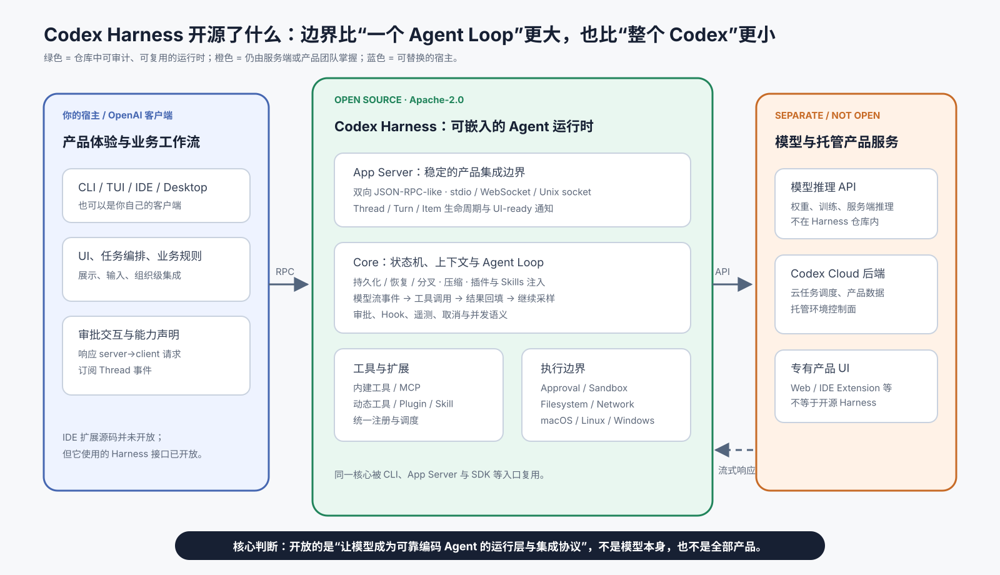
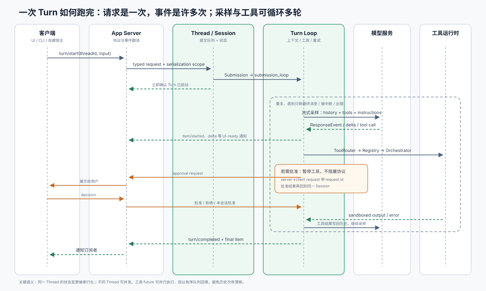
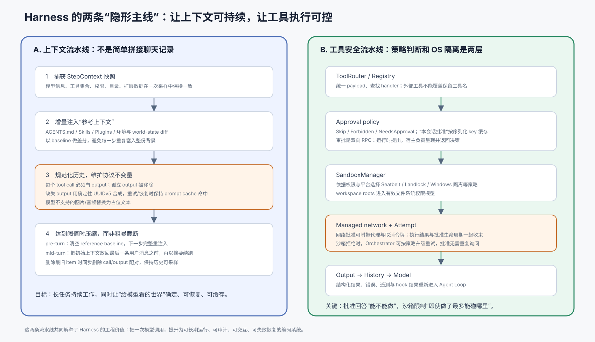

# Codex Harness 开源实现详解

> [!abstract] 一句话结论
> 这次真正重要的开放，不是“又开源了一个会调用 shell 的 Agent Loop”，而是把 OpenAI 自己用来承载 Codex 多种客户端的**产品级 Agent 运行层** 暴露出来：它负责 Thread/Turn/Item 生命周期、上下文构建与压缩、流式模型交互、工具路由、审批与沙箱、持久化与恢复，以及面向客户端的双向协议。模型权重、推理服务、Codex Cloud 后端和 IDE 扩展本身不在这个开放边界内。

本文适合放在源码旁边读。所有“源码事实”均固定到 OpenAI Codex 仓库提交 [`daa48072`](https://github.com/openai/codex/tree/daa48072f4f507221da313a748c3f7c551ae5500)（本地调研快照时间：2026-08-21），避免主分支继续演进后行号漂移。

> [!info] “近期开源”在时间上指什么
> App Server 的架构公开说明发布于 **2026-02-04** ；OpenAI 又在 **2026-08-19** 的《Codex as a platform》中正式把 Codex 定位为可供第三方构建产品的 **open agent harness** ，并同步给出开放组件与未开放组件清单。因此这不是 8 月 19 日突然出现的一次性代码投放，更像是：持续在 `openai/codex` 中开发的 Core/App Server，被明确确立为公开的平台边界。[2 月 App Server 文章](https://openai.com/index/unlocking-the-codex-harness/)；[8 月平台文章](https://learn.chatgpt.com/blog/codex-as-a-platform)

## 0. 先统一概念：模型、Harness、客户端不是一回事

理解 Codex 最关键的第一步，是把三层拆开：

| 层 | 回答的问题 | Codex 中的对应物 |
|---|---|---|
| 模型 | 下一步应该输出文本，还是调用什么工具？ | 远端模型与 Responses 流式接口 |
| Harness | 如何把一次次模型推理变成可持续、可控、可恢复的工作？ | `codex-rs/core`、工具系统、沙箱、持久化、App Server |
| 客户端 / 产品 | 用户如何发起、观察、干预和组织任务？ | CLI/TUI、桌面端、IDE、Web，或你自己的宿主 |

OpenAI 对 Harness 的定义也不是单一循环：它管理上下文、推理、工具、操作边界、审批和任务连续性；官方称 CLI、IDE、Codex Web 和 macOS App 由同一 Harness 驱动。[官方开放说明](https://openai.com/index/unlocking-the-codex-harness/)；[Codex as a platform](https://learn.chatgpt.com/blog/codex-as-a-platform)



### 这次到底开了什么，没开什么

| 范围                          | 是否开放 | 精确理解                                                                   |
| --------------------------- | ---: | ---------------------------------------------------------------------- |
| Codex CLI 与 Rust workspace  |    是 | Apache-2.0；包含 Core、App Server、协议、工具、沙箱、存储、MCP、Skills、Plugins 等大量 crate |
| App Server                  |    是 | 将同一 Harness 暴露为双向 JSON-RPC-like 接口，供富客户端嵌入                             |
| SDK、Skills、Plugins 等相关集成组件  |    是 | 官方开放组件清单中的独立组成部分                                                       |
| 模型权重、训练与服务端推理实现             |    否 | Harness 调用模型服务，不包含模型本体                                                 |
| Codex IDE Extension 源码      |    否 | 官方明确标为未开放；它可以使用开放的 Harness 接口                                          |
| Codex Cloud 的完整后端、调度与产品基础设施 |    否 | Universal cloud environment 有开放部分，但托管控制面不等于仓库中的 Harness                |

边界依据见 [Open source at OpenAI](https://learn.chatgpt.com/docs/open-source)。所以，“Codex 开源了”是一种过宽的说法；更准确的说法是：**Codex 的 Agent Harness 与产品集成接口已经开放，而模型和完整托管产品没有开放。**

## 1. 宏观架构：它不是一个库，而是一组有清晰边界的运行时组件

从源码看，最值得学习的并不是 crate 数量，而是职责分离：

```text
Host client
  │  bidirectional RPC: request / response / notification / server request
  ▼
app-server + app-server-protocol + transport
  │  typed operations + UI-ready events
  ▼
ThreadManager ── ThreadStore / Models / Skills / Plugins / MCP / Extensions
  │
  ├── CodexThread: 对外的双向会话句柄
  │     └── SessionIo: Submission queue / Event stream / status / termination
  │
  └── Session submission_loop
        └── run_turn
              ├── build context + compact + normalize
              ├── stream model response
              ├── ToolRouter → Registry → Orchestrator
              ├── approval → sandbox/network → execution
              └── output → history → next sampling step
```

仓库把这些能力进一步拆为 `core`、`app-server`、`app-server-protocol`、`app-server-transport`、`thread-store`、`rollout`、`sandboxing`、Linux/Windows 沙箱、`config`、`protocol`、`mcp-server`、`skills`、`plugin`、`models-manager`、`model-provider`、`otel`、`analytics` 等 crate。这里体现的是平台化设计：**Core 不承担所有外围职责，协议、存储、传输、平台隔离都可以独立演进和测试。**

### 四层职责边界

1. **App Server 是反腐层。** 它把内部变化频繁、粒度较细的 Core event，翻译为稳定、可直接驱动 UI 的 Thread/Turn/Item 通知；同时把批准、用户回答、动态工具回调等做成 server→client 请求。
2. **Thread/CodexThread 是多会话边界。** `ThreadManager` 维护内存中的 thread，并注入模型、认证、Skills、Plugins、MCP、存储等共享服务；`CodexThread` 提供提交和事件读取，而不是把 `Session` 内部状态直接暴露出去。
3. **Session 是单会话状态机。** 所有外部动作先成为 `Submission` 进入队列，`submission_loop` 串行解释操作；运行中的 turn、pending input、审批答复、取消、compact、rollback、review 都在这里汇合。
4. **Turn Loop 是推理—行动闭环。** 每个 sampling step 捕获一致的上下文快照，向模型流式采样，处理消息或工具调用；工具结果写回历史后继续采样，直到模型明确结束或任务被中断。

源码入口：[`ThreadManagerState`](https://github.com/openai/codex/blob/daa48072f4f507221da313a748c3f7c551ae5500/codex-rs/core/src/thread_manager.rs#L333)、[`CodexThread`](https://github.com/openai/codex/blob/daa48072f4f507221da313a748c3f7c551ae5500/codex-rs/core/src/codex_thread.rs#L145)、[`SessionIo`](https://github.com/openai/codex/blob/daa48072f4f507221da313a748c3f7c551ae5500/codex-rs/core/src/session/mod.rs#L362)、[`submission_loop`](https://github.com/openai/codex/blob/daa48072f4f507221da313a748c3f7c551ae5500/codex-rs/core/src/session/handlers.rs#L515)。

## 2. 一次 Turn 是怎样运行的



### 2.1 请求进入 App Server：有选择地并发，而非“一把全局锁”

客户端先完成 `initialize` / `initialized` 握手，再用 `thread/start`、`thread/resume` 或 `thread/fork` 获得会话，最后调用 `turn/start`。协议定义 Thread 包含 Turn，Turn 包含 Item；Turn 的进度通过多条通知流回客户端。[App Server 生命周期文档](https://learn.chatgpt.com/docs/app-server#lifecycle-overview)

App Server 收到 JSON 后：

1. 解析为强类型 `ClientRequest`；
2. 校验连接是否已初始化、是否声明了实验 API 能力；
3. 根据请求计算 serialization scope；
4. 同一 scope 排队，不相关 scope 则并发执行；
5. 将请求分派到对应 processor。

serialization scope 不是装饰性元数据，而是协议定义宏的一部分：可以按 global、thread id、thread path、command process、MCP OAuth server 等粒度串行化。[`ClientRequestSerializationScope`](https://github.com/openai/codex/blob/daa48072f4f507221da313a748c3f7c551ae5500/codex-rs/app-server-protocol/src/protocol/common.rs#L119) 与 [生成强类型请求的宏](https://github.com/openai/codex/blob/daa48072f4f507221da313a748c3f7c551ae5500/codex-rs/app-server-protocol/src/protocol/common.rs#L199)。

这是一个非常好的宏观设计：同一 Thread 内的 start/steer/interrupt 不会竞态，不同 Thread 又不会被全局锁互相阻塞。请求处理器据此排队或 `tokio::spawn`。[分发代码](https://github.com/openai/codex/blob/daa48072f4f507221da313a748c3f7c551ae5500/codex-rs/app-server/src/message_processor.rs#L881)

### 2.2 CodexThread/SessionIo：状态与 I/O 生命周期分离

`CodexThread` 被注释为 Core 与调用方之间的双向 conduit。它内部持有 `Arc<Session>` 和 `SessionIo`；后者只暴露：

- `Sender<Submission>`：向会话投递操作；
- `Receiver<Event>`：读取会话事件；
- `watch` 状态通道：订阅运行状态；
- termination future：等待完整关闭。

这样的分离解决了两个问题：一是 Session 状态仍由运行时所有，外部不能任意修改；二是 I/O 句柄的 drop 可以参与结束语义。提交操作时生成 UUIDv7 作为公开的、时间有序的 operation/turn id，并可携带 W3C trace context。[提交与事件接口](https://github.com/openai/codex/blob/daa48072f4f507221da313a748c3f7c551ae5500/codex-rs/core/src/session/mod.rs#L808)

### 2.3 `submission_loop`：所有控制面动作在一个地方汇合

`submission_loop` 不只接收用户消息，还处理：

- interrupt；
- exec / patch approval response；
- 普通用户问题与 permission request 的回答；
- dynamic tool response；
- MCP/config refresh；
- compact、rollback、review；
- shutdown。

因此它其实是 Thread 的 actor mailbox。批准回包、用户 steer、工具回调与普通 turn input 共用一致的会话所有权和顺序语义。这比把每种回调直接改共享状态更容易推理。

### 2.4 `run_turn`：真正的 Agent Loop

源码对核心循环的描述很朴素：模型返回 function call 时执行并把 output 放入下一次 sampling；只返回 assistant message 时记入历史并结束 turn。[`run_turn` 注释与入口](https://github.com/openai/codex/blob/daa48072f4f507221da313a748c3f7c551ae5500/codex-rs/core/src/session/turn.rs#L139)

实际实现则多做了很多产品级工作：

1. 采样前预测上下文阈值并压缩；
2. 解析本轮输入依赖的 MCP server；
3. 捕获 `StepContext`，让上下文、对模型声明的工具和工具执行共享同一视图；
4. 注入 world-state 差异、Skills、Plugins、hooks 与用户输入；
5. 克隆并规范化 history，构建 prompt；
6. 使用同一 `ModelClientSession` 完成该 turn 内的重试，保留 WebSocket 和 sticky routing；
7. 消费流式 `ResponseEvent`，产生 delta、item lifecycle、tool call；
8. 执行工具，把 output 写回 history，必要时继续采样；
9. 处理 pending/steer 输入、token budget、自动压缩与 stop hook；
10. 结束、失败或响应取消。

关键代码：[`StepContext` 捕获与 prompt 构建](https://github.com/openai/codex/blob/daa48072f4f507221da313a748c3f7c551ae5500/codex-rs/core/src/session/turn.rs#L293)、[模型 stream 与事件消费](https://github.com/openai/codex/blob/daa48072f4f507221da313a748c3f7c551ae5500/codex-rs/core/src/session/turn.rs#L2210)、[`ResponseEvent::Completed`](https://github.com/openai/codex/blob/daa48072f4f507221da313a748c3f7c551ae5500/codex-rs/core/src/session/turn.rs#L2541)。

> [!important] 一个易忽略的并发细节
> 一次模型响应可能产生多个工具调用。代码用 `FuturesOrdered` 容纳 in-flight 工具 future：执行可以重叠，但完成结果按插入顺序被消费。这里在吞吐量与对话历史的确定性之间做了明确取舍。[源码](https://github.com/openai/codex/blob/daa48072f4f507221da313a748c3f7c551ae5500/codex-rs/core/src/session/turn.rs#L2226)

## 3. 上下文工程：Harness 最容易被低估的部分

“把历史消息发给模型”远远不够。长时间运行的编码 Agent 必须保证：历史在裁剪、恢复、工具失败、模型能力变化之后仍满足 Responses 协议，并尽量利用 prompt cache。



### 3.1 Copy-on-write 历史与 baseline

`ContextManager` 维护 `Arc<Vec<ResponseItemEnvelope>>`，修改时 copy-on-write；同时保存 `history_version`、token 信息、reference context baseline 和 world-state baseline。[源码](https://github.com/openai/codex/blob/daa48072f4f507221da313a748c3f7c551ae5500/codex-rs/core/src/context_manager/history.rs#L43)

baseline 的意义是：系统指令、项目说明、Skills、环境等参考上下文不需要每次完整重复。运行时能记录“模型上次已经见过什么”，下一 step 只注入变化。但 compact/rollback 可能让 baseline 所指的内容从历史中消失，所以相关操作必须同步清空 baseline，下一步重新完整注入。

### 3.2 历史规范化是在维护协议不变量

`normalize.rs` 做了几件很细、但直接影响稳定性的事：

- function/custom/tool-search call 必须有配对 output；
- 孤立的 output 会被移除；
- 缺失 output 会合成错误结果，避免模型看到悬空调用；
- 模型不支持某种 input modality 时，图片/音频替换为文本占位；
- 合成 output id 不是随机 UUID，而是固定 namespace 的 UUIDv5。

最后一点尤其值得学习：注释明确说明，改变 namespace 会改变模型可见 id 并使 prompt cache 失效。[`SYNTHETIC_OUTPUT_ID_NAMESPACE`](https://github.com/openai/codex/blob/daa48072f4f507221da313a748c3f7c551ae5500/codex-rs/core/src/context_manager/normalize.rs#L14)。确定性 ID 让同一历史在重试和恢复后保持稳定，属于把“缓存经济性”落实进数据模型的设计。

### 3.3 Compact 不是普通摘要

压缩有至少两种位置语义：

- **pre-turn/manual compact** ：新用户消息还未进入；压缩后清空 reference baseline，使后续 step 完整重注入当前环境。
- **mid-turn auto compact** ：工具循环仍要继续。代码把初始上下文放在最后一条用户消息之前，让摘要维持在模型预期的位置，再继续尚未完成的模型/工具链。

压缩过程本身也是一次模型 turn，并复用一个 model client session；遇到 context overflow，会逐步移除最旧 item。新的历史保留必要的 annotated user message 和 summary checkpoint。[压缩位置语义](https://github.com/openai/codex/blob/daa48072f4f507221da313a748c3f7c551ae5500/codex-rs/core/src/compact.rs#L59)；[压缩执行](https://github.com/openai/codex/blob/daa48072f4f507221da313a748c3f7c551ae5500/codex-rs/core/src/compact.rs#L240)

因此，Codex 的上下文管理不是简单“超过 N token 就总结”，而是在维护三种连续性：**语义连续性、工具协议连续性、缓存连续性。**

## 4. 工具系统：定义、路由、执行策略彼此分离

### 4.1 Model-visible spec 与 runtime registry 分开

`ToolRouter` 明确区分：给模型看的工具 spec 与真正可 dispatch 的 registry。[源码](https://github.com/openai/codex/blob/daa48072f4f507221da313a748c3f7c551ae5500/codex-rs/core/src/tools/router.rs#L68)

模型可能返回 function call、custom tool call 或 tool-search call；router 先统一成 `ToolCall`，再构造 `ToolInvocation`，其中包含 Session、Turn/Step context、cancellation、diff tracker、调用来源与 payload，最后交给 registry。[调用归一化](https://github.com/openai/codex/blob/daa48072f4f507221da313a748c3f7c551ae5500/codex-rs/core/src/tools/router.rs#L147)

这意味着“模型协议差异”和“工具业务实现”没有揉在一起。以后新增调用类型或新 provider 时，可以在 router/adapter 层消化。

### 4.2 Registry 不只是一个 HashMap

`CoreToolRuntime` trait 除执行外，还统一了：

- 工具元数据和 readiness；
- 是否归属某个 MCP server；
- 并行执行能力；
- telemetry；
- pre/post hook payload 与 rewrite；
- 流式参数 diff consumer。

Registry 使用保序 `IndexMap`。可信内建工具发生重复注册被视为 invariant failure；外部工具发生冲突时保留先注册者，并禁止覆盖 `exec_command`、`shell_command` 等保留名称。[Runtime trait](https://github.com/openai/codex/blob/daa48072f4f507221da313a748c3f7c551ae5500/codex-rs/core/src/tools/registry.rs#L51)；[Registry](https://github.com/openai/codex/blob/daa48072f4f507221da313a748c3f7c551ae5500/codex-rs/core/src/tools/registry.rs#L270)

这是插件系统常见但关键的“命名空间防劫持”控制：扩展能力不能静默替换高权限内建工具。

### 4.3 Orchestrator 把策略与平台执行串起来

`ToolOrchestrator` 文件头直接写出了统一序列：

```text
approval → select sandbox → attempt →
if sandbox denial and policy allows: retry with escalated sandbox
```

源码入口：[orchestrator 模块](https://github.com/openai/codex/blob/daa48072f4f507221da313a748c3f7c551ae5500/codex-rs/core/src/tools/orchestrator.rs#L1)。

运行时首先从本轮环境获得 workspace roots 和 permission profile，计算 `Skip / Forbidden / NeedsApproval`；如果需要审批，向 Session 发起请求。之后 `SandboxManager` 选择平台隔离策略并执行。Managed network 并非简单布尔开关：批准过程可产生 execution proxy 和 cancellation token，执行成功后还可能延迟收束批准生命周期。

审批缓存也是按序列化 key 工作的：只有所有 key 都已批准才跳过询问；用户选择“本会话批准”时，每个 key 单独入库。[`ApprovalStore`](https://github.com/openai/codex/blob/daa48072f4f507221da313a748c3f7c551ae5500/codex-rs/core/src/tools/sandboxing.rs#L39)

> [!note] 两个控制层不要混为一谈
> Approval 是意图/策略层：是否允许这次动作。Sandbox 是能力边界层：即使动作获准，进程实际最多能访问什么。只做前者会把安全寄托在提示和用户判断上；只做后者又无法表达一次性批准、会话级批准、组织策略与明确禁止。

## 5. App Server：真正改变生态价值的开放接口

如果只开放 Core，第三方仍需理解大量内部事件和生命周期。App Server 的价值，是把 Harness 变成可被产品安全嵌入的进程边界。

### 5.1 它是 JSON-RPC-like，不是严格 JSON-RPC 2.0

线上的消息有 `method`、`params`、`id`、`result`、`error` 等 JSON-RPC 形状，但刻意不发送 `"jsonrpc": "2.0"` 字段，源码和文档都明确称其为 JSON-RPC 2.0-like。[协议源码](https://github.com/openai/codex/blob/daa48072f4f507221da313a748c3f7c551ae5500/codex-rs/app-server-protocol/src/rpc.rs#L1)；[消息格式文档](https://learn.chatgpt.com/docs/app-server#message-schema)

支持的传输包括：

- stdio：默认，newline-delimited JSON；
- WebSocket：实验性；
- Unix socket：通过标准 HTTP Upgrade 建立 WebSocket；
- off：不开放本地 transport。

WebSocket 有 capability token / signed bearer token 等认证方式；队列有界，过载时返回 `-32001`，客户端应做带 jitter 的指数退避。[传输与过载语义](https://learn.chatgpt.com/docs/app-server#transports)

### 5.2 为什么必须双向

普通“后端推送流”不足以承载编码 Agent，因为执行中途会出现必须由宿主回答的问题：

- 是否批准命令或补丁；
- 用户如何回答模型提出的问题；
- 是否允许特定权限；
- 动态工具由宿主执行后的结果是什么；
- MCP elicitation 的响应；
- 某些桌面能力的 attestation。

`OutgoingMessageSender` 维护 outbound channel、pending callback map 与 request context。server 发出带 id 的 request，返回一个 oneshot receiver；client response 再通过 pending map 回到原调用。[源码](https://github.com/openai/codex/blob/daa48072f4f507221da313a748c3f7c551ae5500/codex-rs/app-server/src/outgoing_message.rs#L103)

### 5.3 事件翻译是兼容层，不是无意义转发

Core 内部事件包括原始模型片段、工具生命周期、审批、diff、推理摘要、多 Agent 状态等。App Server 的 thread listener：

1. 从 `CodexThread.next_event()` 读取事件；
2. 更新本地 thread 状态；
3. 查找所有订阅该 thread 的连接；
4. 经 `event_mapping` 与 bespoke handler 转成稳定通知；
5. 对每个订阅连接 fan-out。

参见 [thread listener](https://github.com/openai/codex/blob/daa48072f4f507221da313a748c3f7c551ae5500/codex-rs/app-server/src/request_processors/thread_lifecycle.rs#L247) 和 [item event mapping](https://github.com/openai/codex/blob/daa48072f4f507221da313a748c3f7c551ae5500/codex-rs/app-server-protocol/src/protocol/event_mapping.rs#L1)。

这里付出的代价是翻译层代码较多，但收益很清楚：客户端不必跟随 Core 内部类型同步重构，可以围绕较稳定的 Thread/Turn/Item 语义开发。

### 5.4 协议是“从 Rust 类型生成”，不是手写多份 schema

请求定义宏同时生成：

- Rust `ClientRequest` enum；
- method name；
- serialization scope；
- JSON → typed request 转换；
- response 类型导出；
- TypeScript 与 JSON Schema 输出。

CLI 可执行：

```bash
codex app-server generate-ts --out ./schemas
codex app-server generate-json-schema --out ./schemas
```

生成物与运行中的 Codex 版本精确对应。[官方文档](https://learn.chatgpt.com/docs/app-server#message-schema)

此外，实验性 method/field 需要客户端在 `initialize.capabilities.experimentalApi` 中显式 opt-in；未声明就拒绝。这给协议演进增加了清晰的稳定性闸门，而不是让所有客户端被迫追主分支。

## 6. Thread 生命周期与持久化：Agent 是长期对象，不是一次 HTTP 请求

App Server 暴露的 Thread API 已经很完整：start、resume、fork、read、list、archive、unarchive、delete、unsubscribe、compact，以及 loaded/status 等运行态查询。Fork 可以复制到指定 `lastTurnId`，也可创建纯内存的 ephemeral fork。[API 概览](https://learn.chatgpt.com/docs/app-server#api-overview)

`ThreadManagerState` 持有 `Arc<dyn ThreadStore>`，而不是绑死某种落盘格式；启动时可选择 local/in-memory 实现，并启动迁移与压缩 worker。[存储注入](https://github.com/openai/codex/blob/daa48072f4f507221da313a748c3f7c551ae5500/codex-rs/core/src/thread_manager.rs#L372)；[`ThreadStore` trait](https://github.com/openai/codex/blob/daa48072f4f507221da313a748c3f7c551ae5500/codex-rs/thread-store/src/store.rs#L68)

这一层的设计含义是：

- 活跃 Session 是内存运行态，持久化 Thread 是恢复事实源，两者不能混为一个结构；
- `resume` 需要重建可采样 history 和当前配置，而不是反序列化整个 Tokio task；
- `fork` 是历史分支语义，不是复制一块共享可变内存；
- unsubscribe 与 unload 有 grace period，连接断开不应立即摧毁仍可能继续运行的工作。

## 7. 配置系统：普通配置和强制约束是两种东西

配置加载有明确优先级：package → admin → system → cloud → user → profile → cwd → tree → repo → runtime。项目级配置即使被读取，在不可信项目中也可保持 disabled；另有 project-local denylist，防止仓库配置修改 model provider、base URL 等敏感项。[配置层文档注释](https://github.com/openai/codex/blob/daa48072f4f507221da313a748c3f7c551ae5500/codex-rs/config/src/loader/mod.rs#L90)

更重要的是，源码把 **requirements** 与 **config** 分开：config 是偏好与默认值，requirements 是管理员强制边界。高优先级 config 不应绕过组织要求。这种二分值得任何企业级 Agent 平台照搬：不要把“用户希望怎么运行”和“系统允许怎么运行”塞在同一个可覆盖字典里。

## 8. 最值得借鉴的技术亮点

### 8.1 宏观设计

1. **用 App Server 隔离产品与内核。** 同一个 Harness 可以服务 TUI、桌面、IDE、Web worker 或第三方宿主；客户端围绕协议，而不是直接依赖 Core 内部结构。
2. **Thread actor + typed event stream。** 会话状态通过 submission mailbox 串行演化，输出通过事件流观察；既减少共享状态竞态，又天然适合交互式 UI。
3. **稳定的生命周期模型。** Thread/Turn/Item 足够抽象，可容纳聊天、命令、文件修改、工具调用、推理片段和多 Agent 行为。
4. **StepContext 快照。** 一次 sampling 使用同一份上下文、工具表和权限视图，避免“模型看到工具 A，执行时注册表已经变成 B”。
5. **策略层与隔离层分开。** Approval、requirements、sandbox、managed network 各自有明确职责。
6. **协议类型单一事实源。** Rust 类型、运行时解析、TS、JSON Schema 与实验性门控从同一定义产生。
7. **可替换存储与可恢复历史。** 持久化是核心抽象，不是 UI 层补丁。

### 8.2 代码级细节

1. **UUIDv7 作为提交/turn id** ：公开、时间有序，方便关联流式事件与追踪。
2. **W3C trace 穿过请求边界** ：App Server 与 Core 的异步工作可以串成一次 trace。
3. **`FuturesOrdered` 管理并行工具** ：并行执行、确定性回填。
4. **确定性 UUIDv5 修复历史** ：不变量修复不会破坏 prompt cache。
5. **保留工具名不能被扩展覆盖** ：防止插件劫持高权限调用。
6. **session approval cache 按 key 存储** ：组合动作可以精确复用批准，而不是粗暴“整个会话都放行”。
7. **同一 turn 复用 model client session** ：WebSocket 和 sticky routing 跨重试保持。
8. **bounded transport queue + overload code** ：把背压做成客户端能实现的明确契约。
9. **按资源计算 serialization scope** ：减少竞态但不牺牲跨 Thread 吞吐。
10. **baseline 在 compact/rollback 后失效** ：增量上下文优化有配套的一致性恢复路径。

## 9. 需要保持警惕的权衡与未开放部分

### 9.1 App Server 是强大的集成边界，也形成了第二套模型

Core event 与 UI-ready notification 并不一一等价，一部分需要 stateful bespoke handling。长期看，这会产生翻译维护成本：任何 Core 新能力都要决定是否、何时、以何种稳定语义进入协议。好处是客户端稳定，代价是 App Server 不是一个薄代理。

### 9.2 JSON-RPC-like 容易造成生态误判

它使用 JSON-RPC 的形状，但不声明 2.0；通用 JSON-RPC 库如果强制要求 `jsonrpc` 字段，可能无法直接使用。集成时应以生成 schema 和实际 Codex 版本为准，不要只凭协议名字推断兼容性。

### 9.3 实验 API 与主分支变化很快

WebSocket 明确是实验性且“不受支持”；protocol 也有实验字段门控。生产集成应固定 Codex 版本、生成对应 schema，并为 `-32001`、断线、resume、未知 notification 做兼容，而不是永远追 `main`。

### 9.4 开放 Harness 不等于复制完整 Codex 产品

仓库提供的是本地/嵌入式执行核心和协议。要复现产品体验，仍需要客户端 UI、身份与计费、模型访问、企业策略、托管工作区、观测与运维体系。官方也把三种集成层次分开：`codex exec` 适合有边界的脚本/CI，SDK 适合应用代码，App Server 适合需要完整生命周期与 UI 的产品集成。[集成选择](https://learn.chatgpt.com/blog/codex-as-a-platform)

### 9.5 安全能力需要正确部署才成立

沙箱、审批和 WebSocket auth 的存在不代表默认部署自动安全。官方文档特别提醒：非 loopback WebSocket 在 rollout 阶段可能默认允许未认证连接，远程暴露前必须配置认证；原始 token 不应直接放命令行。[官方安全说明](https://learn.chatgpt.com/docs/app-server#transports)

## 10. 建议的源码阅读顺序

不要从 6000 多个 Rust 文件平铺阅读。按“一个请求的生命史”走，理解会快很多。

### 第一遍：只建立骨架（约 2–3 小时）

| 顺序 | 文件 | 只回答一个问题 |
|---:|---|---|
| 1 | [`app-server-protocol/src/rpc.rs`](https://github.com/openai/codex/blob/daa48072f4f507221da313a748c3f7c551ae5500/codex-rs/app-server-protocol/src/rpc.rs#L1) | 线上消息有哪些形状？ |
| 2 | [`protocol/common.rs`](https://github.com/openai/codex/blob/daa48072f4f507221da313a748c3f7c551ae5500/codex-rs/app-server-protocol/src/protocol/common.rs#L199) | method、类型和串行化范围怎样成为单一事实源？ |
| 3 | [`message_processor.rs`](https://github.com/openai/codex/blob/daa48072f4f507221da313a748c3f7c551ae5500/codex-rs/app-server/src/message_processor.rs#L596) | 请求如何校验、排队和分派？ |
| 4 | [`thread_manager.rs`](https://github.com/openai/codex/blob/daa48072f4f507221da313a748c3f7c551ae5500/codex-rs/core/src/thread_manager.rs#L216) | Thread 拥有哪些共享依赖？ |
| 5 | [`codex_thread.rs`](https://github.com/openai/codex/blob/daa48072f4f507221da313a748c3f7c551ae5500/codex-rs/core/src/codex_thread.rs#L145) | 外部怎样提交操作、读取事件？ |
| 6 | [`session/handlers.rs`](https://github.com/openai/codex/blob/daa48072f4f507221da313a748c3f7c551ae5500/codex-rs/core/src/session/handlers.rs#L515) | Session actor 接受哪些控制动作？ |
| 7 | [`session/turn.rs`](https://github.com/openai/codex/blob/daa48072f4f507221da313a748c3f7c551ae5500/codex-rs/core/src/session/turn.rs#L139) | 模型—工具循环在哪里闭合？ |

第一遍先跳过巨大 match 的每个分支，也不要深挖每个 tool handler。你只需要能在纸上画出请求、状态、模型、工具、事件五者的关系。

### 第二遍：理解三个关键子系统（约 1 天）

1. **上下文** ：`context_manager/history.rs` → `normalize.rs` → `compact.rs`。重点追踪 baseline、call/output pairing 和 compact 后的历史形状。
2. **工具与安全** ：`tools/router.rs` → `registry.rs` → `orchestrator.rs` → `sandboxing.rs`。重点区分 spec、handler、approval policy、permission profile、OS sandbox。
3. **事件与双向交互** ：`thread_lifecycle.rs` → `event_mapping.rs` → `bespoke_event_handling.rs` → `outgoing_message.rs`。重点追踪一个 exec approval 从 Core 发出、到客户端、再回到 Session 的完整链路。

### 第三遍：选择一个真实场景纵向追踪

推荐追踪“模型请求执行一条需要批准的命令”：

```text
turn/start
→ Submission::UserInput
→ run_turn / model stream
→ OutputItemDone(function call)
→ ToolRouter::build_tool_call
→ ToolRegistry::dispatch
→ ToolOrchestrator::run
→ Session::request_approval
→ App Server server request
→ client decision
→ Submission::ExecApproval
→ sandbox attempt
→ function output into history
→ next sampling
→ agent message / turn completed
```

在 IDE 中给 `call_id`、`sub_id/turn_id`、`thread_id` 三类标识用不同颜色；它们分别关联工具调用、单轮工作和长期会话，混淆后很难读懂日志与事件。

### 第四遍：自己做一个最小客户端

实验目标不是做 UI，而是验证协议理解：

1. 启动 `codex app-server`（stdio）；
2. 发送 `initialize`，再发 `initialized`；
3. `thread/start`；
4. `turn/start`；
5. 持续读取通知；
6. 遇到 approval request 时显式拒绝一次；
7. resume 同一 thread，再执行一个无需批准的只读任务；
8. 生成当前版本 TS/JSON schema，与实际消息对照。

官方提供了最小 Node.js 示例，可作为起点，但生产代码还必须处理 stderr、进程退出、部分行、pending request、超时、取消、背压与恢复。[Getting started](https://learn.chatgpt.com/docs/app-server#getting-started)

## 11. 用第一性原则评价这套设计

编码 Agent 的基本问题不是“如何让模型调用一个命令”，而是：

1. 模型的世界状态不完整且会过期；
2. 一个任务跨越多次推理和多个外部动作；
3. 动作有副作用，且权限边界随项目、用户、组织、平台变化；
4. 用户必须能观察、插话、批准、拒绝、中断和恢复；
5. 网络、进程、模型流、工具都可能部分失败；
6. 长历史会超出上下文窗口并产生费用；
7. 多客户端需要稳定契约，而内核仍在快速演化。

Codex Harness 的大多数复杂度，都能还原为对这七个问题的回应。它真正值得学习的，不是某个 prompt 或工具列表，而是四个系统能力：

- **连续性** ：Thread、存储、resume/fork、compact；
- **确定性** ：actor mailbox、StepContext、历史不变量、有序回填；
- **可控性** ：requirements、approval、sandbox、network、hooks；
- **可嵌入性** ：App Server、双向请求、事件翻译、schema 生成、版本门控。

官方给出过一个能说明 Harness 影响量级、但不能直接等同于编码能力的实验：在 ARC-AGI-3 上，“保留推理 + 上下文压缩”使 GPT-5.6 Sol 得分从 13.3% 提升到 38.3%，同时输出 token 降为原来的约六分之一。[官方数据](https://learn.chatgpt.com/blog/codex-as-a-platform) 这只能证明特定模型、任务集和 Harness 配置的联合效果，不能据此推断任意软件工程任务都有同样增益；它仍然有力说明了一个事实：**Harness 不是中性管道，运行策略本身会显著改变模型表现与成本。**

这也给出了一个判断其他 Agent 框架是否“产品级”的简单标准：如果它只实现 model→tool→model，却没有并发顺序、历史修复、审批回路、平台隔离、协议版本和恢复语义，那么它实现的是 demo loop，不是 Harness。

## 12. 结论

Codex Harness 的开放价值可以概括为：**OpenAI 把“如何运行一个编码 Agent”从专有客户端内部细节，提升为可审计、可嵌入、可扩展的公共运行时边界。**

它最强的地方并非某一个新算法，而是把容易散落在产品各处的职责——上下文、状态、工具、权限、沙箱、持久化、事件、协议——组织成能长期演化的系统。最值得精读的代码不是 UI，也不是单个 tool handler，而是这些边界相接的地方：

1. App Server 的 typed request、serialization scope 与事件翻译；
2. CodexThread / SessionIo / submission loop 的 actor-like 状态模型；
3. Turn Loop 中 StepContext、模型流和有序工具并发；
4. History normalization 与 compact 的不变量；
5. Tool Registry、Approval、Sandbox 与 Managed Network 的分层。

同时必须保持边界意识：开放 Harness 让第三方能构建与 Codex 同类的运行层，但它不自动提供模型、完整托管后端、企业运维与 OpenAI 自己的产品体验。

---

## 资料与可复现性

### 一手资料

- [Unlocking the Codex harness: how we built the App Server](https://openai.com/index/unlocking-the-codex-harness/)
- [Codex App Server 官方文档](https://learn.chatgpt.com/docs/app-server)
- [Codex as a platform](https://learn.chatgpt.com/blog/codex-as-a-platform)
- [Open source at OpenAI](https://learn.chatgpt.com/docs/open-source)
- [openai/codex 仓库](https://github.com/openai/codex)
- [本文固定的源码提交](https://github.com/openai/codex/tree/daa48072f4f507221da313a748c3f7c551ae5500)

### 本文证据标记规则

- “官方称 / 官方定义”：来自上面 OpenAI 发布文或文档；
- “源码显示 / 实现中”：来自固定提交的永久链接；
- “判断 / 权衡”：是基于一手资料的工程分析，不代表 OpenAI 官方立场。

### 版本说明

本文调研于 2026-08-21。Codex 主分支和 App Server 实验 API 演进很快；结合未来代码阅读时，请先比较当前 commit，并重新生成对应版本的 TypeScript / JSON Schema。图均为本地可编辑 SVG，位于同名 `.assets` 目录。
