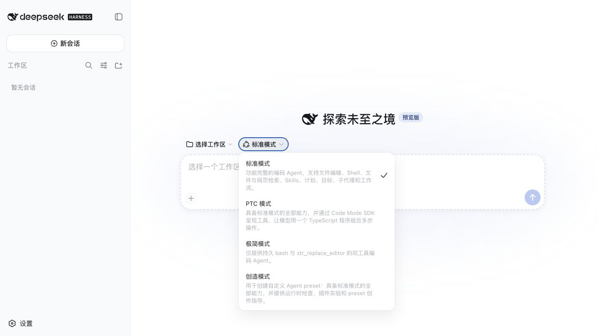
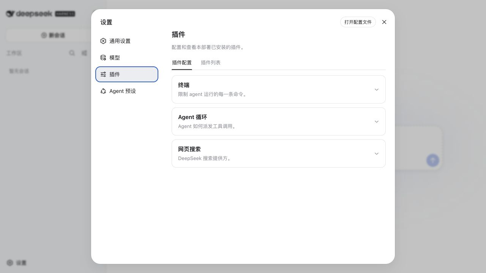
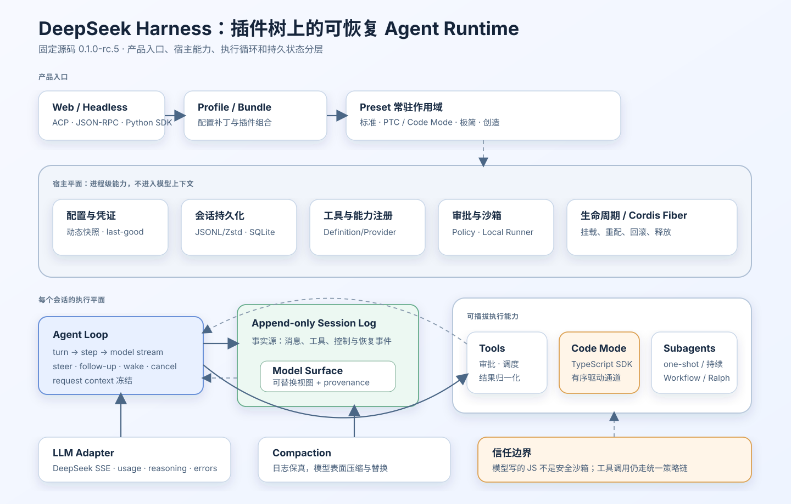
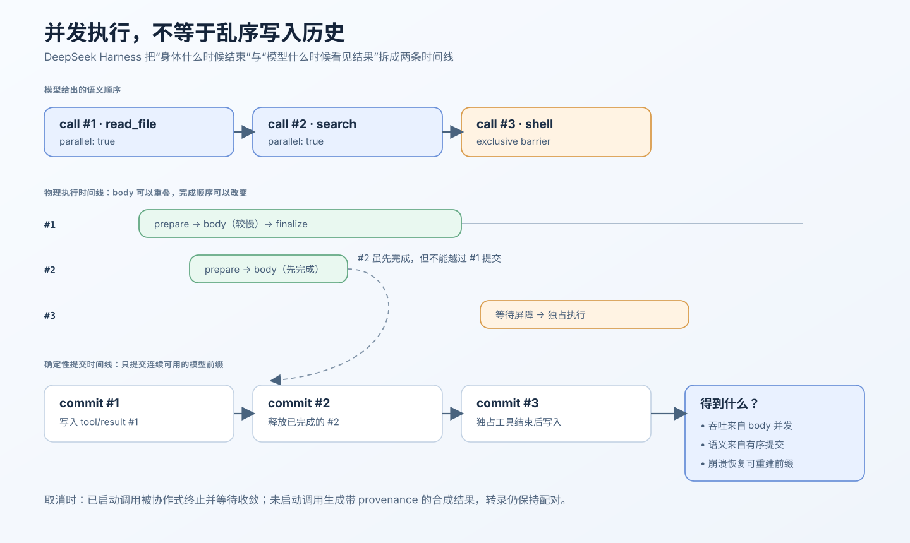

# DeepSeek Harness 源码深度解析：从插件树到可恢复的 Agent Runtime

如果只把 DeepSeek Harness 看成“DeepSeek 开源的另一个 Coding Agent”，会错过这个项目真正有价值的部分。它更像一套面向 Agent 产品的 **运行时内核与装配系统**：同一个宿主可以组合不同 preset（能力预设），让模型通过普通工具、TypeScript 程序、子智能体或工作流完成任务；与此同时，工具审批、沙箱、会话日志、上下文压缩、崩溃恢复和模型协议仍由统一的运行时约束。

我的核心判断是：

1. **产品上**，它不是一个只有聊天框的模型客户端，而是一个已经打通 Web、无头命令、ACP、JSON-RPC 和 Python SDK 的 Agent 开发环境。四个内置模式不是四份独立实现，而是同一宿主上的四种能力组合。
2. **工程上**，最强的不是插件数量，而是三组分离：插件装配与运行状态分离、append-only 事实日志与 model surface 分离、工具物理并发与语义提交顺序分离。这些分离共同服务于热重配、可恢复和可回放。
3. **算法上**，它没有提出一种新的模型训练算法，却实现了大量会直接改变轨迹分布的 runtime policy：何时把消息送入模型、哪些工具能并发、长上下文怎样压缩、子智能体拿到什么上下文、模型是逐个调用工具还是先写一段程序。Harness 在这里已经是推理算法的一部分。
4. **最值得复用的亮点**，是工具调度器允许 body 真并发、结果乱序完成，却只按模型生成顺序提交连续前缀。它同时保住吞吐、符合模型 API 约束的工具消息顺序，以及崩溃后的确定性重建。
5. **当前不宜高估的部分**，是项目仍处于 developer preview：Ralph 循环没有独立验收者，模型生成的 JavaScript 不是安全边界，会话格式还是 version 0，preset 热更新和持续子智能体也有明确的进程内限制。



*图 1：本文在固定源码上本地构建并启动 Web 端后截取。四种模式共享同一个产品入口，却装配不同的工具与运行能力；这正是“Harness 是能力组合层”最直观的产品证据。界面未配置 API Key，也没有发起付费模型请求。*

## 研究锚点与证据口径

本文固定在官方仓库 [`deepseek-ai/deepseek-harness`](https://github.com/deepseek-ai/deepseek-harness) 的提交：

```text
47f943859bef60e4160492346772ded9b24f765a
```

该提交对应 `dsh@0.1.0-rc.5`，提交时间为 2026-08-13。审查日期为 2026-08-14。所有源码链接都固定到这一个 SHA，而不是会继续移动的 `master`。仓库当时没有 Git tag 或 GitHub Release，因此包版本与提交哈希才是可复核基线。

## 一、先建立心智模型：Harness 究竟控制什么

在 [[AI Coding研发中的Harness与Loop构建]] 中，我曾把 Agent 结果写成：

$$
\text{Agent Performance} \approx \text{Model Capability} \times \text{Harness Quality}
$$

[[论文解读：Towards Long-Horizon Agents: A Survey]] 又给出一个更准确的系统表达：

$$
\text{Agent}=\pi_\theta \oplus H
$$

其中，$\pi_\theta$ 是模型策略，$H$ 是运行时 Harness。每一步真正喂给模型的上下文，不是环境历史的原样复制，而是 Harness 编译出的结果：

$$
c_t = H(o_{0:t}, a_{0:t-1}, s_t, p_t)
$$

这里的 $o$ 是观察，$a$ 是动作，$s$ 是持久状态，$p$ 是权限、预算和运行策略。Harness 决定哪些历史仍可见、工具结果以什么顺序出现、失败后怎样续跑、子智能体拿到多少上下文。这些选择会改变模型下一步的条件分布，所以它不是简单的“工程外壳”。

DeepSeek Harness 的价值，正是把这个抽象做成了一个可装配系统。Cordis 是它采用的 JavaScript/TypeScript 插件与服务框架；根目录的[架构文档](https://github.com/deepseek-ai/deepseek-harness/blob/47f943859bef60e4160492346772ded9b24f765a/docs/architecture.md#L9-L35)明确写出：模型适配器、工具注册、会话日志、Agent loop 都是插件。profile 负责选择整套运行配置，bundle 负责组合一组插件与配置补丁；二者最终都落实为 Cordis 插件树的装配。没有一个不可替换的“神圣核心”。

这带来一个很重要的理解：**DeepSeek Harness 的最小原子不是 Agent 类，而是可挂载、可重配、可释放的能力。Agent 是这些能力在一个 preset 作用域中的组合结果。**

## 二、产品形态：不是 Demo，而是一套 Agent 开发环境

### 2.1 五个入口，服务的是同一个 Runtime

固定版本提供了五种主要使用面：

| 入口 | 面向对象 | 适合的场景 |
|---|---|---|
| Web | 普通开发者与产品体验 | 选择工作区、preset、模型，管理会话与设置 |
| Headless | Shell 与自动化脚本 | 单次任务、CI 或批处理 |
| ACP stdio | 编辑器/Agent Client | 通过 Agent Client Protocol 接入 |
| JSON-RPC SDK | TypeScript 宿主 | 嵌入已有服务或桌面应用 |
| Python SDK | Python 工程 | 从 Python 创建会话和驱动任务 |

它没有把 TUI 当成已交付产品；文档里出现的 TUI 更像自定义 surface 的示例。这个边界很重要，因为“可以基于 SDK 做”和“仓库已经提供”不是一回事。

### 2.2 四个 preset 是四种产品主张

Web 端暴露四种模式：

- **标准模式**：文件编辑、搜索、Shell、网页搜索、Skills、计划/目标、子智能体和工作流都可用，是完整 Coding Agent。
- **PTC 模式**：产品文案中的 PTC 对应 Code Mode。能力与标准模式接近，但模型可以先写一段 TypeScript，通过生成的 typed SDK 组合多个工具调用。
- **极简模式**：只留下持久 Bash 与 `str_replace_editor`，刻意移除压缩、runtime context 等复杂机制，用来观察“最小 Harness”能走多远。
- **创造模式**：在标准能力之上增加运行时 inspect、mount、unmount 与 preset authoring，让模型帮助创建新 preset。

这里最有产品洞察的一点，是 DeepSeek 没有把“更多能力”当作单一方向。极简模式、标准模式和 PTC 模式实际上构成了一个很好的实验轴：可以比较工具暴露、上下文开销和计划表达方式对任务表现的影响。



*图 2：本地构建的插件设置页。界面把终端、Agent 循环和网页搜索显示为可配置插件组，产品层与底层“能力可装配”的工程模型一致。截图保持原始像素，仅改用正确的 JPEG 扩展名归档。*

### 2.3 产品闭环已经成形，但还不是成熟工作台

用户从选择工作区开始，选 preset 和模型，创建会话，再通过设置页配置模型、插件和 Agent preset。会话必须绑定工作区与模型配置，这让“代码所在环境”成为一等对象，而不是聊天附件。

但它还不是稳定发布的生产工作台：README 明确标注 developer preview；没有稳定迁移承诺；MCP client 虽然已经实现，默认并未预装 MCP server；配置的 MCP command 由宿主信任，并不自动受到 Agent 工具沙箱保护。换言之，产品骨架已经完整，长期兼容、企业治理和安全默认值仍在形成中。

## 三、总体架构：两个平面、三层组合、一个事实源



*图 3：根据固定版本的架构文档与核心源码重绘。宿主平面管理进程级能力；preset 为会话装配插件；Agent loop 以 append-only session log 为事实源，并驱动模型、工具、Code Mode、子智能体与压缩。*

把仓库数百个 package 压缩成运行时关系，可以看到两个平面：

1. **宿主平面** 管理配置、凭证、持久化后端、工具注册、审批策略、沙箱 runner、preset 生命周期。这些能力通常是进程级的，不应该整体进入模型上下文。
2. **会话执行平面** 管理某个 Agent 的 loop、inbox、模型请求、工具调用、model surface、压缩、子智能体和终止状态。

三层组合则是：

1. **Profile / Bundle**：选择一组插件并叠加配置 patch。
2. **Preset standing scope**：某个 preset 在进程内只挂载一次，形成常驻能力环境。
3. **Agent session**：从同一 preset 作用域派生会话实例；子 Agent 还能派生自己的子作用域。

最后，一个 append-only session log 是持久状态的事实源。模型真正看见的是由这份日志投影出来的 model surface。这个“事实源 / 视图”分离，是后面压缩、恢复与审计能够同时成立的根基。

## 四、仓库地图：大 Monorepo 的主干在哪里

固定快照包含约 238 个 pnpm workspace project。仓库体量很大，但主干可以按职责收敛为下表：

| 目录 | 职责 | 阅读优先级 |
|---|---|---|
| `apps/cli` | CLI、Web 服务入口、默认 profile 与 preset | 产品装配入口 |
| `packages/core/agent-loop` | turn/step、模型流、inbox 与工具调度 | 运行时主循环 |
| `packages/core/session` | 事件日志、model surface、崩溃修复 | 状态语义核心 |
| `packages/core/tools` | 工具定义、审批、调度、Code Mode | 动作执行核心 |
| `packages/preset/agent-presets` | preset 发现、挂载、版本代际 | 多形态 Agent 组合 |
| `packages/compaction/*` | 工具结果裁剪与模型摘要压缩 | 长上下文策略 |
| `packages/subagent/*` | one-shot 与 continuable 子智能体 | 多 Agent 生命周期 |
| `packages/workflow/*` | parallel/pipeline/phase/Ralph | 高层编排 |
| `packages/llm/llm-deepseek` | DeepSeek 官方协议适配 | 模型边界 |
| `packages/sandbox/*` | 策略与本地 OS 沙箱 | 权限边界 |
| `vendor/*` | Cordis 等 fork 与上游快照 | 框架来源与本地修改 |

行数和 package 数不应直接当作复杂度指标：仓库包含多语言文档、生成文件和大量细粒度 package。更有意义的事实是，DeepSeek 把 runtime seam 拆得极细，而且多数 seam 都能通过插件生命周期被替换或观察。

## 五、插件树：Cordis 提供范式，DeepSeek 补上生产级语义

### 5.1 哪些不是 DeepSeek 新发明的

“万物皆插件”的范式来自 Cordis。Cordis 的 context、service、effect、fork/fiber 生命周期，让一个插件既能注册能力，又能在配置变化或卸载时撤销副作用。因此，不应该把插件架构本身包装成 DeepSeek 的原创算法。

### 5.2 DeepSeek 真正增加了什么

仓库的 [`vendor/README.md`](https://github.com/deepseek-ai/deepseek-harness/blob/47f943859bef60e4160492346772ded9b24f765a/vendor/README.md#L29-L50)逐项列出本地 fork 的修改。最关键的增量包括：

- Fiber 可重入释放与 quiescence 加固，避免生命周期仍在异步执行时被错误回收；
- Loader / Include 的事务式 reconciliation 与失败回滚；
- 配置文件精确 watch，而不是粗粒度轮询整个目录；
- patch 对“后来插入的行”仍生效，并修复 include mutation 的串行化和死锁；
- 配置写入采用 durable、debounced、bounded retry；
- 配置值延迟解析，禁止部分容易造成不确定行为的 interpolation。

这些改动看起来不像模型算法，却决定了“动态组合 Agent”能否从漂亮抽象变成可靠产品。插件系统最难的从来不是 `register()`，而是重配中途失败、重复释放、旧任务尚未停稳、文件变更只写了一半时系统还剩下什么。

### 5.3 preset 的代际模型

[`agent-presets`](https://github.com/deepseek-ai/deepseek-harness/blob/47f943859bef60e4160492346772ded9b24f765a/packages/preset/agent-presets/src/index.ts#L241-L324)并不是每开一个会话就重新加载全部插件。它为每个 preset 建立 standing generation，也就是“常驻的配置代际”：同一代 preset 只挂载一次，多个 Agent 从它派生；文件改变后创建新 generation，旧会话继续绑定旧代，新会话进入新代。

这比“原地修改所有运行中对象”更容易保持会话语义一致，但固定版本也有边界：

- 变更检测主要看 composition 文件的 `mtime` 和 `size`，相邻 skill 或 asset 的变化不一定触发新代；
- superseded generation 不会在进程运行期间主动回收，watcher 也可能累积；
- 会话只有在尚未产生输出前才能切换 preset；
- preset 的 `trust` 更多是展示信息，用户 preset 本质上拥有接近 Shell 的宿主信任。

因此它实现的是**代际隔离**，还不是完整的长期热升级治理。

## 六、Agent Loop：一个 turn 为什么可以包含多次模型请求

初学 Agent loop 时，最容易把“一轮对话”等同于“一次模型调用”。DeepSeek Harness 明确拆成：

- **turn**：从一条用户输入开始，到模型不再请求工具、被取消或被策略终止；
- **step**：一次模型请求，加上这次请求产生的全部工具调用及结果。

因此，一个 turn 可以是：

```text
用户消息
  → step 1：模型请求 → tool calls → tool results
  → step 2：模型请求 → tool calls → tool results
  → step 3：模型请求 → 最终文本
  → turn end
```

[`agent.ts`](https://github.com/deepseek-ai/deepseek-harness/blob/47f943859bef60e4160492346772ded9b24f765a/packages/core/agent-loop/src/agent.ts#L113-L242)维护 `followup`、`steer`、`inject` 与 `cancel` 队列，并用 wake latch 避免“刚检查为空就错过新消息”的竞态。每个 step 开始前，loop 领取 inbox、拼接 prompt 与 runtime context，再冻结本次 request context。模型流式输出被逐块写成会话事件，工具调用随后进入调度器。

这里有两个不显眼但很重要的设计：

1. **inbox 先落 durable event，再改变内存队列。** 进程重启后可以从日志重建 follow-up、steer 和 inject 的领取关系；标识符还用于跨队列去重。
2. **request header 只在初始、恢复或配置变化时写完整快照。** 同一请求内看到的 adapter、默认参数和凭证选择是冻结的，动态配置不会在流式响应中途把一次请求撕成两种语义。

这说明主循环不只是 `while(tool_call)`；它是一个需要处理并发消息、动态配置和可恢复领取语义的小型状态机。

## 七、执行与并发：最快完成的工具为什么不能最先写入历史

假设模型一次生成三个工具调用：

```text
#1 read_file     可并行，耗时 500 ms
#2 search        可并行，耗时 100 ms
#3 shell         独占
```

最简单的并发实现会让 `#2` 先完成并先写回模型。问题在于，很多 provider 要求 tool result 与原始 tool call 保持合法配对和顺序；更严重的是，同一个轨迹在不同运行中会因时序抖动形成不同上下文。重放、缓存和崩溃恢复都会变得不稳定。

DeepSeek Harness 的做法是把执行拆成两层：

1. 工具 body 进入有界并发池，可以真实重叠；没有显式 `parallel: true` 的调用进入 exclusive barrier。
2. 每个调用完成后先保存结果，`commitReady()` 只提交从当前游标开始、已经连续就绪的模型前缀。



*图 4：根据 `tool-calls.ts` 和 Code Mode 驱动器重绘。图中 `#2` 先完成，却要等待 `#1`，随后二者按原顺序连续提交；独占调用 `#3` 形成屏障。*

核心逻辑集中在 [`tool-calls.ts`](https://github.com/deepseek-ai/deepseek-harness/blob/47f943859bef60e4160492346772ded9b24f765a/packages/core/agent-loop/src/tool-calls.ts#L121-L245)。取消时，已经启动的调用接收协作式 abort，并等待 body 收敛；尚未启动的调用不会凭空消失，而会生成带 provenance 的 synthetic call/result，使模型转录继续保持配对。

刚才证明的是：**确定性不要求单线程。只要把物理执行顺序与语义提交顺序分开，就可以在不污染轨迹的前提下获取并发吞吐。** 这是我认为整个项目最强、也最适合被其他 Harness 复用的实现亮点。

### 7.1 一个工具实际经历的完整管线

工具并不是 `handler(args)` 直接执行。它要穿过：

```text
definition prepare
  → pre-execute hooks
  → approval decision
  → monotonic policy guards
  → around-execute middleware
  → body
  → post-execute hooks
  → definition finalizer
  → immutable result
  → loop 持久化
```

“monotonic guard”意味着后层只能收紧权限，不能把前层已经拒绝的动作重新放开。输出还要过 JSON Schema 校验；给模型的 content 与给 UI 的 presentation 被分开。这样 UI 可以显示更丰富的结构，而不必把全部展示数据塞进模型上下文。

## 八、Code Mode / PTC：把工具选择问题改写成程序合成问题

普通 native tool calling 的控制流是：模型选一个或一组工具，Harness 执行，把结果送回模型，模型再决定下一步。步骤很多时，模型与服务端之间反复往返，轨迹变长，临时中间结果也不断占据上下文。

Code Mode 改成：Harness 根据当前工具生成 typed TypeScript SDK，模型先写一个程序，在程序里调用工具、过滤结果、循环或并发，最后只把 `print` 或返回值交回外层模型。

最小例子可以想成：

```ts
const files = await tools.search({ query: "AgentLoop" })
const selected = files.matches.slice(0, 5)
const contents = await Promise.all(
  selected.map((path) => tools.read_file({ path }))
)
print(contents.map(summarizeLocally))
```

这里的核心增量不是“模型会写 TypeScript”，而是**把计划表达从逐步自然语言选择，变成一次可执行的局部控制程序**。循环、条件、map/reduce 和中间变量由 JavaScript runtime 处理，不需要每一步都让模型重新推理。

### 8.1 Code Mode 并没有绕过工具治理

[`code-mode.ts`](https://github.com/deepseek-ai/deepseek-harness/blob/47f943859bef60e4160492346772ded9b24f765a/packages/core/tools/src/code-mode.ts#L294-L357)为每个子调用生成 `<parent>:code:<n>` 标识，并把调用重新送入同一条工具 prepare / approval / execute / finalize 管线。外层 `run_code` 是保留的 transport seam，不能被普通工具过滤层误删，但它里面的具体工具仍受原权限策略约束。

Code Mode 自己也实现了一条 single ordered driver lane：提交按程序发起顺序推进；工具 body 可以重叠；exclusive 调用会等待之前并发体完成。它和 Agent loop 的工具调度器采用相同思想，只是前者维护“程序内部工具轨迹”，后者维护“provider 可见工具轨迹”。

### 8.2 运行时限制比产品名字更重要

worker-thread runtime 的固定默认值是：busy compute 60 秒、wall time 600 秒、输出 64 MiB、heap 512 MiB。TypeScript 会先 strip types，再进入一个新的 Worker；环境变量清空，`execArgv` 清空，结束时用 exactly-once finish 收口并终止 worker。busy time 用 event-loop utilization 计量，因此等待 I/O 不会等价消耗纯计算预算。

但必须明确四个边界：

1. Worker 和 `vm` **不是安全边界**；模型写的代码拥有接近 Bash 的信任等级。
2. 终止 Worker 不会自动杀死它创建的所有操作系统子进程；宿主需要负责 orphan process 治理。
3. 中间变量不会进入外层模型上下文，这是 token 优势；但执行内存中的中间绑定没有独立字节上限，仍可能造成 OOM。
4. 程序不是事务。前几个工具已经写文件后，后面的语句失败，不会自动回滚副作用。

因此 PTC 更准确的定位是“**受预算约束的程序化工具编排**”，不是“安全沙箱中的原子事务”。

## 九、会话状态：完整历史与模型可见历史为何必须分开

### 9.1 append-only log 是事实源

[`session/surface.ts`](https://github.com/deepseek-ai/deepseek-harness/blob/47f943859bef60e4160492346772ded9b24f765a/packages/core/session/src/surface.ts#L1-L27)把 session log 定义为 append-only source of truth。但不是每个事件都进入模型：只有用户消息、助手消息和工具结果形成主要 model surface；审批、生命周期、调度和恢复事件可以留在日志中供系统审计。

这避免了一个常见混淆：

```text
完整日志 = 系统发生过什么
模型表面 = 下一次推理允许模型看见什么
```

model surface 可以通过 replacement 把一段旧视图替换成摘要，但原事件仍保留。每个 replacement 必须引用被遮蔽节点的 provenance，而且 replace generation 单调递增。因此，系统既能减小上下文，也能回答“这段摘要替代了哪些原始记录”。

### 9.2 崩溃恢复不是简单补一个 `failed`

进程可能在这些时刻崩溃：tool call 已记录但尚未启动；已经启动但结果未落盘；结果已落盘但 step end 未写；turn 仍开着。恢复器扫描未闭合 turn、step 和 tool call，并追加 synthetic closer：

- 未启动的工具可以被标成安全跳过；
- 已开始但没有 outcome 的工具被标为 **unknown**，并提示在重试前检查外部状态；
- 最后补齐 step end 和 turn end。

这个 unknown 很关键。一个写数据库或发网络请求的工具可能已经产生副作用，只是结果未成功落盘。若 Harness 武断地标记“失败并重试”，就可能重复扣款、重复发消息或重复写入。DeepSeek Harness 保留不确定性，而不是伪造确定性。

持久层还会对未知的 required event fail closed；尾部若只有最后一条 JSONL 写了一半，可以截断 torn record，但不会跳过中间未知事件继续运行。当前格式版本仍是 0，尚无稳定 migration 承诺，这限制了长期会话存档的生产可用性。

## 十、长上下文：压缩的是模型表面，不是证据历史

基础 compaction 在上下文接近窗口阈值时触发。其事务过程是：

1. 先固定当前 model surface 快照与待压缩区间；
2. 写入 durable `compaction/start`，它也是并发压缩锁；
3. 调用模型生成摘要；
4. 回来后重新校验 surface 或选中区间没有变化；
5. 写摘要、surface replacement 和 `compaction/end`。

[`region.ts`](https://github.com/deepseek-ai/deepseek-harness/blob/47f943859bef60e4160492346772ded9b24f765a/packages/compaction/compaction-basic/src/region.ts#L91-L220)保证不会从 tool call 与对应 result 中间切开。摘要器直接把原对话前缀与末尾 compaction instruction 送给模型，以便复用 KV prefix；若摘要反而不比原区域更小，就拒绝替换。

默认策略大致在上下文窗口 80% 附近触发，保留 16% 尾部，摘要最大 8192 tokens，并先运行不需要模型的 tool-result pruner。数字只是 fixed revision 的默认值，不是算法定理。

这里的进步是，压缩成为有锁、有 revalidation、有 provenance 的状态变换，而不是在内存里随手改 message array。它仍有局限：token 计数包含启发式估计；不可拆分的大工具单元可能让目标区间选不出来；模型摘要本身会丢细节，因此完整日志的保留只是让问题可审计，并不会让模型自动重新获得被压掉的事实。

## 十一、子智能体与工作流：上下文隔离比“多开几个 Agent”更重要

### 11.1 one-shot 与 continuable 是两种生命周期

子智能体包同时提供：

- **one-shot**：创建、执行、返回最终结果，然后由父级释放所有权；
- **continuable**：持久 child session，每次最多一个 activation，可以 follow-up 或 interrupt，结束后进入冷状态，下次由 descriptor 直接恢复。

持续子智能体没有再造一套“running / waiting / settled”数据库，而是从真实 Agent、owned children 和 activation 推导状态。释放顺序是 child-first，且 settlement 通知必须先于 ownership release。这个设计减少了两套状态机互相漂移的风险。

新 spawn 默认不继承父对话；fork 只复制一个已经完成且 tool call/result 平衡的 turn 前缀，不会截取仍在进行的工具轮次。父级给子级的 sandbox override 会显式下传，但 approval 被固定为 `never`，子级不能通过“向用户提问”绕过委派政策。

### 11.2 Workflow：程序负责展开，Agent 负责语义工作

workflow worker-thread 暴露 `agent()`、`parallel()`、`pipeline()` 和 `phase()`。模型写 JavaScript 生成任务图，运行时负责并发上限、取消、ledger 配对和 worker 崩溃收口；各 Agent 负责具体语义任务。中间结果留在 worker，父模型只看最终 JSON。

默认总 Agent 数上限为 1000，collection item 上限 4096，并发可按 CPU 自动配置。这个上限是防失控护栏，不是推荐规模。每次 workflow 新建一个 worker/thread，没有池化；工具是前台同步执行，不提供后台脱离父任务的长期编排。

### 11.3 Ralph：闭环成立，但“完成”仍由执行者自己宣布

Ralph 工具每轮启动一个新 Agent，不继承父对话，把共享工作区当作权威状态，并使用受限结构化 handoff；worker 返回 `continue`、`complete` 或 `blocked`。标准 preset 把最大轮数提高到 64。

这和 [[AI Coding研发中的Harness与Loop构建]] 的历史判断高度一致：fresh context、workspace persistence 和 bounded handoff 确实能抑制长轨迹漂移。但固定实现也直接验证了旧文的反方意见：**Ralph 没有独立 verifier，`complete` 仍由本轮 worker 自报。** 它也没有 token/cost/time 总预算、durable report mailbox 或自动重试。

所以当前 Ralph 更像一个工程化迭代驱动器，不是“可证明完成”的自治系统。若任务具有高风险或不可逆后果，必须在外部增加独立测试、artifact gate 或人工验收，不能把 worker 的自然语言状态当作完成证据。

## 十二、DeepSeek 模型适配器：它影响的不只是 API 地址

DeepSeek adapter 直接用 `fetch` 和 SSE 实现官方协议，而不是套一层通用 OpenAI client。固定版本默认配置声明 V4 Flash / Pro、1M context 与 256K max output；这些是**该提交中的适配器配置主张**，不是本文对未来线上模型规格的保证。

更值得关注的是协议语义：

- reasoning 支持 `off / high / max`，并保留 tool-call reasoning；无工具的中间 reasoning 会被丢弃；
- usage 事件有明确排序，并单独记录 cache hit 指标；
- 配置、settings 和 credential 都在请求开始时快照；配置热更新失败时保留 last-good；
- 错误被归一为稳定 taxonomy，供上层决定重试和展示；
- adapter 会向解析后的 `baseURL` 发送稳定匿名 user ID 与精确 session ID，包括用户配置的 gateway。

最后一点是实际的隐私与运维边界：只要使用自定义 gateway，gateway 就会看到稳定身份和会话标识。另一些限制包括 models 数组是整体替换、`tool_choice` 尚未映射、raw fetch 没有共享代理/拦截器、user/tool content 会被压平成文本。

因此模型 adapter 不是“换个 endpoint”。它决定请求快照、思维内容处理、成本统计、错误恢复和可追踪标识，直接参与上层 runtime 语义。

## 十三、权限与安全边界：三种“沙箱”不能混为一谈

### 13.1 工具权限

默认 `workspace-write` preset 配合 `ask` 审批；`danger-full-access` 配合 `never`。审批请求与决定都会写 durable log；如果没有 answerer，系统 fail closed。当前审批只有 one-time 决策，request 也不携带完整 args，因此还不够支撑细粒度企业策略。

### 13.2 操作系统文件沙箱

本地 sandbox runner 在 Linux 尝试 Bubblewrap，否则使用 Landlock；macOS 使用 Seatbelt；Windows 使用 ACL。若平台能力不可用，runner 会拒绝，而不是静默退回 unrestricted。它主要约束文件访问，不等价于完整网络、进程或内核隔离；Windows 和旧 Landlock 的语义也更不完整。

### 13.3 模型生成代码的执行容器

Code Mode 和 Workflow 的 Worker/`vm` 负责预算、取消、消息协议和故障收口，**不负责把恶意 JavaScript 变成不可信代码**。模型生成的程序可以接触 Node 运行时能力，其信任等级接近 Shell。它调用的注册工具仍会走审批与 sandbox policy，但 JavaScript runtime 本身不能被当成安全容器。

这三个层次必须分别评估：工具策略回答“某个能力能否调用”，文件沙箱回答“子进程能访问哪些路径”，Worker 回答“这段程序如何计时、取消和回收”。把三者统称“已经沙箱化”，会制造危险的安全错觉。

## 十四、与 pi-agent 对照：极简显式内核与可重配插件树

[[pi-mono源码深度解析：pi-agent的极简Agent Core]] 展示了另一条路线。两者都认真处理 tool lifecycle、并发顺序、session 和 provider 差异，但取舍明显不同：

| 维度 | pi-agent | DeepSeek Harness |
|---|---|---|
| 核心形态 | 小而显式的 Agent Core | Cordis 插件树与 capability seams |
| 扩展方式 | 代码组合，容易读完整主循环 | profile/bundle/preset 动态装配 |
| 会话控制 | session/control plane 分离 | append-only log + replaceable model surface |
| 并发 | 并发工具后保持确定顺序 | 有界池、独占屏障、连续前缀提交 |
| 多 Agent | 上层自行组合 | one-shot、continuable、workflow、Ralph |
| 优势 | 可理解、可嵌入、机制透明 | 产品形态多、可热重配、恢复语义更完整 |
| 代价 | 复杂能力需自行补齐 | package 多、抽象层深、生命周期调试更难 |

我不会简单判断谁“更先进”。如果目标是做一个可读、可控的自有 Agent Core，pi-agent 的显式性更有价值；如果目标是让一个宿主长期承载多种 Agent 产品、动态能力和会话恢复，DeepSeek Harness 的装配与状态模型更接近问题本身。

## 十五、验证结果：哪些结论真正跑过

本文没有只读 README。验证使用仓库要求的 Node 24.19.0 与 pnpm 11.19.0；系统默认 Node 23.11 不符合项目 engine 约束，因此没有拿不受支持的运行时制造假失败。

### 15.1 依赖与构建

```text
pnpm install --frozen-lockfile --ignore-scripts
→ 成功，锁定策略检查 1203 个条目

pnpm run build
→ 成功
```

安装阶段刻意禁止第三方 lifecycle scripts，以降低审查期间供应链副作用。完整构建只出现符合平台预期的 Landlock/Darwin 警告和 bundle chunk-size 警告，没有编译错误。

### 15.2 聚焦不变量测试

选择与本文结论直接相关的测试，而不是追求一个脱离论点的总数字：

```text
agent-loop/tool-calls
agent-loop/request-reconstruction
tools/code-mode
code-runtime-worker-thread/runtime
compaction-basic
agent-presets/mount
subagent/continuation
workflow-worker-thread
llm-deepseek/adapter

结果：9 个测试文件通过，544 个测试通过，0 失败，59.66 秒
```

这些测试覆盖了工具并发与顺序提交、请求重建、Code Mode 驱动、Worker 预算、压缩事务、preset 挂载、持续子智能体、workflow 收口和 DeepSeek 协议适配。

### 15.3 真实产品界面

在隔离的临时 `DSH_HOME` 中构建并启动 Web，完成首次声明页、空状态、preset 下拉和插件设置检查。页面 `clientWidth` 与 `scrollWidth` 均为 1280，没有横向溢出；浏览器 console error 为空。没有配置 API Key，也没有发起模型请求，因此本文没有把“UI 可用”冒充“端到端模型任务已经验证”。

测试证明的是固定实现满足一组工程不变量，不证明 DeepSeek Harness 在真实任务榜单上优于其他 Agent。仓库也没有提供足以支持这种强结论的同口径端到端评测。

## 十六、风险、限制与最强反方论据

### 16.1 复杂度可能从业务代码转移到插件生命周期

把一切做成插件能统一组合，却会让控制流跨 package、event hook 和作用域传播。出现泄漏、重复挂载或竞态时，定位成本可能高于显式内核。DeepSeek 已为此 fork Cordis 并补大量生命周期语义，这本身也说明抽象不是免费的。

### 16.2 可重放不等于副作用可回滚

日志能重建 Harness 的认知状态，不能撤销已经发出的邮件、数据库写入或 Shell 副作用。`unknown outcome` 只是诚实保留不确定性；真正的 exactly-once 仍需要工具端幂等键、事务或外部 reconciliation。

### 16.3 Code Mode 减少模型往返，也扩大单次执行风险

程序化工具使用可以隐藏中间 token、并行 I/O、表达循环，但也让更多副作用发生在一次外层调用中。缺乏事务回滚、orphan process 治理和中间内存上限时，生产宿主必须补更强隔离与预算。

### 16.4 多 Agent 有生命周期，没有独立完成证明

continuable activation 的状态语义相当扎实，但 Ralph 的完成仍是 worker 自报；workflow 也主要保证编排收口，不保证子任务答案正确。[[Agent Self-Evolution：从反馈闭环到可验证的系统进化]] 强调的 artifact verification、trajectory validity 与经济性度量，在这里仍需要上层补齐。

### 16.5 预发布兼容性是真实成本

会话格式 version 0、无正式 release/tag、preset generation 不回收、持续 activation 只在进程内、部分已接受但未写日志的消息可能在崩溃时丢失，都意味着目前更适合研究、二次开发与受控试点，不适合无迁移计划地承载长期关键会话。

最强反方论据是：DeepSeek Harness 用大量抽象解决了一个“小内核 + 明确约定”也许能解决的问题，并把理解成本、升级成本和安全审计面显著放大。这个反方在小团队、单一 Agent 产品、很少热重配的场景中成立。只有当你确实需要多产品 surface、动态 preset、多模型适配、长会话恢复和多 Agent 生命周期时，这套复杂度才可能得到回报。

## 十七、采用建议：最应该借什么，最不该照抄什么

### 17.1 即使不用这个项目，也值得直接借鉴

1. **工具 body 并发、结果按模型序提交。** 这是局部、清晰、收益确定的设计。
2. **完整事件日志与 model surface 分离。** 压缩、恢复、审计和 provider 请求不应共用一个可变 message array。
3. **已启动但结果未知要保留 unknown。** 不要用“失败”掩盖外部副作用的不确定性。
4. **压缩前快照、压缩后 revalidate。** 上下文压缩是一笔状态事务，不是一段字符串替换。
5. **子智能体状态从真实生命周期推导。** 少维护一份会漂移的影子状态机。
6. **动态配置在请求边界冻结。** 热更新不能改变正在流式执行的一次请求。

### 17.2 需要按场景审慎采用

- Cordis 全插件架构适合多产品、长期运行的宿主，不一定适合追求小内核可读性的团队。
- Code Mode 适合读多写少、I/O 密集、可从程序结构获益的任务；高风险写操作要配幂等与外部 verifier。
- continuable subagent 适合长期角色或分阶段任务；若只需一次并行检索，one-shot 更容易清理。
- Ralph 适合“工作区状态可验证”的迭代任务，不适合把自然语言 `complete` 当作生产验收。

### 17.3 若准备基于它做产品，优先补的五个能力

1. 会话格式 migration 与兼容性测试；
2. preset generation 回收和完整依赖 watch；
3. durable subagent report mailbox 与 crash-safe accepted-message log；
4. Code/Workflow 的进程树治理、内存总预算和危险 API 隔离；
5. 独立 artifact verifier，以及 token、时间、成本的跨轮总预算。

## 十八、当前综合结论

知识库过去把 Harness 定义为 context、tools、permissions、state/recovery、verification 与 observability 的组合，并认为 runtime policy 会和模型共同决定 Agent 能力。DeepSeek Harness 的固定源码为这个判断补上了一份非常完整的工程样本：它让 Harness 从“围绕模型的一圈胶水”变成一个有插件生命周期、事件协议、持久状态与可组合执行语义的 Runtime。

它最成熟的部分是工程化轨迹控制：有序工具提交、request snapshot、append-only log、model surface replacement、压缩事务和 unknown-outcome 恢复形成了同一条因果链。它最有想象力的部分是 Code Mode + Workflow：把模型的下一步动作从一个 tool call 提升为一段受 runtime 调度的局部程序。它最薄弱的部分仍是结果验证与安全边界：worker 不是安全容器，Ralph 没有独立 verifier，持久格式也未稳定。

所以我给它的定位不是“已经完成的通用 Agent OS”，也不是“又一个 Coding Agent UI”，而是：

> **目前开源世界里少见的、把 Agent 产品装配、轨迹语义与恢复机制放在同一个可运行系统中认真实现的 developer-preview Harness。**

对研究者，它展示了 Harness 如何进入推理算法；对 Agent 工程团队，它提供了一批可以单独抽取的 runtime 不变量；对准备直接上生产的人，它仍要求你自己补齐迁移、独立验收与强隔离。

## 核心代码索引

- [整体架构与 turn flow](https://github.com/deepseek-ai/deepseek-harness/blob/47f943859bef60e4160492346772ded9b24f765a/docs/architecture.md#L39-L102)
- [Agent loop、inbox 与 request snapshot](https://github.com/deepseek-ai/deepseek-harness/blob/47f943859bef60e4160492346772ded9b24f765a/packages/core/agent-loop/src/agent.ts#L210-L495)
- [工具有界并发与有序提交](https://github.com/deepseek-ai/deepseek-harness/blob/47f943859bef60e4160492346772ded9b24f765a/packages/core/agent-loop/src/tool-calls.ts#L59-L288)
- [Code Mode ordered driver](https://github.com/deepseek-ai/deepseek-harness/blob/47f943859bef60e4160492346772ded9b24f765a/packages/core/tools/src/code-mode.ts#L328-L440)
- [Worker runtime 预算、终止与 hostile message 处理](https://github.com/deepseek-ai/deepseek-harness/blob/47f943859bef60e4160492346772ded9b24f765a/packages/code-runtime/code-runtime-worker-thread/src/index.ts#L238-L556)
- [Session model surface 与 replacement provenance](https://github.com/deepseek-ai/deepseek-harness/blob/47f943859bef60e4160492346772ded9b24f765a/packages/core/session/src/surface.ts#L15-L243)
- [崩溃后的 synthetic closers](https://github.com/deepseek-ai/deepseek-harness/blob/47f943859bef60e4160492346772ded9b24f765a/packages/core/session/src/repair.ts#L18-L131)
- [Compaction 区域选择、锁与 revalidation](https://github.com/deepseek-ai/deepseek-harness/blob/47f943859bef60e4160492346772ded9b24f765a/packages/compaction/compaction-basic/src/region.ts#L91-L220)
- [Preset standing generation](https://github.com/deepseek-ai/deepseek-harness/blob/47f943859bef60e4160492346772ded9b24f765a/packages/preset/agent-presets/src/index.ts#L241-L533)
- [Subagent 生命周期与限制](https://github.com/deepseek-ai/deepseek-harness/blob/47f943859bef60e4160492346772ded9b24f765a/packages/subagent/subagent/README.zh.md#L13-L87)
- [Ralph 工作区循环与边界](https://github.com/deepseek-ai/deepseek-harness/blob/47f943859bef60e4160492346772ded9b24f765a/packages/workflow/tool-ralph/README.zh.md#L13-L93)
- [DeepSeek adapter 协议语义](https://github.com/deepseek-ai/deepseek-harness/blob/47f943859bef60e4160492346772ded9b24f765a/packages/llm/llm-deepseek/README.zh.md#L38-L77)
- [Cordis fork 的 DeepSeek 增量](https://github.com/deepseek-ai/deepseek-harness/blob/47f943859bef60e4160492346772ded9b24f765a/vendor/README.md#L29-L50)

## 参考资料

- [DeepSeek Harness 官方仓库](https://github.com/deepseek-ai/deepseek-harness)
- [固定版本 README](https://github.com/deepseek-ai/deepseek-harness/blob/47f943859bef60e4160492346772ded9b24f765a/README.md)
- [固定版本架构文档](https://github.com/deepseek-ai/deepseek-harness/blob/47f943859bef60e4160492346772ded9b24f765a/docs/architecture.md)
- [[AI Coding研发中的Harness与Loop构建]]
- [[pi-mono源码深度解析：pi-agent的极简Agent Core]]
- [[Agent Self-Evolution：从反馈闭环到可验证的系统进化]]
- [[论文解读：Towards Long-Horizon Agents: A Survey]]
