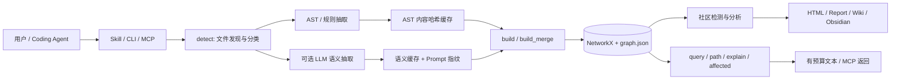

# Graphify 源码深度导读：它不是代码真值层，而是一套务实的本地图检索器

> 调研对象：[Graphify-Labs/graphify](https://github.com/Graphify-Labs/graphify)
> 固定版本：v0.9.53，commit [`33362d969292b57eda82f3fbd9eb5f3f5bc9bbc2`](https://github.com/Graphify-Labs/graphify/commit/33362d969292b57eda82f3fbd9eb5f3f5bc9bbc2)
> 发布日期：2026-08-30；调研日期：2026-09-03
> 许可证：当前项目元数据声明 Apache-2.0；`NOTICE` 说明重许可前的部分贡献仍按 MIT 条款保留
> 相关研究：[[代码仓库不是一张图：AI时代的代码理解方案]]

## 一句话判断

**Graphify 是一个面向 Coding Agent 的、本地优先的“代码/文档图编译器 + 有界图检索工具”，不是编译器级代码智能平台，也不是企业知识真值层。**

它真正值得学习的地方不是“把仓库画成图”，而是围绕一个轻量 `graph.json` 做出的整套工程约束：代码走确定性 AST 抽取，文档与媒体走可选语义抽取；两类产物分层缓存、按源文件替换；失败或不完整结果不盖“已完成”戳；查询先做词法/IDF 种子召回，再做有界 BFS/DFS，并把 token 预算和截断显式化。

它的上限也同样清楚：符号解析主要依赖 Tree-sitter 与启发式二次解析，没有编译器/LSP 的完整类型语义；默认 NetworkX 简单图会把同一节点对的多条不同关系压成一条；自然语言查询本质上仍是基于标签和路径的词法匹配，不是语义检索；增量更新按文件替换局部事实，但没有通用的依赖失效闭包与增量—全量等价性证明。

因此，对 AI Coding 项目更合适的定位是：

- 作为低门槛代码图原型、候选召回器和可视化工具；
- 作为 `rg/grep`、纯词法索引、SCIP/编译器级符号、类型化一跳关系之间的评测对照组；
- 不直接作为高风险变更影响分析、跨仓版本真值或业务本体的唯一底座。

## 一、项目到底开放了什么

### 1.1 可见、可运行的开源边界

v0.9.53 仓库公开的是一套 Python CLI/库、面向多个 Coding Agent 的 Skill、MCP 服务、抽取器、查询器和导出器。项目包名是 `graphifyy`，CLI 名称是 `graphify`；要求 Python 3.10+，核心依赖包括 NetworkX、RapidFuzz、Tree-sitter 及多语言 grammar。[`pyproject.toml`](https://github.com/Graphify-Labs/graphify/blob/33362d969292b57eda82f3fbd9eb5f3f5bc9bbc2/pyproject.toml#L3-L42) 同时把 MCP、Neo4j、FalkorDB、PDF、Office、视频转录、各家 LLM 后端等放在可选依赖中。

开源仓库可完成：

- 文件发现、忽略规则、敏感文件过滤和语料健康检查；
- 约 40 种语言/格式的 Tree-sitter 或规则抽取；
- 可选的文档、PDF、图片、视频/音频语义抽取；
- 节点、边、超边的清洗、去重、合并与持久化；
- Leiden/Louvain 社区发现、god nodes、路径、影响范围和局部子图查询；
- HTML、Wiki、Obsidian、SVG、GraphML、Neo4j/FalkorDB 等导出；
- Git hook/watch 增量更新，以及 stdio/HTTP MCP 服务。

官方同时在 `graphify.com` 建设常驻、跨代码/文档/会议的产品层并开放早期访问；这部分不能从当前开源仓库推断为已完整开放。[README](https://github.com/Graphify-Labs/graphify/blob/33362d969292b57eda82f3fbd9eb5f3f5bc9bbc2/README.md#L21-L28) 明确把开源工具与未来的 always-on platform 区分开来。

### 1.2 “本地优先”需要精确定义

代码图可以完全在本地由 AST 构建，不需要 LLM，也不会因为代码抽取本身产生模型调用。文档、PDF、图片和音视频则可能调用 Coding Agent 自带模型，或 Kimi、Gemini、OpenAI、Anthropic、Bedrock、Ollama 等后端。[README](https://github.com/Graphify-Labs/graphify/blob/33362d969292b57eda82f3fbd9eb5f3f5bc9bbc2/README.md#L24-L27) 对这一边界写得比较清楚。

因此，“Graphify 完全离线”只对 **纯代码 AST 模式** 成立；包含语义材料时，是否离线取决于所选后端。`SECURITY.md` 中“graph analysis 不发网络请求、只有 ingest 发请求”的表述，没有覆盖 `llm.py` 中直连远程模型后端的情形，属于文档口径不完整，而不是可以据此认定语义抽取一定离线。

## 二、宏观架构：Skill 是编排层，Python 库才是执行层

官方架构文档把主流水线概括为：

```text
detect → extract → build → cluster → analyze → report → export
```

源码的实际责任可以拆成四层：

| 层级 | 核心模块 | 主要责任 | 不承担什么 |
|---|---|---|---|
| 产品与编排 | `skill*.md`、`cli.py`、`install.py` | 将能力注册到 Codex/Claude/Cursor 等宿主，解释运行步骤，分派命令 | 不拥有代码事实 |
| 抽取与解析 | `detect.py`、`extract.py`、`extractors/*`、`llm.py`、`scip_ingest.py` | 文件分类，AST/规则抽取，可选语义抽取，跨文件启发式解析 | 不提供编译器级完备语义 |
| 图构建与生命周期 | `build.py`、`cache.py`、`watch.py`、`cluster.py`、`dedup.py` | 规范化、去重、按源替换、增量合并、社区检测、持久化 | 不提供多 revision 隔离数据库 |
| 查询与交付 | `serve.py`、`affected.py`、`analyze.py`、`export.py`、`wiki.py` | 查询种子、有限遍历、路径/影响、预算输出、MCP 与可视化 | 不替代源码回读和运行验证 |



这个架构的设计中心是 **可移植的文件产物** ，不是常驻图数据库。各阶段主要通过普通 Python dict、NetworkX graph 和 `graphify-out/` 中的文件交接。优点是部署轻、容易嵌入 Agent；代价是大图加载、并发写入、版本隔离和多租户治理都需要额外工程。

## 三、完整构建链路

### 3.1 Detect：先决定什么可以进入图

`detect.py` 不只是扩展名扫描器。它还处理：

- `.graphifyignore`、可选 Git ignore 和额外 exclude；
- symlink 边界；
- Office/PDF/媒体文件类型；
- 压缩包炸弹、文件大小等资源上限；
- `.env`、证书、SSH/GPG、云凭据目录与高风险命名的敏感文件过滤；
- 代码规模提示——小于约 5 万词时提醒可能不需要图，大于约 50 万词或 500 文件时提醒成本。

这一步说明 Graphify 并不默认认为“更多内容进入图就更好”。尤其敏感文件过滤是一项真实的信任边界：系统会在读取内容前根据目录、文件名、类型和模板后缀做判定。[`detect.py::_is_sensitive`](https://github.com/Graphify-Labs/graphify/blob/33362d969292b57eda82f3fbd9eb5f3f5bc9bbc2/graphify/detect.py#L249-L282)

但它仍是启发式过滤，不能等同于秘密扫描器。企业场景仍应把源权限、工作区隔离和出站控制放在 Graphify 之外。

### 3.2 Extract：先逐文件抽结构，再跨文件解析关系

[`extract()`](https://github.com/Graphify-Labs/graphify/blob/33362d969292b57eda82f3fbd9eb5f3f5bc9bbc2/graphify/extract.py#L5463-L5510) 是 AST 主入口，分两类工作：

1. 每个文件独立解析类、函数、方法、字段、导入、继承、调用站点等结构；
2. 汇总全局节点与原始调用后，再做跨文件 import、直接调用、间接调用和语言专用解析。

对 20 个以上未缓存文件，默认用 `ProcessPoolExecutor` 并行抽取；进程池中途失败时只串行补跑尚未完成的条目，而不是全部重做。[`extract.py`](https://github.com/Graphify-Labs/graphify/blob/33362d969292b57eda82f3fbd9eb5f3f5bc9bbc2/graphify/extract.py#L5560-L5599)

增量构建时，`resolution_context_nodes/edges` 会把未变化文件的节点和 `contains/method` 边作为只读解析上下文，使“变化的调用方 → 未变化的被调用方”仍有机会重新绑定；只有本轮变化文件产生的新边会写回。这是一个很务实的局部解析策略。

### 3.3 AST 边并不全是同等确定

Graphify 用 `EXTRACTED`、`INFERRED`、`AMBIGUOUS` 标记边：

- `EXTRACTED`：源码中显式存在，如 import 或直接语法调用；
- `INFERRED`：由解析器二次解析、上下文或共现推得；
- `AMBIGUOUS`：无法唯一确定，进入报告供人工检查。

这比无差别地把所有关系画成实线更诚实，但标签粒度仍不够表达“编译器解析、Tree-sitter 语法事实、命名启发式、LLM 推断”等不同来源。`EXTRACTED` 只表示“显式出现在源中”，不保证目标符号绑定完全正确；例如动态语言、反射、依赖注入和框架路由仍可能丢失或误连。

### 3.4 语义抽取：分块、并发、失败分裂

文档与媒体语义抽取由 [`extract_corpus_parallel()`](https://github.com/Graphify-Labs/graphify/blob/33362d969292b57eda82f3fbd9eb5f3f5bc9bbc2/graphify/llm.py#L2347-L2391) 负责：

- 默认按目录邻近性和约 6 万 token 输入预算装箱，而不是固定 20 文件硬拼；
- 默认最多 4 个并发，降低 provider 限流风险；
- 当输出因长度截断时，递归把 chunk 二分后重试；
- 空响应走同 chunk 退避重试，不错误地当成上下文过长；
- partial 结果明确携带标记，后续缓存不会把它当权威完成态。

语义输入会包在带哈希的 `untrusted_source` 边界中，并对常见聊天模板控制符与伪造闭合标签做中和。这个机制能提高注入门槛，但官方也明确承认不能消除 prompt injection。[安全说明](https://github.com/Graphify-Labs/graphify/blob/33362d969292b57eda82f3fbd9eb5f3f5bc9bbc2/SECURITY.md#L31-L35)

### 3.5 Build：在兼容性与图语义之间折中

抽取结果先经过 Schema 修复与验证：兼容 `links/edges`、`name/label`、`path/source_file`、`members/nodes`、数字 ID 与旧置信度格式，再进入 NetworkX。

默认 [`build()`](https://github.com/Graphify-Labs/graphify/blob/33362d969292b57eda82f3fbd9eb5f3f5bc9bbc2/graphify/build.py#L1267-L1315) 使用无向简单图以维持历史兼容，同时把真实方向存入边属性 `_src/_tgt`。这是 Graphify 最关键也最容易被误读的取舍：

- 遍历无向图便于一次拿到调用方和被调用方；
- 展示时再依靠 `_src/_tgt` 恢复方向；
- 但同一节点对只能保留一条边，多个 relation 会竞争同一个槽位。

源码专门加入“具体关系优先于 `references/uses/mentions`”的规则，避免 `calls` 被更泛化的关系覆盖；作者在自身语料中曾发现 144 对 `calls + references` 被压成 `references`，导致调用图丢边。[`build.py` 的关系竞争处理](https://github.com/Graphify-Labs/graphify/blob/33362d969292b57eda82f3fbd9eb5f3f5bc9bbc2/graphify/build.py#L1168-L1204)

这个修复降低了损失，却没有消除简单图的结构限制。若同一对实体同时具有 `calls`、`implements`、`references` 等多个都很具体的关系，仍只能存活一个。对于严肃程序分析，应该使用 MultiDiGraph 或在存储层把边身份定义为 `(source, target, relation, provenance, revision)`。

### 3.6 Cluster 与导出：图是导航视图，不是答案本身

[`cluster()`](https://github.com/Graphify-Labs/graphify/blob/33362d969292b57eda82f3fbd9eb5f3f5bc9bbc2/graphify/cluster.py#L203-L247) 把有向图转无向后做 Leiden/Louvain 社区发现；孤立节点单独成组，超过全图 25% 的超大社区会再拆分，超高连接度节点可以先排除再按邻居多数票挂回。

社区 ID 会按大小稳定排序，成员集合还会生成指纹，用于判断旧标签是否可以复用。这是一种“稳定派生视图”思路，但社区本身仍是拓扑聚类结果，不应直接解释为真实业务边界。

## 四、查询链路：不是向量 RAG，而是词法种子 + 有界邻域

### 4.1 `query` 实际如何工作

CLI 默认执行：

```text
问题分词
→ 标签/节点 ID/源文件词法打分
→ 选择最多 3 个高分种子，并为每个有效查询词补一个种子
→ 无向 BFS，固定 depth=2
→ hub 截断
→ 种子优先、近邻优先排序
→ 约 2,000 token 的文本输出
```

关键源码是 [`cli.py` 的 query 分支](https://github.com/Graphify-Labs/graphify/blob/33362d969292b57eda82f3fbd9eb5f3f5bc9bbc2/graphify/cli.py#L1137-L1255) 和 [`serve.py::_query_graph_text`](https://github.com/Graphify-Labs/graphify/blob/33362d969292b57eda82f3fbd9eb5f3f5bc9bbc2/graphify/serve.py#L1130-L1189)。

打分器使用规范化 token、IDF、整句标签匹配、exact/prefix/substring 与 source path 信号，并用 trigram 候选集减少大图全扫描。[`_score_query`](https://github.com/Graphify-Labs/graphify/blob/33362d969292b57eda82f3fbd9eb5f3f5bc9bbc2/graphify/serve.py#L441-L606) 对多词查询还按命中词覆盖率平方缩放 exact/prefix 分，防止一个常见短词恰好等于某节点标签后压倒真正相关的多词结果。

种子选择有两道噪声控制：

- 分数低于第一名 20% 时停止追加普通种子；
- 相同规范化标签最多占一个种子位，避免大量 `GET`、`handler` 淹没遍历。

为了避免上述分数断崖把其他查询词饿死，系统又为每个有命中的查询词保证一个最佳种子，但把 `calls/uses/imports` 等关系意图词排除在强制种子之外。[`_pick_seeds`](https://github.com/Graphify-Labs/graphify/blob/33362d969292b57eda82f3fbd9eb5f3f5bc9bbc2/graphify/serve.py#L629-L732)

### 4.2 有界扩展的优点

BFS/DFS 不会把超高连接节点当普通中转站：非种子节点的 degree 达到全图 p99 且至少 50 时停止继续扩展。[`_bfs`](https://github.com/Graphify-Labs/graphify/blob/33362d969292b57eda82f3fbd9eb5f3f5bc9bbc2/graphify/serve.py#L874-L928) 这避免了一个公共 util、框架根节点或 `index` 文件把两跳邻域爆炸成半个仓库。

输出层把种子放在最前，再按与种子的 hop 距离、degree 和 ID 排序；预算默认以 `3 chars ≈ 1 token` 粗略换算。截断发生时，开头和结尾都会显式标出，并保证种子节点不被切掉。[`_subgraph_to_text`](https://github.com/Graphify-Labs/graphify/blob/33362d969292b57eda82f3fbd9eb5f3f5bc9bbc2/graphify/serve.py#L930-L1039)

这比把整张图、整份报告或两跳邻域无差别塞给模型更合理。它把“图用于候选扩展、token 预算决定实际上下文”落成了代码。

### 4.3 查询层的局限

1. **自然语言只是词法入口。** 没有 embedding 不代表坏，但业务同义词、隐式概念和跨语言表述无法仅靠标签/路径稳定召回。
2. **查询深度在 CLI 中固定为 2。** `--budget` 和 `--context` 可调，但普通 `query` 没有直接暴露 depth；不同任务不能自然地在一跳和多跳之间按需选择。
3. **先扩展、后预算截断。** token 预算控制输出，不直接控制遍历计算和候选关系；大 hub 依靠启发式门槛限制。
4. **无向遍历混合上下游。** 输出能恢复边方向，但候选集合天然把调用者与被调用者混在一起；这适合“建立上下文”，不适合需要严格方向语义的分析。
5. **关系过滤靠自然语言提示或 `--context` 类别。** 它尚不是一个强类型查询规划器。

### 4.4 `affected` 比 `query` 更接近领域工具

[`affected_nodes()`](https://github.com/Graphify-Labs/graphify/blob/33362d969292b57eda82f3fbd9eb5f3f5bc9bbc2/graphify/affected.py#L178-L240) 明确做反向遍历，只沿 `calls`、`imports`、`inherits`、`implements`、`uses` 等默认关系寻找潜在上游影响，并把具体调用/导入站点作为定位证据。

它比通用 `query` 更适合作为 Agent 工具，因为意图、方向和边类型都更明确。但结果仍取决于上游 AST/启发式图的完整度；“未找到”不能作为“无影响”的证明。

## 五、增量更新：Graphify 最值得看的部分

### 5.1 双哈希 manifest 区分 AST 与语义完成态

`manifest.json` 为每个源文件分别保存 `ast_hash` 与 `semantic_hash`：

- `graphify update` 只盖 AST 戳；
- `graphify extract` 完成语义抽取后盖 semantic 戳；
- 这样 AST 更新不会让文档语义层错误地被视为已更新。

[`detect_incremental()`](https://github.com/Graphify-Labs/graphify/blob/33362d969292b57eda82f3fbd9eb5f3f5bc9bbc2/graphify/detect.py#L2202-L2250) 先用 mtime 做便宜快路径，mtime 变化时再比较内容 MD5；对刚好落在文件系统时间粒度窗口内的写入，会主动付出一次哈希成本，降低同 tick 修改被漏掉的风险。

[`save_manifest()`](https://github.com/Graphify-Labs/graphify/blob/33362d969292b57eda82f3fbd9eb5f3f5bc9bbc2/graphify/detect.py#L1970-L2007) 还区分完整扫描和部分扫描：完整扫描可清除已经离开语料范围的记录；只处理 changed paths 的 hook 不能误删未触及行。

### 5.2 缓存不是“命中就信”

AST 缓存以内容 SHA-256 为键，并按 Graphify 版本和缓存 Schema 分目录；语义缓存因为重建会产生 LLM 成本，不按 Graphify 版本强制失效，而用 Prompt 指纹隔离新旧提取规则。[`cache_dir/load_cached`](https://github.com/Graphify-Labs/graphify/blob/33362d969292b57eda82f3fbd9eb5f3f5bc9bbc2/graphify/cache.py#L846-L953)

以下情况会被视为 miss 并重试：

- JSON 缓存损坏；
- semantic 结果标记为 partial；
- semantic 结果没有节点也没有超边；
- 文件已有抽取器但本轮产出零节点；
- 可选 grammar 缺失或加载失败。

这是一个重要不变量：**失败不能被缓存或 manifest 永久固化成成功。**

### 5.3 按源文件、按生产层替换

[`build_merge()`](https://github.com/Graphify-Labs/graphify/blob/33362d969292b57eda82f3fbd9eb5f3f5bc9bbc2/graphify/build.py#L1555-L1625) 在合并变化文件前先移除该文件旧贡献，否则已经从源码中删除的节点和边会永久残留。

更细的是：同一文件的 AST 与 semantic 两层分别替换。只重跑 AST 时保留文档语义节点；只重跑语义时保留精确 AST 节点。这避免了“双生产者互相覆盖”的典型问题。

语义层如果从原先多个节点突然缩水成更少节点，会触发 shrink guard；除非用户明确允许 partial，否则该源不会盖成功戳，下次继续重试。这不是严格等价性证明，但能拦住最危险的静默数据丢失。

### 5.4 并发 hook 不丢变更

[`watch.py::_rebuild_code`](https://github.com/Graphify-Labs/graphify/blob/33362d969292b57eda82f3fbd9eb5f3f5bc9bbc2/graphify/watch.py#L1211-L1292) 用每仓库 advisory lock 防止并发重建互踩。没有拿到锁的 post-commit hook 把路径追加到 `.pending_changes`；持锁者在重建前后都 drain 队列，最多循环 20 次吸收重建期间到达的新变更。

这解决的是“多个提交触发器不能丢事件”，而不是完整事务队列：

- POSIX 依赖 `fcntl`，Windows 回退为无锁；
- pending 文件是轻量 append，不是带 ACK/重放的 durable queue；
- 提交风暴超过 drain 上限后，需要后续触发器继续处理。

### 5.5 为什么它仍没有解决通用失效传播

Graphify 的增量更新本质是：

```text
Diff / mtime / hash
→ 找出新增、修改、删除文件
→ 对变化文件重新抽取
→ 用未变化图作为解析上下文
→ 按 source_file 替换旧贡献
```

它能正确处理大量文件级生命周期问题，但无法保证“被修改定义的所有下游派生事实都已重新计算”。例如：

- 未变化文件中的调用绑定可能因变化文件的重命名、重导出或类型改变而失效；
- 社区、god node、派生报告会重算，但外部导出的消费副本未必同步；
- 动态依赖、构建图、生成代码、运行时路由没有统一失效模型；
- 仓库没有公开同一 commit 下“增量结果 vs 全量重建结果”的系统性差分门禁。

所以 Diff 是一个合理触发器，`source_file` 是一个实用替换边界，但不是完整依赖失效闭包。

## 六、安全与信任边界

值得肯定的实现包括：

- URL 只允许 HTTP/HTTPS，解析 DNS 并阻断 loopback、private、link-local 和云 metadata 地址，重定向后重新检查；
- 下载流式限长，文本与二进制分别设置上限；
- MCP 图路径必须位于 `graphify-out/`，加载前检查 graph 文件大小；
- 节点标签、source path、location、community 和 metadata 在进入 HTML/MCP 文本前清理控制字符、限制长度并转义；
- HTTP MCP 默认绑定 `127.0.0.1`，可选 API key，用常量时间比较；
- 语义材料作为不可信输入做边界封装和控制 token 中和；
- Tree-sitter 解析源码，不执行被分析代码。

核心实现见 [`security.py`](https://github.com/Graphify-Labs/graphify/blob/33362d969292b57eda82f3fbd9eb5f3f5bc9bbc2/graphify/security.py) 和 [`serve.py` HTTP 鉴权](https://github.com/Graphify-Labs/graphify/blob/33362d969292b57eda82f3fbd9eb5f3f5bc9bbc2/graphify/serve.py#L2042-L2104)。

仍需注意：

1. 文档/媒体走远程模型时，源码材料可能离开本机；Graphify 的敏感文件名过滤不能代替企业 DLP。
2. Prompt injection 只能缓解，不能证明语义节点可信。
3. `graph.json` 和 HTML 产物本身可能包含路径、符号与业务概念，应按源码同级权限保护。
4. `SECURITY.md` 的支持版本表仍只写 `0.3.x`，与 v0.9.53 当前发布线明显漂移；安全响应承诺也主要是项目自述，不能替代企业供应链评估。

## 七、公开评测应如何解读

官方 [`BENCHMARKS.md`](https://github.com/Graphify-Labs/graphify/blob/33362d969292b57eda82f3fbd9eb5f3f5bc9bbc2/BENCHMARKS.md) 报告：

| 场景 | 结果 | 可以说明 | 不能说明 |
|---|---:|---|---|
| LOCOMO，n=300 | recall@10 0.497；QA 45.3% | 图扩展在该记忆基准上有召回价值 | 不能直接外推到代码理解 |
| LongMemEval-S，n=50 | QA 76%，与 dense RAG 持平 | 小样本长期记忆任务具竞争力 | 不证明图普遍优于 dense retrieval |
| ERPNext 代码任务，n=6 | key-fact coverage 70.8% → 82.0% | 候选图工具可能补足 grep/read | 样本极小，且每题约 14 万 token，不能证明成本优势或修复成功率 |
| 689 个 ERPNext 周快照 | AST 可覆盖 2011—2026 历史 | 构建流程能在大量版本重复运行 | 不等于增量与全量结果严格等价 |

评测的优点是公开了 harness 口径、统一模型与预算、答案事实覆盖公式、第二 judge 一致率和复现入口。主要限制是：

- harness 与结果都由项目方自己维护，缺少独立复现；
- 代码智能只有 6 道题，指标是 key-fact coverage，不是定位召回、补丁正确率或 SWE-bench 成功率；
- 图工具组每题约 14 万 token，本身不是“低上下文”证据；
- “graph build 0 LLM credits”只适用于 AST 图；文档语义抽取、答案生成和评测 judge 仍有模型成本；
- LOCOMO 的 ingest cost 与“0 LLM graph build”属于不同账本，不能混读。

我的证据评级是：**代码抽取与查询机制属于可核验实现事实；代码任务增益属于 C 级早期产品证据；还不足以证明它可以承担企业代码真值层。**

## 八、最值得学习的五个设计

### 8.1 把“不完整”建模成可恢复状态

零节点、partial、空语义结果、依赖缺失、语法 ERROR recovery、语义缩水都不会被静默盖成完成态。这比“跑完命令即成功”更接近长期索引系统所需的正确性纪律。

适用条件：索引会持续更新、失败可能只影响部分文件。<br>
代价：状态分支很多，manifest/cache/build 三层必须保持协议一致。

### 8.2 AST 与语义双生产者分层

确定性结构事实和 LLM 语义事实共存，但缓存、hash 与替换边界分开。它避免让昂贵、不稳定的语义抽取污染代码结构的更新节奏。

适用条件：同一文件既需要符号结构也需要解释性概念。<br>
代价：ID 对齐、双胞胎节点、优先级与跨层边会显著增加合并复杂度。

### 8.3 查询预算是一等约束

Graphify 不把整份 `GRAPH_REPORT.md` 当作每次查询上下文，而是先找种子、有限扩展、按 hop 排序并显式截断。这个方向比“先构大图，再把大图喂给模型”正确。

适用条件：目标是 Coding Agent 上下文规划。<br>
代价：预算只是近似字符预算，查询相关性不佳时仍可能把有限预算浪费在错误邻域。

### 8.4 变更触发与合并并发有明确失败路径

锁竞争不会静默丢 changed paths，语义 chunk 截断会二分，损坏缓存会重试，删除/排除有显式 prune。大量实现复杂度都花在非理想路径上，这是成熟度的主要来源。

### 8.5 输出保留边方向与证据位置

即使内部用无向图遍历，输出仍尽力保留真实 `_src/_tgt`，并把调用/导入站点而非仅定义位置写入结果。对 Agent 来说，“为什么这条边存在、应该回读哪里”比节点名字本身更有用。

## 九、主要局限与技术债

### 9.1 单文件规模已经反映职责拥挤

v0.9.53 的 `cli.py` 约 4,500 行、`extract.py` 约 6,900 行、`llm.py` 约 3,200 行、`watch.py` 约 2,100 行。项目正在把语言抽取器迁出 `extract.py`，但 CLI 命令分派、兼容逻辑和大量修复仍集中在少数文件中。

这不直接等于质量差，但会提高回归组合数：路径格式、旧 Schema、平台差异、缓存版本、AST/semantic 层和输出模式之间存在大量交叉条件。

### 9.2 简单图不是忠实的程序关系模型

同一实体对的多关系、多调用站点、多 provenance 与多 revision 都可能被压缩。当前通过具体关系优先和 `_src/_tgt` 属性补救，适合导航图，不适合需要完整边基数的程序分析。

### 9.3 符号身份仍是路径派生的工程近似

项目已经多次修复同名文件、路径根、Windows/POSIX、Unicode NFC/NFD、symlink 和旧 ID 迁移问题，说明稳定 ID 是整个系统最难的基础设施之一。路径限定 ID 比裸名字可靠，但代码移动、重命名、生成代码和跨仓符号仍需要更正式的身份协议。

### 9.4 缺少真正的版本数据库

`graph.json + manifest + cache` 表达“当前工作区最新图”，不是可同时查询多个 commit 的不可变快照层。ERPNext 历史评测证明可以重复构建多个 checkpoint，不等于产品本身原生提供 revision 查询、快照层叠和回滚。

### 9.5 文档有明显漂移

- `ARCHITECTURE.md` 开头仍称项目为 Claude Code skill，但实际支持多宿主；
- `SECURITY.md` 支持版本停留在 0.3.x；
- 安全网络边界未完整说明直接 LLM provider 调用；
- README 的“约 40 种语言”把完整 Tree-sitter 支持、可选 grammar 和规则 fallback 放在同一营销口径下。

### 9.6 没有独立、足量的任务结果证据

它证明了“有实现”和“小样本可能有帮助”，尚未证明：

- 在真实 bug/需求上提升 File/Symbol/Impact Recall@K；
- 增量与全量构建在同 commit 等价；
- 图上下文提高最终补丁正确率，而不是只提高答案覆盖；
- 在多仓、超大仓、动态框架和企业权限下长期稳定。

## 十、对我们的 AI Coding 项目的建议

### 10.1 建议复用

- `EXTRACTED / INFERRED / AMBIGUOUS` 的来源意识，但进一步细分 compiler/LSP/AST/heuristic/LLM/runtime；
- AST 与 semantic 双层 hash、双层 replace 的完成态协议；
- partial/zero-node/shrink 不盖章的失败语义；
- 默认一跳或有限两跳、hub 抑制、严格 token 预算和截断提示；
- `affected` 这种按意图、方向和关系类型设计的领域工具；
- changed-path lock + pending queue 的轻量并发处理思路；
- 所有结果都携带 `source_file + source_location + relation site`。

### 10.2 不建议照搬

- 不把 NetworkX 简单图作为事实主存储；
- 不把 Tree-sitter 启发式绑定升级为符号真值；
- 不把社区聚类直接命名为业务子系统；
- 不让 Skill 的“先查图再读源码”变成强制阻断；图只能做 orientation，关键结论必须回到源码与测试；
- 不用文件级 Diff 替代依赖失效闭包；
- 不用 6 道问答题决定技术底座选型。

### 10.3 推荐验证方式

从 30—50 个历史真实任务开始，固定 base commit、模型、prompt 和 token 预算，对比：

```text
A. rg/grep + 源码回读
B. 词法索引 + 源码回读
C. B + SCIP/LSP 精确符号
D. C + 一跳类型化关系
E. Graphify v0.9.53 + 强制源码回读
```

至少记录：

- File Recall@K、Symbol Recall@K；
- Impact Recall/Precision；
- 必须测试召回率；
- 首条有效证据时间；
- 任务成功率、返工与人工接管；
- 上下文 token 和无关证据比例；
- 同 commit 的增量—全量节点/边/查询答案差异；
- `EXTRACTED/INFERRED` 在人工抽样中的真实精度。

只有当 E 在相同预算下稳定优于 B/C，才应扩大 Graphify 的生产使用范围；若 D 优于 E，则保留 Graphify 作为产品原型与评测对照，而把事实底座建在精确符号和类型化关系上。

## 十一、推荐源码阅读顺序

1. [`README.md`](https://github.com/Graphify-Labs/graphify/blob/33362d969292b57eda82f3fbd9eb5f3f5bc9bbc2/README.md)：先建立产品边界，不接受营销语句为结论。
2. [`ARCHITECTURE.md`](https://github.com/Graphify-Labs/graphify/blob/33362d969292b57eda82f3fbd9eb5f3f5bc9bbc2/ARCHITECTURE.md)：看模块契约与输出 Schema。
3. [`detect.py`](https://github.com/Graphify-Labs/graphify/blob/33362d969292b57eda82f3fbd9eb5f3f5bc9bbc2/graphify/detect.py)：理解语料边界、敏感过滤和 manifest。
4. [`extract.py::extract`](https://github.com/Graphify-Labs/graphify/blob/33362d969292b57eda82f3fbd9eb5f3f5bc9bbc2/graphify/extract.py#L5463-L5810)：沿逐文件抽取到跨文件解析阅读。
5. 选一种目标语言的 `extractors/*`：核对实际 AST 节点、边和 raw call 语义。
6. [`build.py::build_from_json/build/build_merge`](https://github.com/Graphify-Labs/graphify/blob/33362d969292b57eda82f3fbd9eb5f3f5bc9bbc2/graphify/build.py)：重点看简单图压缩、ID 修复和双层替换。
7. [`serve.py::_score_query/_pick_seeds/_bfs/_query_graph_text`](https://github.com/Graphify-Labs/graphify/blob/33362d969292b57eda82f3fbd9eb5f3f5bc9bbc2/graphify/serve.py)：理解查询为何只是“词法种子 + 图扩展”。
8. [`affected.py`](https://github.com/Graphify-Labs/graphify/blob/33362d969292b57eda82f3fbd9eb5f3f5bc9bbc2/graphify/affected.py)：看方向明确的领域查询。
9. [`watch.py::_rebuild_code`](https://github.com/Graphify-Labs/graphify/blob/33362d969292b57eda82f3fbd9eb5f3f5bc9bbc2/graphify/watch.py#L1211-L1700)：看增量、并发与删除恢复。
10. [`BENCHMARKS.md`](https://github.com/Graphify-Labs/graphify/blob/33362d969292b57eda82f3fbd9eb5f3f5bc9bbc2/BENCHMARKS.md)：最后再读结果，避免先被 headline 锚定。

## 十二、可复现实验清单

在允许安装与拉取源码的环境中，建议优先做四个实验，而不是只跑一次漂亮 demo：

### 实验 A：多关系丢失

构造两个节点之间同时存在 `calls`、`references`、`implements` 的最小样例，比较 `directed=False`、`directed=True`、MultiDiGraph 和原始 extraction JSON 的边数与最终 `query/affected` 结果。

### 实验 B：增量—全量等价

固定 commit A 全量构图；修改定义、重命名文件、删除导出、改变调用方形成 commit B。分别执行“从 A 增量更新到 B”和“B 全量重建”，对 nodes、edges、hyperedges、communities 和典型查询做规范化差分。

### 实验 C：查询相关性

选择同名符号、通用词、多词业务问题和关系意图问题，记录种子、两跳节点、截断比例、真正相关节点排名，并分别测试 `--context` 和 BFS/DFS。

### 实验 D：失败恢复

模拟 grammar 缺失、语法 recovery、semantic 空响应、截断、partial、缓存 JSON 损坏和并发 hook，检查是否都“不盖章、可重试、不丢旧的健康层”。

## 十三、核心结论—证据账本

| 结论 | 类型 | 主要证据 | 置信度与边界 |
|---|---|---|---|
| 纯代码图可本地、零 LLM 构建 | 源码/官方事实 | README；`extract.py`；pyproject | 高；不适用于文档/媒体语义层 |
| 查询是词法种子 + 有界图遍历 | 源码事实 | `serve.py::_score_query/_pick_seeds/_bfs`；`cli.py` | 高；不等于查询结果相关性已充分验证 |
| AST/semantic 分层替换，失败不盖章 | 源码事实 | `detect.py`、`cache.py`、`build.py`、`watch.py` | 高；只证明机制存在，不证明所有故障组合完备 |
| 默认简单图会压缩多关系 | 源码事实 | `build.py` 的 `nx.Graph` 与 `G.has_edge` 竞争逻辑 | 高；原始 extraction JSON 仍可能保留更多边 |
| 增量更新没有通用失效闭包 | 合理推断 | 文件级 detect/replace 边界；未见 revision/依赖闭包协议 | 中高；需要增量—全量实验量化实际漂移 |
| Graphify 可提升代码理解任务 | 项目方实验 | `BENCHMARKS.md` ERPNext n=6 | 低到中；样本过小、非独立复现、不是修复成功率 |
| 适合作为原型与评测对照，不宜直接做真值层 | 建议 | 上述机制与局限综合 | 中高；最终取决于本地历史任务消融结果 |

## 十四、证据边界与本次验证说明

### 已核验事实

- v0.9.53 在 2026-08-30 发布，GitHub 当日仍标记为 Latest；固定 commit 为 `33362d969292b57eda82f3fbd9eb5f3f5bc9bbc2`。
- 核心结论已回到该 commit 的 README、pyproject、架构说明、Benchmark、Security 及 `detect/extract/llm/build/serve/watch/affected/cache/cluster` 源码核对。
- GitHub 页面显示该 tag 约 1,629 个提交历史；项目处于高频迭代阶段，因此本文不把默认分支当作稳定证据。

### 未完成的运行验证

本机没有安装 `graphify`，且调研时 Shell 到 GitHub/PyPI 的连接连续被重置，无法可靠下载固定版本源码并运行测试。因此本文的“实现事实”来自固定 commit 的官方源码逐段核验，不声称已在本机完成构建、测试或四项可复现实验。

这项限制不影响对责任边界、控制流和数据语义的源码判断，但会降低对跨平台可运行性、性能数字和失败恢复完整性的置信度。公开 benchmark 也应视为项目方证据，等待独立复现。

## 最终结论

Graphify 的价值不是证明“代码知识图谱已经解决代码理解”，而是给出了一个很强的工程化反例：即使只做轻量本地图，也必须认真处理来源分级、失败状态、路径身份、缓存新鲜度、并发变更、预算和可追溯位置。

它最适合被理解为 **面向 Agent 的图式 Repo Map** ：比目录树、grep 和静态报告多了一层有界关系扩展；比编译器级索引、版本事实库和程序分析平台轻得多，也不承担后者的正确性责任。

对我们的路线，最好的吸收方式不是“把 Graphify 接进来就完成代码知识底座”，而是：复用它的局部图、查询预算和失败不盖章思想；用 SCIP/LSP/编译器事实补精度，用不可变 revision snapshot 与失效闭包补版本一致性，用 Trace/测试覆盖补运行证据；最后通过真实历史任务的消融评测决定图关系是否值得进入生产链路。
