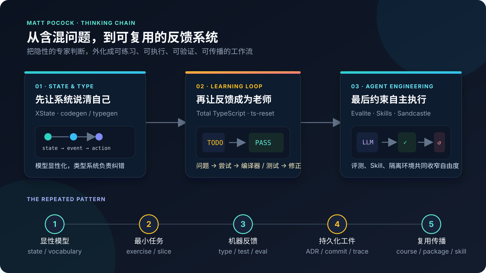
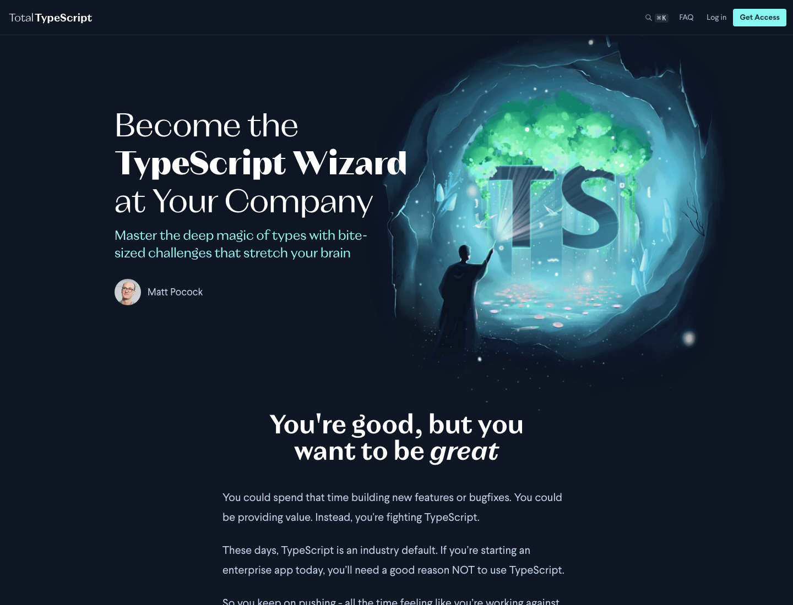
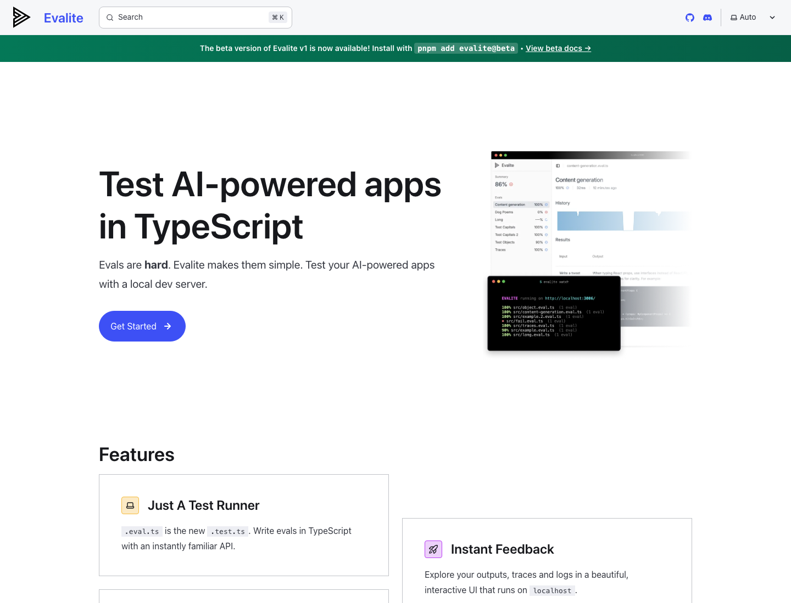
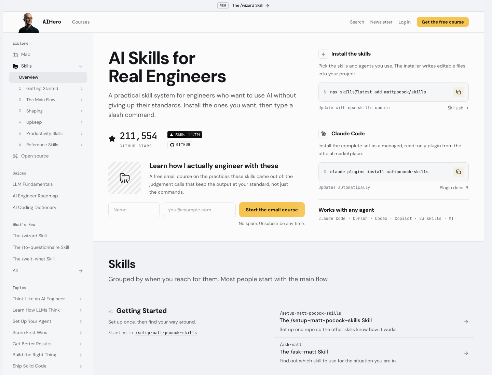
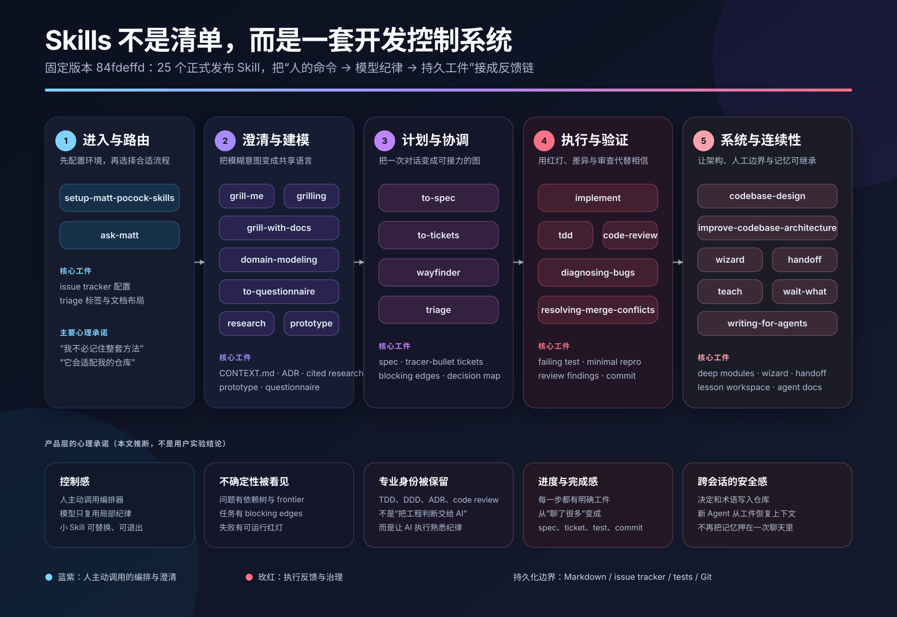
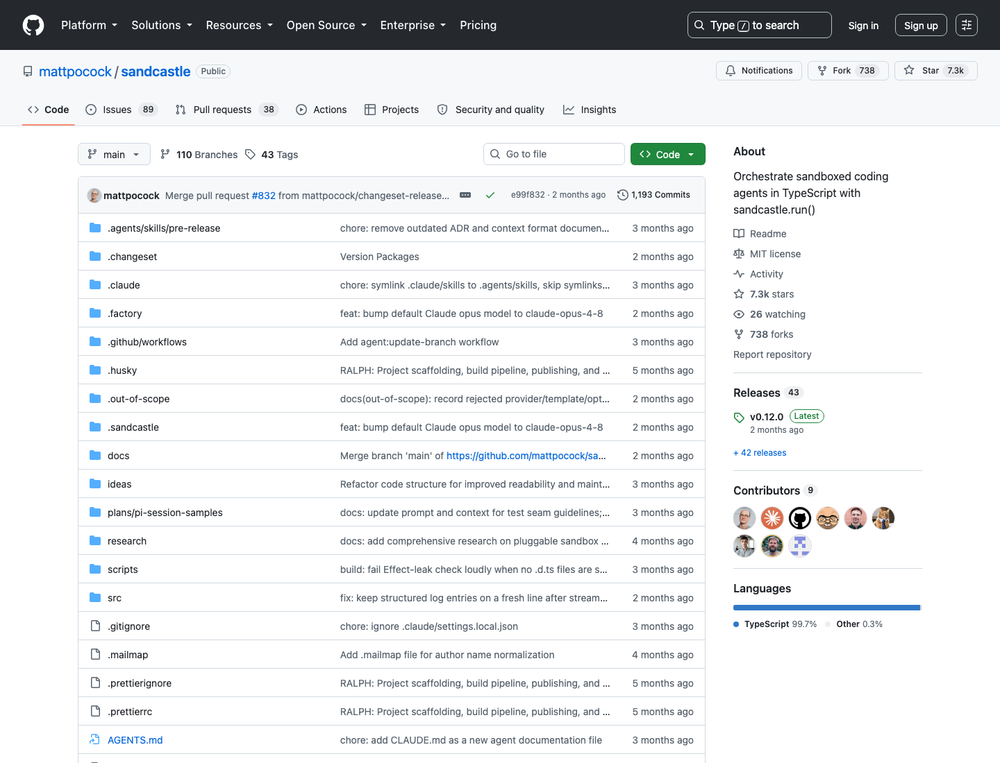

# Matt Pocock 的核心成果：他做成了什么，为什么持续获得关注



*图 1　Matt Pocock 的六项核心成果。图中区分了成熟产品、精准工具、历史贡献与新兴基础设施，避免用同一把尺子评价所有项目。根据 [XState typegen 官方介绍](https://stately.ai/blog/2022-01-27-introducing-typegen)、[Total TypeScript](https://www.totaltypescript.com/)、[ts-reset](https://www.totaltypescript.com/ts-reset)、[Evalite](https://www.evalite.dev/)、[Skills 固定版本](https://github.com/mattpocock/skills/tree/84fdeffd12f2ee307994d1eb6feb48173b6e0502) 与 [Sandcastle 固定版本](https://github.com/mattpocock/sandcastle/tree/e99f832f26dc9d245c019a9ddd19fa5dee792427) 重绘。*

Matt Pocock 做成了六件值得单独讨论的事：他参与把 XState 状态机中的隐含类型关系送进编辑器；把 TypeScript 教学做成一套以练习和编译器反馈为核心的产品；用 `ts-reset` 和 TS Error Translator 修补日常开发中的类型反馈；用 Evalite 降低 TypeScript 团队建立 LLM 评测的成本；把软件工程动作封装成可安装的 Agent Skills；再用 Sandcastle 把 Agent 执行隔离下沉到 sandbox、worktree、commit 和合并流程。

这六项工作不处于同一成熟度，也不是同一种贡献。Total TypeScript 已经形成课程、免费教程、文章和图书相互支撑的成熟教育产品；`ts-reset` 是范围很小但采用很广的开发工具；XState typegen 是重要的阶段性工程；Skills 获得了最强的公开关注，但行为有效性仍缺少系统评测；Evalite 与 Sandcastle 则是有实际实现、有采用信号、同时仍在快速演进的新基础设施。

因此，本文先盘点成果，再谈方法。核心判断是：**Matt 最稳定的能力，是从真实工作中的高频摩擦出发，做出一个边界清楚、入口熟悉、反馈及时的最小工件，然后用教学和分发把它推到足够多的开发者面前。** 技术深度负责产生价值，产品化负责降低采用成本，内容能力负责放大触达；三者缺一，结果都不会是今天的规模。

## 六项核心成果：先看结论

| 成果 | 原始问题 | 他实际交付了什么 | 具体提升 | 采用或影响信号 | 当前判断 |
|---|---|---|---|---|---|
| XState codegen / typegen | 状态、事件、action、guard 的关联超出当时 TypeScript 的自然推断能力 | 静态分析、类型生成、编辑器集成与相关测试 | action 获得上下文化事件类型，缺失实现能在编辑器中暴露 | Stately 官方发布；Matt 向 XState 合入五十余个 PR | 重要的早期工程贡献；XState v5 已不支持 typegen |
| Total TypeScript | 视频课程容易制造“听懂了”的错觉，类型系统又高度依赖动手反馈 | 免费教程、五套工作坊、文章、书和练习仓库 | 把学习单元改成“问题文件 → 尝试 → 编译器/测试 → 答案” | 官网列出的五套工作坊合计 427 个练习；出版 432 页图书 | 最成熟、最持久的旗舰成果 |
| ts-reset / TS Error Translator | 标准库类型和错误信息常让反馈过宽、过窄或难以理解 | 全局声明修补包与 VS Code 错误翻译扩展 | 外部数据先成为 `unknown`；常见数组 API 更符合直觉；报错更接近下一步行动 | `ts-reset` 约 8,600 Star，近 30 天约 485 万次 npm 下载 | 最精准的小型开源成果；适用边界明确 |
| Evalite | LLM 输出不稳定，单元测试难以表达“足够好” | `.eval.ts` API、本地 UI、trace、scorer、CI 与静态结果页 | 复用 Vitest 心智模型，把样例、任务、评分和轨迹放进同一反馈环 | 约 1,650 Star，近 30 天约 98 万次 npm 下载 | 已有真实采用；v1 仍为 beta |
| Agent Skills | Coding Agent 知道语法，却经常跳过澄清、调研、TDD、调试和评审 | 25 个正式发布的 Skill，加 10 个实验中或杂项 Skill | 把专家动作改写成触发条件、步骤、工件和完成标准 | 212,311 Star、18,345 Fork，创建约半年 | 公开关注最大的成果；缺少跨模型行为回归 |
| Sandcastle | Prompt 可以建议 Agent 小心，却不能隔离副作用或管理并发改动 | TypeScript `run()` API、provider 抽象、容器/worktree、日志、超时、commit 与 merge-back | 把行为建议升级为运行时边界和可恢复交付 | 约 7,300 Star，近 30 天约 41 万次 npm 下载 | 很有潜力的 Agent Runtime；仍为 pre-1.0 |

除 Skills 单独更新至 2026-08-11 外，表中的 Star 与 npm 下载量是 2026-08-10 的公开快照。它们能说明触达和尝试，不能单独证明学习效果、行为成功率或生产可靠性。下面逐项看真正发生了什么。

## 一、XState typegen：把状态机关系送进编辑器

Matt 较早被工程社区看见的重要工作，来自 XState。状态机已经把“系统有哪些状态、哪些事件可以触发哪些转移”从条件分支中抽了出来，但 XState v4 当时仍有一个 TypeScript 断点：配置对象中的状态节点、事件、action、guard 与 service 彼此关联，普通联合类型却很难知道某个 action **实际只会收到哪几种事件**。

旧体验是这样的：开发者明明在状态机里限定了路径，进入 action 后仍可能面对过宽的事件联合类型，于是需要防御性判断或类型断言；配置声明了某个 action，options 中漏写实现，也不一定能在最近的位置得到完整提示。状态模型是显性的，类型反馈却没有跟上模型。

`xstate-codegen` 与后来 XState v4 的 typegen 补上了这段连接：

1. 工具静态读取机器配置中的状态、事件和具名实现；
2. 生成描述这些关联的类型信息；
3. TypeScript Language Server 在具体 action、guard、service 和 delay 中使用上下文化类型；
4. 编辑器因此可以缩小可达事件、补全实现名称，并报告遗漏的 options 实现；
5. 对 Promise service，完成与失败事件也能携带更准确的数据类型。

[Stately 的发布文章](https://stately.ai/blog/2022-01-27-introducing-typegen)明确把这项工作归功于 Matt Pocock 与 Andarist 的共同推进，并提到方案经过约 18 个月讨论。Matt 在相关时期向 XState 主仓库合入五十余个 PR，覆盖 typegen、测试工具、路径生成和文档。这足以把它列为真实的核心工程贡献，但不能写成他单独发明了 XState 或它的完整类型系统。

它带来的提升也很具体：**状态图已经知道的事实，不再要求开发者到每个回调里重新证明一遍。** 错误更早出现在编辑器里，自动补全更接近运行时真实路径，重构机器配置时也更容易发现遗漏。

这项成果同时展示了“阶段性工具”的边界。`xstate-codegen` 已归档，[XState 当前文档](https://stately.ai/docs/developer-tools)明确说明 v5 不支持 typegen。它解决了 v4 在当时类型系统与 API 约束下的真实问题，却没有成为跨版本永久架构。对 Matt 的准确评价应是：他在 XState v4 的类型体验上做出了重要改进，并从中建立了“让工具把隐含关系变成即时反馈”的工程能力。

## 二、Total TypeScript：把 TypeScript 教学做成产品系统



*图 2　Total TypeScript 的产品承诺以 “bite-sized challenges” 为中心。截图来自 [Total TypeScript 官方首页](https://www.totaltypescript.com/)，获取于 2026-08-10。它支持的不是“课程很受欢迎”这一泛化判断，而是一个具体事实：主动练习是产品的基本交互单元。*

Total TypeScript 是 Matt 最成熟、也最能代表其综合能力的成果。它解决的不是“网上没有 TypeScript 内容”，而是现有内容常把类型系统当成可被动观看的知识。学习者能够跟着视频点头，却未必能在一个陌生报错前独立完成类型推理。

Matt 改造的首先是教学单元。一个典型练习不是先播放十几分钟讲解，而是让学习者进入带问题的 TypeScript 文件：

```text
看到一段有问题的代码
  → 自己修改类型或实现
  → 观察编辑器悬浮、编译错误和测试结果
  → 对照解法视频
  → 再把方法迁移到下一道不同结构的问题
```

这个顺序有三个实际提升。

第一，编译器承担了高频反馈。抽象概念不必等到课程结尾才验证，错误在每次编辑时就出现。第二，练习暴露的是学习者自己的错误路径，答案因此不只是“正确知识”，还可以解释刚才为什么失败。第三，课程可以把一个巨大的类型主题拆成几十个最小挑战，逐步提高组合难度，而不是要求读者先吞下完整理论。

这套方法已经不只是一个课程。按 [workshops 页面](https://www.totaltypescript.com/workshops)当前公开目录，TypeScript Pro Essentials、Type Transformations、Generics、Advanced Patterns 与 Advanced React with TypeScript 五套工作坊分别列出 221、55、49、45 和 57 个练习，合计 427 个。官网另有免费教程与 83 篇文章；2026 年 4 月，No Starch Press 出版 432 页的 *Total TypeScript*，由 Matt 与 Taylor Bell 合著。出版社称相关课程已经训练数千名开发者，这属于官方自述，不等同于经过控制实验的学习效果证明。

### 哪些免费，哪些收费

截至 2026-08-11，Total TypeScript 采用的不是“所有内容免费”或“试看几节、其余全锁”的简单模式，而是把**完整的入门与专题教程放在免费层，把更系统、更高密度的专业训练和团队能力放在付费层**。

| 产品层 | 当前内容 | 访问方式 | 在商业系统中的职责 |
|---|---|---|---|
| 免费互动教程 | [Solving TypeScript Errors](https://www.totaltypescript.com/tutorials)、React with TypeScript、Beginner's TypeScript、Zod，共 59 个练习 | 无需购买即可进入问题、练习与解法页面 | 让学习者真实体验“先解题、再看答案”的教学方法，而不只是观看宣传片 |
| 免费知识内容 | [How To Learn TypeScript](https://www.totaltypescript.com/learn-typescript)、Tips、文章、Concepts | 公开网页 | 覆盖搜索流量和高频问题，持续建立专业信誉与 newsletter 入口 |
| 免费在线书稿 | [Total TypeScript: Essentials](https://www.totaltypescript.com/books/total-typescript-essentials) 的 16 章网页版，包括最后一章 Utility Folder Development | 网页可直接阅读 | 把系统知识开放给更大受众，并为课程和出版物建立长期入口 |
| 付费单项产品 | [TypeScript Pro Essentials](https://www.totaltypescript.com/products)，221 个练习 | 当前作为独立自学产品销售 | 承接希望从基础走到专业实践、需要完整视频与进度系统的个人或团队 |
| 付费完整产品 | TypeScript Pro Complete：Essentials、Type Transformations、Generics、Advanced Patterns、Advanced React，共五套工作坊、427 个练习，另含 11 段专家访谈 | 当前作为完整套装销售 | 用高密度专业训练提高客单价，并覆盖从 advanced-beginner 到 expert 的连续需求 |
| 付费交付能力 | 高清视频、字幕与文字稿、进度追踪、完成证书、Discord Community | 随付费产品提供 | 把公开内容升级成可持续学习、可记录进度的完整产品体验 |
| 团队与企业购买 | 多席位购买、发票、邀请团队成员和后续增购 | [购买页](https://www.totaltypescript.com/buy)可在个人与团队之间切换 | 将个人学习预算扩展到雇主培训预算，降低高客单价对个人支付意愿的限制 |
| 付费出版物 | No Starch Press 出版的 432 页纸质书与电子书 | 通过出版社及零售渠道购买 | 进入官网和社交媒体之外的图书市场；与免费网站版并存，而不是用书完全封锁内容 |

官网当前只列出两个可以直接购买的自学 SKU：Pro Essentials 和 Pro Complete。其价格会根据个人或团队身份、地区和当期购买条件动态加载，因此本文不把某个访问时价格写成长期定价。Type Transformations、Generics、Advanced Patterns 与 Advanced React 仍有独立详情页，但当前产品页把它们统一装入 Pro Complete，不应把每个详情页误写成仍可单独购买的 SKU。

### 商业模式：免费内容负责获客，专业训练负责现金流

这首先是一门直接收费的开发者教育生意，影响力是它的获客与复购系统，不是收入的替代品。完整闭环可以写成：

```text
免费教程、文章、书稿与开源工具
  → 用户在购买前验证 Matt 的专业能力和教学方法
  → newsletter、搜索与社区沉淀可直接触达的受众
  → 个人购买专业工作坊，或由雇主购买团队席位
  → Complete 套装、扩展主题与出版物提高客单价和覆盖面
  → 收入继续资助免费内容、平台维护和下一轮课程
```

早期定价与销售结果进一步说明，它从一开始就不是单纯的个人影响力项目。badass.dev 的[发布复盘](https://badass.dev/launch-of-a-developer-education-product)披露：2022 年第一场 5 小时直播工作坊原价 1,200 美元、早鸟价 900 美元，30 个席位售罄；随后三个直播工作坊组成的套装定价 2,400 美元，同样售罄。2022 年自学课程预售约 1,281 个席位，产生 41.5 万美元总销售额；2023 年正式发布的十天内又售出约 850 个席位、产生 31.4 万美元总销售额；Advanced React 扩展包的两次发布又产生约 19.4 万美元总销售额。Matt 后来公开表示，Total TypeScript 累计销售额已超过 250 万美元。

这些都是 gross sales，不是 Matt 的个人净收入。支付手续费、退款、税费、平台和运营成本，以及与 badass.dev 的合作分配都要从中扣除，具体分成没有公开。双方的职责划分则比较清楚：Matt 负责专业内容、教学和个人 DevRel；badass.dev 参与平台、支付、邮件营销、客户支持与退款处理。它不是一个人靠流量卖录像，而是内容专家与商业基础设施合作的交付系统。

从产品设计看，它更接近**创作者主导的高客单价现金流业务**，不是依赖融资抬高估值的创业公司。英国 Companies House 的当前记录显示，MATT POCOCK LIMITED 仍按 micro company 提交账户，Matt 是唯一登记的重大控制人，拥有至少 75% 的股份和投票权；公开资料中没有融资轮次或公司估值。Total TypeScript 当然已经积累了品牌、版权、邮件名单、付费用户和企业客户等可估值资产，但现有证据支持的主路线是收入、财务自主与长期品牌复利，而不是 VC 融资和退出。

固定源码也能验证“练习优先”不是一句营销文案：入门教程版本包含 18 个 `.problem` 文件；图书仓库包含 143 个问题文件和 199 个答案文件。仓库数量不能证明每个练习都优秀，却能证明内容生产确实围绕可执行问题组织。

为什么把它排在第一？因为它同时完成了四层建设：

- **内容层**：把 TypeScript 中容易卡住的主题切成可练习的最小单元；
- **反馈层**：把编辑器、编译器和测试变成教学的一部分；
- **产品层**：免费教程、付费工作坊、文章与书形成连续入口；
- **生产层**：问题文件、答案文件和课程管理工具让内容可以持续扩展。

这是一项比“讲课讲得好”更难复制的成果。它把个人解释能力变成了可重复交付、可商业化、可长期维护的教育系统。其边界也很清楚：练习数量、购买量或受训人数不能自动证明学习增益，图书还是与 Taylor Bell 的共同作品；Total TypeScript 的优势主要在实践路径与开发者体验，不在提出新的类型理论。

## 三、ts-reset：用很小的改动修正高频类型反馈

Total TypeScript 解决“如何学”，`ts-reset` 解决“每天写代码时，默认类型是否把人引向正确动作”。这是 Matt 最精准的小型开源成果。

例如，标准 TypeScript 声明长期让 `JSON.parse()` 和 `Response.json()` 返回 `any`。问题不在于解析失败，而在于外部数据进入系统后立即逃出了类型检查：

```ts
const payload = JSON.parse(raw); // any
payload.user.name.toUpperCase(); // 编译器无法保护这里
```

`ts-reset` 用全局声明合并把返回类型改成 `unknown`：

```ts
interface Body {
  json(): Promise<unknown>;
}

interface JSON {
  parse(
    text: string,
    reviver?: (this: any, key: string, value: any) => any,
  ): unknown;
}
```

变化很小，行为却很明确：开发者必须先用 schema、type guard 或显式检查验证外部数据，才能继续访问字段。项目还修补了 `array.filter(Boolean)` 无法自动排除 falsy 值、`includes` 和 `indexOf` 对字面量联合输入过窄等常见摩擦。

固定提交 `81b3b261…` 中有 17 个入口声明文件和 14 个声明测试文件，仓库用 `@ts-expect-error` 与类型相等断言做编译期回归；本文运行其 CI 脚本通过。截至 2026-08-10，仓库约 8,600 Star，npm 最近 30 天约 485 万次下载。这些数据不能说明 485 万个独立项目，却足以说明它已经越过“个人偏好示例”，成为被广泛安装的开发工具。

它的边界同样写在官方文档里：`ts-reset` 修改全局类型，只适合应用，不建议库作者启用；`unknown` 会给既有代码带来迁移成本；声明还需要跟随 TypeScript 标准库变化。它不是新的类型安全理论，而是把一个高频、可定位的问题压缩成低成本安装包。

TS Error Translator 延续了同一方向。这个 VS Code 扩展解析 TypeScript 诊断，再把部分晦涩错误改写成更容易采取行动的解释。它让“编译器已经发现错误”进一步变成“开发者知道下一步查哪里”。截至快照，仓库约 2,450 Star，但最后一次推送停留在 2024 年且没有 LICENSE；因此它是可查看源码的公共项目，不应与 MIT 开源的 `ts-reset` 等量齐观，也不代表可以自由复制。

这组成果的重要性在于：Matt 没有试图重写 TypeScript，而是找到默认反馈中最令人痛苦的几厘米，交付一个可以当天安装、当天受益的修补层。

## 四、Evalite：让 TypeScript 团队更容易建立 LLM 评测



*图 3　Evalite 用 “`.eval.ts` is the new `.test.ts`” 建立产品心智模型。截图来自 [Evalite 官方首页](https://www.evalite.dev/)，获取于 2026-08-10。它展示的是采用路径：开发者沿用熟悉的文件、CLI 和本地 UI，而不是先迁移到独立评测平台。*

LLM 应用让 Matt 熟悉的编译器与单元测试反馈遇到了新断点。同一个输入可能产生不同措辞，很多质量标准也不是布尔断言；团队如果没有评测工具，通常只能人工查看少量样例。问题不是大家不知道“应该做 Eval”，而是从一次 API 调用走到数据集、scorer、trace、回归和 CI，采用成本太高。

Evalite 的核心贡献是给 TypeScript 开发者一条熟悉的最短路径：在 `.eval.ts` 文件中声明数据、任务和评分器，然后使用本地开发服务器、Vitest 运行机制、结果 UI 与 CI 输出。下面的结构沿用官方示例；`askModel` 代表被评测的模型调用：

```ts
import { Levenshtein } from "autoevals";
import { evalite } from "evalite";

evalite("Capitals", {
  data: async () => [
    { input: "Capital of France?", expected: "Paris" },
  ],
  task: async (input) => askModel(input),
  scorers: [Levenshtein],
});
```

固定源码中的 `evalite()` 会把数据项注册给 Vitest，执行 task 后运行多个 scorer，并记录耗时、trace 与自定义列。由此形成一条具体反馈链：

```text
样例集 → 模型任务 → 一个或多个评分器 → 结果与 trace
     → 本地比较 / 阈值检查 / CI 回归 → 修改提示词、模型或代码
```

实际提升是**降低建立评测纪律的启动成本**。它复用了 `.test.ts`、watch、CLI 和本地页面这些熟悉入口，也支持静态 HTML 结果和分数阈值，团队不必先接受一个完整外部平台或被单一模型供应商锁定。

这不等于 Evalite 自动保证评测正确。数据是否代表真实分布、scorer 是否可信、LLM-as-a-judge 是否偏置，仍由使用者负责。固定提交 `e18a7937…` 中，本文直接运行了 80 个 package 单元测试，均通过；完整集成测试依赖构建与交互环境，本次没有完成，因此不宣称全套验证通过。截至快照，Evalite 约 1,650 Star，近 30 天约 98 万次 npm 下载；官方 v1 仍标为 beta。它已经是有真实采用的工具，但 API 稳定性和长期治理尚不能按成熟测试框架评价。

## 五、Agent Skills 的系统架构与核心代码：把工程经验做成可调用工作流



*图 4　Skills 的公开页面强调小型、可组合和跨 Agent 安装。截图来自 [AI Hero Skills](https://www.aihero.dev/skills)，获取于 2026-08-10。页面 Star 数只表示当日传播快照，不等同于 Skill 的行为成功率。*

`mattpocock/skills` 是 Matt 获得公开关注最大的一项成果。仓库在 2026 年 2 月创建，截至 2026-08-11 有 212,311 Star、18,345 Fork。本文固定在提交 [`84fdeffd`](https://github.com/mattpocock/skills/tree/84fdeffd12f2ee307994d1eb6feb48173b6e0502)：420 次提交，MIT 许可证，版本 1.2.3；本地运行仓库唯一明确的版本一致性检查通过。按 GitHub 贡献统计，420 次计数贡献中 Matt 占 406 次，说明它确实主要由他推动，而不是只承担传播角色。

### Skills 仓库地图：35 个文件，不等于 35 个成熟产品

固定版本共有 35 个 `SKILL.md`，但真正位于 `engineering/` 与 `productivity/`、进入 [Claude 插件清单](https://github.com/mattpocock/skills/blob/84fdeffd12f2ee307994d1eb6feb48173b6e0502/.claude-plugin/plugin.json)、并配有 Codex `agents/openai.yaml` 元数据的是 **25 个正式 Skill**。其余 10 个分别位于 `in-progress/` 和 `misc/`，包括写作实验、loop、迁移与脚手架，不应和正式产品等量齐观。

正式集合又按“谁有权启动”分成两类：

- **14 个用户调用型 Skill**：只有用户明确输入命令才能启动，负责选择流程、做关键确认与编排步骤；
- **11 个模型调用型 Skill**：用户可以调用，Agent 也可以在任务匹配时自动采用，负责复用 TDD、调试、领域建模等局部纪律。

这个划分不是目录整理，而是产品的控制权设计。[仓库的调用规范](https://github.com/mattpocock/skills/blob/84fdeffd12f2ee307994d1eb6feb48173b6e0502/.agents/invocation.md)明确规定：人调用型 Skill 可以调用模型型 Skill，却不能自动触发另一个人调用型 Skill。也就是说，模型可以在用户选择的流程内部复用纪律，却不能自行串起另一套高层流程。



*图 5　Skills 的真实结构不是 25 个平铺命令，而是“人的命令 → 模型纪律 → 持久工件”的控制链。上半部分来自固定版本的正式目录、插件清单和源码；下半部分的心理承诺是本文根据产品机制做的推断，不是用户研究结论。*

### Skills 的总体架构与运行图：不是 Agent 不会写代码，而是过程失控

Coding Agent 可以很快生成代码，却常在四处断掉：还没搞清需求就实现；上下文换一轮就忘记决定；没有建立能打红灯的反馈环；写完后既当运动员又当裁判。传统工程师知道应该访谈、建模、切票、测试和评审，但这些知识通常停留在人的习惯或长篇文档里，Agent 不知道何时加载哪一段。

Matt 没有发明 TDD、DDD、tracer bullet、ADR 或 deep module。他的真实增量，是把这些既有工程方法编译成四类可执行要素：

```text
触发条件：什么时候应该加载这项纪律
执行步骤：现在按什么顺序行动
持久工件：哪些结果必须离开聊天窗口
完成标准：什么证据出现后才能进入下一阶段
```

主线因此不是“用一句超级 Prompt 一次做完”，而是：

```text
setup / ask-matt
  → grill-with-docs：澄清决策并更新领域语言
  → to-spec：把已经谈清的内容压成规格
  → to-tickets：切成带阻塞关系的垂直切片
  → implement：在新上下文中逐票执行
      ↳ tdd：先获得红灯，再写最小实现
      ↳ code-review：把规范审查与需求审查分开
  → commit / handoff：留下下一会话可恢复的状态
```

### 25 个正式 Skill 的核心代码索引：各自真正亮在哪里

下面不是照抄 README 的一句话简介，而是按固定源码提炼每个 Skill 的**控制机制、产生的工件，以及它命中的具体焦虑**。

#### 1. 进入与路由：先消除“我该用哪一个”的选择成本

| Skill | 核心亮点与真实工件 | 为什么容易命中 |
|---|---|---|
| [`setup-matt-pocock-skills`](https://github.com/mattpocock/skills/blob/84fdeffd12f2ee307994d1eb6feb48173b6e0502/skills/engineering/setup-matt-pocock-skills/SKILL.md) | 先读取 remote、`AGENTS.md`、领域文档与 monorepo 信号，再让人确认 issue tracker；最终写入 `docs/agents/` 配置，而不是强迫所有仓库采用同一套平台。 | 开发者想获得方法，却不想为方法迁移整个项目。先适配现有仓库，降低了“又来一套框架”的防御心理。 |
| [`ask-matt`](https://github.com/mattpocock/skills/blob/84fdeffd12f2ee307994d1eb6feb48173b6e0502/skills/engineering/ask-matt/SKILL.md) | 它是路由器，不执行具体工程：把 idea-to-ship 主线、bug/triage/wayfinder 入口、独立工具和 context phase boundary 画成可选择的路径。 | 25 个命令本来会制造新的选择焦虑；一个可以直接问“现在该走哪条路”的入口，让复杂系统仍有单一前门。 |

#### 2. 澄清与建模：让 Agent 先理解，再让人作决定

| Skill | 核心亮点与真实工件 | 为什么容易命中 |
|---|---|---|
| [`grilling`](https://github.com/mattpocock/skills/blob/84fdeffd12f2ee307994d1eb6feb48173b6e0502/skills/productivity/grilling/SKILL.md) | 把计划建成决策依赖树；每轮只问先决条件已解决的 `frontier`，每题附推荐答案。环境中能查到的事实由 Agent 查，只有方向性决定交给人；frontier 清空才算结束。 | 用户不必一开始就写出“完美 Prompt”，只需回答当前可回答的问题；同时关键决定仍在自己手里，既减轻空白页负担，又保留主导权。 |
| [`grill-me`](https://github.com/mattpocock/skills/blob/84fdeffd12f2ee307994d1eb6feb48173b6e0502/skills/productivity/grill-me/SKILL.md) | 给 `grilling` 提供一个无仓库、无持久化的人工入口，适合计划、写作和普通决策。 | 一条动词式命令就能获得“有人认真追问我”的体验，没有配置成本；这也是最容易被截图和转述的即时价值。 |
| [`grill-with-docs`](https://github.com/mattpocock/skills/blob/84fdeffd12f2ee307994d1eb6feb48173b6e0502/skills/engineering/grill-with-docs/SKILL.md) | 本体只有一句编排：同时运行 `grilling` 与 `domain-modeling`。短不代表空，它把访谈与领域文档更新锁在同一动作里。 | 很多用户真正怕的不是这一轮没聊清，而是下一轮 Agent 又忘了；边聊边留下文档，比“这次回答不错”更有安全感。 |
| [`domain-modeling`](https://github.com/mattpocock/skills/blob/84fdeffd12f2ee307994d1eb6feb48173b6e0502/skills/engineering/domain-modeling/SKILL.md) | 对照 `CONTEXT.md` 挑出术语冲突，用边界场景逼出精确定义，并与源码交叉检查；术语当场写入 glossary。只有“难逆、缺背景会意外、存在真实权衡”三项同时满足才建 ADR。 | 它承诺 Agent 能逐渐“说团队的语言”，也避免 ADR 泛滥。开发者得到的是组织记忆和一致命名，不只是更顺耳的回答。 |
| [`research`](https://github.com/mattpocock/skills/blob/84fdeffd12f2ee307994d1eb6feb48173b6e0502/skills/engineering/research/SKILL.md) | 把一手资料检索交给后台 Agent，并要求每个结论有来源，最终落成仓库内 Markdown。 | 它把“Agent 可能凭记忆胡说”的担忧转换为可回读的证据文件，同时不阻塞主会话。 |
| [`prototype`](https://github.com/mattpocock/skills/blob/84fdeffd12f2ee307994d1eb6feb48173b6e0502/skills/engineering/prototype/SKILL.md) | 先判断问题是“逻辑是否成立”还是“界面应该怎样”；前者做可操作的单 HTML 状态演示，后者做多种可切换 UI。代码从第一天标记为 throwaway，但保留在独立分支作为决策的一手证据。 | 当抽象讨论开始打转，眼前能点、能比较的东西会迅速恢复进展；同时“原型不会偷偷变生产代码”的边界降低技术债焦虑。 |
| [`to-questionnaire`](https://github.com/mattpocock/skills/blob/84fdeffd12f2ee307994d1eb6feb48173b6e0502/skills/productivity/to-questionnaire/SKILL.md) | 不追问用户本来就不知道的主题，只追问“发给谁、需要拿回什么”，再为真正掌握信息的人生成异步问卷。 | 它准确承认知识可能在另一个人手里，不把“我不知道”伪装成 Prompt 问题；阻塞被转换成可以发送和等待的对象。 |

#### 3. 计划与协调：把一次聊天压成可接力的工作图

| Skill | 核心亮点与真实工件 | 为什么容易命中 |
|---|---|---|
| [`to-spec`](https://github.com/mattpocock/skills/blob/84fdeffd12f2ee307994d1eb6feb48173b6e0502/skills/engineering/to-spec/SKILL.md) | 明确禁止重新访谈，只综合已经讨论过的内容；先确认测试 seam，再写 problem、solution、长 user-story 列表、implementation/testing decisions 与 out-of-scope，发布到 tracker。 | 用户最厌烦的是换阶段就被重新问一遍；“把刚才的思考完整收束下来”制造了阶段完成感，也降低了上下文丢失。 |
| [`to-tickets`](https://github.com/mattpocock/skills/blob/84fdeffd12f2ee307994d1eb6feb48173b6e0502/skills/engineering/to-tickets/SKILL.md) | 每张票必须是一个可独立演示的端到端 tracer bullet，适配单个新 context window，并显式声明 blocking edges；宽重构例外地使用 expand–migrate–contract。 | 大任务不再只是长 checklist，而成为“哪些现在可做、哪些真的被阻塞”的可视图。并行空间和下一步因此变得清楚。 |
| [`wayfinder`](https://github.com/mattpocock/skills/blob/84fdeffd12f2ee307994d1eb6feb48173b6e0502/skills/engineering/wayfinder/SKILL.md) | 面向单会话装不下的模糊项目：map 只做低分辨率索引，决策存在独立 ticket；`frontier` 表示当前可解的问题，`fog of war` 只记录尚不能精确成题的区域，每会话原则上只解决一票。 | 它允许计划“不完整但仍可前进”，缓解大型项目必须一次想清的焦虑；进展是迷雾被推远，而不是虚假的完成百分比。 |
| [`triage`](https://github.com/mattpocock/skills/blob/84fdeffd12f2ee307994d1eb6feb48173b6e0502/skills/engineering/triage/SKILL.md) | 把 issue/外部 PR 放进 `needs-triage → needs-info / ready-for-agent / ready-for-human / wontfix` 状态机；先检查是否已实现、是否曾被拒绝，再复现或验证主张，最后写 agent-ready brief。所有外发评论带 AI 声明。 | 待办堆积不再是一片无差别红点；每项工作都有状态、证据和下一责任人，维护者重新获得队列控制。 |

#### 4. 执行与验证：把“我相信模型”改成“我看见红灯变绿”

| Skill | 核心亮点与真实工件 | 为什么容易命中 |
|---|---|---|
| [`implement`](https://github.com/mattpocock/skills/blob/84fdeffd12f2ee307994d1eb6feb48173b6e0502/skills/engineering/implement/SKILL.md) | 只有十余行：按 spec/ticket 实现，在预先同意的 seam 使用 TDD，频繁 typecheck 和跑单测，最后跑全量测试、调用 code review 并 commit。它刻意是薄编排器。 | 用户得到一条从任务到可审查提交的固定出口；“写完就停”的常见 Agent 行为被替换成明确收尾协议。 |
| [`tdd`](https://github.com/mattpocock/skills/blob/84fdeffd12f2ee307994d1eb6feb48173b6e0502/skills/engineering/tdd/SKILL.md) | 测试必须经过人确认的公开 seam；一次只做一条 vertical slice，先红后绿。它具体排除 implementation-coupled、tautological 和 horizontal-slicing 测试，并把重构移到 review 阶段。 | 代码质量不再依赖模型自我评价。一个能先失败的测试提供独立反馈，正好对冲“Agent 很自信但代码没跑”的不信任。 |
| [`diagnosing-bugs`](https://github.com/mattpocock/skills/blob/84fdeffd12f2ee307994d1eb6feb48173b6e0502/skills/engineering/diagnosing-bugs/SKILL.md) | 在读代码猜原因前，必须先造出一个已运行、能捕捉用户精确症状、快速且可重复的红灯命令；再最小化复现、列 3–5 个可证伪假设、逐一插桩、先写回归测试后修复，并清除带唯一前缀的 debug 日志。 | 它把最令人焦虑的“Agent 在瞎猜”变成一连串可观察关卡。即使还没修好，用户也能知道现在缺的是复现、假设还是证据。 |
| [`code-review`](https://github.com/mattpocock/skills/blob/84fdeffd12f2ee307994d1eb6feb48173b6e0502/skills/engineering/code-review/SKILL.md) | 先固定 merge-base 与 spec，再让两个隔离 context 的子 Agent 并行检查 Standards 与 Spec，最后并排呈现且不跨轴重排：代码可以合规范却做错需求，也可以反过来。 | 它模仿真实团队中“规范审查”和“验收审查”由不同视角承担，降低同一 Agent 给自己作业打分的违和感。 |
| [`resolving-merge-conflicts`](https://github.com/mattpocock/skills/blob/84fdeffd12f2ee307994d1eb6feb48173b6e0502/skills/engineering/resolving-merge-conflicts/SKILL.md) | 不按行数或新旧选择冲突，而是回看两边 commit、PR、issue 的原始意图，逐 hunk 尽量同时保留，再运行项目检查并完成 merge/rebase。 | 冲突从“红色文本块”恢复成两个合理意图的协调问题，符合资深工程师对变更历史的理解。 |

#### 5. 系统与连续性：保护长期架构，也承认 Agent 不能做一切

| Skill | 核心亮点与真实工件 | 为什么容易命中 |
|---|---|---|
| [`codebase-design`](https://github.com/mattpocock/skills/blob/84fdeffd12f2ee307994d1eb6feb48173b6e0502/skills/engineering/codebase-design/SKILL.md) | 用 module、interface、depth、seam、adapter、leverage、locality 形成统一词汇；以 deletion test 和“一个 adapter 只是想象中的 seam，两个才是真 seam”抑制空抽象。 | 它直接回应开发者对 AI 加速“屎山生成”的恐惧：速度不再是唯一目标，接口深度、可测试性与局部性仍然重要。 |
| [`improve-codebase-architecture`](https://github.com/mattpocock/skills/blob/84fdeffd12f2ee307994d1eb6feb48173b6e0502/skills/engineering/improve-codebase-architecture/SKILL.md) | 优先扫描最近高频变动区域，寻找理解需要来回跳转、接口过浅或无好测试 seam 的地方；输出带 before/after 的 HTML 报告，用户选中一个候选后才进入 grilling。 | 它没有抽象地说“保持架构整洁”，而是给维护者一张可看、可选择的候选清单，满足了“主动治理而非出事后抢救”的愿望。 |
| [`wizard`](https://github.com/mattpocock/skills/blob/84fdeffd12f2ee307994d1eb6feb48173b6e0502/skills/engineering/wizard/SKILL.md) | 专门处理只有人能做的第三方控制台、凭证、secret、迁移和 cutover；Agent 基于固定模板生成分阶段 Bash，隐藏输入、幂等写 `.env`、不可逆步骤前确认，只静态验证而不擅自执行。 | 它明确承认人的权限与责任边界，而不是假装 Agent 能自动化所有事情；人工操作也因此从临时口述变成可重复程序。 |
| [`handoff`](https://github.com/mattpocock/skills/blob/84fdeffd12f2ee307994d1eb6feb48173b6e0502/skills/productivity/handoff/SKILL.md) | 把当前对话压成临时 Markdown，只引用已经存在的 spec、ADR、commit 和 diff，不重复复制；按下一会话目标裁剪，附建议 Skill 并脱敏。 | 它直接处理“新会话失忆”：不是把整段聊天硬塞回去，而是让下一位 Agent 找到权威工件。 |
| [`teach`](https://github.com/mattpocock/skills/blob/84fdeffd12f2ee307994d1eb6feb48173b6e0502/skills/productivity/teach/SKILL.md) | 把目录变成长期学习工作区：`MISSION.md` 固定学习动机，resources、lessons、reference、learning records 和 assets 分担知识、练习与记忆；强调 retrieval、spacing 和恰好够难。 | 学习不再是一次问答，而有成长记录、下一步和可复习资产，满足“我不是只得到一个答案，而是在积累能力”的期待。 |
| [`wait-what`](https://github.com/mattpocock/skills/blob/84fdeffd12f2ee307994d1eb6feb48173b6e0502/skills/productivity/wait-what/SKILL.md) | 全文只有一个纠错动作：立刻停止，用更多背景、ASD-STE100 简明英语和 `CONTEXT.md` 领域语言重新解释上一条。 | 它给用户一个没有社交负担的“你没讲明白”按钮。短、好记、马上生效，是典型的高传播微体验。 |
| [`writing-for-agents`](https://github.com/mattpocock/skills/blob/84fdeffd12f2ee307994d1eb6feb48173b6e0502/skills/productivity/writing-for-agents/SKILL.md) | 系统讨论 context load 与 human cognitive load、指针触发、progressive disclosure、完成标准、leading words、单一事实源和文档沉积，目标是让 Agent 每次采用相同过程而非产出相同答案。 | 它把“Prompt 写作”提升为可维护的信息架构，让工程师熟悉的模块化、缓存失效和接口设计重新成为 Agent 时代的优势。 |

25 个 Skill 中，真正贯穿全套系统的不是某个命令，而是三条共同纪律：**让不确定性先显形，让关键结果离开聊天窗口，让下一阶段只在可检查条件满足后开始。**

### 为什么 `grilling` 特别命中：它替用户解决了“我不知道该怎么提问”

仓库 README 把 `grill-me` 和 `grill-with-docs` 称为最受欢迎的 Skills；这是维护者自述，不是独立使用统计。但从交互设计看，它们确实最容易产生即时“哇”感。

普通 Prompt 把需求质量责任放在用户身上：写得不完整，Agent 就可能认真做错。`grilling` 把这个责任重新分配：Agent 负责发现决策树、调查事实、提出选择和推荐，人只对真正改变方向的事项作决定。每轮 `frontier` 又保证问题按依赖顺序出现，避免在基础概念未定时就追问实现细节。

这同时击中四种心理需求：

1. **被认真理解**：连续追问会让用户感到自己的问题没有被草率压扁；
2. **不必独自想全**：Agent 提供选项和推荐，用户不面对完全空白的输入框；
3. **关键权力仍在人**：事实查找被自动化，价值取舍没有被自动代答；
4. **没有遗漏的完成感**：frontier 清空给出一个可感知的结束条件。

但这也最容易制造“控制剧场”。决策树是 Prompt 中的认知模型，不是机器可验证的完整需求图；Agent 可能漏掉整条分支，用户也可能因为问题排列整齐而高估覆盖度。对低风险、可逆任务，`relentlessly` 追问还可能让成本高于返工。更稳健的扩展应把输入分成：Agent 自查的事实、可记录后继续的可逆假设、必须打断人的不可逆决定。

### 为什么整个仓库命中开发者心理：它卖的是“用 AI，但不放弃工程师身份”

这里的“心理”不是人格判断，而是从产品文案、调用权限和工件设计反推的产品机制。仓库没有用户访谈数据，也没有对照实验；下表是有证据边界的解释，不是测量结论。

| 开发者的潜在不安 | Skills 给出的承诺 | 落地机制 | 仍未证明的部分 |
|---|---|---|---|
| Agent 会抢走流程控制 | 小、可组合、可以只装一个；高层流程由人主动调用 | 14 个用户调用型 + 11 个模型调用型；托管插件与可编辑文件两种安装方式 | 用户是否真的更少被意外流程打断 |
| 我没把需求一次说清 | 不需要完美 Prompt，Agent 会沿决策依赖追问 | `grilling` 的 design tree、frontier、推荐答案；`to-spec` 再收束 | 是否系统降低需求返工率 |
| 会话一换，所有共识消失 | 决定、术语和任务写回项目 | `CONTEXT.md`、ADR、spec、ticket、research、handoff、commit | 文档多久失效，谁负责更新 |
| Agent 说得很像对的，但代码没跑 | 以可执行反馈替代语言可信度 | red-capable repro、TDD、typecheck、tests、两轴 review | 在不同模型和仓库上的缺陷率改善 |
| AI 加快了写码，也加快了架构腐化 | 传统工程纪律仍然有效，而且更重要 | DDD 语言、deep module、seam、code smells、架构巡检 | 这些 Prompt 是否稳定改善长期可维护性 |
| 使用 AI 会让自己像“vibe coder” | 你可以使用 Agent，同时仍是重视 TDD、设计和评审的“real engineer” | README 首屏的身份文案与整套经典工程词汇 | 身份认同不是工程质量证据 |

其中最强的传播句是 **“Skills For Real Engineers — not vibe coding”**。它非常懂 2026 年开发者的身份冲突：一方面不想错过 AI 带来的速度，另一方面担心专业判断被贬值、代码库快速腐化。Matt 给出的答案不是拒绝 AI，而是“让 AI 执行你已经认同的工程纪律”。这让采用者感觉自己不是把工程交出去，而是在扩大既有能力。

它也有明显的营销代价。“real engineers”制造了清楚的圈内身份，方便转发，却容易把探索性原型、低风险一次性代码或不同流程偏好贬为“不专业”。身份文案解释了关注度，不能替代对每个 Skill 的有效性验证。

另一个关键命中点，是它明确反对让 GSD、BMAD、Spec-Kit 一类大流程“拥有整个过程”，转而承诺小、可改、可组合。用户甚至有两种分发哲学可选：Claude 官方 marketplace 中的托管只读插件负责自动更新；`npx skills@latest add mattpocock/skills` 则把普通文件复制进项目，由用户修改和决定何时更新。原生 Codex 插件在固定版本中仍被推迟，原因不是概念不支持，而是当时 manifest 只能指定单一目录，无法只选正式 bucket；Codex 和其他 Agent 走通用安装器。这种把真实平台限制写成 ADR 的做法，本身也增强了可信度。

### 技术上最值得认可的四个设计

第一，**组合发生在有意义的接缝处**。`grill-with-docs` 不复制访谈与领域建模内容，只调用两个底层 Skill；`implement` 不重写 TDD 和 review，只定义阶段关系。每项纪律有一个权威来源，比一份不断膨胀的超级提示词更容易维护。

第二，**聊天只是控制面，仓库工件才是状态面**。领域语言进入 `CONTEXT.md`，难逆决定进入 ADR，需求进入 tracker，失败进入 test，交付进入 commit。下一位 Agent 不需要相信前一位的摘要，而能回读原始工件。

第三，**用二元反馈压缩推理空间**。`diagnosing-bugs` 的“先有一个能在精确症状上打红的命令”，比“仔细分析 bug”强得多；`to-tickets` 的 blocking edge 也比“合理安排顺序”更可检查。Matt 擅长找到一个 leading word——red、frontier、fog、seam——让 Agent 围绕稳定对象组织行动。

第四，**承认人的不可替代边界**。`wizard` 专门接住凭证、第三方控制台和不可逆操作；`wayfinder` 把 HITL 与 AFK ticket 分开；`triage` 区分 ready-for-agent 与 ready-for-human。它没有在文案里彻底无人化，而是把“哪里必须有人”做成协议。

### 仍需降温：它是高质量 Prompt Policy，不是可靠性证明

固定版本的 `package.json` 只提供 changeset、版本同步和插件版本一致性脚本；本文运行版本检查通过，但仓库没有公开的跨模型行为测试。没有固定任务集回答以下问题：

- 同一 Skill 在 Claude、Codex 和其他模型上是否都能按阶段执行；
- `grilling` 是否减少返工，还是只是增加对话轮数；
- TDD Skill 是否提升缺陷发现率，还是生成更多脆弱测试；
- 两个 review 子 Agent 是否真的提供独立判断，还是复制同一模型偏差；
- 长流程在 context compaction、工具失败和权限差异下是否仍能恢复。

此外，Prompt 里的“必须”“永不”不是权限边界。`resolving-merge-conflicts` 写着 never abort，模型仍可能误操作；`wizard` 可以提醒在不可逆步骤前确认，却不能替代 sandbox、最小权限和审计日志；同一模型家族的两个 review context 减少相互污染，却不构成真正独立验证。这里正是 Sandcastle 这类 Runtime 和 Evalite 这类行为评测应该接手的地方。

因此，21 万 Star 的准确含义是：这个仓库以极低采用成本、极清楚命名和极强身份表达，抓住了开发者对 Agent 失控的共同焦虑。它证明了问题选择与分发，也证明这些工作流值得被安装、修改和讨论；**它还没有证明 25 个 Skill 都能稳定改善工程结果。**

## 六、Sandcastle：把 Agent 的安全边界下沉到 Runtime



*图 6　Sandcastle 官方 GitHub 仓库快照，获取于 2026-08-10。页面展示约 7,300 Star、738 Fork、1,193 次提交、MIT 许可证与 TypeScript 为主的代码结构，支持“项目已获得实质关注并持续实现”的判断；这些指标本身不证明它已达到生产稳定。来源：[mattpocock/sandcastle](https://github.com/mattpocock/sandcastle)。*

Skills 只能告诉 Agent 应该怎样行动。即使 Prompt 写着“不要影响主分支”“失败后保留现场”，模型仍然拥有当前进程真正授予的权限。多个 Agent 并发修改时，语言约束也无法代替文件系统隔离、分支管理和恢复机制。

Sandcastle 把这个断点下沉到 Runtime。它提供一个 TypeScript `run()` API，把 Agent provider 与 sandbox provider 分离，并把执行、日志、超时、worktree、commit 和合并回主分支组合成一次可管理运行：

```ts
import { run, claudeCode } from "@ai-hero/sandcastle";
import { docker } from "@ai-hero/sandcastle/sandboxes/docker";

await run({
  agent: claudeCode("model-name"),
  sandbox: docker(),
  promptFile: ".sandcastle/prompt.md",
});
```

它支持 Docker、Podman、Vercel、自定义 provider 与显式的 `noSandbox` 路径；运行结果包含迭代、commit 和分支信息。实际控制流可以简化为：

```text
创建隔离工作区或容器
  → 准备代码与 prompt
  → Agent 运行，持续记录日志与状态
  → 超时或失败时保留可诊断信息
  → 成功改动提交到独立分支
  → 按策略合并回目标工作区
```

这带来四项具体提升：

- **副作用隔离**：Agent 不必直接在主工作区自由修改；
- **并发隔离**：不同任务进入独立 worktree、分支或容器；
- **失败恢复**：日志、session、hooks 和超时让运行状态可以检查；
- **可审查交付**：结果先成为 commit，再进入显式合并流程。

固定版本 `e99f832…` 有 110 个 `src/*.ts` 文件和 53 个测试文件，内容覆盖 provider、worktree、同步、恢复、挂载与跨平台路径。本文运行 TypeScript typecheck 通过；完整 Vitest 在本地交互测试中没有自然退出，因此不能写成“所有测试通过”。截至快照，仓库约 7,300 Star、738 Fork，npm 最近 30 天约 41 万次下载，主版本仍低于 1.0。

Sandcastle 是 Matt 从“改善 Agent 的认知步骤”走向“约束 Agent 的实际执行环境”的关键成果。它比单纯 Prompt 更接近可靠 Agent Runtime，但还没有足够版本稳定性、长期生产案例与故障数据来证明已适合高风险无人值守任务。把它列入核心成果，是因为问题选择、实现范围和采用信号已经成立；把它列为新兴基础设施，是因为可靠性证据仍在积累。

## 哪些工作有价值，但不应抬到“核心成果”

Matt 还有不少能说明工作方式的项目：

- `dictionary-of-ai-coding` 为 session、context、harness、handoff 等术语提供实用定义，约 3,600 Star；它能降低沟通成本，但不是行业标准，仓库也未声明许可证。
- `@total-typescript/tsconfig` 把常用编译器偏好做成可继承配置，近 30 天约 24 万次下载；它是实用配套，不构成独立方法突破。
- `shoehorn` 为测试中构造复杂 TypeScript 对象提供最小替身，近 30 天约 81 万次下载；它解决真实小摩擦，但范围有限。
- `course-video-manager` 把课程、章节、视频与文件系统的关系产品化；它更像支撑 Total TypeScript 持续生产的内部工具。
- `xstate-catalogue` 收集可运行状态机示例，是早期开发者教育与生态贡献。

这些项目应放在“生产与分发系统”里理解：Matt 会把反复出现的劳动做成工具，但不是每个工具都需要包装成重大开源成就。把核心成果控制在六项，反而更能看清他的真正增量。

## 为什么 Matt 能持续产生有价值的结果

六项成果跨越状态机、教育、类型工具、LLM Eval、Agent 工作流和 Runtime。它们的技术对象不同，价值生产过程却高度一致。

### 1. 他从亲自工作过的摩擦出发

XState typegen 来自真实类型维护；Total TypeScript 来自反复解释类型系统；`ts-reset` 来自日常 API 的类型摩擦；Evalite、Skills 和 Sandcastle 则来自他自己使用 AI 编程时遇到的评测、流程和隔离问题。

这种起点减少了“为趋势找问题”。作者既是第一个用户，也能区分哪些摩擦每天发生、哪些只适合写一条观点。它还提供了持续 dogfood 的环境：课程生产会暴露教学工具问题，Agent 项目会暴露 Skill 和 Runtime 问题，新工具又回到他的内容与代码生产中使用。

### 2. 他总是寻找最小可交付工件

面对标准库问题，他没有先提案重构整个 TypeScript，而是做声明覆盖；面对 LLM 评测，他没有要求团队先建设平台，而是从一个 `.eval.ts` 文件开始；面对 Agent 流程，他没有先发布完整 OS，而是做可单独安装的 Markdown Skill。

这个“最小”不是代码最少，而是**从问题到第一次收益的路径最短**。只要用户能在几分钟内看到报错变准、跑出一个 Eval、安装一条工作流，项目就有机会获得真实反馈，再决定是否扩张。

### 3. 他借用用户已经熟悉的界面

Total TypeScript 借用编辑器与编译器，`ts-reset` 借用 `.d.ts` 和一次 import，Evalite 借用 Vitest 与 `.test.ts` 心智，Skills 借用 Markdown 目录与 `npx`，Sandcastle 借用 TypeScript 函数、Git 分支和容器。

这是一项经常被低估的产品能力：新价值不必同时要求新工作习惯。熟悉接口减少文档量、迁移风险和团队说服成本，也让概念容易用一句话传播。

### 4. 他把反馈放在动作旁边

这六项成果都在缩短反馈距离：状态关系进入编辑器，学习结果进入练习，外部数据风险变成 `unknown`，模型质量进入 Eval，工程方法变成 Skill 的完成条件，Agent 改动变成独立 commit 与合并步骤。

这不是抽象的“重视反馈”，而是每个产品都能指出反馈器是什么、何时运行、失败留下什么：类型错误、测试、score、trace、文档工件、日志或 commit。可观察的反馈让项目能继续迭代，也让用户更容易相信它确实解决了问题。

### 5. 他的项目会相互供给

Total TypeScript 积累了 TypeScript API、教学表达与受众；这使 Evalite 和 Sandcastle 可以天然选择 TypeScript-first。Evalite 提供评测观念，Skills 提供执行步骤，Sandcastle提供隔离环境。文章、课程和 newsletter 又把新工具送到原有受众面前。

这不是简单的“连续创业”，而是一套复用关系：

```text
专业知识与真实项目
  → 发现摩擦
  → 工具或工作流
  → 在自己的生产中使用
  → 教程、示例和公开解释
  → 用户反馈与新摩擦
  → 下一轮产品
```

同一个人同时控制发现、实现、教学和分发，反馈回路自然比“开发完再交给市场解释”更短。

## 为什么这些结果能持续获得关注

产生价值与获得关注不是一回事。Matt 的关注度还有一个清晰的放大器。

### 1. 先有窄而稳定的专业信誉，再扩展相邻领域

他不是以“泛 AI 专家”进入 Agent 领域。XState 和 Total TypeScript 已经让开发者知道他能处理类型体验、设计练习并持续维护工具。Evalite、Skills 与 Sandcastle 都仍然使用 TypeScript，服务的也是开发者日常工作。领域发生扩展，受众、语言和问题场景却保持连续。

这种相邻扩张比追逐完全陌生的热点可信：旧信誉可以迁移，新项目又不会只是旧内容换标题。

### 2. 免费工件先证明价值，付费产品再承接深度需求

免费教程、文章、开源包、Skills 和示例先让用户获得即时收益；付费工作坊、书和 AI Hero 内容再服务需要完整路径的人。用户不必先相信个人品牌，安装或练习一次就能形成判断。

这个顺序同时改善传播和商业化：免费工件是可验证的演示，付费产品则把碎片整合成系统学习。两者相互强化，而不是只靠流量售卖信息。

### 3. 命名和入口足够清楚

`Total TypeScript`、`ts-reset`、`.eval.ts is the new .test.ts`、`Skills for real engineers`、`Sandcastle` 都能快速建立心智模型。再配一个命令、一个文件或一个最小代码片段，转述成本很低。

清楚命名不会创造技术价值，却会决定价值能否被发现。许多同等实用的工具输在“用户需要读完 README 才知道它解决什么”；Matt 往往在首屏就完成问题、对象和入口的对应。

### 4. 他有稳定而直接的分发渠道

Total TypeScript 官网、AI Hero、GitHub、文章、视频与 newsletter 共同构成分发网络。Skills 固定版本 README 自述 newsletter 约有 6 万订阅者；该数字没有第三方审计，应只视为作者披露。但结合约 3.7 万 GitHub follower 和多个项目的安装量，可以确认他并不是每次从零寻找受众。

分发解释了项目为什么能更快获得第一批用户，却不能解释为什么用户继续安装、Fork 和贡献。更准确的因果顺序是：**已有受众降低冷启动成本，清晰入口提高尝试率，真实效用决定是否扩散。** Skills 的爆发还叠加了 2026 年 Coding Agent 与 Skill 格式的行业窗口；时机放大了成果，但项目对工程焦虑的准确命中才让它持续传播。

## 我们真正可以学习的做法

学习 Matt 不应该从“也去经营个人品牌”开始，而应该把上述机制变成自己的工作约束。

### 做法一：维护一份摩擦账本，只记录重复发生的具体断点

每次遇到问题，用四行记录：

```text
谁在什么任务里卡住？
现在靠什么临时解决？
为什么现有工具没有给出及时反馈？
哪一个最小工件能让下一次少走一步？
```

同类摩擦出现三次，再考虑产品化。这样能过滤只适合写观点、却没有稳定需求的问题。

### 做法二：每个项目必须有一个可运行的 before / after

`ts-reset` 的 before / after 是 `any → unknown`，Total TypeScript 是“看视频 → 亲手解题”，Evalite 是“肉眼抽查 → 数据集和 scorer”，Sandcastle 是“直接改主工作区 → 隔离分支与可恢复提交”。

如果一个新项目无法在五分钟演示中说明旧流程哪里断、新流程少了哪一步，它通常还没有找到核心价值。愿景、架构图和术语都不能替代这段可执行差异。

### 做法三：根据断点选择工件，不要先决定做平台

| 断点 | 优先工件 |
|---|---|
| 缺少心智模型 | 文章、最小示例、可视化 |
| 会听不会做 | 练习、失败样例、即时测试 |
| API 默认反馈有问题 | 小型库、类型声明、lint rule |
| 输出具有概率性 | 数据集、scorer、trace、Eval |
| Agent 经常漏步骤 | Skill、checklist、可持久化工件 |
| Prompt 无法控制副作用 | sandbox、权限、worktree、runtime gate |

工件类型应由失败机制决定。把所有问题都做成大平台，会同时增加开发成本和采用成本。

### 做法四：优先嵌入用户已有的工作界面

能用编辑器反馈，就不要先建独立后台；能沿用测试运行器，就不要创造全新 DSL；能输出标准 commit、issue 或 ADR，就不要发明只在一个 Agent 内可读的状态。

熟悉界面不只是方便，它还决定一个成果能否进入团队现有审查、权限、CI 和知识管理系统。

### 做法五：区分采用指标与结果指标

Star、下载、订阅、课程购买回答“有多少人愿意靠近”；任务成功率、返工率、缺陷率、学习前后测和恢复时间才回答“结果是否改善”。

如果继续发展 Agent Skills，最值得补的不是更多 Skill，而是行为评测：固定多种仓库和任务，比较无 Skill、单 Skill 与组合 Skill 的完成率、人工中断数、测试通过率、无关改动和 token/时间成本。这样才能把“工作流看起来合理”推进到“在不同模型上可回归”。

### 做法六：把需要人的判断分级，减少无价值打断

我认可 `grilling` 中“Agent 先查事实、再把真实决策交给人”的方向，但实际 Harness 还可以多一层：

| 输入类型 | 处理方式 | 是否打断人 |
|---|---|---|
| Fact | Agent 查询文件、环境和一手资料，附来源 | 否 |
| Reversible Assumption | 采用可逆默认值，记录假设并继续 | 通常否 |
| Human Decision | 成本、合规、品牌或不可逆后果由人确认 | 是 |

这个三分法可以直接进入 spec 模板和 Eval。可测指标也很落地：每个任务产生多少次人工中断，有多少问题本可由工具回答，默认假设造成多少返工，Trust Gate 是否拦住真正不可逆的动作。这样吸收的是 Matt 的“把经验编译成流程”，同时补上其 Skills 当前最缺的行为验证。

## 最终判断：他的核心能力不是造概念，而是让价值可采用

如果必须给六项成果排序：

1. **最成熟、最持久的旗舰：Total TypeScript。** 它完成了教学方法、内容体系、产品和商业闭环。
2. **最漂亮的小型开源成果：`ts-reset`。** 范围窄、before / after 明确、采用广，代价也写得清楚。
3. **公开关注最大的成果：Agent Skills。** 它抓住了 Agent 工程方法缺少可分发载体的问题，但下一阶段需要行为 Eval，而不是只增长 Skill 数量。
4. **最值得继续观察的基础设施：Evalite 与 Sandcastle。** 前者补评测，后者补运行时隔离，二者都已有实现和采用信号，也都还未到可以忽略版本风险的阶段。
5. **重要的历史工程贡献：XState typegen。** 它改善了 v4 的类型体验，并塑造了 Matt 后来持续追求即时反馈的工作方式；v5 的变化说明它不是永久方案。

Matt 能持续得到结果，更可验证的解释是，他反复完成了下面这个闭环：

```text
专业深度
  → 遇到真实且高频的摩擦
  → 做出最小可用工件
  → 嵌入熟悉界面并提供即时反馈
  → 在自己的工作中反复使用
  → 用内容与品牌降低分发成本
  → 从采用和失败中发现下一项摩擦
```

我们真正值得学的也不是他的每个结论，而是这套结果约束：**先拿出具体断点和 before / after，再选择最小工件；先证明能改善一次真实任务，再扩大产品和传播；让每个方法都留下可运行、可观察、可回归的证据。**

## 主要参考证据与固定版本

### 官方页面

- [Matt Pocock / Total TypeScript](https://www.totaltypescript.com/)
- [Total TypeScript Tutorials](https://www.totaltypescript.com/tutorials)
- [Total TypeScript Workshops](https://www.totaltypescript.com/workshops)
- [Total TypeScript Products](https://www.totaltypescript.com/products)
- [Buy Total TypeScript](https://www.totaltypescript.com/buy)
- [Total TypeScript: Essentials 在线书稿](https://www.totaltypescript.com/books/total-typescript-essentials)
- [Total TypeScript — No Starch Press](https://nostarch.com/total-typescript)
- [Stately：Introducing TypeScript typegen for XState](https://stately.ai/blog/2022-01-27-introducing-typegen)
- [Stately 当前开发工具文档：XState v5 不支持 typegen](https://stately.ai/docs/developer-tools)
- [ts-reset 官方说明](https://www.totaltypescript.com/ts-reset)
- [TS Error Translator — VS Code Marketplace](https://marketplace.visualstudio.com/items?itemName=mattpocock.ts-error-translator)
- [Evalite](https://www.evalite.dev/)
- [AI Hero Skills](https://www.aihero.dev/skills)
- [Sandcastle](https://github.com/mattpocock/sandcastle)

### 商业模式与公司记录

- [badass.dev：Total TypeScript 预售复盘](https://badass.dev/launch-of-a-developer-education-product)
- [badass.dev：Launching Total TypeScript](https://badass.dev/partners/total-typescript)
- [Matt Pocock：Total TypeScript 累计销售额超过 250 万美元](https://www.linkedin.com/posts/mapocock_total-typescript-has-officially-crossed-25m-activity-7218580896524701696-vKmi)
- [Companies House：MATT POCOCK LIMITED](https://find-and-update.company-information.service.gov.uk/company/13422539)
- [Companies House：Persons with significant control](https://find-and-update.company-information.service.gov.uk/company/13422539/persons-with-significant-control)

### 固定源码版本

- [mattpocock/skills @ `84fdeffd`](https://github.com/mattpocock/skills/tree/84fdeffd12f2ee307994d1eb6feb48173b6e0502) — MIT
  - [正式插件清单：25 个 promoted Skills](https://github.com/mattpocock/skills/blob/84fdeffd12f2ee307994d1eb6feb48173b6e0502/.claude-plugin/plugin.json)
  - [人调用与模型调用的权限规则](https://github.com/mattpocock/skills/blob/84fdeffd12f2ee307994d1eb6feb48173b6e0502/.agents/invocation.md)
  - [Claude 插件与 Codex 安装路径的架构决策](https://github.com/mattpocock/skills/blob/84fdeffd12f2ee307994d1eb6feb48173b6e0502/.agents/adr/0002-ship-as-a-claude-code-plugin.md)
  - [固定版本 README：定位、安装、失败模式与完整 Skill 索引](https://github.com/mattpocock/skills/blob/84fdeffd12f2ee307994d1eb6feb48173b6e0502/README.md)
- [mattpocock/sandcastle @ `e99f832f`](https://github.com/mattpocock/sandcastle/tree/e99f832f26dc9d245c019a9ddd19fa5dee792427) — MIT
- [mattpocock/evalite @ `e18a7937`](https://github.com/mattpocock/evalite/tree/e18a793789400b9292f92465d1084344340aef9b) — MIT
- [mattpocock/ts-reset @ `81b3b261`](https://github.com/mattpocock/ts-reset/tree/81b3b2614a32e47948cd4b8d5468879c07c2b361) — MIT
- [mattpocock/ts-error-translator @ `efecb9b2`](https://github.com/mattpocock/ts-error-translator/tree/efecb9b234408eacd30020c1f275708577cdd12a) — 未声明许可证
- [mattpocock/xstate-codegen @ `98186680`](https://github.com/mattpocock/xstate-codegen/tree/98186680d0bb3b96b6199321372bef22d654511c) — MIT，已归档
- [total-typescript/beginners-typescript-tutorial @ `e430c2da`](https://github.com/total-typescript/beginners-typescript-tutorial/tree/e430c2da7ab0043c39b1b14a7731a27f1677467e) — 未声明许可证
- [total-typescript/total-typescript-book @ `e9400f80`](https://github.com/total-typescript/total-typescript-book/tree/e9400f8009b70176dead19aa6c2d7b2de5614599) — 未声明许可证

### 采用与传播数据

- [GitHub REST API：mattpocock/skills](https://api.github.com/repos/mattpocock/skills)
- [GitHub REST API：mattpocock/sandcastle](https://api.github.com/repos/mattpocock/sandcastle)
- [GitHub REST API：mattpocock/evalite](https://api.github.com/repos/mattpocock/evalite)
- [GitHub REST API：mattpocock/ts-reset](https://api.github.com/repos/mattpocock/ts-reset)
- [npm downloads：@total-typescript/ts-reset，2026-07-11 至 2026-08-09](https://api.npmjs.org/downloads/point/2026-07-11:2026-08-09/%40total-typescript%2Fts-reset)
- [npm downloads：evalite，2026-07-11 至 2026-08-09](https://api.npmjs.org/downloads/point/2026-07-11:2026-08-09/evalite)
- [npm downloads：@ai-hero/sandcastle，2026-07-11 至 2026-08-09](https://api.npmjs.org/downloads/point/2026-07-11:2026-08-09/%40ai-hero%2Fsandcastle)
