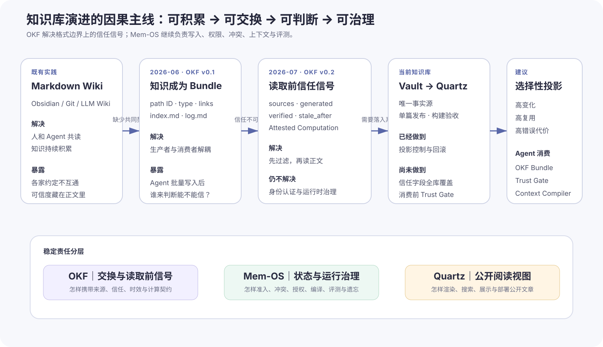
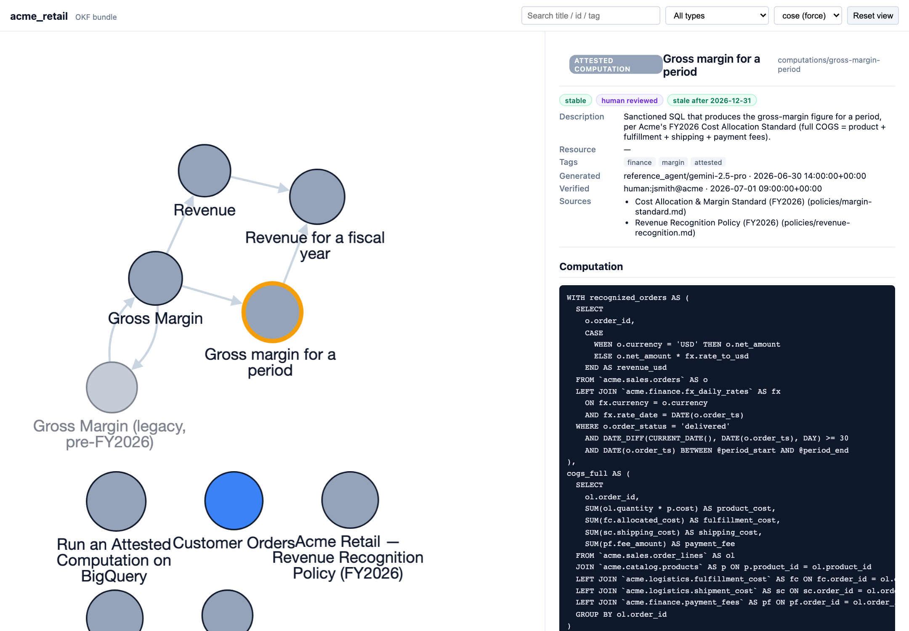
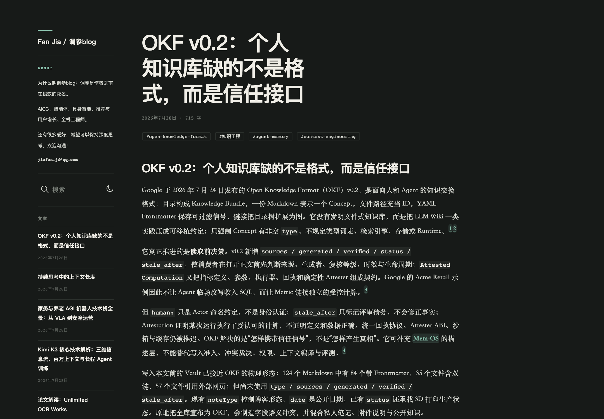
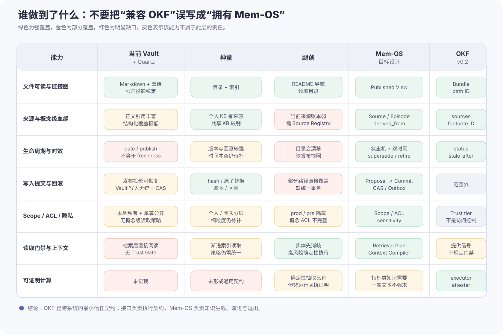
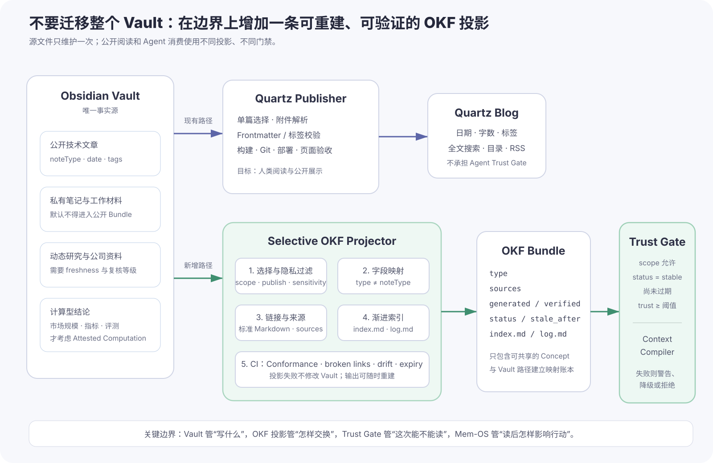

# OKF v0.2：契约与接口

[](assets/okf-v02-knowledge-base/03-evolution-route.svg)

*图 1　知识库从“可积累”走向“可交换、可判断、可治理”的因果主线。OKF 把读取前信号组织成跨系统契约，Projector 与 Trust Gate 把契约变成消费接口，Mem-OS 继续负责知识写入、演进与运行治理。自绘图；依据 OKF v0.2 固定版本规范、当前 Vault→Quartz 发布链路与本文 Mem-OS 实现审计。*

先给结论：**OKF v0.2 更适合被理解为一份轻量的信任契约，而不是一套已经可调用的信任接口。** 它约定生产者怎样声明来源、生成、复核、时效与计算，消费者怎样解释这些信号；Projector、Trust Gate 和 Context Compiler 才是让契约真正影响 Agent 行为的接口。我们已经有一个不错的 Markdown 知识库和一条严格的公开发布接口，却还没有完整的 Agent 契约执行接口。

神童、飓创以及此前提出的 Mem-OS，分别做到了受控写入、领域化读取和较完整的治理设计，却也都不能简单写成“已经实现 OKF”或“已经拥有 Mem-OS”。OKF v0.2 值得采用，但不值得把整个 Vault 原地迁移成一个 Bundle；更合适的做法，是在 Vault 边界上增加一条可重建的选择性 OKF 投影，再由消费接口执行本地风险策略。

本文所说的“信任契约”是对 OKF 工程作用的归纳，不是规范中的正式类型名。为了避免把几个相邻概念混成一句口号，需要先分清四层：

| 层次 | 它回答的问题 | 主要承担者 |
|---|---|---|
| 格式 | 文件怎样解析、链接和交换 | Markdown、Bundle 结构 |
| 契约 | 信任信号代表什么，生产者和消费者各承担什么责任 | OKF v0.2 |
| 接口 | 契约怎样进入过滤、警告、降级和拒绝等控制流 | Projector、Trust Gate、Context Compiler |
| 治理 | 知识怎样准入、冲突裁决、授权、回滚、评测和退出 | Mem-OS、Agent Runtime |

只有字段而没有消费策略，是一份没有被执行的静态契约；只有本地门禁而没有共同语义，是一套难以跨系统复用的私有接口。契约和接口接上之后，信任信号才会从“可展示元数据”变成“可执行控制流”。

> **证据边界**
>
> 本文的规范结论固定在 GoogleCloudPlatform/knowledge-catalog 提交 `3fcbb9f`，实现审计快照为 2026-07-29。公开版隐去了内部仓库地址、凭据、人员和业务数据，只保留可解释的机制、计数与差距。由于 OKF 是规范与示例仓库，不是学术论文，本文没有“论文原图”；视觉证据由两张真实界面截图和三张基于固定规范、源码及本地实现审计的自绘结构图组成。

## 1. OKF v0.2：从交换约定到信任契约

### 1.1 v0.1 约定怎样交换，v0.2 继续约定怎样判断

Open Knowledge Format 把一个目录定义为 Knowledge Bundle，把每份带 YAML Frontmatter 的 Markdown 定义为 Concept。路径就是 ID，标准 Markdown 链接形成概念图；除保留的 `index.md`、`log.md` 外，每个 `.md` 只强制要求一个非空 `type`。它不规定统一类型词表，也不规定数据库、向量检索、服务端或 Agent Runtime。[^okf-v02-spec]

这个设计延续了 LLM Wiki 一类“文件就是知识、链接就是结构、人和 Agent 共读”的实践，但把生产者和消费者之间原本隐含的约定变成了最低限度的交换契约。[^llm-wiki] v0.1 主要回答“另一套工具能否读懂这批文件”；v0.2 则把契约扩展到信任判断：当 Agent 一次能发现成百上千个 Concept 时，生产者要声明哪些事实，消费者又能否在付出正文读取和上下文成本之前，判断某条知识来自哪里、由谁生成、是否复核、有没有过期、某个数字是不是按约定方式算出来的？

| v0.2 字段或机制 | 它回答的问题 | 它没有保证什么 |
|---|---|---|
| `sources` | 结论来自哪些材料，具体 claim 对应哪个 source | 来源本身一定正确 |
| `generated` | 当前内容由谁、何时产生 | 生成者身份已经认证 |
| `verified` | 谁或什么过程对照来源确认过 | 所有事实永远正确 |
| `status` | Concept 是 `draft / stable / deprecated` 中哪一态 | 生命周期自动推进 |
| `stale_after` | 从哪一天起必须视为陈旧 | 系统会自动刷新内容 |
| Attested Computation | 某次运行是否用了受认可的计算并返回可核查回执 | 指标定义和底层数据天然正确 |

这里最容易被忽略的一点是：字段的**缺失也有语义**。没有 `verified` 就是 unverified；只有非 `human:` Actor 的复核是 machine-confirmed；至少有一个 `human:<id>` 复核才是 human-reviewed。`generated` 与 `verified` 被刻意分开，因为写作者不等于确认者，内容更新后也不能继承旧复核。[^okf-v02-spec]

[](assets/okf-v02-knowledge-base/01-google-acme-retail-visualizer.png)

*图 2　Google 官方 Acme Retail Bundle 的真实可视化界面。左侧是 Concept 链接图，右侧把生命周期、复核等级、时效、来源和计算契约一起呈现：OKF 定义了契约内容，可视化器则提供了读取契约的界面。截图来自固定提交中的 [Acme Retail 示例 Bundle](https://github.com/GoogleCloudPlatform/knowledge-catalog/tree/3fcbb9f828c2f23d109c855ee403c3a4c81f3a96/okf/bundles/acme_retail)，获取于 2026-07-29。*

### 1.2 Trust tier 是派生值，不是作者自报分数

OKF 没有让生产者写一个 `confidence: 0.93`。这是正确的：不同消费者、不同风险场景对“可信”的解释不一样，而且自报分数本身也会过期。契约只保存相对客观的事件和信号，让消费者通过自己的接口派生门禁。

假设 Concept 为 \(c\)，读取时间为 \(t\)，任务风险为 \(r\)，一个最小可执行门禁可以写成：

$$
\operatorname{eligible}(c,t,r)=
\operatorname{scopeAllowed}(c,r)
\land \operatorname{status}(c)=\text{stable}
\land t<\operatorname{staleAfter}(c)
\land \operatorname{trust}(c)\ge \tau(r)
$$

其中 \(\tau(r)\) 是任务风险对应的最低信任等级。写博客摘要时可以允许 unverified 并显示警告；引用动态公司数据时至少要求 machine-confirmed；执行合规或不可逆业务动作时，则可能要求 human-reviewed，甚至继续回读原始 Source。`scopeAllowed` 不是 OKF 的原生访问控制，而是本地 Mem-OS 或 Agent Runtime 必须补上的约束。

下面这段 Python 不是完整实现，但已经比“解析 YAML 后全部塞进向量库”更接近真正的消费者：

```python
from datetime import date

TRUST = {
    "unverified": 0,
    "machine-confirmed": 1,
    "human-reviewed": 2,
}


def verification_events(concept: dict) -> list[dict]:
    verified = concept.get("verified")
    if verified is None:
        return []
    return verified if isinstance(verified, list) else [verified]


def trust_tier(concept: dict) -> str:
    actors = [event.get("by", "") for event in verification_events(concept)]
    if any(actor.startswith("human:") for actor in actors):
        return "human-reviewed"
    if actors:
        return "machine-confirmed"
    return "unverified"


def eligible(concept: dict, today: date, minimum: str) -> tuple[bool, str]:
    # OKF 规定 status 缺失时默认为 stable。
    if concept.get("status", "stable") != "stable":
        return False, "lifecycle_not_stable"

    stale_after = concept.get("stale_after")
    if stale_after and today >= date.fromisoformat(str(stale_after)):
        return False, "stale"

    tier = trust_tier(concept)
    if TRUST[tier] < TRUST[minimum]:
        return False, f"trust_below_threshold:{tier}"

    return True, "accepted"
```

真正落地时还要补 `scope / sensitivity / task_risk`，并记录这次门禁为何接受或拒绝。关键不在代码行数，而在于：**接口必须把契约中的元数据变成控制流。**

### 1.3 Attested Computation 证明“按规定算了”，不证明“规定正确”

v0.2 最有新意的部分，是把计算拆成独立的 `type: Attested Computation` Concept。它声明 `runtime`、允许 Agent 填入的类型化 `parameters`、受认可的 `computation`、`executor` 应返回的 `receipt`，以及消费者侧运行的确定性 `attester`。Agent 只能提供参数值，不能临场改写 SQL 或 Python；Attester 再根据回执确认实际运行物与受认可计算一致，显示值也与权威结果一致。[^okf-v02-spec]

这解决的是“Agent 有没有偷偷换一种算法”或“文本中的数字是否对应本次运行结果”，不是“财务口径是否合理”“数据源是否漏数”。规范也明确区分：

- `verified`：文档级、低频，确认**定义**仍符合政策；
- attestation：调用级、每次运行，确认**执行**符合已验证定义。

因此，一篇普通技术随笔不需要 Attested Computation；市场规模、评测分数、经营指标和高风险决策数字才值得承担这套成本。v0.2 也仍把统一回执协议、Attester ABI、沙箱和缓存推迟到未来版本。它约定了计算契约和接口形状，却没有提供完整运行时。[^okf-v02-blog]

## 2. 当前知识库：发布接口很强，契约消费很弱

### 2.1 先区分三个对象：Vault、发布器、公开站点

当前系统不是一个目录这么简单，而是三层：

1. **Obsidian Vault** 是唯一事实源，保存公开文章、私人笔记和附件；
2. **Quartz Publisher** 做单篇选择、Frontmatter 与标签校验、附件解析、构建、Git 提交、部署等待和页面级验收；
3. **Quartz Blog** 是面向人类读者的公开投影，提供搜索、目录、主题与 RSS。

这条链路已经解决了很多 Mem-OS 式的工程问题：源与投影单向映射、发布前 clean-tree 预检、失败恢复、重命名时显式替换旧投影、构建后检查公式、图片和横向溢出。它远比“复制 Markdown 到网站目录”可靠。

但这三层都没有把 OKF 契约变成 Agent 的读取策略。发布器会检查 `title / description / date / publish / tags`，却不检查 `type / sources / generated / verified / status / stale_after`；Quartz 页面也不会根据这些字段拒绝陈旧内容、区分机器复核与人工复核，或把 Attestation 失败暴露给读者。我们拥有的是成熟的人类发布接口，不是契约驱动的 Agent 消费接口。

[](assets/okf-v02-knowledge-base/02-current-quartz-article.png)

*图 3　本篇旧版思考卡片在线上 Quartz 中的真实页面。页面很好地完成了人类阅读，却只展示日期、字数和标签，没有消费 `sources / generated / status / stale_after`；Frontmatter 已经包含部分契约字段，公开界面却没有执行这份契约。截图来自[旧版公开页面](https://jiafan-tiaocan.github.io/%E4%BA%94%E8%8A%B1%E5%85%AB%E9%97%A8%E7%9A%84%E6%80%9D%E8%80%83/okf-v0.2%EF%BC%9A%E4%B8%AA%E4%BA%BA%E7%9F%A5%E8%AF%86%E5%BA%93%E7%BC%BA%E7%9A%84%E4%B8%8D%E6%98%AF%E6%A0%BC%E5%BC%8F%EF%BC%8C%E8%80%8C%E6%98%AF%E4%BF%A1%E4%BB%BB%E6%8E%A5%E5%8F%A3)，获取于 2026-07-29。*

### 2.2 用数据回答“有没有做到”

对 Vault 排除隐藏目录后的 2026-07-29 快照做静态扫描，得到：

| 审计项 | 数量 | 对 OKF 的含义 |
|---|---:|---|
| Markdown 文件 | 139 | 若把整个 Vault 当 Bundle，它们都进入合规范围 |
| 可解析 Frontmatter | 97 | 仍有 42 份没有 Frontmatter |
| 含非空 `type` | 1 | 只有本篇旧卡片接近 OKF Concept |
| 含 `sources / generated / stale_after` | 各 1 | 同样只出现在本篇 |
| 含 `verified` | 0 | 全库没有标准化复核事件 |
| 含 Obsidian 双链 | 47 | OKF 只约定标准 Markdown 链接，需投影转换 |
| `publish: true` | 38 | 表达公开意图，不等于信任或实际投影 |
| Quartz 中实际文章投影 | 37 | 已出现源声明与公开状态不一致 |
| 保留名 `index.md / log.md` | 0 / 0 | 没有 OKF 的渐进索引与变更日志 |

所以，若把 Vault 根目录直接宣布为 OKF Bundle，它会在最基础的 Conformance 上失败：42 份 Markdown 没有 Frontmatter，138 份没有非空 `type`。更麻烦的不是缺字段，而是语义冲突：

- `noteType` 控制博客把内容显示为技术长文、论文解读、思考卡片还是生活文章，它不是 OKF 的开放概念类型；
- `date` 是公开展示日期，不是 `generated.at`，更不是 freshness；
- `publish: true` 是公开意图，不代表文件一定已经投影，也不代表 Agent 可以信任；
- 已有 `status` 还承载 3D 打印生产阶段等领域状态，不能直接等价为 OKF 的 `draft / stable / deprecated`；
- Vault 中含私人笔记和工作材料，合规可读不等于有权公开或有权进入 Agent 上下文。

还有两个很实际的漂移信号：当前 38 篇源文件声明 `publish: true`，Quartz 实际有 37 份文章投影；一份人工维护的发布说明仍记录“当前公开集合为 4”，而实际早已是 37。Git 和自动发布减少了内容丢失，却不能自动保证清单、意图和真实投影永远一致。**契约声明与接口真实状态之间的差异，正是 drift check 应该发现的问题。**

### 2.3 本篇文章本身就是一个反例

本篇旧版思考卡片已经写入 `type / sources / generated / status / stale_after`，并诚实地没有写 `verified`。从字段外观上看，它是全库最像 OKF 的一篇；但用户复核后指出，它不该是思考卡片，而应该是技术长文，还必须回答当前知识库和 Mem-OS 实践究竟做到了多少。

这件小事说明了三点：

1. `generated.by` 能告诉我们内容由模型生成，却不能替代内容形态判断；
2. `status: stable` 如果没有真实审核流程支撑，只是一句过早的自我声明；
3. 没有 `verified` 是正确的诚实表达；在用户完成复核前，不能伪造 `human-reviewed`。

因此这次修订把 `noteType` 改为 `technical`，把 OKF `status` 降回 `draft`，仍不写 `verified`。这不是保守，而是在文章自身上执行它主张的信任纪律。

## 3. 神童、飓创和 Mem-OS：分别做到了什么，还缺什么

[](assets/okf-v02-knowledge-base/04-current-system-audit.svg)

*图 4　五个对象的能力审计。绿色是强覆盖，金色是部分覆盖，红色是明显缺口，灰色表示不属于该层职责。结论不是谁“更先进”，而是谁解决了哪一段问题：OKF 是跨系统的最小信任契约，Projector 与 Trust Gate 是消费接口，Mem-OS 是知识真正生效、演进与退出的运行内核。自绘图；依据本地实现快照、[[Agent系统构建中的 Mem-OS：让知识与经验形成复利|既有 Mem-OS 长文]]与 OKF v0.2 固定版本规范。*

回答“那篇 Mem-OS 文章有没有做到”之前，必须先区分三个层次：

- **文章 artifact**：那份 Markdown 自己是否符合 OKF；
- **系统现状**：神童和飓创代码已经运行的机制；
- **目标架构**：文章提出但尚未全部实现的 Mem-OS。

把三者混在一起，就会把“文章提出了 CAS、Context Compiler”误写成“生产系统已经全部具备”，或者把“系统有来源日志”误写成“它已经是 OKF Bundle”。

### 3.1 那篇 Mem-OS 文章本身：论证上做到了，格式和消费上没有做到

[[Agent系统构建中的 Mem-OS：让知识与经验形成复利|《Agent 系统构建中的 Mem-OS：让知识与经验形成复利》]]已经做到几件比当前 OKF 更大的事：

- 区分 Source、Episode、Claim、Preference、Policy、Procedure 等不同真值类型；
- 把写入设计为 Proposal → Admission → Commit，而不是 `save(text)`；
- 要求 CAS、幂等、事件账本、备份、回滚和非破坏性归并；
- 先生成 Retrieval Plan，再由 Context Compiler 按权限、实体、时间和风险编译上下文；
- 用 outcome、人工反馈和 holdout 评测知识是否真正改善下一次行动。

从系统思想上，它覆盖了 OKF 明确不负责的运行治理。但那篇 Markdown 自身只有博客 Frontmatter 与正文引用，没有 OKF `type / sources / generated / verified / status / stale_after`，也没有一个消费者在读它之前执行 Trust Gate。它是**一篇论证 Mem-OS 的文章**，不是一个已运行的 Mem-OS，也不是一个 OKF v0.2 Concept。

这不意味着文章必须立刻改造成 OKF。面向人类的稳定技术长文，已有清晰引用、版本说明和公开发布验收时，新增字段的边际收益有限。只有当它开始被多个 Agent 稳定复用、自动编入任务上下文，或者其中的实施结论会随代码快速变化时，结构化 freshness 和 verification 才变得必要。

### 3.2 神童：最接近 Mem-OS 的是受控写入，不是 OKF 文件形状

神童的个人知识库路径已经具备较强的写入事务：

- 更新前读取旧内容哈希，避免静默覆盖并发变化；
- 写入时备份、原子替换，并级联刷新索引；
- 保存来源记录与 JSONL 事件账本，支持删除和回滚；
- 夜间 Agent 只提出结构化变更，确定性 Controller 负责校验、幂等、哈希检查和提交。

这些能力是 OKF 不负责、却是 Mem-OS 必须负责的。也就是说，神童即使完全不导出 OKF，也已经在“怎样让知识安全生效”上走得更远。

但覆盖并不均匀。共享知识路径仍偏向追加、覆盖与 `_index.json` 维护，缺少和个人知识库一致的 CAS、来源、备份、回滚与事件账本；时间冲突、细粒度 ACL、知识使用后的 outcome 归因，也还没有形成统一内核。读取侧虽然有渐进式索引和分层知识，但还没有一套跨类型一致的 Trust Gate。

所以准确表述应是：**神童已经实现了 Mem-OS 的一部分写入内核，尤其是个人知识库事务；尚未把个人与共享知识统一到完整的治理和读取内核。它没有必要把内部存储先改写成 OKF，但有必要在跨 Agent、跨系统消费的 Published View 上提供 OKF 式来源、复核和时效。**

### 3.3 飓创：最强的是领域确定性，不是通用记忆治理

飓创已经把一些高风险知识消费做得很扎实：

- 通过领域目录和 README 导航先定位产品、渠道和任务类型；
- 先做实体匹配、优先级与 stop rule，再进入回答；
- 对高风险合规文本采用确定性抽取和人工确认，而不是让模型自由改写；
- 隔离生产与预发布环境；
- 直播复盘记忆已经有 `triggers / confidence / scope` 等领域 Schema。

这些机制在“错误代价高时不要让模型自由发挥”这一点上，与 OKF 的受认可计算有相同精神。但它们不是 Attested Computation：当前没有针对每次运行保存标准回执，再由独立 Attester 证明实际执行物与认可版本一致。确定性抽取是执行策略，Attestation 是对执行事实的可验证证明，二者不能画等号。

飓创当前更明显的缺口在 Source Registry、版本契约、发布快照与统一写入事务。部分知识路径会直接覆盖，目录和索引可能漂移；直播复盘记忆虽然有业务 Schema，却还缺 CAS、事件账本、回滚、受控归并和效果评测。

因此，飓创也不需要把所有内部目录改造成 OKF。最值得先采用的是：

- 为高风险政策、产品规则和动态运营知识增加结构化 `sources / verified / stale_after`；
- 在跨环境发布时固定 bundle snapshot，校验目录与内容漂移；
- 若未来让 Agent 自动执行指标查询或规则计算，再为那部分建立 receipt + attester。

### 3.4 一张更严格的结论表

| 对象 | 已做到 | 没做到 | 是否需要 OKF |
|---|---|---|---|
| 当前 Vault→Quartz | 唯一事实源、选择性公开、构建与页面验收、投影失败恢复 | 全库来源/复核/时效，Agent 读取门禁，Bundle 索引与日志 | 只在 Agent 消费边界需要 |
| Mem-OS 长文本身 | 充分描述来源、写入、上下文、治理和评测思想 | 文档自身 OKF 元数据和消费者门禁 | 稳定人读可不做；高频 Agent 复用时做 |
| 神童现状 | 个人 KB 的哈希、原子写、账本、回滚，部分渐进读取 | 共享 KB 事务一致性、统一 Trust Gate、完整时间/权限/效果闭环 | 不改内部存储；对外 Published View 做 |
| 飓创现状 | 领域导航、实体消歧、高风险确定性执行、环境隔离 | 来源账本、快照、统一写入事务、运行回执证明 | 优先覆盖高风险和动态知识 |
| Mem-OS 目标 | Source/Episode、状态机、CAS、ACL、Context Compiler、评测与遗忘 | 尚需分阶段实现，不能当作现状 | OKF 可作为 Published View，不替代内核 |

## 4. 是否需要做到：取决于知识是否会驱动行动

不是每篇笔记都值得进入 OKF，也不是每个 OKF 字段都值得强制填写。判断标准不应是“这是不是技术文章”，而应是三个乘数：

$$
\operatorname{priority}(c)=
\operatorname{changeRate}(c)
\times \operatorname{reuse}(c)
\times \operatorname{errorCost}(c)
$$

变化快、复用高、错误代价高的知识优先；三者都低的私人随想，硬加流程只会制造维护债务。

| 场景 | 是否需要结构化信任 | 推荐强度 |
|---|---|---|
| 只供本人偶尔回看的生活记录、稳定思考 | 通常不需要 | 保留普通 Obsidian 笔记 |
| 已公开、主要供人类阅读的稳定技术长文 | 部分需要 | 引用、版本锚点、公开日期即可；不强求 Attestation |
| AI 进展、公司研究、源码研报 | 需要 | `sources + generated + verified + stale_after`，到期降级 |
| 神童/飓创的跨 Agent 共享知识 | 需要 | Published View 输出 OKF；内部事务仍由 Mem-OS 管 |
| 合规规则、不可逆操作依据 | 强需要 | human-reviewed、明确 Scope、过期拒绝、回读原文 |
| 市场规模、指标、自动评测结果 | 选择性强需要 | 独立 Attested Computation，逐次保存 receipt 并校验 |

这也解释了为什么“全库一键加字段”是错误方向。OKF 的 Conformance 很宽松，缺少可选字段不能拒绝 Bundle；但我们的业务门禁可以更严格。**标准负责互操作，组织负责风险策略。**

## 5. 从契约到接口：Vault 不动，在边界上做双投影

[](assets/okf-v02-knowledge-base/05-selective-okf-projection.svg)

*图 5　推荐的双投影架构。公开博客和 Agent 消费不是同一个产品：Quartz 提供人类阅读接口，选择性 OKF Projector 生成信任契约，Trust Gate 执行契约并决定“这次能不能读”，Mem-OS 决定“读后怎样影响行动”。自绘图；依据当前单向发布模型、OKF v0.2 规范与本文审计。*

### 5.1 为什么是投影，不是迁移

Vault 已经承担写作体验、双链、附件和私人工作材料。如果直接把它当 Bundle，会同时引入四类问题：

1. 42 份无 Frontmatter 文件使全库不合规；
2. `noteType / date / status` 与 OKF 字段存在语义重叠或冲突；
3. Obsidian 双链、嵌入和目录约定并非标准 Markdown Bundle；
4. 私人内容的“格式可读”会被误解为“允许共享”。

投影的好处是：源文件只维护一次，输出可以随时重建，投影失败不修改 Vault。它还允许 Quartz 与 OKF 采用不同策略——一篇文章可以通过公开接口供人阅读，但因为过期或未复核而暂时不进入 Agent 的契约执行接口。

### 5.2 字段不能机械改名，要建立语义映射

| Vault / Mem-OS 字段 | OKF 投影 | 规则 |
|---|---|---|
| 文件相对路径 | Concept path ID | 建立稳定映射账本；移动时保留旧路径映射 |
| `noteType: technical` | 不直接映射 `type` | 前者是页面内容形态；后者是概念语义 |
| `date` | 保留为扩展字段 | 公开展示日不等于 `generated.at` |
| Git/生成记录 | `generated: {by, at}` | 只在内容实质变化时更新 |
| 审核事件 | `verified[]` | 真实发生一次才写一次；不从 `publish` 推断 |
| 领域状态 | 本地 `domain_status` | 避免与 OKF `status` 冲突 |
| 生命周期 | OKF `status` | 仅使用 `draft / stable / deprecated` |
| 复核截止日 | `stale_after` | 到期触发降级、警告或拒绝，不自动修改正文 |
| 正文脚注与链接 | `sources[].id/resource` | 用稳定 ID 绑定 claim；保留可追溯原始资源 |
| `scope / sensitivity / ACL` | 本地扩展字段 | 投影前先过滤，不能把 Trust tier 当权限 |

这份文章当前没有 `verified`，就是映射纪律的一次实际演练：用户指出方向问题并触发重写，不等于已经逐项确认所有规范事实、实现判断和公开措辞。只有人工审核真正完成，才应追加一个人工复核事件。

### 5.3 Projector 的最小流水线

第一版不需要搭建新数据库，甚至不需要服务化。Projector 本质上是 Vault 与 OKF 之间的契约适配器，一个确定性 CLI 就够：

```text
select
  → reject_private_or_unknown_scope
  → parse_frontmatter
  → map_concept_type
  → rewrite_wikilinks
  → bind_claims_to_sources
  → emit_index_and_log
  → validate_okf_conformance
  → check_broken_links_and_expiry
  → compare_vault_projection_ledger
  → publish_immutable_bundle_snapshot
```

CI 至少要失败于：

- 被选 Concept 没有非空 `type`；
- 结构化来源引用的 `sources[].id` 不存在；
- 私有或未知 Scope 内容进入公开 Bundle；
- `verified.at < generated.at` 却仍宣称旧复核有效；
- 高风险 Concept 到达 `stale_after`；
- Vault 路径映射、Bundle 文件和索引三者漂移；
- Attested Computation 缺 `runtime / executor.receipt / attester`。

注意：OKF 规范要求消费者容忍断链和缺少可选字段，以保持开放交换；我们的受控投影 CI 可以比规范更严格，但必须把这是**本地发布策略**而不是 OKF Conformance 写清楚。

### 5.4 Trust Gate 必须在检索之前和之后各做一次

只在检索后检查不够，因为不合格 Concept 已经消耗了索引和上下文；只在检索前检查也不够，因为任务风险、实体和动作类型通常在规划后才明确。

推荐两阶段：

1. **Pre-retrieval filter**：按 Scope、生命周期、过期状态和最低 trust tier 缩小候选；
2. **Post-retrieval decision**：结合任务风险、claim 来源、冲突和 Attestation 结果，决定原文、摘要、警告、降级或拒绝。

通过门禁的内容再交给 Context Compiler，按 Policy、Fact、Preference、Procedure 使用不同表示。OKF 契约告诉系统“这份知识声明了什么”，Trust Gate 接口决定“这次能不能读”，Mem-OS 决定“读后怎样影响行动”。

## 6. 落地顺序与验收：先证明门禁有效，再扩大覆盖

### P0：不要改全库，先选 10 个高价值 Concept

首批应覆盖四类：

- 变化快的 AI 进展；
- 会被重复引用的公司或源码研究；
- 神童/飓创跨 Agent 共享的规则与流程；
- 至少一个计算型结论。

为每个 Concept 补齐 `type / sources / generated / status / stale_after`，但先不追求人工复核覆盖率。建立 Vault→Bundle 映射账本和可重建输出，避免形成第二事实源。

**完成标准**：10 个 Concept 全部通过 Conformance；没有私有内容泄露；Source ID 能落到具体 claim；任一投影文件删除后可以从 Vault 重建。

### P1：让 metadata 进入控制流

实现前后两阶段 Trust Gate，并记录每次决策：

```text
concept_id
task_id
risk_level
required_trust
observed_trust
freshness
decision = accept | warn | downgrade | reject
reason
source_snapshot
```

**完成标准**：测试集中故意加入 draft、deprecated、过期、低信任和无权 Scope 内容，系统能按策略拒绝或降级；不能只检查页面上“是否显示了徽章”。

### P2：只给计算型知识加 Attestation

选择一个真实、高复用的计算——例如市场规模、评测指标或运营汇总——拆成独立 Concept。固定运行时和参数表面，执行器返回声明过的 receipt，独立 Attester 比对实际执行物和结果。

**完成标准**：以下四种失败都必须被识别：

1. Agent 改写受认可计算；
2. 传入未声明参数；
3. 文本展示值与 receipt 不一致；
4. 定义已过期但单次运行仍能通过 Attestation。

最后一种尤其重要：它证明 `verified`、`stale_after` 与 Attestation 是互补关系，不能拿“代码跑通”替代“定义仍然正确”。

### 6.1 建议持续观测的五个指标

| 指标 | 定义 | 希望发现什么 |
|---|---|---|
| Conformance Coverage | 选定 Concept 中通过 OKF 结构校验的比例 | 投影器是否稳定 |
| Claim Source Coverage | 有来源 ID 的关键 claim / 全部关键 claim | 来源是否只停在文末参考资料 |
| Stale Escape Rate | 已过期 Concept 仍进入上下文的比例 | 门禁是否真正生效 |
| Trust Decision Accuracy | 测试集上 accept/warn/reject 与预期一致率 | policy 是否正确 |
| Projection Drift | Vault 选择集、映射账本、Bundle、索引间差异数 | 是否产生第二事实源 |

不要用“有多少篇加了字段”作为成功指标。真正的成功是：高风险任务里，过期或低信任知识不再悄悄进入上下文；发生错误时，系统能回答它来自哪份 Source、谁复核过、为何被选中、怎样撤回。

## 7. 结论：OKF 定义契约，接口必须另行实现

OKF v0.2 的价值，不是证明 Markdown 还能加多少 YAML。它把 Agent 大规模消费知识时最缺的四类信号组织成一份轻量、可移植的契约：来源、生成与复核、生命周期、受认可计算。它也诚实地没有声称自己已经提供身份认证、访问控制、写入事务、冲突、检索、上下文编译和运行时治理接口。

对当前知识库，答案是：

- **是否已经做到？** 物理形态接近，公开发布治理较强；OKF Conformance、结构化信任覆盖和消费门禁没有做到。
- **那篇 Mem-OS 文章是否做到？** 目标设计覆盖面超过 OKF，但文章 artifact 不是 OKF，目标也不能冒充系统现状。
- **神童是否做到？** 个人知识库的受控写入已经很强，共享知识和统一读取治理仍需补齐。
- **飓创是否做到？** 领域导航与高风险确定性执行较强，来源、快照、事务和运行证明仍不完整。
- **是否需要做到？** 需要，但只对高变化、高复用、高错误代价且会驱动 Agent 行动的知识做到；普通私人笔记和稳定人读文章不应被迫承担同样流程。

最稳妥的下一步不是迁移 139 份 Markdown，而是挑 10 个 Concept，建立一条选择性 OKF 契约投影和一个真的会拒绝内容的 Trust Gate。**契约负责让信任可以被共同理解，接口负责让信任真正改变消费者行为。**

## 参考资料

[^okf-v02-spec]: [Open Knowledge Format v0.2 Specification（固定提交 3fcbb9f）](https://github.com/GoogleCloudPlatform/knowledge-catalog/blob/3fcbb9f828c2f23d109c855ee403c3a4c81f3a96/okf/SPEC.md)
[^okf-v02-blog]: [Google Cloud Blog：Open Knowledge format v0.2 tackles agentic trust](https://cloud.google.com/blog/products/data-analytics/okf-v0-2-adds-trust-signals/)
[^llm-wiki]: [Andrej Karpathy：LLM Wiki](https://gist.github.com/karpathy/442a6bf555914893e9891c11519de94f)

- [GoogleCloudPlatform/knowledge-catalog：OKF v0.2 Acme Retail 示例 Bundle](https://github.com/GoogleCloudPlatform/knowledge-catalog/tree/3fcbb9f828c2f23d109c855ee403c3a4c81f3a96/okf/bundles/acme_retail)
- [[Agent系统构建中的 Mem-OS：让知识与经验形成复利]]
