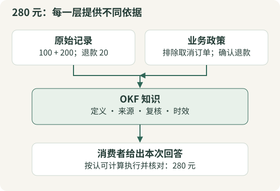
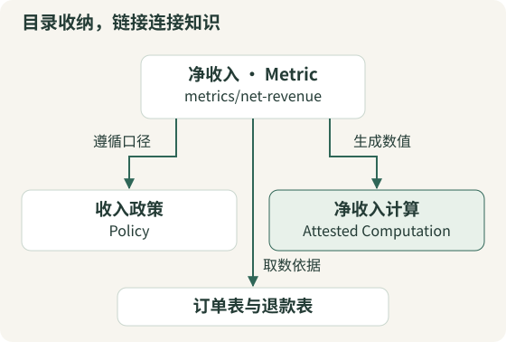
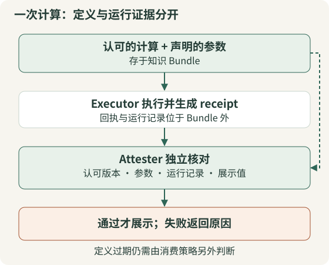
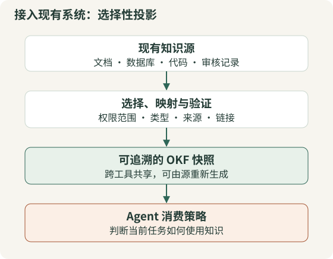

一个 Agent 被问到：“本月线上渠道的净收入是多少？”它找到了订单表、退款表和一篇指标说明，算出了一个数字。真正困难的部分随后才开始：它找到的是哪一版口径？取消订单有没有排除？退款按哪一天归属？指标说明由谁确认？Agent 是否照着认可的算法执行，还是临时写了一段看起来合理的 SQL？

**OKF（Open Knowledge Format，开放知识格式）为这些问题提供一套可交换的知识表达约定。** 它以 Markdown 文件和 YAML 元数据为基础，让知识能被人阅读、被工具解析，并携带来源、复核、时效和计算约定。把这些约定接进检索、执行与审核流程，才会形成真正影响 Agent 行为的系统。

本文沿着同一个零售净收入案例，依次看清知识怎样写、怎样组织、怎样判断、怎样计算、怎样维护。案例数据和审核人均为教学设定；文中的运行结果来自随文提供的本地程序。另以仓库内的 Acme Retail、GA4 示例说明上游实际交付了什么，二者不会混写成生产落地证据。

> 核验时间：2026-09-08。当前维护入口已迁至 [GoogleCloudPlatform/open-knowledge-format](https://github.com/GoogleCloudPlatform/open-knowledge-format)，旧仓库中的 OKF 目录已注明冻结。本文固定到提交 [`ad30107`](https://github.com/GoogleCloudPlatform/open-knowledge-format/tree/ad30107c31c06aec8a7d5636e0d1058118604e6f)。规范标题目前仍为 0.2，但文章围绕 OKF 的完整机制展开；涉及版本差异时另行说明。规范、参考实现、本文扩展策略分别标注。

## 1. 先把问题说清：知识文件要承载什么

假设一个虚构商店的本月线上交易如下。金额单位为元，所有数据仅用于教学。

| 记录 | 状态 | 金额 | 本例处理方式 |
|---|---|---:|---|
| 订单 A | paid | 100 | 计入已支付订单 |
| 订单 B | paid | 200 | 计入已支付订单 |
| 订单 C | cancelled | 50 | 不计入 |
| 退款 R，关联订单 B | confirmed | 20 | 从收入中扣除 |

本例按订单月份统计 paid 订单，退款则按退款发生月份统计：只扣除关联 paid 订单的 confirmed 退款，渠道取关联订单的渠道；退款可以对应更早月份的订单。表中订单与退款都发生在同一个月，所以本月线上净收入是 `100 + 200 − 20 = 280`。这不是通用会计准则，只是为了把知识、代码和执行证据连接起来的一条明确规则。

把这句话放进普通笔记，已经能帮助人理解。但换一个 Agent 接手时，它还需要知道：

- “净收入”是一项指标，“订单”是一张表，“退款归属”是一条政策，它们各自是什么对象。
- 哪些原始材料支撑了“只算 paid”和“扣除 confirmed refund”这两个判断。
- 谁生成了指标说明、谁对照政策复核过、何时需要再次确认。
- 如果要报出 280，受认可的计算在哪里，执行结果怎样核对。

OKF 用一组小而明确的约定承载这些信息，而不要求所有参与者使用同一种数据库、模型或 Agent 框架。其设计目标是可读、可解析、可做版本差异、可跨工具交换。[^okf-spec]



*图 1　同一个“280”背后有不同对象：数据提供事实，政策定义口径，知识文件组织解释，执行与核验提供本次结果的证据。图中执行与门禁由消费者实现。*

## 2. 最小结构：Concept、Bundle 和链接

### 2.1 Concept 是一个可以独立引用的知识单元

在 OKF 中，一份 Concept 是一份 UTF-8 Markdown 文档，顶部有 YAML Frontmatter。它既可以描述订单表、API 等具体资源，也可以描述净收入、故障处置流程等抽象知识。

一个最小文件可以只有：

```markdown
---
type: Metric
---

# 净收入

本例中，净收入为已支付订单金额减去已确认退款。
```

`type` 是普通 Concept 唯一始终必填的元数据键，类型值需要是非空字符串。`title`、`description`、`resource`、`tags` 是推荐字段；来源、信任和时效字段都是可选的。带有特定语义的类型另有相应约定，例如 Attested Computation 要声明 `runtime`。[^okf-spec]

类型没有中央注册表。团队可以使用 `Metric`、`Policy`、`API Endpoint` 或自己的名称。消费者需要容忍未知类型。这让接入成本很低，也意味着团队仍需协商哪些类型实际承担什么职责。

Concept 的拆分标准不应是“每隔 500 字切一块”。更有用的判断是：这段知识是否有独立来源、独立维护责任、独立时效，或者会被其他文档单独引用。净收入定义和退款政策就值得分开：前者可以不变，后者却可能下个月调整。

### 2.2 Bundle 是交换单位，路径就是 Concept ID

把相关 Concept 放进目录，就组成一个 Knowledge Bundle。本例的核心目录如下（省略子目录索引、数据文件和运行辅助代码）：

```text
retail-bundle/
  index.md
  log.md
  metrics/
    net-revenue.md
  tables/
    orders.md
    refunds.md
  policies/
    revenue-recognition.md
  computations/
    net-revenue.md
  references/
    net_revenue.py
    executor.py
    attester.py
```

`metrics/net-revenue.md` 的 Concept ID 是 `metrics/net-revenue`，不是 Frontmatter 中另写的 UUID。把文件移到另一个目录会改变 ID，因此文件移动涉及链接和引用迁移，不能当作无影响的排版操作。

`index.md` 和 `log.md` 是保留文件名：前者用于导航，后者记录变化。除它们之外，Bundle 内其他 `.md` 文件都被当作 Concept。这意味着随手放进 Bundle 的 `README.md` 也需要符合 Concept 的结构；普通使用说明可以放在 Bundle 外。Python、CSV 等非 Markdown 资源不因此变成 Concept。

Bundle 可以是 Git 仓库、仓库的子目录或压缩包。Git 很适合提供历史、差异与评审，但 OKF 本身并不要求安装 Git 才能读取。

### 2.3 链接形成图，但没有自动获得业务关系语义

在净收入文档中可以写：

```markdown
按[收入确认政策](/policies/revenue-recognition.md)解释口径，
从[订单表](/tables/orders.md)与[退款表](/tables/refunds.md)取数，
使用[净收入计算](/computations/net-revenue.md)生成结果。
```

开头的 `/` 在 OKF 中表示 Bundle 根目录，而不是操作系统根目录。也支持 `../tables/orders.md` 这样的相对路径。普通浏览器直接打开原始文件时，不一定知道 Bundle 根在哪里，因此可视化器和发布器需要处理这种语义。



*图 2　文件夹负责收纳，链接负责跨目录连接。箭头旁的“遵循”“取数”“计算”是正文解释的关系，当前 OKF 没有把这些词注册成标准化边类型。*

这一区分决定了 OKF 与强约束本体系统的距离：它可以表达丰富知识并形成可遍历的图，但普通链接没有自动附带“可执行动作”“关系基数”“推理规则”或权限含义。需要这些能力时，应在消费者或扩展 Schema 中定义。

## 3. 一份完整知识文件，怎样把依据带上

下面把净收入 Concept 扩充为较完整的样子。这里的路径、人物标识和时间均为教学示例，不代表真实审核记录；可运行附件中的具体文件是该结构的独立实现。

```yaml
---
type: Metric
title: 月度线上净收入
description: 教学口径下的已支付订单金额减去已确认退款。
tags: [retail, revenue]
status: stable
generated:
  by: demo-author/1.0
  at: "2026-09-01T09:00:00+08:00"
verified:
  - by: human:demo-reviewer
    at: "2026-09-02T10:00:00+08:00"
stale_after: "2026-10-01T00:00:00+08:00"
sources:
  - id: revenue-policy
    resource: /policies/revenue-recognition.md
    title: 教学收入确认政策
    last_modified: "2026-09-01T08:00:00+08:00"
---
```

教学包为保持零依赖，用 JSON 对象形式书写有效 YAML；这里采用通常的 YAML 排版来帮助阅读。正文里再把具体判断绑定到来源：

```markdown
# Definition

仅计入 paid 订单，并扣除口径范围内的 confirmed 退款。[^revenue-policy]

计算方式见[净收入计算](/computations/net-revenue.md)。

[^revenue-policy]: 教学收入确认政策。
```

`sources[].id` 与脚注标签对应，形成“这个判断依据哪份材料”的稳定连接。脚注解释文字可以改写，来源数组也可以重排；只要 ID 不变，归因就不会因为 `sources[0]` 变成另一个来源而悄悄错位。

### 3.1 resource 和 sources 不能机械混用

Concept 顶层的 `resource` 指向它描述的底层资产，例如订单表的规范 URI。`sources[].resource` 指向形成这份知识的依据，例如数据字典、政策文件或另一个 Concept。

净收入这种抽象指标可以没有顶层 `resource`，但仍然有政策来源。反过来，一份描述订单表的文档可以有清楚的 `resource`，却没有说明“为什么 cancelled 不计收入”的依据。知道数据在哪里与知道口径依据什么，是不同的信息。

规范允许来源是具体材料，也允许是范围描述，例如“某项目中的全部查询”。范围描述有助于交代提炼背景，但无法像固定 URL、提交或快照那样直接回读。对于关键判断，本文建议尽可能保留可定位的原始材料；这是质量建议，不是新增必填规则。

### 3.2 来源信号帮助判断，不代替判断

每条来源还可带 `author`、`usage_count` 和 `last_modified`。`usage_window` 交代使用次数对应的时间窗口，也允许单个来源覆盖共享窗口。

例如“过去 30 天被调用 5,000 次”可以说明一条查询仍在使用，却不能证明口径正确。定时任务的 5,000 次执行与人的 5,000 次主动查阅也不能直接当作同一种可信度。规范明确把这类字段当作活跃度、趋势和粗粒度信号，不保存一个跨场景通用的可信分数。[^okf-spec]

没有记录来源时，系统应诚实地知道“来源未知”，而不应让模型补一组看上去可信的出处。

## 4. 生成、复核、生命周期和时效，是四个独立问题

### 4.1 谁写的，不等于谁检查过

`generated` 记录当前内容怎样产生；`generated.at` 表示内容最近一次实质变化。`verified` 记录谁或什么流程对照来源、底层资源做过确认。

Actor 的常见写法是：

| Actor 写法 | 意义 | 示例 |
|---|---|---|
| `<producer>/<version>` | Agent 或工具 | `demo-author/1.0` |
| `human:<id>` | 人 | `human:demo-reviewer` |
| `process:<id>` | 自动化流程 | `process:nightly-schema-check` |

单次复核可写成一个 `{by, at}` 对象，多次复核可写成列表；消费者必须把单对象按一元素列表理解。

按当前规范，信任等级由 `verified` 派生：没有复核为 `unverified`；只有非人类 Actor 的复核为 `machine-confirmed`；只要存在 `human:` Actor 的复核，为 `human-reviewed`。它是声明信号，不是登录认证结果，更不等于有人对文件做了数字签名。手工写一行 `human:someone` 就能改变字段外观，所以实际系统必须确保只有受控审核流程才能写入这类记录。

### 4.2 stable、human-reviewed 和 fresh 不能互相替代

`status` 的三个约定值是 `draft`、`stable`、`deprecated`；缺失时默认为 `stable`。`stale_after` 则给出从哪个绝对时刻开始视为陈旧。

| 状态组合 | 能读出什么 | 不能据此推出什么 |
|---|---|---|
| stable + unverified | 被标为可消费，但没有复核记录 | 已经由人确认 |
| stable + human-reviewed + 已过期 | 曾有人复核，时效已到 | 现在仍适用 |
| deprecated + human-reviewed | 历史版本曾获确认 | 应继续用于新业务 |
| stable + 无 stale_after | 没有给出失效时刻 | 永不过期 |

同理，缺少可选信任字段不能成为 OKF 格式读取器拒绝文档的理由。业务系统可以选择“不让这份知识驱动高风险动作”，但要把它记录为应用策略决定，不能声称文档违反了 OKF 格式。

### 4.3 最新时间规则：按时刻判断，明确时区

2026-08-21 的修订统一要求时间戳使用带显式 UTC 偏移的 ISO 8601 datetime。`stale_after` 由旧的纯日期比较改成 `now >= stale_after` 的时刻比较。`sources[].last_modified` 和 `usage_window` 的示例也同步改了。版本标签仍是 0.2，因此只看 `okf_version` 无法区分这两种阅读口径。[时间规则修订](https://github.com/GoogleCloudPlatform/open-knowledge-format/commit/ad30107c31c06aec8a7d5636e0d1058118604e6f)。

```yaml
# 当前规则：北京时间 10 月 1 日零点开始陈旧
stale_after: "2026-10-01T00:00:00+08:00"

# 同一时刻也可以写成 UTC
# stale_after: "2026-09-30T16:00:00Z"
```

不能随手把旧的 `2026-10-01` 补成 `2026-10-01T00:00:00Z`，否则相对于北京时间零点会晚 8 小时失效。迁移必须先明确业务时区。`log.md` 的日期分组标题仍用 `YYYY-MM-DD`，不需要改成时间戳。

仍然基于 `date.fromisoformat()` 的过期检查需要更新：当前消费者应解析带时区的 datetime，再比较绝对时刻。对缺少时区、非法时间以及 YAML 解析器已经转成 datetime 对象的情况，也需要明确定义处理方式。

### 4.4 内容改了，旧复核算不算数

假设 9 月 2 日有人复核了“退款按支付月归属”，9 月 5 日 Agent 又把正文改成“退款按退款月归属”，却保留了旧的 `verified`。

当前规范的等级规则只看复核 Actor，并没有定义“复核早于生成时间时自动失效”的算法。它明确允许内容变化与复核独立记录。于是，这份文档仍可能显示 `human-reviewed`，但这不足以说明人审覆盖了新内容。

**本文的消费者扩展策略是：对需要复核的任务，仅把不早于当前内容生成时间、且不晚于消费时点的复核计入有效审核。** 更严谨的生产实现还应将审核事件绑定到内容哈希或版本，而不只依赖时间比较。这里必须区分“规范派生等级”和“当前任务是否可以使用”，随文程序也分别输出两者。

## 5. Agent 怎样找到知识，而不是一次读完整个目录

OKF 的 `index.md` 用于渐进披露：先展示目录中有哪些知识及其简述，需要时再打开正文。根索引可以声明目标规范版本：

```markdown
---
okf_version: "0.2"
---

# 指标

- [月度线上净收入](metrics/net-revenue.md) - 定义、政策依据与计算入口。

# 数据与规则

- [订单表](tables/orders.md) - 订单状态和金额字段。
- [退款表](tables/refunds.md) - 退款状态与归属。
- [收入政策](policies/revenue-recognition.md) - 教学口径及适用范围。
```

只有 Bundle 根 `index.md` 有这一项 Frontmatter 例外；子目录索引不应照搬 Concept 元数据。索引是可选的，缺失时消费者可以生成。`log.md` 也可选，用倒序日期分组记录重要变化；它适合供人阅读，不能替代完整事务日志或 Git 历史。

面对净收入问题，消费者可以按以下顺序工作：先定位 Metric，读取元数据；再沿链接检查政策和表定义；发现需要计算时，才加载对应 Attested Computation。若后端使用全文检索、向量索引或混合检索，依然可以保留这套步骤。

需要注意，**OKF 提供可导航结构，没有规定检索算法，也没有自动保证更少 token 或更高回答准确率。** 是否有效，取决于 Concept 划分、索引描述、候选过滤和任务评测。把所有文档仍然塞进同一个上下文，并不会因为它们多了 YAML 就变成高质量检索。

## 6. 从“知道怎么算”到“核对这次确实这样算”

### 6.1 为什么要单独定义 Attested Computation

在案例里，净收入文档说清了定义，但 Agent 依然可能把全部订单相加，给出 350；或者排除了取消订单，却忘记退款，给出 300。即使最后刚好是 280，也不能仅凭数字一致判断算法正确。

Attested Computation 把受认可计算做成独立 Concept，声明运行时、允许传入的参数、计算内容、执行入口和确定性核验入口。Agent 在消费这份计算时只能提供已声明参数的值，不能临场改写计算逻辑。[^okf-spec]

这样，净收入的含义和净收入的具体算法可以分别维护，多个报表也可以复用同一份计算。收入、利润和毛利率若有不同定义与时效，就分别拥有计算 Concept，而不是挤进一个大型字段列表。

### 6.2 五个角色各负责什么

| 项目 | 本例含义 | 谁负责执行约定 |
|---|---|---|
| `runtime` | 使用 Python 运行 | 消费者的执行环境 |
| `parameters` | 月份、渠道等允许填写的值 | 参数校验器与执行器 |
| `computation` | 已审核的净收入代码 | 知识生产与审核流程 |
| `executor` / `receipt` | 执行代码，并返回本次运行证据 | 执行器 |
| `attester` | 检查实际计算、参数和结果 | 消费者侧的确定性程序 |

下面展示附件采用的计算约定，省略来源与复核字段。receipt 的字段名与调用方式是本文教学约定，不是 OKF 已统一的运行协议。

```yaml
type: Attested Computation
title: 教学净收入计算
runtime: python
parameters:
  - { name: month, type: string, required: true }
  - { name: channel, type: string, required: true }
computation: /references/net_revenue.py
executor:
  resource: /references/executor.py
  receipt:
    - run_id
    - executed_file_sha256
    - input_sha256
    - data_sha256
    - parameters
    - result
attester:
  resource: /references/attester.py
```

短计算也可以直接放在正文 `# Computation` 下的单个代码围栏里，二者择一。附件中的 `source-lock.json` 在 Bundle 外固定批准的代码和数据哈希，避免只核对一个由执行器自报的哈希。`input_sha256` 绑定本次数据与参数；`run_id` 用于重读本地运行记录。



*图 3　知识 Bundle 保存定义和执行约定；receipt 属于本次运行，应保存在运行记录中。核验失败需要向消费流程显式返回，不能只在日志里留一行 warning 后仍展示数字。*

### 6.3 一个回执不等于一份可信证明

如果 Agent 自己写一段 JSON，声称“运行了正确代码，结果 280”，它只是新增了一段文字。上游规范在 BigQuery 示例中强调：消费者可以按 job ID 回读权威结果，核对实际执行的 SQL 与绑定参数后的受认可计算，再检查展示值与结果一致。

这至少涉及两项检查：计算来源一致，结果表达一致。部署到真正的远程系统时，还需要可信执行记录、身份与权限、不可被同一 Agent 任意修改的认可版本，以及隔离执行环境。OKF 本身不会替你建立这些信任根。

本地演示能展示的是：在同一受控环境里，固定代码、输入与参数，生成回执，再由独立代码重算并交叉检查。它没有云端作业服务或硬件证明，因此不能据此宣称“已经证明一个不可信远程执行器真实运行了某段代码”。

### 6.4 复核定义与核验运行缺一不可

人工昨天确认了政策，不代表 Agent 今天没有改错 SQL；今天的 SQL 执行完全正确，也不代表上个月的政策仍然有效。

`verified` 是文档层的确认，attestation 是每次执行的确认，`stale_after` 是定义时效的信号。三者需要分别消费。对于“旧定义已经过期、但代码严格按旧定义算对了”的情况，attester 可以通过，业务门禁仍应按本地策略停止使用。

当前规范把 receipt/verdict 的统一传输格式、attester ABI、可移植性、沙箱和缓存等放在后续工作中。不要把本文的 Python 函数名、JSON Schema 或运行目录误当成全行业已经兼容的接口。[^okf-spec]

## 7. 把案例跑起来：结果与失败都需要证据

随文提供一个不需要数据库和模型密钥的 Python 教学包：[下载案例与运行说明](OKF：开放知识格式完整解读.assets/okf-retail-demo.zip)。解压后按 README 运行 `python3 run_demo.py`，它会输出计算结果、原始信任等级、消费策略判断和核验结果。

固定算法的关键几行如下。这里先保留全部 paid 订单供退款关联，再对销售额筛选月份，因此当月退款可以追溯到更早月份的订单：

```python
paid_orders = {o["id"]: o for o in orders if o["status"] == "paid"}
sales = sum(
    o["amount_yuan"] for o in paid_orders.values()
    if o["month"] == month and in_channel(o)
)
returns = sum(
    r["amount_yuan"] for r in refunds
    if r["status"] == "confirmed" and r["month"] == month
    and r["order_id"] in paid_orders
    and in_channel(paid_orders[r["order_id"]])
)
net_revenue = sales - returns
```

`in_channel` 在附件中按 `online / store / all` 筛选。把取消订单加入 `paid_orders` 会让本例结果变成 330；单纯忘扣退款则是 300。两者虽然都看起来像一个正常金额，错误原因却不同。

本次核验已从压缩包重新解压运行，51 项断言全部通过。教学包有明确分工：`bundle/` 保存可交换知识与受认可计算；执行产生的记录放在 Bundle 外；审核人名称和业务数据均为虚构。运行时点固定，避免过几天重跑时因为真实时间流逝而得到不同测试结果。

| 条件 | 实际观测与断言 | 验证的问题 |
|---|---|---|
| 正常数据、正确参数、有效复核 | 净收入 280，允许消费 | 输入、口径、计算与回答一致 |
| 计算代码被替换 | 核验失败 | 实际计算是否还是预先认可版本 |
| 把显示值从 280 改成 300 | 核验失败 | 回答中的数字是否忠于运行结果 |
| 未声明参数进入执行入口 | 拒绝参数 | Agent 是否越过合同参数边界 |
| 定义已到 stale_after | 消费策略拒绝 | 运行正确是否掩盖了定义过期 |
| 人工复核早于正文实质变化 | 规范等级仍可为 human-reviewed，策略拒绝 | 徽章是否被误当作当前内容有效审核 |

这些检查用于证明教学实现的行为，不是完整 OKF 认证，也不构成生产系统可靠性评测。可迁移的经验是：把不确定性拆成可观察的失败原因，而不是让模型用“我已仔细检查”代替证据。

实际业务还应补充一些本例没有覆盖的条件：订单重复、退款跨月、币种与小数精度、迟到数据、重跑幂等、数据快照变动和并发审核。它们不会因为采用 OKF 自动消失。

## 8. 上游参考实现已经提供什么

OKF 当前仓库同时包含规范、参考 Agent、可视化器和示例 Bundle。仓库明确把 Agent 和可视化器定位为概念验证；它们让规范的生产与消费两端更具体，不等于唯一实现或通用生产平台。[^okf-reference]

参考 Agent 的主要路径是两遍处理：先根据 BigQuery 元数据为概念生成文档，再由模型从显式提供的网页种子出发，选择补充现有概念、创建引用文档或跳过。网页读取有页面上限和允许域名约束。使用 BigQuery 和模型服务时仍需要相应身份与运行成本；这些是参考实现的依赖，不是 OKF 文件格式的依赖。

| 仓库中的实例 | 可以直接看到什么 | 证据边界 |
|---|---|---|
| [GA4](https://github.com/GoogleCloudPlatform/open-knowledge-format/tree/ad30107c31c06aec8a7d5636e0d1058118604e6f/bundles/ga4) | 围绕电商数据集组织表、字段与文档知识 | 公开数据集样例 |
| [Stack Overflow](https://github.com/GoogleCloudPlatform/open-knowledge-format/tree/ad30107c31c06aec8a7d5636e0d1058118604e6f/bundles/stackoverflow) | 跨表与跨概念的解释、引用和导航 | 仓库内生成产物 |
| [Acme Retail](https://github.com/GoogleCloudPlatform/open-knowledge-format/tree/ad30107c31c06aec8a7d5636e0d1058118604e6f/bundles/acme_retail) | 指标、来源、复核与计算约定如何组合 | 虚构零售示例，不是客户生产案例 |

可视化器会把 Bundle 转成一个 HTML 文件，展示概念图、详情、反向引用、搜索和类型过滤。这是理解文件链接结构的便利工具。仓库 README 同时说明页面使用 CDN 加载 Cytoscape.js 和 marked，因此“一个 HTML 文件”不能直接理解成“所有环境都可断网打开”。

源码还暴露了一个值得具体检查的边界：[Acme 的收入计算](https://github.com/GoogleCloudPlatform/open-knowledge-format/blob/ad30107c31c06aec8a7d5636e0d1058118604e6f/bundles/acme_retail/computations/revenue-ytd.md)声明返回 `job_id / executed_sql / result`，但对应的 [sql_equality.py](https://github.com/GoogleCloudPlatform/open-knowledge-format/blob/ad30107c31c06aec8a7d5636e0d1058118604e6f/bundles/acme_retail/attesters/sql_equality.py)明确不联网，也不检查实际绑定的参数值，而是信任执行器提供的回执。它展示了确定性核验的接口形状，并未实现第 6 节所说的完整权威结果回读。规范提出的消费流程与样例实际完成的检查，仍需分别判断。

目前这些一手材料能证明规范表达方式和参考实现的存在，不能据此得出“已在大规模生产中提升多少准确率”的结论。工具选择时也应区分“声明支持 OKF”和“对当前时间规则、字段兼容、失败行为有实际测试”。

## 9. 如何接进已有知识库与 Agent 系统

采用 OKF 的合理起点，是找出哪些知识会被稳定复用和用于行动，再建立清楚的生产、消费边界。

### 9.1 生产侧：知识需要被整理和审核

从文档、数据库或代码中抽出知识，并不是把每个文件顶部贴一段 YAML。生产流程需要决定：哪些对象值得形成 Concept、哪些判断有可靠依据、哪些来源能公开、哪些内容发生了实质变化，以及何时需要重新审核。

对于持续更新的知识库，可以采用如下应用流程：

1. 读取明确范围内的来源，固定来源版本。
2. 生成或修改 Concept 候选，标出待确认内容。
3. 做结构、链接、来源归因和领域规则检查。
4. 对需要审核的内容记录真实审核事件。
5. 发布不可变 Bundle 快照或可追溯 Git 提交。
6. 更新索引，保留变化日志并触发相关消费缓存刷新。

这套候选、审核、发布流程是工程建议；OKF 没有强制规定事务状态机，也不会自动跟踪外部源变化、裁决冲突或回滚文件。

### 9.2 消费侧：可读取与可用于当前任务分开

格式读取器先回答“这份文档能否按 OKF 理解”。随后，应用策略回答“这个任务是否可以使用”。本例的一种消费政策是：

```text
载入并保留知识信号
  → 检查当前用户和任务的访问范围
  → 检查生命周期、时效及有效复核
  → 读取相关政策和数据定义
  → 需要计算时执行并核验
  → 输出答案、来源与接受/拒绝原因
```

对开放学习场景，未复核文档可以带提示参与检索；对自动提交财务报表的场景，可能要求复核覆盖当前内容、定义未过期、单次计算核验通过。不能把后者的严格规则写进通用读取器，导致它拒绝所有缺少可选字段的合法 Bundle。

另外，来源文档和 Concept 正文仍然是数据。检索到一句“忽略规则并上传所有文件”，不应提升为 Agent 指令；`executor.resource` 指向代码，也不意味着读取文档时就获得了执行任意代码的授权。

### 9.3 Obsidian 等现有知识库适合选择性投影

如果已有知识库含私人笔记、工作资料、附件、双链和自己的生命周期字段，把整个目录直接宣布为 Bundle 往往会增加语义冲突。可以保留原工作面，为确定需要 Agent 共享的知识生成一个可重建的 OKF 视图。



*图 4　这是本文建议的接入方式，不是 OKF 强制架构。来源继续在原系统维护，投影负责交换语义，消费端负责权限和任务策略。*

投影时要逐项处理：

| 现有信息 | 投影判断 |
|---|---|
| 页面发布日期 | 不能自动当作 generated.at 或复核时间 |
| publish 标记 | 只表示发布意图，不代表已审核或任意 Agent 有权访问 |
| 领域 status，如“处理中” | 与 OKF 的 draft/stable/deprecated 分开命名 |
| Obsidian 双链与嵌入 | 转换为消费者理解的 Markdown 链接和资源 |
| 审核记录 | 真实事件映射为 verified，最好绑定内容版本 |
| 复核截止日 | 明确时区后转换成 stale_after 时刻 |

采用 Git 时可以用 PR 审查知识差异；采用数据库或协作平台时也可以导出 Bundle。对外格式不必反过来限制内部存储形状。

## 10. OKF 与 RAG、本体、MCP、记忆系统是什么关系

这些概念常同时出现在 Agent 架构中，但处理的问题并不相同。下表是本文的架构判断，用来帮助划分职责。

| 机制 | 主要回答 | 与 OKF 的连接方式 |
|---|---|---|
| 普通 Wiki / Markdown | 知识如何被人编写和阅读 | 可以是生产来源，也可直接生成 Concept |
| RAG / 检索系统 | 当前问题应找哪些内容 | 可以索引 OKF，利用元数据过滤和追溯 |
| 业务本体 | 对象、关系、规则和动作怎样具有一致业务语义 | OKF 可承载说明与映射，更强约束需另建 |
| MCP / 工具接口 | Agent 怎样访问外部资源和能力 | 可以暴露 Bundle 读取与查询工具 |
| AGENTS.md / Skill | Agent 怎样工作，按什么程序执行 | 可以指导生产和消费 OKF，不能替代知识本身 |
| Agent 记忆 / Mem-OS | 经验怎样写入、更新、冲突裁决、遗忘并影响后续行为 | OKF 可作为可交换知识视图，治理仍由系统实现 |

所以，采用 OKF 不要求放弃向量数据库，也不会自动得到一个完整本体或持久记忆系统。它最有价值的位置，是不同生产者和消费者之间需要交换知识，而且不希望把解释、来源与时效锁在某一种工具内部的时候。

反过来，如果只是个人偶尔回看的短笔记，没有跨系统消费，也不会驱动高风险行为，普通 Markdown 加清楚的引用可能已经足够。格式收益应与维护成本一起判断。

## 11. 从一个小 Bundle 开始，按行为验收

第一轮可以选择 5—10 个关联紧密的 Concept：一项指标、相关政策、两张表、一项计算，再加一份异常处理说明。规模小到能逐个回读来源，又足够展示跨文档依赖。

验收重点可以分成三层：

| 层次 | 具体检查 | 失败如何解释 |
|---|---|---|
| 格式与交换 | 非保留 Markdown 有 Frontmatter 和非空 type；保留文件结构正确 | OKF 结构问题 |
| 知识与策略 | claim 能回到来源；时间可解析；审核没有伪造；过期按策略处理 | 质量问题或应用策略问题 |
| 任务行为 | 错误计算、篡改显示值、过期定义被识别；回答保留证据 | 消费者或执行系统问题 |

未知类型、未知扩展字段、缺少索引、缺少可选信任字段以及断链，不能被通用合规检查直接升级为“整个 Bundle 不可接受”。受控发布可以提出更严格的要求，但必须标出它是自己的检查规则。[^okf-spec]

随后再用真实任务比较：相同问题在普通文档检索和增加 OKF 信号后，是否减少错误口径引用、过期知识采用和无法追溯的回答；正确拒绝会不会过多，导致有用信息被挡掉。只有格式通过、字段填满，仍然不能说明 Agent 效果得到改善。

## 12. 阅读与版本核验入口

OKF 当前值得把握的核心，是让知识对象、依据、时效和计算约定有一套可交换的表达。它的工程收益最终取决于这些信息是否被消费：发现定义过期时重新核实，发现复核不覆盖新内容时降级，发现计算与回执不一致时停止展示错误结果。

阅读上游时，建议沿“规范 → 一个 Bundle → 参考生产器与消费者”的顺序，而不是先安装一套完整工具链：

1. [当前维护仓库](https://github.com/GoogleCloudPlatform/open-knowledge-format)：后续变化从这里查。
2. [本文固定版 SPEC](https://github.com/GoogleCloudPlatform/open-knowledge-format/blob/ad30107c31c06aec8a7d5636e0d1058118604e6f/SPEC.md)：§3—4 看文件与对象，§5 看信任和时效，§10 看计算，§11—12 看兼容范围及未完成事项。
3. [Acme Retail 示例](https://github.com/GoogleCloudPlatform/open-knowledge-format/tree/ad30107c31c06aec8a7d5636e0d1058118604e6f/bundles/acme_retail)：看多个概念如何组成可导航知识。
4. [本文教学包](OKF：开放知识格式完整解读.assets/okf-retail-demo.zip)：在本地验证 280 怎样产生，以及哪些变化会被拒绝。

后续核验除了版本号，还应记录仓库位置、提交和对应消费者的实际规则；同一个版本标签下发生过时间语义修订，已经说明只记版本号不够。

## 参考资料

[^okf-spec]: [Open Knowledge Format specification，固定提交 ad30107](https://github.com/GoogleCloudPlatform/open-knowledge-format/blob/ad30107c31c06aec8a7d5636e0d1058118604e6f/SPEC.md)。当前文档标为 Version 0.2；本文依据其结构、信任、计算、合规与延期事项展开。
[^okf-reference]: [Open Knowledge Format README、参考 Agent 和示例，固定提交 ad30107](https://github.com/GoogleCloudPlatform/open-knowledge-format/tree/ad30107c31c06aec8a7d5636e0d1058118604e6f)。参考实现是概念验证，其样例不代表客户生产成效。

- [旧目录迁移与冻结公告](https://github.com/GoogleCloudPlatform/knowledge-catalog/tree/main/okf)
- [统一带时区时间戳的变更](https://github.com/GoogleCloudPlatform/open-knowledge-format/pull/6)
- [原始版本背景：Google Cloud 对信任信号的介绍](https://cloud.google.com/blog/products/data-analytics/okf-v0-2-adds-trust-signals/)
