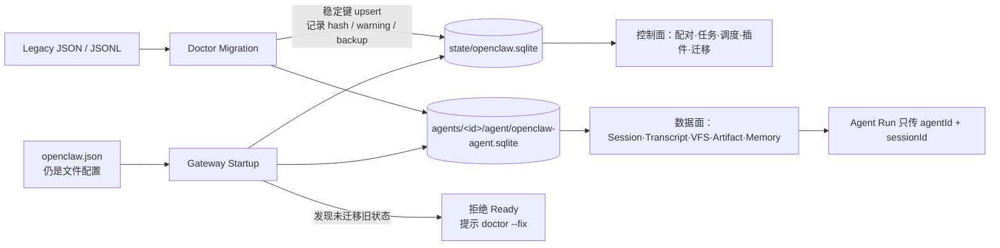
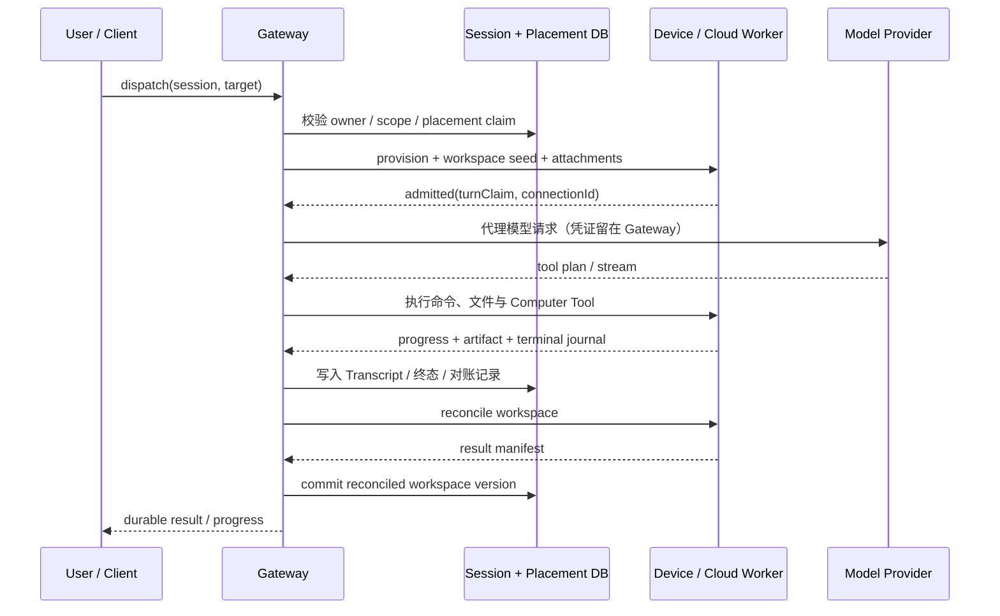
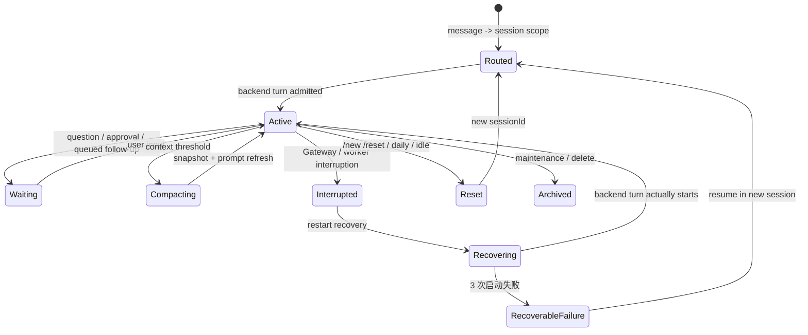
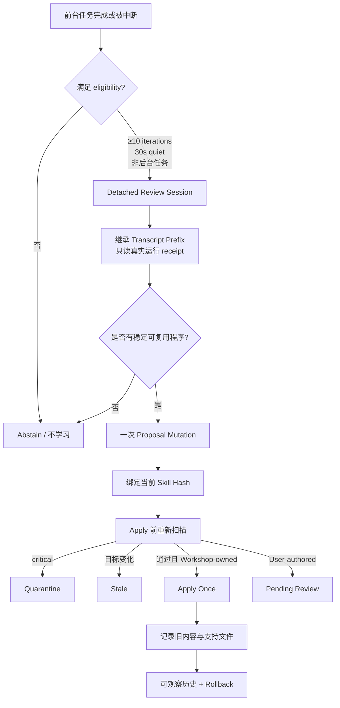
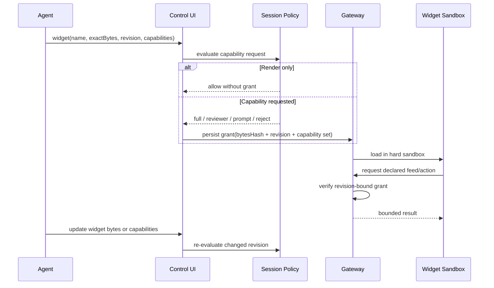
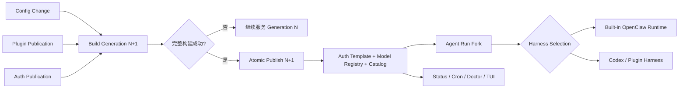
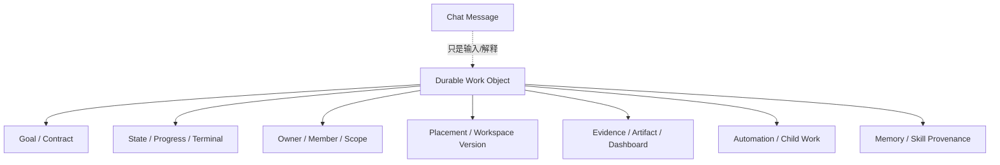
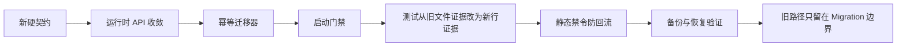
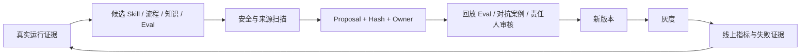

# OpenClaw 2.0 深度解读：从个人助手到 Agent 工作操作系统

> [!summary]
> **OpenClaw 2.0 最重要的变化，不是新增了多少模型、渠道或界面，而是把“聊天中的一次 Agent 调用”升级为“可持久、可迁移、可协作、可治理、可恢复、可持续学习的工作会话”。** 
>
> 如果说此前的 OpenClaw 更像一个连接模型、工具和消息渠道的个人 Gateway，2.0 则开始具备 Agent 工作操作系统的雏形：Gateway 保存身份、会话、凭证和状态，执行可以被调度到本机、配对设备或临时云机器；人、Agent、子 Agent 和外部 Agent 围绕同一会话协作；仪表盘、目标、自动化、工作看板和记忆系统把一次性对话延伸为长期工作。

## 1. 研究基线与结论边界

### 1.1 固定版本

本文研究对象是官方所称的 **OpenClaw 2.0** ，实际版本号为 `v2026.8.1`，不是 `2.0.0`。

| 项目 | 固定值 |
|---|---|
| 官方仓库 | [openclaw/openclaw](https://github.com/openclaw/openclaw) |
| Tag | [`v2026.8.1`](https://github.com/openclaw/openclaw/tree/v2026.8.1) |
| 完整 commit | [`ea806575e6450e4d1efdfc72c19f04be982a1b9b`](https://github.com/openclaw/openclaw/commit/ea806575e6450e4d1efdfc72c19f04be982a1b9b) |
| 发布时间 | 2026-08-31 |
| License | MIT |
| 主要证据 | [固定版本 CHANGELOG](https://github.com/openclaw/openclaw/blob/ea806575e6450e4d1efdfc72c19f04be982a1b9b/CHANGELOG.md)、[官方 2.0 发布说明](https://docs.openclaw.ai/releases/2026.8.1)、固定版本源码与官方文档 |

### 1.2 证据口径

- **源码事实** ：能够定位到固定 commit 的代码、测试或版本内文档。
- **官方事实** ：来自发布说明和官方产品文档。
- **本文判断** ：基于多个源码与官方事实形成的架构解释，不代表官方承诺。
- **借鉴建议** ：结合本地“数字员工—业务专家平台”和 AI-Coding 规划给出的迁移建议。

本文没有对 16,000 余条合并记录逐条审计，也没有完成生产环境压测。关于“更快、更安全、更可靠”的判断仅在存在具体机制时成立，不能等价为已证明的业务效果。

## 2. 一句话看懂 2.0：系统主语变了

OpenClaw 2.0 的系统主语从“Agent 回复一条消息”变成了“一个持续存在的工作会话”。

此前的典型链路是：

```text
消息 → Gateway → 模型与工具 → 回复
```

2.0 的典型变化可以概括为：关键正确性不再只靠 Prompt 提醒，而是由 Runtime 和 Harness 在身份、权限、状态、生命周期、恢复与证据边界上强制执行。


这里真正稳定的是 Gateway 拥有的会话身份、规范化状态、对话记录、凭证、权限与工作区；机器、模型和执行器变成可替换资源。这是本次升级中最有长期价值的架构转向。

### 2.1 四层架构：不要把 Agent Loop 等同于完整产品

OpenClaw 2.0 的源码责任可以拆成四层。固定版本文档明确把内置 Runtime、可复用 Agent Core、Harness 选择、模型传输和 Plugin SDK 分开：`packages/agent-core/` 提供 Loop 与契约，`src/agents/embedded-agent-runner/` 负责内置尝试循环，`src/agents/harness/` 管理不同 Harness 的选择与生命周期，`src/llm/` 隔离 Provider 传输。[Agent Runtime Architecture](https://github.com/openclaw/openclaw/blob/ea806575e6450e4d1efdfc72c19f04be982a1b9b/docs/agent-runtime-architecture.md)


这四层可以精确定义为：

- **Model** ：对当前上下文做推理，输出文本、工具调用或其他候选动作；它不拥有系统真值和最终提交权。
- **Agent Core** ：实现 `prompt → model → tool → observation` 的可复用循环、消息与压缩契约。
- **Harness** ：把某一种 Agent Core、模型协议或外部 Coding Agent 接入宿主系统，完成一次受约束的 Run；它只能使用 Runtime 为这次 Run 投影的能力。
- **Runtime** ：拥有会话、身份、权限、状态、执行位置、持久化、恢复和审计等系统事实；它接纳 Run、选择 Harness、固定快照，并决定什么结果可以提交。

一句话说：**模型可以建议，Harness 可以执行，Runtime 才能提交系统事实。** Harness 不是 Runtime 的同义词，也不只是一个 `run()` 包装器；它是 Runtime 与某种 Agent 执行实现之间的版本化能力协议。

这张图解释了一个常见误区：OpenClaw 的增量不主要来自“Loop 变聪明”，而是来自 Loop 外围的状态所有权、运行时快照、调度、权限、迁移、恢复和产品协议。单独复制一个 ReAct Loop，得不到 2.0 的长期工作能力。

## 3. 它做了哪些关键优化

### 3.1 状态底座：从文件时代走向 SQLite 主状态

OpenClaw 2.0 将核心运行状态建立在两级 SQLite 结构之上：全局数据库承担控制平面状态，每个 Agent 有独立数据库承担会话、Transcript、记忆索引和 Agent 局部状态。配置文件仍保留在数据库外。官方的 database-first 设计明确禁止运行时继续把 JSON/JSONL 路径当作会话身份，并要求以 `{agentId, sessionId}` 打开 Transcript 管理器。[架构决策](https://github.com/openclaw/openclaw/blob/ea806575e6450e4d1efdfc72c19f04be982a1b9b/docs/refactor/database-first.md) [数据库契约](https://github.com/openclaw/openclaw/blob/ea806575e6450e4d1efdfc72c19f04be982a1b9b/docs/reference/database-schemas.md)

这不是“把 JSON 换成数据库”这么简单，它带来四个能力基础：

1. **状态所有权清晰。** 全局控制状态与 Agent 数据状态分离，避免所有高频写入挤在同一条共享路径。
2. **并发与恢复可定义。** schema、约束、事务、锁、WAL/rollback journal、启动预检、隔离修复都可以成为硬协议。
3. **会话成为一等对象。** 对话分支、成员、所有者、进度、Dashboard、自动化关系不再依赖对文件名和 session key 的隐式解析。
4. **备份可以验证。** 2.0 支持 SQLite 快照、完整归档、校验、恢复到新 staging 目录，并加强了数据库损坏隔离和版本不兼容拒绝。

其代价也很明确：迁移是前向的，旧版本不能天然读取新 schema；手工降级二进制不会回滚数据。因此 2.0 在“自动升级”之外投入了大量 `doctor`、preflight、备份和启动修复能力。这个细节说明它已经开始以长期运行系统而非脚本工具看待自己。

#### 工程实现：数据库不是容器，而是运行时契约

固定版本的 database-first 设计给出了很少见的“负面契约”：不仅规定新状态写到哪里，还明确禁止运行时重新引入 `sessions.json`、Transcript JSONL、`.jsonl.lock`、伪 `sqlite-transcript://` locator 和整库重写。旧格式只能由 Doctor 导入，Gateway 启动看到未迁移的旧状态时拒绝 readiness，而不是悄悄以空历史启动。



关键实现约束如下：

| 约束 | 具体实现 | 工程价值 |
|---|---|---|
| 两级数据库 | 全局库承担控制面；每 Agent 数据库承担高频、大体积状态 | 避免 Transcript、VFS 和二进制对象挤占共享写通道 |
| 行级 API | `getSessionEntry`、`upsertSessionEntry`、`patchSessionEntry` 等替代整库读取和覆盖 | 缩小事务范围，降低并发覆盖和 stale writer 风险 |
| SQLite 运行参数 | WAL、`foreign_keys=ON`、5 秒 busy timeout、短 `BEGIN IMMEDIATE` 事务 | 把并发退避交给数据库，避免文件锁与同步重试叠加 |
| 删除语义 | 删除 Session 根行，由外键级联清理 Transcript、Snapshot 与 Trajectory | 防止调用方遗漏某个旁路文件，留下孤儿状态 |
| 迁移审计 | `migration_runs` 与 `migration_sources` 记录来源、SHA-256、数量、告警和备份 | 支持幂等重跑、失败保留源文件和事后追溯 |
| 备份恢复 | 在线快照、离线 `VACUUM`、完整性与 schema 校验、`--dry-run`、显式 `--yes` | 把“有备份”升级为“可验证、可恢复的备份” |
| 静态禁令 | 仓库检查阻止运行时代码重新写入退役状态路径 | 防止重构完成后被新功能逐步侵蚀 |

这套做法的范式价值是：**数据迁移不只是一次脚本，而是由新运行时契约、迁移器、启动门禁、备份验证、测试替换和静态禁令共同完成的系统变更。** 

### 3.2 执行解耦：会话不再绑定 Gateway 所在机器

2.0 可以将同一个 Session 放置在三个位置：Gateway、本人的配对设备、临时云 Worker。Gateway 始终保留规范 Transcript、模型凭证、放置记录和已对账工作区，命令、文件编辑与工具调用在远端执行；模型推理仍由 Gateway 代理，Provider 凭证不下发到远端。[Cloud Sessions 固定版本说明](https://github.com/openclaw/openclaw/blob/ea806575e6450e4d1efdfc72c19f04be982a1b9b/docs/gateway/cloud-sessions.md)

关键优化不只是“远程运行”，而是把远程执行放进了有状态协议：

- 配对设备离线时，Session 保留原 placement 并等待重连；
- 临时云机器死亡或休眠后，下一条消息可重新供应机器；
- 工作区结果在释放机器前回收并对账；
- Provider 凭证留在 Gateway；
- Worker 启动存在准入窗口、指数退避、重试上限和终态日志；
- 已经开始执行的工作不会因启动重试策略而被自动重放；
- 可复用 warm image 和 Git seed，减少重复冷启动与全量 clone；
- 远端桌面与 Computer Use 绑定当前 Session 和当前 placement，不会在目标不可用时偷偷切到另一台机器。

这使 OpenClaw 从“运行在某台设备上的 Agent”扩展为“控制平面持有任务，执行平面按需放置”的系统。

#### 工程实现：Placement 是带 fencing 的租约，不是一个机器字段

远端执行链路中，Gateway 同时承担会话所有权、执行准入、附件分发、模型代理和结果对账。Worker 只获得当前运行需要的工作区与能力，不能凭旧连接或旧句柄继续操作新 placement。



失败路径比正常路径更能说明实现深度：

- Worker 子进程只有 120 秒准入窗口；超时可换新子进程，最多五次，并使用带 jitter 的指数退避；
- 每次启动尝试都写入独立终态与原因，凭证或构建拒绝直接成为终止错误；
- 已经真正开始的工作不会被启动重试策略重放，避免重复副作用；
- placement claim、node connection 或 admitted turn 任一失效，附件传输和 Computer Control 都失效；
- Cloud Worker 可在下次消息自动替换，离线 Paired Device 则保持原 placement 等待重连，两种失败语义不混用；
- 休眠前必须先对账工作区；活跃 turn、排队消息或未对账结果会跳过休眠；
- 主动从离线设备迁回 Gateway 可能丢失最后一次 reconciliation 之后的文件，系统明确暴露这个损失窗口。

### 3.3 会话可靠性：从聊天记录升级为可恢复的工作账本

2.0 增加或强化了：

- 跨重启保留的进度卡片；
- Prompt 队列编辑和重排；
- 从任意用户消息 rewind 或 fork 的对话分支；
- 中断后的 delivery settlement，避免重复通知；
- 子 Agent 成功与失败的归属化回传；
- HTTP API 在流式输出后仍能报告最终 Agent 失败；
- Transcript、compaction、reset、stuck-session recovery 的一致性修复；
- 配置变更历史、作者标签、敏感值脱敏与手工修改检测。

这里的亮点是：OpenClaw 没有把“看起来还能继续聊天”当作恢复成功，而是区分 Agent 运行终态、消息投递终态、工作区对账终态和客户端展示状态。对长任务系统而言，这种多终态模型比增加一次模型重试更重要。

#### 工程实现：Session 同时维护身份、交互时钟与恢复预算

Session 路由不再只靠“最近一个聊天”。DM、群组、房间、Cron 和 Webhook 各有明确 scope；多用户 DM 推荐使用 `per-channel-peer` 隔离。生命周期又拆出三个时间概念：`sessionStartedAt` 决定 daily reset，`lastInteractionAt` 决定 idle reset，`updatedAt` 只用于列表与清理。Heartbeat、Cron 和系统事件可以更新行，但不能伪造真实用户活跃，从而把会话无限续期。[Session Management](https://github.com/openclaw/openclaw/blob/ea806575e6450e4d1efdfc72c19f04be982a1b9b/docs/concepts/session.md)



Gateway 重启恢复的预算也是按真实执行定义：连续三次“无法启动 backend turn”才耗尽；只有新的 backend turn 真正开始，预算才刷新。仅仅接收、排队或准备恢复请求不算成功，CLI backend 如果没有显式 acceptance，则必须观察到 Assistant 输出或 Tool 活动。这是一种重要的工程纪律：**恢复成功的判据必须落在副作用开始执行的边界，而不是请求被接收的边界。** 

### 3.4 人机协作：把隐式对话变成显式控制面

2.0 把多个过去只能靠自然语言约定的动作升级为结构化产品对象：

| 对象 | 解决的问题 | 价值 |
|---|---|---|
| Structured Question | Agent 缺少关键输入时，用户不清楚需要回答什么 | 选项、自由输入和 Skip 都成为明确协议 |
| Goal | 长任务目标容易被后续对话稀释 | 目标、状态和预算随 Session 持久化，但不自动变成后台任务 |
| Durable Progress Card | 多端刷新后看不到真实进度 | Web、macOS、iOS、Android 共享一张进度卡 |
| Workboard | 多任务、依赖、负责人和 Worker 调度散落在聊天中 | 看板成为任务状态与自动化的连接层 |
| Shared Session | 多人围绕同一任务协作缺少归属与可见性 | creator、owner、participant、view/suggest/contribute 被结构化 |
| Shared Terminal | 人与 Agent 各自操作不同终端，难以接力 | 终端绑定精确 Session 与权限策略 |

这组设计的共同点，是把“对话中的模糊意图”编译为“有身份、有状态、有权限、有生命周期的对象”。这比多增加几个 Slash Command 更接近生产系统。

### 3.5 记忆：从被动存档走向有来源的主动巩固

2.0 默认启用 Grounded Dreaming，并在个人安装的合适条件下默认启用同 Agent 私人会话的有界召回。Dreaming 采用 `light → REM → deep` 三阶段：light 整理近期信号，REM 形成主题反思，deep 通过评分和阈值后才可能写入 `MEMORY.md`；在深层重写前保存 preimage，并要求来源引用、旧内容保留比例和上下文预算通过校验。[Dreaming 说明](https://github.com/openclaw/openclaw/blob/ea806575e6450e4d1efdfc72c19f04be982a1b9b/docs/concepts/dreaming.md) [核心实现](https://github.com/openclaw/openclaw/blob/ea806575e6450e4d1efdfc72c19f04be982a1b9b/extensions/memory-core/src/dreaming-consolidation.ts)

2.0 还开始记录“哪些 Session 贡献了哪些记忆”，支持：

- 将指定来源排除在未来自动吸收之外；
- 预览并删除可归因于指定 Session、参与者或 Hook 来源的派生记忆；
- 防止已经 forget 的 Session 被后续 backfill 或重建索引重新吸收；
- 保留原始 Transcript 与派生记忆删除之间的明确边界。

这是从“有向量库”向“记忆生命周期治理”跨出的一步。不过 `memory forget` 不是普适数据擦除：它不能保证删除无来源标记的历史改写、自由编辑副本、外部备份或原始 Transcript。官方文档对此有明确警告。[Memory Provenance 与删除边界](https://github.com/openclaw/openclaw/blob/ea806575e6450e4d1efdfc72c19f04be982a1b9b/docs/concepts/memory-provenance.md)

### 3.6 自学习：把经验回流为可治理的 Skill，而不是直接改 Prompt

2.0 的 Skill Workshop 会从真实执行中识别强复用信号，生成新 Skill 或修改已使用的 Skill。默认 `auto` 模式下，扫描器通过的 Workshop 所有或新建 Skill 可以自动应用；用户直接编写的 Skill 仍保留更谨慎的边界。[Self-learning 固定版本说明](https://github.com/openclaw/openclaw/blob/ea806575e6450e4d1efdfc72c19f04be982a1b9b/docs/tools/self-learning.md)

其治理机制包括：

- 只允许写当前 Workspace 的可写 Skill；
- 更新前必须读完整当前 Skill；
- Proposal 与读取时的内容 hash 绑定，目标变化后提案失效；
- Apply 前重新执行安全扫描，严重问题进入 quarantine；
- 保存回滚元数据；
- 自动 Apply 只尝试一次，失败后留待人工，不进行无限重试；
- 每日 collection review 可做 keep、rewrite、create 或 drop，并在写入失败时恢复备份。

真正值得学习的是这条链路：

```text
运行证据 → 经验候选 → 受限作者 → Proposal → 安全扫描
→ Hash/目标校验 → Apply → 记录与回滚 → 集合级复审
```

但安全扫描只能识别危险模式，不能判断业务方法是否正确。OpenClaw 官方也承认残余风险：来自对话和工具输出的错误建议可能通过扫描。因此，`auto` 适合可信个人 Workspace，不等于适合企业生产知识和业务规则。

#### 工程实现：学习任务被隔离成一次有界、可放弃的后台发布

Experience Review 不是每轮都跑。固定版本要求前台任务完成或被用户中断、至少 10 次模型迭代、不是 Cron/Heartbeat/Memory/Subagent 等后台任务、Runtime 已报告真实 Provider/Model 与 `skill_workshop` 可用性、系统安静 30 秒且没有其他运行后，才启动一次 detached review。Provider 或 Prompt 错误不会触发复盘，因为这类环境噪声很可能让同模型再次失败。



Reviewer 沿用前台会话的 Prompt prefix 以复用 Provider Cache，但使用私有 detached identity；Review 消息与工具结果不会进入前台 Transcript。它看得到前台 Tool schema，却只能执行 `skill_workshop`；一次 Review 只有一次 mutation，失败后记录并放弃，不自旋重试。更新 Proposal 绑定当前内容 hash，超大 Skill 只能缩短，自动产物上限 10,000 字符。这里的重点不是模型生成质量，而是把不可靠生成器包在一个**有证据、最小权限、单次写入、版本绑定、可回滚、允许 abstain** 的发布协议里。

### 3.7 权限与凭证：开始把安全从 Prompt 约束下沉到运行时

2.0 提供 `read-only`、`guarded`、`workspace`、`full` 四种 Session 级权限模式，并要求单次运行的 override 只能收紧、不能放宽 Session 策略。受限文件权限锚定 Session 记录的 Workspace 或 Worktree。[Exec 与 Session 权限](https://github.com/openclaw/openclaw/blob/ea806575e6450e4d1efdfc72c19f04be982a1b9b/docs/tools/exec.md)

凭证方面，2.0 增加了三层值得注意的机制：

1. **私密输入通道。** Agent 可以请求凭证，用户在 masked UI 中输入，值不进入普通聊天和模型上下文。
2. **受保护出口。** 可选代理只把密钥替换到审批过的目标 Host，运行结束后连接与旁路一并失效。
3. **共享凭证仓。** 团队 Secret 在 SQLite 中保持 write-only，普通环境值与 Secret 分开；还可选接 1Password broker。

这比“要求 Agent 不要打印密钥”可靠得多，因为它把数据流约束放到了模型之外。

插件安全也从简单启用升级为来源、版本、精确 Artifact、声明能力与审计信息的组合审查。任意可执行来源需要显式 `--force`；受信来源仍需 capability consent。它还通过 commit-pinned 镜像安装外部 Skill，而不是运行时直接从第三方源拉取。

#### 工程实现：Scope 只是第一道门，具体对象还要二次校验

Gateway 连接先区分 `operator` 与 `node`，Operator 再按 `read`、`write`、`admin`、`pairing`、`approvals`、`questions`、`talk` 等闭集 Scope 授权。Named Role 进一步限制“能否访问他人 Session、可用 Agent、Scope 上限、是否强制 Sandbox”。但官方明确说明：这仍是一个可信 Gateway 域内的控制面护栏，不是敌对多租户隔离。[Operator Scopes](https://github.com/openclaw/openclaw/blob/ea806575e6450e4d1efdfc72c19f04be982a1b9b/docs/gateway/operator-scopes.md)


例如 `sessions.dispatch` 到普通配对设备需要 `operator.write`，到 Cloud Profile 需要 `operator.admin`；`sessions.create` 的普通创建是 write，但 incognito 或直接指定 `execNode` 是 admin；非管理员的 CWD 被限制在配置的 Agent Workspace 内。角色要求 Sandbox 时，创建来源与要求会在首次运行前持久化，并不可被分享、角色变化或 Session Patch 擦除；Sandbox 不可用时直接失败，不回退 Host。也就是说，权限不是一次 `if scope`，而是**连接授权 → 角色上限 → 方法分类 → 参数提升 → 对象所有权 → 提交时重验** 的多层协议。

凭证存储也遵循所有权语义：Agent 缺少本地 Profile 时从共享库 read-through，而不是复制 Secret；API Key 与 Token 默认可移植，OAuth 因 refresh token 轮换和单所有者语义默认不可复制。OAuth SecretRef 会把可变 Token 状态拆到两个存储中，因此被硬拒绝。[Auth Credential Semantics](https://github.com/openclaw/openclaw/blob/ea806575e6450e4d1efdfc72c19f04be982a1b9b/docs/auth-credential-semantics.md)

### 3.8 交付形态：Agent 结果从消息升级为可操作界面

Interactive Widget 和 Session Dashboard 是 2.0 很容易被低估的一项变化。Agent 可以在聊天中生成 HTML/JS/SVG 小应用，用户确认后固定到 Session Dashboard；Widget 能申请精确网络源、只读 Gateway 数据、指定 Automation Action 或向当前 Session 发送 Prompt。授权与 Widget 的精确字节和 revision 绑定，内容或能力变化会重新走策略。[Session Dashboard 固定版本说明](https://github.com/openclaw/openclaw/blob/ea806575e6450e4d1efdfc72c19f04be982a1b9b/docs/web/dashboards.md)

这意味着 Agent 的交付物不再局限于 Markdown：

- 图表可以本地切换视图，不必每次重新问模型；
- 运营按钮可以触发经过授权的固定自动化；
- MCP App 可以被固定并恢复；
- Dashboard 与 Session 同生命周期，`/new` 和 `/reset` 不删除看板；
- Widget 的交互状态可以作为安静的 Session Notice 回到 Agent。

它把“生成 UI”从一次性演示推进为受控、持久、可继续操作的任务界面。

#### 工程实现：把“界面字节”纳入授权对象

Widget 默认完全断网，只渲染无需批准；要访问外界必须声明 `net`、`data`、`actions` 或 `prompt` 能力。`data` 由 Gateway 提供只读 Feed，Widget 不拿 Gateway Token；`actions` 只能触发指定 Automation；`prompt` 才能免逐次确认地向当前 Thread 发消息。权限模式决定自动通过、AI Reviewer、人工 Allow/Reject 或直接拒绝。



这相当于把传统 Web 应用里的“代码部署”和“权限审批”合并成一个 revision-bound capability object。若 Agent 更新 Widget 并扩大权限，旧授权不能沿用；同能力内刷新内容则可保留 Grant。对生成式 UI 来说，这比依靠 CSP 或 Prompt 提醒更接近正确的授权模型。

### 3.9 Multi-agent 与开放互操作：从内部子 Agent 到外部协议

2.0 的多 Agent 能力有三个不同层次，不能混为一谈：

| 层次 | 机制 | 当前成熟度 |
|---|---|---|
| 普通子 Agent | 父子 Session、结果回传、失败通知、跨 Session 消息 | 正式能力持续加固 |
| Swarm | 在 Code Mode 中用 JS/TS 控制流批量 spawn、await 结构化结果、限制并发和总数 | 实验性、需显式启用 |
| A2A 1.0 | 外部 Agent 发现 Agent Card，以 JSON-RPC 发送和轮询认证文本任务 | 可用但协议面较窄 |

Swarm 的亮点是没有再发明图 DSL，而是直接使用 `Promise.all`、`while`、`if` 做程序化编排，再补充子任务收集器、边界与进度。[Swarm 说明](https://github.com/openclaw/openclaw/blob/ea806575e6450e4d1efdfc72c19f04be982a1b9b/docs/tools/swarm.md)

A2A 插件则把 OpenClaw Agent 暴露为标准 Agent Card，并支持认证的 `SendMessage`、`GetTask` 和向配置 Peer 发消息。源码中，Gateway 只注册固定 discovery 与 `/a2a/v1` 路由，并为每个运行实例创建任务存储；协议层显式限制消息大小。[Gateway 接入](https://github.com/openclaw/openclaw/blob/ea806575e6450e4d1efdfc72c19f04be982a1b9b/extensions/a2a/src/gateway.ts) [协议解析](https://github.com/openclaw/openclaw/blob/ea806575e6450e4d1efdfc72c19f04be982a1b9b/extensions/a2a/src/protocol.ts)

但当前 A2A 不支持流式、SSE、Push、取消、任务列表、二进制文件、多租户路由；任务仅存内存，重启即丢，终态最多保留 24 小时和 500 条。这说明它是“互操作入口”，不是完整的跨组织 Agent 工作流引擎。[A2A 边界](https://github.com/openclaw/openclaw/blob/ea806575e6450e4d1efdfc72c19f04be982a1b9b/docs/channels/a2a.md)

### 3.10 Runtime 与 Harness：用代际快照避免半更新状态

OpenClaw 2.0 不再把 Provider、模型目录、认证和 Harness 选择散落到每次运行的临时发现中。Gateway 启动、配置更新、插件变化或 Auth 发布时，会为每个 Agent 构建一份完整的 Model Runtime Generation；每代同时拥有 Auth Template、Model Registry 和投影后的 Model Catalog。新的代际只有在完整构建成功后才原子发布，Agent Run 再从该快照 fork 可变的 Auth 与 Registry Store。浏览、状态、Cron、Doctor、TUI、PDF 和图片路径都读发布后的 Catalog。



Harness 选择是配置与能力路由，而不是看到某个 Provider 名称就切 Runtime：Model 级配置优先于 Provider 级，`auto` 只选择能够支持当前有效 Provider Route 的已注册 Harness，否则回到内置 OpenClaw Runtime；带自定义 request behavior 的兼容端点不会误判成官方 OpenAI Runtime。这个“先完成代际构建，再整体切换”的做法避免旧 Auth、新 Catalog 与半加载 Plugin 同时出现。

### 3.11 性能与运维：优化的是吞吐、可维护性和故障收敛

2.0 的性能优化更偏系统性：

- 顶层 Agent 默认并发根据 CPU 并行度设为 8—16；
- 可发现 Provider 的实时模型目录，减少静态 Catalog 漂移；
- Utility Model 承担标题和短进度等小任务；
- Anthropic 与 xAI 支持可选的 Provider 侧 compaction，同时保留完整本地 Transcript；
- Batched Tool Discovery 一次查询多个独立工具能力；
- `agent exec` 提供临时或保留状态、固定 config、环境变量认证、fallback、稳定 JSON 结果与退出码，适合 CI 和 Headless 自动化；
- `openclaw triage` 支持脱敏调试交接；
- 外部 Supervisor 模式允许现有运维系统接管 Gateway 生命周期。

这类优化不会像新 UI 那样显眼，但它们使 OpenClaw 更接近“可被其他平台嵌入的 Agent Runtime”。

## 4. 能力边界具体拓展了什么

| 维度 | 过去的主要边界 | 2.0 拓展后 | 仍未跨过的边界 |
|---|---|---|---|
| 时间 | 一次对话或定时任务 | Goal、Loop、Automation、Workboard、持续 Session | Goal 本身不等于后台执行；长任务仍受资源、超时和外部系统约束 |
| 空间 | Gateway 所在机器 | 配对设备、临时云 Worker、远端桌面、自动 placement | 工作区对账前仍有丢失窗口；配对设备离线不会自动无损迁移 |
| 参与者 | 单人 + Agent | 多个可信成员、Agent、子 Agent、外部 A2A Agent | 同一 Gateway 不是敌对多租户隔离 |
| 输出 | 文本、文件、媒体 | 可交互 Widget、持久 Dashboard、MCP App、原生卡片 | Widget 是受限沙箱，不是任意 Web App 平台 |
| 记忆 | Markdown 和检索 | 私人跨会话召回、Dreaming、来源追踪、定向 forget | 派生知识仍可能错误；forget 不是全局数据擦除 |
| 学习 | 人工修改 Prompt/Skill | 运行经验生成 Proposal，扫描、应用、回滚、集合复审 | 扫描不验证业务正确性，企业真值不能自动开放写入 |
| 工具安全 | Host/Agent 的工具策略 | Session 权限模式、只收紧 override、凭证隔离与受控出口 | 默认 Host 工具仍可能具有高权限，需配置沙箱和隔离 |
| 自动化 | Cron、Heartbeat | 会话绑定 Automation、`/loop`、一次审批的精确重复操作、邮件触发 | 自动化授权绑定精确操作；变化后需重新审批 |
| 编排 | 普通子 Agent | Swarm、跨 Session 消息、Workboard Worker | Swarm 与 Fleet 仍是实验性，不应作为强 SLA 基础 |
| 互操作 | OpenClaw 内部 Channel/Plugin | A2A 1.0、MCP 连接、兼容多种插件 Bundle | A2A 当前协议子集较窄，任务不持久 |
| 部署 | 单实例个人 Gateway | 可信团队 Gateway、实验性 Fleet Cell | 不支持共享 Gateway 内的敌对租户隔离；强隔离需一租户一 Cell/Gateway |

## 5. 最核心的六个亮点

### 亮点一：把 Session 做成长期工作对象

这是其他所有能力的前提。目标、任务、成员、进度、终端、Dashboard、分支、权限、placement 和记忆来源都挂到 Session 后，产品才从“Chat UI”升级为“Work UI”。

### 亮点二：控制平面与执行平面分离

Gateway 保持身份、状态、凭证和策略，Worker 只获得完成当前任务所需的执行能力。这样才能做到弹性计算、机器替换、远端桌面、凭证不落地和结果回收。

### 亮点三：不再把自然语言当作唯一协议

Structured Question、Goal、Permission Mode、Credential Request、Progress Card、Workboard 和 Widget Grant 都把关键协作意图变成结构化状态。模型负责理解和建议，系统负责权限与生命周期。

### 亮点四：自学习第一次有了工程闭环

其价值不在“自动写 Skill”，而在来源、受限目标、Proposal、hash 绑定、扫描、一次 Apply、回滚、集合治理这些约束。它证明自学习可以被设计为资产发布流程，而不是让 Agent 随意修改自己。

### 亮点五：交互式结果成为 Agent 的新产品表面

Dashboard 让 Agent 不只交付解释，还能交付可持续使用的视图与动作入口；revision-bound grant 又避免了“UI 更新后偷偷扩大能力”。这是 Agent 应用从聊天机器人向业务工作台演进的重要方向。

### 亮点六：主动承认并编码边界

A2A 取消能力无法保证真正终止运行，因此干脆拒绝 `CancelTask`，而不是返回虚假的 canceled；团队角色明确声明不是敌对租户隔离；Session rewind 明确不撤销已经发生的文件或工具副作用。这类“保持状态语义诚实”的设计比功能数量更值得参考。

## 6. 它的局限与风险

### 6.1 团队能力不等于企业多租户

OpenClaw 明确把一个 Gateway 定义为一个可信控制域。Session ownership、visibility、operator role 是协作护栏，不是相互不信任用户之间的安全边界；`sessionKey` 是路由选择器，不是授权令牌。强隔离必须使用独立 Gateway，最好再使用独立 OS 用户或 Host。[Operator Scopes](https://github.com/openclaw/openclaw/blob/ea806575e6450e4d1efdfc72c19f04be982a1b9b/docs/gateway/operator-scopes.md) [Multi-tenant Hosting](https://github.com/openclaw/openclaw/blob/ea806575e6450e4d1efdfc72c19f04be982a1b9b/docs/gateway/multi-tenant-hosting.md)

因此不能仅凭“有团队角色和共享凭证”就判断它具备企业级租户隔离。

### 6.2 默认自动学习对企业场景过于激进

安全 Scanner 只能拦截已知危险模式，不能判断结论是否符合业务真值、法规或责任边界。对个人工作区，自动吸收经验可能收益大于风险；对理赔、测试发布或企业知识，任何自动写入生产 Skill 的路径都必须再加 Eval、Reviewer、版本、灰度和发布门禁。

### 6.3 Dreaming 是概率性记忆整理，不是事实治理

来源追踪和阈值门禁提高了可解释性，但最终 consolidation 仍由模型参与。它适合整理个人偏好、上下文和经验，不适合作为权威政策、费率、审批规则或代码事实的直接来源。

### 6.4 远端执行仍有分布式系统成本

机器供应、工作区传输、结果对账、离线、重连、容量和成本都没有消失。官方文档也承认：配对设备最后一次 reconciliation 之后的修改仍可能丢失，主动“转回 Gateway”可能放弃未同步文件。执行位置可替换，不代表任意时刻无损迁移。

### 6.5 2.0 的能力面很宽，稳定度不均匀

正式能力、Included Plugin、外部 Official Plugin、实验性 Labs 能力共存。Fleet、Swarm、部分桌面控制仍明确标记为实验性。采购或架构评估时必须按能力逐项看 SLA、平台支持和回退路径，不能把“发布说明中出现”当成“生产已成熟”。

### 6.6 大版本迁移成本真实存在

2.0 删除 OpenProse、迁移 OpenAI Route、调整 Plugin SDK subpath，并采用前向数据库迁移。官方建议升级前备份；老插件和配置需要 `doctor --fix` 或人工处理。它的系统化程度提升，也意味着兼容和运维责任上升。

## 7. OpenClaw 2.0 是否形成了新的研发工程范式

结论是：**存在明确且可复用的工程范式价值，但它不是“用 Agent 写更多代码”的研发范式，而是“把不可靠智能包进可恢复工作系统”的 Agent 系统工程范式。** 

它没有发明数据库、Capability、Worker、事件账本或 Migration；真正的增量是把这些成熟工程方法围绕一个新的核心对象——长期 Agent Session——重新组合，并把模型的不确定性当作默认条件，而不是异常条件。

### 7.1 范式一：Work-object-first，而不是 Chat-first

传统 Agent 产品常把消息作为主对象，任务、进度、权限和结果只是消息附件。OpenClaw 2.0 反过来：Session/Task 是持久工作对象，Chat 只是它的一个交互面；Dashboard、Terminal、Automation、Child Task、Placement 和 Memory 都围绕同一对象存在。



可迁移价值：任何长任务平台都应该先设计 `TaskId`、状态、责任人、证据、执行版本和终态，再接 IM、Web 或 IDE；不要让 Slack Thread、URL 或一次模型调用成为隐式任务主键。

### 7.2 范式二：Model proposes，Runtime commits

模型负责理解、生成候选方案和建议动作；Runtime 负责状态转换、权限、幂等、事务、重试、取消语义、版本绑定与审计。OpenClaw 的 Structured Question、Widget Grant、Skill Proposal、Session Placement 和 Operator Scope 都符合这一分工。

```text
Model = 非确定性提案器
Runtime = 确定性提交器
Database = 规范状态所有者
Policy = 能力边界
Evidence = 是否接受状态转换的依据
```

这比“在 System Prompt 里写严谨规则”更可靠，因为 Prompt 不能提供原子性、互斥、不可变 provenance、级联删除或 commit-time revalidation。

### 7.3 范式三：Recovery-first，而不是 Happy-path-first

2.0 反复编码“不理想路径”：Worker 未准入、Gateway 重启、旧状态未迁移、对账不完整、Proposal 过期、Widget Revision 变化、OAuth owner 冲突、A2A 无法真正取消。它的共同策略是：

1. 将恢复前提写成持久状态，而不是只存在内存；
2. 区分 Accepted、Started、Completed、Delivered、Reconciled 等不同终态；
3. 只有跨过真实副作用边界才算启动或恢复成功；
4. 无法保证的语义就拒绝承诺，例如 A2A `CancelTask` 返回 `-32004`；
5. 保留人工恢复入口，而不是把自动重试做成无限循环。

这套范式尤其适合 Coding Agent、数据分析 Agent 和业务流程 Agent，因为它们的工具调用会产生不可逆副作用，不能用“再问一次模型”掩盖状态不确定性。

### 7.4 范式四：Capability 绑定精确对象与版本

OpenClaw 不只判断“这个 Agent 能不能访问网络”，而是把权限绑定到 Session、目标机器、Widget bytes/revision、Plugin 声明能力、具体 Automation Action 或当前 Skill Hash。对象变化时，授权要么失效，要么重新评估。

可迁移价值是将传统 RBAC 扩展成：

```text
Grant = Principal × Capability × Resource × Revision × Context × Expiry
```

这对生成式系统格外重要，因为模型会不断生成新代码、新参数和新目标；仅按用户或 Agent ID 授权过于粗糙。

### 7.5 范式五：Learning-as-release，而不是 Memory-as-write

OpenClaw 把经验学习拆成证据筛选、受限 Reviewer、Proposal、Hash、扫描、一次 Apply、回滚和集合复审。这意味着学习不是“往长期记忆追加一段文本”，而是一次资产发布。企业级实现应在此基础上继续加入离线 Eval、黄金集、责任人、灰度、线上回归和撤回门槛。

### 7.6 范式六：Migration 是产品能力，不是运维脚本

Database-first 重构同时修改运行时 API、状态身份、Doctor、启动门禁、备份、恢复、测试 Fixture 与静态检查。这说明真正完成一次架构迁移的标准不是“新表能写”，而是：



这是 OpenClaw 2.0 最具普适性的工程贡献之一。大量 AI 项目在状态模型升级时保留永久 dual-read，最终形成不可删除的兼容层；OpenClaw 明确把 `dual-read` 视为该重构中禁止的目标状态，仅允许 Doctor 边界读取旧格式。

### 7.7 这套范式的适用边界

| 适合直接借鉴 | 需要裁剪 | 不应照搬 |
|---|---|---|
| 长任务、工具副作用、跨设备执行、多人协作、需要审计恢复的 Agent | 小型单用户工具可只保留单库、单 Runner 和少量状态对象 | 把默认 `auto` 学习直接用于企业权威知识 |
| 状态机、版本化 Grant、幂等迁移、终态分离、失败语义诚实 | Dashboard、A2A、Swarm 可按产品场景延后 | 把同 Gateway Named Role 当成敌对租户隔离 |
| Model/Runtime/State/Policy/Evidence 五分法 | Worker Placement 可从本机 Sandbox 起步 | 为展示平台感而同时引入所有 Channel 与实验能力 |

所以它的价值不是提供一套必须完整复制的“OpenClaw 架构”，而是提供一组可以逐项采用的工程约束：**工作对象化、状态规范化、执行可替换、权限版本化、恢复诚实化、学习发布化。** 

## 8. 对当前数字员工与 AI-Coding 项目的参考价值

本节对照本地《数字员工—业务专家平台项目总文档》与《数字员工：AI-Coding》给出建议。

### 8.1 先给结论：它还提供了一套“研发操作系统”

OpenClaw 2.0 对 AI-Coding 最值得参考的地方，不是让 Coding Agent 多写一些代码，而是把“Agent 如何理解仓库、如何获得权限、如何证明修复、何时允许重试、何时必须停止”做成了可执行约束。可以把这套系统分成两部分：

1. `AGENTS.md` 把架构判断、仓库地图、修复原则和证据门槛编译成 Agent 可读取的政策与路由层；
2. Harness / Runtime 把身份、能力、生命周期、副作用和持久化变成代码层无法绕过的硬边界。

这解释了为什么 2.0 体感上“不再像 Toy”：它不再假设模型会一直记得规则、每次重试都没有副作用、旧能力引用永远有效，或成功文本就代表系统已经完成。**软规则负责引导，硬约束负责兜底，持久证据负责证明。**

### 8.2 OpenClaw 的 AGENTS.md 到底怎么写，有什么特别

固定 commit 的根 `AGENTS.md` 约 65 KB、360 行，但它不是一份平铺的编码风格大全。文件开头就规定：根文件只拥有硬政策和路由，具体工作流交给 Skill，进入子树前继续读取最近的 scoped `AGENTS.md`；新增 `AGENTS.md` 还要添加同级 `CLAUDE.md` 符号链接，让不同 Coding Agent 共享同一套事实来源。[根级路由规则](https://github.com/openclaw/openclaw/blob/ea806575e6450e4d1efdfc72c19f04be982a1b9b/AGENTS.md#L1-L22)


#### A. 它首先写“判断原则”，然后才写命令

根文件最有价值的不是 `pnpm test` 之类命令，而是两组 Doctrine：

- **Repair Doctrine** 要求先复现、追到不变量的所有者、阅读调用者与同类实现、修复生产者而非在消费者堆 guard，并用修复前失败、修复后通过的回归证据闭环；它明确反对用重试、加超时、弱断言、宽泛 mock 或备用路径掩盖根因。[Repair Doctrine](https://github.com/openclaw/openclaw/blob/ea806575e6450e4d1efdfc72c19f04be982a1b9b/AGENTS.md#L24-L39)
- **Product Doctrine** 把“模型体验”视为产品本身：工具描述和结果也是 Prompt；延迟按模型往返次数衡量；不可用能力应被隐藏或给出下一步，不能把 Agent 留在死胡同。[Product Doctrine](https://github.com/openclaw/openclaw/blob/ea806575e6450e4d1efdfc72c19f04be982a1b9b/AGENTS.md#L41-L53)

这类规则不是文风偏好，而是对准已经观察到的 Agent 失败模式：局部补丁、静默失败、猜测外部 API、虚假成功、测试替代真实行为、回退路径越堆越多。优秀的 `AGENTS.md` 应该记录“模型最容易在哪里犯系统性错误，以及仓库要求它如何证明自己没有犯错”。

#### B. 根级通用规则上收，所有者特有规则下沉

仓库在 `src/agents/`、`src/gateway/`、`src/plugins/`、`src/agents/harness/`、应用、测试和文档等子树继续放 scoped `AGENTS.md`。例如 `src/agents/AGENTS.md` 不重复根政策，而只强调这一所有者边界的特殊不变量：Agent 测试经常受 import 成本支配；静态 schema、能力和路由测试不应加载完整 Runtime；一次被接纳的 Run 必须在重试和 fallback 间复用同一个 authority；能力在 `await` 后、结果越过动作边界前必须重新验证，生命周期 owner 在 `finally` 关闭授权。[Agents scoped rules](https://github.com/openclaw/openclaw/blob/ea806575e6450e4d1efdfc72c19f04be982a1b9b/src/agents/AGENTS.md#L1-L40)

这形成了可维护的三层：

| 层级 | 应该放什么 | 不应该放什么 |
|---|---|---|
| Root `AGENTS.md` | 全仓硬政策、判断 Doctrine、地图、证据门槛、安全与迁移约束 | 某个模块的细碎实现步骤 |
| Scoped `AGENTS.md` | 该所有者边界独有的不变量、测试策略、热点与禁区 | 重复整个根文件 |
| Skill / 脚本 | 可复用工作流、命令编排、发布和验证步骤 | 不可绕过的架构真值 |

#### C. 它把仓库设计成机器可导航的环境

OpenClaw 不只要求 Agent “认真看代码”，还主动降低机器探索成本：根文件给出责任地图；模块有 scoped 指南；要求导出符号使用独特的 2–3 词名称以便 `rg` 精确定位；要求超大文件拆分；需要完整执行的指导必须整体提供，不能让模型误把第一个窗口当成全文；所有进入模型上下文的单项内容都要有边界。这些约束把 Context 当作有限计算资源，而不是无限文本框。

#### D. 它把“完成”定义成证据，而不是修改动作

规则要求在修改前捕获失败复现，修复后验证所有者边界、同类路径和真实用户可见行为；Review 需要 evidence map，至少覆盖入口、所有者、调用者、被调用者、共享不变量的兄弟路径、现有测试和当前行为；脚本崩溃必须非零退出，截断输出不能伪装成功。[验证与工具失败语义](https://github.com/openclaw/openclaw/blob/ea806575e6450e4d1efdfc72c19f04be982a1b9b/AGENTS.md#L173-L190)

这对 AI-Coding 的价值很直接：不要只优化“生成补丁”，要优化 `问题证据 → 所有者定位 → 不变量修复 → 边界测试 → 真实行为证明` 的完整链路。

#### E. 两类 AGENTS.md 必须分开理解

OpenClaw 还有一份面向最终用户工作区的 `docs/reference/templates/AGENTS.md`。它定义启动上下文、日记与长期记忆、群聊参与、外部发布前确认、自动化和主动工作方式。它属于 **产品内 Agent 的身份与行为配置** ；仓库根 `AGENTS.md` 属于 **开发 OpenClaw 的 AI-Coding 规则** 。同名不等于同一层，企业项目最好在命名或目录上显式区分 `repo policy` 与 `agent workspace policy`。[Workspace AGENTS template](https://github.com/openclaw/openclaw/blob/ea806575e6450e4d1efdfc72c19f04be982a1b9b/docs/reference/templates/AGENTS.md)

#### F. 不应照抄 65 KB

根文件很长是一个事实，不是最佳实践的自动证明。它能工作，部分原因是内容密度高、有 scoped 路由，并且围绕一个超大、多平台、多插件仓库积累了大量真实失败案例。小型仓库照搬同样体量会稀释注意力、增加规则冲突和每轮成本。更合理的迁移顺序是：

1. 先写一页根规则，只保留目标、所有者地图、五到十条硬不变量、精确验证命令和完成定义；
2. 只有某个子树出现独有且重复的失败模式时，才增加 scoped 指南；
3. 可机械执行的流程沉淀为 Skill 或脚本；
4. 用真实返工和评测数据删除无效规则，而不是只追加。

### 8.3 AI-Coding Harness 上有哪些真正的亮点

OpenClaw 的 `AgentHarnessV2` 不是传统意义上只有 `run()` 的适配器。源码把它建模为一组能力的交集：执行尝试、回合终结、零工具补全、侧问题、分类、压缩、Session reset/delete/fork、运行时制品校验、认证指纹、用量、MCP 与模型目录等；Session 删除甚至显式提供 `commit` / `rollback`。[Harness V2 类型契约](https://github.com/openclaw/openclaw/blob/ea806575e6450e4d1efdfc72c19f04be982a1b9b/src/agents/harness/types.ts#L374-L445) [完整 V2 组合](https://github.com/openclaw/openclaw/blob/ea806575e6450e4d1efdfc72c19f04be982a1b9b/src/agents/harness/types.ts#L534-L566)


其核心亮点有八个：

| 机制 | 源码中的做法 | 对 AI-Coding Harness 的意义 |
|---|---|---|
| Harness 是版本化能力协议 | 宿主按能力组合调用，而非假设所有 Harness 行为相同 | Codex、内置 Loop、远端 Agent 可以接入，但差异必须显式建模 |
| 运行级原子快照 | 一次 Run 绑定完整准备代际，配置、模型目录、插件和后续投影保持一致 | 防止长任务中途读到半更新的配置世界 |
| 跨 fallback 集选择 | 选择能覆盖整个候选模型链的单一 Harness；语义不一致时回到统一内置执行或 fail closed | 不把“换模型”偷偷变成“换了一套工具、Session 与权限语义” [选择逻辑](https://github.com/openclaw/openclaw/blob/ea806575e6450e4d1efdfc72c19f04be982a1b9b/src/agents/harness/selection.ts#L177-L235) |
| 私有能力投影 | 宿主用私有映射把能力只发给精确的 owner plugin，公共字段无法伪造 | 插件拿到的是本次 Run 所需能力，不是宿主内部全部权限 [私有 capability issuer](https://github.com/openclaw/openclaw/blob/ea806575e6450e4d1efdfc72c19f04be982a1b9b/src/agents/harness/host-private-capabilities.ts#L10-L35) |
| Authority 闭包化 | 权限捕获精确 Session、Run、放置和生命周期；执行前后、尤其 `await` 后再次校验 | 防止异步等待期间 Session 被替换、授权过期后旧闭包继续行动 [Authority revalidation](https://github.com/openclaw/openclaw/blob/ea806575e6450e4d1efdfc72c19f04be982a1b9b/src/agents/harness/node-execution-authority.ts#L18-L87) |
| 零工具终结 | 已经完成工具工作的回合可用 `finalizeSettledTurn` 生成最终答复，且不能再次暴露会重复工作的能力；隔离补全必须真零工具，否则拒绝 | “总结结果”不会意外再次写文件、发消息或执行命令 [Settled turn finalization](https://github.com/openclaw/openclaw/blob/ea806575e6450e4d1efdfc72c19f04be982a1b9b/src/agents/harness/types.ts#L393-L410) |
| 副作用感知 fallback | 如果已有工具副作用或渠道投递证据，模型错误后不再自动 fallback，避免重复对外回复或重复执行 | 重试资格由事实决定，不由异常类型单独决定 [Fallback side-effect gate](https://github.com/openclaw/openclaw/blob/ea806575e6450e4d1efdfc72c19f04be982a1b9b/src/agents/embedded-agent-runner/run-entry.ts#L380-L478) |
| 干净终态才推进上下文 | 只有完成且可接受的终态才 finalize；失败、abort、yield 或 prompt error 丢弃推进意图；接受后经持久 Outbox 排队与 drain | 解决“模型以为做完了、持久状态却没提交”以及崩溃重放问题 [终态判定](https://github.com/openclaw/openclaw/blob/ea806575e6450e4d1efdfc72c19f04be982a1b9b/src/agents/embedded-agent-runner/run-entry.ts#L547-L570) [Durable turn outbox](https://github.com/openclaw/openclaw/blob/ea806575e6450e4d1efdfc72c19f04be982a1b9b/src/agents/harness/context-engine-turn-attempt.ts#L210-L272) |

这套设计对 Coding Agent 尤其重要，因为写文件、运行迁移、创建分支、发评论和部署都存在真实副作用。一个可靠的 AI-Coding Harness 至少应回答：**这次执行是谁接纳的、允许改什么、使用哪一代仓库与配置、什么事实证明副作用已经发生、失败后是否还能重试、谁提交最终状态、旧能力何时失效。** 如果这些答案仍藏在 Prompt 或调用者习惯里，系统规模一大就会重新退化成 Toy。

### 8.4 P0：立即吸收的架构原则

#### A. 将“专家任务”而不是“聊天”设为平台核心对象

当前规划已经提出任务契约、结果终态、证据和责任水位。OpenClaw 2.0 进一步证明：任务必须拥有独立于消息的持久状态。建议统一建立：

```text
ExpertTask
├── objective / contract / terminal state
├── owner / participants / permissions
├── plan / progress / pending human input
├── execution placement / workspace version
├── evidence / artifacts / dashboard
├── automation / child tasks
└── memory and learning provenance
```

不要让 URL、IM thread 或聊天记录隐式承担任务身份。

#### B. 明确控制平面、状态平面与执行平面

可以借鉴 OpenClaw 的 Gateway 责任：

- 控制平面：身份、权限、策略、调度、审批；
- 状态平面：任务、会话、轨迹、证据、版本、记忆来源；
- 执行平面：Harness、Worktree、Sandbox、远端 Worker、工具；
- 体验平面：任务台、IM、Dashboard、审批卡片。

LLaP 的 Worker 不应持有平台长期真值，也不应因为某台机器或某个 Harness 死亡而丢失任务身份。

#### C. 把所有关键人机交互协议化

当前专家任务台规划中的“待人工决策”可进一步拆为：`Question`、`Approval`、`CredentialRequest`、`ScopeExpansion`、`ExceptionEscalation`。每种对象都有请求者、适用任务、截止时间、可选动作、最终回答和失效条件，不能只靠一条消息等待回复。

#### D. 凭证值与模型上下文彻底分离

这是可直接进入平台安全基线的设计：Agent 只能请求一个 Secret capability；真人通过独立安全表面提交；执行侧通过目标绑定的代理或 SecretRef 获得临时替换；日志、聊天、模型上下文和普通环境变量均不得获得明文。

### 8.5 P1：结合现有规划增强的能力

#### A. 将“受控自优化”实现为双环，而非直接照搬 auto Skill

OpenClaw 的 Workshop 很适合做内环参考，但企业平台还需要外环验证：



OpenClaw 解决了“如何安全写入工作区 Skill”，我们还必须解决“如何证明新版业务专家比旧版更好”。因此生产知识、权限、结果真值和硬门禁继续禁止自动修改，这与当前项目总文档是一致的。

#### B. Dashboard 作为结果与运营的共同载体

当前平台把创建台、任务台和运营台分开是合理的，但可借鉴 Session Dashboard 的“同一任务同时拥有对话面和结果面”：

- 对话负责委托、追问和解释；
- Dashboard 负责状态、证据、指标、可批准动作和持续结果；
- Widget/组件权限绑定版本，更新后重新审查；
- 同一个交付物既能在任务内使用，也能晋升为专家运营组件。

这能避免所有结果都退化为 Markdown 报告。

#### C. 区分 Goal、Automation、Workflow、Workboard 与 Swarm

OpenClaw 的分层值得保持：

- Goal：当前任务的唯一目标，不负责后台触发；
- Automation/Loop：何时再次运行；
- Workflow：单次任务如何推进与门禁；
- Workboard：多个任务、依赖、负责人和 Worker；
- Swarm：一次执行内部的并行子任务策略。

它们的生命周期不同，不应合并为一个“工作流”概念。

#### D. 记忆必须携带来源与删除边界

现有“个人知识—候选知识—全局知识”设计可以补充 `sourceTaskIds`、`participants`、`admissionPolicy`、`promotionReason`、`derivedArtifactIds` 和 `forgetCoverage`。删除派生知识时应报告：已删除、混合来源整体删除、无法归因、保留原始记录、外部副本五类结果，而不是返回一个模糊的成功。

### 8.6 P2：先小规模验证的方向

#### A. 远端 Session Placement

AI-Coding 的 Worktree 适合先验证“状态由平台持有、执行可迁移”。首期不需要搭完整云供应链，可先做两种位置：本地 Runner 与独立 Sandbox Runner，验证任务暂停、恢复、结果对账、Worker 死亡和凭证不下发。

#### B. A2A 作为专家互操作入口

可以先定义最小协议：发现、创建任务、查询状态、获取结果、发送补充信息。不要第一期承诺跨组织流式协作、全局取消或分布式事务。OpenClaw 拒绝虚假取消的做法值得直接采用：如果底层任务无法确认终止，就返回 `cancel_not_supported` 或 `cancel_pending`，不能返回已取消。

#### C. Programmatic Swarm

对明确可分解、独立、可汇总的研究或测试任务，可试验用普通代码控制并发和 await 结果；但不应为了展示“Agent 团队”而把主业务流程改成不可观察的多 Agent 网。现有项目“不为展示多 Agent 而引入复杂协作网络”的判断仍然正确。

## 9. 哪些东西不建议照搬

| OpenClaw 做法 | 不直接照搬的原因 | 建议调整 |
|---|---|---|
| 自学习默认 `auto` | 企业知识和业务流程的错误成本远高于个人 Workspace | 默认 `propose`，只有低风险、可回滚、Eval 净改善的 Skill 允许自动灰度 |
| 同 Gateway 可信团队模型 | 公司内仍有租户、客户、项目和敏感数据隔离要求 | 以租户/客户建立独立信任域，OS/容器/凭证和数据库共同隔离 |
| 一个产品覆盖大量 Channel、模型和媒体 | 能力面扩张会稀释垂直任务的可靠性和运营投入 | 围绕首个专家场景建立最小能力集，再以插件扩张 |
| 用模型 Dreaming 直接巩固长期记忆 | 业务事实与个人偏好不是同一类记忆 | 个人经验可模型整理；权威知识必须走来源、Owner、版本、冲突和 Eval 治理 |
| 实验性 Fleet/Swarm 进入关键路径 | API、运维和故障语义仍可能变化 | 只做旁路实验，保留单 Agent/单 Runner 回退 |
| 以扫描器代表内容正确性 | Scanner 主要解决危险模式，不解决方法论错误 | 加入业务 Verifier、黄金案例、对抗案例和版本对比 |

## 10. 建议的三项验证实验

### 实验一：任务状态与执行位置解耦

选择一个 AI 测试或小型代码修改任务，在 Runner 执行到一半时强制终止进程，验证：

- 任务目标、计划、已有证据和待办不丢失；
- 新 Runner 能从最后确认状态继续；
- 已执行副作用不会被重复执行；
- 未对账文件被显式标为未知，而非宣称成功恢复。

### 实验二：受控 Skill 改进闭环

从一次真实失败生成 Skill Patch，要求完成：来源绑定、完整旧版本读取、hash 校验、安全扫描、回放 Eval、新旧版本比较、人工批准、灰度、回滚。用“更新后净改善率”和“误吸收率”评价，不以生成 Proposal 数量评价。

### 实验三：任务 Dashboard 与结构化人工介入

为一个 S0—S7 AI-Coding 任务建立最小 Dashboard，至少呈现 Goal、阶段、证据、待回答问题、待批准动作、成本和最终结果。验证用户能否不翻聊天记录就判断：现在在哪、为什么停住、需要我做什么、哪些动作已发生、结果是否可验收。

## 11. 最终判断

OpenClaw 2.0 不是一次普通功能升级，而是一次责任边界重构：

1. **数据层** 从零散文件状态走向带 schema、迁移、校验和恢复的数据库主状态；
2. **运行层** 从单机 Agent Loop 走向 Gateway 控制平面与可迁移执行平面；
3. **协作层** 从聊天消息走向目标、问题、审批、进度、成员和任务看板；
4. **交付层** 从文本回答走向持久、可交互、受权限约束的 Dashboard；
5. **学习层** 从手工调 Prompt 走向有提案、扫描、hash、回滚和复审的 Skill 生命周期；
6. **生态层** 从内部插件与 Channel 走向 A2A、MCP 和多种 Agent Bundle 互操作。
7. **工程范式** 从“模型尽量做对”走向“模型负责提案，Runtime 负责可验证提交与诚实恢复”。
8. **研发系统** 从“给模型一份说明书”走向“分层仓库政策 + 版本化 Harness + 边界证据”的 AI-Coding 约束栈。

它最值得参考的不是“做一个更全的 Agent 平台”，而是以下方法：**先让工作成为有状态、有权限、有证据的对象，再让模型、工具、机器、人员和其他 Agent 围绕这个对象协作。** 

对于当前数字员工与 AI-Coding 项目，这一方向与“知识 + 工作契约 + 执行 + 评测”的版本化专家产品高度一致；OpenClaw 可以补强运行时、会话产品化、凭证隔离、交互式结果和经验回流机制。但在企业场景中，仍需比 OpenClaw 更严格地加入租户隔离、权威知识治理、独立评测、灰度发布和责任人审批。

## 12. 推荐源码阅读顺序

1. [README：Gateway 与产品边界](https://github.com/openclaw/openclaw/blob/ea806575e6450e4d1efdfc72c19f04be982a1b9b/README.md)
2. [2.0 CHANGELOG：完整变化面](https://github.com/openclaw/openclaw/blob/ea806575e6450e4d1efdfc72c19f04be982a1b9b/CHANGELOG.md)
3. [Agent Runtime Architecture：Core、Harness、Provider 与代际快照](https://github.com/openclaw/openclaw/blob/ea806575e6450e4d1efdfc72c19f04be982a1b9b/docs/agent-runtime-architecture.md)
4. [Database-first：状态所有权与硬契约](https://github.com/openclaw/openclaw/blob/ea806575e6450e4d1efdfc72c19f04be982a1b9b/docs/refactor/database-first.md)
5. [Cloud Sessions：控制平面与执行平面](https://github.com/openclaw/openclaw/blob/ea806575e6450e4d1efdfc72c19f04be982a1b9b/docs/gateway/cloud-sessions.md)
6. [Session Management：路由、隔离与状态](https://github.com/openclaw/openclaw/blob/ea806575e6450e4d1efdfc72c19f04be982a1b9b/docs/concepts/session.md)
7. [Dashboard：交互式交付与授权](https://github.com/openclaw/openclaw/blob/ea806575e6450e4d1efdfc72c19f04be982a1b9b/docs/web/dashboards.md)
8. [Auth Credential Semantics：凭证所有权与移植边界](https://github.com/openclaw/openclaw/blob/ea806575e6450e4d1efdfc72c19f04be982a1b9b/docs/auth-credential-semantics.md)
9. [Dreaming 与 memory-core 实现](https://github.com/openclaw/openclaw/blob/ea806575e6450e4d1efdfc72c19f04be982a1b9b/extensions/memory-core/src/dreaming-consolidation.ts)
10. [Self-learning：Skill Proposal 生命周期](https://github.com/openclaw/openclaw/blob/ea806575e6450e4d1efdfc72c19f04be982a1b9b/docs/tools/self-learning.md)
11. [Swarm：程序化多 Agent 编排](https://github.com/openclaw/openclaw/blob/ea806575e6450e4d1efdfc72c19f04be982a1b9b/docs/tools/swarm.md)
12. [A2A Gateway、Protocol 与 Task Store](https://github.com/openclaw/openclaw/tree/ea806575e6450e4d1efdfc72c19f04be982a1b9b/extensions/a2a/src)
13. [Operator Scopes 与安全边界](https://github.com/openclaw/openclaw/blob/ea806575e6450e4d1efdfc72c19f04be982a1b9b/docs/gateway/operator-scopes.md)
14. [`agent exec`：Headless/CI 嵌入入口](https://github.com/openclaw/openclaw/blob/ea806575e6450e4d1efdfc72c19f04be982a1b9b/docs/cli/agent.md)
15. [根 AGENTS.md：研发 Doctrine、仓库路由与证据门槛](https://github.com/openclaw/openclaw/blob/ea806575e6450e4d1efdfc72c19f04be982a1b9b/AGENTS.md)
16. [Harness 类型与可信执行主链路](https://github.com/openclaw/openclaw/blob/ea806575e6450e4d1efdfc72c19f04be982a1b9b/src/agents/harness/types.ts)

## 13. 主要来源

- [OpenClaw 2.0 官方发布说明](https://docs.openclaw.ai/releases/2026.8.1)
- [OpenClaw v2026.8.1 GitHub Release](https://github.com/openclaw/openclaw/releases/tag/v2026.8.1)
- [固定 commit 源码树](https://github.com/openclaw/openclaw/tree/ea806575e6450e4d1efdfc72c19f04be982a1b9b)
- [固定 commit 根 AGENTS.md](https://github.com/openclaw/openclaw/blob/ea806575e6450e4d1efdfc72c19f04be982a1b9b/AGENTS.md)
- [固定 commit Agent Harness V2 契约](https://github.com/openclaw/openclaw/blob/ea806575e6450e4d1efdfc72c19f04be982a1b9b/src/agents/harness/types.ts)
- [官方安全边界](https://docs.openclaw.ai/gateway/security)
- [官方 A2A 限制](https://docs.openclaw.ai/channels/a2a)
- [官方 Memory Provenance 与删除边界](https://docs.openclaw.ai/concepts/memory-provenance)
