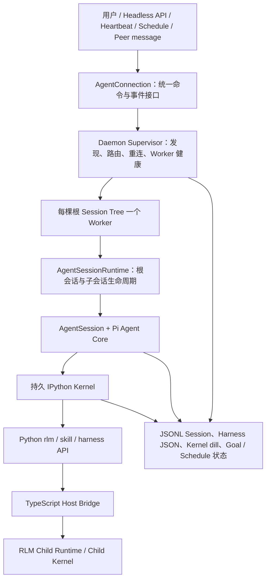
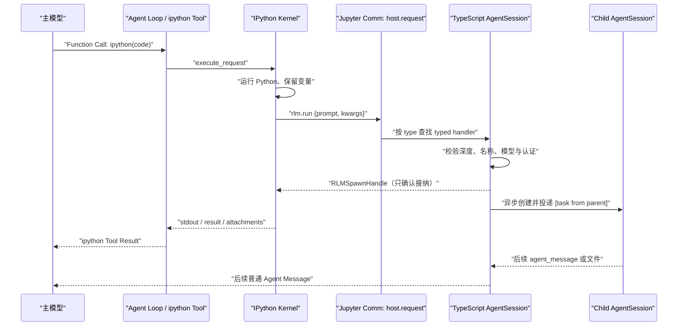
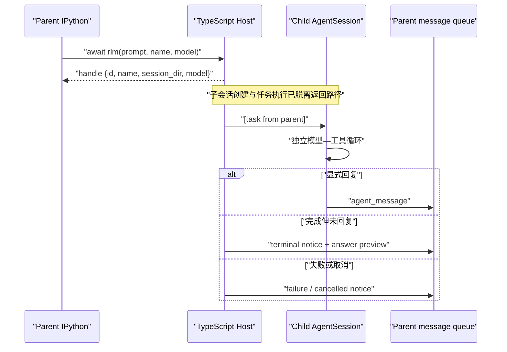

# Prime Agent 源码深度解析：真正的增量是可编程上下文与长任务 Runtime

> [!abstract] 核心判断
> Prime Agent 是一套建立在 Pi Agent Core 之上的**长任务 Agent Runtime**。它以持久 IPython 作为模型的默认编程控制面：模型通过 `ipython(code)` 提交程序，Python 保存工作状态、执行确定性控制流并调用 Skill；`host.request` 再把 Child Agent、Goal、消息、调度与其他受管能力接回 TypeScript Runtime。Function Calling 仍是模型进入外部世界的协议入口，但一次调用承载的对象从某个具体工具动作提升成了一段可以继续组织工具和状态的程序。
>
> 这套 Runtime 把一次模型—工具循环扩展成一棵可持续运行的会话树。根 Agent、Child Agent、各自的 Kernel、消息与 Artifact 由 Worker 持有，Supervisor 负责发现、路由、重连与恢复；Goal、Schedule、Heartbeat、Kernel namespace 与 Continual Harness 则把任务状态延伸到后续轮次、其他终端和后台执行。
>
> Prime 的核心增量由三个互相咬合的机制构成：**可编程的工作上下文、可保留的子代理、可恢复的长任务生命周期**。三者共同把 Pi 的 Agent Core 扩展为一个偏 Recursive Language Model（RLM）范式的开放 Agent Runtime，并呈现出早期 Agent OS 的形态。生产部署需要在这套 Runtime 外层补充 Sandbox、资源配额、独立 verifier 与副作用治理。

这篇笔记延续 [[pi-mono源码深度解析：pi-agent的极简Agent Core]] 的 Core 基线，并用 [[Agent OS：把 Agent Core 变成可持续工作的生产系统]]、[[AI Coding研发中的Harness与Loop构建]]、[[论文解读：Towards Long-Horizon Agents: A Survey]] 中的长期任务与可信验证框架判断 Prime Agent 的增量。

---

## 1. 先回答“带来了什么增量”

如果把一个 coding agent 分成四层：

```text
模型能力
  ↓
Agent Core：模型调用、Tool Call、消息状态机
  ↓
Harness：上下文、工具、技能、子代理、压缩、验证策略
  ↓
Runtime / Agent OS：进程、恢复、调度、租约、持久状态、观测与治理
```

Prime Agent 的设计重心位于 Harness 与 Runtime / Agent OS 两层；Agent Core 主要承接 Pi 的实现。

| 维度 | Pi 基线 | Prime Agent 的新增 | 判断 |
|---|---|---|---|
| Agent Loop | 显式模型—工具循环、awaited event barrier | 基本沿用 | **低增量**，属于 Pi 基线承接项 |
| 上下文控制 | 文件、消息、Compaction | 持久 IPython；模型显式加载的工作上下文可变成变量、函数和程序，用户 Prompt 本身仍是消息 | **高增量**，改变模型参与微观调度的粒度 |
| 子代理 | Core 之上的 Tool/进程组合模式 | 一等子会话、保留生命周期、A2A 消息、用量归因 | **高增量**，运行语义落在可保留的 Actor 式子会话 |
| 长任务生命周期 | Session 持久化，应用层自行扩展 | Daemon、每棵根会话树一个 Worker、重连、快照、恢复日志 | **很高增量**，是工程上最有价值的一层 |
| 状态延续 | 消息树、文件、Compaction | Kernel `dill` 快照、Goal、Heartbeat、Schedule、Harness | **高增量**，快照边界止于可序列化的 Kernel namespace |
| 自适应 Harness | 主要靠人维护 Skill、Prompt、配置 | `/refine` 对 prompt note、memory、skill spec、subagent spec 做 CRUD | **中等增量**，机制成立，收益需外部验证 |
| 完成证明 | 由应用或使用者定义 | Goal 显式完成；Autonomous 可运行 shell gate | **中低增量**，gate 可选且只证明自身覆盖范围 |
| 安全边界 | 官方要求外部 Sandbox | Worker/Kernel 负责生命周期隔离，并以用户权限执行 | **生产安全依赖外部治理**，常驻执行面扩大了风险半径 |

这组增量共同改变了什么：

> **Pi 解决“一个 Agent turn 怎样正确运行”；Prime Agent 开始解决“一个 Agent 任务怎样跨上下文、跨终端、跨子代理持续运行”。**

它的成熟度已经进入 Agent Runtime / 早期 Agent OS：恢复、调度和持久状态已经进入系统主路径；强资源治理、独立完成验证、系统级安全隔离与稳定的 Harness 事务协议，则是生产外层必须继续补齐的闭环。

---

## 2. 版本锚点、项目身份与证据等级

### 2.1 固定源码修订

本文源码判断固定在：

- canonical repository：[`PrimeIntellect-ai/prime-agent`](https://github.com/PrimeIntellect-ai/prime-agent)
- branch：`main`
- full commit：[`a18809e00ea30638584d87b3afea7285a9d7296c`](https://github.com/PrimeIntellect-ai/prime-agent/commit/a18809e00ea30638584d87b3afea7285a9d7296c)
- commit date：2026-08-07 16:23:00 -07:00
- subject：`add privacy-safe agent analytics (#521)`
- package version：`0.7.1`
- HEAD tag：`beta`
- 最近稳定发布：`v0.7.1`，发布提交 `95afd319a78ae017a41241d50b013d656a0685ce`
- License：MIT

仓库在 2026-05-08 创建，迭代速度极快。2026-08-10 的 GitHub 快照为 11,632 stars、1,189 forks、457 个 open issues 与 PR；这些只能说明关注度与变动强度，不能替代质量证据。

### 2.2 它与 Pi 的关系

README 明确写明项目建立在 Pi 上，[源码仍使用 `@earendil-works/pi-*` 包](https://github.com/PrimeIntellect-ai/prime-agent/blob/a18809e00ea30638584d87b3afea7285a9d7296c/README.md#L102-L104)。把 Pi 官方仓库 `main` 拉入同一 Git 图后，二者最近共同祖先是：

- merge base：[`0bcaab4206a3ddbdba60cef2ce61497797f22a0b`](https://github.com/PrimeIntellect-ai/prime-agent/commit/0bcaab4206a3ddbdba60cef2ce61497797f22a0b)
- date：2026-05-08
- Prime 分支自该点增加 499 个提交

从共同祖先到本文 HEAD：

- 933 个文件发生变化
- `+211,892 / -46,426`
- `packages/coding-agent` 占 `+183,188 / -19,744`
- 新增 Python `prime-agent-runtime` 为 `+3,024` 行，其中源码 1,533 行、测试 1,474 行

这组数据证明 Prime 不是轻量改名，但它只是**从共同祖先出发的演化差异**，不能把此后 Pi 上游独立发展的内容也算成 Prime 的原创贡献。

### 2.3 引用原则

本文优先引用绑定完整 SHA 的源码。官方文档用于说明设计意图，CI 用于说明固定修订的自动验证状态；论文证据只支持其原始实验范围，上游 issue 则作为尚未由本文独立复现的故障报告。既有笔记只用于建立比较框架，当前项目事实仍以固定源码为准。

---

## 3. 仓库地图：真正的产品核心在 `coding-agent`

固定快照包含 1,134 个跟踪文件，约 390,082 行可计数文本。当前源码与测试体量如下：

| 区域 | 源码 | 测试 | 职责 |
|---|---:|---:|---|
| `packages/agent` | 2,395 行 | 3,223 行 | Pi Agent Core：状态机、loop、tool result 回填 |
| `packages/ai` | 34,013 行 | 17,657 行 | 模型 Provider 与协议统一 |
| `packages/coding-agent` | 116,629 行 | 122,344 行 | Prime 的真实主体：Session、Kernel、RLM、Daemon、Goal、Schedule、Refine |
| `packages/tui` | 14,927 行 | 14,716 行 | 终端交互层 |
| `prime-agent-runtime` | 1,533 行 | 1,474 行 | 注入 IPython 的 `rlm`、Harness、Skill、MCP Python API |

需要特别警惕一个阅读误区：`packages/agent` 名字最像“Agent”，但 Prime 的新增价值大多在 `packages/coding-agent`。这也意味着它不是用一个更复杂的 Core 取代 Pi，而是在 Pi Core 外面长出了一整层 Runtime。

### 3.1 当前关键模块集中度

| 文件 | 行数 | 主要职责 |
|---|---:|---|
| `core/agent-session.ts` | 11,208 | 会话、工具、Compaction、RLM、Refine、Goal 等总集成 |
| `modes/daemon/daemon-mode.ts` | 6,793 | Worker 内的 Daemon 协议与会话执行 |
| `modes/daemon/daemon-supervisor.ts` | 4,872 | Worker 发现、路由、恢复、快照与客户端连接 |
| `core/cron-jobs.ts` | 1,736 | 定时任务状态、claim、dispatch、恢复 |
| `core/kernel/index.ts` | 1,529 | Jupyter ZMQ、执行、打断、Host bridge、快照 |
| `core/refinement/refinement.ts` | 1,017 | Harness 规划、校验、应用、回滚 |

这不是立即的错误，但它暴露了一个长期维护成本：很多跨层不变量集中在少数超大文件里。Prime 增加了 Runtime 能力，也同时增加了状态组合爆炸和局部修改的回归半径。

---

## 4. 总体架构与执行流：一次任务到底怎样跑

官方架构不是“一个 CLI 进程里跑一个 agentLoop”，而是多层生命周期：



可以把各层职责压缩成：

1. **Supervisor 不跑模型和工具。** 它拥有会话发现、路由、客户端 attachment、Worker 健康与 A2A 投递。
2. **Worker 拥有一棵根会话树。** 根 Agent、RLM 子 Agent 与各自 Kernel 都在这棵生命周期树内。
3. **AgentSession 仍然使用 Pi Core。** Prime 的新增逻辑围绕 Session 接入，而不是侵入最小 loop。
4. **IPython 是模型的默认编程控制面。** Python shim 只负责调用体验，Provider、Session、子代理生命周期和策略仍由 TypeScript Host 掌握。
5. **终端不是任务的所有者。** 客户端断开后，Worker 可以继续；重新 attachment 时从快照恢复界面状态。

固定源码的总览入口是 [architecture.md](https://github.com/PrimeIntellect-ai/prime-agent/blob/a18809e00ea30638584d87b3afea7285a9d7296c/packages/coding-agent/docs/architecture.md)，根运行时在 [`AgentSessionRuntime`](https://github.com/PrimeIntellect-ai/prime-agent/blob/a18809e00ea30638584d87b3afea7285a9d7296c/packages/coding-agent/src/core/agent-session-runtime.ts#L86-L322)。

---

## 5. 增量一：RLM 把“工具调用”升级为“可编程控制面”

### 5.1 外层协议仍然是 Function Calling

普通 Tool Calling 的最小链路是：

```text
模型生成 read(path)
  → Host 校验并执行 read
  → Tool Result 回到消息上下文
  → 模型读取结果，再决定 search(query)
  → Search Result 再次进入上下文
  → 模型继续决定 bash(command)
```

模型既做语义判断，也承担微观调度：每读一个文件、换一个查询、处理一批输出，控制权通常都要回到模型。它当然可以串联工具，却很难让大量中间数据在不经过语言上下文的情况下完成循环、过滤、排序、重组和复用。假设一次审查要读取 100 个文件，即使每个 Tool Result 只有 2,000 token，也可能让主上下文先承受约 200,000 token 的原始材料，之后模型才开始筛选真正相关的部分。

Prime 没有把这条外层 Agent Loop 删除。它仍然向模型注册一个标准工具，只是默认内置工具面收敛为：

```ts
ipython({ code: string })
```

模型输出经 Provider 适配后的逻辑形态仍然是一次 Function Call：

```json
{
  "name": "ipython",
  "arguments": {
    "code": "from pathlib import Path\nfiles = list(Path('.').rglob('*.ts'))"
  }
}
```

`ipython` 的固定源码 schema 确实只有一个 `code` 字符串；它被标记为顺序工具，执行结果再把 `stdout`、`stderr`、最后一个表达式结果和图片组织成模型可见的 Tool Result。[源码：`ipython` schema 与工具定义](https://github.com/PrimeIntellect-ai/prime-agent/blob/a18809e00ea30638584d87b3afea7285a9d7296c/packages/coding-agent/src/core/tools/ipython.ts#L143-L148) [源码：执行与结果组装](https://github.com/PrimeIntellect-ai/prime-agent/blob/a18809e00ea30638584d87b3afea7285a9d7296c/packages/coding-agent/src/core/tools/ipython.ts#L622-L703)

所以最准确的变化是：Prime 保留 Function Calling 作为模型与 Host 的外层协议，同时改变了一次调用内部承载的工作粒度。

```text
传统 Agent：一次 Function Call 约等于一个工具动作
Prime Agent：一次 Function Call 可以提交一段程序
```

### 5.2 两层循环：模型写程序，解释器接管微观编排

Prime 在原有 Agent Loop 里面又嵌入了一个 Program Loop。后者运行在长寿命的 IPython Kernel，也就是为当前 Agent Session 保留变量和执行状态的 Python 进程中。

外层仍由模型驱动：

```text
LLM 推理
  → ipython(code) Tool Call
  → IPython Tool Result
  → LLM 继续推理
```

内层由模型刚刚生成的程序驱动：

```python
for path in files:
    text = path.read_text(errors="ignore")
    if "authorize" in text.lower():
        candidates.append(path)

candidates.sort(key=lambda path: path.stat().st_size, reverse=True)
```

这段代码里的循环、条件、异常处理、排序和局部变量都不需要再次询问模型。模型负责把语义目标编译成一小段程序，Python 解释器负责执行其中的确定性步骤；只有出现新的语义分岔、需要理解候选内容或验收最终结论时，控制权才重新回到主模型或子模型。

这一步改变了控制权的粒度：

```text
传统：模型同时是推理者和每个微动作的调度器
Prime：模型是程序生成者，Runtime 执行细粒度确定性控制流
```

因此 RLM 的核心价值来自控制粒度：它减少模型参与无意义微观调度的次数，把可由程序稳定完成的工作移到解释器里。

### 5.3 选择 IPython 的原因：把 Python 从一次性脚本变成 Session 控制面

这里必须先拆开两个不同的问题：

1. **代码由谁生成？** 两条路线都是模型生成 Python。
2. **代码在哪里、以什么生命周期执行？** 这才是 Prime 真正做出的架构选择。

如果模型把 Python 包进 Bash 调用，真实路径是：

```text
模型
  → Function Call: bash(command="python ...")
  → Host 启动一次 Shell 子进程
  → Shell 再启动一次 Python 子进程
  → stdout / stderr / exit code 回到模型
  → 子进程退出，进程内对象随之消失
```

Prime 保留的 [`bash` 实现](https://github.com/PrimeIntellect-ai/prime-agent/blob/a18809e00ea30638584d87b3afea7285a9d7296c/packages/coding-agent/src/core/tools/bash.ts#L66-L115) 确实会为每次调用重新 `spawn` 一个 Shell。假设模型连续生成两段代码：

```python
# 第一次 bash("python ...")
from pathlib import Path
files = list(Path("src").rglob("*.ts"))
parsed = {str(path): path.read_text(errors="ignore") for path in files}
```

```python
# 第二次 bash("python ...")
hits = {path: text for path, text in parsed.items() if "authorize" in text}
```

第二个 Python 进程无法读取第一个进程里的 `files` 和 `parsed`。第一段脚本若没有打印或写文件，Host 最终只得到空输出和退出状态；若打印全部内容，原本可以留在计算平面的中间数据又会涌入模型上下文。要跨调用继续工作，模型只能选择重新计算、把对象显式序列化到文件或数据库、把数据再次嵌进下一段命令，或者自行维护一个长寿命 Python 进程及其 IPC 协议。

IPython 路线仍然由模型生成 Python，但代码进入当前 Session 拥有的同一个 Kernel：

```text
模型
  → Function Call: ipython(code)
  → KernelManager 向同一个 Kernel 发送 execute_request
  → 代码读写共享 user namespace
  → 只有 stdout / result / error / display data 回到模型
  → Kernel 与未打印的工作状态继续留在 Session 中
```

于是同一项工作可以被拆成多个模型轮次：

```python
# Cell 1：加载大量数据，不打印正文
from pathlib import Path
files = list(Path("src").rglob("*.ts"))
parsed = {str(path): path.read_text(errors="ignore") for path in files}
```

```python
# Cell 2：继续使用上一轮对象，只把候选带回模型
hits = {
    path: text
    for path, text in parsed.items()
    if "authorize" in text.lower() or "permission" in text.lower()
}
print(list(hits)[:20])
```

```python
# Cell 3：把需要语义判断的候选交给受管 Child Agent
reviewer = await rlm("读取 auth_candidates.md，审查鉴权边界", name="auth-reviewer")
```

[`IpythonKernelProvisioner`](https://github.com/PrimeIntellect-ai/prime-agent/blob/a18809e00ea30638584d87b3afea7285a9d7296c/packages/coding-agent/src/core/tools/ipython.ts#L322-L370) 为 Session 懒启动并复用 Kernel；[`KernelManager.execute()`](https://github.com/PrimeIntellect-ai/prime-agent/blob/a18809e00ea30638584d87b3afea7285a9d7296c/packages/coding-agent/src/core/kernel/index.ts#L803-L854) 把多个 Cell 串行送进这一个共享命名空间。因此 IPython 的主要收益并不是少付一次 Python 启动开销，而是同时建立五种 Runtime 语义：

| Runtime 语义 | Bash 启动一次性 Python | Prime 的持久 IPython |
|---|---|---|
| 跨模型轮次的工作状态 | 需要文件、数据库、命令文本或重新计算 | 变量、导入、函数和解析对象留在 `user_ns` |
| 模型看到多少中间数据 | 主要依赖 stdout；为继续推理往往需要主动打印 | 大对象可以留在 Kernel，只打印下一次语义判断需要的切片 |
| 调用 Runtime 能力 | 需要另建 CLI、Socket、HTTP 或其他 IPC | 预注入的 `rlm` 与 Python Skill 通过 Jupyter Comm 进入 Session 的 typed Host handler |
| 结果协议 | Bash Tool 汇集进程输出与退出状态 | Jupyter 区分 `stdout`、`stderr`、表达式结果、异常、`display_data`、图片、Diff 与 Agent Message |
| Session 恢复 | 由脚本自行设计显式状态 | 成功 Cell 后对 namespace 做最佳努力快照，恢复后重新注入活动句柄 |

这里的关键不是 IPython 的语法糖，而是 Jupyter 已经提供了一套长寿命解释器协议。Prime 直接复用了 `shell`、`iopub`、`control` 三条通道：普通代码通过 `execute_request` 进入 Kernel，流式输出和富结果通过 IOPub 返回，interrupt、shutdown 与执行中的 Host reply 走 control；`host.request` 又允许 Python 在 Cell 尚未结束时调用 TypeScript Runtime。[源码：Jupyter 消息与结果分派](https://github.com/PrimeIntellect-ai/prime-agent/blob/a18809e00ea30638584d87b3afea7285a9d7296c/packages/coding-agent/src/core/kernel/index.ts#L948-L1027) [源码：Python 侧 Host Comm](https://github.com/PrimeIntellect-ai/prime-agent/blob/a18809e00ea30638584d87b3afea7285a9d7296c/prime-agent-runtime/src/rlm/__init__.py#L84-L132)

理论上也可以启动一个永久的 `python -i`，然后自行实现代码分帧、请求与结果关联、异步事件、interrupt、富媒体结果、Host RPC、快照和恢复。但做到这一步，本质上已经重新实现了一个简化的 Kernel protocol。Prime 选择 IPython，是为了让“持久 Python 状态”和“Session 的类型化控制面”落在同一个现成协议上。

这项选择也带来明确代价：同一 Kernel 的普通 Cell 串行执行；隐藏可变状态会降低复现性；长寿命进程会保留内存、连接和过期对象；Kernel 使用 Prime 管理的 Python 环境，项目测试和 CLI 仍应进入项目自己的环境；`dill` 只能恢复可序列化对象，打开的文件、Socket、子进程、异步任务和正在执行的 Cell 都不在可靠恢复范围内；IPython 与 Bash 一样以 Worker 的用户权限执行，不提供安全隔离。

所以适用边界非常清楚：一次性、无状态、容易重放的 Python 任务，用 Bash 启动短进程往往更简单，也有更干净的故障隔离；需要跨轮次筛选大量数据、复用中间对象、调用 Python Skill 和受管 Agent 能力的任务，持久 Kernel 才体现价值。固定源码甚至在 `ipython.ts` 第一行留下了[重新评估持久 Kernel 必要性的 TODO](https://github.com/PrimeIntellect-ai/prime-agent/blob/a18809e00ea30638584d87b3afea7285a9d7296c/packages/coding-agent/src/core/tools/ipython.ts#L1)，说明这是一项面向当前 RLM 工作方式的工程选择，不是所有 Agent 的永久答案。

### 5.4 `Prompt-as-a-variable` 的精确定义：变量化的是工作上下文

README 用 `prompt-as-a-variable` 描述 RLM：[项目定位](https://github.com/PrimeIntellect-ai/prime-agent/blob/a18809e00ea30638584d87b3afea7285a9d7296c/README.md#L31-L40)。这个说法很有启发性，也极易被误解。Prime 当前实现里至少有三种常被混称为 Prompt 的对象：

| 对象 | 实际位置 | 是否自动成为 Python 变量 |
|---|---|---:|
| 用户当前输入 | 主 Agent 的消息上下文 | 否 |
| `rlm("子任务")` 的子任务描述 | Python 函数参数，随后进入 Child Agent 消息 | 是，它本来就是显式字符串参数 |
| 文件、搜索结果、解析对象和中间结论 | IPython 命名空间 | 可以，但必须由模型代码显式加载或赋值 |

固定源码中的 Kernel bootstrap 会注入 `asyncio`、可调用的 `rlm` 对象和已安装 Python Skill 模块，但没有把每轮用户输入写成全局 `prompt` 变量。[源码：Kernel bootstrap](https://github.com/PrimeIntellect-ai/prime-agent/blob/a18809e00ea30638584d87b3afea7285a9d7296c/packages/coding-agent/src/core/tools/ipython.ts#L24-L140) 用户原始 Prompt 仍先作为消息进入 `AgentSession`，再进入 Pi 的模型—工具循环；系统提示只额外告诉模型会话日志的位置，模型需要时可以显式读取，而不是自动获得一个完整 Prompt 对象。[源码：RLM System Prompt 构造](https://github.com/PrimeIntellect-ai/prime-agent/blob/a18809e00ea30638584d87b3afea7285a9d7296c/packages/coding-agent/src/core/prompts/rlm.ts#L68-L95)

真正成为变量的是模型主动创建的**工作上下文**：

```python
from pathlib import Path

source_files = list(Path("src").rglob("*.ts"))

source_texts = {
    str(path): path.read_text(errors="ignore")
    for path in source_files
}

auth_candidates = {
    path: text
    for path, text in source_texts.items()
    if "authorize" in text.lower() or "permission" in text.lower()
}
```

执行完以后，`source_files`、`source_texts` 和 `auth_candidates` 留在 Kernel 命名空间。下一轮可以继续切片、过滤或组合，不必重新读文件。

但“变量存在”不等于“模型已经看见变量值”。模型直接看到的是自己此前生成的代码以及 Tool Result；如果 `source_texts` 包含 50,000 字源码而 Cell（一次提交给 IPython 执行的代码单元）没有打印它，源码内容不会自动进入语言上下文。模型要检查内容，必须再显式执行：

```python
for path, text in auth_candidates.items():
    print(path)
    print(text[:2000])
```

收益就在这里：程序可以先把 50,000 字过滤为 2,000 字，再让模型阅读。因而 Prime 当前更准确的实现描述不是“用户 Prompt 自动变量化”，而是：

> **Working-context-as-kernel-state：把模型显式加载、生成和选择的工作上下文放进可寻址的持久 Kernel 状态。**

### 5.5 三个上下文平面：消息、Kernel 与 Child 各自保存什么

Prime 同时维护三类上下文，它们的可见性、寿命和责任不同：

| 上下文平面 | 主要内容 | 谁能直接看到 | 主要风险 |
|---|---|---|---|
| LLM Context | System Prompt、用户消息、Assistant 消息、Tool Call/Result、子代理回信、Compaction 摘要 | 当前模型 | Context rot（上下文变长后利用质量下降）、压缩损失、原始输出挤占注意力 |
| Kernel Namespace | Python 变量、导入、函数、解析对象、Skill 返回值、子代理 handle | Python 程序；模型需通过代码检查 | 状态存在但语义索引丢失、对象过期、恢复不完整 |
| Child Agent Context | Child 自己的 System Prompt、显式子任务、独立消息轨迹与 Kernel | 对应子模型 | 父上下文未自动继承、任务输入不完整、结果口径分叉 |

这三层的职责可以概括为：

```text
LLM Context：当前语义决策需要看见什么
Kernel Namespace：哪些工作状态只需被程序寻址
Child Context：哪些认知工作应隔离到独立上下文
```

因此“上下文外部化”不是把一切都搬离 Prompt，而是决定每种信息应该进入哪个平面，以及何时才把经过筛选的证据重新带回模型。

### 5.6 默认只有一个模型 Tool，更多 Capability 从哪里来

是的，Prime 默认把模型在 Function Calling 层直接看到的 **内置工具** 收敛成一个 `ipython(code)`。固定源码生成 System Prompt 时，`selectedTools` 缺省值就是 `['ipython']`；官方 Usage 也把内置工具列为 `ipython`。[源码：默认 Tool 选择](https://github.com/PrimeIntellect-ai/prime-agent/blob/a18809e00ea30638584d87b3afea7285a9d7296c/packages/coding-agent/src/core/system-prompt.ts#L65-L66) [官方 Usage](https://github.com/PrimeIntellect-ai/prime-agent/blob/a18809e00ea30638584d87b3afea7285a9d7296c/packages/coding-agent/docs/usage.md#L232-L235)

但这里必须区分两个清单：

```text
Model-facing Tool inventory
= 模型输出 Function Call 时直接选择的 JSON schema

Runtime Capability inventory
= Python 标准库与第三方包
 + 项目文件和命令
 + Python-backed Skill
 + Child Agent
 + Goal / Message / Schedule / Refine 等 Host 能力
 + MCP 或其他外部集成
```

默认 Tool inventory 可以只有一个，而 Capability inventory 仍然很大。区别在于后者由模型生成的程序调用，不要求模型为每个微动作重新生成一次 Function Call。Prime 所谓“Everything is programmatic”也不意味着所有能力都变成同一种函数；`ipython` 控制面内至少分成五条调用路径。

#### 5.6.1 是否需要提前写好很多函数和脚本

不需要在使用 Prime 之前先建设一座完整的 Python Tool 仓库。更合理的方式是让能力按照 **复用次数、状态所有权和风险等级** 逐步升级：

| 能力形态 | 适用对象 | 是否需要预先封装 | 推荐入口 |
|---|---|---:|---|
| 当次任务的一次性逻辑 | 过滤、排序、解析、临时数据变换 | 否 | 模型现场生成普通 Python |
| 项目已经存在的能力 | 测试脚本、构建命令、CLI、已有 Python 模块 | 否 | `%%bash`、`subprocess` 或直接 import |
| 多次出现且接口趋于稳定的过程 | 发布审计、数据查询、特定格式处理 | 是，达到复用阈值后再做 | Python-backed Skill |
| 外部系统已经提供标准协议 | Linear、Notion、数据库或业务服务 | 只需薄适配 | MCP integration / Client |
| 权威状态属于 Prime Runtime | Child、Goal、Message、Schedule、Compaction、凭据刷新 | 需要 Host 端 handler | Python API → `host.request` |
| 需要独立授权、隔离或 UI 的高风险动作 | 生产发布、付款、删除、远程执行 | 应显式建边界 | Extension 注册独立模型 Tool，或外部审批网关 |

所以“原先的 Tool 怎样迁移”没有单一答案：

- 原 Tool 本质是一个纯函数或本地库时，可以直接成为普通 Python 调用；
- 原 Tool 已有可靠 CLI 时，继续调用 CLI，不必为了 IPython 重写业务实现；
- 原 Tool 需要稳定说明书、依赖和复用接口时，再包装成 Python-backed Skill；
- 原 Tool 的权限、会话、审计或生命周期必须由 Host 掌握时，Python 只保留薄客户端，真正状态变更继续留在 typed Host handler；
- 原 Tool 需要模型在调用前明确选择独立 schema、触发审批或进入单独执行域时，就应该继续作为独立 Function Tool，而不是强行藏进 `ipython`。

这是一条“从现场代码到稳定能力”的晋升路径：

```text
一次性 Cell
  → 重复出现的辅助函数
  → 项目脚本 / Python 模块
  → 带 SKILL.md、依赖和类型化入口的 Python-backed Skill
  → 需要 Runtime 权威状态时增加 host.request handler
```

Prime 的 Python-backed Skill 仍然要求 `SKILL.md`，并通过 `pyproject.toml` 与 `src/<import_name>/__init__.py` 声明可执行包；Kernel 启动时把包安装到受管环境并按需注入模块。模型只在启动 Prompt 中看到 Skill 的名称、描述和位置，任务匹配后再读取完整说明，因此无需把所有函数签名永久塞进语言上下文。[官方 Python-backed Skill 规范](https://github.com/PrimeIntellect-ai/prime-agent/blob/a18809e00ea30638584d87b3afea7285a9d7296c/packages/coding-agent/docs/skills.md#L128-L174)

#### 5.6.2 `ipython` 控制面内的五条能力路径

第一类是普通 Python 运算。循环、分支、正则、JSON 解析、排序和表格变换不再需要工具：

```python
selected = [item for item in records if item["score"] >= 0.8]
grouped = {}
for item in selected:
    grouped.setdefault(item["module"], []).append(item)
```

第二类是文件与本地数据处理。模型可以用 `pathlib` 一次扫描几百个文件，只打印候选列表；原始内容继续保留在变量中。与传统 `read(file1) → model → read(file2)` 相比，模型不再参与每个文件的调度。

第三类是项目命令。Prime 推荐使用完整的 `%%bash` Cell：

```bash
%%bash
npm run check
npm run test -- auth
git diff --stat
```

`%%bash` 必须位于 Cell 第一行，因此一个 Shell Cell 不能在前面先写 Python。每个 `%%bash` 又是临时子 Shell，`cd`、`export` 和 Shell 变量不会自动延续；持久的是 Python 变量、导入、`%cd` 和 Kernel 环境。也就是说，“可编程编排”不等于所有语言和所有副作用永远塞进同一个 Function Call；跨 Python/Shell Cell 仍可能需要多个 `ipython` Tool Call，只是它们共享同一个持久控制环境。[官方 RLM 编程模型](https://github.com/PrimeIntellect-ai/prime-agent/blob/a18809e00ea30638584d87b3afea7285a9d7296c/packages/coding-agent/docs/rlm.md#L31-L51)

第四类是 Python-backed Skill。Prime 把安装好的 Skill 包导入 Kernel，并把带 `run()` 的模块包装成可 `await` 的对象：

```python
report = await release_audit(
    repository=".",
    target_version="0.4.0",
)
```

这里模型没有生成第二个 `release_audit` Function Call。真正的模型 Tool Call仍然只有外层 `ipython(code)`；`release_audit(...)` 是这段 Python 程序内部的函数调用。它可以被放进循环、条件、重试和异常处理里。[源码：Skill module 包装与全局注入](https://github.com/PrimeIntellect-ai/prime-agent/blob/a18809e00ea30638584d87b3afea7285a9d7296c/packages/coding-agent/src/core/tools/ipython.ts#L70-L140)

第五类是由 TypeScript Host 掌握权威状态的能力，例如 `rlm.run`、Goal、Compaction、Refine、Heartbeat、Agent Message 与 MCP 配置。这些不能只靠 Kernel 内的普通 Python 对象完成，需要通过 `host.request` 跨回 Host。MCP 的具体远端调用可以由 Python integration 使用 MCP Client 完成，但认证刷新和 Host 已解析的连接配置仍由 `mcp.*` Host request 提供。[源码：MCP Host handlers](https://github.com/PrimeIntellect-ai/prime-agent/blob/a18809e00ea30638584d87b3afea7285a9d7296c/packages/coding-agent/src/core/mcp/mcp-manager.ts#L156-L191) 工具 schema 并没有凭空消失，而是从“模型直接看到几十个 JSON Tool schema”，迁移到 Python API、Skill 文档和 Host 的 typed request handler 中。

#### 5.6.3 MCP 如何与单一 `ipython` Tool 兼容

MCP Server 不需要改写成 Prime 专用 Tool。Prime 保留 MCP 的工具发现、JSON Schema 和 `call_tool` 协议，只把 **MCP Client 放到了 Kernel 里的 Python-backed Skill** 中，而不是把每个 MCP Tool 展开成模型直接可见的 Function Tool。[官方 MCP integration 设计](https://github.com/PrimeIntellect-ai/prime-agent/blob/a18809e00ea30638584d87b3afea7285a9d7296c/packages/coding-agent/docs/mcp-integrations.md#L1-L19)

以 Linear 为例，模型在外层仍然只产生一次 `ipython(code)`：

```python
import linear

# Tool 名和参数仍由 MCP Server 提供，先发现再调用
for tool in await linear.list_tools():
    print(tool["name"], tool["inputSchema"])

issues = await linear.list_issues(team="Engineering")
```

完整链路是：

```text
LLM
  → Function Call: ipython(code)
  → Kernel 中的 linear Python Skill
  → McpIntegration.list_tools() / call_tool()
  → 官方 MCP Python SDK
  → 远端 MCP Server
  → structuredContent / text / content blocks
  → Python dict / str / list
  → 模型只查看程序选择打印的结果
```

[`McpIntegration`](https://github.com/PrimeIntellect-ai/prime-agent/blob/a18809e00ea30638584d87b3afea7285a9d7296c/prime-agent-runtime/src/rlm/mcp_base.py#L112-L318) 第一次使用时向 Server 执行 `list_tools()`，缓存工具名、描述和 `inputSchema`，并把合法 Python 标识符动态绑定成 async method；不适合做 Python 方法名的 MCP Tool 仍可通过 `call_tool(name, arguments)` 调用。结果优先返回 `structuredContent`，其次返回文本或普通 content block；Server 标记 `isError` 时会抛出 `McpToolError`，避免失败结果被程序当成成功数据继续处理。

Host 与 Kernel 的职责也被拆开了：

| MCP 职责 | 所在位置 |
|---|---|
| `/login`、OAuth Provider 注册、凭据存储与刷新 | TypeScript Host |
| 当前 Server URL、静态 Header、认证状态 | Host 的 `McpManager` |
| `mcp.config`、`mcp.refresh` 请求 | Kernel 经 `host.request` 调回 Host |
| `list_tools`、`call_tool` 与结果解析 | Kernel 内 Python `McpIntegration` |
| 具体工具集合与 JSON Schema | 远端 MCP Server |

固定实现的 Python integration 会从共享认证存储读取当前凭据，过期时通过 `mcp.refresh` 请求 Host 刷新；Host 端的 [`McpManager`](https://github.com/PrimeIntellect-ai/prime-agent/blob/a18809e00ea30638584d87b3afea7285a9d7296c/packages/coding-agent/src/core/mcp/mcp-manager.ts#L1-L191) 负责登录、连接配置和启用状态。这是 **生命周期所有权分离**，不是安全隔离：Kernel 与 Host 仍以同一用户权限运行，外层 Sandbox 依旧必要。

这种兼容方式的收益是 MCP Server 的大量 Tool schema 不必全部常驻模型的 Function Calling 列表，模型可以在 Python 中发现、循环调用、聚合和过滤结果。代价是 schema 选择从 Provider 的原生 Tool Calling 阶段移动到了程序运行阶段：Agent 必须先执行 `list_tools()` 或读取 Skill 文档，错误通常在 Python/MCP 调用时才暴露；每次远端调用还会新建 MCP Session，以换取对空闲连接、Token 轮换和 Kernel 恢复更稳健的行为。

固定修订还有两个明确兼容边界：

- `McpIntegration` 的一等配置路径只支持远端 HTTP Server；`stdio` Server 不会通过 `mcpServers` 自动接入 Kernel。若确实需要本地 subprocess transport，必须由自定义 integration 覆盖连接实现并自行管理生命周期。[官方 MCP transport 边界](https://github.com/PrimeIntellect-ai/prime-agent/blob/a18809e00ea30638584d87b3afea7285a9d7296c/packages/coding-agent/docs/mcp-integrations.md#L73-L110)
- 通用基类当前只实现 MCP 的 `list_tools` 与 `call_tool` 路径，没有把 MCP Resources 和 Prompts 映射进 Python API。因此这里准确的兼容范围是 **MCP Tool client integration**，而不是对 MCP 全部协议能力的完整投影。[源码：MCP Tool 发现与调用](https://github.com/PrimeIntellect-ai/prime-agent/blob/a18809e00ea30638584d87b3afea7285a9d7296c/prime-agent-runtime/src/rlm/mcp_base.py#L245-L318)

此外还有一条刻意保留的逃生口：**Extension 可以注册额外的模型 Tool，覆盖内置实现，或者在关闭内置工具后只暴露自定义工具**。[官方 Extension 文档](https://github.com/PrimeIntellect-ai/prime-agent/blob/a18809e00ea30638584d87b3afea7285a9d7296c/packages/coding-agent/docs/extensions.md#L1827-L1849) 这适合必须单独展示 schema、单独授权、独立渲染、路由到远程执行器，或者不适合进入共享 Kernel 的能力。

因此 Prime 的选择不是“系统永远只能有一个 Tool”，而是：

```text
默认窄腰：模型只直接调用 ipython(code)
程序能力：由 Python / Skill / Host bridge / MCP 扩展
显式例外：需要独立协议边界的能力继续注册为模型 Tool
```

这个窄腰减少了模型每轮要理解和选择的 Tool schema，也让循环、条件、重试和数据变换回到程序控制流；代价是权限系统不能再只检查最外层的 `ipython` 名称。真正的敏感动作发生在 Cell 内部，治理必须继续下沉到 Python Skill、Host handler、MCP Client、Shell 和外部 Sandbox，不能把“只有一个模型 Tool”误当成“只有一个权限边界”。

### 5.7 Host Bridge：外层是 Function Call，内层是程序发起的类型化 RPC

以 `await rlm("审查鉴权流程", name="auth-reviewer")` 为例，完整链路是：



Python 侧 `host_request()` 创建 Jupyter Comm，把 `type` 与 payload 发给 Host，并用 Future 等待 `ok/error` 回复；`rlm.run()` 只是把子任务包装为 `host_request("rlm.run", ...)`。[源码：Python Host bridge 与 `rlm.run`](https://github.com/PrimeIntellect-ai/prime-agent/blob/a18809e00ea30638584d87b3afea7285a9d7296c/prime-agent-runtime/src/rlm/__init__.py#L84-L151)

TypeScript `KernelManager` 收到 Comm 后，根据 `data.type` 查找 handler；`AgentSession` 则注册 `rlm.run`、`rlm.find_models`、Goal、Compact、Refine、Heartbeat、Agent Message 与 MCP 等处理器。[源码：Host request 分派](https://github.com/PrimeIntellect-ai/prime-agent/blob/a18809e00ea30638584d87b3afea7285a9d7296c/packages/coding-agent/src/core/kernel/index.ts#L1225-L1270) [源码：Session 侧 handler 注册](https://github.com/PrimeIntellect-ai/prime-agent/blob/a18809e00ea30638584d87b3afea7285a9d7296c/packages/coding-agent/src/core/agent-session.ts#L8680-L8781)

这里有两个不能混淆的协议：

```text
LLM Function Call
  调用主体：模型
  形态：ipython({code})
  结果：作为 Tool Result 回到模型上下文

Host Request RPC
  调用主体：已经运行起来的 Python 程序
  形态：host_request(type, payload)
  结果：先成为 Python 返回值，是否打印给模型由程序决定
```

Host 回复还必须走 Jupyter control channel。若把回复放回 shell channel，当前 `execute_request` 会等待 `rlm.run` 返回，而 Kernel 又要等当前请求结束后才能处理 shell 回复，形成自我等待。Prime 给 control channel 注册 Comm handler，使 admission 回复能在 Cell 仍运行时唤醒 Python Future；子代理最终答案不走这条返回路径，而是稍后通过消息或文件交付。[官方 Runtime 说明](https://github.com/PrimeIntellect-ai/prime-agent/blob/a18809e00ea30638584d87b3afea7285a9d7296c/packages/coding-agent/docs/rlm-runtime.md#why-host-request-responses-use-the-control-channel)

### 5.8 一个完整例子：从 100 个文件到三路审查

假设任务是审查仓库的鉴权实现、测试覆盖和依赖风险。第一步不需要让模型逐个调用 `read`，而是让它提交一个程序构造工作集：

```python
from pathlib import Path
import json

source_files = [
    path
    for path in Path(".").rglob("*")
    if path.is_file() and path.suffix in {".ts", ".tsx", ".js", ".py"}
]

auth_candidates = []
for path in source_files:
    try:
        text = path.read_text(errors="ignore")
    except Exception:
        continue

    terms = [
        term
        for term in ("authorize", "authenticate", "permission", "token", "session")
        if term in text.lower()
    ]
    if terms:
        auth_candidates.append({
            "path": str(path),
            "terms": terms,
            "size": len(text),
        })

auth_candidates.sort(key=lambda item: (-len(item["terms"]), -item["size"]))
Path(".prime-work").mkdir(exist_ok=True)
Path(".prime-work/auth-candidates.json").write_text(
    json.dumps(auth_candidates, ensure_ascii=False, indent=2)
)

print({
    "source_files": len(source_files),
    "candidates": len(auth_candidates),
    "top": auth_candidates[:10],
})
```

这一个 Cell 已经完成遍历、读取、过滤、排序、持久化共享 artifact 和低体积输出。完整候选没有全部进入主上下文。

第二步可以派发三路独立工作：

```python
auth_worker = await rlm(
    """
读取 .prime-work/auth-candidates.json，审查鉴权与授权边界。
把证据、风险等级和结论写入 .prime-work/auth-review.md；
完成后向父 Agent 发送简短消息。
""",
    name="auth-reviewer",
)

test_worker = await rlm(
    """
检查鉴权测试的失败路径和权限提升路径；
把结果写入 .prime-work/test-review.md，并通知父 Agent。
""",
    name="test-reviewer",
)

dependency_worker = await rlm(
    """
检查与 Token、Session 和鉴权有关的依赖与配置；
不要修改仓库，把结果写入 .prime-work/dependency-review.md，并通知父 Agent。
""",
    name="dependency-reviewer",
)
```

这三个 `await` 等待的只是任务接纳，因此通常很快返回 handle；三个 Child 被接纳后由独立 `AgentSession` 继续执行。父 Agent不应该把返回值误认为三份答案，也不需要在当前 Cell 里同步等待所有 Child 完成。真正的结果稍后通过 `agent_message` 或共享文件汇入，父 Agent再在新 turn 中读取三个 Markdown、检查证据冲突并给出总判断。

由此可以看出，Prime 的“多工具编排”不是一个神秘的万能工具，而是三种控制方式的组合：

```text
Python 控制流：处理确定性循环、分支和数据变换
Host Request：调用由 Runtime 掌握的受管能力
Child Agent：隔离需要独立语义判断和上下文预算的工作
```

### 5.9 并发和结果回收：Kernel 串行，Child 独立，fan-in 事件驱动

同一个 Kernel 的普通 Cell 通过 execution queue 串行执行；Prime 不会让两个 `ipython` Tool Call 同时修改同一个命名空间。[源码：Kernel execution queue](https://github.com/PrimeIntellect-ai/prime-agent/blob/a18809e00ea30638584d87b3afea7285a9d7296c/packages/coding-agent/src/core/kernel/index.ts#L803-L843)

单个 Cell 内可以 `await` 异步 Skill；在 API 契约允许时，也可以用 `asyncio.gather` 重叠独立 I/O。但这不等于 Kernel 同时执行多个普通 Cell。RLM Child 的并发来自独立子会话和各自运行时，而不是共享 Kernel 的多线程。

子代理的结果回收又不是普通函数 fan-in（同步汇聚多个返回值）：

```text
错误理解：answers = await asyncio.gather(rlm(...), rlm(...))
           answers 是子代理最终答案

真实语义：handles = [await rlm(...), await rlm(...)]
           handles 只确认 admission
           最终结果通过后续 Agent Message 或文件返回
```

这种 Actor 式路径——独立执行单元通过异步消息或 Artifact 协作，而非维持一条同步函数调用栈——适合长任务：父任务不会被一个慢 Child 的同步调用栈卡住，Child 可以继续被 steer，也可以在终端断开后保留。但它把超时、去重、冲突合并、失败策略和“是否已经收齐所有结果”的责任留给了父 Agent与 Runtime 策略。第 6 节会继续展开这条生命周期。

到这里，Prime 的第一项核心增量才可以被完整表述：它不是把 Tool Call 换了一个 Python 语法，而是保留外层模型—工具协议，同时在内部增加可持续的程序状态和 Host RPC，使确定性微动作、受管能力与独立认知任务分别落到 Python、Runtime 和 Child Agent 三个合适的执行层。尚未解决的是这套程序状态怎样可靠恢复、异步结果怎样证明收齐、以及生成代码本身怎样被安全隔离。

### 5.10 Namespace 快照的边界：它能恢复哪些状态

Prime 会在成功 cell 后延迟约 1.5 秒，把用户命名空间逐变量用 `dill` 序列化；默认上限 256 MiB。单个不可序列化对象不会拖垮全部快照，恢复时也逐变量容错。[源码：快照与恢复代码](https://github.com/PrimeIntellect-ai/prime-agent/blob/a18809e00ea30638584d87b3afea7285a9d7296c/packages/coding-agent/src/core/kernel/state-snapshot.ts#L1-L193)

因此它能保存字符串、列表、普通对象、函数和部分导入状态，但以下内容不能被视为可靠恢复：

- 打开的文件、Socket、子进程与活跃异步任务；
- GPU Tensor 或超过体积上限的对象；
- 外部服务连接与未提交副作用；
- 正在执行的 cell；
- Kernel 之外的整进程内存。

所以 Prime 的状态连续性是“消息 + Artifact + 最佳努力的 Python 命名空间”，不是像数据库或工作流引擎那样的全事务 Checkpoint。

还有一个语义层问题：变量可能仍然存在，但 Compaction 后的模型忘记了变量名、结构、来源或时效。此时系统实现了“存储连续性”，却没有自动实现“语义可发现性”。稳定命名、状态 manifest、来源版本和必要的摘要仍然是 Harness 责任。

### 5.11 RLM 收益的成立条件

Prime Intellect 的独立 RLM 博客实验本身给出了反例：RLM 在部分长上下文任务上有收益，但在 math-python 上退化；DeepDive 若不提供明确的分解策略也可能落后；所有测试场景的完成时间都显著上升，子模型还会增加总 token 消耗。博客中的“主模型 token 效率”不统计子模型 token，不能直接等价成总成本下降。[官方 RLM 实验](https://www.primeintellect.ai/blog/rlm)

而且博客中的 RLMEnv 与 Prime Agent 不是同一个执行契约：前者在隔离 Sandbox 中以 `answer` Python 变量结束，Prime Agent 则在用户权限 Kernel 中通过 Host bridge、子会话与消息完成。因此该博客只能证明 RLM 范式具有条件性潜力，不能作为 Prime Agent coding 工作流的性能证明。

---

## 6. 增量二：`rlm()` 的真实语义是异步 Actor，不是递归函数

README 说 `rlm(...)` “returns their results programmatically”，但源码契约更谨慎，也更有意思。

Python 侧明确写着：`run()` 在任务被接纳后返回 `RLMSpawnHandle`。[源码：Python API](https://github.com/PrimeIntellect-ai/prime-agent/blob/a18809e00ea30638584d87b3afea7285a9d7296c/prime-agent-runtime/src/rlm/__init__.py#L143-L151)

TypeScript 侧流程如下：



[源码：子任务接纳、后台执行、用量归因与终态通知](https://github.com/PrimeIntellect-ai/prime-agent/blob/a18809e00ea30638584d87b3afea7285a9d7296c/packages/coding-agent/src/core/agent-session.ts#L9604-L9952)

这意味着：

- `handle = await rlm(...)` 中的 `await` 等待的是**接纳**，不是答案；
- 子代理结果只通过 `agent_message` 或共享文件回到父代理；
- 子代理完成但忘记回复时，Host 会注入终态通知，避免完全静默；
- 子代理会被保留，父会话可以继续发消息或删除；
- 子代理用量归因到父 assistant message，但父主上下文 token 仍单独测量；
- 模型选择必须精确匹配 `provider/model` 并通过认证预检，不静默 fallback；
- 默认最大递归深度为 1，但源码没有同等级的横向 fan-out、总 token 或内存硬上限。

### 6.1 为什么 Actor 语义反而合理

同步递归函数适合短任务：调用、等待、拿结果。长任务需要：

- 父任务不被一个慢子任务卡住；
- 多个子任务并行；
- 子任务可继续被 steer；
- 终端断开后仍保留；
- 结果可以流式、分批或通过 Artifact 交付。

所以 Prime 实际选择的是更适合长任务的 Actor/任务树语义。问题不在这个选择，而在 README 的“函数调用”类比会让人误以为返回值包含答案。真正的 fan-in、超时、去重、失败策略和预算控制仍需要父代理自己编排。

---

## 7. 增量三：Continual Harness 是可审计自修改，不是已证实的自我提升

### 7.1 它实际修改什么

Harness 状态分成四类：

- `prompt`：补充提示，不是基础 System Prompt；
- `memory`：持久事实、策略与经验；
- `skill`：已安装 Python Skill 的引用与参数契约；
- `subagent`：可复用的子代理任务说明。


*图 1：原论文把 Continual Harness 分成 episode 内的 Harness refinement，以及跨迭代更新模型权重的 co-learning。Prime Agent 当前实现了左侧结构化 Harness CRUD 的一部分，并未在产品运行时内实现右侧的 PRM 与权重训练闭环。来源：Karten 等，Figure 2，CC BY-NC-SA 4.0。*

每个条目带 `id`、版本、来源、时间、local/global scope。local 默认只影响当前会话，global 才跨会话。基础 System Prompt 在这条路径中不可变。[源码：类型与注入规则](https://github.com/PrimeIntellect-ai/prime-agent/blob/a18809e00ea30638584d87b3afea7285a9d7296c/packages/coding-agent/src/core/refinement/refinement.ts#L21-L108) [源码：Prompt 注入与不可变边界](https://github.com/PrimeIntellect-ai/prime-agent/blob/a18809e00ea30638584d87b3afea7285a9d7296c/packages/coding-agent/src/core/refinement/refinement.ts#L429-L519)

`/refine` 的执行过程是：

1. 截取最近 80,000 字符的对话；
2. 合并当前 local/global Harness 概览和历史；
3. 再调用当前选中模型，要求输出 JSON CRUD proposal；
4. 校验 action、kind、字段与 Skill 引用结构；
5. 应用前重新读磁盘；
6. 与规划时 baseline 比较，拒绝被并发修改过的条目；
7. 原子保存 TypeScript 侧状态，记录 history 与 before/after；
8. 重建下一轮 System Prompt；
9. 支持基于快照的 rollback。

[源码：规划阶段](https://github.com/PrimeIntellect-ai/prime-agent/blob/a18809e00ea30638584d87b3afea7285a9d7296c/packages/coding-agent/src/core/refinement/refinement.ts#L856-L933) [源码：冲突检查与版本化 CRUD](https://github.com/PrimeIntellect-ai/prime-agent/blob/a18809e00ea30638584d87b3afea7285a9d7296c/packages/coding-agent/src/core/refinement/refinement.ts#L707-L835) [源码：Turn 边界上的应用](https://github.com/PrimeIntellect-ai/prime-agent/blob/a18809e00ea30638584d87b3afea7285a9d7296c/packages/coding-agent/src/core/agent-session.ts#L7740-L7883)

### 7.2 “self-improving”成立到哪一层

成立的部分：

- Agent 可以从轨迹中提取经验；
- 经验不必由人手动修改配置；
- 修改是小步、结构化、有版本、有历史、可回滚；
- local/global 分离控制了默认爆炸半径；
- Skill 条目只引用已安装 Python 包，`/refine` 不能凭描述偷偷创造可执行包代码。

没有成立的部分：

- 没有独立 verifier 判断 proposal 是否真实、是否提升后续任务；
- “evidence-backed”主要是写给 Refiner 模型的策略，不是强制的证据对象或通过门禁；
- Agent 与 Refiner 默认是同一个模型，容易出现同源偏差和循环自证；
- 错误经验或 Prompt Injection 可以被持久化，global scope 会扩大影响；
- 没有围绕每次 refinement 的前后对照 eval、回放或自动回退；
- Harness 变化不等于模型权重学习。

因此更准确的措辞是：

> **Prime Agent 实现了 Continual Harness mutation，但还没有实现可信的 Continual Harness improvement。**

### 7.3 论文证明了机制潜力，但不能直接证明本项目

Continual Harness 论文在 Pokémon Red/Emerald 上发现明显的能力依赖：Gemini Pro 的 Continual Harness 在 Emerald 以约 40% 更低中位 API 成本达到近似完成度；Flash 高方差；Flash-Lite 反而退化。论文还用 Dijkstra oracle 测量了导航 Skill 的改善。[Continual Harness 论文](https://arxiv.org/abs/2605.09998)


*图 2：Continual Harness 的收益随模型能力显著分化。Pro 条件进入更优的成本—完成度区域，Flash 高方差，Flash-Lite 的 Continual Harness 条件低于最小 Harness；这直接反驳“多一层 Harness 必然更强”。来源：Karten 等，Figure 6，CC BY-NC-SA 4.0。*

这说明两件事：

1. Harness 自修改可以带来真实增益，但需要足够强的底座模型和可测环境；
2. 更复杂的 Harness 本身也会压垮能力不足的模型。

论文实现与 Prime Agent 产品实现还有关键差异：论文可重写完整 System Prompt、生成游戏技能，并依赖游戏里程碑与导航 oracle；Prime Agent 保护基础 System Prompt，Skill 主要是已安装代码的引用，普通 coding 任务也没有内建 oracle。不能把 Pokémon 的结果直接外推成 Prime Agent 在软件工程任务上的提升比例。

### 7.4 当前实现的两个数据完整性缺口

第一，TypeScript `/refine` 保存采用临时文件 + rename，但 Python `HarnessState.save()` 直接以 `open("w")` 截断后写 JSON；mtime 重读只能减少陈旧覆盖，不能构成跨进程 CAS 或事务。[源码：Python 读写路径](https://github.com/PrimeIntellect-ai/prime-agent/blob/a18809e00ea30638584d87b3afea7285a9d7296c/prime-agent-runtime/src/rlm/harness.py#L186-L299) 上游也已记录 [#929](https://github.com/PrimeIntellect-ai/prime-agent/issues/929)。

第二，注入 Prompt 的每类概览默认只显示按路径字母序排列的前 6 项，每项 180 字符；新条目没有 recency 或 relevance 优先级。子代理中的 `rlm.harness` 又默认读自己的空 local store，而不是已注入 Prompt 的 global store。该组合已在 [#819](https://github.com/PrimeIntellect-ai/prime-agent/issues/819) 中被完整复现。它会削弱“经验积累得越多，后续越容易取用”的核心价值。

---

## 8. 增量四：Daemon/Worker 是项目最扎实的生产化贡献

### 8.1 生命周期从终端中剥离

在普通 TUI Agent 中，终端进程退出常常等于任务退出。Prime 把结构拆成：

- 一个 Supervisor；
- 每棵根 Session Tree 一个 Worker；
- Worker 内持有根 Agent、子 Agent、Kernel、Scheduler；
- 一个会话可有多个客户端 attachment；
- 客户端断开不自动终止 Worker；
- 新客户端 attach 时接收状态快照。

这使“任务拥有者”从终端转移到 Runtime，是它成为长任务系统的前提。

### 8.2 命令恢复语义比“自动重试”更严谨

协议当前为 v7、schema revision 14。[源码：协议常量](https://github.com/PrimeIntellect-ai/prime-agent/blob/a18809e00ea30638584d87b3afea7285a9d7296c/packages/coding-agent/src/modes/daemon/daemon-protocol.ts#L52-L60) 值得注意的是 `daemon.md` 仍写旧协议版本，说明文档在快速迭代中可能落后于代码。

每个变更命令使用 `(clientId, commandId)` 作为幂等身份：

1. dispatch 前把 `received` 追加到 journal 并 `fsync`；
2. 完成后写 `result` 并 `fsync`；
3. 完整重复命令返回已存结果；
4. 若 crash 发生在 `received` 与 `result` 之间，返回 `command_result_uncertain`，不擅自重放副作用。

[源码：Command Recovery Journal](https://github.com/PrimeIntellect-ai/prime-agent/blob/a18809e00ea30638584d87b3afea7285a9d7296c/packages/coding-agent/src/modes/daemon/command-recovery-journal.ts#L53-L112) [源码：Supervisor 接纳语义](https://github.com/PrimeIntellect-ai/prime-agent/blob/a18809e00ea30638584d87b3afea7285a9d7296c/packages/coding-agent/src/modes/daemon/daemon-supervisor.ts#L1270-L1370)

这是正确的 **at-most-once + uncertain outcome**，不是“正好一次”。对于可能写文件、发消息或调用外部服务的命令，承认结果不确定比盲目 replay 更可信。

### 8.3 Session Lease 保护并发写者

Session 运行时可以通过规范化路径取得 lease，owner 记录包含 PID 与 process start id，避免 PID 重用造成误判；底层使用 `proper-lockfile` 和 owner 文件协调。[源码：Session Lease](https://github.com/PrimeIntellect-ai/prime-agent/blob/a18809e00ea30638584d87b3afea7285a9d7296c/packages/coding-agent/src/core/session-lease.ts#L232-L285)

这解决的是同一个 Session 被多个 Worker 同时写的问题，不是分布式业务锁，也没有把文件副作用变成事务。

### 8.4 Replay 名称比能力更强

`createDaemonReplayInfo()` 只有在没有 cursor 或 cursor 已经等于当前末尾时返回 `complete`；一旦真的存在事件缺口，就返回 `event_replay_not_available`，客户端需要依赖新快照 resync。[源码：Replay 判定](https://github.com/PrimeIntellect-ai/prime-agent/blob/a18809e00ea30638584d87b3afea7285a9d7296c/packages/coding-agent/src/modes/daemon/daemon-protocol.ts#L1092-L1146)

因此目前的能力是“cursor 检测缺口 + snapshot 重同步”，不是保留事件日志后的区间 replay。它足够支撑 TUI 重连，但不能等同于 Kafka、Temporal 之类的可重放工作流历史。

### 8.5 Worker 恢复仍有正确的保守边界

Supervisor 最多做三轮恢复尝试；它先核对 PID 与 process start id，能安全重连则复用，不能确认身份时拒绝粗暴替换；不确定的 Worker 操作单独进入恢复处理。[源码：Worker Recovery](https://github.com/PrimeIntellect-ai/prime-agent/blob/a18809e00ea30638584d87b3afea7285a9d7296c/packages/coding-agent/src/modes/daemon/daemon-supervisor.ts#L2708-L2810)

这比简单的“进程死了就重启”成熟。但上游 [#764](https://github.com/PrimeIntellect-ai/prime-agent/issues/764) 显示另一个层级的缺口：意外退出的 IPython Kernel 会进入永久 `shutdown`，下一次 `execute()` 直接失败，现有 `restart()` 没有被自动接入该路径。[源码：Kernel 意外退出与执行拒绝](https://github.com/PrimeIntellect-ai/prime-agent/blob/a18809e00ea30638584d87b3afea7285a9d7296c/packages/coding-agent/src/core/kernel/index.ts#L646-L727) [源码：可用但未自动触发的 restart](https://github.com/PrimeIntellect-ai/prime-agent/blob/a18809e00ea30638584d87b3afea7285a9d7296c/packages/coding-agent/src/core/kernel/index.ts#L1377-L1393)

结论是：**Worker 级恢复已经认真设计，Kernel 级自愈和循环熔断仍未闭环。**

---

## 9. 增量五：Goal、Schedule、Autonomous 把“继续工作”变成显式状态

### 9.1 Goal 与普通 Prompt 的不同

Goal 不是多写一句“请继续”，而是持久状态机：`idle / active / paused / budget_limited / complete / error`，包含 objective、token/time/continuation usage。结束一个 turn 不会清掉 objective；只有显式 `goal.complete()` 才进入完成状态，耗尽预算不能冒充完成。[源码：Goal 状态与继续语义](https://github.com/PrimeIntellect-ai/prime-agent/blob/a18809e00ea30638584d87b3afea7285a9d7296c/packages/coding-agent/src/core/goals.ts#L10-L26) [源码：完成审计提示](https://github.com/PrimeIntellect-ai/prime-agent/blob/a18809e00ea30638584d87b3afea7285a9d7296c/packages/coding-agent/src/core/goals.ts#L207-L250)

这是从“对话结束条件”向“任务结束条件”迈出的真实一步。

但 Host 仍然主要依赖模型主动调用完成函数。若完成 Skill 缺失或 Kernel 故障，目标可能继续活跃；上游 [#1111](https://github.com/PrimeIntellect-ai/prime-agent/issues/1111) 就记录了 `--goal --no-skills` 组合使 `goal.complete()` 不可用并继续消耗预算的问题。

### 9.2 Autonomous 不是自主完成验证器

默认 autonomous 上限是：

- 3 次 continuation；
- 12 turns；
- 80,000 tokens；
- 30 分钟；
- 默认没有 quality gate。

[源码：默认限制](https://github.com/PrimeIntellect-ai/prime-agent/blob/a18809e00ea30638584d87b3afea7285a9d7296c/packages/coding-agent/src/core/autonomous.ts#L45-L61)

用户配置 shell gate 后，Host 会在代理想结束时执行命令；失败输出回填，工作区完全未变化时不会无意义地重复同一失败 gate。[源码：Gate 决策与执行](https://github.com/PrimeIntellect-ai/prime-agent/blob/a18809e00ea30638584d87b3afea7285a9d7296c/packages/coding-agent/src/core/autonomous.ts#L227-L347)

这比纯 Prompt 续跑更强，但边界必须明确：

- 没有 gate 时，Host 只知道预算和错误，不知道任务正确；
- gate 通过只证明该命令检查到的部分；
- gate 使用 `shell: true` 且以用户权限运行，只应接受可信命令；
- tokens 统计排除 cache-read，适合限制新增工作量，但不等于供应商账单总 token。

### 9.3 Schedule 的恢复选择了“不重复副作用”

Cron job 在 dispatch 前先 claim 并推进 `nextRunAt`；同一 job 已有 claim 时当前 tick 记 skip。若进程在 dispatch 中断，恢复会删除 claim、写入 `Interrupted before scheduled operation completion`，一次性任务直接完成，不自动重放。[源码：claim 与 interrupted recovery](https://github.com/PrimeIntellect-ai/prime-agent/blob/a18809e00ea30638584d87b3afea7285a9d7296c/packages/coding-agent/src/core/cron-jobs.ts#L1574-L1624)

这再次体现 Prime 的基本倾向：对无法证明幂等的外部副作用，宁可暴露“不确定/跳过”，也不静默重复。它对 ops 和长任务是正确方向，但用户必须自己提供补偿或人工复核策略。

---

## 10. 实证校准：哪些“增量”已经被证明，哪些还没有

| 主张 | 当前证据 | 结论 |
|---|---|---|
| RLM 能降低所有任务成本 | 官方 RLM 实验在部分任务退化，且总时延上升 | **不成立**；收益依赖任务、模型与策略 |
| RLM 能改善长上下文控制 | Oolong 等长上下文任务显示条件性收益；源码提供持久变量与子代理 | **部分成立**；Prime Agent 本身仍缺独立 benchmark |
| Continual Harness 会自我提升 | Pokémon 论文有 oracle 与里程碑证据，但 Flash-Lite 退化 | **机制成立、普遍性不成立** |
| Prime Agent 的 `/refine` 已被论文验证 | 产品实现与论文的可写对象、工具、环境、验证器都不同 | **不成立**；只能说设计受其启发 |
| Prime 能跨终端持续运行 | Daemon/Worker、attach、journal、snapshot 源码与 CI 存在 | **成立**，但 Kernel 自愈仍有缺口 |
| Prime 是安全 Sandbox | README 明确否认；Kernel 与 Shell 拥有用户权限 | **不成立** |
| Prime 比 Pi 的 Agent Loop 更先进 | Core 大量继承，新增集中在 coding-agent Runtime | **不成立**；它解决的是不同层级 |

对“增量”的最公允排序是：

1. **Daemon/Worker/Session continuity：最高可信。** 源码、协议、CI 与故障语义都具体。
2. **Persistent IPython + programmatic orchestration：高可信。** 能力真实，但收益条件化，安全成本显著。
3. **Retained child agents + A2A：高可信。** 运行时能力真实；异步结果、宽度预算与失败聚合仍由 Agent 负责。
4. **Goal/Schedule/Autonomous：中高可信。** 显式状态和 gate 是进步，尚非完整 Task/Run/Step 工作流模型。
5. **Continual Harness improvement：中低可信。** mutation 和 rollback 真实，提升效果没有在本项目中闭环证明。

---

## 11. 当前风险与失败模式

### 11.1 安全：常驻能力越强，Blast Radius 越大

README 明确警告：模型生成的 Python 与项目命令以用户权限执行，Worker 与 Kernel 不是安全 Sandbox。[官方安全边界](https://github.com/PrimeIntellect-ai/prime-agent/blob/a18809e00ea30638584d87b3afea7285a9d7296c/README.md#L63-L66)

主要攻击与事故面包括：

- 读取用户可访问的文件、环境变量与凭据；
- Python 包、Skill、Extension 与 MCP 的供应链风险；
- Prompt Injection 被 `/refine --global` 持久化；
- 子代理继承完整宿主能力，缺少 caller-granted capability；
- `%%bash` 子进程和后台进程逃逸普通 cell 生命周期；
- Daemon 让错误行为在终端断开后继续。

上游 [#896](https://github.com/PrimeIntellect-ai/prime-agent/issues/896) 仍把“隔离子代理 + 调用方授权能力”列为 feature request，说明 capability boundary 尚未实现。

### 11.2 资源：限制了深度，没有限制宽度

默认 RLM 深度为 1 能阻止无限向下递归，但没有在同层提供固定子代理数、总并发、内存、进程或总 token 硬上限。长任务中的 programmatic fan-out 很容易同时放大：

```text
子代理数量 × 每个 Worker/Kernel 内存 × 模型并发 × 外部进程 × 持久快照
```

[#764](https://github.com/PrimeIntellect-ai/prime-agent/issues/764) 的用户报告包含 15 个并发 relay worker 造成内存压力、Kernel 死亡后继续循环的案例。它不是本文复现结果，但与源码中缺少宽度治理、Kernel 无自动重启和 Goal 持续注入形成一致风险链。

### 11.3 中断：结束 Tool Call 不等于结束副作用

Kernel abort 先发送 interrupt；1 秒后若还未结束，会把当前 Tool Call 标成 aborted，但保留 `activeExecution`，因为底层 cell 可能仍在运行。[源码：forceAbort](https://github.com/PrimeIntellect-ai/prime-agent/blob/a18809e00ea30638584d87b3afea7285a9d7296c/packages/coding-agent/src/core/kernel/index.ts#L891-L918)

这是诚实的状态表达，却没有保证 `%%bash` 的孙进程收到信号。上游 [#849](https://github.com/PrimeIntellect-ai/prime-agent/issues/849) 报告了 CPU 密集子进程在 Esc 后继续运行。对 Agent Runtime 来说，Cancellation 必须穿透整个进程树，不能只结束上层 Promise。

### 11.4 Daemon 复杂度已经产生跨会话耦合

[#898](https://github.com/PrimeIntellect-ai/prime-agent/issues/898) 报告：长时间的 `prompt_and_wait` 被归为全局 mutation，导致 idle eviction 等待整个 mutation latch 排空，一个忙会话可以阻止其他 idle Worker 被回收。

[#1000](https://github.com/PrimeIntellect-ai/prime-agent/issues/1000) 报告：程序化消息在 idle session 中可能不触发 input pump，子代理结果或定时 follow-up 排队数小时，直到人类输入才一起释放。

这些问题不是“功能没做”，而是长任务 Runtime 的典型二阶问题：当 attachment、mutation、queue、recovery、passivation 和 A2A 同时存在，局部正确不再自动推出系统正确。

---

## 12. 验证与质量状态

### 12.1 本文做过的验证

| 检查 | 结果 | 说明 |
|---|---|---|
| 固定 canonical clone 与 SHA | 通过 | clean `main` at `a18809e...` |
| Git 对象完整性 | 通过 | 本地 `git fsck --no-progress` 无错误 |
| Pi 共同祖先与差异统计 | 通过 | 使用同一 Git 图，不以两个独立 ZIP 猜测来源 |
| 官方 CI | 通过 | 固定 SHA 的 Build and check、8 个测试 lane 全部 success |
| CodeQL | 通过 | 固定 SHA 的 C/C++、JS/TS、Python analysis success |
| 核心文档—源码交叉检查 | 完成 | RLM、Runtime、Daemon、Goal、Schedule、Refine、Kernel |
| 本地全量测试 | 未运行 | 本文不重复执行整仓测试，使用固定 SHA 官方 CI 作为自动验证证据 |
| 上游 issue 复现 | 未运行 | 仅作为上游故障报告，不冒充本文实测 |

固定 SHA 的官方 CI 运行见 [GitHub Actions run 31226956547](https://github.com/PrimeIntellect-ai/prime-agent/actions/runs/31226956547)。CI 包含 build、check，以及 agent-core、ai、tui、coding-agent 三分片、process smoke、kernel 共 8 个测试 lane。

### 12.2 测试体量值得肯定，但不是生产成熟度证明

`packages/coding-agent` 的测试行数 122,344，已超过源码 116,629；Kernel、Daemon、Session 和协议有大量故障路径测试。这是项目最强的质量信号之一。

但快速增长、巨型集成文件和大量近期运行时 issue 表明它仍处于高变动阶段。CI 能证明已编码的期望没有回归，不能证明未知状态组合、宿主差异和长时间资源行为都已经覆盖。

---

## 13. 它适合什么，不适合什么

### 13.1 最匹配的场景

- 需要跨小时或跨终端持续执行的研究与 coding 任务；
- 大量文本、数据、文件需要先用程序过滤，再交给模型判断；
- 子任务可以异步并行，并允许通过消息或 Artifact 汇总；
- 使用者愿意检查工作区、为任务提供 deterministic gates；
- 希望研究 RLM、Harness adaptation 与 Agent Runtime 的开放实现；
- 可以在一次性 VM、容器或受控账号中运行。

### 13.2 当前不应直接承担的场景

- 不可信仓库、指令、Skill 或依赖需要在宿主机直接运行；
- 要求严格 capability isolation、网络白名单或凭据隔离；
- 外部副作用要求 exactly-once，而业务没有幂等键或补偿；
- 多租户服务需要每任务 CPU、内存、进程、并发、成本硬配额；
- 任务完成必须由独立 verifier 证明，不能依赖模型自报；
- 简单短任务：RLM、Daemon 与子代理的固定开销可能大于收益。

### 13.3 如果现在采用，最低治理基线

1. 在 disposable clone、容器、VM 或独立低权限账号中运行。
2. 默认关闭 global refinement，只在人工审查后持久化跨会话经验。
3. 为子代理增加外部并发、token、进程与内存限制；不要只依赖递归深度。
4. 为 Autonomous 配置可信、窄范围、可重复的质量 gate。
5. 对外部写操作使用业务幂等键，并把 `uncertain` 作为一等状态处理。
6. 监控 Kernel 退出、重复相同 fatal error、Goal continuation 和成本速率，设置 circuit breaker。
7. 定期审查 Harness history、global memory 与 Skill 引用，提供人工回滚入口。
8. 固定 release 与 SHA；项目文档和协议变动快，不要以 `main` 作为生产契约。

---

## 14. 最终结论：它把 Pi 从 Core 推向 Runtime，但尚未成为完整 Agent OS

知识库里对 Agent OS 的定义，要求 Core 之外至少处理业务状态、信任与控制、执行恢复、状态管理、观测和演化。按这个尺度看 Prime Agent：

| Agent OS 能力 | Prime 当前状态 |
|---|---|
| 业务任务状态 | 有 Goal、Schedule、Session Tree，但尚未形成通用 Task/Run/Step/Artifact 模型 |
| 执行与恢复 | 强：Supervisor、Worker、Lease、Journal、Snapshot；Kernel 自愈仍不完整 |
| 上下文与记忆 | 强：Message、Compaction、Files、Python Namespace、Harness 多层并存 |
| 多代理编排 | 中强：一等子会话与 A2A；缺宽度资源治理和声明式 fan-in |
| 完成验证 | 中弱：可选 shell gate；缺独立 verifier 与覆盖证明 |
| 信任与权限 | 弱：同用户权限执行，外部 Sandbox 仍是前提 |
| 自我演化 | 中弱：有版本化 mutation，缺 eval gate、反事实对照和自动回退 |
| 可观测性 | 中：事件、日志、用量、快照较全；超大集成模块增加理解成本 |

因此我的最终结论是：

> **Prime Agent 最值得研究的，不是“会自己改 Prompt”的新奇感，而是它把三个通常分散的方向接到同一棵会话树里：可编程上下文、持久子代理、可恢复长任务 Runtime。**
>
> 这让 Pi 从“优秀的 Agent Core”跨到了“可持续工作的 Agent Runtime”。但要成为可信的 Agent OS，还必须补上三道硬门槛：**资源治理、独立验证、安全隔离**。

对架构研究者，Prime 是一个非常有信息量的项目；对生产采用者，它更像值得小范围试运行和吸收设计的 beta，而不是无需外层治理就能托管关键业务的完成态平台。

---

## 15. 核心代码索引

| 主题 | 固定源码 |
|---|---|
| 项目定位与安全边界 | [README](https://github.com/PrimeIntellect-ai/prime-agent/blob/a18809e00ea30638584d87b3afea7285a9d7296c/README.md#L31-L66) |
| 总体架构 | [architecture.md](https://github.com/PrimeIntellect-ai/prime-agent/blob/a18809e00ea30638584d87b3afea7285a9d7296c/packages/coding-agent/docs/architecture.md) |
| RLM 编程模型 | [rlm.md](https://github.com/PrimeIntellect-ai/prime-agent/blob/a18809e00ea30638584d87b3afea7285a9d7296c/packages/coding-agent/docs/rlm.md) |
| RLM Runtime | [rlm-runtime.md](https://github.com/PrimeIntellect-ai/prime-agent/blob/a18809e00ea30638584d87b3afea7285a9d7296c/packages/coding-agent/docs/rlm-runtime.md) |
| `ipython(code)` schema、bootstrap 与 Tool Result | [ipython.ts](https://github.com/PrimeIntellect-ai/prime-agent/blob/a18809e00ea30638584d87b3afea7285a9d7296c/packages/coding-agent/src/core/tools/ipython.ts#L24-L148) [execute](https://github.com/PrimeIntellect-ai/prime-agent/blob/a18809e00ea30638584d87b3afea7285a9d7296c/packages/coding-agent/src/core/tools/ipython.ts#L622-L703) |
| Bash 一次性进程执行路径 | [bash.ts](https://github.com/PrimeIntellect-ai/prime-agent/blob/a18809e00ea30638584d87b3afea7285a9d7296c/packages/coding-agent/src/core/tools/bash.ts#L66-L115) |
| 默认 Tool 选择与扩展 Tool | [system-prompt.ts](https://github.com/PrimeIntellect-ai/prime-agent/blob/a18809e00ea30638584d87b3afea7285a9d7296c/packages/coding-agent/src/core/system-prompt.ts#L65-L66) [extensions.md](https://github.com/PrimeIntellect-ai/prime-agent/blob/a18809e00ea30638584d87b3afea7285a9d7296c/packages/coding-agent/docs/extensions.md#L1827-L1849) |
| Python-backed Skill | [skills.md](https://github.com/PrimeIntellect-ai/prime-agent/blob/a18809e00ea30638584d87b3afea7285a9d7296c/packages/coding-agent/docs/skills.md#L128-L174) |
| MCP Python Client 与 Host 管理 | [mcp_base.py](https://github.com/PrimeIntellect-ai/prime-agent/blob/a18809e00ea30638584d87b3afea7285a9d7296c/prime-agent-runtime/src/rlm/mcp_base.py#L112-L318) [mcp-manager.ts](https://github.com/PrimeIntellect-ai/prime-agent/blob/a18809e00ea30638584d87b3afea7285a9d7296c/packages/coding-agent/src/core/mcp/mcp-manager.ts#L1-L191) |
| RLM System Prompt 与编程约束 | [prompts/rlm.ts](https://github.com/PrimeIntellect-ai/prime-agent/blob/a18809e00ea30638584d87b3afea7285a9d7296c/packages/coding-agent/src/core/prompts/rlm.ts#L15-L166) |
| 根/子会话生命周期 | [agent-session-runtime.ts](https://github.com/PrimeIntellect-ai/prime-agent/blob/a18809e00ea30638584d87b3afea7285a9d7296c/packages/coding-agent/src/core/agent-session-runtime.ts#L86-L322) |
| 子代理接纳与终态 | [agent-session.ts](https://github.com/PrimeIntellect-ai/prime-agent/blob/a18809e00ea30638584d87b3afea7285a9d7296c/packages/coding-agent/src/core/agent-session.ts#L9604-L9952) |
| Python `rlm` API | [rlm/__init__.py](https://github.com/PrimeIntellect-ai/prime-agent/blob/a18809e00ea30638584d87b3afea7285a9d7296c/prime-agent-runtime/src/rlm/__init__.py#L143-L304) |
| Kernel 执行队列与 Host bridge | [执行入口](https://github.com/PrimeIntellect-ai/prime-agent/blob/a18809e00ea30638584d87b3afea7285a9d7296c/packages/coding-agent/src/core/kernel/index.ts#L803-L930) [Host request 分派](https://github.com/PrimeIntellect-ai/prime-agent/blob/a18809e00ea30638584d87b3afea7285a9d7296c/packages/coding-agent/src/core/kernel/index.ts#L1225-L1280) |
| Session 侧 Host handler | [agent-session.ts](https://github.com/PrimeIntellect-ai/prime-agent/blob/a18809e00ea30638584d87b3afea7285a9d7296c/packages/coding-agent/src/core/agent-session.ts#L8680-L8781) |
| Namespace 快照 | [state-snapshot.ts](https://github.com/PrimeIntellect-ai/prime-agent/blob/a18809e00ea30638584d87b3afea7285a9d7296c/packages/coding-agent/src/core/kernel/state-snapshot.ts#L52-L193) |
| Refinement 规划与应用 | [refinement.ts](https://github.com/PrimeIntellect-ai/prime-agent/blob/a18809e00ea30638584d87b3afea7285a9d7296c/packages/coding-agent/src/core/refinement/refinement.ts#L707-L933) |
| Python Harness Store | [harness.py](https://github.com/PrimeIntellect-ai/prime-agent/blob/a18809e00ea30638584d87b3afea7285a9d7296c/prime-agent-runtime/src/rlm/harness.py#L141-L315) |
| Daemon 协议与 Replay | [daemon-protocol.ts](https://github.com/PrimeIntellect-ai/prime-agent/blob/a18809e00ea30638584d87b3afea7285a9d7296c/packages/coding-agent/src/modes/daemon/daemon-protocol.ts#L1092-L1146) |
| 命令恢复 Journal | [command-recovery-journal.ts](https://github.com/PrimeIntellect-ai/prime-agent/blob/a18809e00ea30638584d87b3afea7285a9d7296c/packages/coding-agent/src/modes/daemon/command-recovery-journal.ts#L53-L112) |
| Session Lease | [session-lease.ts](https://github.com/PrimeIntellect-ai/prime-agent/blob/a18809e00ea30638584d87b3afea7285a9d7296c/packages/coding-agent/src/core/session-lease.ts#L232-L285) |
| Goal | [goals.ts](https://github.com/PrimeIntellect-ai/prime-agent/blob/a18809e00ea30638584d87b3afea7285a9d7296c/packages/coding-agent/src/core/goals.ts#L207-L250) |
| Autonomous Gate | [autonomous.ts](https://github.com/PrimeIntellect-ai/prime-agent/blob/a18809e00ea30638584d87b3afea7285a9d7296c/packages/coding-agent/src/core/autonomous.ts#L227-L347) |
| Schedule claim 与恢复 | [cron-jobs.ts](https://github.com/PrimeIntellect-ai/prime-agent/blob/a18809e00ea30638584d87b3afea7285a9d7296c/packages/coding-agent/src/core/cron-jobs.ts#L1574-L1624) |

## 16. 参考资料与外部原始资料

- [Prime Agent 官方仓库](https://github.com/PrimeIntellect-ai/prime-agent)
- [Prime Intellect：Recursive Language Models](https://www.primeintellect.ai/blog/rlm)
- [Continual Harness: Online Adaptation for Self-Improving Foundation Agents](https://arxiv.org/abs/2605.09998)
- [固定 SHA 官方 CI](https://github.com/PrimeIntellect-ai/prime-agent/actions/runs/31226956547)
