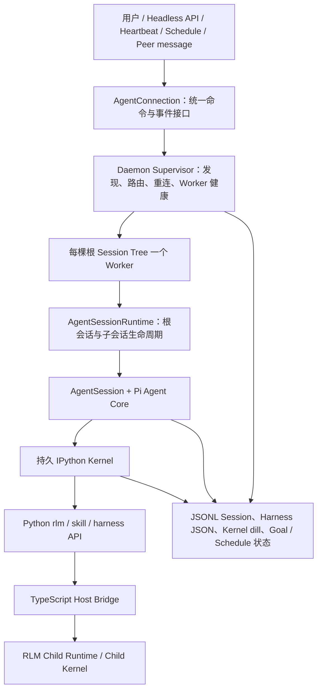
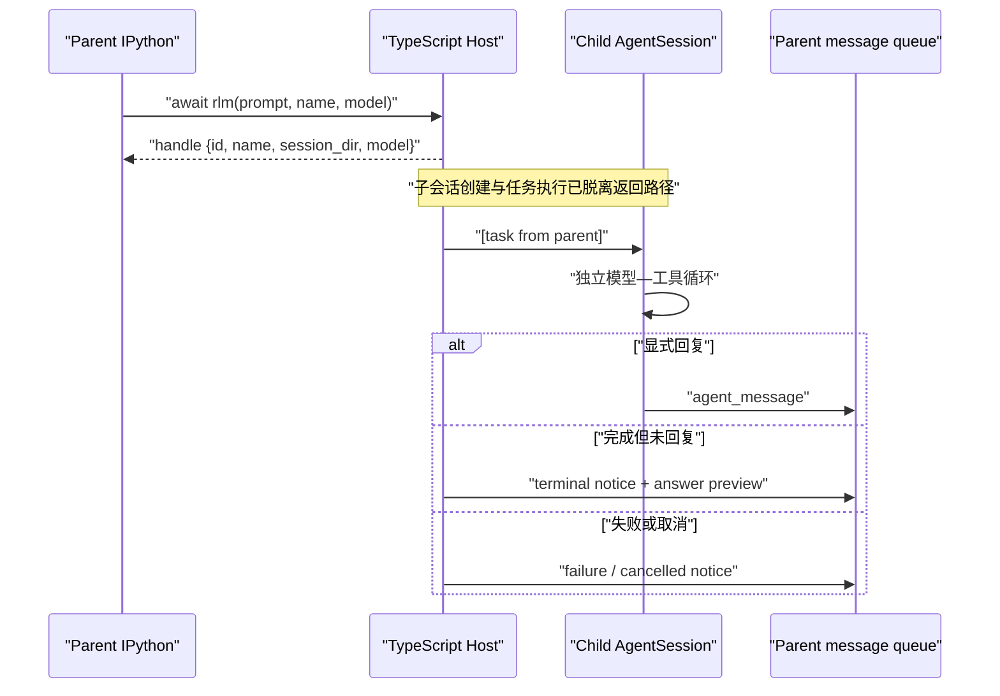
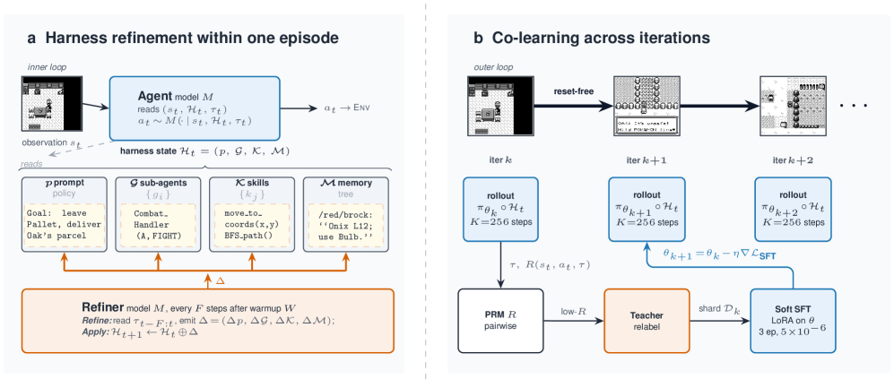
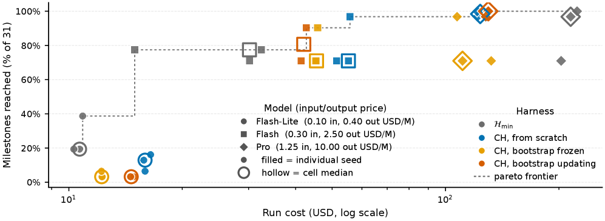

# Prime Agent 源码深度解析：真正的增量是可编程上下文与长任务 Runtime

> [!abstract] 核心判断
> Prime Agent **没有重新发明 Agent Core**。它承接了 Pi 的模型协议、Agent Loop、Session 与 TUI，真正向前推进的是 Core 之外的运行时：让模型把上下文当成 Python 变量，把子代理当成可编程任务，把会话交给常驻 Daemon/Worker，并把目标、定时任务、Harness 状态和一部分 IPython 命名空间持久化。
>
> 因此，最准确的定位不是“更聪明的 coding agent”，而是：**建立在 Pi 之上的、偏 RLM 编程范式的开放 Agent Runtime / 早期 Agent OS**。
>
> 其中最扎实的增量是 **RLM 控制面与 Daemon 恢复语义**。
>
> 最需要降温的是 **self-improving**。`/refine` 做到的是版本化、可回滚的补充 Harness 自修改，不是模型权重学习，也没有独立验证器证明每次修改真的提升能力。

这篇笔记延续 [[pi-mono源码深度解析：pi-agent的极简Agent Core]] 的 Core 基线，并用 [[Agent OS：把 Agent Core 变成可持续工作的生产系统]]、[[AI Coding研发中的Harness与Loop构建]]、[[论文解读：Towards Long-Horizon Agents: A Survey]] 中的长期任务与可信验证框架判断 Prime Agent 的增量。

---

## 1. 先回答“带来了什么增量”

如果把一个 coding agent 分成四层：

```text
模型能力
  ↓
Agent Core：模型调用、Tool Call、消息状态机
  ↓
Harness：上下文、工具、技能、子代理、压缩、验证策略
  ↓
Runtime / Agent OS：进程、恢复、调度、租约、持久状态、观测与治理
```

Prime Agent 的主要工作发生在后两层，而不是 Core。

| 维度 | Pi 基线 | Prime Agent 的新增 | 判断 |
|---|---|---|---|
| Agent Loop | 显式模型—工具循环、awaited event barrier | 基本沿用 | **低增量**，不是项目创新中心 |
| 上下文控制 | 文件、消息、Compaction | 持久 IPython；上下文可变成变量、函数和程序 | **高增量**，改变模型的控制面 |
| 子代理 | Core 之上的 Tool/进程组合模式 | 一等子会话、保留生命周期、A2A 消息、用量归因 | **高增量**，但语义更像 Actor，而非递归返回值 |
| 长任务生命周期 | Session 持久化，应用层自行扩展 | Daemon、每棵根会话树一个 Worker、重连、快照、恢复日志 | **很高增量**，是工程上最有价值的一层 |
| 状态延续 | 消息树、文件、Compaction | Kernel `dill` 快照、Goal、Heartbeat、Schedule、Harness | **高增量**，但不是完整进程 Checkpoint |
| 自适应 Harness | 主要靠人维护 Skill、Prompt、配置 | `/refine` 对 prompt note、memory、skill spec、subagent spec 做 CRUD | **中等增量**，机制成立，收益需外部验证 |
| 完成证明 | 由应用或使用者定义 | Goal 显式完成；Autonomous 可运行 shell gate | **中低增量**，gate 可选且只证明自身覆盖范围 |
| 安全边界 | 官方要求外部 Sandbox | Worker/Kernel 只做生命周期隔离，仍以用户权限执行 | **没有安全增量**，甚至扩大了常驻执行面 |

一句话压缩：

> **Pi 解决“一个 Agent turn 怎样正确运行”；Prime Agent 开始解决“一个 Agent 任务怎样跨上下文、跨终端、跨子代理持续运行”。**

这已经跨过了普通 Harness 的边界，但还没有完成 Agent OS 的全部闭环：它有恢复、调度和持久状态，却仍缺少强资源治理、独立完成验证、真正的安全隔离与稳定的 Harness 事务协议。

---

## 2. 版本锚点、项目身份与证据等级

### 2.1 固定源码修订

本文源码判断固定在：

- canonical repository：[`PrimeIntellect-ai/prime-agent`](https://github.com/PrimeIntellect-ai/prime-agent)
- branch：`main`
- full commit：[`a18809e00ea30638584d87b3afea7285a9d7296c`](https://github.com/PrimeIntellect-ai/prime-agent/commit/a18809e00ea30638584d87b3afea7285a9d7296c)
- commit date：2026-08-07 16:23:00 -07:00
- subject：`add privacy-safe agent analytics (#521)`
- package version：`0.7.1`
- HEAD tag：`beta`
- 最近稳定发布：`v0.7.1`，发布提交 `95afd319a78ae017a41241d50b013d656a0685ce`
- License：MIT

仓库在 2026-05-08 创建，迭代速度极快。2026-08-10 的 GitHub 快照为 11,632 stars、1,189 forks、457 个 open issues 与 PR；这些只能说明关注度与变动强度，不能替代质量证据。

### 2.2 它与 Pi 的关系

README 明确写明项目建立在 Pi 上，[源码仍使用 `@earendil-works/pi-*` 包](https://github.com/PrimeIntellect-ai/prime-agent/blob/a18809e00ea30638584d87b3afea7285a9d7296c/README.md#L102-L104)。把 Pi 官方仓库 `main` 拉入同一 Git 图后，二者最近共同祖先是：

- merge base：[`0bcaab4206a3ddbdba60cef2ce61497797f22a0b`](https://github.com/PrimeIntellect-ai/prime-agent/commit/0bcaab4206a3ddbdba60cef2ce61497797f22a0b)
- date：2026-05-08
- Prime 分支自该点增加 499 个提交

从共同祖先到本文 HEAD：

- 933 个文件发生变化
- `+211,892 / -46,426`
- `packages/coding-agent` 占 `+183,188 / -19,744`
- 新增 Python `prime-agent-runtime` 为 `+3,024` 行，其中源码 1,533 行、测试 1,474 行

这组数据证明 Prime 不是轻量改名，但它只是**从共同祖先出发的演化差异**，不能把此后 Pi 上游独立发展的内容也算成 Prime 的原创贡献。

### 2.3 引用原则

本文优先引用绑定完整 SHA 的源码。官方文档用于说明设计意图，CI 用于说明固定修订的自动验证状态；论文证据只支持其原始实验范围，上游 issue 则作为尚未由本文独立复现的故障报告。既有笔记只用于建立比较框架，当前项目事实仍以固定源码为准。

---

## 3. 仓库地图：真正的产品核心在 `coding-agent`

固定快照包含 1,134 个跟踪文件，约 390,082 行可计数文本。当前源码与测试体量如下：

| 区域 | 源码 | 测试 | 职责 |
|---|---:|---:|---|
| `packages/agent` | 2,395 行 | 3,223 行 | Pi Agent Core：状态机、loop、tool result 回填 |
| `packages/ai` | 34,013 行 | 17,657 行 | 模型 Provider 与协议统一 |
| `packages/coding-agent` | 116,629 行 | 122,344 行 | Prime 的真实主体：Session、Kernel、RLM、Daemon、Goal、Schedule、Refine |
| `packages/tui` | 14,927 行 | 14,716 行 | 终端交互层 |
| `prime-agent-runtime` | 1,533 行 | 1,474 行 | 注入 IPython 的 `rlm`、Harness、Skill、MCP Python API |

需要特别警惕一个阅读误区：`packages/agent` 名字最像“Agent”，但 Prime 的新增价值大多在 `packages/coding-agent`。这也意味着它不是用一个更复杂的 Core 取代 Pi，而是在 Pi Core 外面长出了一整层 Runtime。

### 3.1 当前关键模块集中度

| 文件 | 行数 | 主要职责 |
|---|---:|---|
| `core/agent-session.ts` | 11,208 | 会话、工具、Compaction、RLM、Refine、Goal 等总集成 |
| `modes/daemon/daemon-mode.ts` | 6,793 | Worker 内的 Daemon 协议与会话执行 |
| `modes/daemon/daemon-supervisor.ts` | 4,872 | Worker 发现、路由、恢复、快照与客户端连接 |
| `core/cron-jobs.ts` | 1,736 | 定时任务状态、claim、dispatch、恢复 |
| `core/kernel/index.ts` | 1,529 | Jupyter ZMQ、执行、打断、Host bridge、快照 |
| `core/refinement/refinement.ts` | 1,017 | Harness 规划、校验、应用、回滚 |

这不是立即的错误，但它暴露了一个长期维护成本：很多跨层不变量集中在少数超大文件里。Prime 增加了 Runtime 能力，也同时增加了状态组合爆炸和局部修改的回归半径。

---

## 4. 总体架构与执行流：一次任务到底怎样跑

官方架构不是“一个 CLI 进程里跑一个 agentLoop”，而是多层生命周期：



可以把各层职责压缩成：

1. **Supervisor 不跑模型和工具。** 它拥有会话发现、路由、客户端 attachment、Worker 健康与 A2A 投递。
2. **Worker 拥有一棵根会话树。** 根 Agent、RLM 子 Agent 与各自 Kernel 都在这棵生命周期树内。
3. **AgentSession 仍然使用 Pi Core。** Prime 的新增逻辑围绕 Session 接入，而不是侵入最小 loop。
4. **IPython 是模型的默认编程控制面。** Python shim 只负责调用体验，Provider、Session、子代理生命周期和策略仍由 TypeScript Host 掌握。
5. **终端不是任务的所有者。** 客户端断开后，Worker 可以继续；重新 attachment 时从快照恢复界面状态。

固定源码的总览入口是 [architecture.md](https://github.com/PrimeIntellect-ai/prime-agent/blob/a18809e00ea30638584d87b3afea7285a9d7296c/packages/coding-agent/docs/architecture.md)，根运行时在 [`AgentSessionRuntime`](https://github.com/PrimeIntellect-ai/prime-agent/blob/a18809e00ea30638584d87b3afea7285a9d7296c/packages/coding-agent/src/core/agent-session-runtime.ts#L86-L322)。

---

## 5. 增量一：RLM 把“工具调用”升级为“可编程控制面”

### 5.1 普通 Tool Calling 的限制

传统 coding agent 的模型每次选择一个结构化工具：

```text
read(path) → tool result → model
search(query) → tool result → model
bash(command) → tool result → model
```

模型能串联工具，却很难在不经过语言上下文的情况下直接写循环、过滤大对象、保留中间数据、批量派发或把多个结果重新组合。大量工具输出反复进入主上下文，也会加剧 context rot。

### 5.2 Prime 的改变：Prompt-as-a-variable

Prime 默认只向模型暴露 `ipython`。文件、Shell、数据处理、Skill 与子代理可以在持久 Python 环境里编排：

```python
files = ...                  # 中间状态不必全部进入语言上下文
selected = [x for x in files if ...]
handle = await rlm("审查这些候选并回报高风险项", name="reviewer")
```

这带来四个实际增量：

1. **上下文外部化不再只靠文件。** 变量、函数、导入与对象成为可继续使用的工作记忆。
2. **工具组合从自然语言计划变成程序。** 循环、分支、并行与数据变换可以直接编码。
3. **高体积内容可以先过滤，再打印给模型。** 主模型不必吞下所有原始输出。
4. **Harness 更接近可训练的动作空间。** “怎样管理上下文”本身能被表示成 Python 与子代理调用序列。

Kernel 通过 Jupyter shell/iopub/control 三条 ZMQ 通道运行，执行被按 Kernel 串行化；`host.request` comm 将 RLM、Goal、A2A 等请求转回 TypeScript Host，避免在 shell channel 上自我等待。[源码：Kernel Host bridge 与执行入口](https://github.com/PrimeIntellect-ai/prime-agent/blob/a18809e00ea30638584d87b3afea7285a9d7296c/packages/coding-agent/src/core/kernel/index.ts#L803-L930)

### 5.3 持久不等于完整 Checkpoint

Prime 会在成功 cell 后延迟约 1.5 秒，把用户命名空间逐变量用 `dill` 序列化；默认上限 256 MiB。单个不可序列化对象不会拖垮全部快照，恢复时也逐变量容错。[源码：快照与恢复代码](https://github.com/PrimeIntellect-ai/prime-agent/blob/a18809e00ea30638584d87b3afea7285a9d7296c/packages/coding-agent/src/core/kernel/state-snapshot.ts#L1-L193)

因此它能保存字符串、列表、普通对象、函数和部分导入状态，但以下内容不能被视为可靠恢复：

- 打开的文件、Socket、子进程与活跃异步任务；
- GPU Tensor 或超过体积上限的对象；
- 外部服务连接与未提交副作用；
- 正在执行的 cell；
- Kernel 之外的整进程内存。

所以 Prime 的状态连续性是“消息 + Artifact + 最佳努力的 Python 命名空间”，不是像数据库或工作流引擎那样的全事务 Checkpoint。

### 5.4 RLM 的收益不是无条件成立

Prime Intellect 的独立 RLM 博客实验本身给出了反例：RLM 在部分长上下文任务上有收益，但在 math-python 上退化；DeepDive 若不提供明确的分解策略也可能落后；所有测试场景的完成时间都显著上升，子模型还会增加总 token 消耗。博客中的“主模型 token 效率”不统计子模型 token，不能直接等价成总成本下降。[官方 RLM 实验](https://www.primeintellect.ai/blog/rlm)

而且博客中的 RLMEnv 与 Prime Agent 不是同一个执行契约：前者在隔离 Sandbox 中以 `answer` Python 变量结束，Prime Agent 则在用户权限 Kernel 中通过 Host bridge、子会话与消息完成。因此该博客只能证明 RLM 范式具有条件性潜力，不能作为 Prime Agent coding 工作流的性能证明。

---

## 6. 增量二：`rlm()` 的真实语义是异步 Actor，不是递归函数

README 说 `rlm(...)` “returns their results programmatically”，但源码契约更谨慎，也更有意思。

Python 侧明确写着：`run()` 在任务被接纳后返回 `RLMSpawnHandle`。[源码：Python API](https://github.com/PrimeIntellect-ai/prime-agent/blob/a18809e00ea30638584d87b3afea7285a9d7296c/prime-agent-runtime/src/rlm/__init__.py#L143-L151)

TypeScript 侧流程如下：



[源码：子任务接纳、后台执行、用量归因与终态通知](https://github.com/PrimeIntellect-ai/prime-agent/blob/a18809e00ea30638584d87b3afea7285a9d7296c/packages/coding-agent/src/core/agent-session.ts#L9604-L9952)

这意味着：

- `handle = await rlm(...)` 中的 `await` 等待的是**接纳**，不是答案；
- 子代理结果只通过 `agent_message` 或共享文件回到父代理；
- 子代理完成但忘记回复时，Host 会注入终态通知，避免完全静默；
- 子代理会被保留，父会话可以继续发消息或删除；
- 子代理用量归因到父 assistant message，但父主上下文 token 仍单独测量；
- 模型选择必须精确匹配 `provider/model` 并通过认证预检，不静默 fallback；
- 默认最大递归深度为 1，但源码没有同等级的横向 fan-out、总 token 或内存硬上限。

### 6.1 为什么 Actor 语义反而合理

同步递归函数适合短任务：调用、等待、拿结果。长任务需要：

- 父任务不被一个慢子任务卡住；
- 多个子任务并行；
- 子任务可继续被 steer；
- 终端断开后仍保留；
- 结果可以流式、分批或通过 Artifact 交付。

所以 Prime 实际选择的是更适合长任务的 Actor/任务树语义。问题不在这个选择，而在 README 的“函数调用”类比会让人误以为返回值包含答案。真正的 fan-in、超时、去重、失败策略和预算控制仍需要父代理自己编排。

---

## 7. 增量三：Continual Harness 是可审计自修改，不是已证实的自我提升

### 7.1 它实际修改什么

Harness 状态分成四类：

- `prompt`：补充提示，不是基础 System Prompt；
- `memory`：持久事实、策略与经验；
- `skill`：已安装 Python Skill 的引用与参数契约；
- `subagent`：可复用的子代理任务说明。



*图 1：原论文把 Continual Harness 分成 episode 内的 Harness refinement，以及跨迭代更新模型权重的 co-learning。Prime Agent 当前实现了左侧结构化 Harness CRUD 的一部分，并未在产品运行时内实现右侧的 PRM 与权重训练闭环。来源：Karten 等，Figure 2，CC BY-NC-SA 4.0。*

每个条目带 `id`、版本、来源、时间、local/global scope。local 默认只影响当前会话，global 才跨会话。基础 System Prompt 在这条路径中不可变。[源码：类型与注入规则](https://github.com/PrimeIntellect-ai/prime-agent/blob/a18809e00ea30638584d87b3afea7285a9d7296c/packages/coding-agent/src/core/refinement/refinement.ts#L21-L108) [源码：Prompt 注入与不可变边界](https://github.com/PrimeIntellect-ai/prime-agent/blob/a18809e00ea30638584d87b3afea7285a9d7296c/packages/coding-agent/src/core/refinement/refinement.ts#L429-L519)

`/refine` 的执行过程是：

1. 截取最近 80,000 字符的对话；
2. 合并当前 local/global Harness 概览和历史；
3. 再调用当前选中模型，要求输出 JSON CRUD proposal；
4. 校验 action、kind、字段与 Skill 引用结构；
5. 应用前重新读磁盘；
6. 与规划时 baseline 比较，拒绝被并发修改过的条目；
7. 原子保存 TypeScript 侧状态，记录 history 与 before/after；
8. 重建下一轮 System Prompt；
9. 支持基于快照的 rollback。

[源码：规划阶段](https://github.com/PrimeIntellect-ai/prime-agent/blob/a18809e00ea30638584d87b3afea7285a9d7296c/packages/coding-agent/src/core/refinement/refinement.ts#L856-L933) [源码：冲突检查与版本化 CRUD](https://github.com/PrimeIntellect-ai/prime-agent/blob/a18809e00ea30638584d87b3afea7285a9d7296c/packages/coding-agent/src/core/refinement/refinement.ts#L707-L835) [源码：Turn 边界上的应用](https://github.com/PrimeIntellect-ai/prime-agent/blob/a18809e00ea30638584d87b3afea7285a9d7296c/packages/coding-agent/src/core/agent-session.ts#L7740-L7883)

### 7.2 “self-improving”成立到哪一层

成立的部分：

- Agent 可以从轨迹中提取经验；
- 经验不必由人手动修改配置；
- 修改是小步、结构化、有版本、有历史、可回滚；
- local/global 分离控制了默认爆炸半径；
- Skill 条目只引用已安装 Python 包，`/refine` 不能凭描述偷偷创造可执行包代码。

没有成立的部分：

- 没有独立 verifier 判断 proposal 是否真实、是否提升后续任务；
- “evidence-backed”主要是写给 Refiner 模型的策略，不是强制的证据对象或通过门禁；
- Agent 与 Refiner 默认是同一个模型，容易出现同源偏差和循环自证；
- 错误经验或 Prompt Injection 可以被持久化，global scope 会扩大影响；
- 没有围绕每次 refinement 的前后对照 eval、回放或自动回退；
- Harness 变化不等于模型权重学习。

因此更准确的措辞是：

> **Prime Agent 实现了 Continual Harness mutation，但还没有实现可信的 Continual Harness improvement。**

### 7.3 论文证明了机制潜力，但不能直接证明本项目

Continual Harness 论文在 Pokémon Red/Emerald 上发现明显的能力依赖：Gemini Pro 的 Continual Harness 在 Emerald 以约 40% 更低中位 API 成本达到近似完成度；Flash 高方差；Flash-Lite 反而退化。论文还用 Dijkstra oracle 测量了导航 Skill 的改善。[Continual Harness 论文](https://arxiv.org/abs/2605.09998)



*图 2：Continual Harness 的收益随模型能力显著分化。Pro 条件进入更优的成本—完成度区域，Flash 高方差，Flash-Lite 的 Continual Harness 条件低于最小 Harness；这直接反驳“多一层 Harness 必然更强”。来源：Karten 等，Figure 6，CC BY-NC-SA 4.0。*

这说明两件事：

1. Harness 自修改可以带来真实增益，但需要足够强的底座模型和可测环境；
2. 更复杂的 Harness 本身也会压垮能力不足的模型。

论文实现与 Prime Agent 产品实现还有关键差异：论文可重写完整 System Prompt、生成游戏技能，并依赖游戏里程碑与导航 oracle；Prime Agent 保护基础 System Prompt，Skill 主要是已安装代码的引用，普通 coding 任务也没有内建 oracle。不能把 Pokémon 的结果直接外推成 Prime Agent 在软件工程任务上的提升比例。

### 7.4 当前实现的两个数据完整性缺口

第一，TypeScript `/refine` 保存采用临时文件 + rename，但 Python `HarnessState.save()` 直接以 `open("w")` 截断后写 JSON；mtime 重读只能减少陈旧覆盖，不能构成跨进程 CAS 或事务。[源码：Python 读写路径](https://github.com/PrimeIntellect-ai/prime-agent/blob/a18809e00ea30638584d87b3afea7285a9d7296c/prime-agent-runtime/src/rlm/harness.py#L186-L299) 上游也已记录 [#929](https://github.com/PrimeIntellect-ai/prime-agent/issues/929)。

第二，注入 Prompt 的每类概览默认只显示按路径字母序排列的前 6 项，每项 180 字符；新条目没有 recency 或 relevance 优先级。子代理中的 `rlm.harness` 又默认读自己的空 local store，而不是已注入 Prompt 的 global store。该组合已在 [#819](https://github.com/PrimeIntellect-ai/prime-agent/issues/819) 中被完整复现。它会削弱“经验积累得越多，后续越容易取用”的核心价值。

---

## 8. 增量四：Daemon/Worker 是项目最扎实的生产化贡献

### 8.1 生命周期从终端中剥离

在普通 TUI Agent 中，终端进程退出常常等于任务退出。Prime 把结构拆成：

- 一个 Supervisor；
- 每棵根 Session Tree 一个 Worker；
- Worker 内持有根 Agent、子 Agent、Kernel、Scheduler；
- 一个会话可有多个客户端 attachment；
- 客户端断开不自动终止 Worker；
- 新客户端 attach 时接收状态快照。

这使“任务拥有者”从终端转移到 Runtime，是它成为长任务系统的前提。

### 8.2 命令恢复语义比“自动重试”更严谨

协议当前为 v7、schema revision 14。[源码：协议常量](https://github.com/PrimeIntellect-ai/prime-agent/blob/a18809e00ea30638584d87b3afea7285a9d7296c/packages/coding-agent/src/modes/daemon/daemon-protocol.ts#L52-L60) 值得注意的是 `daemon.md` 仍写旧协议版本，说明文档在快速迭代中可能落后于代码。

每个变更命令使用 `(clientId, commandId)` 作为幂等身份：

1. dispatch 前把 `received` 追加到 journal 并 `fsync`；
2. 完成后写 `result` 并 `fsync`；
3. 完整重复命令返回已存结果；
4. 若 crash 发生在 `received` 与 `result` 之间，返回 `command_result_uncertain`，不擅自重放副作用。

[源码：Command Recovery Journal](https://github.com/PrimeIntellect-ai/prime-agent/blob/a18809e00ea30638584d87b3afea7285a9d7296c/packages/coding-agent/src/modes/daemon/command-recovery-journal.ts#L53-L112) [源码：Supervisor 接纳语义](https://github.com/PrimeIntellect-ai/prime-agent/blob/a18809e00ea30638584d87b3afea7285a9d7296c/packages/coding-agent/src/modes/daemon/daemon-supervisor.ts#L1270-L1370)

这是正确的 **at-most-once + uncertain outcome**，不是“正好一次”。对于可能写文件、发消息或调用外部服务的命令，承认结果不确定比盲目 replay 更可信。

### 8.3 Session Lease 保护并发写者

Session 运行时可以通过规范化路径取得 lease，owner 记录包含 PID 与 process start id，避免 PID 重用造成误判；底层使用 `proper-lockfile` 和 owner 文件协调。[源码：Session Lease](https://github.com/PrimeIntellect-ai/prime-agent/blob/a18809e00ea30638584d87b3afea7285a9d7296c/packages/coding-agent/src/core/session-lease.ts#L232-L285)

这解决的是同一个 Session 被多个 Worker 同时写的问题，不是分布式业务锁，也没有把文件副作用变成事务。

### 8.4 Replay 名称比能力更强

`createDaemonReplayInfo()` 只有在没有 cursor 或 cursor 已经等于当前末尾时返回 `complete`；一旦真的存在事件缺口，就返回 `event_replay_not_available`，客户端需要依赖新快照 resync。[源码：Replay 判定](https://github.com/PrimeIntellect-ai/prime-agent/blob/a18809e00ea30638584d87b3afea7285a9d7296c/packages/coding-agent/src/modes/daemon/daemon-protocol.ts#L1092-L1146)

因此目前的能力是“cursor 检测缺口 + snapshot 重同步”，不是保留事件日志后的区间 replay。它足够支撑 TUI 重连，但不能等同于 Kafka、Temporal 之类的可重放工作流历史。

### 8.5 Worker 恢复仍有正确的保守边界

Supervisor 最多做三轮恢复尝试；它先核对 PID 与 process start id，能安全重连则复用，不能确认身份时拒绝粗暴替换；不确定的 Worker 操作单独进入恢复处理。[源码：Worker Recovery](https://github.com/PrimeIntellect-ai/prime-agent/blob/a18809e00ea30638584d87b3afea7285a9d7296c/packages/coding-agent/src/modes/daemon/daemon-supervisor.ts#L2708-L2810)

这比简单的“进程死了就重启”成熟。但上游 [#764](https://github.com/PrimeIntellect-ai/prime-agent/issues/764) 显示另一个层级的缺口：意外退出的 IPython Kernel 会进入永久 `shutdown`，下一次 `execute()` 直接失败，现有 `restart()` 没有被自动接入该路径。[源码：Kernel 意外退出与执行拒绝](https://github.com/PrimeIntellect-ai/prime-agent/blob/a18809e00ea30638584d87b3afea7285a9d7296c/packages/coding-agent/src/core/kernel/index.ts#L646-L727) [源码：可用但未自动触发的 restart](https://github.com/PrimeIntellect-ai/prime-agent/blob/a18809e00ea30638584d87b3afea7285a9d7296c/packages/coding-agent/src/core/kernel/index.ts#L1377-L1393)

结论是：**Worker 级恢复已经认真设计，Kernel 级自愈和循环熔断仍未闭环。**

---

## 9. 增量五：Goal、Schedule、Autonomous 把“继续工作”变成显式状态

### 9.1 Goal 与普通 Prompt 的不同

Goal 不是多写一句“请继续”，而是持久状态机：`idle / active / paused / budget_limited / complete / error`，包含 objective、token/time/continuation usage。结束一个 turn 不会清掉 objective；只有显式 `goal.complete()` 才进入完成状态，耗尽预算不能冒充完成。[源码：Goal 状态与继续语义](https://github.com/PrimeIntellect-ai/prime-agent/blob/a18809e00ea30638584d87b3afea7285a9d7296c/packages/coding-agent/src/core/goals.ts#L10-L26) [源码：完成审计提示](https://github.com/PrimeIntellect-ai/prime-agent/blob/a18809e00ea30638584d87b3afea7285a9d7296c/packages/coding-agent/src/core/goals.ts#L207-L250)

这是从“对话结束条件”向“任务结束条件”迈出的真实一步。

但 Host 仍然主要依赖模型主动调用完成函数。若完成 Skill 缺失或 Kernel 故障，目标可能继续活跃；上游 [#1111](https://github.com/PrimeIntellect-ai/prime-agent/issues/1111) 就记录了 `--goal --no-skills` 组合使 `goal.complete()` 不可用并继续消耗预算的问题。

### 9.2 Autonomous 不是自主完成验证器

默认 autonomous 上限是：

- 3 次 continuation；
- 12 turns；
- 80,000 tokens；
- 30 分钟；
- 默认没有 quality gate。

[源码：默认限制](https://github.com/PrimeIntellect-ai/prime-agent/blob/a18809e00ea30638584d87b3afea7285a9d7296c/packages/coding-agent/src/core/autonomous.ts#L45-L61)

用户配置 shell gate 后，Host 会在代理想结束时执行命令；失败输出回填，工作区完全未变化时不会无意义地重复同一失败 gate。[源码：Gate 决策与执行](https://github.com/PrimeIntellect-ai/prime-agent/blob/a18809e00ea30638584d87b3afea7285a9d7296c/packages/coding-agent/src/core/autonomous.ts#L227-L347)

这比纯 Prompt 续跑更强，但边界必须明确：

- 没有 gate 时，Host 只知道预算和错误，不知道任务正确；
- gate 通过只证明该命令检查到的部分；
- gate 使用 `shell: true` 且以用户权限运行，只应接受可信命令；
- tokens 统计排除 cache-read，适合限制新增工作量，但不等于供应商账单总 token。

### 9.3 Schedule 的恢复选择了“不重复副作用”

Cron job 在 dispatch 前先 claim 并推进 `nextRunAt`；同一 job 已有 claim 时当前 tick 记 skip。若进程在 dispatch 中断，恢复会删除 claim、写入 `Interrupted before scheduled operation completion`，一次性任务直接完成，不自动重放。[源码：claim 与 interrupted recovery](https://github.com/PrimeIntellect-ai/prime-agent/blob/a18809e00ea30638584d87b3afea7285a9d7296c/packages/coding-agent/src/core/cron-jobs.ts#L1574-L1624)

这再次体现 Prime 的基本倾向：对无法证明幂等的外部副作用，宁可暴露“不确定/跳过”，也不静默重复。它对 ops 和长任务是正确方向，但用户必须自己提供补偿或人工复核策略。

---

## 10. 实证校准：哪些“增量”已经被证明，哪些还没有

| 主张 | 当前证据 | 结论 |
|---|---|---|
| RLM 能降低所有任务成本 | 官方 RLM 实验在部分任务退化，且总时延上升 | **不成立**；收益依赖任务、模型与策略 |
| RLM 能改善长上下文控制 | Oolong 等长上下文任务显示条件性收益；源码提供持久变量与子代理 | **部分成立**；Prime Agent 本身仍缺独立 benchmark |
| Continual Harness 会自我提升 | Pokémon 论文有 oracle 与里程碑证据，但 Flash-Lite 退化 | **机制成立、普遍性不成立** |
| Prime Agent 的 `/refine` 已被论文验证 | 产品实现与论文的可写对象、工具、环境、验证器都不同 | **不成立**；只能说设计受其启发 |
| Prime 能跨终端持续运行 | Daemon/Worker、attach、journal、snapshot 源码与 CI 存在 | **成立**，但 Kernel 自愈仍有缺口 |
| Prime 是安全 Sandbox | README 明确否认；Kernel 与 Shell 拥有用户权限 | **不成立** |
| Prime 比 Pi 的 Agent Loop 更先进 | Core 大量继承，新增集中在 coding-agent Runtime | **不成立**；它解决的是不同层级 |

对“增量”的最公允排序是：

1. **Daemon/Worker/Session continuity：最高可信。** 源码、协议、CI 与故障语义都具体。
2. **Persistent IPython + programmatic orchestration：高可信。** 能力真实，但收益条件化，安全成本显著。
3. **Retained child agents + A2A：高可信。** 运行时能力真实；异步结果、宽度预算与失败聚合仍由 Agent 负责。
4. **Goal/Schedule/Autonomous：中高可信。** 显式状态和 gate 是进步，尚非完整 Task/Run/Step 工作流模型。
5. **Continual Harness improvement：中低可信。** mutation 和 rollback 真实，提升效果没有在本项目中闭环证明。

---

## 11. 当前风险与失败模式

### 11.1 安全：常驻能力越强，Blast Radius 越大

README 明确警告：模型生成的 Python 与项目命令以用户权限执行，Worker 与 Kernel 不是安全 Sandbox。[官方安全边界](https://github.com/PrimeIntellect-ai/prime-agent/blob/a18809e00ea30638584d87b3afea7285a9d7296c/README.md#L63-L66)

主要攻击与事故面包括：

- 读取用户可访问的文件、环境变量与凭据；
- Python 包、Skill、Extension 与 MCP 的供应链风险；
- Prompt Injection 被 `/refine --global` 持久化；
- 子代理继承完整宿主能力，缺少 caller-granted capability；
- `%%bash` 子进程和后台进程逃逸普通 cell 生命周期；
- Daemon 让错误行为在终端断开后继续。

上游 [#896](https://github.com/PrimeIntellect-ai/prime-agent/issues/896) 仍把“隔离子代理 + 调用方授权能力”列为 feature request，说明 capability boundary 尚未实现。

### 11.2 资源：限制了深度，没有限制宽度

默认 RLM 深度为 1 能阻止无限向下递归，但没有在同层提供固定子代理数、总并发、内存、进程或总 token 硬上限。长任务中的 programmatic fan-out 很容易同时放大：

```text
子代理数量 × 每个 Worker/Kernel 内存 × 模型并发 × 外部进程 × 持久快照
```

[#764](https://github.com/PrimeIntellect-ai/prime-agent/issues/764) 的用户报告包含 15 个并发 relay worker 造成内存压力、Kernel 死亡后继续循环的案例。它不是本文复现结果，但与源码中缺少宽度治理、Kernel 无自动重启和 Goal 持续注入形成一致风险链。

### 11.3 中断：结束 Tool Call 不等于结束副作用

Kernel abort 先发送 interrupt；1 秒后若还未结束，会把当前 Tool Call 标成 aborted，但保留 `activeExecution`，因为底层 cell 可能仍在运行。[源码：forceAbort](https://github.com/PrimeIntellect-ai/prime-agent/blob/a18809e00ea30638584d87b3afea7285a9d7296c/packages/coding-agent/src/core/kernel/index.ts#L891-L918)

这是诚实的状态表达，却没有保证 `%%bash` 的孙进程收到信号。上游 [#849](https://github.com/PrimeIntellect-ai/prime-agent/issues/849) 报告了 CPU 密集子进程在 Esc 后继续运行。对 Agent Runtime 来说，Cancellation 必须穿透整个进程树，不能只结束上层 Promise。

### 11.4 Daemon 复杂度已经产生跨会话耦合

[#898](https://github.com/PrimeIntellect-ai/prime-agent/issues/898) 报告：长时间的 `prompt_and_wait` 被归为全局 mutation，导致 idle eviction 等待整个 mutation latch 排空，一个忙会话可以阻止其他 idle Worker 被回收。

[#1000](https://github.com/PrimeIntellect-ai/prime-agent/issues/1000) 报告：程序化消息在 idle session 中可能不触发 input pump，子代理结果或定时 follow-up 排队数小时，直到人类输入才一起释放。

这些问题不是“功能没做”，而是长任务 Runtime 的典型二阶问题：当 attachment、mutation、queue、recovery、passivation 和 A2A 同时存在，局部正确不再自动推出系统正确。

---

## 12. 验证与质量状态

### 12.1 本文做过的验证

| 检查 | 结果 | 说明 |
|---|---|---|
| 固定 canonical clone 与 SHA | 通过 | clean `main` at `a18809e...` |
| Git 对象完整性 | 通过 | 本地 `git fsck --no-progress` 无错误 |
| Pi 共同祖先与差异统计 | 通过 | 使用同一 Git 图，不以两个独立 ZIP 猜测来源 |
| 官方 CI | 通过 | 固定 SHA 的 Build and check、8 个测试 lane 全部 success |
| CodeQL | 通过 | 固定 SHA 的 C/C++、JS/TS、Python analysis success |
| 核心文档—源码交叉检查 | 完成 | RLM、Runtime、Daemon、Goal、Schedule、Refine、Kernel |
| 本地全量测试 | 未运行 | 本文不重复执行整仓测试，使用固定 SHA 官方 CI 作为自动验证证据 |
| 上游 issue 复现 | 未运行 | 仅作为上游故障报告，不冒充本文实测 |

固定 SHA 的官方 CI 运行见 [GitHub Actions run 31226956547](https://github.com/PrimeIntellect-ai/prime-agent/actions/runs/31226956547)。CI 包含 build、check，以及 agent-core、ai、tui、coding-agent 三分片、process smoke、kernel 共 8 个测试 lane。

### 12.2 测试体量值得肯定，但不是生产成熟度证明

`packages/coding-agent` 的测试行数 122,344，已超过源码 116,629；Kernel、Daemon、Session 和协议有大量故障路径测试。这是项目最强的质量信号之一。

但快速增长、巨型集成文件和大量近期运行时 issue 表明它仍处于高变动阶段。CI 能证明已编码的期望没有回归，不能证明未知状态组合、宿主差异和长时间资源行为都已经覆盖。

---

## 13. 它适合什么，不适合什么

### 13.1 最匹配的场景

- 需要跨小时或跨终端持续执行的研究与 coding 任务；
- 大量文本、数据、文件需要先用程序过滤，再交给模型判断；
- 子任务可以异步并行，并允许通过消息或 Artifact 汇总；
- 使用者愿意检查工作区、为任务提供 deterministic gates；
- 希望研究 RLM、Harness adaptation 与 Agent Runtime 的开放实现；
- 可以在一次性 VM、容器或受控账号中运行。

### 13.2 当前不应直接承担的场景

- 不可信仓库、指令、Skill 或依赖需要在宿主机直接运行；
- 要求严格 capability isolation、网络白名单或凭据隔离；
- 外部副作用要求 exactly-once，而业务没有幂等键或补偿；
- 多租户服务需要每任务 CPU、内存、进程、并发、成本硬配额；
- 任务完成必须由独立 verifier 证明，不能依赖模型自报；
- 简单短任务：RLM、Daemon 与子代理的固定开销可能大于收益。

### 13.3 如果现在采用，最低治理基线

1. 在 disposable clone、容器、VM 或独立低权限账号中运行。
2. 默认关闭 global refinement，只在人工审查后持久化跨会话经验。
3. 为子代理增加外部并发、token、进程与内存限制；不要只依赖递归深度。
4. 为 Autonomous 配置可信、窄范围、可重复的质量 gate。
5. 对外部写操作使用业务幂等键，并把 `uncertain` 作为一等状态处理。
6. 监控 Kernel 退出、重复相同 fatal error、Goal continuation 和成本速率，设置 circuit breaker。
7. 定期审查 Harness history、global memory 与 Skill 引用，提供人工回滚入口。
8. 固定 release 与 SHA；项目文档和协议变动快，不要以 `main` 作为生产契约。

---

## 14. 最终结论：它把 Pi 从 Core 推向 Runtime，但尚未成为完整 Agent OS

知识库里对 Agent OS 的定义，要求 Core 之外至少处理业务状态、信任与控制、执行恢复、状态管理、观测和演化。按这个尺度看 Prime Agent：

| Agent OS 能力 | Prime 当前状态 |
|---|---|
| 业务任务状态 | 有 Goal、Schedule、Session Tree，但尚未形成通用 Task/Run/Step/Artifact 模型 |
| 执行与恢复 | 强：Supervisor、Worker、Lease、Journal、Snapshot；Kernel 自愈仍不完整 |
| 上下文与记忆 | 强：Message、Compaction、Files、Python Namespace、Harness 多层并存 |
| 多代理编排 | 中强：一等子会话与 A2A；缺宽度资源治理和声明式 fan-in |
| 完成验证 | 中弱：可选 shell gate；缺独立 verifier 与覆盖证明 |
| 信任与权限 | 弱：同用户权限执行，外部 Sandbox 仍是前提 |
| 自我演化 | 中弱：有版本化 mutation，缺 eval gate、反事实对照和自动回退 |
| 可观测性 | 中：事件、日志、用量、快照较全；超大集成模块增加理解成本 |

因此我的最终结论是：

> **Prime Agent 最值得研究的，不是“会自己改 Prompt”的新奇感，而是它把三个通常分散的方向接到同一棵会话树里：可编程上下文、持久子代理、可恢复长任务 Runtime。**
>
> 这让 Pi 从“优秀的 Agent Core”跨到了“可持续工作的 Agent Runtime”。但要成为可信的 Agent OS，还必须补上三道硬门槛：**资源治理、独立验证、安全隔离**。

对架构研究者，Prime 是一个非常有信息量的项目；对生产采用者，它更像值得小范围试运行和吸收设计的 beta，而不是无需外层治理就能托管关键业务的完成态平台。

---

## 15. 核心代码索引

| 主题 | 固定源码 |
|---|---|
| 项目定位与安全边界 | [README](https://github.com/PrimeIntellect-ai/prime-agent/blob/a18809e00ea30638584d87b3afea7285a9d7296c/README.md#L31-L66) |
| 总体架构 | [architecture.md](https://github.com/PrimeIntellect-ai/prime-agent/blob/a18809e00ea30638584d87b3afea7285a9d7296c/packages/coding-agent/docs/architecture.md) |
| RLM 编程模型 | [rlm.md](https://github.com/PrimeIntellect-ai/prime-agent/blob/a18809e00ea30638584d87b3afea7285a9d7296c/packages/coding-agent/docs/rlm.md) |
| RLM Runtime | [rlm-runtime.md](https://github.com/PrimeIntellect-ai/prime-agent/blob/a18809e00ea30638584d87b3afea7285a9d7296c/packages/coding-agent/docs/rlm-runtime.md) |
| 根/子会话生命周期 | [agent-session-runtime.ts](https://github.com/PrimeIntellect-ai/prime-agent/blob/a18809e00ea30638584d87b3afea7285a9d7296c/packages/coding-agent/src/core/agent-session-runtime.ts#L86-L322) |
| 子代理接纳与终态 | [agent-session.ts](https://github.com/PrimeIntellect-ai/prime-agent/blob/a18809e00ea30638584d87b3afea7285a9d7296c/packages/coding-agent/src/core/agent-session.ts#L9604-L9952) |
| Python `rlm` API | [rlm/__init__.py](https://github.com/PrimeIntellect-ai/prime-agent/blob/a18809e00ea30638584d87b3afea7285a9d7296c/prime-agent-runtime/src/rlm/__init__.py#L143-L304) |
| Kernel 与 Host bridge | [kernel/index.ts](https://github.com/PrimeIntellect-ai/prime-agent/blob/a18809e00ea30638584d87b3afea7285a9d7296c/packages/coding-agent/src/core/kernel/index.ts#L803-L930) |
| Namespace 快照 | [state-snapshot.ts](https://github.com/PrimeIntellect-ai/prime-agent/blob/a18809e00ea30638584d87b3afea7285a9d7296c/packages/coding-agent/src/core/kernel/state-snapshot.ts#L52-L193) |
| Refinement 规划与应用 | [refinement.ts](https://github.com/PrimeIntellect-ai/prime-agent/blob/a18809e00ea30638584d87b3afea7285a9d7296c/packages/coding-agent/src/core/refinement/refinement.ts#L707-L933) |
| Python Harness Store | [harness.py](https://github.com/PrimeIntellect-ai/prime-agent/blob/a18809e00ea30638584d87b3afea7285a9d7296c/prime-agent-runtime/src/rlm/harness.py#L141-L315) |
| Daemon 协议与 Replay | [daemon-protocol.ts](https://github.com/PrimeIntellect-ai/prime-agent/blob/a18809e00ea30638584d87b3afea7285a9d7296c/packages/coding-agent/src/modes/daemon/daemon-protocol.ts#L1092-L1146) |
| 命令恢复 Journal | [command-recovery-journal.ts](https://github.com/PrimeIntellect-ai/prime-agent/blob/a18809e00ea30638584d87b3afea7285a9d7296c/packages/coding-agent/src/modes/daemon/command-recovery-journal.ts#L53-L112) |
| Session Lease | [session-lease.ts](https://github.com/PrimeIntellect-ai/prime-agent/blob/a18809e00ea30638584d87b3afea7285a9d7296c/packages/coding-agent/src/core/session-lease.ts#L232-L285) |
| Goal | [goals.ts](https://github.com/PrimeIntellect-ai/prime-agent/blob/a18809e00ea30638584d87b3afea7285a9d7296c/packages/coding-agent/src/core/goals.ts#L207-L250) |
| Autonomous Gate | [autonomous.ts](https://github.com/PrimeIntellect-ai/prime-agent/blob/a18809e00ea30638584d87b3afea7285a9d7296c/packages/coding-agent/src/core/autonomous.ts#L227-L347) |
| Schedule claim 与恢复 | [cron-jobs.ts](https://github.com/PrimeIntellect-ai/prime-agent/blob/a18809e00ea30638584d87b3afea7285a9d7296c/packages/coding-agent/src/core/cron-jobs.ts#L1574-L1624) |

## 16. 参考资料与外部原始资料

- [Prime Agent 官方仓库](https://github.com/PrimeIntellect-ai/prime-agent)
- [Prime Intellect：Recursive Language Models](https://www.primeintellect.ai/blog/rlm)
- [Continual Harness: Online Adaptation for Self-Improving Foundation Agents](https://arxiv.org/abs/2605.09998)
- [固定 SHA 官方 CI](https://github.com/PrimeIntellect-ai/prime-agent/actions/runs/31226956547)
