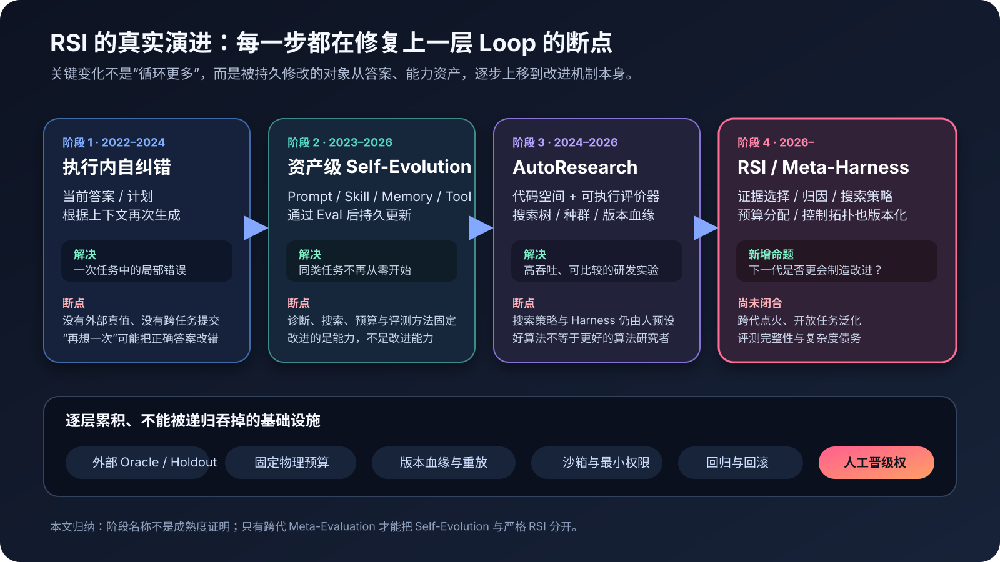
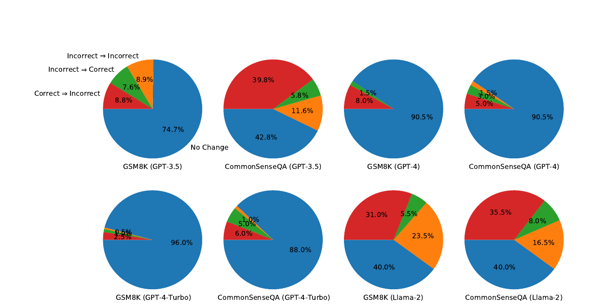
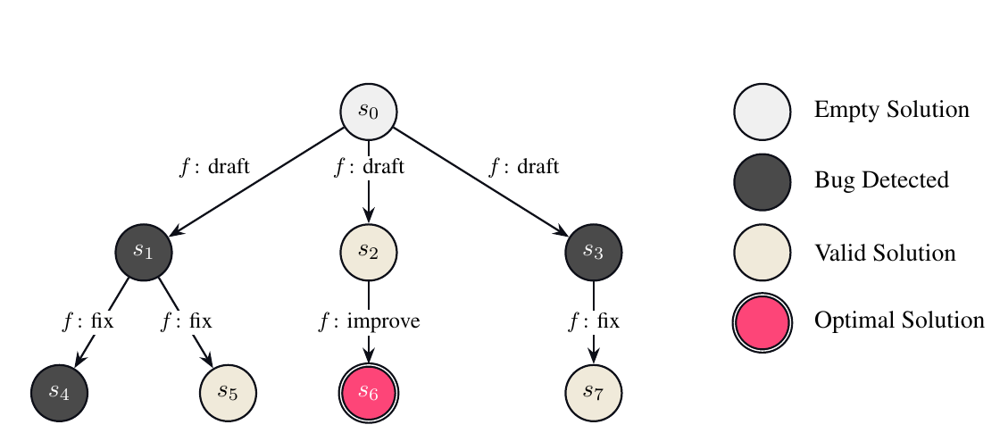
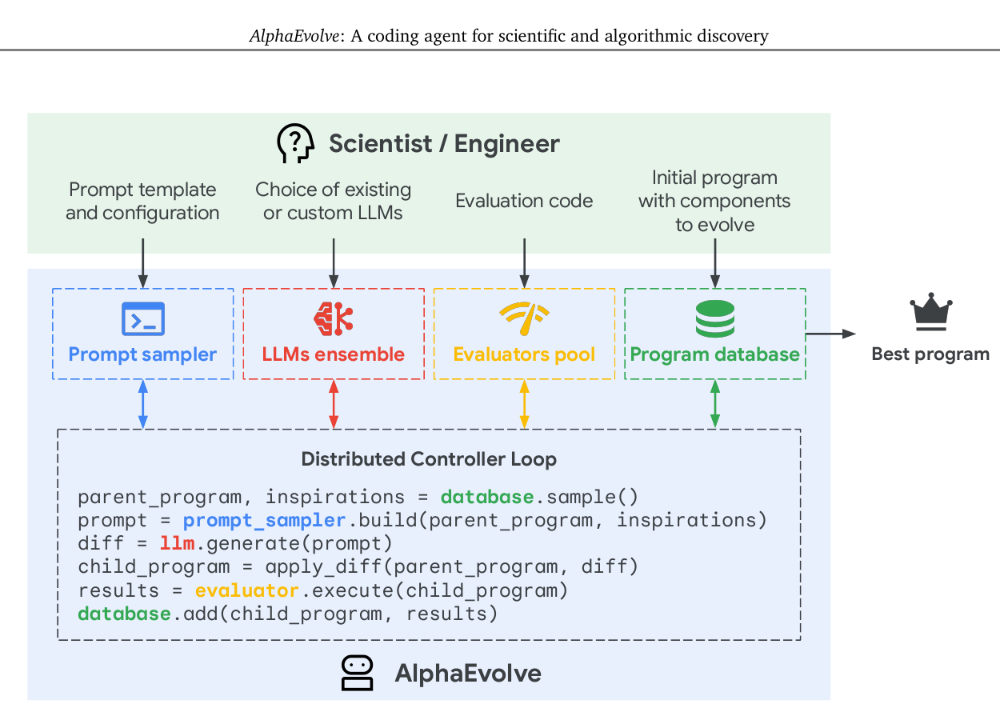
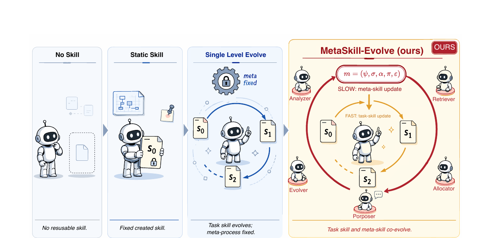
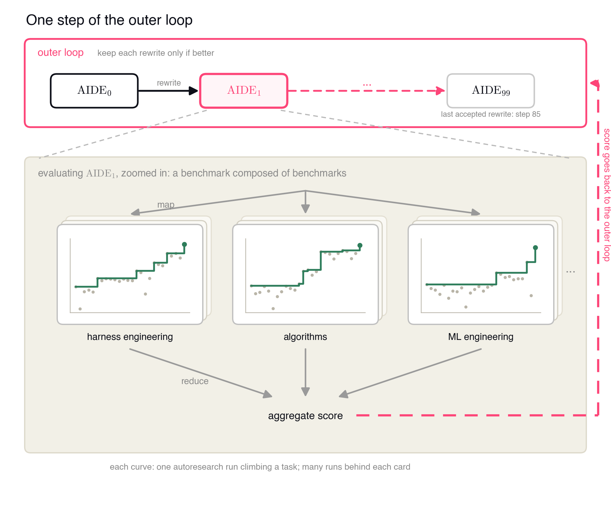
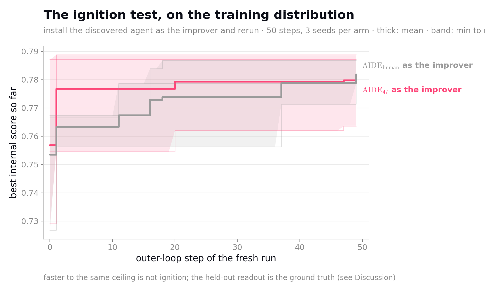
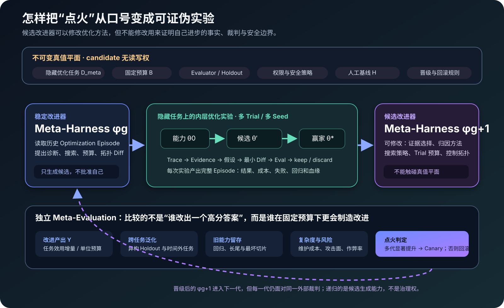

# Recursive Self-Improvement：从自进化闭环到改进器的跨代进化



*图 1 RSI 不是突然出现的一种新 Agent，而是四段能力逐层闭合的结果。前三段已经有大量工程实践；真正仍待验证的是第四段——后代改进器能否比前代更有效地制造下一次改进。本文归纳绘制。*

Recursive Self-Improvement（递归自我改进，RSI）不是虚假概念，但今天最常见的用法把它说得太宽。让模型反思、保存经验、重写 Prompt、自动提交代码，都可能产生真实收益；只要负责诊断、搜索、评测和晋级的机制保持不变，它们仍然只是 **Self-Improvement**，还没有跨过“递归”的门槛。

严格 RSI 的研究对象不是“系统能否产出更好的答案”，而是：

> **被改进后的改进器接替前代之后，能否在相同预算、冻结裁判和未见任务上，更高效、更稳定地制造下一代改进？**

这使 RSI 从“智能爆炸”的叙事，收缩成一个可以被证伪的工程命题。现有证据支持的是：对象层自进化已经实用，改进器优化开始出现正收益；但截至 2026 年 8 月，公开证据尚未证明这种能力能够跨多代持续加速。因而，RSI **值得中高强度研究，但只值得研究它的严格版本**。

> [!note] 本文的证据边界
> AIDE、AlphaEvolve、自我纠错研究和 MetaSkill-Evolve 来自论文或预印本；AIDE² 的结果来自 Weco 官方技术博客，其承诺的完整技术报告与 AIDE₈₅ 代码截至核验日仍未公开。文中的“Level 0–3”采用 Weco 的实验框架，不是学界统一标准。Anthropic 与 OpenAI 的材料用于说明前沿机构如何定义和监测 RSI，不把机构自述当作独立验证。

## 一、先把“自我改进”和“递归”拆开

设系统当前可被改动的任务能力为 $\theta$。它可以是模型权重，也可以是 Prompt、Skill、Memory、代码、工具配置或工作流。改进器为 $\phi$，它负责收集证据、归因失败、生成候选、分配预算和决定提交什么。一次普通自我改进可以写成：

$$
\theta_{k+1}
=
\operatorname{Select}
\left(
\left\{\theta_k,
\operatorname{Mutate}_{\phi}(\theta_k,E_k)
\right\},
\operatorname{Eval}(D_{\text{holdout}})
\right)
$$

其中：

- $E_k$ 是第 $k$ 轮收集到的执行证据；
- $\operatorname{Mutate}_{\phi}$ 表示由固定改进器 $\phi$ 产生候选；
- $D_{\text{holdout}}$ 是没有参与候选生成的留出任务；
- $\operatorname{Select}$ 只在候选通过评测后晋级。

这一闭环可以持续让 $\theta$ 变好，但它并不天然递归：生成改进的方法 $\phi$ 没有变。严格 RSI 还需要第二个变化：

$$
\phi_{g+1}
=
\operatorname{Select}
\left(
\left\{\phi_g,
\operatorname{MetaMutate}(\phi_g,O_g)
\right\},
\operatorname{MetaEval}(D_{\text{meta}},B)
\right)
$$

这里 $g$ 是改进器的代际，$O_g$ 是一组完整的优化过程记录，$D_{\text{meta}}$ 是隐藏且异构的优化任务，$B$ 是每个候选允许消耗的固定预算。真正要比较的不是单个任务分数，而是改进器的“优化产率”：

$$
Y(\phi;D,B)
=
\mathbb{E}_{\tau\sim D}
\left[
U\!\left(\theta^{\phi}_{B}(\tau)\right)-U\!\left(\theta_0(\tau)\right)
\right]
$$

$U$ 是任务效用，$\theta^{\phi}_{B}(\tau)$ 表示改进器 $\phi$ 在预算 $B$ 内为任务 $\tau$ 找到的最终方案。只有当 $Y(\phi_{g+1})$ 在隐藏任务上显著高于 $Y(\phi_g)$，而且这种优势能延续到后续多代，才出现了值得称为“递归点火”的证据。

可以据此把容易混淆的能力分成四层：

| 层级 | 被改动的对象 | 需要回答的问题 | 当前证据 |
|---|---|---|---|
| 单次自我纠错 | 当前答案或轨迹 | 重想一次会不会更好？ | 无外部反馈时常不稳定 |
| 持久化自进化 | Prompt、Skill、Memory、代码 | 经验能否跨任务复用？ | 已有大量正向但不均匀的结果 |
| 自动研究闭环 | 一个明确定义的问题空间 | Agent 能否在可执行评价器下搜索更好的实现？ | AIDE、AlphaEvolve 等已证明实用价值 |
| 严格 RSI | 产生上述改进的改进器 | 后代是否更会制造下一代？ | 出现 Level 1 早期证据，尚无稳健多代点火 |

这里最重要的判别不是“有没有 self-reference”，而是**优化产率是否成为跨代被测量的变量**。

## 二、第一段能力：模型会重答，不等于模型会改进

最小的自我改进是让模型检查自己的第一次回答，再生成修订版。直觉上，模型既然能指出错误，第二次就应该更好；问题是，如果反馈仍由同一个模型凭内部感觉产生，它也可能把正确答案改错。



*图 2 在 GSM8K、CommonSenseQA 和 HotpotQA 上，不提供外部反馈的内生自我纠错并未形成可靠增益；引入 oracle 反馈后才明显改善。来源：Huang 等，原论文 Figure 1，[Large Language Models Cannot Self-Correct Reasoning Yet](https://arxiv.org/abs/2310.01798)。*

这张图揭示了后续所有自进化系统的第一个断点：**生成候选和判断候选不能共享同一份未经校准的信念。** 改进需要外部可观测信号，例如单元测试、环境奖励、编译结果、人类批注或独立裁判。否则，“循环次数增加”只会同时放大纠错和误改。

因此，一次执行中的 `plan → act → reflect → retry` 最多证明系统具备在线适应；它既没有留下可复用资产，也没有证明下一次改进会更容易。RSI 的基础不是反思，而是一个能阻止错误经验进入长期状态的 **Trust Gate**。

## 三、第二段能力：把经验编译成可继承资产

当系统把成功和失败的 Trace 保存为 Memory，把稳定做法提炼成 Skill，把高频错误变成 Eval，把修复固化成代码或工作流，它才从“这一次做对”走向“下一次更容易做对”。知识库中的 [[Agent Self-Evolution：从反馈闭环到可验证的系统进化]] 已经把这一过程归纳为：

$$
\text{Evidence}
\rightarrow
\text{Proposal}
\rightarrow
\text{Evaluation}
\rightarrow
\text{Promotion}
\rightarrow
\text{Versioned Asset}
$$

这类系统的关键增量是**持久性**：改进不再只存在于当前上下文，而是进入有版本、可回滚的 Prompt、Skill、Memory、Eval 或代码。知识库对 RethinkSkill 的研究所强调的也正是这一点——Skill 自进化更像对离散候选的稀疏搜索，而不是一条平滑上升的学习曲线。

但持久化仍然不等于递归。假设一个团队每天都用同一套人工规则整理 Badcase、修改 Skill、跑回归并发布；即便系统持续变强，真正的改进器仍是那套固定规则与人的判断。RSI 要进一步追问：哪些证据值得看、失败应如何分型、一次该生成多少候选、预算应投向哪里——这些**改进策略本身**能否成为下一层可学习资产？

## 四、第三段能力：自动研究把“改进”变成可执行搜索

### 4.1 AIDE：在代码空间里留下搜索轨迹

AIDE 把数据科学问题转成程序搜索。Agent 不只修改一个当前解，而是维护一棵 Solution Tree：先起草实现，再根据执行反馈修复或改进节点，保留多条分支，避免一次错误方向吞掉全部预算。



*图 3 AIDE 将代码候选组织成树，节点保存方案与运行指标，搜索策略在 draft、improve、debug 之间选择下一步。来源：Jiang 等，原论文 Figure 1，[AIDE: AI-Driven Exploration in the Space of Code](https://arxiv.org/abs/2502.13138)。*

这个设计解决了两个工程问题：运行结果提供比语言自评更硬的反馈；搜索树保留“哪次修改从哪个版本分叉”的因果轨迹。然而，决定何时探索、何时修复、怎样选父节点的策略仍由 AIDE 的固定逻辑定义。它是在用 $phi$ 优化代码 $	heta$，不是在优化 $phi$。

### 4.2 AlphaEvolve：让可执行评价器成为搜索的中心

AlphaEvolve 把这个范式扩展到算法发现：Prompt Sampler 从程序数据库选择上下文，多个 LLM 产生修改，Evaluator Pool 执行候选并返回指标，Program Database 保存有价值的变体。候选不仅要“看起来合理”，还必须在机器可执行的目标上胜出。



*图 4 AlphaEvolve 的核心不是让模型自由聊天，而是以程序数据库和自动评价器组成可积累的演化闭环。来源：Novikov 等，原论文 Figure 2，[AlphaEvolve: A coding agent for scientific and algorithmic discovery](https://arxiv.org/abs/2506.13131)。*

AlphaEvolve 已经能优化支撑模型训练的代码与基础设施，因此它确实属于“AI 改进 AI”的现实案例。但这仍不足以证明 RSI：任务、评价器、采样机制、数据库语义和晋级规则由人预先给定。AI 找到了更好的被搜索程序，却没有证明负责搜索程序的系统变得更会搜索。

这也是当前 AutoResearch 最清晰的边界：

> **自动评价器让改进闭环可以扩展；固定评价器和固定搜索协议也同时定义了它不能自证的部分。**

只要结果能被快速、客观、低成本地执行验证，Agent 就可以并行试验并积累搜索轨迹。目标涉及研究品味、长期价值、未知风险或无法量化的系统权衡时，人仍然在定义问题而不是只提供算力。Anthropic 对其内部 AI 研发加速的总结也承认：AI 已善于执行定义明确的实验，但选择重要问题和判断研究方向仍是主要缺口；它明确写道，完整 RSI 尚未到来，也不是必然事件。[When AI builds itself](https://www.anthropic.com/institute/recursive-self-improvement)

## 五、第四段能力：把改进器本身放进实验

### 5.1 MetaSkill-Evolve：快环改 Skill，慢环改“怎样改 Skill”

MetaSkill-Evolve 是“对象层”和“元层”分开的直接例子。快环在单个任务上生成和更新 Task Skill；慢环观察一批快环的历史，由 Analyzer、Retriever、Allocator、Proposer 和 Evolver 分别完成归因、经验检索、预算分配、候选生成和元资产更新。



*图 5 任务 Skill 在快时间尺度适应，Meta-Skill 从跨任务经验中更新改进策略。来源：Wang 等，原论文 Figure 1，[MetaSkill-Evolve](https://arxiv.org/abs/2607.05297)。*

在冻结基础模型的条件下，论文报告相对原始模型的测试集提升分别为 23.54、16.09 和 1.92 个百分点；与只有快环的版本相比，慢环又贡献 6.38、8.05 和 1.92 个百分点。这说明“怎样学习 Skill”本身可以成为有价值的持久资产。

但它还没有证明无边界的递归：实验只有三个策划过的 Benchmark；五个元角色及其连线是固定的；元更新周期 $H$ 也是人为设定；开放世界和高噪声生产环境中的迁移尚未验证。它证明了元改进可能产生增量，没有证明改进能力会持续跨代加速。

### 5.2 AIDE²：最接近“点火测试”的公开案例

Weco 的 AIDE² 直接把 AIDE 当成可修改对象。内环 AIDE 解决任务，外环 AIDE 修改内环的代码；候选版本再接受公开分、私有分、固定成本和异构任务评测。



*图 6 AIDE² 的外环不再优化某一个模型方案，而是改写负责方案搜索的 AIDE；候选只有通过外部评测才能替换当前版本。来源：Weco 官方报告，[AIDE²: The First Evidence of Recursive Self-Improvement](https://www.weco.ai/blog/first-evidence-of-recursive-self-improvement)。*

官方披露的 100 次外环迭代在 8 天内产生 7 个晋级版本；改进迁移到没有参与优化的任务；KernelBench 上的 reward hacking 率从 63% 降至 34%。这是重要进展，因为收益不只来自为某个 Benchmark 写死技巧，而是改进器代码发生了可测量的变化。

不过 Weco 自己只把结果判为 Level 1——净正研发收益。它进一步让改进后的 AIDE47 接替原版 AIDE，比较二者制造下一代的能力：AIDE47 更快达到同一上限，却没有得到统计显著的更高最终水平。



*图 7 改进后的 AIDE47 在外环中更快到达相近平台，但没有显示出显著更高的渐近改进能力，因此尚未通过 Level 2 点火。来源：Weco 官方报告，同图 6 链接。*

把 Weco 的分级翻译成实验语言，大致是：

| 级别 | 最低证据 | 它还不能证明什么 |
|---|---|---|
| Level 0：Delegation | 系统能执行部分改进工作 | AI 贡献是否超过监督与算力成本 |
| Level 1：Net Positive | 改进收益超过本轮研发成本 | 后代改进器是否优于前代 |
| Level 2：Ignition | 后代的优化产率显著提高 | 增长是否可跨多代维持 |
| Level 3：Inflection | 多代改进曲线持续加速 | 能否安全迁移到开放世界 |

AIDE² 最有价值的结果不是宣告“RSI 已实现”，而是把失败位置暴露出来：更好的 Agent 可以在同一个搜索框架里更快，但**搜索框架的改进能力没有因此自动复利**。外环还出现复杂度与死代码累积，说明自修改会制造维护债务；如果评价器只看任务分数，这些债务会被短期收益掩盖。

## 六、RSI 的新增量到底在哪里

如果已有 Self-Evolution、AutoResearch、Learning Harness 和 Meta-Harness，RSI 是否只是换名？一半是，一半不是。

换名的部分，是它依赖的基础模块几乎都已经存在：证据采集、失败归因、候选搜索、Holdout、版本控制、沙箱、回滚和人工晋级。这些能力在 [[AI Coding研发中的Harness与Loop构建]]、[[Agent Self-Evolution：从反馈闭环到可验证的系统进化]] 与 [[企业生产级 AutoResearch：从 Vibe Modeling 到可控的模型自主迭代]] 中已经构成完整闭环。

真正新增的，是把原来默认固定的 Learning Harness 变成一个**受控实验变量**，并引入三项过去常被忽略的测量：

1. **优化产率，而非一次任务得分。** 比较单位时间、Token、GPU 或人类监督下制造了多少可泛化净增益。
2. **代际接管，而非同一优化器多跑几轮。** 候选改进器必须真正接替前代，再接受同协议测试。
3. **增长率的增长，而非累计进步。** $\theta$ 连续变强只说明优化在工作；只有 $Y(\phi)$ 跨代上升，才说明制造进步的能力也在变强。

换句话说，RSI 的学术增量是一种新的被解释变量，工程增量是一套新的实验治理结构。它研究的不是“系统还能改什么”，而是“**谁来改改进器，以及谁有资格相信这次改进**”。

## 七、一个可落地的 Meta-Harness 点火实验

要研究 RSI，不需要先允许系统重训自己的基础模型。更安全也更可证伪的起点，是让它改进数字化、可回滚的 Harness：证据选择策略、失败分类、检索策略、候选生成、Trial 预算、Agent 拓扑和上下文编译规则。



*图 8 一个最小可用 RSI 实验应把可修改的改进器与不可修改的 Truth Plane 分离。候选在沙箱中完成相同 Optimization Episodes，再由隐藏任务、固定预算与复杂度惩罚决定是否晋级。本文基于 AIDE²、MetaSkill-Evolve 与既有 Learning Harness 设计归纳。*

图中的核心单位不是一次调用，而是 **Optimization Episode**：给定基线资产、任务分布和预算，完整记录改进器看过什么证据、提出哪些候选、执行多少 Trial、消耗多少资源、最终提交什么，以及在隐藏集上得到什么结果。只有保存完整 Episode，元层才有可靠的训练材料。

下面的代码给出一个最小且可审计的晋级门禁。它故意不让候选改写协议本身：

```python
from dataclasses import dataclass
from statistics import mean
from typing import Sequence


@dataclass(frozen=True)
class Episode:
    task_id: str
    utility_gain: float
    cost: float
    regressions: int
    complexity_delta: int


@dataclass(frozen=True)
class Protocol:
    budget: float
    min_tasks: int
    max_regressions: int
    complexity_penalty: float


def optimization_yield(
    episodes: Sequence[Episode], protocol: Protocol
) -> float:
    if len(episodes) < protocol.min_tasks:
        raise ValueError("insufficient hidden tasks")
    if sum(item.cost for item in episodes) > protocol.budget:
        raise ValueError("budget exceeded")
    if sum(item.regressions for item in episodes) > protocol.max_regressions:
        return float("-inf")

    return mean(
        item.utility_gain
        - protocol.complexity_penalty * item.complexity_delta
        for item in episodes
    )


def should_promote(
    incumbent: Sequence[Episode],
    candidate: Sequence[Episode],
    protocol: Protocol,
    minimum_margin: float,
) -> bool:
    return (
        optimization_yield(candidate, protocol)
        >= optimization_yield(incumbent, protocol) + minimum_margin
    )
```

真实系统还需要置信区间、成对任务比较、多重检验修正和人工复核，但这段代码固定了最重要的协议边界：候选不能靠超预算、跳过难题、增加回归或堆积复杂度换取表面分数。

### 哪些可以递归，哪些必须先冻结

| 实验内可修改 | 同一代实验中必须冻结 |
|---|---|
| 证据筛选与压缩策略 | 隐藏任务及其采样规则 |
| 失败归因与路由策略 | 独立 Grader 与安全检查 |
| 候选生成、搜索宽度与预算分配 | 总预算、超时和最大权限 |
| Agent 角色、协作拓扑、上下文编译 | 晋级统计协议与最小收益阈值 |
| 可回滚的 Prompt、Skill、Memory、工具代码 | 审计日志、回滚权和最终发布权 |

这个边界不是永久不变。评价器也可能有缺陷，协议也应该迭代；但它们不能和参赛改进器在**同一场比赛里共同变化**，否则无法区分能力提升与裁判漂移。需要修改 Truth Plane 时，应开启新的实验世代，重新校准所有基线，而不是让候选偷偷改规则。

## 八、为什么现在值得研究，但不该押注“智能爆炸”

RSI 是 1965 年 I. J. Good 所描述“机器帮助设计更好机器”的旧命题的工程化延伸；Gödel Machine 又给出在可证明效用框架下自改写的形式化设想。过去缺的不是想象力，而是低成本、可复现的实验基础设施。今天出现了四个变化：

- **改进对象数字化。** Prompt、Skill、代码、工作流和 Agent 拓扑都能被模型直接编辑。
- **结果更易执行验证。** 编译器、测试、Benchmark、模拟器和生产 Trace 提供外部反馈。
- **状态可版本化。** Git、沙箱、Checkpoint 和可重放 Trace 让失败能回滚、代际能比较。
- **搜索成本下降。** Agent 可以并行提出和执行大量 Trial，完整记录“怎样得到改进”。

这些条件足以让“改进器优化”成为严肃研究，却不足以推出智能爆炸。至少有五个瓶颈可能让曲线很快进入平台：评价器覆盖有限、隐藏任务被间接污染、实验成本随难度上升、改进器复杂度累积、真正重要的问题缺少机器可判定目标。

OpenAI 的 Preparedness Framework v2 因而把临界 RSI 定义得非常高：要么出现超人研究 Agent，要么能以 2024 年同等进展约五分之一的墙钟时间，持续数月完成代际模型提升。[Preparedness Framework v2](https://cdn.openai.com/pdf/18a02b5d-6b67-4cec-ab64-68cdfbddebcd/preparedness-framework-v2.pdf) 这是一条安全监测阈值，不是学界共识，但它提醒我们：一次漂亮 Demo 与持续代际加速之间相隔很远。

## 九、值得投入的研究路线

对已有 Agent Harness、Eval 和 AutoResearch 积累的团队，最合理的顺序不是直接构造一个能改写一切的系统，而是逐步提高可证伪性。

### 阶段 0：把优化过程变成数据

先统一 Optimization Episode：记录基线、证据、候选、Trial、成本、人工介入、隐藏集结果和回归。没有这层数据，所谓元学习只能从成功案例讲故事。

### 阶段 1：建立公平的人类与固定算法基线

至少比较三组：原始改进器、增加算力但不改策略的原始改进器、人工专家。否则候选“更强”可能只是因为多用了 Token、时间或监督。

### 阶段 2：开放对象层资产

先允许系统修改 Prompt、Skill、Memory 和局部工具代码，验证 Eval、Holdout、回滚和复杂度惩罚是否可靠。这里的目标是建立可信 Self-Evolution，不急于宣称 RSI。

### 阶段 3：开放有限的 Meta-Harness

再开放证据路由、失败分类、候选搜索和预算分配。每个候选必须在跨领域隐藏任务上从相同初始状态开始，比较优化产率，而不是只比较最终单点最高分。

### 阶段 4：做真正的代际接管

让胜出的 $\phi_{g+1}$ 独立接替 $\phi_g$，生成 $\phi_{g+2}$。至少连续多代报告收益、置信区间、成本、人工介入、回归、复杂度和任务迁移，才能讨论点火或加速。

研究应设置明确停止条件：连续两代没有显著提高优化产率；收益只存在于参与设计的任务；复杂度或故障率增长快于能力；候选开始系统性利用评价器缺口；人工审查成本抵消自动化收益。触发任一条件，都应回到协议和数据层修复，而不是扩大权限赌下一轮。

## 十、结论：RSI 是一个严格实验问题，不是一句能力口号

RSI 的基础并不神秘：Self-Correction 提供在线修订，持久化资产让经验跨任务积累，AutoResearch 用外部评价器把改进变成可执行搜索，Meta-Harness 再把搜索方法本身放进版本化实验。

我们之前关于 Agent Self-Evolution、Harness、Eval 和双环学习的积累，已经覆盖了前三层以及第四层的大部分基础设施。因此 RSI 带来的新增量确实比营销叙事所说的窄，却也比“只是换名”更实在：**它要求用跨代接管实验，测量制造改进的能力是否也在提高。**

当前证据最诚实的读法是：

- Self-Improvement 已经有大量实际价值；
- 改进器本身可以被优化，并出现了净正收益；
- 稳健、可迁移、可持续的递归点火尚未得到公开证明；
- 最值得投入的方向是 Meta-Harness、隐藏异构任务、Optimization Episode、成本归一化和不可自改写的 Truth Plane。

所以，RSI 值得深入研究，但研究目标不应是证明一个宏大叙事，而应是尽快找到它的真实增长规律与停止条件。能被否证、能回滚、能解释的 RSI，才可能从一个旧想象变成新的工程事实。

## 参考资料

1. I. J. Good, [Speculations Concerning the First Ultraintelligent Machine](https://www.sciencedirect.com/science/article/pii/S0065245808604180), 1965.
2. Jürgen Schmidhuber, [Gödel Machines: Self-Referential Universal Problem Solvers Making Provably Optimal Self-Improvements](https://arxiv.org/abs/cs/0309048), 2003.
3. Jie Huang et al., [Large Language Models Cannot Self-Correct Reasoning Yet](https://arxiv.org/abs/2310.01798), ICLR 2024.
4. Zhengyao Jiang et al., [AIDE: AI-Driven Exploration in the Space of Code](https://arxiv.org/abs/2502.13138), 2025.
5. Alexander Novikov et al., [AlphaEvolve: A coding agent for scientific and algorithmic discovery](https://arxiv.org/abs/2506.13131), 2025.
6. Weco AI, [AIDE²: The First Evidence of Recursive Self-Improvement](https://www.weco.ai/blog/first-evidence-of-recursive-self-improvement), 2026.
7. Zefeng Wang et al., [MetaSkill-Evolve: Recursive Self-Improvement of LLM Agents via Two-Timescale Meta-Skill Evolution](https://arxiv.org/abs/2607.05297), 2026.
8. [PAST-Bench: Benchmarking LLM Agents for Persistent Across-Task Self-Improvement](https://arxiv.org/abs/2608.04003), 2026.
9. Anthropic Institute, [When AI builds itself](https://www.anthropic.com/institute/recursive-self-improvement), 2026.
10. OpenAI, [Preparedness Framework v2](https://cdn.openai.com/pdf/18a02b5d-6b67-4cec-ab64-68cdfbddebcd/preparedness-framework-v2.pdf), 2026.
