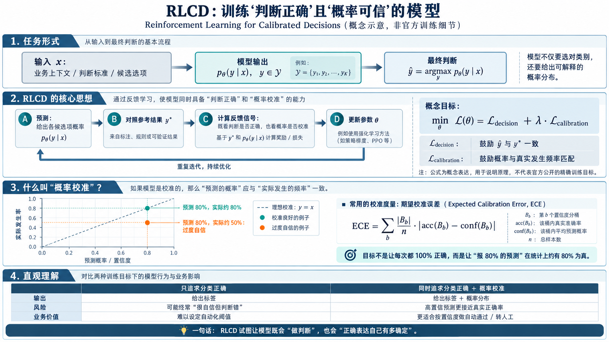
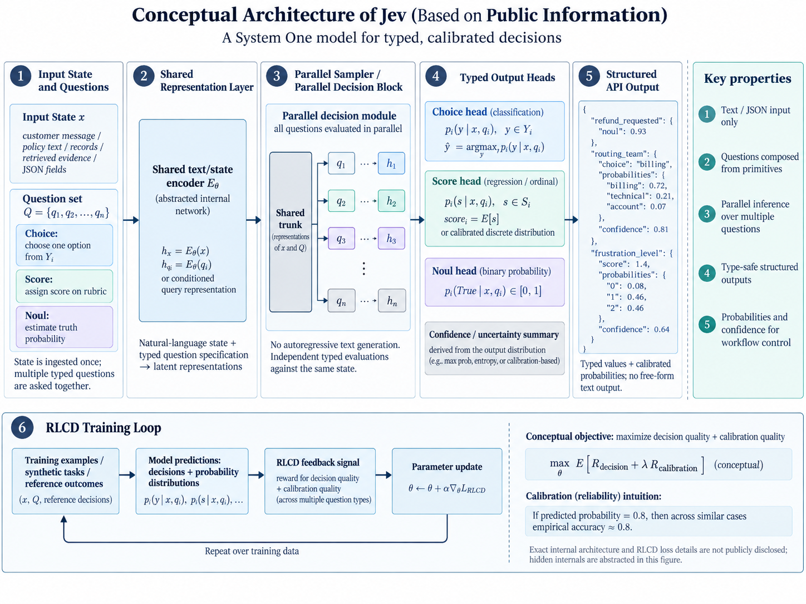

# Jev：快速结构化判断模型调研

**Jev 是 TypeSafe AI 推出的、面向软件自动化的专用判断模型。** 官方将其归为 System 1 Model（S1 来自快思考慢思考中的直觉模型），强调快速、范围明确的判断，而不是开放式对话和长篇推理。它接收业务上下文与判断问题，返回程序可以直接使用的结构化结果。([TypeSafe AI](https://typesafe.ai/blog/introducing-system-one-models-and-jev))

从工程视角，可以把它理解为一个 **“能理解自然语言的判断函数”** ：** 业务上下文 + 判断标准 + 预定义答案空间 → 决策结果及概率。**

| 维度 | 说明 |
| --- | --- |
| 输入是什么 | 输入业务状态、参考材料、判断标准与候选选项。当前仅支持文本，也可以接收包含文本的 JSON 对象或数组，不直接接收图片、音频、视频。(TypeSafe AI) |
| 输出是什么 | 提供三种基本能力：Choice 从候选项中选择；Score 按标准评分；Noul 估计某个陈述成立的概率。其中 Choice 和 Score 还返回概率分布及置信度。(TypeSafe AI) |
| 如何工作 | 按官方披露，它并行计算同一上下文中的多个独立判断，而不是逐 token 生成答案；训练采用 RLCD（面向校准决策的强化学习），目标是让概率估计更符合实际正确程度。(TypeSafe AI) |
| 如何适配业务 | 通过 API 或 SDK 调用，将企业材料、规则和边界条件写入请求。当前不提供基于客户数据的独立微调，领域适配主要发生在输入与工作流层。(TypeSafe AI) |
| 在系统中承担什么角色 | 作为工作流中的局部判断组件，支持分类、筛选、排序、工具路由和流程分支。复杂任务拆成小判断，再由代码组合结果，而不是让模型包办整个流程。(TypeSafe AI) |

例如，在数字员工项目中，可以这样设计：**程序提供当前页面的文本化状态和允许的操作，Jev 判断下一步应选择哪个动作，执行器检查权限后操作，并核验结果。** 这是判断组件与执行系统的分工，而不是一个模型独立完成全部工作。

Jev 的核心定位是：**在自然语言理解与确定性程序之间，提供一个可组合的语义判断组件。**

## Jev的原理

**RLCD 的核心是将模型的判断及预测概率与参考结果对照，通过强化学习反馈更新参数，让模型不仅尽量“判断正确”，还让“预测有 80% 概率”的一组事件在统计上约有 80% 实际发生。**

训练数据来源尚未公开，不能据此判断是否使用了大模型蒸馏。

**网络结构图**

**参数量与运行时：** 官方尚未公开完整参数与部署要求，本文不估算本地部署成本。

## Jev的价值

Jev 需要证明的，不是它能完成别人做不了的任务，而是**在满足相同业务质量要求时，以更低的延迟、成本和维护负担完成判断。**

### 相比 embedding：从“语义相似”到“条件成立”

**“内容相关”不等于“满足条件”。** 缺乏定向优化时，仅凭 embedding 相似度，难以可靠区分否定、例外和条件约束；例如，“支持退款”与“不支持退款”可能高度相似，却对应相反的业务动作。相关研究也揭示了向量检索在否定理解上的局限。

Jev 面向的是根据上下文和明确标准直接判断，而不只是寻找相似内容。但这不是独占能力，是否优于经过优化的 BERT 分类器或 reranker，仍需实测。(TypeSafe AI)

### 相比约束输出的大模型：优势在执行机制，而非 JSON 格式

大模型采用 JSON Schema 约束后，通常仍逐 token 生成；Jev 则并行返回多个判断及其概率。**潜在优势是减少生成开销，而不只是把答案写短。** ([OpenAI](https://openai.com/index/introducing-structured-outputs-in-the-api/))

官方将其局部判断能力对标 **GPT-5.6 Terra 的默认推理设置** ，但这不代表通用能力等价；面对已经优化为极短输出的大模型，效率收益也需要重新衡量。([TypeSafe AI](https://typesafe.ai/blog/introducing-system-one-models-and-jev))

### 速度的价值：缩短“观察—判断—行动”的周期

官方公布的端到端响应时间约为 **70–500 毫秒** ，实际表现仍受输入规模、网络和负载影响，不能视为固定延迟承诺。([TypeSafe AI](https://typesafe.ai/blog/introducing-system-one-models-and-jev))

速度的意义取决于场景：动态环境中，它可以减少决策滞后；computer use 中，它可以减少连续操作的累积等待。**但判断加速，不等于整个任务同比加速。**

具身智能也是潜在方向，不过当前 Jev 仅支持文本，更适合探索感知之后的语义决策，而非直接替代视觉感知或底层实时控制。(TypeSafe AI)

### 思考，快与慢：不是每个判断都需要长链推理

System One 借鉴了人类“直觉判断”与“审慎思考”的区分。对于数字员工，可以让快速判断模型处理边界明确的高频选择，让推理模型处理规划与例外，让程序负责规则、权限和执行。(TypeSafe AI)

**价值不在于用“快思考”取代“慢思考”，而在于不为每一个简单判断支付复杂推理的代价。**

## Jev的影响，判断：部分场景质变

**质变不是“同一件事做得更快”，而是跨过门槛，让原本不可用的工作方式变得可用。**

| 场景 | 质变在哪里 | 具象例子 |
| --- | --- | --- |
| 动态环境决策 | 从“答案回来时已经过时”，到“能跟上环境变化” | 游戏角色根据血量、敌情和玩家指令，持续选择攻击、保护或撤退。 |
| 交互式 Copilot | 从“提交需求、等待结果”，到“连续操作、即时反馈” | AI 设计平台中，用户连续说“只改当前按钮”“换成次级样式”“再紧凑一点”，系统即时选择并执行编辑命令。 |
| 大规模动态判断 | 从“只能精查少量候选”，到“批量执行随任务变化的语义条件” | 检索时不只判断相关性，还逐项检查是否支持结论、是否满足例外条件、是否存在冲突。知识库检索、AgenticRAG等 |
| 补充：持续校验 | 从“事后抽查”，到“每次操作都能负担得起检查” | 数字员工每次抽取字段、引用证据或完成操作后，立即核验，疑点再升级人工或强模型。 |

**已有对应实践：** Jev 官方有 Doom 动态决策演示，以及从大量链接中选择路径的 Wikiracing 演示；也提供了“小模型抽取 → Jev 复核 → 必要时升级”的代码示例。(TypeSafe AI)

**这些说明方向可行，但不能直接外推为智驾或高频交易的成熟方案；关键仍是端到端延迟、可靠性和部署条件。**

这些场景的实际价值仍需按准确率、端到端延迟、成本和维护负担进行对照测试。
