# pi-mono 源码深度解析：pi-agent 的极简Agent Core

> [!abstract] 核心判断
> `pi-agent` 的优秀，不在于它用一个“大而全的 Agent 类”包办所有事情，而在于它把真正的 Agent Core 拆成四层：`pi-ai` 统一模型协议，`agentLoop()` 实现最小执行闭环，`Agent` 把事件折叠成状态，`AgentHarness` 再补上 Session、资源、Hook、压缩与分支。每一层都能单独解释，也能单独替换。
>
> Skill、Tool、Hook、持久化、Subagent、Sandbox 在这套设计中有清楚的位置：Skill 是按需披露的程序性上下文；Tool 是类型化副作用；Hook 是生命周期插槽；Session 是追加式事件树；Subagent 是 Core 之上的组合模式；Sandbox 则明确属于进程和操作系统边界。Pi 的“简洁”不是功能少，而是**没有把不同层次的问题揉成同一个抽象**。

> [!note] 时间线说明
> 本文按 2026-02-02 归档；源码证据于 2026-07-20 固定并复核，2026-07-28 补充 Tool Call 运行证据与 ACP 生态边界。后文出现的后续能力，不代表它们在归档日已经以完全相同的形态存在。

> [!tip] 三条阅读路线
> - **只想理解 Agent Core：** 先看仓库地图、Tool Call、`agentLoop()`、`Agent` 与 `AgentHarness`。
> - **准备实现长期Agent：** 再读 Tool / Hook、Skill、Session、Compaction 与 Branch。
> - **准备嵌入生产系统：** 最后读 Subagent、Sandbox、RPC / ACP、进程模型与限制。
>
> 读者只需熟悉基本的 TypeScript 与 `async/await`；不需要了解 Pi 的 TUI。

## 0. 先说结论：为什么它配得上 Agent Core 典范

如果把界面、CLI、模型供应商和具体工具全部拿掉，一个 Agent 最少还剩什么？

```text
输入消息
  → 调用模型并流式接收 assistant message
  → 如果模型请求工具：校验、执行、回填 tool result
  → 再次调用模型
  → 没有工具、没有插话、没有后续消息时结束
```

Pi 没有用工作流DSL 隐藏这条路径。它把核心写成两个可以从上到下读完的 `while`；Provider、会话、资源、工具副作用和系统隔离则分别停在自己的接口边界上。后文会把这些边界逐个对应到固定修订的源码。

| 维度 | 判断 | 最关键的源码证据 |
|---|---|---|
| 核心抽象 | 小而完整 | `AgentContext` 只有 system prompt、messages、tools |
| 控制流| 显式双层循环 | 内层处理 tool/steering，外层处理 follow-up |
| 并发 | 并行执行、确定回填 | completion event 按完成顺序，tool result 按调用源顺序 |
| 状态| 事件先归约，再等待订阅者 | `processEvents()` 中逐个 `await listener` |
| 应用运行时 | Harness 只管理一次会话的生命周期| turn snapshot、pending writes、save point、settled |
| Skill | 渐进披露 | system prompt 只放 name/description/location，调用时才放正文 |
| 持久化 | 追加式事件树，不是扁平聊天数组 | parentId、leaf、compaction、branch summary |
| 扩展 | Hook 与 Extension 分层| 强类型 Hook；Extension 是宿主 JS/TS 代码|
| Subagent | 不污染 Core | 作为示例 Tool 启动独立 Pi 进程 |
| 安全 | 不制造伪安全感| 官方明确要求外部 Sandbox |

我的最终判断是：

1. **`agentLoop()` 是这套系统最值得学习的内核。** 它足够小，却认真处理了工具截断、并发顺序、事件时机、取消与队列。
2. **`Agent` 的价值不在“面向对象包装”，而在 awaited event barrier。** 状态、持久化和下一步执行因此不会松散竞态。
3. **`AgentHarness` 是完整的 Agent Core 应用边界。** 它把 Session、资源、Hook、Compaction 接到 loop，却没有让它们侵入 loop。
4. **coding-agent 很强，但不是 Agent Core 本身。** read/bash/edit/write、RPC、Extension、CLI/TUI 都是 Core 之上的一个具体应用。
5. **Subagent 与 Sandbox 不在 Core 内，是优点，不是缺陷。** 前者是调度组合，后者是系统安全边界；硬塞进loop 只会让抽象变形。

---

## 1. 版本锚点、范围与审读方法

### 1.1 固定源码修订

本文逐行分析固定在以下源码快照：

- canonical repository：[`earendil-works/pi`](https://github.com/earendil-works/pi)
- 默认分支：`main`
- full commit：[`13437ca828894f43f973c630d208b488637d8fa9`](https://github.com/earendil-works/pi/commit/13437ca828894f43f973c630d208b488637d8fa9)
- commit date：2026-07-20 14:03:33 +02:00
- subject：`fix(ai): normalize Kimi K2.7 to the canonical coding model`
- 最近标签：`v0.80.10`，标签提交 `8dc78834cde4e3292841cf505f9e3f99763df5529`
- License：MIT
- 本文快照中的 package version：`0.80.10`

HEAD 比 `v0.80.10` 标签多 40 个提交。因此本文讨论的是上述 SHA 的源码，而不是笼统的“npm 0.80.10”。所有核心代码链接都绑定完整 SHA，不使用会漂移的 `main`。

### 1.2 本文说的 Agent Core 到底包括什么

主线范围：

```text
packages/ai
  Model / Provider / Context / Message / Stream

packages/agent
  agentLoop / Agent / AgentHarness
  Tool contract / Hook contract
  Skill loader / Session tree / Compaction
```

为了讲清边界，本文还会阅读：

```text
packages/coding-agent
  built-in tools / Extension / RPC / 旧 AgentSession

packages/coding-agent/examples/extensions/subagent
  Subagent 组合示例

SECURITY.md
  官方信任与隔离边界
```

不展开TUI 的组件树、布局、输入法和渲染，因为它们不改变 Agent Core 的语义。RPC 只用来说明 headless 接口，Subagent 示例只用来说明组合方式。

### 1.3 证据如何呈现

核心实现一律链接到完整 commit SHA；运行结论会同时写明环境与命令；维护者文档和上游 issue 会说明它们是设计声明还是历史报告。工程判断则紧跟在支撑它的源码或运行事实之后，并明确不确定性。这样读者看到的是可复核的叙事，而不是研究阶段的内部标签。

---

## 2. 真实架构：先看仓库地图，再看四层运行时

### 2.1 Monorepo 里到底有什么

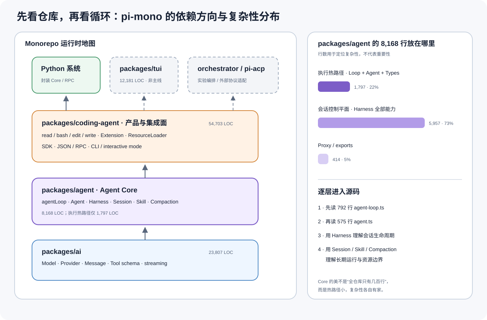

*图 1：pi-mono 的依赖方向与 `packages/agent` 复杂性分布。它说明 `agentLoop()` 是最值得逐行阅读的热路径，但完整 Agent Core 还包括更大的会话控制平面。基于固定修订 `13437ca` 的 package manifests 与 Git 跟踪 TypeScript 文件统计重绘。*

仓库的主依赖方向是：

```text
Provider APIs
  → packages/ai
  → packages/agent
  → packages/coding-agent
  → CLI / JSON / RPC / TUI / 外部适配器
```

- `packages/ai` 统一模型、消息、Tool schema 与流式协议；
- `packages/agent` 提供可独立使用的 Agent Core；
- `packages/coding-agent` 在 Core 上组装默认工具、Extension、资源发现、SDK、RPC 与 CLI；
- `packages/tui` 是产品界面，不定义 Agent 语义；
- `packages/orchestrator` 依赖 coding-agent，固定修订中仍标记为 experimental；
- `pi-acp` 是仓库外的协议适配器；
- 我们从 Python 系统封装时，稳定依赖的是 Core 合约或 headless / RPC 表面，而不是 TUI。

固定修订下，按 Git 跟踪的 `src/**/*.ts` 与 `test/**/*.ts` 统计：

| Package | 源码文件 / 行| 测试文件 / 行| 角色 |
|---|---:|---:|---|
| `packages/ai` | 164 / 23,807 | 109 / 26,328 | Provider 与模型协议 |
| `packages/agent` | 24 / 8,168 | 19 / 5,630 | Agent Core |
| `packages/coding-agent` | 175 / 54,703 | 184 / 41,079 | Coding 产品与集成面 |
| `packages/tui` | 28 / 12,181 | 33 / 13,637 | 终端 UI |
| `packages/orchestrator` | 13 / 1,982 | 0 / 0 | 实验性编排 |

行数只用于定位复杂性集中在哪里，不等于架构重要性。继续把 `packages/agent` 拆开，才能看到所谓“极简”到底简在哪里：

| `packages/agent` 区域| 行数 | 占比 | 主要职责 |
|---|---:|---:|---|
| `agent-loop.ts` | 792 | 9.7% | 模型—工具执行闭环 |
| `agent.ts` | 575 | 7.0% | 状态归约、队列、取消、事件订阅 |
| `types.ts` | 430 | 5.3% | Core 合约 |
| Harness 主类与类型 | 1,861 | 22.8% | 会话级生命周期和Hook |
| Session | 1,065 | 13.0% | Tree、JSONL、Repo、Memory storage |
| Compaction | 1,143 | 14.0% | 压缩与 branch summary |
| Skill / Prompt / Message 资源 | 840 | 10.3% | 资源发现、注入与消息转换 |
| Execution Env | 569 | 7.0% | 文件系统与子进程抽象 |
| Harness utilities | 479 | 5.9% | 截断与 shell 输出 |
| Proxy / exports | 414 | 5.1% | 代理协议和公开入口 |

换成控制平面的语言：Loop + Agent + Types 共 1,797 行，约占 22%；Harness 相关能力共 5,957 行，约占 73%；Proxy / exports 占 5%。因此不能把 Pi 的优美误传成“整个 Agent Core 只有几百行”。更准确的判断是：

> 它把 792 行执行内核保持得足够小，又把长期会话真正需要的复杂性放进了可单独理解的 Harness、Session、Compaction 和资源边界。

### 2.2 四层概念架构

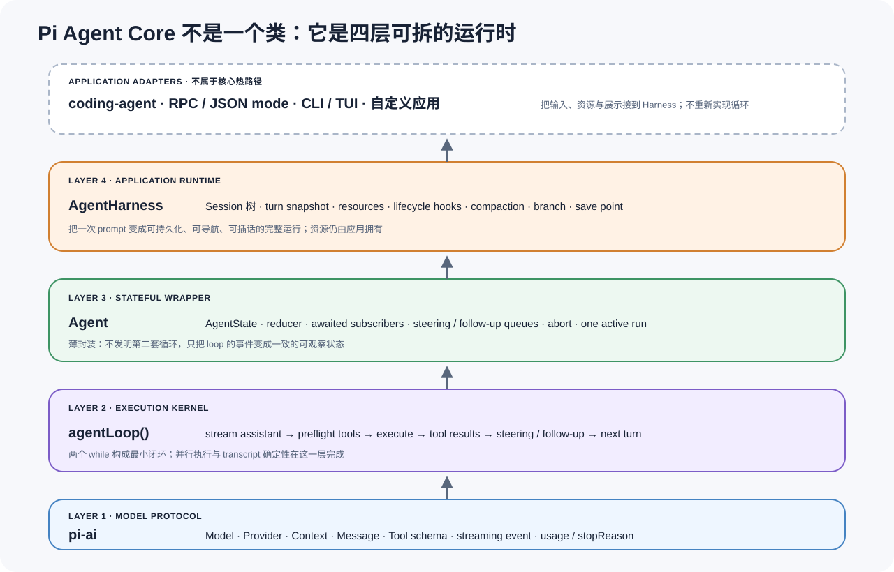

*图 2：`pi-ai → agentLoop() → Agent → AgentHarness` 的四层运行时。它支持“每一层可独立解释和替换”的核心判断；固定源码对应 `packages/ai` 与 `packages/agent/src/{agent-loop,agent,harness/agent-harness}.ts`。*

Pi Agent Core 可以用四层理解。

### 2.3 第一层：`pi-ai` 定义模型协议

`packages/ai` 负责：

- Model 描述；
- Provider 注册与认证；
- User/Assistant/ToolResult message；
- Tool schema；
- streaming event；
- usage、stop reason、thinking/reasoning；
- 将不同供应商协议归一化。

Agent loop 不直接知道 OpenAI、Anthropic、Google 或其他 provider 的 HTTP 细节。它只拿到一个 `StreamFn`，输入 `Model + Context + options`，输出 `AssistantMessageEventStream`。

[`StreamFn`](https://github.com/earendil-works/pi/blob/13437ca828894f43f973c630d208b488637d8fa9/packages/agent/src/types.ts#L17-L31) 的契约甚至明确要求：常规请求/模型/运行时错误不应通过 rejected promise 逃逸，而应编码进stream，最终产生`stopReason: "error" | "aborted"` 的 AssistantMessage。

这条契约让 loop 能始终通过同一事件路径收束成功、失败和取消。

### 2.4 第二层：`agentLoop()` 是执行内核

`packages/agent/src/agent-loop.ts` 是最小 Agent：

```text
模型流→ assistant message → tool calls → tool results → 下一次模型流
```

它不拥有长期Session，不扫描 Skill，不知道 CLI，也不关心消息画在什么界面上。它只接受：

- 一组新 prompt messages；
- 一个 `AgentContext`；
- 一个 `AgentLoopConfig`；
- 一个 event callback；
- 一个 `AbortSignal`；
- 一个 stream function。

主实现：[`runLoop()`](https://github.com/earendil-works/pi/blob/13437ca828894f43f973c630d208b488637d8fa9/packages/agent/src/agent-loop.ts#L155-L275)。

### 2.5 第三层：`Agent` 是状态与事件封装

`Agent` 把纯 loop 包装成一个可以长期持有的对象，增加：

- `AgentState`；
- 当前 streaming message；
- pending tool calls；
- steering / follow-up queue；
- abort；
- subscriber；
- 一次只允许一个 active run。

它没有重写循环；真正执行仍然委托给 `runAgentLoop()` / `continueAgentLoop()`。

### 2.6 第四层：`AgentHarness` 是会话级运行时

Harness 把应用真正需要的能力接进来：

- Session tree；
- turn snapshot；
- Skill / prompt template resources；
- 模型集合 `Models`；
- 更完整的 lifecycle hook；
- pending session writes；
- save point / settled；
- compact 与 branch navigation。

它仍然不拥有 Skill 的来源策略，也不拥有一个全局任务调度器。`AgentHarnessOptions.resources` 的注释明确说明，应用负责加载和刷新资源，再调用 `setResources()`。

### 2.7 coding-agent 是应用，不是 Core

`packages/coding-agent` 在四层之上组装：

- 默认 read/bash/edit/write；
- 本地 Session 管理；
- Extension loader/runner；
- RPC、JSON mode、CLI、TUI；
- 本地配置和资源发现。

这解释了为什么 `pi-agent` 核心可以很小，而完整仓库仍有大量代码。核心的简洁来自**层次正确**，不是仓库只有几个文件。

---

## 3. Core 的最小数据模型

在进入类型定义前，先建立整篇最重要的协议直觉：**Tool Call 只是模型生成的结构化调用意图，工具并没有在模型里执行。**

### 3.1 Tool Call：模型返回的是意图，不是工具结果

```text
模型输出 toolCall
  → Agent 宿主校验参数
  → Agent 宿主执行Tool
  → 宿主创建 toolResult 消息
  → 再次请求模型
  → 模型输出最终文字，或继续请求Tool
```

如果模型不需要工具，Pi 归一化后的输出可以简化为：

```jsonc
{
  "role": "assistant",
  "content": [
    { "type": "text", "text": "README 说明这是一个极简Agent Core。" }
  ],
  "stopReason": "stop"
}
```

如果需要工具，assistant message 会携带 `toolCall`：

```jsonc
{
  "role": "assistant",
  "content": [
    { "type": "text", "text": "我先读取 README。" },
    {
      "type": "toolCall",
      "id": "call_01",
      "name": "read",
      "arguments": { "path": "README.md" }
    }
  ],
  "stopReason": "toolUse"
}
```

模型在这里返回的是 `id + name + arguments`。准确类型见[`ToolCall`](https://github.com/earendil-works/pi/blob/13437ca828894f43f973c630d208b488637d8fa9/packages/ai/src/types.ts#L351-L357) 与 [`AssistantMessage`](https://github.com/earendil-works/pi/blob/13437ca828894f43f973c630d208b488637d8fa9/packages/ai/src/types.ts#L390-L403)。

宿主执行`read` 后，另行创建一条消息：

```jsonc
{
  "role": "toolResult",
  "toolCallId": "call_01",
  "toolName": "read",
  "content": [
    { "type": "text", "text": "# Pi\nA minimal coding agent core." }
  ],
  "details": { "path": "README.md" },
  "isError": false
}
```

`toolCallId` 将结果与前一条调用配对。类型见[`ToolResultMessage`](https://github.com/earendil-works/pi/blob/13437ca828894f43f973c630d208b488637d8fa9/packages/ai/src/types.ts#L405-L419)，实际构造见[`createToolResultMessage()`](https://github.com/earendil-works/pi/blob/13437ca828894f43f973c630d208b488637d8fa9/packages/agent/src/agent-loop.ts#L774-L786)。第二次模型调用才能看到：

```text
assistant: toolCall(call_01, read, { path: "README.md" })
toolResult: call_01 → README 内容
```

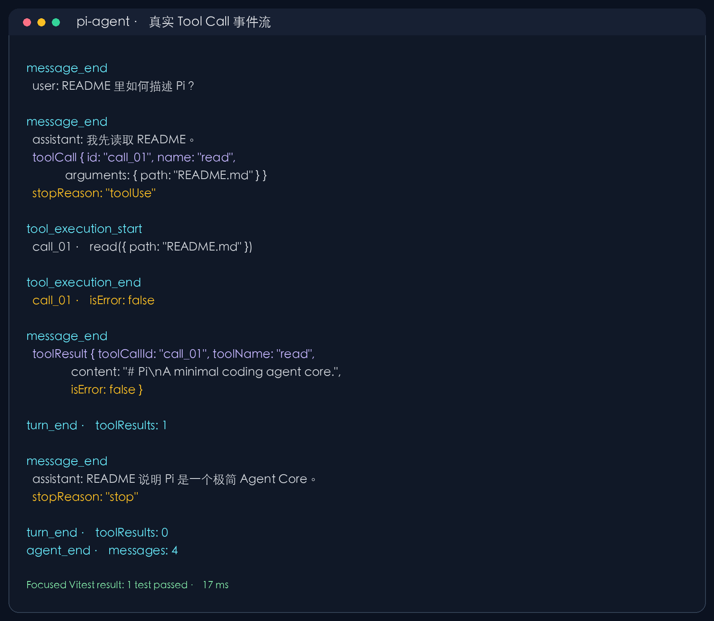

*图 3：固定修订上的真实 Tool Call 往返。使用仓库自带 faux provider 与一个无外部副作用的 fake `read` Tool 运行 focused Vitest，1 个测试通过；截图仅省略时间戳和 usage 并重新排版，没有改变事件顺序。完整测试源、命令和规范化事件见附录 C。*

| 维度 | 没有 Tool Call | 带 Tool Call |
|---|---|---|
| 模型 `content` | text / thinking | 可包含 text / thinking / toolCall |
| 常见停止原因 | `stop` | `toolUse` |
| 外部副作用 | 没有 | 只是准备由宿主执行|
| 工具结果来源 | 不存在 | Agent 宿主，不是 LLM |
| loop 下一步 | 结束或读取 follow-up | 校验、执行、写入 toolResult、再次调模型 |
| 配对标识 | 无 | `toolCall.id ↔ toolResult.toolCallId` |

理解这一点后，`agentLoop()` 的任务就清楚了：它不是让模型“直接操作世界”，而是在**模型意图、宿主副作用和新一轮推理** 之间维持一个类型化、可追踪的闭环。

### 3.2 `AgentContext`：整个内核最窄的腰部

[`AgentContext`](https://github.com/earendil-works/pi/blob/13437ca828894f43f973c630d208b488637d8fa9/packages/agent/src/types.ts#L398-L406) 只有三个字段：

```ts
export interface AgentContext {
  systemPrompt: string;
  messages: AgentMessage[];
  tools?: AgentTool<any>[];
}
```

这个类型非常重要。它说明 Agent Core 的世界只有：

1. 模型应该遵循什么；
2. 模型已经看到了什么；
3. 模型现在能调用什么。

Session 树、Skill 文件夹、配置中心、UI 状态都必须先投影成这三个字段，才能进入一次模型调用。Core 因而不需要理解上层所有业务对象。

### 3.3 `AgentMessage`：允许应用消息，但不强迫模型理解它

`AgentMessage` 是标准 LLM Message 与 `CustomAgentMessages` 的联合。

```ts
export interface CustomAgentMessages {}

export type AgentMessage =
  | Message
  | CustomAgentMessages[keyof CustomAgentMessages];
```

应用可以通过 TypeScript declaration merging 增加 artifact、notification 等消息类型。真正发给模型前，`convertToLlm` 负责转换或过滤它们。

这比“所有消息都必须伪装成 user text”更干净：

- transcript 可以保存应用事件；
- UI 可以渲染自定义消息；
- provider context 仍只包含模型能理解的结构；
- 哪些自定义消息进入模型，由明确的转换函数决定。

### 3.4 `AgentTool`：schema 与执行函数的最小结合

[`AgentTool`](https://github.com/earendil-works/pi/blob/13437ca828894f43f973c630d208b488637d8fa9/packages/agent/src/types.ts#L349-L395) 包含：

```ts
interface AgentTool<TParameters, TDetails> extends Tool<TParameters> {
  label: string;
  prepareArguments?: (args: unknown) => Static<TParameters>;
  execute(
    toolCallId: string,
    params: Static<TParameters>,
    signal?: AbortSignal,
    onUpdate?: AgentToolUpdateCallback<TDetails>,
  ): Promise<AgentToolResult<TDetails>>;
  executionMode?: "sequential" | "parallel";
}
```

Tool 不继承复杂的 runtime context，也没有神秘依赖注入。`toolCallId`、已验证参数、取消信号和progress callback 足以支撑绝大多数工具。

### 3.5 `AgentEvent`：状态、UI、持久化共用一条事实流

事件 union 只有四组：

```text
agent_start / agent_end
turn_start / turn_end
message_start / message_update / message_end
tool_execution_start / update / end
```

对应定义：[`AgentEvent`](https://github.com/earendil-works/pi/blob/13437ca828894f43f973c630d208b488637d8fa9/packages/agent/src/types.ts#L408-L430)。

一个 turn 被精确定义为：**一次 assistant response，加上它请求的所有 tool call/result。** 这一定义贯穿 loop、状态、Session 和Hook，是整套实现能够对齐的原因。

---

## 4. 一次完整运行：从 prompt 到 `agent_end`

代表性端到端路径如下：

```text
prompt messages
  → agent_start
  → message_start / message_end（新 user messages）
  → turn_start
  → transformContext
  → convertToLlm
  → streamFn(model, context)
  → message_start / 多个 message_update / message_end
  → 提取 tool calls
      ├─没有 tool call：turn_end
      └─有 tool call：prepare → validate → hook → execute → hook
                      → tool_execution_* events
                      → toolResult message_start / message_end
                      → turn_end
  → prepareNextTurn
  → drain steering
  → 必要时进入下一inner turn
  → drain follow-up
  → 必要时重新进入 outer loop
  → agent_end
```

这条链中没有一个“框架调度黑箱”。每个转折点都能在 `agent-loop.ts` 中找到对应分支。

### 4.1 输入消息也产生message event

loop 开始时，不是直接把 prompt 塞进数组。新 prompt messages 会依次产生`message_start`、`message_end`，然后进入 context。这样 subscriber 看见的是完整 transcript 变化，而不是只看见模型输出。

### 4.2 Assistant partial 本身就是当前 context 的一部分

streaming 时，当前 assistant partial message 会临时放入 context，并随着provider event 更新。因此：

- UI 能显示增量；
- `AgentState.streamingMessage` 有唯一来源；
- tool call 尚未闭合时，状态仍能准确表示“正在形成中的 assistant message”；
- 取消或错误能得到一个结构化终态，而不是只留下半截 stdout。

### 4.3 `message_end` 与 `turn_end` 不是一回事

Assistant message 完成只表示模型这次输出结束。若它包含 tool calls，工具还要执行、tool results 还要进入 transcript；所有这些结束后才有 `turn_end`。

这一区分是后续持久化、插话与 compaction 正确性的基础。

---

## 5. `agentLoop()`：两个 while 如何构成真正的 Agent

主实现位于 [`packages/agent/src/agent-loop.ts`](https://github.com/earendil-works/pi/blob/13437ca828894f43f973c630d208b488637d8fa9/packages/agent/src/agent-loop.ts#L155-L792)。

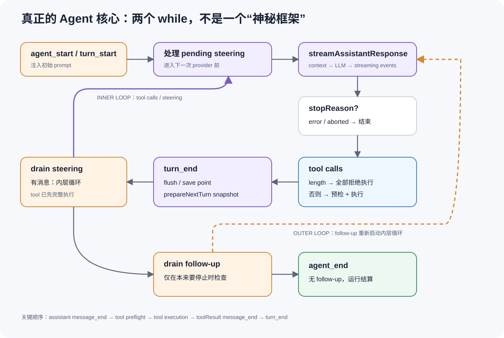

*图 4：`agentLoop()` 的内外双层循环。内层收束Tool 与 steering，外层在本应结束后消费 follow-up；对应固定源码[`runLoop()`](https://github.com/earendil-works/pi/blob/13437ca828894f43f973c630d208b488637d8fa9/packages/agent/src/agent-loop.ts#L155-L275)。*

### 5.1 外层循环处理 follow-up，内层循环处理 tool 与 steering

抽掉事件细节后，控制流接近：

```ts
while (true) {                         // outer: follow-up
  let hasMoreToolCalls = true;
  let steeringAfterTools = null;

  while (hasMoreToolCalls || steeringAfterTools) { // inner
    const assistant = await streamAssistantResponse(...);
    const toolCalls = findToolCalls(assistant);

    hasMoreToolCalls = toolCalls.length > 0;
    if (hasMoreToolCalls) {
      const results = await executeToolCalls(...);
      context.messages.push(...results);
    }

    steeringAfterTools = await getSteeringMessages();
    context.messages.push(...steeringAfterTools);
  }

  const followUps = await getFollowUpMessages();
  if (followUps.length === 0) break;
  context.messages.push(...followUps);
}
```

对应源码：[`runLoop()` 双层循环](https://github.com/earendil-works/pi/blob/13437ca828894f43f973c630d208b488637d8fa9/packages/agent/src/agent-loop.ts#L155-L275)。

两种队列语义不同：

- **Steering**：Agent 还在处理当前工作；当前工具批次完成后，插入一条消息改变下一步方向。
- **Follow-up**：Agent 本来已经要结束；如果队列有后续问题，再开启一轮外层循环。

Pi 没把它们合成一个“用户消息队列”，因为 drain point 不同。这个小区别直接决定插话是否会跳过当前工具、是否会让本已完成的任务重新启动。

### 5.2 `prepareNextTurn` 是动态配置的唯一换挡点

每个 `turn_end` 后、下一次 provider request 前，loop 会调用 `prepareNextTurn`。它可以替换：

- context；
- model；
- thinking level。

对应契约：[`AgentLoopTurnUpdate`](https://github.com/earendil-works/pi/blob/13437ca828894f43f973c630d208b488637d8fa9/packages/agent/src/types.ts#L128-L138) 与 [`prepareNextTurn`](https://github.com/earendil-works/pi/blob/13437ca828894f43f973c630d208b488637d8fa9/packages/agent/src/types.ts#L215-L222)。

这意味着运行时变化只在 turn boundary 生效，不会在一次 provider stream 中途偷偷换模型或工具集。

### 5.3 `shouldStopAfterTurn` 是优雅停止，不是硬取消

`shouldStopAfterTurn` 在当前 assistant 和所有工具都完整结束后运行。如果返回 true，loop 直接发 `agent_end`，不再读取 steering/follow-up。

它适合：

- 上下文接近上限，想在完整 turn 后停止；
- 达到应用定义的迭代上限；
- 已得到结构化终止信号。

它不替代 `AbortSignal`。硬取消需要打断正在进行的 provider 或 tool。

### 5.4 Stream 的失败也是消息，而不是旁路异常

[`streamAssistantResponse()`](https://github.com/earendil-works/pi/blob/13437ca828894f43f973c630d208b488637d8fa9/packages/agent/src/agent-loop.ts#L281-L373) 做的事情依次是：

1. 对 AgentMessage 执行`transformContext`；
2. 用 `convertToLlm` 转成 provider 能理解的 Message；
3. 构造 `Context { systemPrompt, messages, tools }`；
4. 调用 `streamFn`；
5. 把每个 assistant delta 更新为 partial message；
6. 发出 `message_update`；
7. stream 结束后发 `message_end`。

`StreamFn` 契约要求常规 provider 错误落到最终 AssistantMessage 的 `stopReason` 与 `errorMessage` 中，而不是让 loop 丢失事件尾部。这让成功、失败、取消都有统一transcript 形状。

真正无法归一化的异常仍可能逃出，例如`transformContext`/`convertToLlm` 违反契约直接抛错。`Agent` 和`AgentHarness` 会为这种情况补造 failure message 与完整结束事件。

### 5.5 长度截断时，整个工具批次都拒绝执行

如果 assistant 因 `stopReason === "length"` 停止，Pi 不会执行其中“看起来已经完整”的 tool calls，而是为每一个 call 生成 error tool result。

对应源码：[`length` 截断保护](https://github.com/earendil-works/pi/blob/13437ca828894f43f973c630d208b488637d8fa9/packages/agent/src/agent-loop.ts#L376-L407)。

这是非常重要的事务语义：

```text
模型原本想表达的完整工具批次未知
≠
已经解析出来的前几个调用可以安全提交
```

即使第一个 JSON 合法，后面的参数或补偿动作可能被截断。Pi 选择 fail closed，不执行partial intent。

### 5.6 并行不是一句 `Promise.all`

工具执行模式有两个来源：

- 全局`config.toolExecution`，默认 `parallel`；
- 单个工具的 `executionMode` override。

只要批次中任何工具要求`sequential`，整批顺序执行；否则才走并行路径。

对应源码：[`executionMode` 决策](https://github.com/earendil-works/pi/blob/13437ca828894f43f973c630d208b488637d8fa9/packages/agent/src/agent-loop.ts#L413-L428)。

并行路径又分两段：

```text
阶段 A：按 assistant source order 串行预检
  tool lookup
  → prepareArguments
  → schema validation
  → beforeToolCall

阶段 B：允许执行的工具 Promise.all
  → 谁先完成，谁先发 tool_execution_end
  → 所有完成后，ToolResultMessage 仍按 source order 进入 transcript
```

对应源码：[`parallel execution`](https://github.com/earendil-works/pi/blob/13437ca828894f43f973c630d208b488637d8fa9/packages/agent/src/agent-loop.ts#L491-L555)。

这同时满足两种不同的“顺序”：

- **观察顺序** 忠于真实完成时间，便于 UI 与 telemetry；
- **语义顺序** 忠于模型原始 tool call 顺序，避免 transcript 随网络抖动随机变化。

很多实现只做到并行，却没保留第二个不变量。Pi 在这里确实很漂亮。

### 5.7 Sequential 是批次级退化

顺序路径会对每个 tool call 完整执行prepare → execute → finalize，然后才处理下一个。

[`sequential execution`](https://github.com/earendil-works/pi/blob/13437ca828894f43f973c630d208b488637d8fa9/packages/agent/src/agent-loop.ts#L435-L488)

代价是：一个要求sequential 的工具会让同批其他本可并行的调用一起串行。这比资源级锁简单，但粒度较粗。Pi 在 coding-agent 的文件修改层又补了 per-file queue，说明细粒度冲突控制更适合放到 Tool 实现，而不是让通用 loop 理解所有资源。

### 5.8 工具错误被归一化为结果

工具准备和执行的失败会转换成结构化 error result，而不是让整个 Agent run 直接崩掉：

- 找不到工具；
- `prepareArguments` 抛错；
- schema 校验失败；
- before hook block；
- execute 抛错；
- after hook 抛错。

模型因此有机会读到错误并修正参数或换方案。真正取消由 `AbortSignal` 区分，不会被伪装成普通业务失败。

### 5.9 Tool progress 有明确的生命周期

`execute()` 得到 `onUpdate` callback。只要Promise 尚未 settle，update 会产生`tool_execution_update`；Promise settle 后再迟到的 callback 会被忽略。

对应源码：[`executePreparedToolCall()`](https://github.com/earendil-works/pi/blob/13437ca828894f43f973c630d208b488637d8fa9/packages/agent/src/agent-loop.ts#L668-L709)。

这避免了 final result 已经出现，旧后台计时器又发 progress 的时序错误。

### 5.10 `terminate` 是批次一致决定

Tool result 可以带 `terminate: true`。但只有**本批所有 finalized results 都为 true**，loop 才提前停止；只要有一个结果没要求terminate，就把完整批次交还模型。

[`shouldTerminate`](https://github.com/earendil-works/pi/blob/13437ca828894f43f973c630d208b488637d8fa9/packages/agent/src/agent-loop.ts#L576-L586)

这样并行批次中的单个工具不会擅自吞掉其他工具结果。

---

## 6. Tool：类型化副作用如何接入 Core

Tool 是 Agent Core 与外部世界发生副作用的唯一标准通道。它不是 Skill，也不是 Hook。

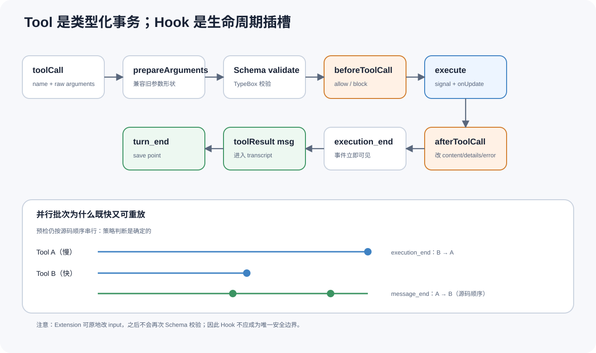

*图 5：Tool 从参数准备、schema 校验、Hook 到执行和结果修补的完整边界。它解释了错误为什么会被归一化为 `toolResult`，以及 Hook 为什么是策略插槽而不是权限隔离。*

### 6.1 一次 Tool Call 的完整流水线

```text
raw toolCall
  → 按 name 查找 AgentTool
  → prepareArguments(raw args)       可选兼容层
  → TypeBox Value.Check(schema)       强校验
  → beforeToolCall                    可 block
  → tool.execute(signal, onUpdate)
  → afterToolCall                     可替换结果字段
  → tool_execution_end
  → ToolResultMessage
  → message_start / message_end
```

源码对应：

- [`prepareToolCall()`](https://github.com/earendil-works/pi/blob/13437ca828894f43f973c630d208b488637d8fa9/packages/agent/src/agent-loop.ts#L588-L666)
- [`executePreparedToolCall()`](https://github.com/earendil-works/pi/blob/13437ca828894f43f973c630d208b488637d8fa9/packages/agent/src/agent-loop.ts#L668-L709)
- [`finalizeToolCall()` / after hook](https://github.com/earendil-works/pi/blob/13437ca828894f43f973c630d208b488637d8fa9/packages/agent/src/agent-loop.ts#L711-L755)
- [`createToolResultMessage()`](https://github.com/earendil-works/pi/blob/13437ca828894f43f973c630d208b488637d8fa9/packages/agent/src/agent-loop.ts#L774-L792)

### 6.2 `prepareArguments` 是兼容层，不是替代 schema

注释把它定义为 raw tool-call arguments 的 compatibility shim。它可以修复旧模型或旧 schema 的参数形状，但输出仍必须通过 TypeBox schema。

合理用途：

- 旧字段名迁移；
- 字符串数字转数值；
- 为兼容版本补默认字段。

不合理用途：

- 在里面执行副作用；
- 静默吞掉未知参数；
- 把完全错误的语义猜成合法请求。

### 6.3 Tool Result 分成 content 与 details

`content` 是回给模型的文本/图片；`details` 是应用侧结构化信息。

这是一条非常实用的分界：

```text
content: 模型下一步决策真正需要的压缩信息
details: UI、日志、artifact id、完整命令元数据、渲染信息
```

如果把所有细节都塞进content，会迅速耗尽 context；如果只有 content，又失去应用展示和审计所需的结构。

### 6.4 `afterToolCall` 是字段替换，不是深合并

Hook 可以替换 `content`、`details`、`isError`、`terminate`；未提供字段保留原值，content/details 不做 deep merge。

[`AfterToolCallResult`](https://github.com/earendil-works/pi/blob/13437ca828894f43f973c630d208b488637d8fa9/packages/agent/src/types.ts#L65-L86)

这个规则看似朴素，却避免“多个 Hook 对嵌套 details 做隐式 merge”产生不可预测结果。

### 6.5 coding-agent 的四个默认工具只是一个应用选择

默认 active tools 是 `read`、`bash`、`edit`、`write`。

[`packages/coding-agent/src/core/sdk.ts`](https://github.com/earendil-works/pi/blob/13437ca828894f43f973c630d208b488637d8fa9/packages/coding-agent/src/core/sdk.ts#L240-L246)

它们不是 agent-core 的硬编码能力。一个网页 Agent、数据 Agent 或机器人 Agent 可以完全不用这四个工具，只保留相同loop 与 Tool contract。

### 6.6 输出截断是上下文管理，不只是界面优化

coding-agent 的通用工具输出上限是 2,000 行、50KB。

[`truncate.ts`](https://github.com/earendil-works/pi/blob/13437ca828894f43f973c630d208b488637d8fa9/packages/coding-agent/src/core/tools/truncate.ts#L1-L120)

`bash` 对长输出保留 tail 并给出完整输出临时文件；`read` 更适合保留 head。这体现了 Tool 的一个核心职责：**不要把无限外部世界直接灌进有限模型窗口。**

### 6.7 同文件写入为什么要有第二层并发控制

上游 [issue #2327](https://github.com/earendil-works/pi/issues/2327) 记录过并行工具修改同一文件导致覆盖的历史问题。

当前 `file-mutation-queue.ts` 按 canonical file path 串行化同一文件的 mutation，不同文件仍可并行。

[`file-mutation-queue.ts`](https://github.com/earendil-works/pi/blob/13437ca828894f43f973c630d208b488637d8fa9/packages/coding-agent/src/core/tools/file-mutation-queue.ts#L28-L60)

这说明通用 loop 只应该知道“这个 Tool 是否允许并行”；真正的冲突键属于 Tool domain。

---

## 7. `Agent`：为什么薄封装仍然不可替代

`Agent` 位于 [`packages/agent/src/agent.ts`](https://github.com/earendil-works/pi/blob/13437ca828894f43f973c630d208b488637d8fa9/packages/agent/src/agent.ts#L165-L574)。

### 7.1 它拥有的状态非常有限

[`AgentState`](https://github.com/earendil-works/pi/blob/13437ca828894f43f973c630d208b488637d8fa9/packages/agent/src/types.ts#L316-L347) 包含：

```text
systemPrompt
model
thinkingLevel
tools
messages
isStreaming
streamingMessage
pendingToolCalls
errorMessage
```

没有 database handle、plugin registry、task graph、browser、workspace 等全局对象。这让 `Agent` 的状态可以被 event reducer 完整解释。

### 7.2 一次只允许一个 active run

`prompt()` 和`continue()` 都先建立 active run；已有运行时再次调用会被拒绝。

[`prompt()` / `continue()`](https://github.com/earendil-works/pi/blob/13437ca828894f43f973c630d208b488637d8fa9/packages/agent/src/agent.ts#L334-L429)

这不是性能限制，而是 transcript 的单写者不变量。不同Agent 实例可以并行；同一个 Agent 不能同时让两条模型流争夺同一messages 数组。

### 7.3 Setter 在运行中为什么不会破坏当前 turn

`setModel`、`setThinkingLevel`、`setTools`、`setSystemPrompt` 修改 Agent 的未来状态。loop 的下一turn 通过 `prepareNextTurn` 重新读取 snapshot，因此变化在 turn boundary 生效。

`Agent` 不需要给每个字段上锁，因为一个 active loop 与一个明确换挡点已经限定了观察时机。

### 7.4 真正关键的是 awaited subscriber barrier

事件处理先改变内部状态，再按订阅顺序逐个等待 listener：

```ts
private async processEvents(event: AgentEvent): Promise<void> {
  reduceRuntimeState(event);

  const signal = this.activeRun?.abortController.signal;
  for (const listener of this.listeners) {
    await listener(event, signal);
  }
}
```

对应源码：[`processEvents()`](https://github.com/earendil-works/pi/blob/13437ca828894f43f973c630d208b488637d8fa9/packages/agent/src/agent.ts#L520-L574)。

这形成一个强顺序：

```text
loop 发 message_end
  → Agent state 已加入完整消息
  → listener A 完成
  → listener B 完成
  → loop 才能进入后续 tool preflight / turn
```

上游 [issue #1717](https://github.com/earendil-works/pi/issues/1717) 记录过异步事件处理破坏 Session 顺序的历史问题。当前 awaited barrier 正是避免“事件看似发了、持久化却还在后面追”的核心机制。

### 7.5 `agent_end` 不是立刻 idle

类型注释明确说明：`agent_end` 是 loop 的最后一个事件，但订阅者仍属于 run settlement；只有所有 `agent_end` listeners 完成，`finishRun()` 才清掉 streaming/pending 状态并让 active run resolve。

这让“模型停止输出”和“整个 Agent 运行已经结算”成为两个可区分的时间点。

### 7.6 Listener 的代价

因为 listener 在热路径上被 await：

- 持久化、策略和顺序敏感处理非常可靠；
- 一个慢 listener 也会直接拉长 Agent latency；
- listener 抛错会中止流程；
- 非关键 telemetry 不应在 listener 内做无界网络等待。

Pi 选择的是可解释顺序，而不是“事件 fire-and-forget 后祈祷副作用来得及”。这是一个值得保留的设计取舍。

---

## 8. `AgentHarness`：把最小循环升级成完整 Agent Core

`AgentHarness` 是本文最重要的第二个对象。`agentLoop()` 说明 Agent 如何运行；Harness 说明一次运行如何进入真实应用。

实现：[`packages/agent/src/harness/agent-harness.ts`](https://github.com/earendil-works/pi/blob/13437ca828894f43f973c630d208b488637d8fa9/packages/agent/src/harness/agent-harness.ts#L164-L953)。

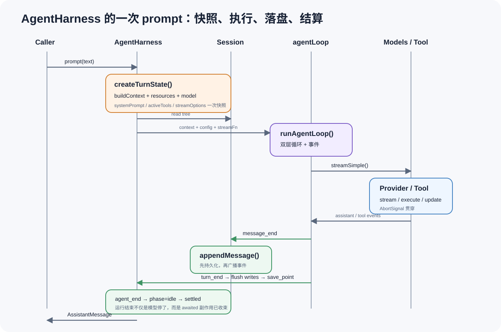

*图 6：`AgentHarness.prompt()` 的一次完整生命周期。turn snapshot、AgentEvent barrier 与 Session writes 在固定源码`harness/agent-harness.ts` 中按此顺序连接。*

### 8.1 Harness 聚合什么

类内部状态包括：

```text
env                   ExecutionEnv
session               Session
models                Models
phase                 idle / turn / compaction / branch_summary / retry
model / thinking
systemPrompt builder
streamOptions
resources             skills / prompt templates
tools / activeTools
steer / followUp / nextTurn queues
pendingSessionWrites
handlers
AbortController / runPromise
```

这是一份“单个会话 Agent runtime”的完整清单，但仍没有全局scheduler、全局数据库或 UI。

### 8.2 Phase 是清楚的有限状态机

`AgentHarnessPhase` 只有：

```ts
"idle" | "turn" | "compaction" | "branch_summary" | "retry"
```

`prompt()`、`skill()`、`promptFromTemplate()` 都要求`phase === "idle"`，否则抛`busy`。`compact()` 和`navigateTree()` 同样只允许 idle。

这个约束避免：

- 一边 stream，一边重建 branch；
- 两次 prompt 共写 Session；
- compact 与新消息同时选择 cut point；
- 运行中直接换 leaf。

### 8.3 `createTurnState()`：所有可变输入先做快照

每个 turn 开始前，Harness 会读取：

- `session.buildContext()`；
- resources；
- session metadata/id；
- 完整 tools 与 active tools；
- system prompt；
- stream options；
- model；
- thinking level。

对应源码：[`createTurnState()`](https://github.com/earendil-works/pi/blob/13437ca828894f43f973c630d208b488637d8fa9/packages/agent/src/harness/agent-harness.ts#L321-L353)。

返回的 `AgentHarnessTurnState` 是一次 provider request 前的稳定视图。运行中资源或模型发生变化，也只会在 `prepareNextTurn` 重建 snapshot 后影响下一turn。

这使“热更新”与“运行一致性”不冲突：配置可以变，但不会在一条 assistant stream 中途变。

### 8.4 `createLoopConfig()`：Harness 如何接入低层loop

Harness 没有复制 loop，而是构造 `AgentLoopConfig`：

```ts
return {
  model: turnState.model,
  reasoning: turnState.thinkingLevel,
  convertToLlm,

  transformContext: messages => emitHook("context", messages),
  beforeToolCall: call => emitHook("tool_call", call),
  afterToolCall: result => emitHook("tool_result", result),

  prepareNextTurn: async () => {
    await flushPendingSessionWrites();
    const next = await createTurnState();
    return { context: createContext(next), model: next.model, ... };
  },

  getSteeringMessages: () => drain(steerQueue),
  getFollowUpMessages: () => drain(followUpQueue),
};
```

对应源码：[`createLoopConfig()`](https://github.com/earendil-works/pi/blob/13437ca828894f43f973c630d208b488637d8fa9/packages/agent/src/harness/agent-harness.ts#L406-L455)。

这是很典型的 adapter：Harness 把自己的 Session/Hook/queue 语义翻译成低层loop 已经定义好的几个插槽。

### 8.5 `createStreamFn()`：Provider 生命周期也被纳入 Harness

Harness 从 `Models` 建立 stream function，在真正请求前后发出：

- `before_provider_request`；
- `before_provider_payload`；
- `after_provider_response`。

并将 cache retention、headers、retry、metadata、timeout、transport、session id 等 snapshot options 传给 `models.streamSimple()`。

对应源码：[`createStreamFn()`](https://github.com/earendil-works/pi/blob/13437ca828894f43f973c630d208b488637d8fa9/packages/agent/src/harness/agent-harness.ts#L366-L391)。

因此 Provider 不是绕过 Harness 的黑盒网络调用；应用可以在统一生命周期中观察和微调请求。

### 8.6 `before_agent_start` 能改变什么

在真正调用 loop 前，Harness 发 `before_agent_start`。Hook 可以：

- 附加 messages；
- 替换本次 run 的 system prompt。

然后 Harness 创建 AbortController，调用 `runAgentLoop(...)`，把所有 event 交给 `handleAgentEvent()`。

[`executeTurn()`](https://github.com/earendil-works/pi/blob/13437ca828894f43f973c630d208b488637d8fa9/packages/agent/src/harness/agent-harness.ts#L538-L613)

### 8.7 事件如何变成持久化顺序

`handleAgentEvent()` 对三个事件有特殊处理：

#### `message_end`

```text
session.appendMessage(message)
→ emitAny(event)
```

先落 Session，再让外部 handler 看见完整 message。这意味着handler 收到 `message_end` 时，Session 已经包含它。

#### `turn_end`

```text
emitAny(turn_end)
→ flush pending session writes
→ emit save_point
```

即便 `turn_end` handler 抛错，Harness 也会先尝试 flush pending writes，然后再重新抛出 event error。

#### `agent_end`

```text
flush pending writes
→ phase = idle
→ emit agent_end
→ emit settled
```

对应源码：[`handleAgentEvent()`](https://github.com/earendil-works/pi/blob/13437ca828894f43f973c630d208b488637d8fa9/packages/agent/src/harness/agent-harness.ts#L495-L522)。

这就是 Harness 比裸 Agent 更完整的地方：它不仅发事件，还定义事件与 Session durable operation 的相对顺序。

### 8.8 为什么运行中的 setter 会排队写 Session

Harness 运行时调用 `appendMessage()`、`setModel()`、`setThinkingLevel()`、`setActiveTools()` 等，不会立即与当前消息交错写入，而是进入 `pendingSessionWrites`；turn boundary 再按队列顺序 flush。

[`flushPendingSessionWrites()`](https://github.com/earendil-works/pi/blob/13437ca828894f43f973c630d208b488637d8fa9/packages/agent/src/harness/agent-harness.ts#L469-L493)

这个机制同时解决：

- 当前 turn 使用旧 snapshot；
- 新配置被记录到事件树；
- 下一turn 从 Session fold 出新配置；
- transcript 顺序不会因异步 setter 随机变化。

### 8.9 三种排队消息不是重复 API

Harness 有 `steer()`、`followUp()`、`nextTurn()`：

- `steer`：当前 run 的工具批次后进入 inner loop；
- `followUp`：当前 run 本来结束时重新进入 outer loop；
- `nextTurn`：下一次显式 `prompt/skill/template` 开始时，排在它前面。

`steer/followUp` 在 idle 时拒绝，`nextTurn` 可以提前排队。

[`steer()` / `followUp()` / `nextTurn()`](https://github.com/earendil-works/pi/blob/13437ca828894f43f973c630d208b488637d8fa9/packages/agent/src/harness/agent-harness.ts#L664-L679)

### 8.10 失败路径也补齐生命周期

如果 loop 抛出非正常异常，Harness 构造 failure assistant message，并依次处理：

```text
message_start
message_end
turn_end
agent_end
```

对应源码：[`emitRunFailure()`](https://github.com/earendil-works/pi/blob/13437ca828894f43f973c630d208b488637d8fa9/packages/agent/src/harness/agent-harness.ts#L524-L535)。

所以订阅者不需要为“正常 provider error”和“意外运行时 throw”维护两套完全不同的收尾状态机。

### 8.11 Harness 是公开API，但文档仍不如测试完整

固定修订中，Harness 已从 `packages/agent/src/index.ts` 公开导出。它也有大量 harness tests，但对外 README 的叙述还没有覆盖所有 Session、Hook 与 phase 语义。

因此使用 Harness 时，测试文件是重要的 executable specification：

- `packages/agent/test/harness/agent-harness.test.ts`
- `packages/agent/test/harness/agent-harness-stream.test.ts`
- `packages/agent/test/harness/session.test.ts`
- `packages/agent/test/harness/compaction.test.ts`

---

## 9. Model / Provider：让 Agent Loop 与供应商无关

核心接口位于 [`packages/ai/src/models.ts`](https://github.com/earendil-works/pi/blob/13437ca828894f43f973c630d208b488637d8fa9/packages/ai/src/models.ts#L66-L187)。

### 9.1 `Provider` 负责能力集合

Provider 描述：

- provider id/name；
- models；
- stream implementation；
- API key / OAuth 解析；
- 可选动态model source。

Agent 不需要一串 `if provider === ...`。`ModelsImpl` 根据 `model.provider` 找 Provider、解析认证，再按 model API 选择 stream 实现。

[`ModelsImpl` auth/dispatch](https://github.com/earendil-works/pi/blob/13437ca828894f43f973c630d208b488637d8fa9/packages/ai/src/models.ts#L455-L526)

### 9.2 `Models` 是运行时集合

`Models` 对外提供：

```text
getModel(provider, id)
getModels()
getProviders()
getApiKey(model)
stream / streamSimple
login / logout / auth status
refresh provider models
```

Harness 只依赖该集合，不直接依赖每个 provider package。

### 9.3 动态认证为什么按每次 LLM call 解析

`AgentLoopConfig.getApiKey` 的注释明确支持短期OAuth token；工具阶段可能很长，token 在下一次模型调用前已经过期。

所以认证不是 Agent 构造时解析一次永久缓存，而是每个 provider request 可以重新获取。这是长任务 Agent 很实际的细节。

### 9.4 Provider 统一不等于所有模型完全同构

统一接口仍保留 model metadata、api、thinking level、context window、capabilities 等差异。Pi 没有为了表面统一把供应商能力压成最小公分母，而是让 `Model<Api>` 保留具体 API 类型。

代价是 provider/catalog 代码量很大，并且生成模型目录会快速变化。本轮 `npm run build` 联网后，有 17 个模型目录文件相对固定 SHA 产生 `+250/-106` 行漂移。它们是移动远端输入参与生成的副作用，没有被用于本文源码结论，也没有提交回上游；这恰好说明：固定 Git SHA 并不自动意味着生成目录可复现。

---

## 10. Hook：Core 的生命周期插槽

Hook 的作用是：不 fork 主循环，也能在关键边界观察、拒绝或变换行为。

### 10.1 低层Agent Loop Hook

`AgentLoopConfig` 提供：

| Hook | 时机 | 能力|
|---|---|---|
| `transformContext` | 每次 provider 前 | 裁剪、注入或重排 AgentMessage |
| `convertToLlm` | provider 前 | 转换/过滤自定义消息 |
| `beforeToolCall` | schema 校验后、执行前 | block tool |
| `afterToolCall` | execute 后、结束事件前 | 替换 result 字段 |
| `shouldStopAfterTurn` | turn 完整结束后 | 优雅终止 |
| `prepareNextTurn` | 下一次 provider 前 | 更新 context/model/thinking |
| queue getters | 对应 drain point | 注入 steering/follow-up |

这些Hook 都围绕 loop 的真实状态转折，而不是随意的“middleware before/after everything”。

### 10.2 Harness Hook 更接近应用生命周期

Harness event/result map 覆盖：

```text
before_agent_start
context
before_provider_request
before_provider_payload
after_provider_response
tool_call / tool_result
compaction / branch_summary
model / thinking / tools / resources change
queue_update / save_point / settled
```

完整定义：[`harness/types.ts`](https://github.com/earendil-works/pi/blob/13437ca828894f43f973c630d208b488637d8fa9/packages/agent/src/harness/types.ts#L525-L726)。

### 10.3 Handler 顺序与返回值合并

Harness 用 `Set` 保存同一event type 的 handlers，并按注册顺序 `await`。对于有返回值的 Hook，最后一个非 `undefined` 结果胜出；错误被归一化后抛出。

[`emitHook()`](https://github.com/earendil-works/pi/blob/13437ca828894f43f973c630d208b488637d8fa9/packages/agent/src/harness/agent-harness.ts#L219-L255)

这是一种简单、确定的组合规则。代价是多个 Hook 不能自动 deep merge patch；如果两个策略都要改同一对象，必须显式安排注册顺序或合成一个 Hook。

### 10.4 没有 batch-level Tool Hook

当前 preflight 是 per tool call 的。Hook 看不到“整批工具调用作为一个原子事务”的授权点。上游 [issue #6816](https://github.com/earendil-works/pi/issues/6816) 请求batch hook，最终关闭为 not planned。

如果业务要求一批动作 all-or-nothing，应该把它建模成一个事务型 Tool，而不是期待 per-call Hook 自动提供批次事务。

---

## 11. Extension：它比 Hook 更强，也更危险

coding-agent Extension 是 Core 之上的应用扩展系统。

### 11.1 它加载的是宿主代码

Extension loader 使用 `jiti` 动态加载 TypeScript/JavaScript 模块。

[`extensions/loader.ts`](https://github.com/earendil-works/pi/blob/13437ca828894f43f973c630d208b488637d8fa9/packages/coding-agent/src/core/extensions/loader.ts#L403-L427)

Extension 可以注册：

- Tool；
- command；
- shortcut；
- flag；
- provider；
- message renderer；
- 生命周期handler；
- UI interaction。

[`ExtensionAPI` 注册实现](https://github.com/earendil-works/pi/blob/13437ca828894f43f973c630d208b488637d8fa9/packages/coding-agent/src/core/extensions/loader.ts#L225-L337)

### 11.2 Hook 与 Extension 的边界

| 机制 | 运行位置 | 能力| 信任级别 |
|---|---|---|---|
| Core Hook | Agent/Harness 定义的插槽 | 观察、block、有限 patch | 仍是应用代码|
| Extension | coding-agent 宿主进程 | 注册新能力、读写任意宿主资源 | 等同宿主程序 |

Extension 不是受限插件沙箱。它可以直接访问 `process.env`、文件和网络。

### 11.3 Tool input 原地修改的细节

coding-agent 的 `tool_call` event 明确允许 handler 原地修改 input。

[`extensions/types.ts`](https://github.com/earendil-works/pi/blob/13437ca828894f43f973c630d208b488637d8fa9/packages/coding-agent/src/core/extensions/types.ts#L1057-L1061)

`AgentSession` 把已经通过 Core schema 校验的参数交给 Extension，之后执行修改后的对象；当前路径没有再跑一次 schema validation。

[`AgentSession` tool_call bridge](https://github.com/earendil-works/pi/blob/13437ca828894f43f973c630d208b488637d8fa9/packages/coding-agent/src/core/agent-session.ts#L449-L496)

在 Extension 被视为宿主可信代码的前提下，这是一种强扩展能力；但它再次说明 Extension/Hook 不是安全边界。

### 11.4 Extension handler 的错误语义与 Core 不完全相同

Extension runner 中，一些通用 handler 错误会被报告并吞掉，tool result patch 会按 handler 链依次应用，tool_call 则在遇到第一个 block 时返回。

[`extensions/runner.ts`](https://github.com/earendil-works/pi/blob/13437ca828894f43f973c630d208b488637d8fa9/packages/coding-agent/src/core/extensions/runner.ts#L860-L931)

因此不能把“Core Hook 抛错中止”与“所有 Extension event 都抛错中止”混为一谈。两层的 failure policy 不同。

### 11.5 旧 Extension runtime 会被失效

loader 会让被替换 Session 捕获的旧 runtime context 失效，防止 reload 后的 Extension 继续操作已经不属于它的 Session。

[`invalidate stale runtime`](https://github.com/earendil-works/pi/blob/13437ca828894f43f973c630d208b488637d8fa9/packages/coding-agent/src/core/extensions/loader.ts#L174-L205)

这是热重载中很容易漏掉的生命周期控制。

---

## 12. Skill：按需加载的程序性上下文

Skill 经常被错误理解成“另一种 Tool”。Pi 的实现清楚地表明：Skill 本质是**给模型的指令与参考资料包**，不直接执行副作用。

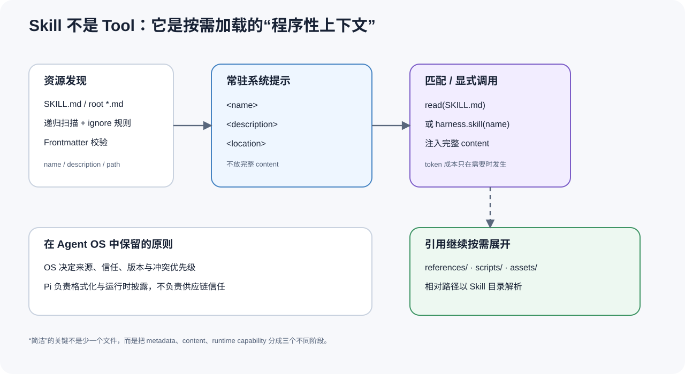

*图 7：Skill 的渐进披露。常驻 system prompt 只携带元数据和路径，正文到显式调用或读取时才进入上下文；后文还会区分正文热读与 metadata reload。*

### 12.1 渐进披露分成三层

```text
发现层
  扫描 SKILL.md / root markdown
  解析 frontmatter、ignore、路径

索引层
  system prompt 只展示 name / description / location

调用层
  匹配或显式 harness.skill(name)
  才注入完整 content，并以 Skill 目录解析 references/scripts/assets
```

这种设计把“模型知道有哪些能力”和“模型立即读完所有能力”分开。

### 12.2 系统提示只放元数据

[`formatSkillsForSystemPrompt()`](https://github.com/earendil-works/pi/blob/13437ca828894f43f973c630d208b488637d8fa9/packages/agent/src/harness/system-prompt.ts#L3-L24) 只输出类似：

```xml
<available_skills>
  <skill>
    <name>...</name>
    <description>...</description>
    <location>...</location>
  </skill>
</available_skills>
```

没有完整 Skill 正文。这使每个 turn 的常驻 token 成本与 Skill 数量近似按 metadata 增长，而不是按全部文档总长度增长。

### 12.3 显式调用才注入正文

`formatSkillInvocation()` 会把完整内容放入消息，并提示相对引用以 Skill 文件所在目录为基准。

[`formatSkillInvocation()`](https://github.com/earendil-works/pi/blob/13437ca828894f43f973c630d208b488637d8fa9/packages/agent/src/harness/skills.ts#L37-L75)

Harness 的 `skill(name, additionalInstructions?)`：

1. 要求idle；
2. 建立 turn snapshot；
3. 从 snapshot resources 找 Skill；
4. 格式化完整调用；
5. 仍然走同一个 `executeTurn()`。

[`AgentHarness.skill()`](https://github.com/earendil-works/pi/blob/13437ca828894f43f973c630d208b488637d8fa9/packages/agent/src/harness/agent-harness.ts#L630-L645)

Skill 没有另一套执行器。它只是产生一条特殊但普通的 prompt，之后完全复用 Agent Core。

### 12.4 资源发现与 ignore

Harness loader 支持递归发现 `SKILL.md` 或 root markdown、读取 frontmatter、应用 ignore 规则并产生diagnostics。

[`harness/skills.ts`](https://github.com/earendil-works/pi/blob/13437ca828894f43f973c630d208b488637d8fa9/packages/agent/src/harness/skills.ts#L103-L230)

关键点不是“会扫描文件夹”，而是 loader 返回结构化结果与 diagnostics；非法 Skill 不必让整个 Agent 启动崩溃。

### 12.5 coding-agent 的来源优先级

coding-agent 在底层loader 上增加来源：user、project、explicit path。固定修订中的加载顺序是 user → project → explicit paths；同名 Skill 第一个获胜，后续冲突产生diagnostic。

[`coding-agent/core/skills.ts`](https://github.com/earendil-works/pi/blob/13437ca828894f43f973c630d208b488637d8fa9/packages/coding-agent/src/core/skills.ts#L387-L486)

这是 coding-agent 的应用策略，不是 Agent Core 的永久语义。Harness 只拿最终 `resources.skills`，资源从哪里来仍由应用决定。

### 12.6 Skill、Tool、Hook 的准确区分

| 概念 | 对模型可见| 是否执行副作用 | 生命周期|
|---|---|---|---|
| Skill | metadata 常驻，正文按需| 不直接执行| 被选择时转成 prompt |
| Tool | name/description/schema 可见| 是 | model toolCall 驱动 |
| Hook | 通常不可见| 可观察、block、patch | runtime event 驱动 |

把 Skill 做成 Tool 会让“读说明”变成副作用 API；把 Tool 做成 Skill 会失去 schema 与结果协议；把 Hook 暴露给模型又会让生命周期控制变成模型可选行为。Pi 的三分法非常稳定。

### 12.7 Skill 为什么能“改完就生效”

这里必须区分两件事：**正文热读** 与 **metadata 重载**。

| Skill 信息 | 例子 | 读取时机 |
|---|---|---|
| 发现结果与 metadata | name、description、filePath、是否允许模型调用 | startup / `resourceLoader.reload()` |
| Skill 正文 | frontmatter 后的完整说明 | 模型 read，或 `/skill:name` 显式展开时 |

coding-agent 的 [`loadSkillFromFile()`](https://github.com/earendil-works/pi/blob/13437ca828894f43f973c630d208b488637d8fa9/packages/coding-agent/src/core/skills.ts#L277-L325) 只把 name、description、filePath、baseDir 等元数据放入 `Skill` 对象，**不缓存正文**。执行`/skill:name` 时，[`_expandSkillCommand()`](https://github.com/earendil-works/pi/blob/13437ca828894f43f973c630d208b488637d8fa9/packages/coding-agent/src/core/agent-session.ts#L1275-L1303) 才再次读取 `skill.filePath`，剥离 frontmatter 后注入本次消息。

因此，一个已经被发现的 Skill，如果只修改正文，下一次读取或显式调用通常就能拿到新内容，不需要重启。但下列变化会改变发现结果或 system prompt 中的 metadata，需要显式 reload：

- 新增、删除或移动 Skill；
- 修改 `name`、`description` 或 `disable-model-invocation`；
- 修改资源启用状态、ignore 规则或 Extension 提供的路径。

coding-agent 的 `/reload` 只允许在非 streaming、非 compacting 状态执行；它经过 [`AgentSession.reload()`](https://github.com/earendil-works/pi/blob/13437ca828894f43f973c630d208b488637d8fa9/packages/coding-agent/src/core/agent-session.ts#L2572-L2594) 和[`DefaultResourceLoader.reload()`](https://github.com/earendil-works/pi/blob/13437ca828894f43f973c630d208b488637d8fa9/packages/coding-agent/src/core/resource-loader.ts#L338-L421)，重新扫描 Skill / Prompt / Extension 等资源并重建 runtime。

`AgentHarness` 自己没有隐藏的全局文件 watcher。它的 [`resources` 契约](https://github.com/earendil-works/pi/blob/13437ca828894f43f973c630d208b488637d8fa9/packages/agent/src/harness/types.ts#L800-L829) 明确由应用拥有加载和刷新，再通过 [`setResources()`](https://github.com/earendil-works/pi/blob/13437ca828894f43f973c630d208b488637d8fa9/packages/agent/src/harness/agent-harness.ts#L940-L954) 更新。新快照在 turn boundary 生效。

这对我们的 Python 封装给出一个直接实现原则：

```text
文件变化
  → 扫描并校验Skill metadata
  → 等待 Core idle / turn boundary
  → reload RPC 或 setResources(newSnapshot)
  → 记录 resource revision
  → 下一turn 使用新资源
```

自动 watcher 只应当发出 reload trigger，而不应在一次 provider stream 中途偷偷替换资源。已经展开进transcript 的 Skill 正文也不会被追溯修改；热加载只影响之后的读取与调用。

---

## 13. Session：追加式事件树如何生成当前上下文

Pi Harness Session 不是 `messages[]` 的别名，而是一棵带 parent relation 的追加式事件树。

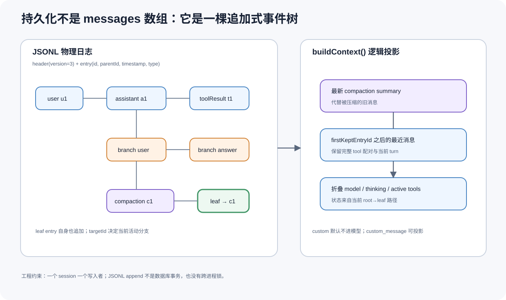

*图 8：Session 的物理事件树、当前 leaf 与模型上下文投影彼此分离。这是任一已持久化节点能够成为新分支起点的原因，但它不等于恢复进程现场。*

### 13.1 Entry union 保存的不只是消息

Session tree entry 包括：

```text
message
model_change
thinking_level_change
tools_change
compaction
branch_summary
custom
custom_message
label
session_info
leaf
```

对应定义：[`harness/types.ts`](https://github.com/earendil-works/pi/blob/13437ca828894f43f973c630d208b488637d8fa9/packages/agent/src/harness/types.ts#L334-L420)。

因此一条 Session 路径能还原：

- 模型看到的对话；
- 当时选择的 model/thinking/tools；
- 哪段历史被 compaction summary 替代；
- 当前 active branch；
- 哪些custom data 只供应用使用；
- 哪些custom message 应进入模型。

### 13.2 每个新 entry 指向当前 leaf

append 时，新 entry 的 `parentId` 是当前 leaf id；写入后它成为新的 current leaf。如果切换 leaf，再 append，就从旧节点长出另一条分支。

这比复制整份 messages 创建分支更节省，也保留共同祖先的唯一身份。

### 13.3 当前配置通过 fold 得出

[`getSessionContext()`](https://github.com/earendil-works/pi/blob/13437ca828894f43f973c630d208b488637d8fa9/packages/agent/src/harness/session/session.ts#L37-L55) 沿 root → leaf 路径折叠 model、thinking level、active tools 等状态。

状态不需要另外维护一张容易漂移的“当前配置表”；事件路径就是事实来源。

### 13.4 `buildContext()` 是逻辑投影

Session 不会把所有 entry 原封不动发给模型。投影规则包括：

- `message` 进入上下文；
- `custom` 默认不进入模型；
- `custom_message` 可以投影为模型消息；
- 最近 compaction summary 替代被压缩的旧历史；
- compaction cut point 之后的近期消息完整保留；
- model/thinking/tools 通过 fold 形成运行配置，不变成聊天文本。

对应源码：

- [`latest compaction transform`](https://github.com/earendil-works/pi/blob/13437ca828894f43f973c630d208b488637d8fa9/packages/agent/src/harness/session/session.ts#L57-L80)
- [`messages projection`](https://github.com/earendil-works/pi/blob/13437ca828894f43f973c630d208b488637d8fa9/packages/agent/src/harness/session/session.ts#L93-L134)
- [`current branch`](https://github.com/earendil-works/pi/blob/13437ca828894f43f973c630d208b488637d8fa9/packages/agent/src/harness/session/session.ts#L166-L176)

Session tree 是物理历史，AgentContext 是逻辑视图。这个区分让压缩、分支和自定义事件都不需要篡改原始历史。

### 13.5 `leaf` 本身也是 append-only entry

JSONL storage 的 `setLeafId()` 不会回写旧 header，而是追加一个 leaf entry，记录目标 id。

[`setLeafId()`](https://github.com/earendil-works/pi/blob/13437ca828894f43f973c630d208b488637d8fa9/packages/agent/src/harness/session/jsonl-storage.ts#L247-L265)

这样“用户何时切到哪条分支”本身也保留在日志里。

### 13.6 JSONL version 3 的文件结构

首行是 header：

```json
{
  "type": "session",
  "version": 3,
  "id": "...",
  "timestamp": "...",
  "cwd": "...",
  "parentSession": "...",
  "metadata": {}
}
```

后续每行一个 entry。loader 严格校验header version、id、timestamp、cwd、metadata 和每一行entry。

[`jsonl-storage.ts` parse/load](https://github.com/earendil-works/pi/blob/13437ca828894f43f973c630d208b488637d8fa9/packages/agent/src/harness/session/jsonl-storage.ts#L8-L177)

### 13.7 先 append 磁盘，再更新内存

核心顺序：

```ts
await fs.appendFile(path, JSON.stringify(entry) + "\n");
entries.set(entry.id, entry);
currentLeafId = entry.id;
```

[`JsonlSessionStorage.append()`](https://github.com/earendil-works/pi/blob/13437ca828894f43f973c630d208b488637d8fa9/packages/agent/src/harness/session/jsonl-storage.ts#L271-L280)

如果磁盘写失败，内存不会产生一个不存在于文件中的新 parent。这个顺序是正确的。

### 13.8 但 JSONL 不是数据库事务

固定实现没有显示：

- fsync；
- 跨进程锁；
- 原子整 turn transaction；
- write-ahead recovery；
- malformed tail 自动修复。

因此正确使用模型是：一个 Session 一个写者。上游 [issue #6242](https://github.com/earendil-works/pi/issues/6242) 的维护者讨论也指出，多个外部 caller 并发写需要在 Session 层串行化。

### 13.9 严格加载的代价

新 Harness JSONL loader 遇到 malformed line 会拒绝整个 Session。这有利于暴露损坏，却降低了 crash-torn tail 的容忍度。

coding-agent 旧 `SessionManager` 则会跳过无法解析的行：

[`SessionManager` parse/skip](https://github.com/earendil-works/pi/blob/13437ca828894f43f973c630d208b488637d8fa9/packages/coding-agent/src/core/session-manager.ts#L499-L552)

仓库中两套 persistence path 的恢复策略不同，是当前值得关注的架构漂移风险。

### 13.10 `JsonlSessionRepo` 管目录与 fork

Repo 层负责：

- 按 cwd 映射 session directory；
- create/open/list/delete；
- fork 到新 Session；
- 加载 metadata。

[`jsonl-repo.ts`](https://github.com/earendil-works/pi/blob/13437ca828894f43f973c630d208b488637d8fa9/packages/agent/src/harness/session/jsonl-repo.ts#L34-L179)

Session 负责一棵树的语义，Repo 负责多份 Session 文件的集合。这也是清楚的职责分离。

### 13.11 “任意状态继续”究竟能恢复什么

更准确的说法是：

> 任一已持久化 Session 节点都可以成为新分支的上下文起点；Pi 不恢复中断瞬间的进程、网络流或 Tool 执行现场。

原因有四层：

1. 每个状态变化都是带 `parentId` 的 entry；
2. 当前 leaf 也以 append-only entry 记录；
3. [`getPathToRoot()`](https://github.com/earendil-works/pi/blob/13437ca828894f43f973c630d208b488637d8fa9/packages/agent/src/harness/session/jsonl-storage.ts#L296-L309) 找到 root → leaf 路径，再由 [`buildSessionContext()`](https://github.com/earendil-works/pi/blob/13437ca828894f43f973c630d208b488637d8fa9/packages/agent/src/harness/session/session.ts#L125-L135) 重建消息与配置视图；
4. Harness 只在 idle 时执行[`navigateTree()`](https://github.com/earendil-works/pi/blob/13437ca828894f43f973c630d208b488637d8fa9/packages/agent/src/harness/agent-harness.ts#L739-L815)，下一次 prompt 仍复用同一个 loop。

| 状态| 是否持久化 / 可重建 | 说明 |
|---|---|---|
| 完成的 user / assistant / toolResult | 是 | Session message entry |
| model / thinking / active tools | 是 | 从路径 fold |
| compaction / branch summary | 是 | 作为 entry 保存并投影 |
| 当前 leaf | 是 | leaf entry |
| custom 状态| 有条件 | 需要projector 才进入模型上下文 |
| Skill 正文 | 否 | 来自当前文件系统资源 |
| system prompt | 通常否 | 下一turn 由当前 Harness / loader 重建 |
| 半条 streaming assistant message | 否 | `message_end` 后才成为稳定消息 |
| 正在执行的 Tool Promise | 否 | JS Promise 不能跨进程恢复 |
| HTTP stream / shell 子进程 | 否 | 重启后需要重新建立 |
| JS 调用栈 / event-loop queue / 模型 KV cache | 否 | 不属于会话逻辑状态|

所以它是一种**可分支的事件历史与上下文重建**，不是虚拟机式 checkpoint/restore。这个边界说清楚以后，Pi 的持久化能力反而更可信：它只承诺自己真正保存的逻辑状态。

---

## 14. Compaction：保留历史，只改变模型视图

Compaction 不是 `messages = messages.slice(-N)`。Pi 把它建模为一种新的 Session entry，并让 `buildContext()` 用 summary 投影替换旧历史。

### 14.1 默认策略

固定修订默认：

```ts
{
  enabled: true,
  reserveTokens: 16384,
  keepRecentTokens: 20000,
}
```

[`DEFAULT_COMPACTION_SETTINGS`](https://github.com/earendil-works/pi/blob/13437ca828894f43f973c630d208b488637d8fa9/packages/agent/src/harness/compaction/compaction.ts#L108-L123)

大意是当预计 context usage 超过 `model window - reserveTokens` 时，需要压缩，同时尽量完整保留最近约 20k tokens。

### 14.2 Token 估计是启发式

普通文本近似`chars / 4`，图片单独估算；usage 信息可来自最近 assistant message。

- [`calculate/estimate context tokens`](https://github.com/earendil-works/pi/blob/13437ca828894f43f973c630d208b488637d8fa9/packages/agent/src/harness/compaction/compaction.ts#L125-L210)
- [`text/image estimation`](https://github.com/earendil-works/pi/blob/13437ca828894f43f973c630d208b488637d8fa9/packages/agent/src/harness/compaction/compaction.ts#L213-L271)

估计便宜，但不是 provider tokenizer 的精确结果。reserve tokens 正是为误差和新输出留余量。

### 14.3 Cut point 尊重消息结构

切点选择会寻找合适的 turn start，并避免从 tool result 中间切开对应关系。这是 provider message protocol 的必要约束：tool result 通常必须对应前面的 assistant tool call id。

### 14.4 摘要保留工作状态

Compaction utils 会从工具调用中提取 read/modified files，并把这些信息放入 summary；进入摘要prompt 的长 tool result 会截到 2,000 字符。

[`compaction/utils.ts`](https://github.com/earendil-works/pi/blob/13437ca828894f43f973c630d208b488637d8fa9/packages/agent/src/harness/compaction/utils.ts#L23-L131)

好的 Agent summary 不能只说“讨论了哪些主题”，还必须保留继续工作需要的状态。Pi 对文件操作的显式保留就是这个原则的具体实现。

### 14.5 原始历史没有删除

Compaction entry 指向旧路径并保存 summary；物理 ancestors 仍在 Session tree 中。所以：

- 可以审计摘要；
- 可以换 branch；
- 可以将来用不同策略重新压缩；
- 模型当前看到的上下文与真实历史可以区分。

### 14.6 自动 compact-and-retry 是有界的

coding-agent 旧 `AgentSession` 在 overflow 时可以 compact 后重跑，但只做一次 compact-and-retry，防止无限压缩循环。

[`agent-session.ts` overflow retry](https://github.com/earendil-works/pi/blob/13437ca828894f43f973c630d208b488637d8fa9/packages/coding-agent/src/core/agent-session.ts#L1915-L1984)

### 14.7 摘要仍然是有损模型输出

即使保留 file ops，summary 仍可能遗漏：

- 用户的细小约束；
- 某个 Tool failure 的原因；
- 未结构化的 pending task；
- 多轮推理中的否定结论。

因此 Compaction 的正确语义是“产生新的推理视图”，不是“证明旧内容已无用”。

---

## 15. Branch Navigation：为什么 Session 必须是一棵树

如果只有线性 messages，修改历史消息通常只能：

- 丢弃后续内容；
- 复制整份 Session；
- 或在一个数组中维护复杂的隐藏标记。

Pi 的 parentId 树让 branch 成为自然操作。

### 15.1 导航不是删除

`navigateTree(targetId)` 在 idle phase 执行：

1. 找到目标 entry；
2. 比较当前 branch 与目标 branch；
3. 必要时为离开的分支生成 branch summary；
4. 设置新的 leaf；
5. 让下次 `buildContext()` 从新路径投影。

旧 branch 仍然存在，只是当前 leaf 改了。

### 15.2 Branch Summary 与 Compaction Summary 不同

- **Compaction summary**：替代当前路径中过旧的上下文。
- **Branch summary**：在跳离一条已经产生工作成果的分支时，把必要信息带到新分支。

两者都使用摘要，但触发原因和provenance 不同。

实现入口：

- [`branch-summarization.ts`](https://github.com/earendil-works/pi/blob/13437ca828894f43f973c630d208b488637d8fa9/packages/agent/src/harness/compaction/branch-summarization.ts)
- [`AgentHarness.navigateTree()`](https://github.com/earendil-works/pi/blob/13437ca828894f43f973c630d208b488637d8fa9/packages/agent/src/harness/agent-harness.ts#L743-L807)

### 15.3 为什么 branch 属于 Harness，不属于 loop

`agentLoop()` 只需要一个当前 context。它不应该知道 context 是来自直线历史、某个 Git 分支还是数据库 snapshot。

Harness 在 turn 之前把选中 branch 投影成 `AgentContext`，loop 完全复用。这个边界再次证明 Pi 没有让持久化结构污染执行内核。

---

## 16. Subagent：它是组合模式，不是 Agent Loop 原语

Pi coding-agent README 明确列出不内建 subagents。

[`packages/coding-agent/README.md`](https://github.com/earendil-works/pi/blob/13437ca828894f43f973c630d208b488637d8fa9/packages/coding-agent/README.md#L491-L505)

仓库提供了一个示例 Extension，说明如何把子 Agent 组合成 Tool；这与“Core 原生有 Subagent scheduler”是两件事。

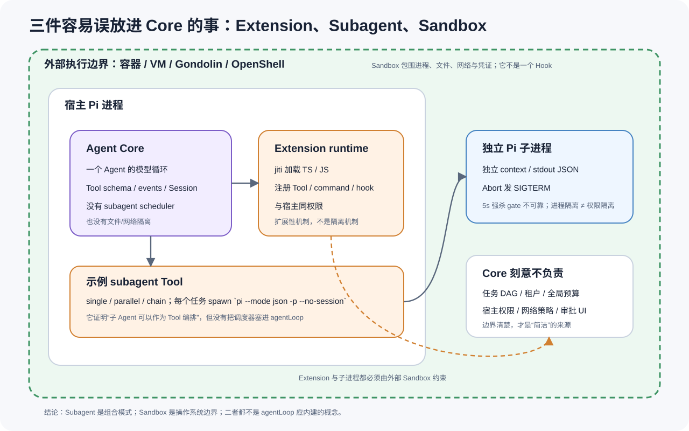

*图 9：Core、宿主 Extension、独立 Subagent 进程与外部 Sandbox 的边界。依据固定源码的 subagent 示例及仓库 README / SECURITY.md 重绘；进程隔离仍不等于权限隔离。*

### 16.1 示例如何工作

示例 Tool 支持三种模式：

- `single`：运行一个子任务；
- `parallel`：多个子任务并行；
- `chain`：上一任务输出成为下一任务输入。

每个任务通过独立进程启动：

```text
pi --mode json -p --no-session
```

并将 prompt 写入子进程，消费 JSON event stream，最后收集结果。

[`subagent/index.ts` 进程启动与收集](https://github.com/earendil-works/pi/blob/13437ca828894f43f973c630d208b488637d8fa9/packages/coding-agent/examples/extensions/subagent/index.ts#L267-L414)

### 16.2 并发是明确受限的

示例最多接受 8 个任务，并发上限 4。这避免模型一次生成几十个 subagents 直接耗尽进程资源。

[`single/parallel/chain execution`](https://github.com/earendil-works/pi/blob/13437ca828894f43f973c630d208b488637d8fa9/packages/coding-agent/examples/extensions/subagent/index.ts#L460-L698)

### 16.3 取消映射到进程生命周期

父 Tool 收到 abort 后会向子进程发 `SIGTERM`，源码也写了 5 秒后升级到 `SIGKILL` 的意图。但这里有一个容易被“看起来正确”骗过的实现缺口：

```ts
proc.kill("SIGTERM");
setTimeout(() => {
  if (!proc.killed) proc.kill("SIGKILL");
}, 5000);
```

Node.js 的 [`subprocess.killed`](https://nodejs.org/api/child_process.html#subprocesskilled) 只表示“已经成功调用 `subprocess.kill()` 发出信号”，不表示子进程已经退出。第一次 `SIGTERM` 成功发出后，`proc.killed` 通常已经是 `true`；即使子进程仍活着，5 秒后的分支也不会再发 `SIGKILL`。

对应实现位于固定源码的 [`subagent/index.ts:393-402`](https://github.com/earendil-works/pi/blob/13437ca828894f43f973c630d208b488637d8fa9/packages/coding-agent/examples/extensions/subagent/index.ts#L393-L402)。

因此准确结论不是“Pi 保证 `SIGTERM → SIGKILL`”，而是：

- abort 已经映射到真实进程信号，而不只是内存布尔值；
- 代码存在升级终止的设计意图；
- 当前 `proc.killed` gate 不能可靠判断进程存活，强制收束并没有被实现保证。

正确的升级条件应由 `close` / `exit` 状态或显式的 `exited` 标志驱动，而不是把 `killed` 当成“进程已死”。这个细节也是深读源码而不能只读注释和函数名的典型例子。

### 16.4 为什么不把 Subagent 放进`agentLoop()`

如果 Core 原生理解 Subagent，它必须同时理解：

- 子任务 DAG；
- 全局并发；
- 子任务预算；
- 父子上下文继承；
- 工具能力继承；
- 失败聚合；
- 取消树；
- 进程/容器生命周期。

这些都不是“一次 assistant response 如何执行工具”的问题。Pi 选择把 `spawn subagent` 表达为一个普通 Tool，因此主 loop 一行都不用改。

### 16.5 示例不是生产调度器

上游 [issue #6298](https://github.com/earendil-works/pi/issues/6298) 讨论过示例在多租户、scope、confirm flag、默认工具继承等方面的尖角，最终关闭为 not planned。

正确解读是：

- 示例证明组合拓扑可行；
- 它不是 Core 的稳定 API；
- 它没有承诺完整租户隔离、全局预算和故障恢复；
- 是否需要更强调度器，由具体应用决定。

### 16.6 `packages/orchestrator` 也不是成熟Core

该 package README 开头明确写着experimental，未来可能移除。

[`packages/orchestrator/README.md`](https://github.com/earendil-works/pi/blob/13437ca828894f43f973c630d208b488637d8fa9/packages/orchestrator/README.md#L1-L4)

所以本文不会把 experimental orchestrator 反向解释成 `pi-agent-core` 的正式组成部分。

---

## 17. Sandbox：Core 为什么明确不负责权限隔离

Pi 根 README 直接说明没有内置 permission prompts，并建议使用 Gondolin、Docker 或 OpenShell。

[`README.md` Sandbox 说明](https://github.com/earendil-works/pi/blob/13437ca828894f43f973c630d208b488637d8fa9/README.md#L37-L45)

仓库 [`SECURITY.md`](https://github.com/earendil-works/pi/blob/13437ca828894f43f973c630d208b488637d8fa9/SECURITY.md) 进一步明确：

- Pi 以本地用户权限运行；
- 缺少 Sandbox 不属于其安全漏洞边界；
- prompt injection 不被视为 Pi 自身漏洞；
- 不受信 Extension 的行为不在其安全承诺中。

### 17.1 内置工具使用宿主权限

coding-agent 路径解析允许绝对路径，不做 cwd containment。

[`path-utils.ts`](https://github.com/earendil-works/pi/blob/13437ca828894f43f973c630d208b488637d8fa9/packages/coding-agent/src/core/tools/path-utils.ts#L44-L50)

`NodeExecutionEnv.resolvePath()` 对绝对路径直接返回；shell 使用 `bash -c` 并合并 `process.env`。

- [`NodeExecutionEnv.resolvePath()`](https://github.com/earendil-works/pi/blob/13437ca828894f43f973c630d208b488637d8fa9/packages/agent/src/harness/env/nodejs.ts#L47-L49)
- [`shell env / exec`](https://github.com/earendil-works/pi/blob/13437ca828894f43f973c630d208b488637d8fa9/packages/agent/src/harness/env/nodejs.ts#L213-L390)

所以：

```text
cwd = /workspace
```

只表示相对路径基准，不表示进程无法访问 `/etc`、用户目录或其他挂载点。

### 17.2 Project trust 不是 Sandbox

coding-agent 安全文档说明 project trust 主要控制项目资源加载；built-in tools 和Extension 仍以当前用户权限运行。

[`packages/coding-agent/docs/security.md`](https://github.com/earendil-works/pi/blob/13437ca828894f43f973c630d208b488637d8fa9/packages/coding-agent/docs/security.md)

Trust 可以回答“是否加载这个项目的 Skill/Extension”，不能回答“加载后代码最多能访问什么”。

### 17.3 Hook 也不是 Sandbox

`beforeToolCall` 可以 block 已知 Tool call，但无法约束：

- Extension 自己直接调用 Node fs/network；
- Tool 内部绕过约定访问其他路径；
- shell 子进程派生更多进程；
- 进程读取环境中的秘密；
- prompt injection 诱导一个本来被允许的 Tool 做危险操作。

Hook 是 policy insertion point，不是强制执行边界。

### 17.4 为什么这个“不负责”反而是正确设计

文件系统、网络、进程、凭证和资源上限，只有 OS/container/VM 才能一致约束。让 Agent Core 自己模拟这些权限，最终仍会被 Extension 或宿主 API 绕过。

Pi 的正确之处不是“默认安全”，而是**没有把应用层allow/deny 包装成虚假的强隔离**。

### 17.5 Core 仍然提供了适合接安全策略的点

虽然不提供Sandbox，Core 已提供：

- TypeBox 参数校验；
- before/after tool hook；
- AbortSignal；
- Tool execution mode；
- provider request hooks；
- event stream；
- active tool selection；
- application-owned resources。

这些是把 Core 放进真正隔离环境时所需的控制接口，但最终 enforcement 仍在外部。

---

## 18. Headless、RPC、ACP 与执行载体：哪些是 Core，哪些只是入口

Pi 支持TUI、print/JSON mode 和RPC。它们共享 Core，但不是 Core 本身。

### 18.1 TUI 不定义 Agent 语义

流式 token、tool progress、message lifecycle 经常被误认为 TUI 功能。实际上这些event 在 `packages/agent` 定义；TUI 只是 subscriber 之一。

即使完全移除 TUI，以下机制仍存在：

- partial assistant message；
- tool progress；
- abort；
- queue；
- Session；
- Hook；
- compaction。

### 18.2 RPC 是 coding-agent 的适配层

RPC 命令 union 包含 prompt、steer、follow_up、abort、model/thinking、compact、session switch/fork 等操作。

[`rpc-types.ts`](https://github.com/earendil-works/pi/blob/13437ca828894f43f973c630d208b488637d8fa9/packages/coding-agent/src/modes/rpc/rpc-types.ts#L1-L223)

RPC 把 coding-agent 的 `AgentSession` 暴露为 JSONL 协议；它不是 `agentLoop` 自己的一部分。

### 18.3 stdout 必须是协议专用通道

上游 [issue #2388](https://github.com/earendil-works/pi/issues/2388) 记录过 Extension `console.log()` 污染 RPC stdout 的问题。

当前 `output-guard.ts` 捕获原始 stdout，仅供protocol writer 使用，普通 stdout 输出被重定向到 stderr；writer 自带队列和backpressure。

[`output-guard.ts`](https://github.com/earendil-works/pi/blob/13437ca828894f43f973c630d208b488637d8fa9/packages/coding-agent/src/core/output-guard.ts#L45-L106)

### 18.4 JSONL parser 是严格分帧器

RPC 不用宽松的“随便 readline 然后猜 JSON”，而是明确按 LF 分帧、处理残留 buffer、拒绝非法输入。

[`modes/rpc/jsonl.ts`](https://github.com/earendil-works/pi/blob/13437ca828894f43f973c630d208b488637d8fa9/packages/coding-agent/src/modes/rpc/jsonl.ts#L4-L58)

### 18.5 RPC 的边界

- 本地 stdio 协议没有认证；[#6713](https://github.com/earendil-works/pi/issues/6713) 的认证请求关闭为 not planned。
- input callback 以异步方式触发 command handler，parser 层本身不构造全局串行promise chain。
- RPC command union 没有通用的“反向请求外部进程执行任意 Tool”帧。
- 当前 RPC 连接的是 coding-agent 旧 `AgentSession`，不等于直接暴露新 `AgentHarness` 的所有语义。

这些都是适配层限制，不改变 Core 本身的设计质量。

### 18.6 进程、线程与异步任务到底如何分工

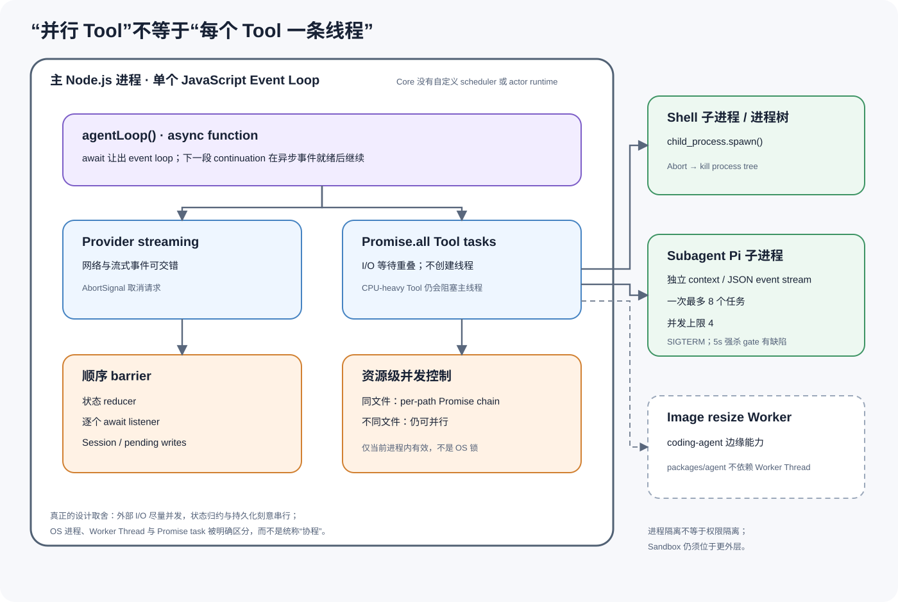

*图 10：Pi 的执行载体。Core 控制流主要运行在单个 Node.js 进程和JavaScript event loop 中；`Promise.all` 重叠 I/O 等待，Shell / Subagent 使用 OS 子进程，Worker Thread 只出现在 coding-agent 的图片处理边缘能力。*

`agentLoop()` 是普通 TypeScript `async function`，没有自定义 scheduler 或 actor runtime。`await` 会把控制权交还给 Node event loop；网络流、异步文件 I/O 和子进程等待可以在这段时间交错推进。它可以被类比为协作式异步任务，但不等于“每个 Tool Call 都是一条线程”。

并行工具路径 [`executeToolCallsParallel()`](https://github.com/earendil-works/pi/blob/13437ca828894f43f973c630d208b488637d8fa9/packages/agent/src/agent-loop.ts#L491-L556) 使用 `Promise.all`。这使多个网络、文件和子进程等待能够重叠，也允许 completion event 按真实完成时间到达；最终 `toolResult` 仍按模型原始调用顺序回填。但如果一个自定义 Tool 在主 JavaScript 线程上做长时间 CPU 计算，它仍会阻塞 event loop，Core 不会自动把它搬到线程池。

执行边界可以精确列成：

| 能力| 运行载体 | 并发方式 | 是否共享主进程内存 | 取消 / 收束|
|---|---|---|---|---|
| Agent Loop | 主 Node.js 进程 / JS 线程 | `async/await` | 是 | `AbortController` |
| Provider streaming | 主 event loop + 网络栈 | 异步 I/O | 是 | `AbortSignal` / 请求取消 |
| 并行Tool | 主进程 Promise tasks | `Promise.all` | 是 | Tool 接收 `AbortSignal` |
| Event listener | 主进程 | 顺序 `await` | 是 | active run settlement |
| Session write | 主进程 | 队列 / 顺序 `await` | 是 | turn boundary flush |
| 同文件 edit/write | 主进程 | per-path Promise chain | 是 | Tool 生命周期|
| Bash | OS 子进程 / 进程树 | 进程级 | 否 | kill process tree |
| Image resize | Worker Thread | 线程级 | 消息 / transfer | terminate Worker |
| Subagent | 独立 Pi 进程 | 有界进程池 | 否 | 发 `SIGTERM`；5 秒强杀 fallback 的 `proc.killed` gate 不可靠 |
| ACP 接入 | pi-acp + Pi RPC 子进程 | 进程 + NDJSON | 否 | ACP cancel → RPC abort |

几个容易混淆的实现点：

- bash tool 使用 [`child_process.spawn()`](https://github.com/earendil-works/pi/blob/13437ca828894f43f973c630d208b488637d8fa9/packages/coding-agent/src/core/tools/bash.ts#L82-L135)，取消或超时最终要落到真实进程树终止；
- [`withFileMutationQueue()`](https://github.com/earendil-works/pi/blob/13437ca828894f43f973c630d208b488637d8fa9/packages/coding-agent/src/core/tools/file-mutation-queue.ts#L28-L60) 只是当前进程内的 per-path Promise chain，不是跨进程 OS 锁；
- [`Agent.processEvents()`](https://github.com/earendil-works/pi/blob/13437ca828894f43f973c630d208b488637d8fa9/packages/agent/src/agent.ts#L520-L574) 与 Harness Session 写入故意顺序等待，以明确状态和持久化顺序；
- `packages/agent` 不使用 `worker_threads`；coding-agent 只在 [`image-resize.ts`](https://github.com/earendil-works/pi/blob/13437ca828894f43f973c630d208b488637d8fa9/packages/coding-agent/src/utils/image-resize.ts#L1-L31) 的 CPU 边缘能力中使用 Worker；
- Subagent 示例为每个子 Agent 启动独立 Pi 进程，共享的是协议而不是 JS 堆。

这里真正精彩的不是“Pi 使用了异步”，而是：外部 I/O 尽量并发，状态归约和持久化刻意串行，资源冲突交给最了解冲突键的 Tool 层，进程 / Worker / Promise task 则被明确区分。

### 18.7 ACP 与 Pi 的关系：是外部适配，不是新的 Agent Loop

这里的 ACP 是 **Agent Client Protocol**：编辑器 / 客户端与完整 coding agent runtime 之间的互操作协议。根据 2026-07-28 复核的[官方仓库](https://github.com/agentclientprotocol/agent-client-protocol)，当前稳定 wire protocol 是 v1；v2 schema 为 `2.0.0-alpha.2`，官方更新仍称其为 Draft。

先把三个经常混淆的“调用协议”分开：

| 名称 | 通信双方 | 解决的问题 |
|---|---|---|
| Tool Call | LLM ↔ Agent Loop | 模型如何表达“调用哪个工具、参数是什么” |
| MCP | Agent / Host ↔ Tool / Context Server | Agent 如何发现和调用外部工具、资源、Prompt |
| ACP | Editor / Client ↔ Coding Agent Runtime | 客户端如何启动、控制、观察并展示完整 Agent |

它们不是替代关系：一个 ACP Client 可以把 MCP server 配置传给 Agent；Agent 内部仍通过 Tool Call 决定是否调用某个 MCP Tool。

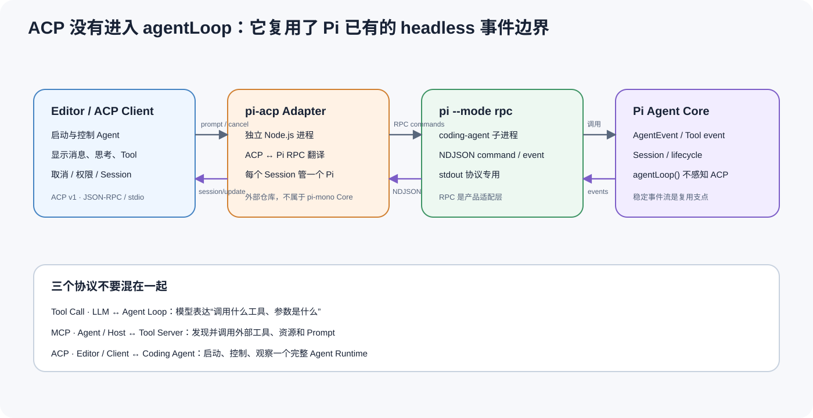

*图 11：Pi 当前的 ACP 接入边界。参考 [ACP 官方架构](https://agentclientprotocol.com/get-started/architecture) 与固定 `pi-acp` 修订 `2f6e3c5` 重绘；Adapter 翻译已有 RPC / AgentEvent，`agentLoop()` 本身不感知 ACP。*

固定的 pi-mono 修订没有原生ACP server；ACP 官方 Registry 列出的是 “pi ACP”，即外部 adapter。本文复核的 `pi-acp` 固定在 [`2f6e3c530819489bd09a84139b0b757df6895556`](https://github.com/svkozak/pi-acp/commit/2f6e3c530819489bd09a84139b0b757df6895556)：

- 它在 stdio 上建立 ACP `AgentSideConnection`：[`src/index.ts`](https://github.com/svkozak/pi-acp/blob/2f6e3c530819489bd09a84139b0b757df6895556/src/index.ts#L24-L53)；
- 每个 Session 启动 `pi --mode rpc --no-themes`：[`src/pi-rpc/process.ts`](https://github.com/svkozak/pi-acp/blob/2f6e3c530819489bd09a84139b0b757df6895556/src/pi-rpc/process.ts#L129-L145)；
- `message_update` 被翻译成 ACP 的 message / thought chunk：[`src/acp/session.ts`](https://github.com/svkozak/pi-acp/blob/2f6e3c530819489bd09a84139b0b757df6895556/src/acp/session.ts#L515-L536)；
- Pi 的 Tool event 被翻译成 ACP `tool_call` / `tool_call_update`：[`src/acp/session.ts`](https://github.com/svkozak/pi-acp/blob/2f6e3c530819489bd09a84139b0b757df6895556/src/acp/session.ts#L539-L707)；
- 只有 `agent_end` 才完成一次 ACP prompt，`turn_end` 不能提前结束：[`src/acp/session.ts`](https://github.com/svkozak/pi-acp/blob/2f6e3c530819489bd09a84139b0b757df6895556/src/acp/session.ts#L820-L855)。

这段适合留在 Agent Core 文章里，因为它证明了稳定 `AgentEvent` 与 headless boundary 的复用价值；ACP 的初始化、能力协商、多 Session、权限回调和客户端兼容性，则属于更外层的系统集成主题。最重要的结论只有一句：

> ACP 依赖 Core 输出稳定事件，但它自身位于 Core 之外的 client/runtime integration boundary。

---

## 19. 为什么这套 Core 显得如此简洁优美

“简洁”不能只凭代码行数判断。Pi 真正做对的是依赖方向和状态边界。

### 19.1 小腰部：所有复杂性最后投影成 `AgentContext`

Provider、Session、Skill、Extension、branch、compaction 最终都必须回答：

```text
本次模型调用的 systemPrompt 是什么？
messages 是什么？
tools 是什么？
```

因为腰部足够窄，应用可以替换 Session storage、Skill loader 或 Provider，而不需要改 `agentLoop()`。

### 19.2 一个事实流：Event 同时服务状态、持久化与展示

Pi 没有：

- 一套内部事件更新状态；
- 一套 callback 更新 UI；
- 一套日志事件写 Session。

`AgentEvent` 是共同事实流，`Agent` reducer、Harness persistence 和TUI/RPC subscriber 都围绕它工作。

### 19.3 一个换挡点：turn boundary

模型、thinking、tools、resources 与 context 的变化，都在下一turn snapshot 统一生效。

这比给每个可变字段设计独立锁和“立即生效”语义更简单，也更可预测。

### 19.4 一个并发原则：执行可并行，语义顺序不漂移

Pi 区分：

- 预检顺序；
- 真实完成顺序；
- transcript 顺序；
- 资源冲突顺序。

前两个在 loop，第三个由 source order 固定，第四个由 Tool 实现补充。并发控制被放在知道足够信息的最小层次。

### 19.5 一个安全原则：策略插槽不伪装成权限边界

Hook 提供policy insertion point；OS/container 提供enforcement。Core 不把两者混叫“permission system”。

### 19.6 可选复杂性不强迫进入热路径

只需要纯循环时可以直接用 `runAgentLoop()`；需要状态时用 `Agent`；需要Session/Skill/Compaction 时用 `AgentHarness`；需要本地 coding product 才进入 coding-agent。

这是一种真正的渐进复杂度：能力逐层增加，而不是所有用户都先实例化一个全能容器。

### 19.7 没有第二套隐藏调度器

Steering、follow-up、parallel tools、pending writes 都是普通数组、Map、Set、Promise 与 `while`。调试时可以沿语言原生控制流走完，不必先学一个框架私有 scheduler。

### 19.8 “快”的严格证据边界

从结构上可以确认：

- provider 原生流式；
- 独立工具默认并行；
- Skill 正文按需加载；
- coding-agent 默认 Tool 对输出做了上限；Core 的 `AgentToolResult` 合约本身不限制自定义 Tool 输出；
- Core 热路径没有 workflow interpreter；
- TUI 不在 agent-core 依赖路径；
- turn snapshot 避免同一请求中反复解析资源。

本文没有做相同模型、相同网络、相同任务下的跨框架 benchmark。因此只能说 Pi 的结构避免了明显框架开销，不能把“代码简洁”直接宣传成“任何 workload 性能第一”。

---

## 20. 工程规模与运行验证

### 20.1 仓库不是小型概念原型

2026-07-20 快照：

| 指标 | 数值|
|---|---:|
| GitHub stars | 73,198 |
| forks | 9,038 |
| open issues（包含 PR） | 74 |
| commits | 5,007 |
| author identities | 281 |
| tags | 303 |
| tracked files | 1,066 |
| counted text lines | 262,389 |

Popularity 只能说明关注度，不能证明架构正确；真正有意义的是核心 package 的实现和测试分布。

### 20.2 核心 package 规模

| Package | 源码TS 文件 | 源码行数 | 测试文件 | 测试行数 |
|---|---:|---:|---:|---:|
| `packages/agent` | 24 | 8,168 | 19 | 5,630 |
| `packages/ai` | 164 | 23,807 | 109 | 26,328 |
| `packages/coding-agent` | 175 | 54,703 | 184 | 41,079 |
| `packages/orchestrator` | 13 | 1,982 | 0 | 0 |
| `packages/tui` | 28 | 12,181 | 33 | 13,637 |

`packages/agent` 的代码量相对克制，测试/源码比例也不低；大量复杂性确实位于 provider 和具体应用，而不是 loop 本身。

### 20.3 构建与检查

主构建与检查在 Node `v22.23.1`、固定 SHA 下执行；第二轮非 E2E 全量测试和附录 C 的定向运行又在 Node `v24.14.0` 上复核：

| 检查 | 结果 | 分类 |
|---|---|---|
| `npm ci --ignore-scripts --no-audit --no-fund` | 通过 | 安装 351 packages |
| `npm run build` | 通过 | 会联网刷新模型目录 |
| `npm run check` | 通过 | Biome、依赖锁、TS imports、shrinkwrap、tsgo、browser smoke |
| `npm audit --omit=dev --json` | 0 reported vulnerabilities | 快照结果，不代表未来 |

安装时出现 `@earendil-works/gondolin@0.12.0` 声明 Node `>=23.6` 的 engine warning，而上游 CI 使用 Node 22。当前 build/check 仍通过，但这是依赖/CI 版本约束需要继续观察的信号。

### 20.4 测试结果

| Suite | 结果 | 解释 |
|---|---|---|
| `packages/agent` | 15 files / 179 tests passed | Core 全部通过 |
| `packages/ai` | 78 files passed、25 skipped；566 passed、784 skipped | 大量 provider/live 条件测试跳过 |
| `packages/coding-agent` | 170 files passed、6 skipped；1,583 passed、47 skipped | 补齐 `tui` 与 `coding-agent` 构建制品后全部非 E2E 测试通过 |
| `packages/tui` | Node test dot reporter 全部通过 | 作为 workspace `./test.sh` 的一部分执行；不是本文叙事重点 |
| 定向 headless tests | 9 files passed、3 skipped；92 passed、30 skipped | RPC、JSONL、Session、branch、compaction queue、Extension、Skill |
| Tool Call 证据测试 | 1 file / 1 test passed | faux provider，无网络 API、密钥或付费 token |

第一次直接进入全量测试时，coding-agent 因缺少 `packages/tui/dist/index.js` 出现 84 个导入失败；这不是产品断言失败，而是 workspace build 前置条件未满足。补建 `packages/tui` 与 `packages/coding-agent` 后，按仓库规定的 `./test.sh` 重跑，非 E2E suites 通过。把“环境/构建前置失败”和“产品行为失败”分开，是源码审计报告必须保留的证据分类。

### 20.5 CI 与供应链信号

根 README 说明：

- 依赖使用精确版本；
- 提交 npm shrinkwrap；
- install 忽略 scripts；
- 检查 npm audit signatures。

[`README.md` supply-chain 说明](https://github.com/earendil-works/pi/blob/13437ca828894f43f973c630d208b488637d8fa9/README.md#L61-L73)

CI 使用 Node 22，安装系统依赖后执行install/build/check/test；另有定时 npm audit workflow。

### 20.6 构建不是完全离线可复现

本次 `npm run build` 实际请求models.dev、NVIDIA、OpenRouter、Vercel 等来源生成模型 catalogs，并修改生成文件。

Git SHA 固定并不自动保证生成 catalog 固定。若要严格复现，需要固定远程输入或把生成 artifacts 当受审制品。

### 20.7 HEAD 与最近 release 标签差异不小

HEAD 比 `v0.80.10` 多 40 commits；仅 `packages/agent`、`packages/ai`、`packages/coding-agent` 的 tag→HEAD diff 就涉及 136 个文件、7,687 行新增、19,547 行删除。

因此评审和升级应记录完整 SHA/制品digest，不能只记录 package.json 中仍为 `0.80.10` 的字符串。

---

## 21. 非显然的限制与架构代价

Pi 的 Core 很好，但“简洁”不是没有代价。

### 21.1 Event barrier 会传播慢订阅者延迟

**事实**：listener 顺序 await。

**收益**：状态、持久化、策略有强顺序。

**代价**：慢 subscriber 直接阻塞 loop；某个遥测服务抖动也可能拖慢 Agent。

### 21.2 并发模式粒度只有工具级

**事实**：全局/单 Tool 只有 parallel 或 sequential。

**收益**：模型简单、行为可解释。

**代价**：无法由 Core 表达 `file:A` 与 `file:B` 可并行、同文件串行；需要Tool 自己实现 resource lock。

### 21.3 Per-call Hook 不能提供批次事务

**事实**：没有 batch-level authorization hook。

**收益**：preflight 简单，单个调用可以独立 block。

**代价**：多个 tool calls 的 all-or-nothing 语义必须封装成一个 Tool 或在更外层实现。

### 21.4 JSONL 的 crash consistency 有限

**事实**：append-first 再更新内存，但没有显示 fsync、lock、transaction。

**收益**：实现小、可读、append-only、便于本地检查。

**代价**：torn tail、跨进程写、磁盘 durability 不等同数据库。

### 21.5 新旧 Session 路径并存

**事实**：`AgentHarness` 新 Session 与 coding-agent 旧 `SessionManager` 的错误恢复策略不同。

**风险**：RPC/TUI 与直接 Harness 使用者可能观察到不同persistence behavior。

### 21.6 Compaction 依赖有损摘要与启发式 token

**事实**：chars/4 等估算；summary 由模型产生。

**收益**：跨 provider、低成本、实现通用。

**代价**：可能过早/过晚压缩，也可能遗漏细约束。

### 21.7 Extension 是完全信任代码

**事实**：jiti 在宿主加载 TS/JS；project trust 不是 sandbox。

**收益**：扩展能力极强，开发简单。

**代价**：不能安全加载不可信 Extension；任意 host API 都可能绕过 Tool Hook。

### 21.8 默认工具不是路径沙箱

**事实**：允许绝对路径，shell 合并宿主环境。

**收益**：本地 coding-agent 不受人为目录限制。

**代价**：运行不可信仓库/提示时必须依赖外部隔离。

### 21.9 AgentHarness 的公开文档仍在追赶代码

**事实**：Harness 已公开导出并有测试，但 README 对其全部 lifecycle/session 语义覆盖有限。

**代价**：升级时需要读 tests 与 source，不能只依赖高层文档。

### 21.10 没有通用性能冠军证据

**事实**：本文没有跨框架 benchmark。

**边界**：可以赞赏它的热路径结构，不能把结构优雅等同于所有任务绝对最快。

### 21.11 Subagent 的强制取消 fallback 存在语义缺口

**事实**：示例先发 `SIGTERM`，再用 `if (!proc.killed)` 决定是否在 5 秒后发 `SIGKILL`。

**问题**：Node 的 `proc.killed` 代表“信号已成功发送”，不是“子进程已经退出”。因此忽略 `SIGTERM` 的子进程可能越过预期的强杀路径。

**工程启示**：审查取消逻辑时，必须分别验证“请求了取消、发出了信号、目标已经退出、资源已经回收”四件事。API 字段名不能代替生命周期证据。

---

## 22. 工程设计总账：亮点、收益与代价

前文逐段解释了实现，这里把整个工程最值得复用的设计收束成一张总表。判断依据均来自本文已链接的固定源码。

| 设计 | 它解决的问题 | 精彩之处 | 代价 / 边界|
|---|---|---|---|
| 双层`while` 的 Agent Loop | Tool、steering、follow-up 如何统一收束| 控制流完全显式，没有隐藏 workflow scheduler | 复杂DAG 需要外部编排 |
| Provider 归一化 Message | 不同模型协议形状不同| Loop 只理解统一ToolCall / ToolResult / StopReason | `packages/ai` 适配规模很大 |
| Tool prepare / execute / finalize | 校验、Hook、执行与结果修补容易混乱 | 每一阶段有独立错误语义；截断调用 fail closed | batch transaction 不在 Core |
| 并发执行、确定回填 | 工具需要低延迟，transcript 又不能漂移 | completion event 与模型语义顺序分离 | CPU Tool 仍可能阻塞主线程 |
| awaited event barrier | 状态、持久化、UI 容易竞态| `agent_end` 与真正 idle 有明确边界| 慢 listener 传播延迟|
| turn snapshot | 运行中模型、Tool、Skill 会变化 | 动态配置只在 turn boundary 换挡 | 变化不是任意时刻立即生效 |
| Session tree + context projection | 分支、压缩、续写容易污染历史 | 物理历史、当前 leaf、模型视图三者解耦 | 不是进程 checkpoint；JSONL 单写者 |
| Skill metadata 常驻、正文 late binding | Skill 多时 prompt 会膨胀| 发现与正文读取分离；正文可热读 | metadata 变化仍需reload |
| 资源级 Promise queue | 并行工具可能覆盖同一文件 | 冲突键放在最了解领域的 Tool 层| 只在单进程内有效 |
| Hook 与 Sandbox 分层| 扩展策略容易被误称为安全 | policy insertion 与 OS enforcement 不混淆 | 生产必须另配容器 / VM |
| Subagent 作为普通 Tool | 多 Agent 容易侵入 Loop | 进程编排不需要改一行核心循环 | 示例不是生产调度器；当前强杀 fallback 也需修正 |
| RPC / ACP Adapter | UI、IDE 与 Agent 容易强耦合 | 稳定事件流可在外部翻译协议 | Adapter 要处理兼容与能力缺口 |

一句话概括：

> Pi 把变化快、规模大、需要策略的复杂性放在 Provider、Harness、Tool、Session 和 Adapter 边界，把执行热路径压缩成一个可以直接读懂、测试和替换的协议循环。

### 22.1 为什么说它是典范，而不是唯一答案

“典范”指的是 **Agent 执行内核的边界和时序值得学习**，不是宣称 Pi 在所有形态下都占优：

| 系统形态 | 更擅长的问题 | 相对 Pi Core 的取舍 |
|---|---|---|
| 显式工作流图运行时 | DAG、节点级重试、可视化审批、跨步骤 checkpoint | 控制面更强，但简单 Tool 往返要承担图解释器与状态机成本 |
| Actor / 分布式任务运行时 | 多租户调度、故障域、跨机器监督与资源预算 | 隔离和调度更强，但需要消息拓扑、监督树或集群语义 |
| Pi Agent Core | headless 嵌入、模型—工具闭环、清晰事件流、应用自定义控制面 | 热路径小而透明，但 DAG、强隔离、全局预算必须由外层系统补足 |

所以本文的判断标准不是“功能清单最多”，而是：当问题只要求一个可靠、可嵌入的模型—工具执行循环时，Pi 用很少的机制保住了最关键的不变量。若主要问题已经变成跨机器工作流或多租户资源治理，就应在外层引入更合适的运行时，而不是继续把职责塞回 `agentLoop()`。

---

## 23. 核心代码阅读索引

以下链接全部固定到 `13437ca828894f43f973c630d208b488637d8fa9`。

### 23.1 最小必读路径

| 阅读目标 | 固定源码| 为什么重要|
|---|---|---|
| 模型消息协议 | [`packages/ai/src/types.ts`](https://github.com/earendil-works/pi/blob/13437ca828894f43f973c630d208b488637d8fa9/packages/ai/src/types.ts#L351-L419) | ToolCall、AssistantMessage、ToolResult 的精确形状 |
| Core 类型 | [`packages/agent/src/types.ts`](https://github.com/earendil-works/pi/blob/13437ca828894f43f973c630d208b488637d8fa9/packages/agent/src/types.ts#L17-L430) | Context、Tool、Hook、State、Event 的共同语义 |
| 双层循环 | [`agent-loop.ts`](https://github.com/earendil-works/pi/blob/13437ca828894f43f973c630d208b488637d8fa9/packages/agent/src/agent-loop.ts#L155-L275) | Agent 的最小控制流|
| 流式消息 | [`streamAssistantResponse()`](https://github.com/earendil-works/pi/blob/13437ca828894f43f973c630d208b488637d8fa9/packages/agent/src/agent-loop.ts#L281-L373) | Provider event 如何成为状态消息 |
| 工具执行| [`executeToolCalls()`](https://github.com/earendil-works/pi/blob/13437ca828894f43f973c630d208b488637d8fa9/packages/agent/src/agent-loop.ts#L376-L586) | 截断、并发、顺序、terminate |
| Tool 预检| [`prepare/execute/finalize`](https://github.com/earendil-works/pi/blob/13437ca828894f43f973c630d208b488637d8fa9/packages/agent/src/agent-loop.ts#L588-L755) | 参数与 Hook 生命周期|
| 状态包装 | [`Agent`](https://github.com/earendil-works/pi/blob/13437ca828894f43f973c630d208b488637d8fa9/packages/agent/src/agent.ts#L165-L574) | 单 active run、reducer、awaited listener |
| 应用运行时 | [`AgentHarness`](https://github.com/earendil-works/pi/blob/13437ca828894f43f973c630d208b488637d8fa9/packages/agent/src/harness/agent-harness.ts#L164-L953) | Session、snapshot、Hook、phase、queue |

### 23.2 Session / Skill / Compaction

| 阅读目标 | 固定源码| 为什么重要|
|---|---|---|
| Session 投影 | [`session.ts`](https://github.com/earendil-works/pi/blob/13437ca828894f43f973c630d208b488637d8fa9/packages/agent/src/harness/session/session.ts#L37-L323) | tree → current context |
| JSONL storage | [`jsonl-storage.ts`](https://github.com/earendil-works/pi/blob/13437ca828894f43f973c630d208b488637d8fa9/packages/agent/src/harness/session/jsonl-storage.ts#L8-L308) | header、append、leaf、path |
| Session repo | [`jsonl-repo.ts`](https://github.com/earendil-works/pi/blob/13437ca828894f43f973c630d208b488637d8fa9/packages/agent/src/harness/session/jsonl-repo.ts#L34-L179) | 多 Session 与 fork |
| Skill loader | [`harness/skills.ts`](https://github.com/earendil-works/pi/blob/13437ca828894f43f973c630d208b488637d8fa9/packages/agent/src/harness/skills.ts#L37-L230) | 发现、校验、调用格式 |
| Skill index | [`system-prompt.ts`](https://github.com/earendil-works/pi/blob/13437ca828894f43f973c630d208b488637d8fa9/packages/agent/src/harness/system-prompt.ts#L3-L24) | 渐进披露的 metadata 层|
| Skill 正文晚绑定 | [`_expandSkillCommand()`](https://github.com/earendil-works/pi/blob/13437ca828894f43f973c630d208b488637d8fa9/packages/coding-agent/src/core/agent-session.ts#L1275-L1303) | 每次显式调用重新读取正文 |
| 资源显式重载 | [`resourceLoader.reload()`](https://github.com/earendil-works/pi/blob/13437ca828894f43f973c630d208b488637d8fa9/packages/coding-agent/src/core/resource-loader.ts#L338-L421) | metadata、路径和Extension 资源刷新 |
| Compaction | [`compaction.ts`](https://github.com/earendil-works/pi/blob/13437ca828894f43f973c630d208b488637d8fa9/packages/agent/src/harness/compaction/compaction.ts#L108-L350) | token、threshold、cut point、summary |
| Summary 工作状态| [`compaction/utils.ts`](https://github.com/earendil-works/pi/blob/13437ca828894f43f973c630d208b488637d8fa9/packages/agent/src/harness/compaction/utils.ts#L23-L131) | read/modified files 与 tool result 截断 |

### 23.3 Provider / Extension / 应用边界

| 阅读目标 | 固定源码| 为什么重要|
|---|---|---|
| Models/Provider | [`packages/ai/src/models.ts`](https://github.com/earendil-works/pi/blob/13437ca828894f43f973c630d208b488637d8fa9/packages/ai/src/models.ts#L66-L620) | 模型集合、auth、dispatch |
| Extension loader | [`loader.ts`](https://github.com/earendil-works/pi/blob/13437ca828894f43f973c630d208b488637d8fa9/packages/coding-agent/src/core/extensions/loader.ts#L174-L427) | 动态宿主代码与 runtime invalidation |
| Extension runner | [`runner.ts`](https://github.com/earendil-works/pi/blob/13437ca828894f43f973c630d208b488637d8fa9/packages/coding-agent/src/core/extensions/runner.ts#L860-L931) | tool hook chain 与错误语义 |
| 默认工具 | [`sdk.ts`](https://github.com/earendil-works/pi/blob/13437ca828894f43f973c630d208b488637d8fa9/packages/coding-agent/src/core/sdk.ts#L240-L246) | coding-agent 应用选择 |
| Node 环境 | [`nodejs.ts`](https://github.com/earendil-works/pi/blob/13437ca828894f43f973c630d208b488637d8fa9/packages/agent/src/harness/env/nodejs.ts#L47-L430) | 文件、shell 与宿主权限 |
| RPC types | [`rpc-types.ts`](https://github.com/earendil-works/pi/blob/13437ca828894f43f973c630d208b488637d8fa9/packages/coding-agent/src/modes/rpc/rpc-types.ts#L1-L260) | headless 命令面 |
| 文件 mutation queue | [`file-mutation-queue.ts`](https://github.com/earendil-works/pi/blob/13437ca828894f43f973c630d208b488637d8fa9/packages/coding-agent/src/core/tools/file-mutation-queue.ts#L28-L60) | 单进程资源级并发控制 |
| 图片 Worker | [`image-resize.ts`](https://github.com/earendil-works/pi/blob/13437ca828894f43f973c630d208b488637d8fa9/packages/coding-agent/src/utils/image-resize.ts#L1-L31) | Core 与 CPU 边缘能力的线程边界|
| Subagent 示例 | [`subagent/index.ts`](https://github.com/earendil-works/pi/blob/13437ca828894f43f973c630d208b488637d8fa9/packages/coding-agent/examples/extensions/subagent/index.ts#L1-L698) | Core 之外的组合模式 |
| ACP 外部适配 | [`pi-acp session.ts`](https://github.com/svkozak/pi-acp/blob/2f6e3c530819489bd09a84139b0b757df6895556/src/acp/session.ts#L515-L855) | Pi RPC / AgentEvent 如何翻译成 ACP |

---

## 24. 如果把它作为我们的 Agent Core，只需要记住什么

这一节只谈采用边界，不再展开上层系统设计。

### 24.1 应原样保留的 Core 不变量

- `AgentContext` 的小腰部；
- 双层loop 的 steering/follow-up 语义；
- truncated tool batch 全拒绝；
- 并行执行、source-order result；
- 同一Agent 一个 active run；
- event 先归约、listener 按顺序 await；
- 配置只在 turn boundary 换挡；
- Session 物理历史与模型逻辑视图分开；
- Skill metadata/content 分层；
- Sandbox 不伪装成 Hook。

### 24.2 不要把 coding-agent 外围误当成必须继承的 Core

- TUI 不是必须；
- 默认四工具不是必须；
- 旧 `AgentSession`/SessionManager 不是唯一持久化选择；
- Extension loader 不是使用 Agent Core 的前提；
- Subagent 示例不是强制调度模型；
- experimental orchestrator 不是正式核心 API。

### 24.3 对 Python 封装只做一个简短结论

我们平时从 Python 系统调用时，最值得封装的是 `AgentHarness` 的会话级语义，而不是 TUI。可以先用 coding-agent RPC 验证headless 行为；长期若需要更干净的边界，再用一个很薄的 Node bridge 暴露 Harness event、prompt/steer/abort 与 Tool 调用即可。

但无论外层是什么语言，**不要在 Python 里重写 `agentLoop()` 的并发、事件与工具顺序**；那正是 Pi 已经写得最好的部分。上层只需要拥有任务调度、业务持久化和真正的 Sandbox，Core 仍然保持Pi 的原貌。

---

## 25. 最终评价

`pi-agent` 最值得被当作典范的地方，是它准确回答了“Agent Core 到底应该负责到哪里”。

它负责：

- 把 model stream 变成一致 assistant message；
- 把 tool call 变成经过校验、可取消、可观察的执行；
- 把工具结果重新放回模型上下文；
- 把 steering、follow-up 和turn boundary 写成显式循环；
- 把事件折叠成稳定状态；
- 把 Session、Skill、Hook、Compaction 接到同一loop；
- 把分支历史与当前模型视图分开。

它刻意不负责：

- 一个具体 TUI 应该长什么样；
- 所有 Agent 都必须使用哪些工具；
- Subagent 全局调度；
- 不可信代码隔离；
- 多租户权限和资源预算；
- 把应用所有资源都收进一个框架容器。

正因为边界准确，Pi 才能做到既简洁又不简陋：

```text
pi-ai        统一模型世界
agentLoop    保证一次 Agent 执行正确
Agent        保证状态与事件顺序正确
AgentHarness 保证一次会话运行完整
```

Skill、Tool、Hook、Session、Compaction 都不是额外堆上去的功能清单，而是沿这四层自然找到自己的位置。Subagent 和Sandbox 也因为没有被强塞进Core，反而拥有更正确的实现空间。

这就是 `pi-agent` 最值得学习的地方：**它没有试图定义整个 Agent 世界，只把最难、最通用、最容易出现时序错误的那一小块写得非常干净。**

---

## 参考资料与上游问题

### 一手源码与文档

- [`earendil-works/pi` 固定提交](https://github.com/earendil-works/pi/commit/13437ca828894f43f973c630d208b488637d8fa9)
- [`packages/agent`](https://github.com/earendil-works/pi/tree/13437ca828894f43f973c630d208b488637d8fa9/packages/agent)
- [`packages/ai`](https://github.com/earendil-works/pi/tree/13437ca828894f43f973c630d208b488637d8fa9/packages/ai)
- [`packages/coding-agent`](https://github.com/earendil-works/pi/tree/13437ca828894f43f973c630d208b488637d8fa9/packages/coding-agent)
- [`SECURITY.md`](https://github.com/earendil-works/pi/blob/13437ca828894f43f973c630d208b488637d8fa9/SECURITY.md)
- [ACP 官方架构](https://agentclientprotocol.com/get-started/architecture)
- [ACP v1 固定 schema](https://github.com/agentclientprotocol/agent-client-protocol/blob/3fcb97d7e686848d2befc103a8ea05c1163e9a1e/schema/v1/schema.json)
- [`pi-acp` 固定提交](https://github.com/svkozak/pi-acp/commit/2f6e3c530819489bd09a84139b0b757df6895556)

### 关联问题

- [#1717 Async event handlers corrupt session ordering](https://github.com/earendil-works/pi/issues/1717) — awaited listener 的历史背景。
- [#2327 Parallel same-file edits overwrite each other](https://github.com/earendil-works/pi/issues/2327) — per-file mutation queue 背景。
- [#2388 RPC stdout corruption](https://github.com/earendil-works/pi/issues/2388) — output guard 背景。
- [#6242 Session ID / concurrent write discussion](https://github.com/earendil-works/pi/issues/6242) — Session 单写者与 append 顺序。
- [#6298 Subagent extension hardening](https://github.com/earendil-works/pi/issues/6298) — 示例与生产调度器边界。
- [#6713 RPC authentication](https://github.com/earendil-works/pi/issues/6713) — 本地 stdio 协议边界。
- [#6816 Batch-level tool hooks](https://github.com/earendil-works/pi/issues/6816) — per-call Hook 的能力边界。

## 附录 A：验证命令摘要

在固定 SHA 下执行：

```bash
git rev-parse HEAD
git describe --tags --abbrev=0

npm ci --ignore-scripts --no-audit --no-fund
npm run build
npm run check
./test.sh
npm audit --omit=dev --json
```

这里使用 `./test.sh` 而不是直接运行全量 Vitest，因为仓库 `AGENTS.md` 明确要求：无 API key 的非 E2E tests 由该脚本统一入口执行。

联网 build 在一次性审阅 clone 中留下 17 个模型 catalog 文件、`+250/-106` 行生成差异。没有清理或伪装这组变化：它们未被用于源码判断，也没有提交；它们被保留为“远端移动输入会破坏固定 SHA 生成复现”的现场证据。

## 附录 B：本文没有证明什么

- 没有证明 Pi 在所有 Agent benchmark 中速度第一。
- 没有运行真实付费 provider 的全覆盖测试。
- 没有把 `main` HEAD 等同于已发布 npm `0.80.10`。
- 没有把首次缺少 workspace 构建制品造成的 84 个导入失败写成产品缺陷；补建后按同一入口重跑通过。
- 没有把 Hook、project trust 或 Extension 说成 Sandbox。
- 没有把 Subagent 示例或 experimental orchestrator 说成 Core 内建能力。
- 没有把 TUI 当作 Agent Core 的主线。
- 没有把 2026-07-28 复核到的 ACP 生态状态倒推成 2026-02-02 已经存在的能力。

## 附录 C：Tool Call 运行证据如何复现

图 3 不是手写时序图，而是固定源码上的一次真实 Agent 运行。为了让证据链可复核，测试使用仓库自带 faux provider，不访问真实模型 API；fake `read` Tool 只返回固定字符串，没有文件或网络副作用。

一次性测试文件放在 `packages/agent/test/runtime-trace.blog.test.ts`，关键的完整可执行主体如下：

```ts
import {
  type AssistantMessage,
  fauxAssistantMessage,
  fauxText,
  fauxToolCall,
  registerFauxProvider,
} from "@earendil-works/pi-ai/compat";
import { type Static, Type } from "typebox";
import { afterEach, describe, expect, it } from "vitest";
import { Agent, type AgentEvent, type AgentTool } from "../src/index.ts";

const registrations: Array<ReturnType<typeof registerFauxProvider>> = [];
const readSchema = Type.Object({ path: Type.String() });
const readTool: AgentTool<typeof readSchema, { path: string }> = {
  label: "Read",
  name: "read",
  description: "Read one file",
  parameters: readSchema,
  execute: async (_id: string, args: Static<typeof readSchema>) => ({
    content: [{ type: "text" as const, text: "# Pi\nA minimal coding agent core." }],
    details: { path: args.path },
  }),
};

function assistantText(message: AssistantMessage): string {
  return message.content
    .filter((block) => block.type === "text")
    .map((block) => block.text)
    .join("\n");
}

function normalize(event: AgentEvent): Record<string, unknown> | undefined {
  if (event.type === "message_end") {
    const message = event.message;
    if (message.role === "user") {
      return { event: event.type, role: message.role, content: message.content };
    }
    if (message.role === "assistant") {
      return {
        event: event.type,
        role: message.role,
        text: assistantText(message),
        toolCall: message.content.find((block) => block.type === "toolCall"),
        stopReason: message.stopReason,
      };
    }
    if (message.role === "toolResult") {
      return {
        event: event.type,
        role: message.role,
        toolCallId: message.toolCallId,
        toolName: message.toolName,
        content: message.content,
        isError: message.isError,
      };
    }
  }
  if (event.type === "tool_execution_start") {
    return {
      event: event.type,
      toolCallId: event.toolCallId,
      toolName: event.toolName,
      args: event.args,
    };
  }
  if (event.type === "tool_execution_end") {
    return {
      event: event.type,
      toolCallId: event.toolCallId,
      toolName: event.toolName,
      isError: event.isError,
    };
  }
  if (event.type === "turn_end") {
    return { event: event.type, toolResults: event.toolResults.length };
  }
  if (event.type === "agent_end") {
    return { event: event.type, messages: event.messages.length };
  }
  return undefined;
}

afterEach(() => {
  while (registrations.length > 0) registrations.pop()?.unregister();
});

describe("blog runtime trace", () => {
  it("records one Tool Call round trip without a network provider", async () => {
    const faux = registerFauxProvider();
    registrations.push(faux);
    faux.setResponses([
      fauxAssistantMessage(
        [
          fauxText("我先读取 README。"),
          fauxToolCall("read", { path: "README.md" }, { id: "call_01" }),
        ],
        { stopReason: "toolUse" },
      ),
      fauxAssistantMessage("README 说明 Pi 是一个极简 Agent Core。"),
    ]);

    const agent = new Agent({
      initialState: {
        systemPrompt: "Answer from the supplied Tool result.",
        model: faux.getModel(),
        thinkingLevel: "off",
        tools: [readTool],
      },
    });
    const events: Array<Record<string, unknown>> = [];
    agent.subscribe((event) => {
      const row = normalize(event);
      if (row) events.push(row);
    });

    await agent.prompt("README 里如何描述 Pi？");
    console.log("TRACE_BEGIN");
    for (const event of events) console.log(JSON.stringify(event));
    console.log("TRACE_END");

    expect(agent.state.messages.map((message) => message.role)).toEqual([
      "user",
      "assistant",
      "toolResult",
      "assistant",
    ]);
  });
});
```

在 `packages/agent` 下实际执行：

```bash
node node_modules/vitest/dist/cli.js \
  --run test/runtime-trace.blog.test.ts \
  --reporter=verbose \
  --disableConsoleIntercept
```

测试在 Node `v24.14.0` 上用 22 ms 完成，`TRACE_BEGIN` 与 `TRACE_END` 之间的九条规范化事件是：

```jsonl
{"event":"message_end","role":"user","content":[{"type":"text","text":"README 里如何描述 Pi？"}]}
{"event":"message_end","role":"assistant","text":"我先读取 README。","toolCall":{"type":"toolCall","id":"call_01","name":"read","arguments":{"path":"README.md"}},"stopReason":"toolUse"}
{"event":"tool_execution_start","toolCallId":"call_01","toolName":"read","args":{"path":"README.md"}}
{"event":"tool_execution_end","toolCallId":"call_01","toolName":"read","isError":false}
{"event":"message_end","role":"toolResult","toolCallId":"call_01","toolName":"read","content":[{"type":"text","text":"# Pi\nA minimal coding agent core."}],"isError":false}
{"event":"turn_end","toolResults":1}
{"event":"message_end","role":"assistant","text":"README 说明 Pi 是一个极简 Agent Core。","stopReason":"stop"}
{"event":"turn_end","toolResults":0}
{"event":"agent_end","messages":4}
```

截图只把这组机器输出排成更适合阅读的纵向布局，并去掉时间与 usage；消息角色、Tool Call 参数、配对 ID、停止原因和事件顺序都保持不变。测试文件在取证后从一次性 clone 删除，没有修改上游仓库。
